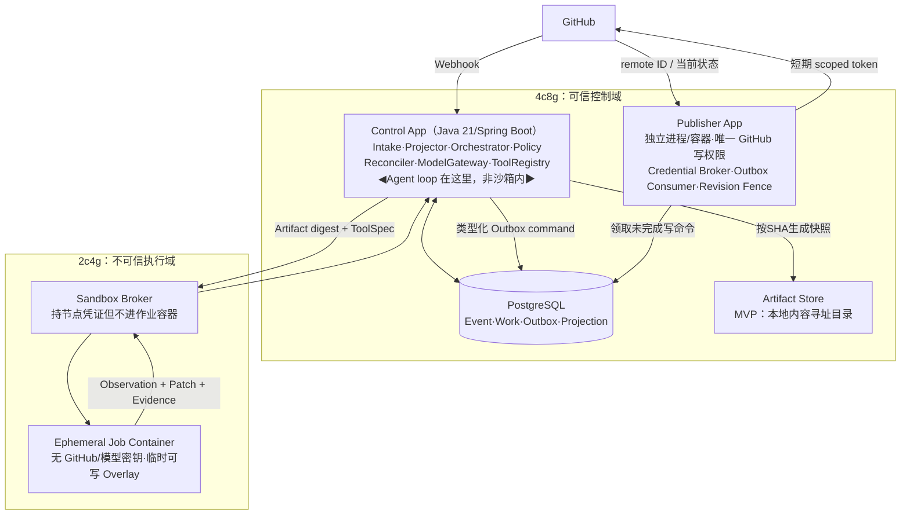
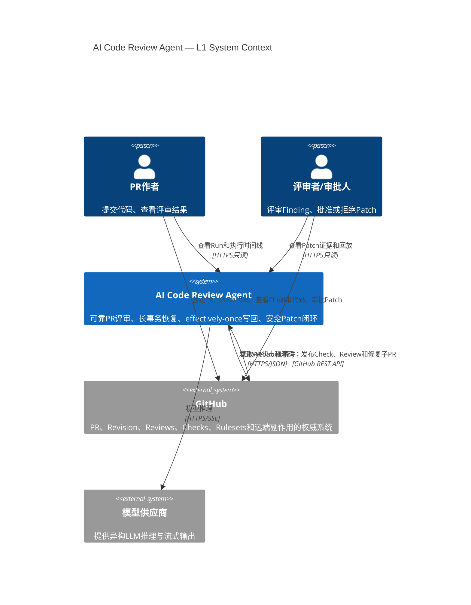
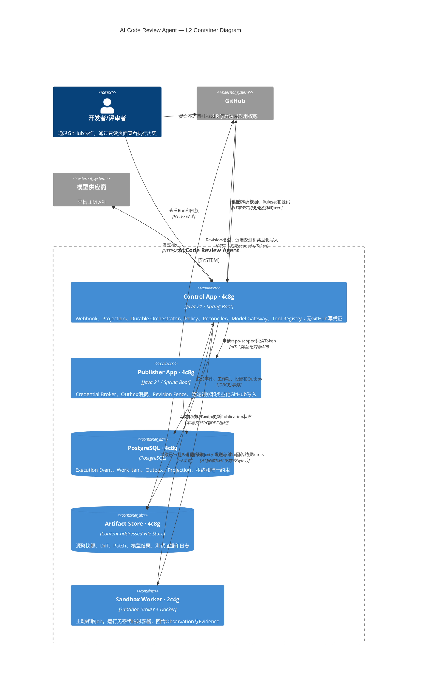

# AI Code Review Agent —— 架构冻结文档 v2

> **文档性质**：阶段 0（适应度函数）+ 阶段 1（战略设计）+ 阶段 2（C4 L1/L2）的正式冻结基线。
> **冻结范围**：核心论点、适应度函数 F1–F9、限界上下文、双权威模型、**B1–B27 冻结项**、六个硬决策 D1–D6、部署拓扑、Outbox 状态机、演进阶梯 M0–M9 / R0–R7、技术选型、ADR 清单（ADR-001~017）、**C4 L1/L2 冻结版、三层信任边界、Capability 传输语义、AFT-01~08 架构适应度套件**。
> **冻结日期**：2026-08-30（调研口径截至 2026-08-29）
> **下一阶段**：阶段 2 续（Publisher App L3 组件图 + Outbox 八态崩溃恢复时序图），再 Control App L3。
> **修改成本提示**：本文档为"锁架构"基线。任何对 B1–B27 的改动都应走显式的 ADR 变更流程，因为下游 C4 图和代码结构都挂在这些条目上。
> **版本变更（v1→v2）**：新增第 14–18 节（C4 L1/L2 冻结版、三层信任边界、Capability 传输、AFT 套件、B18–B27、ADR-016/017）；B19 号位作废（原"七条 ArchUnit"并入 B24）。

---

## 0. 一句话定位与差异化

**系统是什么**：一个基于 GitHub App 的 AI 代码评审 Agent。接住 PR/MR 事件，在零密钥隔离沙箱里做只读评审，产出行级 Finding；可选地提议修复补丁，补丁必须绑定审批对象、在隔离沙箱验证通过后，由唯一持写权限的控制面创建"替代修复子 PR"。

**替代的笨办法**：不是"没有 code review"，而是"人肉从头看 diff + 收到 AI 建议后还要自己手动应用、跑 lint/test 验证"这个耗时且不可靠的环节。

**核心差异化（这是项目的命根子，一切设计服务于此）**：

> 把交易系统的可靠性基因带进 Agent Runtime——**不可变输入、追加式执行账本、effectively-once 副作用、审批绑定精确 Patch hash、状态对账、可回放但绝不重复写 GitHub**。

**贯穿全程的架构判断**：本系统本质是把三个已被验证的范式叠加——
1. **控制面 / 数据面分离**（来自 OpenHands：控制面=编排决策，数据面=实际执行）；
2. **事件溯源**（来自 OpenHands EventStream：真相是不可变日志，状态是日志的折叠）；
3. **安全信任边界**（"写权限"与"不可信执行"被一条缝彻底切开）。

这不是发明，是把金融交易系统里成熟的东西搬到 Agent Runtime——这是底气，也是所有适应度函数要守住的核心。

---

## 1. 阶段 0：适应度函数（架构成功的可衡量标准）

适应度函数分两类。这个分类直接决定演进时哪些能力"day 0 必须有"、哪些"可随压力分级长大"。

### 1.A 结构性 / 安全性不变量（骨架里必须从 day 0 就有，事后加不进来）

#### F1 —— Token / 信任隔离（拆成三级，B2）

绝不能把这三种不同强度的隔离混为一谈：

| 不变量 | 从哪一阶段成立 | 具体含义 | 如何证明 |
|---|---|---|---|
| **F1-A 能力边界** | M0 | Runtime 接口没有 `comment/push/createPR` 能力；只能输出 Finding、PatchProposal、Evidence | ArchUnit 依赖测试；Runtime package 无 Publisher SDK 依赖 |
| **F1-B 凭证进程边界** | M0 | GitHub App 私钥与写 Token 只存在于独立 Publisher 进程，不在 Control App 的 JVM 中 | 分别检查两个进程/容器的环境变量、挂载文件、容器 Secret |
| **F1-C 不可信执行物理边界** | M4 | 不可信 PR 代码只在 2c4g 的临时容器运行；Job 容器无 GitHub Token、无模型 Key、无节点凭证 | 沙箱内 `env`、文件系统、网络探测、资源限制 Demo |

**铁律**：F1-B 不能靠 Java 模块边界实现。同一 JVM 中不存在"只给某个 package 注入环境变量"这种安全保证。环境变量属于进程，不属于 Java package。

#### F2 —— 写权限收敛（单一咽喉 + 能力隔离）

100% 的 GitHub 写 API 调用只从 Publisher 进程发出，且每次写都带账本签发的 operation_id。**更进一步（B15）**：Publisher 只接受类型化命令并做二次授权，不是通用 GitHub HTTP 代理——不能让 Control App 通过 Outbox 塞一个任意 URL/Method 把 Publisher 变成高权限代理。

- *验证*：静态检查——除 Publisher 外无任何代码持有写 scope；运行时审计——出现一条"没有对应账本条目"或"非类型化"的写调用即告警。

#### F3 —— 修复安全门（不可绕过的状态机约束）

任何子 PR 的创建，前置条件必须是"该 patch 已通过人工审批 **且** 已在隔离沙箱验证通过"两个状态都为真。

- *验证*：架构不变量——子 PR 创建动作在代码路径上被 gate 在账本里 patch 状态 = `approved ∧ verified`；测试"未审批/未验证的 patch 无法抵达 Publisher"。

#### F9 —— 修订栅栏（Revision Fence，结构不变量，day 0）

**revision_id 是一等概念**，定义为：

```
revision_id = hash(
  repository_id,
  pull_request_number,
  head_sha,
  base_ref,
  resolved_base_sha_or_merge_base,
  diff_digest,
  policy_version
)
```

只检查 head_sha 不够——base 前进、切换 base、规则变化都可能使结果失效，所以 revision_id 必须包含以上全部字段。

**F9 不是"SHA 不等就禁止所有写"**，而是随写操作类型变化（这是 B14 的一部分）：

| 写操作 | Revision 已过时后的处理 | 原因 |
|---|---|---|
| 向当前 PR 发布新 Finding | 禁止，Command → `SUPERSEDED` | 不能把旧结论写到新代码 |
| 创建 Patch / 子 PR | 禁止，旧审批失效 | 人批准的是旧 source SHA 上的 Patch |
| 将旧世代 Check 标 cancelled/superseded | **允许** | Check 本身绑定旧 SHA，需要正常终结 |
| 更新已存在的旧评论为"已过时" | 可允许，取决于策略 | 这是关闭旧对象，不是发布新结论 |
| 记录本地执行结果 | 始终允许 | 晚到结果仍有审计和评测价值 |

正式表述：**任何会影响当前修订结论的写操作都必须通过 revision fence；只用于终结旧世代自身对象的写操作可以继续。**

### 1.B 可靠性 / 经济性指标（可随压力分级长大，但骨架要预留位置）

#### F4 —— Effectively-once 副作用（B3）

- **目标（outcome）**：GitHub 最终状态无重复副作用（不重复评论、不重复建子 PR）。
- **机制（mechanism）**：at-least-once 尝试 + 幂等落地（稳定 operation_id + 唯一约束 + 各资源的 RemoteIdentityStrategy）。
- **术语纪律**：对外称 **effectively-once outcome**，绝不说 exactly-once。理论依据：连 Temporal（durable execution 品类定义者）的 activity 也是 at-least-once 模型——"If a Worker executes an Activity successfully but crashes before notifying the Temporal Service, the Activity will be retried."本地 DB 与 GitHub 之间不存在分布式事务，严格 exactly-once 不可达。
- *验证*：混沌测试——mid-task 杀掉编排器再 resume，断言 GitHub 最终状态无重复。

#### F5 —— 断点续跑

任意阶段被打断的任务，从最近持久化检查点恢复，而非从头重审。

- *验证*：指定检查点 `kill -9`，租约过期后恢复；恢复后"重复工作量" < 阈值（如 20%）。

#### F6 —— 可回放 / 可对账

对任何一条已发评论或子 PR，能从账本完整重建决策链；账本声称的 GitHub 状态与实际状态的漂移，N 分钟内被检出并修复或告警。

- **回放分三种语义（不可混为一谈）**：① Projection 状态重建；② 录制结果的逻辑回放（审计时间线）；③ 隔离评测分支重执行（重新调模型，Publisher 必须关闭，建新 Run 保 lineage）。
- *验证*：给定子 PR，从账本重建状态；手动删账本说存在的评论，Reconciler 在 N 分钟内检出。

#### F7 —— 经济包络

中位数评审 < X 分钟、< $Y token 成本；大 diff 下不失控。

- *验证*：压测 P90 延迟/成本落在预算内。

#### F8 —— 维护可持续性

核心依赖的破坏性升级节奏，必须是一个人能吸收的。显式写下核心依赖清单 + 每个依赖"锁版本还是跟主线"的策略；核心链路依赖数控制在能一人维护的范围。

- *验证*：每季度 review 一次依赖健康度。

---

## 2. 阶段 1：战略设计（事件风暴 + 限界上下文）

### 2.1 事件风暴（业务用"发生了什么事"铺一遍）

```
PR开启/@mention → 评审已请求 → 沙箱已置备 → 代码已探索 → 结论已产出
  → 评论已发布 →〔可选修复线〕修复已提议 → 修复已审批 → 补丁已验证
  → 子PR已创建 → 评审已完成
异常/修复线：任务被中断 → 任务已恢复；对账发现漂移 → 漂移已修复
新世代：Push新提交 → 旧世代SUPERSEDED → 新世代重新评审
```

### 2.2 两条最硬的缝

- **信任缝**（写权限 vs 不可信执行）：把"能写 GitHub 的"和"跑不可信 agent 的"彻底隔开 → 控制面 / 数据面。
- **失败域缝**（副作用一致性 vs 计算探索）：把"必须保证 effectively-once 的副作用"和"可以随便重试的纯计算"隔开 → 账本留控制面，探索留数据面。

### 2.3 六个限界上下文（逻辑边界）

| # | 上下文 | 信任侧 | 负责什么 | 明确不负责什么 |
|---|---|---|---|---|
| BC1 | **Intake 接入**（边缘） | 控制面 | webhook 接入、验签、去重、@mention 解析；把嘈杂 GitHub 事件流变成干净去重的 `ReviewRequest`；防 webhook 格式变化的**防腐层** | 不做评审；不持写凭据 |
| BC2 | **Orchestration + 账本**（心脏） | 控制面 | 任务生命周期状态机、operation_id、检查点/续跑、追加式执行账本、对账/漂移修复 | 不理解代码；不判断质量；不直接调 GitHub 写 API |
| BC3 | **Review Runtime**（数据面） | 数据面 | Agent 循环、只读探索代码、产出 Finding + 候选 Patch。**Agent loop 本身在 Control App 进程，沙箱只执行工具调用** | 不写任何东西回 GitHub；不决定修复是否发布 |
| BC4 | **Patch Governance 审批** | 控制面 | 人在环审批工作流、patch 状态机（proposed/approved/rejected） | 不应用、不验证 patch |
| BC5 | **Patch Verification 验证**（独立沙箱，与 BC3 分开） | 数据面 | 把已审批 patch 在独立隔离沙箱应用、跑测试、产出 verdict | 不创建 PR；不做审批 |
| BC6 | **Publisher 发布**（唯一写咽喉） | 控制面 | 唯一持写 scope 的进程；类型化命令 + 二次授权；发评论/开子 PR；每次写 effectively-once | 不决定写什么内容 |

**关键边界决策（BC3 与 BC5 必须分开）**：探索代码与验证补丁是两个失败域、两种信任级别。若合并，一个被 prompt 注入诱导的 agent 可能在"探索"阶段偷偷埋改动带进"验证"，F3 安全门被绕过。分开，F3 才真成立。

**关键边界决策（Agent loop 不在沙箱内，坑修正）**：Agent loop 留在无 GitHub 写权限的 Runtime 进程；沙箱只执行文件搜索、编译、测试等 Tool Call。否则不可信代码可能在沙箱内滥用模型网关、烧 Token、探测内网。

### 2.4 双权威模型（B1，核心论点的精确化）

> **执行账本是内部 Agent 长事务的唯一真相源；GitHub 是 PR 与外部副作用的权威事实源；Reconciler 负责让二者最终收敛。**

这比"账本是全系统唯一真相源"准确得多，也更像真实交易系统的"内部账本 + 外部渠道对账"。

| 事实类别 | 权威系统 | 本地做什么 | 冲突时听谁的 |
|---|---|---|---|
| PR open/closed/draft/merged | GitHub | 保存 Projection | GitHub |
| 当前 head/base、Merge Queue SHA | GitHub | 保存审查世代快照 | GitHub |
| Ruleset、用户权限、Review 状态 | GitHub | 缓存和审计快照 | 写操作前重新查询 GitHub |
| Run/Attempt/Step 状态 | Execution Ledger | 追加事件并生成 Projection | 本系统 |
| PatchProposal、patch hash、审批 | Execution Ledger | 完整保存 | 本系统 |
| GitHub 写意图 | Outbox | 保存 operation_id、payload hash | 本系统 |
| 评论/Check/子 PR 是否真实存在 | GitHub | 保存 remote ID 并周期对账 | GitHub |
| 模型调用、工具证据、Token 成本 | Execution Ledger / Artifact | 保存摘要、hash、引用 | 本系统 |

### 2.5 账本原则的精确边界

| 精确表述 | 说明 |
|---|---|
| 所有需要恢复、审计、影响决策的事实必须进账本 | 临时流式数据（Token chunk、临时工具输出）走内存/SSE，不进账本，避免 Postgres 变成低效消息总线 |
| 账本只存元数据与内容 hash | 大对象（模型输出、测试日志、仓库快照）存 Artifact Store，MVP 用本地内容寻址目录 |
| 普通子 Agent 叫 **Child Execution Scope** | 只有执行外部副作用时才引入 Saga/补偿语义；只读文件审查不需要补偿 |
| "追加式执行账本 + 可重建投影" | 不叫"Event Sourcing 支撑任意重放"，避免被追问模型随机性；历史重执行必须建新 Run 并保留 lineage |

---

## 3. 六个硬决策（D1–D6，基于真实 PR 工作流调研）

| # | 决策点 | 定 | 依据 |
|---|---|---|---|
| D1 | 载体 | **GitHub App**（不用 Action） | Action 处理 fork PR 要用 `pull_request_target`，会把密钥暴露给不可信代码，与 F1/F2 冲突。App 是托管 webhook + 独立控制面，天然契合控制面独占写权限 |
| D2 | 鉴权 | **App JWT → scoped 安装令牌，按操作现铸** | Read/Check/Comment/创建分支不共用一个"PR 级大 Token"；每类操作现铸最小 scope、短命（约 1 小时） |
| D3 | Token 进不进沙箱 | **控制面按 SHA 生成快照 artifact，经 Broker 传到 2c4g，沙箱零令牌** | 跨机 bind mount 物理不成立（Docker 只能挂本机目录）。改用 `git archive`/`tar.zst` + digest 传输；写用令牌永远只在 Publisher |
| D4 | 发内联评论 | **Reviews API 批量（策略选择，非硬架构）** | 2026 直接 comments 端点有 422 bug，但这是 Publisher 内部策略，不建立在暂时性 bug 上；用 `line`/`side`，不用废弃的 `position` |
| D5 | 状态回显 | **Checks API** | 承载长事务进度、最终结论、重试入口；`external_id` 可关联本地 Run |
| D6 | 幂等落地 | **升级为 RemoteIdentityStrategy（B12）** | 隐藏 marker 只是评论类资源的对账探针，不是全局幂等中心；幂等中心是 Outbox 唯一键 + remote ID |

### D3 展开（沙箱零令牌的物理实现）

1. 控制面用 `contents:read` 令牌 clone / `git archive` 出指定 SHA 的源码快照；
2. 计算 `source_digest`；
3. 经 Sandbox Broker 把 artifact 传到 2c4g；
4. 沙箱解压到临时可写 overlay（源快照作 read-only lower layer，容器用临时 writable overlay，因为编译/测试/装依赖需要写临时文件）；
5. 结果只允许导出 Patch、测试报告、日志（带 digest），不允许任何令牌进入。

---

## 4. 修正后的部署拓扑



**关键点**：
- Control App **没有** GitHub 写凭证；
- Publisher 是独立安全边界，不只是一个 Java 模块；
- Agent loop 在 Control App，沙箱只执行工具；
- 两台机器之间传内容寻址 Artifact，不假装远程 bind mount；
- GitHub 写操作全部从 Outbox 领取。

### 4.1 C4 L2 应画的 Container（B7，只画五个）

| C4 L2 Container | 部署位置 | 内部 L3 Component |
|---|---|---|
| **Control App** | 4c8g，Java 21/Spring Boot | Intake、Projector、Durable Orchestrator、Policy Engine、Reconciler、Model Gateway、Tool Registry |
| **Publisher App** | 4c8g，独立进程/容器 | Credential Broker、Outbox Consumer、Revision Fence、GitHub Publisher |
| **PostgreSQL** | 4c8g | Event Ledger、Work Queue、Outbox、Projection、Idempotency Constraints |
| **Artifact Store** | 4c8g，MVP 为内容寻址目录 | Source Snapshot、Diff、Prompt/Response、Patch、Test Report、Log |
| **Sandbox Broker/Worker** | 2c4g | Job Receiver、Artifact Materializer、Ephemeral Docker Job、Resource/Network Policy |

**不要画成独立 L2 Container 的**：Outbox（是表和事务模式）、Policy Engine（Control App 内部组件）、Reconciler（Control App 内部定时组件）、Credential Broker（Publisher 内部组件）、Model Gateway（MVP 阶段在 Control App 内部，未来有扩容压力再拆）。

### 4.2 F1-B 双容器落地细则（B16）

MVP 用双容器 + 独立 secret 挂载，且 Publisher 容器必须满足：

- Publisher 以 **non-root** 用户运行；
- 只有 Publisher 容器挂载私钥文件；
- 私钥挂载 **只读**；
- Publisher root filesystem **只读**；
- `cap_drop: ALL`；
- **不挂载 Docker socket**；
- Control App 与 Publisher **不共享文件系统**；
- Publisher **不提供**"任意 GitHub 请求"HTTP 接口；
- Control App 只通过 Postgres 类型化 Outbox 与 Publisher 通信；
- Publisher 自己执行 revision / approval / command schema 二次校验；
- GitHub Token **只存内存**，不写数据库和日志。

**诚实边界**：Docker Compose `secrets` 主要是受控文件挂载，不等于云 KMS 或 Swarm 加密 Secret Store。真正安全收益来自"Control 容器没挂载 + Publisher 独立用户/文件系统"，不是 `secrets:` 这个词本身。真上生产会把 Publisher 拆到独立节点 / KMS——做模式，讲规模。

---

## 5. Outbox 状态机（B13/B14，本项目最核心的可靠性机制）

### 5.1 为什么不能只有 pending/done

本地 DB 与 GitHub 之间不存在原子事务。即便加中间态，仍有崩溃窗口：

| 顺序 | 崩溃位置 | DB 看到什么 | GitHub 实际 |
|---|---|---|---|
| DB 先写状态，再调 GitHub | 状态提交后、HTTP 调用前 | 中间态 | 根本没发送 |
| DB 先写状态，再调 GitHub | GitHub 成功后、响应返回前 | 中间态 | 已经创建 |
| 先调 GitHub，再写状态 | GitHub 成功后、本地提交前 | pending | 已经创建，更危险 |

所以中间态的正确含义不是"已发送"，而是 **IN_FLIGHT：这次尝试已获得执行权，但外部结果未知，恢复时禁止盲目重发。**

### 5.2 八态状态机

| 状态 | 含义 | 允许的下一步 |
|---|---|---|
| `PENDING` | 写意图已提交，尚未获得发送租约 | 领取后→`IN_FLIGHT`；revision 失效可→`SUPERSEDED` |
| `IN_FLIGHT` | 已领取并提交租约；外部调用可能未开始/进行中/成功但丢响应 | 成功响应→`CONFIRMED`；超时/租约过期→`RECONCILING` |
| `RECONCILING` | 外部结果不确定，正按命令类型的 RemoteIdentityStrategy 查询 GitHub | 找到→`CONFIRMED`；确认不存在→`RETRY_WAIT`；持续不确定→`MANUAL` |
| `RETRY_WAIT` | 已确认可安全重试，等待退避时间 | 到期→`PENDING` |
| `CONFIRMED` | 找到远端对象并保存 remote ID | 终态；对象后来消失→Reconciler 标 `DRIFTED` |
| `SUPERSEDED` | 在任何外部尝试前，revision fence 判定命令失效 | 终态 |
| `FAILED_TERMINAL` | 权限/规则/参数等不可重试错误 | 终态 |
| `MANUAL` | 超过对账预算 **或** 重试次数（谁先到）仍不能确认外部结果 | 人工判定后→confirmed/retry/failed |

**孤儿副作用防护（关键边界，写进 ADR 标题）**：`SUPERSEDED` 只适用于**尚未产生不确定外部结果**的命令。一旦进 `IN_FLIGHT`，即使 PR revision 变化，也必须先对账，不能直接标 superseded——因为 GitHub 上可能已经创建成功。否则本地说"已废弃"，远端却躺着一条没人管理的评论。

**熔断（并入 B13 的半步）**：`RECONCILING → RETRY_WAIT → PENDING` 环必须有 `attempt_count` 上限。对账预算或重试次数，谁先到就进 `MANUAL`，不再自动回 `PENDING`，防止 GitHub 持续 5xx / 网络分区时无限打转。

### 5.3 保序与依赖（B14）

**保序按 PR 聚合，不按 revision 分区**。反例：`PR#42/revA: CancelOldCheck` 与 `PR#42/revB: CreateNewCheck` 若按 revision 分区会落进不同分区并行，可能先出现新 Check 再晚到旧世代评论，破坏用户看到的因果顺序。

字段设计：

```
aggregate_key = github:{repo_id}:pr:{pr_number}   # 决定谁必须串行；同一 PR 单写者
sequence_no   = 该 PR 聚合内单调递增序号            # 表达 PR 内写命令顺序
revision_id   = 某一代不可变审查快照               # 判断命令属于哪一代、是否失效
depends_on_operation_id = 表达真正的因果依赖
operation_id  = 实现逻辑副作用唯一性
```

**保序 vs 依赖的分工**：

> 保序解决"不能反着执行"；依赖关系解决"前置结果没终结时不能执行"。

依赖示例（`terminal` 不一定全成功，可以是"重试耗尽，Check 显示 completed_with_warnings"）：

```
CompleteReviewCheck
    depends_on:
      PublishFinding-A terminal
      PublishFinding-B terminal
      PublishFinding-C terminal
```

**MVP 简化 + 升级缝**：MVP 并发 1–2，让 Publisher 全局单 Worker，自然保序；表里保留 `aggregate_key/sequence_no/depends_on`，为以后按 PR 并发留缝。ADR 记明：未来按 PR 并发时，消费前必须检测依赖环 + 给每个 depends_on 设超时，防止死等。

### 5.4 RemoteIdentityStrategy（B12，每类副作用一策略）

D6 正式升级：**每种副作用必须声明 RemoteIdentityStrategy。Marker 只是评论类资源的对账探针，不是全局幂等机制。** 每个 `PublicationHandler` 同时提供 `execute()` 和 `reconcile()`。

| GitHub 副作用 | 本地幂等中心 | 远端身份/对账探针 | 不确定时如何查 |
|---|---|---|---|
| Check Run | `operation_id UNIQUE` | `external_id=operation_id` + name + head SHA | 按 commit SHA、App、Check name 枚举，匹配 external ID |
| Check 更新 | 已保存的 `check_run_id` | GitHub Check Run ID | GET remote ID；不存在则按策略重建或告警 |
| 普通 PR 评论 | `finding_operation_id` | 正文隐藏 Marker | 分页查 App 创建的评论，匹配 Marker |
| 行级 Review Comment | `finding_fingerprint` | 评论正文 Marker + commit/path/line | 枚举 Review Comments 后联合匹配 |
| 批量 Review | `review_operation_id` | Review body Marker；子评论各有 finding marker | 查询 Reviews 与 Review Comments |
| 创建修复分支 | `patch_id` | 确定性 ref：`agent-fix/{parent-pr}/{patch-short-hash}` | GET ref；验证目标 commit/tree |
| 创建子 PR | `child_pr_operation_id` | 确定性 head branch + PR body Marker | 按 head/base 查询 open/closed PR |
| 上传 Artifact | `artifact_digest` | 内容寻址路径/hash | HEAD/GET 对象并校验 digest |

**`reconcile()` 成本上限（并入 B12 的半步）**：`reconcile()` 带搜索窗口（如只查最近 N 条 / 特定 commit SHA 范围）；查不到不等于不存在，查不到就进 `MANUAL`，而非无限翻页。

### 5.5 Publisher 类型化命令（B15）

Publisher 只接受类型化命令并二次授权，禁止保存任意 URL/HTTP Method/任意 GitHub JSON（否则 Control App 虽拿不到私钥，仍能把 Publisher 变成通用高权限代理，如 `DELETE /repos/foo/bar/git/refs/heads/main`）。

| 允许的类型化命令 | Publisher 二次校验 |
|---|---|
| `CREATE_CHECK` | repo installation、head SHA、Check 名称白名单、revision |
| `UPDATE_CHECK` | remote ID 是否属于本 App/Run |
| `PUBLISH_REVIEW` | PR、commit SHA、评论数量和行定位 |
| `CREATE_FIX_BRANCH` | 分支前缀、base SHA、patch/tree hash |
| `CREATE_CHILD_PR` | head branch、base branch、parent PR、approved patch hash |

---

## 6. GitHub PR 生命周期 → 控制面职责（19 阶段权威表）

| 阶段 | GitHub 真实状态/事件 | 控制面必须做什么 | 关键账本键与不变量 | 不这样做会发生什么 |
|---|---|---|---|---|
| 1. Webhook 到达 | 要求快速响应；Delivery 可能乱序，失败不自动重试；`X-GitHub-Delivery` 唯一标识 | 原始 Body 验签；事务内写 `webhook_inbox`；落盘后立即 2xx；LLM/clone/diff 不在 HTTP 线程执行 | `UNIQUE(delivery_id)`；Webhook 只是"状态可能变化"的通知 | 超时、重复启动 Review；漏事件；乱序覆盖 |
| 2. Draft PR 创建 | `opened + draft=true`；不可合并 | 记录 PR 投影；默认只做廉价预检 | `pr_id + head_sha + base_sha` | Draft 期间频繁 push 浪费昂贵 Review |
| 3. Ready for review | `opened + draft=false` 或 `ready_for_review` | 读 GitHub 权威状态；固定不可变 head/base SHA；创建 Review Run 和 queued Check | `review_key = repo/pr/head_sha/base_sha/policy_version` | 运行中分支变化，结果对不上代码 |
| 4. 生成审查快照 | Webhook 的 patch/files 不能当无限完整输入 | 按 SHA 获取源码快照，受控环境算 `git diff base...head`；保存 `diff_digest` | 后续模型/规则/沙箱/评论必须引用同一快照 | 同一 Review 不同阶段审了不同代码 |
| 5. 文件选择与分组 | GitHub 不保证 Agent 覆盖每个文件 | 确定性代码完成文件过滤、生成代码识别、风险分级、bundle；模型不得决定"哪些悄悄不看" | `selected_items` 每项最终属于 `completed/reused/failed/waived` 之一 | 大 PR Agent 偷懒漏审却标记成功 |
| 6. Review 执行 | Check Run 表达 queued/in_progress/completed 及 conclusion；可配为合并门禁 | 启动持久化 Agent 循环；流式事件只更新本地状态/Check 摘要；同 PR 分析可并行，写操作串行 | `run_id → attempt → step → tool_call`；Run 和 Attempt 分开 | 重试产生两份矛盾评论 |
| 7. Agent 调模型/工具 | 任一步可能超时 | 每步先写 intent，再执行，再写 result；超时后状态机决定 retry/fallback/failed | `operation_id = run_id/step/logical_item`；attempt 不进逻辑幂等键 | 工具成功但进程崩溃，恢复后重复执行 |
| 8. 发布 Finding | 用 `line/side/start_line`，不用旧 `position` | 模型输出 `existing_code + finding`，工程代码映射精确行；发布前检查 head SHA | `finding_fingerprint = head_sha/file/range/rule/message_hash` | LLM 数错行号；重复评论；旧 Review 写到新代码 |
| 9. Push 新提交 | `pull_request.synchronize` 使 head SHA 变化 | 旧 Run 标 `SUPERSEDED`；取消未完成工作；新 SHA 建新世代；晚到结果禁外写 | 每次写前 revision fence：当前 SHA 必须等于 Run 输入 SHA | **最危险事故：旧 Agent 结论污染最新 PR** |
| 10. 人工 Review | Comment/Approve/Request changes；是否阻断取决于 Ruleset | 人工 Review、Agent Check、评论线程分别建模；Agent 不伪装人工批准 | `review_id + commit_id + dismissed/stale` | 把"请求修改"误认为天然阻断；撤销审批后本地仍显示通过 |
| 11. 请求修复 | Check Run 操作按钮产生 `requested_action` webhook | "生成 Patch"只是命令；重新查询操作者权限，不信 payload 用户名 | `command_id = check_run_id/action/delivery_id` | 重放 webhook 重复生成或越权修复 |
| 12. Patch Proposal | Runtime 只读分析产 canonical patch | 保存 patch bytes、影响路径、风险等级、`patch_sha256`；不写 GitHub | `patch_id = SHA256(source_sha + canonical_patch)` | 用户批准的是描述，发布却换成另一份 Patch |
| 13. Patch 审批 | 人批准的是特定修改，不是未来所有相似修改 | 审批绑定 `patch_hash + source_sha + approver + policy_version`；源 SHA 或 Patch 变化则审批失效 | `approval.patch_hash == proposal.patch_hash` | 审批后 Agent 静默重写 Patch，绕过人工判断 |
| 14. 沙箱验证 | 不可信 PR 代码不能在带写凭证的 privileged 环境执行 | 沙箱无 GitHub Token、无模型 Key；只收源码快照和获批 Patch；执行测试返回日志/报告/artifact digest | `verified_patch_hash == approved_patch_hash`；记录 image digest、命令、exit code、log digest | PR 代码窃取写 Token；验证 A 发布 B |
| 15. 创建修复子 PR | 安装令牌可按仓库/权限缩小，约 1 小时过期 | 只有 Patch Publisher 按需取短期 `Contents:write + Pull requests:write`；从原 head_sha 建新分支，应用获批 Patch，向原 base 建"替代修复 PR"，链接父 PR | 唯一 branch 名 + patch marker；创建前查远端，422/超时后先对账再重试 | 重试创建多个子 PR；篡改贡献者分支；Token 进 Runtime |
| 16. Ruleset/Checks | Rulesets 可要求评审、状态检查、代码扫描、对话解决、Merge Queue | GitHub 是最终合并规则权威；本地只存规则快照用于解释 | 合并/发布前重新查询 GitHub 状态 | 规则已变，本地按旧规则放行 |
| 17. Merge Queue | 基于最新 base 和前序 PR 创建临时 merge group；需为临时 SHA 重新报告 required checks | 将 merge-group 当独立短命验证对象；不复用原 PR SHA 成功 Check | `merge_group_head_sha + policy_version` | PR Check 成功但队列永远等待，或组合后不兼容 |
| 18. Merged/Closed/Reopened | Draft 不能合并；合并受检查/评审/冲突约束 | 区分 `closed_unmerged` 与 `merged`；终态后取消执行；reopen 时按当前快照重新对账 | 终态后晚到结果只落账不写 GitHub | 把 closed 当 merged；合并后旧任务又发评论或开修复 PR |
| 19. 周期性对账 | Webhook 可能丢/延迟/乱序，不能单独承担正确性 | 定时扫描开放 PR、超时 Run、未完成 Outbox、远端 Check/Comment/Child PR；以 REST 当前状态修正投影 | webhook 驱动低延迟 + reconciler 保证最终正确 | 数据库认为已发布但 GitHub 没有；对象被人工删除无人发现 |

---

## 7. 关键架构岔路口（决策依据备查）

| 岔路 | 方案 A | 方案 B | 选哪个及为什么 | 牺牲与重新决策信号 |
|---|---|---|---|---|
| 谁决定"审什么" | Agent 自主探索 | 确定性文件清单 + Agent 语义审查 | **B**；覆盖率/成本/回放必须可证明。Agent 可扩展上下文，但不能删除必审项 | 牺牲部分边缘 Recall；安全审计场景可加第二条高 Recall 探索支路 |
| 行号由谁算 | LLM 直接输出行号 | LLM 输出代码片段，工程代码定位 | **B**；语义交给模型，精确计数交给程序 | 多一层匹配；必要时加 AST/专项定位模型 |
| 编排自由循环还是状态机 | `while(tool_call)` | 外层确定性状态机，内部步骤允许 Agent loop | **B**；审批/重试/超时/Patch/写必须确定；"下一步搜什么"才允许模型决定 | 状态类型变多，但这是可恢复可审计的成本 |
| 状态快照还是账本 | 覆盖一份 run_state | 追加事件 + 投影 + artifact 引用 | **结合**：账本负责事实与回放，投影负责查询 | 存储/迁移更复杂，但快照无法解释旧决策 |
| 恢复语义 | 出错整条重跑 | 最近 checkpoint 恢复，工具至少一次执行 | **B**；每个副作用有稳定 operation_id，恢复前对账 | 不能宣称 exactly-once；只保证 at-least-once 尝试 + 幂等结果 |
| GitHub 写权限放哪 | Agent/Sandbox 直接写 | Credential Broker + Outbox Publisher 独占 | **必须 B**；核心安全差异化 | 写链路更长；需 Outbox、对账、短期 Token |
| Patch 怎么批 | 批准自然语言意图 | 批准 `patch_hash + source_sha` | **必须 B**；任何代码/Patch 变化使审批失效 | 可能需重新审批，但防 TOCTOU 和静默换包 |
| 子 PR 怎么建 | 直接改贡献者 head branch | 从父 head SHA 建 App-owned 新分支，向原 base 建替代 PR | **MVP B**；跨 fork 权限一致，经过原生 Checks/Rulesets | 子 PR 含"原修改+修复"，需 `supersedes parent` 关系 |
| 工具注册=授权? | 模型看不到就安全 | Registry 管发现；Policy Engine 每次调用重新授权 | **B**；工具参数/仓库/路径/身份/当前步骤共同决定授权 | 多一次策略判断，避免 Prompt Injection 直接获得能力 |
| 多 Agent 何时出现 | 开局即群聊 | 先单 Runtime，角色先做内部子流程/工具 | **B**；最初多 Agent 主要价值是上下文隔离，不是集体智能 | 角色需独立并发/模型/权限/失败域时才物理拆分 |
| Memory 和 Ledger | Memory 存执行进度 | Memory 存偏好/经验；Ledger 存不可辩驳的执行事实 | **必须分开** | 多一套存储概念；避免模型总结覆盖事务事实 |
| 强能力失败时 | 整次失败 | Agentic→diff-only；深测→静态；贵模型→备用 | 非安全门禁类降级；安全步骤 fail-closed | 降级深度下降；安全步骤绝不为可用性跳过 |
| 模型网关 | 每模块直接调供应商 | 集中 Gateway 统一超时/流式/缓存/限流/熔断/成本 | 第一版定义接口，MVP 进程内实现，压力出现再独立 | 过早独立增运维；直接调用污染编排层 |

---

## 8. 技术选型（Java 栈，收缩后）

| 能力 | MVP 决定 | 推迟到有压力后 |
|---|---|---|
| 语言/框架 | Spring Boot 3.x + Java 21（虚拟线程做并发模式演示） | — |
| 数据库 | PostgreSQL：账本、队列、Outbox、投影全在此，但**分表** | 读写分离、分区、专用消息队列 |
| 缓存/锁/流式 | **删 Redis**；Caffeine + Postgres lease + 进程内 SSE 足够 | 多控制面实例、跨节点流式订阅出现后再加 |
| RAG | **删 pgvector（MVP 不做）** | 真发现 Review 规则无法通过文件/Skill 提供时再加 |
| 模型适配 | Spring AI 可用，但领域层只依赖自己的 `ModelClient` 接口 | 供应商多、流量起来后拆独立 Gateway |
| 模型缓存 | 只做精确 request-hash 缓存，键含 SHA/模型/Prompt/规则版本 | 语义缓存风险高，代码审查场景不急做 |
| 熔断 | Resilience4j：timeout、bulkhead、circuit breaker、fallback | 多级供应商路由 |
| 工具注册 | Registry + 2–3 个内建只读工具；MCP 做一个演示接入 | 企业 Skill 市场、远程发现、版本治理 |
| 沙箱 | docker-java；Broker 在 2c4g，作业容器无密钥 | gVisor/K8s/E2B 等更强隔离 |
| 可观测 | OTel + 结构化日志 + 账本回放页面 | Tempo/Jaeger/Grafana 完整栈 |

**账本必须分的四张逻辑表（B6）**：`execution_event`（追加）、`work_item`（可变队列）、`outbox_command`（写意图）、`run_projection`（查询投影）。追加事件与可变任务队列更新模式完全不同，硬塞一表会让查询和恢复语义混乱。

**SKIP LOCKED 用法纪律（坑修正）**：worker 用 `FOR UPDATE SKIP LOCKED` 抢任务后**立即提交短事务**，写入 `lease_owner/lease_until`；长任务靠租约和心跳，**不靠持续持有行锁**（否则事务开到 Agent 执行结束会形成长事务、膨胀和锁风险）。

---

## 9. 演进阶梯（M0–M9 + 物理扩展轴 D1）

M0–M9 是"架构如何在压力下生长"的讲解顺序，**不等于交付时只能做到 M0**。

| 阶段 | 应包含内容 | 纠正点 |
|---|---|---|
| **M0 最小可靠骨架** | F1-A/F1-B；最小账本；单 Agent；最小 Outbox；Publisher；F9；Check/Comment | 既已写 GitHub，Outbox 和 revision fence 不能推迟 |
| **M1 Webhook 可靠性** | Inbox、delivery 去重、Projection、PR 世代、基础 Reconciler | Reconciler 从这里就存在，只是检查范围小 |
| **M2 Durable Runtime** | Run/Attempt/Step、租约、checkpoint、kill -9 resume | 账本在此变丰富，非首次出现 |
| **M3 Model Governance** | Adapter、预算、流式、超时、熔断、fallback、精确缓存 | M0 已有最小 ModelClient；这里才长成网关 |
| **M4 Sandbox** | Artifact 传输、Broker、无密钥容器、Overlay、测试 | F1-C 在这里 load-bearing |
| **M5 Patch 安全门** | Patch hash、审批、验证、子 PR、发布前 revision fence | Outbox 已存在；这里只新增更高风险副作用 |
| **M6 Replay/Eval** | Projection 重建、录制回放、隔离重执行、Trace/Eval | 是账本的新消费者，非新建另一套账本 |
| **M7 Backpressure** | Admission、per-PR single writer、Sandbox semaphore | 两台机器只做到并发 1–2 |
| **M8 Child Agent** | parent/child execution scope、TaskEnvelope、fan-out/fan-in | 逻辑 Multi-Agent |
| **M9 Judge/Coordination** | Finding 仲裁、反思过滤、冲突处理 | 仍可在同一 JVM 内 |
| **D1 物理多 Worker** | 多节点注册发现、租约、跨节点取消 | 部署轴，不是 M9 必然后继 |

**两条正交轴（B9）**：Judge Agent ≠ 物理多 Worker。可先在同一 Control App 跑 Reviewer/Patch Agent/Judge；也可有十个 Worker 只执行同一种 Agent。逻辑协作拓扑与物理部署拓扑不能互相代替。

### 9.1 演进顺序的产品视角映射（R0–R7）

| 版本 | 新压力 | 新增能力 | 是否实建 |
|---|---|---|---|
| R0 可靠 Review 骨架 | 普通 LLM 评论机器人无差异化 | 单 Agent + 账本 + checkpoint + Outbox + 对账 + 最小 ModelClient | MVP |
| R1 安全 Patch 闭环 | 用户想自动修但不能让 Agent 直接写仓库 | Patch hash 审批、隔离验证、Publisher、修复子 PR | MVP |
| R2 模型治理 | 模型超时/成本/供应商变化 | 流式、预算、熔断、fallback、精确缓存、成本账本 | MVP 精简 |
| R3 工具/Skill 平台化 | 工具数量增长 | Registry、版本、Policy、MCP Adapter、执行监控 | 做一个 MCP 示例 |
| R4 长上下文 | 真实任务上下文溢出 | Condenser、Artifact working memory、规则检索 | 路线图 |
| R5 Child Agent | 文件任务需并行和上下文隔离 | parent_run_id、Child Execution Scope、fan-out/fan-in | 第二阶段 |
| R6 Judge Agent | 多路 Finding 冲突、误报高 | Judge/Reflection、反馈数据、评测门禁 | 路线图 |
| R7 分布式扩展 | 单 Postgres 队列或单 Sandbox 真顶不住 | Redis/Kafka、多 Worker、注册发现、分布式调度 | 只做 ADR |

---

## 10. 社招 MVP 边界（窄而完整的 M0–M6 垂直切片）

MVP 不是"只做到 M0"，而是**深度压在交易基因上、广度砍到最小的 M0–M6 垂直切片**，且必须跑通一次完整的 Patch 安全闭环——因为那是最能证明差异化的部分，而不是启动三个 Agent 互相聊天。

| MVP 必做 | 做到什么程度 | 为什么值钱 |
|---|---|---|
| GitHub App Intake | opened、ready、synchronize、closed；验签、Inbox 去重 | 展示真实 PR 生命周期 |
| 单 Agent 只读 Review | 确定性文件选择；1–2 个只读工具；行级 Finding | 证明基本产品价值 |
| 追加执行账本 | Intent/Result、Run/Attempt/Step、Projection | 产品的交易基因 |
| 断点续跑 | 指定检查点 `kill -9`，租约过期后恢复 | 现场最有冲击力的 Demo |
| Effectively-once 写回 | Outbox 八态、唯一键、remote ID、RemoteIdentityStrategy | 防重复评论 |
| 对账 | 检出远端漂移；按策略修复或告警（删除的普通评论默认告警，不自动补发） | 证明最终一致性 |
| 模型网关最小体 | 两个 Adapter、流式、Token 预算、超时/熔断/fallback | 命中岗位，不堆框架 |
| **窄版 Patch 闭环** | 只支持一个 Finding→一个 Patch→人工批准→沙箱测试→替代修复 PR | 把信任边界真正跑通 |
| 回放 | Projection 重建 + 审计时间线；隔离重执行只留接口+lineage 字段+ADR | 不把 Replay 说成魔法 |
| Multi-Agent | **不进 MVP**，只留接口、表字段和 ADR | 不是当前差异化 |

### 10.1 各阶段 MVP 实现深度

| 阶段 | MVP 深度 |
|---|---|
| M0 | 完整 |
| M1 | 完整，但只支持 GitHub PR 核心事件 |
| M2 | 完整到能演示一次 kill -9 后恢复 |
| M3 | 两个模型 Adapter + 超时/预算/fallback，不做复杂语义缓存 |
| M4 | 一个 Sandbox Worker、并发 1 |
| M5 | 只支持一个 Finding 对应一个 Patch 的审批→验证→子 PR |
| M6 | CLI/简单页面回放一条 Run；隔离评测不写 GitHub；模型重执行只留接口 |
| M7 | 只做 per-PR single writer 和沙箱并发 1 |
| M8/M9 | 不进 MVP，只留接口、表字段和 ADR |

### 10.2 M6 回放能力的 MVP 裁剪（B17）

| 回放能力 | MVP | 具体含义 |
|---|---|---|
| Projection 重建 | **做** | 清空投影表，从 Event Ledger fold，得到相同 Run/Step/Patch/Outbox 状态 |
| 审计时间线播放 | **做** | 按事件顺序展示"输入→模型→工具→审批→验证→发布→对账" |
| 录制 Observation 的状态机演练 | 可选 | 不调模型、不执行工具，只验证编排状态迁移 |
| 新模型隔离重执行 | **不做** | 保留 `parent_run_id/replay_mode/publisher_disabled` 接口和 ADR |
| 在线评测平台 | 不做 | 后续由真实采纳/误报反馈逼出来 |

前两项已能证明：账本可重建、决策可解释、外部写入不会因回放被重新执行。

---

## 11. B1–B17 正式冻结项清单

| 编号 | 冻结内容 |
|---|---|
| B1 | GitHub 与内部执行账本是双权威；Reconciler 负责收敛 |
| B2 | F1 拆成能力边界（F1-A）、凭证进程边界（F1-B）、不可信执行物理边界（F1-C） |
| B3 | GitHub 外部副作用采用 at-least-once 尝试 + effectively-once outcome（不说 exactly-once） |
| B4 | `revision_id` 是一等概念；所有当前修订写操作必须经过 revision fence |
| B5 | M0 就有最小 Event Ledger、Outbox 和 Publisher；M2/M6 是其增量演进 |
| B6 | PostgreSQL 是唯一基础中间件，但 Ledger、Queue、Outbox、Projection 必须分表 |
| B7 | C4 L2 只画 Control App、Publisher App、PostgreSQL、Artifact Store、Sandbox Worker |
| B8 | 社招 MVP 是覆盖 M0–M6 的窄垂直切片，不是只完成 M0 |
| B9 | Multi-Agent 逻辑拓扑与多 Worker 物理拓扑分成两条演进轴 |
| B10 | Redis、RAG、Kafka、K8s、复杂语义缓存不进 MVP |
| B11 | 截至 2026-08-29，项目使用的 GitHub REST 写接口没有公开、可依赖的通用服务端幂等契约；系统不得假设重复 POST 会由 GitHub 去重；每类副作用必须实现本地唯一键和远端身份探测 |
| B12 | 每类外部副作用必须定义 `RemoteIdentityStrategy`；每个 PublicationHandler 提供 `execute()`+`reconcile()`；Marker 只是评论类策略；`reconcile()` 有搜索窗口上限，查不到进 `MANUAL` |
| B13 | Outbox 使用 `PENDING/IN_FLIGHT/RECONCILING/RETRY_WAIT/CONFIRMED/SUPERSEDED/FAILED_TERMINAL/MANUAL` 状态与租约、退避元数据；对账预算或重试次数（谁先到）超限进 `MANUAL` |
| B14 | Outbox 以 PR `aggregate_key` 保序，以 `revision_id` 做修订栅栏，以 `depends_on` 依赖边表达因果（terminal ≠ 全成功）；未来 PR 并发需检测依赖环 + depends_on 超时 |
| B15 | Publisher 只接受类型化命令并进行二次授权，不是通用 GitHub HTTP 代理 |
| B16 | F1-B MVP 使用双容器、独立 Secret 挂载 + 全套 hardening；明确同宿主容器隔离的能力边界（Compose secrets ≠ KMS） |
| B17 | M6 MVP 只实现 Projection 重建和审计时间线；模型重执行只保留接口与 ADR |

### 11.1 孤儿副作用防护（B13 关键边界，单列强调）

`SUPERSEDED` 只适用于尚未产生不确定外部结果的命令。一旦进 `IN_FLIGHT`，即使 revision 变化也必须先对账，不能直接标 superseded——防止本地"已废弃"、远端躺着无人管理的孤儿副作用。

---

## 12. ADR 清单（待逐条展开）

以下决策已在冻结基线中确定，每条应落一张独立 ADR 卡（背景压力 / 选了什么 / 否决了什么及原因 / 代价）：

| ADR | 主题 | 核心内容 |
|---|---|---|
| ADR-001 | 沙箱零令牌（Artifact 传输而非 bind mount） | D3；跨机 bind mount 物理不成立 |
| ADR-002 | GitHub App 而非 Action | D1；fork PR 密钥暴露 |
| ADR-003 | 按操作现铸 scoped token | D2 |
| ADR-004 | effectively-once 而非 exactly-once | B3；Temporal 背书；本地 DB 与 GitHub 无分布式事务 |
| ADR-005 | Outbox 八态不确定性状态机 + 孤儿副作用防护 | B13 |
| ADR-006 | 按 PR aggregate_key 保序 + 依赖边 | B14 |
| ADR-007 | RemoteIdentityStrategy 分资源策略 | B12；GitHub 无通用幂等契约（B11） |
| ADR-008 | Publisher 类型化命令 + 二次授权（能力隔离） | B15；防高权限代理滥用 |
| ADR-009 | F1 三级信任隔离 + 双容器落地 | B2/B16 |
| ADR-010 | revision_id 定义 + 分写操作类型的 fence 规则 | B4/F9 |
| ADR-011 | 账本四表分离 + SKIP LOCKED 短事务租约 | B6 |
| ADR-012 | 双权威模型 | B1 |
| ADR-013 | 逻辑多 Agent 与物理多 Worker 分离两轴 | B9 |
| ADR-014 | 回放三语义 + M6 裁剪 | B17/F6 |
| ADR-015 | 技术选型收缩（删 Redis/RAG） | B10 |

---

## 13. 面试叙事锚点

- **主线一句话**：交易基因先于 Multi-Agent；工程落点是独立 Publisher、Artifact 传输、四类 Postgres 表、租约而非长锁、effectively-once 而非 exactly-once、三种回放语义。
- **MVP 终点**：R1（完整跑通一个安全、可恢复、可对账的 Patch 子 PR），而非 V5 多 Agent。
- **effectively-once 表述**（讲清不确定窗口，不用攻击性措辞）：本地 DB 与 GitHub 之间无分布式事务，严格 exactly-once 不可达；用 at-least-once 尝试 + 稳定 operation_id + 远端身份探测 + 对账，达成 effectively-once 效果。连 Temporal 的 activity 也是这个模型。
- **JoyAgent 对比（稳妥版）**："JoyAgent 的公开架构主要展示了 Plan–Execute、DAG 和多 Agent 协作。我在公开资料中没有看到它详细展开外部副作用的 checkpoint、幂等与对账协议，所以我的项目刻意把实验焦点放在这一层：用执行账本管理长事务，并验证 kill -9 恢复和 GitHub 写回的 effectively-once outcome。两者关注的是不同轴，而不是谁替代谁。"
- **面试验收核心**：项目价值不在组件数量，而在能用故障注入证明——**它崩过、重试过、对账过，却没有重复评论、越权写仓库或发布未经批准的 Patch。**

---

## 附录 A：术语对照

| 术语 | 精确含义 |
|---|---|
| effectively-once | at-least-once 尝试 + 幂等落地达成的"结果只发生一次"效果；非执行语义 |
| revision_id | hash(repo, pr, head_sha, base_ref, resolved_base/merge_base, diff_digest, policy_version) |
| operation_id | 逻辑副作用唯一键，attempt 不进入此键 |
| aggregate_key | `github:{repo_id}:pr:{pr_number}`，决定谁串行 |
| RemoteIdentityStrategy | 每类副作用的远端身份/对账探测策略 |
| Child Execution Scope | 只读子 Agent（无副作用，不需补偿）；有副作用才叫 Saga |
| revision fence | 写前世代校验，按写操作类型区分是否放行 |
| 孤儿副作用 | IN_FLIGHT 命令被误标 SUPERSEDED 后，远端已创建却无人管理的对象 |

## 附录 B：调研口径（截至 2026-08-29）

| 口径 | 判断标准 | 排除的误判 |
|---|---|---|
| "当前版本" | 以官方仓库/Release/文档为主，看当前架构主线 | README 计划、未合并 PR、Roadmap 不算已具备 |
| "可恢复" | 必须回答：恢复点在哪、哪些步骤重跑、外部副作用如何防重、输入变化如何判失效 | 保存聊天记录/trajectory/memory ≠ 断点续跑 |
| "可回放" | 区分只读日志回放/状态重建/重新执行/重执行但屏蔽副作用 | 展示历史轨迹 ≠ 安全重新执行 |
| "沙箱" | 独立进程/容器/VM + 资源限制 + 文件边界 + 网络策略 + 秘密隔离 | 命令白名单/黑名单/路径检查只是轻量防护 |
| "多 Agent" | 明确任务边界 + 上下文隔离 + 终止条件 + 结果协议 + 失败语义 | 多写几个 Prompt 或把工具叫 Agent 不算 |
| "Agent Runtime" | 循环 + 工具执行 + 状态生命周期 + 取消/恢复 + 预算 + 流式事件 + 观测边界 | 一个 while(tool_call) 只是最小 Harness |

---

*—— 阶段 0/1 基线结束。以下为阶段 2（C4 L1/L2）冻结内容。*

---

## 14. 阶段 2：C4 L1 系统上下文（冻结版）

> **注**：C4 里的 Container 指"可独立运行或存储的单元"，不等同于 Docker Container。



### L1 对象权威表

| L1 对象 | 负责什么 | 明确不负责什么 | 权威性 |
|---|---|---|---|
| 开发者/Reviewer | 提交代码、处理 Finding、批准精确 Patch | 不直接操作 Agent 内部状态 | 人工审批权威 |
| GitHub | PR revision、review、ruleset、权限、远端对象、merge queue | 不保存 Agent 的 Step、Checkpoint、成本、执行证据 | 外部事实权威 |
| AI Code Review Agent | Agent Run、Step、Patch、Approval、Outbox、回放、对账 | 不复制一套 GitHub 合并规则作为最终真相 | 内部事务权威 |
| 模型供应商 | 生成语义判断、Action、PatchProposal | 不决定权限、文件覆盖率、审批有效性、GitHub 写入 | 概率性推理来源 |

**L1 核心结论**：GitHub 与执行账本是双权威。系统不是 GitHub 的替代品，而是一个围绕 GitHub 构建的可靠长事务控制器。

**用户直接访问系统仅用于**：查看执行账本、查看 Sandbox Evidence、查看回放时间线、调试/面试演示。PR 协作和 Patch 审批仍以 GitHub 为主入口（emoji 等具体审批入口留 L3/ADR，L1 只写"审批 Patch"）。

---

## 15. 阶段 2：C4 L2 Container（冻结版）



### 五 Container 最终实现形态

| C4 Container | MVP 实现 | 独立进程 | 网络访问 |
|---|---|---|---|
| Control App | Spring Boot 容器 | 是 | GitHub 只读、模型供应商、PostgreSQL、Publisher 只读能力接口、Sandbox Worker API |
| Publisher App | 独立 Spring Boot 容器 | 是 | PostgreSQL、GitHub、Artifact 只读；不访问模型和 Sandbox |
| PostgreSQL | 单实例数据库 | 是 | 仅 Control、Publisher 可连接 |
| Artifact Store | 宿主机 CAS 目录 `/data/artifacts/sha256/...` | 否（C4 Data Store） | Control 读写；Publisher 只读；Sandbox 不能直接访问 |
| Sandbox Worker | 常驻 Broker + 按需 Job Container | 是 | Broker 只连 Control；Job Container 默认无网络 |

**Artifact Store 单列的原因**（不是它需要服务，而是独立数据生命周期）：不随 Control JVM 重启丢失；大对象不进 Event Ledger；后续可从本地目录替换成 MinIO/S3 而不改领域模型；Publisher 可只读挂载不经 Control；Sandbox 不能直接挂载（在另一台机器）。

### L2 冻结的边界修正（对比早期草图）

| 早期草图 | 问题 | 冻结修正 |
|---|---|---|
| Control 只有 GitHub 入向箭头 | 无法读私有仓库源码/head/权限/Ruleset | 增加 `Control→Publisher 申请只读 Token` + `Control→GitHub 只读 REST` |
| Control 与 Publisher 完全无连线 | Credential Broker 在 Publisher 却无调用路径 | 一条严格类型化只读能力接口；不接受写命令 |
| Sandbox→Artifact Store 直连 | 2c4g 无法直接读 4c8g 本地卷（跨机挂载已否决） | 删除；Sandbox 经 Control 的 Artifact API 下载 |
| Publisher 无 Artifact 读关系 | 创建修复分支需获批 Patch bytes | 增加 Publisher 对 Artifact 只读挂载（同在 4c8g） |
| Webhook 标"异步" | HTTP 传输实际同步 | 改"同步接收并持久化，后续业务异步" |
| Control→Sandbox 主动派发 | 需给 2c4g 开入站端口 | 改 Sandbox Broker 主动 poll/claim |

### 4c8g / 2c4g 部署与资源

| 机器 | 进程/容器 | 资源建议 | 安全边界 |
|---|---|---|---|
| 4c8g | Control App | 1.5–2 GB | 无 GitHub 写凭证；可持模型 Key 和短期只读 Token |
| 4c8g | Publisher App | 512 MB–1 GB | 独占 App 私钥；non-root、只读 rootfs、cap_drop ALL |
| 4c8g | PostgreSQL | 1.5–2 GB | 仅内部网络；定期备份 |
| 4c8g | Artifact Store | 磁盘配额 | 内容寻址；不通过共享 Docker Volume 暴露给沙箱 |
| 2c4g | Sandbox Broker | 256–512 MB | 持节点 mTLS，但凭证不进 Job Container |
| 2c4g | Ephemeral Job | ≤1.5 CPU / 2.5 GB | 并发 1；无密钥、临时 Overlay、网络默认拒绝、跑完删除 |

**不在 MVP 部署**：Redis、Kafka/RabbitMQ、ES/Milvus、K8s、独立模型网关服务、独立 Policy/Reconciler 微服务、多 Publisher 实例。

### 同步/异步与事务边界（冻结版）

| 链路 | 传输方式 | 业务语义 | 阻塞长任务 |
|---|---|---|---|
| GitHub → Control Webhook | 同步 HTTP | 持久化 Inbox 后立即 2xx，业务异步 | 否 |
| Control → PostgreSQL | 同步 JDBC 短事务 | Event/Projection/Work/Outbox 原子提交 | 否 |
| Control → 模型 | 同步流式 SSE | 当前 Agent Step 等待模型结果 | 是，但跑在 Worker/虚拟线程 |
| Sandbox Broker → Control | 异步 Pull（Long Poll/Claim） | Job 生命周期异步；2c4g 不开公网入站 | 否 |
| Sandbox → Control Result | 同步 HTTP 上传 | 提交 Observation 后推进下一 Step | 否 |
| Control → Publisher | 短同步，仅申请只读能力 | 返回仓库级、短期、只读 Token；不返回写 Token | 否 |
| Control → Outbox | 数据库事务 | 内部状态变化与 GitHub 写意图同时提交；不直接调 Publisher | 否 |
| Publisher → GitHub | 外部同步副作用 | 可能进入不确定态；`IN_FLIGHT` 后调用，超时进 `RECONCILING`，禁盲重试 | Attempt 等待，但不持 DB 锁 |
| Publisher → PostgreSQL | 同步 JDBC 短事务 | 领租约、状态推进、remote ID 回填 | 否 |
| Control → Artifact Store | 本地 I/O | 大对象不塞 Event Ledger；临时写入校验 hash 后原子 rename | 否 |

**Sandbox 不做同步阻塞版本**：即使并发只有 1，异步持久化仍是 F5 断点续跑的组成部分，不是 M7 的性能优化。最小实现不是消息队列，而是：

```
Control 把 SandboxJob 写进 work_item
  → Sandbox Broker 主动 poll/claim
  → Control 短事务写 lease_owner/lease_until
  → HTTP 返回 JobSpec + ArtifactManifest + Grants
  → Broker 启动临时容器
  → Broker heartbeat
  → 结果上传 Control
  → Control 原子写 Observation + StepResult
```

### 三种 Reconciler（不能混成一个）

| Reconciler | 所在 Container | 解决的问题 | 输出 |
|---|---|---|---|
| **PR State Reconciler** | Control App | Webhook 丢失/乱序；PR head/base/draft/ruleset 已变化 | 修正 PR Projection、创建新 revision、旧 Run 标 superseded |
| **Publication Reconciler** | Publisher App | GitHub POST 超时；本地不知 Check/Comment/Child PR 是否已创建 | 按 RemoteIdentityStrategy 查远端，推进到 confirmed/retry/manual |
| **Drift Reconciler** | Control 发起，Publisher 执行 | confirmed 对象后来被删除或修改 | 标 drifted；按资源策略自动修 Check 或等待人工处理评论 |

### "只经 Outbox"的精确安全表述

> Control 和 Publisher 的 GitHub 写协作只经过 Outbox；二者唯一的直接调用是 Credential Broker 签发短期、单仓库、只读 Token。

| 通信 | 允许 | 原因 |
|---|---|---|
| Control → Publisher：任意 GitHub 写请求 | ❌ | 会把 Publisher 变成高权限代理 |
| Control → Publisher：传 raw URL/method | ❌ | 绕过类型化命令和二次授权 |
| Control → Publisher：申请单仓只读 Token | ✅ | Control 必须读私有 PR；Token 无写权限 |
| Control → PostgreSQL：插入类型化 Outbox | ✅ | 写意图与领域状态原子提交 |
| Publisher → PostgreSQL：领取 Outbox | ✅ | 唯一写路径 |
| Publisher → Control：调用领域逻辑 | ❌ | Publisher 必须独立验证，不依赖编排进程 |
| Publisher → Artifact Store：读取已审批 Patch | ✅ | 创建修复分支需精确 Patch bytes |

---

## 16. 三层信任边界（冻结版）

**"Token 永不进沙箱"的精确表述**：GitHub Token、模型 Key、数据库凭证和 Artifact Capability 都不进入执行不可信代码的 Job Container。Sandbox Broker 作为可信节点代理，只持有当前 Job 范围内的短期 Capability。

| 位置 | 可以持有什么凭证 |
|---|---|
| Control App | 模型 Key、短期 GitHub 只读 Token、Capability 服务端状态（签发方） |
| Sandbox Broker | 节点 mTLS 凭证、当前 Job 的 Artifact Grant（可信节点代理） |
| Job Container | **不持有任何凭证** |
| Artifact Store | 不认识 Token；只接受 Control App 的本地文件访问 |
| Publisher | GitHub App 私钥、短期写 Token；不接触 Sandbox Grant |

---

## 17. 跨机 Artifact 传输与 Job 零凭证执行（冻结版，B18–B23）

### 17.1 Claim 响应的传输语义（不含 Artifact bytes）

```
Claim 响应 = JobSpec + ArtifactManifest + ArtifactReadGrant + ResultUploadGrant
（不包含 Artifact bytes；bytes 由 Broker 后续独立流式 GET/PUT 传输）
```

| 对象 | 内容 |
|---|---|
| JobSpec | job ID、lease epoch、允许工具、命令、资源限制、超时、网络策略 |
| ArtifactManifest | digest、大小、类型、压缩格式、逻辑用途 |
| ArtifactReadGrant | 允许读哪些 digest、绑定 job/worker/lease、过期时间、最大字节数 |
| ResultUploadGrant | 允许上传哪些结果类型、大小上限、绑定 job/lease |

### 17.2 为什么是"有限能力"而非"一次性 Token"

| 方案 | 问题 |
|---|---|
| Token 用一次即失效 | 下载中断不能 Range 重试；大文件因网络抖动易失败 |
| Token 永久重复使用 | 泄漏后长期有效 |
| **短 TTL + Job scoped + 有限次数 + 可撤销** | 支持断点续传，同时把泄漏半径限制在一个 Job |

**ArtifactReadGrant 结构**：

```
ArtifactReadGrant
├── grant_id
├── job_id
├── worker_id
├── lease_epoch
├── allowed_digests[]
├── allowed_operation = DOWNLOAD
├── max_total_bytes
├── expires_at
└── status = ACTIVE / REVOKED / EXPIRED
```

**实现要点**：128-bit+ 随机 opaque token；DB 只存 token hash；Token 放 Authorization Header 不放 URL Query（避免进访问日志）；绑定 Broker mTLS 身份；Job 取消/租约过期/lease epoch 变化立即失效；Broker Crash 后新租约签发新 Capability，旧的自动失效。

**lease_epoch 的作用**（一个字段调和"既要长效又要可快速失效"）：Capability 绑定 epoch，续租不变 epoch（续传有效），重新签租约递增 epoch（旧的全废）。

### 17.3 安全解包 + 同机挂载给 Job（B22）

Digest 只证明传输内容没变，不防恶意归档结构。Broker 解包还必须：

- 拒绝绝对路径；
- 拒绝 `../` 路径穿越；
- 拒绝逃出目标目录的 symlink/hardlink；
- 拒绝设备文件、FIFO 等特殊文件；
- 限制解压后总大小和文件数量（防压缩炸弹）；
- 先解压到临时目录，完整校验后原子切换；
- 源快照只作为只读 lower layer，编译和 Patch 用临时 writable overlay。

**Broker → Job 的衔接（并入 B22）**：Broker 解包+校验后，以**同机只读 bind mount**（Broker 与 Job 同在 2c4g，同机挂载物理成立）把源码 lower layer 挂进 Job Container；Job 自己叠临时 writable overlay。Job Container 全程只看到文件系统，看不到 Broker、Capability、网络（默认拒绝）。结果对称：Job 写进 overlay 约定输出路径，**Broker 去读、校验、用 ResultUploadGrant 传回 Control**——Job 自己没有上传通道。

（同机可挂载、跨机必传输——规则一致，不与"4c8g↔2c4g 跨机挂载已否决"矛盾。）

### 17.4 L2 边的最终标签

```
Sandbox → Control：Claim Job；用 Job-scoped Capability 流式下载/上传 Artifact
                   【业务异步；传输同步；mTLS + Range + digest 校验】
Control → Sandbox：Claim 响应返回 JobSpec + ArtifactManifest + Grants
                   【不内嵌 Artifact bytes】
```

### 17.5 B18–B23 冻结项

| 编号 | 冻结内容 |
|---|---|
| B18 | 跨机 Artifact 使用内容寻址 + Job-scoped Capability 传输，不使用共享挂载 |
| B19 | ~~原"七条 ArchUnit"，作废，见 B24~~ ｜ **注：B18–B23 中的 B19 号位在 Artifact 族里指** Capability 绑定 job/worker/lease epoch/digest scope/TTL/字节上限 |
| B20 | Capability 只进入 Sandbox Broker，不进入 Job Container |
| B21 | 下载支持流式、Range 和重试；完成后必须校验 digest |
| B22 | Sandbox Broker 必须实施安全解包、大小/文件数限制、临时 Overlay，并以同机只读挂载把源码给 Job |
| B23 | 大型结果使用独立 ResultUploadGrant 上传，不塞进 Job 完成响应 |

> **编号说明**：B19 号位存在冲突历史——最初临时分配给"七条 ArchUnit"（已作废并入 B24），后在 Artifact 传输族中复用为"Capability 绑定约束"。为避免歧义，正式记法：**B19 = Capability 绑定 job/worker/lease_epoch/digest scope/TTL/字节上限**（Artifact 族）；原"七条 ArchUnit"内容以 B24 为准。

---

## 18. 架构适应度测试套件 AFT-01~08（冻结版，B24–B27）

**正式名称**：可执行架构适应度检查。静态部分用 ArchUnit，运行时部分用集成测试、部署测试、故障注入 **+ 进程启动自检**。**不把运行时安全性质伪装成 ArchUnit 能力**——ArchUnit 只能证明代码依赖，无法证明容器里没有密钥、DB 权限正确、运行时真的过了 Revision Fence。

### 18.1 八条测试

| ID | 冻结不变量 | ArchUnit 能验证 | 还必须补什么 |
|---|---|---|---|
| **AFT-01 Domain Independence** | Domain 不依赖 Spring/JDBC/GitHub/Docker/模型 SDK | 禁止 `domain..` 依赖基础设施包 | 无 |
| **AFT-02 Runtime Cannot Publish** | Control/Runtime 无 GitHub 写能力 | 禁止 Control 依赖 GitHubWriteClient/Publisher Handler/Credential 包 | 容器测试确认 Control 没挂 App 私钥和写 Token |
| **AFT-03 Model Cannot Authorize** | 模型只提 Action，不生成授权结论或写命令 | 禁止 inference/model 包依赖 Publication/Credential/Approval 决策包 | Schema 测试确认模型输出无 token/raw URL/permission |
| **AFT-04 Typed Publication Only** | Publisher 只处理封闭类型化命令 | 只有指定 Handler 可依赖 GitHub 写 Adapter；禁通用 HTTP Publisher | 反射/契约测试确认 Command 无 raw method/url 字段 |
| **AFT-05 Sandbox Secret Isolation** | Job Container 无 GitHub/模型/DB/Artifact Capability | **ArchUnit 无法证明** | Docker 集成测试：检查 env/mount/network/用户/capability |
| **AFT-06 Outbox State Ownership** | 只有 Publisher 能推进 Publication 状态 | 禁止 Control 依赖 Outbox 状态更新 Repository | PostgreSQL 权限测试：Control 角色可 INSERT，不可 UPDATE Publication 状态 |
| **AFT-07 Revision Fence Mandatory** | 当前修订写操作必须经过 Revision Guard | 禁止 Handler 直接访问底层 GitHub Write Adapter；只能通过 `FencedPublicationExecutor` | 集成测试覆盖 head/base 变化、旧 Check 收尾、`IN_FLIGHT` 竞态 |
| **AFT-08 Patch Exact-Object Gate** | `approved_patch_hash == verified_patch_hash == publication_payload_hash` 且 source revision 一致 | 结构约束部分 | Publisher 集成测试 + PostgreSQL fixture + 模拟 GitHub Server |

### 18.2 AFT-07 靠结构封死（不靠人肉记忆）

若每个 Handler 自己写 `revisionGuard.check(); githubClient.publish();`，ArchUnit 无法证明调用顺序，也防不住以后有人漏写第一行。应封死调用路径：

```
PublicationHandler
   → FencedPublicationExecutor
       1. validate command
       2. check dependency
       3. check revision
       4. mark IN_FLIGHT
       5. call typed handler（doPublish）
   → GitHubWriteAdapter
```

只有 `FencedPublicationExecutor` 能访问底层写 Adapter；具体 Handler 只实现受控 `doPublish()`。这样"必须过 Fence"从代码约定升级为**结构保证**（ArchUnit 能卡：禁止任何 Handler 直接依赖 GitHubWriteAdapter）。

### 18.3 AFT-08 必须覆盖的 case

- 未审批 Patch 禁止创建分支；
- 审批后 Patch 改一个字节，禁止发布；
- 验证 Patch 与获批 Patch 不同，禁止发布；
- Patch 相同但 source revision 改变，禁止发布；
- 验证报告属于另一个 Sandbox Job，禁止发布；
- **Replay 模式即使全部 hash 匹配，也禁止产生 Publisher Outbox**（F3 与 F6 在测试层咬合）；
- 合法链路只创建一个修复分支和一个子 PR。

### 18.4 CI 分层 + 运行时门

| CI 阶段 | 执行内容 | 目标耗时 |
|---|---|---|
| Static Architecture | AFT-01/02/03/04、06 静态部分、07 结构部分 | 秒级 |
| Component Contract | Command schema、Policy、Hash、状态机测试 | 秒至分钟 |
| PostgreSQL Integration | Outbox 唯一约束、角色权限、租约、保序 | 分钟级 |
| Container Security | AFT-02 动态部分、AFT-05 | 分钟级 |
| GitHub Stub Integration | AFT-07、AFT-08、RemoteIdentityStrategy | 分钟级 |
| Fault Injection | kill Control/Publisher、响应丢失、lease 过期 | 手动演示或夜间任务 |
| **进程启动自检（运行时门，非 CI 门）** | 见下 | 启动时 |

### 18.5 进程启动自检（startup assertion，B25 的运行时门）

CI 只证明"构建那一刻配置对"，防不住生产环境配置漂移（有人事后给 Control 挂了写 token、给 Control 角色开了 UPDATE 权限）。关键不变量做成**进程启动时的自我拒绝**：

| 不变量 | 启动自检（测不过就拒绝启动） |
|---|---|
| AFT-02 Control 无写凭证 | Control 启动时断言环境里不存在任何 GitHub 写 token / App 私钥，存在则拒绝启动并告警 |
| AFT-06 Outbox 状态所有权 | Control 启动时用自己 DB 角色试 UPDATE 一条 publication 状态，能成功就拒绝启动 |
| AFT-05 沙箱无凭证 | Job Container 启动脚本第一步 grep 自己 env/mount，发现凭证特征就拒绝执行任何 job |

原理：AFT-01~08 是"合并前的门"，startup assertion 是"运行时的门"。前者防写错代码，后者防部署配错/被人事后改坏——安全不变量需要两道门。

### 18.6 B24–B27 冻结项

| 编号 | 冻结内容 |
|---|---|
| B24 | AFT-01~07 作为强制 CI 架构适应度检查，失败不得合并（含原"七条"内容，B19 号位作废并入此条） |
| B25 | 不把运行时安全性质伪装成 ArchUnit；分层验证（静态/组件契约/DB集成/容器安全/GitHub stub/故障注入）+ 关键不变量做进程启动自检 |
| B26 | 增加 AFT-08 Patch Exact-Object Gate，作为 F3 的端到端可执行证明 |
| B27 | GitHub 写 Adapter 只能由统一 `FencedPublicationExecutor` 访问，保证 Revision Fence 不靠人工记忆 |

---

## 19. ADR 清单增补（ADR-016、ADR-017）

| ADR | 主题 | 核心内容 | 关联冻结项 |
|---|---|---|---|
| ADR-016 | 跨机 Artifact 传输与 Job 零凭证执行 | 内容寻址 + Job-scoped Capability（非共享挂载、非一次性 token）；Capability 只进 Broker 不进 Job；安全解包 + 同机只读挂载；lease_epoch 调和长效与快速失效 | B18–B23 |
| ADR-017 | 架构适应度测试套件（AFT-01~08）分层验证策略 | 静态用 ArchUnit，运行时用集成/部署/故障注入 + 启动自检；AFT-07 结构封死（FencedPublicationExecutor）；AFT-08 补 F3 对象同一性证明 | B24–B27 |

---

## 20. 冻结项总表（B1–B27，编号对账）

| 编号 | 一句话 | 所属族 |
|---|---|---|
| B1 | GitHub 与内部执行账本双权威，Reconciler 收敛 | 阶段1 |
| B2 | F1 拆三级（能力/凭证进程/不可信执行物理边界） | 阶段1 |
| B3 | at-least-once 尝试 + effectively-once outcome | 阶段1 |
| B4 | revision_id 一等概念，当前修订写必过 fence | 阶段1 |
| B5 | M0 就有 Event Ledger/Outbox/Publisher | 阶段1 |
| B6 | Postgres 唯一中间件，四表分离 | 阶段1 |
| B7 | C4 L2 只画五 Container | 阶段1 |
| B8 | 社招 MVP 是 M0–M6 窄垂直切片 | 阶段1 |
| B9 | 逻辑多 Agent 与物理多 Worker 两条轴 | 阶段1 |
| B10 | Redis/RAG/Kafka/K8s/复杂语义缓存不进 MVP | 阶段1 |
| B11 | GitHub 写接口无通用服务端幂等契约，全自建 | 阶段1 |
| B12 | 每类副作用定义 RemoteIdentityStrategy，Marker 仅评论类 | 阶段1 |
| B13 | Outbox 八态不确定性状态机 + 租约退避 | 阶段1 |
| B14 | 按 PR aggregate_key 保序，revision fence，depends_on 因果 | 阶段1 |
| B15 | Publisher 只接类型化命令 + 二次授权 | 阶段1 |
| B16 | F1-B 双容器 + 独立 secret 挂载 + hardening | 阶段1 |
| B17 | M6 MVP 只做 Projection 重建 + 审计时间线 | 阶段1 |
| B18 | 跨机 Artifact 用内容寻址 + Job-scoped Capability | Artifact族/ADR-016 |
| B19 | Capability 绑定 job/worker/lease_epoch/digest/TTL/字节上限（原"七条ArchUnit"号位作废，内容见 B24） | Artifact族/ADR-016 |
| B20 | Capability 只进 Broker 不进 Job Container | Artifact族/ADR-016 |
| B21 | 下载流式/Range/重试 + digest 校验 | Artifact族/ADR-016 |
| B22 | Broker 安全解包 + 大小/文件数限制 + 临时 Overlay + 同机只读挂载给 Job | Artifact族/ADR-016 |
| B23 | 大型结果用独立 ResultUploadGrant 上传 | Artifact族/ADR-016 |
| B24 | AFT-01~07 强制 CI 检查，失败不得合并 | AFT族/ADR-017 |
| B25 | 不伪装运行时性质为 ArchUnit；分层验证 + 启动自检 | AFT族/ADR-017 |
| B26 | AFT-08 Patch Exact-Object Gate，F3 端到端证明 | AFT族/ADR-017 |
| B27 | 写 Adapter 只能经 FencedPublicationExecutor | AFT族/ADR-017 |

**B18 待并入项（本轮确认）**：§17.3 "Broker 同机只读挂载给 Job" 并入 B22。

---

*—— 文档 v2 结束。冻结基线 = B1–B27（B19 号位说明见 §17.5/§20）。下一阶段：Publisher App L3 组件图 + Outbox 八态崩溃恢复时序图，再 Control App L3。*


