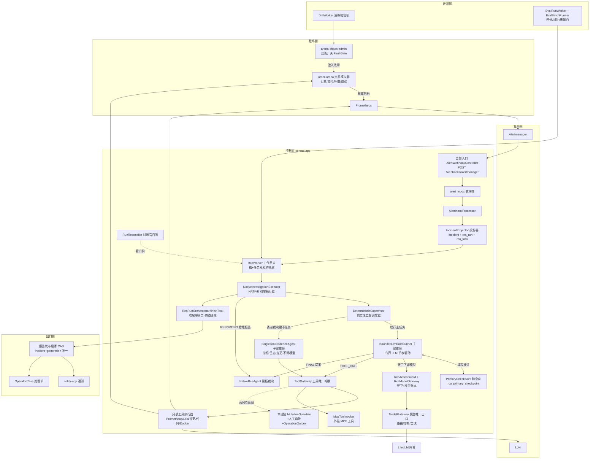

# 00-交易告警 Agent 系统总地图

> 本文是整个系列的第一篇：只画地图，不深入任何一层。
> 所有结论只以**真实代码**为第一事实来源（仓库内的说明文档已过时，一律不作为依据）。
> 标注约定：
> -【代码事实】= 直接从代码确认，给出文件/类/方法/行号；
> -【合理推断】= 根据代码结构推测，不是代码明说；
> -【设计扩展】= 面试设计题答案，不是现网实现；
> -【未确认】= 当前代码无法证明，面试里不要说成项目事实。

---

## 0. 先给我一句话

这是一套"交易系统线上告警自动根因分析（RCA，Root Cause Analysis）"系统：Alertmanager 告警进来后，由一个**受控有界的 Java 多智能体**去查指标、查日志、查变更，产出带证据引用的根因诊断报告，再走发布、通知、开处置单；全套执行进度持久化在 PostgreSQL，进程挂了能从检查点续跑。

工程名就叫 `pr-agent`（根 `pom.xml:15-19`，artifactId=`pr-agent`，描述="告警 RCA Agent 控制面"）。

---

## 1. 业务目标【代码事实】

**业务链路**（从代码装配关系还原）：

1. 交易系统（模拟器是 `order-arena` 模块：订单创建、支付网关模拟、补偿、退款链）出故障；
2. Prometheus 告警规则触发，Alertmanager 把告警组 POST 到本系统 webhook；
3. 系统把告警聚合成 Incident（事故），自动铸造一次 RCA 调查（RcaRun + RcaTask）；
4. Worker 领取调查任务，执行 NATIVE 调查引擎：主智能体循环决策（查指标/查日志/查变更/委派/收敛），全部工具调用与证据落账；
5. 调查收敛后组装结构化诊断报告，按 (incident, generation) 唯一赢家发布 → 通知（notify-app）→ 开处置单（OperatorCase）→ 可再开 ITSM 工单；
6. 全流程有独立评测面（eval 包）+ 故障注入演练面（drill 包 + order-arena 混沌开关）做质量门禁与回归。

**模块清单**（根 `pom.xml:21-28`，6 个 Maven 模块）：

| 模块 | 角色 | 证据 |
|---|---|---|
| `control-app` | 告警控制面主应用（Agent/调度/持久化/评测/演练全在这里） | `ControlApplication.java:10-16` |
| `shared-kernel` | 通用件（Digest、ExecutionEvent 等 6 个类） | `shared-kernel/src/main/java/com/objwww/pr/shared/` |
| `order-arena` | 被观测的"交易系统"模拟器 + 故障注入靶场 | `arena/interfaces/OrderController.java`、`arena/application/chaos/` |
| `arena-chaos-admin` | 靶场混沌注入的管理端 | `arenaadmin/interfaces/ChaosAdminController.java` |
| `notify-app` | 通知独立进程（outbox 领取 → 渠道路由） | `notify/application/NotifyOutboxClaimer.java` |
| `duty-adapter` | 值班排班适配器（webhook/回写） | `duty/webhook/`、`duty/writeback/` |

另有 `alert-web`（Vue 3 前端，34 个视图，见 `alert-web/src/views/`）和 `deploy/`（docker-compose、Prometheus/Alertmanager/Loki/LiteLLM/OTel Collector/gatus/flagd 配置）。

---

## 2. 为什么需要 Agent 的初步判断

**哪些步骤是固定 Workflow（工作流）就能做的？**【代码事实】——接入、去重、聚合、分类、铸造任务、调度执行、收尾落档、报告发布、通知，全部是确定性代码：

- 告警接收/验签/落库：`AlertWebhookController`（`alert/interfaces/AlertWebhookController.java:56`）→ `AlertIntakeService`
- 事故聚合与状态迁移：`IncidentProjector`（`alert/application/IncidentProjector.java:51`，episode 水印乱序收敛）
- 任务调度：`RcaWorker`（`alert/application/RcaWorker.java:367` 的 `runOneCycle`）
- 收尾事务：`RcaRunOrchestrator.finishTask`（`alert/application/RcaRunOrchestrator.java:234`）
- 报告链阶段推进：`DeterministicSupervisor`（`alert/application/DeterministicSupervisor.java:60`，javadoc 明言"模型无调度权（INV-AM4-2）"）

**哪些步骤必须依赖中间证据动态决定？**【代码事实】——主智能体每一步读到的证据不同，下一步就不同。证据在 `BoundedLlmRoleRunner.drive()`（`alert/application/agent/BoundedLlmRoleRunner.java:213`）：每一步模型输出一个互斥决策 `PrimaryDecision`，三选一：

1. `TOOL_CALL`（取一种证据）——先看到 createOrder 成功率下降 → 查指标；
2. `DELEGATE`（委派专项子任务）——需要专业查询时把"查这段时间异常日志"变成子任务，交给确定性子 Agent；
3. `FINAL`（收敛出带证据的 Claim（断言）提案）。

如果指标看不出问题，模型可以改查日志；日志静默，可以改查变更（`change.diff`）、告警历史、历史判例（`rca_history.search`）甚至部署版本源码（`code.search`/`code.read`，见 `DirectReadToolCatalog.java:26-43`）。**下一步依赖上一轮观察结果**，这是 Agent Loop（智能体循环）而不是固定 Workflow 的真实理由。

**架构边界（本项目最重要的设计）**：模型只决定"下一步调查什么"；以下全部是确定性代码硬约束——
- 调度权：模型无调度权，`DeterministicSupervisor` 唯一建子任务路径（`BoundedLlmRoleRunner.java:36` javadoc）；
- 工具准入：`AgentProfile.toolAllowlist` 白名单 + `ToolGateway` 策略双闸 + JSON Schema 校验（`ToolGateway.java:26-36`）；
- 结构化输出准入：`PrimaryClaimAdmission` 代码级准入（`BoundedLlmRoleRunner.java:439`）；
- 委派裁决：`adjudicateDelegation` 确定性裁决，封闭拒绝码（`DeterministicSupervisor.java:79-85`）；
- 终止兜底：步数耗尽/回环/同签名模型失败 → 确定性 FINAL，零模型调用（`BoundedLlmRoleRunner.java:510-531,662-678`）；
- 高风险操作：`MutationGuardian` 三值裁决 + 人工审批（`approval/MutationGuardian.java:16-27`）。

---

## 3. 项目目录地图【代码事实】

```
E:\kimiCode
├── pom.xml                     # Maven 根：Spring Boot 3.4.5 / Java 21 / 6 模块
├── control-app/                # ★ 主应用（802 个 Java 文件）
│   └── src/main/java/com/objwww/pr/control/
│       ├── alert/              # 告警域（核心中的核心）
│       │   ├── interfaces/     # 28 个 HTTP Controller（webhook/查询/命令）
│       │   ├── application/    # 42 个应用服务（编排/Worker/投影/对账）
│       │   │   ├── agent/      # ★ Agent 族（主循环/子Agent/检查点/压缩）
│       │   │   ├── approval/   # 审批族（Guardian/审批台账/扫描）
│       │   │   ├── mutation/   # 变更执行族（意图/Outbox/对账/资源锁）
│       │   │   ├── mcp/        # MCP 工具接入（挂载/客户端/调用器）
│       │   │   ├── tool/       # 工具门面（注册表/网关/账本）
│       │   │   ├── rag/        # Runbook 语料发布/存储
│       │   │   ├── reconcile/  # 事故源对账
│       │   │   └── replay/     # 重放（AgentReplayRunner/只读面）
│       │   ├── domain/         # 领域模型（纯 Java，无框架注解）
│       │   │   ├── model/      # Incident/RcaRun/RcaTask/状态枚举
│       │   │   ├── statemachine/ # 5 个状态机（Inbox/Incident/Run/Task/发布）
│       │   │   ├── agent/      # AgentProfile/PrimaryCheckpoint/WorkingMemory
│       │   │   ├── lease/      # LeaseFence（提交权栅栏）
│       │   │   ├── budget/     # RunBudget/DoomLoopGuard/预算账本
│       │   │   ├── claim/      # Claim 裁决（ClaimReducer/ReportAssembler）
│       │   │   ├── evidence/   # 证据信封/快照/校验
│       │   │   ├── dag/        # 任务图（DagPromoter/环检测）
│       │   │   ├── tool/       # ToolDefinition/ToolPolicy/调用账本
│       │   │   └── mutation/   # RcaOperation/OperationStateMachine
│       │   └── infrastructure/ # catalog/selfcheck
│       ├── auth/               # 平台用户/认证事件
│       ├── eval/               # ★ 评测面（worker/批跑/评分/对比）
│       ├── drill/              # ★ 演练面（故障注入编排）
│       ├── ops/                # 运营（值班/dutybot/分析查询）
│       ├── release/            # 发布（Canary 路由/配置Bundle/Prompt工作台）
│       ├── application/        # ModelGateway（模型调用唯一出口）
│       ├── domain/ai/          # 模型路由/熔断/预算领域件
│       ├── infrastructure/     # persistence(Postgres 170+ 仓储)/tool(执行器)
│       │                       # /model(Spring AI 路由客户端)/litellm/mcp
│       │                       # /cas(文件内容寻址仓)/auth/config/observability
│       │                       # /nativeexec(NativeInvestigationExecutor)
│       └── interfaces/
├── alert-web/                  # Vue 3 前端（34 视图）
├── order-arena/                # 交易模拟器 + chaos 包（FaultGate/FaultType）
├── arena-chaos-admin/          # 混沌注入管理端
├── notify-app/                 # 通知进程
├── duty-adapter/               # 值班排班适配
├── shared-kernel/              # Digest/ExecutionEvent 通用件
├── deploy/                     # docker-compose + prometheus/alertmanager/loki
│   └── alert/litellm/config.yaml  # LiteLLM 网关配置
├── docs/                       # 历史文档（已过时，不可信）
└── control-app/src/main/resources/db/migration/  # Flyway V1..V165，138 个迁移
```

---

## 4. 入口候选【代码事实】

### 4.1 主入口（告警进来的门）

`AlertWebhookController.receive`（`alert/interfaces/AlertWebhookController.java:56-100`）：
- `POST /webhooks/alertmanager`，只接受 JSON，支持 gzip；
- 先过 `ControlAlertRouter.guard`（控制面声明组三面门：身份/route 白名单/monitoring_scope 白名单，ROUTED_ONCALL 直达值班通道，REJECTED fail-closed）；
- 业务告警走 `AlertIntakeService.store(body, gzip)` → 落 `alert_inbox`（inboxId 返回 202）；
- 状态码契约：401 验签失败 / 400、413 结构非法（零落库）/ 503 仅 DB 故障（Alertmanager 整组重试）/ 202 整组落库；
- 只在 `@Profile("docker")` 暴露。

### 4.2 常驻循环入口（后台进程身份，全部零注解虚拟线程或独立循环）

| 循环 | 类：方法 | 职责 |
|---|---|---|
| RCA Worker | `RcaWorker.loop`（RcaWorker.java:490） | 回收过期租约 → 领取任务 → 执行 → 收尾 |
| Run 对账看门狗 | `RunReconciler`（RunReconciler.java:69） | 停滞 run 的检测/恢复/终止三分离 |
| inbox 处理 | `AlertInboxProcessor` | 把 inbox 行投影成 event/incident/run/task |
| 等待重驱 | `IncidentWaitingRedrive`（IncidentWaitingRedrive.java:37） | WAITING_CAPABILITY/DEFERRED 事故补铸 run |
| 变更派发 | `OperationOutboxDispatcher`（OperationOutboxDispatcher.java:34） | outbox at-least-once 派发 |
| 变更对账 | `OperationReconciler`（OperationReconciler.java:33） | UNKNOWN→RECONCILING→裁决 |
| 审批扫描 | `ApprovalSweepLoop` | 审批台账推进 |
| 评测 Worker | `EvalRunWorker`（EvalRunWorker.java:37） | eval 命令领取/跑批/崩溃恢复 |
| 演练 Worker | `DrillWorker`（drill/application/DrillWorker.java:21 注释） | 演练相位机驱动 |

### 4.3 HTTP 查询/命令入口

`alert/interfaces/` 下 28 个 Controller（IncidentQuery、RunCommand、ReportQuery、TraceDetail、EvalCommand、Drill、MutationOps、ApprovalOps 等）+ `eval/interfaces/` 6 个 + `drill/interfaces/` 2 个 + `release/interfaces/` 7 个 + `ops/interfaces/` 4 个 + `auth/interfaces/` 2 个。前端 `alert-web` 走这些 API。

### 4.4 进程入口

`ControlApplication.main`（`ControlApplication.java:13-15`，Spring Boot）。默认 profile 无数据库可空跑；真实数据源在 `application-docker.yml`（`jdbc:postgresql://postgres:5432/pr_agent`）。

---

## 5. Main Agent（主智能体）候选【代码事实】

**唯一真正循环调用大模型的地方：`BoundedLlmRoleRunner`**（`alert/application/agent/BoundedLlmRoleRunner.java:42`）。

- javadoc 定性："受控有界 LLM 运行器……**无状态单步驱动**——全部推进状态在主任务检查点（V47 `rca_primary_checkpoint` 表），本类不持有任何跨步可变态"（:25-27）；
- 一步 = 读检查点 → WAITING_CHILDREN 复判唤醒 → 步数耗尽走确定性兜底 FINAL → `ContextAssembler.assemble` 装配信封 → `RcaActionGuard.guardedModelCall` 守卫调模型 → `PrimaryDecision.parse` 解析出 TOOL_CALL/DELEGATE/FINAL 三分支（:213-313）；
- 输出协议是 runner 拥有的**硬契约**：`PROTOCOL_SUFFIX`（:61-92）随信封逐步下发，强制"回复必须且只能是一个 JSON 对象，三种形状恰选一"；
- 终止硬约束：`profile.maxSteps` 耗尽（:231）、monologue 回环硬停（`RoleLoopGuard`，:298-305）、同签名模型失败 ×2 熔断（:662-678）——全部走零模型调用的确定性 FINAL。

**角色运行器契约**：`RoleRunner` 接口（`agent/RoleRunner.java:20`），`drive()` 一步有界驱动，结局封闭枚举 `EVIDENCE_PRODUCED/NO_DATA/FAILED/WAITING_CHILDREN/FINAL_READY/DELEGATE_REJECTED`（:46-54）。实现有两个：`BoundedLlmRoleRunner`（BOUNDED_LLM）与 `SingleToolRoleRunner`（确定性单工具）。

**Agent 身份**：`AgentProfile`（`domain/agent/AgentProfile.java:41-54`）= prompt + toolAllowlist + budgetLimits + outputSchema（+ inputSchema/phase/runtimeKind/maxSteps/terminationPolicy）四件套起构造即校验、深冻结、全内容进稳定 `digest()`。javadoc 原则："**不可自由生 Agent**"（:17）。

**注意区分**：`NativeRcaAgent`（`agent/NativeRcaAgent.java:41`）**不是** LLM 智能体——它是报告相位的确定性"黑板"裁决器：读冻结证据快照里的断言注记，经 `ClaimReducer` 多源裁决落 `ClaimStore`，不直接发布报告（:20-23）。

---

## 6. Supervisor（监督调度器）候选【代码事实】

`DeterministicSupervisor`（`alert/application/DeterministicSupervisor.java:60`）——名字里的 Deterministic 是关键：**它是确定性推进器，不调 LLM**。

- 固定执行链：PLAN（`PlanCompiler` 双设防编译落库）→ 并行调查（DAG 任务）→ REDUCE → VERIFY≤1 → ASSEMBLE → VALIDATE → PUBLISH（:37-39）；
- 两个幂等入口：`startRun`（编译提案落任务图并放行根任务，:189）与 `advance`（终态回执后的图收敛，DagPromoter 不动点）（:47-49）；
- **委派裁决**：`adjudicateDelegation`——委派批上限 `MAX_DELEGATION_BATCHES=2`、单批 ≤2 请求（:76-77），拒绝码封闭集：BATCH_SHAPE / DELEGATION_BUDGET_EXHAUSTED / GAP_ALREADY_ADJUDICATED / DUPLICATE_GAP_IN_BATCH / ROLE_UNKNOWN / RUN_TASK_CAP（:80-85）；
- generation fence：run 出活跃集 → 零推进零迁移（:52-54）。

**子 Agent（被委派方）**：`MetricsAgent` / `LogsAgent` / `ChangeAgent` 都继承 `SingleToolEvidenceAgent` 基座（`agent/MetricsAgent.java:21`、`agent/SingleToolEvidenceAgent.java:51`）：
- 每个 Agent 只做**一种** R0 只读查询（allowlist 构造期强制恰为一工具）；
- **不调用 LLM**——固定参数模板调用固定工具，产证据落账；
- 调用纪律：账本 PENDING 先行（动作 digest 幂等）→ ToolGateway 唯一咽喉 → 终态 CAS；空结果=NO_DATA（"无故障不制造证据"）。

**委派 vs 直查的判据**【代码事实】：主 Agent 信封里带 `delegation_batches_remaining`，协议文案写明"仅确需专业能力且 batches>0 才委派"（`BoundedLlmRoleRunner.java:64-66`）；委派批获批 → 检查点进 `WAITING_CHILDREN`，全部子任务收官后由 Supervisor 复判唤醒（:218-228）。

---

## 7. Task / Worker / Scheduler（任务/工作节点/调度）候选【代码事实】

### 7.1 核心对象

- `RcaRun`（一次调查）：状态 9 态 `QUEUD→…`——准确全集：`QUEUED, RUNNING, SUCCEEDED, FAILED, CANCELLED, SUPERSEDED, REPORTING, PARTIAL, EXPIRED`（`domain/model/RcaRunState.java:16-18`）；活跃=QUEUED/RUNNING/REPORTING（:20-22）；
- `RcaTask`（任务）：11 态 `READY, LEASED, RETRY_WAIT, DONE, CANCELLED, DEAD, BLOCKED, RUNNING, SKIPPED, FAILED_TERMINAL, STALE`（`domain/model/RcaTaskState.java:17-19`）；
- `RcaAttempt`（一次尝试执行）：STARTED→SUCCEEDED/FAILED_RETRYABLE/FAILED_TERMINAL；
- 租约三字段在 task 行上：`leaseOwner / leaseUntil / leaseEpoch`（epoch 是 fencing token（栅栏令牌），重领时 +1 拒旧提交）。

### 7.2 Worker：`RcaWorker`（alert/application/RcaWorker.java:44）

单轮 `runOneCycle`（:367）：
1. `claimWork`（:335）：**短事务**内 `slots.tryAcquire`（占并发槽）→ `tasks.claimNext`（SLA 排序领取，单语句 CAS）；槽与任务同事务，任一不成立即回滚归还；
2. `markRunRunning`（CAS 防取消复活，`RcaRunOrchestrator.java:688`）→ 铸 attempt + InvestigationResult(STARTED)；
3. **事务外执行** `executor.execute(...)`，心跳续租线程（:394-425）：租约续期失败/易主/run 终态 → 抛 `StoppedException` 立即停止；
4. 材料预提交（:452-460，防"执行完成→收尾提交"缝隙被杀）→ `finishTask` 收尾单事务（`RcaRunOrchestrator.finishTask`，:234）。

并发槽：`SchedulerSlotRepository`（实现 `PostgresSchedulerSlotRepository`）——`tryAcquire/release/heartbeat/reclaimExpired/occupiedSlots/totalSlots`，槽租约与任务租约**双租约独立回收**（RcaWorker.java:40-42 javadoc）。

### 7.3 收尾事务里的四道栅栏（面试高频）

`finishTask`（RcaRunOrchestrator.java:234-372）顺序：
1. **LeaseFence 提交权栅栏**（:242，`domain/lease/LeaseFence.java:39`）：条件 UPDATE（state=LEASED ∧ owner ∧ epoch），0 行=旧 worker 晚到，一行不写只配审计；
2. **generation fence**（:254）：run 已出活跃集 → task 收敛 STALE，报告/发布/通知零落档；
3. task 终态三分支：DONE / RETRY_WAIT（退避 1→2→4min 封顶 5min，:674-677，新 deadline 重算"退避后不插队"）/ DEAD；
4. run 收尾三分支：告警已恢复 → RESOLVED 短路；调查期间材料变化（`pendingInvestigationHash != run.investigationHash`）→ 铸 RERUN；否则锚定材料结束（:350-371）。

报告发布还有一道 **(incident, generation) 发布赢家 CAS**（:457，`winners.claimWinner`）：多报告竞争唯一发布权，败者落档不发布。

### 7.4 DAG 与对账

- `DagExecutionService` / `DagPromoter` / `DagCycleDetector`（domain/dag/）：任务图放行与环检测；
- `RunReconciler`（alert/application/RunReconciler.java:69）：独立看门狗，决策表 9 分类（WAIT_ACTIVE_LEASE/WAIT_RECLAIM/WAIT_BACKOFF/FINALIZE_CANDIDATE/ORPHAN_MATERIALS_INCOMPLETE/ORPHAN_NO_DRIVER/HARD_DEADLINE_EXPIRED/SHADOW_STALLED/RECOVERY_EXHAUSTED…），灰度三模式 ALERT_ONLY→SAFE_RECOVER→AUTO_EXPIRE（:74）；可铸唯一 `REPORT_FINALIZE` 恢复任务重入收尾。

---

## 8. Context / Session / State（上下文/会话/状态）候选

**先说结论**【代码事实】：本项目**没有**聊天意义上的 Session（会话）概念，也没有 Conversation 历史。一次调查 = `RcaRun`（run）+ `RcaAttempt`（attempt）+ `PrimaryCheckpoint`（检查点）。"对话"被替换成了**检查点 + 确定性装配**：每一步模型看到的不是累积消息历史，而是从账本确定性重建的信封。

| 概念 | 载体 | 生命周期 | 存储 |
|---|---|---|---|
| Incident（事故） | `Incident` | 告警 episode 期间，跨进程跨重启 | PG `incident` 表 |
| Run（一次调查） | `RcaRun` | 从铸造到终态，跨进程跨重启 | PG `rca_run` |
| Task（任务） | `RcaTask` | 同上 | PG `rca_task` |
| Attempt（尝试） | `RcaAttempt` | 单次执行 | PG `rca_attempt` |
| 检查点 | `PrimaryCheckpoint`（`domain/agent/PrimaryCheckpoint.java:38-56`） | 主任务全程，崩溃后重驱从此续走 | PG `rca_primary_checkpoint`（V47） |
| 工作记忆 | `WorkingMemory` | append-only 深冻结，检查点只存 memoryId/digest 引用 | PG `rca_working_memory`（V91） |
| 证据 | `EvidenceEnvelope` | run 级 append | PG `rca_evidence` + 快照表（V16） |
| 上下文摘要 | `ContextSummary` | 压缩产物 | PG `rca_context_summary`（V92） |
| 工具调用账本 | `RcaToolInvocationLedger` | 每次工具调用 | PG `rca_tool_invocation_ledger`（V15） |
| 模型调用账本 | `rca_model_call`（V48）+ 输入存档 `RcaModelInputCapture`（V90） | 每次模型调用 | PG |

**检查点内容**（面试要能背）：phase（PRIMARY_READY/WAITING_CHILDREN 两态）、decisionSeq（决策序）/stepsUsed（已耗步数）/batchesUsed（已耗委派批数）、roundId（委派轮次）、finalClaims/finalMissingInformation（FINAL 提案）、lastError（反馈环——上一步失败原因随信封回喂模型）、**revision**（并发提交修订）、memoryId/memoryDigest、currentSummaryId（`PrimaryCheckpoint.java:38-56`）。

**上下文长度治理**【代码事实】：
- `ContextAssembler`（agent/ContextAssembler.java:59）确定性装配，界限硬编码：证据 ≤20 条（:63）、轨迹 ≤8 步（:64）、记忆槽 ≤10 项（:65）、各摘要 100~500 字符截断（:66-68）；
- `ContextCompactionService`（agent/ContextCompactionService.java，522 行）：一步边界压缩（工具结果入库后、下一模型发送前），产物落 `ContextSummary`，消费指针走检查点 `current_summary_id`——这是 **Compaction（压缩）**形态；窗口截断（EVIDENCE_LIMIT 时间倒序截取）是 **Pruning（裁剪）**形态；快照 digest 引用代替全文属于 **Offloading（卸载）**形态。项目注释没有硬套这三个英文名，是按实际机制实现的。

---

## 9. Checkpoint（检查点）/ Lease（租约）候选【代码事实】

两者职责正交，面试必须分开说：

- **Checkpoint 解决"从哪里继续"**：`PrimaryCheckpoint` 全量推进状态落 PG；`BoundedLlmRoleRunner` 无状态，任意一步崩溃后重驱动从检查点续走（RD09）。
- **Lease 解决"谁有权继续执行"**：task 租约（owner/leaseUntil/leaseEpoch）+ slot 租约 + 槽/任务双回收；`RcaWorker.recoverExpired`（RcaWorker.java:266-287）扫描过期 LEASED 任务 → RETRY_WAIT（活跃 run）或 STALE（死 run），epoch 不动、重领时 +1 拒旧提交。

**检查点提交围栏**：`PrimaryCheckpointCommitService`（agent/PrimaryCheckpointCommitService.java:40）是运行路径唯一合法提交口：
- `CommitFence`（:46）= runId+taskId+owner+leaseEpoch+configEpoch+expectedRevision 四类身份；
- 提交状态封闭集：APPLIED / REPLAYED（幂等重放）/ STALE_OWNER / STALE_REVISION / CONFIG_CHANGED / RUN_TERMINAL（:72-74），后四类调用者立即退出本次驱动；
- 事务内按 **task→run→checkpoint 统一锁序**锁读校验（:22-26），revision 条件写影响行数必须 1。

**崩溃三账本诚实对账**（RcaWorker.java:289-327）：悬挂的 ExternalInvocation（STARTED 超宽限）→ UNKNOWN；悬挂 InvestigationResult → UNKNOWN；工具账本 PENDING 孤儿 → UNKNOWN。"诚实标 UNKNOWN 不猜结局"。

**Retry（重试）与 Idempotency（幂等）**：task 级重试 = RETRY_WAIT + 退避 + maxAttempts（默认 3，`RcaRunOrchestrator.java:402` 的 `0,0,3`）；幂等 = 动作 digest（`ActionDigest`）+ 账本 PENDING 先行 + `actionKey` 重放判 REPLAYED（PrimaryCheckpointCommitService.java:32-35）+ 内容寻址 CAS（`putRawIfAbsent`，RcaRunOrchestrator.java:547）。

---

## 10. Tool（工具）候选【代码事实】

### 10.1 只读工具目录（`DirectReadToolCatalog`，agent/DirectReadToolCatalog.java:26-43）

| 业务类 | 工具 id |
|---|---|
| 指标工具 | `prometheus.query`（range）/ `prometheus.instant` / `prometheus.metric_value` / `prometheus.catalog`（按 service 查指标目录）/ `prometheus.label_values` / `prometheus.rules`（告警规则） |
| 日志工具 | `logs.query`（Loki）/ `logs.aggregate`（先聚合后读行，severity 封闭集） |
| 变更工具 | `change.query` / `change.diff`（窗内变更+窗前基线） |
| 告警工具 | `alert.history`（触发/恢复时间线） |
| 容器工具 | `docker.ps` / `docker.inspect`（env 只回键名不回值） |
| 知识工具（RAG） | `runbook.catalog` / `runbook.fetch` / `rca_history.search`（历史判例） |
| 代码工具 | `code.search` / `code.read`（部署版本源码只读，沙箱复判） |

全部 `ToolRisk.R0`（只读），schema 即权限：maxLength/pattern 形状面收紧 + `additionalProperties=false`（DirectReadToolCatalog.java:11-21）。

### 10.2 有副作用工具

`MutationToolCatalog`（tool/MutationToolCatalog.java:24-25）：`service.restart` / `service.rollback`。**不走主循环直接执行**：ToolGateway 检测高风险 → 意图落账（`ActionIntentLedger`）→ Guardian 预审 → 人工审批 → Operation Outbox 派发 → 资源锁/对账（见第 11 节）。

### 10.3 工具运行时（Tool Runtime，工具运行时）

- `ToolGateway`（tool/ToolGateway.java:37）唯一咽喉，固定序（:26-36）：注册表解析 → 策略二次鉴权（第一闸=LLM 下发清单已按 policy 裁剪）→ schema 校验（未声明字段硬拒绝）→ canonical digest → R2/R3 VALIDATE_ONLY 记录意图零执行 → 硬 deadline 执行（独立调用池，超时 cancel(true)，迟到结果直接丢弃）→ 结果上限裁断 RESULT_OVERSIZE；
- 错误两族：`ToolControlPlaneException`（控制面终止族）vs `ToolModelVisibleException`（模型可见族，脱敏固定文案，executor 异常原文不透传）；
- `DoomLoopGuard`（domain/budget/）：同一查询签名连续零进展 → 熔断 DOOM_LOOP_TRIPPED（`BoundedLlmRoleRunner.java:381-395` 有完整反馈文案）；
- `RunBudgetGate` + `RunBudgetLedger`/`IncidentBudgetLedger`（domain/budget/）：多维预算（TOKEN 等）预留/结算/释放；
- 工具账本 `RcaToolInvocationLedger`：PENDING 先行 → 终态 CAS，崩溃悬挂回收（V15）。

### 10.4 MCP（Model Context Protocol，模型上下文协议）外挂工具

`McpMountManager` / `McpServerClient` / `McpToolInvoker`（application/mcp/）+ `McpMountController` + `mcp_server_registry` 表（V64）：
- 外部 MCP server 可挂载为工具，账本工具名 `mcp:<server>:<tool>`（McpToolInvoker.java:22-23）；
- "isError/畸形/缺 content 不因 HTTP200 记成功"（:24-25）；工具描述零提权——描述只透传展示，从不参与权限判定（:26）；TTL 过期旧 schema 不误用（:27）。

### 10.5 工具执行器（真正触网的一层，infrastructure/tool/）

`PrometheusQueryExecutor` / `PrometheusApiExecutor` / `LogQueryExecutor` / `LokiAggregateExecutor` / `ChangeQueryExecutor` / `ChangeDiffExecutor` / `AlertHistoryExecutor` / `DockerInspectExecutor` / `CodeSearchExecutor` / `CodeReadExecutor` / `ReplayToolExecutor`。

### 10.6 模型调用链（哪一里真正调 LLM）

`BoundedLlmRoleRunner` → `RcaActionGuard.guardedModelCall`（agent/RcaActionGuard.java:64，固定序：run 活跃→未取消→generation→leaseEpoch→deadline→角色 digest 对账→原子预留预算→账本先行取得发送资格）→ `RcaModelGateway`（agent/RcaModelGateway.java:48，"账本不可写=零触网"，rca_model_call PENDING 先行，usage/cost 记账）→ `ModelGateway`（application/ModelGateway.java:52，模型调用唯一出口：路由/熔断/冷却/重试/退避/fallback）→ `SpringAiRouteClient`（infrastructure/model/SpringAiRouteClient.java:49，Spring AI OpenAI 兼容，一次 complete 至多一次真实 HTTP）→ LiteLLM 网关（deploy/alert/litellm/config.yaml）→ 上游模型。

【代码事实】除主 Runner 的每步决策外，评测面还有 Case Judge（V145 `p7_case_judge`、`EvalCaseJudgeSink`）会调模型当裁判；确定性子 Agent、Supervisor、装配器、投影器全部零 LLM。

---

## 11. Authorization / Approval（授权/审批）候选【代码事实】

### 11.1 认证（infrastructure/config/SecurityConfig.java:70）

- 浏览器：Spring Security 6 服务端会话，formLogin 在 `/api/auth/login`（JSON 应答）+ SPA CSRF（XSRF-TOKEN cookie → X-XSRF-TOKEN 头）；主登录面 = `platform_user` 表（V44），env 预置单 operator 为引导管理员；
- 机器：`MachineBearerAuthnFilter` 四条静态 bearer 线别（webhook/operator/release/duty-adapter）按线铸角色；webhook 另有 `AlertWebhookHmacFilter`；
- 审计：LOGIN_SUCCESS/LOGIN_FAILURE/LOGOUT 落 `auth_event`（V42），**审计不可达时登录判负**（fail-closed，SecurityConfig.java:66）；
- 授权：deny-by-default 路径矩阵分权（机器线按线别、用户线按角色）。

### 11.2 工具层权限（三层闸）

1. Agent 级：`AgentProfile.toolAllowlist`，越权=结构化拒绝留痕 TOOL_NOT_ALLOWED（BoundedLlmRoleRunner.java:320-328）；
2. 网关级：`ToolPolicy` 双闸二次鉴权 + JSON Schema 硬拒绝；
3. 风险级：`ToolRisk` R0（只读直执行）/ R2、R3（VALIDATE_ONLY 记录意图零执行，等审批）。

**"为什么不能只在 Prompt 里说别做危险操作"**——本项目的代码化回答：模型约束全部被复制成代码硬约束（白名单校验在 Gateway、二次鉴权在策略面、schema 未声明字段硬拒绝、R2/R3 零执行等审批）。Prompt 是意图表达，执行面不信任它。

### 11.3 高风险操作审批链（approval/ + mutation/ 两个包）

```
TOOL_CALL(service.restart 等高风险)
→ ToolGateway 意图落账 ActionIntentLedger（V114）
→ MutationGuardian 预审（MutationGuardian.java:16-27）
     SAFE（低危白名单+参数预算内）→ guardian:<policyVersion> 机器签发
     UNSAFE（参数超限）→ 自动拒绝
     UNCERTAIN → 转人工（绝不猜 SAFE）
     Hardline 绝对禁止清单 → 双层阻断
→ 审批台账（V119 pc1_approval_ledgers）+ ApprovalSweepLoop / GuardianAutoDecisionService
→ OperationPlanner → ActionRunner（DryRun/Http/FlagdRollback）
→ OperationOutboxDispatcher（V117，at-least-once，租约+SKIP LOCKED）
→ OperationReconciler（UNKNOWN→RECONCILING→VERIFIED/RETRYABLE/ESCALATED）
→ ResourceLockStore / ResourceCoordinator（V115/116）资源锁 + 释放闸
```

配套：`SuspensionStore`/`ApprovalSuspensionService`（V120 暂停面）、`UnlockScopeStore`/`ScopeExpansionService`（V121 定向解锁）、`MutationActiveGate`（对账终态是重派前置）。

---

## 12. Harness（运行脚手架）候选

**Agent Harness（智能体运行脚手架）**= 模型外面的全部控制代码，本项目全部自研、无 LangChain 等框架依赖【代码事实：control-app/pom.xml 无 agent 框架依赖，模型客户端是 Spring AI】：

- 循环驱动：`RcaWorker` + `NativeInvestigationExecutor`（infrastructure/nativeexec/NativeInvestigationExecutor.java:83，MAX_DRIVE_SWEEPS=8 不动点收敛上限 :99）
- 状态管理：5 个状态机 + `RcaStateContract` 双读契约（domain/statemachine/）
- 检查点/租约/栅栏：见第 9 节
- 约束：maxSteps、预算（`budget/` 六维 BudgetKind）、回环守卫（`RoleLoopGuard`/`DoomLoopGuard`）
- 权限：见第 11 节
- 超时：任务 deadlineAt（SLA）+ 工具硬 deadline + 模型 per-call timeout（SpringAiRouteClient 两层超时 :43-45）
- 可观测性：`StructuredLog`（结构化事件）+ `AlertMetrics` + `RcaEventAppender` 事件账本（V14，V112 事件哈希链）+ 三账本（工具/模型/attempt）
- 质量门禁：`EvidenceSchemaValidator`/`EvidencePackageValidator`（报告结构验证 STRUCTURE_VALIDATED 才可发布）

**Evaluation Harness（评测脚手架）**= `eval/` 包 + `drill/` 包 + `order-arena` 靶场 + `arena-chaos-admin`（见第 13 节）。两套 Harness 同仓不同身份：库权限分 `control_app` 与 `eval_app`（V2 grants、V45/V93/V106/V157 持续补授权），评测跑 Agent 用的是同一控制面代码，但写入面隔离。

---

## 13. Eval（评测）/ Fault Injection（故障注入）候选【代码事实】

### 13.1 评测链路

- 命令与 Worker：`EvalCommandController` → `eval_run_command` → `EvalRunWorker` 轮询领取（`claimNextLaunch` 单语句 CAS + SKIP LOCKED），崩溃恢复三分诊（run 未落库→重排队/run RUNNING→FAILED(worker_lost)/run 已终态→命令对齐收口）（EvalRunWorker.java:16-35）；还有 `WorkerSchemaFreshnessGuard` 陈旧自拒（旧镜像不许抢跑新 schema 命令）；
- 批跑：`EvalLaunchExecutor` → `EvalBatchRunner`（案例边界检查取消）；
- 场景驱动：`ScenarioDriver` 族——`ArenaChaosScenarioDriver`（打靶场）/ `FlagdScenarioDriver`（开关）/ `InfrastructureScenarioDriver` / `ReplayScenarioDriver`（历史重放）；
- 数据集：`DatasetVersion`/`GoldenCandidate`（V20-22），`OrderArenaAdapter`（eval/infrastructure/adapter/OrderArenaAdapter.java:18，order-arena 私有集是"唯一决定上线的主质量门 source_class=PRIVATE"）；
- 评分：`SingleCaseScorer`（选择规则 `FinalReportSelector` → 纯函数评分 `ScenarioEvaluator`）；六个专项维度 sink：Behavior（行为）/ Collaboration（协作）/ ContextDrift（上下文漂移）/ Loop（回环）/ Safety（安全）/ Judge（LLM 裁判，V145）+ 六部分报告 V152 + 难度分级 V143/红队标注 V144；
- 对比与治理：`EvalCompare`/`EvalComparisonAutoRecorder`（V85/V110）、`EvalGateRunner`（质量门）、`GoldenCandidateService`、`RegressionCaseAdmissionService`（回归案例准入）、`EvalReviewService`（人工复核 V87）。

### 13.2 故障注入（drill 包 + 靶场）

- 演练相位机（DrillWorker.java:21-56 javadoc）：QUEUED→PRECHECK→INJECTING→OBSERVING→RECOVERING→VERIFYING→CLOSED，每次迁移 state+revision 双对账 CAS + PHASE_TRANSITION 事件；"注入一旦发生，停止或失败都必先进 RECOVERING"——不许留下脏靶场；
- 注入实现：`ArenaChaosDrillInjection` / `FlagdDrillInjection` / `CompositeDrillInjection`；恢复三态 RECOVERED/FAILED/UNKNOWN + VERIFYING 核验，恢复窗口 deadline 防死循环（V150）；
- 靶场：`order-arena` 的 chaos 包——`FaultGate`/`FaultType`/`ChaosSwitchboard`/`ChaosRecoveryService`（order-arena/src/main/java/com/objwww/pr/arena/application/chaos/），由 `arena-chaos-admin` 的 `ChaosActivationService` 激活；故障类型（如 createOrder 失败率、延迟）打在交易模拟器上，Agent 通过 Prometheus/Loki 看到的是"真实"故障信号；
- Ground Truth（标准根因）：评测案例由 `GoldenScenarioRegistry`/eval-scenarios 定义（OrderArenaAdapter.java:15 提及）+ 红队标注（V141/142/144）；【未确认】ground truth 的完整 schema 细节未逐行读，留待 21 篇。

### 13.3 灰度与回滚（release 包）

`CanaryRouter`（RERUN/铸造点路由决策，引擎 NATIVE/HOLMES 分桶，V25）+ `CanaryWatchController`/`CanaryEvidenceSampleCollector`（run 终态采集样本，V30 周期评窗）+ `ConfigBundleController`/`PromptDraftController`/`PromptWorkbenchController`（Prompt 配置 Bundle 版本化）+ `SkillCurationController`。

【代码事实·重要】`RcaEngine` 枚举注释（RcaEngine.java:5-6）写"HOLMES=主路径（HolmesGPT 常驻容器）、NATIVE=候选"，但 M6-07 之后两个铸造点（`IncidentProjector`、`RcaRunOrchestrator.castRunAndTask:382-386`）都拒绝为 HOLMES 意愿铸 run（"第二引擎已退场"）——**现役引擎是 NATIVE（本仓 Java Agent），Holmes 已退场，只留历史读面**。面试按现状说。

---

## 14. 数据存储地图【代码事实】

**只有三类存储：PostgreSQL、本地文件 CAS、进程内存。没有 Redis**（全仓 grep "redis" 仅命中分类关键词表和两处注释；`PostgresMcpServerRegistryRepository.java:15` 还明确写了"不抄 Redis PubSub"）。

| 存储 | 内容 | 证据 |
|---|---|---|
| PostgreSQL（`pr_agent` 库） | 全部业务状态：inbox/event/incident/run/task/attempt/checkpoint/working_memory/context_summary/evidence/快照/tool_invocation_ledger/model_call/rca_event（哈希链）/claim/delegation/eval_*/drill_job/mutation 三账本/approval 台账/resource_lock/platform_user/auth_event/duty_*/operator_case/notify_outbox/mcp_server_registry… | `db/migration/` 138 个迁移 V1..V165 |
| 库内角色分权 | `control_app`（业务写面）/ `eval_app`（评测面，含只读授权 V11/V45/V93/V106/V157） | V2 grants 起持续演进 |
| PG 分区与归档 | 月度分区（V28）+ 保留策略归档（V29，`PostgresPartitionArchiveGateway`） | infrastructure/persistence/ |
| 本地文件 CAS | 报告 raw 原文内容寻址存储（sha256 地址，putIfAbsent 幂等） | `LocalCasArtifactStore`（infrastructure/cas/，实现 `ArtifactStore`） |
| 进程内存 | 模型熔断器/冷却登记（ModelGateway.java:49 注释 R-M3）、`RoleLoopGuard` monologue 计数、`InFlightToolCancels` | 各类字段 |
| 临时 vs 持久 | 一切跨进程状态都在 PG；进程内存态仅优化/观测用，丢了"只慢不错" | InFlightToolCancels.java 注释 |

前端 `alert-web`（Vue3+vite+nginx，见 Dockerfile/nginx.conf）无独立存储。

---

## 15. 端到端初步架构图【代码事实，Mermaid】



一次"酒店 createOrder 成功率下降"告警的完整主线：PROM 告警 → WH 落 inbox → PROC/PROJ 聚合铸 run/task → WORKER 领取 → EXEC 读提案、SUP 落任务图 → 主智能体循环（调模型决策 → GW 取证/委派子智能体 → 证据落账 → 检查点推进）→ 步数/证据到位后 FINAL → 快照冻结 + 黑板裁决 + 组报告 → finishTask 四道栅栏收尾 → 发布赢家 → 通知 + 处置单。全程 PG 持久化，崩了由 RECON/双租约回收 + 检查点续跑。

---

## 16. 当前无法确认的问题【未确认清单】

面试中以下内容**不要说成项目事实**：

1. **生产部署形态**：`deploy/` 只有 docker-compose（单机），没有 K8s 清单；真实副本数、真实 QPS、真实告警量代码无法证明。
2. **模型路由实际值**：LiteLLM `config.yaml` 里配了哪些上游模型、实际用哪个模型跑主循环，属于运行时配置，本文未逐项核对（config 文件存在：`deploy/alert/litellm/config.yaml`）。
3. **性能与成本数据**：延迟分布、Token 成本、命中率等只有表结构和采集面（V128 model_pricing、`UsageLedgerService`），具体数字需要运行时数据。
4. **评测历史结果**：eval_run 的实际跑分、F1、命中率存数据库，不在代码里。
5. **ground truth 案例全集**：案例在数据集表和 yml（GoldenScenarioRegistry 提及），未逐条盘点。
6. **工作区状态**：当前 git 分支 `feat/a-batch-readfaces` 有大量未提交改动（git status 90+ 文件），本文基于**当前工作区代码**，与最近一次提交可能有差异。
7. **`duty-adapter`/`notify-app` 的部署细节**（端口/重试参数）未深读，只确认了类与职责。
8. **多实例部署下 RcaWorker 的实际数量**：代码层面 owner/slot 机制支持多实例并发安全（SKIP LOCKED + 双租约），但实际部署几个实例代码无法证明——这恰好是可答题：机制支持水平扩展。

---

## 17. 还需要我补充哪些文件

**不需要补——仓库自包含**，代码、迁移、部署配置、前端全在。两个可选项：

1. 如果要聊"线上效果"，补：真实 eval 报告/指标截图、生产告警样本（不在仓库）；
2. 如果要聊"模型策略"，补：`deploy/alert/litellm/config.yaml` 当前内容确认（我可以直接读，无需你提供）。

---

## 18. 推荐阅读顺序（后续逐篇展开的路线）

按"从业务到深水区"的顺序，也是后续 01~26 篇的展开顺序：

1. **状态机先行**：`RcaRunState` → `RcaTaskState` → `domain/statemachine/` 5 个状态机——全系统的骨架；
2. **接入链**：`AlertWebhookController` → `AlertIntakeService` → `AlertInboxProcessor` → `IncidentProjector`（含 episode 水印/乱序收敛）；
3. **执行链**：`RcaWorker` → `NativeInvestigationExecutor` → `RcaRunOrchestrator.finishTask`（四道栅栏逐行读）；
4. **智能体循环**：`BoundedLlmRoleRunner.drive` → `PrimaryDecision` → `ContextAssembler`（信封契约）→ `RcaActionGuard` → `RcaModelGateway` → `ModelGateway` → `SpringAiRouteClient`；
5. **委派与子智能体**：`DeterministicSupervisor`（startRun/advance/adjudicateDelegation/wakePrimary）→ `SingleToolEvidenceAgent` 三兄弟；
6. **工具层**：`DirectReadToolCatalog` → `ToolGateway` → `infrastructure/tool/` 执行器 → `McpToolInvoker`；
7. **可靠性深水区**：`PrimaryCheckpointCommitService` → `LeaseFence` → `RunReconciler` → 三账本悬挂回收；
8. **安全面**：`SecurityConfig` → `ToolPolicy` → `MutationGuardian` → `OperationOutboxDispatcher`/`OperationReconciler`；
9. **评测面**：`EvalRunWorker` → `EvalBatchRunner` → `SingleCaseScorer`/六维 sink → `DrillWorker` → `order-arena` chaos 包；
10. **周边面**：release（Canary/Prompt 工作台）、ops/duty、rag、replay。

---

## 附：一句话记住各候选

| 面试题眼 | 一句话答案（背这个） |
|---|---|
| 入口 | `POST /webhooks/alertmanager`，401/400/413/503/202 五态契约，零落库 fail-closed |
| 主智能体 | `BoundedLlmRoleRunner`：无状态单步，状态全在 PG 检查点，三选一决策，步数/回环/模型失败三重确定性兜底 |
| Supervisor | `DeterministicSupervisor`：确定性代码，模型无调度权，委派批上限 2、封闭拒绝码 |
| 子智能体 | `Metrics/Logs/ChangeAgent` 继承 `SingleToolEvidenceAgent`，固定单只读工具，**不调 LLM** |
| Worker/调度 | `RcaWorker` 槽+任务同事务领取，心跳续租，事务外执行，finishTask 单事务收尾 |
| 检查点 | `rca_primary_checkpoint` 表 + `PrimaryCheckpointCommitService` revision CAS 提交围栏 |
| 租约 | owner/leaseUntil/leaseEpoch 三字段 + `LeaseFence` 提交权栅栏 + 槽/任务双回收 |
| 工具 | `ToolGateway` 唯一咽喉：白名单→schema→digest→硬超时→上限裁断；R2/R3 只记意图等审批 |
| 模型 | 唯一出口 `ModelGateway`（熔断/路由/重试）+ RCA 账本 `rca_model_call`（账本不可写=零触网） |
| 审批 | Guardian 三值裁决 SAFE/UNSAFE/UNCERTAIN，UNCERTAIN 必转人工，Hardline 先于一切 |
| 评测 | eval_app 身份独立，order-arena 私有靶场是唯一上线主质量门，六维评分 sink |
| 故障注入 | drill 相位机：注入一旦发生必进 RECOVERING，恢复三态，不许留脏靶场 |
| 存储 | 只有 PostgreSQL + 本地文件 CAS + 进程内存，无 Redis |

---

*下一篇待你指令解锁：《01-业务告警与为什么需要Agent》。*
