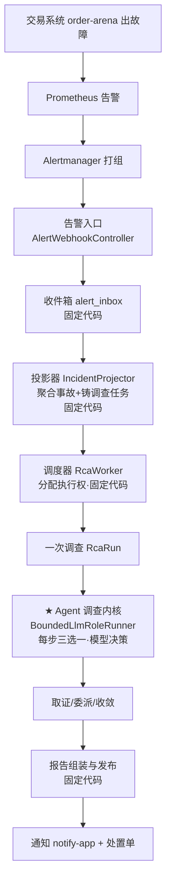
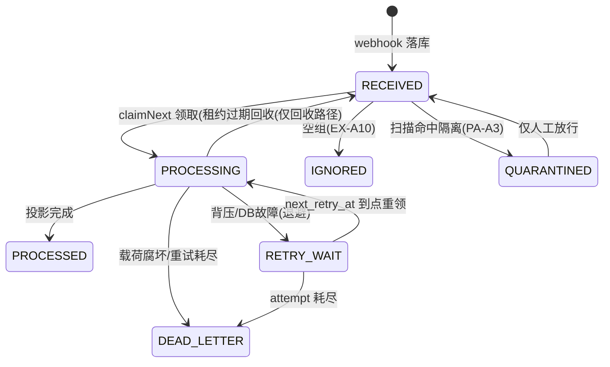

# 01-业务告警与为什么需要Agent

> 本系列第二篇。回答整个项目最重要的一个架构问题：**这里为什么需要 Agent，而不是普通固定 Workflow（工作流）？**
> 只以真实代码为据，标注约定同 00 篇：【代码事实】/【合理推断】/【设计扩展】/【未确认】。

# 本层要解决的问题

一句话：**交易告警进来之后，"登记、聚合、分类、派活"这些固定步骤用确定性代码做，而"到底查什么才能找到根因"这一段，每一步都取决于上一步看到了什么——这一段才用 Agent。**

# 先看一个交易告警

【代码事实】本项目自带一个交易系统模拟器 `order-arena`（订单创建 `OrderController`、支付网关模拟 `PaymentGatewaySimulator`、补偿 `CompensationWorker`、退款链 `RefundChainService`），评测时通过故障注入（`arena/application/chaos/FaultGate.java`、`FaultType.java`）制造真实故障。用它演主案例：

> **酒店 createOrder 接口成功率从 99.9% 突然掉到 92%，同时 P99 延迟从 200ms 升到 1.4s。**
> Prometheus 告警规则触发 `OrderFail` / `SLOBurn` 类告警（`IncidentClassifier.java:80-87` 里真实登记的告警名关键词：`orderfail`、`sloburn`、`checkoutfail`……），Alertmanager 打组后 POST 到本系统。

一个真人 SRE 接到这个告警会怎么查？

1. 先看监控：成功率曲线什么时候开始跌的？跌之前有没有毛刺？
2. 查这个服务的错误日志：是超时？是连接拒绝？是业务报错？
3. 如果日志静默——**换方向**：最近这两小时有没有发布？有没有配置变更？
4. 如果发现是某个下游（比如支付网关）报错——**再换方向**：改查支付网关的指标和日志；
5. 如果发现只有某一个机房/某一个实例失败率高——**再换**：按维度拆开对比；
6. 每一步都把"看到了什么"记下来，最后凑成一个有证据链的结论："根因是 X，证据是 A、B、C 互相印证"。

注意这里的关键特征：**第 2 步查什么，取决于第 1 步看到了什么；第 5 步查什么，取决于第 3、4 步的发现。** 下一步动作依赖上一轮观察结果——这就是本项目用 Agent 的全部理由，剩下都是工程实现。

# 如果没有这一层会怎样

分两个方向说。如果没有"自动调查"这一层，或者调查层做成了固定 Workflow：

**场景一：完全没有自动调查。**
告警只送到值班手机上。半夜三点值班工程师起床，从"这是哪个服务"开始人肉点开 Prometheus、Loki、发布记录——本项目代码里保留着这条人肉路径的痕迹：告警可以先路由到值班通道（`AlertWebhookController.java:72-82` 的 `ROUTED_ONCALL` 分支直连 `DutyDispatchService`），也就是说"通知人"和"通知 Agent 调查"是并列的两个出口。没有自动调查，MTTR（平均恢复时长）完全由人的响应速度决定；告警风暴时（一次 POST 最多 200 条告警，`AlertIntakeLimits.java:25`）人根本看不过来。

**场景二：做成固定 Workflow："告警 → 查固定指标 → 查固定日志 → 套模板出报告"。**
用本项目真实存在的工具清单（`DirectReadToolCatalog.java:26-43`，16 个只读工具）推演固定流程会在哪几步破产：

1. **指标查不出所有故障**。日志静默型故障（代码注释里真实出现过的场景："日志无异常的静默故障应改查 change.query/change.diff/alert.history/rca_history.search 等多源佐证"，`BoundedLlmRoleRunner.java:389-391`）——固定流程"查完日志就出报告"会把"没查到"当成"没故障"。
2. **下一步查什么没法预先写死**。指标异常类型有十几种（涨/跌/抖动/单实例/全集群），日志发现可能是下游错、可能是超时、可能是 OOM——组合爆炸，固定流程枚举不完；而模型一次决策天然就是在"这一步的观察"条件下选下一步。
3. **查询本身需要试错**。查指标要先知道指标名叫什么——本项目专门有 `prometheus.catalog`（按 service 查指标目录）和 `prometheus.label_values`（发现维度取值）这两个工具，代码注释写明设计意图是"先目录后查询，治乱猜"（`DirectReadToolCatalog.java:71-72`）。固定流程要么猜指标名，要么把所有指标全查一遍（上下文爆炸）。
4. **试错本身会犯错，需要反馈修正**。模型会拿错时间格式、会同参反复重试——本项目为此建了反馈环（`lastError` 随信封回喂，V88 迁移 `r7_checkpoint_last_error`；注释原话："盲重驱无反馈=模型连猜同错 4 次"，A0 八跑实证，`PrimaryCheckpoint.java:24-25`）。这说明真实跑起来后，"下一步怎么走"必然是动态修正的，写不成固定脚本。

**但是——注意另一半事实**：这个项目并不是"全程 Agent"。恰恰相反，代码里凡是**能**写成固定流程的部分，全部写成了确定性代码：告警接入、聚合、分类（`IncidentClassifier.java:9-10` 注释原话："纯函数、确定性、规则优先、**首期不接 LLM**"）、任务调度、报告发布、通知开单。Agent 只被关在"一次调查的取证决策"这一个小盒子里，还有 `maxSteps`、委派批上限 2、`VERIFY≤1` 等硬墙。这才是这道面试题的满分答法：**不是"Agent 比流程高级"，而是"先穷举哪些步骤固定，固定的全部代码化；只剩'下一步查什么'这一段真正依赖中间证据，才交给模型，并且用大量确定性代码把它关起来"。**

---

# 代码是怎么做的

## 0. 先给我一句话

这一层 = "告警登记聚合的固定流水线 + 装在流水线末端的一次有界 Agent 调查"：流水线负责把告警变成一次调查任务，Agent 负责在任务里决定每一步查什么、什么时候收口。

## 1. 业务上为什么需要这一层

见上文"先看一个交易告警 / 如果没有这一层会怎样"。

## 2. 它在整个系统的位置



固定代码段：D→H、J 之后到 L；模型决策段：只有 I 一个环节（J 里"委派批批不批"也是确定性代码裁决，见后文）。

## 3. 输入和输出

**这一"业务层"整体：**
- 收到：Alertmanager 的告警组 JSON（gzip 可选；限流边界：body ≤512KB、单组 ≤200 条、单标签 ≤2KB、标签总量 ≤32KB、嵌套深度 ≤32、解压后 ≤2MB——`AlertIntakeLimits.java:24-26`）。
- 处理：验签 → 落收件箱 → 拆组 → 聚合事故 → 铸调查 → Agent 调查 → 组报告。
- 产出：结构化诊断报告（`EvidencePackageV2`，含 summary、typed root_cause 三元组、symptom_codes、impact、remediation——提取逻辑在 `RcaRunOrchestrator.payloadFields`，RcaRunOrchestrator.java:594-611）→ 通知 + 处置单。
- 交给谁：通知渠道（notify-app）、处置单系统（OperatorCaseService.openOrMerge，RcaRunOrchestrator.java:489-526）。

**Agent 环节单独看：**
- 收到：确定性装配的调查信封（告警材料 + 证据有界摘要 + 工作记忆 + lastError 反馈 + `delegation_batches_remaining` 预算面）。
- 产出：一个互斥决策 JSON（`PrimaryDecision`：tool_call / delegate / final 三形状恰选一）。

## 4. 真实代码入口

**业务入口**（告警进门）：
- 文件：`control-app/src/main/java/com/objwww/pr/control/alert/interfaces/AlertWebhookController.java`
- 类/方法：`AlertWebhookController.receive`（:56-100）
- 调用方：Alertmanager（HTTP 客户端，外部）
- 下游：`ControlAlertRouter.guard`（:70，控制面声明组三面门）→ `DutyDispatchService.dispatchSystem`（值班通道）；或 `AlertIntakeService.store`（:91，业务路落 inbox）
- 关键参数：`authorization`（验签，失败 401）、`contentEncoding`（gzip 判定）、`body`（原始字节，零解析先落库）；返回值 `ResponseEntity`，五种状态码各有明确业务语义（:21-36 注释）

**决策入口**（Agent 每一步）：
- 文件：`control-app/src/main/java/com/objwww/pr/control/alert/application/agent/BoundedLlmRoleRunner.java`
- 类/方法：`BoundedLlmRoleRunner.drive(RoleDriveRequest)`（:213-313）
- 调用方：`NativeInvestigationExecutor`（infrastructure/nativeexec/，调查执行器，sweep 上限 8 轮，:99）
- 下游：`ContextAssembler.assemble`（装配信封）→ `RcaActionGuard.guardedModelCall`（守卫+调模型）→ `PrimaryDecision.parse`（解析）→ 三个 drive 分支
- 关键参数：`RoleDriveRequest{task, binding, profile, callContext, startEpoch, endEpoch}`（RoleRunner.java:29-35）——task 是当前任务行（带租约身份），binding 是持久绑定（角色版本/configEpoch），profile 是冻结的四件套 Agent 身份；返回值 `RoleDriveResult`（结局封闭枚举 + 新证据 id 列表）

## 5. 核心对象

| 对象 | 是什么 | 谁创建 | 谁读 | 谁改 | 生命周期 | 持久化 |
|---|---|---|---|---|---|---|
| `AlertInbox`（收件箱行） | 一次 webhook POST 的原始落库 | `AlertIntakeService.store` | `AlertInboxProcessor` | processor（状态流转） | 消费完即终态，行保留 | PG `alert_inbox`，跨重启 |
| `Incident`（事故） | 同一告警的聚合实体 | `IncidentProjector` upsert | 编排/收尾/查询 | 投影器、收尾事务 | episode 期间长期存在 | PG `incident`，跨重启 |
| `RcaRun`（调查） | 一次自动调查 | 投影器/RERUN 铸造点 | worker/supervisor/收尾 | 状态机迁移 | 铸造到终态 | PG `rca_run` |
| `RcaTask`（任务） | run 里的执行单元 | 投影器/Supervisor 落图 | worker | claim/finish/回收 | 铸造到终态 | PG `rca_task` |
| `PrimaryDecision`（决策） | 模型一步的三选一输出 | `PrimaryDecision.parse` 解析模型回复 | BoundedLlmRoleRunner | 不可变 record | 单步内即弃 | 不持久化（决策后果落检查点/账本） |
| `AgentProfile`（角色身份） | prompt+工具白名单+预算+输出 schema 四件套 | 启动装配（AgentRegistry） | runner/guard | 不可变深冻结 | 进程级 | 内容可对账（稳定 digest） |

【代码事实】`PrimaryDecision` 是"模型输出不可信"原则的结构化体现——javadoc 原话："模型输出不可信：本类只做结构裁决；目录/权限/预算/去重/任务上限等确定性校验归 Supervisor"（PrimaryDecision.java:17-20）。

## 6. 一条真实调用链

以"酒店 createOrder 成功率下降"告警为例，从进门到 Agent 第一步：

```
Alertmanager
↓ HTTP POST /webhooks/alertmanager
AlertWebhookController.receive（:56）                     [固定] 验签+尺寸闸，原始字节落库
↓
AlertIntakeService.store → alert_inbox 行(RECEIVED)       [固定] 202 返回，AM 的重试到此为止
↓
AlertInboxProcessor.processOnce（:103）                    [固定] claimNext SKIP LOCKED 领取→PROCESSING
↓
AlertPayloadParser.parse（:113）                          [固定] 拆组；腐坏→DEAD_LETTER（:117）
↓
IncidentProjector.project（单事务，:128-129）              [固定] alert_event 幂等追加
    → incident upsert（episode 水印乱序收敛）              [固定] FIRING↔RESOLVED 二态+generation
    → CanaryRouter.route 定引擎                            [固定] 铸 rca_run(QUEUED)+rca_task(READY)
↓
RcaWorker.runOneCycle（:367）                              [固定] 槽+任务同事务领取→LEASED
↓
NativeInvestigationExecutor.execute                       [固定] 读提案→Supervisor 落任务图
↓
BoundedLlmRoleRunner.drive（:213）                        [★动态] 读检查点→装配信封→调模型
↓
PrimaryDecision.parse（:177）                              [固定] 结构裁决：恰好一个分支键
↓
TOOL_CALL / DELEGATE / FINAL 三分支                        [混合] 模型选路，代码逐闸校验
```

## 7. 状态机

这一层涉及三个状态机【代码事实】：

**收件箱七态机**（`InboxStateMachine.java:6-14`，"七态"= RECEIVED/PROCESSING/PROCESSED/RETRY_WAIT/IGNORED/DEAD_LETTER/QUARANTINED）：



- 谁修改：`AlertInboxProcessor`（写点全部先过 `requireTransition`，AlertInboxProcessor.java:152-154）+ 仓储 SQL 条件迁移（claimNext/reclaimExpired）；
- 存在哪：`alert_inbox.state` 列；进程挂掉后还在（PG）。

**事故二态事实机**（`IncidentStateMachine.java:15-16`）：FIRING ↔ RESOLVED。执行状态不混入（注释"评审 #2"）。generation 规则：firing→resolved 保持代数；resolved→firing（同 episode 复燃）generation+1 新 episode（:31-36）。这个 generation 后面会变成"发布赢家 CAS"和 RERUN 的关键维度。

**调查运行态**（9 态）与任务态（11 态）：QUEUED/RUNNING/REPORTING 为活跃集（`RcaRunState.java:20-22`）；任务 READY→LEASED→DONE/RETRY_WAIT/DEAD/STALE 等——这两张留给 09/12 篇逐边精读，本篇只说与"为什么需要 Agent"相关的：**调查任务在 LEASED 期间，Agent 在里面自由走步；但铸造（什么时候开始调查）和收尾（调查怎么算完）都是状态机的确定性迁移，模型碰不到。**

## 8. 正常业务流程（业务步骤 + 代码调用 + 状态变化 三对应）

| # | 业务动作 | 代码调用 | 状态变化 |
|---|---|---|---|
| 1 | 告警到达，门卫验签 | `AlertWebhookController.receive` | inbox 无→新建 RECEIVED；202 |
| 2 | 后台消费领取 | `AlertInboxProcessor.processOnce` | RECEIVED→PROCESSING |
| 3 | 聚合成事故并铸调查 | `IncidentProjector.project` 单事务 | incident: 新建 FIRING（或已有则累加计数）；rca_run: QUEUED；rca_task: READY |
| 4 | inbox 行终局 | `inbox.complete` | PROCESSING→PROCESSED |
| 5 | 工作节点抢到活 | `RcaWorker.claimWork` | task READY→LEASED（leaseOwner/epoch 落行）；run QUEUED→RUNNING |
| 6 | Agent 第 1 步：查成功率指标 | `drive`→模型→`{tool_call:{tool_id:"prometheus.query",...}}`→ToolGateway | 检查点 decisionSeq+1/steps+1；证据落账；工具账本 PENDING→SUCCEEDED |
| 7 | Agent 第 2 步：看到错误集中在支付网关调用，改查下游 | 同上，模型改选 `logs.aggregate`（service=payment） | 同上，证据 +1 |
| 8 | Agent 第 3 步：日志证实是支付网关超时，但要不要委派专项？| 模型出 `delegate` → `DeterministicSupervisor.adjudicateDelegation` | 获批：检查点→WAITING_CHILDREN，子任务 READY；批次 batchesUsed+1 |
| 9 | 子任务由确定性子 Agent 执行 | `MetricsAgent.investigate`（固定单工具，**不调模型**） | 子 task LEASED→DONE；委派回执落库 |
| 10 | 唤醒主 Agent 复判 | `drive` 里 WAITING_CHILDREN 分支→`supervisor.wakePrimary` | 检查点→PRIMARY_READY（批次结清才放行） |
| 11 | Agent 收口：出带证据的结论 | 模型出 `final` → `PrimaryClaimAdmission.admit` 代码准入 | 检查点 FINAL_PROPOSED（claims 落检查点） |
| 12 | 报告组装、收尾、发布 | `NativeReportAdapter`→`finishTask`（四道栅栏） | task→DONE；run→SUCCEEDED；报告落档；发布赢家 CAS；通知/开单 |

第 6~10 步就是"Agent 存在的理由"：如果第 6 步看到的是"所有机房均匀劣化"，第 7 步就会改查发布变更（`change.diff`）——**业务上这一步走哪条路，代码里没有 if-else，只有模型看着信封里的证据现场决定。**

## 9. 异常流程（这一层 + 全链对照）

逐项过检查单。标注" handled@层" = 本系列第几篇细讲。

| 异常 | 处理了吗 | 怎么处理（真实代码） |
|---|---|---|
| 告警载荷超大/超条数 | ✅ 本层 | 入口六限（AlertIntakeLimits.java:24-26），400/413 零落库 |
| 告警验签失败 | ✅ 本层 | 401（SecurityFilterChain + ControlAlertRouter 防自噬三面门） |
| 载荷腐坏/缺 alertname | ✅ 本层 | `AlertInboxProcessor:117,141` 直接 DEAD_LETTER（"重试无意义"） |
| DB 故障（落库/投影） | ✅ 本层 | 投影单事务回滚；inbox RETRY_WAIT 退避（:146-147）；webhook 返 503 让 AM 整组重试 |
| 同一告警重复投递 | ✅ 本层 | `uq_alert_event_dedup` 幂等：重复只累加 notification_count，不重铸 run（IncidentProjector.java:42-43） |
| 模型调用超时/失败 | ✅ Agent 层 | `RcaModelCallException` 封闭原因码；同签名×2 熔断→确定性未决 FINAL（BoundedLlmRoleRunner.java:662-678）→ 09/15 篇 |
| 模型输出非法 JSON | ✅ Agent 层 | 围栏整形（去 markdown 围栏，:684-695）+ DECISION_UNPARSEABLE 计步重驱（:283-293） |
| 模型输出合法 JSON 但字段乱来 | ✅ Agent 层 | `PrimaryDecision.parse` 未声明字段显式拒绝、互斥结构性保证（:177-261） |
| 工具参数错误 | ✅ 工具层 | INVALID_ARGS + 具体拒绝原因回喂（:366-374）→ 16 篇 |
| 工具超时 | ✅ 工具层 | 硬 deadline + cancel(true)，迟到结果丢弃（ToolGateway.java:30-31） |
| 工具返回空 | ✅ 工具层 | NO_DATA（"无故障不制造证据"，SingleToolEvidenceAgent.java:39-41） |
| 同参反复空查 | ✅ Agent 层 | DoomLoopGuard 熔断该查询签名（:381-395） |
| 子任务失败 | ✅ 委派层 | 裁决回执+拒绝码回喂；子任务终态由 Supervisor 复判 → 07/08 篇 |
| Redis 失败 | ➖ 不适用 | 本项目无 Redis（00 篇第 14 节） |
| Worker Crash | ✅ 调度层 | 双租约过期回收 + epoch+1 拒旧提交 → 14 篇 |
| 进程重启 | ✅ 调度层 | recoverExpired 扫描 + 检查点续驱（RcaWorker.java:266-287） |
| 重复任务 | ✅ 调度层 | claimNext 单语句 SKIP LOCKED；活跃 run 部分唯一索引 `uq_rca_run_active_incident` |
| 状态更新失败 | ✅ 调度层 | CAS 0 行=放弃提交权（LeaseFence），一行不写只留审计 |
| 重复唤醒 | ✅ 委派层 | wakePrimary 幂等复判，STILL_WAITING 则继续等 |
| 模型陷入循环 | ✅ Agent 层 | RoleLoopGuard 独白硬停（:298-305）+ DoomLoopGuard |
| 达到最大步数 | ✅ Agent 层 | 步数耗尽→确定性 FINAL（零模型调用，:231,510-531） |
| 上下文过长 | ✅ Agent 层 | 装配界限（证据≤20/轨迹≤8）+ CAPABILITY_INPUT_TOO_LARGE 封闭码（RcaModelGateway.java:53）+ 压缩服务 → 11/13 篇 |

## 10. 并发问题

本层最典型的三个并发点【代码事实】：

1. **同一个交易告警会不会创建两个调查？** 不会：活跃 run 有部分唯一索引 `uq_rca_run_active_incident`（RcaRunState.java:12-13 注释：报告组装期间同 incident 也不得再开新 run），投影事务内 upsert + 该索引兜底；`IncidentWaitingRedrive.java:33-36` 注释同样点名"incident 行锁 + uq 兜底"。
2. **重复告警重复投影？** alert_event 幂等追加（去重键），重投只加计数；"崩溃缝隙由租约过期回收 + event 幂等兜底（重投不重铸 run）"（AlertInboxProcessor.java:33）。
3. **两个 inbox 消费者抢同一行？** `claimNext` SKIP LOCKED + 租约（AlertInboxProcessor.java:21-22），领取即 PROCESSING 离开可见集，杜绝双领窗口。

## 11. 崩溃恢复（本层片段）

模拟：`AlertInboxProcessor` 刚 `claimNext` 把行置为 PROCESSING，进程被 `kill -9`。
- 已保存：原始载荷（webhook 落库时已持久）、inbox 行 PROCESSING 态、leaseOwner/leaseUntil。
- 没保存：本次消费进度（无所谓——投影未执行，无副作用）。
- 任务会不会丢？不会：另一实例（或本进程重启后）的 `reclaimExpired`（AlertInboxProcessor.java:191）把租约过期的 PROCESSING 置回 RECEIVED（InboxStateMachine 里这条边"仅回收路径可用"，InboxStateMachine.java:13-14）。
- 从哪一步继续？从 RECEIVED 重新整行消费；就算投影已提交一半，`alert_event` 幂等键保证重放零副作用——**这一层靠"幂等 + 回收"恢复，还没用上检查点；检查点是调查层的事（14 篇）**。

## 12. 安全（本层片段）

- **认证**：webhook 两条线——机器 bearer（`MachineBearerAuthnFilter` 铸 `ROLE_MACHINE_WEBHOOK`）+ `AlertWebhookHmacFilter`；401 fail-closed（AlertWebhookController.java:26-28）。
- **入口防自噬**：控制面自己声明的告警组（RCA_SYSTEM 家族）走三面门（身份/route 白名单/monitoring_scope 白名单），防"Agent 的告警把自己又触发一遍"，REJECTED 零落库（:65-69）。
- **为什么不能只在 Prompt 里告诉模型别做危险操作？** 本层给出了系统级答案的雏形：入口的尺寸/深度/验签全是代码闸，模型根本还没上场。到调查层这条原则升级成完整版本——白名单校验、schema 硬拒绝、R2/R3 零执行、Guardian 三值裁决、Hardline 清单，全部是模型之外的硬约束（详见 04/16/23 篇）。

## 13. Agent Harness（模型 vs 脚手架，本层切分）

| 事情 | 谁负责 | 代码证据 |
|---|---|---|
| 下一步查指标还是查日志、要不要委派、何时收口 | **模型**（在硬边界内） | PrimaryDecision 三分支 |
| 决策必须是合法 JSON、恰好一个分支、无野字段 | **Harness** | `PrimaryDecision.parse`（:177-261） |
| 每步能不能真的发模型请求（预算/租约/取消/角色版本） | **Harness** | `RcaActionGuard` 固定序（:20-28） |
| 最多走几步、最多委派几批 | **Harness** | maxSteps + MAX_DELEGATION_BATCHES=2 |
| 委派批批不批、建不建子任务 | **Harness**（确定性裁决） | `adjudicateDelegation` 封闭拒绝码 |
| FINAL 里的 Claim 算不算数 | **Harness**（代码准入） | `PrimaryClaimAdmission.admit` |
| 步数耗尽后怎么结束 | **Harness** | 确定性 FINAL，零模型调用 |
| 工具能调哪些、参数什么形状 | **Harness** | allowlist + ToolGateway schema 闸 |

一句话：**模型的"判断"只发生在"选哪个分支"这一格子里；格子的边界、地板、天花板全是 Harness 浇死的。**

## 14. 可观测性（本层片段）

- 一次调查从头串到尾的主键链：`incident_id → run_id → task_id → attempt_id → (checkpoint task_id) → tool_invocation / model_call 行`——00 篇存储地图里的账本群全部带这条外键链；
- 本层另有结构化事件（`StructuredLog.event`，如 `rca_task_decision`，RcaRunOrchestrator.java:306-311）+ inbox 行终局四路径的 log-warn；PA-A6 起 inbox tick 有 micrometer tracing span（AlertInboxProcessor.java:189）；
- 评测面事后能看到每步决策的分支名（`branchName()`，PrimaryDecision.java:358-360）。

## 15. 性能和成本（本层片段）

- **串行/并行**：接入-聚合是每行串行小事务（但多消费者并行领取）；一次调查内部，主 Agent 步与步必然串行（每步依赖上步观察），委派的子任务与主任务并行（WAITING_CHILDREN 不占主线程）。
- **模型调用占大头**：每步一次模型调用（估算 ≥1500 token/步预留，BoundedLlmRoleRunner.java:47）；固定代码段（接入/聚合/调度/发布）零模型调用。所以**整个系统的时延与成本几乎都集中在 Agent 循环里**——这也是为什么预算（TOKEN 维 reserve/commit/release）和步数上限要在 Harness 里卡死。
- **背压**：告警洪峰会先在 inbox 层软背压（DEFERRED→RETRY_WAIT，backlog 回落再补投），调查层还有 WAITING_CAPABILITY/DEFERRED 事故的等待重驱（IncidentWaitingRedrive.java:29-33）。
- **QPS 扩大 10 倍先坏哪里**【合理推断，依据代码结构】：第一是模型网关配额/熔断（ModelGateway 冷却与熔断面），第二是并发槽位（`SchedulerSlotRepository` 总槽位是调查并发上限），inbox/PG 本身有幂等与租约，最后才会坏。

## 16. 设计取舍

**① 为什么 Agent 只装在"调查"这一段，而不是全流程 Agent 化？**
因为接入/聚合/分类/发布这些步骤的输入输出是封闭集合（状态码、字段、状态迁移），确定性代码可以做到零幻觉、可审计、可重放（IncidentClassifier 连 LLM 都不接，:9-10）。而"下一步查什么"的输入是开放的证据空间，穷举不了。**边界画在"输入空间是否可穷举"上，不是画在"哪段更智能"上。**

**② 为什么不是"多个自由协作的专家 Agent"？**
代码的真实答案：委派是**主 Agent 单向发起、确定性 Supervisor 裁决、固定三种角色接单**的星型结构，批上限 2、角色不许再生 Agent（AgentProfile javadoc："不可自由生 Agent"，AgentProfile.java:17；RunnerDirectory 拒绝未部署的运行器类型）。自由协作 = 上下文分裂 + 死循环风险 + 成本失控，换来的是演示价值不是根因命中率。代价：表达力受限（嵌套委派不可能），本项目认为值得【这是代码事实+设计意图的复合表述】。

**③ 当前方案最大的边界是什么？**
- 调查质量上限被三样东西钉死：工具面（16 个只读工具覆盖不到的数据源就真查不到）、角色面（metrics/logs/change 三种委派）、预算面（maxSteps + 批 2）。超出的部分 honest failure：缺口写进 `missing_information`，报告标 `NO_CONFIRMED_ROOT_CAUSE`（RcaRunOrchestrator.java:502-503）——"流程终止≠根因确认"是代码里的原话级原则（BoundedLlmRoleRunner.java:231）。
- 模型换了，调查路径就变（同参不同路），所以配套了整个 eval 面做回归（20/21 篇）。

## 17. 面试背诵卡

【30 秒主答】
"这个项目里 Agent 不是到处都是，而是只装在'一次告警调查'的取证决策里。接入、聚合、分类、调度、发布全是确定性代码——分类器甚至明确写着首期不接 LLM。为什么只在调查段用 Agent？因为真人排查时，下一步查什么取决于上一步看到了什么：指标看不出问题就改查日志，日志静默就改查发布变更，发现下游错就追下游。这个分支组合是穷举不完的，写不成固定 Workflow。但我们也不给模型自由发挥：每步只能在'取一种证据 / 委派一次 / 收口'里三选一，委派由确定性 Supervisor 裁决，结论要过代码准入，步数耗尽就走零模型调用的兜底结束。一句话：固定的代码化，动态的关进有界循环。"

## 18. 这一层哪些话不能说

1. ❌ "我们的系统是一个全自动多智能体自主协作平台" → ✅ 真实结构：确定性流水线 + 星型单点委派（主 Agent 唯一委派方，三种固定角色）。
2. ❌ "分类/聚合也是大模型做的，更智能" → ✅ `IncidentClassifier` 是纯函数规则表，注释明说首期不接 LLM。
3. ❌ "模型可以自由调用任何工具完成调查" → ✅ 白名单内 16 个 R0 只读工具 + schema 闸；副作用工具走审批链，主循环碰不到执行权。
4. ❌ "Agent 会一直思考直到找到根因" → ✅ 步数耗尽/回环/模型失败三种确定性兜底结束，允许"未决+缺口清单"收场。
5. ❌ "RERUN/重试是模型决定的" → ✅ RERUN 是收尾事务里比较 investigation 材料哈希的确定性分支（RcaRunOrchestrator.java:358-364）。
6. ❌ 不要引用仓库 `docs/` 里的旧文档数据 —— 已过时，一切以代码为准。

---

# 我现在应该能回答什么

1. 为什么这个系统用 Agent 而不是固定 Workflow？哪些步骤固定、哪一步必须动态？（→ 第 1、16 节）
2. "下一步取决于上一步"在代码里长什么样？（→ `PrimaryDecision` 三分支 + 信封反馈环 lastError）
3. 模型和代码的分工边界画在哪？（→ 第 13 节切分表 + "输入空间可否穷举"判据）
4. 同一个告警重复到达，会不会重复调查？（→ 去重键 + 活跃 run 唯一索引 + RERUN 语义）
5. 告警洪峰时系统怎么不崩？（→ 入口六限 + inbox 软背压 + 调查槽位 + 模型预算）

# 30 秒背诵卡

见上文第 17 节【30 秒主答】，可直接背。

# 面试官追问卡

**Q1：你说"下一步依赖上一步"，能给一个具体例子吗？**
考什么：是不是真懂动态决策，不是背概念。
30 秒答："可以。日志静默型故障：Agent 先查错误日志聚合，返回 NO_DATA，这个空结果随信封进入下一步；系统还专门在熔断反馈里写明了这条路——'日志无异常的静默故障应改查 change.diff、alert.history、历史判例等多源佐证'。也就是说查日志→零数据→改查发布变更，这个转折不是预先编排的，是模型看到空结果后现场改的主意，Harness 只负责把'空结果'这个事实如实喂回去。"
继续追问 1："那如果模型不改主意，非要再查一次一样的日志呢？"——答："有 DoomLoopGuard：同一查询签名连续零进展就熔断该签名，反馈明说'禁止同参重发'，但只熔断这一个签名不废整个调查，模型改参数或换工具都行。"
继续追问 2："空结果为什么不直接判'无故障'？"——答："工具层的契约是空序列=NO_DATA，注释原话'无故障不制造证据'——零数据是观察不是证据，判断留给有完整上下文的一步。"

**Q2：哪些部分绝对不能让模型决定？**
考什么：架构边界意识。
30 秒答："凡是涉及'执行权'的都不能：任务什么时候开跑和收尾（状态机）、钱和 token 花多少（预算账本 reserve/commit/release）、能碰哪些工具（白名单+网关双闸）、委派批不批（确定性裁决封闭拒绝码）、结论算不算数（代码准入）、危险操作执不执行（Guardian 三值+人工审批）。项目里的原话级原则是'模型无调度权'。"
继续追问 1："为什么委派裁决不给模型？"——答："建子任务=花别人的预算+占执行槽，这种资源决策必须可审计可重放，封闭拒绝码（GAP 已有台账/配额耗尽/角色未知）每一条都能落审计。"
继续追问 2："那模型到底还能决定什么？"——答："在格子内选路：16 个只读工具里挑哪个、参数是什么、要不要委派、什么时候提交 FINAL。判定权全在代码。"

**Q3：固定 Workflow 到底输在哪，举个例子？**
考什么：能不能落到工程细节，不是空对空。
30 秒答："查询前置依赖。查指标前得知道指标名——固定流程要么硬编码（新故障新指标就废），要么全量拉取（上下文爆炸）。这个系统专门做了两级工具：先 prometheus.catalog 按 service 查指标目录，再 prometheus.metric_value 查具体值，代码注释写明这是'先目录后查询，治乱猜'。这种'先发现后查询'的依赖链在固定流程里要为每种故障手工展开，Agent 路径里是模型按需走两步。"
继续追问 1："这不会多花一步模型调用吗？"——答："会，这正是取舍：多一次小模型调用换掉上下文爆炸和查询盲猜，预算面还为此留了每步 1500 token 的保守估值。"
继续追问 2："那为什么不全用大上下文模型一把梭？"——答："成本不可控且仍不解决'下一步依赖上一步'的分叉问题，而且项目有专门的上下文治理（证据≤20 条截取+压缩服务），堆上下文是反方向。"

**Q4：同一个告警 1 秒内打了两次，会发生什么？**
考什么：幂等思维。
30 秒答："第一次：inbox 落行 RECEIVED，投影后 alert_event 落库、incident 计数+1、铸 run/task。第二次：webhook 照样 202（入口不判重，判重在投影）；投影时撞 alert_event 去重唯一键，只把 incident 的重复通知计数+1，不重铸 run——注释原话'重复 alert 只累加计数，不重铸 run'。就算两个消费者同时处理两条 inbox 行，还有活跃 run 部分唯一索引兜底，第二个 run 插不进去。"
继续追问 1："如果第二次告警时调查已经在跑，材料变了怎么办？"——答："投影只更新 pending 材料哈希，不打断在跑的 run；收尾事务发现 pending≠本轮快照，清 pending 并铸 RERUN——不丢新材料也不浪费旧调查。"
继续追问 2："告警恢复（resolved）晚到怎么办？"——答："episode 水印：startsAt 早于水印的晚到事件只计数不改状态，防止把已恢复的事故复活成 FIRING。"

**Q5：这个系统里什么叫"调查结束"？模型说完成就算完成吗？**
考什么：终止条件的确定性思维。
30 秒答："不算。模型提交 FINAL 只是'提案'，要过 PrimaryClaimAdmission 代码准入：每条 Claim 必须引用本 run 真实存在的证据 id、evidence_roles 必须是 SUPPORTS/REFUTES/CONTEXT 封闭集、无证据引用的断言整案拒绝。就算模型一直不提交，也有三条确定性终止线兜底：maxSteps 耗尽、独白回环硬停、同签名模型失败×2——全部走零模型调用的确定性 FINAL，以'未决+缺口清单'诚实收场。流程终止不等于根因确认，这是代码注释里的原话。"
继续追问 1："准入拒绝后模型还能改吗？"——答："能，拒绝理由随 lastError 回喂，步数预算内重新取证再提案；Jev 复核发现缺口还会结构化打回重驱。"
继续追问 2："怎么防止'模型说完成'骗过系统？"——答："报告相位的证据快照是冻结的，Claim 只能引用快照成员，成员身份不符直接显式失败——引用造假在结构上走不通。"

**Q6：如果让你重新设计，你会把 Agent 边界画得不一样吗？**【设计扩展——这是设计题答案，不要说成现网实现】
考什么：REDO 能力。
30 秒答："我会保留'确定性外壳+有界内核'的骨架，但有两处可以再想：一是分类器现在刻意不接 LLM，如果告警词汇表外的告警占比高，可以做一个'规则优先、LLM 只兜底 UNCLASSIFIED 且结果只进影子对比'的分层；二是委派角色目前固定三种，可以把'角色目录'做成配置资产灰度放量——项目里其实已经有 ConfigBundle/Prompt 工作台和 Canary 路由这个基建，方向是现成的。但调度权、预算、终止权这三样我照样不会给模型。"

**Q7：告警风暴（一次 500 条告警）进来会怎样？**
考什么：容量与背压。
30 秒答："单次 POST 上限 200 条（超了 413，AM 侧配置 max_alerts=100 留了头寸），所以 500 条会分三个组。每组先落 inbox（202 秒回，AM 的重试压力被收件箱吸掉）；消费端claim 领取逐行投影；如果系统自己过载，投影有软背压 DEFERRED——行进 RETRY_WAIT 退避补投。调查端不是每条告警必然立即开跑：并发槽位有限，多余任务排队；还有 WAITING_CAPABILITY/DEFERRED 的等待重驱扫描，backlog 回落后自动补铸。"
继续追问 1："排队会不会把 SLA 排爆？"——答："任务带 deadlineAt（SLA 策略按优先级算），对账看门狗会识别硬期限到达并按灰度模式终止过期 run，而不是无限排队。"
继续追问 2："重投会不会重复调查？"——答："不会，同上题的幂等三件套。"

**Q8：为什么分类器规则表连个权重分都不打？**【设计扩展倾向，但锚定代码】
考什么：简单性纪律。
30 秒答："代码注释给了答案：表序即冻结优先级，首条命中即裁决，'没有权重分值'——多命中时优先级和 ruleId 就是全部依据。权重打分需要标注数据和持续调参，规则序只需要 Git 审查（改表必须改 RULE_VERSION）。而且零命中诚实返回 UNCLASSIFIED，'不给假概率'。这个选择和整个系统的 taste 一致：能确定性的绝不引入概率。"

# 这层不要乱说什么

1. 不要说"全程 Agent 驱动"——固定流水线占了入口到调查之间的全部。
2. 不要说"多智能体自主协商"——星型单点委派 + 确定性裁决，没有 Agent 间自由通信。
3. 不要说"模型负责调度任务"——代码原话"模型无调度权"。
4. 不要把 `IncidentClassifier`、`ControlAlertRouter` 说成 AI 模块——纯规则/纯闸门。
5. 不要说系统"学习"了什么——没有任何在线学习机制，改进走 Prompt/配置 Bundle 灰度 + 评测回归。
6. 性能数字（QPS、延迟、命中率）一律【未确认】，代码里只有机制没有运行值。

# 5 句话总结

1. **为什么需要**：排查告警时下一步查什么取决于上一步看到什么，这个动态分支穷举不完，所以只有调查段用 Agent，其余全部确定性代码。
2. **核心机制**：模型每步只在"取证/委派/收口"三选一，输出过结构裁决，行动过逐闸校验，终止有确定性兜底。
3. **上下游协作**：上游固定流水线把告警变成带租约的调查任务，下游确定性收尾把结论变成报告、通知、处置单。
4. **最大风险**：调查质量被工具面/角色面/预算面钉死，模型在边界内也可能走出低效路径——靠反馈环和熔断纠偏，靠评测面兜质量。
5. **最大取舍**：用"自由度换可控性"——不给模型调度权、执行权、终止权，换来每一步可审计、可重放、可崩溃恢复。

---

*本篇完成。下一篇待你指令解锁：《02-入口层》。*
