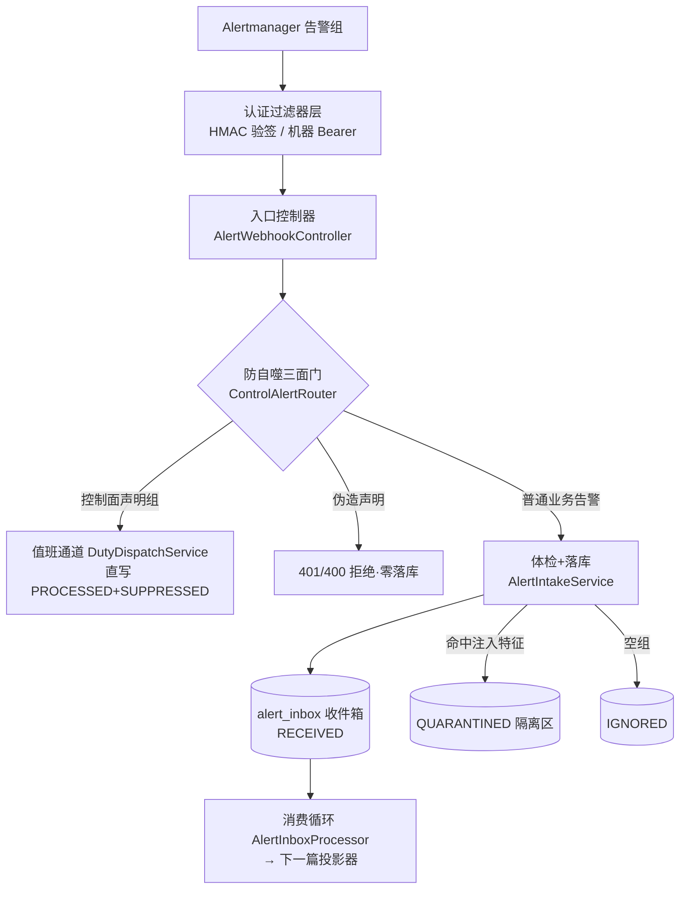
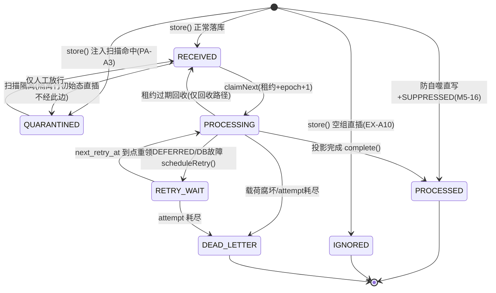

# 02-入口层

> 本系列第三篇。入口层 = 告警从 Alertmanager 进系统到落库待处理的那一段。
> 标注约定同前：【代码事实】/【合理推断】/【设计扩展】/【未确认】。

# 本层要解决的问题

一句话：**在"任何业务逻辑都没开始跑"之前，把不可信的外部输入拦死、把可信的原始告警一字不落地存下来，并保证"同一份告警不管重发多少次、进程死多少回，最终效果都一样"。**

# 先看一个交易告警

> 深夜，酒店 createOrder 成功率告警触发。Alertmanager 把 12 条相关告警打成一组，POST 到本系统。
> 但这一组 JSON 在到达业务代码之前，要过六道关卡：**是谁发的（认证）→ 是不是我们自己的告警在照自己（防自噬）→ 包有多大（尺寸）→ 结构对不对（schema）→ 内容里有没有想操纵模型的字眼（注入扫描）→ 落库（原子持久化）**。
> 任何一道不过，AM（Alertmanager）要么收到 4xx 永不重试（垃圾零落库），要么收到 503 稍后整组重发（我们的故障不丢数据）。

# 如果没有这一层会怎样

1. **恶意/畸形载荷直接打进业务流**：一个 2GB 的标签、一层 10 万层的 JSON 嵌套、一个伪造成控制面的告警——没有入口闸，这些东西会撑爆解析器、污染事故聚合，甚至顺着告警文本一路进到模型上下文里（提示词注入）。本项目真实存在这道防线：`AlertInjectionScanner` 的注释原话——漏隔离的成本是"告警内容进入模型上下文"（AlertInjectionScanner.java:18-19）。
2. **重复投递造成重复调查**：AM 对 5xx 会整组重试，如果入口不是"先落库、后处理"，一次网络抖动就会让同一告警开两个调查、发两份报告、开两张处置单。
3. **处理慢拖垮接收**：告警处理后面跟着数据库事务、聚合、铸任务，如果 HTTP 请求同步等这些做完，AM 的 10 秒超时（`AlertIntakeLimits.java:4` 注释：AM 侧 webhook_configs timeout=10s）一到就重发，雪崩。

---

# 代码是怎么做的

## 0. 先给我一句话

入口层就是一个"验签-体检-登记"三段式收发室：请求先证明身份，再过结构体检和注入扫描，最后原始字节一次性落进收件箱表就回 202——后面所有业务都从收件箱异步慢慢消化。

## 1. 业务上为什么需要这一层

见"先看一个交易告警/如果没有这一层会怎样"。补充一个只有真实系统才会遇到的坑【代码事实】：**入口语义必须和 Alertmanager 的重试行为严丝合缝**——`AlertWebhookController.java:24-31` 注释写明了这条契约的出处（webhook.go 源码事实）：AM 只对 5xx 整组重试、不读 Retry-After 头、不重试 4xx。所以本层的状态码不是随手定的：401（验签失败）/400、413（结构非法，**零落库**，因为重试也没用）/503（仅整组无法持久化，AM 会整组重试）/202（整组落库，含空组）。状态码即协议。

## 2. 它在整个系统的位置



## 3. 输入和输出

- **收到**：HTTP POST `/webhooks/alertmanager`，JSON（可选 gzip），头部带认证（Authorization: Bearer …，可选 X-PA-Signature 系列签名头）。尺寸边界：body ≤512KB、单组 ≤200 条、单标签 ≤2KB、标签总量 ≤32KB、嵌套深度 ≤32、解压后 ≤2MB（`AlertIntakeLimits.java:24-26`）。
- **处理**：认证（过滤器）→ 防自噬判定（`ControlAlertRouter.guard`）→ 结构校验链（`AlertIntakeService.store`）→ 注入扫描 → 整组一行落库。
- **产出**：一行 `alert_inbox`（原始字节 + sha256 摘要 + 状态 + 租约字段），HTTP 202 返回 `inboxId`。交给谁：`AlertInboxProcessor` 消费循环（01 篇已讲），以及 ROUTED 分支的 `DutyDispatchService`。

## 4. 真实代码入口

**HTTP 入口**：`alert/interfaces/AlertWebhookController.java`，类 `AlertWebhookController`（`@RestController @Profile("docker")`，:38-40——**默认 profile 没有数据源，整个入口随 docker profile 才暴露**），方法 `receive`（:56-100）。

- 调用方：Alertmanager（外部 HTTP 客户端）。
- 下游：`ControlAlertRouter.guard` → `AlertIntakeService.store` / `DutyDispatchService.dispatchSystem`。
- 关键参数的业务意义：`authorization`——机器身份凭证（缺失/错误=401）；`contentEncoding`——gzip 判定，决定是否解压（解压有炸弹上限）；`body` 是 `byte[]`——**先当字节看，不当 JSON 看**，任何解析发生在尺寸检查之后。
- 返回值：`ResponseEntity<Map>`，`inboxId` 让调用方（和排障的人）能对上行。

**落库服务**：`alert/application/AlertIntakeService.java`，方法 `store(byte[] raw, boolean gzipEncoded)`（:61-125），返回 inbox 行 id。

**消费入口**：`AlertInboxProcessor.processOnce`（:103，01 篇已详述）。

## 5. 核心对象

**`AlertInbox`（收件箱行，`alert/domain/model/AlertInbox.java:10-25`）**——本层的核心对象：
- 它是什么：一次 webhook POST 的完整档案。字段四组：①身份与载荷（id、envelope——内含 `payload_raw` 原始字节和 `payload_digest` sha256）；②状态（state + decision）；③租约（leaseOwner/leaseUntil/leaseEpoch）；④重试与审计（attemptCount/maxAttempts 默认 5、nextRetryAt、lastError、receivedAt/processedAt）。
- 谁创建：`AlertIntakeService.store`（业务告警）或 `ControlAlertRouter.routeToOnCall`（控制面组，:202-203，直写 `PROCESSED+SUPPRESSED`）。
- 谁读：`AlertInboxProcessor`（claim 消费）、审计/排障查询。
- 谁修改：processor 的终态写点 + 仓储 SQL 条件迁移（claimNext/reclaimExpired）。
- 生命周期：行永久保留（终态后即档案）；**跨进程、跨重启**。
- 是否持久化：PG `alert_inbox` 表（V7 建，25 列，见 `PostgresAlertInboxRepository.INSERT_SQL`，:30-47）。

**`AlertGroupEnvelope`（组信封）**：协议组级字段（version/receiver/groupKey/三组标签/组状态/truncatedAlerts/alertCount）+ 原始字节 + 摘要的值对象，由落库时一次性构造（AlertIntakeService.java:103-113）。

**`AlertInjectionScanner.Result`**：注入扫描结论（infected + 命中特征清单，:33-35），命中特征原文进 `last_error` jsonb 审计。

## 6. 一条真实调用链（逐步，真实代码）

```
Alertmanager POST /webhooks/alertmanager
↓
[过滤器] AlertWebhookHmacFilter（infrastructure/auth/，:67-88）
    请求带 X-PA-Signature 头才介入（:69，AM 算不了 HMAC——双凭证兼容）
    验签序：keyId 在册 → 时间窗±300s → nonce 新鲜 → body sha256 → HMAC 常量时间比较（:133-175）
    失败 = 401 直接终止，不回落 bearer（:37-38 注释"故障期安全等级不降"）
↓
[过滤器] MachineBearerAuthnFilter（:57-69）
    四条静态 bearer 线按线铸角色（webhook/operator/release/duty-adapter）
    MessageDigest.isEqual 常量时间比较（:41-43，防时序侧信道）
↓
[控制器] AlertWebhookController.receive（:56）
    ↓ ControlAlertRouter.guard(body, gzip, authorization)（ControlAlertRouter.java:102-148）
        结构可读才继续；垃圾 PASS_THROUGH（intake 是 4xx 唯一权威，:48-49）
        是控制面声明？（RCA_SYSTEM 家族 alertname 或 monitoring_scope 标签，:153-164）
        ├─ 门1 身份：控制面 bearer 常量时间比较，配置空=恒拒（:132-135）→ 401
        ├─ 门2 route 白名单（:137-140）→ 400
        ├─ 门3 monitoring_scope 白名单（:142-145）→ 400
        └─ 全过：直写 inbox 行 PROCESSED+SUPPRESSED（:202-203，claim 面结构上不可达）
           + 结构化事件 CONTROL_ALERT_ONCALL（:229）+ 组摘要交值班派发
    ↓ PASS_THROUGH 业务路
    AlertIntakeService.store（:61-125）
        尺寸：body>512KB→413（:62-64）；解压>2MB→413 炸弹闸（:148-150）
        解析：StreamReadConstraints 限深（:53-57）；畸形→400（:161-167）
        envelope 必填链：version/receiver/groupKey/status（:72-76）
        条数：>200→413（:87-90）；逐条 validateAlert（:177-200：
            status 必须 firing/resolved、fingerprint 必填、标签双限、startsAt/endsAt ISO）
        注入扫描（schema 过了、落库前，:98-100）：命中→初始态 QUARANTINED，
            last_error={"reason":"PROMPT_INJECTION","patterns":[...]}（:127-136）
        初始态三分支：空组=IGNORED / 命中=QUARANTINED / 正常=RECEIVED（:115-116）
        一行 INSERT（含 payload_raw 原始字节 + sha256 摘要，:121-123）
↓
HTTP 202 {"status":"accepted","inboxId":...}（:92）
（DB 异常→503 让 AM 整组重试，:95-99）
```

## 7. 状态机（收件箱七态机，唯一迁移权威 `InboxStateMachine`）

【代码事实】七态：RECEIVED / PROCESSING / PROCESSED / RETRY_WAIT / IGNORED / DEAD_LETTER / QUARANTINED（InboxStateMachine.java:6-14）。



逐项回答规定问题：
- **每个状态什么意思**：RECEIVED=待消费；PROCESSING=某消费者租约持有中；PROCESSED=投影完成（含防自噬直写的"已处理但抑制"）；RETRY_WAIT=暂时失败等退避；IGNORED=空组（202=已持久化，行内留审计）；DEAD_LETTER=终审失败档案；QUARANTINED=疑似注入隔离区。
- **谁修改**：processor 五个写点（全部先过 `requireTransition`，AlertInboxProcessor.java:152-154）+ 仓储两条 SQL 条件迁移（claimNext / reclaimExpired）。
- **修改条件**：状态机迁移矩阵 + SQL WHERE 带 `lease_epoch = :epoch AND state='PROCESSING'`（如 `complete`，PostgresAlertInboxRepository.java:120-130）。
- **状态存在哪**：`alert_inbox.state/decision` 列。**进程挂掉以后还在**（PG）。
- **decision 列**（InboxDecision）：ACCEPTED/DEFERRED/SUPPRESSED 等，记录"这一行为什么终结"（V7 check 约束预留枚举）。

## 8. 正常业务流程（业务步骤 + 代码 + 状态 三对应）

以"酒店 createOrder 成功率下降"告警组（12 条，正常内容）为例：

| # | 业务动作 | 代码 | 状态/数据变化 |
|---|---|---|---|
| 1 | AM 发组 | HMAC/Bearer 过滤器验签 | 无身份残留（SecurityContext 用完即清，HmacFilter:86） |
| 2 | 判定是否控制面声明组 | `ControlAlertRouter.guard` | 无声明 → PASS_THROUGH |
| 3 | 体检：尺寸/结构/标签/时间格式 | `AlertIntakeService.store` 校验链 | 全过，内存中拿到 envelope |
| 4 | 注入扫描 | `AlertInjectionScanner.scan` | CLEAN |
| 5 | 登记落库 | `inbox.insert` | 新行 state=RECEIVED，attempt=0/5，payload_raw+digest 落档 |
| 6 | 应答 | 202 + inboxId | AM 停止重试 |
| 7 | 后台领取 | `claimNext` 单语句 UPDATE…SKIP LOCKED | RECEIVED→PROCESSING，epoch+1 |
| 8 | 拆组解析 | `AlertPayloadParser.parse` | 得 12 个 ParsedAlert |
| 9 | 投影（下一篇的主角） | `IncidentProjector.project` 单事务 | event/incident/run/task 四表原子落库 |
| 10 | 行终局 | `inbox.complete` | PROCESSING→PROCESSED，decision=ACCEPTED |

## 9. 异常流程

本层职责范围内逐项（处理了吗/怎么处理）：

| 异常 | 处理 | 真实代码 |
|---|---|---|
| 请求体超 512KB | ✅ 413 零落库 | AlertIntakeService.java:62-64 |
| gzip 炸弹（解压超 2MB） | ✅ 413，逐块读边解压边判 | :148-150；router 侧同闸放行给 intake（ControlAlertRouter.java:282-283） |
| 畸形 JSON / 超嵌套 | ✅ 400 | StreamReadConstraints 限深 :53-57 |
| 缺 envelope 必填字段 / status 非法 | ✅ 400 | :72-76,169-175 |
| 标签单值超 2KB / 总量超 32KB | ✅ 400 | :202-214 |
| alert 缺 fingerprint / 时间格式坏 | ✅ 400 | :185-199 |
| HMAC 签名错/过期/nonce 重放 | ✅ 401 终止，不回落 bearer | HmacFilter:132-175,210-214 |
| Bearer 不匹配 | ✅ 401（入口点） | MachineBearerAuthnFilter 不匹配=保持未认证 |
| 伪造控制面 label（无身份） | ✅ 401 | ControlAlertRouter 门1 :132-135（"配置为空=恒拒"） |
| 有身份但 route/scope 越白名单 | ✅ 400 | 门2/门3 :137-145 |
| 告警文本含注入特征 | ✅ 不落 RECEIVED，进 QUARANTINED 隔离 | IntakeService:98-100 + Scanner（保守清单中英双语，:24-30） |
| 空告警组 | ✅ 落 IGNORED（202=已持久化+审计） | :115-116（EX-A10） |
| DB 挂了 | ✅ 503（AM 整组重试；零半落库——insert 是单行原子） | Controller :95-99 |
| AM 超时重发同一组 | ✅ 各自成行，投影层去重键兜底 | 01 篇第 10 节 |
| 消费中进程被杀 | ✅ 租约过期回收→RECEIVED | AlertInboxProcessor:191 reclaimExpired |
| 投影期协议漂移 | ✅ DEAD_LETTER（重试无意义） | AlertInboxProcessor:139-144 |
| 投影期 DB 故障 | ✅ RETRY_WAIT 退避，attempt 耗尽→DEAD_LETTER | :145-148,156-167 |
| 值班台账写失败（ROUTED 分支） | ✅ 503 整组重试（AM 按 fingerprint 幂等） | Controller:79-82 |
| 模型调用超时/工具失败/Worker Crash/上下文过长等调查层异常 | ➖ 不属于本层 | 05/09/14/16 篇逐层覆盖 |

## 10. 并发问题

1. **两个消费者抢同一行？** 不会：`CLAIM_SQL` 是单语句 `UPDATE … WHERE id=(SELECT … FOR UPDATE SKIP LOCKED …) RETURNING`，领取即置 PROCESSING 且 `lease_epoch = lease_epoch + 1`（PostgresAlertInboxRepository.java:50-65）——行在领取语句提交时已离开可见集，不存在"两语句窗口期双领"。
2. **旧持有者复活写行？** 防住：终态写全部带 `lease_epoch = :epoch AND state='PROCESSING'` 条件（`complete`，:120-130）——epoch+1 后旧 epoch 的写影响 0 行。
3. **公平性**：领取排序 `ORDER BY next_retry_at NULLS FIRST, received_at`（:61）——重试行优先且按到达序，防止新告警饿死重试。
4. **同一秒两笔相同告警 POST？** 各自成行（入口不判重——判重在投影层的 alert_event 去重键，职责分离）；不会产生两个调查（01 篇第 10 节）。

## 11. 崩溃恢复（kill -9 逐点演练）

- **插库后、应答前被杀**：行已持久（单行 INSERT 原子）；AM 收不到 202 会整组重发 → 第二行 RECEIVED。两行都会被消费，但投影层去重保证只铸一次 run——**用下游幂等换入口的绝对简单**【代码事实：AlertInboxProcessor.java:33 注释"崩溃缝隙由租约过期回收 + event 幂等兜底（重投不重铸 run）"】。
- **claimNext 后、终态前被杀**：行停在 PROCESSING、租约仍在。消费循环每拍先 `reclaimExpired`（:191），租约过期 → 置回 RECEIVED（InboxStateMachine 唯一回收边）→ 别人可重领。epoch 已 +1，旧进程即使复活也写不进（条件写失败）。
- **投影事务中途被杀**：PG 事务自动回滚，四表零写入；行 PROCESSING → 回收重投，无副作用。
- **投影提交后、complete 前被杀**：event/incident/run/task 已持久；行回收后重投，`uq_alert_event_dedup` 命中 → 重复告警只累加计数，**不重铸 run**（IncidentProjector.java:42-43）。这就是"幂等兜底"的完整含义。
- 本层恢复三件套（面试可背）：**单语句领取（SKIP LOCKED）+ 条件写（epoch/state）+ 下游幂等（去重键）**。Checkpoint（检查点）这一层还不需要——每一行的工作量小到"重做一遍"比"保存进度"更便宜。

## 12. 安全

- **认证双轨**【代码事实】：①机器 bearer 四条静态线（`MachineBearerAuthnFilter`，常量时间比较，按线铸角色）；②HMAC-SHA256 增强轨（`AlertWebhookHmacFilter`，PA-A7）：签名覆盖 `keyId\nmethod\npath\ntimestamp\nnonce\nsha256(body)`——method/path 入签防"把同签名载荷搬到别的端点重放"（:29-31）；时间窗 ±300 秒（:52）；nonce 进程内防重放缓存（容量 1e4、TTL 2×窗，:56-58）；**多 keyId 并行支持轮换期双密钥同验**（:39-41）；验签失败不回落 bearer（:37-38）。
- **授权**：路径矩阵在 SecurityFilterChain（deny-by-default），`/webhooks/**` 豁免 CSRF（机器头攻击者无法跨站伪造，SecurityConfig.java:93-95）。
- **防自噬**（ControlAlertRouter，M5-16）：控制面自己的告警若混进业务流，会造成"Agent 查自己 → 产生新告警 → 再触发调查"的自噬环。三面门（身份/route 白名单/scope 白名单）全过才走值班通道，且直写 `PROCESSED+SUPPRESSED` 让 claim 面**结构上**领不到——不是"约定不处理"，是"领不到"。伪造 label 无身份 → 401。
- **提示词注入**（PA-A3）：`AlertInjectionScanner` 在 schema 校验后、落库前扫描所有将来可能进模型上下文的字符串（组/条目标签与注解），本地保守清单（"ignore previous"、"忽略之前"、`<|im_start|>` 等，:24-30），命中即 QUARANTINED + 特征落 last_error。设计原则注释原话："清单是'疑似注入特征'不是判决——宁可误隔离（成本=人工看一眼），不漏隔离（成本=进模型上下文）"（:17-19）。
- **为什么不能只在 Prompt 里告诉模型别信告警内容？** 本层就是答案的第一半：注入内容在入口就被物理隔离，**根本到不了模型**。Prompt 是软约束，入口隔离是硬约束；两层都在（后面 23 篇还会看到工具层的双层），但防线从入口就开始。

## 13. Agent Harness

本层**100% 是 Harness（确定性代码），模型零参与**【代码事实】：
- 没有任何 LLM 调用点（全链 grep 已确认，唯一模型出口 ModelGateway 不在本层调用图里）；
- 隔离放行（QUARANTINED→RECEIVED）是**人工**决策边，不是模型决策（InboxStateMachine.java:10-11"仅人工放行"）；
- Harness 在本层强制保证的：认证、尺寸、结构、注入隔离、原子持久化、状态迁移合法性、领取互斥、崩溃回收。
- 【合理推断】这正是"模型决定调查策略，Harness 决定一切执行资格"原则在最上游的体现——进不了收件箱的内容，永远没有资格被模型读到。

## 14. 可观测性

- **ID 链起点**：每次 POST 返回 `inboxId`——后续排障从 inboxId 出发：`alert_inbox` 行（payload_digest 可对线缆面字节）→ 投影出的 alert_event/incident → run/task 全链外键可达。
- **结构化事件**：`CONTROL_ALERT_ONCALL`（路由成功，含 receiver/groupKey/alertnames/scopes/alert_count，ControlAlertRouter.java:222-229）、`CONTROL_ALERT_REJECTED`（拒绝+门别，:292-297）。
- **行内审计列**：last_error（死信原因/隔离特征 jsonb）、decision、processed_at、attempt_count——死信与隔离不需要额外日志系统，行本身就是档案。
- **认证事件**：用户登录面落 `auth_event`（LOGIN_SUCCESS/FAILURE/LOGOUT，且"审计不可达时登录判负"，SecurityConfig.java:64-66）；机器线认证不落库【代码事实：MachineBearerAuthnFilter 无仓储依赖】。
- **Tracing**：消费循环每拍 micrometer span `alert.inbox.tick`（PA-A6，AlertInboxProcessor.java:189-205）。

## 15. 性能和成本

- **成本**：零模型调用、零外部依赖，一次 POST = 至多一次解压 + 一次 JSON 解析 + 一行 INSERT。成本上限被六限钉死（最坏 512KB 解析一行）。
- **时延**：接收路径只做落库（202 秒回），重活（投影=四表事务）在消费循环异步做——**接收与处理解耦是本层最重要的性能设计**。
- **吞吐**：消费按"单行领取-处理"推进（PROCESSING→终态→下一行），多消费者天然并行（SKIP LOCKED 互斥）；公平排序防饿死。
- **背压**：接收侧=收件箱本身（PG 扛队列）；处理侧=DEFERRED 软背压 + 退避重试；AM 侧还有 max_alerts=100/timeout=10s 的源头限流（AlertIntakeLimits.java:4）。
- **QPS×10 先坏哪**【合理推断】：本层最后才会坏（单行 INSERT 很轻）；系统瓶颈顺序是模型网关 → 调查槽位 → PG 写入 → 本层。真要压测本层，第一处是 `seenNonces` 的进程内缓存（HmacFilter.java:33-34 注释自己承认："多实例部署下本地缓存无法完全阻止跨实例重放，该残余风险随扩容引入共享存储时关闭"——**已登记的诚实边界**）。

## 16. 设计取舍

**① 为什么 202 异步收件箱，不同步处理完再回？**
AM 超时 10 秒就重发，同步处理把"投影四表事务"暴露在重试风暴下；异步收件箱让接收延迟≈一次 INSERT，重试语义变成"行重复但下游幂等"。代价：行可能重复（上文崩溃恢复演练）、消费有秒级延迟——对告警调查这个业务，秒级延迟免费，重复调查昂贵。**用幂等下游换简单上游**。

**② 为什么 4xx 零落库、5xx 整组重试？**
对齐 AM 行为：AM 不重试 4xx——垃圾落了库也没人消费还占审计；AM 对 5xx 整组重试——我们的暂时性故障（DB 抖动）靠 AM 的重试恢复，不需要自己做接收端重试队列。状态码即协议（AlertWebhookController.java:24-31 注释逐条写明出处）。

**③ 为什么注入命中是隔离（QUARANTINED）而不是拒绝（4xx）？**
Scanner 注释给了成本不对称：误隔离=人工看一眼；漏隔离=注入内容进模型上下文。但"疑似"不等于"是"——直接 4xx 会把真告警丢掉且 AM 不会重试（4xx 不重试），证据也没了。隔离=持久化+不进业务+人工可放行，三条都要。

**④ 为什么 HMAC 做成"带签名头才介入"的叠加轨，不强制全量 HMAC？**
AM（Alertmanager）是现成组件，算不了我们的自定义 HMAC——强制即失去标准集成。所以双凭证兼容：AM 走 bearer，我们自己的机对机调用走 HMAC 强轨（失败不回落）。诚实边界也一并说：nonce 防重放缓存是进程内的，多实例下跨实例重放防不全（代码注释原文承认并登记）。

**⑤ 当前方案最大的边界？**
- 收件箱是 PG 表，极端洪峰下它同时是队列和审计档案，膨胀靠 RETENTION/归档（V29）兜底，没有独立 MQ；
- 注入扫描是字面子串清单，语义级注入（不含特征词的操纵文本）拦不住——防线纵深靠后面"工具结果不信任、证据准入"层层补；
- 单实例 nonce 缓存（上述）。

## 17. 面试背诵卡

【30 秒主答】
"入口层我做了三件事：认证、体检、登记。认证是双轨——标准 bearer 四条静态线给 Alertmanager 用，我们自己的机对机调用叠加 HMAC-SHA256，签名覆盖方法、路径、时间戳、nonce 和 body 摘要，防重放防搬运。体检是一整条拒绝链：512KB 尺寸、解压炸弹、嵌套深度、逐条 schema、标签限额，4xx 全部零落库——因为 Alertmanager 不重试 4xx，落了也是垃圾；只有 DB 故障返 503 让它整组重试。登记是原始终状字节加 sha256 摘要一行 INSERT，202 秒回，消费异步走收件箱领取。另外有两个特色防线：控制面防自噬三面门，防止系统自己的告警触发自己；还有入口提示词注入扫描，命中直接进隔离区，因为漏放一条注入的代价是它进模型上下文。"

## 18. 这一层哪些话不能说

1. ❌ "入口用消息队列削峰" → ✅ 队列就是 PG 表 `alert_inbox`，没有 Kafka/RabbitMQ。
2. ❌ "所有请求都走 HMAC 验签" → ✅ HMAC 只在请求携带签名头时介入（AM 兼容是硬约束），AM 走 bearer。
3. ❌ "注入的内容会被 AI 识别并忽略" → ✅ 识别在入口做（字面特征清单+隔离），根本到不了模型；不要说成模型自我防御。
4. ❌ "控制面告警不处理是配置约定" → ✅ 直写 PROCESSED+SUPPRESSED，claim 面结构上不可达，是结构保证不是约定。
5. ❌ "入口保证消息恰好一次" → ✅ 至少一次（at-least-once），恰好一次靠下游幂等（去重键+活跃 run 唯一索引）拼出来。
6. ❌ 不要把 `DutyDispatchService` 说成本层功能——它只是 ROUTED 分支的下游，值班域在 ops/duty 篇讲。

---

# 我现在应该能回答什么

1. 一次告警 POST 从进来到落库经过哪些关卡，每关失败返回什么状态码、为什么是这个码？
2. 为什么先落原始字节再异步消费，而不是同步处理完再响应？
3. 同一组告警被 AM 重发两次，系统如何保证只调查一次？
4. 消费到一半进程被 kill -9，这行告警会怎样？谁、在什么时候、凭什么把它救回来？
5. 提示词注入为什么在入口拦，而不是靠模型"不受影响"？

# 30 秒背诵卡

见第 17 节。

# 面试官追问卡

**Q1：为什么 401 和 400 都零落库，但空组却落 IGNORED？**
考什么：对"持久化=受理"语义的理解。
30 秒答："判据是'这行数据有没有审计价值'。401/400 的载荷要么不可信要么结构上没到协议底线，留着只有风险没有价值。空组结构完全合法，只是 zero alerts——它是'AM 确实发过一组空告警'的事实记录，所以 202+IGNORED 落行留档。落库与否看证据价值，不看数据大小。"
继续追问 1："QUARANTINED 呢？"——答："它是最需要落库的——命中特征、原始载荷都存着，等人工复核放行，放行边（QUARANTINED→RECEIVED）是状态机里唯一的人工边。"
继续追问 2："4xx 落库会有什么实际危害？"——答："两类：攻击面（恶意载荷进了库里）和噪声（死信档案被垃圾淹没，真腐坏反而看不见）。"

**Q2：HMAC 验签那套防重放是怎么做的？边界在哪？**
考什么：安全工程的基本功+诚实度。
30 秒答："四件套：签名覆盖 keyId+方法+路径+时间戳+nonce+body 摘要（方法路径入签防把合法签名搬到别的端点用）；时间戳 ±300 秒窗；nonce 进程内缓存判重，容量一万条超限清最旧；比较用 MessageDigest.isEqual 常量时间防时序侧信道。边界也很清楚：nonce 缓存是单实例内存的，多实例部署跨实例重放挡不全——代码注释原文承认了这个残余风险，说随扩容引入共享存储时关闭。我面试时会说这是已知已登记的边界，不装它不存在。"
继续追问 1："为什么验签失败不回落 bearer？"——答："回落=故障期安全等级下降：攻击者故意发坏签名就能把请求降级成弱认证。代码注释原话'故障期安全等级不降'。"
继续追问 2："为什么 body 用线缆字节不解压？"——答："完整性锚定在线缆面：发送方签的就是它发出的字节，接收方验它收到的字节，中间任何转码都不影响判定；解压后再签反而引入实现差异。"

**Q3：防自噬三面门，为什么是三面？少一面会怎样？**
考什么：纵深防御的推导能力。
30 秒答："三面各防一种伪造：门一身份防'外部进程冒充控制面发告警'——bearer 是常量时间比较且配置为空恒拒；门二 receiver 白名单防'有身份的组件发错通道'；门三 monitoring_scope 白名单防'合法身份把告警塞进不该管的范围'。少门一最致命：label 是载荷里的自报字段，代码特意注明'body 里的同名 label 单独不作数'——没有身份验证，任何能打到 webhook 的人都能造一条 RCA_SYSTEM 告警进来。"
继续追问 1："为什么要直写 PROCESSED+SUPPRESSED，直接不落库不行吗？"——答："落库是投递证据：值班通道是否派发过、派发了什么，要能对账。SUPPRESSED 决策列+PROCESSED 状态让 claim 面 SQL 的 WHERE state IN ('RECEIVED','RETRY_WAIT') 结构性领不到它——不是业务代码'记得别处理'。"
继续追问 2："值班派发失败呢？"——答："503，AM 整组重试，fingerprint 幂等；inbox 直写行不回滚——投递记录和派发是两件事。"

**Q4：领取 SQL 为什么写成一条 UPDATE 包 SELECT FOR UPDATE SKIP LOCKED？**
考什么：并发 SQL 功底。
30 秒答："两个需求：多消费者互斥、且不互相阻塞。FOR UPDATE 锁住被选中的行，SKIP LOCKED 让并发的领取语句跳过已被锁的行去拿下一条——没有锁等待，没有两阶段窗口。整条是单语句=单事务原子：'选中'和'置 PROCESSING+epoch+1'一次提交，不存在查完再改的间隙。公平性用 ORDER BY next_retry_at NULLS FIRST, received_at——重试优先、同批按到达序。"
继续追问 1："epoch+1 是防什么？"——答："防旧持有者复活：上一次租约的进程如果还活着（比如 GC 停顿后醒过来），它手里是旧 epoch，所有终态写带 WHERE lease_epoch=:epoch，必然 0 行。这是 fencing token 的标准用法，和调查任务的 leaseEpoch 同一套思想。"
继续追问 2："为什么不用 SELECT FOR UPDATE 事务+业务处理一起？"——答："长事务持行锁会阻塞别人还可能死锁；这里领取是短事务，处理在锁外，靠租约和回收兜底——锁租约分离是整个系统调度的统一模式。"

**Q5：注入扫描就一个子串清单，是不是太弱了？**
考什么：安全上的分层思维+不吹牛。
30 秒答："对，它的定位就是'最上游的粗滤网'，我只声明它拦字面级注入：'ignore previous'、'忽略之前'、伪造 chat 模板的特殊 token 这些。语义级注入——不包含任何特征词的操纵文本——它拦不住，这一点我不会吹。真正的防线是纵深：拦不住的内容即使进了上下文，模型输出的每一步还有结构裁决、白名单、代码准入；工具结果同样不信任。清单原则在注释里写得很诚实：宁可误隔离不漏隔离，因为两边成本不对称。"
继续追问 1："误隔离真告警谁处理？"——答："人工在隔离区复核后走 QUARANTINED→RECEIVED 放行边重驱，告警不丢。"
继续追问 2："清单怎么演进？"——答："代码注释要求新增特征须过误报评审并登记台账；清单不出自告警载荷自身——不给攻击者'发条告警就把自己的内容加进白名单'的路。"

**Q6：如果让你重新设计入口，会改什么？**【设计扩展——设计题答案，不要说成现网实现】
考什么：REDO 能力。
30 秒答："三处：一是 nonce 防重放改共享存储（Redis 或 PG 一张小表+TTL），把多实例残余风险关掉——这是代码里自己登记的债；二是消费端从'单行循环'升级成小批量领取，减少高频单语句轮询；三是注入扫描保留清单但加一层结构化指纹（长度分布/异常编码），字面清单对同义改写太脆。入口的状态码契约、防自噬三面门、幂等三件套这三样我不会动——它们是和 AM 行为对齐磨出来的，改了就破协议。"

**Q7：这一层怎么监控"入口健康"？**
考什么：可观测性落地。
30 秒答："三层信号：一是应答面——202/400/413/401/503 各自的量与占比，503 连续出现=DB 故障，413 突增=上游配置漂移；二是行面——inbox 七态的存量分布，RECEIVED 持续堆积=消费能力不足，DEAD_LETTER 增长=协议腐坏，QUARANTINED 出现=有注入尝试（安全事件）；三是事件面——CONTROL_ALERT_REJECTED 带门别标签，能直接看出是哪一面在拒。每行自带 payload_digest 和 last_error，出问题拿 inboxId 就能回放原始字节。"

# 这层不要乱说什么

1. 不要说"高吞吐消息队列"——就是一张 PG 表 + 轮询领取。
2. 不要说"端到端加密/HMAC 全覆盖"——HMAC 是可选叠加轨，AM 走 bearer。
3. 不要说"AI 防注入"——防在入口，用的是字面特征清单+人工复核。
4. 不要说"消息不丢不重（exactly-once）"——at-least-once + 下游幂等。
5. 不要引用 alertmanager webhook 的行为细节却给不出代码出处——本层注释里写明了"webhook.go 源码事实"四条（5xx 可恢复/不读 Retry-After/4xx 不重试/整组语义），背这四条就够。
6. 隔离区的实际存量、拦截次数等运营数字【未确认】——代码只有机制。

# 5 句话总结

1. **为什么需要**：外部输入不可信、AM 会重试、处理比接收慢——三个现实决定入口必须"验签-体检-登记"三段式，202 秒回。
2. **核心机制**：状态码即协议（4xx 零落库/503 整组重试/202 已持久化），原始终状字节+摘要一行落库，消费异步领取。
3. **上下游协作**：上游对齐 Alertmanager 重试语义；下游靠投影层去重键和活跃 run 唯一索引把"至少一次"拼成"恰好一次效果"。
4. **最大风险**：注入扫描是字面清单（语义级注入拦不住）、nonce 防重放是单实例内存（多实例有残余风险）——都已登记，靠纵深防御兜底。
5. **最大取舍**：用"幂等下游"换"简单上游"——入口不做判重不做进度保存，重做一遍比保存进度便宜。

---

*本篇完成。下一篇待你指令解锁：《03-身份认证与授权层》。*
