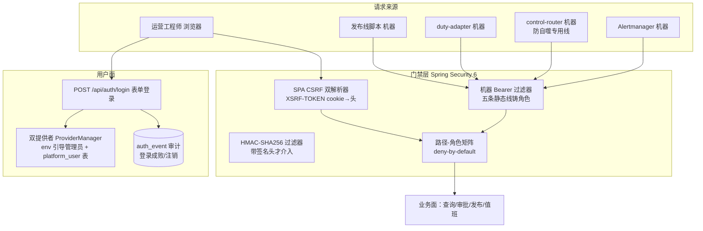

# 03-身份认证与授权层

> 本系列第四篇。讲清楚"谁能碰这个系统、凭什么证明是自己、证明了之后能干什么"。
> 标注约定同前：【代码事实】/【合理推断】/【设计扩展】/【未确认】。

# 本层要解决的问题

一句话：**让每一条进系统的请求先回答"你是谁"（认证），再用一张写死的路径-角色矩阵回答"你能干什么"（授权），并把每一次登录成败都记进审计——审计写不进去，登录就判负。**

# 先看一个交易告警

> createOrder 告警触发后的十分钟里，这个系统同时有四种身份在活动：
> ① **Alertmanager**（机器）在 POST 告警——它得证明自己是 AM，不是随便哪个扫端口的人；
> ② **值班工程师**（人）打开浏览器看调查进度、点审批——他得先登录，而且浏览器的每个写请求都得带 CSRF 令牌防跨站伪造；
> ③ **duty-adapter**（机器）往 `/api/duty/notifications` 回写排班投递结果——它只被允许打这一个接口；
> ④ **发布线脚本**（机器）往 `/api/config-bundles/**` 推 Prompt 配置包——它碰不到事故查询面。
>
> 四种身份，四张通行证，一张共同的"哪里都去不了"的底色：`anyRequest().denyAll()`（SecurityConfig.java:150）。

# 如果没有这一层会怎样

1. **任何人都能给系统喂告警**。webhook 端点一旦裸奔，攻击者可以伪造"数据库着火"的告警，诱骗 Agent 展开调查——不但烧模型费，注入的告警文本还会一路进模型上下文。本系统的防线是机器 bearer + 可选 HMAC（02 篇），而"401 拒绝"这个动作的执行者正是本层的安全过滤链。
2. **任何拿到 URL 的人都能批准高风险操作**。变更审批面（`/api/mutation/**`）如果裸奔，Agent 提议的 `service.restart` 谁都能"批"。本层把它锁给 `ROLE_OPERATOR`（SecurityConfig.java:148-149），审批域的身份前提在此建立。
3. **没人知道谁登录过、谁失败了多少次**。暴力破解无感知。本层把 LOGIN_SUCCESS/LOGIN_FAILURE/LOGOUT 落 `auth_event` 表（V42），且**审计写失败时登录判负**（SecurityConfig.java:65-66 javadoc，B-28 律）——宁可不可用，不留无审计的登录。

---

# 代码是怎么做的

## 0. 先给我一句话

这一层是 Spring Security 6 的"双半边"门禁：人走浏览器会话（表单登录+CSRF），机器走五条静态 bearer 线（外加一条 HMAC 强轨），所有路径先白名单后 `denyAll` 兜底，登录成败同步落审计表。

## 1. 业务上为什么需要这一层

本系统的 API 面同时暴露着：告警接收（公网可达，AM 要推进来）、事故/报告查询（运营要看）、变更审批与操作面（高危）、配置发布面（高危）、值班回写面（127 内网）。这些面的信任等级完全不同——把"接收告警"和"批准重启服务"用同一套凭证管理，要么烦死人要么危险。所以本层的业务目标是：**按"主体类型 × 路径面"切出最小权限**：机器凭证只通一条线，人凭证只通运营面，谁也别想拿告警推送凭证去批变更。

## 2. 它在整个系统的位置



## 3. 输入和输出

- **收到**：每个 HTTP 请求（携带凭证之一：会话 cookie、Authorization: Bearer、X-PA-Signature 签名头；写请求另需 X-XSRF-TOKEN 头）。
- **处理**：过滤器链判身份 → 路径矩阵判授权 → 放行或 401/403。
- **产出**：一个 `Authentication` 对象（主体名+角色）挂进 SecurityContext；登录/登出事件落 `auth_event`；对业务层输出"当前主体"（如 `AuthenticatedActor.name()`，AuthController.java:27）。

## 4. 真实代码入口

| 入口 | 文件：类：方法 | 职责 |
|---|---|---|
| 安全链装配 | `infrastructure/config/SecurityConfig.java`：`securityFilterChain`（:83-184） | CSRF、过滤器顺序、**路径-角色矩阵**、表单登录、异常应答 |
| 机器认证 | `infrastructure/auth/MachineBearerAuthnFilter.java`：`doFilterInternal`（:57-69） | 五条 bearer 线匹配→铸 Authentication |
| HMAC 强轨 | `infrastructure/auth/AlertWebhookHmacFilter.java`（02 篇已详述） | 签名验证，失败 401 不回落 |
| 登录/登出 | SecurityConfig `formLogin`/`logout` 配置（:151-168），URL `/api/auth/login`、`/api/auth/logout` | JSON 应答 + 审计 |
| 认证引导 | `auth/interfaces/AuthController.java`：`csrf`（:19-22）、`me`（:25-28） | 发 CSRF cookie、查当前身份 |
| 账号管理 | `auth/interfaces/AuthUserAdminController.java`（:52-111） | 建号/改密/启停（ROLE_OPERATOR 专属面） |
| 平台账号认证 | `infrastructure/auth/PlatformUserDetailsService.java`：`loadUserByUsername`（:30-38） | `platform_user` 表查认证行，仅 active=true 可过 |

**关键参数的业务意义**（`machineBearerAuthnFilter`，SecurityConfig.java:209-229）：五条线的每一行都是 `{token, principal, role}` 三元组——token 来自环境变量（compose `:?` 强制注入真值），principal 命名 `machine:<线别>`（审计可见），role 只有四种：`MACHINE_WEBHOOK` / `OPERATOR` / `RELEASE` / `DUTY_ADAPTER`。注意 control-router 线**复用** `MACHINE_WEBHOOK` 角色但用独立 bearer（:219-221）——防自噬需要独立身份，但访问面就是 webhook 一条路。

## 5. 核心对象

| 对象 | 是什么 | 谁创建 | 谁读 | 生命周期 | 持久化 |
|---|---|---|---|---|---|
| `Authentication`（Spring Security） | 一次请求的身份事实（主体+角色） | 三个过滤器之一或登录管理器 | 路径矩阵、业务代码（AuthenticatedActor） | 单请求 | 否 |
| 会话（HTTP session） | 浏览器登录态 | 容器（formLogin 成功后） | 后续浏览器请求 | 默认容器会话，登出销毁 | **进程内存**（重启即全下线） |
| `MachineLine`（凭证线） | 一条静态机器凭证三元组 | SecurityConfig 装配（env 注入） | Bearer 过滤器 | 进程级 | env 变量，不落库 |
| `platform_user` 行 | 平台账号（username/displayName/role/active/password_hash） | 管理面 insertUser | PlatformUserDetailsService | 永久 | PG（V44） |
| `AuthEvent` 行 | 一次登录成败/注销 | formLogin 处理器（:154-161,290-297） | 审计查询 | 永久 | PG（V42），三类：LOGIN_SUCCESS/LOGIN_FAILURE/LOGOUT（AuthEventType.java:9-13） |
| Stream Ticket（换票） | SSE 开流能力凭证（TTL 30s、单次、绑 run+主体） | `SseStreamService.issueTicket`（:51-55） | `consumeTicket`（:62-63，remove 即单次） | ≤30 秒 | 进程内存 ConcurrentHashMap |

【代码事实】`platform_user` 的 password_hash 是 **write-only 列**：唯一合法读出口是 `findForAuth`（只服务认证比对），管理面读视图 `UserView` 不含哈希列（PlatformUserRepository.java:10-24）。

## 6. 真实调用链

**链 A：工程师登录后批一条高风险操作**
```
浏览器 POST /api/auth/login {username,password}
→ formLogin（SecurityConfig:151-162）→ ProviderManager 双提供者（:270-286）
    env 引导管理员 或 platform_user 表（active=true 才可认证）
→ 成功：recordAuthEvent(LOGIN_SUCCESS)（:154-156）+ 会话建立 + {"ok":true}
→ 后续 POST /api/mutation/... 带 cookie + X-XSRF-TOKEN 头
    → SpaCsrfTokenRequestHandler.resolveCsrfTokenValue（:352-357）验令牌
    → MachineBearerAuthnFilter 不匹配（无 bearer）→ 保持会话身份
    → 路径矩阵命中 OPERATOR 块（:148-149）→ 放行进审批控制器
```

**链 B：Alertmanager 推告警**
```
POST /webhooks/alertmanager + Authorization: Bearer <webhook线token>
→ MachineBearerAuthnFilter 匹配 webhook 线（:216-218）
    → 主体 machine:alertmanager，角色 ROLE_MACHINE_WEBHOOK
→ 路径矩阵 /webhooks/** → hasRole(MACHINE_WEBHOOK)（:126）→ 放行
→ （若带 X-PA-Signature 头：先过 HMAC 过滤器，02 篇）
```

**链 C：SSE 实时看调查进度**
```
浏览器 POST 换票端点（会话认证）→ SseStreamService.issueTicket（30s TTL）
→ 浏览器 EventSource GET /api/rca-runs/{id}/events/stream?ticket=...
    → consumeTicket：ConcurrentHashMap.remove 原子消费（单次，:62-63）
    → 校验 run+主体绑定与 TTL → 开流
```
【代码事实】SSE 流端点在矩阵里 `permitAll`（:125）——因为 EventSource 无法带头，**票即凭证**（注释 FUT-34）；换票本身仍走会话/bearer 认证（:62 javadoc）。

## 7. 状态机

本层没有一张大状态机，但有三个小状态集【代码事实，不要夸大成"状态机"】：

**会话**：未认证 →（登录成功）→ 已认证 →（登出/过期）→ 未认证。登出处理器只给非机器主体记 LOGOUT 事件（:290-297）——机器线没有"登出"概念。
**平台账号**：active=true（可登录）↔ active=false（停用，仅挡新登录）；改密下次登录生效。**v1 不踢已发会话**（PlatformUserDetailsService.java:18-19 javadoc 原话承认的限制）。
**Stream Ticket**：issued（TTL 30s 内）→ consumed（remove 成功）/ expired（超时清理，:52）。单次性由 `ConcurrentHashMap.remove` 的原子性保证。

## 8. 正常业务流程（业务步骤 + 代码 + 状态）

| # | 业务动作 | 代码 | 身份/状态变化 |
|---|---|---|---|
| 1 | AM 推送 createOrder 告警组 | Bearer 过滤器 → 矩阵 `/webhooks/**` | 主体 machine:alertmanager，放行（02 篇接管） |
| 2 | 值班工程师打开登录页 | POST /api/auth/login | ProviderManager 判定 → auth_event(LOGIN_SUCCESS) → 会话建立 |
| 3 | 前端引导 | GET /api/auth/csrf | XSRF-TOKEN cookie 落下（AuthController.java:11-14） |
| 4 | 查看事故与调查进度 | GET /api/rca-runs/** | 矩阵 OPERATOR 块放行（只读投影面） |
| 5 | 批准一次 service.restart 审批 | POST /api/mutation/**（带 CSRF 头） | CSRF 验证 + OPERATOR 角色双过 → 审批域受理（04 篇接管） |
| 6 | duty-adapter 回写投递结果 | POST /api/duty/notifications + 专用 bearer | 矩阵 DUTY_ADAPTER 精确匹配（:130-131，且排在 /api/duty/** 通配之前） |
| 7 | 发布线推送 Prompt 配置包 | /api/config-bundles/** + release bearer | ROLE_RELEASE 放行；浏览器会话反而进不来（RELEASE 面无 OPERATOR 角色） |

## 9. 异常流程

| 异常 | 处理 | 真实代码 |
|---|---|---|
| 密码错/账号不存在/账号停用 | ✅ 统一 401 login_failed，**不泄露原因差异** | PlatformUserDetailsService:14-16（hideUserNotFoundExceptions 统一 BadCredentials）+ formLogin failureHandler :158-162 |
| 登录成功但审计库写不进 | ✅ **登录判负**（异常不吞，B-28 律） | SecurityConfig javadoc :65-66；recordAuthEvent 无 try-catch，异常即翻脸 |
| 写请求缺/错 CSRF 令牌 | ✅ 403（归因日志：方法+路径+主体+异常类） | :172-181 |
| 机器 token 错 | ✅ 不认证 → 入口点 401 | MachineBearerAuthnFilter 不匹配保持未认证 + entryPoint :170-171 |
| 角色不匹配（如 RELEASE 线打审批面） | ✅ 403 + 归因日志 | 矩阵 + accessDeniedHandler |
| 停用当前登录者本人 | ✅ 400 防自锁 | AuthUserAdminController:104-106 |
| 建号重名 | ✅ 409 | :75-78 |
| 密码 <8 位 / role 怪值 | ✅ 400 | :59-61（BCrypt 服务端加密入库）+ :66-69（角色正则白名单） |
| ERROR dispatch 被拦（历史 bug） | ✅ /error 显式 permitAll | :113-115（PA-BUG：否则真实异常被伪装成 403/401，"取证多次"） |
| 会话过期 | ✅ 401（容器会话失效），**不伪造"过期事件"审计行** | AuthEventType.java:5-8（"落表行必须对应真实发生的用户动作"） |
| 告警洪峰打认证面 | ✅ 五条线常量时间比较是 O(线数)，无锁无库 | MachineBearerAuthnFilter:60-67 |
| 模型输出越权要求 | ➖ 不属于本层 | 工具层权限在 16/23 篇 |

## 10. 并发问题

1. **SSE 票会不会被两次消费？** 不会：`consumeTicket` 用 `ConcurrentHashMap.remove` 原子取出（SseStreamService.java:62-63），两个并发请求只有一个 remove 成功。
2. **两处同时改同一账号密码？** 最后写赢（无条件 UPDATE）——管理面单人运维场景，代码未上版本控制【代码事实：updatePassword 无乐观锁；这是边界不是 bug，如实说】。
3. **Bearer 过滤器的线程安全？** 过滤器无共享可变态（lines 是不可变 List），每请求独立 SecurityContext，finally 清理（HmacFilter:86）。
4. **登录风暴（暴力破解）？** 本层无限速/锁定机制【代码事实：未发现失败计数器】——依赖审计面事后发现。这是边界，见第 16 节取舍。

## 11. 崩溃恢复

- **进程重启**：会话全内存 → 全员下线重新登录（无持久会话）；SSE 票清零 → 前端重新换票即可；bearer 线来自 env → 无状态自动恢复。**认证层重启代价 = 所有人重登一次，零数据损失**。
- **登录路径上的 DB 挂**：platform_user 查不了 → 该提供者判负（BadCredentials）；env 引导管理员（InMemory）不受影响——**bootstrap 账号就是为"DB 挂了还能进系统"设计的**【合理推断，依据：双提供者顺序无关、InMemory 不依赖 DataSource（:233-244）】。
- **审计表挂**：登录判负（B-28）——恢复=等审计库回来。宁可登录不可用，不留无审计登录窗口。

## 12. 安全（本层就是安全层，讲设计原则）

1. **deny-by-default**：矩阵最后一条 `anyRequest().denyAll()`（:150）——新加 API 忘了配授权=不可用（fail-closed），而不是裸奔。
2. **人机分离**：机器主体命名 `machine:*`（ACTOR_MACHINE_PREFIX），登出审计只记人（:292-293）；机器线不走登录管理器（:266-267 javadoc）。
3. **CSRF 的正确打开方式**（SAFE-01，:331-358）：解析器必须返回**客户端实际提交值**参与比对——"绝不能返回 csrfToken.getToken()（服务端期望值），否则比较恒等，任何令牌都能通过"。豁免面有明确纪律：机器 bearer 面（攻击者无法跨站伪造头）+ duty-adapter 专用线（唯一授权主体是 bearer，cookie 凭证打不进）。
4. **防账号枚举**：查不到/停用统一 UsernameNotFoundException → hideUserNotFoundExceptions 统一 BadCredentials（PlatformUserDetailsService.java:14-16）。
5. **密码纪律**：服务端 BCrypt、≥8 位、write-only 哈希列、读接口永不出哈希（AuthUserAdminController javadoc :20-24 + PlatformUserRepository :10-14）。
6. **代理面取址**：X-Forwarded-For 首值优先否则对端地址（:312-322）——审计 IP 在单层反代下可用。
7. **为什么不能只在 Prompt 里告诉 Agent 别越权？** 本层给的是"系统侧"的一半答案：审批面的权限是 `hasRole("OPERATOR")` 的 URL 矩阵，不是给模型的提示词；模型根本没有 HTTP 凭证，它经工具面触发的任何高危动作都要经过"人（OPERATOR 身份）在 UI 上点批准"这条被本层保护的路。（工具内部的权限闸在 16/23 篇。）

## 13. Agent Harness

本层 100% 是 Harness【代码事实】：认证授权无任何模型参与。与 Agent 的关系是**边界关系**：
- Agent 没有外部身份——它不持 bearer、不开会话；它的"权限"是进程内工具面权限（白名单/风险级/审批），不是 HTTP 角色。
- 反向也成立：模型再聪明也伪造不出一个 OPERATOR 会话——审批的唯一入口被本层锁死在人机凭证后面。
- 【合理推断】这正是"模型约束是软约束、系统约束是硬约束"在身份维度的体现：**把高危操作的人类确认点放在模型物理够不到的地方**。

## 14. 可观测性

- **审计行**：auth_event(actor, type, remoteAddr, at)——登录成功/失败（含提交的用户名，`:159-160` 的 actorOf 连失败尝试的用户名都记）、注销（仅人）。出问题"谁在什么时候从哪个 IP 登录过"一查便知。
- **403 归因日志**（临时诊断面，:172-181）：方法+路径+principal+异常类名——一次 403 能直接看出是 CSRF、角色还是规则问题。
- **机器主体命名**：`machine:alertmanager` / `machine:control-router` / `machine:operator-line` / `machine:release-line` / `machine:duty-adapter`（:216-228）——业务日志里出现这些前缀即可溯源到线别。
- 【未确认】auth_event 的查询/告警面（有没有做失败次数告警）未在代码中发现——只有落表面。

## 15. 性能和成本

- **登录是故意的慢操作**：BCrypt 每次登录实打实算一遍（:247-249，PasswordEncoder 默认强度）——暴力破解按次付 100ms 级成本【合理推断：BCrypt 默认 cost 10，量级正确，具体 ms 未测】。
- **Bearer/HMAC 每请求成本**：5 次常量时间字符串比较 / 一次 SHA256+HMAC——微秒级，无锁无网络。
- **会话存储**：容器内存——零成本但不可水平扩展（多实例需粘性会话或外部化，当前单实例部署【未确认：部署实例数】）。
- **QPS×10 先坏哪**：本层几乎不会先坏（无库无锁）；真要挑，是 formLogin 的 BCrypt 吞吐（登录风暴场景）。

## 16. 设计取舍

**① 为什么机器凭证是"五条静态 bearer 线"而不是 OAuth/签名强制全量？**
代码注释给了答案：AM 是现成组件算不了自定义 HMAC（HmacFilter.java:35-37"机器兼容是硬约束"）；单人运维+内网 compose 部署的规模下，五条静态线的审计性（每线独立 principal）够用且零运维。边界（静态 token 轮换靠 env 重启）如实接受。**规模决定凭证复杂度**。

**② 为什么显式 ProviderManager 而不是让 Spring 自动装配？**
双 UserDetailsService 在场时自动装配会歧义跳过（:261-264 javadoc 引用了具体的 Spring 内部类名 InitializeUserDetailsBeanManagerConfigurer）——显式钉死"env 引导管理员 + 平台表"两提供者同过 formLogin，顺序无关（一 provider 判负让位下一个）。

**③ 为什么 v1 不做会话吊销（踢人）？**
javadoc 原话承认："无会话注册表/吊销面，后续里程碑再议"（PlatformUserDetailsService.java:18-19）。取舍：会话注册表=每个请求查一次状态（成本）+新组件；收益=停用即时生效。单人运维场景选择"停用挡新登录"的弱语义，**边界如实标注而不是假装有**。

**④ 当前方案最大的边界？**
- 无登录限速/账号锁定（暴力破解靠审计事后发现）；
- 会话不可吊销；静态 bearer 轮换需重启；
- 多实例部署需要先解决会话外部化与 HMAC nonce 共享（02 篇已述）——当前这些都是"单实例/小规模"前提下的合理欠账，且代码注释里都留了名。

## 17. 面试背诵卡

【30 秒主答】
"认证授权是一个双半边门禁：人的半边是 Spring Security 会话——表单登录，双认证提供者，一个是环境变量注入的引导管理员，一个是数据库平台账号表，登录成功失败都同步落审计表，而且审计写失败登录直接判负。机器的半边是五条静态 bearer 线，每条线独立身份独立角色：Alertmanager 推告警、值班适配器回写、发布线推配置、运营脚本，各走各的线。授权是一张写死的路径-角色矩阵，最后一条是 anyRequest denyAll——新接口忘配授权是不可用，不是裸奔。浏览器写请求还叠一层 CSRF，豁免面只给机器 bearer 线，因为攻击者没法跨站伪造自定义头。"

## 18. 这一层哪些话不能说

1. ❌ "我们做了 OAuth2/JWT" → ✅ 会话 + 静态 bearer + 可选 HMAC，没有 JWT。
2. ❌ "Agent 有自己的服务账号" → ✅ Agent 无外部身份，权限在进程内工具面。
3. ❌ "停用账号立即踢下线" → ✅ v1 只挡新登录，不踢已发会话（javadoc 原话）。
4. ❌ "有防暴力破解限速" → ✅ 无限速/锁定，靠审计事后发现。
5. ❌ "SSE 端点是裸奔的 permitAll" → ✅ 票即凭证：30 秒单次、绑 run+主体，换票仍走认证。
6. 密码策略只有 ≥8 位下限【代码事实】，不要说成"完整密码策略体系"。

---

# 我现在应该能回答什么

1. 系统有哪几类主体、几条机器凭证线、几种角色？（→ 第 4 节：5 线 4 角色 + 浏览器会话）
2. 为什么登录成功还可能"判负"？（→ B-28 审计判负律）
3. 一个新加的 Controller 忘了配授权会怎样？（→ denyAll 兜底，不可用而非裸奔）
4. CSRF 防的是什么、为什么机器面可以豁免？（→ 第 12 节第 3 条）
5. 进程重启后认证层发生什么？（→ 会话/票全丢、bearer 恒在、重启代价=重登）

# 30 秒背诵卡

见第 17 节。

# 面试官追问卡

**Q1：审计判负（B-28）具体怎么实现的？会不会误伤？**
考什么：fail-closed 的工程细节。
30 秒答："实现很朴素：recordAuthEvent 里对审计仓储的调用没有任何 try-catch——record 抛异常，formLogin 的 successHandler 就抛异常，客户端拿不到 200，登录从结果上失败。误伤面是真实的：审计库抖动会挡住正常登录。但这是显式选择：注释原话'异常不吞——审计不可达时登录判负'。安全系统的默认方向是不可用而不是不可审计。另外有个豁免口：默认 profile 没有数据源时审计仓储整个缺席，此时不落表——因为持久化面整个不在场，这是开发态，不是生产豁免。"
继续追问 1："那攻击者能不能故意打挂审计库然后畅快登录？"——答："审计库挂了登录本身就进不来，攻击窗口不存在——判负的方向刚好把这条路堵死。"
继续追问 2："登录失败审计记什么？"——答："记提交的用户名（哪怕是空的记 unknown）、失败类型、源 IP（X-Forwarded-For 首值）——暴力破解的频次画像靠这个查。"

**Q2：为什么 control-router 线和 Alertmanager 线共用 MACHINE_WEBHOOK 角色，却不共用 token？**
考什么：身份与授权分离的精度。
30 秒答："因为它们要防的攻击不同。角色决定访问面——两条线都只需要打 webhook 一个端点，所以同角色；token 决定身份——防自噬的核心是'系统合成的控制面告警'必须能和真实业务告警区分开，ControlAlertRouter 门一验的就是这条独立 bearer。如果共用 token，冒充者拿到 AM 的 token 就同时冒充了控制面，三面门的第一面就塌了。身份粒度和权限粒度是两个维度，这里特意让身份更细。"
继续追问 1："为什么不给 control-router 单独一个角色？"——答："它的访问面就是 webhook，单独角色只会让矩阵多一行却没有新约束——角色按'能到哪些面'划分，不按'谁在用'划分。"

**Q3：SSE 为什么敢 permitAll？要是有人拿着过期票或别人的票来呢？**
考什么：能力凭证（capability token）思维。
30 秒答："permitAll 的是开流端点，不是授权放弃。票是能力凭证：签发走认证（换票 POST 在会话/bearer 后面），票绑 runId+主体、TTL 30 秒、消费一次即删——ConcurrentHashMap.remove 的原子性保证并发只成功一次。过期票在 consume 时 TTL 校验失败；别人的票因为绑定主体也过不了。对比方案是让 EventSource 带 cookie——浏览器原生 EventSource 根本不支持自定义头，这就是为什么要有换票这个设计。"
继续追问 1："票在内存里，重启怎么办？"——答："前端拿不到流就重新换票，换票端点是认证的，自动恢复。票本来就是秒级生命周期的易失物。"

**Q4：平台账号表和值班花名册是什么关系？**
考什么：概念边界的清晰度。
30 秒答："没有关系，代码注释特意写明'登录权限是独立的平台账号概念，不挂值班花名册——duty_member 纯排班语义'（PlatformUserRepository.java:8-9）。值班表回答'今晚该谁看告警'，platform_user 回答'谁能登录这个系统'。一个人可能在排班里但没账号，也可能有账号但不在班。两个概念混了会出现'把人从排班删了却还能登录'这种安全事故。"
继续追问 1："那值班机器人 dutybot 呢？"——答："它是值班域的自动化身份，走的是机器线/内部面，不占 platform_user——账号只给人。"

**Q5：CSRF 豁免清单里有 /api/mutation/**（审批面），审批面不是浏览器会用的吗？豁免了不危险？**
考什么：对豁免纪律的精确理解。
30 秒答："豁免 CSRF 不等于豁免认证授权。注释写明了原因：mutation shadow 操作面由 operator bearer 机器线驱动，'cookie 凭证不参与，浏览器无此入口'——既然这个面的合法客户端是带 bearer 头的脚本，跨站伪造（靠浏览器自动带 cookie）根本构造不出来，豁免不产生窗口。真正浏览器会用的审批 UI 走的是会话+CSRF 的完整路。豁免的前提是'该面的凭证不是浏览器自动携带的'，这条纪律每条豁免都写了理由。"
继续追问 1："如果将来要在浏览器里直接做审批呢？"——答："那就要把这行从豁免清单里拿掉，让浏览器走会话+CSRF——豁免清单是和客户端形态绑定的，不是一次性的。"

**Q6：如果让你重新设计认证层会改什么？**【设计扩展——设计题答案，不要说成现网实现】
考什么：REDO。
30 秒答："按优先级三件事：第一，登录限速+失败锁定，这是当前最薄的面——审计能事后查但拦不住进行中的爆破，一个 IP 维度的滑动窗口计数器成本极低；第二，会话注册表（哪怕就是一张 PG 表），让停用账号能即时踢人，顺便解决多实例会话共享；第三，机器 token 加版本列支持不重启轮换。但 deny-by-default 矩阵、人机分离、审计判负这三样是骨架，重做也原样保留。"

# 这层不要乱说什么

1. 不要说"零信任架构"——这是经典的边界门禁模型（边缘认证+路径矩阵），不是零信任。
2. 不要说"所有接口都有防暴力破解"——没有限速，如实说靠审计。
3. 不要把会话说成"Redis 集中会话"——容器内存会话。
4. 不要说"HMAC 是强制的"——只在带签名头时介入（02 篇边界）。
5. 不要编造权限角色（比如 ADMIN/VIEWER）——代码里只有 MACHINE_WEBHOOK/OPERATOR/RELEASE/DUTY_ADAPTER 四种，env 引导管理员也是 OPERATOR。
6. 运营数字（登录次数、失败率）【未确认】——代码只有落表机制。

# 5 句话总结

1. **为什么需要**：告警接收、事故查看、变更审批、配置发布这些面的信任等级完全不同，必须按"主体×路径"切最小权限。
2. **核心机制**：人走会话（双提供者登录+CSRF），机器走五条静态 bearer 线（+HMAC 可选强轨），路径矩阵 deny-by-default 兜底。
3. **上下游协作**：向上给 02 篇的 webhook 提供身份，向 04 篇的审批面提供"人类确认点"的身份屏障，向审计面供 auth_event。
4. **最大风险**：无登录限速、会话不可吊销、静态 token 轮换要重启——都是已登记的单规模欠账。
5. **最大取舍**：fail-closed 贯穿到底（denyAll、审计判负、未认证即 401），用"可用性换可审计性"，且每个豁免都写明理由。

---

*本篇完成。下一篇待你指令解锁：《04-操作安全与审批层》。*
