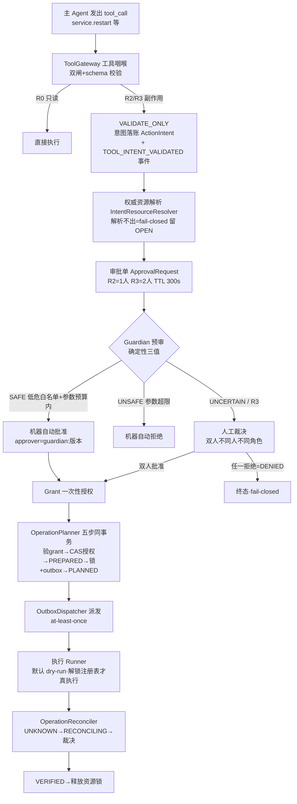
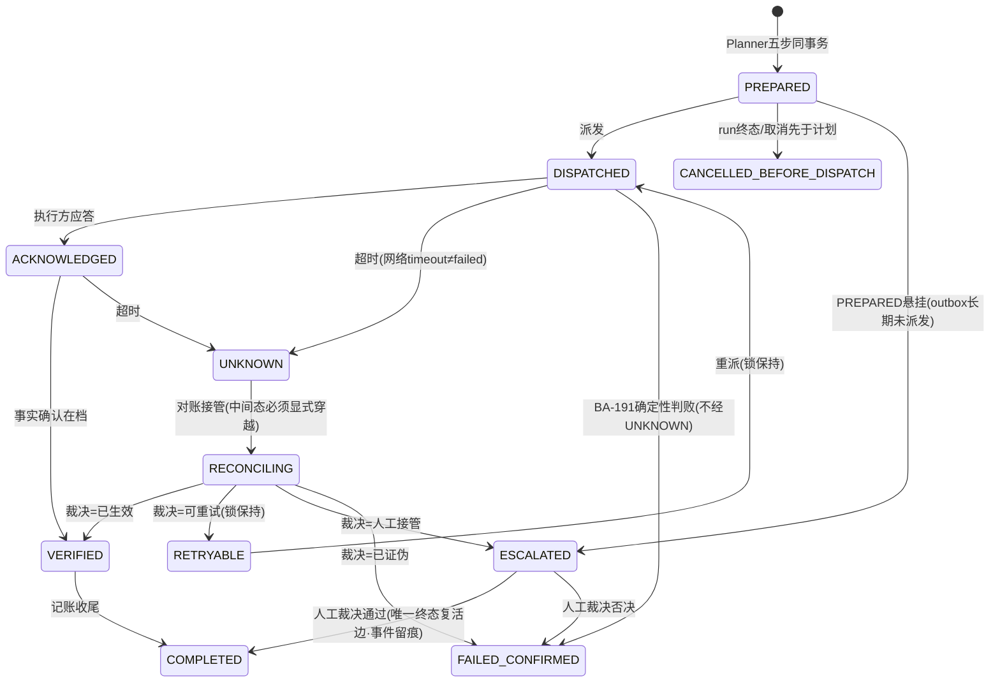

# 04-操作安全与审批层

> 本系列第五篇。这一层回答：**当 Agent（或任何人）想对系统做有副作用的动作（重启服务、回滚发布）时，从"起念"到"真的执行"之间隔着哪些确定性的闸门？**
> 标注约定同前：【代码事实】/【合理推断】/【设计扩展】/【未确认】。

# 本层要解决的问题

一句话：**把"模型提议的危险操作"变成一条持久化的审批流水线——意图落账、Guardian 预审、双人裁决、一次性授权、五步原子计划、Outbox 派发、对账裁决，任何一步不过就停在原地，且每一步都有审计事件。**

# 先看一个交易告警

> Agent 调查 createOrder 事故，第 4 步它得出假设："order-service 处于坏状态，重启可恢复"。它向工具层发出 `service.restart` 调用。
> **这一刻会发生什么？** 这个工具在 `MutationToolCatalog` 里登记为副作用工具（`tool/MutationToolCatalog.java:24-25`）。ToolGateway 一看风险级不是 R0 只读——**这条调用根本不会执行**，而是走 VALIDATE_ONLY（记录意图零执行，ToolGateway.java:29）：
>
> 意图入账（ActionIntent）→ 权威资源解析 → 铸审批单（PENDING）→ Guardian 预审 → 转人工 → 两名不同人、不同角色分别点批准 → 签发一次性授权 → 计划出 operation + 领资源锁 → Outbox 派发 → 真执行（若解锁注册表放行）→ 对账确认 → 释放锁。
>
> 全程 Agent 没有得到任何"执行权"——它得到的只是一条"你的提议已进入审批队列"的回执（`pendingApprovalBody`，ToolGateway.java:337-341）。

# 如果没有这一层会怎样

1. **模型一句幻觉 = 生产重启**。没有意图账本和审批链，模型输出的 `tool_call` 会被直接执行；一次参数幻觉或提示词注入就能重启线上服务。有了本层，模型的最坏结果只是"创造了一条待审批记录"。
2. **并发变更互相踩踏**。两个调查同时提议重启同一服务、或者人工和 Agent 同时操作同一资源——没有资源锁，副作用会叠加。本层的锁语义是"BUSY 是显式拒绝，不排队不覆盖……宁可串行不可并发 mutation"（ResourceCoordinator.java:10-11）。
3. **网络超时 = 不知道执行没执行**。重启命令发出去了，响应超时——重试可能重启两次，放弃可能留下"僵尸副作用"。本层为此发明了整个状态机里最关键的一段：`DISPATCHED → UNKNOWN → RECONCILING → 裁决`（OperationStatus.java:5-7，"网络 timeout ≠ failed"）。

---

# 代码是怎么做的

## 0. 先给我一句话

这一层是 Agent 的"危险动作保险公司"：提议要投保（意图落账），核保看风险（Guardian 三值裁决），大额保单要双人签字（R3 双人裁决），赔付是一次性的（Grant ONCE），打款走对账（Outbox + UNKNOWN 裁决）——Agent 全程只是"投保人"。

## 1. 业务上为什么需要这一层

见"先看一个交易告警"。补充结构性事实【代码事实】：本层与调查层的信任边界写在 `ApprovalRequestService.java:17-18` 的注释里——**"Approval 验 Action，LeaseFence 验 Executor，二者不混"**：审批单只绑定稳定事实（action digest + observed generation + scope 快照哈希 + policy 版本），零瞬时执行身份（不出现 owner/epoch/attempt）。也就是说：**批准的是"这个动作"，不是"这次执行"**——就算批准后 worker 换人重跑，授权依然只对动作本身有效，且一次性。

## 2. 它在整个系统的位置



## 3. 输入和输出

- **收到**：一次被 ToolGateway 判为 R2/R3 的 tool_call（工具名+版本+参数+动作摘要+风险级）。
- **处理**：落账 → 解析 → 审批 → 裁决 → 计划 → 派发 → 执行 → 对账。
- **产出**：一条终态 operation（COMPLETED/FAILED_CONFIRMED/ESCALATED/CANCELLED）+ 全程 rca_event 审计事件（GUARDIAN_REVIEWED / APPROVAL_REQUESTED / APPROVAL_APPROVED / GRANT_ISSUED / OPERATION_PREPARED…）+ 给模型的"待审批"回执。
- **交给谁**：执行面（ActionRunner 族：DryRun/Http/FlagdRollback），锁面（ResourceLockStore），对账面（OperationReconciler）。

## 4. 真实代码入口

本层入口有两个方向：**上行**（Agent 的调用撞进 ToolGateway）和**横向**（人工经 HTTP 面驱动）。

| 入口 | 文件：类：方法 | 职责 |
|---|---|---|
| 意图诞生 | `tool/ToolGateway.java`：`invoke` → `recordIntent`（:280-315） | R2/R3 → VALIDATE_ONLY + `ActionIntent.open` 落账（短事务） |
| 意图跟进 | `mutation/ApprovalQueueFollowUp.java`：`onIntentRecorded`（:26-33） | 解析资源→铸审批单；解析失败落事件不猜 |
| Guardian 预审 | `approval/MutationGuardian.java`：`evaluate`（:81-101） | 确定性三值裁决 + GUARDIAN_REVIEWED 事件 |
| 自动决策流 | `approval/GuardianAutoDecisionService.java`：`autoDecide`（:32-52） | SAFE/UNSAFE 机器代批，UNCERTAIN 留人工 |
| 人工裁决 | `approval/ApprovalDecisionService.java`：`decide`（:56-120） | 决策入账→域裁决→Grant 签发 |
| 计划面 | `mutation/OperationPlanner.java`：`plan`（五步同事务，javadoc :17-31） | grant→授权 CAS→PREPARED→锁+outbox→PLANNED |
| 派发循环 | `mutation/OperationOutboxDispatcher.java`（:34，01 系列 00 篇已述） | at-least-once 派发，状态机推进 |
| 对账循环 | `mutation/OperationReconciler.java`（:33） | UNKNOWN/PREPARED 悬挂的裁决者 |
| 人工操作面 | `interfaces/MutationOpsController.java`（/api/mutation/**，OPERATOR 角色） | plan/审批决策/挂起恢复/隔离放行 |

## 5. 核心对象

| 对象 | 是什么 | 谁创建 | 谁读 | 谁改 | 生命周期 | 持久化 |
|---|---|---|---|---|---|---|
| `ActionIntent`（意图） | 一次 R2/R3 调用的持久身份，五账本同锚 `(action_id, action_digest)`（ActionIntent.java:9-11） | ToolGateway | 审批/计划面 | OPEN→PLANNED 单向 CAS / VOIDED | 至消费或作废 | PG `action_intent`（V114） |
| ApprovalRequest（审批单） | 待裁决的授权请求：绑 digest+generation+快照哈希+policy | ApprovalRequestService | 裁决面/清扫循环 | PENDING→APPROVED/DENIED/EXPIRED | TTL 300s（:23） | PG（V119） |
| Grant（授权） | 批准的凭证，形态 ONCE（total=1） | ApprovalDecisionService（:88-92） | OperationPlannerGate | ACTIVE→EXPIRED/消费 | 带 TTL | PG（V119） |
| `RcaOperation`（操作） | 一次已授权的执行计划 | OperationPlanner | 派发/对账/时间线重建 | OperationStateMachine 迁移 | PREPARED 起至终态 | PG（V114/117） |
| ResourceLock（资源锁） | 资源维度的互斥锁（resourceUid+operationId+runId） | Planner 同事务 | 协调面/对账面 | 释放矩阵 | 至释放态 | PG（V116） |
| GuardianVerdict（裁决值） | SAFE/UNSAFE/UNCERTAIN 封闭三值（domain/approval/GuardianVerdict） | MutationGuardian | 自动决策流 | 不可变 | 单次评审 | 事件留痕 |

【代码事实·授权效力边界】`ActionIntent.java:20-21` 注释："requested_resource_key 只是**请求面**输入——授权资源只信 Resource Resolver canonical identity（B2），**告警标签零授权效力**"。意思是：模型在参数里写的目标资源名只是"申请"，真正批准到哪个资源由权威解析器（IntentResourceResolver，fail-closed）说了算——防止通过伪造标签把重启引导到别的服务。

## 6. 一条真实调用链（service.restart 全程）

```
主 Agent 输出 {"tool_call":{"tool_id":"service.restart","args":{...}}}
↓ BoundedLlmRoleRunner.driveToolCall：白名单校验通过（allowlist 含它才走到这）
↓ ToolGateway.invoke：注册表解析 → 策略二次鉴权 → schema 校验 → canonical digest（64 位）
↓ risk = R3（MutationToolCatalog 登记）
   → 不执行！VALIDATE_ONLY 结果 + recordIntent（:280-315）
   → ActionIntent.open(...)：intentId/runId/taskId/attemptId/callSeq/toolName/
     actionDigest(64位)/risk/requestedResourceKey/argsJson，status=OPEN
   → intentLedger.record(intent, TOOL_INTENT_VALIDATED 事件)  [REQUIRES_NEW 短事务：
     "调查主事务回滚不影响已入账意图——意图已发生即事实"，ActionIntentLedger.java:11-13]
↓ intentFollowUp.onIntentRecorded（BA-171）
   → IntentResourceResolver.resolveAndRecord（fail-closed：解析不出→INTENT_RESOLVE_FAILED
     事件、意图保持 OPEN 未解析，"永不进入授权面"）
   → ApprovalRequestService.request（:43-70）
      R3 → requiredApprovers=2（:73-75）；TTL 300s（:23）
      → APPROVAL_REQUESTED 事件
↓ Guardian.review（:61-78）：R3 → UNCERTAIN
   （evaluate :83-86 原话："RISK_MONOTONICITY: R3 永远人工双人，Guardian 无升级放行权"）
↓ 人工面：两名运营分别在 UI 点批准
   → ApprovalDecisionService.decide ×2（:56-120）
      决策行 UNIQUE 拦同人重复（:70-73）
      → DecisionQuorum.evaluate（domain/approval/DecisionQuorum.java:24-47）：
         任一 denied=DENIED 终态；R3 需 ≥2 个 distinct principals 且 ≥2 种角色
         ——一人兼 ONCALL+SECURITY 不算双人（javadoc :6-8）
   → APPROVED → insertGrant（ONCE，total=1，带 TTL）+ GRANT_ISSUED 事件
   → 提交后钩子 approvedAutoPlanHook → OperationPlanner.plan
↓ OperationPlanner 五步同事务（javadoc :17-31）：
   ① 验活 grant（四元匹配 run+digest+快照锚+policy——"过期/撤销/换代结构性作废"）
   ② OperationAuthorization CAS + single-use 签发
   ③ INSERT rca_operation(PREPARED)
   ④ 领资源锁（BUSY=整体回滚）+ INSERT operation_outbox
   ⑤ intent OPEN→PLANNED CAS + OPERATION_PREPARED 事件
   【原子性："任一步失利……'半消费'不可能"；COMMIT 后崩溃由 outbox 兜底】
↓ OperationOutboxDispatcher（at-least-once，租约+SKIP LOCKED 领取）
   → 幂等派发（已推进=跳过）→ Runner 执行（默认 dry-run；PD-D1：解锁注册表
     三元匹配才 dry_run=false 真执行）
↓ 状态机推进：PREPARED→DISPATCHED→ACKNOWLEDGED→VERIFIED
   超时→UNKNOWN→RECONCILING→（VERIFIED/RETRYABLE/ESCALATED/FAILED_CONFIRMED）
↓ VERIFIED → releaseOnTerminalState 释放资源锁 → COMPLETED（记账收尾）
```

## 7. 状态机（本层主角：OperationStateMachine，11 态）

【代码事实】合法迁移表（OperationStateMachine.java:11-26 注释原文 + EDGES 表 :33-53）：



逐项回答规定问题：
- **每态含义**：PREPARED=已计划待派发；DISPATCHED=已发出；ACKNOWLEDGED=对方应答了；VERIFIED=确认事实在档（真执行了且结果已知）；COMPLETED=记账收尾；UNKNOWN=结果未知（不许猜）；RECONCILING=对账中；RETRYABLE=可安全重派（副作用未发生或已证伪）；ESCALATED=人工接管（终态）；FAILED_CONFIRMED=确定性判败（副作用未发生或已证伪）；CANCELLED_BEFORE_DISPATCH=派发前取消。
- **谁修改**：Dispatcher（主链推进）、Reconciler（UNKNOWN 之后）、人工裁决（ESCALATED 出边）。所有迁移过 `checkTransition`，越边抛 IllegalTransitionException（:63-69，"禁越边/禁终态复活"）。
- **状态存哪**：`rca_operation` 行；跨进程跨重启。
- **两把正交判定**（OperationStatus.java:10-16）：`isTerminal()`（ESCALATED 也是终点）与 `releasesResourceLock()`（**ESCALATED 是终态但不在释放集**——锁保持至人工裁决；VERIFIED 即释放，COMPLETED 只是记账收尾）。不变量："无 external side-effect zombie"。

审批单自己的小状态：PENDING→APPROVED/DENIED/EXPIRED（300s 独立时钟，ApprovalSweepLoop 是"审批面唯一的超时终态执行者"，:15-17）。

## 8. 正常业务流程（业务步骤 + 代码 + 状态）

| # | 业务动作 | 代码 | 状态变化 |
|---|---|---|---|
| 1 | Agent 提议重启服务 | ToolGateway VALIDATE_ONLY | ActionIntent=OPEN；工具账本记意图；模型收到"待审批"回执 |
| 2 | 资源解析 | IntentResourceResolver | 意图获得 canonical resourceUid |
| 3 | 铸审批单 | ApprovalRequestService.request | ApprovalRequest=PENDING(R3,2人,300s) |
| 4 | Guardian 预审 | MutationGuardian.evaluate | UNCERTAIN（R3 权限单调） |
| 5 | 双人批准 | decide ×2 + DecisionQuorum | PENDING→APPROVED；Grant(ONCE) ACTIVE |
| 6 | 计划 | OperationPlanner.plan | operation=PREPARED；锁 BUSY；outbox 入队；intent=PLANNED |
| 7 | 派发执行 | OutboxDispatcher→Runner | PREPARED→DISPATCHED→ACKNOWLEDGED |
| 8 | 确认生效 | VERIFIED | 锁释放 |
| 9 | 收尾 | COMPLETED | 终态；全链事件在 rca_event 可回放 |

## 9. 异常流程

| 异常 | 处理了吗 | 怎么处理（真实代码） |
|---|---|---|
| 模型参数畸形（JSON 坏/超长） | ✅ Guardian 层 | PARAMS_UNPARSEABLE→UNCERTAIN 转人工；PARAMS_OVER_BUDGET→UNSAFE 自动拒（MutationGuardian.java:91-98） |
| 模型指定不存在的工具 | ✅ ToolGateway | UNKNOWN_TOOL 控制面终止族（不进模型重试循环） |
| 意图资源解析不出 | ✅ fail-closed | INTENT_RESOLVE_FAILED 事件，意图留 OPEN"不猜不补"（ApprovalQueueFollowUp.java:32-33） |
| 审批超时无人批 | ✅ | ApprovalSweepLoop：PENDING>300s→EXPIRED（fail-closed 兜底，:15-17） |
| 同一人批两次 | ✅ | 决策表 UNIQUE 约束，第二行插入失败→IllegalStateException（:70-73） |
| 一人兼两角色凑双人 | ✅ | DecisionQuorum 要求 distinct principals **且** distinct roles（:38-45） |
| 任一审批人拒绝 | ✅ fail-closed | anyDenied→DENIED 终态（:30-33） |
| Grant 过期/换代后才 plan | ✅ | 四元匹配（run+digest+快照锚+policy）结构性作废（ApprovalPlannerGate.java:9-11） |
| Grant 被用第二次 | ✅ | single-use：签发 authorization→同事务消费（ISSUED→CONSUMED+operation 回填），配额 total=1 |
| 派发后进程崩溃 | ✅ | outbox 租约过期回收重领（at-least-once）+ operation 幂等（不重执已派发动作，Dispatcher javadoc :30-31） |
| 执行超时（结果未知） | ✅ | →UNKNOWN（"网络 timeout ≠ failed"），绝不让渡锁 |
| PREPARED 长期无人派发 | ✅ | Reconciler 扫描→ESCALATED（"不静默丢、不自动重执"，:24-27） |
| 真执行确定性判败 | ✅ | DISPATCHED→FAILED_CONFIRMED 直落（BA-191，不经 UNKNOWN，锁放行） |
| ESCALATED 之后怎么办 | ✅ | 人工裁决专用边：→COMPLETED/FAILED_CONFIRMED，"裁决人/结论必须事件留痕"（StateMachine :23-24） |
| run 被取消/终态 | ✅ | MutationActiveGate：重派决策必须以对账终态为前置；PREPARED→CANCELLED_BEFORE_DISPATCH |
| 同资源并发操作 | ✅ | 资源锁 BUSY=显式拒绝整事务回滚（ResourceCoordinator:10-11,28-32） |
| 锁的持有者崩了成孤儿 | ✅ | markOrphanedExpired TTL 孤儿化→reconcile 驱动（:39-42），不让渡只驱动 |
| 审批库挂了 | ✅ | 决策事务回滚=决策不生效（fail-closed：本面只承认已落库决策，ApprovalDecisionService:18） |

## 10. 并发问题

1. **两个调查同时提议操作同一资源？** 资源锁串行化：第二个 plan 的领锁在五步事务内 BUSY → 整体回滚、显式拒绝——"宁可串行不可并发 mutation"（ResourceCoordinator.java:10-11）。
2. **同一次调查会不会重复消费同一意图？** intent OPEN→PLANNED 是单向 CAS（OperationPlanner.java:29"幂等：outbox 与 operation 1:1，intent PLANNED 单向 CAS"）——两次 plan 只有一次成功。
3. **同一审批被同一个人决策两次？** DB UNIQUE 结构性消灭（DecisionQuorum.java:8-9）。
4. **两个 Dispatcher 抢同一条 outbox？** SKIP LOCKED + 租约（OperationOutboxDispatcher.java:17-18），与 RCA Worker 同一套领取纪律。
5. **审批通过瞬间 run 恰好被取消？** 计划面在事务内复验 run 状态，取消先于计划→CANCELLED_BEFORE_DISPATCH（PREPARED 的合法出边之一）。

## 11. 崩溃恢复（kill -9 逐点演练）

- **意图落账后、审批前被杀**：意图行已入账（REQUIRES_NEW 独立短事务——"调查主事务回滚不影响已入账意图"）。恢复=审批单可以重新铸（request 幂等性来自意图行事实在档）；审批 300s 没人动就 EXPIRED，不会悬挂。
- **五步计划事务中途被杀**：PG 事务回滚，operation/锁/outbox 零残留；"半消费不可能"（OperationPlanner.java:28-29）。
- **计划提交后、派发前被杀**：outbox 行存续兜底——Dispatcher 起来继续派发；"consume→dispatch 崩溃窗在结构上不存在"（:30-31）。若长期无人派发（极端），Reconciler 扫 PREPARED 悬挂→ESCALATED 人工接管。
- **派发后、执行方应答前被杀**：outbox 租约过期→重领重派（at-least-once）；执行面幂等（operation 当前态检查——已推进=跳过不重执，Dispatcher.java:20-21）。
- **执行已发出、响应超时、进程又被杀**：operation 停在 UNKNOWN；Reconciler 接管→RECONCILING→凭 VERIFIED（事实在档）/RETRYABLE（未发生）/ESCALATED（判不了）三态裁决——**这正是 Checkpoint/Lease/Retry/Idempotency 四概念在本层的完整分工**：outbox 是检查点（从哪继续）、租约防双派发（谁继续）、RETRYABLE 重派是重试（再试一次）、single-use grant + 幂等派发是幂等（重试无重复副作用）。
- **ESCALATED 之后人工放行被杀**：裁决是事件留痕的单条决策，可重放。

## 12. 安全

1. **四道顺序闸**（一张嘴说清）：Hardline 绝对禁止清单**先于一切**——"命中绝对禁止清单的工具不进 Guardian——直接阻断+审计"，且"注册表也解不了锁"（MutationGuardian.java:22-24 + OperationPlanner PE-E1 :99-100）；然后 Guardian 三值；然后人工/双人裁决；最后解锁注册表三元匹配才允许 dry_run=false 真执行。
2. **权限单调律**：SAFE 无升级放行权——R3 永远人工双人，Guardian 机器审批也以 `guardian:<policyVersion>` 显式身份落 decisions 表，"审计面不区分对待"（MutationGuardian.java:19-23）。
3. **授权绑定事实不绑定身份**：审批单绑 digest+generation+快照哈希+policy 四元组；grant 的四元匹配让"换代/改参数/换策略"结构性失效（ApprovalPlannerGate.java:9-11）。
4. **告警标签零授权效力**：目标资源以 Resolver canonical identity 为准（第 5 节已引）——这是提示词注入在操作层的终极兜底：就算注入骗过了模型，伪造的资源键过不了解析器。
5. **入口身份**：操作面 `/api/mutation/**` 归 OPERATOR（03 篇矩阵），CSRF 豁免的纪律边界也在 03 篇说清。
6. **为什么不能只在 Prompt 里告诉 Agent 别乱重启服务？** 本层是完整答案：模型能做的只是"创建一条待审批记录"——执行权被拆解成 intent→request→grant→operation→dispatch 五个独立事实，每个事实都有独立的确定性校验和审计事件。Prompt 是其中**零环**。

## 13. Agent Harness

| 机制 | 模型做的 | Harness 强制的 |
|---|---|---|
| 提议重启 | 选择工具+参数（"提议"） | 双闸+schema+digest；R2/R3 零执行只落账 |
| 表达"我认为安全" | 无此通道 | Guardian 是代码规则，模型意见不进入裁决 |
| 重试同一操作 | 可重发 tool_call | 意图 CAS 单向；重复提议=重复落账，不重复执行 |
| 撤销提议 | 无此能力 | VOIDED 只随 run 终态/取消矩阵（§2.7） |
| 知道进展 | 收到待审批回执 | 全链事件（GUARDIAN_REVIEWED/APPROVAL_*/GRANT_ISSUED/OPERATION_PREPARED）审计可回放 |

一句话：**模型在本层的全部权力 = "提交申请表"；表格之后的每一格都是 Harness 的。**

## 14. 可观测性

出问题怎么把一次 mutation 从头串到尾【代码事实】：`action_id + action_digest` 是五账本共同锚（ActionIntent.java:73-76）——`action_intent` 行 → approval_request/decision/grant 行 → operation_authorization → `rca_operation` 行 → outbox → 资源锁行，加上 run 维度的 rca_event 事件链（每步一个类型化事件：TOOL_INTENT_VALIDATED / APPROVAL_REQUESTED / APPROVAL_DECISION_RECORDED / APPROVAL_APPROVED|DENIED / GRANT_ISSUED / OPERATION_PREPARED / 后续派发与裁决事件）。排障=拿 actionDigest 沿账本群逐表对账；ESCALATED 的裁决人与结论也必须事件留痕。

## 15. 性能和成本

- **主路径零模型成本**：审批链全是 DB 事务+循环扫描；成本发生在"人等待"上（R3 双人 + 300s TTL 是延迟大头，故意设计）。
- **串行点**：资源锁是全局串行点（同一资源同时只能有一个 operation 在飞）； Guardian 评审是单行事务，快。
- **轮询成本**：ApprovalSweepLoop / OutboxDispatcher / OperationReconciler 三个独立循环各按 interval 扫描——低频虚拟线程，成本可忽略。
- **QPS×10 先坏哪**【合理推断】：mutation 面本身频率极低（审批是小时级事件）；先坏的还是调查面（模型网关）。若 mutation 真扩大 10 倍，先瓶颈是双人审批的人力吞吐——这正是设计意图（人为瓶颈挡住自动化风险）。

## 16. 设计取舍

**① 为什么 R2/R3 一律先 VALIDATE_ONLY，而不是"低危直接执行"？**
因为"低危"是策略判断（允许清单+参数预算），策略会改；而"意图先行落账"是结构事实，不改。统一先落账，Guardian SAFE 才放行（R2 低危自动批，机器审批也留痕）——策略演进只动 evaluate 规则表，链路结构不变。

**② 为什么用 Outbox 而不是直接异步执行？**
直接执行=计划与派发两个动作无法原子（计划成功、执行前崩溃=意图蒸发）。Outbox 把"要执行"变成同事务落库的事实，派发变成对事实的消费——at-least-once + 幂等把"至少到达"拼成"恰好生效"。这是分布式系统 Outbox 模式（发件箱模式）的标准应用，本项目还叠了租约与对账（UNKNOWN 裁决），比教科书版多防了"副作用僵尸"。

**③ 为什么 UNKNOWN 不许猜（既不算成功也不算失败）？**
重启这类操作"不知道执行没执行"时，猜成功会漏掉没执行（事故没恢复），猜失败会重试造成二次重启。所以显式进入 RECONCILING 用可观察事实裁决（VERIFIED=证据在档/RETRYABLE=证伪可重试/ESCALATED=判不了交人）。"网络 timeout ≠ failed"是本状态机注释的第一原则（OperationStatus.java:5-6）。

**④ 当前方案最大的边界？**
- 真执行面尚在灰度：Runner 恒 dry-run 是 Phase C 铁律，真执行要 UnlockScopeStore 注册表三元匹配（PD-D1）——即当前生产默认全部 dry-run，"真执行"能力刚开闸【代码事实：MutationOpsController javadoc :20"Runner 恒 dry-run（§5 Phase C 铁律）"+ PD-D1 注释】；
- 双人审批依赖运营真的在场——300s TTL 到期就 EXPIRED，没有升级通知链（通知 fail-closed 的 5s/15s/45s 面标注"随 AM8 管理面接入"，ApprovalDecisionService.java:18）；
- 锁粒度是资源 uid，跨资源的事务性变更（同时重启 A 和 B）不在一个锁保护下。

## 17. 面试背诵卡

【30 秒主答】
"高危操作这条链，我把它拆成五个独立事实：意图、审批、授权、计划、派发。模型对 service.restart 这类 R2/R3 工具发起调用时，ToolGateway 不执行，只做 VALIDATE_ONLY——意图落账，动作摘要 64 位进五张账本当共同主键。然后 Guardian 做确定性三值预审：低危白名单加参数预算内就机器自动批，参数超限自动拒，其余转人工；R3 有权限单调律，Guardian 永远无权批，必须两个不同的人、不同的角色分别批准，任一人拒绝就终态。批了也只发一次性授权，绑定动作摘要加代际加快照哈希四元组，换代即作废。接着五步同事务铸 operation、领资源锁、进发件箱，派发 at-least-once；网络超时进 UNKNOWN，显式穿越 RECONCILING 凭事实裁决，绝不猜。整个链每一格都是代码，模型只有提交申请表这一个权力。"

## 18. 这一层哪些话不能说

1. ❌ "Agent 可以自动重启/回滚服务" → ✅ 默认全链 dry-run；真执行需解锁注册表放行（灰度中）。
2. ❌ "Guardian 是 AI 审核员" → ✅ 纯确定性规则表（允许清单+参数预算），无模型。
3. ❌ "审批通过后模型去执行" → ✅ 执行在 Outbox/Runner 面，模型已离场。
4. ❌ "超时了就重试" → ✅ 超时进 UNKNOWN→RECONCILING，裁决出 RETRYABLE 才重派；盲目重试被状态机禁止。
5. ❌ "资源锁是可选优化" → ✅ 领锁在五步事务内，BUSY=整体回滚，是硬前置。
6. ❌ 不要把 "R2 单批/R3 双人" 说成可配置任意 N——DecisionQuorum 只允许 1/2（:24-27）。

---

# 我现在应该能回答什么

1. 模型提议一个高危操作后，到真实执行之间要过哪几道闸？（→ 第 6 节调用链：意图/解析/审批/Guardian/双人/Grant/五步计划/派发/对账）
2. 为什么审批绑定 action digest + generation + 快照哈希，而不是绑定 run 或 worker？（→ "Approval 验 Action，LeaseFence 验 Executor"）
3. 网络超时后系统怎么知道操作到底执行了没有？（→ UNKNOWN→RECONCILING→三态裁决，禁止猜测）
4. 怎么防止同一个人批准两次、或一人兼两角凑双人？（→ UNIQUE 约束 + distinct principals 且 distinct roles）
5. 两个调查同时要重启同一个服务怎么办？（→ 资源锁 BUSY=五步事务整体回滚）

# 30 秒背诵卡

见第 17 节。

# 面试官追问卡

**Q1：为什么 Guardian 对 R3"无升级放行权"？自动批准低危不也是自动批准吗，界限在哪？**
考什么：权限单调原则。
30 秒答："界限是错误的影响半径。R2 低危（白名单+参数预算内）即使 Guardian 误判，爆炸半径是策略设计时就接受过的；R3 高危一旦误判不可逆。权限单调律说：自动系统的权力只能向下覆盖，永远不能'自动批准更危险的事'——哪怕它的准确率很高。而且 Guardian 的机器批准也以 guardian:策略版本 的身份落决策表，和人类审批同表留痕，审计不区别对待。"
继续追问 1："Guardian 会误判吗？"——答："它是纯函数规则表，判 SAFE 的两个条件（白名单+参数字节数预算）都是封闭的；判 UNSAFE 自动拒；判不了就 UNCERTAIN 交人——它的设计目标不是聪明，是绝不猜。"
继续追问 2："参数预算为什么用字节长度这种粗糙指标？"——答："因为意图面只做形状判断；语义校验（目标对不对）归资源解析器和裁决人。粗指标的优点是不可绕：模型无法用巧妙措辞让参数变短到能藏私货。"

**Q2：UNKNOWN→RECONCILING 这段如果去掉，直接超时判失败重试，会怎样？**
考什么：对副作用幂等的深刻理解。
30 秒答："两种事故：实际执行成功了但被判失败——重试=二次重启，业务雪上加霜；实际没执行被判失败重试——碰巧对。你赌的是每次都碰巧，而重启恰恰不是幂等操作。所以状态机把'网络 timeout ≠ failed'写成第一原则：UNKNOWN 期间锁绝不让渡，RECONCILING 凭可观察事实裁决——VERIFIED 是确认事实在档，RETRYABLE 是副作用未发生或已证伪，判不了就 ESCALATED 交人。宁可慢，不可猜。"
继续追问 1："RETRYABLE 怎么证伪'没执行'？"——答："执行器按动作类型提供判据（如 post-action 资源探针，Phase D 接真实探针，当前 dry-run 裁决策略是 Verdict 枚举两个值）；判据本身必须只读、可重放。"
继续追问 2："如果操作天然幂等，还要这么麻烦吗？"——答："可以简化，但前提是每个工具都声明并证明幂等性。本层选择对最坏情况（非幂等）设计，幂等工具走同一条链只是代价略高——统一性比逐工具优化重要。"

**Q3：Grant 为什么要绑定 generation 和 scope 快照哈希？**
考什么：授权的时效与范围精确性。
30 秒答："防两种漂移。时间漂移：批准时事故是第 3 代，等到第 4 代才执行——事故环境已经变了，老授权不该套新环境，四元匹配里 generation 不一致就结构性作废。范围漂移：批准时解析出的目标资源快照哈希是 X，执行时如果解析结果变了（比如服务被重建），快照哈希对不上，同样作废。加上 action digest（参数没变过）和 policy 版本（规则没换过），四元组保证'批的就是要执行的'，一字不差。"
继续追问 1："ONCE 和 SESSION 两种授权形态？"——答："当前只开放 ONCE（total=1，用一次即消费）；SESSION 随消费面节奏开放（ApprovalDecisionService.java:17）——默认最小形态。"

**Q4：五步同事务里领锁失败，为什么整个回滚而不是等锁？**
考什么：并发语义的选择。
30 秒答："等锁=在数据库事务里挂起等待，锁持有时间不可控，还可能连环阻塞。BUSY 是显式结果：五步全回滚，零残留，调用方拿到明确拒绝——要重试由外部决定什么时候再 plan。注释原话'不做任何等待重试——BUSY 是显式结果，宁可串行不可并发 mutation'。这里串行化的是高危副作用，排队没有意义，让后来的操作显式失败重排是最诚实的语义。"
继续追问 1："那谁负责稍后再试？"——答："人工（/api/mutation/plan 可重入）或上游审批自动化钩子；intent 还在 OPEN 未消费，重试是安全的。"

**Q5：整条链的审计怎么做到"能回放"？**
考什么：可观测性设计。
30 秒答："两个锚：action_digest 把 action_intent、approval_request、decision、grant、operation_authorization、rca_operation 六类行串成一条事实链；rca_event 事件链把每一步的类型化事件按 run 追加。出争议时（'这个重启谁批的'），拿 digest 沿账本逐表读：谁提的意图、参数原文、Guardian 什么版本什么结论、哪两个人批的、grant 何时签发何时消费、operation 终态是什么——全程无一步是'口头约定'。ESCALATED 的人工裁决也强制事件留痕，包括裁决人。"
继续追问 1："事件会不会被篡改？"——答："事件账本有哈希链（V112 pa2_event_hash_chain，run 内事件逐环挂钩），链断了能发现；这是完整性面，不是防管理员——真正的权限边界在 DB 角色分权。"

**Q6：如果让你重新设计审批层会改什么？**【设计扩展——设计题答案，不要说成现网实现】
考什么：REDO。
30 秒答："三处：一是审批超时的升级链——现在 300 秒直接 EXPIRED，我会加'超时前通知、超时后转上级'的升级矩阵，不然夜间无人值守时高危恢复动作会卡死在审批上（系统修好了告警，人却批不了 remediation）；二是把 Guardian 规则表做成带版本的策略资产走配置发布面灰度——现在 policyVersion 已经在锚里了，但规则本体还是代码常量；三是给 dry-run Runner 补'影子差异对比'：同一意图 dry-run 结果与真执行后的事实做自动核对，把 RECONCILING 的裁决判据从人工规则升级成自动化验。五步同事务、UNKNOWN 显式穿越、权限单调这三样骨架我不会动。"

# 这层不要乱说什么

1. 不要说"已支持自动故障自愈"——真执行面在灰度，生产默认 dry-run（代码注释原文级事实）。
2. 不要说"AI Guardian"——确定性规则，一个 if-else 都不多。
3. 不要说"所有工具都要审批"——R0 只读工具直接执行；只有 R2/R3 进本层。
4. 不要把状态机说成 5 态——11 态，且 ESCALATED"终态但锁不放"这个反直觉点最能证明你读过代码。
5. 不要说"审批记录在日志里"——在 PG 账本表+事件链，digest 可对账。
6. 通知升级链（5s/15s/45s）【未确认】——标注了"随 AM8 管理面接入"，别当已上线。

# 5 句话总结

1. **为什么需要**：模型的一句话不能等于生产的一次重启——高危动作需要"提议"与"执行"之间的结构性隔离。
2. **核心机制**：意图→审批（Guardian 三值+R3 双人）→一次性 Grant→五步同事务计划→Outbox at-least-once 派发→UNKNOWN 显式对账，11 态状态机钉死每条合法边。
3. **上下游协作**：上游 ToolGateway 在风险级处把调用分流；下游资源锁保证同资源串行，事件链保证全程可回放。
4. **最大风险**：人工审批是吞吐瓶颈（夜间可能 EXPIRED 卡住恢复动作），真执行面尚在灰度默认 dry-run。
5. **最大取舍**：用"人是最慢的一环"换"人是最硬的一环"——自动化到 Guardian 为止，越过 UNCERTAIN 线的权力只留给人。

---

*本篇完成。下一篇待你指令解锁：《05-Main-Agent智能体循环》。*
