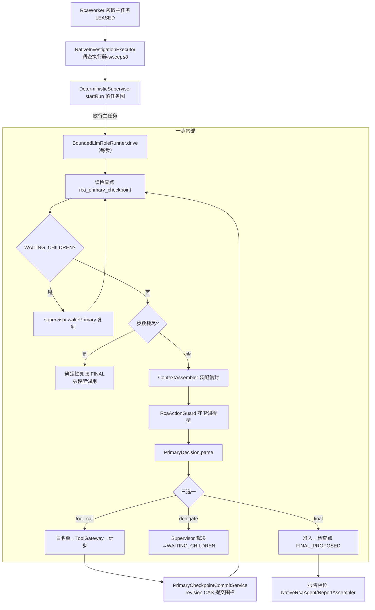
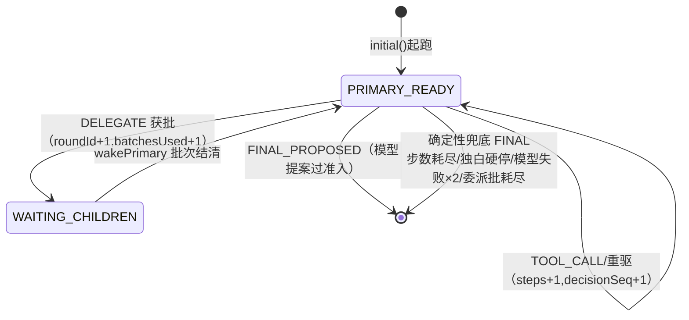

# 05-Main-Agent智能体循环

> 本系列第六篇，全系列核心。主 Agent（`BoundedLlmRoleRunner`）到底怎么跑、谁说了算、怎么保证它停下来、模型的"判断"和 Harness 的"硬约束"边界画在哪。
> 标注约定同前：【代码事实】/【合理推断】/【设计扩展】/【未确认】。

# 本层要解决的问题

一句话：**让大模型在"每步只能三选一（取证/委派/收口）"的格子里自由决策，但格子的地板（检查点）、墙（白名单/Schema/预算）、天花板（步数/回环/熔断）全部由确定性代码浇筑——模型可以犯错，系统必须能兜住。**

# 先看一个交易告警

> createOrder 成功率下降，主任务被 worker 领起。主 Agent 的每一步长这样：
> **第 1 步**：读检查点（PRIMARY_READY，0 步）→ 装配信封（告警材料+调查目标+预算面）→ 模型回 `{"tool_call":{"tool_id":"prometheus.rules","args":{"alertname":"OrderFail"}}}` → 网关执行 → 检查点 steps=1。
> **第 2 步**：信封里多了告警规则摘要 → 模型回 `{"tool_call":{"tool_id":"prometheus.query",...}}` 查成功率曲线 → 看到失败集中在支付网关调用之后 → steps=2。
> **第 3 步**：模型回 `{"delegate":{"requests":[...]}}` 委派查支付日志 → Supervisor 裁决获批 → 检查点进 WAITING_CHILDREN，主任务让位。
> **第 4 步**：子任务收官，唤醒复判 → 模型看到日志证据 → 出 `final`：一个 ROOT_CAUSE 断言引用三条证据 → 准入面逐条验引用 → 提案落检查点 → 报告相位接管。
> 如果模型第 2 步回的不是 JSON 而是一段散文？计一步，反馈"严格按协议输出纯 JSON"重驱。如果它连着 3 步不发起任何工具调用？回环守卫硬停。如果它第 30 步还想继续？步数天花板到了，确定性收口。

# 如果没有这一层会怎样

1. **模型一行循环代码 = 无主循环**。LLM 是无状态的：不装循环骨架，"多步调查"根本不存在，模型只能一次答完（即固定 Workflow）。本层的贡献是把"调模型→执行→喂回→再调"组织成可崩溃恢复的持久循环。
2. **没有硬约束 = 一场直播事故**。真实跑出来的教训全写在注释里："195 真窗实证：缺省 prompt 零协议描述时 glm-5 全程自然语言作答，8 步 JsonParseException 耗尽"（BoundedLlmRoleRunner.java:59-60）；"盲重驱无反馈=模型连猜同错 4 次"（PrimaryCheckpoint.java:24-25）；"同一 logs.query 同参零数据 ×5 熔断后整任务 DEAD……模型其余 13 工具与剩余步数全废"（:377-380）。**这个循环的每一条硬约束背后都是一次真实翻车**——这就是面试时最值钱的部分。
3. **没有检查点 = 每次崩溃从头查**。调查几十步、每步烧 token，进程一挂全重来；把状态放进进程内存，重启即蒸发。本层把全部推进状态落在 `rca_primary_checkpoint` 表，runner 本身无状态（:26-27 javadoc）。

---

# 代码是怎么做的

## 0. 先给我一句话

主 Agent 循环 = "无状态单步驱动 + 检查点续走"：每一步读检查点、装配信封、调一次模型、解析出三选一决策、执行、把新状态用提交围栏写回检查点——模型决定走哪条路，代码决定路存不存在。

## 1. 业务上为什么需要这一层

见"先看一个交易告警"。核心矛盾：调查路径动态（需要模型），执行必须可靠（需要代码）。本层就是这对矛盾的和解方案。

## 2. 它在整个系统的位置



## 3. 输入和输出

- **收到**（`RoleDriveRequest`，RoleRunner.java:29-35）：task（带租约 owner/epoch 的任务行）、binding（冻结的角色绑定）、profile（四件套 Agent 身份）、callContext（attempt/callSeq/控制信号）。
- **处理**：一步 = 读检查点 → 装配 → 调模型 → 解析 → 执行分支 → 提交围栏。
- **产出**（`RoleDriveResult`，:56-96）：封闭结局枚举（EVIDENCE_PRODUCED/NO_DATA/FAILED/WAITING_CHILDREN/FINAL_READY/DELEGATE_REJECTED）+ 新证据 id 列表 + 模型可见原因码。
- **交给谁**：NativeInvestigationExecutor（sweep 循环继续驱动或进入下一相位）。

## 4. 真实代码入口

- 文件：`alert/application/agent/BoundedLlmRoleRunner.java`
- 类定性（javadoc :25-40）："**无状态单步驱动**——全部推进状态在主任务检查点（V47 `rca_primary_checkpoint`），本类不持有任何跨步可变态"；"一步 = 读检查点 → WAITING_CHILDREN 先复判唤醒 → 步数耗尽走确定性兜底 FINAL → 模型路径取一个互斥 Decision"。
- 方法：`drive(RoleDriveRequest)`（:213-313）。
- 调用方：`NativeInvestigationExecutor`（infrastructure/nativeexec/，:61-73 javadoc：worker 领取 `NATIVE_INVESTIGATE` driver task 后由它驱动全链）。
- 下游：`ContextAssembler` / `RcaActionGuard` / `PrimaryDecision.parse` / `ToolGateway`（经 PrimaryToolPort）/ `DeterministicSupervisor` / `PrimaryCheckpointCommitService`。
- 关键参数：`stepMaxTokens`（默认 1000，:51——"Decision 是小对象，不允许长文"；推理模型经配置放大）；`maxDelegationBatches`（信封里的余量与 Supervisor 裁决同源，:239-240）。
- 返回值：`RoleDriveResult`（结局+证据+原因码），失败时 reason 是模型可见原因码（DECISION_UNPARSEABLE / TOOL_NOT_ALLOWED / TOOL_RETRYABLE:* 族）。

## 5. 核心对象

| 对象 | 是什么 | 谁创建/改 | 生命周期 | 持久化 |
|---|---|---|---|---|
| `PrimaryCheckpoint`（检查点） | 主任务全部推进状态：phase 两态、decisionSeq/stepsUsed/batchesUsed、roundId、finalClaims、lastError、revision、memoryId/digest、currentSummaryId（:38-56） | 唯一写口=PrimaryCheckpointCommitService | 主任务全程，崩溃后续走 | PG `rca_primary_checkpoint`（V47） |
| `PrimaryDecision` | 模型一步的三选一互斥决策 | parse 解析模型回复 | 单步即弃 | 不落库（后果落检查点/账本） |
| `AgentProfile` | 角色身份四件套+maxSteps，深冻结+稳定 digest | 启动装配/随 release 快照 | 进程级 | digest 可对账 |
| `TaskExecutionBinding` | 任务→角色的冻结绑定（roleId/roleVersion/roleDigest/releaseDigest/configEpoch/inputRefs），**编译事务一次写入只增不改，恢复不猜 latest**（:11-20） | Supervisor 编译期 | run 级 | PG（V46） |
| `AgentRegistry` | 角色注册表：启动期 fail-fast 构造、不可变、`requireExact` 按 (name,version,digest) 精确解析——**同名同版本 digest 漂移=冒名顶替显式拒绝**（:14-22） | 装配 | 进程级 | 无（对账锚） |
| `RoleLoopGuard` | 独白回环守卫：连续未发起工具调用的轮次计数，warn 2/stop 3 双档 | runner 每步 recordRound | 进程内存（"run 恢复归零可接受——粘滞面由检查点/步数上限兜底"，:19-20） | 否 |
| `WorkingMemory` | 工作记忆快照，append-only 深冻结，检查点只存引用 | 装配路径 append | run 级 | PG `rca_working_memory`（V91） |

## 6. 一条真实调用链（一步的完整解剖，:213-313）

```
drive(request)
├─ ① checkpoints.findByTask(taskId)  ── 检查点缺失=IllegalStateException（fail-closed，:214-216）
├─ ② phase==WAITING_CHILDREN?（:218-228）
│     └─ supervisor.wakePrimary：STILL_WAITING → 返回 WAITING_CHILDREN（不烧模型）；
│        结清 → 重读检查点继续
├─ ③ stepsUsed >= profile.maxSteps?（:231-233）
│     └─ 是 → deterministicFinal：空提案+缺口说明，零模型调用（:509-515）
├─ ④ 装配（:236-256）
│     batchesRemaining = max(0, maxDelegationBatches - batchesUsed)
│     → assembler.evidenceSnapshot / alertMaterial（真实内容入模）
│     → assembler.assemble(...)（有界材料：证据≤20/轨迹≤8/记忆槽≤10）
│     → maybeCompact（一步边界压缩，异常吞掉不打断主路径，:539-565）
├─ ⑤ modelDecision（:628-641）→ RcaActionGuard.guardedModelCall
│     RcaModelCallException：非零触网且不可重试且同签名已现一次 →
│     modelFailureFinal（确定性未决 FINAL，:264-274,662-678）
├─ ⑥ jsonOf(outcome.content)（:684-695：去空白+markdown 围栏；"不提取任意文本中的
│     JSON 片段——解析容忍面越宽注入面越大"）→ PrimaryDecision.parse
│     失败 → roleLoopGuard.recordRound(task,false)计入独白 + advanceStep(
│     "DECISION_UNPARSEABLE:严格按协议输出恰一个纯 JSON 对象…") → 返回 FAILED（:278-293）
├─ ⑦ recordRound(task, decision是TOOL_CALL)（:296-297）
│     STOP 级 → deterministicFinal("LOOP_MONOLOGUE_STOP")（:298-305）
└─ ⑧ 三分支（:306-312）
    ├─ TOOL_CALL → driveToolCall（:317-401）
    │    allowlist 不含 toolId → advanceStep("TOOL_NOT_ALLOWED…")计步重驱（:320-328）
    │    toolPort.invoke → ToolGateway
    │    ├─ ToolModelVisibleException → 分类反馈计步重驱（超时/限流/零数据…:338-357）
    │    ├─ INVALID_ARGS → 附执行器具体拒因回喂计步（:357-374）
    │    └─ DOOM_LOOP_TRIPPED → "禁止同参重发，改换取证方向…"（:381-395）
    │    成功 → advanceStep(lastError=null 清空反馈) → EVIDENCE_PRODUCED
    ├─ DELEGATE → driveDelegate（:403-434）
    │    supervisor.adjudicateDelegation：批获批 → WAITING_CHILDREN
    │    全拒 → 决策序推进（不耗步数）+ 拒绝码+修正指引写 lastError 回喂
    │      （"盲重提同一 gap 烧尽驱动上限"，BA-119，:420-431）
    └─ FINAL → driveFinal（:436-505）
         PrimaryClaimAdmission.admit（代码准入，见第 12 节）
         → claimRows（含降级留痕）→ commitCheckpoint(FINAL_PROPOSED)
         → FINAL_READY（报告相位消费）
```

**advanceStep 的写法**（:574-586）：每次推进都带 `CommitFence(runId, taskId, owner, leaseEpoch, configEpoch, expectedRevision)` 走 `commits.commitStep`——围栏拒绝（STALE/CONFIG_CHANGED/RUN_TERMINAL）异常上抛，"调用者立即退出本次驱动，不再末写胜出"（:570-573 注释）。

## 7. 状态机

主 Agent 的状态不是"运行/停止"，而是**检查点 phase × 终止线**的组合【代码事实】：

**检查点 phase 两态**（PrimaryCheckpoint.java:68）：



- **PRIMARY_READY（可取下一步决策）**与 **WAITING_CHILDREN（等本轮子任务收官）**——"不持锁等待，由确定性 Supervisor 复判唤醒"（:14-15）。
- 计数器语义（:16-18）：decisionSeq=已出决策序（动作身份单调）；stepsUsed=已耗主步数（对照 maxSteps）；batchesUsed=已耗委派批数（对照 2）；roundId 随获批委派批 +1。
- **revision**（:32-36）："真正的并发修订——运行路径提交必须以 WHERE revision=期望值条件写推进，与 decisionSeq 的'动作序'语义分型不可互代"。
- 谁修改：唯一合法写口 `PrimaryCheckpointCommitService`（提交围栏，CommitStatus 封闭七态 APPLIED/REPLAYED/STALE_OWNER/STALE_REVISION/CONFIG_CHANGED/RUN_TERMINAL）。存 PG，进程挂掉还在。

## 8. 正常业务流程（业务步骤 + 代码 + 状态）

以 createOrder 告警为例（对应"先看一个交易告警"的四步）：

| 步 | 业务动作 | 代码分支 | 检查点变化 |
|---|---|---|---|
| 1 | 查告警规则含义 | TOOL_CALL→prometheus.rules | steps 0→1，decisionSeq+1，memory 快照钉面 |
| 2 | 查成功率曲线 | TOOL_CALL→prometheus.query | steps 1→2 |
| 3 | 委派查支付日志 | DELEGATE 获批 | phase→WAITING_CHILDREN，batchesUsed 0→1，roundId→1 |
| — | 子任务执行（并行） | SingleToolRoleRunner（确定性，不调模型） | 子任务自己的任务行/证据 |
| 4 | 唤醒复判 | WAITING_CHILDREN→wakePrimary | phase→PRIMARY_READY |
| 5 | 收口出根因 | FINAL→准入→FINAL_PROPOSED | finalClaims 落检查点 |
| 6 | 报告相位 | NativeRcaAgent/ReportAssembler | run→REPORTING（run 级状态机） |

## 9. 异常流程（循环级逐项）

| 异常 | 处理了吗 | 怎么处理 |
|---|---|---|
| 模型输出不是 JSON | ✅ | 围栏整形（只剥 markdown 围栏不掏任意片段，:684-695）→仍失败则 DECISION_UNPARSEABLE 计步重驱+修正指引（:283-293） |
| JSON 合法但字段乱（多分支/野字段） | ✅ | PrimaryDecision.parse：恰好一个分支键、未声明字段显式拒绝（PrimaryDecision.java:177-273） |
| 调了不在白名单的工具 | ✅ | TOOL_NOT_ALLOWED 计步重驱，反馈明说"只能从 tool_allowlist 中选择"（:320-328） |
| 参数不符 Schema | ✅ | INVALID_ARGS+执行器具体拒因回喂（字段/格式/取值域），归 TOOL_RETRYABLE 族计步（:357-374） |
| 工具超时/限流/远端故障 | ✅ | 模型可见族分类反馈计步重驱；INTERNAL_ERROR 明确告知"不能假定网络错误"（:342-349） |
| 同参数反复零结果 | ✅ | DoomLoopGuard 熔断该查询签名：DOOM_LOOP_TRIPPED 反馈"禁止同参重发"，只熔断签名不废调查（:381-395） |
| 连续多步不碰工具（独白） | ✅ | RoleLoopGuard warn2/stop3：STOP→确定性兜底 FINAL（:298-305） |
| 模型同签名失败 ×2 | ✅ | R5 同签名熔断→MODEL_FAILURE_UNRESOLVED 确定性未决 FINAL（:258-274,662-678） |
| 步数耗尽 | ✅ | deterministicFinal 空提案+STEPS_EXHAUSTED 缺口说明，零模型调用（:231,509-515） |
| 委派批全被拒 | ✅ | 不耗步数但决策序推进；拒绝码+指引回喂防盲重提（:411-433） |
| 模型谎称完成/引用假证据 | ✅ | PrimaryClaimAdmission：越界引用剥离、零有效支持降级 HYPOTHESIS、同源只算一份（第 12 节） |
| 检查点提交冲突（旧 worker 复活） | ✅ | CommitFence revision/owner/epoch CAS：STALE_OWNER/STALE_REVISION 立即退出本次驱动（CommitService:71-77） |
| run 被取消/终态 | ✅ | RUN_TERMINAL 拒绝 + 心跳探针 StoppedException（RcaWorker.java:417-424） |
| 上下文过长 | ✅ | 装配有界（证据≤20/轨迹≤8）+ CAPABILITY_INPUT_TOO_LARGE 封闭码（RcaModelGateway.java:53）+ 一步边界压缩 |
| 配置在跑途中变更 | ✅ | CommitFence.configEpoch：CONFIG_CHANGED 拒绝——进行中 run 不漂移 |

## 10. 并发问题

1. **同一个主任务会不会被两个 worker 同时驱动？** 不会：任务领取走 LEASED+epoch（RcaWorker 层），drive 内每步提交还要过 CommitFence 的 owner/leaseEpoch 校验——双保险。旧 worker 的每一步提交都会被 STALE_OWNER 拒绝。
2. **提交会不会互相覆盖（Lost Update）？** 不会：revision 条件写"影响行数必须 1"（CommitService javadoc :22-27），事务内按 task→run→checkpoint 统一锁序。
3. **重复提交同一步（崩溃重放）？** actionKey 幂等：相同动作已落结果→REPLAYED 返回当前检查点原样（:32-35）——"不覆盖既成结果"。
4. **委派子任务与主任务并发改证据？** 证据是 append-only 账本，无更新冲突；主任务的后续观察在 wake 复判后读全量。

## 11. 崩溃恢复（kill -9 逐点演练）

模拟：第 7 步工具刚执行完、advanceStep 还没提交，进程被 kill -9。
- **已保存**：前 6 步全部推进状态（检查点 revision N）、已产证据行、工具调用账本、模型调用账本（PENDING/终态）。
- **没保存**：第 7 步的计步与反馈。
- **任务丢不丢？** 不丢：task 还在 LEASED，租约到期被 recoverExpired 回收→RETRY_WAIT→重领；driver task 由 NativeInvestigationExecutor 恢复分诊（EX-A3 四阶段：已提交跳过/结果落库幂等收尾/发送后未知 UNKNOWN+新物理请求重驱/FAILED 回执降级，NativeInvestigationExecutor.java:66-69）。
- **从哪继续？** 重驱 drive 从检查点 revision N 读起——**走的是和崩溃前完全相同的重入路径**，因为 runner 无状态。
- **第 7 步的工具调用会不会重复执行？** 分两面：工具账本 PENDING 先行+终态 CAS 保证账面不重；物理上同一查询是只读 R0，重执行安全（"幂等：finishTerminal 仅 STARTED 行迁移"同律）。若那次调用已产生证据行，ME-T05 的 payload_digest 比对判定"相同业务内容不再记进展"（SingleToolEvidenceAgent.java:44-49）。
- **独白计数丢了怎么办？** RoleLoopGuard 是进程内存，注释明说"run 恢复归零可接受——粘滞面由检查点/步数上限兜底"（:19-20）——**诚实的分层：精确状态落库，启发式状态可丢**。

## 12. 安全（模型输出信任链）

1. **协议即围栏**：PROTOCOL_SUFFIX 是 runner 拥有的硬契约（"不依赖可配置 prompt 记得携带"，:56-60），随信封每步下发。
2. **解析即校验**：parse 拒绝野字段、强制互斥（PrimaryDecision.java:17"模型输出不可信"）。
3. **行动前逐闸**：白名单（runner）→ 策略双闸+Schema（Gateway）→ 预算/租约（ActionGuard）。
4. **FINAL 准入是最后一道信任边界**（PrimaryClaimAdmission.java:19-41，纯代码规则"模型不自评类型晋升"）：
   - 引用越界拒绝：evidence_refs 只认本 run 已准入工件集，越界剥离留痕（RX06）；
   - 必要证据校验：ROOT_CAUSE 零有效引用→降级 HYPOTHESIS；有引用但零 SUPPORTS→同样降级（"引用存在≠证据支持"）；
   - 同一来源只算一份：跨角色复述同一证据行不构成第二份独立来源；
   - 作用面确定性授予：SUPPORTS/REFUTES/CONTEXT 模型只可**提议**；全量日志计数、累计计数器值强制 CONTEXT（不能冒充错误证据/窗口增量）。
5. **为什么不能只在 Prompt 里说"只准用这几个工具、结论要有证据"？** 因为 195 实证模型连"只输出 JSON"都保证不了（:59-60 注释）；Prompt 是请求，allowlist/schema/准入是执行面不信任的复核。**模型约束是软约束， Harness 逐层复核才是硬约束**——本层每一条硬约束都对应一次真实翻车修复。

## 13. Agent Harness（本层职责切分表——面试重点）

| 事项 | 模型（判断） | Harness（硬约束） | 代码锚 |
|---|---|---|---|
| 下一步查什么 | ✅ 三选一 | 白名单+Schema+预算闸 | :306-312 |
| 要不要委派 | ✅ 提议委派 | 裁决批不批（批≤2、封闭拒绝码） | Supervisor |
| 何时结束 | ✅ 提议 FINAL | 准入裁决+四条确定性终止线 | :436-531 |
| 每步花多少钱 | ❌ | TOKEN 预留/结算、stepMaxTokens | ActionGuard |
| 最多走几步 | ❌ | maxSteps 对照 stepsUsed | :231 |
| 死循环检测 | ❌ | DoomLoop/RoleLoopGuard/Budget 三层 | RoleLoopGuard:16-17 |
| 进度保存 | ❌ | 检查点+提交围栏 | CommitService |
| 反馈修正 | ✅ 按 lastError 改 | 反馈文案由 Harness 定稿 | advanceStep |

**第十部分必答·十六问速答表**【每条都有代码锚】：

| # | 问题 | 30 字内答案 |
|---|---|---|
| 1 | Agent Loop 怎么跑 | 无状态单步 drive；sweep≤8 由执行器反复驱动，状态全在检查点 |
| 2 | 谁判断继续/结束 | 模型每步提议；最终终止权在四条确定性终止线 |
| 3 | 谁决定直查/委派 | 模型选分支；委派批不批由 Supervisor 确定性裁决 |
| 4 | ReAct 体现在哪 | Thought 被禁（纯 JSON）；Reason→Act→Observe=决策→工具→结果+lastError 回喂 |
| 5 | 一次调几个 Tool | 恰 0 或 1 个（TOOL_CALL 单工具） |
| 6 | Tool 串行还是并行 | 主循环步间严格串行；并行靠委派批子任务 |
| 7 | 输出怎么解析 | 剥围栏→Jackson→PrimaryDecision.parse 结构裁决 |
| 8 | 怎么保证结构合法 | PROTOCOL_SUFFIX 硬契约+parse 互斥/野字段拒绝 |
| 9 | 非法 JSON | DECISION_UNPARSEABLE 计步重驱+修正指引；耗尽兜底 |
| 10 | Tool 不存在 | 白名单外=TOOL_NOT_ALLOWED 计步；真不存在=UNKNOWN_TOOL 终止族 |
| 11 | 参数不符 Schema | INVALID_ARGS+具体拒因回喂计步重驱 |
| 12 | 连续同 Tool | 同参零进展→DoomLoopGuard 熔断该签名 |
| 13 | 最大步数在哪 | Profile.maxSteps vs 检查点 stepsUsed（:231） |
| 14 | 死循环怎么退 | 三层：工具签名熔断/独白 warn2 停3/预算+步数绝对上限 |
| 15 | 模型说完成就信 | 不信：PrimaryClaimAdmission 代码准入（剥引用/降级/同源归并） |
| 16 | 确定性终止条件 | 步数耗尽/独白 STOP/同签名失败×2/委派批耗尽→零模型调用 FINAL |

## 14. 可观测性

一次调查的"每步"都能查【代码事实】：`rca_model_call` 行（V48）每步模型调用一条——action_seq=decisionSeq 单调身份、input_snapshot_digest（G3 接线回填，R5 熔断比较键）、usage/cost；`rca_model_input_capture`（V90）存模型输入原文供回放对账；`rca_compaction_consumption`（V164）记压缩消费；工具账本记每次工具调用；检查点行本身是决策史（decisionSeq/lastError/finalClaims）；事件面 GUARDIAN_REVIEWED 等同账本。排障路径：拿 task_id → 检查点行看 stepsUsed/phase → 按 decisionSeq 拉模型调用与工具调用 → 对照事件链还原每步决策依据。

## 15. 性能和成本

- **时延大头=模型调用**：每步一次（估算预留 ≥1500 token/步 + maxTokens 1000 输出，:47-51）；步与步严格串行（依赖上步观察，无法并行——这是 ReAct 结构的固有代价）。
- **并行面**：委派批的子任务与主任务 WAITING 并行；多 run 之间靠槽位并行。
- **省模型调用的设计**：确定性兜底零模型；WAITING_CHILDREN 复判零模型；DELEGATE 全拒不重驱模型（决策序推进但步数不动）；压缩减少每步输入 token。
- **QPS×10 先坏哪**【合理推断】：模型网关（配额/熔断）→ 步数×并发=token 吞吐；检查点表写入是低频单行 CAS，最后才坏。

## 16. 设计取舍

**① 为什么 runner 做成无状态+检查点落库，而不是内存里一个 while 循环？**
内存循环是教科书 ReAct，但进程一挂几十步全丢，且多实例下无法安全接管。无状态单步+持久检查点让"崩溃恢复"变成"重读一行"，让"换实例接管"变成"重驱动同一函数"。代价：每步一次 DB 读+一次条件写——用每步两次 DB 往返换崩溃零损失，对分钟级调查完全值得。

**② 为什么不用框架自带的 ReAct/Function Calling，而是自研"协议 JSON+严格解析"？**
【合理推断+代码事实复合】代码层面：模型客户端是 Spring AI 单路由直调（一次 complete 至多一次 HTTP，:39-40），协议解析完全自持——因为协议即围栏（PROTOCOL_SUFFIX 硬契约），且解析容忍面被刻意收窄（"不提取任意文本中的 JSON 片段——解析容忍面越宽注入面越大"，:686-687）。框架的 function calling 会把工具执行权交回框架，与本项目的白名单/预算/围栏体系冲突。代价：没有框架的自动重试魔法，但换来每一步都可审计可拒绝。

**③ 为什么委派上限是 2 批×2 请求这么小？**
§三 max_delegation_batches=2 是设计基线值（Supervisor:76），0=零委派合法姿态（臂A）。委派的成本是上下文分裂+等待延迟+回执消费复杂度；收益是专业隔离。2 批封顶防"委派风暴"——模型把调查全推给子任务烧预算。小到"够用"，是刻意的。

**④ 当前方案最大的边界？**
- 主循环步间串行，调查时延下限=步数×单步时延，纯并行取证不支持（委派是唯一并行面）；
- RoleLoopGuard/独白计数重启归零（诚实接受的分层）；
- 模型换版本时协议遵循度会变（glm-5 的 8 步 JSON 解析失败教训），协议遵循没有跨模型的保证，只能靠评测回归兜。

## 17. 面试背诵卡

【30 秒主答】
"主 Agent 是个无状态单步驱动的有界循环。每一步：读检查点、确定性装配信封、守卫下调一次模型、把回复剥掉 markdown 围栏后做严格解析——必须是恰好一个分支的纯 JSON：tool_call、delegate、final 三选一。选工具有过三道闸：白名单、Schema 校验、预算；选委派由确定性 Supervisor 裁决，上限两批；选收口要过代码准入——引用越界剥离、没有有效支持的根因断言自动降级成假设。模型永远不能自己决定停止：步数耗尽、连续三步独白、同签名失败两次，四条确定性终止线全部走零模型调用的兜底收口。所有推进状态用带 owner、epoch、revision 围栏的条件写落检查点，任意一步崩掉，重驱动从检查点原样续走。"

## 18. 这一层哪些话不能说

1. ❌ "我们的 Agent 用了 LangChain/LangGraph/AutoGen" → ✅ 自研循环，模型客户端 Spring AI 直调，无 Agent 框架。
2. ❌ "模型支持并行工具调用" → ✅ 恰 0/1 个工具每步；并行只存在于委派子任务层面。
3. ❌ "ReAct 带思维链推理" → ✅ 协议明确禁止思考过程输出（"不要思考过程"是协议原文）；推理体现在决策选择，不体现在文本。
4. ❌ "Agent 会自主决定何时停止" → ✅ 停止是确定性终止线的事；模型的 FINAL 只是提案。
5. ❌ "上下文是对话历史累积" → ✅ 每步信封从账本确定性重建，没有消息历史累积（11 篇详述）。
6. ❌ 不要说"模型 failed 就重试到成功"——同签名×2 即熔断收敛，绝不无限重试。

---

# 我现在应该能回答什么

1. 一步循环内部顺序是什么？每步读写哪些持久状态？（→ 第 6 节解剖）
2. 三条终止线之外还有第四条吗？（→ 步数/独白/同签名失败/委派批耗尽+预算绝对上限）
3. FINAL 提案怎么被"验货"？（→ 准入四规则）
4. 崩溃后为什么不会重复执行工具、不会重复计步？（→ 账本 PENDING-CAS + actionKey REPLAYED + revision 围栏）
5. 模型"幻觉"最坏能造成什么？（→ 一条被拒的决策/一条被降级的断言/一次计步——全部被拦截在结构层）

# 30 秒背诵卡

见第 17 节。

# 面试官追问卡

**Q1：为什么协议强制"不要思考过程"？ReAct 不是要思维链吗？**
考什么：对 CoT 与工程约束取舍的理解。
30 秒答："恰恰是 195 实测教训：给了自由文本空间，glm-5 全程自然语言作答，8 步全解析失败耗尽步数。我们要的 ReAct 是结构上的 Reason→Act→Observe 循环，不是文本上的思维链——推理质量体现在'第几步选择查什么'，这在决策序列里完全可观测。思维链文本对这个系统是纯负债：烧输出 token、破坏解析、还可能泄露不该给模型上下文之外的东西。"
继续追问 1："那推理型模型（deepseek 系）的思考 token 呢？"——答："供应商侧 reasoning token 计入输出预算，所以 step-max-tokens 提供配置放大（:49-51 注释原文）——推理在模型侧发生，返回给我的仍然只是最终 JSON。"

**Q2：为什么委派被全拒后"不消耗步数但决策序推进"？**
考什么：两个计数器分型的精确理解。
30 秒答："因为它们语义不同。stepsUsed 对照的是模型工作量预算——全拒的批次模型没消耗工作，扣它步数等于惩罚模型+提前触发兜底，不公平；decisionSeq 是动作身份单调序——决策已经出了（只是被驳回），账本上必须占一序，否则下一次提交的动作身份会撞账。一句话：步数管预算，决策序管身份，分型不可互代——这也是检查点注释的原话。"
继续追问 1："那模型会不会利用'全拒不耗步数'无限重提委派？"——答："不会，第一拒绝码+修正指引随 lastError 回喂（'GAP_ALREADY_ADJUDICATED=该 gap 已有台账行，勿换汤不换药重提'）；第二重提仍要过裁决，同一 gap 永远拒绝；第三就算它换着花样提，batchesUsed 不涨但 maxDelegationBatches 对照的获批数不会变——重提的只有被拒批，没有新批次额度。"

**Q3：同签名模型失败熔断的"签名"具体是什么？为什么这么设计？**
考什么：熔断键的选择。
30 秒答："签名=errorCode+稳定信封摘要（snapshotDigest），:264。稳定面刻意不含 lastError 反馈——反馈每步可变，不是冻结输入（ContextAssembler.java:48-50）。这样'同参数同错误连续两次'才等价于'再发一次必然同败'，第二次直接确定性未决收敛，不再烧模型。它防的是模型网关侧的确定性故障（比如上下文超限、权限拒绝），和 DoomLoopGuard（工具侧同参零进展）正好一个管模型一个管工具。"
继续追问 1："为什么第二次就熔断，不给第三次？"——答："确定性故障第三次同参重发还是失败，第三次只是花钱买确认。非确定性故障（网络抖动）走 retryable 族另有重试，不进这个熔断面。"

**Q4：检查点 revision 和 decisionSeq 都是递增的，为什么要有两个？**
考什么：并发控制与业务序的分离。
30 秒答："decisionSeq 是业务动作序——'第几步决策'，用于动作身份、账本对账、guard 预算键；revision 是并发修订——'这行数据被提交了几次'，用于 CAS 条件写。两者在大多数步一起涨，但会分叉：DELEGATE 全拒时决策序+1 而阶段步数不动；ERROR_RECORDED 只留痕零推进。如果合用一个字段，'零推进的提交'（比如只写失败留痕）就没有合法的身份可占。检查点注释原话：'分型不可互代'（PrimaryCheckpoint.java:32-36）。"
继续追问 1："STALE_REVISION 拒绝后那步工作白做了？"——答："白做但无害：工具调用是只读的，证据行已入账；新持有者从它的检查点重走，读到的证据更全。丢失的只有一次模型调用的钱——这正是围栏买的安全性。"

**Q5：FINAL 准入里"全量日志计数不能当错误证据"这条很细，为什么做到这个粒度？**
考什么：对模型"合理但错误"行为的防御深度。
30 秒答："因为这是真实翻车面：模型查了个 ERROR/WARN/INFO 全量的聚合计数，看到总数很大就断言'大量错误发生'——但那个数字里可能 99% 是 INFO。注释引用的批号（aa7f25b4）显示还有一类：来源标签冒充症状码导致 tp=0/fp=99/fn=60 的结构性恒 miss。这类错误的特点是**语法全对、语义全错**，Schema 拦不住，只能在准入面用确定性规则拦：聚合全量计数强制 CONTEXT、累计计数器强制 CONTEXT、来源标签不算症状码。每条规则都对应一种被实证过的模型坏习惯。"
继续追问 1："这些规则怎么发现的？"——答："评测面：维度化评分把 tp/fp/fn 拆开，结构性偏差立刻现形——再反推准入规则。这就是 Harness 和 Eval 双轮的闭环。"

**Q6：如果让你重新设计主循环，会改什么？**【设计扩展——设计题答案，不要说成现网实现】
考什么：REDO。
30 秒答："三处：一是给'并行只读取证'开个小口——单步内允许模型声明一组互相独立的只读查询（仍受预算与白名单），减少纯串行等待，但要小心结果汇总进下一步信封的确定性；二是把独白守卫的计数落进检查点（现在重启归零是诚实接受的分层，落库成本一行字段）；三是协议解析考虑上 JSON Schema 的标准 tool-calling 形态——前提是模型遵循度经评测验证不退化。无状态单步+检查点+提交围栏这个骨架是这系统最值钱的部分，原样保留。"

# 这层不要乱说什么

1. 不要说"ReAct 思维链"——协议明令禁止思考过程；说"结构化 Reason-Act-Observe 循环"。
2. 不要说"多轮对话上下文"——无对话累积，每步信封重建（说错这个，11 篇的上下文治理就崩了）。
3. 不要说"并行工具调用"——每步恰 0/1 工具。
4. 不要把四条终止线说成"超时"——没有时间型终止（时间型终止在 run 层 deadline 和硬期限），全是步数/行为/失败计数型。
5. 不要说"框架保证重试"——一切重试/熔断/兜底是自研 Harness 行为，代码有行号。
6. glm-5、deepseek 的翻车注释可以引用为"实测教训"，但具体模型版本响应【未确认——以注释为准，不要编造数字】。

# 5 句话总结

1. **为什么需要**：LLM 无状态且不可信，多步调查需要把"调模型"组织成一个可恢复、可终止、可审计的持久循环。
2. **核心机制**：无状态单步 drive + 检查点续走；每步三选一；提交围栏（owner/epoch/revision）防并发；四条确定性终止线兜底。
3. **上下游协作**：上游 worker/执行器驱动 sweep；下游 Supervisor 裁决委派、报告相位消费 FINAL 提案。
4. **最大风险**：模型协议遵循度随模型版本漂移（实证过 8 步全败），只能靠协议硬契约+评测回归对冲。
5. **最大取舍**：串行单工具换确定性可审计——每一步都能回答"为什么这么走、花了多少、证据在哪"。

---

*本篇完成。下一篇待你指令解锁：《06-Tool-Calling工具调用》。*
