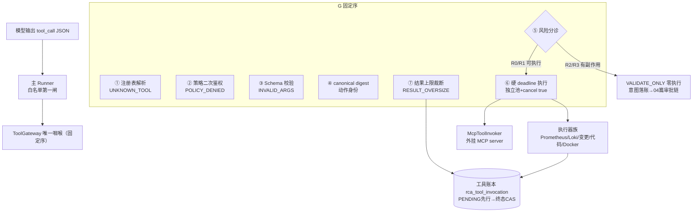
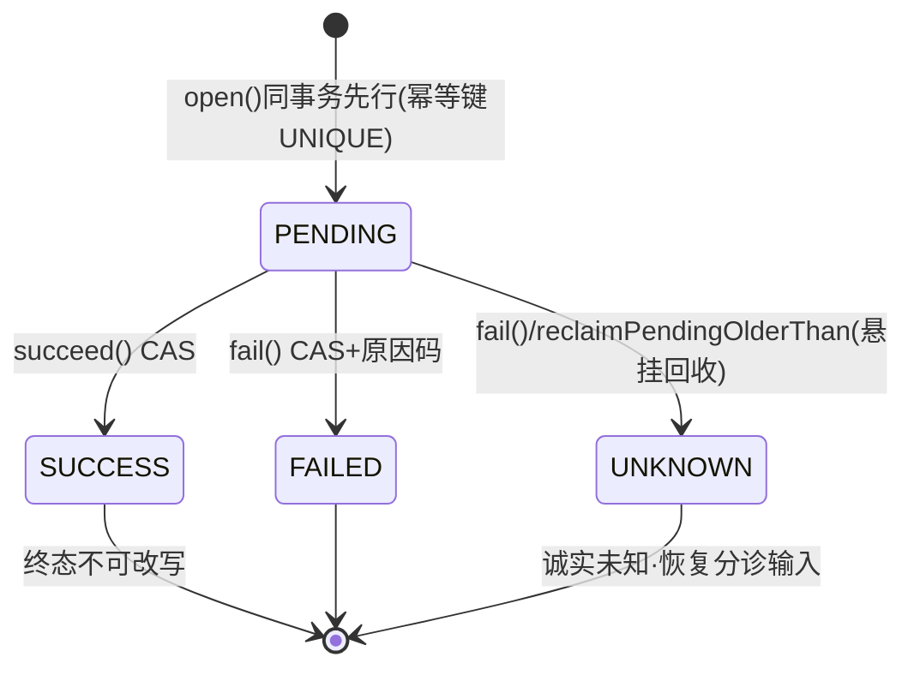

# 06-Tool-Calling工具调用

> 本系列第七篇。工具（Tool）在这个系统里不是"模型调用的函数"，而是**带 Schema、风险级、超时、账本、审批的受控生产组件**。本篇讲透一次工具调用从模型输出到结果回喂的全部纪律。
> 标注约定同前：【代码事实】/【合理推断】/【设计扩展】/【未确认】。

# 本层要解决的问题

一句话：**模型每次"想调工具"只是一个 JSON 提议；本层负责验明正身（注册表+策略双闸）、验形状（Schema 硬拒绝）、算身份（canonical digest）、分风险（R0/R1 执行，R2/R3 只记账）、控时间（硬 deadline）、控大小（结果上限）、记总账（PENDING 先行→终态 CAS）——让工具调用成为可审计、可恢复、可限权的生产操作。**

# 先看一个交易告警

> 主 Agent 第 2 步想查成功率曲线，输出 `{"tool_call":{"tool_id":"prometheus.query","args":{"query":"...","start":"1758...","end":"1758...","step":"30s"}}}`。
> 这个 JSON 在 ToolGateway 里走一条固定流水线：注册表里找 `prometheus.query@1`（找不到=UNKNOWN_TOOL 终止）→ 策略二次鉴权 → Schema 校验（`step` 必须匹配 `^\d{1,4}(ms|s|m|h)$`，多一个字段直接拒绝）→ 算出 64 位动作摘要 → 风险级 R0 允许执行 → 独立线程池提交，deadline 取 min(工具超时，任务硬期限) → Prometheus 查询执行器流式读响应（超过结果上限的字节**根本不进内存**，读到即断）→ 结果回喂模型，账本 PENDING→SUCCESS。
> 同一个告警调查里，如果它第 5 步突然调 `service.rollback`——流水线在风险检查处分岔：**零执行**，只落一条意图进审批链（04 篇），模型收到"审批编号 xxx 前 8 位，请勿重试"的回执。

# 如果没有这一层会怎样

1. **工具就是任意代码执行**。没有 Schema 校验，模型一个幻觉参数（时间格式写错、service 名带注入字符）就直达数据源；没有结果上限，一个返回 500MB 的查询撑爆内存。本层的对应防线都有真实出处：执行器"流式至多读 limit+1 字节，读到即断——超大响应不再全量进内存"（PrometheusQueryExecutor.java:30-32）。
2. **重复调用无法对账**。网络抖动后重试，同一查询打了几次？谁也说不清。本层的账本有逻辑幂等键 `UNIQUE(run, task, attempt, call_seq, tool)`——"同一逻辑调用只可能落一行账（重复调用 = 键冲突显式失败）"（RcaToolInvocationLedger.java:10-11）。
3. **危险工具和只读工具一个待遇**。没有风险分级，`service.restart` 和 `prometheus.query` 都会被直接执行。本层用四档 ToolRisk 把执行权切开，且**风险等级只认本地注册表声明，外部 MCP 的 readOnlyHint 注解"官方明示不可信"，伪造 annotation 不影响判定**（ToolRisk.java:4-6）。

---

# 代码是怎么做的

## 0. 先给我一句话

工具层是一个带"双闸门卫 + 体检处 + 风险分诊台 + 秒表 + 容量秤 + 总账房"的调度室：模型的所有工具调用都要从这扇门过，R0/R1 放行执行，R2/R3 只登记意图转审批，谁也别想绕。

## 1. 业务上为什么需要这一层

模型输出的是自然语言的概率产物，而工具触达的是生产数据源（Prometheus/Loki/变更系统/代码库/Docker）。两者的信任等级差一个数量级——这一层就是把"概率输出"翻译成"确定性操作"的协议转换器+保险丝盒。

## 2. 它在整个系统的位置



## 3. 输入和输出

- **收到**：`ToolInvocation` 五元组身份（runId/taskId/attemptId/callSeq/toolName+version）+ args + timeRange + 调查输入身份 + 外部硬期限（ToolGateway.java:112-117）。
- **处理**：第 2 节图的七步固定序。
- **产出**：`ToolInvocationResult{EXECUTED|VALIDATE_ONLY, actionDigest, body}`——EXECUTED 带工具真实响应体（已过上限裁断），VALIDATE_ONLY 带"待审批"回执体。
- **交给谁**：EXECUTED 的 body 回喂模型（随下一步信封）；同时证据面落账（SingleToolEvidenceAgent 产 EvidencePackage）。

## 4. 真实代码入口

- 文件：`alert/application/tool/ToolGateway.java`
- 类/方法：`invoke(ToolInvocation)`（:134-167），javadoc 固定序原文（:26-36）："注册表解析 → 策略二次鉴权（双闸之二；第一闸 = LLM 下发清单已按 policy 裁剪）→ schema 校验（未声明字段硬拒绝）→ canonical digest → R2/R3 VALIDATE_ONLY 记录意图零执行 → 硬 deadline 执行（独立调用池，超时 cancel(true)，迟到结果直接丢弃）→ 结果上限裁断"。
- 调用方：主 Runner 的 `PrimaryToolPort`（主任务直查）+ `SingleToolEvidenceAgent` 基座（子 Agent 查询）。
- 下游：`ToolRegistry`/`ToolPolicy`/`ToolArgsValidator`/执行器族/`RcaToolInvocationLedger`/`ActionIntentLedger`。
- 关键参数：`externalDeadline`（任务/Run 硬期限，Host 下发——"工具等待 deadline 取 min(工具超时，外部期限)，过期即停止事实，不吞成工具超时"，:109-110）；`callSeq`（同一 attempt 内单调序号，账本幂等键组成）。
- 返回值语义：Kind 两值即"执行了/没执行"，digest 是跨五账本的动作身份锚。

## 5. 核心对象

| 对象 | 是什么 | 关键纪律 | 代码锚 |
|---|---|---|---|
| `ToolRegistry` | 本地工具注册表：name@version → definition+executor | **仅启动期构造**：重名同版本"无论 schema 异同都拒绝，禁静默覆盖"；空表拒绝启动；构造后不可变无注册 API；"禁运行时网络下载插件"由结构保证+架构测试断言（tool 包禁触网络 API） | ToolRegistry.java:11-15 |
| `ToolDefinition` | name/version/schema/risk/timeoutMillis/resultLimitBytes + schemaHash | schema 归一化：必须 type=object、properties 非空、每属性须声明合法 type、**additionalProperties 显式 true 直接拒绝**（缺省归一为 false 进 hash）；**risk 缺省从严 null→R3** | ToolDefinition.java:7-14,48-75 |
| `ToolPolicy` | 工具名允许集（双闸之二） | **空策略硬失败**（无"或显式确认"模糊分支） | ToolPolicy.java:7-9,17-21 |
| `ToolRisk` | R0 只读可重放 / R1 敏感读 / R2 有副作用不执行 / R3 危险不可逆升级人工 | `executable()` 只认 R0/R1；**风险只来自本地声明，外部 annotation 不可信** | ToolRisk.java:8-21 |
| `ActionDigest` | 64 位动作摘要 = canonical(toolName,version,schemaHash,args,timeRange,输入身份) | 校验成功才 canonicalize+digest（顺序即纪律）；跨意图/审批/授权/操作五账本同锚 | ToolGateway.java:150-153 |
| `RcaToolInvocationLedger` | 工具调用总账（V15） | PENDING 先行→终态 CAS 单向单次；幂等键 UNIQUE(run,task,attempt,call_seq,tool)；`findSuccessfulByRun` 支撑同 digest 证据复用（"同 digest=同语义查询，复用 evidenceId 不重打工具"） | RcaToolInvocationLedger.java:8-11,73-77 |
| 错误两族 | `ToolControlPlaneException`（终止族）/`ToolModelVisibleException`（模型可见族） | 终止族不进重试循环；可见族"结构化脱敏固定文案，executor 异常文本一律不透传" | ToolGateway.java:33-36 |

**错误分类法全景**【代码事实，面试高价值】：
- 模型可见族（可回喂重试）：`NO_DATA`（查询成功零数据，正常非故障）/`RATE_LIMITED`（429 退避）/`TIMEOUT_RETRYABLE`/`REMOTE_UNAVAILABLE`/`SOURCE_UNAVAILABLE`（Loki 单独记因，台账可判源）/`REPLAY_MISS`/`TOOL_NOT_ALLOWED`/`INTERNAL_ERROR`（"失败原因未分类——显式内部错误，不默认 REMOTE_UNAVAILABLE"）（ToolModelVisibleReason.java:7-24）。
- 控制面终止族：`POLICY_DENIED`/`UNKNOWN_TOOL`/`INVALID_ARGS`/`AUTH_FAILED`/`BUDGET_EXHAUSTED`/`STALE_GENERATION`/`RESULT_OVERSIZE`/`QUERY_FAILED`（"日志源对良构查询回 4xx——工具侧缺陷，不进重试循环"）/`CAPABILITY_REVOKED`/`CONFIGURATION_ERROR`/`DOOM_LOOP_TRIPPED`（ToolControlReason.java:8-24）。
- 两族与 runner 的接口（05 篇 :338-396）：可见族一律计步回喂；终止族里 INVALID_ARGS 和 DOOM_LOOP_TRIPPED 被 runner 转成带指引的计步反馈，**其余原样上抛→任务 DEAD**。

## 6. 一条真实调用链（prometheus.query 全程）

```
模型 tool_call → 主 Runner 白名单校验（allowlist 第一闸）
→ ToolGateway.invoke（:134）
  ① registry.find("prometheus.query","1") → 命中 Registration
  ② policy.allows → true（"清单裁剪可被绕过，此处不可"——执行时仍鉴权，:140-144）
  ③ ToolArgsValidator.validate（:22-65）：
     required(query,start,end,step) 齐全？每个 key 在 properties 里声明？
     类型匹配？maxLength≤512？pattern ^\d{1,10}$？
     未声明字段 → "INVALID_ARGS: 未声明参数（additionalProperties=false 硬拒绝）"
  ④ ActionDigest.of(canonical envelope) → 64 位动作身份
  ⑤ risk=R0 → executable → 走执行
  ⑥ executeWithDeadline（:175-259）：
     hard = now + timeoutMillis；externalDeadline 更早则取外部（已过期 →
     StoppedException(RUN_DEADLINE_EXCEEDED)，"不吞成工具超时"）
     callPool.submit（独立池；池满 RejectedExecutionException →
     REMOTE_UNAVAILABLE"通道拥塞（背压拒绝）"——明确拒绝不静默排队，:216-224）
     InFlightToolCancels 句柄：QUEUED→RUNNING CAS，取消与启动竞争取消胜=零执行
     future.get(deadline) → 超时 cancel(true) 迟到结果作废 → TIMEOUT_RETRYABLE
  ⑦ 执行器内（PrometheusQueryExecutor.java:60-98）：
     语义校验（窗幅≤3600s、step≤60s——"schema 管形状，此处管语义"）
     HTTP 429 → RATE_LIMITED；非 200 → REMOTE_UNAVAILABLE（脱敏固定文案）
     流式读 limit+1 探针 → 读到即断
  ⑧ 回 Gateway：body ≤ resultLimitBytes？超 → RESULT_OVERSIZE 终止族
  ⑨ EXECUTED + digest + body 返回；账本 PENDING→SUCCESS；证据面落 EvidencePackage
→ 模型可见的下一步信封里多了一份指标证据摘要
```

## 7. 状态机（工具调用账本的 micro 状态机）



- **PENDING 先行**的意义：调用没发生账已记，进程在任何缝隙被杀都留悬挂行可查（F16 回收扫描：超宽限 PENDING→UNKNOWN）。
- **终态 CAS 单向单次**：succeed/fail 都带"非 PENDING 返回 false"——终态不可改写，迟到回执改不了账。
- **每个 Tool 的完整档案**（第十四部分要求逐工具分析，按目录归族给出）：

| 工具族 | 工具（目录名↔注册名） | Schema 要点 | 风险 | 幂等 | 语义上限 |
|---|---|---|---|---|---|
| 指标 | prometheus.query / instant / metric_value / catalog / label_values / rules | query maxLength 512；时间 `^\d{1,10}$`；step `^\d{1,4}(ms\|s\|m\|h)$`；catalog 的 service 必填（"服务器拼选择器，模型零语法面"） | R0 | 只读天然幂等+同 digest 证据复用 | 窗幅≤3600s、step≤60s（执行器域内判） |
| 日志 | logs.query（Loki）/ logs.aggregate | severity 封闭集 ALL/ERROR/WARN/INFO；service≤128 | R0（R1 敏感读面按声明） | 同上 | "先聚合后读行，确定性零 LLM" |
| 变更 | change.query / change.diff | since/until/service | R0 | 同上 | "窗内变更+窗前基线一次给出" |
| 告警 | alert.history | alertname/fingerprint≤256+窗 | R0 | 同上 | 触发/恢复时间线 |
| 容器 | docker.ps / docker.inspect | container 名 pattern+≤64 | R0 | 只读 | "env 只回键名不回值（§一只读边界）" |
| 知识（RAG） | runbook.catalog / runbook.fetch / rca_history.search | runbook_id pattern 天然拒绝路径分隔符与 URL 语法 | R0 | 只读 | "列表零正文，正文归 fetch" |
| 代码 | code.search / code.read | service 必在宿主绑定集；path pattern 禁反斜杠，'..' 段执行器沙箱复判 | R0 | 只读 | 字面量匹配无正则面；脱敏+溯源块 |
| 副作用 | service.restart / service.rollback | args["service"] 即请求资源键 | **R3** | 非幂等→全链审批+锁+对账 | VALIDATE_ONLY 零执行（04 篇） |

（各工具的具体 timeoutMillis/resultLimitBytes 为装配期数值【未确认具体毫秒数】，机制上 ToolDefinition 构造期强制为正。）

## 8. 正常业务流程（业务步骤 + 代码 + 状态）

| # | 业务动作 | 代码 | 账面变化 |
|---|---|---|---|
| 1 | 模型要查指标 | Runner 校验 allowlist 通过 | — |
| 2 | 网关七步流水线 | ToolGateway.invoke | 全过（R0） |
| 3 | 限界执行 | executeWithDeadline+执行器 | 工具账本 INSERT PENDING（先行） |
| 4 | 数据返回 | readBounded | body 裁断在限内 |
| 5 | 落证据 | SingleToolEvidenceAgent：先查同 digest 已有证据（MC24 复用），无则产 EvidencePackage | 证据行+resultRef 挂账 |
| 6 | 结账 | ledger.succeed CAS | PENDING→SUCCESS |
| 7 | 回喂 | 证据摘要随下一步信封 | 检查点 steps+1 |

## 9. 异常流程（第十四部分必答对照）

| 异常 | 处理了吗 | 怎么处理（真实代码） |
|---|---|---|
| 模型参数错（缺/多/类型错/超长/不匹配 pattern） | ✅ | INVALID_ARGS：required 缺失/未声明字段硬拒绝/类型校验/maxLength+pattern（ToolArgsValidator:31-64）；runner 附执行器具体拒因回喂计步（05 篇） |
| 工具不存在 | ✅ | UNKNOWN_TOOL 终止族（注册表查无此 name@version，:137-139）；MCP 面：server 无此 tool 同码+“旧 schema 不误用”（McpToolInvoker.java:63-68） |
| 工具超时 | ✅ | deadline=min(工具超时,任务硬期限)；超时 cancel(true) "迟到结果作废"→TIMEOUT_RETRYABLE；外部期限已过=RUN_DEADLINE_EXCEEDED 停止事实（:177-233） |
| 工具返回 500/网络断 | ✅ | REMOTE_UNAVAILABLE 脱敏固定文案（429 单独 RATE_LIMITED 提示退避）——"供应商异常原文/body 不进日志"（SpringAiRouteClient 同律） |
| 工具返回空 | ✅ | NO_DATA——"查询成功但无数据（正常空结果，非故障）"；上层纪律"无故障不制造证据"（SingleToolEvidenceAgent.java:39-41） |
| 工具返回特别大 | ✅ 双层 | 执行器流式 limit+1 探针读到即断（不进内存）+ Gateway RESULT_OVERSIZE 终止族（:161-165） |
| 部分成功（多源聚合器） | ✅（设计上规避） | 目录刻意设计成单源单查询工具（一个工具一个数据源一种查询形状），不存在"部分成功"形态；聚合发生在证据面多行——【代码事实：DirectReadToolCatalog 每工具单一数据源】 |
| 结果回写状态失败 | ✅ | 账本 CAS 语义兜底：markResultRef/succeed 带"非 PENDING 返回 false=调用方忽略——随后 succeed 的 CAS 同样失败，账本一致"（:79-87）；崩溃悬挂由 reclaim 收敛 UNKNOWN |
| 高风险 Tool | ✅ | R2/R3 executable()=false → VALIDATE_ONLY → 意图→Guardian→双人→Grant→五步计划→Outbox（04 篇全链）；模型回执原文"请勿重试同一操作，继续其他只读取证"（:350-355） |
| 模型选错工具（语义错） | ✅ 反馈纠偏 | 无编译期拦截（语义错误本质不可静态判）；靠 NO_DATA/查询结果异常的反馈指引"改换取证方向"（DOOM_LOOP 反馈文案列出替代工具） |
| 两个工具都能解决怎么选 | ✅ 交给模型 | 系统不做优先级仲裁；工具目录+描述（ToolDescriptionZh）随信封下发，选择是模型判断；选"贵的那条路"的代价由预算面约束 |
| 调用通道拥塞 | ✅ | 独立池有界队列 RejectedExecutionException → REMOTE_UNAVAILABLE 背压拒绝——"明确拒绝……不静默排队"（:216-224） |
| run 被取消时在途调用 | ✅ | InFlightToolCancels：排队取消=零执行（QUEUED CAS 胜出不启动）；在途中断=cancel(true)+STOP_RUN_CANCELLED 类型化停止（不折成可重试故障，:239-248） |

## 10. 并发问题

1. **同一逻辑调用重复发生？** 幂等键 UNIQUE(run,task,attempt,call_seq,tool)——键冲突显式失败（RcaToolInvocationLedger.java:10-11）。
2. **同一语义查询重复打数据源？** MC24 复用面：物理执行前按 action_digest 匹配本 run 已成功账本行——"同 digest=同语义查询，复用 evidenceId 不重打工具"；ME-T05 补充 payload_digest 比对（换措辞拿到同一份材料不记新进展），CallTelemetry 区分逻辑调用/物理调用/是否带来新内容（SingleToolEvidenceAgent.java:44-49）。
3. **工具并发会不会打挂数据源？** 独立调用池（callPool）+ 有界队列背压——池满显式拒绝；单工具内部无并发（一步一调用）。
4. **主任务直查与子 Agent 查询会冲突吗？** 都走同一个 Gateway/账本，幂等键含 taskId/attemptId 天然区分；同 digest 的证据复用是跨任务生效的（findSuccessfulByRun 按 run 维度）。

## 11. 崩溃恢复（kill -9 逐点演练）

模拟：账本 open(PENDING) 已提交、执行器正在打 Prometheus，进程被 kill -9。
- **已保存**：PENDING 账本行（含 actionDigest、身份五元组）。
- **没保存**：执行结果（永远不会回来——孤儿回执）。
- **谁发现？** `reclaimPendingOlderThan(grace)` 恢复扫描（F16）："进程死后的孤儿回执永不达"→超宽限 PENDING→UNKNOWN（RcaToolInvocationLedger.java:49-58）。
- **重试安全吗？** 查询是 R0 只读——重打安全；且 MC24 保证如果结果其实已落证据行，重驱动按 digest 复用不重打。
- **R2/R3 呢？** 副作用工具根本没执行（VALIDATE_ONLY 零执行）——意图行在账，审批链继续；这正是"先记账后执行"设计对崩溃的天然免疫。
- **四个概念在本层的分工**：账本 PENDING 先行=**Checkpoint**（恢复时知道有个调用在途）；独立池+租约式的 Dispatcher 领取=**Lease**（谁有权继续）；NO_DATA/超时后的计步重驱=**Retry**；幂等键+同 digest 复用=**Idempotency**（重试不产生重复副作用）。

## 12. 安全

1. **Schema 即权限**（DirectReadToolCatalog.java:19-21）：maxLength/pattern 形状面收紧+additionalProperties=false 归一——模型的自由度被压进声明过的格子。
2. **形状 vs 语义双层校验**："schema 声明形状（pattern/maxLength），本类判语义（窗幅≤3600s、step≤60s），超限 INVALID_ARGS"（PrometheusQueryExecutor.java:32-34）。
3. **风险等级不可伪造**：只来自本地 ToolDefinition 声明；外部 MCP annotation 不可信（ToolRisk.java:4-6）——这是对外挂 MCP 工具的信任边界。
4. **结果体脱敏**：模型可见错误"结构化、脱敏（不含堆栈/凭据/内部地址）"（ToolModelVisibleReason.java:4-5）；executor 异常文本一律不透传（mapExecutorFailure 固定文案）。
5. **RAG 工具的路径防御**：runbook_id 的 pattern `^[a-z0-9][a-z0-9._-]{0,63}$` "天然拒绝路径分隔符与 URL 语法"（DirectReadToolCatalog.java:163-165）；code.read 路径禁反斜杠+'..' 段执行器沙箱复判。
6. **为什么不能只在 Prompt 里告诉模型"别传奇怪参数"？** Schema 硬拒绝+未声明字段直接报错是执行面的；prompt 是请求，Schema 是法律。且"禁静默裁字段"的理由很工程化：两个不同请求裁掉不同字段后可能撞 digest（ToolArgsValidator.java:9-11）——**宽松解析会破坏幂等身份**。

## 13. Agent Harness

| 机制 | 谁的 | 说明 |
|---|---|---|
| 选哪个工具、传什么参 | 模型（判断） | 在 allowlist×schema 格子内 |
| 有没有这个工具、能不能调 | Harness | 注册表+策略双闸 |
| 参数合不合法 | Harness | Validator（形状）+执行器（语义） |
| 超时多大、结果多大 | Harness | ToolDefinition 构造期强制，模型不可见不可改 |
| 这次调用算不算数 | Harness | 账本 CAS+digest 身份 |
| 执行还是只记账 | Harness | ToolRisk.executable() |
| 错了要不要重试 | Harness 分类+模型执行 | 两族错误分类法决定回喂语义 |

## 14. 可观测性

一次工具调用的完整审计线：账本行（operationId 主键、身份五元组、actionDigest、状态、原因码+**拒因明细 reason_detail 列 V155**："INVALID_ARGS/控制面拒绝的 message 随账落档，事后可考——不再只靠随容器丢失的 WARN 日志"，RcaToolInvocationLedger.java:39-43）+ resultRef 关联证据行 + CallTelemetry 的逻辑/物理调用计数 + 事件面 TOOL_INTENT_VALIDATED 等。排障："这次调用为什么失败"→账本 reasonCode+reasonDetail；"这次调查打了几次数据源"→物理调用计数。

## 15. 性能和成本

- **串行单调用**：一步一工具，无并发扇出——数据源压力=调查并发度×1。
- **结果大小即成本**：结果进模型上下文（下一步装配），RESULT_OVERSIZE 上限同时是上下文保护。
- **独立池=舱壁隔离**（bulkhead）：工具调用不占 HTTP/调度线程；池满即背压拒绝。
- **客户端超时留 2s 缓冲**（CLIENT_TIMEOUT_BUFFER_MILLIS=2000，PrometheusQueryExecutor.java:38）——让数据源先于 deadline 自行放弃，避免 cancel(true) 杀不掉的半包连接。
- **QPS×10 先坏哪**【合理推断】：数据源（Prometheus/Loki）先于工具层——工具层每步一调用的频率受步数×调查数约束；第二是池容量（背压拒绝会推高重试）。

## 16. 设计取舍

**① 为什么自研 Schema 校验而不用完整 JSON Schema 库？**
ToolDefinition 只实现了 validator 实际需要的最小集：type/required/maxLength/pattern/additionalProperties（ToolDefinition.java:24-25 允许的 type 封闭集）。注释逻辑：schema 是权限法典，法典越简单越可审计；完整 JSON Schema 的 expressive power（oneOf/条件式）反而给"模型合法但出乎意料"留门。代价：表达力受限——目录里所有工具都是平坦参数对象，够用。

**② 为什么错误要分两族，而不是一个异常类型带 code？**
因为**消费方不同**：模型可见族的消费者是模型（回喂重试），必须脱敏固定文案；终止族的消费者是编排层（直接终止/计步），必须分类精确。一个异常类型会让"哪些信息能给模型看"变成每处调用点的自由裁量——两族类型把脱敏纪律做成了编译期结构（ToolGateway.java:33-36）。

**③ 为什么 R2/R3 是"零执行"而不是"执行但事后审计"？**
副作用不可撤回。事后审计能追责不能挽回——restart 已经 restart 了。VALIDATE_ONLY 把"是否执行"的决策权从调用时刻剥离到审批时刻，中间隔着 Guardian/双人/Grant——这是 04 篇整条链存在的理由。

**④ 当前方案最大的边界？**
- 单步单工具：无法一次并行拉三个独立指标（委派是唯一并行面）——串行时延是结构代价；
- 错误分类靠人工维护：新执行器忘分类会落 INTERNAL_ERROR（"显式内部错误，不默认 REMOTE_UNAVAILABLE"——宁可显式不猜）；
- MCP 外挂工具的 schema 质量取决于外部 server（TTL 过期旧 schema 不误用是防线，但 schema 本身的语义质量不受控）。

## 17. 面试背诵卡

【30 秒主答】
"工具调用在这套系统里是七步固定流水线：注册表解析、策略二次鉴权、Schema 校验、canonical 摘要、风险分诊、硬超时执行、结果上限裁断。双闸设计：给模型下发清单时就按策略裁剪过，执行时还再鉴权一次——清单可被绕过，执行点不可。参数校验是未声明字段直接拒绝，不做静默裁剪，因为裁字段会破坏动作摘要的幂等身份。风险四档：只读 R0 直接执行，R2/R3 零执行只记意图转审批。执行有独立线程池和双重 deadline——工具自己的超时和任务硬期限取 min，超时 cancel 掉，迟到结果作废。每次调用账本 PENDING 先行、终态 CAS，逻辑幂等键防止重复落账。错误分两族：模型可见族脱敏回喂可重试，控制面终止族直接终止。"

## 18. 这一层哪些话不能说

1. ❌ "工具可以并行调用提升速度" → ✅ 一步恰 0/1 工具，串行是结构。
2. ❌ "工具结果 unlimited，反正是只读" → ✅ 双层上限（流式探针+RESULT_OVERSIZE）。
3. ❌ "MCP 工具声明 readOnly 所以安全" → ✅ 外部 annotation 不可信，风险只认本地注册表。
4. ❌ "超时会自动重试" → ✅ 超时是模型可见族回喂，重试是模型下一步的决策（受步数/熔断约束），系统不做自动同参重试。
5. ❌ "Schema 用了完整 JSON Schema 规范" → ✅ 最小封闭子集（6 种 type+maxLength/pattern+additionalProperties）。
6. 各工具的具体超时毫秒数/池容量等装配值【未确认】——说机制不说数字。

---

# 我现在应该能回答什么

1. 一次工具调用经过哪七步？每步失败对应什么错误？（→ 第 6 节调用链+错误两族全景）
2. 为什么未声明字段要硬拒绝而不是忽略？（→ 裁字段撞 digest 破坏幂等身份）
3. R2/R3 为什么零执行？执行权和审批怎么衔接？（→ VALIDATE_ONLY→04 篇链）
4. 崩溃时工具调用打到一半怎么办？（→ PENDING 悬挂回收 UNKNOWN+R0 可安全重打+MC24 复用）
5. 怎么防止同一个查询打十次数据源？（→ 幂等键+actionDigest 复用+payload_digest 比对）

# 30 秒背诵卡

见第 17 节。

# 面试官追问卡

**Q1：schema 校验通过后为什么才能 digest，顺序能反吗？**
考什么：幂等身份的构建顺序。
30 秒答："不能反。digest 的输入是 args 本体——如果先 digest 后校验，一个带野字段的 args 和它被裁剪后的版本会算出不同 digest，但执行的是同一份（裁剪后）参数，账和事对不上。顺序定死为'校验成功→canonicalize→digest'（ToolArgsValidator.java:10-11 注释'顺序即纪律'），保证 digest 唯一对应一次合法调用。这也是为什么未声明字段必须硬拒绝——静默裁字段会让两个不同请求的 digest 无法区分。"
继续追问 1："schemaHash 为什么也进 digest？"——答："同一工具名不同版本 schema 变了，同名参数语义可能变；把 schemaHash 焊进 envelope，schema 升级后旧 digest 天然失效——授权四元匹配（04 篇）能结构性作废旧批。"

**Q2：迟到的工具结果"直接丢弃"，会不会丢掉有用证据？**
考什么：新鲜性与一致性的取舍。
30 秒答："会丢，但这是刻意的。注释原话'迟到结果丢弃——不补旧 Snapshot'：工具调用的价值锚定在调用时刻的时间窗，迟到的响应对应的调查上下文已经变了（可能租约易主、可能 run 已取消、可能模型已经换了查询方向），把它塞回来要么污染当前步要么变成幽灵证据。证据的权威来源是账本与证据行，不是某次 HTTP 响应——丢了这次，模型可以重查（受熔断约束），但错误时间差的证据混进去是查不出来的。"
继续追问 1："cancel(true) 杀得掉 HTTP 请求吗？"——答："不一定——JDK HttpClient 中断只是放手（SpringAiRouteClient.java:44-45 注释同款认知）。所以三层：Future.get 超时即返回（不等待物理结束）+cancel 请求中断+执行器自己设 socket timeout（客户端留 2 秒缓冲）让底层连接自己死。迟到字节的最后一道闸是流式 limit 探针——即使连接活着，读满 limit+1 也断。"

**Q3：为什么 Loki 的错误要单独一个 SOURCE_UNAVAILABLE，不合并进 REMOTE_UNAVAILABLE？**
考什么：可观测性分类的粒度设计。
30 秒答："台账可判源（ToolModelVisibleReason.java:16 注释原文）。两个数据源的可用性是独立故障域：Prometheus 挂了和 Loki 挂了的表现相同但处置不同——合并记因后，'这周工具失败率高'就分不清是哪个源在抖、是容量问题还是故障。单独枚举值让失败率可以按源拆分，这是评测和容量分析的基础。同理 INTERNAL_ERROR 不默认成 REMOTE_UNAVAILABLE——分类保真优先于分类省事。"
继续追问 1："那模型看到的文案有区别吗？"——答："没有，都是脱敏固定文案族；区别只在台账。模型不需要知道哪个源挂了，只需要知道'这个方向暂时取不到数'。"

**Q4：同一 digest 复用证据，会不会用到过期数据？**
考什么：幂等复用的边界。
30 秒答："不会，因为 digest 里钉死了时间因素：envelope 含 timeRange 和调查输入身份（ToolGateway.java:150-153）——同一 digest 就意味着同一工具、同一版本、同一参数、同一时间窗。调查窗口是铸造时冻结的，run 内不漂移；所以 run 内复用拿到的是同一份语义数据，这正是复用的目的——防同参重查浪费。跨 run 不复用（findSuccessfulByRun 按 run 维度），新 run 新窗口新 digest。"
继续追问 1："数据源在窗口内数据补录了怎么办？"——答："如实承认边界：run 内看到的是第一次查询的快照。对 RCA 场景这是可接受的——调查要的是证据一致性，不是实时性；要新数据该铸 RERUN。"

**Q5：外挂 MCP 工具和本地工具走同一套纪律吗？**
考什么：开放生态的信任边界。
30 秒答："核心纪律同构，信任边界不同。同构的部分：统一账本 PENDING→终态 CAS、结果上限、错误两族、isError 不因 HTTP200 记成功。不同的部分：本地工具风险由我们声明；MCP 工具的 readOnlyHint 等注解官方明示不可信，伪造不影响判定——MCP 工具的信任起点是'描述只透传展示，从不参与权限判定或参数改写'（McpToolInvoker.java:26）。账本工具名 mcp:server:tool 带前缀，审计能定位到具体 server。"
继续追问 1："MCP server 挂了或被禁用呢？"——答："CAPABILITY_REVOKED 终止族——disable 先提交则无新资格，明确终止不无限重试；TTL 过期旧 schema 不误用，派发经资格领取与 disable 串行。"

**Q6：如果让你重新设计工具层会改什么？**【设计扩展——设计题答案，不要说成现网实现】
考什么：REDO。
30 秒答："三处：一是单步多只读工具扇出——在预算和白名单内允许模型声明一组互相独立的 R0 查询并行执行、结果一起回喂，缓解纯串行时延，前提是熔断键按单工具独立；二是把执行器语义上限（窗幅/step）从各执行器的私有常量提升为 ToolDefinition 的声明字段——现在 schema 管形状、执行器判语义的双层是对的，但语义上限该和 schema 一样可审计可对账；三是给 MCP 工具加'首次接入只读影子期'——新 server 先以 REPLAY/影子模式跑若干调用验证结果质量再转正。七步流水线、错误两族、账本幂等键这三样是骨架，原样保留。"

# 这层不要乱说什么

1. 不要说"自动重试机制"——系统侧只有背压拒绝和类型化停止；重试是模型计步重驱，且受同参熔断约束。
2. 不要说"结果缓存"——是账本级同 digest 证据复用，语义是幂等去重不是缓存（无 TTL 语义）。
3. 不要把 R1 说成"可执行的危险工具"——R1 是敏感读仍无副作用，executable 集=R0+R1。
4. 不要说"工具超时全局统一"——每个 ToolDefinition 声明自己的 timeoutMillis，机制统一数值各异。
5. 不要引用具体毫秒值/池大小【未确认】。
6. "部分成功"这个错误形态在本层不存在（单源单查询设计规避）——面试别顺着面试官假设它存在，先澄清设计。

# 5 句话总结

1. **为什么需要**：模型输出是概率产物，工具触达生产数据源——中间必须有确定性的门卫、体检、分诊和总账。
2. **核心机制**：七步固定流水线+错误两族+账本 PENDING-CAS+幂等键+双层结果上限+风险四档分诊。
3. **上下游协作**：上游主 Runner 白名单第一闸；下游 R0 直达执行器、R2/R3 转审批链，证据与账本互相锚定。
4. **最大风险**：错误分类靠人工维护（漏分类落 INTERNAL_ERROR），MCP 外部 schema 质量不受控。
5. **最大取舍**：串行单工具+最简 Schema 子集，换每个调用可验证、可对账、可拒之门外。

---

*本篇完成。下一篇待你指令解锁：《07-Multi-Agent任务委派》。*
