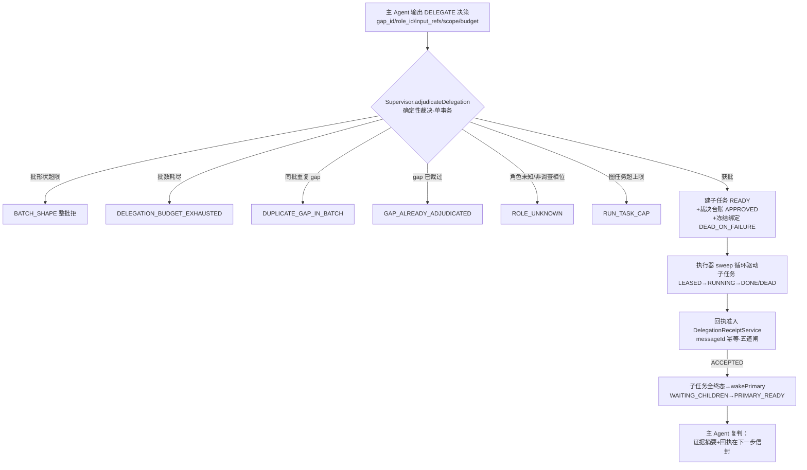
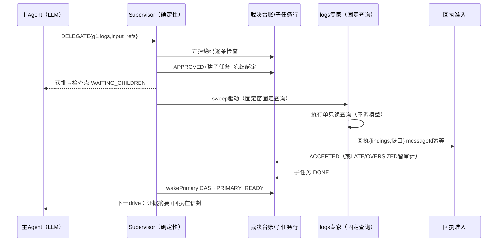

# 07-Multi-Agent任务委派

> 本系列第八篇。讲清楚这个"多智能体系统"的真相：**谁是真 Agent、谁是确定性组件、委派的实质是什么、子任务结果怎么安全地回到主 Agent。**
> 标注约定同前：【代码事实】/【合理推断】/【设计扩展】/【未确认】。

# 本层要解决的问题

一句话：**主 Agent 可以把"一次专项取证"变成一个子任务——但建不建由确定性 Supervisor 裁决、子任务由不调模型的固定查询专家执行、结果经幂等回执准入后回喂——委派被限制在"两批、单层、同缺口只裁一次"的盒子里。**

# 先看一个交易告警

> createOrder 调查第 3 步，主 Agent 看到失败集中在支付链路，它输出：
> `{"delegate":{"requests":[{"gap_id":"g1","role_id":"logs","question":"支付网关超时的具体报错是什么？","input_refs":[...],"scope":{},"requested_budget":4}]}}`
>
> 这句话进 Supervisor 裁决后有个惊人的细节：**question 不进执行面**——`DelegationDecision.java:22-24` 注释原文："仅台账审计（模型自述的信息缺口追问）；子任务执行面不消费——专家按绑定 profile 的固定查询+冻结窗+input_refs 执行"。
> 也就是说：主 Agent 委派的不是"帮我查这个问题"，而是"**给我一个 logs 角色的固定查询槽位**"。logs 专家会按铸造时冻结的时间窗（`[铸造时刻-600s, 铸造时刻]`）和绑定输入引用做一次固定 Loki 聚合查询——它不读 question，不推理，不回头提问。查完产证据行、带回执（findings/缺口清单），主 Agent 醒来看证据自己下结论。

# 如果没有这一层会怎样

1. **自由委派 = 失控的分形**。如果子 Agent 也能委派、也能自由推理，一次调查可以裂变成任意深度的任务树——上下文分裂、预算失控、谁也不对最终结论负责。本层用三个数钉死：委派批上限 2、单批请求上限 2、**子任务角色必须是 INVESTIGATE 相位的固定执行者**——"主 Agent 不是可委派专家（PRIMARY 只出决策，不接子任务）"（DeterministicSupervisor.java:341-342），委派树深度**结构上恒为 1**。
2. **同一个缺口被反复委派**。模型觉得"日志专家没查到我想要的"就再委派一次——台账 `uq(run, gap_id)` 唯一约束让"信息缺口只裁一次"（DelegationDecision.java:10-11），第二次同 gap 提交直接 GAP_ALREADY_ADJUDICATED 拒绝。
3. **子任务结果被伪造/迟到/超限**。回执如果谁都能报、报什么都收，模型的上下文就被污染了。本层回执准入的身份原则是"**可信身份由 Host 赋予，生产方不自报**"（DelegationReceiptService.java:36-37）——回执的身份从既成裁决台账解析，不是回执自己说的。

---

# 代码是怎么做的

## 0. 先给我一句话

委派 = 主 Agent 提出缺口的"点单"、Supervisor 照单验收（封闭拒绝码）、固定查询专家按冻结窗做一次只读查询、回执过五道准入闸回喂——主 Agent 负责所有推理，子 Agent 只负责"跑腿查数"。

## 1. 业务上为什么需要这一层

见"先看一个交易告警"。核心收益只有一个：**主任务的上下文与执行流不被大体积原始数据拖垮**——日志聚合、指标矩阵这类"原材料"由子任务产出为证据行落账，主 Agent 只在信封里有界摘要。代价（第十四部分要求如实说）：上下文分裂（子任务结果压缩后回喂，细节丢失）、等待延迟（WAITING_CHILDREN 主循环暂停）、机制复杂度（裁决+回执+复判三套）。

## 2. 它在整个系统的位置



## 3. 输入和输出

- **收到**（裁决面）：主 Agent 的 `PrimaryDecision.DELEGATE`——请求批，每项 `{gap_id, role_id, question, input_refs, scope, requested_budget}`（六个字段封闭，PrimaryDecision.java:220-221）。
- **处理**：锁序 task→run→checkpoint 的单事务裁决（:288-403）。
- **产出**：`Adjudication{decisions 台账行, batchAccepted}`——APPROVED 行必回填 child_task_id，REJECTED 行必带封闭原因码；获批侧同事务完成子任务建行+绑定+检查点 DELEGATION_COMMITTED。
- **子任务产出**：证据行（进 run 证据池）+ 结构化回执四清单（findings/support_refs/counter_refs/missing_information，RoleRunner.ChildResult）。

## 4. 真实代码入口

| 入口 | 文件：类：方法 | 要点 |
|---|---|---|
| 裁决 | `alert/application/DeterministicSupervisor.java`：`adjudicateDelegation`（:280-412） | 五+1 封闭拒绝码逐请求落台账；获批原子生长子任务 |
| 唤醒 | 同类：`wakePrimary`（:419-442） | 幂等 CAS；只复判当前轮；"子任务死亡也是终态……不复活不重试" |
| 回执准入 | `agent/DelegationReceiptService.java`（:48-57） | messageId 幂等/LATE/OVERSIZED 64KB/REJECTED_SHAPE/身份解析五道闸 |
| 子任务执行 | `agent/SingleToolRoleRunner.java`：`drive`（:46-80） | 按绑定 roleId 查适配器；无适配=CAPABILITY_UNAVAILABLE 不顶替 |
| 驱动循环 | `infrastructure/nativeexec/NativeInvestigationExecutor.java`：`investigate` sweep（:379-398） | 不动点扫描：委派批中途生长子任务，每轮重读清单，一轮零迁移=收敛，sweep≤8 |
| 专家实体 | `agent/MetricsAgent/LogsAgent/ChangeAgent` | 继承 `SingleToolEvidenceAgent`：一种 R0 查询，**不调模型** |

## 5. 核心对象

| 对象 | 是什么 | 关键纪律 | 代码锚 |
|---|---|---|---|
| `DelegationDecision` | 裁决台账行（V47） | **同 (run, gap_id) 全 run 唯一="信息缺口只裁一次"**；行只增不改（child 回填除外）；question>512 字符截断留标注（审计字段不值得打断整批） | DelegationDecision.java:8-11,49-53 |
| 子任务 RcaTask | taskKey=`DELEGATE-{gapId}`，priority 5，**deadlineAt=Instant.MAX**（链上等待期不计 SLA），roundId=新轮 | 建行与检查点推进同事务（围栏拒绝=含子任务建行整体回滚） | Supervisor:361-364 |
| `TaskExecutionBinding`（子） | 冻结绑定 roleId/roleVersion/roleDigest + **FailurePolicy.DEAD_ON_FAILURE** | 恢复面"不猜角色"——恢复只读绑定 | Supervisor:371-376 |
| 回执（ChildResult 四清单） | findings/support_refs/counter_refs/missing_information | messageId=(childTaskId,attempt) 确定性铸造——"恢复重驱=重投，恰一次合并；重试新尝试新键" | DelegationReceiptService:43-46 |
| `DeterministicSupervisor` | 确定性推进器：编译/推进/裁决/唤醒 | "模型无调度权（INV-AM4-2）……全部确定性代码" | Supervisor:36-40 |

## 6. 一条真实调用链（g1 缺口委派 logs 专家全程）

```
主 Agent drive → DELEGATE 分支（driveDelegate，05 篇 :403-434）
→ supervisor.adjudicateDelegation（:280）
   单事务（CL-01 锁序 task→run→checkpoint）：
   ├─ 锁主任务行（FOR UPDATE，执行资格）
   ├─ run 活跃？否 → CommitRejectedException(RUN_TERMINAL) 整体回滚
   ├─ 检查点相位必须 PRIMARY_READY（WAITING_CHILDREN 须先 wake，:306-309）
   ├─ requests>2 → 整批 BATCH_SHAPE 拒（:311-315）
   ├─ batchesUsed>=2 → 整批 DELEGATION_BUDGET_EXHAUSTED（:316-321）
   └─ 逐请求：同批重复 gap / 台账已有同 gap / 角色不在注册表或非 INVESTIGATE 相位 /
      图任务数超 PlanCompiler.MAX_TASKS → 各自封闭码拒绝落台账
   获批请求（以 g1/logs 为例）：
      建 RcaTask(DELEGATE-g1, READY, roundId+1, deadline=MAX)
      → DelegationDecision(APPROVED, childTaskId 回填)
      → TaskExecutionBinding(logs@1, roleDigest, DEAD_ON_FAILURE)
      → 检查点 DELEGATION_COMMITTED：phase=WAITING_CHILDREN,
        batchesUsed+1, roundId+1, decisionSeq+requests.size
← batchAccepted=true → 主 Runner 返回 WAITING_CHILDREN（主任务让位）
→ 执行器 sweep 循环（investigate，:379-398）：重读任务清单→子任务 READY
   → RunnerDirectory 按 binding.roleId+runtime_kind 解析 → SingleToolRoleRunner
   → LogsAgent.investigate（固定 Loki 聚合，冻结时间窗，**不读 question、不调模型**）
   → 证据行落账 + 回执生产（messageId=(childTaskId,attempt)）
   → DelegationReceiptService 五道闸 → ACCEPTED 落回执行账
   → 子任务 DONE
→ 全部子任务终态 → 下一次 sweep 驱动主任务时 drive 内 wakePrimary 复判（:419-442）
   只看当前轮子任务、全终态 → CAS 回 PRIMARY_READY（WOKEN）
→ 主 Agent 下一 drive：信封带上新证据摘要+回执清单 → 模型继续决策
```

## 7. 状态机

委派涉及三层小状态【代码事实】：

**裁决台账行**：APPROVED / REJECTED（+封闭原因码）——只增不改。
**子任务**：READY→LEASED→RUNNING→DONE / DEAD（DEAD_ON_FAILURE）。**子任务死亡是终态，不复活不重试**——"有界恢复归主 Agent 决策面"（wakePrimary javadoc :416-418）：主 Agent 在下一步看见失败回执的缺口清单，自己决定改道直查、换角色再委派（新 gap）还是带着缺口收敛。
**主检查点相位**：PRIMARY_READY ⇄ WAITING_CHILDREN（05 篇已画）。



## 8. 正常业务流程（业务步骤 + 代码 + 状态）

| # | 业务动作 | 代码 | 状态变化 |
|---|---|---|---|
| 1 | 主 Agent 发现日志缺口 | DELEGATE 决策输出 | decisionSeq+1（待裁决） |
| 2 | 照单验收 | adjudicateDelegation | 台账 APPROVED；子任务 READY；检查点→WAITING_CHILDREN |
| 3 | 专家跑腿查数 | SingleToolRoleRunner→LogsAgent | 子任务 LEASED→RUNNING；工具账本 PENDING→SUCCESS |
| 4 | 交作业 | DelegationReceiptService | 回执 ACCEPTED（幂等键落账） |
| 5 | 任务完结 | 子任务收尾 | 子任务 DONE |
| 6 | 复判唤醒 | wakePrimary | 检查点→PRIMARY_READY |
| 7 | 主 Agent 看证据下结论 | 下一轮 drive | steps 继续累计或 FINAL |

## 9. 异常流程（第十一部分必答对照）

| 问题 | 答案（代码事实） |
|---|---|
| 子 Agent 失败怎么办？ | DEAD_ON_FAILURE→子任务 DEAD 终态，不复活不重试；wake 复判照常放行主 Agent（死亡也是终态）；失败缺口随回执/账面可见，**下一步怎么办由主 Agent 决策**——改直查、换角色（新 gap）或带缺口收敛 |
| 子 Agent 回复错了怎么办？ | 回执准入五道闸：同 messageId 重复→幂等短路；run 已终态→LATE 审计行不合入；身份对不上台账（生产方不自报）→拒；载荷超 64KB→OVERSIZED 落审计不落库；FAILED 无缺口清单/四清单全空→REJECTED_SHAPE——"任务失败也必须返回结构化缺口"（DelegationReceiptService.java:40-42） |
| 主 Agent 会重新委派吗？ | 同一 gap 不行（uq(run,gap) 只裁一次+拒绝码回喂"勿换汤不换药重提"）；新缺口可以——但总批次上限 2 |
| 怎么限制反复委派？ | batchesUsed 对照 maxDelegationBatches=2；单批≤2 请求；RUN_TASK_CAP 全图任务数上限（PlanCompiler.MAX_TASKS）；全拒反馈回喂 |
| 怎么防止子 Agent 无限创建子 Agent？ | 结构性：子角色 runtime_kind=DETERMINISTIC_SINGLE_TOOL 无决策能力，唯一能出 DELEGATE 的是主任务；裁决时非 INVESTIGATE 相位角色直接 ROLE_UNKNOWN——"PRIMARY 只出决策，不接子任务"（:341-342）。**委派树深度恒为 1，不是限制出来的，是类型系统保证的** |
| 模型问的问题（question）谁看？ | 只有审计台账——question>512 截断留痕，执行面不消费（"审计文案不值得打断整委派批"，MC21 裁定截断非拒绝） |
| 委派会带来什么成本？ | ①上下文分裂：专家产证据行，主 Agent 只见有界摘要+四清单回执；②时延：WAITING_CHILDREN 期间主循环暂停；③三套机制的复杂度（裁决/回执/复判）；④批次预算消耗 |
| 什么时候直查、什么时候委派？ | 协议文案（05 篇 :64-66）："仅确需专业能力且 delegation_batches_remaining>0"；实质判据是**主任务工具白名单装不装得下这次查询**——委派的角色各带专属单工具（子 Agent 的 allowlist 与主任务不同集），委派=借专家的工具通道，不是借推理 |
| 子任务并行吗？ | 逻辑上：同批获批子任务互不依赖，DAG 设计支持并行，wake 只等"全终态"；物理上：当前驱动器在同一 worker 虚拟线程的 sweep 循环里**逐个驱动**（NativeInvestigationExecutor.investigate :386-398）——【代码事实】"并行调查"是 DAG 的逻辑表达，物理执行是串行 sweep。面试按这个说，别说成多线程并行 |
| 撞台账竞态？ | DuplicateKeyException 捕获→"以先到者为准，本副本只上报告不落行"（:477-481） |

## 10. 并发问题

1. **裁决与主任务收尾并发？** 锁序 CL-01：裁决事务先锁 task 再锁 run（注释 :289-292 专门写了为什么——"委派事务不得先持 run 再等 task（与 finishTask/expireRun 构成 AB-BA 环）"）。
2. **两个 sweep 同时驱动同一子任务？** 子任务状态迁移过状态机+CAS（每轮 sweep 驱动前读态）；且 driver task 独占 run 执行权（"DAG 任务不经 claimNext 领取，通用领取面被 task_key 过滤挡住"，NativeInvestigationExecutor.java:75-76 注释）——单 driver 设计下不存在双驱动。
3. **wake 与子任务收尾竞态？** wakePrimary 是幂等 CAS（WAITING_CHILDREN→PRIMARY_READY 条件迁移），任意次重入安全；子任务没全终态就 STILL_WAITING 下拍再来。
4. **回执重投（恢复重驱）会不会合并两次？** messageId=(childTaskId,attempt) 幂等键——"同结果重投同键，恰一次合并"（:45-46）。

## 11. 崩溃恢复（kill -9 逐点演练）

- **裁决事务中途被杀**：单事务原子——子任务行/台账/检查点推进要么全有要么全无（"围栏拒绝=整体回滚（含子任务建行）"，:290-291）。
- **子任务已建、尚未驱动被杀**：sweep 每轮重读清单，worker 重领 driver task 后 EX-A3 四阶段分诊恢复驱动（已提交跳过/幂等收尾/UNKNOWN 重驱/降级 DEAD，05 篇已引）。
- **子任务执行中被杀**：子任务租约过期→RETRY_WAIT/STALE（通用回收面）；回执因 messageId 确定性铸造，恢复重驱重投同键=恰一次合并。
- **主任务 WAITING_CHILDREN 时 driver 被杀**：检查点在 PG，重驱 drive 第②步 wakePrimary 复判——子任务已结清则直接唤醒继续，一个模型调用都不浪费。
- **回执已 ACCEPTED 但主 Agent 还没消费被杀**：回执行只增不改在账，主 Agent 恢复后装配面照常读到（消费指针在检查点）。

## 12. 安全

1. **身份不可自报**：回执的 primaryTaskId/gapId/roleId 从 parentRequestId（裁决行 id）解析——"可信身份由 Host 赋予，生产方不自报"（:36-37）。模型/子任务说什么不算，台账说了算。
2. **指令不可注入执行面**：question 只进审计——模型在 question 里写的任何"指令"物理上进不了专家的查询构造。这是对提示词注入的结构性免疫：**委派协议里根本没有自由文本输入通道**。
3. **角色白名单**：roleId 必须在 AgentRegistry 且 phase=INVESTIGATE；绑定按 roleDigest 精确解析（"同名同版本 digest 漂移=冒名顶替拒绝"）。
4. **为什么不能只在 Prompt 里告诉模型"委派要节制"？** 批上限/去重/角色校验全是裁决代码；模型的 DELEGATE 输出在变成子任务之前要过五道封闭码检查——Prompt 是期望，裁决是法律。

## 13. Agent Harness（多智能体真相表——第十一部分要求"必须准确写成这样"）

| 组件 | 调 LLM？ | 有自己的 Agent Loop？ | 职责 |
|---|---|---|---|
| 主 Agent（BoundedLlmRoleRunner） | **是**（每步一次） | **有**（有界单步循环，状态在检查点） | 推理：选工具/提委派/出结论 |
| Supervisor（DeterministicSupervisor） | **否** | 无（确定性推进器） | 编译落图、委派裁决、图收敛推进、唤醒复判 |
| Metrics/Logs/Change Agent | **否** | 无（单遍单工具） | 固定证据查询（单一 R0 工具，冻结窗） |
| NativeRcaAgent（报告相位） | **否** | 无（黑板裁决） | 消费冻结快照产 Claim |

按第十一部分模板的准确表述：**主 Agent 负责推理和决定下一步；Supervisor 负责检查委派、管理子任务、等待和回收结果；Metrics/Logs/Change 执行固定证据查询。** 这不是"多个专家 Agent 自主协作"——是**一个会推理的 Agent + 一群不推理的执行器 + 一个不推理的裁判**。

## 14. 可观测性

- 裁决事件：`r7_delegation_adjudicated`（requests/approved/batch_accepted，:404-410）；
- 台账行：每次委派的 gap/角色/版本/question（截断版）/拒绝码/childTaskId——"为什么这个缺口被拒过"一查便知；
- 回执审计行：LATE/OVERSIZED/REJECTED_SHAPE 全部落行留审计（"全部非 ACCEPTED 裁决都落行留审计；行只增不改"，:43-44）；
- 主 Agent 视角的信封里有 delegation 回执与余量（batchesRemaining）——模型自己也能"看见"委派史。

## 15. 性能和成本

- **委派的经济账**：一次委派批=子任务 N 次工具调用（零模型）+主任务暂停等待。对比主任务直查：直查省等待但占主任务白名单与上下文；委派换上下文干净但加一轮唤醒往返。
- **等待时长**：子任务是单工具查询（秒级）+回执准入（毫秒级）——WAITING 通常远短于主任务一次模型调用。
- **sweep 收敛上限 8 轮**（MAX_DRIVE_SWEEPS）：2 批×2 请求的委派规模下裕度充足；超出=诚实终态失败不自旋（:96-99）。
- **QPS×10**【合理推断】：委派面无独立瓶颈（共享 driver 执行）；先坏的仍是模型网关。

## 16. 设计取舍

**① 为什么委派的 question 不进执行面？（本篇最大的反直觉点）**
因为自由文本指令=不可审计的执行面。专家是确定性组件，输入只有冻结窗+input_refs+绑定 profile——这让子任务行为完全可预测、可回放、可对账，也彻底堵死"通过 question 注入专家行为"的路。代价：模型无法让专家"帮我查 X 的 Y 方面"，只能围绕固定查询形状提缺口。这是用表达力换确定性，与全系统 taste 一致。

**② 为什么子任务失败不自动重试？**
wakePrimary javadoc 原话："子任务死亡也是终态……不复活不重试——有界恢复归主 Agent 决策面"。自动重试=系统替模型做决策，可能与模型已调整的方向冲突（它可能已经改直查了）；把失败作为事实喂给唯一有全局视野的主 Agent，重试与否变成它的下一步决策。**恢复的边界停在决策面门口。**

**③ 为什么委派上限是 2 批而不是动态的？**
动态额度需要模型理解"还剩多少"并理性规划——实测中模型倾向于把额度烧完。固定小额度+剩余量随信封下发（delegation_batches_remaining）+耗尽拒绝码回喂，行为可预测。0 批也是合法姿态（臂A 零委派）——灰度时可整体关闭委派。

**④ 当前方案最大的边界？**
- 委派深度恒 1：专家不能委派专家（结构性），复杂分解只能靠主 Agent 多轮；
- 物理串行 sweep：多子任务不能真并行执行（逻辑 DAG 并行、物理单线程驱动）；
- 专家能力=单个只读工具：跨源关联必须回到主 Agent——它才是唯一有全局视野的点（这也是单点故障：主 Agent 上下文质量决定一切）。

## 17. 面试背诵卡

【30 秒主答】
"这个多智能体系统的真相是：一个会推理的主 Agent，加一群不推理的执行器，加一个不推理的裁判。主 Agent 每步可以提议委派——但注意它委派的是固定查询槽位不是自由指令：question 只进审计台账，专家按铸造时冻结的时间窗和绑定引用做一次只读查询，连模型都不调。建不建子任务由确定性 Supervisor 裁决，拒绝码封闭：批超两个整批拒、批次耗尽拒、同 gap 全局只裁一次、角色必须是调查相位的固定执行者——主 Agent 自己不能接子任务，所以委派树深度结构上恒为一。子任务结果走回执准入：messageId 幂等、身份从台账解析、生产方不能自报身份。子任务失败不自动重试，死亡也是终态，怎么办由主 Agent 看着缺口清单自己决定。"

## 18. 这一层哪些话不能说

1. ❌ "多个专家 Agent 自主协作/讨论" → ✅ 星型单层委派：主 Agent 唯一决策点，专家是确定性查询器。
2. ❌ "子 Agent 能理解我委派的问题并灵活调查" → ✅ question 不进执行面，专家按冻结窗固定查询。
3. ❌ "子任务失败会自动重试" → ✅ DEAD_ON_FAILURE，恢复决策归主 Agent。
4. ❌ "子任务多线程并行执行" → ✅ 物理 sweep 串行驱动，逻辑 DAG 并行（说清两层）。
5. ❌ "委派深度可以配置" → ✅ 深度恒 1 是类型结构（PRIMARY 不可被委派），不是参数。
6. Metrics/Logs/Change 各自的准确角色名与版本【未确认具体值】——机制确定，注册值以装配为准。

---

# 我现在应该能回答什么

1. 这个系统里谁调模型、谁不调？（→ 第 13 节四组件表）
2. 委派的实质是什么？question 去哪了？（→ 固定查询槽位；审计台账）
3. 五个拒绝码分别防什么？（→ 批形状/预算/批内重复/跨批重复/角色合法+图上限）
4. 子任务失败后系统的完整行为链？（→ DEAD 终态→wake 放行→主 Agent 决策）
5. 怎么从结构上保证没有委派树？（→ PRIMARY 不接子任务+专家无决策能力）

# 30 秒背诵卡

见第 17 节。

# 面试官追问卡

**Q1：你说子 Agent 不调模型，那"Metrics Agent"这个名字里的 Agent 是不是名不副实？**
考什么：诚实面对命名与实质。
30 秒答："按今天的 Agent 定义（自主循环决策），它确实只是个'查询函数'。但这个命名反映的是角色抽象：它有自己的 profile（身份四件套）、自己的工具白名单、自己的证据纪律和生命周期——是'最小 Agent'。我面试时会主动说破：这个系统真正的 Agent 循环只有一个，在主任务；所谓多智能体是'单智能体+确定性专家池'。把这点说清楚比维护'多 Agent'的名头更加分。"
继续追问 1："为什么不干脆让子 Agent 也带循环？"——答："子任务的需求是'一次固定查询'，循环是纯开销：多一次模型调用多一份成本和不确定性，而查询本身不需要判断。专家越蠢越可靠。"

**Q2：question 不进执行面，那模型委派时怎么表达"我要什么"？**
考什么：委派协议的表达力边界。
30 秒答："三个结构化字段承担表达：role_id 选专家（查什么类型的数据）、input_refs 圈定依据（基于哪些已有证据提出这个缺口）、scope/requested_budget 表达范围与预算。模型能表达'基于这三条证据，我需要 logs 角色的一次窗口查询'，但不能表达'顺便看看内存指标'——scope 越界的部分专家不会执行。表达力的缺口由协议设计者承担：想要什么查询形状，就注册什么角色。"
继续追问 1："这会不会太死板？"——答："会，这是真实的表达力代价。但主 Agent 有自己的 16 个工具直查通道兜底——委派只是'借专家的白名单'，不是唯一取证路径。"

**Q3：同 gap 全局只裁一次，会不会误伤合理场景？比如第一次查的窗口不对，想换个窗口重查？**
考什么：去重纪律的边界。
30 秒答："确实误伤——这正是刻意的。模型第一次委派 g1 查日志没查到想要的，它重提 g1 的动机大概率是'换个说法再试一次'，而专家的查询形状是固定的，换个说法结果不会变；真要新窗口，主 Agent 自己的直查工具可以换窗口（直查不受 gap 去重约束）。所以去重防的是模型用委派绕熔断，误伤面由直查通道兜住。拒绝码回喂也明说了：'GAP_ALREADY_ADJUDICATED=该 gap 已有台账行，勿换汤不换药重提同一 gap'。"
继续追问 1："那 gap_id 的语义由谁定？"——答："模型自造（g1、g2…），系统只认'同 run 内同 id 同缺口'。模型乱用 id 会自伤（提前撞去重），但伤不了系统——这也是把命名权交给概率组件的安全做法：它只能弄丢自己的表达力，弄不坏裁决。"

**Q4：wake 复判时怎么知道该等哪些子任务？如果这批里有失败的呢？**
考什么：批次边界的精确性。
30 秒答："两个精确化：一是只复判当前轮——裁决行记请求轮、子任务落新轮，wake 按 checkpoint.roundId 过滤（:432-434），上一轮的旧任务不会挡这一轮；二是终态集合含 DEAD——'子任务死亡也是终态'，所以失败的子任务不阻塞唤醒，失败事实经回执缺口清单+任务账面在主 Agent 下一步可见。等待语义是'这一轮每个获批请求都有了着落'，不是'每个请求都成功'。"
继续追问 1："主 Agent 醒来怎么知道哪个失败了？"——答："失败回执的四清单里有 missing_information（结构契约强制：失败也必须返回结构化缺口，否则回执本身被拒 REJECTED_SHAPE）——加上证据面没有对应产出，模型能区分'查了没数据'和'没查成'。"

**Q5：裁决事务里锁了主任务行，这期间主任务的 finishTask 会不会死锁？**
考什么：锁序设计的自觉。
30 秒答："这正是注释里点名处理的问题（:289-292）：裁决按 task→run→checkpoint 加锁，与 finishTask/expireRun 的 task→run 全链锁序一致——'委派事务不得先持 run 再等 task（构成 AB-BA 环）'。检查点推进不走自己的锁而是走提交围栏的 revision CAS，把'锁'和'条件写'分开。死锁的三要素（互斥、持有等待、环路）在锁序统一时被消掉环路那一环。"
继续追问 1："围栏拒绝时子任务建行也回滚？"——答："是，注释原文'围栏拒绝=整体回滚（含子任务建行）'——不会出现'子任务建好了主任务却没了'的孤儿。"

**Q6：如果让你重新设计委派协议，会改什么？**【设计扩展——设计题答案，不要说成现网实现】
考什么：REDO。
30 秒答："三处：一是给专家加'有界追问'通道——现在子任务查完了就是完了，主 Agent 若需要二次查询得再花一个批次；可以在回执协议里允许专家声明'本角色还支持的可选查询变体'，主 Agent 下批点名变体，仍不引入自由指令；二是把批上限从常数 2 改成'随 run 预算档位'的阶梯值，让长调查有更多委派空间但仍然有界；三是 sweep 驱动改可并行池（子任务物理并行），需要先解决共享预算账本的并发结算。委派单层、question 只进审计、台账只增不改这三个不变量我不会动——它们是这个协议能被信任的原因。"

# 这层不要乱说什么

1. 不要说"专家 Agent 会推理/理解问题"——它不读 question、不调模型。
2. 不要说"委派是动态规划出来的"——批 2×2 是常数上限，0 批合法（零委派姿态）。
3. 不要混淆"逻辑 DAG 并行"与"物理并行执行"——当前物理是单线程 sweep。
4. 不要说"回执内容由子任务自由报告"——五道准入闸+四清单结构契约+限长 64KB。
5. 不要说"防无限委派靠 prompt"——五个封闭拒绝码+类型结构（深度恒 1）。
6. 具体注册的角色名/版本号【未确认】（机制确定，目录值以装配为准）。

# 5 句话总结

1. **为什么需要**：大体积原始取证（日志/指标矩阵）不该进主 Agent 上下文——委派把它们外包成证据行+摘要回执。
2. **核心机制**：主 Agent 提单、Supervisor 五码裁决（批 2×2、gap 唯一、深度恒 1）、确定性专家固定查询、回执五道闸幂等准入。
3. **上下游协作**：上游主循环 DELEGATE 分支；下游 DAG sweep 驱动、wake 复判把结果带回主循环信封。
4. **最大风险**：主 Agent 是唯一全局视野点——它的上下文质量决定一切；委派表达力受固定查询形状限制。
5. **最大取舍**：用"专家不思考"换"委派可完全审计与回放"——自由文本指令在执行面零通道。

---

*本篇完成。下一篇待你指令解锁：《08-Supervisor监督调度》。*
