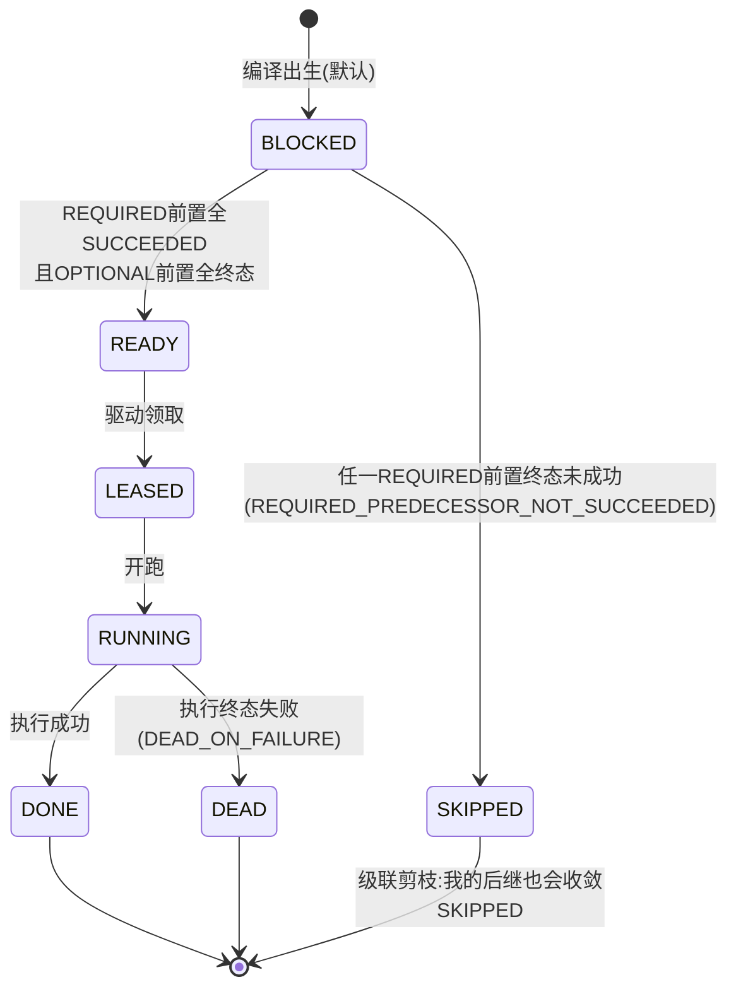

# 08-Supervisor监督调度

> 本系列第九篇。07 篇讲了委派这一个动作，本篇讲 Supervisor 这个角色本身：**它是整个调查的"确定性总指挥"——编译计划、推进任务图、收敛报告链，且从头到尾一行模型调用都没有。**
> 标注约定同前：【代码事实】/【合理推断】/【设计扩展】/【未确认】。

# 本层要解决的问题

一句话：**把"这次调查怎么组织"从模型手里拿走，交给一段可以无限次重入、崩溃后原样续跑的确定性代码——模型可以提议调查计划、提议委派，但任何任务图的诞生、放行、收敛、进入报告，全走固定算法。**

# 先看一个交易告警

> createOrder 调查被 worker 领起后，第一件事不是调模型，而是 Supervisor 上场：
> **编译**：从 run 冻结的路由 bundle 读提案（主模式只编译一个主节点），严格解析+六道语义校验（任务≤8、深度≤3、无环、活跃验证者≤1、角色注册在案、输入引用不越界）→ 单事务落 tasks+edges+bindings；
> **放行**：零前置的主节点 READY；
> **推进**（之后每一轮）：终态回执一到就跑一次图收敛——REQUIRED 前置全成功→后继 READY；REQUIRED 前置死了→后继确定性 SKIPPED（"后继不得永远 BLOCKED"）；委派获批中途长出新子任务，sweep 每轮重读清单；
> **收口**：全任务终态→行锁下恰一次迁入 REPORTING→报告链接管。
> 整个过程像一个不眠的流水线调度员：它不发明流程（链是编译期固定的 PLAN→调查→REDUCE→VERIFY≤1→ASSEMBLE→VALIDATE→PUBLISH），只负责"到点放行、死了剪枝、全齐收口"。

# 如果没有这一层会怎样

1. **模型既当运动员又当裁判**。如果让模型自己决定"下一步建什么任务、什么时候推进"，调查结构随模型心情漂移，同一次告警两次调查走完全不同的组织结构——评测没法比、审计没法审。本层的回答是编译期固定+提案 digest：**相同提案→相同任务图**（PlanCompiler.java:30-31），重放对账有锚。
2. **图死锁：前置死了后继永远等**。没有确定性收敛规则，REQUIRED 前置 DEAD 后后继会永远 BLOCKED，调查挂死。DagPromoter 的裁决规则第一条就是终局收敛："任一 REQUIRED 前置终态未成功→后继不得永远 BLOCKED，确定性地收敛为 SKIPPED"（DagPromoter.java:19-22）——**被剪枝的链也要能收敛**。
3. **崩溃后重复编译出第二张图**。Supervisor 如果不幂等，进程在"编译完、未推进"缝隙被杀，重启后再编译一次就出现两张任务图。本层的启动短路是幂等设计的一半："已有任务图→只续驱不重编译（相同提案相同任务图由编译器 digest 保证，重入不产生重复任务/边）"（Supervisor javadoc :43-45）。

---

# 代码是怎么做的

## 0. 先给我一句话

Supervisor 是调查的确定性总指挥：`startRun/startPrimary` 负责"编译落图并放行根任务"（幂等，崩溃重入走短路），`advance` 负责"终态回执后的图收敛与 REPORTING 迁移"（可任意次重入），`adjudicateDelegation/wakePrimary` 负责委派与回收（07 篇）——它的全部智慧是 if-else，不是大模型。

## 1. 业务上为什么需要这一层

见"先看一个交易告警"。本质矛盾：调查计划可以由模型提议（表达力），但计划的**执行组织**必须确定（可靠性+可评测）。Supervisor 就是"提议"与"执行"之间的编译器：提案→校验→落图→推进→收口，每一步的输出只由输入决定。

## 2. 它在整个系统的位置

```mermaid
flowchart TB
    W[RcaWorker 领取 driver task] --> EX[NativeInvestigationExecutor]
    EX --> S[DeterministicSupervisor 确定性总指挥]
    subgraph S 三组入口（全部幂等可重入）
        S1[startRun / startPrimary<br/>编译落图+放行根任务]
        S2[advance<br/>图收敛+REPORTING 迁移]
        S3[adjudicateDelegation + wakePrimary<br/>委派裁决+复判唤醒]
    end
    S1 --> PC[PlanCompiler 双设防编译<br/>结构严拒+六道语义校验+单事务落库]
    PC --> DAG[(任务图 tasks+edges+bindings)]
    S2 --> P[DagPromoter 纯函数推进器<br/>READY 放行/SKIPPED 剪枝收敛]
    S2 --> REP[REPORTING→报告链<br/>REDUCE/ASSEMBLE/VALIDATE/PUBLISH]
    S3 --> C[子任务+裁决台账<br/>07篇]
    DAG --> SW[执行器 sweep 驱动]
    SW --> S2
```

## 3. 输入和输出

- **startRun 收到**：runId + plannerOutput（Planner 结构化提案，已解析 JSON）+ knownArtifacts（本 run 已知工件集）。**输出**：`StartResult{STARTED|ALREADY_STARTED|PROPOSAL_REJECTED, proposalDigest, rejectReason}`。
- **startPrimary 收到**：runId + primaryProfile（主模式主角色）。**输出**：同上 + 主节点检查点初始化（`insertIfAbsent`——"竞态缺席者胜"，:254-256）。
- **advance 收到**：runId。**输出**：`Advancement{readied 本轮放行集, skippedConverged 收敛剪枝集, reportingEntered 是否本次进入 REPORTING}`。
- **交给谁**：任务图交给执行器 sweep 驱动；REPORTING 交给报告链（NativeRcaAgent/ReportAssembler）；剪枝与放行的每次迁移都过状态机。

## 4. 真实代码入口

- 文件：`alert/application/DeterministicSupervisor.java`（559 行，纯确定性，零模型调用——"模型无调度权（INV-AM4-2）：本类只做编译、推进与链阶段状态迁移，全部确定性代码"，:40）。
- **固定执行链**（javadoc :37-39）：`PLAN（PlanCompiler 双设防编译落库）→ 并行调查（DAG 任务，执行器族负责）→ REDUCE → VERIFY≤1（编译期已约束）→ ASSEMBLE → VALIDATE → PUBLISH`。链的形状是编译期约束的，不是运行期发明的。
- 关键设计点【代码事实】：
  - **幂等双入口**："两个入口，均为幂等重驱动（验收②恢复测试的语义基础）"（:42-43）——启动已有图走 `ALREADY_STARTED` 短路只续驱；advance 可任意次重入。
  - **generation fence**（:52-54）："run 不在活跃集（终态/被新代际取代）→ 零推进零迁移，死 run 的工作不复活。推进与迁移间的窗口无锁——即使竞态放行，claimNext 的活跃 run 栅栏与收尾 STALE 栅栏仍拦住执行面，不产生越权产出。"（**不靠锁堵所有窗口，靠下游栅栏兜底**——分层防御的典型。）
  - **任务 SLA 哲学**（:56-58）：编译出生 deadlineAt=Instant.MAX——"链上 BLOCKED 等待期不计 SLA，过期语义由 run 级策略面在执行器族接线时演进，本类不发明"。
  - **driver task 不入图**：dagTasks 剔除 `NATIVE_INVESTIGATE`——"铸造点预铸的执行权凭证，不参与图收敛/启动判定"（:484-492）。
- 关键参数：`maxDelegationBatches`（构造注入，信封余量与裁决"同源，禁止两处各自读配置漂移"，:128-132）。

## 5. 核心对象

| 对象 | 是什么 | 关键纪律 | 代码锚 |
|---|---|---|---|
| `PlanCompiler` | 提案→DAG 的唯一落库路径（双设防第二设防） | 六道语义校验：任务≤8（MAX_TASKS）、深度≤3、无环（全图写前判定"比逐边复判强"，DB V8+V18 约束兜底）、活跃 verify≤1、角色注册钉 name@version、inputs⊆已知工件集；单事务落 tasks+edges+bindings；proposalDigest 稳定 | PlanCompiler.java:26-42,52-53 |
| `PlanProposal` | 提案结构严格解析（第一设防） | 形状非法即 IllegalArgumentException→run FAILED | PlanCompiler:95 |
| `DagPromoter` | 纯函数推进器（不写库） | READY 规则/SKIPPED 终局收敛规则；输出按字典序可复现；"结果不由输入顺序决定" | DagPromoter.java:13-28 |
| `DagTaskState` | 推进器视角 7 态视图 | fromPersistent 穷举映射**无 default**——"RcaTaskState 新增取值时此处编译期红，强制同步映射"；LEASED/RUNNING/RETRY_WAIT→RUNNING（"在途即执行中"） | DagTaskState.java:12-44 |
| `RunnerDirectory` | runtime_kind→运行器唯一映射 | 未部署类型显式拒绝 CAPABILITY_UNAVAILABLE——"不选'最接近'的运行器顶替" | RunnerDirectory.java:11-14 |
| `StartOutcome/Advancement/WakeOutcome` | 三个封闭结果枚举 | 观测/测试断言面 | Supervisor:88,94-96,448 |

## 6. 一条真实调用链（主模式一次调查的指挥全程）

```
RcaWorker 领取 NATIVE_INVESTIGATE driver task
→ NativeInvestigationExecutor.execute
   budgetGate.openRun（run 开局限额一次落账）
→ supervisor.startPrimary(runId, primaryProfile)（:235-263）
   run 活跃？→ hasDagTasks？有 → ALREADY_STARTED 短路（崩溃重入）
   → compiler.compilePrimary：只编译主节点（PRIMARY_INVESTIGATE, round0），
     "不预建任何调查专家；专家仅经委派裁决按需出现"（PlanCompiler:44-46）
   → checkpoints.insertIfAbsent(initial)（竞态缺席者胜）
   → advance(runId)（放行主节点）
→ 【循环：执行器 sweep 驱动 + Supervisor 推进，交替到不动点】
   drive 主任务（05 篇）：模型逐步决策；DELEGATE 获批 → 新子任务入图
   子任务 READY→驱动→DONE/DEAD；每轮终态回执 → supervisor.advance（:217-228）
      → dag.promoteOnTerminal（DagExecutionService 持久化 DagPromoter 裁决）
      → 全任务终态 && run 活跃 → enterReporting（行锁下恰一次，:498-518）
         QUEUED/RUNNING→REPORTING + markReportingStarted（对账停滞计时起点）
→ 冻结证据快照 → 报告相位（NativeRcaAgent/投影→Assembler→Adapter→验证）
→ ExecutionResult.success → worker finishTask（AM1 收尾链）
提案非法路径：compiler 抛 IllegalArgumentException
   → rejectRun：run FAILED + errorClass=PLAN_REJECTED（"零任务零边已由编译器保证"）
   → StartOutcome.PROPOSAL_REJECTED
```

## 7. 状态机

Supervisor 管理两个层面的状态【代码事实】：

**run 链阶段**：QUEUED/RUNNING →（全任务终态）→ REPORTING →（报告链完成）→ SUCCEEDED/FAILED/PARTIAL（run 级 9 态见 00 篇）。enterReporting 是本类的独创迁移点：行锁串行化、并发重入恰一次生效、进入时刻首记（"对账停滞计时起点，重启不重置"，:508-509）。

**任务推进视图**（DagTaskState 7 态）与放行/剪枝规则：



- **谁修改**：DagExecutionService（DagPromoter 纯函数裁决的持久化执行者）；BLOCKED→READY/SKIPPED 由 advance 驱动；READY→LEASED→RUNNING→DONE/DEAD 由执行器 sweep 驱动，全部过状态机。
- **持久层投影纪律**：11 态→7 态冻结映射穷举无 default——新增持久状态编译期报错强制补映射（"不区分收尾原因"的三态归并是推进器视角的有意抽象）。
- **存在哪**：rca_task 表；跨进程跨重启。

## 8. 正常业务流程（业务步骤 + 代码 + 状态）

| # | 业务动作 | 代码 | 状态变化 |
|---|---|---|---|
| 1 | 开局编译 | startPrimary→compilePrimary | 主节点 BLOCKED→落图；检查点初始化 |
| 2 | 放行 | advance | 主节点 BLOCKED→READY |
| 3 | 主任务调查 | sweep→drive（05 篇） | 模型步进；委派获批时长出子任务 BLOCKED |
| 4 | 委派裁决 | adjudicateDelegation（07 篇） | 子任务 READY；roundId+1 |
| 5 | 逐轮收敛 | advance→DagPromoter | 终态回执→后继 READY / REQUIRED 死→SKIPPED |
| 6 | 全部了断 | allTerminal 判定 | enterReporting：run→REPORTING |
| 7 | 报告链 | NativeRcaAgent→Assembler→验证 | 报告落档→worker finishTask→run 终态 |

## 9. 异常流程

| 异常 | 处理了吗 | 怎么处理 |
|---|---|---|
| 提案非法（结构/超限/带环/角色未注册/引用越界） | ✅ fail-closed | 编译抛 IllegalArgumentException→rejectRun：run FAILED（PLAN_REJECTED），零落图 |
| 编译后、放行前崩溃 | ✅ | 启动短路：hasDagTasks→ALREADY_STARTED 只续驱；"编译单事务，崩溃缝隙要么全有要么全无"（javadoc :44） |
| 主节点检查点初始化竞态 | ✅ | insertIfAbsent（"竞态缺席者胜"），不用无条件 upsert（:254-256） |
| REQUIRED 前置死了 | ✅ | 后继确定性收敛 SKIPPED + 级联（"被剪枝的链也能收敛"）；SKIPPED 原因恒为 SKIP_REASON |
| run 被取消/换代后 advance 重入 | ✅ | generation fence：不活跃→零推进零迁移；窗口期竞态放行由 claimNext/收尾 STALE 栅栏兜底 |
| 并发 advance 重入 | ✅ | enterReporting 行锁串行化"恰一次生效"；推进判定本身是纯函数可重入 |
| 委派裁决时 run 已终态 | ✅ | CommitRejectedException(RUN_TERMINAL) 整体回滚（07 篇） |
| 声明的 runtime_kind 未部署 | ✅ | CAPABILITY_UNAVAILABLE 显式拒绝——"不选最接近的运行器顶替" |
| driver task 混进图收敛 | ✅ | dagTasks 剔除 NATIVE_INVESTIGATE（执行权凭证不是图节点） |
| 链上等待超时 | ➖ 不在本类 | BLOCKED 期 deadlineAt=MAX 不计 SLA；run 级硬期限归 RunReconciler（14 篇）——"本类不发明" |
| 执行器缺位 | ➖ 不在本类 | RcaWorker 层 fail-closed：EXECUTOR_MISSING 终态失败（RcaWorker.java:429-437） |

## 10. 并发问题

1. **两次 startRun/startPrimary 并发？** 编译幂等键 (run, round, taskKey)——同轮重复提交撞唯一键显式失败（PlanCompiler.java:41-42）；先到者落图，后到者走 ALREADY_STARTED 短路。
2. **advance 与 finishTask 并发？** enterReporting 行锁串行化；run 状态迁移过状态机（非法边抛异常）；"推进与迁移间的窗口无锁"由下游双栅栏兜底（第 4 节引文）。
3. **advance 与委派建子任务并发？** 委派在单事务内建子任务并推进检查点（围栏）；advance 读 dagTasks 时委派批"中途生长"由 sweep 每轮重读清单吸收（"一轮无任何任务状态迁移即收敛……委派批生长子任务行即进展"，NativeInvestigationExecutor:379-385）。
4. **DagPromoter 输出会不会因遍历顺序不同而不同？** 不会：输出集合按字典序（TreeSet），"结果不由输入顺序决定"——**纯函数+确定性输出是重放对账的基础**。

## 11. 崩溃恢复（kill -9 逐点演练）

- **编译事务中途被杀**：单事务，tasks+edges+bindings 全有或全无（"编译单事务，崩溃缝隙要么全有要么全无"）。
- **编译提交后、advance 前被杀**：重驱动 startPrimary→hasDagTasks→ALREADY_STARTED→advance 续驱。**启动幂等短路就是为这个缝隙设计的**。
- **insertIfAbsent 竞态**：两个副本同时初始化检查点，一个成功一个"缺席者胜"逻辑——重复初始化不会覆盖已有 revision。
- **REPORTING 迁移后、报告完成前 driver 被杀**：RunReconciler 的 REPORT_FINALIZE 恢复面接管（"REPORTING 无可恢复 driver + 材料完整→铸唯一 REPORT_FINALIZE 恢复 task"，14 篇决策表）。
- **dead 前置导致的部分图收敛被杀**：advance 幂等可任意次重入，重入重算 DagPromoter 纯函数——**状态在库里，算法无状态，重入即恢复**。

## 12. 安全

1. **调度权硬隔离**：INV-AM4-2"模型无调度权"——模型能做的最多是提案（还被六道校验审）和委派（被五码裁决审）；图的诞生/放行/剪枝/收口没有模型参与路径。
2. **输入引用域校验**：task inputs ⊆ 本 run 已知 artifact 集（PlanCompiler 六道校验之一）——提案不能引用别的 run 的工件（跨域引用在编译期死掉）。
3. **角色冒名防护**：注册表按 name@version 全钉 + 绑定 roleDigest（同名同版本 digest 漂移=冒名顶替拒绝，05 篇）。
4. **为什么不能只在 Prompt 里告诉模型"合理规划任务"？** 因为"合理"不可审计。编译器的六道校验每一条都是可判定的（数量/深度/无环/注册/引用域），判定失败有封闭错误类（PLAN_REJECTED）——**约束只有写成谓词才能成为闸门**。

## 13. Agent Harness

| 事项 | 模型 | Harness（本类） |
|---|---|---|
| 提议调查计划（旧兼容路由） | ✅ Planner 输出提案 | PlanProposal 严拒+六道校验+digest 冻结 |
| 提议委派 | ✅ DELEGATE 决策 | 五码裁决+批预算（07 篇） |
| 决定任务放行顺序 | ❌ | DagPromoter 纯函数（REQUIRED/OPTIONAL 规则） |
| 决定剪枝 | ❌ | SKIPPED 终局收敛规则 |
| 决定何时进报告 | ❌ | allTerminal 判定+行锁恰一次迁移 |
| 主模式组织结构 | ❌ | 编译期固定：主节点起步、专家按需生长 |

一句话：**模型是"提案人"，Supervisor 是"立法+执法"——提案可以来模型，法律必须是代码。**

## 14. 可观测性

- 结构化事件：`r7_primary_started`（run/task/role@version，:258-261）、`am4_run_reporting`（进入报告链，:513-515）、`am4_plan_rejected`（拒绝原因，:531-533）、`r7_delegation_adjudicated`（07 篇）；
- `Advancement` 的 readied/skippedConved 集合是每轮推进的观测断言面；
- proposalDigest 稳定可对账——"相同提案相同任务图"让评测可以做结构 diff；
- markReportingStarted 首记时间给 RunReconciler 的停滞判定提供计时起点。

## 15. 性能和成本

- **零模型成本**：本类全部是 DB 事务+纯函数——这是"调度不花钱"的设计声明。
- **advance 频率**：每个任务终态触发一次（sweep 内），每次是"读全图状态→纯函数→条件迁移"的小事务；图≤8 任务，代价毫秒级。
- **DagPromoter 复杂度**：O(任务×边)，8×上限内可忽略。
- **QPS×10 先坏哪**【合理推断】：不在本类（调度是轻计算）；调查并发瓶颈依旧在模型网关与执行槽位。

## 16. 设计取舍

**① 为什么固定链（PLAN→调查→REDUCE→VERIFY≤1→ASSEMBLE→VALIDATE→PUBLISH）而不是自由任务图？**
链是"编译期约束"——活跃 VERIFY≤1 这类质量约束只有链形结构才可静态判定；自由图的表达力优势在 RCA 场景用不上（调查就是取证→裁决→组装的固定形状）。自由度的真正出口在主 Agent 的步级决策（查什么）而不是结构级决策（组织成什么）——**结构确定性是可评测性的前提**。

**② 为什么 DagPromoter 做成不写库的纯函数？**
可测试性与可复现性：穷举单测（"IntentView 入参便于穷举单测"同款纪律）、输出字典序稳定、同输入必同输出——恢复重入时重算结果与首次一致。持久化由 DagExecutionService 分层承担。**算法与 IO 分离是确定性架构的地基**。

**③ 为什么旧兼容路由要保留（三角色 DAG），主模式又要另起 startPrimary？**
代码事实：两代共存——旧路由按 run 固定 digest 的 native.proposal 段编译三角色图（EN-03"drive 期按铸造时路由 digest 读，不读 active——指针移动不改在跑 Run 的提案源"）；主模式只编译主节点、专家按需生长。共存代价是双路径，但存量 run 的恢复语义不能断——**演进不破坏恢复**的典型处理。

**④ 当前方案最大的边界？**
- 图规模上限 8 任务/深度 3——对 RCA 够用，对通用编排太小（刻意不通用）；
- 链阶段 VERIFY≤1 是编译期硬约束，不支持多轮交叉验证（多轮验证归主 Agent 步级循环）；
- 双路由共存增加理解成本（面试时要能说清自己在哪一代）。

## 17. 面试背诵卡

【30 秒主答】
"Supervisor 是纯确定性的总指挥，一行模型调用都没有，类名里的 Deterministic 就是架构声明。它三组入口全部幂等可重入：startRun/startPrimary 负责编译落图——提案过结构严拒和六道语义校验，任务不超八个、深度不超三、写前全图判环、活跃验证者至多一个、引用不许越界，然后单事务落任务边和绑定；advance 负责图收敛——REQUIRED 前置全成功后继才 READY，REQUIRED 死了后继确定性剪枝成 SKIPPED，保证被剪的链也能收敛，全任务终态就在行锁下恰一次迁入 REPORTING；第三组是委派裁决和唤醒。它的核心纪律是模型无调度权：模型可以提案可以委派，但任何图的生命周期事件都是固定算法。崩溃恢复靠启动短路加纯函数重算——状态在库、算法无状态、重入即恢复。"

## 18. 这一层哪些话不能说

1. ❌ "Supervisor 是智能调度器/AI 编排器" → ✅ 纯确定性代码，零模型调用。
2. ❌ "支持任意复杂的任务编排" → ✅ ≤8 任务/深度≤3/固定链阶段，刻意不通用。
3. ❌ "DAG 并行执行子任务" → ✅ 逻辑并行、物理 sweep 串行（07 篇已钉）。
4. ❌ "剪枝是可选优化" → ✅ SKIPPED 收敛是活性保证（否则前置死=调查挂死）。
5. ❌ "提案来自模型所以每次调查结构不同" → ✅ 相同提案 digest 相同→相同任务图；主模式下专家集合由委派决定，但图的编译规则恒定。
6. DagExecutionService 的具体 SQL 细节【未确认逐行】——职责确定（纯函数裁决的持久化）。

---

# 我现在应该能回答什么

1. Supervisor 有哪几组入口？各自的幂等语义？（→ startRun/startPrimary 短路续驱；advance 任意次重入；裁决/唤醒）
2. 一条 REQUIRED 边的前置死了会发生什么？（→ 后继确定性 SKIPPED+级联，活性保证）
3. 模型在任务组织上有多大权力？（→ 只能提案+委派；编译六道校验+五码裁决；INV-AM4-2）
4. 编译完放行前崩溃会怎样？（→ ALREADY_STARTED 短路续驱，编译单事务原子）
5. REPORTING 迁移为什么重要？谁在什么条件下触发？（→ 全任务终态+行锁恰一次+计时首记供对账）

# 30 秒背诵卡

见第 17 节。

# 面试官追问卡

**Q1：为什么"无环判定在写前对全图做"就比逐边复判强？**
考什么：约束校验的完备性思维。
30 秒答："逐边复判只能保证每条边当时不构成环，两个并发编译各自合法的边合起来可能成环。写前全图判定是对'最终将存在的完整图'做一次判定，判定对象和约束对象一致。然后还有第二层：DB 的组合约束（V8+V18）兜底存在性与同 run 域——应用层判定管语义，DB 约束管竞态，两层各管各的。"
继续追问 1："深度≤3 为什么是必要的？环都禁了还要深度限制？"——答："无环只保证有限，不保证小。深度限制把'合法但深长的链'（等待时间不可控）挡在编译期——这是容量约束不是正确性约束，和 MAX_TASKS=8 同类。"

**Q2：ALREADY_STARTED 短路依赖 hasDagTasks，如果编译崩在"落了一半"怎么办？**
考什么：原子性的证明责任。
30 秒答："崩不出来——tasks+edges+bindings 是单事务（PlanCompiler javadoc：'相同提案→相同任务图由编译器 digest 保证，重入不产生重复任务/边'）。PG 事务原子性保证图要么完整在、要么完全不在，hasDagTasks 读到的必然是完整图或空图，不会读到半张。这就是为什么启动短路敢只看'有没有图'而不检查'图完不完整'。"
继续追问 1："那 driver task 呢？它不在图里，短路判据会不会把它算进去？"——答："会漏判——所以 dagTasks() 显式剔除 NATIVE_INVESTIGATE（'铸造点预铸的执行权凭证，不参与图收敛/启动判定'）。这个剔除同时保护了 advance 的 allTerminal 判定：driver 不参与'全终态'计算，否则图永远收敛不了。"

**Q3：SKIPPED 级联是什么意思？举一个例子。**
考什么：活性设计的推演。
30 秒答："例：查日志（REQUIRED）失败死了，它后面的'分析日志证据'（REQUIRED 后继）会收敛 SKIPPED，再后面的'汇总'如果同时依赖分析日志（REQUIRED）和分析指标（REQUIRED）——分析日志 SKIPPED 后汇总也收敛 SKIPPED，整条被剪枝的链一次性收敛到头，不留下任何永久 BLOCKED 的任务。这就是级联：SKIPPED 前驱本身也是'终态未成功'，继续触发后继的收敛规则。没有这条规则，一个前置失败会让整片后继永远等下去，调查永远进不了 REPORTING。"
继续追问 1："OPTIONAL 前置失败会触发剪枝吗？"——答："不会——OPTIONAL 的语义就是'有更好，没有也行'，它不影响放行也不触发剪枝；但它的状态必须'已了断'（终态）才能放行后继，防止在途的 OPTIONAL 造成不确定等待。"

**Q4：generation fence 说"窗口无锁靠下游栅栏"，为什么不直接加锁堵死窗口？**
考什么：并发防御的分层哲学。
30 秒答："加锁能堵但代价是把'检查活跃'和'放行任务'绑成一个跨表长事务——所有任务生命周期事件都串行化在 run 行锁后面。系统的选择是：窗口期的竞态放行允许发生，但放行出去的任务会被两道下游栅栏拦截——claimNext 只领活跃 run 的任务，收尾时 finishTask 的 generation fence 把死 run 的产出收敛 STALE 零落档。注释原话：'即使竞态放行……不产生越权产出'。乐观放行+悲观收割，锁只在收割时用。"
继续追问 1："这不怕浪费吗？放行了又作废？"——答："怕，所以窗口本来就极小（活跃检查与迁移间几行代码）；浪费的期望成本远小于全局串行化的吞吐代价——这是拿小概率浪费买常态并发。"

**Q5：主模式（startPrimary）和旧兼容路由（startRun）现在生产走哪条？为什么保留两条？**
考什么：对系统演进的诚实表述。
30 秒答："代码事实：主模式是现役路径——primaryProfile 在场时只编译主节点，专家经委派按需生长；旧路由按 run 冻结 digest 的 bundle 提案编译三角色 DAG，是 AM4 时代的形态。保留它有两个理由：一是存量 run 的恢复语义不能断（重驱动必须按当时的组织结构续跑，EN-03'指针移动不改在跑 Run 的提案源'）；二是两代共用了同一套 advance/剪枝/REPORTING 机制，双路径共享下半身，维护成本可控。面试时我会先说清当前在主模式，避免把旧路径当现役讲。"
继续追问 1："旧路径什么时候能删？"——答："存量 run 全部终态且评测面不再引用旧组织结构之后——恢复语义的寿命绑定数据寿命，不是代码版本。"

**Q6：如果让你重新设计 Supervisor 会改什么？**【设计扩展——设计题答案，不要说成现网实现】
考什么：REDO。
30 秒答："三处：一是把链阶段（REDUCE/VERIFY/ASSEMBLE/VALIDATE/PUBLISH）从隐式约定显式化成图节点——现在它们是编译期约束+报告相位的隐含顺序，显式成节点后每阶段可以独立观测和重试；二是 DagPromoter 加'死线'维度——现在 BLOCKED 不计 SLA 是刻意的，但可以对'全图零进展时长'设阈值触发升级，弥补链中等待的不可见；三是双路由合并——把旧三角色提案表达成主模式的退化形态（预委派），收敛到单一启动路径。纯函数推进器、幂等启动短路、generation fence 三样是骨架，原样保留。"

# 这层不要乱说什么

1. 不要说"智能编排/AI 调度"——Deterministic 是类名的自我声明。
2. 不要说"动态调整任务图"——图只在编译和委派两个点生长，推进规则恒定。
3. 不要把 SKIPPED 说成"失败"——它是确定性的剪枝收敛，带恒定原因码，不是错误。
4. 不要说"所有状态迁移都加锁"——窗口无锁靠下游栅栏，行锁只在 REPORTING 迁移等关键点。
5. 不要把旧兼容路由说成现役——主模式是当前路径（但恢复面仍按 run 当时的形态续跑）。
6. PlanProposal 的字段清单【未确认逐字段】——结构严拒的纪律确定，字段以代码为准。

# 5 句话总结

1. **为什么需要**：模型可以提议怎么查，但调查的组织结构必须确定——否则不可评测、不可审计、不可恢复。
2. **核心机制**：编译（六道校验+单事务落图）→推进（纯函数放行/剪枝收敛）→收口（行锁恰一次 REPORTING），三组入口全部幂等可重入。
3. **上下游协作**：上游 worker/执行器触发启动与每轮推进；下游任务图交给 sweep 驱动、REPORTING 交给报告链。
4. **最大风险**：双路由共存的理解成本；图规模上限刻意保守（≤8/深 3），不通用。
5. **最大取舍**：用"结构零自由度"换"结构全确定"——自由度全部留给主 Agent 的步级决策。

---

*本篇完成。下一篇待你指令解锁：《09-任务调度与Worker执行》。*
