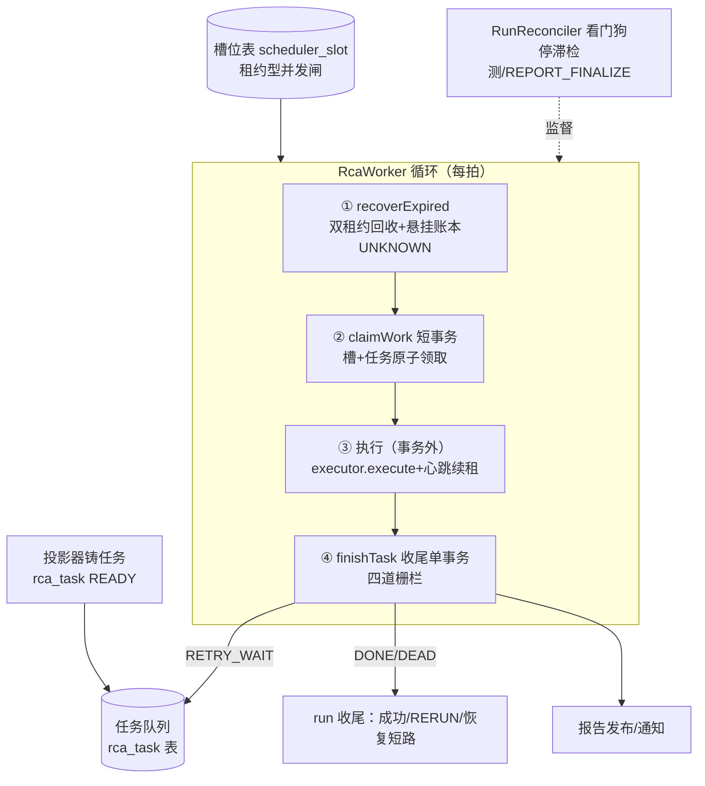
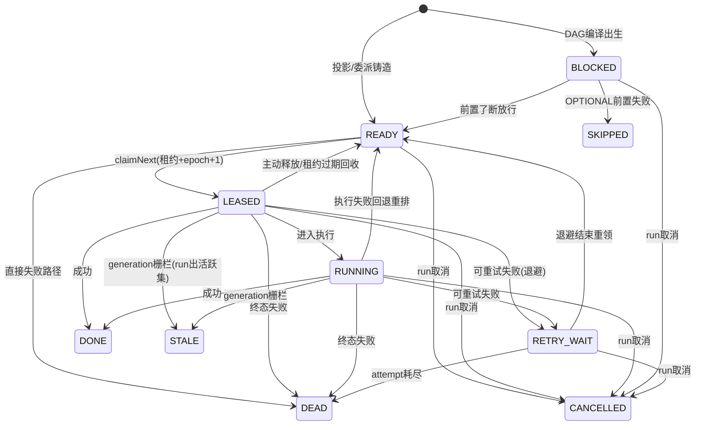

# 09-任务调度与Worker执行

> 本系列第十篇。讲执行层的"最后一公里"：**调查任务怎么被领取、怎么在租约保护下执行、崩了怎么被捡回来——这一层是"后端面试"最锋利的部分：槽位租约、双回收、四道栅栏。**
> 标注约定同前：【代码事实】/【合理推断】/【设计扩展】/【未确认】。

# 本层要解决的问题

一句话：**把"有一堆调查任务等着做"变成"有限个 worker 安全地各领各的、执行中不断续租、崩了有人回收、收尾一个事务结算"——任务不丢、不双执、不卡死。**

# 先看一个交易告警

> createOrder 告警的调查任务（READY）静静躺在 `rca_task` 表里。某台 worker 的虚拟线程循环每一拍做三件事：
> **回收**——扫一遍租约过期的任务（上一个 worker 可能挂了）和过期的槽位；
> **领取**——在一个短事务里"占一个执行槽 + 领一个 SLA 最优的任务"，两者原子：占不到槽就不领任务，领不到任务就还槽；
> **执行**——事务外跑调查（可能几分钟），期间每拍心跳续租，顺带看一眼 run 是不是被取消了；
> **收尾**——结果在**一个事务**里结算：先抢提交权栅栏（旧 worker 晚到=一行不写），再看 run 代际（死 run=STALE 零落档），然后任务终态三分支（DONE/RETRY_WAIT/DEAD）、run 收尾三分支（成功/重跑/已恢复短路）。
> 这个循环永不停歇，也没有任何一行代码知道"createOrder"是什么——调度层对业务完全无知。

# 如果没有这一层会怎样

1. **任务靠内存计数器限流 = SIGKILL 后永久泄漏**。这是本项目一个真实的设计决策记录：槽位之所以是一张带租约的表，注释原文——"固定槽位租约表，评审 #6——**替代 SIGKILL 后永久泄漏的 running 计数器**"（SchedulerSlotRepository.java:10）。内存计数器在进程被 kill -9 时不会归还，并发额度只会越漏越少，最后全系统卡死；租约表靠时间自动回收。
2. **没有租约 = 一个任务两个 worker 同时做**。双执行意味着双倍模型费用、双份证据、双份报告。本层的 epoch 栅栏让旧执行者"晚到提交一行不写"。
3. **没有回收 = 崩溃任务永久蒸发**。worker 领了任务就挂，没有回收机制的话这个任务停在 LEASED 状态直到宇宙热寂。本层每拍 `recoverExpired` 扫描双租约（任务租约+槽位租约）各自过期回收。

---

# 代码是怎么做的

## 0. 先给我一句话

Worker 层 = "回收→领取→执行→收尾"四拍循环：领取是**槽位+任务同一短事务**的原子操作（INV-AM1-7），执行在事务外靠心跳续租保活，收尾是带四道栅栏的单事务——所有状态都在 PG，任何进程在任何拍之间被杀都能被下一拍救回来。

## 1. 业务上为什么需要这一层

调查是分钟级的长任务、成本高（模型调用）、有严格并发约束（预算/槽位），还必须经得起进程任意时刻死亡。这一层把"并发上限、所有权、超时、重试、恢复"从业务里剥离成纯调度语义——05 篇的主循环、07 篇的委派都运行在它给的"安全座位"上。

## 2. 它在整个系统的位置



## 3. 输入和输出

- **收到**：一拍时钟（pollInterval）；可领取的 READY/RETRY_WAIT 任务（过 claim SQL 的三重过滤：状态+活跃 run 栅栏+task_key 面）；空闲槽位。
- **处理**：领取（短事务）→执行（事务外，executor 由引擎映射分派）→收尾（单事务）。
- **产出**：`CycleOutcome{EXECUTED|IDLE|SLOTS_BUSY}`（观测面）；任务终态+attempt 终态+run 收尾+报告/发布/通知（收尾事务内）。
- **交给谁**：RETRY_WAIT 的任务回队列（退避后重领）；终态任务的结果交给 run 收尾算法（RERUN 铸造/恢复短路/锚定）。

## 4. 真实代码入口

- 文件：`alert/application/RcaWorker.java`（525 行，"零注解虚拟线程"）。
- 四拍方法：
  - `recoverExpired()`（:266-287）：`slots.reclaimExpired(now)` 槽回收→`tasks.findExpiredLeased(now)` 任务回收（四条件原子回收含 `lease_until<now` 复核——"读后心跳已续/已他人重领/他回收者已收敛 = 0 行竞态失败，不计数零补救"，:277-283）→三账本悬挂标 UNKNOWN（:289-327）。
  - `claimWork()`（:335-362）：`tx.execute` 单短事务内 `slots.tryAcquire`→`tasks.claimNext`→锁 run 行取修订锚；任一不成立归还槽/不翻转（"slot+task 同事务语义，INV-AM1-7；崩溃缝隙由双租约回收兜底"）。
  - `runOneCycle()`（:367-467）：markRunRunning CAS（防取消复活）→铸 attempt+STARTED 调查记录→**事务外执行**（heartbeat 回调：任务租约续期+所有权复核+槽心跳+activity 回写+run 终态探针，:394-425）→材料预提交（防"执行完成→收尾提交"缝隙，:452-460）→`finishTask` 收尾。
  - `loop()`（:490-524）：常驻循环，每拍先 recoverExpired，再 expireOverdue/canary 评窗（独立容错不炸主循环），无活干 sleep(pollInterval)。
- **领取 SQL 三重栅栏**（PostgresRcaTaskRepository CLAIM_SQL，:32-50）：`state IN ('READY','RETRY_WAIT')` + **EXISTS 活跃 run 栅栏**（"只领活跃 run（QUEUED/RUNNING/REPORTING，与 V12 uq 谓词同集）——被新代际取代的 run 其任务不可再领取"，M4-07 generation fence）+ **task_key 过滤**（C-70："通用领取面只认 driver task_key——NATIVE run 的 DAG 调查任务若被 worker 误领会在其 finishTask 提前终结 run"）+ `ORDER BY (now() >= deadline_at) DESC, priority DESC, deadline_at, ...` + `FOR UPDATE SKIP LOCKED`。
- **SlaPolicy**（纯函数，:10-16）：critical=200/warning=100/info=0（未知按 info 安全侧收敛）；warning 10min/info 60min 默认 SLA；critical deadline=Instant.MAX（PG infinity）；领取排序="等待超 SLA 才允许越级"（overdue DESC 优先）——注释还自曝了历史："替换 v1.1 的错误 aging 公式（'info 100 分钟后超越 critical'自相矛盾）"；**"不保证零饿死（显式承认）"**。

## 5. 核心对象

| 对象 | 是什么 | 关键纪律 | 代码锚 |
|---|---|---|---|
| `RcaTask` | 调度单元：状态/优先级/availableAt/readySince/deadlineAt/租约三字段/attempt 计数/roundId | deadline=readySince+SLA(priority)；**readySince 重试时刷新——"退避结束不插队"**；唯一键 (run_id, round_id, task_key) | RcaTask.java:8-16 |
| scheduler_slot 行 | 租约型并发闸（scope+slot_no，lease_owner/lease_until/lease_epoch，task_id） | **"替代 SIGKILL 后永久泄漏的 running 计数器"**；迁移预置 2 槽（部署门观测） | SchedulerSlotRepository.java:10,46 |
| `RcaAttempt` | 一次执行尝试（owner/leaseEpoch 事实源） | markActivityByTask 心跳回写——"心跳=系统在干活（活≠进展；有效进展只由检查点 APPLIED 提交回写）" | RcaWorker.java:413-415 |
| `RcaTaskExecutor` | 引擎执行器接口（NATIVE/HOLMES→REPORT_FINALIZE 分派） | Map 分派面唯一权威，缺绑定 fail-closed EXECUTOR_MISSING 不回退（"回退会污染 Canary 证据面"） | RcaWorker.java:426-437 |
| `ExecutionResult` | 执行结局：SUCCEEDED/FAILED_RETRYABLE/FAILED_TERMINAL+errorClass+artifact | 类型化停止（StoppedException）=终态失败绝不折成可重试 | RcaWorker.java:438-442 |
| `SlaPolicy` | SLA 纯函数 | "不保证零饿死（显式承认）"；历史 aging 公式错误的自曝 | SlaPolicy.java:10-16 |

## 6. 一条真实调用链（一轮完整执行）

```
loop()（:490）每拍：
① recoverExpired（:266）：
   slots.reclaimExpired（过期槽清空，epoch 不动重占+1）
   findExpiredLeased → 逐任务：run 活跃？→RETRY_WAIT；死 run→STALE
     （tasks.reclaimExpired 四条件原子写，0 行=竞态失败不计数）
   markHangingInvocationsUnknown：三账本（外部调用/调查记录/工具账本）悬挂→UNKNOWN
② runOneCycle（:367）：
   claimWork（tx）：tryAcquire 槽（SKIP LOCKED，epoch 随槽返回）
     → claimNext 任务（SLA 排序+活跃 run 栅栏+task_key 面+SKIP LOCKED）
     → 锁 run 行取 revision（markRunRunning CAS 的锚）
     领不到任务 → 还槽
   markRunRunning（QUEUED→RUNNING，CAS 防取消复活，Orchestrator:688-695）
   铸 attempt + InvestigationResult(STARTED)（"进程在外调后落库前被杀也留悬挂可查"，:383-390）
   ── 事务外 ──
   executor.execute(task, run, incident, attempt, heartbeat)（:429-437）
     heartbeat（每拍）：tasks.heartbeat 续租 → 复核 owner/epoch/leaseUntil（不符抛
       LEASE_LOST 停止）→ slots.heartbeat → attempts.markActivity → run 终态探针
       （取消/过期即抛 StoppedException，:394-425）
     StoppedException → 终态失败（"重试会复活已取消的执行身份"，:438-442）
     其他 RuntimeException → retryable("EXECUTOR_ERROR")
   材料预提交（独立短事务，防收尾缝隙，:452-460）
   ── 收尾单事务 ──
   orchestrator.finishTask（:234）：
     栅栏1 LeaseFence.acquire（:242）：0 行=旧租约晚到→LEASE_REJECTED 一行不写
     栅栏2 generation fence（:254）：run 非活跃→task STALE+attempt 照实落+零报告
     任务终态三分支（:282-303）：成功→DONE；可重试且未耗尽→RETRY_WAIT
       （退避 1/2/4min 封顶 5min，新 deadline=readyAt+SLA"退避后不插队"，:674-677）
       其余→DEAD
     栅栏3 run 收尾三分支（:321-371）：run 已出活跃集→跳过收尾；失败→FAILED+清指针；
       成功→SUCCEEDED→incident 行锁下三分支：
       已恢复→RESOLVED_SHORT_CIRCUIT；材料变化→RERUN 铸造；否则锚定材料
     （发布赢家 CAS/通知/处置单在 archiveArtifact 内，栅栏4=发布面）
③ 无活 → sleep(pollInterval)
```

## 7. 状态机（两台主状态机全图——本层是它们的法定管理者）

**任务 11 态机**（RcaTaskStateMachine.java:6-15 注释原文整理）：



- **六终态无出边**：DONE/CANCELLED/DEAD/SKIPPED/FAILED_TERMINAL/STALE——"STALE generation 过期由新 run 新任务承接，不复活"；**"未领取态（READY/RETRY_WAIT/BLOCKED）不入 STALE：claim SQL 栅栏隔离其领取，回收面只处理 LEASED"**（:15——STALE 只发生在"领了才死"的场景，未领的由领取面直接隔离，这是职责切分的细节）。
- **谁修改**：worker 领取/收尾、回收面、Supervisor 放行/剪枝、finishTask 三分支；**修改条件**：全部过 `requireTransition` + SQL 条件写（epoch/owner）。
- **存哪**：rca_task.state；跨重启。

**run 9 态机**（RcaRunStateMachine.java:6-15）：QUEUED→{RUNNING, REPORTING, CANCELLED, SUPERSEDED, SUCCEEDED, FAILED}；RUNNING→{REPORTING, SUCCEEDED, FAILED, PARTIAL, EXPIRED, CANCELLED, SUPERSEDED}；REPORTING→六个终态。两个特殊语义：SUPERSEDED=rerun 收尾时未完成被新 run 取代；PARTIAL=预算/SLA 耗尽部分完成收尾；EXPIRED=deadline 强制收尾；还有 G0-06 退化路径（QUEUED 直接进终态/REPORTING——"收尾算法接受任意活跃态"）。

## 8. 正常业务流程（业务步骤 + 代码 + 状态）

| # | 业务动作 | 代码 | 状态变化 |
|---|---|---|---|
| 1 | 任务入队待命 | 投影器铸造 | task READY（deadline=readySince+SLA） |
| 2 | worker 占座领活 | claimWork 单事务 | slot 被占（epoch+1）；task READY→LEASED |
| 3 | 开跑 | markRunRunning CAS | run QUEUED→RUNNING；attempt STARTED |
| 4 | 干活+保活 | executor.execute+heartbeat | 心跳续 leaseUntil；activity 回写 |
| 5 | 交活结算 | finishTask 单事务 | task→DONE；attempt→SUCCEEDED；run→SUCCEEDED |
| 6 | 归还座位 | slots.release（epoch 栅栏） | 槽空闲，下一任务可领 |

## 9. 异常流程

| 异常 | 处理了吗 | 怎么处理 |
|---|---|---|
| 心跳发现租约已易主/过期 | ✅ | 复核失败抛 LEASE_LOST——"租约续期失败必须让后续动作停止"（:397-411），异常穿透执行器→retryable→finishTask epoch 栅栏诚实结算 |
| run 被取消（执行中） | ✅ | 心跳探针+网关控制信号双路 StoppedException→**终态失败**（"绝不折成可重试 EXECUTOR_ERROR——重试会复活已取消的执行身份"，:438-442） |
| 引擎无执行器绑定 | ✅ fail-closed | EXECUTOR_MISSING 终态失败，不回退主路径（"回退会污染 Canary 证据面"，:426-437） |
| 池满/通道拥塞 | ✅ | 网关背压显式拒绝→模型可见族可退避（06 篇） |
| 可重试失败未耗尽 | ✅ | RETRY_WAIT+指数退避（1→2→4min 封顶 5）+deadline 重算（"退避后不插队"） |
| 可重试失败已耗尽（默认 3 次） | ✅ | task DEAD→run FAILED→清 incident run 指针（"诚实失败，无第二引擎兜底"，Orchestrator:337-341） |
| run 到硬期限 | ✅（对账面） | RunReconciler AUTO_EXPIRE 模式：RUNNING/REPORTING→EXPIRED、QUEUED→FAILED+QUEUE_DEADLINE（14 篇） |
| 收尾时发现 run 已终态 | ✅ | generation fence：task→STALE+attempt 照实落+报告零落档+"不污染新 run"（:252-272） |
| 旧 worker 晚到提交 | ✅ | LeaseFence 0 行→LEASE_REJECTED 一行不写只审计；lateCommitRejected 指标（:244-247） |
| 领取时 claimNext 空 | ✅ | 同事务还槽→IDLE/SLOTS_BUSY 观测（:344-348,369-371） |
| markRunRunning CAS 败（领取→开跑间取消落地） | ✅ | run 保持 CANCELLED 不复活；晚到结果由 fence 收敛 STALE（:376-380） |
| 悬挂账本（执行中进程死） | ✅ | 三账本 STARTED/PENDING 超宽限→UNKNOWN（"诚实对账，不猜测结局"） |
| 数据库抖动 | ✅ | 领取事务失败即整拍放弃（循环层 catch+退避，:514-521）；收尾事务失败任务留在 LEASED 由回收面接管 |

## 10. 并发问题

1. **同一任务两个 worker 领取？** 不会：claimNext 单语句 `FOR UPDATE SKIP LOCKED`——行在领取语句提交时已离开可见集（与 inbox 同律）；再加 epoch+1，旧持有者所有条件写 0 行。
2. **并发上限怎么控制？** 槽位表：tryAcquire 占不到就空拍；**槽+任务同事务**（INV-AM1-7）杜绝"领了任务没座位"或"占了座位没任务"的中间态。
3. **SLA 排序的并发互斥实证**：ORDER BY 原文钉进 SQL（"CT-A02 并发互斥实证"，PostgresRcaTaskRepository.java:19）；SlaPolicy.claimOrder 是 SQL ORDER BY 的内存镜像（fake 与生产同语义）。
4. **收尾与回收并发？** 回收四条件原子写含 `lease_until<now` 复核（"读后心跳已续/已他人重领/他回收者已收敛=0 行竞态失败"）；收尾走 LeaseFence——谁先拿到行锁谁赢，输家零落档。
5. **Lost Update？** 全链条件写（epoch/owner/revision/run 修订锚），无"读-改-写"裸写。

## 11. 崩溃恢复（kill -9 逐点演练）——本篇核心

模拟：worker 已 claimWork、执行到第 5 分钟，被 kill -9。
- **已保存**：task LEASED（owner/leaseUntil/epoch）、attempt STARTED、run RUNNING、检查点（调查内已提交步）、工具/模型账本已终态行。
- **没保存**：本次执行的后续一切。
- **任务丢吗？** 不丢：下一拍任何 worker 的 `recoverExpired` 发现 lease_until 过期→四条件原子回收→**RETRY_WAIT**（run 活跃）+退避→重领重做。slot 同时被 reclaim（**双租约独立回收**，"CT-A05/DP-B05 实证"，RcaWorker.java:40-42 javadoc）。
- **从哪继续？** 从头重做这个 task 的这个 attempt——但调查内部的进度不丢：主任务的检查点让重驱动跳过已完成的步；账本 PENDING 悬挂被标 UNKNOWN（诚实记录"结果未知"而不是猜成功失败）。
- **之前的工具调用会重复吗？** 会重新执行（R0 只读安全），但账本幂等键+同 digest 证据复用保证不产生重复账目/重复证据（06 篇）；副作用工具根本没执行过（审批链截停）。
- **四个概念各就各位**【面试背诵重点】：
  - **Checkpoint（检查点）**解决"从哪继续"——调查步级进度在 `rca_primary_checkpoint`；
  - **Worker Lease（租约）**解决"原来的执行者死了谁有权继续"——leaseUntil 过期+epoch 重领；
  - **Retry（重试）**解决"这次失败再试一次"——RETRY_WAIT+退避+maxAttempts=3；
  - **Idempotency（幂等）**解决"再试不产生重复副作用"——幂等键+digest 复用+epoch 栅栏。
- **槽位泄漏呢？** 不存在——槽是表行带租约，"SIGKILL 后永久泄漏的 running 计数器"问题在设计层面被消灭。

## 12. 安全

- 本层自身无权限语义（调度对业务无知）；安全边界在两端：入口认证（03 篇）决定谁能让任务入队/取消；执行内容的安全由工具网关（06 篇）和审批链（04 篇）承担。
- 值得一提的"诚实性安全"：`attempt` 的 activity 心跳回写与检查点进展**故意分离**——"心跳=系统在干活（活≠进展）"，防止"假活"骗过停滞对账（RunReconciler 的等待判定依赖有效进展时间戳）。**可观测性数据本身也被设计为不可伪造的语义**。

## 13. Agent Harness

本层 100% Harness【代码事实】：调度、租约、回收、退避、结算没有任何模型参与；主 Agent 的循环（05 篇）恰恰是运行在本层租约保护下的"被调度者"。Harness 在本层强制保证的：并发上限（槽）、所有权唯一（租约+epoch）、时间上限（SLA+对账硬期限）、崩溃回收（双租约+三账本）、终态诚实（类型化停止/STALE/UNKNOWN）。

## 14. 可观测性

- 任务决策事件：`rca_task_decision`（run_id/task_id/attempt_id/decision/latency_ms，Orchestrator:306-311）+ `metrics.taskDecision(decision, engine)`（FinishOutcome 封闭枚举做标签，"无 UUID 标签"防指标爆炸）；
- 迟到提交计数 `lateCommitRejected`、悬挂回收计数 `unknownActionCount`（WC-5 三账本合并上报）；
- 槽位观测：`occupiedSlots/totalSlots`（"部署门观测"，迁移预置 2）——并发水位直接可查；
- attempt 的 startedAt/activity/终态时间线+采样指纹（M5-04）。

## 15. 性能和成本

- **并发上限=槽数**（预置 2）：调查是重操作（分钟级+模型调用），并发闸设计得保守；扩容=改迁移槽数+扩 worker 实例（机制天然支持多实例——SKIP LOCKED+租约）。
- **空转成本**：无活时 sleep(pollInterval)；有活时连续拍（EXECUTED 不 sleep——"领取后立即下一拍"）。
- **虚拟线程**：worker 循环跑在虚拟线程（`Thread.ofVirtual()`），阻塞在 DB/HTTP 时不占 OS 线程——单实例可撑多 worker/多循环。
- **退避节奏**：1/2/4min 封顶 5min；RETRY_WAIT 任务由 deadline 排序自然回流。
- **QPS×10 先坏哪**【代码事实+推断】：调查并发=槽数，队列会先堆积（SLA 排序保证重要的先跑）→然后 SLA 超期任务变 overdue 优先→信息面（RcaWorker 空 vs 忙）先报警；真正的硬瓶颈是模型网关。**扩容路径清晰：加槽（迁移）+加实例（无状态循环），不需要改代码。**

## 16. 设计取舍

**① 为什么槽位是租约表而不是信号量/内存计数？（本篇最锋利的面试点）**
评审 #6 原文给出了动机："替代 SIGKILL 后永久泄漏的 running 计数器"。进程死亡时内存计数器不归还→并发额度单调递减→最终饿死；租约表靠时间回收自愈，且天然支持多实例（跨进程一致）。代价：每次领取多一次 DB 往返、槽回收有租约窗口延迟。对分钟级调查，这点开销可以忽略。

**② 为什么槽+任务必须同事务？**
分开的话有两种中间态：占了槽没领到任务（座位空占一个租约周期）或领了任务没槽（并发超限）。同事务让两者原子（INV-AM1-7："领取/归还/回收永远同事务或同租约周期"），崩溃缝隙由双租约回收兜底——**把不变量写进事务边界，而不是写在注释里祈祷**。

**③ 为什么重试要刷新 readySince 并重算 deadline？**
"退避结束不插队"（§6.2）：如果只退避不刷新排序基准，重试任务会带着旧 readySince 的 SLA 计算排在最前——失败重试反而插队挤掉新任务。刷新后它的优先权从退避结束时刻重新累积。**公平性语义落在排序键的选择上，而不是口头承诺。**

**④ 当前方案最大的边界？**
- "不保证零饿死（显式承认）"——SlaPolicy 原话：持续的高优任务流理论上可以让低优任务无限等待（缓解靠 overdue 越级，但 critical 永不到期）；
- 预置 2 槽是部署门经验值，容量规划靠观测面人工调；
- 收尾单事务较大（attempt+结果+报告+发布+通知锚点）——事务内全本地 PG 操作无外部调用（设计上隔离了远端），但仍是全链最重的事务。

## 17. 面试背诵卡

【30 秒主答】
"调度层是四拍循环：回收、领取、执行、收尾。领取的关键设计是槽位和任务在同一个短事务里原子完成——槽位是带租约的表不是内存计数器，注释写明就是为了替代 SIGKILL 后永久泄漏的 running 计数器；任务领取是单语句 SKIP LOCKED 加活跃 run 栅栏，SLA 排序用'是否超期'做第一键，重试刷新 readySince 保证退避结束不插队。执行在事务外跑，心跳续租同时复核所有权和 run 状态——易主或取消立即停止。收尾单事务四道栅栏：提交权栅栏拒绝旧 worker 晚到，代际栅栏让死 run 的产出收敛 STALE 零落档，然后任务终态、run 收尾三分支。崩溃恢复靠双租约独立回收加三账本悬挂标 UNKNOWN——诚实标未知不猜结局。"

## 18. 这一层哪些话不能说

1. ❌ "用消息队列做任务调度" → ✅ 任务队就是 rca_task 表+SKIP LOCKED 领取，无 MQ。
2. ❌ "支持海量并发调查" → ✅ 槽数预置 2，刻意保守；扩容走加槽+加实例。
3. ❌ "重试保证最终成功" → ✅ maxAttempts=3 耗尽即 DEAD，诚实失败不兜底。
4. ❌ "worker 崩了任务从头再来很浪费" → ✅ 调查内部有检查点，重做跳过已完成步；调度层的重做是任务级兜底不是唯一恢复面。
5. ❌ "SLA 保证公平" → ✅ 原话"不保证零饿死（显式承认）"。
6. 槽数/退避参数的部署实值【部分确认：迁移预置 2、退避 1/2/4min 封顶 5min 是代码默认；生产 compose 覆盖值未核对】。

---

# 我现在应该能回答什么

1. 一轮循环的四拍分别做什么？哪几拍在事务里？（→ 第 6 节：领取短事务+收尾单事务，执行在事务外）
2. 为什么槽位要用带租约的表？（→ SIGKILL 泄漏计数器，评审 #6 原文）
3. 任务租约和槽位租约为什么要"双回收"？（→ 各自独立过期，回收互不依赖——INV-AM1-7）
4. 同一个任务会不会被两个 worker 同时执行？最后一道防线是什么？（→ SKIP LOCKED 领取+LeaseFence epoch 栅栏）
5. Checkpoint/Lease/Retry/Idempotency 在这一层各解决什么？（→ 第 11 节四概念对位）

# 30 秒背诵卡

见第 17 节。

# 面试官追问卡

**Q1：worker 领取后、markRunRunning 前被 kill -9，run 会卡在 QUEUED 吗？**
考什么：状态缝隙的逐点推演。
30 秒答："不会卡死，但 run 会短暂停在 QUEUED——任务已 LEASED，租约过期后被回收成 RETRY_WAIT，重领时 markRunRunning 再次执行（QUEUED→RUNNING），run 正常开跑。中间态有界：最长一个租约周期+退避。要注意这期间新告警不会重复铸 run——活跃 run 唯一索引把 QUEUED 也算活跃。"
继续追问 1："如果回收时 run 已经被取消了呢？"——答："回收面判 run 活跃性：不活跃→任务收敛 STALE 而不是 RETRY_WAIT——'死 run 的工作不重排不复活'（M4-07）。"

**Q2：心跳续租失败抛 LEASE_LOST，为什么走 retryable 而不是直接 DEAD？**
考什么：错误语义的精确分型。
30 秒答："LEASE_LOST 的语义是'我失去了执行权'，不是'这个任务不可做'。走 retryable 让任务回 RETRY_WAIT 队列，重领的是新 worker——任务本身是健康的。真正终态失败的是 StoppedException（run 取消/硬期限）——那是执行身份的死亡。而最终能不能落结果，由 finishTask 的 epoch 栅栏裁决：旧 worker 就算把 retryable 结果带回来，0 行栅栏让它一行不写。三层各管各的：心跳管停手、分型管队列、栅栏管结算。"
继续追问 1："那个旧 worker 的模型调用钱白花了吗？"——答："花了，这就是围栏的代价。但对照面是：不设围栏，两个 worker 的结果互相覆盖、报告双发——那是正确性事故。花钱买正确性，这笔账是划得来的，且 lateCommitRejected 指标让它可见。"

**Q3：退避为什么封顶 5 分钟而不是继续指数增长？**
考什么：退避策略与 SLA 的相互作用。
30 秒答："两个原因：一是任务 deadline=readySince+SLA，无限指数退避会让第 N 次重试天生就超 SLA，排序永远 overdue——排队语义被退避策略绑架；二是调查任务的失败多为环境性（模型抖动/数据源抖动），5 分钟封顶够环境恢复，再长只会拖延告警响应。封顶值是'DP 观测修正'的注释级证据——这个数是调出来的不是拍出来的。"
继续追问 1："退避期间占槽吗？"——答："不占。RETRY_WAIT 在归还槽之后——座位和任务分离，退避的任务不浪费并发额度，这正是槽+任务同事务设计的红利：释放永远成对。"

**Q4：SlaPolicy 说"不保证零饿死"，什么场景真的会饿死？系统能接受吗？**
考什么：诚实面对理论边界。
30 秒答："场景：critical 流量持续不断——critical 的 deadline 是 Instant.MAX 永远排最前，info 任务理论上无限等待。系统能接受的原因有两层：一是 overdue 越级——info 等过自己的 SLA（默认 60 分钟）后也进入 overdue 桶排到非 overdue 前面，实际不是纯饥饿而是'低优延迟无上界'；二是这个系统的业务语义——critical 是'正在烧钱的交易故障'，它饿死 info 是符合业务优先级的。注释显式承认不保证零饿死，就是把理论边界写进文档，而不是假装算法解决了它。"
继续追问 1："如果想彻底解决呢？"——答："加权公平队列（WFQ）或老化加权——但引入复杂度前先问业务：告警调查场景里，info 级告警延迟一小时处理，业务后果是什么？多数答案是不需要彻底解决。"

**Q5：收尾单事务里都干了什么？为什么这些必须在一个事务里？**
考什么：事务边界的推理。
30 秒答："attempt 终态、调查结果 CAS、tool_calls 落表、报告行、发布赢家 CAS、通知 outbox 锚点、任务终态、run 收尾、incident 指针——十来张表一次提交。必须同事务的原因：这些写入是'一次调查的结算'，拆开任何两步都会产生可观测的中间态——比如'报告落了但任务还是 LEASED'（对账面会误判悬挂）、'任务 DONE 了但发布没抢到'（赢家 CAS 必须与报告同生共死）。且事务内全部是本地 PG 操作，外部调用（通知发送）被推到 outbox 异步面——事务内无远端，长度可控。"
继续追问 1："事务失败重放安全吗？"——答："安全：发布赢家是 CAS（一个 incident+generation 只有一个赢家）、结果落档是终态 CAS、finishTerminal 只迁移 STARTED 行——收尾重放的每一笔都是幂等条件写。"

**Q6：如果让你重新设计这一层会改什么？**【设计扩展——设计题答案，不要说成现网实现】
考什么：REDO。
30 秒答："两处：一是槽位 scope 化已经做了，我会再进一步按引擎/任务类型分池——现在 NATIVE driver 和 REPORT_FINALIZE 共享槽位，恢复任务可能被新调查挤占；二是把收尾大事务拆成'结算事务+发布事务'两段（用 outbox 已经具备的机制衔接），缩短最长事务的持锁时间。四拍循环、双租约回收、四道栅栏这三样我不会动——它们是'任务不丢不双执'的全部保证。"

# 这层不要乱说什么

1. 不要说"基于 Kafka/RabbitMQ 的任务队列"——表+SELECT SKIP LOCKED。
2. 不要说"自动弹性伸缩"——槽数是迁移预置（2），扩容是人工动作（机制支持，无自动器）。
3. 不要说"任务永不丢失"——准确说法：任务不丢（回收面）+结果不双写（栅栏面）+进度可续（检查点面），三层各管一段。
4. 不要说"worker 数等于并发数"——并发=槽数（全局），worker 实例可以多于槽（领不到就空拍）。
5. 不要把 EXECUTOR_MISSING 说成降级——是 fail-closed 终态失败，刻意不回退。
6. 生产 compose 的实际槽数/退避覆盖值【未确认】——引代码默认值时说明是默认。

# 5 句话总结

1. **为什么需要**：调查是分钟级高成本任务且进程随时会死——并发、所有权、回收、结算必须成为与业务无关的调度语义。
2. **核心机制**：四拍循环+槽位/任务同事务领取+双租约回收+心跳保活+四道栅栏收尾。
3. **上下游协作**：上游投影/委派产任务；下游引擎执行器干活；看门狗（RunReconciler）兜停滞。
4. **最大风险**：并发上限保守（2 槽）且人工扩容；低优先级延迟无上界（显式承认）。
5. **最大取舍**：用"每拍多几次 DB 往返+租约窗口延迟"换"SIGKILL 后零泄漏、零双执、零蒸发"。

---

*本篇完成。下一篇待你指令解锁：《10-并发控制与任务幂等》。*
