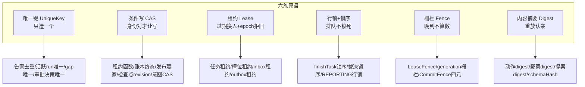

# 10-并发控制与任务幂等

> 本系列第十一篇，横向总纲。前面九篇各管一层，本篇把散落全系统的并发原语收拢成一张清单：**唯一键、条件写（CAS）、租约、行锁、栅栏、内容摘要**六族——以及那个贯穿一切的原则："0 行 = 诚实放弃"。
> 标注约定同前：【代码事实】/【合理推断】/【设计扩展】/【未确认】。

# 本层要解决的问题

一句话：**让"同一件事被两个执行者同时做"在任何一层都不发生、或发生了也不产生双重副作用——靠的不是分布式锁服务，而是把 PostgreSQL 的唯一键、条件写和租约用到极致的一套原语族。**

# 先看一个交易告警

> 构造一个并发风暴，看系统怎么接：
> **T0 秒**：createOrder 告警组被 AM 重发了两次（网络抖动）——两个 inbox 行几乎同时入队；
> **T0+1 秒**：两个 inbox 消费者同时处理这两行——投影事务里 alert_event 去重键让第二次只累加计数，**run 只铸一个**；
> **T0+5 秒**：调查任务 READY，两个 worker 同时抢——SKIP LOCKED 让一人领走，另一人领下一个或空手；
> **T0+3 分钟**：领到任务的 worker 假死（GC 10 分钟），回收面把任务标 RETRY_WAIT，另一个 worker 重领（epoch+1）继续查；
> **T0+13 分钟**：假死 worker 醒了，带着调查结果来收尾——**LeaseFence 0 行，一行不写**；新 worker 正常收尾，发布赢家 CAS 保证一个 (incident, generation) 只发一份报告。
> 全程没有任何一行代码调用过"分布式锁"。

# 如果没有这一层会怎样

不需要假设——这套原语的每一族都对应一类经典事故：双执行（双倍模型费+双报告）、Lost Update（对账面互相覆盖）、僵尸执行（假死 worker 复活后末写胜出）、重复副作用（重启两次/通知两次/开单两张）。本层的答案是**结构性的**：每个写入点都被迫回答"谁有权写、以什么身份写、写了算不算"——答案就是六族原语。

---

# 代码是怎么做的

## 0. 先给我一句话

这层的并发控制 = 六族原语的组合拳：唯一键管"只造一个"，条件写管"身份对才让写"，租约管"过期就换人"，行锁+锁序管"排队不锁死"，栅栏管"晚到的不算数"，内容摘要管"重放认得出是同一件事"。

## 1. 业务上为什么需要这一层

多实例 worker + 异步循环 + 分钟级任务 + 外部数据源——四个并发源叠加。且本系统的"副作用"极其昂贵（模型调用按 token 计费、报告会通知真人、变更会动生产），一次双执就是真金白银的损失。并发控制在这里不是性能问题，是**资金与正确性问题**。

## 2. 它在整个系统的位置

## 3. 输入和输出

本层无独立输入输出——它是横切在各层写入点的纪律。每个写入点的三问：**谁有权写（栅栏）、写的身份对不对（条件写谓词）、写两次会怎样（唯一键/幂等键）**。

## 4. 真实代码入口（六族原语逐一定位）

**族一：Unique Key（唯一键——"只造一个"）**

| 唯一键 | 防什么 | 代码锚 |
|---|---|---|
| `uq_alert_event_dedup` | 同一告警重复落账（重复只累加计数不重铸 run） | IncidentProjector.java:42-43 |
| `uq_rca_run_active_incident`（部分唯一索引） | 同一 incident 同时只有一个活跃调查（QUEUED/RUNNING/REPORTING 谓词同集） | RcaRunState.java:12-13 |
| `uq(run_id, gap_id)` 委派台账 | 同一信息缺口全 run 只裁一次（DuplicateKeyException"以先到者为准"） | DelegationDecision.java:10-11;Supervisor:477-481 |
| 审批决策 UNIQUE | 同一人对同一审批只一条决策 | ApprovalDecisionService.java:70-73 |
| `(run_id, round_id, task_key)` | 同轮重复编译显式失败（重入靠启动短路） | PlanCompiler.java:41-42 |
| `UNIQUE(run,task,attempt,call_seq,tool)` 工具账本 | 同一逻辑工具调用只落一行账 | RcaToolInvocationLedger.java:10-11 |
| 回执 messageId=(childTaskId,attempt) | 恢复重驱重投=恰一次合并 | DelegationReceiptService.java:44-46 |
| `report_generation_winner(incident,generation)` | 一个代际一份正式发布 | ReportWinnerRepository.java:8-15 |

**族二：条件写/CAS（"身份对才让写"）**

| 条件写 | 谓词 | 语义 |
|---|---|---|
| `requireCurrentLease` | `state='LEASED' AND lease_owner=:owner AND lease_epoch=:epoch` | 提交权栅栏的底层（0 行=失去提交权） | PostgresRcaTaskRepository.java:107-115 |
| `reclaimExpired` | 四条件：id+LEASED+`lease_until<now`+epoch | "0 行=心跳已续/已重领/他回收者已收敛——不计数零补救"（:163-179） |
| 账本终态 | `PENDING→SUCCESS/FAILED/UNKNOWN` 单向单次 | "终态不可改写" |
| `finishTerminal` | 仅 STARTED 行迁移 | 收尾重放幂等 |
| `claimWinner` | `INSERT...ON CONFLICT DO NOTHING`，行数=1 即赢家；"并发败者拿 0 不报错" | ReportWinnerRepository.java:11-13 |
| 检查点推进 | `WHERE revision=期望` 影响行数必须 1 | 与 owner/epoch/configEpoch 四元联检（CommitFence） |
| `markRunRunning` | `WHERE` 含 run 修订锚（领取事务内读得） | "领取→开跑间取消落地时 CAS 败，run 不复活"（RcaWorker.java:376-380） |
| intent OPEN→PLANNED | 单向 CAS | 同意图只消费一次 |

**族三：Lease（租约——"过期换人"）**：四个租约家族全部带 epoch fencing——任务租约（owner/leaseUntil/leaseEpoch）、槽位租约（同构）、inbox 租约（领取即 epoch+1）、outbox 租约（Dispatcher 领取）。共同语义：租约期内所有权唯一；过期由回收面统一收割；重领必 +epoch 拒旧提交。

**族四：行锁+锁序（"排队不锁死"）**：FOR UPDATE 出现在领取（claim/tryAcquire）、收尾（finishTask 的 task→run）、裁决（task→run→checkpoint，注释点名防 AB-BA 环"委派事务不得先持 run 再等 task"，Supervisor:289-292）、REPORTING 迁移（行锁恰一次）。锁序纪律代码化为 CL-01/WC-1 注释契约。

**族五：Fence（栅栏——"晚到不算数"）**：LeaseFence（提交权，04 篇/09 篇）、generation fence（run 出活跃集→产出 STALE 零落档）、CommitFence（owner+leaseEpoch+configEpoch+revision 四元，"STALE/CONFIG_CHANGED/RUN_TERMINAL 调用者立即退出本次驱动"）、动作身份 decisionSeq 单调（重复提交查 actionKey→REPLAYED 不覆盖）。

**族六：Digest（内容摘要——"重放认亲"）**【代码事实，ActionDigest.java:9-18】：
- `ActionDigest` = sha256(canonicalize(envelope))——envelope 八字段（含 toolVersion/schemaVersion/timeRange/调查输入身份/**canonicalizationVersion**），"字段名即命名空间，天然无边界歧义"（不再 `'|'` 手工拼接）；**canonicalizationVersion 钉死规范化算法版本——"换版时摘要必然全体变化，防止跨版本误判'同一动作'"**；
- ArgsNormalizer 空白折叠——"同参数不同措辞（多余空白/换行）=同一语义身份"（:25-28）；
- 全家谱：动作 digest（五账本同锚）+ 证据 payload_digest（ME-T05 重复内容不记进展）+ proposalDigest（相同提案相同图）+ schemaHash（工具契约版本）+ 事件哈希链（V112）。

## 5. 核心对象：四个"分型不可互代"的身份

`PrimaryCheckpointCommitService.java:28-30` javadoc 是全系统的身份哲学："**四类身份分型不可互代**：leaseEpoch=执行所有权（task 表为事实源）、configEpoch=运行配置、checkpoint revision=提交修订、decisionSeq=业务决策序。本服务校验前两者，推进第三者，绝不触碰第四者的语义。"加上 callSeq（attempt 内工具调用序），共五个单调/身份空间。**面试要点：能用递增整数区分的语义绝不混用一个计数器——混用的代价是"看起来都像版本号"的并发事故。**

## 6. 一条真实调用链（并发风暴全程——见"先看一个交易告警"的六幕）

| 幕 | 原语 | 精确行为 |
|---|---|---|
| 双投递 | 唯一键 | 第二次投影撞 uq_alert_event_dedup→只累加 notification_count |
| 双领取 | 行锁+SKIP LOCKED | 一人 RETURNING，另一人跳过该行领下一条 |
| 假死接管 | 租约+条件写 | 四条件回收（含 lease_until<now 复核）→RETRY_WAIT；重领 epoch+1 |
| 假死复活 | 栅栏 | LeaseFence.acquire 0 行→LEASE_REJECTED→"一行不写只配审计" |
| 双报告竞争 | CAS | claimWinner ON CONFLICT：一赢一败，"败者报告仍落档只是不发布" |
| 双开单 | 幂等键 | case:report:{reportId}——"收尾重放零副作用"（Orchestrator:483-487） |

## 7. 状态机也是并发控制【本篇特有视角】

状态机迁移表（5 台）+ DB CHECK 约束（V12 同步）+ 双读契约三层是并发防线的一部分：
- **迁移表**：非法边抛 IllegalTransitionException（"禁越边/禁终态复活"，OperationStateMachine:63-69）——并发写者即使绕过应用检查，DB CHECK 还在；
- **`RcaStateContract` 双读契约**（:11-18）：持久层读出的状态串只能经契约解析——"契约外取值（含 AM5 才引入的 WAITING_APPROVAL 与一切未知串）一律拒绝（fail-closed），不再直接 Enum.valueOf"；契约集与枚举全集"精确互斥完备（由测试穷举锚定）"；
- **视图投影穷举无 default**（DagTaskState.fromPersistent）：新增持久状态编译期报错。
一句话：**状态合法性=应用迁移表∧DB CHECK∧读契约，三道闸分别拦"写错""写坏""读错"**。

## 8. 正常业务流程（原语协作时间线）

| 时刻 | 事件 | 启用的原语 |
|---|---|---|
| 告警到达 | 投影 | 去重键+活跃 run 部分唯一索引 |
| 任务入队 | 铸造 | (run,round,task_key) 唯一键 |
| 领取 | worker | SKIP LOCKED+租约翻转+epoch+1+活跃 run 栅栏 |
| 执行 | 主循环 | 检查点 revision CAS+decisionSeq 单调+账本 PENDING 先行 |
| 收尾 | finishTask | LeaseFence+generation fence+终态 CAS+发布赢家 ON CONFLICT |
| 重试/恢复 | 回收面 | 四条件回收+UNKNOWN 诚实标记+digest 复用 |

## 9. 异常流程（第九部分第 10 节九问逐条对照【代码事实】）

| # | 问题 | 答案 |
|---|---|---|
| 1 | 同一个告警是否会创建两个调查？ | **不会**：去重键（事件层）+活跃 run 部分唯一索引（run 层）双闸；RERUN 只在收尾事务发现材料变化时铸造（单点铸造面） |
| 2 | 同一个调查能否同时被两个 Worker 执行？ | **不能**：driver task 独占执行权（task_key 过滤挡住通用领取）+租约 epoch+LeaseFence；委派子任务由同一 driver 的 sweep 串行驱动 |
| 3 | 两个子任务能否同时修改同一个 State？ | **不能**：主任务检查点唯一写口=CommitFence（owner/epoch/revision）；子任务只 append 证据与回执，不改共享状态 |
| 4 | 结果回收是否可能覆盖？ | **不能**：账本终态单向单次 CAS（"非 PENDING 返回 false"）；actionKey 重复提交=REPLAYED 原样返回；发布赢家 ON CONFLICT |
| 5 | 是否有 Lost Update？ | **无**：全链条件写，无"读-改-写"裸写；唯一的"整行 UPDATE"（tasks.update）发生在 LeaseFence 行锁持有时（行锁持至事务提交） |
| 6 | 是否存在重复委派？ | **同 gap 不能**（uq(run,gap)+先到者为准）；不同 gap 受批上限 2×单批 2+RUN_TASK_CAP |
| 7 | 是否存在重复 Tool Call？ | **物理可能、账面不可能**：幂等键防重复落账；digest 复用防重复执行；payload_digest 防重复记进展 |
| 8 | 是否存在重复唤醒？ | **唤醒幂等**：wakePrimary CAS 任意次重入安全，STILL_WAITING 原样返回 |
| 9 | Lock/Version/CAS/Lease/UniqueKey/IdempotencyKey 定位 | Lock=FOR UPDATE+锁序；Version=leaseEpoch/revision/configEpoch/decisionSeq/callSeq 五分型；CAS=族二全表；Lease=四租约家族；UniqueKey=族一全表；IdempotencyKey=actionKey/messageId/case:report:{id}/digest 家族 |

## 10. 并发问题（本篇即答案——补充三条进阶）

1. **CAS 败了怎么办？** 统一语义="调用者立即退出本次驱动"（CommitFence）或"一行不写只审计"（LeaseFence）或"以先到者为准"（台账 DuplicateKey）——**没有任何一处 CAS 败后重试覆盖**。
2. **栅栏拒绝的代价谁承担？** 晚到者已花的模型调用费（lateCommitRejected 可观测）；换来的是正确性。这是系统反复出现的模式：**花钱买单调性**。
3. **时钟依赖？** 租约过期谓词用应用时钟（AlertClock），有 ponytail 注释自我标注："worker 与 PG 同机部署偏差毫秒级；出现跨机时钟漂移时把过期谓词下沉为 updateGuarded 的 now() 条件"（PrimaryCheckpointCommitService.java:37-39）——**已登记的边界与迁移路径**。

## 11. 崩溃恢复（从幂等视角再看一遍）

崩溃恢复的完整链条（14 篇专讲）在幂等视角下是：**账本先行（PENDING）让"做过没做"永远可查→UNKNOWN 诚实标注让"做过但不知道结果"不被猜→幂等键让"重做"不产生重复账→digest 复用让"重做"少花钱→栅栏让"旧身份的重做"零落档**。五环相扣，缺一环就退化成"至少一次但可能双份"。

## 12. 安全

并发控制与安全在一点交汇：**审批与授权的不可重放性**。Grant 是 single-use（配额 total=1+ISSUED→CONSUMED 同事务消费）——"批准"这个动作本身被并发原语保护：两个操作者同时消费同一 grant，CAS 保证只有一个成功。安全决策的恰好一次，和业务副作用恰好一次，用的是同一套原语。

## 13. Agent Harness

本层 100% Harness。与模型的关系是**单向不信任**：模型输出的一切（决策 JSON/工具参数/委派请求）进入系统前都被赋予确定性身份（digest/decisionSeq/callSeq），使它的任何"重放/变体/重复"都能被识别和拒绝。**没有内容寻址，模型的行为就无法对账；无法对账，就无法限权。**

## 14. 可观测性

- 并发原语全部留痕：lateCommitRejected 计数（栅栏拒绝）、unknownActionCount（悬挂回收）、taskDecision 封闭枚举事件、DuplicateKey 的"以先到者为准"日志；
- 五个身份空间（epoch/revision/configEpoch/decisionSeq/callSeq）都落在表列上——任何一次写入的"身份四元+序号"可以从行里直接读出；
- 事件哈希链（V112）让事件账本自身防篡改可校验。

## 15. 性能和成本

- **代价清单**：每领取一次多一轮条件 UPDATE（epoch 翻转）；每提交一次检查点多一次 revision 比对；digest 计算是每调用一次 sha256（微秒级）。
- **收益清单**：零分布式锁服务依赖（全部 PG 内生）；多实例水平扩展零改造；崩溃恢复语义由原语自动保证（无手工对账脚本）。
- **QPS×10**【合理推断】：原语本身是行级操作，瓶颈仍在业务（模型/数据源）；唯一要盯的是热点行（同一 incident 的连续 RERUN 会在 incident 行锁上排队——但这恰是期望的串行化）。

## 16. 设计取舍

**① 为什么全用 PG 原生原语，不引入 Redis 锁/ZooKeeper？**
McpMountManager.java:15 注释有直接证据："（§2.3：不抄 Redis PubSub）正常路径经 McpMountManager 发布锁串行化"。系统的统一 taste：**能靠事务与条件写解决的，不引入第二套一致性设施**——多一套设施=多一种故障模式+多一份运维+跨设施事务难题。代价：吞吐上限受 PG 行锁约束——对分钟级调查的频率，这是正确侧的取舍。

**② 为什么"0 行"语义如此统一（放弃而非重试）？**
因为 0 行的每种成因（易主/过期/已被处理/已收敛）都意味着"**有一个别人已经合法地做了**"。此时重试=与合法者竞争，放弃+审计=让系统收敛。重试冲动只保留在"0 行不代表别人做了"的场景（如网关超时→模型可见族回喂）。**区分"竞争性失败"与"环境性失败"是重试策略的第一课**。

**③ 当前方案最大的边界？**
- 强绑定 PostgreSQL：SKIP LOCKED/ON CONFLICT/部分唯一索引都是 PG 方言——换库=重写并发层；
- 五个身份空间的纪律靠注释与评审维护（没有编译期强制"这个字段只能这样用"）——新代码误用 decisionSeq 当 revision 这类错误靠 code review 拦；
- 应用时钟租约谓词的跨机漂移边界（已登记未迁移）。

## 17. 面试背诵卡

【30 秒主答】
"并发控制这套系统没有用任何分布式锁组件，全部是 PostgreSQL 内生原语的六族组合：唯一键管只造一个——告警去重、活跃 run 部分唯一索引、委派 gap 唯一；条件写管身份对才让写——租约函数、账本终态单向 CAS、发布赢家 ON CONFLICT；租约管过期换人——任务、槽位、收件箱、发件箱四个租约家族全带 epoch fencing；行锁配统一锁序防死锁——收尾和裁决都按 task 到 run 的顺序拿锁；栅栏管晚到不算数——LeaseFence 让旧 worker 一行不写；内容摘要管重放认亲——动作摘要把工具版本、参数规范化版本、时间窗全钉进去。核心哲学是五个身份空间分型不可互代，以及'0 行等于诚实放弃'——竞争性失败绝不重试覆盖。"

## 18. 这一层哪些话不能说

1. ❌ "我们用了 Redis 分布式锁保证并发" → ✅ 零外部锁设施，全 PG 内生（注释明确拒抄 Redis PubSub）。
2. ❌ "幂等靠业务判断" → ✅ 幂等键全是 DB 约束+digest 数学身份，不靠"代码记得判断"。
3. ❌ "epoch 和 revision 差不多" → ✅ 五身份分型不可互代（leaseEpoch/revision/configEpoch/decisionSeq/callSeq 各管一词）。
4. ❌ "重复消息自动去重所以不会重复" → ✅ 入口不判重（02 篇），判重在投影层唯一键+下游幂等——分层各管一段。
5. ❌ "时钟漂移问题已解决" → ✅ 已登记未迁移（同机部署前提+下沉路径留档）。

---

# 我现在应该能回答什么

1. 系统里有哪些唯一键？各防什么事故？（→ 第 4 节族一表格）
2. "0 行=诚实放弃"的完整语义？哪三种失败要区分？（→ 第 16 节取舍②）
3. 五个身份空间分别是什么、为什么不能混用？（→ 第 5 节）
4. 假死 worker 复活后系统的完整行为？（→ 第 6 节风暴第四幕：LeaseFence 0 行）
5. 状态机怎么参与并发控制？（→ 第 7 节三层闸：迁移表∧DB CHECK∧读契约）

# 30 秒背诵卡

见第 17 节。

# 面试官追问卡

**Q1：claimWinner 的败者"报告仍落档只是不发布"——为什么不干脆不落档？**
考什么：诚实记账 vs 表面整洁。
30 秒答："落档是 INV-AM3-7 纪律（诚实记账）：败者报告也是一次真实的调查产出，它的材料、证据、费用都发生过。不落档=评测面看不见它、成本对不上账、回放面缺一角。'落档但不发布'把**事实记录**和**业务效果**分开——事实全部入账，效果只归赢家。这也是发布赢家 CAS 只挡 publication/outbox、不挡 reports.insert 的原因。"
继续追问 1："那 UI 会看到两份报告吗？"——答："查询面按赢家组织展示，败者报告在审计/对账面可见——可见性与发布权是两个维度。"

**Q2：ArgsNormalizer 做空白折叠——万一两个语义不同的查询只差空白呢？**
考什么：规范化的边界风险。
30 秒答："对 PromQL/Loki 这类 DSL，空白在语法上不承载语义（除字符串字面量内）——所以折叠是安全的近似。注释也给了兜底：规范化范围是白名单（ArgsNormalizer javadoc 管辖），且 canonicalizationVersion 焊在 digest 里——一旦发现折叠造成误合并，升版本让全部 digest 洗牌，宁可全员重查不做语义误判。这个设计接受'过度合并的损失可控（重查只读）'，拒绝'合并不足的成本不可控（无限重复执行）'。"
继续追问 1："副作用工具也走这套 digest？"——答："走，且更严格——R2/R3 在校验后、执行前就 digest 入意图账本，action digest 是审批授权的四元锚之一。副作用场景下'同 digest=同动作'的判定必须绝对可靠，所以它的参数都经过 Schema 严校验（无野字段），规范化面更干净。"

**Q3：锁序怎么保证新代码不会破坏？靠注释吗？**
考什么：工程纪律的可持续性。
30 秒答："三层：注释契约（CL-01/WC-1 把锁序写成带编号的设计规则，违反点会在评审被点名）；ArchUnit 架构测试（'tool 包禁触网络 API'这类结构断言已有先例，锁序同类可断言调用方向）；以及最实际的——锁序统一为 task→run 后，多数新代码根本不需要自己设计加锁顺序，跟着 finishTask 的模板走就自动合规。诚实地讲，跨五表的锁序没有全自动守护，靠的是'模板复用+编号契约+评审'三件套，这是工程现实。"
继续追问 1："出现过锁序事故吗？"——答："注释里'与 finishTask/expireRun 构成 AB-BA 环，方案 v2 §4.1'的措辞说明这是被设计评审捕获过的风险点——裁决事务曾可能先持 run 再等 task，修正为 task 先行。"

**Q4：租约时长怎么定的？太短会误回收，太长会拖延接管。**
考什么：超时参数的推理。
30 秒答："任务租约由心跳续期维持——租约时长只需大于心跳间隔的安全倍数，不是'任务时长'。误回收防线在回收谓词：四条件里有 `lease_until < now` 复核+epoch 匹配，心跳刚续过的任务即使被扫描到也会 0 行。接管延迟上界=租约时长（回收要等它自然过期）——所以租约时长是'接管延迟'和'心跳频率'的折中，与任务实际时长无关。这个解耦是租约设计的标准收益：参数不随负载变化。"
继续追问 1："时钟漂移会让误回收吗？"——答："同机部署偏差毫秒级，租约粒度秒级，安全；跨机场景已登记迁移路径（谓词下沉 DB now()）—— ponytail 注释原文。"

**Q5：怎么向面试官证明"没有 Lost Update"是设计保证而不是碰巧？**
考什么：全称命题的证明方式。
30 秒答："按写入点穷举。全系统修改共享状态的地方只有几类：任务行（update 在 LeaseFence 行锁内；回收/心跳/领取是条件写）、run 行（updateIfRevision/行锁下迁移）、检查点（唯一写口 revision CAS）、账本（终态 CAS）、证据（append-only）。每一类的写入谓词都包含身份条件——不存在'读出对象、改内存、整行写回'且不带谓词的路径。加上证明方法是穷举而非测试，测试只能证明 bug 存在，穷举写入点才能证明性质成立。"
继续追问 1："怎么防止未来新增写入点破坏穷举？"——答："唯一写口模式（如检查点只有 CommitService 能写）+ArchUnit 结构断言的惯例+评审清单里'新写入点三问'（谁有权写/身份对不对/写两次会怎样）。"

**Q6：如果让你重新设计并发层会改什么？**【设计扩展——设计题答案，不要说成现网实现】
考什么：REDO。
30 秒答："我会把五身份空间的纪律部分编译化：用类型包装（LeaseEpoch/Revision/DecisionSeq 各自的 value 类型）让'拿 revision 当 epoch 用'变成编译错误——现在靠注释和评审。第二，把租约谓词统一下沉 DB now()（把已登记的时钟边界直接消掉，成本是失去应用侧单时钟的可测性）。第三，给'0 行'事件加统一的审计表——现在散在指标和日志里，统一后对账更省。六族原语、分型哲学、0 行放弃语义，原样保留。"

# 这层不要乱说什么

1. 不要说"分布式锁"——全 PG 内生，无外部协调设施。
2. 不要说"幂等是约定"——幂等键是 DB 约束，digest 是数学身份。
3. 不要把 epoch/revision/configEpoch/decisionSeq/callSeq 说成"都是版本号"——五分型是本系统并发哲学的核心。
4. 不要说"测试证明了没有 Lost Update"——证明方式是写入点穷举，测试只能证伪。
5. 不要说"时钟问题不存在"——已登记边界（同机前提+迁移路径）。
6. 各唯一键的约束名以迁移 SQL 为准【个别约束名未逐字核对，语义均有代码锚】。

# 5 句话总结

1. **为什么需要**：多实例+异步循环+昂贵副作用，"做两次"等于真实资金与正确性损失。
2. **核心机制**：六族原语（唯一键/条件写/租约/锁序/栅栏/digest）组合，外加五身份空间分型不可互代。
3. **上下游协作**：横切所有写入点——每个写入点被迫回答"谁有权写、身份对不对、写两次会怎样"。
4. **最大风险**：纪律靠注释与评审维护（五分型无编译期强制）、强绑定 PG 方言、应用时钟租约边界已登记未迁移。
5. **最大取舍**：用"每写入点多一次条件判断+少量竞争性浪费"换"全系统无双执、无覆盖、无重复副作用"。

---

*本篇完成。下一篇待你指令解锁：《11-Context上下文管理》。*
