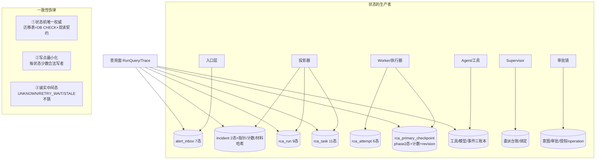

# 12-Session与State状态管理

> 本系列第十三篇。11 篇讲了"上下文"这一种状态，本篇把**全系统所有状态**收拢成一张所有权矩阵：谁的状态、存在哪、谁能写、崩了会怎样——以及系统对"状态"的三条一致性铁律。
> 标注约定同前：【代码事实】/【合理推断】/【设计扩展】/【未确认】。

# 本层要解决的问题

一句话：**系统里每一份状态都有唯一的表、少数几个合法写者、一台状态机和明确的崩溃语义——"当前进行到哪了"这个问题，任何一个进程死了换人接着答，答案都一样。**

# 先看一个交易告警

> 有人在 UI 上问："run=xxx 这单调查现在到底什么情况？"
> 系统的回答不来自任何进程的内存，而来自一串表行：
> `incident` 行说"告警在 FIRING，第 2 代，当前挂 run xxx"；`rca_run` 行说"RUNNING"；`rca_task` 行说"主任务 LEASED，worker=w2，租约到 12:34"；`rca_primary_checkpoint` 行说"PRIMARY_READY，已走 7 步，decisionSeq=9"；`rca_tool_invocation` 说最近一次查 Loki SUCCESS。**每行都带状态、时间戳和身份（owner/epoch/revision）**——即使 worker w2 此刻正被 kill -9，下一拍回收面会把 LEASED 改判 RETRY_WAIT，答案依然连续、无矛盾、可解释。

# 如果没有这一层会怎样

状态散在进程内存里，任何一次重启/发布/崩溃都让"进行到哪"归零或说谎；两个进程各自有一份"真相"，对账时各执一词。本层的替代方案只有一个词：**状态即数据库行**——内存只允许放"可丢的缓存"（回环计数、nonce 表），凡"丢了对不上账"的状态必须落表。

---

# 代码是怎么做的

## 0. 先给我一句话

状态管理 = 全系统状态所有权矩阵：13 张核心状态表 × 各自的状态机 × 少数合法写者 × 统一的崩溃语义（要么事务原子、要么租约回收、要么诚实标 UNKNOWN）。

## 1. 业务上为什么需要这一层

调查跨越分钟级、多进程、任意崩溃窗口——"进行到哪"必须是一个**外部可观测、崩溃不灭、写者受控**的事实，否则调度（09 篇）、恢复（14 篇）、对账（RunReconciler）全部失去依据。

## 2. 它在整个系统的位置



## 3. 输入和输出

- **收到**：各层写入点携带身份的状态迁移请求（带 owner/epoch/revision/状态机校验）。
- **产出**：可查询、可对账、崩溃连续的状态行 + 结构化事件（状态迁移留痕）。
- **交给谁**：调度面（领取判定）、对账面（停滞/孤儿判定）、评测面（轨迹消费）、查询面（人看）。

## 4. 真实代码入口（全系统状态所有权矩阵——本篇核心交付【代码事实】）

| 状态实体（表） | 状态集 | 合法写者 | 崩溃语义 | 锚 |
|---|---|---|---|---|
| `alert_inbox`（V3/V7） | 7 态：RECEIVED/PROCESSING/RETRY_WAIT/PROCESSED/IGNORED/DEAD_LETTER/QUARANTINED | AlertInboxProcessor 五写点+仓储条件迁移（claim/reclaim） | 租约过期→RECEIVED 重驱 | InboxState.java:10-12 |
| `incident`（V7） | 2 态 FIRING/RESOLVED + 指针/三计数/材料双哈希/waitingReason | 投影器（upsert）、finishTask 收尾（单事务） | 投影事务原子；行锁串行 | Incident.java:9-19 |
| `rca_run`（V7/V12） | 9 态（QUEUED→RUNNING→REPORTING→六终态） | markRunRunning（CAS）、finishTask、Supervisor.enterReporting（行锁恰一次）、RunReconciler（EXPIRED）、取消面 | 活跃集唯一索引兜底；对账面看门狗 | RcaRunStateMachine.java:6-15 |
| `rca_task`（V7/V12） | 11 态 | worker 领取/收尾、回收面、Supervisor 放行/剪枝 | 双租约回收→RETRY_WAIT/STALE | RcaTaskStateMachine.java:6-15 |
| `rca_attempt`（V1） | 6 态：STARTED/SUCCEEDED/FAILED_RETRYABLE/FAILED_TERMINAL/ABANDONED/STALE | RcaWorker 铸 STARTED；finishTask 结终态 | 悬挂由 InvestigationResult 同步标 UNKNOWN | RcaAttemptStatus.java:4-8 |
| `rca_primary_checkpoint`（V47） | phase 2 态 + decisionSeq/stepsUsed/batchesUsed/roundId/revision/消费指针 | **唯一写口 PrimaryCheckpointCommitService**（四元围栏+revision CAS） | 重驱从检查点续走（RD09） | PrimaryCheckpoint.java:38-56 |
| `rca_working_memory`（V91） | append-only 四槽深冻结 | CommitService 提交事务内 append | MC07 同修订重放返回既有行 | 11 篇第 5 节 |
| `rca_tool_invocation`（V15） | PENDING→SUCCESS/FAILED/UNKNOWN | ToolGateway/SingleToolEvidenceAgent+回收面 | reclaimPendingOlderThan→UNKNOWN | 06 篇第 7 节 |
| `rca_model_call`（V48） | PENDING→终态（usage/cost） | RcaModelGateway | "账本不可写=零触网" | RcaModelGateway.java:30-33 |
| `action_intent`（V114） | OPEN/PLANNED/VOIDED | ToolGateway 落 OPEN；Planner CAS→PLANNED | 留 OPEN 未解析="诚实状态"，人工 resolve/request 兜底 | ActionIntent.java:13-18 |
| 审批/授权（V119） | PENDING→APPROVED/DENIED/EXPIRED；Grant ACTIVE→消费/过期 | ApprovalDecisionService/SweepLoop/PlannerGate | 超时 EXPIRED fail-closed | 04 篇 |
| `rca_operation`（V114/117） | 11 态 | Dispatcher/Reconciler/人工裁决 | Outbox 存续兜底；ESCALATED 锁不放 | OperationStateMachine.java:9-26 |
| 事件账本（V14/V112） | append-only+哈希链 | 各域 RcaEventAppender | 只增不改 | 04 篇第 14 节 |

## 5. 核心对象（状态的三条一致性铁律——本篇的"代码是怎么做的"内核）

**铁律①状态机唯一权威**：5 台状态机（Inbox/Incident/Run/Task/Operation/发布，6 台）+ 每台配套 DB CHECK 约束 + `RcaStateContract` 双读契约——写要过 `requireTransition`，读要过契约解析（"契约外取值一律拒绝，不再直接 Enum.valueOf"，RcaStateContract.java:12-14）。**迁移表是唯一的迁移法律，DB CHECK 是它的影子，双读契约是它的读-side 执法。**

**铁律②写点最小化**：每个状态集只有少数合法写者——检查点最极端（唯一写口 CommitService）；run 的每个迁移各归一个具名方法（markRunRunning/finishTask/enterReporting/expire）；"写点最小化+写点具名"让"这个状态谁能改"成为可枚举事实。

**铁律③诚实中间态**：系统显式定义并大量使用"不吉利"的中间态——UNKNOWN（账本悬挂）、RETRY_WAIT（等退避）、STALE（代际淘汰）、SUPERSEDED（被新 run 取代）、ABANDONED（attempt 弃置）、ESCALATED（人工接管）、PARTIAL（部分完成收尾）、DEFERRED/WAITING_CAPABILITY（未调查原因）。**每种"不确定"都有名字、有入边、有出边、有对账语义——系统的可靠性恰恰来自敢于定义这些状态**。

## 6. 一条真实调用链（"一次状态查询"的穿透路径）

```
运营在 UI 点开某次调查（TraceDetailController/RunQueryService 面）
→ incident 行：FIRING, generation=2, currentRcaRunId=xxx（指针）
→ rca_run 行：RUNNING, startedAt, revision（活跃集成员）
→ rca_task 行：PRIMARY_INVESTIGATE LEASED, owner=w2, leaseEpoch=3, leaseUntil=…
→ rca_primary_checkpoint 行：PRIMARY_READY, stepsUsed=7, decisionSeq=9, revision=14
→ rca_tool_invocation 最近行：prometheus.query SUCCESS（actionDigest 可回查）
→ rca_model_call 行：第 9 序调用 SUCCESS（usage/cost 在账）
→ rca_event 事件链：按序重放每一步决策与迁移
每行都有状态+身份+时间——"进行到哪"的答案完全来自 PG，无进程内存参与
```

## 7. 状态机（六台一览——细节在各篇已画，此处给全景表）

| 状态机 | 态数 | 唯一迁移权威 | DB 约束 | 所属篇 |
|---|---|---|---|---|
| InboxStateMachine | 7 | TransitionTable | V3/V7 CHECK | 02 篇第 7 节（全图） |
| IncidentStateMachine | 2 | TransitionTable+generation 函数 | V7 CHECK | 01 篇第 7 节 |
| RcaRunStateMachine | 9 | TransitionTable | V7+V12 CHECK | 09 篇第 7 节 |
| RcaTaskStateMachine | 11 | TransitionTable | V7+V12 CHECK | 09 篇第 7 节（全图） |
| OperationStateMachine | 11 | TransitionTable（禁终态复活） | V114 CHECK | 04 篇第 7 节（全图） |
| EvalRunLifecycle / Drill 相位 | — | 各域状态机 | V10/V86 | 21 篇 |

共性纪律【代码事实】：`TransitionTable.forEnum(...).allow(from,to).build()` 构造期冻结；`requireTransition` 非法边抛 IllegalTransitionException（"禁静默"）；**迁移与 DB CHECK 同步演进（V12"状态扩容迁移同步 DB 约束"）——应用层与数据层永不对状态合法性各执一词**。

## 8. 正常业务流程（一次调查的状态接力）

| 阶段 | 状态链 | 写者 |
|---|---|---|
| 接入 | inbox: RECEIVED→PROCESSING→PROCESSED | processor |
| 聚合 | incident: 新建 FIRING/generation 维持 | projector |
| 铸造 | run: →QUEUED；task: →READY | projector（单事务） |
| 执行 | run QUEUED→RUNNING；task READY→LEASED→RUNNING；attempt→STARTED；checkpoint phase/计数步进 | worker+executor+CommitService |
| 委派 | checkpoint→WAITING_CHILDREN→PRIMARY_READY；子 task READY→…→DONE | Supervisor |
| 收尾 | task→DONE；attempt→SUCCEEDED；run→SUCCEEDED（经 REPORTING） | finishTask/Supervisor |
| 发布 | 赢家 CAS→publication READY→outbox | finishTask 事务内 |

## 9. 异常流程（状态视角的崩溃语义对照表）

| 崩溃时机 | 遗留状态 | 谁把它收敛到哪 | 篇 |
|---|---|---|---|
| inbox 领取后死 | PROCESSING+过期租约 | reclaimExpired→RECEIVED | 02 |
| 投影事务中途死 | 零残留（事务回滚） | 重投（事件幂等） | 02 |
| task 领取后死 | LEASED+过期租约 | recoverExpired→RETRY_WAIT（活跃）/STALE（死 run） | 09 |
| 执行中死（工具在途） | 账本 PENDING | reclaim→UNKNOWN | 06 |
| 主循环步进后死 | 检查点 revision N | 重驱从 N 续走 | 05 |
| 委派裁决中途死 | 零残留（单事务） | 重投裁决（gap 唯一兜底） | 07 |
| 审批中途死 | PENDING | SweepLoop→EXPIRED（300s） | 04 |
| 派发中途死 | operation DISPATCHED/UNKNOWN | Outbox 重领+Reconciler 裁决 | 04 |
| REPORTING 中 driver 死 | run REPORTING 停滞 | RunReconciler 铸 REPORT_FINALIZE | 14 |
| 通知 outbox 落后死 | outbox PENDING | NotifyOutboxClaimer 重领（at-least-once） | 14 |

**共同模式**：崩溃遗留的永远是"带身份的中间态"，且每个中间态都有**具名的收敛者**（回收面/对账面/清扫面/人工面）——不存在"没人管的中间态"。

## 10. 并发问题

指向 10 篇的六族原语——本篇补充状态视角的三条：
1. **状态的"活跃集"语义**：QUEUED/RUNNING/REPORTING 是 run 的活跃集，部分唯一索引在 DB 层强制"同 incident 至多一个活跃"——**活跃性是 DB 谓词不是应用约定**（RcaRunState.java:12-13）。
2. **指针型状态**：incident.currentRcaRunId 是指针不是事实——清理用"条件清零"（withCurrentRunPointerCleared，Incident.java:67-73，"不误清新 Run 指针"），且清理事务与状态迁移同事务。
3. **计数器型状态**：incident 三计数（received/distinct/notification）语义分离（"每次到达/新落库/重复通知"）——计数器拆细是对账能力的基础，合并计数=丢信息。

## 11. 崩溃恢复

指向 14 篇。本篇给一句总纲：**崩溃恢复的成本被状态设计预先决定**——因为全部状态在 PG 且中间态诚实，恢复=“扫描中间态+具名收敛者接管”，不需要日志重放、不需要快照对齐、不需要人工核对。恢复面的全部工作（recoverExpired/RunReconciler/三账本回收/SweepLoop）本质上都是"中间态的巡回法官"。

## 12. 安全

状态与安全的交汇：**状态迁移本身是权限边界**——审批单 PENDING→APPROVED 只能由 decision 面写（角色受 03 篇矩阵保护）；Grant 消费只能由 PlannerGate CAS；operation 的 ESCALATED 出边只许人工裁决并强制事件留痕（"裁决人/结论必须事件留痕"，OperationStateMachine:23-24）。**把高危动作做成状态迁移，权限检查就变成了"谁有资格触发这条边"——比过程式权限检查更难绕。**

## 13. Agent Harness

状态层 100% Harness。与模型的关系：模型对系统状态**零直接写权**——它的影响全部经过决策→校验→具名写者的管道；它甚至读不到原始状态（读的是装配器投影的信封）。模型产出的"我完成了/这个根因成立"只有变成 FINAL 提案过准入、落检查点、经报告链，才成为状态。

## 14. 可观测性

状态即可观测：本篇第 4 节矩阵的每一行都可 SQL 直查；状态迁移叠加结构化事件（rca_task_decision/am4_run_reporting/PHASE_TRANSITION…）；`RcaStateContract` 保证查询面不会读到"看不懂的状态串"；查询面（RunQueryService/TraceDetailController/RcaRunTraceReader/EventQueryController）把 13 张表串成一次调查的完整叙事。**排障问题的标准形态是状态问题："它卡在哪个状态、谁有权推它、为什么还没推"。**

## 15. 性能和成本

- 状态全落 PG 的成本：每步推进 1~2 次写（检查点 CAS+账本）——已是各篇分析的既定项。
- 13 张状态表+各台账的存储成本由分区/归档面（V28/V29）管理。
- 查询面是只读投影，与写路径无锁竞争。
- **QPS×10**【合理推断】：状态写入随调查数线性增长，PG 写入吞吐在模型网关之后才成为瓶颈；热点行仍是 incident 指针行（同 incident 串行是设计期望）。

## 16. 设计取舍

**① 为什么"状态全落 PG"而不是内存状态+定期快照？**
因为崩溃语义必须"零特殊Case"：落 PG 的状态天然跨进程、跨重启、原子迁移；内存+快照则永远存在"最后一次快照之后"的灰色窗口。本系统的选择让恢复面简化为"扫描+接管"——这是前面所有栅栏/CAS/账本设计能成立的地基。代价：每步 1~2 次 DB 往返（09 篇已论证值得）。

**② 为什么中间态这么多（UNKNOWN/STALE/SUPERSEDED/ABANDONED…）？**
每一个中间态都是对一种"不确定性"的命名。合并它们（比如全叫 FAILED）会让对账失去语义（"失败"和"被淘汰"的处理完全不同）；不命名（用时间戳推断）会退化为猜。**状态设计的水平=对不确定性的命名水平**。

**③ 当前方案最大的边界？**
- 状态表数量多（13+），新人理解成本高（本系列 12 篇就是为此写的）；
- 状态字符串经双读契约解析——新增状态要同步四处（枚举/迁移表/DB CHECK/契约），纪律靠 V12 式的"同步迁移"+编译期穷举守护，但跨文件一致性仍是人工责任；
- 部分查询面（RunQueryService/TraceReader）未逐行精读【未确认细节】——查询投影的完整性以代码为准。

## 17. 面试背诵卡

【30 秒主答】
"状态管理是全系统的一张所有权矩阵：十几张状态表，每张有状态机、少数合法写者和明确的崩溃语义。三条铁律：第一，状态机唯一权威——应用迁移表加 DB CHECK 加双读契约三层执法，非法迁移和未知状态串都进不来；第二，写点最小化——检查点只有一个写口，run 的每个迁移各归一个具名方法，谁能改状态是可枚举的；第三，诚实中间态——UNKNOWN、RETRY_WAIT、STALE、SUPERSEDED、ESCALATED，每种不确定性都有名字、有入边出边、有具名的收敛者。所以崩溃恢复就是扫描中间态加接管，没有日志重放没有人工对账。会话和对话历史在这个系统里根本不存在——状态的全部真相都在数据库行上。"

## 18. 这一层哪些话不能说

1. ❌ "有会话机制保持上下文" → ✅ Session/Conversation 不存在（11 篇对照表）。
2. ❌ "状态在 Redis/内存缓存里" → ✅ 全部 PG；内存只有可丢缓存（回环计数/nonce/票）。
3. ❌ "状态异常时系统会智能修复" → ✅ 没有智能，只有具名收敛者+确定性规则；修不了的交人（ESCALATED/ORPHAN）。
4. ❌ "新增一个状态很简单" → ✅ 要同步四处（枚举/迁移表/DB CHECK/读契约），V12 式同步迁移是纪律。
5. attempt 是六态不是三态（ABANDONED/STALE 常被漏说）。
6. 查询面 SQL 细节【未确认逐行】。

---

# 我现在应该能回答什么

1. 全系统有哪些状态实体？各自几态、谁有权写？（→ 第 4 节矩阵）
2. 三条一致性铁律是什么？（→ 第 5 节：状态机权威/写点最小化/诚实中间态）
3. "它卡在哪个状态"这类排障问题怎么答？（→ 第 6 节穿透路径）
4. 崩溃遗留的中间态都有哪些？谁收敛？（→ 第 9 节对照表）
5. 为什么"高危动作做成状态迁移"更安全？（→ 第 12 节：权限=触发边的能力）

# 30 秒背诵卡

见第 17 节。

# 面试官追问卡

**Q1：这么多状态表，怎么防止两张表的状态对不上（比如 task DONE 了 run 还 RUNNING）？**
考什么：跨表一致性的推理。
30 秒答："分两种情况。能同事务的必须同事务：task 终态和 run 收尾在 finishTask 单事务里（'任务 DONE 与 Run 收口同事务，正常路径不可能分离'——RunReconciler 连这个分离都当成结构异常给了分类 FINALIZER_DONE_RUN_OPEN）。不能同事务的靠中间态+收敛者：inbox 与投影结果可以短暂不一致（行还在 PROCESSING），由租约回收和重投兜底——一致性的单位是事务边界，不是全局瞬间一致。"
继续追问 1："真出现 FINALIZER_DONE_RUN_OPEN 怎么办？"——答："对账面显式分类：核材料事实、告警人工确定性收尾，'不冒认成功不自动补写'——宁可人工不猜。"

**Q2：incident 的三个计数器为什么拆这么细？**
考什么：状态语义化的价值。
30 秒答："received_count=每次告警到达、distinct_event_count=新事件落库、notification_count=重复通知——拆开后能回答'这波告警是真实频发还是重复轰炸'（received 高 distinct 低=AM 重发风暴）、'去重键工作正常吗'（notification 异常高=上游配置问题）。合并成一个'告警数'这些诊断全丢。计数器拆细是拿三列换一类可诊断性，值得。"
继续追问 1："计数会不会成为热点行？"——答："会——同 incident 高频更新同一行。但 incident 行锁串行恰好是期望语义（材料哈希的推进必须有序），热点即正确。"

**Q3：waitingReason 这个字段是干什么的？为什么要给'没调查'一个原因？**
考什么：负状态的可观测性。
30 秒答："WAITING_CAPABILITY=路由不意愿（canary 没放到这个引擎）、DEFERRED=背压暂扣——事故已受理但没开调查时，UI 和 API 能显式显示'尚未调查，因为 X'，而不是看起来像丢了。配套 IncidentWaitingRedrive 扫描在条件恢复后补铸 run。给'未发生'命名，和给'不确定'命名（UNKNOWN）是同一个哲学：**状态系统不留下语空白**。"
继续追问 1："这个原因谁维护？"——答："投影/重驱面写、恢复面清——都是确定性代码，模型与告警标签零参与。"

**Q4：attempt 的 ABANDONED 和 STALE 有什么区别？什么时候用哪个？**
考什么：相近状态的语义辨析。
30 秒答："两者都是'这次尝试不算了'，但视角不同：STALE 是 generation 栅栏——run 已出活跃集，这次尝试的产出被新代际淘汰（'晚到结果只配审计'），是 finishTask 主动判的；ABANDONED 是弃置——执行身份自己放弃（如失租后无法结算），如实记录'没有结局'。一个有'被取代'的含义，一个有'未完成'的含义。状态语义的微妙差别正是对账面能自动处理的前提。"
继续追问 1："能合并成一个 CANCELLED 吗？"——答："合并后对账面就分不清'该重做（未完成）'和'不该重做（被淘汰）'——合并省一个枚举值，丢一类自动化。"

**Q5：如果让你重新设计状态层会改什么？**【设计扩展——设计题答案，不要说成现网实现】
考什么：REDO。
30 秒答："三处：一是把'状态集+迁移表+DB CHECK+读契约'四处同步自动化——用迁移生成器从单一状态定义文件产出四份制品，消灭手工同步；二是给中间态加统一的'进入原因+进入时刻'列约定（现在各表字段名不一，对账 SQL 要逐表适配）；三是查询面按'调查叙事'预物化——现在 UI 要串 13 张表。矩阵本身、三条铁律、诚实中间态哲学不动——这套东西是整个系统能做崩溃恢复的原因。"

# 这层不要乱说什么

1. 不要说"有 Session/会话管理"——不存在（头号禁词延续 11 篇）。
2. 不要说"状态最终一致所以可能乱"——事务边界内强一致，边界间是"中间态+收敛者"，不是乱。
3. 不要把 STALE/SUPERSEDED/ABANDONED 混为一个"取消"——三者语义与后续处理完全不同。
4. 不要说"内存里也有状态副本"——除登记过的可丢缓存（回环计数/nonce/ticket），无第二真相源。
5. 查询面投影细节/eval/drill 状态机细节【未确认】——各自专篇覆盖。

# 5 句话总结

1. **为什么需要**：跨分钟、跨进程、任意崩溃的调查，"进行到哪"必须是崩溃不灭、写者受控的数据库事实。
2. **核心机制**：13+ 张状态表×各自状态机×少数具名写者×统一崩溃语义（事务原子/租约回收/诚实 UNKNOWN）。
3. **上下游协作**：写侧各层经状态机+围栏落状态；读侧对账/调度/查询/评测全部消费同一份行真相。
4. **最大风险**：状态集与同步点的理解成本；新增状态的四处同步靠纪律。
5. **最大取舍**：用"每步 1~2 次 DB 状态写"换"恢复=扫描+接管，零日志重放零人工对账"。

---

*本篇完成。下一篇待你指令解锁：《13-Checkpoint与持久化》。*
