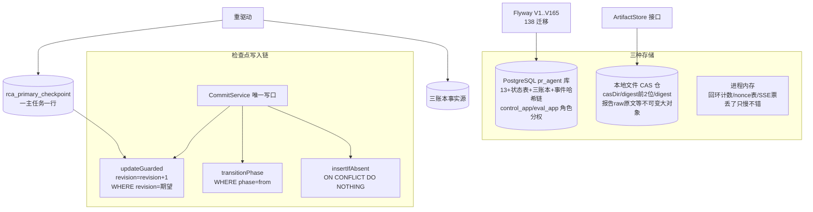

# 13-Checkpoint与持久化

> 本系列第十四篇。前两篇讲过检查点的用法，本篇讲它的**实体与底层**：`rca_primary_checkpoint` 这一行怎么写、CAS 文件仓怎么存、138 个迁移怎么演进——以及"检查点/账本/事件流"三种持久范式的取舍。
> 标注约定同前：【代码事实】/【合理推断】/【设计扩展】/【未确认】。

# 本层要解决的问题

一句话：**让"任意一步崩溃后重驱动从原样续走"成为一个 SQL 语句就能保证的性质——检查点行用 revision CAS 覆盖式推进，事实用账本 append-only 沉淀，大对象用内容寻址仓去重存放。**

# 先看一个交易告警

> 主 Agent 第 7 步刚做完一次 Loki 查询，进程被 kill -9。重启后重驱动这一步时发生了什么：
> 1. 读 `rca_primary_checkpoint` 一行——phase/decisionSeq=8/stepsUsed=6/revision=13，全在；
> 2. 读证据账本——第 7 步的 Loki 证据行已经落了（账本先行）；
> 3. 重新装配信封——确定性重建，stableDigest 与死前一模一样；
> 4. 模型重新出决策，提交时 `UPDATE ... SET revision=revision+1 WHERE revision=13`——如果这期间没有别人动过，顺利推进到 revision 14。
> **崩溃没有产生任何特殊处理路径**——重驱动走的和正常驱动是同一条代码路。这就是检查点+账本+CAS 三件套的意义：恢复不是"另一种模式"，是"同一模式的下一次迭代"。

# 如果没有这一层会怎样

1. **没有检查点行**：重驱动不知道走到第几步，只能从头重查——几十步的调查每次崩溃都全额重烧模型费。
2. **没有 revision CAS**：两个执行者（或旧 worker 复活）同时推进检查点，后写的覆盖先写的——"末写胜出"让租约白设。
3. **没有内容寻址仓**：同一份报告原文被多次重试落多份，存储冗余还是小事，"哪份是权威"才是大事——digest 寻址让"同内容=同文件"成为数学事实。

---

# 代码是怎么做的

## 0. 先给我一句话

持久化 = 三种存储各司其职：**PG 装全部状态**（检查点是其中"覆盖式推进+revision 门"的那一行）、**本地 CAS 文件仓装不可变大对象**（digest 寻址、原子落盘、天然去重）、**进程内存只装丢了不心疼的缓存**。

## 1. 业务上为什么需要这一层

第 12 篇说过"状态即数据库行"；本篇回答的是再往下一层的问题——**那几行状态凭什么可信**：写时不丢（原子 CAS）、并发不乱（revision 门）、大件不重（digest 寻址）、演进不塌（迁移纪律）。

## 2. 它在整个系统的位置



## 3. 输入和输出

- **收到**：携带 CommitFence（runId/taskId/owner/leaseEpoch/configEpoch/expectedRevision）的提交请求（封闭六种 mutation：STEP_COMPLETED/DECISION_ADVANCED/DELEGATION_COMMITTED/FINAL_PROPOSED/ERROR_RECORDED/SUMMARY_CONSUMED）。
- **处理**：锁序 task→run→checkpoint 校验资格 → revision 条件写（影响行数必须 1）→ actionKey 幂等判定（APPLIED/REPLAYED）。
- **产出**：`CheckpointCommitResult{APPLIED|REPLAYED|STALE_OWNER|STALE_REVISION|CONFIG_CHANGED|RUN_TERMINAL, checkpoint}`；大对象另产 CAS 地址（rawRef）。
- **交给谁**：驱动循环（拒绝态立即退出本次驱动）、恢复面（从行重放）、对账面（last_action_key/digest 审计）。

## 4. 真实代码入口

- **检查点写口**：`agent/PrimaryCheckpointCommitService.java`（04/05 篇已详述纪律）；底层 SQL 在 `infrastructure/persistence/PostgresPrimaryCheckpointRepository.java`（257 行）：
  - `upsert`（:37-81）：全量落账 `ON CONFLICT (task_id) DO UPDATE`——"task_id 主键=一主任务一检查点"；
  - `insertIfAbsent`（:84-107）：`ON CONFLICT DO NOTHING`——"单语句幂等（不存在才插）：竞态下缺席者胜，不走'读后写'窗口"；
  - **`updateGuarded`**（:140+）：`SET ..., revision = revision + 1, last_action_key = :actionKey, last_action_digest = :actionDigest WHERE task_id = :taskId AND revision = :expectedRevision`——**推进与修订门与动作身份三合一的条件写**；
  - `transitionPhase`：`WHERE ... AND phase = :from`——相位 CAS 单语句自含（javadoc :17-18）。
- **CAS 文件仓**：`infrastructure/cas/LocalCasArtifactStore.java`（88 行，实现 `domain/port/ArtifactStore`）：
  - 路径 `<casDir>/<digest前2位>/<digest>`（:85-87）；
  - `putIfAbsent`：存在即返回（"内容寻址：同 digest 即同内容，幂等"）→ 同目录临时文件 + `ATOMIC_MOVE`（"写放大避免半截文件：先写临时文件再原子 rename"，:18）→ 落成 444 权限（"CAS 文件不可变且跨容器共享……摘掉含 owner 在内的所有写位"，:49-52；非 POSIX 平台跳过）；
  - 目录走配置 `app.artifact.cas-dir`（默认 ./var/cas），"代码不写死"（:19）。
- **写放大的两处呼应**：SR §4.3 `persistFinalizableMaterials`（收尾事务**前**独立短事务预提交 raw+结果——"执行完成→finishTask 提交缝隙被杀时，对账可凭持久材料重入收尾"，Orchestrator:528-544）；CAS putIfAbsent 幂等（预提交与收尾同材料再写 0 行无害）。

## 5. 核心对象

| 对象 | 是什么 | 关键纪律 | 锚 |
|---|---|---|---|
| `rca_primary_checkpoint` 行 | 主任务全部推进状态（覆盖式当前态） | 一任务一行；revision 门；last_action_key/digest 留最近动作身份（"仅覆盖最近一动作；更早的陈旧重放由 revision 栅栏拦截"） | CommitService:32-35;Repository:156-157 |
| 三账本（工具/模型/事件） | append 事实源（隐式检查点） | PENDING 先行→终态 CAS；事件带哈希链 | 10 篇 |
| CAS 文件仓 | 不可变大对象（报告 raw 原文等） | digest 寻址幂等+原子 rename+只读权限 | LocalCasArtifactStore 全文 |
| Flyway 迁移（V1..V165，138 个） | schema 演进史 | 命名即主题（V47 r7x4_primary_state/V91 working_memory/V92 context_summary…）；**V4__m2_checkpoint_repair 佐证检查点概念自 M2 就存在且有修复迁移** | db/migration/ |
| 库角色分权 | control_app / eval_app | 评测面与业务面写权隔离（V2/V45/V93/V106/V157 持续演进） | 00 篇第 14 节 |

## 6. 一条真实调用链（一次检查点提交的完整 SQL 视角）

```
BoundedLlmRoleRunner.advanceStep
→ 构造 CommitFence(runId, taskId, owner, leaseEpoch, configEpoch, expectedRevision)
→ commits.commitStep(fence, actionKey, snapshotDigest, lastError, memory候选)
   事务内（CommitService :22-27 javadoc）：
   ① tasks.findByIdForUpdate（锁 task——所有权与状态资格）
   ② runs.findByIdForUpdate（锁 run——活跃性资格）
   ③ checkpoints.findByTaskForUpdate（锁检查点行）
   ④ actionKey 幂等查：last_action_key 相同且已落结果 → REPLAYED 原样返回
   ⑤ 围栏判定：owner/epoch 不符→STALE_OWNER；run 终态→RUN_TERMINAL；
      configEpoch 漂移→CONFIG_CHANGED（全部以 CommitRejectedException 穿透回滚）
   ⑥ updateGuarded：UPDATE ... SET 全字段, revision=revision+1,
      last_action_key=..., WHERE task_id=? AND revision=:expected
      → 影响行数≠1 → STALE_REVISION（谁先到谁推进成功）
   ⑦ 记忆候选同事务 append（CL-03："模型未执行不落记忆"的提交半区）
```

## 7. 状态机

检查点行自身是"被 CAS 保护的状态机载体"（phase 两态+计数器），无独立状态机；本篇真正的"状态机"是**持久化机制的选型矩阵**：

| 范式 | 本项目用法 | 为什么不是另两种 |
|---|---|---|
| **当前态检查点**（覆盖式+revision 门） | `rca_primary_checkpoint` | 相比事件溯源：重驱动读一行即可，无需重放全部事件（分钟级调查重放太贵） |
| **append 账本**（事实沉淀） | 三账本+事件链+working_memory/摘要 | 相比当前态：事实不可篡改可审计；账本同时是 EX-A3 四阶段恢复的"事实源"（"账本=P1-03 持久事实源"） |
| **内容寻址仓**（digest 去重） | CAS 文件仓 | 相比普通文件：同内容天然幂等、可完整性校验、可整体迁移（相对路径标识） |
| 事件溯源（完整重放） | ❌ 不做 | 事件账本是审计/评测面，不是恢复源——恢复读当前态行+账本 PENDING 悬挂，不重放事件 |

## 8. 正常业务流程（一次"执行→持久"的写盘点）

每一步调查的持久化写入清单【代码事实】：

| 写入 | 时机 | 形态 |
|---|---|---|
| 工具账本 open(PENDING) | 调用前 | 先行 |
| 证据行 append | 结果入库 | append |
| 工具账本 succeed/fail CAS | 结果落定 | 终态 |
| 模型账本 PENDING→终态 | 模型调用前后 | 先行+结算（usage 实扣） |
| 检查点 updateGuarded | 步末 | 覆盖式 CAS（revision+1） |
| 记忆候选 append | 步末同事务 | append |
| 事件 append（哈希链） | 关键决策点 | append |
| raw 原文 putIfAbsent | 报告材料（预提交+收尾两次写，幂等） | CAS 寻址 |

## 9. 异常流程

| 异常 | 处理了吗 | 怎么处理 |
|---|---|---|
| updateGuarded 影响行数 0 | ✅ | STALE_REVISION——"调用者立即退出本次驱动，不再末写胜出" |
| 预提交与收尾重复写同一材料 | ✅ 幂等 | finishTerminal 只迁移 STARTED 行；putIfAbsent 同 digest 直接返回 |
| CAS 落盘失败 | ✅ | "失败不阻断——digest 已在行上可对账"（Orchestrator:552-558）；文件缺=PAYLOAD_UNAVAILABLE 显式可见 |
| 半截文件 | ✅ 结构上不可能 | 临时文件+ATOMIC_MOVE（不支持原子 rename 的文件系统退化为普通 move 且 target 不存在才发生，:44-48） |
| 跨容器读权限 | ✅ | 444 权限位设计（"publisher 以不同 uid 只读挂载同一卷"） |
| 迁移执行到一半崩溃 | ✅ | Flyway 事务性+版本表；WorkerSchemaFreshnessGuard（评测 worker"镜像迁移面落后于 DB flyway 最大版本则不领取"，20 篇） |
| 检查点行缺失 | ✅ fail-closed | drive 第①步 orElseThrow("主任务检查点缺失")——不猜初始态 |
| eval 侧误写业务表 | ✅ | 库角色分权：eval_app 写面白名单（V45/V93/V106/V157 持续补授权的授权面） |

## 10. 并发问题

指向 10 篇。本篇视角的增量：**检查点是全系统并发竞争最激烈的单一行**（owner 复活/重驱动/压缩消费/摘要消费都可能碰它），所以它拥有最厚的防御：锁序（task→run→checkpoint）+四元围栏+revision 条件写+actionKey 幂等+last_action_key 审计槽——**一行数据五层防护，因为它是"恢复的根"**。

## 11. 崩溃恢复（本篇是"恢复三问"的存储层答案）

- **保存了什么？** 检查点行（当前态）+三账本（过程事实）+V90 输入存档（模型看到了什么）+CAS 原文（产出原件）。
- **从哪继续？** 重驱动读检查点→账本判悬挂→四阶段分诊（EX-A3）→同路径续走。
- **会不会重做已做的？** 检查点之后的会重做；账本 digest 复用让重做不重复花钱不重复落账；actionKey REPLAYED 让重提交不重复推进。
- **"检查点为什么不能单独完成崩溃恢复"**（第二十部分高频题）——本项目的标准答案：检查点只回答"**从哪继续**"；谁有权继续靠**租约+epoch 栅栏**（旧执行者的检查点提交会被 STALE_OWNER 拒）；重做是否有副作用靠**幂等键+digest**；这次失败要不要再试靠**Retry 语义（RETRY_WAIT/退避）**。四者缺一：缺检查点=不知从哪续，缺租约=两人同时续，缺幂等=续出双份，缺重试=一崩就死。

## 12. 安全

- **存储分层即数据分级**：脱敏原文进 CAS（"内容寻址以脱敏文本自身 digest"，Orchestrator:424-425——先脱敏后寻址）；CAS 文件 444 只读（防篡改的物理形态）；库内角色分权（eval_app 碰不到业务写面）。
- **完整性**：事件哈希链（V112）+ 证据行 payload_digest + 快照成员身份校验（NativeRcaAgent "缺成员/身份不符=显式失败"）——**落库的数据自带可验证性**。
- **为什么不能只在 Prompt 里说"记住进度"？** 进度是 CommitService 的 SQL 事务决定的——模型的"记忆"（检查点）每次写入都要过 owner/epoch/revision 三重身份验证；Prompt 连检查点表的名字都不知道。

## 13. Agent Harness

检查点机制 100% Harness【代码事实】："主 Runner 无状态单步驱动，全部推进状态在检查点"——模型没有"保存进度"的能力，也没有"读进度"的能力（读到的永远是从检查点装配的信封）。Harness 用检查点强制保证的：崩溃连续性、并发唯一推进、动作身份单调、恢复语义（RD09）。**模型是检查点上跑动的执行者，不是检查点的所有者。**

## 14. 可观测性

- 检查点行自带审计槽：last_action_key/last_action_digest（"仅覆盖最近一动作"）——最后一次提交的身份可查；
- rca_model_call.input_snapshot_digest（stableDigest 回填）——每步模型输入的指纹链；
- rca_compaction_attempt 台账"终态封闭不删行"——连失败的压缩都留档；
- Flyway 版本表+WorkerSchemaFreshnessGuard——schema 演进本身被监控（旧镜像抢跑新 schema 会被自拒）。

## 15. 性能和成本

- **每步持久化成本**：检查点 1 次条件写+账本 2~3 次（工具/模型）+事件按需——全部单行操作；
- **CAS 去重收益**：重试/预提交/收尾多路径写同一材料，物理上只存一份；
- **PG 承压点**：检查点行是热点行（每步一写）——单调查串行写，无竞争；跨调查无共享行；
- **QPS×10**【合理推断】：存储层与调查数线性，PG 分区（V28）+归档（V29）承接时间维增长；检查点行不存在跨调查竞争。

## 16. 设计取舍

**① 为什么检查点是"覆盖式当前态"而不是事件重放？**
重放的成本与调查长度成正比（几十步×每步大 JSON），且事件里的易变面（反馈）让重放结果不可信。当前态一行读+账本悬挂判定的恢复路径是 O(1) 的。代价：当前态是"结论"不是"过程"——过程审计由账本/事件链补（两套并行，各司其职）。

**② 为什么大对象放文件不放 PG bytea？**
代码事实给出了规模与共享两个动机：CAS 目录"跨容器共享（publisher 以不同 uid 只读挂载同一卷）"（:49-50）——文件卷可以只读挂给发布面；PG 存大 bytea 会放大备份/复制成本。代价：文件系统的可靠性弱于 PG（无事务）——所以用"临时文件+原子 rename+digest 可校验"补足，且 CAS 缺失的降级是显式错误（PAYLOAD_UNAVAILABLE）而不是静默。

**③ 当前方案最大的边界？**
- 单机本地 CAS：CAS 目录是本机盘——多实例部署需要共享卷或对象存储改造（代码注释已预留"跨容器共享"语义，实际部署形态【未确认】）；
- 检查点行宽（含 finalClaims jsonb）——FINAL 提案大时会撑宽行（有界由协议限，实际规模【未确认】）；
- 138 个迁移的演进债：跨 8+ 个主题前缀（am/r7/cl/pa/pb/ev/dr…），考古成本高——本系列文档就是考古成果。

## 17. 面试背诵卡

【30 秒主答】
"持久化三种存储各司其职：PG 装全部状态，本地 CAS 文件仓装不可变大对象，进程内存只装丢了不心疼的缓存。核心是检查点那一行——一主任务一行，唯一写口是提交围栏服务：先按 task 到 run 到检查点的锁序校验资格，再用 revision 条件写推进，SET revision=revision+1 WHERE revision=期望值，影响行数不为 1 就是过期写，调用者立即退出。围栏四元组是 owner、租约 epoch、配置 epoch、期望 revision——旧执行者、配置漂移、run 终态全部被拒。大对象用内容寻址仓：digest 当路径，同内容天然幂等，临时文件加原子 rename 保证没有半截文件。所以崩溃恢复不需要任何特殊路径——重驱动读一行检查点、查账本悬挂、走和正常执行完全相同的代码。"

## 18. 这一层哪些话不能做/不能说

1. ❌ "我们用了事件溯源" → ✅ 事件账本是审计面，恢复读当前态行——明确说不做完整重放。
2. ❌ "检查点存在内存里定期刷盘" → ✅ 每次推进就是一次事务内条件写，无刷盘窗口。
3. ❌ "CAS 仓在对象存储上" → ✅ 本地文件系统（跨容器共享语义已预留，部署形态未确认）。
4. ❌ "崩溃后走特殊的恢复流程" → ✅ 恢复=重驱动同一条代码路，无特殊路径。
5. 不要说"检查点每步全量序列化很重"——行宽有界（协议限 finalClaims），热点是串行单行。
6. 生产 CAS 目录实际挂载方式/行宽实际分布【未确认】。

---

# 我现在应该能回答什么

1. 检查点行的物理结构？谁能写？怎么防并发写坏？（→ 第 4/6 节：一任务一行+五层防护）
2. 三种存储各装什么？为什么这么分？（→ 第 0/7 节选型矩阵）
3. "预提交"是什么？防哪个崩溃缝隙？（→ SR §4.3 persistFinalizableMaterials）
4. CAS 文件仓怎么保证没有半截文件、怎么去重？（→ 临时文件+ATOMIC_MOVE；digest 寻址幂等）
5. 为什么"检查点不能单独完成崩溃恢复"？另外三件是什么？（→ 第 11 节四件套）

# 30 秒背诵卡

见第 17 节。

# 面试官追问卡

**Q1：updateGuarded 里 revision=revision+1 放在 SET 里，并发两个提交会怎样？**
考什么：CAS 语义的 SQL 级理解。
30 秒答："两个事务同时拿着 expectedRevision=13 提交：PG 行锁让它们串行——第一个提交命中 WHERE revision=13，推进到 14；第二个再执行时行里已是 14，WHERE 不命中，影响 0 行，调用方拿 STALE_REVISION 立即退出。'revision=revision+1'在 SET 里是原子自增，不存在读改写窗口——窗口被'条件谓词+行锁'关死了。"
继续追问 1："那 REPLAYED 判定呢？两个相同 actionKey？"——答："先查 last_action_key：相同动作且已落结果→REPLAYED 返回当前检查点原样，根本不走条件写；不同结果的相同动作记一致性错误仍按 REPLAYED 收敛——'不覆盖既成结果'。"

**Q2：CAS 文件仓的"同 digest 即同内容"，如果 digest 碰撞怎么办？**
考什么：概率论证与工程态度。
30 秒答："sha256 碰撞概率在宇宙尺度下可忽略——这是内容寻址的标准论证。工程上真正的威胁不是碰撞是'实现错误'：比如规范化算法变了导致同内容算出不同 digest（已防：canonicalizationVersion 焊进动作摘要），或不同内容算出同 digest（规范化 bug）。后者的兜底是可校验性：文件内容可以重新 hash 对账，发现不一致即数据事故显式暴露。所以问题不是'碰撞怎么办'而是'校验机制在不在'——在。"
继续追问 1："文件被手动改了？"——答："digest 对不上即失效，消费面按 PAYLOAD_UNAVAILABLE 显式失败——不可变存储+可验证内容，篡改会自曝。"

**Q3：预提交（persistFinalizableMaterials）和收尾事务里写同一材料，两次写怎么不打架？**
考什么：幂等写的判等细节。
30 秒答："三重判等：raw 原文走 putIfAbsent——同 digest 第二次写直接返回既有地址，物理只有一份；InvestigationResult 的 finishTerminal 只迁移 STARTED 行——第二次到达时行已终态，CAS 0 行无害；tool_calls 是 insertAll，账本幂等键挡重复。注释原话：'幂等：finishTerminal 仅 STARTED 行迁移，收尾事务内同材料再写 0 行无害'。预提交存在的意义就是'执行完成到收尾提交'的缝隙被杀时，恢复面有材料可重入收尾（铸 REPORT_FINALIZE）。"
继续追问 1："预提交失败呢？"——答："不阻断正常收尾——'失败不阻断，finishTask 同材料再写'（RcaWorker:456-459）：预提交是加速恢复的优化，不是正确性的依赖。"

**Q4：138 个迁移，你们怎么防止两个分支的迁移冲突（同版本号）？**
考什么：演进治理。
30 秒答："Flyway 的版本号唯一性由版本表兜底——冲突迁移会让应用启动失败（fail-fast），这本身是防线。工程纪律上从迁移命名能看到主题分区（am1~am7/r7/cl/pa/ev/dr/me…对应里程碑），大改动单开版本段。诚实地说，并行分支的同号冲突靠的是流程（合入前 rebase）而非工具——Flyway 只保证冲突不可能静默。"
继续追问 1："迁移能改已发布的吗？"——答："不能——Flyway checksum 校验，改了已应用迁移启动即报错。演进只加不改，v2 语义（如状态扩容）用新迁移 ALTER 加 CHECK（V12 同步 DB 约束的先例）。"

**Q5：如果让你重新设计持久化层会改什么？**【设计扩展——设计题答案，不要说成现网实现】
考什么：REDO。
30 秒答："两处：一是 CAS 换对象存储（S3 语义）+本地缓存——把'跨容器共享'从卷挂载升级为原生，同时保留 digest 寻址与 putIfAbsent 语义不变；二是检查点宽行拆分——finalClaims 大时拆子表，主行保持窄而热。五层防护的检查点、三账本事实源、内容寻址幂等这三个设计我不会动——它们让'恢复=同一路径的下一次迭代'成立，这个性质值得用一切复杂度换。"

# 这层不要乱说什么

1. 不要说"事件溯源架构"——事件账本存在但不做恢复重放。
2. 不要说"定期快照/刷盘"——检查点是同步事务内条件写。
3. 不要说"分布式文件存储"——本地 CAS，共享语义预留、部署形态未确认。
4. 不要说"检查点由 Agent 维护"——模型对检查点零感知，写口唯一。
5. 不要报 V1..V165 之外的迁移数字或表名——138 个文件已清点（00 篇），引用具名迁移（V47/V90/V91/V92/V102/V112/V122…）时给主题。
6. 生产 CAS 挂载/检查点行宽实际值【未确认】。

# 5 句话总结

1. **为什么需要**：恢复必须 O(1) 且与正常执行同路径——所以推进状态要覆盖式落行，过程事实要 append 落账，大对象要寻址落仓。
2. **核心机制**：检查点行的 revision CAS（SET revision=revision+1 WHERE revision=期望）+四元围栏+actionKey 幂等；CAS 仓的 digest 寻址+原子 rename。
3. **上下游协作**：上承驱动循环的每次提交；下对恢复面提供"一行读+账本判定"的 O(1) 续走。
4. **最大风险**：单机 CAS 的部署边界；检查点热行的宽行倾向。
5. **最大取舍**：用"每步 1 次条件写+一次 sha256"换"崩溃恢复零特殊路径"。

---

*本篇完成。下一篇待你指令解锁：《14-崩溃恢复与Worker-Lease》。*
