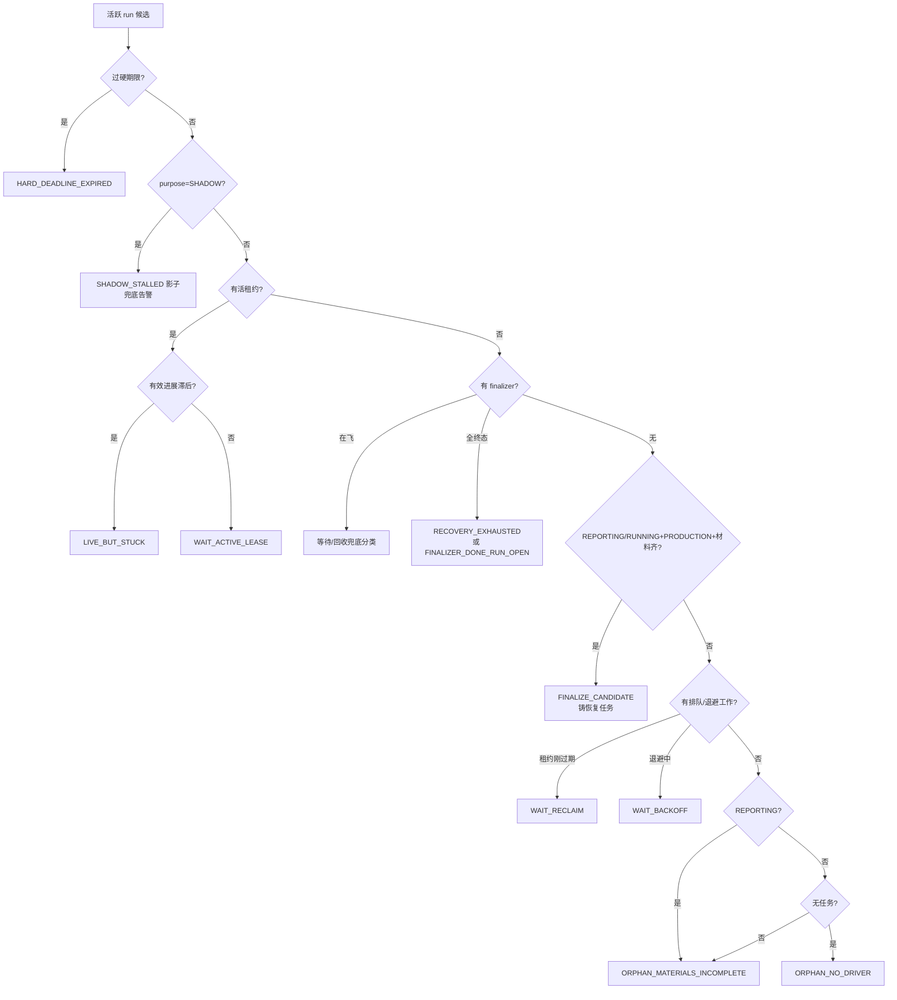

# 14-崩溃恢复与Worker-Lease

> 本系列第十五篇，可靠性深水区收官。把 09/13 篇铺好的地基合拢成完整答案：**进程在任意一点被 kill -9 之后，谁在多久之内、凭什么证据、把系统恢复到什么状态。**
> 标注约定同前：【代码事实】/【合理推断】/【设计扩展】/【未确认】。

# 本层要解决的问题

一句话：**崩溃恢复由两套互补的循环完成——Worker 的快回收（每拍扫描过期租约+悬挂账本）和 RunReconciler 的慢看门狗（按决策表对每个活跃 run 分类：等/收/杀/交人）——恢复的本质是"让带身份的中间态被具名的收敛者接管"。**

# 先看一个交易告警

> 调查进行到第 9 分钟，执行 worker 被运维误杀。之后 30 分钟系统发生的事：
> **T+租约到期**：worker 循环的 `recoverExpired` 扫到这个 LEASED 任务租约过期 → 四条件原子回收 → RETRY_WAIT（退避 1 分钟）→ 任何一台 worker 重领（epoch+1）→ 调查从检查点续走。**90% 的崩溃到此为止，用户无感。**
> 如果崩溃的是 REPORTING 阶段的 driver（材料已齐但报告没组完）：快回收管不了它（没有可重领的任务租约），这时慢看门狗 `RunReconciler` 上场——判定 `FINALIZE_CANDIDATE`（"持久材料完整优先重入收尾，不重跑调查"）→ 铸唯一 `REPORT_FINALIZE` 恢复任务 → 只组装既有材料走同一发布赢家事务。
> 如果材料不齐、租约也没了：`ORPHAN_MATERIALS_INCOMPLETE`——**告警人工接管，不猜结果**。
> 如果 worker 还活着但卡死了（心跳在续、却 20 分钟没有任何有效进展）：`LIVE_BUT_STUCK`——"慢不是 stuck，无有效进展才是（LLM 持续吐 token 只算 activity）"（RunReconciler.java:101-103）。

# 如果没有这一层会怎样

1. **只有快回收的世界**：REPORTING 停滞、孤儿 run、租约活但死循环——三种"快回收覆盖不到"的停滞会永久挂死调查，占着 incident 的活跃名额（同 incident 不能开新 run）。
2. **只有看门狗没有快回收**：回收延迟从秒级退化到一个对账周期——所有崩溃都要等"慢法官"，吞吐崩塌。**快慢分离是刻意的：快回收管"确定性过期"，看门狗管"需要判断的停滞"**。
3. **没有灰度模式**：看门狗的第一天就自动杀 run，误报直接损坏生产调查。本项目三模式灰度（ALERT_ONLY→SAFE_RECOVER→AUTO_EXPIRE）——"先只输出分类/预计动作/误报样本，验证误报后再开恢复/自动过期"（RunReconciler.java:65-67）。

---

# 代码是怎么做的

## 0. 先给我一句话

崩溃恢复 = **快回收**（RcaWorker 每拍：双租约过期回收+三账本悬挂标 UNKNOWN）+ **慢看门狗**（RunReconciler 每拍按 11 类决策表给每个活跃 run 分类：等待/重入收尾/硬期限终止/人工接管）+ **三道灰度闸**（模式升级、挂起豁免、可信身份闸）。

## 1. 业务上为什么需要这一层

调查是分钟级外部依赖密集型任务——模型会超时、数据源会抖、进程会被杀、机器会重启。业务要求的不是"永不崩溃"而是"崩溃后：任务不丢、产出不双、有界时间内有人接管、接管不了就诚实地喊人"。

## 2. 它在整个系统的位置

```mermaid
flowchart TB
    subgraph 快回收（每拍·秒级）
        W[RcaWorker.recoverExpired] --> S1[槽位租约回收<br/>reclaimExpired]
        W --> S2[任务租约回收<br/>四条件原子→RETRY_WAIT/STALE]
        W --> S3[三账本悬挂→UNKNOWN<br/>外部调用/调查记录/工具账本]
    end
    subgraph 慢看门狗（每拍·对账周期）
        R[RunReconciler.scanOnce] --> D{11 类决策}
        D -->|WAIT_*| A[等待：调度机制持有]
        D -->|FINALIZE_CANDIDATE| B[铸 REPORT_FINALIZE<br/>只组装既有材料]
        D -->|HARD_DEADLINE_EXPIRED| C[硬期限终止<br/>AUTO_EXPIRE 模式]
        D -->|ORPHAN_*/RECOVERY_EXHAUSTED| E[告警·人工接管]
        D -->|LIVE_BUT_STUCK| F[活但卡死·升级]
    end
    S2 --> RETRY[(RETRY_WAIT 重领队列)]
    B --> PUB[发布赢家事务]
    E --> HUMAN[人工面 AM8]
```

## 3. 输入和输出

- **快回收收到**：时钟拍。**产出**：回收的任务数+UNKNOWN 计数（"三账本 UNKNOWN 合并一次上报"，RcaWorker.java:322-325）。
- **看门狗收到**：活跃 run 的 keyset 批（每 tick 受限批，`findActiveForReconcileAfter`）。**产出**：每 run 一个封闭 Decision + 对应动作（等待/铸恢复任务/终止/告警），配观测 gauge。
- **交给谁**：RETRY_WAIT 任务回队列；REPORT_FINALIZE 交给通用领取面（走 worker 正常驱动+finishTask 同一发布赢家事务）；ORPHAN 交人工面。

## 4. 真实代码入口

- **快回收**：`alert/application/RcaWorker.java:recoverExpired`（:266-287）+ `markHangingInvocationsUnknown`（:289-327）——已详述（09 篇）。
- **慢看门狗**：`alert/application/RunReconciler.java`（854 行）：
  - `scanOnce()`（:287-317）：**双通道**（活跃批+终态清理批，"两通道互不拖死"）；SQL 读失败"游标不推进同页重试"（"SQL 读取失败不得假装推进"，:295-297）；两通道全成功才推 last_success（"连续不增长=看门狗停摆告警面"）；
  - **keyset 公平分页**（WC-4，:337-366）：`(created_at,id)` 游标，每 tick 一批，批内单条失败"越过但游标照推"（"异常条不阻塞后续条，下一完整轮还会再见到它"）；读到尾部游标归零——"覆盖周期 ≈ ceil(N/B)×P，全体必被检查"；
  - **热旋转防护**（:249-251）：固定拍巡逻 sleep——"常驻候选每轮都会'被决策'，按决策数快转=热旋转（195 实证 27k 事件/10min）"——**连日志风暴都是实测调出来的**；
  - `decide()`（:368-410）：决策表实现（见第 7 节）。
- **恢复执行器**：`application/ReportFinalizeExecutor.java`（REPORT_FINALIZE 的执行面："只组装/验证既有持久材料，不隐式 LLM/重查现场，走同一 finishTask 发布赢家/事务"，RcaTask.java:45-49）。
- **租约原语**：`domain/lease/LeaseFence.java` + 四租约家族（10 篇）。

## 5. 核心对象

| 对象 | 是什么 | 关键纪律 | 锚 |
|---|---|---|---|
| Decision（11 类封闭枚举） | 对账结论：WAIT_ACTIVE_LEASE/WAIT_RECLAIM/WAIT_BACKOFF/FINALIZE_CANDIDATE/ORPHAN_MATERIALS_INCOMPLETE/ORPHAN_NO_DRIVER/HARD_DEADLINE_EXPIRED/SHADOW_STALLED/RECOVERY_EXHAUSTED/FINALIZER_DONE_RUN_OPEN/LIVE_BUT_STUCK | 每类有明确动作与灰度归属 | RunReconciler:77-106 |
| Mode（3 模式） | ALERT_ONLY（只分类告警）/SAFE_RECOVER（+恢复收尾铸造）/AUTO_EXPIRE（+硬期限终止） | "模式固定在配置版本"——灰度按配置版本走 | :74 |
| `LIVE_BUT_STUCK` 判据 | 心跳在续但 last_meaningful_progress_at 滞后超阈值 | "心跳=活≠进展；有效进展只由检查点 APPLIED 提交回写"（09 篇引）——**activity 与 progress 两列分离是对抗假活的关键** | :101-106;RcaWorker:413-415 |
| `reconcileDeadlineAt`（可信硬期限） | 铸点冻结的硬期限列（SR §4.1"铸点冻结对账硬期限——重试/重启不重置"） | "旧 Run 无可信 deadline（列 NULL）只警示，不追溯制造过期证据" | :53-55 |
| suspensionGate（PC-C3） | 审批挂起豁免谓词 | "durable suspension 不被对账误杀"——挂起中的 run 豁免终止 | :191-192 |
| REPORT_FINALIZE task | 恢复收尾任务（uq 保唯一） | "不换 key 重铸绕预算"（RECOVERY_EXHAUSTED 纪律） | :93-96 |

## 6. 一条真实调用链（REPORTING 停滞的完整恢复）

```
T0  driver 完成 9 步调查，材料预提交（raw CAS+InvestigationResult 终态行）
    → advance 进入 REPORTING → driver 在组装报告时进程被杀
T0+对账周期 RunReconciler.tick → scanOnce → 活跃批含此 run
→ decide（:368）：
   过硬期限？否 → hasLiveLease？否（driver 死了租约没人续）
   → classifyFinalizer：无 REPORT_FINALIZE 任务 → empty
   → state==REPORTING && purpose==PRODUCTION && materialsComplete？
     是（预提交材料在）→ Decision.FINALIZE_CANDIDATE
→ act（SAFE_RECOVER 以上模式）：铸唯一 REPORT_FINALIZE task（uq 保唯一）
   → 通用领取面被 worker 领取 → ReportFinalizeExecutor
   （"只组装既有材料，不隐式 LLM/不重查现场"）
   → 走同一 finishTask：发布赢家 CAS/通知/处置单——与正常收尾同一条事务路
T0+若 materialComplete 为否 → ORPHAN_MATERIALS_INCOMPLETE → 告警人工
```

## 7. 状态机（决策表本体——本篇的状态机就是判断顺序）

`decide()` 的判定顺序（:373-408，顺序即优先级）【代码事实】：



- **每个状态谁改/条件**：WAIT_* 不改状态（等待是决策不是动作）；FINALIZE_CANDIDATE 在 SAFE_RECOVER+ 铸任务（uq 唯一）；HARD_DEADLINE_EXPIRED 仅 AUTO_EXPIRE 模式执行（RUNNING/REPORTING→EXPIRED、QUEUED→FAILED+QUEUE_DEADLINE——"状态机合法边"）；ORPHAN 只告警。
- **禁令**（javadoc :52-55）："禁止 `UPDATE ... WHERE updated_at < now()-N` 批量过期（updated_at 可能被心跳刷新——单字段既漏报也误杀）"；过期事务"行锁重读复验 purpose/state/活跃集，仅对观察版本仍成立的 run 过期"——**与 finishTask/Cancel/Reconciler 竞争仅一方成功**。
- **存哪**：决策本身不落库（每拍重算），动作落库（铸任务/迁移状态/事件）。

## 8. 正常业务流程（EX-A3 四阶段：driver 重驱时对在途工具调用的分诊）

driver task 崩溃重领后，`NativeInvestigationExecutor` 对每个在途逻辑调用按**工具账本**分诊（javadoc :66-69 + RcaToolInvocationLedger.InvocationRecovery 读面）【代码事实】：

| 账本状态 | 分诊 | 动作 |
|---|---|---|
| ① 已提交（检查点已推进过该步） | 已完成 | 跳过 |
| ② 结果已落库但检查点未推进 | 幂等收尾 | 结果照用，补推进 |
| ③ PENDING（发送后未知） | UNKNOWN+重驱 | 旧调用诚实标 UNKNOWN，**新物理请求重发**（只读安全+digest 复用） |
| ④ FAILED 回执 | 降级 | 子任务/步骤 DEAD 续跑 |

messageId=(childTaskId,attempt) 确定性铸造让委派回执"恢复重驱=重投，恰一次合并"（07 篇）——**恢复面没有任何一处需要"猜"**。

## 9. 异常流程（九种崩溃时机的全景时间线——汇总各篇）

| # | 崩溃点 | 遗留 | 秒级收敛者 | 兜底收敛者 | 篇 |
|---|---|---|---|---|---|
| 1 | webhook 落库后 | 重复 inbox 行 | 事件去重键 | — | 02 |
| 2 | inbox 领取后 | PROCESSING+过期租约 | reclaimExpired→RECEIVED | — | 02 |
| 3 | 投影事务中 | 无（回滚） | 重投 | — | 02 |
| 4 | 任务领取后 | LEASED+过期租约 | recoverExpired→RETRY_WAIT | — | 09 |
| 5 | 工具调用中 | 账本 PENDING | reclaim→UNKNOWN | digest 复用免重打 | 06 |
| 6 | 主循环步进后 | 检查点 revision N | 重驱续走 | actionKey REPLAYED | 05 |
| 7 | 委派裁决中 | 无（单事务） | gap 唯一兜底重投 | — | 07 |
| 8 | 材料齐未收尾（REPORTING） | run 停滞 | — | 看门狗 FINALIZE_CANDIDATE | 本篇 |
| 9 | 材料不齐+无租约 | 孤儿 run | — | 看门狗 ORPHAN→人工 | 本篇 |

## 10. 并发问题

1. **看门狗 vs finishTask vs Cancel 竞争同一 run？** "过期事务行锁重读复验……仅一方成功"（:51-52）——三方共用行锁+状态机合法边，天然串行化。
2. **两台 worker 同时回收同一任务？** 四条件原子回收（含 lease_until<now 复核+epoch 匹配）——一人成功，另一人 0 行"不计数零补救"。
3. **恢复任务与原 driver 双跑？** REPORT_FINALIZE 走通用领取面而 driver 已死（否则 WAIT_ACTIVE_LEASE 先行截走）；且 FINALIZE 只组装材料不重查，双跑面为空。
4. **看门狗与挂起面竞争？** suspensionGate 豁免——"durable suspension 不被对账误杀"。

## 11. 崩溃恢复（本篇即主题——给一张"演练卡"）

面试可直接背的**五分钟演练脚本**（kill -9 时刻 → 恢复动作 → 依据）：
1. **webhook 后杀**：AM 重发→去重键→只多一行计数（02）。
2. **领取后杀**：租约到期→RETRY_WAIT→重领 epoch+1（09）。
3. **工具调用中杀**：PENDING→UNKNOWN→重驱 digest 复用（06/本篇）。
4. **步进提交后杀**：检查点 revision N→同路径续走→REPLAYED 防重推（05/13）。
5. **模型调用中杀**：账本 PENDING→RcaModelCallLedger 悬挂分诊（"发送后未知=UNKNOWN+新物理请求"）。
6. **REPORTING 中杀**：看门狗 FINALIZE_CANDIDATE→REPORT_FINALIZE 只组装（本篇）。
7. **活但卡死**：LIVE_BUT_STUCK（progress 滞后）→升级终止（本篇）。
8. **硬期限到**：AUTO_EXPIRE 灰度闸后终止（本篇）。
9. **全都不凑效**：ORPHAN/RECOVERY_EXHAUSTED→诚实告警交人（本篇）。
**四件套最终对位**：Checkpoint=从哪续（13）、Lease=谁有权续（09）、Retry=这次失败再试（09）、Idempotency=续了不重复（10）——**四个机制缺一不可，合起来才叫崩溃恢复**。

## 12. 安全

- **身份闸**：FINALIZE_CANDIDATE 仅对"可信 PRODUCTION"生效——"LEGACY_UNKNOWN 历史行不自动产正式报告"（:393-395）；影子 run 恢复"不发正式报告"（决策表行 8）——**恢复面也分身份**。
- **灰度即安全**：三模式让最危险的自动终止（AUTO_EXPIRE）在误报验证后才开启；挂起豁免防"审批中 run 被对账误杀"。
- **为什么不能只在 Prompt 里告诉模型"崩溃前记得保存"？** 模型控制不了进程死亡，也参与不了恢复——恢复全程由快回收+看门狗两套确定性循环执行，模型唯一相关的是它留下的检查点质量（那是 13 篇的事）。

## 13. Agent Harness

本层 100% Harness。与模型的关键接口是 **LIVE_BUT_STUCK 的 progress 信号**：模型每完成一步（检查点 APPLIED 提交）才推进"有效进展"时间戳——心跳（活着）与进展（干成活）被刻意分成两列。**Harness 用这个分离把"模型声称在干活"和"系统确认有产出"分开计量——这是对模型行为唯一诚实的观测方式。**

## 14. 可观测性

- 对账决策全部有数：metrics.reconcileScan（通道/成功/时长）、决策计数、`oldestActiveCreatedAt`（最老活跃 run 年龄 gauge）、`countOpenTasksUnderTerminalRuns`（终态 run 下未了断任务数）——**"假造 0 比缺数更危险"：读失败保持上一拍值**（:319-334）；
- 看门狗停摆告警面：last_success 连续不增长（:311-314）——**看门狗自己也被监控**（谁来监督监督者的问题）；
- 每条 ORPHAN/EXPIRED/STALE 决策落结构化事件+告警样本（ALERT_ONLY 模式的输出即误报训练集）。

## 15. 性能和成本

- **快回收成本**：每拍两三个查询（过期任务/槽/悬挂账本）——秒级延迟、常数开销。
- **看门狗成本**：每 tick 受限批（batchLimit）+两个 gauge 查询；覆盖周期=⌈N/B⌉×P——大 N 下全体覆盖靠多 tick，单 tick 不霸占线程。
- **恢复的金钱成本**：崩溃重做=从检查点续（步级）或 REPORT_FINALIZE（零模型）——最坏情况是 step 级重跑，不是任务级。
- **QPS×10**【合理推断】：崩溃率不变则恢复面负载不变；真正变化的是活跃 run 总量→看门狗覆盖周期拉长→**batchLimit/轮询周期是看门狗的容量旋钮**。

## 16. 设计取舍

**① 为什么快慢两套循环，不合并成一个？**
职责时效不同：租约过期是确定性事实（秒级回收安全），停滞判断是需要阈值与灰度的启发式（分钟级慎重执行）。合并的话要么把启发式跑得太频繁（误判率×频率=事故），要么把确定性回收拖慢（任务滞留）。**分频是按"决策的可逆性"分频**：回收可逆（重领即可），终止不可逆（EXPIRED 是终态）——越不可逆越慢越慎重。

**② 为什么 LIVE_BUT_STUCK 要区分 activity 和 progress？**
LLM 流式输出期间心跳正常（进程活着、连接活着），但可能已在同一步空转很久。只看心跳会把"活死循环"当健康；只看进展会把"一次很慢的模型调用"误杀。两列分离+阈值判定让"慢"与"卡"可区分——注释原话给出了判定哲学："慢不是 stuck，无有效进展才是"。

**③ 当前方案最大的边界？**
- RECOVERY_EXHAUSTED/FINALIZER_DONE_RUN_OPEN/ORPHAN 族全部依赖人工——无人值守场景下这些 run 会一直挂着（显式设计：不猜）；
- LIVE_BUT_STUCK 的阈值是配置（NULL=关闭）——阈值不当会误杀慢调查或漏检真卡死；
- 覆盖周期随活跃 run 数线性拉长（容量旋钮需人工盯 gauge）。

## 17. 面试背诵卡

【30 秒主答】
"崩溃恢复是快慢两套循环。快回收每拍跑：任务租约和槽位租约双回收，四个条件的原子 UPDATE 防竞态，三本账本的悬挂记录诚实标 UNKNOWN。慢看门狗按决策表对每个活跃 run 分类，一共十一类决策：有活租约再看有效进展——心跳在续但没有检查点进展就是活但卡死；租约没了就分诊，材料齐的铸唯一的恢复收尾任务只组装不重查，材料不齐的告警交人工；过硬期限的走 AUTO_EXPIRE 灰度闸终止。关键纪律有三条：恢复任务和正常收尾走同一条发布赢家事务；禁止按 updated_at 批量过期因为会被心跳刷新；最危险的自动终止放在最后一级灰度。四个词合起来才叫恢复：检查点管从哪续、租约管谁续、重试管再试、幂等管不重复。"

## 18. 这一层哪些话不能说

1. ❌ "系统会自动恢复一切故障" → ✅ ORPHAN/RECOVERY_EXHAUSTED 族显式交人工——"不猜结果"是设计。
2. ❌ "看门狗会杀掉卡住的任务" → ✅ 终止只在 AUTO_EXPIRE 灰度档开启；LIVE_BUT_STUCK 阈值可配可关。
3. ❌ "恢复靠重放事件日志" → ✅ 恢复读当前态行+账本悬挂，事件链是审计面（13 篇）。
4. ❌ "心跳正常就说明健康" → ✅ activity≠progress，LIVE_BUT_STUCK 就是为此设计的。
5. ❌ "租约过期立即回收" → ✅ 回收在下一次扫描拍（秒级），且四条件复核防误收。
6. batchLimit/pollInterval/stuckThreshold 的生产值【未确认】——代码默认与配置键可查，实值以 compose 为准。

---

# 我现在应该能回答什么

1. 快回收和慢看门狗各管什么？为什么分频？（→ 第 16 节取舍①：按可逆性分频）
2. REPORTING 阶段 driver 死了怎么恢复？（→ 第 6 节：FINALIZE_CANDIDATE→REPORT_FINALIZE 只组装）
3. 怎么发现"活着但卡死"的 worker？（→ activity/progress 两列分离+阈值）
4. 为什么禁止按 updated_at 批量过期？（→ 心跳刷新单字段"既漏报也误杀"）
5. 崩溃恢复四件套各解决什么？（→ 第 11 节演练卡结尾对位）

# 30 秒背诵卡

见第 17 节。

# 面试官追问卡

**Q1：FINALIZE_CANDIDATE 铸的恢复任务和正常 driver 有什么不同？为什么不能重跑调查？**
考什么：恢复语义的最小化。
30 秒答："三个不同：task_key=REPORT_FINALIZE 走独立分派（不进引擎）；执行器只组装验证既有持久材料——'不隐式 LLM、不重查现场'；身份闸只对可信 PRODUCTION 生效。不能重跑调查的原因是幂等与成本：材料已预提交（raw CAS+终态行），重跑=第二次全额模型费+可能产出与已收窄窗口不一致的新结论。恢复的哲学是'结算已发生的事实'，不是'重演历史'。"
继续追问 1："材料不齐又不重跑，那这单就死了吗？"——答："走 ORPHAN_MATERIALS_INCOMPLETE 告警人工——人工可以选择重新触发调查（新 run 新代际），但那是人的决策不是系统的猜测。"

**Q2：RECOVERY_EXHAUSTED 为什么"不换 key 重铸绕预算"？**
考什么：预算纪律的完整性。
30 秒答："finalizer 全终态意味着恢复预算已耗尽——此刻换一个新 task_key 再铸一次，预算闸就形同虚设：任何'耗尽'都能靠改名绕过。注释原话'不再退避、不换 key 重铸绕预算'。这是预算系统的完整性原则：**预算约束必须绑定语义身份而不是名字**——和委派 gap 唯一、告警去重键是同一个思想：改名不能洗白历史。"
继续追问 1："那真需要再试怎么办？"——答："人工显式决策（重试入口/新 run）——人工动作天然带审计，绕预算的代价从'悄悄发生'变成'留下记录'。"

**Q3：看门狗自己挂了怎么办？**
考什么：监督者的监督。
30 秒答："三层：一是扫描失败'外部可发现'——错误日志+不能无声死亡（SR12 注释）；二是 last_success 时间戳——两通道整轮全成功才推进，'连续不增长=看门狗停摆告警面'，外部指标直接可告；三是 gauge 读失败保持上一拍值——'假造 0 比缺数更危险'，宁要陈旧真值不要新鲜假值。看门狗是普通虚拟线程，死了不影响 worker 快回收——快慢分离的另一个收益：监督层故障不破坏基础回收。"
继续追问 1："worker 快回收也挂了呢？"——答："多实例部署下其他实例的循环继续跑（回收逻辑无状态、按租约事实行事）；全实例同时挂=PG 里的中间态等着，重启后第一拍 recoverExpired 全部接管——状态的持久性让'恢复面暂缺'只是延迟不是损失。"

**Q4：LIVE_BUT_STUCK 阈值怎么定？误杀一个慢调查的代价是什么？**
考什么：启发式参数的治理。
30 秒答："判据结构是'last_meaningful_progress_at 滞后超过 stuckThreshold'——进展由检查点 APPLIED 提交回写，所以阈值本质是'一步合法最长耗时'的估计。定值要覆盖最慢的合法步（大上下文模型调用+慢数据源），注释说 NULL=检测关闭——这是显式的保守开关。误杀代价：一个慢调查被终态化，事件与样本留档可分析；漏检代价：一个死循环占着 incident 活跃名额无限烧预算。两害相权：阈值宁可从宽，配合 ALERT_ONLY 先观察误报——这正是三模式灰度存在的意义。"
继续追问 1："为什么不用 CPU/内存判断卡死？"——答："LLM 工作负载'活着'的表征是等待 IO 而非吃 CPU——资源指标在等模型返回时看起来和卡死一模一样。唯一可信的卡死信号是业务进展列。"

**Q5：AUTO_EXPIRE 终止一个 run，它消耗的预算和产出怎么办？**
考什么：终止的结算语义。
30 秒答："终止是状态迁移（RUNNING/REPORTING→EXPIRED，QUEUED→FAILED+QUEUE_DEADLINE——'状态机合法边'），不是抹除：已产出的证据、材料、账本全部在案；usage 已由模型账本实扣；EXPIRED 属于 run 的终态族，对账面把它当'诚实终局'而不是异常。同时硬期限判定只认'铸点冻结的可信 deadline 列'——'旧 Run 无可信 deadline 只警示，不追溯制造过期证据'。终止的每一步都有审计，代价可见。"
继续追问 1："QUEUED 就被终止的 run 算失败吗？"——答："算 FAILED+QUEUE_DEADLINE 原因码——'排队排到硬期限'是诚实的失败原因，和执行失败区分开，这又回到 12 篇：中间态/终态的原因命名是对账的地基。"

**Q6：如果让你重新设计恢复面会改什么？**【设计扩展——设计题答案，不要说成现网实现】
考什么：REDO。
30 秒答："三处：一是给 ORPHAN/EXHAUSTED 加'升级时效'——现在交人工后无限等待，我会加 N 个对账周期无人处理则自动降级为 EXPIRED 并保留完整现场，让'人工兜底'也有终态；二是 LIVE_BUT_STUCK 的阈值从全局常量改成按角色/引擎分档（REPORT_FINALIZE 的合法耗时和主调查差一个量级）；三是把快回收的下沉为 PG 函数+pg_cron（省掉应用侧扫描拍）——但要保留应用层决策日志。快慢分频、决策表、灰度三模式、四件套分工，这四样是骨架，重做也原样。"

# 这层不要乱说什么

1. 不要说"自动故障自愈"——恢复面把"不可判定的"显式交人工，自愈只覆盖可判定子集。
2. 不要说"租约一过期立刻回收"——回收周期=扫描拍频率，秒级而非瞬时。
3. 不要说"重放日志恢复"——读当前态+账本判定，无重放。
4. 不要把 LIVE_BUT_STUCK 说成"超时"——它是"活但无进展"，与硬期限（HARD_DEADLINE_EXPIRED）是两类决策。
5. 不要说"影子 run 崩了会自动重发报告"——影子恢复不发正式报告（决策表行 8 原文）。
6. 阈值/批大小/轮询的生产实值【未确认】。

# 5 句话总结

1. **为什么需要**：崩溃不可避免，业务要求的是"任务不丢、产出不双、有界接管、接管不了诚实喊人"。
2. **核心机制**：快回收（双租约+三账本 UNKNOWN）+慢看门狗（11 类决策表+三灰度模式+keyset 公平分页）+EX-A3 四阶段分诊。
3. **上下游协作**：上承 12 篇的中间态清单；下接队列重领/REPORT_FINALIZE/人工面；自身被 last_success/gauge 监控。
4. **最大风险**：人工兜底项无升级时效；LIVE_BUT_STUCK 阈值治理；覆盖周期随活跃量线性拉长。
5. **最大取舍**：用"秒级确定性回收+分钟级慎重启发式"的分频，换"可逆的快、不可逆的慢且可灰度"。

---

*本篇完成。下一篇待你指令解锁：《15-异常-超时-重试与降级》。*
