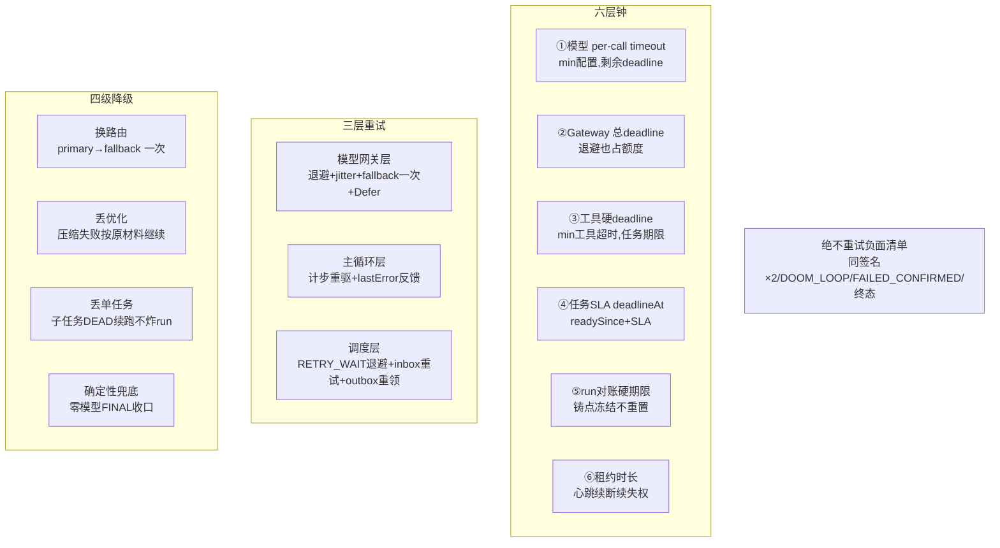

# 15-异常-超时-重试与降级

> 本系列第十六篇，异常处理横向总纲。前面各篇在自己的层里讲过异常，本篇把**超时、重试、降级**三张清单收拢：系统里有哪些钟、哪些重试、哪些降级——以及"什么绝不重试"的负面清单。
> 标注约定同前：【代码事实】/【合理推断】/【设计扩展】/【未确认】。

# 本层要解决的问题

一句话：**给每一类失败预配好"三选一"的处置——可重试的按层重试（模型退避/计步重驱/任务重排）、该降级的按级降级（换路由/丢优化/单任务降级）、不可救的诚实终态（同签名熔断/预算耗尽/DOOM_LOOP）——没有一处靠"try-catch 打个日志继续跑"。**

# 先看一个交易告警

> createOrder 调查走到第 5 步，此刻同时悬着**六个钟**：
> ① 模型调用的 per-call timeout（取"配置值与 Gateway 总 deadline 剩余"的较小者）；
> ② Gateway 总 deadline（"含一切等待——退避 sleep 也占额度"）；
> ③ 工具的硬 deadline（min(工具超时，任务硬期限)）；
> ④ 任务的 SLA（deadlineAt=readySince+SLA）；
> ⑤ run 的对账硬期限（铸点冻结，重试重启不重置）；
> ⑥ 租约时长（心跳续着，断续即失权）。
> 任一钟响，处置都已在代码里写死：①②响→模型面错误分类→可能退避重试/换 fallback 路由/Defer；③响→迟到结果作废→模型可见族回喂；④响→对账面 SLA 晋升优先调度；⑤响→AUTO_EXPIRE 终止；⑥响→LEASE_LOST 停手。

# 如果没有这一层会怎样

不需要假设——三类经典事故各自对应一个缺失：**无超时清单**=一个数据源 hang 死拖垮整个调查（所以工具有硬 deadline、Gateway 有总 deadline 且"退避也占额度"）；**无差别重试**=对确定性失败无限重试（所以有同签名×2 熔断、DOOM_LOOP、FAILED_CONFIRMED"真执行确定性判败不重试"）；**无降级纪律**=一处失败炸全链（所以有"单任务失败=缺源降级 DEAD 续跑"、压缩失败按原材料继续）。

---

# 代码是怎么做的

## 0. 先给我一句话

异常处理 = 六层超时钟 + 三层重试（模型网关退避/主循环计步/调度层任务重排）+ 四级降级（换路由/丢优化/丢单任务/确定性兜底收口）+ 一张"绝不重试"负面清单。

## 1. 业务上为什么需要这一层

调查链的每一环都是外部依赖（模型 API、Prometheus、Loki、变更系统、PG）——失败是常态而不是例外。业务要求：可逆的失败自动重试，不可逆的失败快速终止，优化性的失败无痛回退——**处置策略与失败语义一一对应，且全部写进代码而不是运维手册**。

## 2. 它在整个系统的位置



## 3. 输入和输出

- **收到**：六层钟的到期事件 + 各层错误分类（封闭枚举）。
- **处理**：按"失败语义→处置"映射表分流。
- **产出**：重试（同语义新尝试）、降级（低配路径）、终态（DEAD/EXPIRED/FAILED_CONFIRMED/确定性 FINAL）——每种都带封闭原因码落账。

## 4. 真实代码入口（本篇主角：ModelGateway 决策循环）

- 文件：`control/application/ModelGateway.java`——"模型调用唯一出口"（:43-47 javadoc："铸 invocation → 预算预检 → 决策循环（G1/G2 闸门 → G5 冷却 → 熔断 → 触网前两段记账 → RouteClientPort **至多一次真实 HTTP**（I34）→ 终态条件更新 → Router 决策表）→ 重试/退避/fallback/Defer；不触网的决策一律走 execution_event 决策事件，不进账本"）。
- 循环实现（`complete`，:110-260+）【代码事实】：
  - **G1 物理调用预算**（:142-148）：`maxPhysicalCallsPerStep` 耗尽→BUDGET_EXHAUSTED 不可重试；
  - **G2 总 deadline**（:150-153）：**"含一切等待——退避 sleep 也占额度"**（F-14/F-15）→DEADLINE_EXCEEDED 可重试（attempt 层）；
  - **G5 配额域冷却**（:155-172）：冷却中→未 fallback 且 fallback 健康则换路由（MODEL_FALLBACK_SELECTED/QUOTA_COOLING），否则 MODEL_RETRY_DEFERRED（带 notBefore）；
  - **熔断检查**（:174-193）：`BreakerPermit permit=tryAcquire()`——null=OPEN→按原因域过矩阵可 fallback 一次→否则 CIRCUIT_OPEN（"熔断 OPEN 且无合格 fallback 路由"）；"恰好一发探针由 permit 保证"；
  - **账本先行零触网**（:199-219）：INSERT STARTED 失败→LEDGER_WRITE_FAILED，**"账本 STARTED 写失败，零触网"**（D5）；
  - **perCallTimeout=min(配置, 剩余 deadline)**（:221-224）；
  - **成功分支的防御**（:236-249）：负数 usage"不可信——按缺失处理，不进成本计算"（EX-58）；
  - **fallback-once**：`alreadyFallbacked` 标志——一次 complete 至多降级换路由一次（:135,158,181）；
  - 熔断器构造：`failureThreshold + circuitCoolDown`，"breaker 计时默认 System::nanoTime 单调源"（:100）；"熔断器/冷却登记为进程内存态（R-M3）"（:49）。

## 5. 核心对象

| 对象 | 是什么 | 关键纪律 | 锚 |
|---|---|---|---|
| 六层钟 | 超时全家谱（见第 2 节图） | 每层钟只管自己那一层的"停止事实"，不吞成别的层的超时 | 各篇 |
| `FaultScope`（故障域） | 错误的域分类（ACCOUNT 等）——决定可否 fallback/如何冷却 | "熔断快败沿用 OPEN 原因域过矩阵"（A16） | ModelGateway:178-181 |
| `ModelRetryDeferredException` | "现在不能发，notBefore 之前别来" | 与"失败"分家——Defer 是节奏不是错误 | :169-171 |
| 错误两族（工具层） | 模型可见族 vs 控制面终止族 | 06 篇全景表 | 06 篇第 5 节 |
| 不可重试负面清单 | 同签名×2 / DOOM_LOOP_TRIPPED / FAILED_CONFIRMED / BUDGET_EXHAUSTED / 终态 | "确定性失败重试=花钱买同一次失败" | 05/06/04 篇 |
| `lastError` 反馈环 | 重试的"知识积累"——每次重驱带修正指引 | "盲重驱无反馈=模型连猜同错 4 次" | PrimaryCheckpoint.java:24-25 |

## 6. 一条真实调用链（一次模型调用失败的完整处置）

```
guard.guardedModelCall → RcaModelGateway（rca_model_call PENDING 先行）
→ gateway.complete
   G1 过 → G2 过 → G5：primary 配额冷却中
   → fallback 路由健康？是 → MODEL_FALLBACK_SELECTED（QUOTA_COOLING）
     → 换 fallbackRoute/fallbackClient，callsOnRoute 归零
   → 熔断 OPEN？→ 原因域过矩阵 → 已 fallback 过 → CIRCUIT_OPEN 异常
   → 账本 INSERT STARTED（失败=LEDGER_WRITE_FAILED 零触网）
   → perCallTimeout = min(配置, 剩余总deadline)
   → RouteClientPort.complete：一次真实 HTTP（重试已由装配关闭，spring.ai.retry.max-attempts=1）
   → 超时/5xx → Failed(faultScope) → permit.onFailure（熔断计数）
   → Router 决策表：可重试且预算够 → 退避 sleep（占 deadline 额度）→ 回到 G1
                    不可重试 → 终态条件更新账本 → ModelCallFailedException
← RcaModelCallException（retryable 标志）上抛
→ BoundedLlmRoleRunner：不可重试且同签名已现一次 → modelFailureFinal
                      可重试 → 异常穿透 → executor 归类 TOOL_RETRYABLE/EXECUTOR_ERROR
→ RcaWorker catch → result=retryable → finishTask：task RETRY_WAIT+退避+deadline 重算
```

## 7. 状态机（超时/重试的状态后果）

每个钟响了之后状态去哪【代码事实汇总】：

| 钟响 | 状态去向 |
|---|---|
| ①模型 per-call | rca_model_call 终态（FAILED/UNKNOWN）；attempt 不变；主循环计步或穿透 |
| ②Gateway 总 deadline | DEADLINE_EXCEEDED（retryable=true，attempt 层可重试） |
| ③工具硬 deadline | 迟到结果作废；TIMEOUT_RETRYABLE 回喂计步 |
| ④任务 SLA | 不直接杀任务——对账面 overdue 排序优先（晋升非处决）；终局由⑤/回收面定 |
| ⑤run 硬期限 | AUTO_EXPIRE 模式：RUNNING/REPORTING→EXPIRED、QUEUED→FAILED+QUEUE_DEADLINE |
| ⑥租约 | 心跳失败→LEASE_LOST 停手；过期未续→回收面 RETRY_WAIT/STALE |

## 8. 正常业务流程（第九部分十八项异常清单——处置全景表【代码事实】）

| # | 异常 | 处置 | 层 | 锚 |
|---|---|---|---|---|
| 1 | 模型调用超时 | TIMEOUT_RETRYABLE 回喂计步；Gateway 内先按 Router 退避 | 模型/主循环 | 05:338+ |
| 2 | 模型返回非法格式 | 围栏整形→仍败则 DECISION_UNPARSEABLE 计步+修正指引 | 主循环 | 05:283-293 |
| 3 | Tool 参数错误 | INVALID_ARGS+具体拒因回喂计步 | 工具/主循环 | ToolArgsValidator |
| 4 | Tool timeout | cancel(true) 迟到作废→TIMEOUT_RETRYABLE | 工具 | 06 |
| 5 | Tool 返回空 | NO_DATA（正常非故障）——"无故障不制造证据" | 工具 | SingleToolEvidenceAgent |
| 6 | Tool 部分成功 | 结构上不存在（单源单查询设计）——多源聚合在证据面多行 | — | 06 篇"不能乱说" |
| 7 | 子任务失败 | DEAD_ON_FAILURE 终态+缺口回执；主 Agent 决策改道 | 委派 | 07 |
| 8 | 数据库失败 | 投影单事务回滚+inbox 退避重试；收尾事务失败任务留 LEASED 由回收接管 | 接入/调度 | 02/09 |
| 9 | Redis 失败 | ➖ 不适用（无 Redis） | — | 00 篇 |
| 10 | Worker Crash | 双租约回收+检查点续走+看门狗兜底 | 调度/恢复 | 09/14 |
| 11 | 进程重启 | 全部状态在 PG；恢复=扫描中间态+接管 | 全局 | 12/14 |
| 12 | 重复任务 | 唯一键+SKIP LOCKED+幂等键 | 并发 | 10 |
| 13 | 状态更新失败 | CAS 0 行=诚实放弃（分"竞争性/环境性"两类失败） | 并发 | 10 |
| 14 | 结果回收失败 | 终态 CAS 不动+UNKNOWN 诚实标+看门狗分诊 | 调度/恢复 | 14 |
| 15 | 重复唤醒 | wakePrimary CAS 幂等+STILL_WAITING | 委派 | 07 |
| 16 | 模型陷入循环 | 三层互补：DOOM_LOOP（工具签名）/独白 warn2 停3/预算+步数绝对上限 | 主循环 | RoleLoopGuard:16-17 |
| 17 | 达到最大步骤 | deterministicFinal 零模型收口+缺口清单 | 主循环 | 05:509-531 |
| 18 | 上下文过长 | 有界装配+CAPABILITY_INPUT_TOO_LARGE+压缩有界回退 | 上下文 | 11 |

## 9. 异常流程（"什么绝不重试"负面清单——本篇最锋利的部分）

| 不重试的失败 | 为什么 | 处置 |
|---|---|---|
| 同签名模型失败 ×2 | "同参重发必然同败"——第三次只是花钱买确认 | 确定性未决 FINAL（05:662-678） |
| DOOM_LOOP_TRIPPED | 同参零进展已熔断 | 计步反馈"禁止同参重发"（06 篇） |
| FAILED_CONFIRMED | "真执行确定性判败——副作用未发生或已证伪" | 终态（04 篇，BA-191） |
| BUDGET_EXHAUSTED | 预算是硬约束 | 拒绝（G1） |
| 类型化停止（取消/硬期限/失租） | "重试会复活已取消的执行身份" | 终态失败（RcaWorker:438-442） |
| 终态（六 task 终态/操作终态） | 状态机终态无出边 | — |
| VALIDATE_ONLY 被批回执 | "请勿重试同一操作" | 等审批（04 篇） |

**可重试的失败必须同时满足**：环境性（非确定性）、幂等安全（重做无重复副作用）、预算内（退避与次数有上限）、有进展机制（反馈环让重试不同于重复）。

## 10. 并发问题

指向 10 篇。本篇视角一条：**重试与并发的交接面**——任务重试=epoch+1 重领（旧尝试的迟到结果被栅栏拦截）；模型退避期间失租=LEASE_LOST 停手（退避 sleep "响应取消/租约失效"——UT-51"等待期活性检查切片 100ms"，ModelGateway.java:56-57）。**任何等待都要可中断、可失权——这是"重试安全"的前提。**

## 11. 崩溃恢复

指向 14 篇。本篇视角一条：崩溃是最极端的"失败"，它的处置不在本层——本层把一切失败收敛到**带身份的中间态**（12 篇），恢复面接手。异常处理的终点是状态，恢复的起点也是状态——两层的接口就是状态机。

## 12. 安全

失败路径的安全三则：
1. **错误信息脱敏**是硬纪律：模型可见族"结构化脱敏固定文案，executor 异常文本一律不透传"（ToolGateway）；供应商异常原文不进日志（SpringAiRouteClient :46-47）——**错误通道是注入面**（恶意数据源可以让自己的错误消息带指令）。
2. **失败不降权限**：HMAC 验签失败不回落 bearer（03 篇）；审计不可达登录判负——故障期的安全等级不降。
3. **降级不越权**：fallback 路由有独立熔断器与配额域；降级动作（如死信）走与正常路径相同的授权面。

## 13. Agent Harness

| 失败处置 | 谁的 | 说明 |
|---|---|---|
| 重试几次、退避多久 | Harness | Router 参数（maxCallRetries/backoffBase/backoffMax）+计步上限 |
| 这次失败模型看到什么 | Harness | 错误两族+脱敏文案+lastError 定稿 |
| 什么时候放弃 | Harness | 同签名×2/步数/预算/回环——全代码判定 |
| 降不降级、降几级 | Harness | fallback-once/压缩回退/单任务降级 |
| 模型对失败的反应 | 模型 | 在反馈指引下改参数/换工具/改走 final |

## 14. 可观测性

- 每个失败的处置全程留痕：不触网的决策走 execution_event（D14："不触网的决策一律走 execution_event 决策事件，不进账本"）；触网的进账本（STARTED→终态）；工具层拒因明细落 reason_detail 列（V155）；
- 错误分类的封闭枚举（两族+FaultScope）让"失败率按原因拆分"成为 group by 而不是翻日志；
- MODEL_FALLBACK_SELECTED/MODEL_RETRY_DEFERRED/MODEL_CIRCUIT_OPEN_REJECT 各自是独立事件类型——降级与重试可见可统计。

## 15. 性能和成本

- **重试的金钱观**：每次模型重试=全额 token 费——所以 Gateway 的重试上限（maxCallRetries）+总 deadline+同签名熔断三重封顶；**"退避 sleep 也占 deadline 额度"** 防止"无限便宜的重试等待"。
- **降级的成本排序**：换路由（几乎免费）< 丢优化（压缩白做一次）< 丢单任务（一个子任务的查询费）< 确定性 FINAL（放弃结论但停损）——处置按代价升序尝试。
- **QPS×10**【合理推断】：失败率随上游压力上升→Gateway 熔断更早 OPEN→fallback 承压→G5 冷却→Defer 增多——背压链路自然形成，最终节流在"少开调查"（上游槽位）而不是"重试风暴"。

## 16. 设计取舍

**① 为什么重试分三层（网关/主循环/调度），而不是一处统一重试？**
因为三层失败的"幂等半径"不同：网关层重试发生在触网前后的同一次调用语义内（账本 STARTED/终态闭环）；主循环计步重驱会推进全局状态（decisionSeq/steps）——每次重试是一次新的决策机会；调度层重试=新 attempt 新物理执行。混在一层就分不清"这次重试花的是谁的钱、推进的是谁的序号"。**重试层=幂等边界，一一对应。**

**② 为什么 fallback 只允许一次（fallback-once）？**
`alreadyFallbacked` 标志（:135）：fallback 是降级不是轮换——fallback 路由通常是更弱/更贵的备胎，一次失败后再弹回主路由或继续换，会形成"乒乓"且预算失控。一次降级失败→CIRCUIT_OPEN/BUDGET 终止→attempt 层决定是否重来。**降级的深度必须有界。**

**③ 当前方案最大的边界？**
- 熔断器/冷却注册是进程内存态（R-M3，ModelGateway:49 注释自曝）——多实例各自计数，熔断生效慢于全局视角；
- 负数 usage、usage_missing 等供应商异常按"诚实缺失"处理（费用未决走对账）——成本统计存在不确定性窗口；
- 确定性 FINAL 是"收口"不是"答案"——步数耗尽后这单调查的价值上限已锁死（要更好只能 RERUN 或换配置灰度）。

## 17. 面试背诵卡

【30 秒主答】
"异常处理是三张清单。超时六层钟：模型 per-call、Gateway 总 deadline——退避 sleep 也占额度、工具硬 deadline 取和任务期限的小者、任务 SLA、run 对账硬期限、租约——每层钟只管自己的停止事实，不吞成别的层的超时。重试分三层，按幂等半径分：网关层退避加一次 fallback 换路由、主循环计步重驱带错误反馈、调度层任务 RETRY_WAIT 退避重排。降级四级按代价升序：换路由、丢优化、丢单任务、确定性兜底收口。同时有一张绝不重试的负面清单：同签名失败两次、工具熔断、确定性判败、预算耗尽、类型化停止——处置全是封闭原因码落账。核心原则一句话：失败语义决定处置，处置全部写进代码。"

## 18. 这一层哪些话不能说

1. ❌ "系统会自动重试直到成功" → ✅ 三层重试各有上限+负面清单，终态很多。
2. ❌ "超时了就重试" → ✅ 超时先分类（哪层钟），模型超时可重试、工具超时回喂计步、run 硬期限是终止——同一词不同处置。
3. ❌ "降级是无损的" → ✅ 压缩回退丢的是优化、子任务降级丢的是一个证据源、确定性 FINAL 丢的是结论——每级降级丢什么要说得出。
4. ❌ "错误信息会透传给模型帮助调试" → ✅ 脱敏固定文案是硬纪律（错误通道=注入面）。
5. ❌ "熔断是全局的" → ✅ 进程内存态（R-M3 注释自曝），多实例各自计数。
6. 各超时/退避的配置实值【部分确认机制默认，生产值以 compose 为准】。

---

# 我现在应该能回答什么

1. 系统里有哪六层超时？各管什么、响了之后状态去哪？（→ 第 7 节表）
2. 重试为什么分三层？分界依据是什么？（→ 第 16 节取舍①：重试层=幂等边界）
3. 哪些失败绝不重试？为什么？（→ 第 9 节负面清单）
4. 一次模型调用失败从发生到任务重排的完整链路？（→ 第 6 节）
5. 降级有几级？每级丢什么？（→ 第 2 节四级降级+第 18 节"不能说"）

# 30 秒背诵卡

见第 17 节。

# 面试官追问卡

**Q1：为什么"退避 sleep 也要占总 deadline 额度"？这不让重试更早死吗？**
考什么：等待的经济学。
30 秒答："这正是目的。退避等待不是免费时间——它占着 attempt 的执行身份、占着租约、延迟着 SLA。如果等待不计入 deadline，'重试 5 次×每次退避 30 秒'可以无限拖——总 deadline 就名存实亡。注释给了编号（F-14/F-15），说明这是评审出来的规则：**deadline 是'这次尝试的总预算'，不是'纯计算时间预算'**。附带收益：等待切片 100ms 检查活性（UT-51），退避中失租立即醒。"
继续追问 1："那重试空间不就小了？"——答："对，这是刻意的：预算给的紧，逼迫上游把'该不该重试'的判断做对，而不是靠无限预算兜底。"

**Q2：同签名熔断为什么恰好是 2 次？1 次行不行？3 次呢？**
考什么：阈值的推理而非背诵。
30 秒答："1 次不行：偶发抖动（连接重置）与确定性失败第一次无法区分——第一次失败后反馈环已经把错误带进下一步信封，第二次同签名失败意味着'看到错误反馈还是同败'=排除了偶发。3 次浪费：第二次失败已经构成'同参重发必然同败'的证明，第三次只是付费确认。所以 2 是'最小充分证据数'。这个阈值的实现还依赖一个前提：签名必须不含易变面（snapshotDigest 不含 last_error，11 篇 Q2）——否则两次永远'不同签名'，熔断永不触发。"
继续追问 1："偶发失败两次的呢？"——答："被误熔断，代价是这单调查以 MODEL_FAILURE_UNRESOLVED 收口——诚实未决+可 RERUN。对比无熔断的代价：同参无限重试烧预算。误熔断是可恢复损失，不熔断是不可控损失。"

**Q3：FAILED_CONFIRMED 和 FAILED 有什么区别？为什么前者不重试？**
考什么：失败语义的精度。
30 秒答："FAILED_CONFIRMED 是变更操作链的终态：'真执行确定性判败——副作用未发生或已证伪'（BA-191）。它的'确定性'来自裁决（RECONCILING 凭证据判定），不是超时猜的。所以重试它是安全的（副作用未发生）但没必要默认重试——判败的原因（比如目标服务不存在）不会因重试消失；要不要再试是审批/人工的新决策。而普通 FAILED（如 EXECUTOR_ERROR retryable）是环境性失败，走 RETRY_WAIT。区别的本质：**失败是否已经过裁决收敛**。"
继续追问 1："那 RETRYABLE 重派回 DISPATCHED，锁为什么保持？"——答："重派是同一 operation 的延续，资源锁语义=这个资源正被这个 operation 占用直到终局——锁贯穿重试防止第三方插队。"

**Q4：模型层退避、主循环计步、调度层重排——同一类失败会不会被三层各自重试一次，变成事实上的三次重试？**
考什么：层间重试的叠加分析。
30 秒答："会叠加，但每层的重试对象不同，不构成'同一失败三次重试'：网关层重试的是'同一次 complete 语义内的 HTTP 调用'（预算内退避）；主循环计步不是重试——是'新的决策轮'（模型看到错误反馈后可以换打法，也可以放弃）；调度层 RETRY_WAIT 重试的是'整个 attempt'（新 epoch 新身份）。真正的防护是全局封顶：步数、委派批、预算账本、maxAttempts、对账硬期限——层层重试的总量被五个绝对上限夹住。设计的答案是'允许层内自治+全局硬顶'，不是'全局统一重试'。"
继续追问 1："最坏情况一个失败触发多少次模型调用？"——答："网关内 maxCallRetries（含 fallback 一次）+主循环层把它当一步计步（步数上限内可再来）+attempt 最多 3 次——上界可算且全部有账（rca_model_call 每次都落）——可控不等于免费，但可算就意味着可治理。"

**Q5：如果让你重新设计异常处理会改什么？**【设计扩展——设计题答案，不要说成现网实现】
考什么：REDO。
30 秒答："三处：一是熔断与冷却从进程内存升级为 DB 计数（多实例全局视角），代价是每调用一次读写——可以用半开探针的本地缓存摊薄；二是给 Defer 增加'批量唤醒'——现在 notBefore 靠调用方再次触发，我会在 Gateway 内做延迟重排；三是错误分类的完备性测试化——每加一个执行器，强制它的异常到两族的映射表过穷举单测（现在靠 code review）。六层钟、三层重试、负面清单、脱敏纪律，这四样是骨架，原样保留。"

# 这层不要乱说什么

1. 不要说"全局统一的重试策略"——三层分治，各有上限与语义。
2. 不要说"超时就重试"——先问哪层钟、再查负面清单。
3. 不要说"降级不影响结果质量"——每级降级丢什么要能列出来。
4. 不要说"熔断全集群生效"——进程内存态（注释自曝的边界）。
5. 不要说"错误日志帮模型学习"——模型看到的是脱敏固定文案，明细只在账本。
6. Gateway 的 G1/G2/G5、超时/退避的具体配置值【机制确认，实值部分未核对 compose】。

# 5 句话总结

1. **为什么需要**：外部依赖密集的长时间任务，失败是常态——处置策略必须与失败语义一一对应且写进代码。
2. **核心机制**：六层超时钟+三层重试（按幂等半径分层）+四级降级（按代价升序）+绝不重试负面清单。
3. **上下游协作**：上接各层的封闭错误分类；下对恢复面输出带身份的中间态——异常处理的终点是状态。
4. **最大风险**：熔断/冷却进程内存态（多实例视角弱）；降级链条的每一级都有真实损失。
5. **最大取舍**：用"预算从紧+负面清单"换"重试永远有限、失败永远可归因"。

---

*本篇完成。下一篇待你指令解锁：《16-Tool-Runtime工具运行时》。*
