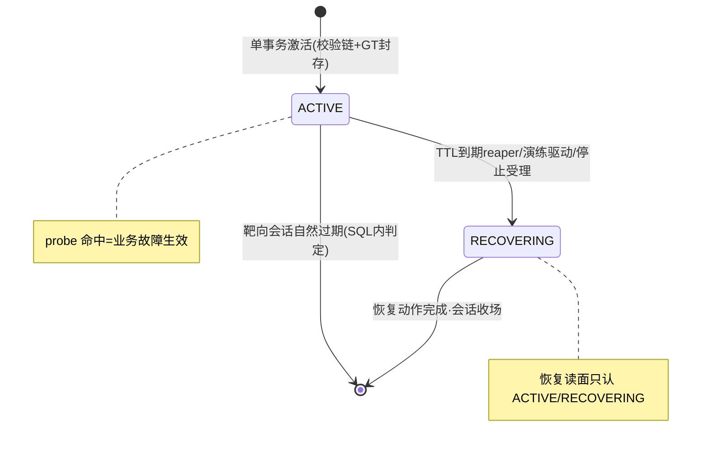

# 21-故障注入与Agent评测

> 本系列第二十二篇。讲清楚评测的"题库是怎么出题的"：**在交易靶场里可控地制造 13 类已知根因的交易故障，让 Agent 真查——注入有总开关、有靶向、有 TTL、有三态结果，清理有恢复相位，答案（GT）与注入同事务绑定。**
> 标注约定同前：【代码事实】/【合理推断】/【设计扩展】/【未确认】。

# 本层要解决的问题

一句话：**真实线上故障不可复现、不能在生产故意制造——所以建一个交易靶场（order-arena），用数据库权威开关向订单/支付/履约链路注入 13 类业务语义故障，每次注入携带标准答案（Ground Truth）同事务登记，Agent 查完后拿答案判卷。**

# 先看一个交易告警

> 评测一个案例（比如 F13 库存超卖）的完整过程：
> **出题**：激活请求带着 `faultType=F13、scenarioId、target（correlationId 前缀，只命中靶面订单）、TTL、configDigest、GT（数据集版本+payload 摘要+适用范围）`（ChaosActivationService.activate :42-45）——**注入与标准答案同事务绑定**，谁也无法"先看答案再注入"或"注入后改答案"。
> **注入生效**：靶场的 `ChaosSwitchboard.probe(F13, correlationId)` 在订单业务的竞态路径上返回命中——超卖发生，指标真实劣化，Prometheus 真实告警。
> **Agent 真查**：告警走生产同一入口，Agent 查指标/日志/变更，产出报告。
> **判卷**：报告 typed root_cause 对 GT 三元组做同义词归一等值（20 篇）。
> **清场**：TTL 到期或演练驱动恢复——`ChaosRecoveryService` 按恢复读面（ACTIVE/RECOVERING 会话）执行恢复，靶场回到无故障态。
> 全程靶场只对自己圈定的靶面（前缀匹配）故障，不污染其他评测。

# 如果没有这一层会怎样

1. **题库只能来自历史**：历史故障难复现（环境变了）、样本少（大故障一年几次）、不能重演（生产不能故意搞坏）。靶场让"出题"变成 API 调用——13 类故障×任意 target×任意时机。
2. **答案可信度无保障**：如果 GT 是事后人工标注，标注者可能被报告带偏（锚定效应）。本项目"GT 与注入同事务绑定+payloadDigest 锁定"——**答案在看到答卷之前就封存了**。
3. **注入本身失控**：忘了清理=靶场永久带病；注入范围失控=误伤其他评测。本项目的防线：TTL reaper（到期强制收场）+target 前缀靶向+fail-closed 开关（"任何 DB 异常=无故障——宁可测不出注入，不可无故障时报注入"，ChaosSwitchboard.java:17）。

---

# 代码是怎么做的

## 0. 先给我一句话

故障注入 = "13 类交易语义故障的总开关系统"：激活即出题（GT 同事务封存）、开关即靶心（DB 权威读面+前缀靶向）、注入三态诚实（没做成/做成了/不知道）、清理有三条路（恢复相位/TTL reaper/Flagd 账本清扫）。

## 1. 业务上为什么需要这一层

见"先看一个交易告警"。核心是**测试 Builder 模式在故障域的应用**：把"制造一个已知根因"变成确定性 API，评测才可重复、可批量、可对比版本。

## 2. 它在整个系统的位置

```mermaid
flowchart TB
    subgraph 出题侧
        CASE[GoldenCase/演练模板<br/>faultType+target+timing+GT]
        ADMIN[arena-chaos-admin<br/>ChaosActivationService]
    end
    subgraph 靶场 order-arena
        SW[ChaosSwitchboard 总开关<br/>oa_chaos_session DB权威·fail-closed]
        FG[FaultGate 接口<br/>业务路径 probe]
        BIZ[订单/支付/履约链路<br/>真实业务代码]
        REC[ChaosRecoveryService 恢复]
    end
    subgraph 触发与观测
        PROM[Prometheus 真实告警]
        AGENT[Agent 调查·生产同链]
    end
    subgraph 演练编排（drill）
        DW[DrillWorker 相位机<br/>PRECHECK→INJECTING→OBSERVING→RECOVERING→VERIFYING]
        IP[DrillInjectionPort 三态<br/>NOT_PERFORMED/PERFORMED/UNKNOWN]
        FLAG[FlagdDrillInjection/FlagdRestoreSweeper]
    end
    CASE --> ADMIN --> SW
    SW --> FG --> BIZ
    BIZ --> PROM --> AGENT
    CASE --> DW --> IP --> SW
    FLAG -.开关类故障清理.-> SW
    BIZ --> REC
```

## 3. 输入和输出

- **收到**（激活面）：faultType（F1~F3/F9~F18）/scenarioId/target/TTL/operator/configDigest/ruleDigest/**GtFields（datasetVersion+payloadDigest+applicableScope）**/alertLabels（C-6 指纹面）。
- **处理**：校验（正则形态/digest 形态/TTL 边界/操作者审计面）→存储层单事务激活（唯一约束：scenario 重复/同型同靶已 ACTIVE→409）。
- **产出**：ACTIVE 会话行（oa_chaos_session）→靶场业务路径 probe 命中→真实故障→真实告警→Agent 调查→评测判卷；清理侧：RECOVERING 会话→恢复动作→CLOSED。
- **交给谁**：靶场业务代码（FaultGate.probe 消费者）、评测判卷（GT）、演练相位机（回执）。

## 4. 真实代码入口

- **故障类型**：`order-arena/.../chaos/FaultType.java`——**13 类交易语义故障**【代码事实】：
  - 存量三类（AM2 v3.0）：F1 幂等失效 / F2 状态回跳 / F3 超时未知；
  - M-a 业务交易链路扩编（S16~S25）：F9 掉单（回调丢弃）/F10 支付悬挂（发起沉默）/F11 重复扣款（重试跳幂等）/F12 对账不平（库存偏差·数量差）/F13 库存超卖（竞态）/F14 消息丢失（履约未触发）/F15 重复消费（ack 失败重复履约）/F16 断流（入口静默）/F17 履约积压（处理变慢）；
  - **F18 金额错算——H7 HOLDOUT 专用预留（"M-e 前不挂接演练、不进任何调优跑批"）**——**留出题库隔离一份从未被 Agent 见过的题**，这是防"调优过拟合"的教科书做法。
- **总开关**：`chaos/ChaosSwitchboard.java`（implements FaultGate）——"oa_chaos_session 的数据库权威读面，INV-AM2-2 的唯一判定点"；fail-closed（DB 异常=无故障）；TTL 过期在 SQL 内判定；**target 匹配=correlationId 前缀（"E2E 以 chaos-<scenario 短码-…> 前缀圈定靶面"）**——靶向注入；"内存缓存只作可丢优化：TTL 秒级、崩溃即失、异常即弃"；恢复驱动读面暴露 ACTIVE/RECOVERING 会话。
- **激活服务**：`arena-chaos-admin/.../ChaosActivationService.java`——校验链（faultType 正则 F1-F3+F9-F18/scenarioId 形态/TTL min-max 边界/**operator 必填（审计面）**/configDigest+ruleDigest 双 HEX64/GtFields 完整性）→单事务激活→TTL reaper 运行时清场。
- **演练注入契约**：`drill/application/DrillInjectionPort.java`——**注入三态**：NOT_PERFORMED（"确定未执行零副作用→FAILED 合法，不冒进恢复路径"）/PERFORMED（"激活回执已得（身份/代次稳定）→OBSERVING"）/UNKNOWN（"on 超时响应丢失→必先进 RECOVERING——**一旦注入可能发生，停止/失败都先走恢复路径**"）；`NotImplemented` 默认实现"确定零副作用，不假装注入成功"。
- **演练 worker**：DrillWorker 相位机（20 篇引：QUEUED→PRECHECK→INJECTING→OBSERVING→RECOVERING→VERIFYING→CLOSED；"注入一旦发生/可能发生，停止或失败都必先进 RECOVERING"）。

## 5. 核心对象

| 对象 | 是什么 | 关键纪律 | 锚 |
|---|---|---|---|
| `oa_chaos_session` 行 | 一次注入会话（faultType/target/generation/state/TTL） | DB 权威（唯一判定点）；同型同靶唯一约束（并发激活 409） | ChaosSwitchboard/ActivationService |
| `GtFields` | 标准答案封存（datasetVersion+payloadDigest+applicableScope） | **与激活同事务**——答案先于答卷锁死 | ActivationService:67-70 |
| `FaultGate.probe` | 业务路径上的故障探针（type+correlationId） | fail-closed+前缀靶向+可丢缓存 | ChaosSwitchboard:45-51 |
| `DrillInjectionReceipt` | 注入回执（身份/代次稳定） | 三态映射到相位机合法迁移 | DrillInjectionPort |
| FlagdRestoreSweeper | 开关类故障（flagd）的台账级清扫 | "台账级截止恢复和重启清扫"（V95 flagd restore ledger） | drill 包 |
| 故障类型枚举 | 13 类交易语义故障+F18 HOLDOUT 隔离 | "冻结命名"；HOLDOUT "不进任何调优跑批" | FaultType |

## 6. 一条真实调用链（F13 超卖案例全链）

```
评测批跑（ArenaChaosScenarioDriver，eval 路径）
→ ChaosActivationService.activate(F13, scenario, target=chaos-<短码>-…,
    ttl, operator, configDigest, GT, alertLabels, ruleDigest)
   校验链全过 → 单事务 INSERT oa_chaos_session(ACTIVE) + GT 封存
→ order-arena 业务路径：下单竞态点 FaultGate.probe(F13, correlationId)
   → 前缀匹配命中 → 超卖真实发生
→ 指标真实劣化 → Prometheus 告警（alertLabels 指纹=C-6 面对账）
→ 告警走生产同链 → Agent 调查（查指标/日志/库存对账）→ 报告
→ 判卷：typed root_cause vs GT（20 篇同义词归一等值）
→ 清理：TTL 到期 reaper 或演练驱动 → ChaosRecoveryService
   （恢复读面 ACTIVE/RECOVERING 会话）→ 库存对账回填 → CLOSED
```

**drill 路径对照**（运维演练面，非 eval）：DrillJobService 建作业→DrillWorker 相位机→DrillInjectionPort.inject（CompositeDrillInjection 按 template driver 分派 arena-chaos/flagd 适配器）→回执三态→OBSERVING 观察窗（注入时刻+冻结 duration+maxFiringWait）→RECOVERING→VERIFYING→CLOSED+outcome 落真值（PASS/FAIL/INCONCLUSIVE）。

## 7. 状态机

**注入会话状态机**（oa_chaos_session.state，从 ChaosSwitchboard 恢复读面与相位机还原）：



**演练作业相位机**（DrillWorker，20 篇已详图）：QUEUED→PRECHECK→INJECTING→OBSERVING→RECOVERING→VERIFYING→CLOSED/FAILED/RECOVERY_FAILED——核心铁律两条：①"注入一旦发生/可能发生，停止或失败都必先进 RECOVERING"（确定未执行=NOT_PERFORMED 才允许直接 FAILED）；②DR-04 恢复三态 RECOVERED→VERIFYING/FAILED→RECOVERY_FAILED/UNKNOWN 保持下拍重试，"重试上限=恢复窗口截止……超期→RECOVERY_FAILED，不许死循环"。

- **谁修改**：DrillWorker（相位迁移 state+revision 双对账 CAS+PHASE_TRANSITION 事件）、reaper、FlagdRestoreSweeper；**存哪**：drill_job（V86）+oa_chaos_session+flagd restore ledger（V95）；**崩了**：启动扫超龄租约孤儿——"PRECHECK（零副作用）→重排队 QUEUED 身份稳定；INJECTING 及以后（注入状态无法判定）→必先进 RECOVERING 恢复路径"。

## 8. 正常业务流程（业务步骤+代码+状态）

| # | 业务动作 | 代码 | 状态 |
|---|---|---|---|
| 1 | 出题 | activate 校验链+单事务 | 会话 ACTIVE+GT 封存 |
| 2 | 故障生效 | FaultGate.probe 命中 | 靶面业务异常 |
| 3 | 真实告警 | Prometheus 规则 | 告警面=生产同链 |
| 4 | Agent 调查 | 生产全链（不因评测短路） | run/attempt/检查点照常 |
| 5 | 判卷 | GT vs 报告（20 篇） | rootCauseHit/verdict |
| 6 | 清场 | reaper/ChaosRecoveryService | RECOVERING→恢复完成 |

## 9. 异常流程

| 异常 | 处理了吗 | 怎么处理 |
|---|---|---|
| 注入请求超时（结果未知） | ✅ | UNKNOWN 三态——"一旦注入可能发生必进 RECOVERING"，不冒进 FAILED |
| 确定没注入（如预检拒） | ✅ | NOT_PERFORMED→FAILED 合法（"确定零副作用，不假装注入成功"） |
| 激活并发冲突（同型同靶） | ✅ | DB 唯一约束→409 |
| 注入后忘了清理 | ✅ | TTL reaper 运行时清场（TTL 过期 SQL 内判定）+FlagdRestoreSweeper 台账清扫+作业级截止对账 |
| 恢复动作失败 | ✅ | RECOVERING→RECOVERY_FAILED 诚实卡因+人工 retry_requested_at 消费面（DR-04） |
| 恢复中 worker 崩溃 | ✅ | 崩溃恢复：INJECTING 及以后必进 RECOVERING；UNKNOWN 保持下拍重试；恢复窗口 deadline 防死循环 |
| 开关读面 DB 异常 | ✅ fail-closed | "任何 DB 异常=无故障——宁可测不出注入，不可无故障时报注入" |
| 靶向误伤（其他订单被注入） | ✅ 结构上难 | correlationId 前缀靶向+"E2E 前缀圈定靶面"——非靶面 probe 不命中 |
| Agent 对某类故障系统性失明 | ✅ 评测暴露 | F18 HOLDOUT 隔离——"调优不进跑批"防过拟合，留作终极盲测 |

## 10. 并发问题

1. **同型同靶并发激活？** DB 唯一约束（"scenario 重复/同型同靶已 ACTIVE"→409）——同一靶面不叠加两种故障。
2. **probe 与 TTL 过期并发？** TTL 在 SQL 内判定（expires_at>now()）——"不依赖应用时钟清场"，读面与 reaper 无竞态窗口。
3. **演练与评测同时打同一靶面？** 同型同靶唯一约束挡住；不同型可并存（业务上允许多故障叠加吗——【合理推断】唯一约束只限同型同靶，交叉型叠加是合法出题形态）。
4. **恢复与注入并发？** 状态机单向（ACTIVE→RECOVERING 无回边）——恢复一旦开始不重启故障。

## 11. 崩溃恢复（kill -9 逐点）

- **激活事务中**：单事务原子——会话行与 GT 封存要么全有要么全无。
- **注入发送后、回执前 worker 死**：UNKNOWN 语义接管——启动扫超龄孤儿"INJECTING 及以后必进 RECOVERING"，恢复动作幂等可重入（DR-04 接线后）。
- **OBSERVING 中死**：观察窗由时间驱动（注入时刻+冻结 duration）——新 worker 按作业级截止对账接管推进。
- **恢复中死**：RECOVERING/VERIFYING 有恢复窗口 deadline——超期 RECOVERY_FAILED 保留占位待人工，"不冒充现场干净"。
- **Flagd 类故障**：FlagdConditionalRestore/FlagdRestoreSweeper 台账级兜底（V95）。

## 12. 安全

1. **注入是生产语义的真实故障**——靶场隔离是前提（order-arena 是独立模块独立库 schema arena.*），不是生产环境；注入权限面=arena-chaos-admin 的 operator 审计（operator 必填）。
2. **GT 封存防作弊**：同事务绑定+payloadDigest——评测框架自己也无法"先看题"。
3. **F18 HOLDOUT**：防过拟合的终极手段——"调优跑批不进、演练不挂接"，Agent 与调优者都看不到，只在最终验收时打开【设计意图，代码事实是预留注释】。
4. **为什么不能只在测试环境"模拟故障日志"？** 假日志没有一致的业务后果（指标、库存、对账、告警的联动），Agent 查的是联动链——**注入必须打在业务代码路径上，后果才是真实联动**。

## 13. Agent Harness

注入面 100% Harness（靶场+管理面+编排相位机全是确定性代码）。与模型的关系：模型看到的"故障"是真实业务后果（指标/日志/状态），不是注入指令的痕迹——**注入对 Agent 是不可见的**（除非 Agent 查到 chaos 会话表——它没有这个工具，工具面无此通道【代码事实：DirectReadToolCatalog 无 chaos 工具】——**这是"考题对考生不可见"的结构保证**）。

## 14. 可观测性

- 注入会话/演练作业全状态可查（oa_chaos_session/drill_job+PHASE_TRANSITION 事件）；
- 回执 JSON（receiptJson）落档——注入的身份/代次稳定可对账；
- 演练 outcome（PASS/FAIL/INCONCLUSIVE）落真值；
- CorrelationPort（DrillCorrelationPort）——注入与观测的关联面（"靶场告警与注入会话对账"）。

## 15. 性能和成本

- 注入本身零模型成本；成本在"等 Agent 查"（=一次调查）与恢复动作；
- TTL min/max 边界防止"秒过题"与"挂场不放"；
- 批量跑=eval 批的容量（20 篇）；演练是低频运维动作。
- **QPS×10**【合理推断】：注入面无压力；压力仍在评测批的模型消耗（19 篇已答）。

## 16. 设计取舍

**① 为什么故障类型是"业务语义"（掉单/超卖/对账不平）而不是"基础设施故障"（CPU 打满/网络抖动）？**
因为 RCA 的考题是"根因"，而本系统的根因答案面是业务三元组（component/fault_type/reason_code）——业务语义故障直接映射 GT；基础设施故障的根因链更长（要经"资源→应用→业务"归因），第一版题库选了直接映射。且业务故障的告警面丰富（13 类对应 IncidentClassifier 里登记的业务告警名族）——出题-判卷闭环最短。基础设施类故障是扩题方向【合理推断】。

**② 为什么注入开关放 DB（oa_chaos_session）而不是配置文件/API 内存态？**
"数据库权威读面……唯一判定点"：多实例靶场（order-arena 多副本）共享开关状态必须 DB；TTL 用 SQL 判定消时钟竞态；会话行同时是审计与恢复驱动读面。内存开关在"注入后开关进程挂了"时会留下无人认领的故障——DB 行+TTL+reaper 让故障必然有主、必然过期。

**③ 当前方案最大的边界？**
- 靶场=order-arena 单业务域（交易链路 13 类）；其他业务域的故障题型需复制整套"靶场+开关+恢复"模式；
- HOLDOUT（F18）的有效性依赖纪律（"M-e 前不挂接"）——纪律靠人守，没有技术强制（诚实标注）；
- 故障注入时刻与观察窗是模板常量——动态/随机化注入（防 Agent 按 timing 模板作弊）是演进空间。

## 17. 面试背诵卡

【30 秒主答】
"故障注入是在交易靶场里可控出题。靶场 order-arena 有 13 类业务语义故障——掉单、支付悬挂、重复扣款、库存超卖、对账不平这类，全是直接映射根因答案的交易链路故障。激活是个带校验链的 API：故障类型、靶面前缀、TTL 边界、操作者审计、双 digest 校验，最关键的是标准答案和注入同事务绑定——payloadDigest 封存，答案先于答卷锁死。生效靠数据库权威总开关，业务路径上 probe 命中才故障，DB 异常一律按无故障处理——宁可测不出不可误报。清理有三条路：TTL reaper、演练恢复相位、flagd 台账清扫。注入结果三态诚实：确定没做、确定做了、不知道——不知道必进恢复路径。还有个 F18 是 HOLDOUT 隔离题，调优跑批不进，防过拟合。"

## 18. 这一层哪些话不能说

1. ❌ "我们往生产环境注故障" → ✅ 注入在 order-arena 靶场（独立模块/独立 schema），生产链路只是"看到"了真实告警。
2. ❌ "13 类故障覆盖所有场景" → ✅ 全部是交易链路业务语义故障；基础设施类是扩题方向。
3. ❌ "Agent 可以查到注入记录辅助判断" → ✅ 工具面无 chaos 通道——考题对考生结构不可见。
4. ❌ "HOLDOUT 保证模型没见过" → ✅ F18 是预留+纪律（"M-e 前不挂接"），技术无强制——如实说是纪律性隔离。
5. ❌ "注入百分百成功" → ✅ 三态诚实（NOT_PERFORMED/PERFORMED/UNKNOWN），UNKNOWN 必进恢复。
6. TTL min/max 实值、模板目录全量【未确认】——机制可说数值不报。

---

# 我现在应该能回答什么

1. 13 类故障都是什么语义？为什么选业务语义而不是基础设施故障？（→ 第 4 节+第 16 节取舍①）
2. GT 怎么保证"先于答卷封存"？（→ GtFields 与激活同事务+payloadDigest）
3. 注入怎么做到"只打靶面、永不失控"？（→ 前缀靶向+DB 权威 fail-closed+TTL reaper+恢复相位）
4. 注入结果"不知道"时系统怎么走？（→ UNKNOWN→必进 RECOVERING→恢复窗口→RECOVERY_FAILED 交人）
5. 演练（drill）和评测（eval）两条注入路径的区别？（→ 同一靶场两套编排：运维相位机 vs 评测批跑，共用激活面）

# 30 秒背诵卡

见第 17 节。

# 面试官追问卡

**Q1：为什么 GT 要和注入同事务绑定，评测前登记不行吗？**
考什么：封存时点的严谨性。
30 秒答："评测前登记有时间窗作弊面：批量登记后逐题评测，出题系统或人可能'不小心'让答案回流（比如 GT 恰好被某个查询面读到）。同事务绑定让'注入生效'与'答案封存'是一个原子事件，payloadDigest 再锁内容——任何事后变更都是 digest 不匹配的显式事故。加上 payloadDigest 是内容寻址，评测判卷时验 digest 才取答案——答案的完整性也是可验证的。"
继续追问 1："GtFields 里的 applicableScope 是什么？"——答："适用范围声明——这份 GT 对哪些输入身份/窗口有效，防'拿 A 场景的答案判 B 场景'的错位判卷。"

**Q2：注入 UNKNOWN 时"必进 RECOVERING"，但如果实际上根本没注入成功呢？**
考什么：保守恢复的代价分析。
30 秒答："那就做一次无靶面的恢复——ChaosRecoveryService 按恢复读面找不到该 ACTIVE 会话或会话本就无副作用，恢复动作幂等空转，作业走向 VERIFYING/CLOSED 或按事实落 INCONCLUSIVE。代价是多一次恢复动作；收益是永远不会留下'注入了但没人管'的脏靶场。这是典型的非对称代价设计：空转恢复便宜，脏靶场昂贵。"
继续追问 1："恢复动作本身幂等吗？"——答："DR-04 接线后幂等可重入（恢复接口按会话身份驱动，重复执行结果一致）——这是 UNKNOWN 必进恢复路径的前提。"

**Q3：故障类型 F1 幂等失效/F2 状态回跳这类，Agent 怎么可能查出来？证据链长吗？**
考什么：题型与取证路径的对应。
30 秒答："以 F13 库存超卖为例：注入造成库存扣减为负→对账指标暴露偏差→Agent 从业务告警出发，查指标确认偏差幅度→查日志定位竞态窗口的并发扣减→（可选）查变更排除近期发布引入→收敛到'库存竞态超卖'的 GT 三元组。取证链横跨指标和日志两个数据源，靠的是工具面 inventory：prometheus 族确认症状、logs 族定位现场、change.diff 排除发布、rca_history 参考判例。题型难度分层的意义就在这：L1 直因单源可判，L4 复合级联要跨源交叉。"
继续追问 1："F16 断流（入口静默）呢？没告警怎么考？"——答："这类考的是'沉默故障'取证——F10 支付悬挂/F16 断流的告警面是业务对账类告警（pendingpaymentbacklog/orderzeroflow 在业务告警名族里）——静默的是入口，对账面会叫。这正好考'日志静默时改查对账/变更'的换向能力（05 篇 DOOM_LOOP 反馈里写明的取证方向）。"

**Q4：演练（drill）和评测（eval）为什么是两套编排？合并不行吗？**
考什么：相似功能的边界。
30 秒答："服务对象不同：eval 是评测批的出题器（要批量、要判卷、要对比版本），drill 是运维的常态化演练（要观察窗、要恢复核验、要 outcome 归档、要人工重试入口）。合并会互相拖累：eval 不需要 VERIFYING 的恢复核验语义，drill 不需要 EvalCompare。共享的是底层：同一个激活面（ChaosActivationService）、同一个靶场开关（Switchboard）、同一个恢复服务——**编排分层、原语共享**。"
继续追问 1："演练 outcome 的 PASS/FAIL 判什么？"——答："判靶场与观测面本身：注入后告警真的触发了吗、恢复后现场真的干净吗——它考的是'观测与注入基建'，而不是 Agent——所以 drill outcome 不进 Agent 质量分，两套语义不能混。"

**Q5：如果让你重新设计故障注入会改什么？**【设计扩展——设计题答案，不要说成现网实现】
考什么：REDO。
30 秒答："三处：一是故障参数化随机化（现在 timing/family 是模板常量，我会给每次注入加受控扰动，防 Agent 按 timing 模板模式匹配）；二是增加复合故障编排（F13+F11 组合的级联题，考多根因归因——现在同型同靶唯一，交叉型是合法但缺编排面）；三是 HOLDOUT 的技术强制（F18 靠纪律隔离，我会给 HOLDOUT 案例加评测跑批的物理过滤+访问审计）。13 类业务语义故障、GT 同事务封存、三态注入、恢复铁律这四样是骨架，重做也原样。"

# 这层不要乱说什么

1. 不要说"混沌工程平台"——它是服务于 RCA 评测的定向出题系统，不是通用混沌平台。
2. 不要说"注入有随机性"——timing/family 来自模板与请求参数（随机化是演进空间）。
3. 不要说"F18 已用于验收"——HOLDOUT 是预留（"M-e 前不挂接"），是否已开封【未确认，按注释为预留态】。
4. 不要说"Agent 知道自己在靶场"——工具面无 chaos 通道，结构不可见。
5. 不要把 drill 的 outcome（考基建）和 eval 的得分（考 Agent）混为一谈。
6. TTL 实值/模板目录条目数/oa_chaos_session 完整列结构【部分未核对】。

# 5 句话总结

1. **为什么需要**：真实故障不可复现、生产不能故意坏——可控出题是评测可重复的前提。
2. **核心机制**：13 类交易语义故障+DB 权威总开关（fail-closed+前缀靶向）+GT 同事务封存+注入三态+三条清理路。
3. **上下游协作**：上接案例库/演练模板两种出题；下接靶场业务路径与恢复服务；产出真实告警喂给生产同链的 Agent。
4. **最大风险**：靶场模式复制成本（新业务域要全套）；HOLDOUT 靠纪律；注入时序可被模式匹配。
5. **最大取舍**：用"独立靶场+业务语义题型"换"考题-判卷闭环最短、后果真实联动、对考生结构不可见"。

---

*本篇完成。下一篇待你指令解锁：《22-证据管理与诊断报告》。*
