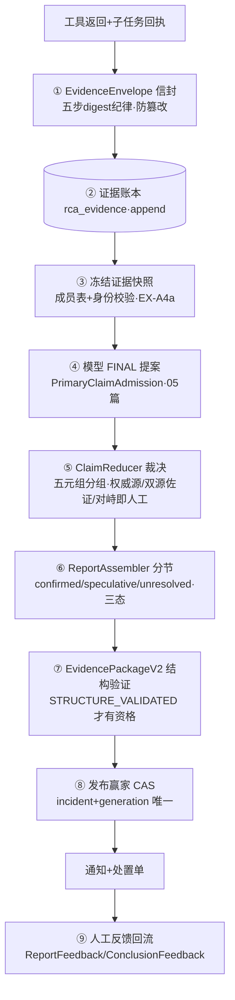

# 22-证据管理与诊断报告

> 本系列第二十三篇。讲证据从"工具返回的一坨字节"到"对外发布的根因报告"之间的完整信任链：**信封（防篡改）→ 账本（append-only）→ 快照（冻结）→ 断言裁决（多源对峙）→ 报告装配（三态诚实）→ 验证（结构门）→ 发布（赢家 CAS）→ 反馈（人工回路）。**
> 标注约定同前：【代码事实】/【合理推断】/【设计扩展】/【未确认】。

# 本层要解决的问题

一句话：**让报告里的每一个结论都能回答"证据是什么、谁产出的、有没有被改过、几条独立来源支持、对峙时怎么办"——报告不是模型的作文，是从冻结证据账本确定性推导出的裁决文书。**

# 先看一个交易告警

> Agent 提交 FINAL："根因是库存服务竞态超卖，证据三条"。这条断言变成对外发布的报告要走八道关卡：
> ① 它引用的证据，每条都是 **EvidenceEnvelope**——canonical JSON 存储、payload_digest 锁内容、读出重算比对（"单字节篡改可检出"）；
> ② 全部证据属于**同一个冻结快照**（快照 digest 绑定报告，"另一个世界的产出不得污染本报告"）；
> ③ 断言进 **ClaimReducer** 裁决：三条证据里同一来源重复只算一票；两个独立来源（比如 prometheus+logs）都支持→MULTI_SOURCE_CONSISTENT 确认级；一个说 TRUE 一个说 FALSE 打平→**UNKNOWN"对峙即人工"**；
> ④ 裁决结果进 **ReportAssembler** 分节：双源 TRUE→确定节；单源 TRUE→推测节（"推测不冒充确认"）；对峙→未决节；
> ⑤ 结论三态：CONFIRMED/PARTIAL/UNRESOLVED——"证据缺失只能 PARTIAL 不许臆测"；
> ⑥ **EvidencePackageV2** 结构验证通过才有发布资格；
> ⑦ (incident, generation) 发布赢家 CAS——一个代际只发一份；
> ⑧ 发布后人工反馈（ReportFeedback）回流，成为下一轮评测资产。
> 模型在这条链上的全部作用：**提议**断言和证据引用。裁决与分节是纯代码。

# 如果没有这一层会怎样

1. **报告=模型的自嗨文本**：没有证据信封与快照绑定，模型可以引用不存在的数据；没有裁决器，单源臆测可以冒充确认结论。
2. **证据被静默篡改**：PG jsonb 列会重排键序——字节都无法原样回读。本项目为此明文规定："存 canonical bytes（TEXT 列禁 jsonb——jsonb 会重排/重格式化，字节无法原样回读）"（EvidenceEnvelope.java:19-20）。
3. **多源矛盾被掩盖**：两个数据源打架时，"少数服从多数"或"权威说了算"都是取舍——本项目选"对峙即人工"（UNKNOWN）。

---

# 代码是怎么做的

## 0. 先给我一句话

证据管理 = "五步 digest 纪律的信封+只增账本+冻结快照"三层防篡改；诊断报告 = "裁决状态机分节+三态结论+结构验证+发布赢家"的确定性文书流水线——模型提议，代码判卷。

## 1. 业务上为什么需要这一层

报告的读者是值班的真人和后续的排障者——错误报告的代价是误导处置（重启错服务/忽略真故障）。报告的可信度必须**结构性成立**（链上任何一环可验证），而不是"相信模型这次没胡说"。

## 2. 它在整个系统的位置



## 3. 输入和输出

- **收到**：工具结果（原始字节）、模型 FINAL 提案（claims+evidence_refs+evidence_roles）、人工材料（MC31，"不构成证据引用"）。
- **处理**：信封化→落账→冻结→裁决→装配→验证→发布。
- **产出**：EvidencePackageV2 报告（summary/TypedRootCause/claims/evidence/impact/remediation/references）+ 通知白名单字段+反馈记录。
- **交给谁**：通知渠道（notify-app）、处置单（OperatorCase）、评测判卷（FinalReportSelector 消费）、人工复核。

## 4. 真实代码入口

- **证据信封**：`alert/domain/evidence/EvidenceEnvelope.java`（"借鉴 in-toto envelope 思想不照搬供应链 schema"）：
  - **四正交维度分别校验**：schema_version（结构）/observed_generation（代际栅栏）/snapshot_digest（冻结输入集）/payload_digest（内容完整性）——"'跨代拒绝=version URI 不匹配'是错误口径——schema 版本与代际互不推导"（:13-16）；
  - **digest 五步纪律**（:18-22）：①入口 canonicalize 一次 ②存 canonical bytes（**TEXT 列禁 jsonb**）③对保存字节算 digest ④读出重算比对 ⑤schema 校验与 digest 校验分开；
  - `verify`：不一致→"EVIDENCE_TAMPERED: payload 字节与 digest 不符（**单字节篡改可检出**）"（:59-66）；
  - `rowDigest`：封包业务字段 canonical sha256——"行身份篡改经 FK/查找失败暴露；内容篡改经 payload_digest、封包篡改经 rowDigest 检出"（:24-25）——**三层篡改三类检出**。
- **断言裁决**：`alert/domain/claim/ClaimReducer.java`（:14-37 javadoc）：
  - 分组键五元组=claimKey+normalizedScope+timeRange+observedGeneration+snapshotDigest——"不同时间窗/代际/快照的断言是不同事实，不得合并裁决"；
  - 裁决四规则：状态全一致→胜出；冲突→权威源规则（"多权威源互不一致→无法裁决——权威冲突不擅自取舍"）；无权威源→恰好一个状态获 **≥2 独立 source 佐证**才成立（TRUE/FALSE 各≥2 或无状态达双源→无法裁决——"**禁枚举顺序优先，对峙即人工**"）；证据基础按真实独立来源数（MULTI_SOURCE_CONSISTENT 确认级/SINGLE_SOURCE/UNKNOWN+MULTI_SOURCE_CONFLICT）；
  - **"禁止任何置信度投票逻辑"（多数和高分不制造真相——Harness 评审定案）**；同一 source 重复断言去重只算一票；policyVersion 进 claim_hash——"策略换版即内容变更，走 REVISED 而非静默重写"。
- **报告装配**：`domain/claim/ReportAssembler.java`（"纯域确定性——**无 LLM 输入口**"）：
  - 分节依据"必须来自 M4-22 裁决状态机而非 LLM 自述"：confirmed（corroborated 双源一致：TRUE=根因候选/**FALSE=确认排除——"证伪也是确定，不是根因"**）/speculative（单源——"推测不冒充确认"）/unresolved（对峙即人工）；
  - **"无证据不产确认根因"**：必须绑定冻结快照（null=fail-closed——"诚实空报告也有快照 digest"）；
  - 结论三态 CONFIRMED/PARTIAL/UNRESOLVED——"证据缺失只能 PARTIAL 不许臆测"；外来快照 Claim 排除不计残留（"另一个世界的产出，不得污染本报告"）。
- **报告 Schema**：`domain/model/EvidencePackageV2.java`——v1 六段式的类型化升级：summary/**TypedRootCause**（自由文本根因→三元组）/**ReportClaim 列表（MAX_CLAIMS=32）**/evidence/impact/remediation/references；fromMap 只做形状映射（"中立树 BA-22：无 Jackson 类型"）；"schema_version=2 固定，未知版本在路由层拒绝"。

## 5. 核心对象

| 对象 | 是什么 | 生命周期 | 防什么 |
|---|---|---|---|
| `EvidenceEnvelope` | 一次取证的信封（类型/来源/scope/时间窗/canonical payload/digest） | append 账本行 | 内容篡改（payload_digest）/封包篡改（rowDigest）/跨代污染（observedGeneration） |
| EvidenceSnapshot | 冻结成员表（run+snapshotDigest） | 报告相位一次性冻结 | 迟到证据入黑板/成员身份不符 |
| `Claim`→`ClaimVerdict` | 断言→裁决投影（状态+证据基础+指纹） | run 级 append（ClaimStore） | 单源冒充确认/对峙擅断/策略静默换版 |
| `EvidencePackageV2` | 对外报告 Schema v2 | 发布时构造 | 结构不合格发布/claims 超限 |
| 发布赢家行 | (incident,generation) 唯一 | insert-only | 双发/跨代串发 |
| ReportFeedback | 人工反馈（结论对不对） | append | —（V122/124 回路面） |

## 6. 一条真实调用链（一份报告的诞生与问责）

```
工具结果 → SingleToolEvidenceAgent 产 EvidenceEnvelope.create（五步 ①③⑤）→ 账本
主模型 FINAL → PrimaryClaimAdmission（引用越界剥离/降级，05 篇）→ 检查点提案
报告相位：EvidenceSnapshotBuilder 冻结快照（成员表+身份校验，NativeRcaAgent "缺成员=显式失败"）
→ 主模式：PrimaryFinalClaimProjector 投影（检查点提案→ClaimStore）
→ ClaimReducer.reduce（五元组分组→四规则裁决→排序可复现）
→ ReportAssembler.assemble（快照绑定 fail-closed→分节→三态）
→ NativeReportAdapter 适配 → EvidencePackageValidator 结构验证
   （STRUCTURE_VALIDATED / REJECTED_*——"SUCCEEDED 与 REJECTED_* 同权落档"）
→ worker finishTask：报告行+发布赢家 CAS（ON CONFLICT）→ 通知白名单字段
   （summary/component/faultType/reasonCode/impact/remediation——Orchestrator:594-611）
→ 开处置单（幂等键 case:report:{id}）→ 人工反馈回流（V122/124）
问责：reportId → 检查点 finalClaims → 账本证据行 verify() → 事件链验链
```

## 7. 状态机

断言的生命周期（ClaimLifecycle）与裁决状态【代码事实要点】：
- **ClaimStatus**：TRUE/FALSE/UNKNOWN（命题三态）×证据基础（MULTI_SOURCE_CONSISTENT/SINGLE_SOURCE/MULTI_SOURCE_CONFLICT）两个正交面——"输出三正交字段中的命题状态+证据基础，**无独立 verdict 出口枚举**"（ClaimReducer:15-16）——**状态与证据强度不合并**（"双源 FALSE"=确认排除不是"弱阳性"）；
- 报告结论三态 CONFIRMED/PARTIAL/UNRESOLVED 由分节推导（"裁决状态机推导，非 LLM 判定"）；
- 策略版本进 claim_hash："策略换版即内容变更，走 **REVISED** 而非静默重写"——裁决可追溯。

## 8. 正常业务流程（业务步骤+代码+状态）

| # | 业务动作 | 代码 | 结果 |
|---|---|---|---|
| 1 | 工具取证落账 | Envelope.create→账本 | 证据行（digest 锁定） |
| 2 | 模型提案 | FINAL+admission | 检查点 finalClaims |
| 3 | 冻结 | SnapshotBuilder | 快照+成员表 |
| 4 | 裁决 | ClaimReducer | ClaimVerdict（状态×证据基础） |
| 5 | 装配 | ReportAssembler | 三态草案+三节 |
| 6 | 验证 | EvidencePackageValidator | STRUCTURE_VALIDATED 或 REJECTED_* |
| 7 | 发布 | 赢家 CAS→通知→处置单 | 对外一份 |
| 8 | 反馈 | ReportFeedback | 回流评测资产 |

## 9. 异常流程

| 异常 | 处理了吗 | 怎么处理 |
|---|---|---|
| 证据被篡改（单字节） | ✅ | verify() 显式 EVIDENCE_TAMPERED 拒绝 |
| 断言引用越界/外来快照证据 | ✅ | 准入剥离（05）+装配排除不计残留 |
| TRUE/FALSE 双源对峙 | ✅ | UNKNOWN+MULTI_SOURCE_CONFLICT——"对峙即人工" |
| 权威源之间互不一致 | ✅ | 无法裁决不擅自取舍 |
| 单源 TRUE 想当根因 | ✅ | 只进推测节（"推测不冒充确认"） |
| 证据不足但模型想下结论 | ✅ | 无确认→UNRESOLVED；"证据缺失只能 PARTIAL 不许臆测" |
| 报告结构不合格 | ✅ | REJECTED_* 同权落档（INV-AM3-7"诚实记账"）——不发布但有档 |
| 同代际两份报告抢发布 | ✅ | 赢家 CAS——败者落档不发布 |
| 发布后发现结论错了 | ✅ | ReportFeedback/ConclusionFeedback 回流→评测资产+revision 面 |
| 通知渠道挂了 | ✅ | outbox at-least-once（12 篇） |
| 模型拒绝输出任何报告 | ✅ | 确定性 FINAL 兜底=诚实空报告+缺口清单（"流程终止≠根因确认"） |

## 10. 并发问题

1. **裁决与新增证据并发？** 裁决基于冻结快照成员表——冻结后迟到证据"结构性不可入黑板"（NativeRcaAgent javadoc，05 篇引）；新证据属于下一个快照。
2. **两份报告抢发布？** (incident,generation) ON CONFLICT 唯一——败者落档不发布（18 篇 Q1）。
3. **同一 source 的重复断言刷票？** 投票视图按 source+status 去重——"同一 source 的重复断言去重后只算一票"。
4. **策略版本升级后老 Claim？** policyVersion 进 claim_hash——REVISED 走显式变更，不静默重写。

## 11. 崩溃恢复

报告相位的崩溃语义已在 13/14 篇（材料预提交+REPORT_FINALIZE）；本篇补充证据视角：证据账本 append-only+digest 锁定——**崩溃后重做取证会得到同 digest 的等价证据行**（幂等），不会产生"内容漂移的第二份证据"；快照成员表让"报告绑定哪些证据"在崩溃前后不变。

## 12. 安全

1. **证据完整性三层防线**：payload_digest（内容）/rowDigest（封包）/快照成员校验（归属）——单字节篡改、封包改写、跨快照混入分别可检出。
2. **人工材料不冒充证据**（MC31）：operator_materials 单列标注"不构成证据引用"，不入 validRefs——"无证判断不能绕过 Claim 准入"（11 篇）。
3. **通知面白名单**：payloadFields 只取六字段——报告的哪些字段能出门是白名单制。
4. **为什么不能只在 Prompt 里要求模型"只基于证据下结论"？** 准入/裁决/装配三道代码闸就是这句话的工程化：引用要验存在（准入）、结论要验支持（裁决）、分节要按裁决状态（装配）——**Prompt 重复意图，代码保证结构**。

## 13. Agent Harness

| 机制 | 模型 | Harness |
|---|---|---|
| 提出断言与引用 | ✅ 提议 | 准入剥离/降级/角色授予（SUPPORTS 等"模型只可提议"） |
| 断言的真假裁决 | ❌ | ClaimReducer 四规则（纯函数） |
| 报告分节与结论 | ❌ | ReportAssembler 三态推导 |
| 报告能否发布 | ❌ | 结构验证+赢家 CAS |
| 报告长什么样 | 部分（summary 等自由文本） | Schema v2 类型化骨架+白名单出口 |

**报告的"事实骨架"全部由 Harness 浇筑，模型的"语言血肉"只在白名单格里。**

## 14. 可观测性

- 证据行/快照/Claim/报告全链外键可达（排障五步串链，18 篇）；
- claim_hash/policyVersion/REVISED——裁决可追溯；
- trace-details 的 evidenceRef/evidenceType/evidenceSource 把每次工具调用与证据行互指（18 篇）；
- 事件链记录裁决与发布里程碑（APPROVAL→GRANT→PUBLICATION…）。

## 15. 性能和成本

- 证据层成本：canonicalize+sha256 每证据一次（微秒级）；TEXT 存储较 jsonb 略大（无重排压缩）——换字节级可验证，值得；
- 裁决/装配纯函数 O(claims×sources)，32 claims 上限内可忽略；
- 报告本体小（KB 级），大对象在 CAS（raw 原文）；
- **QPS×10**【合理推断】：证据写入随调查线性，PG 承载无虞；发布赢家 CAS 热点=同 incident 并发调查（被活跃唯一索引天然限流为 1）。

## 16. 设计取舍

**① 为什么证据存 TEXT 存 canonical JSON，不用 jsonb？**
代码注释原文是最有力的答案："jsonb 会重排/重格式化，字节无法原样回读"——digest 纪律的第②步要求"存 canonical bytes 原样落库"。**可验证性 > 查询便利**（要查 jsonb 路径可以加生成列/旁路表，但原文字节不可再生）。这是"可验证性优先"原则在存储选型的落点。

**② 为什么裁决"禁置信度投票"？**
注释原文："多数和高分不制造真相——Harness 评审定案"。多数投票会让"两条低质佐证压过一条权威反证"；置信度分数是模型的概率产物，把概率当真相=信任错对象。本项目用**来源独立性计数+权威源规则+对峙交人工**三个确定性规则替代。代价：对峙时不出结论（UNRESOLVED）——同全系统 taste：不确定就诚实说。

**③ 当前方案最大的边界？**
- "独立来源"以 source 标签计（prometheus/logs/change）——同源不同查询不构成第二票（"同一底层信号的多工具读取在投影面按 source 归并，不按 toolId 伪造独立性"，PrimaryClaimAdmission:29-32）——真正的独立三方复核（如人工二次确认）未入自动化链；
- 报告的 summary/impact/remediation 仍是模型自由文本（白名单字段+长度上限治理），语言质量无结构保证；
- 反馈回路（V122/124）到调优的闭环深度【未确认】——反馈先成为评测/回归资产，自动调参不存在。

## 17. 面试背诵卡

【30 秒主答】
"证据到报告是一条八环信任链。证据层：每个工具结果信封化，canonical JSON 存 TEXT 列——刻意不用 jsonb，因为 jsonb 会重排字节无法原样回读；存完算 digest，读出重算比对，单字节篡改都能检出，还有个行摘要锁封包字段。裁决层：断言按五元组分组——同断言不同时间窗是不同事实；组内规则是同源去重、权威源优先、双独立来源佐证，TRUE 和 FALSE 打平就叫对峙即人工，明令禁止置信度投票——多数不制造真相。报告层：装配器纯代码按裁决状态分三节——双源确认、单源推测、对峙未决，结论三态，无证据不产确认根因；结构验证过了才有发布资格，发布走 incident 加代际的赢家 CAS。模型全程只提议，裁决与分节都是代码。"

## 18. 这一层哪些话不能说

1. ❌ "报告由 AI 生成并自动保证正确" → ✅ 模型只提议断言；裁决/分节/结论三态/发布全是确定性代码。
2. ❌ "证据不可篡改" → ✅ 精确说法：**篡改可检出**（tamper-evident）——payload_digest/rowDigest/成员校验三层，与 18 篇哈希链同口径。
3. ❌ "多源交叉验证用投票" → ✅ 明令禁止置信度投票——独立来源计数+权威源+对峙即人工。
4. ❌ "单源结论也能发，反正标了推测" → ✅ 能发但永远进不了"确认根因"——PARTIAL/UNRESOLVED 语义诚实。
5. ❌ "证伪的断言没用" → ✅ FALSE 双源=确认排除，进确定节——"证伪也是确定"。
6. 报告反馈到调优的闭环深度【未确认】。

---

# 我现在应该能回答什么

1. 证据信封的五步 digest 纪律是什么？为什么禁 jsonb？（→ 第 4 节）
2. 断言裁决的四个规则？对峙时怎么办？（→ ClaimReducer：同源去重/权威源/双源佐证/对峙即人工）
3. 报告三态怎么推导？"无证据不产确认根因"的实现？（→ ReportAssembler）
4. 两份报告抢发布怎么处理？（→ 赢家 CAS，败者落档不发布）
5. 模型在报告链上的全部权力是什么？（→ 第 13 节：提议断言+白名单格内的自由文本）

# 30 秒背诵卡

见第 17 节。

# 面试官追问卡

**Q1：为什么要 rowDigest？payload_digest 不是已经锁内容了吗？**
考什么：威胁模型细分。
30 秒答："两个 digest 锁不同的东西：payload_digest 锁**内容**（canonical payload 字节），rowDigest 锁**封包**（类型/来源/时间窗/代际这些业务字段）。攻击面不同：改内容会撞 payload_digest；不改内容但改封包（比如把时间窗改了，让证据看起来属于另一个窗口）会撞 rowDigest。注释原话：'行身份篡改经 FK/查找失败暴露；内容篡改经 payload_digest、封包篡改经 rowDigest 检出'——三种篡改三道闸，不假设一道闸万能。"
继续追问 1："FK 那条什么意思？"——答："行 id 被换=外键与快照成员表对不上，查找即失败——身份层的篡改靠引用完整性天然暴露。"

**Q2：权威源规则——如果权威源自己错了呢？**
考什么：权威的边界。
30 秒答："权威源规则解决的是'来源冲突时听谁的'这个排序问题，不解决'权威本身错'——后者靠两层：一是权威源表是策略资产带版本（policyVersion 进 claim_hash，换版走 REVISED 显式变更）；二是权威源裁决的证据基础恒为 SINGLE_SOURCE（'权威定状态，非佐证计数'）——**权威拍板的结论在报告里进推测节而不是确定节**，因为它没有双源佐证。权威能定状态，不能制造确认级。这个细节是整套规则的精髓：任何单一来源——包括权威——都拿不到'确认'。"
继续追问 1："那确认级只能靠双源？"——答："对，MULTI_SOURCE_CONSISTENT 的定义就是≥2 独立 source 一致——确认是结构性事实，不是权威封的。"

**Q3："对峙即人工"——人工怎么介入一个自动流水线里的 UNKNOWN？**
考什么：人机接口的落点。
30 秒答："两条路：一是报告侧——对峙断言进未决节，报告以 UNRESOLVED/PARTIAL 发布（或按用途不发布只落档），人工在 UI 复核时看到对峙双方的全部证据引用；二是反馈侧——人工结论经 ReportFeedback/结论反馈（V122/124）回流，成为修正依据与评测资产。注意人工结论同样受 MC31 纪律约束：'不构成证据引用'——人可以改判，但人的判断进不了证据账本冒充实测。"
继续追问 1："为什么不自动再查一轮？"——答："可以对冲突证据再取证（主循环在步数预算内本来就会做）——但裁决面的对峙如果证据穷尽仍对峙，那就是真歧义，自动再查只会重复劳动。交人工是诚实。"

**Q4：TypedRootCause 为什么把自由文本根因换掉？**
考什么：类型化的价值论证。
30 秒答："三个理由：一是**可评分**——评测对照面是类型化三元组等值+同义词归一（20 篇），自由文本没法自动判卷（BA-158 的来源标签事故就发生在这类槽位上）；二是**可聚合**——同型故障的趋势统计、历史判例检索（rca_history.search）都要求结构化；三是**防漂移**——三元组取值逐字取自信封 root_cause_catalog 同一行的 canonical 码（05 篇协议原文'禁止跨行混搭或自造词'）。代价：模型必须从目录里选词而不是自由发挥——又是表达力换确定性的全系统 taste。"
继续追问 1："目录里没有的根因怎么办？"——答："协议明说：'信封无该键或无法确定取值时省略 root_cause 键，不拿服务名/claim_key 冒充'——省略是合法降级（下游诚实 unknown 三元组），编词是非法。"

**Q5：如果让你重新设计证据链会改什么？**【设计扩展——设计题答案，不要说成现网实现】
考什么：REDO。
30 秒答："三处：一是给'独立来源'引入更细的谱系——现在按 source 标签计数，同一 Prometheus 的两条独立规则命中仍算一票（保守对），但不同集群的同源工具其实是真独立——我会把 source 拆成 source+instance 两级；二是把人工反馈做成结构化的'修正断言'直接进裁决面（现在反馈先进评测资产），让人工经验更快变成规则；三是报告加'反证清单'固定节——现在证伪在确定节里有，但没有独立成节醒目呈现。五步 digest、四规则裁决、三态装配、赢家 CAS 这四样是骨架，原样保留。"

# 这层不要乱说什么

1. 不要说"防篡改"不带边界——准确说法是 tamper-evident（可检出），不是 tamper-proof（不可改）。
2. 不要说"AI 报告自动验证过正确性"——结构验证验形状，结论正确性靠裁决链与评测。
3. 不要把"推测节"说成"低可信确认"——推测永不进确认根因，这是语义红线。
4. 不要说"多源 = 多次调用同一工具"——独立来源按 source 标签归并，同源多工具是伪造独立性。
5. 不要说"人工可以随意改证据"——人工结论走反馈面，受 MC31"不构成证据引用"约束。
6. EvidencePackageValidator 的完整政策规则/反馈闭环深度【部分未逐行】。

# 5 句话总结

1. **为什么需要**：错误报告会误导处置——报告可信度必须结构性成立，不依赖对模型的信任。
2. **核心机制**：五步 digest 信封+冻结快照+四规则裁决（对峙即人工）+三态装配+结构验证+赢家 CAS。
3. **上下游协作**：上接工具账本与模型提案；下接通知/处置单/评测判卷/人工反馈。
4. **最大风险**：自由文本字段（summary/impact）的语言质量无结构保证；独立来源定义偏保守。
5. **最大取舍**：用"模型只有提议权+TEXT 列存字节+对峙交人工"换"报告每个结论可回查、可验证、可问责"。

---

*本篇完成。下一篇待你指令解锁：《23-系统安全边界》。*
