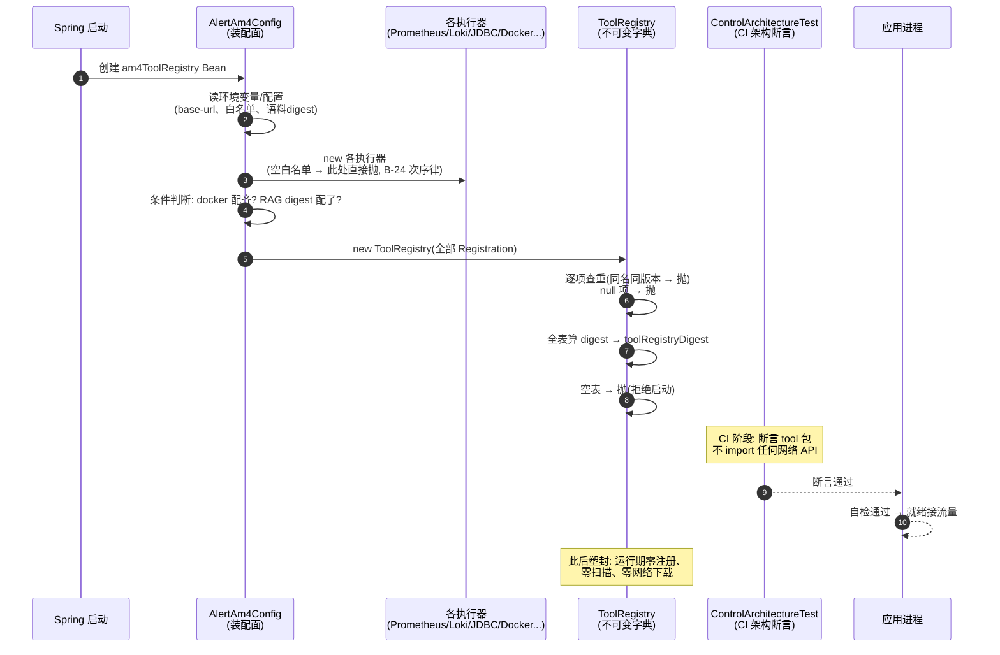
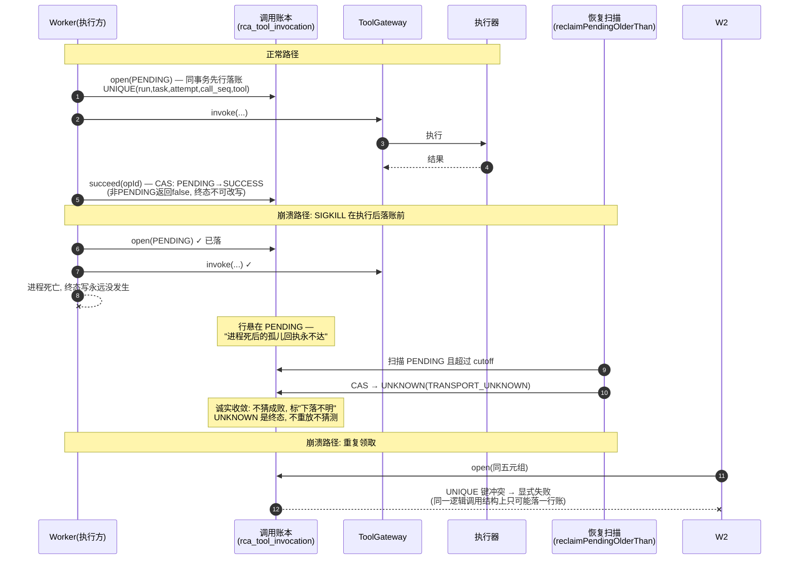
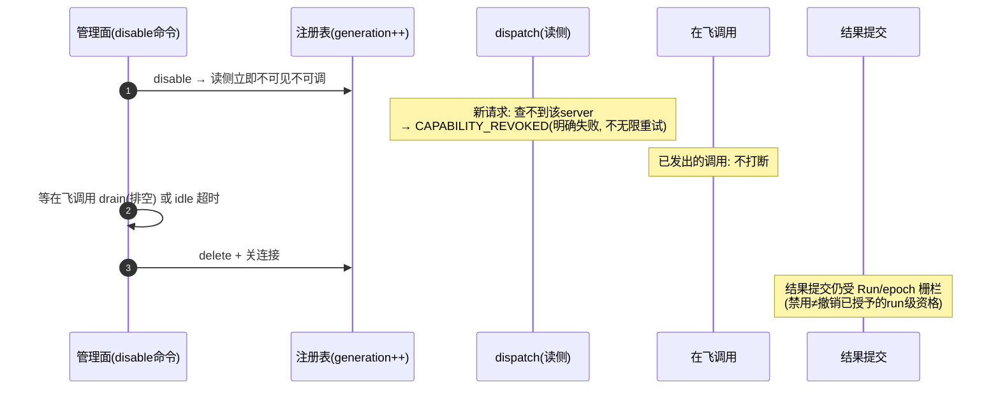

# 工具层全量讲解（业务打底 + 工程落地 + 线上 bug 复盘）

> 依据：`control-app` 源码（commit `aedf1dd`，2026-09-12）、`docs/告警-BUGLOG.md`、`docs/告警-增强线-Tool-MCP-RAG-Skill技术方案-v1.1.md`。
> 讲法约定：每一节先讲**业务**（这套东西在告警这个生意里管什么），再讲**工程**（代码里怎么落的），线上翻车的地方放"bug 现场"框。脱离业务谈技术就是空谈，所以业务永远先行。

---

## 0. 开场：工具层在告警业务里到底干什么

先想清楚这门生意的本质。**根因分析（RCA）= 取证**。一次故障发生了，要回答"为什么坏"，靠的不是猜，而是**证据**：指标什么时候开始恶化？日志里有什么错误码？出事前有没有人发过版？

那证据从哪来？三个数据源：Prometheus（指标）、Loki（日志）、变更库（谁改了什么）。**工具就是去这三个地方取证的通道**。

现在关键问题来了：一个 AI Agent 拿着这些通道，你敢让它自由发挥吗？

- 它会不会去跑一个不该跑的命令？（BA-15 真事：给模型配了 bash，它反射式去跑 kubectl，容器里根本没有 K8s，它就把"kubectl 不存在"当成了故障根因写进报告——**报告全错**）
- 它会不会同一个查询打一百遍，把预算烧穿？
- 它会不会把工具返回的原始内容当真，被里面藏的指令带偏？

工具层就是对这些问题的一个回答，一句话概括它的哲学：

> **Agent 想动手，每一次伸手都必须经过同一个咽喉；咽喉上装了多少道闸，一次都不能少；每一次伸手都记账。**

工程上这个"咽喉"叫 `ToolGateway`，配上一个**不可变注册表**（菜单）、一本**调用账本**（流水）、一道**预算闸**（钱包）、一个**粘性熔断**（防抽风）、一套**回放**（考场监控）。下面按通用清单的顺序，一节一节拆。

### 全景货架：现在到底有多少工具

```
ToolRegistry（不可变字典，启动期一次建满，共最多 14 个）
│
├─ 调查三件套（一个 Agent 恰好配一个工具，构造器强制）
│   metrics.query  → PrometheusQueryExecutor   真查 Prometheus
│   logs.query     → LogQueryExecutor          真查 Loki（service 白名单）
│   change.query   → ChangeQueryExecutor       真查 JDBC 变更库
│
├─ 直读七件（DirectReadToolCatalog 统一目录）
│   prometheus.instant / catalog / label_values / rules
│   logs.aggregate（Loki 聚合）
│   change.diff（两次部署 diff）
│   alertHistory（告警历史）
│
├─ 检索一件
│   rcaHistorySearch（历史 RCA 假设检索——"以前类似的故障怎么判的"）
│
└─ 条件注册（配置齐才上架，缺配置 = 不注册 = 启动期就定死）
    docker.ps / docker.inspect        ← 配了 docker base-url + 容器白名单才有
    runbook.catalog_search / fetch    ← 配了 runbook 语料 digest 才有（RAG 一阶段）
```

---

## 1. 工具契约与注册层

### 1.1 业务角度：菜单为什么不能随便加菜

想象你是值班经理，手下有个实习生（Agent）帮你查故障。你给他一份**菜单**，写着"你能问后厨要这三样东西"。这份菜单有两个要求：

**第一，菜单上的每道菜必须写清楚规格。**"来一份日志"不行——要写明白：查哪个服务、什么时间范围、最多返回多少行。规格不清楚，实习生就会自己脑补，脑补出来的东西你没法审计（"你当时到底查了什么？为什么这么查？"答不上来）。

**第二，菜单不能在营业中途悄悄变。**今天上午报告说"用 3 号工具查出来的"，下午菜单变成 5 个工具了，那上午的报告到底是用哪版菜单做出来的？没人说得清。根因分析这个生意里，**每一份报告都要能回答"当时你手里有什么、你做了什么"**——菜单会漂移，账就没法算。

真金白银的教训（bug 现场）：

> **BA-15（线上真事故）**：Holmes 时代给模型配了 bash 工具。模型接到任务后"反射式"先跑 kubectl——容器里根本没有 K8s，命令不存在。模型空转数轮，最后把"**kubectl 命令不存在**"当成了系统故障的根因写进报告。同一次调查还发现：PROMETHEUS_URL 环境变量没配时，prometheus 工具集被**静默禁用**，模型手里根本没有指标工具，报告里一条指标证据都没有。
>
> 教训两条：①**工具面对模型的暗示强于任务描述的文字**——你给它 bash，它就想跑命令；②"静默禁用"类降级必须有部署期显式检查，缺了就是给模型一把没有子弹的枪还不告诉它。

### 1.2 工程角度：契约怎么定义的

**ToolDefinition——一份工具的"身份证"，五个字段一个不少：**

| 字段 | 是什么 | 大白话 |
|---|---|---|
| `name` / `version` | 名字 + 版本 | 菜名 + 菜谱版本。同一个名字不同版本是**两道菜**，都必须能点 |
| `schema` | 参数的 JSON Schema | 这道菜要什么配料、什么类型、哪些必填。三个硬规矩：顶层必须是 object；`additionalProperties` 缺省归一为 false（**没写的配料不许塞**）；显式写 true 直接拒绝构造 |
| `risk` | 风险等级 R0–R3 | 这道菜有没有"副作用"（后面细讲）。**漏填默认 R3（最危险档）**——宁可错杀不放过 |
| `timeoutMillis` | 超时 | 这道菜最多等多久 |
| `resultLimitBytes` | 结果上限 | 盛菜的碗最大多大，超出整碗不要 |
| `schemaHash()` | schema 的指纹 | 对 schema 做 canonical sha256。菜谱改一个字，指纹必变——后面回放和审计全靠它 |

非法契约**构造即抛**（fail-fast）：名字格式不对、schema 没有非空 properties、超时不是正数——应用**直接拒绝启动**。让"坏的菜单"活到运行时才被发现是最贵的错误，所以全部在启动期拦截。

**ToolRegistry——装订死的通讯录：**

```java
// ToolRegistry.java 构造契约（注释原话要点）
// ① 仅启动期由装配面一次性构造
// ② 重名/版本冲突 fail-fast：同名同版本无论 schema 异同都拒绝，禁静默覆盖
// ③ 构造后不可变：没有运行时注册 API
// ④ "禁运行时网络下载插件"由结构保证 + ControlArchitectureTest 断言（tool 包禁触网络 API）
// ⑤ 空注册表硬失败：至少注册一个工具，否则应用拒绝启动
```

逐条大白话：**开张前把通讯录印好**；印的时候查重（两道重名菜立刻打回）；**印好后塑封**——运行期想插一页、撕一页，物理上不可能；甚至整个工具包的代码**碰不到网络 API**（架构测试在 CI 里强制），所以"运行时偷偷下载个新工具"这种事不是靠纪律防的，是靠"代码写不出来"防的；一份工具都没有的注册表也直接拒启——**一个没有菜单的餐厅不该开门**。

装配现场（`AlertAm4Config.am4ToolRegistry`）：14 个工具在 Spring Bean 创建时全部实例化、全部登记。条件注册的四个工具是 `if (配置齐) 才 add`——**不注册不是"禁用"而是"不存在"**，模型侧的清单里根本没这页。

**注册表整体 digest 进快照身份——这是把菜单和账本焊死的一步。**每次调查 run 冻结证据快照时，快照指纹里含 `toolRegistryDigest`（对"当前有哪些工具、每个的 schema/超时/上限"整体算 sha256）。效果：

```
9月10日注册表（12 个工具） → 指纹 ABC123
9月12日加了 docker 工具重启 → 指纹 XYZ789
→ 9月11日的旧报告：快照里写着 ABC123 → 立刻知道它是 12 工具版本的产出
```

所以"加工具要重启"不是缺陷，是**审计要求**：菜单的每一次变更都有明确边界、必然改变指纹、每一个历史产出都能追溯到当时的菜单版本。

### 1.3 启动期装配时序图



**图的大白话解读**：这张图讲的是"开门前的准备"——所有事情都发生在**开门之前**。第 1–5 步：管理员（装配面）读环境配置，把每道菜的厨师（执行器）请到位；注意第 4 步，厨师上岗前先查他的"禁区清单"（白名单），清单是空的直接让他走人——**先查禁区再看别的**，这个次序本身是契约（后面 BA-74 会讲次序反了的翻车）。第 6–9 步：菜单装订、查重、算总指纹，任何一步不对整家店不开门。第 10–11 步：CI 里还有个监工，保证"厨房里没有电话"（工具包碰不到网络）。从第 13 步起，店正式营业——**此后菜单永远是那一本，谁也改不了**。想换菜单？重新开门（重启），新菜单有新指纹。

### 1.4 对照通用清单：哪些字段我们故意没有

清单说工具要带"成本/延迟/SLA/租户/依赖/示例"。我们**没有**，而且不是漏：

| 清单项 | 为什么不做 |
|---|---|
| 成本/token | 工具本身不花钱（内部 HTTP/JDBC 查询），花钱的是 LLM 调用——账记在 ModelGateway 侧 |
| 延迟/SLA | 超时就是 SLA：每个工具自带 timeoutMillis，超时按分类处理，不需要另立字段 |
| 租户 | 单租户内部系统，没有租户概念 |
| 示例 | R7 落地后以"正例写进 prompt 资产"的方式存在（BA-37 的修复就是补真实正例），不放契约字段里 |
| 动态上下线/服务发现 | **决策为不做**：数据源固定三个，运行期发现没有收益只有漂移。将来 MCP 动态挂载按快照发布契约走（§8） |
| 健康检查 | 实例级自检（StartupSelfCheckRunner）覆盖"能不能开工"；单工具级健康属于执行器内部重试语义 |

---

## 2. 暴露面 / 渐进式披露

### 2.1 业务角度：每个实习生只发一件工具

通用清单担心"工具太多，模型挑花眼，要搞检索式披露"。我们的现实是另一个方向：**每个调查 Agent 构造时就强制"恰好一个工具"**——`SingleToolEvidenceAgent` 的构造器签名把工具规格钉死在参数里，想给它第二个工具，**编译都过不了**。

业务上这是分工：metrics 证据员管指标、logs 证据员管日志、change 证据员管变更。三个证据员并行取证（DAG 三个节点），各查各的源，产出汇到证据黑板。**没有"挑选"这个动作，就没有"挑错"这个问题**——工具选择准确率这类指标在我们这里结构性不存在，不是没测，是无物可测。

那 R7 的主 Agent（LLM 挑工具的形态）怎么办？它白名单 7 个工具——问题从"挑花眼"变成"它知不知道每道菜怎么点"。

### 2.2 工程角度：清单怎么下发的

**双闸之一：`manifestFor()`。**下发给模型的工具清单先按 `ToolPolicy` 裁剪——**被禁的工具从清单里删掉**，而不是"给清单但调用时拒绝"。为什么？因为给模型看一个它调不了的工具，等于诱导它去调（提示里有、调用被拒，模型就会反复重试，烧预算）。**权限过滤发生在暴露之前**，这正是通用清单里"权限过滤必须在检索前做"的我们版本。

**R7 的"schema 钉版下发"（BA-112 修复的直接产物）：**

> **BA-112（bug 现场）**：真模型第一次按协议发出 TOOL_CALL，参数形状是它自己猜的——因为信封里只给了**工具名单**，没给**每个工具的参数 schema**（query/start/end/step 长什么样）。控制面一查参数不合法 → INVALID_ARGS → 主任务直接 DEAD。而 run 又因为"缺源降级"逻辑标了 SUCCEEDED——**run 显示成功、实际零工具调用、报告空 claims**，双重假象。
>
> 教训：**工具的参数契约必须由装配面显式下发，不能指望模型猜**。修法：primaryProfile 从 ToolRegistry 构建 `inputSchema = {toolId: schema}`，**进 Profile 的 digest 钉版**（schema 变了 digest 变，审计可见）；allowlist 里出现未注册工具 = 启动期 fail-fast（配置缺件优于运行期步步 INVALID_ARGS）。

这就是"渐进式披露"在我们这里的全部形态：**不是按需检索，而是按版本钉死整份说明书**。工具多到说明书发不动的那天，才轮到检索式披露——而现在 14 个，远没到。

---

## 3. 工具意图与校验（一次调用的完整旅程）

### 3.1 业务角度：模型说"查日志"，谁替它把关

R7 的主 Agent 想查日志，它会输出一个"意图"：工具名 + 一坨参数。这坨参数是模型**猜/编**出来的——它可能编对，也可能：参数缺斤短两、塞了说明书里没有的字段、或者干脆幻觉出一个不存在的工具名。

业务上谁来把关？**不是模型自己，也不是 Agent 循环，而是咽喉。**所有伸手动作只有一条路：过 `ToolGateway.invoke()`。这条路上装着六道闸，顺序固定，一闸不过全程不过。

### 3.2 一次调用的六道闸（先看图）

```mermaid
sequenceDiagram
    autonumber
    participant AG as Agent(意图发起方)
    participant GW as ToolGateway<br/>(唯一咽喉)
    participant REG as ToolRegistry
    participant POL as ToolPolicy
    participant VAL as ToolArgsValidator<br/>+ArgsNormalizer
    participant DG as ActionDigest<br/>(canonical sha256)
    participant POOL as 独立调用池<br/>(有界)
    participant EX as 执行器<br/>(真查Prometheus/Loki/DB)
    participant LG as 调用账本<br/>(PENDING先行)

    AG->>GW: invoke(五元组+toolName@version+args)
    GW->>REG: find(name, version)
    REG-->>GW: 查无此人 → 抛 UNKNOWN_TOOL<br/>(终止族, 不重试)
    GW->>POL: allows(name)?
    POL-->>GW: 不允许 → 抛 POLICY_DENIED<br/>(终止族; "清单裁剪可被绕过, 此处不可")
    GW->>VAL: validate(schema, args)
    VAL-->>GW: 未声明字段/缺必填/类型错<br/>→ 抛 INVALID_ARGS (终止族)
    GW->>DG: sha256(canonical(envelope))<br/>七字段: 工具/版本/schemaHash/<br/>规范化参数/时间窗/输入身份/规范版
    DG-->>GW: actionDigest(这次动作的指纹)
    alt 风险 R2/R3(有副作用)
        GW->>GW: recordIntent: 落 TOOL_INTENT_VALIDATED 事件<br/>(含digest) → 返回 VALIDATE_ONLY, 零执行
    else 风险 R0/R1(只读)
        GW->>POOL: submit(执行器调用, 带deadline)
        alt 池满(有界队列塞不下)
            POOL-->>GW: RejectedExecutionException
            GW-->>AG: 模型可见族 REMOTE_UNAVAILABLE<br/>("通道拥塞, 可稍后重试")
        else 排上了
            POOL->>EX: execute(args, deadline)
            EX-->>POOL: 结果字节 / 超时
            alt 超时
                POOL->>POOL: future.cancel(true) — 迟到结果直接丢弃
                GW-->>AG: 模型可见族 TIMEOUT_RETRYABLE
            else 成功
                GW->>GW: 结果 > resultLimitBytes?<br/>→ 抛 RESULT_OVERSIZE (整碗不要, 不截断!)
                GW-->>AG: EXECUTED + digest + 结果字节
            end
        end
    end
    Note over LG: 账本在 Agent 侧包着本链:<br/>执行前 open(PENDING) → 终态 CAS
```

**图的大白话解读**：把咽喉想象成**机场安检 + 登机口**合一的柜台。第 1–2 步查票（工具存不存在）——没有这趟航班，直接终止，不解释不重试。第 3 步查你有没有资格坐（策略白名单）——注意注释里那句"清单裁剪可被绕过，此处不可"：发牌的时候裁过一次，但**登机口还要再查一次**，因为拿着旧清单来的人总有。第 4 步查行李合不合规格（参数校验）——**多塞一件没申报的行李都算违规**，不帮你扔掉（"禁静默裁字段"，为什么不能帮扔，后面 digest 那里讲）。第 5 步给这次动作打上**指纹**（digest）——从此"谁、在哪个调查里、用什么参数、查了什么时间窗的数据"这一整套有一个唯一身份证，去重、回放、审计全认它。第 6 步分岔：这道菜有副作用（R2/R3）？**只登记"你想做什么"，不做**——这就是强制 dry-run；只读（R0/R1）？放行去独立窗口（独立线程池，不跟别人挤）。窗口有两道保险：**排不上队明确拒绝**（不让你假装排队然后饿死），**等太久直接取消且迟到结果作废**（结果到了也不收——因为你的调查快照已经冻结，迟到数据补进去会污染证据身份）。最后查碗的大小：超出整碗退回，**绝不倒掉一半给你**——截断会破坏指纹和审计完整性，拒绝优于变形。

### 3.3 指纹怎么算的：ActionDigest 的七字段

```
actionDigest = sha256( canonical( envelope ) )
envelope 七字段:
  toolNamespace / toolName / toolVersion / schemaVersion
  canonicalArgs(规范化后参数) / timeRange / inputSnapshotDigest
  + canonicalizationVersion("internal-v1")
```

三个讲究：

1. **不用 `|` 手工拼接，用 canonical JSON**——字段名自带边界，杜绝"两个不同参数拼出同一个字符串"的歧义；字段序无关（同一套参数不管键序怎么排，指纹一样）。
2. **`canonicalizationVersion` 是换代锚**——规范化算法哪天升级，版本号必变，全体指纹必然全体变化，防止"新算法算出的指纹"被误认成"老算法的同一动作"。改名任何字段 = 全量漂移 = 回放夹具报废，所以字段名是冻结的（EX-A0 wire 冻结）。
3. **参数先过 ArgsNormalizer 再进指纹**——这是个"规范化白名单"：**只做一件事**——字符串值的空白折叠（trim + 连续空白折成单空格，递归全层）。刻意**不折叠**的：大小写（PromQL 大小写敏感）、数字格式（"1.0" 和 "1.00" 按原文算两个）。为什么只敢做空白折叠？因为"折叠"的本质是宣称"这两种写法是同一个查询"——每扩大一点折叠范围，就扩大一点"误判同一"的面。**同 run 里空白措辞不同的重复查询凭同指纹复用已有证据行，不重打工具**——这是省钱的机制，而省钱的边界被钉死在白名单里，扩面要评审。

### 3.4 参数校验的"三拒一序"

`ToolArgsValidator` 的全部逻辑可以背下来：

- **拒一**：未声明字段直接拒绝（additionalProperties=false 硬执行）——**禁止静默裁字段**。为什么？两个不同的请求如果各自被裁掉不同字段，裁完可能**撞同一个 digest**——指纹系统就废了。所以"帮模型扔多余字段"这种贴心行为是审计毒药。
- **拒二**：required 缺失拒绝。
- **拒三**：声明字段的类型不匹配拒绝。
- **一序**：schema 校验成功 → 才 canonicalize → 才 digest。**顺序即纪律**——没过校验的东西不配拥有指纹。

> **BA-82（bug 现场）**：LogQueryExecutor 对非 ISO-8601 的时间参数直接 `Instant.parse`——JDK 的 `DateTimeParseException` 裸着漏出了错误两族的边界。契约要求参数形状违约必须在**域内**判成 INVALID_ARGS（模型可见族、固定文案），裸 JDK 异常穿透到外面意味着调用方看到的是不可预期的异常类型。
>
> 修法：`parseInstant` 域内 try/catch → 归 INVALID_ARGS。**教训一句话：参数解析异常一律域内判归模型可见族，裸 JDK 异常不得外漏**——错误两族是契约，任何一条新路径都要检查自己会不会漏。

### 3.5 R7 的意图环：三种形状与"可修正错误"

真模型驱动下，"意图校验"多了一整层故事。协议规定模型每步**恰好输出三种形状之一**：`tool_call`（要调工具）/ `delegate`（要委派子任务）/ `final`（收敛出结论）。围绕它有三个真 bug 立下的规矩：

> **BA-110**：缺省 prompt 里**从来没告诉过模型协议有三种形状**——模型用自然语言答题，8 步 8 次 JsonParseException，耗尽后确定性兜底 FINAL（空 claims）。修复：**协议说明由 runner 拥有**，随信封逐步下发（PROTOCOL_SUFFIX），不指望可配置 prompt 记得带。教训：**"协议说明必须由代码拥有"**——prompt 是调查策略，协议是硬契约，两者不能混在一个可配置字段里。
>
> **BA-113**：INVALID_ARGS 被归在控制面终止族（原裁定面向确定性 handler），模型驱动环里一次猜错 = DEAD 无修正机会；且 reason 串还撞上了 executor 可重试封闭集，计步重驱后仍然 DEAD。修复引入**第三种语义："可修正错误 = 计步重驱"**（模型拿到拒绝原因可以改参数再来，但每改一次烧一步预算，步数上限照旧）。教训：错误两族是面向确定性代码的裁定，模型驱动环天然需要第三档——**错了但可以改的错，不是死刑**。

三个 bug（BA-110/112/113）拼出的完整规矩：**协议由代码下发 → 参数说明书（schema）随信封下发 → 错了给反馈重驱而不是直接枪毙**。这三条合起来，模型驱动环才从"猜谜游戏"变成"受控循环"。

---

## 4. 权限与安全

### 4.1 业务角度：取证员戴手铐

告警调查的业务边界从第一天就冻结（FUT-08）：**调查引擎永远只持 R0/R1 只读权限**。为什么这么狠？因为调查 agent 的输出是"建议"，不是"执行"——它说"应该重启订单服务"，决定权和执行权在人和控制面手里。一个能写数据的取证员，等于让审计员参与作案。

真实教训（bug 现场）：

> **BA-37**：换模型为 glm-5 后，模型**系统性地**仿照告警标签格式（标签值常含空格）编造证据引用 `prometheus://alert: ArenaDuplicateOrders`——冒号后带空格，被 SAFE_REF 白名单正则 `^(prometheus|dashboard)://[^\s]+$` 拒绝，run 收敛失败。两个批次两次同型违约，证实**系统性而非随机**。
>
> 教训：**换模型 = 换输出先验**——所有"依赖模型格式自觉"的输出面都要重新实测；ask 文字契约要显式到字符级（"整个 ref 是无空格 URL"），并给真实正例。白名单拒绝类终态（REJECTED_*）必须在 E2E 里有正例覆盖。

### 4.2 工程角度：四层防线，层层独立

**第一层：风险分级 ToolRisk（工具级）**

```
R0  只读、无副作用、可安全重放          ← 放行执行
R1  读敏感面（如全量日志），仍无副作用    ← 放行执行
R2  有副作用/写意图                     ← 永不执行, 只 VALIDATE_ONLY 记录
R3  危险/不可逆                         ← 同 R2, 预留 AM5 人工审批
executable() = (this == R0 || R1)
```

三个纪律：**风险只信本地注册表声明**——外部 MCP annotation（readOnlyHint 之类）官方明示不可信，伪造 annotation 不影响判定（工具自报"我只读"不算数，菜单上盖章才算数）；**缺省从严**（risk 为 null → R3，不执行）；**判定在咽喉里做**（闸 5），不在 Agent 侧——Agent 端"我以为它只读"没有法律效力。

**第二层：双闸鉴权（清单级 + 执行级）**

闸 1 是 `manifestFor()` 暴露前裁剪（前面讲过）；闸 2 是 `invoke()` 内再查一次 `policy.allows(name)`。javadoc 原话就是设计理由："**清单裁剪可被绕过，此处不可**"。两条闸共享同一份 `ToolPolicy`，没有"第二闸忘开"的可能——装配时 policy 是同一个 bean。

**第三层：参数级白名单（执行器内）**

每个真执行器（Loki/Prometheus/变更库）构造时收一个 **service 白名单**，查询的 service 必须在集合内。关键细节在**构造次序**：

> **BA-74（bug 现场）**：ChangeQueryExecutor 构造器把 `requireNonNull(jdbc)` 排在 allowlist 检查**前面**——空白名单装配时抛出的是 NPE 而不是契约要求的 IllegalArgumentException。异常类型错了，测试红了。
>
> 修法：fail-closed 检查提前。教训：**fail-closed 参数校验的次序 = 契约的一部分**，测试钉住异常类型（LogQueryExecutor 同律复用，这就是"B-24 次序律"的由来：先查禁区，再看别的）。空白名单为什么必须拒启？"没有禁区清单"等于"什么都能查"——默认全开是安全反模式，默认全关才是。

**第四层：输出不可信 + 强制 dry-run**

工具输出在架构上**永远不进系统提示**：结果字节包成 `EvidenceEnvelope`（带 digest 的证据行），走证据链而非提示词链——R7 的协议里 evidence_refs 也只允许引用 `valid_artifact_refs`。R2/R3 意图记录（`recordIntent`）落 `TOOL_INTENT_VALIDATED` 事件，含 action digest 和风险等级——**"它想干什么"本身是可审计的一等事实**，AM4 不引入审批态（那是 AM5 的事），先做到"全部记录、零执行"。

---

## 5. 执行可靠性

### 5.1 业务角度：取证失败不等于调查失败

一次调查要查三个源，业务上必须容忍"某一个源今天不争气"：Loki 挂了，指标证据还在，报告照样出（诚实降级，claims 里少一路佐证，缺的那路标 unresolved）。所以工具层的失败语义是**分级的**：单次调用失败 ≠ 任务失败 ≠ run 失败。反之，**预算烧穿才是真的失败**——因为预算是业务对"这次调查最多值多少钱"的定价。

### 5.2 超时：一道 deadline，两个动作

`executeWithDeadline` 的全部逻辑：

```
deadline = now + definition.timeoutMillis        ← 工具自报的时长
future = callPool.submit(...)                     ← 独立池
future.get(deadline - now)                        ← 只等剩余时间
  超时 → future.cancel(true)                      ← 动作一: 打断下游
  → 迟到的结果直接丢弃, 不补进旧快照                ← 动作二: 拒收迟到货
```

大白话：点外卖超时，**先打电话取消订单**（cancel(true) 打断执行器线程），然后**外卖小哥 40 分钟后送到也不收**（迟到结果丢弃）。为什么拒收这么重要？因为调查的快照已冻结——超时后你点了"重试"，新数据属于新一轮取证；把迟到的旧响应塞回当前快照，等于给"这份证据是什么时候查的"埋下永远说不清的坑。**宁可重查一遍（有 digest 可复用），不收过期货**。

排队侧：独立调用池的队列是**有界的**——满了 `RejectedExecutionException` → 模型可见族 REMOTE_UNAVAILABLE（"通道拥塞，可稍后重试"）。注释原话（EX-A4a）："**bulkhead 满则明确拒绝——不静默排队也不靠兜底映射**"。假装排队 = 无限等待 = 烧穿 deadline，不如明说。

### 5.3 重试：工具级不自动重试

和通用清单"指数退避 + 抖动"相反，我们**工具级零自动重试**：模型可见族失败向上抛，Agent 侧把该任务降级 DEAD 继续跑 DAG（缺源降级），任务级 maxAttempts=2 兜底一次重做。为什么敢这么"躺"？三个理由：工具全是只读，重试的收益只是"再来一次"而非"修复不一致"；重驱的入口在 task 层统一存在（attempt 机制），没必要在工具层再造一套退避；**多一层自动重试 = 多一层"同一查询打三遍"的预算消耗**，而查询结果是可复用的（ArgsNormalizer 折叠 + digest 复用），重试本来就多数无意义。

### 5.4 预算：钱包的三段式记账

`RunBudgetGate` 是远程调用的唯一过账咽喉，三段式：

```
reserve(保守估值)   → 拒 → 抛 BudgetExhaustedException, 零远程调用
remote()            → 成功 → commit(actual) 按服务端实账多退少补
                    → 抛(含发送后取消/超时) → provisional 保守占用, 等对账
                       ↑ 不按估算平账: 无法区分"已发出未达", 不伪造退款
usage 缺失          → markUnmatched 落账待对账, 不猜零
多维一次准入        → 按序 reserve, 任一维拒 → 已预留维逐个 release 显式撤销
                       (账面零残留) → 才抛异常
```

大白话：刷卡预授权（reserve）→ 消费后按账单结算（commit）→ 订单取消了要区分"根本没下单"（release 全额退）和"下单了商家说没收到"（provisional 挂账等对账）。**"不猜"是灵魂**：用掉的额度不因为进程崩了就当没花——UNKNOWN 的预留躺在账上等对账，宁可保守不免费重发。

> **BA-108（bug 现场）**：R7 主模式 TOKEN 限额**从未落账**——装配面 openRun 只传了旧四维（STEP/TOOL_CALL/EVIDENCE/SUBTASK），TOKEN 限额只存在于 primaryProfile 里，从未并进去。195 真窗首跑：`预算耗尽: TOKEN 已扣=0 余额=0 本次请求=1500`——余额是 0，因为**根本没人往账本里写过 TOKEN 那一行**。CI 全绿的原因双重：测试夹具 generousLimits() 自带 TOKEN=1,000,000（**夹具限额形状与生产装配不一致 = 盲区**）；内存假件"缺行放行" vs PG 真账本"缺行 fail-closed"——**假件和真库语义分叉，本地绿对 fail-closed 面零证明力**。
>
> 修法：openRun 限额并集（旧四维为底 + profile.budgetLimits putIfAbsent 只补新增维，旧值逐字节不变）；回归案用生产形四维驱动。教训三连：**夹具形状必须镜像生产装配**；**假件与真库语义分叉 = 真窗专属缺陷温床**；断言包"首跑即截获"——预测会出事的断言包设计是值得的。

### 5.5 粘性熔断：DoomLoopGuard

防"同一个查询打一百遍"的独立守卫：

```
签名 = (taskId, tool, actionDigest)
按签名累计"连续无进展"次数 → 达阈值 → 熔断该签名
  · 熔断粘滞: 不自动解除, 需人工/新代际介入(换签名=新计数)
  · 触发那次本身已放行(先 isOpen 再执行后 record), 下一次起零调用
  · 合法轮询豁免集: Policy.pollingTools(如 reconciler 轮询)不计数
  · 阈值配置化+版本化, Policy.version 随事件落审计
```

大白话：同一只手、以完全相同的姿势（同 digest = 同参数）、连续摸了 N 次都没摸出新东西（无进展）——**这只手被胶带缠上了**，而且不自动解开（粘滞），因为"连续无进展"只有两种解释：模型抽风，或者它掉进了死循环。缠上胶带直到有人来看，比自动解开再抽风一百次便宜得多。豁免集的存在说明设计者想清楚了：轮询类合法重复（reconciler 每分钟查一次）不该被误伤——**区分"重复"和"无进展的重复"是这条守卫的全部智慧**。

### 5.6 崩溃恢复：账本先行 + 孤儿收养

这是工具层最深的一块，也是"先记账再触网"（INV-07）的完整故事。



**图的大白话解读**：这是"记账在先"的三幕剧。**第一幕（1–6 行）正常流程**：伸手之前先在流水账上写一行"我要去查了"（PENDING）——这一行和"领取任务"在同一个事务里，**落完账才准出门**；回来后把账结成 SUCCESS。注意结账是 CAS 单向的：PENDING→SUCCESS，而且"非 PENDING 返回 false"——**已经结过的账永远不能再结**，重复回执没有第二个入口。**第二幕（7–12 行）进程死在半路**：账开着、人没了。这一行悬着的 PENDING 就是"孤儿"——恢复扫描每轮把它找出来，超时的标成 UNKNOWN。注意这个语义的诚实性：**不猜**。查成功了还是失败了？不知道（响应可能已经在路上、可能没发出去、可能发出去结果丢了）——标"下落不明"，账面留痕，不做任何假装成功的收尾。UNKNOWN 是终态，后面的对账链（ModelCallLedgerRecovery 同族）来处理。**第三幕（13–15 行）另一个 worker 接手后重做同一逻辑调用**：UNIQUE(run, task, attempt, call_seq, tool) 键冲突，显式失败——**不是"去重"，是"结构上不可能双落账"**。通用清单要求的"幂等键 + 去重表"，在这里的形态是数据库唯一约束，比任何应用层去重都硬。

两个配套 bug 把细节钉死：

> **BA-68**：195 真 PG 上，账本 IT 夹具用 `UUID.randomUUID()` 直接开账行 → FK 拒绝（run_id 在 rca_run 表里不存在）。本地假件无 FK 面**全绿**——真库参照完整性才可见。修法：夹具落真实种子链（incident→run→attempt→账行）。教训：**IT 夹具的外键引用必须落真实种子链；本地绿不作为真库面证据**。
>
> **BA-69**：call_seq 的语义翻案——恢复重驱时，跳过的 DONE/DEAD 任务原来也 `callSeq++`，把重驱的号顶歪了。裁定：**call_seq = 物理请求计号，不是任务槽位计号**——跳过任务不占号，语义写进契约不变量。教训：计数器的语义（数什么）必须显式成文，否则两个人（或两处代码）各自的理解迟早打架。

---

## 6. 状态与多 Agent

### 6.1 业务角度：黑板与工位

多 Agent 协作的全部"状态"是一块**证据黑板**（`EvidenceRepository`）：每个证据员干完活，把结果包成 `EvidenceEnvelope` 贴上黑板（带 digest、带来源标签 prometheus/logs/change、带时间窗）；断言推导员从黑板读全部证据提出 Claim；裁决员做跨源佐证。**没有 agent 之间私聊，没有内存态**——谁都崩了，黑板还在，新工位读黑板接着干。这就是"会话状态"在我们这里的全部：PG 行。

### 6.2 工程角度：隔离与防风暴

**每 Agent 隔离四件套**：白名单（恰好 1 工具）、预算（TOOL_CALL/EVIDENCE/SUBTASK/STEP 维在 AgentProfile，R7 加 TOKEN）、独立调用池（影子面 `ReadOnlyToolFace` 单独的池+窗口限流，不抢生产）、输出 schema。**共享工具的竞态**？工具无状态、证据行带五元组归属，不存在"两个 agent 抢同一个工具句柄"的问题。

**防循环三层**（从早到晚）：

1. **编译期**：PlanCompiler 对提案 DAG 做 DFS 查环 + 深度 ≤3 + 任务数 ≤8——环在生成时就被拒；
2. **运行期**：DoomLoopGuard 粘性熔断（§5.5）——同一签名无进展重复调用被缠胶带；
3. **物理期**：预算硬上限——就算前两层都漏了，token/调用次数的钱包烧完自动停。

**结果太长不截断**：64KB 超限整单拒绝（RESULT_OVERSIZE），保留引用的做法是"证据行 + digest + 按需回放"，而不是把大结果压缩塞进上下文。清单里"截断/摘要/分页"三件套，我们选了"拒绝 + 引用"——**因为摘要和截断都会破坏"结果字节 = digest"的恒等关系**，审计链上任何一环不可复现都是债。

---

## 7. 可观测与治理

### 7.1 每次调用留什么

账本行 `rca_tool_invocation` 的身份五元组：**runId / taskId / attemptId / callSeq / toolName@version** + actionDigest + 终态 + 原因码 + resultRef。大白话：**谁（哪次调查的哪个任务的第几次尝试）、第几把手、查了什么（digest 能反查参数）、结果如何（SUCCESS/FAILED/UNKNOWN + 原因码）、结果在哪（resultRef 指向证据/结果存储）**。加上"先 PENDING 后终态"的时序，一份完整的取证流水随时可查。

### 7.2 回放：考场的监控录像

`ReplayToolGateway` 镜像生产网关的**全部闸序**（注册表→策略→校验→digest 一个不少），但执行器换成回放账本查找：

- 命中条件六元精确匹配：tool / version / canonical_args / scope / time_range / snapshot_digest——**差一个字节都不算命中**；
- **REPLAY_MISS 绝不降级为真执行**（FUT-27）——回放环境缺数据就明说 MISS，绝不去线上补查。为什么这么硬？回放的用途是"同样的输入能否得到同样的结论"——如果允许"差不多就用真数据补"，回放就变成了"半真半假的混合体"，对比实验全部作废；
- 近似伪造被明文禁止——"差不多的参数"不等于"同一个查询"（这正是 ArgsNormalizer 只敢折叠空白的原因）。

### 7.3 指标与评测

指标面：attempt 成功/失败分桶、延迟直方图（P95/P99 口径）、原因码可查（模型可见族/终止族各一表）。R7 后 TOKEN 成本进入 `rca_model_call` 账（BA-115 的 UNPRICED 显式语义：没价目表的模型标"未定价"而不是猜个价）。

评测面的等价物：清单问"工具选择准确率？"——无自由选择，结构性不适用；"参数准确率？"——被 schema 下发 + INVALID_ARGS 计步重驱 + 回放精确比对覆盖；"端到端任务成功率"——六维评测的主指标；"离线回归 + mock 工具"——回放账本就是天然 mock（同一黑板必得同指纹，模型面可在 Replay Runner 以 mock 工具置换后精确比对）。

---

## 8. MCP：动态工具面的将来时

### 8.1 业务角度：为什么要动态，为什么现在不动

业务演进的方向是扩证据面：grafana 面板、工单系统、知识库……这些外部能力**天然带 MCP 协议**（Model Context Protocol，外部工具服务器挂着"活的工具清单"）。MCP 世界和我们的"印死的菜单"是冲突的——MCP server 可以随时上下线、随时变清单。方案 v1.1 的回答不是"接受漂移"，而是**把动态性装进快照的笼子里**：

> **核心思想：热更新不是打破不可变，而是把"不可变的单位"从"进程生命周期"缩小到"快照生命周期"。**旧 Run 永远引用旧快照，新 Run 拿新快照，中间态被快照边界吸收。

现在不动代码的三个理由：首期 server 少（静态装配够用）；否决条件已写死（§2.4：spike 发现 java-sdk 无法同 JVM 稳定管理多 server 生命周期 → **退化为静态装配+重启，如实记录，不硬上动态**；任何 server 必须绕过 ActionGuard 才能工作 → 砍掉）；mcp-grafana 会拖入整个 Grafana 依赖 → 推迟。

### 8.2 工程角度：三范式组合的动态挂载

方案 §2.3 的机制拆成四件事讲：

**① 注册快照 + 原子换针（读路径无锁）**

```
PG 表 mcp_server_registry(name/transport/url/args/headers_ref/enabled/generation)
管理面 = REST(register/disable/enable/deregister)
读路径 = AtomicReference<RegistrySnapshot> 不可变快照
dispatch 全程持同一份快照引用
发布流程: 网络校验+候选构建在发布锁外 → 短临界区内核验期望 revision
         → 原子换针 → 竞败者关闭未使用的候选资源
```

大白话：菜单还是"印好的一本"——只是**每次变更印一本全新的、整本换上去**（原子换针）。正在点菜的人手里那本继续用（dispatch 持引用），换菜单瞬间之后来的客人拿新本。**没有半新半旧的菜单**。资源也复用：新旧快照逐 server 比对，配置没变的 server 直接复用旧连接（不重建），消失的 server 在新快照生效后异步关停。

**② 下线流程（drain，抄 MCPJungle disable + 自家租约）**



**图的大白话解读**：下线一家分店的三步——**先摘招牌**（disable：读侧立刻查无此人，新客人拿到的是明确的"已停业"回执，不是无限重试）；**再做完手里的单**（drain：已经在后厨的单子做完，不做一半扔掉；等到排空或超时）；**最后拆灶台**（delete+关连接）。两个竞态细节见功力：注册表的 generation 和 driver 的 leaseEpoch **分别保存，不能共用**（一个是"菜单版本"、一个是"工位代数"，两本账混记迟早打架）；"已发送的网络包不可撤回"是物理事实，所以语义承诺止步于"不给新资格 + 在飞按策略处理"，不吹"瞬间生效"。schema 更新的兼容律：**普通 schema 更新保留旧版本供固定 Run 使用；无法同时服务旧版本就显式中止相关动作，不静默换 schema**。

**③ 执行管线的守卫契约（抄 deepseek-harness）**

```
pre-execute(意图先落盘→策略→审批)
→ monotonic guards: 多守卫只能 deny-or-abstain, 禁止后置翻案(写进 guard 接口契约)
→ execute(独立调用池+硬deadline)
→ post-execute(裁断/脱敏)
→ 冻结 result 事件
```

"monotonic"（单调）是大词但意思朴素：**守卫只能否决或弃权，不能通过之后又反悔**——一旦放行的调用开始执行，没有守卫能从半路把它拉回来（要停，走 drain 流程）。这防止"守卫竞态"这种最阴的 bug：闸 A 放行了，闸 B 迟到一拍说不行，调用已经发出去——**单调律让这种状态在结构上不存在**。

**④ 会话策略**：短会话有界 TTL 刷新（断了就断了，不承诺收通知）；长会话引用计数 + drain，且只在 server 声明支持时处理 `tools/list_changed` 通知；**通知只触发候选重检，不自动授权新工具、不改已冻结 Run 的 schema**——清单变更永远走快照发布，通知只是"该看看有没有新菜单了"的门铃。stdio 传输只跑运维预装的固定命令，管理 API 不接受任意可执行文件（不给"动态"开"任意代码执行"的口子）。

### 8.3 热更新契约（§九）的四个要点

1. **新 Run 准入**：发布 = 验证 → 事务 CAS 移 ConfigBundle 指针 → committed revision。新 Run 短事务读指针并固定。PG 不可用时**新 Run 不能退回未声明旧版本**——宁可不发新 Run，不用旧菜单冒充新菜单。
2. **运行中 Run 切换**：显式命令（command_id/expected_epoch/target_digest 全字段），安全点应用（完整 round 结束、无在飞动作、driver 持租）。切换后 Run 标 **MIXED_CONFIG**，报告列出各 epoch——**混合版本的产出不进纯单版本的质量胜率统计**（否则统计被污染）。预算已用不清零、deadline 不延长——**新约束只能在剩余额度内收紧**。
3. **支持矩阵**（工具行）：新 Run 用"新注册快照经校验"；运行中 Run **固定旧 schema**，不兼容时明确不可用；更新失败 = 新快照不发布 + 候选连接回收——**三种状态都是全有或全无，没有半应用**。
4. **UI 诚实律**：不能"发布成功 toast 一闪"就当生效——状态从命令 API 读，展示目标 diff、资格与影响范围。

---

## 9. 线上问题急救手册（bug 复盘汇总）

把本章出现的 12 个真 bug 按"症状 → 根因 → 预防律"收成一张急救表——**遇到同类线上问题的排查路径**：

| Bug | 症状 | 根因 | 排查/预防律 |
|---|---|---|---|
| BA-15 | 报告根因"bash 工具不存在" | 给模型配了 bash；PROMETHEUS_URL 缺失致指标工具**静默禁用** | 工具面对模型的暗示强于文字；"静默降级"必须有部署期显式断言 |
| BA-37 | 换模型后 run 全 REJECTED_SCHEMA_MISMATCH | 模型仿告警标签格式造含空格 artifact_ref | **换模型=换输出先验**：格式自觉面全部重测；契约显式到字符级+真实正例 |
| BA-110 | run SUCCEEDED 但零工具调用、空 claims | prompt 没告诉模型输出协议三形状 | **协议由 runner 拥有**，随信封下发，不指望可配置 prompt |
| BA-112 | 首个 TOOL_CALL 即 DEAD | 信封只有工具名单没有参数 schema | **参数说明书必须显式下发**（schema 钉进 profile digest） |
| BA-113 | INVALID_ARGS 重驱后仍 DEAD | 终止族语义对模型环过狠 + reason 串撞可重试集 | 模型驱动环需要**第三档："可修正错误=计步重驱"** |
| BA-74 | 装配抛 NPE 而非契约异常 | 构造器 `requireNonNull(jdbc)` 排在 allowlist 检查前 | **fail-closed 校验次序=契约**：先查禁区再看别的（B-24 次序律） |
| BA-82 | 裸 DateTimeParseException 外漏 | `Instant.parse` 直接写在参数解析里 | **参数解析异常一律域内判归模型可见族**，裸 JDK 异常不得外漏 |
| BA-108 | 真窗 BudgetExhaustedException（余额=0） | TOKEN 维从未 openRun；夹具限额形状与生产不一致；假件缺行放行 vs PG fail-closed | **夹具形状镜像生产装配**；假件与真库语义分叉=真窗缺陷温床 |
| BA-68 | 真 PG 账本 IT 全 ERROR | 夹具用随机 UUID 开账行，FK 拒绝 | **IT 夹具外键必须落真实种子链**；本地绿≠真库证据 |
| BA-69 | 恢复重驱后 call_seq 错位 | 跳过任务也占号 | **计数器语义显式成文**：call_seq=物理请求计号，非任务槽位计号 |
| BA-67 | UNKNOWN 测试前提错 | 经 Gateway 的远端异常已被两族映射；UNKNOWN 真实触发面是本地段 | **测试前提必须锚在语义的真实触发面**，非调用面形状 |
| BA-115 | 模型成本三列空 | 没接价目表 | **缺价目显式 UNPRICED 账面**，不猜价、不静默空 |

这 12 条合起来的**通用急救方法论**（遇到任何工具层线上问题先走这四步）：

1. **先分族**：这是终止族、模型可见族，还是可修正档？（BA-113 的教训：族分错，动作全错）
2. **再验账**：账本里这次调用是 PENDING/SUCCESS/FAILED/UNKNOWN 哪个态？digest 是什么？（账本先行保证"发生过什么"永远可查——排查从账面开始，不从日志猜开始）
3. **对照装配**：生产装配的限额形状、白名单、注册表 digest 和测试夹具一致吗？（BA-108 的教训：九成"本地绿线上红"死在这）
4. **问"谁在猜"**：这条路径上有没有任何一方在猜（猜协议、猜参数、猜账、猜价目）？把猜的地方改成显式下发或显式落账。

---

## 10. 清单完成度总账

| 判定 | 条目 |
|---|---|
| ✅ 完成（多为结构级） | 契约/schema/schemaHash、注册表 fail-fast+不可变+架构断言、双闸、R0–R3、参数级白名单（构造次序律）、dry-run 意图记录、错误两族+可修正档、canonical digest+参数规范化白名单、硬 deadline+迟到丢弃、bulkhead 拒绝、幂等账本（UNIQUE 结构性幂等）、PENDING 先行+孤儿收养、粘性熔断、三段式预算+多维准入、回放六元精确命中、指标与审计、快照身份绑定 |
| 🔷 结构性不需要 | 渐进式披露/元工具/工具检索、工具选择准确率评测（无自由选择；R7 后转待办）、结果缓存（证据绑快照身份）、租户/服务发现/常规健康检查（常驻进程+固定数据源） |
| ⏸ 已落位待启用 | R7 主 Agent（enabled=false NullBean 零行为变化）、AM5 审批态（R3 预留）、MCP 动态挂载（v1.1 方案+测试矩阵 M 组 12 用例）、冷启动独立观测维度 |
| ❌ 无 | 运行时插件下载（结构禁止）、半应用状态的热更新（§九契约禁止）、守卫后置翻案（单调律禁止） |

**收尾一句话**：工具层的全部设计可以压缩成一个比喻——**一个只允许按菜单点菜的厨房**：菜单印死（注册表不可变+指纹钉版）、每道菜有规格（ToolDefinition）、点菜必须过收银台（ToolGateway 六道闸）、每单开小票（账本 PENDING 先行）、钱包有额度（预算三段式）、同一道菜连点 N 次没上就缠住你的手（粘性熔断）、考场有监控录像（回放精确命中）、换菜单整本换绝不夹生（快照发布契约）。**而每一条纪律背后，都有一个真实的线上 bug 用真金白银验证过它的必要性**——这正是这份清单和通用最佳实践清单的区别：每一条都带着病历。
