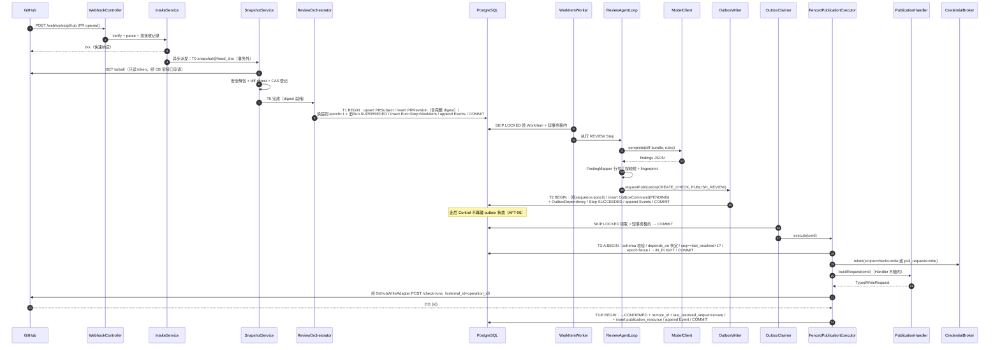
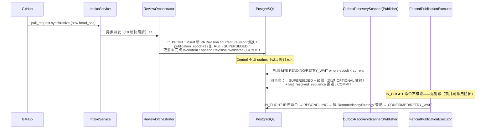
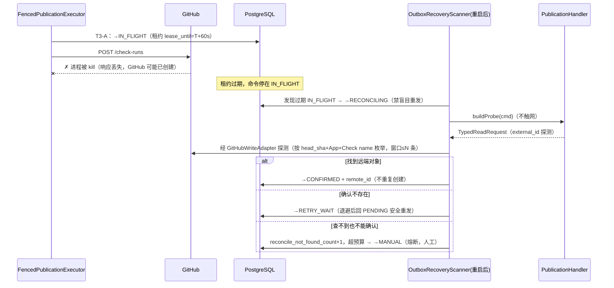
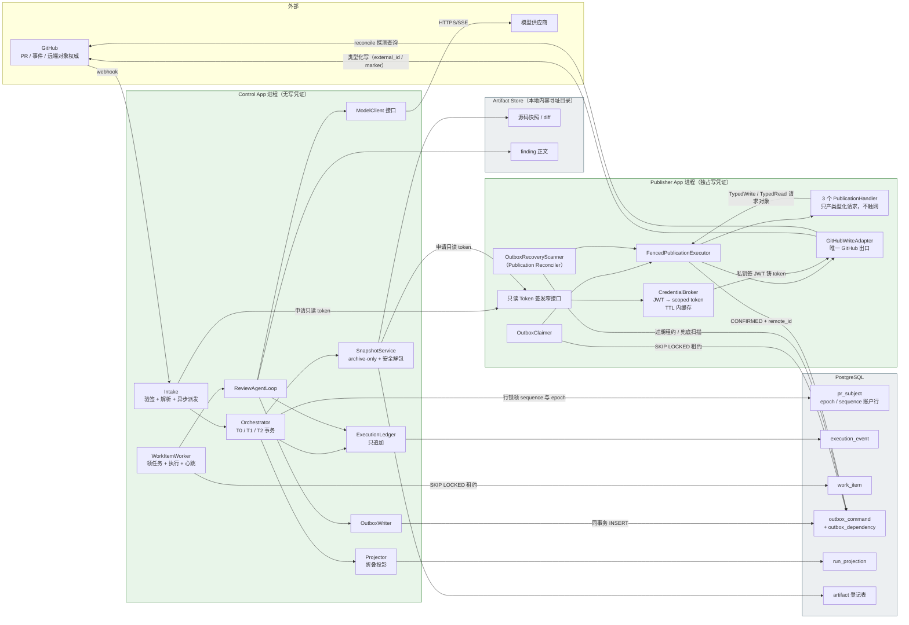

# M0 最小可靠骨架 —— 技术方案与任务拆解（v1.1）

> **依据**：架构冻结文档 v2 + v2.1（修订二/三）+ v2.2（五项裁定 + E1–E10）；开源证据见《OSS-证据清单-v1.md》。
> **M0 范围**（冻结文档 §9/§10.1）：F1-A/F1-B、最小执行账本、单 Agent 只读 Review、最小 Outbox（八态）、独立 Publisher、F9 revision/epoch fence、GitHub Check/Review 写回、**Publication Reconciler（崩溃收敛，评审修正 #1）**。
> **M0 明确不做**：Webhook Inbox 去重与 **PR State / Drift Reconciler**（M1）、断点续跑演示强化（M2）、模型治理（M3）、沙箱（M4）、Patch 闭环（M5）、回放（M6）、前端页面（后续里程碑）。
> **修订记录**：v1.0 初版 → v1.1 按评审意见修 6 项（Publication Reconciler 进 M0、补 WorkItem Worker、T1 顺序、Publisher 依赖结构、last_resolved_sequence、Control↔Publisher 表述）+ 4 项顺手修正（422 归类、has_table_privilege 自检、Control 侧安全解包、INC-05/06 移出）。

---

## 1. 核心问题

M0 要回答的不是"能不能让 AI 评论代码"，而是一个工程命题：

> **当一个 LLM Agent 的评审结论要被写到 GitHub 这个外部权威系统时，如何保证"崩溃不重复、换届不污染、越权不可能"？**

三个子问题：

1. **可靠性**：进程在任意时刻被 kill，GitHub 上不能出现重复评论/重复 Check；恢复后不能从头重审整条 PR。
2. **时效正确性**：PR 来了新 commit（或规则变更），旧代码世代的评审结论绝不能写到新代码上（F9）。
3. **权限收敛**：运行不可信输入驱动的 Agent 的进程，物理上拿不到 GitHub 写凭证（F1-A/F1-B）。

市面上"LLM 接 GitHub API 直接评论"的玩具实现三个问题全踩：重试即重复评论、无世代概念、写 token 和不可信代码同进程。M0 就是把这三件事的骨架一次做对——**账本、Outbox、Publisher、fence 四件套从 day 0 就在，因为它们事后加不进来**（冻结文档 B5）。

---

## 2. 模块划分与任务拆解

两个 Gradle/Maven 模块（两个独立可部署单元），各自 DDD 四层：

```
control-app/          写凭证零接触
  interfaces/         WebhookController、RunQueryController（只读查询）
  application/        IntakeService、ReviewOrchestrator、WorkItemWorker、T0/T1/T2 事务脚本
  domain/             实体/值对象/状态机/领域服务/Repository 接口/ModelClient 接口
  infrastructure/     Postgres Repository 实现、Spring AI 适配器、GitHub 只读适配器、CAS ArtifactStore
publisher-app/
  interfaces/         仅一个窄接口：为 Control 签发只读 Token（评审修正 #6；无其他 HTTP 入站）
  application/        OutboxClaimer、OutboxRecoveryScanner（Publication Reconciler）、T3 事务脚本
  domain/             FencedPublicationExecutor、PublicationHandler、RemoteIdentityStrategy、RevisionFence
  infrastructure/     Postgres Outbox Repository、GitHubWriteAdapter（唯一写出口）、CredentialBroker
shared-kernel/        仅值对象与枚举（状态枚举、命令类型、digest 工具）；不含任何框架依赖
```

| 任务 | 内容 | 依赖 | 验收 |
|---|---|---|---|
| M0-T01 | 工程骨架：Java 21、Spring Boot 3.x、双模块 + shared-kernel、Flyway、ArchUnit、Testcontainers、`git init` + 关联远程仓库 `https://github.com/objwww/PR.git` | — | 双应用可启动空跑；本地仓库可推送 |
| M0-T02 | V1 DDL：M0 表 + 不可变 trigger + DB 角色权限脚本 | T01 | 迁移通过；control 角色 UPDATE outbox 被拒 |
| M0-T03 | 领域模型 + 状态机（Run/Step/Attempt/Outbox 八态）+ epoch/sequence 服务 | T02 | 状态机单元测试全绿 |
| M0-T04 | ExecutionLedger（追加事件）+ Projector（折叠投影）| T03 | fold(events) == projection 一致性测试 |
| M0-T05 | Intake 最小版：webhook 验签 + PR 事件解析 + 异步派发（**无 inbox 去重，M1 补**）| T03 | 签名错误 401；合法事件触发 T0/T1 |
| M0-T06 | SnapshotService：按 SHA 取 tarball 快照（**只 archive 不 checkout**）+ **安全解包**（防路径穿越/恶意链接/压缩炸弹，B22 规则在 Control 侧同样适用，评审修正）+ digest + CAS 落盘 | T03 | digest 可复算；恶意 tar 测试样本被拒 |
| M0-T07 | ModelClient 领域接口 + Spring AI 单适配器 + 超时/预算最小实现 | T03 | mock 模型可注入 |
| M0-T08 | ReviewAgentLoop：确定性文件选择 → diff 打包 → 模型调用 → Finding 解析 → 行号工程映射 → fingerprint | T06/T07 | 模型输错行号时工程代码纠正或丢弃 |
| M0-T09 | OutboxWriter：T2 事务内原子领 sequence+epoch、插类型化命令、插依赖 | T03/T04 | 并发双写唯一约束测试 |
| M0-T10 | **Control WorkItem Worker**（评审修正 #2）：SKIP LOCKED 领取 work_item → 短事务租约 → 执行 Step（调 ReviewAgentLoop/Snapshot 等 Step 执行器）→ 心跳 → T2 完成；租约过期重领、晚到结果栅栏 | T03/T08 | kill -9 后租约过期由其他 worker 接管；晚到结果记 STALE 不推进 |
| M0-T11 | Publisher 核心：OutboxClaimer（SKIP LOCKED + 短事务租约）+ FencedPublicationExecutor（validate→dependency→跳号检测→fence→IN_FLIGHT→经 GitHubWriteAdapter 写→结果，v2.2 E1/E2）| T03 | AFT-07 结构测试 |
| M0-T12 | 三个 Handler（CREATE_CHECK/UPDATE_CHECK/PUBLISH_REVIEW）+ 各自 RemoteIdentityStrategy。**Handler 只产出类型化请求/探测请求对象并解释响应，不引用、不调用 GitHubWriteAdapter**（评审修正 #4，B27 结构封死）| T11 | ArchUnit 证明 Handler 对适配器零依赖 |
| M0-T13 | **Publication Reconciler**（评审修正 #1）：OutboxRecoveryScanner 周期扫描过期 IN_FLIGHT/RECONCILING → 调 Handler.reconcile 探测 → CONFIRMED/RETRY_WAIT/MANUAL；退避与 attempt 预算（B13 半步）| T11/T12 | ST-03/04 崩溃恢复场景通过 |
| M0-T14 | CredentialBroker：App JWT → installation token（铸造收窄 scope、TTL 内缓存，v2.2 E6）+ 只读 token 签发窄接口；GitHub 读适配器（Control 用）| T11 | Control 容器内无任何写 scope 凭证 |
| M0-T15 | 启动自检（B25）：Control 断言无写凭证 + `has_table_privilege` 断言对 outbox 无 UPDATE 权（评审修正：不真实修改、不回滚试探写）；Publisher 断言私钥只读、非 root | T02/T14 | 故意配错时进程拒绝启动 |
| M0-T16 | ArchUnit AFT-01/02/03/04 静态部分 | T01 | CI 红绿验证 |
| M0-T17 | 集成测试套件（Testcontainers Postgres + WireMock GitHub stub）：闭环场景 | T08/T13 | §12 测试矩阵全绿 |
| M0-T18 | docker-compose 双容器 + B16 hardening（non-root、只读 rootfs、cap_drop ALL、私钥只读挂载、不共享可写文件系统）+ 部署验证脚本 | 全部 | 一键起栈跑通真实 PR（或 stub） |

---

## 3. 领域模型与类设计

### 3.1 Control App 侧

| 类 | 层 | 职责 | 不做什么 |
|---|---|---|---|
| `PRSubject` | domain 实体 | PR 本体投影；`current_revision_id`、`current_policy_version`、`publication_epoch`、`next_outbox_sequence`、`last_resolved_sequence` 的**唯一账户行**（评审修正 #5：游标改名，语义见 §6.1 T3）| 不存评审内容 |
| `PRRevision` | domain 值对象 | 不可变代码身份：`head/base/merge_base/diff_digest` → `revision_fingerprint`；**insert 时 digest 必须已算好**（评审修正 #3）| 创建后不可改（DB trigger 兜底）|
| `ReviewRun` | domain 实体 | 一次逻辑评审长事务；`run_key = hash(revision + policy + prompt + toolset + trigger)`；`root_run_id/parent_run_id` 双字段 lineage（v2.2 E9）| 不管物理重试 |
| `RunStep` / `StepAttempt` | domain 实体 | 逻辑步骤 / 物理尝试分离（证据 A-3：Temporal 同构）| Attempt 不进入逻辑幂等键 |
| `ExecutionLedger` | domain 服务 | `append(event)` 唯一入口；事件只 append；attempt start 不进账本（v2.2 E10）| 不提供 update |
| `Projector` | domain 服务 | `fold(events) → run_projection`；M0 只做增量投影，重建接口预留（M6）| 不回写事件 |
| `RevisionService` | domain 服务 | 计算 fingerprint；判定 revision/policy 是否变化 | 不触碰 Outbox（v2.1 修订三）|
| `SequenceAllocator` | domain 服务 | T2 内对 `pr_subject` 行 `UPDATE ... RETURNING` 原子领 `(sequence, epoch)` | 不用 MAX()+1、不用 Redis 锁 |
| `OutboxWriter` | application | 装配类型化命令（含 `fence_mode`）+ 依赖边，与领域状态同事务提交 | 不直接调 GitHub、不 UPDATE outbox |
| `ReviewAgentLoop` | domain 服务 | 外层确定性状态机 + 内层 agent 循环；文件选择、预算、步进 | 不决定"哪些文件悄悄不看"（确定性清单）|
| `ModelClient` | domain 接口 | `complete(request) -> response`；领域层唯一模型依赖（Spring AI 仅作适配器）| 不含供应商概念 |
| `ToolRegistry` + `PolicyEngine` | domain | M0 最小：2 个只读工具（read_file / search_in_snapshot），每次调用过 Policy | Registry 发现 ≠ 授权 |
| `FindingMapper` | domain 服务 | 模型输出 `existing_code+finding` → 工程代码定位精确行号 → `finding_fingerprint` | 不信 LLM 数的行号（19 阶段表 #8）|
| `SnapshotService` | application | T0（事务外）：按 SHA 经 tarball/codeload 取快照 → **安全解包**（拒绝绝对路径/`..`/逃逸 symlink/特殊文件；限制总大小与文件数）→ digest → CAS | 不 checkout、不执行仓库任何代码 |
| `IntakeService` | application | 验签（HMAC）→ 落最小接收记录 → 立即 2xx → **异步**派发 T0/T1（LLM/clone/diff 不在 HTTP 线程，19 阶段表 #1）| M0 不做 inbox 去重（M1）|
| `ReviewOrchestrator` | application | T0/T1（建 Run）/T2（完成 Step）事务脚本的编排者 | 不写 GitHub |
| `WorkItemWorker` | application（评审修正 #2）| 虚拟线程池轮询 `work_item`：SKIP LOCKED 领取 → 短事务租约 → 派发给 Step 执行器 → 心跳 → T2 收尾；**持久化执行与恢复的真正执行者** | 不自己实现业务步骤逻辑 |

### 3.2 Publisher App 侧

| 类 | 层 | 职责 |
|---|---|---|
| `OutboxClaimer` | application | `FOR UPDATE SKIP LOCKED` 抢 PENDING/RETRY_WAIT → 短事务写 lease（owner/until/epoch+1）→ 立即提交；全局单 Worker（MVP 自然保序）|
| `OutboxRecoveryScanner`（Publication Reconciler）| application（评审修正 #1）| 周期扫描：过期 IN_FLIGHT → RECONCILING；到期的 RECONCILING → 调对应 Handler 的 `reconcile()` → CONFIRMED / RETRY_WAIT / MANUAL（超预算熔断）；supersede 兜底扫描（v2.1 修订三）|
| `FencedPublicationExecutor` | domain 服务 | **唯一引用 GitHubWriteAdapter 的类**（B27/AFT-07）：① schema 校验 ② depends_on 终态判定（v2.2 E3 归类表）③ sequence 跳号检测（v2.2 E2）④ epoch fence（fence_mode 分类）⑤ 标 IN_FLIGHT（①–⑤ 同一事务）⑥ 从 Handler 取类型化请求 → 经 GitHubWriteAdapter 执行 ⑦ 结果落账 |
| `PublicationHandler`（接口）| domain（评审修正 #4）| `buildRequest(cmd) -> TypedWriteRequest`、`interpret(response) -> outcome`、`buildProbe(cmd) -> TypedReadRequest`、`interpretProbe(...) -> reconcile verdict`；三个实现：CreateCheck / UpdateCheck / PublishReview。**零 GitHub 客户端依赖** |
| `RemoteIdentityStrategy` | domain | 每类副作用的远端身份探测规则（作为 Handler 的 probe 逻辑数据）；搜索窗口上限，查不到进 MANUAL（B12）|
| `RevisionFence` | domain 服务 | `CURRENT_EPOCH` 命令比对 `pr_subject.publication_epoch`；`OWNED_GENERATION` 命令放行旧世代收尾；epoch 超前 → 可重试（v2.2 §3-6）|
| `CredentialBroker` | infrastructure | App 私钥签 JWT → 铸造 installation token（收窄 scope、TTL 缓存）；对 Control 暴露**唯一的只读 token 签发窄接口**（评审修正 #6）；私钥不出进程、token 只存内存 |
| `GitHubWriteAdapter` | infrastructure | 唯一持有写 token 的 HTTP 客户端，也承载 reconcile 探测读；只被 `FencedPublicationExecutor` 引用（ArchUnit 卡死）|

### 3.3 shared-kernel

`OperationId`、`Digest`、`RevisionFingerprint`、状态枚举（`OutboxState` 八态、`RunState`、`StepState`、`AttemptStatus`）、`CommandType`、`DependencyMode`、`FenceMode`、`TypedWriteRequest/TypedReadRequest`（类型化请求契约）。**零框架依赖**——两个应用的 domain 层只允许依赖它（AFT-01 的卡点）。

---

## 4. 类交互时序图

### 4.1 评审主链路（PR opened → Check + Review 落 GitHub）



### 4.2 Push 新 commit（synchronize）→ 旧世代终止



### 4.3 Publisher 崩溃 → 不确定窗口收敛（effectively-once 的核心演练）



---

## 5. 数据流与链路图



**关键链路约束**（图上读不出的）：

- Control 与 Publisher 的 GitHub **写**协作只经 `outbox_command` 表（Control 仅 INSERT 权限，Publisher 仅 SELECT/UPDATE——DB 角色强制，AFT-06）。
- Control → Publisher 存在**且仅存在**一个直接调用：经 CredentialBroker 窄接口申请仓库级、短期、**只读** token（评审修正 #6，对齐冻结文档 §15"只经 Outbox"的精确安全表述）。除此之外无任何 Control↔Publisher 直连。
- 大对象（快照、diff、finding 正文、模型响应）只进 CAS，账本/命令表只存 digest（v2.2 §5 `artifact` 表登记）。
- 模型流式 token chunk 走内存，不进账本（§2.5 账本边界）；账本只记 intent/result 级事实（E10：attempt start 不进账本）。

---

## 6. 具体实现方式（关键技术点）

### 6.1 四步链路、三笔事务（落地 v2.2 E1：检查与状态推进同事务）

- **T0 快照准备**（Control，**事务外**）：按固定 SHA 取 tarball → 安全解包 → 算 `diff_digest`/`source_snapshot_digest` → CAS 落盘 + artifact 登记。**网络 I/O 不进 DB 事务**（评审修正 #3：先 digest 后 Revision，且不动事务边界原则）。
- **T1 建 Run**（Control）：upsert PRSubject → 比对 fingerprint 决定是否 insert PRRevision（**digest 已就绪，一次性插完整不可变行**）→ 若 revision 或 policy 变化：`current_revision_id` 切换 + `publication_epoch+1` + 旧 Run SUPERSEDED（同事务）→ insert Run + 首个 Step + WorkItem → append 事件。任一步失败整笔回滚。
- **T2 完成 Step**（Control）：校验 work_item 租约（`lease_owner + lease_epoch`，晚到结果 UPDATE 0 行则记 `STALE` 不推进）→ Attempt/Step 状态推进 → 若需写 GitHub：`UPDATE pr_subject ... RETURNING` 原子领 `(sequence, epoch)` → INSERT outbox_command(PENDING, fence_mode) + outbox_dependency → append 事件 → COMMIT。
- **T3 发布**（Publisher）：短事务 A = schema 校验 + 依赖终态判定（E3 归类表）+ 跳号检测（E2，见下）+ epoch fence + →IN_FLIGHT + 租约；**提交后才经 GitHubWriteAdapter 调 GitHub（不持 DB 锁跨外部调用）**；短事务 B 按结果 →CONFIRMED（+remote_id +publication_resource +推进游标）/ →RECONCILING / →RETRY_WAIT。

**保序游标 `last_resolved_sequence`**（评审修正 #5）：
- 所有"已解决"终态都推进游标：CONFIRMED、SUPERSEDED、FAILED_TERMINAL——在标终态的**同一事务**内 `last_resolved_sequence = seq`；
- `MANUAL` **不推进**，阻塞同 PR 后续命令直到人工解决（保序 > 可用性，刻意取舍）；
- 领取校验从 `seq == last_applied+1` 改为 `seq == last_resolved+1`；跳号仍触发对账事件（E2）。

### 6.2 类型化命令与二次授权（B15 + 评审修正 #4）

`outbox_command` 只允许 `command_type ∈ {CREATE_CHECK, UPDATE_CHECK, PUBLISH_REVIEW}`（M0），payload 存 CAS digest + `payload_hash`；**表结构上没有 URL/method 字段**。Handler 不接触网络：只把命令翻译成 `TypedWriteRequest`（封闭的请求对象：操作枚举 + 仓库 + 对象参数）/ `TypedReadRequest`（探测），由 `FencedPublicationExecutor` 统一交给 `GitHubWriteAdapter` 执行——ArchUnit 断言 Handler 包对适配器包零依赖（AFT-04/AFT-07 结构封死）。Publisher 每类命令有白名单校验：Check 名称白名单、PR 归属 installation、head SHA 与命令所属 revision 一致。

### 6.3 RemoteIdentityStrategy（B12，M0 三策略）

| 命令 | 本地幂等键 | 远端探针 | reconcile 窗口 |
|---|---|---|---|
| CREATE_CHECK | `operation_id` UNIQUE | `external_id = operation_id` + name + head SHA | 按 commit SHA 枚举该 SHA 下本 App 的 checks |
| UPDATE_CHECK | 已存 `check_run_id` | GitHub check run id | GET by id；404 → 按策略重建或 MANUAL |
| PUBLISH_REVIEW | `operation_id` | review body 隐藏 Marker `<!-- ai-review:{operation_id} -->` | 分页查该 PR 本 App 的 reviews，上限 N 页 |

- reconcile 查不到 ≠ 不存在，超窗口/超预算 → MANUAL（B12 半步）。
- **422 归类**（评审顺手修正）：GitHub 对 Reviews API 返回 422 且原因是 commit/head 不匹配时，这是**确定性否定应答**（外部结果已知 = 未创建），命令标 `SUPERSEDED`（记 `last_error_code=STALE_HEAD`），不违反孤儿副作用防护；参数错误等其他 422 仍是 `FAILED_TERMINAL`。

### 6.4 幂等与凭证（v2.2 E6）

- `operation_id = run_id-step_key-逻辑项`（Temporal 官方推荐格式，证据 A-2）；唯一约束在 DB 层（官方明确警告 check-then-act 竞态）。
- CredentialBroker：缓存键 `(installation_id, scope)`，TTL 内复用（GitHub 官方建议），过期前 5 分钟刷新；token 不落库不落日志。

### 6.5 启动自检（B25 运行时门 + 评审顺手修正）

- Control：断言环境无 `GITHUB_APP_KEY` / 任何写 scope token；执行 `SELECT has_table_privilege(current_user, 'outbox_command', 'UPDATE')`，为 true 则**拒绝启动**（只读权限元数据，不做真实修改、不用试探写入回滚）。
- Publisher：断言私钥文件只读、进程非 root；断言无模型 key 环境变量。

### 6.6 模型与 Agent（M0 最小）

`ModelClient` 领域接口：`complete(ModelRequest) -> ModelResult`（含 token 用量）。Spring AI `ChatClient` 在 infrastructure 实现适配（百炼 OpenAI 兼容端点，配置见 `.env`）；超时 + 单次调用 token 预算硬上限（超了 Step 失败，不降级安全步骤）。Agent loop M0 是**单轮**为主：确定性文件清单 → diff 打包 → 一次（或按 bundle 分组少量几次）调用 → 结构化 Finding 输出。工具循环只留接口与 Policy 检查点，M0 不放开自由探索（多轮工具循环是 M2+ 的事）。

---

## 7. 边界条件与不变量

**结构不变量（ArchUnit/启动自检强制）**：
- I1 domain 不依赖 Spring/JDBC/GitHub SDK/模型 SDK（AFT-01）。
- I2 Control 全链路无 GitHub 写能力（AFT-02 静态 + 启动自检 + 容器无挂载三重门）。
- I3 模型输出 schema 无 token/url/permission 字段（AFT-03）。
- I4 只有 `FencedPublicationExecutor` 能引用 `GitHubWriteAdapter`；Handler 包对其零依赖（AFT-07 结构封死，B27 + 评审修正 #4）。

**运行时不变量（集成测试强制）**：
- I5 同一 `operation_id` 无论重试多少次，GitHub 上至多一个副作用对象（effectively-once）。
- I6 旧 epoch 命令永远不能抵达 GitHub 写调用（fence_mode=CURRENT_EPOCH）；OWNED_GENERATION 命令只操作它所属世代的对象。
- I7 `IN_FLIGHT` 命令不因换届被直接 SUPERSEDED（孤儿副作用防护，v2.1 §11.1）。
- I8 `aggregate_sequence` 无重复（唯一约束）、无静默跳号（跳号 = 对账事件，E2）；游标语义为 `last_resolved_sequence`，MANUAL 阻塞推进（评审修正 #5）。
- I9 账本只追加：`execution_event` / `pr_revision` UPDATE/DELETE 被 trigger 拒绝。
- I10 Control 角色对 `outbox_command` UPDATE 必然失败（DB 权限，非应用纪律）。
- I11 晚到结果（lease_epoch 过期）只能记 `STALE`，不能推进 Step/Run。
- I12 Revision 是不可变量：insert 时 digest 已就绪，同 fingerprint 复用行，不覆盖（评审修正 #3）。

**显式承认的边界（诚实清单）**：
- B-1 fence 有 TOCTOU 窗口（fence 通过后、GitHub 写完成前 PR 可能前进）：M0 缓解 = Reviews API 绑 `commit_id`（SHA 变了 GitHub 自己 422 → 按 §6.3 归类 SUPERSEDED）+ 写后回读校验；残余窗口由 M1 的 PR State Reconciler 检出。
- B-2 租约窗口内僵尸 worker 的完成上报是合法的（证据 A-4）；去重最终靠幂等键，不靠 lease 实时拦截。
- B-3 M0 无 webhook 去重：同一 delivery 重投会尝试建重复 Run——`run_key` 唯一约束兜底（第二次 INSERT 失败即幂等返回），完整 inbox 语义 M1 补。
- B-4 单 Publisher 单 Worker：写吞吐 = 串行，Publisher 宕机 = 写暂停但不丢（PENDING 堆积，恢复后继续）。这是刻意的 MVP 取舍（冻结文档 §5.3）。
- B-5 Docker Compose secrets 是受控文件挂载 ≠ KMS（B16 诚实边界）。
- B-6 M0 无沙箱：不可信 PR 代码只做**静态阅读**（archive 解包 + 文本分析），从不执行；执行类验证是 M4 的事（证据 B-5：archive-only 规矩）。

---

## 8. 设计思维：为什么这样设计

1. **交易系统的思路，不是聊天机器人的思路**。核心判断（冻结文档 §0）：Agent Runtime 的可靠性问题与支付/账务系统同构——不可变输入、追加账本、effectively-once 副作用、对账收敛。所以我们从 Temporal/Kafka/K8s 抄决策结构，而不是从 LangChain 抄链式调用。
2. **让正确的事容易，让错误的事编译不过/启动不了**。fence 不靠"每个 Handler 记得调 check"，而是把网络出口锁进 `FencedPublicationExecutor`（Handler 只产类型化请求对象，连适配器都引用不到）+ ArchUnit 卡死 + DB 角色兜底 + 启动自检——四层防线，每层独立失效模式。
3. **命令与资源分离**（v2.2 §1）：八态回答"尝试的历史"，resource 表回答"对象的现状"。混在一起就会出现 DRIFTED 第九态那种语义打架。
4. **epoch 而不是版本对**（v2.2 §3）：领序号与读 epoch 在同一行锁下完成，命令不可能带过期 epoch 出生；单调整数比较比多字段对比较更不容易写错。
5. **不确定性是状态，不是异常**。IN_FLIGHT/RECONCILING 存在的意义：本地 DB 与 GitHub 之间没有分布式事务，"发出去了没有"是个必须用状态机管理的认知问题（冻结文档 §5.1 三种崩溃窗口）。装没看到（直接重试）= 重复评论；悲观放弃 = 丢失发布。八态机 + Publication Reconciler 是承认现实后的最优解。
6. **每个组件都要有真实的执行者**。表和状态机不等于机制——`work_item` 必须有 WorkItem Worker 消费，`RECONCILING` 必须有恢复扫描器驱动（评审修正 #1/#2 的教训：设计评审时要追问"谁在跑这个循环"）。
7. **最小但不残缺**。M0 砍广度（单 Agent、无沙箱、无前端），但交易基因一样不少——因为 Outbox/fence/账本事后加不进来（B5），而沙箱/多 Agent 事后加得进来。

---

## 9. 当前方案的问题与压力点（→ M1 的工作清单）

M0 是刻意收窄的骨架，以下压力点是**设计内已知**的，不是疏漏；它们按压力排序，自然构成 M1 的范围：

| # | 压力点 | 触发条件 | M1 对策 |
|---|---|---|---|
| P1 | **无 Webhook Inbox**：delivery 重投靠 `run_key` 唯一约束兜底，但"同一事件、不同处理结果"（如首次处理到一半崩溃）无幂等保护；乱序事件（synchronize 先于 opened 到达）会把投影搞乱 | GitHub 重投/乱序，生产环境必然发生 | M1：webhook_inbox 表 + delivery 去重 + 状态机化处理 |
| P2 | **只有 Publication Reconciler**：M0 已覆盖写命令的崩溃收敛；但 PR 状态漂移（webhook 丢失）与远端对象漂移（评论被删）无巡检者——`publication_resource` 表 M0 已建但暂无 Drift 巡检 | 任何 webhook 丢失 / 远端人工删除 | M1：PR State Reconciler + Drift Reconciler（周期全量 + 事件驱动混合，证据 C-3）|
| P3 | **无 Draft PR 处理**：draft 期间的频繁 push 会触发完整评审，烧 token | 第一个 draft PR | M1：draft 只做廉价预检（19 阶段表 #2）|
| P4 | **断点续跑是 Step 粒度**：WorkItem Worker 已使恢复真实发生，但"kill -9 后重复工作量 < 20%"未验证；无 Step 内 heartbeat checkpoint（证据 A-3） | 演示/故障时 | M2：Attempt/heartbeat 级 checkpoint |
| P5 | **模型治理裸奔**：无流式 UI、无熔断/fallback、无精确缓存、无成本账本 | 第一次模型抖动/账单 | M3：Model Gateway 成形 |
| P6 | **单 Publisher 单点 + 全局串行**：写吞吐上限 = 单 worker；MANUAL 命令阻塞整个 PR 的后续写（游标语义代价） | 并发 PR 数 > 2 | M7：per-PR 并发（依赖环检测 + depends_on 超时是预留的缝）|
| P7 | **无 retention**：`execution_event`/artifact 只增不减 | 磁盘 | M2/M6 期间出归档 ADR（不可变 trigger 与归档的冲突，v2.2 已记录）|
| P8 | **CredentialBroker 窄接口是 MVP 形态**（loopback + 共享密钥，非 mTLS） | 跨机部署时 | M4 与沙箱 mTLS 一起收 |
| P9 | **Token 缓存的时钟/并发**：同 scope 缓存复用在多实例 Publisher 下需重新评估 | 多实例化时 | M7 |

## 10. 已发生的实际后果（诚实记录）

本项目尚未上线，无线上事故。设计过程中已暴露的**真实缺陷**和同构系统的**前车之鉴**记录如下——它们是这套设计的存在理由。（操作类事故如备份静默失败与本架构无关，统一收录在 `docs/BUGLOG.md` INC-05/06，此处不展开以保持叙事聚焦。）

### 10.1 本项目设计评审中已暴露并修复的缺陷

| 编号 | 缺陷 | 后果 | 修复 |
|---|---|---|---|
| INC-01 | 初版 Outbox 设计把 `DRIFTED` 塞进命令状态机 | 命令历史（曾确认成功）被资源现状（后来没了）污染，语义打架 | v2.2 §1：漂移移入 `publication_resource`，Outbox 回到八态 |
| INC-02 | 初版 Patch 状态机无 `VERIFICATION_FAILED`，`VERIFYING` 无失败出口 | 沙箱验证失败（正常业务结果）无状态可落 | v2.2 §2 |
| INC-03 | Revision/Generation 拆分后 fence 只比 `pr_revision_id` | 旧 policy 世代的在途命令能穿过 fence 写到新规则世代 | v2.2 §3：epoch fence |
| INC-04 | 无条件 digest CHECK 约束 | 换包事故无法落库取证（UPDATE 直接抛异常） | v2.2 §4 条件 CHECK |
| INC-07 | M0 初版方案漏了 WorkItem Worker 与 Publication Reconciler；T1 先插 Revision 后算 digest；Handler 直触网络；保序游标跨不过 SUPERSEDED | 持久化执行无执行者、崩溃收敛无归属、不可变行自相矛盾、B27 防线漏洞、游标假跳号 | 本版（v1.1）评审修正 #1–#6，全部收录 `docs/BUGLOG.md` |

### 10.2 同构系统的前车之鉴（证据清单有完整出处）

| 事故 | 与 M0 设计的对应防线 |
|---|---|
| Atlantis #1508：审批不绑定工件，批准后可对任意目录 replan+apply | 审批绑定精确 hash + 失效自包含（v2.2 E8）——M5 承重 |
| Atlantis #6529：apply 不校验 plan 归属 HEAD，且出现 0/0 空转成功 | 三 hash 等集且非空（v2.2 E4）|
| OpenHands #4271/#9168：GitHub token 进沙箱后经 `.git/config`/`echo` 泄露 | F1-C + 沙箱零凭证 + archive-only（M4 承重，M0 已守 F1-A/B）|
| Grafana 2026-05：`pull_request_target` + checkout 不可信代码 → token 被盗拖库 | D1 选 App 不选 Action；webhook 只当"状态可能变化"的通知 |
| tj-actions CVE-2025-30066：可变 tag 重指恶意 commit | 一切外部引用 pin 到不可变 digest/SHA |
| Codecov 2021：脚本被篡改两月无人知，唯一对比 SHA-256 的客户发现了 | digest 校验 + 对账 |
| BinAuthz 服务不可达时 fail-open | 安全门禁 fail-closed 显式冻结（v2.2 E5）|
| HBase/GitHub 网络分区事故（Kleppmann 文引） | fence 在存储端同事务原子完成（v2.2 E1），禁止客户端自检后写 |

## 11. 技术债分析：如果维持"朴素方案"不改进

假设走捷径：单应用、Controller 里直接调 GitHub、无账本、无 Outbox、无 fence。债务不是线性累积，是**利息复算**的：

1. **第 1 个月**：省掉约 40% 的 M0 工作量，demo 更快。代价已埋下：每次网络抖动重试都可能重复评论，但频率低，没人注意。
2. **第 3 个月**：第一次"同一 Finding 评论三遍"发生在客户/面试官面前。修复 = 加重试去重——但没有 operation_id 概念，只能在应用层 check-then-act（Temporal 官方明示有竞态），修完仍有窗口。
3. **第 6 个月**：想补"崩溃恢复"。没有账本就没有恢复点，只能整条重审——重复评论加剧；此时想补账本，发现**历史数据没有事件可回放**，投影无法重建，等于给行驶中的车换底盘。
4. **第 9 个月**：想加 Patch 审批闭环。没有类型化命令边界，GitHub 写调用散落在 N 个类里，"100% 写经过单点"需要全代码库考古式重构；没有 fence，"旧结论写新代码"事故在引入自动修复后被放大成"旧补丁打到新代码"。
5. **终局**：每一处修复都要求"先停下来清洗线上已污染的数据 + 重写调用方"，成本是最初做对的 5–10 倍，且有些债（已发出的重复评论、被覆盖的审计线索）**永久不可修复**。

反向结论：M0 四件套（账本/Outbox/Publisher/fence）的成本是固定一次性成本；不做的成本是随业务量和时间复利的。**这就是 B5"事后加不进来"的定量含义。**

---

## 12. 测试用例设计

### 组织逻辑

按"防线层级"组织而非按类组织：静态结构（写错代码）→ 单元（算错逻辑）→ 组件规则（状态机/约束）→ 业务闭环（用错场景）→ 边界异常（环境作恶）→ 部署门（配错环境）。每层防的失效模式不同，对应 B25 的分层验证。

### L0 静态架构测试（ArchUnit + 契约，秒级，CI 必过）

| 用例 | 断言 |
|---|---|
| AFT-01 | `domain..` 不依赖 `org.springframework..`/`java.sql`/`github..`/模型 SDK 包 |
| AFT-02s | control-app 无类引用 `GitHubWriteAdapter`/`CredentialBroker` 实现包 |
| AFT-03 | inference/model 包不依赖 publication/credential/approval 包；模型输出 schema 无 token/url 字段（Jackson schema 反射断言）|
| AFT-04 | 只有 `FencedPublicationExecutor` 引用 `GitHubWriteAdapter`；**Handler 包对适配器包零依赖**（评审修正 #4）；Command/TypedRequest 类反射确认无 raw method/url 字段 |

### L1 单元测试（纯逻辑，无框架）

| 用例 | 场景 | 断言 |
|---|---|---|
| UT-01 | revision fingerprint 计算 | 同输入同值；head/base/diff/policy 任一变化值不同；policy 变化**不影响** fingerprint（v2.2 §3 拆分语义）|
| UT-02 | Outbox 八态机迁移 | 合法迁移表全覆盖；所有非法迁移抛 `IllegalTransition`（含 PENDING→CONFIRMED 跳态）|
| UT-03 | epoch fence 判定 | 等值放行；command<current → 拒绝；command>current → 返回"可重试"而非拒绝（E3/KIP-320 先例）|
| UT-04 | 依赖终态判定函数 | v2.2 E3 归类表 4×3 全组合（含 FAILED_TERMINAL 前置下 REQUIRE_CONFIRMED → SUPERSEDED 本命令）|
| UT-05 | FindingMapper 行号映射 | 模型报错位行号时按 `existing_code` 片段重新定位；片段不存在 → 丢弃该 finding 并计数 |
| UT-06 | finding fingerprint | 同内容同值；message 空白字符归一化 |
| UT-07 | run_key 幂等 | 同 trigger 重放 → 同 key（webhook 重投兜底的前提）|
| UT-08 | token 缓存键 | 同 (installation, scope) 命中；不同 scope 不串用；TTL 边界刷新 |
| UT-09 | 安全解包器 | 恶意 tar 样本（`../` 穿越、绝对路径、逃逸 symlink、压缩炸弹、设备文件）逐一被拒（评审顺手修正）|

### L2 组件规则测试（Testcontainers Postgres，秒至分钟）

| 用例 | 断言 |
|---|---|
| CT-01 序列原子分配 | 20 线程并发领同 PR 序号：无重复、无跳号、`uq(aggregate_key, sequence)` 是最后防线 |
| CT-02 晚到结果栅栏 | 租约过期 → 他 worker 重领（epoch+1）→ 旧 worker 提交 UPDATE 0 行 → Attempt 记 `STALE`，Step 不推进 |
| CT-03 不可变 trigger | UPDATE/DELETE `execution_event`、`pr_revision` 被拒 |
| CT-04 DB 角色权限 | control 角色 INSERT outbox 成功、UPDATE 被拒；publisher 角色反之；`has_table_privilege` 断言（AFT-06 动态部分）|
| CT-05 条件 digest CHECK | VERIFIED 且 digest 不等 → 拒；VERIFICATION_FAILED 记录失配 digest → 允许（INC-04 回归）|
| CT-06 级联 supersede | 前置 SUPERSEDED → PENDING 依赖同事务级联 + **游标同事务推进**；OPTIONAL 依赖不级联；IN_FLIGHT 不级联（v2.1 修订二 + v2.2 E3 + 评审修正 #5）|
| CT-07 游标语义 | SUPERSEDED/FAILED_TERMINAL 后下一命令可正常领取（游标已推进）；MANUAL 后下一命令**不可**领取（阻塞）；跳号触发对账事件（E2）|

### L3 业务场景 / 闭环链路测试（Postgres + WireMock GitHub stub + mock ModelClient）

| 用例 | 场景 | 断言（闭环判据）|
|---|---|---|
| ST-01 **评审主闭环** | PR opened → 全链路（含 WorkItem Worker 真实消费）→ Check + Review 落 stub GitHub | stub 收到 exactly 1 个 check（external_id=operation_id）+ 1 个 review（含 marker）；outbox 全 CONFIRMED；projection 与账本 fold 一致 |
| ST-02 **Push 换届** | 评审中 synchronize 新 commit | 旧 Run SUPERSEDED；旧 PENDING 命令被兜底扫描级联 SUPERSEDED 且游标推进；GitHub 上**零**旧世代对象；新世代新 Run 重新评审 |
| ST-03 **Publisher 崩溃恢复** | IN_FLIGHT 后 kill publisher 进程，GitHub stub 实际已创建 → 重启 | OutboxRecoveryScanner 收敛：RECONCILING → 按 external_id 找到 → CONFIRMED；**stub 调用计数证明无重复 POST**（effectively-once 核心证据）|
| ST-04 **崩溃且远端未创建** | 同上但 stub 未收到请求 | RECONCILING → RETRY_WAIT → 重发成功 exactly 1 次 |
| ST-05 **webhook 重投** | 同一 delivery 发两次 | run_key 唯一约束兜底：只有一个 Run；两次响应均 2xx |
| ST-06 **审核内容正确性** | mock 模型返回 3 个 finding（1 个行号错误） | 2 个精确定位、1 个丢弃；review 行级评论行号与 stub 收到的一致 |
| ST-07 **跨 PR 隔离** | 两 PR 并发评审 | 各自 sequence 空间独立；互不阻塞（MVP 单 worker 下按序但不错串）|
| ST-08 **Control 崩溃恢复** | T2 完成后 kill Control → 重启 | WorkItem 租约过期 → 被重领 → 已完成 Step 不重跑（账本短路）；晚到结果记 STALE |

### L4 边界异常测试

| 用例 | 注入 | 断言 |
|---|---|---|
| EX-01 | GitHub 500 连续 | RETRY_WAIT 退避 → attempt_count 达上限 → MANUAL，**不无限打转**（B13 熔断半步）；MANUAL 阻塞游标（评审修正 #5）|
| EX-02 | GitHub 422（head SHA 已变，Reviews API 拒绝）| 确定性否定 → **SUPERSEDED**（`last_error_code=STALE_HEAD`）；参数错误类 422 → FAILED_TERMINAL（评审顺手修正）|
| EX-03 | GitHub 超时（连接成功响应丢失）| →RECONCILING 而非盲目重发（§4.3 路径）|
| EX-04 | reconcile 翻页超窗口查不到 | 超预算 → MANUAL；不无限翻页（B12 半步）|
| EX-05 | epoch 超前的命令（人为构造）| 可重试返回，不 fence 误杀（v2.2 §3-6）|
| EX-06 | 模型超时/预算超限 | Step FAILED（安全步骤不降级）；Run 进入 FAILED 可恢复态；预算事件落账 |
| EX-07 | Control 重启于 T2 提交前 | 事务回滚，无半状态；重放 webhook 可重建 |
| EX-08 | 签名错误/ payload 畸形的 webhook | 401/400，不入库不建 Run |
| EX-09 | Publisher 领到非白名单命令（M0 不应存在）| schema 白名单拒绝 + FAILED_TERMINAL + 告警（防代理滥用回归）|
| EX-10 | T0 快照含恶意 tar 内容 | 安全解包拒绝 → Step FAILED_TERMINAL + 安全事件落账（不进评审流程）|

### L5 部署 / 运行时门（compose 栈，分钟级）

| 用例 | 断言 |
|---|---|
| DP-01 | `docker compose up` 一键起栈，启动自检通过 |
| DP-02 | 故意给 Control 容器挂私钥/写 token 环境变量 → Control **拒绝启动**（AFT-02 动态）|
| DP-03 | 故意给 control DB 角色授予 UPDATE outbox → `has_table_privilege` 自检失败，Control 拒绝启动（AFT-06 动态，评审顺手修正：不做真实写入试探）|
| DP-04 | Publisher 容器 hardening 检查：non-root、只读 rootfs、私钥只读挂载、`cap_drop ALL`、无 docker socket（B16 清单逐项）|
| DP-05 | 端到端冒烟：起栈后对 stub（或真实测试仓库）跑一次 ST-01 |

### 测试与冻结项的映射（可追溯性）

AFT-01/02/03/04 → L0；AFT-06 → CT-04 + DP-03；AFT-07 → CT-06/07 + ST-02/03 + EX-05；F1-B → DP-02/04；F4 → ST-03/04；F5 → ST-08；F9 → ST-02 + UT-03；B11/B12 → EX-03/04；B13 → EX-01；B15 → EX-09；B16 → DP-04；B22（Control 侧部分）→ UT-09/EX-10；B27 → AFT-04。**每个冻结项至少一个可执行测试，反之每个 L3/L4 用例都能回指冻结项。**

---

## 13. M0 验收标准（Definition of Done）

1. §2 任务 M0-T01~T18 全部完成，代码可直接运行；
2. §12 测试矩阵 L0–L5 全绿（L4 的 kill 类用例允许手动执行但必须有记录）；
3. docker-compose 双容器部署验证通过（DP-01~05）；
4. 真实或 stub GitHub 上完成一次完整评审闭环 + 一次 push 换届 + 一次 publisher 崩溃恢复演示（ST-01/02/03）；
5. **测试验证通过后，代码推送至项目仓库 `https://github.com/objwww/PR.git`**（含完整提交历史；推送 commit hash 记入 `docs/PROGRESS.md`）；
6. 文档同步：本方案 + v2.2 修订 + 证据清单 + `docs/PROGRESS.md` + `docs/BUGLOG.md`；
7. 用户明确确认"M0 已完成"后，方可进入 M1（P1–P3 为 M1 入口）。

*—— M0 技术方案 v1.1 完。*
