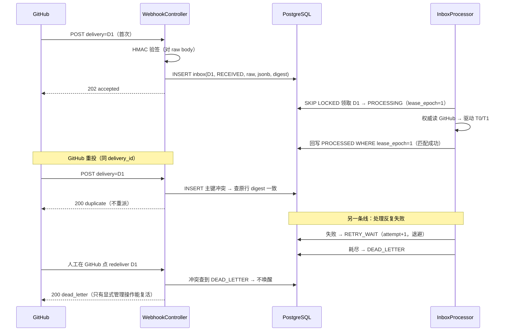
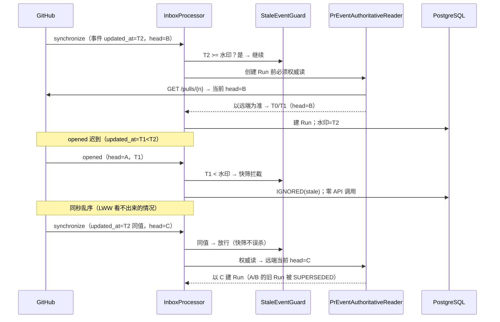
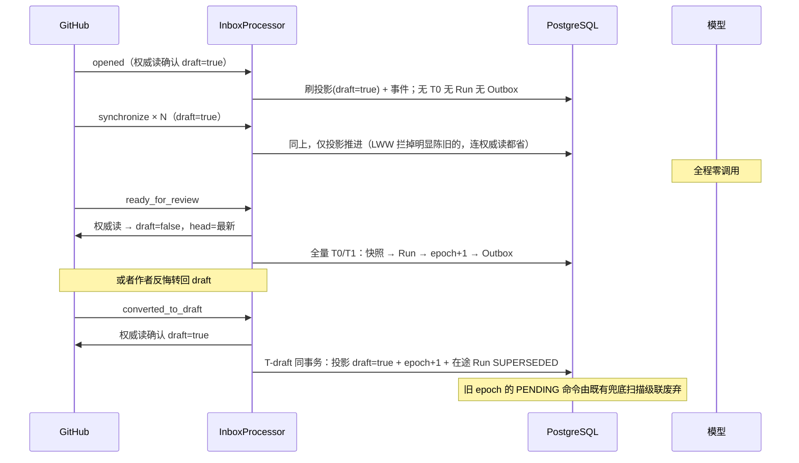
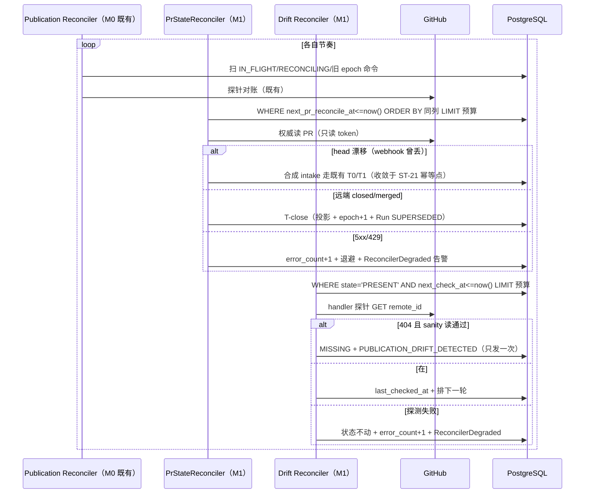
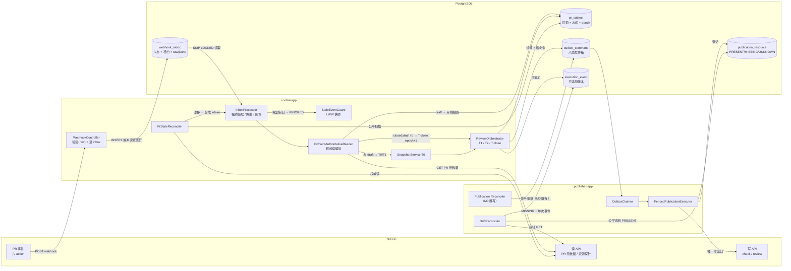

# M1 技术方案 —— 入口可信化：Webhook Inbox + 三 Reconciler 体系 + Draft 廉价预检

> 版本 **v1.2**（G1 二审修订版：BT/E2E 用例评审处置 + 测试交接规范）｜前置：M0 已过 G2 并推送 `objwww/PR@ae181a4`
> 范围依据：`docs/M0-技术方案.md` §9 压力点 P1/P2/P3 + BUGLOG INC-16（spec gap 留档项）
> 架构基准：`docs/架构冻结文档-v2.2-修订.md`（下称 v2.2）；OSS 证据：`docs/OSS-证据清单-v1.md`
> **本方案不含 M2 及以后的任何实现**；发现的后续依赖只记入 §8 压力点。

## v1.0 → v1.1 修订记录（G1 评审意见的逐条落点）

| # | 评审意见 | 落点 |
|---|---|---|
| 1 | 是**三** Reconciler，不是两个：M0 Publication Reconciler + M1 PR State Reconciler + M1 Drift Reconciler | §1/§3/§4.7 全文改称"三 Reconciler 体系" |
| 2 | Inbox 加 `lease_owner/lease_epoch/lease_until`，完成更新必须匹配 epoch | §4.1 schema + §4.2 流程 + CT-15 |
| 3 | `FAILED` 一态两义，拆 `RETRY_WAIT` / `DEAD_LETTER`；死信不得被重投自动唤醒 | §4.1 六态 + CT-16 |
| 4 | 入口不先写 CAS；`payload_raw bytea + payload_json jsonb` 直接入行，HMAC 永远对 raw 复核 | §4.1/§4.2 + CT-18 |
| 5 | `closed/converted_to_draft` 必须递增 `publication_epoch` | §4.4 T-close/T-draft + ST-19/ST-20 |
| 6 | LWW 只做快速过滤，Run 创建/废弃一律先读 GitHub 当前状态 | §4.3 权威读流程 + ST-18/EX-18 |
| 7 | Reconciler 加 `next_reconcile_at/last_checked_at/error_count` + API 预算，防 LIMIT 饿死尾部 | §4.5/§4.6 schema 与扫描 SQL + EX-16 |
| 措辞 1 | webhook 交付"可能重复、失败不保证自动重投"，不笼统称 at-least-once | §1、证据 F-1 |
| 措辞 2 | `publication_resource` 观测态用 `PRESENT/MISSING/UNKNOWN`，不引入 VERIFIED/DRIFTED | §4.6 状态迁移 + V3 DDL |
| 措辞 3 | GitHub 5xx 时不标 MISSING，但**必须**产生 `ReconcilerDegraded` 告警 | §4.5/§4.6 + EX-12/EX-14 |
| 用例 | 补 CT-15~20、ST-17~22、EX-16~18 | §11（CT-15/ST-17/ST-18/ST-19/ST-21 为最关键五条） |

## v1.1 → v1.2 修订记录（二审 30 条用例的逐条处置——不盲从，证据先行）

二审新增 BT-01~14（业务验收视角）与 E2E-09~24（整栈故障注入）。处置分三类：

**采纳原样**（18 条）：BT-01~14 全部（作为 G2 演示的业务验收视角，逐条映射既有 ST/EX，
不重复实现——同一断言维护两套实现是浪费）；E2E-11/12/13/16/17/19/22/23/24（含配套设计修正，见下）。

**修正后采纳**（4 条，评审意见本身有偏差，已用证据校正）：

| 用例 | 评审原表述 | 修正与依据 |
|---|---|---|
| E2E-09 | Policy 变 head 不变 → Revision 复用、epoch+1 | 结论对（v2.2 §3 epoch fence 即为此设）；但 M1 无 policy 变更的 webhook 触发源——policy 是部署配置。落为 L2/L3 用例：两次 intake 不同 policyVersion，断言同 revision、新 Run、epoch+1、旧 policy 命令级联 |
| E2E-10 | base 变 head 不变 → 新 Revision | **暴露了 v1.1 的真缺口**：reconciler 原只比 head。修正设计：权威读与 reconciler 一律比较 (head, base) 二元组；base 变更的 `edited` action 不扩编（保持六 action），由 reconciler 在对账周期内收敛（§4.5、B-R 新增） |
| E2E-18 | 权限撤销的 404 → 标 `ACCESS_UNKNOWN` | **驳回新状态名**：与一审自己的"PRESENT/MISSING/UNKNOWN 三态"裁决冲突。修正为：sanity 读失败 → 标 UNKNOWN + 权限告警事件。依据 F-3（GitHub 官方：404 替代 403 以隐藏私有资源存在性，404 本身不可区分两种语义，sanity 读是唯一判别手段） |
| E2E-20 | Control 与 Reconciler 并发建 Run → "唯一约束生效" | **机制描述错误**：run_key 含 trigger_key，webhook 与 reconciler 的 trigger 不同 → run_key 不同 → 该唯一约束不触发。真正防线是 pr_subject 行锁下的 check-then-insert（ST-21 收敛点）。采纳其精神并加 DB 级兜底：V3 新增 review_run 部分唯一索引（§4.1） |

**采纳但落实现实化**（2 条）：E2E-14/15（百行饥饿测试降为 L2 IT 级，100 行用小 limit 扫描断言全覆盖）；
E2E-21（不真拨服务器时钟，断言全部租约/过期比较使用 DB `now()` + 代码评审清单，新增不变量 I17）。

**新增配套设计修正**（因二审用例反推）：`payload_json` 改可空（E2E-22：合法签名+畸形 JSON
必须能落库审计，jsonb 强转失败则 NULL，Processor 标记 DEAD_LETTER(malformed)）。

---

## 1. 核心问题：入口侧还有三个"必发"失守场景

M0 把**写出口**做成了堡垒（Outbox/fence/对账），但**入口**仍是裸的。三个场景在生产上必然发生：

1. **P1 重投与半截处理无幂等保护**。GitHub webhook 交付**可能重复、失败后不保证自动重投**
   （官方只提供手动 redelivery，重投保持同一 `X-GitHub-Delivery`；证据 F-1）。M0 靠 `run_key`
   唯一约束兜底——这只防住"重投导致双 Run"，防不住"首次处理到一半崩溃"：异步派发失败只记日志
   （M0 自述 B-3/P1 边界），事件永久丢失且无任何重放源。**丢事件 = 该评审的 PR 永远静默。**
2. **P2 投影与远端无对账**。webhook 丢失（GitHub 侧故障、我方停机）后，`pr_subject` 投影与
   GitHub 真实状态分叉，没有任何机制发现；已确认的 GitHub 对象（check/review）被人为删除后，
   `publication_resource` 表 M0 已建但无人巡检。M0 已有 Publication Reconciler（管写命令收敛），
   但它不看 PR 状态、不看资源现状——**对账覆盖还有两格是空的**。
3. **P3 Draft PR 烧 token**。draft 期间每次 push 都触发完整评审（下载 tarball + 调模型），
   评审结论对 draft PR 几乎没有价值，成本却是全价。

顺带收编 **INC-16**：M0 在入口拒绝的事件无 Run 可挂、无接收记录，审计链在入口处断裂。

**为什么是现在**：P1/P2 是可靠性缺口（静默丢事件是评审系统的最坏故障），P3 是成本缺口。
三者同在入口链路上，一次改造收口；M2（断点续跑粒度）、M3（模型治理）都以"入口可信"为前提。

### 明确不做（防越级清单）

- 不做 Step 内 heartbeat checkpoint（P4 → M2）；
- 不做模型熔断/缓存/成本账本（P5 → M3）；
- 不做 Drift 的**自动修复**（M1 只检测+告警；修复策略是产品决策，见 §8）；
- 不做多实例水平扩容（M7）；inbox 租约字段（修正 #2）为多实例留好了形状，但 M1 只跑单实例；
- 不引入 Redis/MQ——去重、保序、租约全部落在 Postgres（与 M0 同一判断）。

---

## 2. 任务拆解

| 编号 | 任务 | 依赖 | 单项验收标准 |
|---|---|---|---|
| M1-T01 | V3 迁移：`webhook_inbox`（六态+租约+raw/jsonb）；`pr_subject` + `last_event_updated_at/next_pr_reconcile_at/pr_reconcile_error_count`；`publication_resource` 观测态迁移（ACTIVE→PRESENT、DRIFTED→MISSING，CHECK 换为 PRESENT/MISSING/UNKNOWN/RETIRED/REPAIRED）+ `next_check_at/last_checked_at/check_error_count`；授权矩阵 | 无 | 迁移幂等可重放；CT-11/CT-19/CT-20 权限断言通过 |
| M1-T02 | inbox 领域件：`WebhookInbox` 模型 + `InboxState` 六态机 + `WebhookInboxRepository` port + Postgres 实现（SKIP LOCKED 领取、租约回写） | T01 | UT-11；CT-12/CT-15/CT-17 通过 |
| M1-T03 | 入口两段式改造：`WebhookController` 只做验签+落 inbox+2xx（过滤/解析后移）；重投语义（同 digest 返原结果、异 digest 409+告警、DEAD_LETTER 不唤醒） | T02 | ST-09/ST-16、EX-13、CT-18 通过；401/400 不回归 |
| M1-T04 | `InboxProcessor` 工作器：租约领取 → 解析 → 分支路由 → 租约匹配回写；三个崩溃窗口安全；RETRY_WAIT 退避、耗尽 DEAD_LETTER | T03 | ST-17（三窗口恰好一 Run）；EX-11/CT-16 |
| M1-T05 | LWW 快筛 + 权威读：parser 提取 `updated_at`；`StaleEventGuard` 纯函数只做快筛；Run 创建/废弃前一律 `GitHubPrMetadataPort` 读当前状态，以远端为准构造 T1/T-close | T04 | ST-18（同时间戳不同 SHA）；EX-18；UT-12/UT-16 |
| M1-T06 | Draft 廉价预检 + action 扩编六件 + T-close/T-draft（投影 + **epoch+1** + Run SUPERSEDED 同事务） | T05 | ST-12（draft 零 Run 零 Outbox 零模型）；ST-13/ST-19/ST-20 |
| M1-T07 | `PrStateReconciler`（control）：`next_pr_reconcile_at` 公平扫描 + API 预算 + 速率感知退避；head 漂移合成 intake、状态漂移走 T-close；与 webhook 路径收敛于同一幂等点 | T06 | ST-14/ST-21；EX-12/EX-16 |
| M1-T08 | `DriftReconciler`（publisher）：`next_check_at` 公平巡检 CONFIRMED 资源；404 经 sanity 读确认 → MISSING + 单次事件；观测列更新；只检测不修复 | T01 | ST-15/ST-22；EX-14/EX-17；UT-13 |
| M1-T09 | 测试矩阵全绿 + 195 部署验证 + 文档三件套 + v2.2 回写 | T01~T08 | 全量 `mvn test` 绿；DP-11~14；真实仓库 draft 闭环回归 |

依赖链：T01→T02→T03→T04→T05→T06 主线；T07 依赖 T06 的 T-close 与权威读 port；T08 只依赖 T01，可与主线并行。

---

## 3. 类设计（DDD 四层）

### 3.1 新增/改造类清单

| 类 | 层 | 职责 | 明确不做 |
|---|---|---|---|
| `WebhookInbox` | control domain/model | 接收记录聚合：delivery_id 身份 + 六态 + 租约 + raw/jsonb payload | 不知 Run 概念；不做业务判定 |
| `InboxState` | control domain/model | 六态枚举 + 合法迁移表（RECEIVED/PROCESSING/RETRY_WAIT/PROCESSED/IGNORED/DEAD_LETTER） | 不表达重试次数（那是 attempt_count） |
| `WebhookInboxRepository` | control domain/repository | SKIP LOCKED 领取（租约）、epoch 匹配回写、超时回收查询、按 delivery 查询 | 不做路由判定 |
| `InboxProcessor` | control application | 工作循环：领取 → 解析 → LWW 快筛 → 权威读 → 驱动 T0/T1/T-close → 租约匹配回写终态 | 不直接验签（已在上游）；绕过权威读 |
| `IntakeService`（改造） | control application | 拆解为被 `InboxProcessor` 驱动的纯执行段（T0/T1 调用）；不再是异步入口 | 不再自行决定忽略事件、不再自持 Executor |
| `GitHubWebhookParser`（改造） | control interfaces | 增提取 `pull_request.updated_at`；HANDLED_ACTIONS 扩为六 | 仍不触网、不持久化 |
| `StaleEventGuard` | control domain/service | LWW **快筛**纯函数（明显陈旧 → 免 API 直接 IGNORED） | 不是权威判断（修正 #6）；不读库 |
| `PrEventAuthoritativeReader` | control application | Run 创建/废弃前的权威读编排：fetch 当前 PR → 与投影比对 → 输出路由决策（全量 T1/draft 预检/T-close/T-draft/幂等完成/重试） | 不写库；不构造命令（只产决策） |
| `GitHubPrMetadataPort` | control domain/port | `fetchPullRequest(installation, repo, prNumber)` → (state, draft, merged, headSha, baseSha, updatedAt) + 可区分 404/403/429/5xx 的结果类型 | 只读；不缓存（对账要当下事实） |
| `GitHubPrMetadataAdapter` | control infrastructure | 上述 port 的 HTTP 实现；token 经既有 `CredentialTokenPort`；尊重 retry-after | 不持私钥；不写 |
| `PrStateReconciler` | control application | 周期对账：`next_pr_reconcile_at` 公平扫描 → 权威读 → 合成 intake / T-close；error_count + ReconcilerDegraded 告警 | 不写 GitHub；不开新事务类型 |
| `DriftReconciler` | publisher application | 周期巡检：`next_check_at` 公平扫描 → handler 探针 → PRESENT/MISSING + 单次事件 + 观测列回写 | **不修、不删、不重发**；不领新命令；不插 Outbox |

**三 Reconciler 体系**（修正 #1）：M0 `OutboxRecoveryScanner`（Publication Reconciler，管写命令收敛）
+ M1 `PrStateReconciler`（管投影与远端 PR 状态分叉）+ M1 `DriftReconciler`（管已发布资源的存在性）。
三者分工轴 = Flux 式"权威源对账/发布收敛/资源观测"（证据 C-3），互不越界。

### 3.2 时序图

#### 图 3-1 webhook 重投与死信（六态 + 租约）



#### 图 3-2 权威读拦截乱序（LWW 只是快筛）



#### 图 3-3 draft → ready 闭环（含 epoch 递增）



#### 图 3-4 三 Reconciler 对账环



---

## 4. 实现方式（关键技术点）

### 4.1 V3 迁移 DDL

**webhook_inbox**（冻结 §5.7 基线 + 评审修正 #2/#3/#4；增补理由入 §7-7）：

```sql
create table webhook_inbox (
    delivery_id              text primary key,
    github_event             text not null,
    github_action            text,
    github_installation_id   bigint,
    github_repository_id     bigint,

    payload_raw              bytea not null,    -- HMAC 复核与审计的唯一权威（CT-18）
    payload_json             jsonb,             -- 可空（E2E-22：合法签名+畸形 JSON 也要能落库审计）；
                                                -- 仅供查询/路由，永不参与验签
    payload_digest           char(64) not null, -- sha256(payload_raw)，重投比对用

    state                    varchar(24) not null,
    lease_owner              text,
    lease_until              timestamptz,
    lease_epoch              bigint not null default 0,

    attempt_count            integer not null default 0,
    max_attempts             integer not null default 5,
    next_retry_at            timestamptz,
    last_error               jsonb,

    received_at              timestamptz not null,
    updated_at               timestamptz not null,
    processed_at             timestamptz,

    constraint ck_inbox_state
        check (state in ('RECEIVED','PROCESSING','RETRY_WAIT',
                         'PROCESSED','IGNORED','DEAD_LETTER')),
    constraint ck_inbox_attempts
        check (attempt_count >= 0 and max_attempts > 0 and attempt_count <= max_attempts)
);
-- 领取：公平排序，防 LIMIT 饿死尾部（修正 #7 同原则）
create index ix_inbox_claim on webhook_inbox(next_retry_at nulls first, received_at)
    where state in ('RECEIVED','RETRY_WAIT');
-- 崩溃回收：租约过期即可被重领，无需单独索引扫描策略
create index ix_inbox_lease on webhook_inbox(lease_until)
    where state = 'PROCESSING';
```

六态语义（修正 #3）：`RETRY_WAIT`=可恢复的暂败（next_retry_at 到点自动重领）；
`DEAD_LETTER`=耗尽终态（**重投不唤醒**，只有显式管理操作 `UPDATE ... SET state='RETRY_WAIT',
attempt_count=0'` 能复活，且该操作产生审计事件）。

**review_run 幂等收敛的 DB 级兜底**（二审 E2E-20 修正落点：run_key 含 trigger_key，
不同来源 trigger 不同 key，唯一约束拦不住并发双源建 Run；真正防线是 T1 在 pr_subject
行锁下 check-then-insert，此索引为最后一道）：

```sql
create unique index uq_review_run_active_gen
    on review_run(pr_revision_id, policy_version, prompt_version, toolset_version)
    where state not in ('COMPLETED','COMPLETED_WITH_WARNINGS','FAILED','CANCELLED','SUPERSEDED');
```

**pr_subject 增补**：

```sql
alter table pr_subject add column last_event_updated_at timestamptz;        -- LWW 水印（快筛用）
alter table pr_subject add column next_pr_reconcile_at timestamptz not null default now();
alter table pr_subject add column pr_reconcile_error_count integer not null default 0;
create index ix_pr_subject_reconcile on pr_subject(next_pr_reconcile_at)
    where state = 'OPEN';
```

**publication_resource 观测态迁移**（措辞修正 #2）：

```sql
alter table publication_resource add column next_check_at timestamptz not null default now();
alter table publication_resource add column last_checked_at timestamptz;
alter table publication_resource add column check_error_count integer not null default 0;
update publication_resource set state = 'PRESENT' where state = 'ACTIVE';
update publication_resource set state = 'MISSING' where state = 'DRIFTED';
alter table publication_resource drop constraint ck_pub_resource_state;
alter table publication_resource add constraint ck_pub_resource_state
    check (state in ('PRESENT','MISSING','UNKNOWN','RETIRED','REPAIRED'));
create index ix_pub_resource_check on publication_resource(next_check_at)
    where state = 'PRESENT';
```

状态语义：`PRESENT`=远端确认存在（CONFIRMED 时落库即 PRESENT）；`MISSING`=经 sanity 读
确认的 404（EX-17）；`UNKNOWN`=尚未巡检过/长期无法判定；`RETIRED`=旧世代正常关闭；
`REPAIRED`=被修复命令接替（M2 修复路径预留）。观测三态只描述"远端现在有没有"，
不混入"我们打算怎么办"。

**授权**（并入 V3，CT-11/CT-19/CT-20 断言）：

```sql
grant select, insert, update on webhook_inbox to control_app;
-- publisher_app：webhook_inbox 零权限（默认无 grant，CT-19 显式断言）
-- publication_resource：control 只读；publisher 只能更新观测列，不能改身份/归属列
grant select on publication_resource to control_app;
revoke update on publication_resource from publisher_app;
grant update (state, drift_detected_at, last_checked_at, next_check_at,
              check_error_count, updated_at) on publication_resource to publisher_app;
-- publisher 仍无 outbox_command INSERT（M0 已收，CT-20 扩展断言：观测归观测，修复意图归 control）
```

### 4.2 入口两段式（修正 #4 后的 HTTP 线程）

```text
HTTP 线程（短事务，目标 <100ms）：
  验签（对 raw body 做 HMAC）失败 → 401，不落库
  验签通过 → INSERT inbox(RECEIVED, payload_raw=body, payload_json=body::jsonb,
             digest=sha256(body)) → 立即 202
  主键冲突：
    digest 相同 → 按原行 state 应答：PROCESSED/IGNORED → 200 duplicate；
                  RECEIVED/PROCESSING/RETRY_WAIT → 202 处理中；
                  DEAD_LETTER → 200 dead_letter，不唤醒（修正 #3）
    digest 不同 → 409 + 安全告警事件，不覆盖原行（EX-13）
  —— 事件过滤与解析全部后移到 Processor；一切签名合法事件留痕（INC-16 关闭）

InboxProcessor（工作线程，runOnce 单轮可测）：
  领取（单条 SQL，SKIP LOCKED + 租约，CT-17）：
    UPDATE webhook_inbox
       SET state='PROCESSING', lease_owner=:worker, lease_epoch=lease_epoch+1,
           lease_until=now()+:leaseTtl, updated_at=now()
     WHERE delivery_id IN (
       SELECT delivery_id FROM webhook_inbox
        WHERE state='RECEIVED'
           OR (state='RETRY_WAIT' AND next_retry_at<=now())
           OR (state='PROCESSING' AND lease_until<now())   -- 崩溃回收
        ORDER BY next_retry_at NULLS FIRST, received_at
        LIMIT :n FOR UPDATE SKIP LOCKED)
    RETURNING *
  处理：payload_json IS NULL（畸形 JSON，E2E-22）→ 直接 DEAD_LETTER(malformed)，
        不建 Run、不重试（重试不会变合法），原始 payload_raw 留档可审计；
        否则解析 payload_json → 六 action 路由（§4.3/§4.4）
  回写（一律租约匹配，CT-15）：
    UPDATE ... SET state='PROCESSED', processed_at=now()
     WHERE delivery_id=:id AND lease_owner=:worker AND lease_epoch=:epoch
    —— 0 行 = 本 Processor 已失去租约（崩溃回收后被接管），晚到结果不得生效
  失败：attempt_count+1 → 未耗尽 RETRY_WAIT（指数退避，429 尊重 retry-after）；
        耗尽 DEAD_LETTER + ERROR 级事件
```

恰好一次的构成：inbox 主键去重（防并发双入）+ 租约 CAS（防双处理器）+ T1 内部幂等
（run_key 唯一 + ST-21 收敛点，防半截重放双写）。三段各防一个窗口（ST-17 逐一验证）。

### 4.3 权威读：LWW 只做快筛（修正 #6）

**原则**：webhook 只是"状态可能变了"的通知，权威永远是 GitHub 当前状态——M0 §10.2
Grafana 事故行的设计原则，M1 落到代码。

```text
InboxProcessor 处理 pull_request 六 action：
  1) LWW 快筛（StaleEventGuard 纯函数）：
     事件 updated_at 有效且 < pr_subject.last_event_updated_at
       → IGNORED(stale)，零 API 调用（省钱的唯一一层）
     等于水印 → 放行（同秒并发不误杀）
     缺失/非法 → 不做任何投影判断，直接进权威读（EX-18）
  2) 权威读（PrEventAuthoritativeReader → GitHubPrMetadataPort）：
     成功 → 以远端返回的 (state, draft, merged, headSha, baseSha, updatedAt) 为准：
       远端 (head, base) == 投影 current revision 的 (head, base) 且存在同策略代 active Run
         → 幂等完成（PROCESSED），ST-21/E2E-20 的收敛点
       远端 open 且非 draft → 以远端值构造 IntakeCommand 走 T0/T1
         （head 或 base 任一变化都会产生新 revision_fingerprint → 新 Revision，E2E-10）
       远端 open 且 draft=true → 只刷投影 + 事件（draft 廉价预检）
       远端 closed/merged → T-close（§4.4）
     404/410 → PR/仓库不可达：按 closed 路径处理 + 事件（删除场景）
     403 → 权限异常：RETRY_WAIT + 告警，不动作（EX-17 精神：权限问题不冒充事实）
     429/5xx → RETRY_WAIT，尊重 retry-after/reset（EX-16）
  3) 水印推进：last_event_updated_at = max(旧值, 远端 updated_at)（条件 UPDATE 防并发回退）
```

draft 快路径说明：LWW 拦掉明显陈旧事件后，draft 事件仍需一次权威读（确认当前 draft 态），
但**不下载 tarball、不调模型、不建 Run、不写 Outbox**——每次 draft push 的成本 = 一次 GET。

### 4.4 Draft 决策表 + T-close/T-draft（修正 #5）

HANDLED_ACTIONS 扩为六：`opened/synchronize/reopened/ready_for_review/converted_to_draft/closed`。

| 事件 | 权威读结果 | 动作 |
|---|---|---|
| opened/synchronize/reopened | open + draft | 刷投影 + 事件；零 T0/T1/Outbox |
| opened/synchronize/reopened | open + 非 draft | 全量 T0/T1（M0 原路径） |
| ready_for_review | 同上两分支 | 按权威读结果走 |
| converted_to_draft | 确认 draft=true | **T-draft 同事务：投影 draft=true + `publication_epoch+1` + 在途 Run SUPERSEDED** |
| closed | 确认 closed/merged | **T-close 同事务：投影 CLOSED(+merged) + `publication_epoch+1` + 在途 Run SUPERSEDED** |

epoch 递增是修正 #5 的核心：Publisher 的 M0 兜底扫描（sweepStaleEpoch）只废弃
**epoch 落后**的 PENDING/RETRY_WAIT 命令——closed/draft 不递增 epoch，同 epoch 的待发
评论就会在一个已关闭的 PR 上发出去。epoch+1 后：旧命令被级联 SUPERSEDED + 游标推进
（M0 ST-02 已验证的机制原样复用）；IN_FLIGHT 命令不级联，继续走 reconcile（v2.1 修订三）。
`reopened` 即使代码未变也走完整 T1（新 epoch 新 Run）——**换届是状态语义，不是 diff 语义**
（ST-20）。

MVP 默认 draft 预检**不向 GitHub 发任何写**（连 neutral check 都不发——写要过 Outbox
全套，为无受众提示付全价违背初衷）；"draft 已跳过"可见反馈记入 §8 M1-P6。

### 4.5 PrStateReconciler（修正 #7：公平扫描 + API 预算）

```text
扫描（每轮）：
  SELECT ... FROM pr_subject
   WHERE state='OPEN' AND next_pr_reconcile_at <= now()
   ORDER BY next_pr_reconcile_at          -- 最久未查的先查，LIMIT 不饿死尾部
   LIMIT :apiBudgetPerRound               -- API 预算（默认 20/轮，可配）
处理（每行）：
  权威读 → 与 §4.3 同一判定树，但漂移比对用 **(head, base) 二元组**（E2E-10 修正：
  base 分支变更的 `edited` 事件不扩编进六 action，靠本对账在周期内收敛）；
  head/base 漂移合成 intake；closed 走 T-close
  成功：next_pr_reconcile_at = now() + :interval（默认 30min），error_count=0
  429/5xx：error_count+1，next = now() + 指数退避；
          error_count >= 3 → 追加 ReconcilerDegraded 事件（措辞修正 #3：必须告警）
  429 带 retry-after/reset → 下一轮全局不早于该时刻（EX-16）
```

### 4.6 DriftReconciler（措辞修正 #2/#3 落点）

```text
扫描（每轮）：
  SELECT r.* FROM publication_resource r JOIN outbox_command o
    ON r.created_by_operation_id = o.operation_id
   WHERE r.state='PRESENT' AND o.state='CONFIRMED'
     AND r.next_check_at <= now()
   ORDER BY r.next_check_at LIMIT :apiBudgetPerRound   -- 默认 50/轮
探测：复用既有 PublicationHandler 的 reconcile 探针（零新增触网代码）
判定：
  对象在 → last_checked_at=now()，next_check_at=now()+:interval（默认 60min），error_count=0
  404 → sanity 读（GET repo，确认 token/权限/仓库可达；依据 F-3：GitHub 用 404 替代 403
        隐藏私有资源，404 本身无法区分"不存在"与"无权限"）：
        sanity 通过 → MISSING + drift_detected_at + PUBLICATION_DRIFT_DETECTED 事件（一次）
        sanity 失败 → 标 UNKNOWN + 权限告警事件（E2E-18 修正落点：不新增状态名，
                      权限异常绝不冒充"不存在"）
  探测失败（5xx/超时/429）→ 状态不动，error_count+1，退避；
        error_count >= 3 → ReconcilerDegraded 事件
MISSING 复核：低频再查（interval×8）；重复扫描不再重复发事件（ST-22：状态已 MISSING 即跳过）
**只检测**：不删、不重发、不改 outbox_command、不插新命令（CT-20）。
```

---

## 5. 数据流与链路图



链路要点：**入口只有一个（inbox），权威只有一个（GitHub 当前状态），写出口只有一个
（Publisher），三个 Reconciler 各管一格对账且都只读远端。**

---

## 6. 边界条件与不变量

### 6.1 M1 新增不变量

| 编号 | 不变量 | 承重机制 |
|---|---|---|
| I9 | 同一 delivery_id 处理结果全局唯一；重投不产生第二次派发 | 主键 + digest 比对 + 原结果应答 |
| I10 | 投影不被陈旧事件回退；Run 创建/废弃永远以 GitHub 当前状态为准 | LWW 快筛 + 权威读 + 条件 UPDATE |
| I11 | draft=true 不产生 Run、不下载快照、不产生 Outbox | 决策表 4.4 + ST-12 断言 |
| I12 | 三个 Reconciler 对远端只读；收敛动作全部复用既有 T0/T1/T-close/级联路径 | AFT 静态断言 + CT-20 |
| I13 | 同 digest 重投幂等；异 digest 重投永不覆盖原始记录 | 主键冲突分支 + 409 + 安全事件 |
| I14 | inbox 完成/失败回写必须匹配 `lease_epoch`；晚到回写零效果 | 租约 CAS（CT-15） |
| I15 | `closed/converted_to_draft/reopened` 必递增 `publication_epoch`；同 epoch 旧命令必被废弃 | T-close/T-draft 同事务 + sweepStaleEpoch（ST-19/ST-20） |
| I16 | 死信不被重投自动唤醒；复活只有显式管理操作一条路 | 冲突应答分支 + CT-16 |
| I17 | 一切租约/过期/退避的比较与时间戳取 **数据库 `now()`**，应用时钟只驱动循环节奏 | SQL 内 now() + E2E-21 代码评审清单 |

### 6.2 边界条件清单（显式承认的残余风险）

- B-R1：权威读给每个处理事件加一次 GET——成本换正确性；API 预算 + LWW 快筛控制总量，
  429 感知退避防雪崩（EX-16）；
- B-R2：权威读与事件之间存在微秒级竞态（读完又有新 push）——无害：新 push 的新事件
  会触发新一轮权威读；最坏结果是 reconciler 下轮兜底；
- B-R3：inbox 行含 raw payload 只增不减，retention 与 execution_event 归档一起出 ADR（M2/M6）；
- B-R4：DriftReconciler 只测存在性，内容被改（正文编辑）不检测——M2+ digest 比对；
- B-R5：T-close/T-draft 不触 IN_FLIGHT 命令（v2.1 修订三既定语义），其收敛靠 M0 路径①；
- B-R6：`payload_json` 是 jsonb 规范化产物，键序/空白不可复原——审计与 HMAC 复核永远用
  `payload_raw`（CT-18 制度化为测试）；
- B-R7：多实例 Control 时 inbox 租约机制已就绪，但 M1 只验证单实例；多实例的 Worker 身份
  唯一性约定留 M7。

---

## 7. 设计原因（思维与证据）

1. **inbox 用 Postgres 而非 Redis 去重**：idempotent consumer（证据 F-2）要求去重记录与业务
   同库可恢复；delivery_id 天然主键。与 M0 序号分配拒绝 Redis 锁是同一判断。
2. **处理与入库分两段**：dispatch 含网络 I/O（权威读、tarball），长事务持锁是反模式
   （M0 评审修正 #3 同源）。恰好一次 = 主键去重 × 租约 CAS × T1 幂等，三段各防一个窗口。
3. **租约语义复用项目内既有形状**（修正 #2）：`lease_owner/lease_until/lease_epoch` 与
   work_item/outbox_command 完全一致——同一种故障（晚到覆盖）用同一种解法，读者学一次
   管三张表。证据 A-4/C-4（fencing token 红线）。
4. **RETRY_WAIT/DEAD_LETTER 分态**（修正 #3）：与 outbox_command 的 RETRY_WAIT/FAILED_TERMINAL/
   MANUAL 分态同源——"还能自己来"和"必须人来"是两种不同的运维对象，混在一态里必然出现
   "死信被重投悄悄复活"的诡异行为。
5. **raw+jsonb 双列**（修正 #4）：HMAC 是对**线上字节**的签名，jsonb 会规范化（键序/空白），
   只存 jsonb 就永远无法复核"当初那个签名对不对"；入口写 CAS 则把 2xx 延迟和一次额外
   I/O 失败面压到 HTTP 线程。代价是行变宽（PR 事件 10~50KB，可承受）——正确性 > 存储洁癖。
6. **权威读优先于事件载荷**（修正 #6）：GitHub 不承诺交付顺序（证据 F-1 逐句核对：官方只
   确认丢失/重投同 ID/10s 应答，未承诺顺序），payload 里的 head 只是"事件生成那一刻"的
   快照。凡涉及 Run 生死的决策，值得花一次 GET 买确定性；LWW 只是省钱的前置筛。
   这正是 K8s"watch 只是提示，list 才是真相"（C-3）的翻版。
7. **V3 对冻结 schema 的增补清单**（诚实记录，待回写 v2.2）：inbox 六态（冻结五态拆
   FAILED）+ 租约三列 + raw/jsonb 替换 CAS 引用列 + attempt 上限列；pr_subject 三列；
   publication_resource 观测态迁移 + 巡检三列。每一项都有对应修正编号与测试编号。
8. **观测态 PRESENT/MISSING/UNKNOWN**（措辞修正 #2）：回答的问题是"远端现在有没有"，
   不含评价；"VERIFIED"暗含背书、"DRIFTED"暗含诊断，都会诱导读者以为系统比实际更聪明。
   状态词越朴素，告警噪声越少。
9. **探测失败必须告警而非沉默**（措辞修正 #3）：M0 EX-04 的 MANUAL 熔断精神延伸——
   对账器自己病了（长期 5xx/429）时，"不标 MISSING"只完成一半职责；另一半是让
   ReconcilerDegraded 事件出现在账本上，否则对账覆盖率的盲区不可观测。
10. **Drift 只检测不修复**：v2.2 §1 推论；Codecov 的教训是"发现不了"不是"修得慢"。
    修复策略（重发/改建/人工）按命令类型分，是 M2 的 ADR。

---

## 8. 问题与压力点（→ M2 输入）

| # | 压力点 | 触发条件 | 后续对策 |
|---|---|---|---|
| M1-P1 | Drift 只检测不修复，MISSING 靠人看事件 | 第一次真实漂移告警 | M2 修复策略 ADR（按命令类型分档） |
| M1-P2 | 内容级漂移（对象在但正文被改）不检测 | 审计要求提高 | M2+ digest 比对巡检 |
| M1-P3 | 权威读使每事件 +1 GET；高频仓库的 API 预算压力 | 单仓库事件 > ~200/h | LWW 拦截率监控；必要时事件合并窗口 |
| M1-P4 | inbox 含 raw payload 无 retention | 磁盘 | 与归档 ADR 合并（M2/M6） |
| M1-P5 | draft 预检零反馈 | 首个真实 draft 用户困惑 | 产品决策后加 DRAFT_SKIPPED check |
| M1-P6 | 404 的 sanity 读是启发式（repo 在但 PR 被删除的极端组合） | GitHub 行为变化 | 观测 ReconcilerDegraded/MISSING 比率，必要时双 sanity |
| M1-P7 | 多实例 Control 的 worker 身份约定未验证 | M7 扩容 | 租约字段已就绪，身份约定与部署拓扑一起定 |
| M1-P8 | base 分支变更无专用事件接入（`edited` 未扩编），靠 reconciler (head,base) 比对收敛 | base 变更后无后续事件 | 最坏延迟 = 对账周期；若实际频繁再评 `edited` 扩编 |
| M1-P9 | EX-13 安全告警 / draft 预检 / ReconcilerDegraded 在无 Run 可挂时落不了 execution_event（V1 `review_run_id NOT NULL`），结构化 WARN 日志兜底 | 审计要求"全部决策留账本" | V4 是否加安全事件表（或 review_run_id 可空化）待 G2 裁定 |
| M1-P10 | DriftReconciler 遇 429 只按全局退避，未精确尊重 Retry-After（需扩 shared-kernel 响应契约） | 高频巡检触发限流 | M2 扩 FetchResult 契约 |
| M1-P11 | T2 提交后同 operation_id 重放：恰好一次由事务回滚 + 主键兜底成立，但 worker 以未吸收的 `IllegalTransitionException` 收场（attempt 已 SUCCEEDED 终态，STALE 分支未防御）——行为正确、异常类型非预期，噪声日志可能误导排障 | 崩溃窗口重放真实发生 | G2 裁定：STALE 分支识别终态 attempt 改幂等吞掉（降级为幂等日志），还是维持现状 |

M0 遗留排序不变：P4 Step checkpoint（M2）、P5 模型治理（M3）、P6/P9 多实例（M7）、
P7 retention（M2/M6）、P8 mTLS（M4）。

---

## 9. 实际后果记录

### 9.1 本项目已发生

无线上事故（未上生产）。M0 缺陷 INC-01~19 已收录 BUGLOG；**INC-16（入口拒绝事件无
接收记录）由 T03 关闭**。M1 v1.0 方案自身的七处设计缺陷（本稿修订记录表）即"设计评审
拦截缺陷"的实证——其中 #5（closed 不递增 epoch）若带进实现，意味着已关闭 PR 上发出
评论的真实事故。

### 9.2 同构系统前车之鉴

| 事故/先例 | M1 防线 |
|---|---|
| GitHub 官方：服务宕机丢交付需手动 redeliver；重投同 delivery_id 且被推荐用于防重放；10s 应答硬约束（F-1） | inbox 全量留痕 + 主键去重 + HTTP 线程零重活 |
| K8s controller 丢 watch 事件后靠 informer resync 恢复（C-3） | PrStateReconciler 周期对账 + 权威读 |
| Codecov 2021：篡改两月无人知 | DriftReconciler 存在性巡检 + 单次事件（内容比对 M2，B-R4 诚实声明） |
| 各 CI 的 draft 烧配额 | 决策表 4.4：draft 零下载零模型零写 |
| 分布式系统晚到写覆盖新状态（lease/fencing token 通例，C-4） | inbox 租约 epoch 回写（I14/CT-15） |

---

## 10. 技术债分析：如果 M1 不做

1. **第 1 周**：重投撞上半截崩溃 → 某 PR 静默无评审。M0 失败只记日志，无人知情。
   用户发现一次"以为评了其实没评"，对系统全部结论的信任归零。
2. **第 1 个月**：停机维护期间 webhook 全丢，恢复后无机制发现漏评清单，只能人工逐 PR
   比对；此时补 inbox，已丢部分永久不可追溯。
3. **draft 成本复利**：活跃 draft PR 每天 10+ 次 push × 6-10 分钟模型调用；一个月烧掉的
   token 费用超过实现 P3 的人力成本。
4. **修复成本曲线**：inbox 越早建表越薄；事件量大后再补 = 建表 + 回填 + 历史无遗漏验证
   三步，成本 3 倍起，且回填工具用完即弃。M0 §11 的复利逻辑在入口侧同样成立。

---

## 11. 测试用例设计

组织逻辑同 M0：静态架构 → 单元 → 组件规则 → 业务闭环 → 边界异常 → 部署门。
M0 全部用例必须保持绿色。**G1 评审指定的五条最关键用例：CT-15、ST-17、ST-18、ST-19、ST-21。**

### L0 静态架构

| 用例 | 断言 |
|---|---|
| AFT-11 | `GitHubPrMetadataAdapter` 只实现只读 port；control 全包仍零引用写适配器（M0 AFT-02s 不破防） |
| AFT-12 | `StaleEventGuard`/`InboxState` 纯领域件（无 Spring/SQL 依赖），迁移表可反射穷举 |
| AFT-13 | publisher 新增仅 `DriftReconciler`；只经 `PublicationHandler` 探针触网，不引用写方法、不引用 Outbox 插入路径 |

### L1 单元测试

| 用例 | 场景 | 断言 |
|---|---|---|
| UT-11 | InboxState 六态迁移 | 合法迁移全覆盖；PROCESSED/IGNORED/DEAD_LETTER 终态；RETRY_WAIT→PROCESSING 必须伴随 attempt_count+1 |
| UT-12 | StaleEventGuard | 旧于水印拦截；等于/新于放行；水印 NULL 放行；**缺字段不判（返回"需权威读"而非猜）** |
| UT-13 | Drift 判定 | 存在→PRESENT 刷新；404+sanity 通过→MISSING；404+sanity 失败→不动；5xx→不动+error_count+1 |
| UT-14 | draft 决策表 | 六 action × 权威读结果全组合符合 4.4；T-close/T-draft 必含 epoch+1 |
| UT-15 | digest 比对 | 同 digest 幂等应答；异 digest 告警且不覆盖 |
| UT-16 | 权威读路由 | 远端 head==投影且 active Run 存在→幂等完成；head 不同→新 T1；run_key/trigger 合成确定性 |

### L2 组件规则测试（Testcontainers Postgres）

| 用例 | 断言 |
|---|---|
| CT-11 | V3 权限矩阵：control 对 inbox 三操作通；publication_resource 列级授权生效 |
| CT-12 | 并发领取：20 线程抢同批 RECEIVED → 每行恰好一次 |
| CT-13 | 租约回收：PROCESSING 且 lease_until 过期可重领；未过期不误收 |
| CT-14 | LWW 条件更新：并发两 T1，水印=max，旧不覆新 |
| **CT-15** | **租约被接管后旧 Processor 晚到：epoch 失配回写 0 行，不能标 PROCESSED** |
| CT-16 | 重试耗尽 → DEAD_LETTER；普通重投不唤醒；显式管理 UPDATE 复活 + 审计事件 |
| CT-17 | claim 用 SKIP LOCKED；按 `next_retry_at/received_at` 公平领取，无尾部饿死 |
| CT-18 | raw/jsonb 分离：HMAC 必须按 `payload_raw` 验过；jsonb 键序被规范化后 raw 字节不变 |
| CT-19 | publisher 角色对 `webhook_inbox` 零权限（SELECT 也拒） |
| CT-20 | control 不能 UPDATE `publication_resource` 观测列；publisher 只能 UPDATE 观测列、不能 INSERT outbox_command |

### L3 业务场景 / 闭环链路测试

| 用例 | 场景 | 断言 |
|---|---|---|
| ST-09 | webhook 重投 | inbox 一行、Run 一个、stub 恰好 1 组写；第二次 duplicate 应答 |
| ST-10 | 半截崩溃（PROCESSING 超时回收路径） | 回收重放 → Run 恰好一个 → PROCESSED |
| ST-11 | 明显乱序（T1<T2 水印） | 快筛 IGNORED，零 API 调用，投影不回退 |
| ST-12 | draft 闭环 | draft opened+3 次 sync → 零 Run/零 Outbox/模型零调用；ready_for_review → 全量评审 |
| ST-13 | PR 关闭再 reopen | closed → 投影 CLOSED + epoch+1；reopened → 新 epoch 新 Run |
| ST-14 | webhook 丢失由 reconciler 补救 | stub 直接改 head → reconciler 一轮 → 新 Run；第二轮幂等无重复 |
| ST-15 | 远端对象漂移 | stub 删 check → MISSING + 事件；命令状态不变；零重发 |
| ST-16 | 非处理事件入审计 | push/edited → IGNORED 行（INC-16 关闭）；401/400 不回归 |
| **ST-17** | **三个崩溃窗口**：T1 前 kill、T1 提交后 inbox 未回写 kill、inbox 完成后 kill | 三种最终都恰好一个 Run、inbox 终态正确、无重复 Outbox |
| **ST-18** | **相同 updated_at、不同 head SHA** | 快筛放行 → 权威读 → 只为远端当前 SHA 建 Run |
| **ST-19** | **closed/converted_to_draft** | epoch+1；旧 PENDING 级联 SUPERSEDED + 游标推进；IN_FLIGHT 继续 reconcile 不被级联 |
| ST-20 | reopened 且代码未变 | 仍新 epoch 新 Run；旧世代命令 fence 拦截不能发布 |
| **ST-21** | **webhook 与 PrStateReconciler 并发发现同 SHA** | 收敛幂等点：恰好一个 Revision/Run，无重复 Outbox |
| ST-22 | Drift 重复扫同一缺失对象 | 保持 MISSING；漂移事件只一次；不重发 |

### L4 边界异常测试

| 用例 | 注入 | 断言 |
|---|---|---|
| EX-11 | dispatch 连续失败 | 退避递增；耗尽 DEAD_LETTER 停摆（衔接 CT-16） |
| EX-12 | PrStateReconciler 遇 5xx | 不动作 + error_count+1；连 3 次 → ReconcilerDegraded 事件 |
| EX-13 | 异 digest 重投 | 原记录不变 + 安全告警 + 409 |
| EX-14 | DriftReconciler 探针 5xx | 不标 MISSING + error_count；连 3 次 → ReconcilerDegraded |
| EX-15 | （并入 EX-18，删除） | — |
| EX-16 | 403 rate-limit / 429 | 按 reset/retry-after 调度；不误判 closed、不误标 MISSING |
| EX-17 | 探针 404 | sanity 读通过才标 MISSING；权限异常（sanity 失败）不标 |
| EX-18 | 缺失/非法 `updated_at` | 不覆盖投影、不猜；直接转权威读 + 降级事件 |

### L5 业务验收用例（BT：G2 演示脚本，用户视角）

BT 不重复实现——每条是既有 ST/EX/E2E 的验收别名，断言相同、观众不同（给"用系统的人"
而不是"造系统的人"看）。G2 演示按此表逐项走。

| 用例 | 业务场景 | 映射到 | 验收口径 |
|---|---|---|---|
| BT-01 | 普通 PR 评审 | ST-01 | 一个 Check + 一份 Review |
| BT-02 | GitHub 重复通知 | ST-09 | 一个 Run 一组评论，第二次不重复评审 |
| BT-03 | 处理途中系统崩溃 | ST-17 | 重启继续处理，用户零操作 |
| BT-04 | Webhook 乱序 | ST-11 + ST-18 | 只评审最新 commit |
| BT-05 | Draft 连续 push | ST-12 | 零模型/零 Review/零 Check |
| BT-06 | Draft 转正式 | ST-12 | 只对最新 commit 一次完整评审 |
| BT-07 | 评审中转 Draft | ST-19 | epoch 递增，旧待发布结论全废 |
| BT-08 | 评审中关闭 PR | ST-19 | 未发送命令停止，无新评论 |
| BT-09 | PR 重新打开 | ST-20 | 新世代评审，旧世代不混入 |
| BT-10 | Webhook 完全丢失 | ST-14 | Reconciler 补建评审 |
| BT-11 | 远端 Check 被删 | ST-15 + ST-22 | 标 MISSING + 告警，不擅自重建 |
| BT-12 | GitHub 暂时不可用 | EX-12/14/16 | 不误判，退避后重试 |
| BT-13 | 事件与对账同时发现 | ST-21 | 一个 Revision 一个 Run |
| BT-14 | 同时间戳不同代码 | ST-18 | 只评审权威 head |

### L6 整栈故障注入（E2E：compose 真栈 + 真实 PG + stub/真实 GitHub）

| 用例 | 故障注入 | 验收 | 处置备注 |
|---|---|---|---|
| E2E-09 | 两次 intake 不同 policyVersion、同 head | Revision 复用；epoch+1；旧 policy 命令级联 supersede | 修正后采纳（v1.2 记录表） |
| E2E-10 | stub 改 base 分支、head 不变 | reconciler 一轮 → 新 Revision；旧世代 finding 不发布 | 修正后采纳：(head,base) 二元组比对 |
| E2E-11 | inbox 落库时 PG 不可用 | webhook 非 2xx（GitHub 侧可见失败可手动 redeliver）；恢复后 reconciler 补偿 | 采纳 |
| E2E-12 | 快照下载/Artifact 写失败 | inbox → RETRY_WAIT；无残缺 Revision/Run（T1 事务回滚证据） | 采纳 |
| E2E-13 | DEAD_LETTER 人工恢复 | 显式管理 UPDATE 复活；新 lease epoch 领取；旧 Processor 晚到不能提交 | 采纳（CT-15/16 的 E2E 化） |
| E2E-14 | 100 个待对账 PR、LIMIT 20 | 五轮全覆盖，不死循环前 20 行 | 采纳，降为 IT 可证 |
| E2E-15 | 100 个 PRESENT 资源、LIMIT 50 | next_check_at 排序无饥饿，全部轮到 | 采纳，降为 IT 可证 |
| E2E-16 | stub 返回 429 + Retry-After | reconciler 暂停至指定时刻，无重试风暴 | 采纳 |
| E2E-17 | stub 先 500 后恢复 | 期间不改投影不标 MISSING；恢复后正常收敛 | 采纳 |
| E2E-18 | 探针 404 由权限撤销引起 | 标 UNKNOWN + 权限告警；**不标 MISSING**（F-3） | 修正后采纳（驳 ACCESS_UNKNOWN 新状态） |
| E2E-19 | Publisher 停机期间多次换届 | 恢复后只发布当前 epoch；旧命令全部正确收口 | 采纳（M0 fence/兜底扫描的停机延长版） |
| E2E-20 | Control 与 reconciler 并发建同一 Run | 行锁 check-then-insert + 部分唯一索引兜底：一个幂等返回，无 500、无重复 | 修正后采纳（机制校正，v1.2 记录表） |
| E2E-21 | 应用时钟偏移（Clock 注入 +5min） | 租约不提前回收：全部比较走 DB now()（I17） | 采纳，现实化注入方式 |
| E2E-22 | 合法签名 + 畸形 JSON | 202 受理；inbox 留 raw 可审计；DEAD_LETTER(malformed)；不建 Run | 采纳（payload_json 可空配套修正） |
| E2E-23 | 旧合法 webhook 恶意重放 | 主键/digest 去重：无新 Run、无新 Outbox（F-1 官方防重放语义） | 采纳 |
| E2E-24 | 重启整个 compose 栈 | inbox/Run/Outbox/reconciler 游标全部从 PG 恢复 | 采纳 |

### 部署门（195）

| 用例 | 断言 |
|---|---|
| DP-11 | V3 迁移真实执行；CT-11/19/20 权限矩阵在 195 实测 |
| DP-12 | InboxProcessor/PrStateReconciler/DriftReconciler 三线程心跳；容器重启自动恢复 |
| DP-13 | 真实仓库：draft PR（两次 push 零评审）→ ready → 完整评审；closed → reopen 链路 |
| DP-14 | 杀 control 容器模拟半截处理 → 重启重放恰好一次（账本核对） |

---

## 12. 验收标准（DoD）

- [ ] M1-T01~T09 全部完成，单项验收标准达成
- [ ] M0（339 单测 + 32 IT）+ M1 新增（L0×3、L1×6、L2×10、L3×14、L4×8、DP×4）全绿
- [ ] 195 部署 DP-01~05（回归）+ DP-11~14（新增）通过
- [ ] 真实仓库 draft 闭环回归：draft 零评审、ready 全量、三处记录（inbox/账本/Outbox）吻合
- [ ] PROGRESS 逐任务更新；M1 新 Bug 入 BUGLOG（含根因）
- [ ] v2.2 回写：§5.7 六态+租约+raw/jsonb；publication_resource 观测态；三 Reconciler 表述；
      review_run 部分唯一索引；OSS 证据 F-1/F-2/F-3 已追加
- [ ] **出具《M1 测试交接文档》**（按 `docs/测试交接规范.md` 第四节全要素），
      测试委托执行后按故障卡回流修复、全量回归
- [ ] 测试通过后推送 `objwww/PR`，commit hash 记 PROGRESS
- [ ] §8 压力点移交 M2

---

## 13. 测试交接（工序 5 的组织方式）

M1 的编码与测试**脚本**由主会话完成；测试**执行**委托给独立 agent（作者不自测自评）。
交接契约 = `docs/测试交接规范.md`（已随本方案订立，核心三条）：

1. 执行方**只执行与取证，不修复、不改断言、不跳测**；遇阻记 BLOCKED 继续跑后面的；
2. **禁止临时脚本污染**：必要助手脚本只放 `deploy/test-tmp/`，用完删除并登记；
3. FAIL/BLOCKED 按故障卡六要素回流（现象/复现步骤/退出码输出/环境快照/时间线/猜想），
   信息不足主会话退回补取证，信息足够主会话修复后**全量回归**。

编码完成后，主会话按规范第四节出具《M1 测试交接文档》（矩阵清单/执行顺序/环境锚点/
故障注入与复原/清理清单），交用户转交执行 agent。

*—— M1 方案 v1.2 完，送 G1 复审。*
