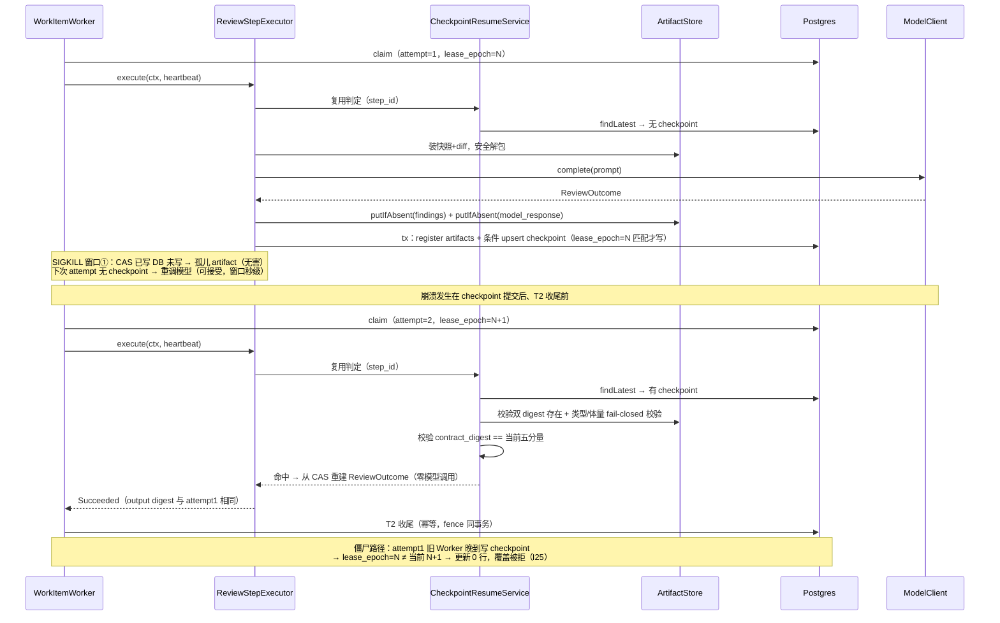
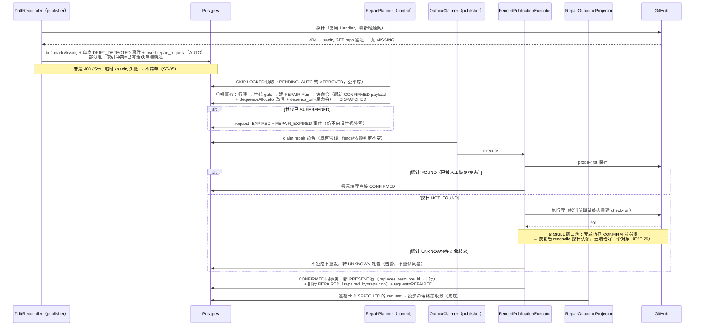
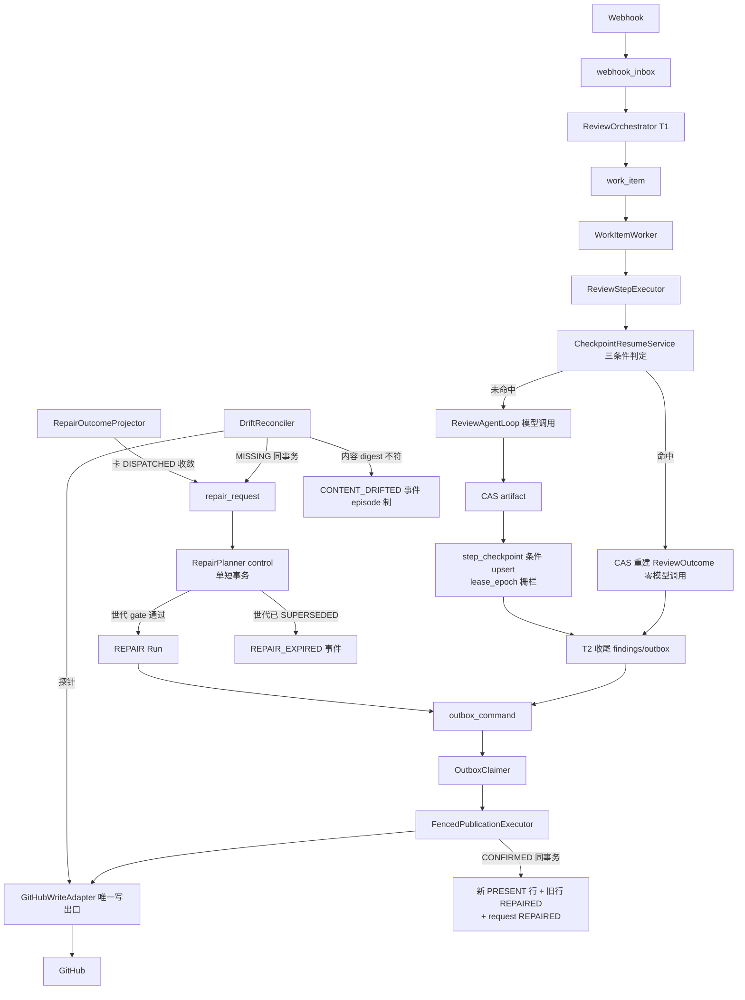

# M2 技术方案 —— 断点续跑（Step 内 Checkpoint）+ Drift 修复闭环 + 读/写契约精确 Retry-After

> 版本：v1.2（编码评审轮处置完成：RM2-01~12 全修 + 4 项用户裁定落地；测试矩阵已全量落码，待 195 真跑）
> 历史版本：v1.0 初稿 → v1.1（G1 两轮评审处置）。
> 测试回流留痕（2026-09-01，第四轮）：TB-14（`toReconciling` 补 PUBLICATION_OUTCOME_UNKNOWN 事件，
> EX-03 javadoc 承诺落地）/ TB-15（`settleReconcile` UNKNOWN 分支 floor 条件化，I23 口径）/ TB-13
> （probe-sync 探针联动，stub 保真度）——均为既定语义的落地修正，无设计变更（INC-45~48）。
> 起草时点说明：本方案在 **M1 工序 5（测试验证）进行中**、经用户明确指示提前起草；
> **编码（工序 3）硬等 M1 G2 过门**，本稿仅为工序 1 交付物。
> 范围来源：M0 §9 压力点 P4（Step checkpoint）/P7（retention ADR）；M1 §8 压力点 M1-P1/P2/P4/P10；
> 冻结文档 v2.2；OSS 证据清单 A-2/A-3/A-5/C-3/D-5/F-2/F-8。

## v1.0 → v1.1 修订记录（G1 两轮评审意见逐条处置——不盲从，证据先行）

两轮评审共提出 8 个 P0/P1 设计问题、6 条新增设计建议、9 项覆盖缺口、2 项文档质量问题。
处置前逐条回代码/文档验证，结果：**采纳 14、修正后采纳 11、驳回 0**。

### 第一轮（P0/P1 设计问题）

| # | 评审意见 | 处置 | 验证与落点 |
|---|---|---|---|
| 1 | 测试编号冲突：M1 已有 ST-22/UT-16/CT-20/EX-18/E2E-25/DP-14，v1.0 从 ST-22 起编 | **采纳** | 回树核实：ST-22=Drift重复扫描（ST22DriftRepeatScanIT）、E2E-25=PG 重启（交接文档）属实；评审称 CT 上限 20，实际代码树已占 21（CT21ClaimVsSupersedeIT），故 M2 从 CT-22 起；UT-16 评审所称未独立核实、EX 树里见 EX-17（M1 方案称 EX-18），从 17/19 起均安全。v1.1 全部续编：UT-17 起、CT-22 起、ST-23 起、EX-19 起、E2E-26 起、DP-15 起（§11 编号冻结） |
| 2 | MANUAL 规则自相矛盾：I21 说 REVIEW 永远 MANUAL，runbook 却把 policy_tier 改 AUTO | **采纳** | 裁定：`policy_tier` 一经铸造永不改写；人工批准 = 状态迁移 `PENDING→APPROVED`，新增 `approved_by/approved_at/approval_reason` 三审计列，缺 actor/reason 拒绝（§4.3、I21 改写、CT-29） |
| 3 | checkpoint 缺迟到写栅栏：upsert 无 lease_epoch 条件，旧 Worker 晚到可覆盖新 attempt | **采纳** | v1.0 漏设计，属实。V4 `step_checkpoint` 加 `lease_epoch`：条件 upsert 仅当 `work_item` 当前 lease_epoch 匹配才写入，旧 attempt 晚到更新 0 行（§4.2、I25、CT-26） |
| 4 | repair_request 生命周期不完整：无 RETRY_WAIT/FAILED_TERMINAL、无短事务规则 | **采纳** | 七态全迁移表重设计 + 重试预算 + `next_attempt_at` + 公平扫描（§4.1/§4.3、I24 扩写、CT-27/CT-28） |
| 5 | CT-25 断言不成立：SQL CHECK 只能限值不能限迁移 | **采纳** | 属实（CHECK 是值域约束）。改为：状态迁移表反射穷举（L1）+ 合法/非法迁移各一条 L2 行为用例（CT-25 重写），措辞不再称"CHECK 双防" |
| 6 | 修复后资源失去巡检：原行改 REPAIRED 后 DriftReconciler 只扫 PRESENT | **采纳** | 裁定为"新行模型"：修复成功 → **新建 PRESENT 行**（`replaces_resource_id` 链回旧行），旧行保留原 remote_id + REPAIRED + repaired_by——远端身份不覆盖、审计链不断、新行重回巡检面（§4.3、I26、ST-36） |
| 7 | 重建 Check 的目标状态不明：盲复制 CREATE payload 可能重建成错误状态 | **采纳** | RepairCommandFactory 取该资源 lineage 上**最新 CONFIRMED 命令的 payload**（最后一次 UPDATE_CHECK 即当前期望终态），不直接重放 CREATE（§4.3、ST-31） |
| 8 | 复用决策表 8 组合不准：route/prompt/两 digest 应 16 组合 | **修正后采纳** | 与第二轮 #9 合并：`checkpoint_contract_digest` 单列覆盖五分量后，复用判定收敛为三条件（contract 匹配 × findings 在 × 原文在）= 8 组合穷举；五分量各自变化产生精确 discard reason 另设参数化用例（§4.2、UT-17/18）。评审两处建议合并后才是正确形态，不照单全收任何一边 |

### 第二轮（新增设计建议）

| # | 建议 | 处置 | 落点 |
|---|---|---|---|
| 9 | `checkpoint_contract_digest` 覆盖 prompt/schema/mapper/context-builder/模型身份 | **采纳** | §4.2（五分量清单 + bump 纪律 + AFT-17） |
| 10 | `RepairOutcomeProjector`：repair_request 永卡 DISPATCHED 的收敛者 | **采纳** | §4.3：publisher 恢复扫描族新增投影器；publisher 获 repair_request 状态列的**列级** UPDATE（仿 V3 观测列授权模式） |
| 11 | repair 命令的 aggregate_sequence 与前驱关系 | **采纳** | §4.3：走既有 SequenceAllocator 取号 + `depends_on` 指原命令；保序语义不稀释（CT-28/ST-32） |
| 12 | 不接受 repair 挂已终态 Run | **采纳** | REPAIR 型 Run：`review_run.run_mode` CHECK 加 `'REPAIR'`，零 Step、独立 run_key（`repair:{operation_id}`）、CREATED→COMPLETED/FAILED；事件挂载点同时部分缓解 M1-P9 族问题（§4.3、I27） |
| 13 | ProbeResult 改封闭类型，消除 `found=true, digest=null` | **采纳** | §4.4：sealed `ProbeResult = FoundNoContent / FoundWithContent(digest) / NotFound / Unknown(reason)`（UT-24） |
| 14 | 证据分级：外部明示/类比推导/本项目裁决 | **采纳** | §7 表格加分级列 |
| 15 | retention 不冻结具体实现（分区/GC 未经实测） | **采纳** | §4.5 降级为"调研记录"，M6 实测（PG16 分区 detach 与 trigger 交互）后才冻结 |

### 第二轮（覆盖缺口 9 项）

| # | 缺口 | 处置 | 落点 |
|---|---|---|---|
| 16 | 编号冲突未被首轮报告点出 | **采纳** | 见 #1 |
| 17 | 缺带历史数据的 V3→V4 原地升级测试 | **采纳** | CT-22：灌 V3 形态历史数据 → 原地升 V4 → 数据不丢/权限不放宽/旧记录可读/迁移失败阻断启动 |
| 18 | 缺"GitHub 写成功但本地 CONFIRM 前 SIGKILL"的 publisher 崩溃窗口 | **采纳** | E2E-29：恢复后 reconcile 探针认领，远端恰好一个对象 |
| 19 | 缺带未完成 checkpoint/repair 的全栈重启 | **采纳** | E2E-30：三种在途形态分别 compose down/up，PG 恢复零内存态丢失 |
| 20 | RepairPlanner 重试预算/公平性/热循环/饿死 | **采纳** | CT-27（100 请求小 LIMIT 多轮全扫描 + 坏 payload 不热循环 + 预算耗尽 FAILED_TERMINAL） |
| 21 | 外部失败矩阵不完整 | **采纳** | EX-25~28 + ST-35；限流型 403 与普通 403 分流（§4.6 RetryDirective） |
| 22 | 修复后远端资源身份裁决 | **采纳** | 见 #6 |
| 23 | 安全测试不够 | **采纳** | AFT-14~18 + EX-29/30 + UT-19；`CommandPayloadValidator` 扩展：repair payload 拒绝 raw URL/method/token/installation 覆盖字段 |
| 24 | 未明确要求 M0/M1 全量回归 | **采纳** | §11 通过条件硬条款 + §12 DoD |

### 文档质量问题

| # | 问题 | 处置 |
|---|---|---|
| 25 | L1 用例无编号 | **采纳**：§11 全部正式编号（UT-17 起），每条回指条款 |
| 26 | BT/E2E 缺四要素 | **采纳**：L5/L6 表改五列（注入/断言/取证/复原/回指） |

---

## v1.1 → v1.2 修订记录（编码评审轮：RM2-01~12 + 四项用户裁定，全部已落地）

编码完成后主会话组织四切片只读评审（构建基线 478 单测全绿），发现 2 个 P0、9 个 P1、一批 P2。
用户裁定：P0/P1 全修；修复后交独立执行方在 195 真跑验证。P2 记入下表"延后"栏，不阻塞 G1/G2。

| # | 发现 | 级别 | 处置 |
|---|---|---|---|
| RM2-01 | step_checkpoint 五分量列 DDL 与仓储实现断裂（真 PG 必抛 NOT NULL）——实际为编码期已自愈（INC-31），评审复核确认贯通 | P0→已闭 | 复核确认 + SqlGuard 钉五分量三段（INSERT/SET/SELECT） |
| RM2-02 | 授权矩阵漏洞：publisher 整行 INSERT repair_request 可伪造 APPROVED 审批（方案层洞） | P0 | 列级 INSERT（排除审批列/关联列）+ BEFORE INSERT trigger 强制 PENDING+审批三列空；CT-29/DP-15 真库断言 |
| RM2-03 | CreateCheckHandler 探针多对象歧义未检测（PublishReviewHandler 已于 INC-33 修，此家漏网） | P1 | 收集全命中：0→NotFound、1→Found、≥2→Unknown；EX-27 IT 钉死 |
| RM2-04 | REVIEW 资源 MISSING 复核找回永不归 PRESENT + 巡检热循环（M1 语义回归）；Fake 守卫与 PG 分叉掩盖 | P1 | markContentDrift/clearContentDrift 守卫放宽 PRESENT/MISSING + 归位重排；Fake 对齐；DriftReconcilerTest 两条回归 |
| RM2-05 | 领取无 SKIP LOCKED | P1 | lockReady 改 `FOR UPDATE OF rr SKIP LOCKED`；CT-28 并发用例验证 |
| RM2-06 | CAS payload 缺失按可重试热循环 | P1 | 立即 FAILED_TERMINAL（DESIRED_PAYLOAD_MISSING）；CT-27/EX-29 钉死 |
| RM2-07 | CommandPayloadValidator 未扩展 repair 拒绝清单 | P1 | 危险键清单扩展 + installation* 前缀规则（installation_id 预检键不误杀）；PublicationGateTest + AFT-16 |
| RM2-08 | discard reason 未细分五分量 | P1→已闭 | INC-31 已落地；评审复核确认 + UT-18 参数化 6 组合 |
| RM2-09 | CAS 校验失败原因折叠失真（畸形记成缺失） | P1 | verifiedBlob 改封闭结果分流 MISSING/CORRUPT；CheckpointResumeServiceTest 8 用例 |
| RM2-10 | ck_replay_publisher_disabled 未随 V4 修订，REPAIR Run 被迫带语义矛盾标记 | P1 | V4 改 CHECK 为 `run_mode IN ('NORMAL','REPAIR') OR publisher_disabled`；REPAIR Run 改 publisher_disabled=false |
| RM2-11 | §11 编号矩阵大面积未落码 | P1 | 波次 2 全量补齐：UT-17~26、AFT-14~18、CT-22~29、ST-23~38、EX-19~30、E2E-26~35（脚本）、BT-M2-01~03、DP-15~19 |
| RM2-12 | 静态门断言可被无关文本撞中 | P1 | M2MigrationContractTest 锚定 uq_repair_active 谓词整体 + 规范化比对 |
| 裁定-1 | EX-28 与 M1"UNKNOWN 不在巡检集"冲突 | 用户裁定 | **人工复位制**：权限恢复后不自动复归；runbook SQL 拨回 PRESENT 后收敛（EX-28 行已改写，EX-28 IT/E2E-34 按此断言） |
| 裁定-2 | 预算耗尽终态 attempt_count 停在 4/5 | 用户裁定 | **修**：终态路径计数打满；CT-27 断言同步 5/5（非 retryable 坏 payload 不烧预算的语义保留） |
| 裁定-3 | EX14 stub body 与生产 buildBody 逐字节不等（取证盲区） | 用户裁定 | **修假数据**：stub body 逐字节对齐，漂移告警噪声消除 |
| 裁定-4 | repair_request 无 DB 级迁移矩阵守卫 | 用户裁定 | **确认有意为之**：应用层状态机 + 仓储前置态 WHERE 双层（CT-25 验证 0 行）；DB 不加 trigger，避免规则双事实源漂移 |

延后项（P2，不阻塞门禁，留 M3 评估）：RepairOutcomeProjector 吞异常无退避；depends_on 字段名误导+死列；findReady 快照/锁内重读错配窗口；payload 残留旧 run_id/revision_id；状态机与内联 SQL 无双事实源交叉断言；EXPIRED 映射 Run FAILED 指标失真；upsert 覆盖 created_at；confirmRepairNoop 无状态守卫；content_drift_detected_at 每轮刷新语义；model-version 占位符；repair_operation_id 无索引。

---

## 1. 核心问题：崩溃重跑烧模型费、漂移只报警无人修、限流退避不精确

M1 把入口可信化之后，执行侧的三个"必发"成本场景浮出水面：

1. **崩溃 = 整 Step 重跑，模型费用 100% 重做**。现状（代码实测）：一个 Run 只有一个
   REVIEW Step（`ReviewOrchestrator` 插单条 RunStep/work_item），`ReviewStepExecutor` 内部
   4 个粗粒度阶段（CAS 装 input → 模型评审 → findings 落 CAS → 模型原文落 CAS），
   阶段间只有 `checkAlive` 探活，**无任何 step 内 checkpoint 持久化**。kill -9 后 attempt+1
   从头再来——真实链路里模型调用是 3~6 分钟 + 数万 token（M0 DP-05/INC-19 实测），
   其余三步合计是秒级。M0 §9 P4 承诺的"重复工作量 < 20%"至今未验证。
2. **漂移只检测不修复，告警即积压**。M1 `DriftReconciler` 发现 MISSING 只记
   `PUBLICATION_DRIFT_DETECTED` 事件 + 观测列，类注释明示"只检测，不修复"；
   `publication_resource.repaired_by_operation_id` 列 V1 就预留了但无人写；
   状态机里 `REPAIRED` 是死状态。第一次真实漂移告警（M1-P1 触发条件）就是积压的开始。
   且"对象在但正文被改"（评论被编辑）完全不检测（M1-P2）。
3. **限流退避不精确、普通 403 与限流 403 不分**。control 侧 `FetchResult.RateLimited`
   已携带 Retry-After，但 publisher 侧 `TypedResponse` 只有 `(status, body)` 不含响应头——
   outbox 写路径、drift 探针、recovery 扫描遇 429 只能走统一指数退避（M1-P10，
   DriftReconciler 注释自述的已知偏差）。GitHub 官方明示：带 `Retry-After` 头必须等够秒数；
   二级限流无头时至少等 1 分钟再指数退避（证据 F-8）。粗放退避 = 放大二级限流封禁风险。

**为什么是现在**：M1 之后入口不再丢事件，漂移与崩溃重放成为仅剩的两个"确定性亏钱/失信"
源；checkpoint 复用模型产出是其中最大单项成本（一次重跑 = 一次完整模型调用）。
模型治理（熔断/缓存/成本账本）仍是 M3，本版只在 checkpoint 里落契约 digest，
为 M3 留数据缝，不做治理本身。

### 明确不做（防越级清单）

- 不做多 Step 编排（仍单 REVIEW Step；文件分批/多模型编排是更后面的事）；
- 不做模型熔断/缓存/成本账本/流式 UI（M3）；
- 不做人工审批 UI/API——MANUAL 档的批准动作是文档化 runbook（一条参数化 SQL，
  写 actor+reason），审批端点留给有真实需求时（触发条件见 §8 M2-P3）；
- 不做 review 内容漂移的自动改写（覆盖用户编辑 = 危险操作，R2 拒绝记录，只告警）；
- retention/归档**只出调研记录**（§4.5），不冻结实现，M6 实测后裁定；
- 不做 V4 安全事件表（M1-P9）——M1 G2 裁定项，若批准则并入 V4 迁移，本稿按"不含"编写；
- 不做多实例（M7）、mTLS（M4）、base 分支 `edited` 事件扩编（M1-P8 观察项）。

---

## 2. 任务拆解

| 任务 | 内容 | 依赖 | 单项验收 |
|---|---|---|---|
| M2-T01 | V4 迁移：`step_checkpoint`（lease_epoch 栅栏列 + contract digest）、`repair_request`（七态 + 审批三列 + 重试预算列）、`publication_resource` + `replaces_resource_id`/`content_drift_detected_at`、`review_run.run_mode` CHECK 加 `'REPAIR'`、授权矩阵（publisher 对 repair_request：**列级 INSERT（审批列除外）+ INSERT trigger 钉 PENDING** + SELECT + 状态列级 UPDATE；对 outbox 仍零 INSERT；checkpoint 表仅 control）。195 沙箱验证 | — | 沙箱一次通过；权限/约束断言全 PASS；CT-22 历史数据原地升级绿 |
| M2-T02 | 限流契约：`TypedResponse` 加响应头通道；`RetryDirective` 封闭类型（§4.6）；`RetryAfterParser`；`RetryBackoff` retryAfter 重载；三调用点接入（`FencedPublicationExecutor`/`OutboxRecoveryScanner`/`DriftReconciler`） | — | UT-23、EX-19/20/25 全绿；普通 403 与限流 403 分流正确 |
| M2-T03 | Step checkpoint 领域件：`StepCheckpoint` 模型、`StepCheckpointRepository` port + PG 实现（**lease_epoch 条件 upsert**）、`CheckpointResumeService`（三条件判定 + 精确 discard reason）、`CheckpointContract`（五分量 digest）、新事件类型 | T01 | UT-17/18/19；CT-23/25 绿 |
| M2-T04 | `ReviewStepExecutor` 断点续跑接入：contract digest 接线；模型返回后 CAS 双 artifact（幂等）→ 单事务（register ON CONFLICT DO NOTHING + 条件 upsert checkpoint）；attempt 开头 ResumeService 判定，命中零模型重建 `ReviewOutcome` | T03 | ST-23~30 崩溃窗口系列全绿 |
| M2-T05 | Repair 分档 + 铸造：`RepairPolicy.decide`（CHECK_RUN→AUTO，REVIEW/未知→MANUAL fail-closed）；`DriftReconciler` MISSING（sanity 通过）分支同事务 INSERT repair_request（部分唯一索引冲突跳过）；404+sanity 失败/普通 403/5xx/超时**不铸单** | T01 | UT-20；CT-24；ST-35 |
| M2-T06 | `RepairPlanner`（control worker）：SKIP LOCKED 领取（PENDING+AUTO ∪ APPROVED）→ **单短事务**（行锁 → 世代 gate → REPAIR Run → 铸命令（最新 CONFIRMED payload + SequenceAllocator 取号 + depends_on=原命令）→ DISPATCHED）；重试预算/退避/FAILED_TERMINAL；坏 payload fail-closed | T05 | ST-31/32；CT-27/28；EX-24 |
| M2-T07 | 执行与收尾：repair 命令 probe-first 短路（UNKNOWN/歧义不短路）；CONFIRMED 同事务建新 PRESENT 行（`replaces_resource_id`）+ 旧行 REPAIRED + request REPAIRED；`RepairOutcomeProjector` 收敛卡 DISPATCHED 的 request；MANUAL 审批 runbook（文档化 SQL） | T06 | ST-33/34/36；CT-29；E2E-29 |
| M2-T08 | 内容级 digest 巡检：`ProbeResult` 封闭类型改造；`PublishReviewHandler` 探针算 body digest；episode 告警模型（§4.4）；marker 被剥 → 探针不可见 → MISSING 路径（REVIEW 恒 MANUAL，无自动重发风险） | T01 | UT-24/25；ST-37/38 |
| M2-T09 | 全量测试矩阵补齐 + 本机全绿 + 195 挂 docker.sock 真跑全量 IT（含 M0/M1 回归）+ DP-15~18 部署门 + 部署验证 | T02~T08 | §11 矩阵全绿；双环境绿 |
| M2-T10 | 测试交接文档（按 `docs/测试交接规范.md`）+ 背景文档刷新 + BUGLOG/PROGRESS 收尾 | T09 | 交接四件套齐；等执行方回流 |

依赖链：T01 → T03/T05/T08；T03 → T04；T05 → T06 → T07；全部 → T09 → T10。T02 独立可并行。

---

## 3. 类设计（DDD 四层）

### 3.1 新增/改造类清单

**control-app**

| 类 | 层 | 职责 | 明确不做 |
|---|---|---|---|
| `StepCheckpoint` | domain.model | checkpoint 记录（step_id、双 digest、contract_digest、lease_epoch、attempt_no） | 不存 findings 本体（本体在 CAS） |
| `CheckpointContract` | domain.review | 五分量契约 digest：`sha256(prompt_version ‖ finding_schema_version ‖ mapper_version ‖ context_builder_version ‖ model_identity)`；各分量常量的唯一出处与 bump 纪律 | 不做版本间兼容映射（不符即丢弃，fail-closed） |
| `StepCheckpointRepository` | domain.port | 条件 upsert（lease_epoch 栅栏）/ findLatest(step_id, key) | 不做历史保留查询 |
| `PostgresStepCheckpointRepository` | infrastructure.persistence | port 的 PG 实现；upsert 带 `work_item` 当前 lease_epoch 匹配条件 | — |
| `CheckpointResumeService` | domain.service | 复用三条件判定 + 精确 discard reason；命中重建 `ReviewOutcome`（含 CAS 内容 fail-closed 校验：artifact 类型、JSON 畸形、体量上限） | 不调模型、不写 CAS |
| `ReviewStepExecutor`（改造） | application | attempt 开头问 ResumeService；模型返回后写 checkpoint（§4.2 事务序） | 不改 4 阶段主干、不引入多 Step |
| `RepairPlanner` | application | 周期 worker：单短事务完成"领取 → 世代 gate → REPAIR Run → 铸命令 → DISPATCHED"；重试预算与公平扫描 | 不直触 HTTP、不依赖 GitHub Adapter/Credential（AFT-15） |
| `RepairCommandFactory` | domain.service | 从资源 lineage **最新 CONFIRMED 命令**构造 repair 命令 payload（当前期望终态）；新 operation_id、SequenceAllocator 取号、depends_on=原命令、REPAIR Run | 不复读 CREATE 原型 payload；不携带任何旧远端身份字段 |
| `RepairRequestRepository`（port）+ PG 实现 | domain.port / infrastructure | 领取（SKIP LOCKED + 公平序）、状态推进、审批记录 | 不做审批端点 |

**publisher-app**

| 类 | 层 | 职责 | 明确不做 |
|---|---|---|---|
| `DriftReconciler`（改造） | application | MISSING 分支同事务铸 repair_request；FOUND 分支 digest 比对（episode 模型） | 仍不直接修复、不插 outbox（AFT-14） |
| `RepairRequestStore`（port）+ PG 实现 | domain.port / infrastructure | insert-if-absent（部分唯一索引）；列级状态 UPDATE（供 Projector） | 不改 tier、不碰审批列 |
| `RepairOutcomeProjector`（新） | application | 恢复扫描族成员：把 repair 命令终态（CONFIRMED/FAILED_TERMINAL/SUPERSEDED）投影回 repair_request，收敛卡 DISPATCHED 的单 | 不重发命令、不改资源行 |
| `PublicationHandler.interpretProbe`（签名扩展） | domain.handler | 返回封闭类型 `ProbeResult`（§4.4） | 三 Handler 写方法不变 |
| `PublishReviewHandler`（改造） | domain.handler | 探针命中时计算 body sha256 | 不重发、不改写远端 |
| `FencedPublicationExecutor`（改造） | domain.service | repair 命令 probe-first 短路（UNKNOWN/多对象歧义不短路转 UNKNOWN）；CONFIRMED 时新 PRESENT 行 + 旧行 REPAIRED 收尾；RetryDirective 透传 | 正常命令路径行为不变 |
| `CommandPayloadValidator`（改造） | domain.service | repair payload 复用既有校验 + 拒绝 raw URL/method/token/installation 覆盖字段 | — |
| `PostgresPublicationStore`（改造） | infrastructure | `markRepairedWithReplacement(oldId, repairOpId, newResource)`；`markRepairedNoop(...)`（probe-first 短路场景） | — |

**shared-kernel**

| 类 | 职责 |
|---|---|
| `TypedResponse`（改造） | 加响应头通道（`retryAfterSeconds`、`rateLimitRemaining`、`rateLimitResetEpochSec`，均可空） |
| `RetryDirective`（新，sealed） | 限流处置指令：`HonorRetryAfter(seconds)` / `SecondaryLimitBackoff()`（无头 429/限流 403，下限 60s）/ `NotRateLimited()`；普通 403 永远落到 NotRateLimited（走权限告警路径，不进退避） |
| `RetryAfterParser`（新） | Retry-After 头解析（秒数/HTTP-date；缺失/非法/过去时 → null；上限 clamp 见 §4.6） |
| `RetryBackoff`（改造） | `nextAttemptAt(attempt, now, directive)`：HonorRetryAfter → max(指数, retryAfter)；SecondaryLimitBackoff → max(指数, 60s) |
| `ExecutionEventType`（扩） | +`CHECKPOINT_STORED/CHECKPOINT_REUSED/CHECKPOINT_DISCARDED/PUBLICATION_CONTENT_DRIFTED/REPAIR_REQUESTED/REPAIR_DISPATCHED/REPAIR_APPROVED/REPAIR_REPAIRED/REPAIR_FAILED/REPAIR_EXPIRED` |

### 3.2 时序图（覆盖崩溃、迟到、并发路径）

**checkpoint 断点续跑（含 SIGKILL 窗口 + 旧 Worker 晚到栅栏）**：



**Drift 修复闭环（AUTO 档；MANUAL 档经 APPROVED 进入同一领取口）**：



---

## 4. 实现方式（关键技术点）

### 4.1 V4 迁移 DDL（要点，全稿编码时定稿）

```sql
-- 断点续跑：step 内 checkpoint（服务端持久化，下一 attempt 读回，证据 A-3）
create table step_checkpoint (
    id                        uuid primary key,
    step_id                   uuid not null references run_step(id),
    checkpoint_key            text not null,             -- M2 唯一值: 'REVIEW_OUTCOME'
    output_artifact_digest    char(64) not null,         -- findings JSON（FINDING_BODY）
    model_response_digest     char(64) not null,         -- 模型原文（MODEL_RESPONSE）
    checkpoint_contract_digest char(64) not null,        -- 五分量契约（§4.2）
    lease_epoch               bigint not null,           -- 写入者的租约世代（迟到写栅栏，I25）
    attempt_no                integer not null,          -- 写入它的 attempt（审计用）
    created_at                timestamptz not null default now(),
    constraint uq_step_checkpoint unique (step_id, checkpoint_key)
);
-- 无 UPDATE/DELETE trigger：checkpoint 是可覆盖状态而非账本；复用/丢弃走 execution_event。
-- 迟到写栅栏在 upsert 的 WHERE 子句（join work_item 比当前 lease_epoch），见 §4.2。

-- 漂移修复：一资源一活跃单；七态生命周期（评审 #4 落点）
create table repair_request (
    id                       uuid primary key,
    publication_resource_id  uuid not null references publication_resource(id),
    resource_type            varchar(32) not null,
    policy_tier              varchar(8)  not null,        -- AUTO / MANUAL，铸造后永不改写（I21）
    state                    varchar(16) not null,        -- 七态见下移迁移表
    repair_run_id            uuid references review_run(id),
    repair_operation_id      uuid,                        -- 铸出的 repair 命令
    approved_by              text,                        -- MANUAL 批准三审计列（缺一拒批）
    approved_at              timestamptz,
    approval_reason          text,
    attempt_count            integer not null default 0,
    max_attempts             integer not null default 5,
    next_attempt_at          timestamptz,                 -- RETRY_WAIT 退避
    last_error               text,                        -- 不含 token/敏感头（EX-30）
    created_at               timestamptz not null default now(),
    updated_at               timestamptz not null default now(),
    constraint ck_repair_tier  check (policy_tier in ('AUTO','MANUAL')),
    constraint ck_repair_state check (state in (
        'PENDING','APPROVED','DISPATCHED','RETRY_WAIT',
        'REPAIRED','FAILED_TERMINAL','EXPIRED')),
    constraint ck_repair_approval check (                  -- APPROVED 必须带审计三列
        state <> 'APPROVED' or (approved_by is not null and approved_at is not null
                                and approval_reason is not null))
);
create unique index uq_repair_active on repair_request(publication_resource_id)
    where state in ('PENDING','APPROVED','DISPATCHED','RETRY_WAIT');
create index ix_repair_fair_scan on repair_request(created_at)
    where state in ('PENDING','APPROVED','RETRY_WAIT');

alter table publication_resource
    add column replaces_resource_id uuid references publication_resource(id),  -- 新行链回旧行（I26）
    add column content_drift_detected_at timestamptz,
    add column content_drift_digest char(64);              -- episode 键：最近告警的内容 digest

alter table review_run drop constraint ck_review_run_mode;
alter table review_run add constraint ck_review_run_mode
    check (run_mode in ('NORMAL','PROJECTION_REBUILD','RECORDED_REPLAY',
                        'ISOLATED_REEXECUTION','REPAIR'));

-- 授权矩阵（延续 V2/V3 风格，编码时全稿；v1.2 RM2-02 修订：INSERT 收窄为列级 + INSERT 触发器）：
--   publisher_app: repair_request SELECT,
--     INSERT(id, publication_resource_id, resource_type, policy_tier, state,
--            attempt_count, max_attempts, next_attempt_at, last_error, created_at, updated_at)
--     —— 列级 INSERT，审批三列/repair_run_id/repair_operation_id 不可写；
--     BEFORE INSERT trigger 强制初始 state='PENDING' 且审批三列恒空（防伪造人工批准，仿 V2 outbox 零 INSERT 的"不能伪造写意图"先例）
--   publisher_app: UPDATE(state, repair_run_id,
--     repair_operation_id, attempt_count, next_attempt_at, last_error, updated_at)
--     —— 列级授权，tier/审批列不可写（仿 V3 publication_resource 观测列模式）
--   control_app:   repair_request SELECT, UPDATE（含审批列）；step_checkpoint ALL
--   publisher_app 对 outbox_command 仍零 INSERT（AFT-14/CT-22 回归，repair 命令只能 control 铸）
--   publisher_app 对 step_checkpoint 零权限（AFT-18）
```

**repair_request 状态迁移表**（全量合法迁移；非法迁移由 L1 反射穷举 + CT-25 行为用例双重拒绝）：

| 从 \ 到 | APPROVED | DISPATCHED | RETRY_WAIT | REPAIRED | FAILED_TERMINAL | EXPIRED |
|---|---|---|---|---|---|---|
| PENDING | ✔（人工批准，MANUAL 档） | ✔（AUTO 档领取） | ✔（可重试失败） | — | ✔（坏 payload/预算外错误） | ✔（世代 gate 拒） |
| APPROVED | — | ✔（领取） | ✔ | — | ✔ | ✔ |
| DISPATCHED | — | — | — | ✔（命令 CONFIRMED 投影） | ✔（命令 FAILED_TERMINAL 投影） | ✔（命令 SUPERSEDED 投影） |
| RETRY_WAIT | — | ✔（到点重领） | ✔（再失败） | — | ✔（预算耗尽） | ✔ |
| 终态三态 | — | — | — | — | — | — |

### 4.2 checkpoint 写入与复用（事务边界 + 契约 digest + 迟到栅栏）

- **契约 digest（CheckpointContract）**：`sha256(prompt_version ‖ finding_schema_version ‖
  mapper_version ‖ context_builder_version ‖ model_identity)`。五分量各有唯一常量出处；
  任何分量变更必须 bump 对应常量（编码规范 + AFT-17 静态断言常量存在且被接线）。
  依据 E9/A-5：prompt/模型/输出契约变更 ≡ Temporal workflow 代码变更，旧 checkpoint
  不得被新代码静默复用。
- **写入时机**：`agentLoop.review()` 返回后立刻执行，不等 T2：先 `putIfAbsent` 两个
  artifact（CAS 幂等），再**单事务** `{artifact register ON CONFLICT DO NOTHING;
  checkpoint 条件 upsert}`。崩溃在 CAS 与 DB 之间 → 孤儿 artifact（digest 寻址无害，
  GC 归 M6）；崩溃在事务前 → 无 checkpoint → 下一 attempt 重调模型（窗口秒级，诚实接受）。
- **迟到写栅栏（I25）**：upsert 的 WHERE 带 `work_item` 当前 `lease_epoch = 写入者 epoch`
  条件（join 比较，存储端原子）；旧 attempt 的晚到写更新 0 行 → WARN 日志，不报错不覆盖。
  依据 C-4/E1：栅栏必须在存储端与写原子绑定，禁止客户端自检后写。
- **复用判定（CheckpointResumeService，三条件全满足才命中，缺一即整体丢弃，fail-closed）**：
  1. checkpoint 行存在；
  2. CAS 中双 digest 均可读回，且回读内容过 fail-closed 校验（artifact 类型正确、
     findings JSON 可解析、体量 ≤ 上限、字段 schema 匹配当前版本）；
  3. `checkpoint_contract_digest` == 当前五分量 digest。
  step → run → revision 输入不可变由 I12 既有机制保证（checkpoint 挂 step_id，
  新 revision 必换新 step，天然串不到）。
- **命中路径**：从 CAS 重建 `ReviewOutcome`（findings + stats + 模型原文）——零模型调用、
  零新增 artifact；记 `CHECKPOINT_REUSED` 事件。
- **丢弃路径**：`CHECKPOINT_DISCARDED` 事件带精确 reason（CONTRACT_CHANGED 细分五分量 /
  CAS_MISSING_FINDINGS / CAS_MISSING_MODEL_RESPONSE / CHECKPOINT_CORRUPT）+ WARN 日志；
  checkpoint 行保留不删（审计）。
- **账本噪声纪律不变**（E10/A-3）：attempt start 仍不入账本；checkpoint 是状态表不是事件流。

### 4.3 Drift 修复：分档 + 审批 + 铸造/执行/收敛全链路

**分档决策表（RepairPolicy，依据 C-3 + R2）**：

| resource_type | 远端语义 | 档 | 理由 |
|---|---|---|---|
| CHECK_RUN（CREATE/UPDATE lineage） | 状态型对象，external_id 幂等探针，重建无副作用 | AUTO | K8s controller 自有资源自动收敛惯例 |
| REVIEW | 内容型通知，重发 = 再次打扰 PR 参与者 | MANUAL | R2：不可逆外部副作用保持"告警 + 人工" |
| 未知类型 | — | MANUAL + 告警 | fail-closed，类型白名单外不自动 |

- **tier 永不改写（I21 修正后形态）**：MANUAL 单的批准 = `PENDING→APPROVED` 状态迁移 +
  `approved_by/approved_at/approval_reason` 三列（CHECK 约束强制非空）；批准幂等
  （重复批准/并发批准返回现状，不重复记事件）。runbook（文档化参数化 SQL）：
  `UPDATE repair_request SET state='APPROVED', approved_by=:actor, approved_at=now(),
  approval_reason=:reason WHERE id=:id AND state='PENDING'`——0 行 = 已被处理，天然幂等。
- **铸造点**（publisher，DriftReconciler MISSING 分支，sanity 已通过）：现有
  `{markMissing; 单次 DRIFT_DETECTED 事件}` 事务内追加 `insert repair_request`
  （同事务 = 任一失败全回滚，CT-24）；撞部分唯一索引 = 已有活跃单 → 跳过。
  **不铸单的情形**：普通 403 / sanity 失败 404 / 5xx / 超时（非事实性 MISSING，ST-35）。
- **RepairPlanner（control）单短事务**：`SELECT ... FOR UPDATE SKIP LOCKED` 领取
  （PENDING+AUTO ∪ APPROVED，`ORDER BY created_at LIMIT 预算` 公平扫描防尾部饿死）→
  同事务内：世代 gate → 建 REPAIR Run → RepairCommandFactory 铸命令 → DISPATCHED。
  所有工作均为 DB 操作，单事务保证"崩溃 = 零命令或一条命令"，无半截态（CT-28）。
  失败路径：可重试错误 → RETRY_WAIT + 指数退避（预算 5 次）；坏 payload/非法数据 →
  FAILED_TERMINAL + 事件 + `last_error`（fail-closed，不热循环，CT-27）。
- **世代 gate**：原命令所属 revision 必须是 pr_subject 当前活跃 revision 且未被
  SUPERSEDED；否则 EXPIRED + `REPAIR_EXPIRED` 事件。**绝不向旧世代补写**（INC-03 族）。
- **repair 命令形态**（评审 #7/#11/#12 落点）：
  - 挂载 **REPAIR 型 Run**（新 run_mode；零 Step；run_key=`repair:{operation_id}`；
    CREATED→COMPLETED/FAILED）——不挂已终态的评审 Run，lineage 干净；事件有了合法
    挂载点（部分缓解 M1-P9 族"无 Run 可挂"）。
  - payload = 该资源 lineage 上**最新 CONFIRMED 命令的 payload**（当前期望终态：
    check-run 若已经历 UPDATE_CHECK（queued→completed），重建用最后 UPDATE 的内容，
    不复读 CREATE 原型）；`payload_hash` 重新计算；不携带旧 remote_id/remote_url。
  - `aggregate_sequence` 走既有 SequenceAllocator 取号；`depends_on` = 原命令
    （REQUIRE_CONFIRMED 恒满足，不占保序新语义）；fence_mode=CURRENT_EPOCH，
     fence/依赖判定/唯一写出口全链路不变（I20）。
- **probe-first 短路**：`FencedPublicationExecutor` 识别 repair 命令（payload 携带
  `repair_of_resource_id`），写前先探针：FOUND → 零写 CONFIRMED；NOT_FOUND → 执行写；
  UNKNOWN/多对象歧义 → **不短路不重发**，转 UNKNOWN 处置（告警 + 退避，EX-27）。
- **CONFIRMED 收尾（新行模型，I26）**：同事务——新建 PRESENT 资源行（新 remote_id/url，
  `replaces_resource_id`→旧行）+ 旧行 REPAIRED（`repaired_by_operation_id`=repair op，
  原 remote_id 保留不覆盖）+ request=REPAIRED。probe-first 短路场景（对象其实还在）：
  不建新行，旧行回 PRESENT + repaired_by 记录（对象身份没变）。
- **RepairOutcomeProjector（publisher 恢复扫描族）**：周期扫 DISPATCHED 超阈值的 request，
  读 repair 命令终态投影回 request（CONFIRMED→REPAIRED 兜底 / FAILED_TERMINAL→FAILED_TERMINAL
  / SUPERSEDED→EXPIRED）；防"命令已终态但收尾事务未覆盖"的永久悬挂。
- **MANUAL 档运营面**：request 停 PENDING + drift 事件在账本；runbook 批准后入 APPROVED，
  后续与 AUTO 同链路。M2 不做审批端点（触发条件：第一次真实 review 漂移，§8 M2-P3）。

### 4.4 内容级 digest 巡检（检测，不修复；episode 告警模型）

- `interpretProbe` 返回升级为封闭类型 `ProbeResult`（评审 #13）：
  `FoundNoContent`（状态型资源）/ `FoundWithContent(digest)` / `NotFound` / `Unknown(reason)`
  ——类型层面消除"found=true 但 digest 缺失"的非法组合。
- 仅 `PublishReviewHandler` 产出 `FoundWithContent`（LIST_REVIEWS 探针已拿回 body，
  对匹配 marker 的 review 算 `sha256(body)`）；check-run 探针恒 `FoundNoContent`。
- 期望 digest **现算**：join 原 outbox 命令取 `payload.body`（含隐藏 marker 的完整正文）
  → sha256。逐字节比较语义（Unicode/CRLF/尾空格敏感，UT-25 钉死）；不加期望列。
- **episode 告警模型**（评审"每轮是否重新告警"的裁定）：比对不符 → 若
  `content_drift_digest` ≠ 实测 digest（新一轮 episode）→ 记 `PUBLICATION_CONTENT_DRIFTED`
  事件 + `content_drift_detected_at=now()` + `content_drift_digest=实测`；同一 episode
  （digest 不变）不重复告警；内容恢复原文（实测 == 期望）→ episode 关闭（digest 置 NULL），
  之后再被编辑 → 新 episode 重新告警。state 全程保持 PRESENT，**不自动改写**（R2）。
- **marker 被剥的分类**（评审 ST-38 落点）：marker 不在 → 探针不可见该对象 → 走
  NOT_FOUND → MISSING 路径。安全性由分档保证：REVIEW 恒 MANUAL，不会自动重发；
  CHECK_RUN 探针用 external_id 而非 body marker，不受影响。
- 误报风险：GitHub API 返回原始 markdown 不做渲染改写，风险低，留档观察（§6.2 R-R4）。

### 4.5 retention/归档调研记录（评审 #15：不冻结实现，M6 实测后裁定）

冲突面（代码实测）：不可变 trigger 只有两张表——`pr_revision`、`execution_event`
（BEFORE UPDATE OR DELETE 拒绝，CT-03 双层断言含超级用户）；`webhook_inbox.payload_raw`、
`artifact`（CAS 文件）、`review_finding`、`step_attempt` 无 trigger，靠角色权限约束。

候选方向（**均未经实测，非承诺**）：

| 对象 | 增长驱动 | 候选方向 | 待实测的关键问题 |
|---|---|---|---|
| `execution_event` | 每 run 数十条 | 分区表（月）+ detach 旧分区转冷存 | PG16 detach 与 immutable trigger 的交互；既有查询/索引迁移成本 |
| `pr_revision` | 每 push 一条 | 永不删（审计主线）；行小接受增长 | 无需动作 |
| `webhook_inbox.payload_raw` | 每事件一份原始 payload | 超龄后 `payload_raw=NULL` 保留行与 jsonb | 保留期取值待运营数据 |
| `artifact`（CAS 文件） | 快照/tarball 最大头 | 标记清扫（引用为零且超龄删文件留登记行） | 引用枚举完整性（revision/finding/checkpoint/repair） |
| `step_attempt`/`review_finding` | 随 run 线性 | 跟随 execution_event 策略 | — |

M6 开工第一步：PG16 实测分区 detach + trigger 交互，届时出正式 ADR 再冻结。

### 4.6 限流处置：RetryDirective 封闭类型（F-8 + 评审 #21）

- `TypedResponse` 加响应头通道（`retryAfterSeconds`、`rateLimitRemaining`、
  `rateLimitResetEpochSec`，可空）。`GitHubWriteAdapter.send` 统一解析。
- **`RetryDirective` 分流规则**（限流型 403 与普通 403 必须分开）：
  - 429 + 合法 Retry-After → `HonorRetryAfter(seconds)`；
  - 429 无头 → `SecondaryLimitBackoff`（下限 60s）；
  - 403 + `x-ratelimit-remaining: 0` → 限流型：`HonorRetryAfter(reset-now)` 或
    `SecondaryLimitBackoff`；
  - 403 无限流头 → `NotRateLimited`（权限告警路径，**不退避不铸单**，EX-25）；
  - 5xx/超时/连接中断 → 非限流，走既有指数退避，资源状态不误改（EX-26）。
- `RetryBackoff.nextAttemptAt(attempt, now, directive)`：HonorRetryAfter →
  max(指数, retryAfter)；retryAfter 上限 clamp 到 15 min（防永久暂停；超限记 WARN 观察，
  本项目裁决：GitHub 二级限流实际窗口在分钟级，15 min 上限是可用性与服从性的折中——
  无先例，系自研判断，风险是极端限流下重试偏早被再拒一次，代价是一次无效请求）。
- 三个调用点分别接入并分别测试（评审：不许一条用例笼统覆盖）：
  `FencedPublicationExecutor.markRetryWait`（写路径）、`OutboxRecoveryScanner`
  （崩溃收敛）、`DriftReconciler.markCheckError`（巡检路径）（EX-19）。
- control 侧 `GitHubPrMetadataAdapter` 既有解析改调同一 Parser（消除重复实现）。
- `last_error`/事件/日志不含 Authorization/token/完整敏感响应头（EX-30）。

---

## 5. 数据流与链路图



---

## 6. 边界条件与不变量

### 6.1 M2 新增不变量（接续 M1 I9~I17）

| # | 不变量 | 验证 |
|---|---|---|
| I18 | checkpoint 复用必须同时满足：CAS 双 digest 可读且过 fail-closed 校验 + contract_digest 匹配；缺一即整体丢弃重跑，禁止部分复用 | UT-17/18/19；EX-21/22 |
| I19 | checkpoint 命中路径零模型调用、零新增 artifact；output digest 与崩溃前 attempt 相同 | ST-27 调用计数断言 |
| I20 | repair 命令走既有全链路（fence/依赖判定/唯一写出口/Handler 探针），仅多 probe-first 短路；UNKNOWN/歧义不短路 | AFT-14；ST-33；EX-27 |
| I21 | `policy_tier` 铸造后永不改写：AUTO 仅限 CHECK_RUN 类状态型资源；REVIEW/未知类型恒 MANUAL；人工批准 = PENDING→APPROVED + 审计三列；内容漂移只告警不自动改写 | UT-20；CT-29；ST-34/37 |
| I22 | repair 仅当原 revision 为当前活跃世代时铸造；否则 EXPIRED，绝不向旧世代补写 | ST-32；EX-24 fence 竞态 |
| I23 | 限流处置按 RetryDirective 分流：HonorRetryAfter 不早于 now+retryAfter（上限 clamp 15min）；无头 429/限流 403 下限 60s；普通 403 永不进退避 | UT-23；EX-19/20/25 |
| I24 | 一资源一活跃 repair_request（部分唯一索引）；drift 事件与 request 铸造同事务；request 七态迁移表是唯一合法迁移集 | CT-24/25 |
| I25 | checkpoint 写入必须匹配 work_item 当前 lease_epoch；旧 attempt 晚到写更新 0 行，不覆盖不回退 | CT-26；ST-29 |
| I26 | 修复成功 = 新建 PRESENT 行（replaces_resource_id 链回）+ 旧行 REPAIRED 保留原 remote_id；远端身份永不覆盖；新行重回巡检面 | ST-36 |
| I27 | repair 命令挂独立 REPAIR 型 Run（零 Step），不挂已终态评审 Run；aggregate_sequence 经既有分配器取号且 depends_on 指原命令 | CT-28；ST-31 |

### 6.2 残余风险（诚实清单）

| # | 风险 | 处置 |
|---|---|---|
| R-R1 | checkpoint 只覆盖模型调用一个点；CAS 装载/安全解包仍每次重跑 | 接受：该部分秒级，占比 <5%；更细粒度 checkpoint 触发条件见 §8 M2-P1 |
| R-R2 | CAS 文件与 DB 非事务，崩溃窗口留孤儿 artifact | 接受：digest 寻址无害；GC 并入 §4.5 调研（M6） |
| R-R3 | REPAIR Run 零 Step，run_step/work_item 链路对它为空——若有代码假设"每 Run 必有 Step"会炸 | 编码时全库检索该假设并加守卫；CT-28 断言 REPAIR Run 不进 worker 领取面 |
| R-R4 | review body digest 比对假设 GitHub API 返回原始 markdown 不做改写；若平台行为变化 → 误报告警 | 告警档不伤数据；误报率入观察项，超阈值再调 |
| R-R5 | probe-first 短路依赖探针完备（LIST_REVIEWS 分页窗口既有局限不变）；多 marker 命中已转 UNKNOWN 不任选 | 继承 M1 已知局限，歧义不再放大（EX-27） |
| R-R6 | MANUAL 档积压无人处理 | 接受：drift 事件在账本；监控指标留 M3/运维 |
| R-R7 | GitHub 二级限流规则不公开全量，60s 下限与 15min clamp 是官方下限 + 自研折中，非保证 | F-8 措辞逐句核对；超限封禁信号入观察项 |
| R-R8 | marker 被用户剥掉 → review 对象探针不可见 → 产生 MANUAL 档 repair 单（不会自动重发） | 接受：MANUAL 档人工分辨；若频发再评指纹降级方案 |
| R-R9 | repair 重建的 check-run 是新远端对象（新 id），GitHub 上旧 id 引用（如外部书签）失效 | 接受：旧对象已被删，无可挽回；审计链在本地完整 |

---

## 7. 设计原因（思维与证据；分级：【外部明示】/【类比推导】/【本项目裁决】）

| 决策 | 依据 | 分级 |
|---|---|---|
| checkpoint 存服务端 DB、下一 attempt 读回，不存 worker 本地 | A-3：Temporal Heartbeat 除存活检测外承载 checkpoint，details payload 存服务端 | 外部明示 |
| attempt start 仍不入账本；checkpoint 是状态表不是事件流 | E10/A-3：`ActivityTaskStarted` 刻意不入历史，避免重试噪声淹没账本 | 外部明示 |
| 复用必须 contract_digest 匹配，五分量变更即丢弃重跑 | E9/A-5：prompt/schema/mapper/context/模型变更 ≡ Temporal workflow 代码变更；旧历史不得被新代码静默复用 | 外部明示 |
| 迟到写栅栏（lease_epoch 条件 upsert，存储端原子） | C-4/E1：Kleppmann fencing 红线——栅栏必须在存储端、与写原子绑定 | 外部明示 |
| CAS putIfAbsent 幂等先行、DB 事务随后，容忍孤儿 artifact | A-2：外部副作用幂等键由服务侧强制；digest 寻址使重复写天然无害 | 外部明示 |
| 漂移修复分档：状态型自动收敛、内容型人工 | C-3：K8s 自有资源自动重建 / Flux 对危险操作 suspend；R2：只采纳"自动重建"的一半 | 外部明示＋类比推导 |
| tier 永不改写、批准 = 状态迁移 + 审计三列 | G1 评审裁定 + 本项目审计语义（状态迁移留痕可回放，字段改写不留痕） | 本项目裁决 |
| repair 命令不绕过 fence/依赖判定/唯一写出口 | C-4/E1：绕道的"快捷修复通道"会重建 HBase 族事故 | 外部明示 |
| repair 挂独立 REPAIR Run，不挂终态评审 Run | G1 评审裁定（#12）+ 本项目 lineage 语义；副作用是缓解 M1-P9 族事件挂载问题 | 本项目裁决 |
| repair payload 取最新 CONFIRMED 命令（当前期望终态） | G1 评审裁定（#7）；语义来源是"资源 lineage 的最后已确认状态"这一本地事实 | 本项目裁决 |
| probe-first 短路；UNKNOWN/歧义不短路 | A-2：effectively-once 不确定窗口收敛语义复用；歧义任选 = 可能改错对象 | 外部明示＋本项目裁决 |
| 新 PRESENT 行 + replaces_resource_id，旧行身份不覆盖 | G1 评审裁定（#6/#22）；不可变审计身份与"修复后可再巡检"同时满足 | 本项目裁决 |
| repair_request 落 Postgres 不经 Redis/内存队列 | F-2：待办/去重记录必须与业务同一个可恢复存储 | 外部明示 |
| 世代 gate：绝不向 SUPERSEDED 世代补写 | INC-03 实录 + v2.2 §3：旧世代在途命令穿过 fence 的真实缺陷同族 | 本项目裁决（INC 实录） |
| 内容漂移用 digest 比对检测 | D-5：Codecov 2021——hash 校验是唯一发现两月篡改的手段 | 外部明示 |
| episode 告警模型（按内容 digest 分episode，恢复原文即关闭） | 本项目裁决：防告警洪水同时不漏报新轮篡改；无直接先例，风险是 digest 计算口径变更会误开新 episode（bump 纪律约束） | 本项目裁决 |
| Retry-After 精确尊重；无头 429 下限 60s；限流 403 与普通 403 分流 | F-8【明示】：GitHub 官方限流文档（2026-08-31 逐句核对）；hub4j#1805 社区实录：无头 429 粗重试被放大处罚 | 外部明示 |
| retryAfter 上限 clamp 15min | 无先例，自研折中（可用性 vs 服从性）；风险已写入 R-R7 | 本项目裁决 |

---

## 8. 问题与压力点（→ M3 输入）

| # | 压力点 | 触发条件 | 后续对策 |
|---|---|---|---|
| M2-P1 | checkpoint 只有一个点（模型调用后）；CAS 装载/解包每次重跑；多 Step 编排未做 | 单 PR 模型调用时长或仓库规模上到新量级 | M3+ 评多 Step 编排 |
| M2-P2 | 模型治理裸奔：无熔断/fallback、无精确缓存、无成本账本；checkpoint 已落 contract digest 数据缝 | 第一次模型抖动/账单（M0 P5 原触发条件） | **M3 主线：Model Gateway 成形** |
| M2-P3 | MANUAL 档批准靠 runbook SQL，无审批端点/UI | 第一次真实 review 漂移 | 评最小审批端点 |
| M2-P4 | retention/归档只有调研记录（§4.5），未冻结未实现 | 磁盘水位；execution_event 分区需 PG16 实测 | M6 实测后出正式 ADR |
| M2-P5 | 孤儿 CAS artifact 无 GC | 磁盘 | 与归档调研合并（M6） |
| M2-P6 | REPAIR Run 零 Step 与"每 Run 有 Step"假设的冲突面需编码期全库检索（R-R3） | 检索结果若大面积冲突 | 视冲突面评 REPAIR Run 是否改带一个 NO-OP Step |
| M2-P7 | 精确限流处置只覆盖 publisher 三调用点；模型端点 429/5xx 无治理（ModelClient 无重试，靠 attempt 预算） | 模型端点限流实测发生 | M3 模型治理统一收 |
| M2-P8 | MANUAL 档积压无监控指标 | R-R6 兑现 | M3 监控面或运维看板 |
| M2-P9 | 15min clamp 与 60s 下限是折中值，无平台承诺背书 | 真实限流数据积累 | 观察项，必要时调参 |

M1 遗留排序更新：M1-P3（权威读 API 预算）观察中不变；M1-P5（draft 零反馈）等产品决策；
M1-P6（404 sanity 启发式）观察中；M1-P7/P9（多实例）→ M7；M1-P8（edited 扩编）观察中；
M1-P9（无 Run 可挂的账本缺口）→ **M1 G2 裁定项**（REPAIR Run 已部分缓解该族）；
M0 P8（mTLS）→ M4。

---

## 9. 实际后果记录

### 9.1 本项目已发生（与 M2 设计直接相关）

| 编号 | 事实 | 对 M2 的意义 |
|---|---|---|
| INC-19 | 真实模型 6 条 finding 全被丢弃（dropped=6），因 MODEL_RESPONSE 未落 CAS 时无法排查；修复后模型原文成为唯一事实源 | checkpoint 复用的数据基础由此而来：模型原文+findings JSON 都已在 CAS，M2 只是给它们加"跨 attempt 可找回"的登记 |
| INC-03 族 | fence 只比 revision 不比 epoch，旧世代在途命令穿过栅栏 | §4.3 世代 gate 的直接先例：向 SUPERSEDED 世代补写是同族事故 |
| INC-26 | reopened 无特判导致 epoch 不递增，单测错误预期掩盖 | §11 测试四要素纪律：每条用例回指不变量，预期值由设计裁决不由实现倒推 |
| INC-27 | 从未真跑的 IT 断言缺陷（本机无 docker 盲区） | M2-T09 硬门禁延续：195 挂 docker.sock 真跑全量 IT，本机绿不算绿 |
| INC-28/29 | smoke 脚本两次断言耦合环境态（compose run 重启策略、首启日志存续） | §11 部署门断言纪律：优先断言持久态事实（DB/账本），不断言会合法变化的环境痕迹 |
| DP-13 实录 | 真实 tarball 3~6 分钟/轮，模型调用是评审链路绝对成本大头 | §1 问题 1 的量化依据：checkpoint 复用省的是 95%+ 的重跑成本 |
| TB-04 | stub 固定 remote_id 撞 (resource_type, remote_id) 唯一约束 → 后续 PR 零资源行 | I26 新行模型的佐证：远端身份唯一性是资源登记的隐含假设，V4 断言面覆盖 |

### 9.2 同构系统前车之鉴

| 事故/先例 | M2 防线 |
|---|---|
| Temporal：Activity 重试从头执行副作用，heartbeat details 是官方断点续跑机制（A-3） | checkpoint 服务端持久化 + 下一 attempt 读回 |
| Temporal 社区最大坑：改代码后旧历史回放不出确定性结果（A-5） | contract_digest 五分量匹配，不符即丢弃（I18） |
| Temporal/Kafka 僵尸实例晚到写（A-4/KIP-98 双错误码） | lease_epoch 条件 upsert 迟到写栅栏（I25） |
| Codecov 2021：篡改两月无人知，唯一对比 SHA-256 的客户发现（D-5） | 内容级 digest 巡检 + episode 告警（§4.4） |
| K8s/Flux：自有资源自动收敛 vs 危险操作 suspend（C-3/R2） | repair 分档 + tier 永不改写（§4.3/I21） |
| GitHub 二级限流封禁（F-8 官方 + hub4j#1805 社区实录） | RetryDirective 分流 + 60s 下限（I23） |
| BinAuthz fail-open 反面（D-2） | checkpoint 复用判定 fail-closed：任一校验不过 = 丢弃重跑，不是"大概能复用" |

### 9.3 M2 工序 5 测试期事故汇总（G2 收官补记，2026-09-02）

九轮回归 26 张故障卡（TB-01~26）全闭环，INC-39~57 逐条入 `docs/BUGLOG.md`。
产品真实缺陷 5 个，全部当期修复并补回归：

| 编号 | 事实 | 教训 |
|---|---|---|
| INC-39 | `findActiveByPrSubjectId` 未排除 REPAIR Run，换届把 repair 单扫成 SUPERSEDED 致死路径 | run_mode 语义必须贯穿所有查询谓词，Fake/PG 双实现对拍才抓得住 |
| INC-46 | 扫描器 IN_FLIGHT→RECONCILING 未落 PUBLICATION_OUTCOME_UNKNOWN 事件 | javadoc 承诺的事件面要有守卫测试钉死 |
| INC-47 | UNKNOWN 退避被 120s 底线无条件压制，违反 I23"显式头听头的" | floor 必须条件化：显式 Retry-After 优先于本地底线 |
| INC-54 | outbox CLAIM_SQL ready CTE 缺 lease_until 条件（claim 家族唯一不完整栅栏） | 栅栏类 SQL 要全家族对账，单实例不暴露 ≠ 多实例安全 |
| INC-55 | 新 CONFIRMED 资源 next_check_at 吃列默认值 now()，与自然 tick 形成亚秒竞态 | 列默认值是隐式语义，时间语义一律显式铸造 |

测试基建侧最大族 = stub 保真度（INC-44/45/52/56：固定 id 撞库→随机 id→无状态丢映射→
常驻守护→h2c 传输竞态），教训沉淀为《测试交接规范》§四 0.5 主会话预验义务与
"先取证后拆栈"（INC-57）、"号段纪律"（INC-44）、"scp 前查行尾"（CRLF 事故）三条铁律。

---

## 10. 技术债分析：如果 M2 不做

1. **模型费复利**：每次崩溃/租约丢失 = 一次完整模型调用（3~6 min + 数万 token）白烧。
   M0/M1 联调期已实测多轮重跑；上量后崩溃概率不变、单次成本不变、频次线性涨——
   一个月烧掉的 token 费超过实现 checkpoint 的人力成本（与 M1 §10 draft 成本复利同构）。
2. **漂移告警失信**：第一次真实 MISSING 告警无人修 → 第二次告警被无视 → DriftReconciler
   沦为日志噪声。此时补修复闭环，还要先人工清理积压的告警真伪，成本高于当期实现。
3. **限流处罚升级**：粗放指数退避撞 GitHub 二级限流，封禁窗口从分钟级放大到小时级；
   封禁期间 drift 巡检/对账/发布全部停摆，恢复后积压雪崩。
4. **修复成本曲线**：checkpoint 依赖的 MODEL_RESPONSE 落 CAS（INC-19）已就绪，当期实现
   是"加登记表"；拖到多 Step 类型之后 = 每种执行器各自改造 + 历史无 checkpoint 的崩溃
   现场无法回放取证。repair_request 同理：漂移数据现在就开始积累，晚做一天多一天人工
   分辨"这个 MISSING 到底修没修过"。

---

## 11. 测试用例设计

组织逻辑同 M0/M1 六层防线。**编号冻结（G1 评审 #1 落点，编码前再核对一次实际最大值）**：
UT 从 17 起、CT 从 22 起、ST 从 23 起、EX 从 19 起、E2E 从 26 起、DP 从 15 起。
每条用例四要素：场景（含注入方式）/预期断言（可机器检查）/取证（哪张表哪个字段）/
回指（不变量/方案小节）；L5/L6 加第五要素：复原步骤。

**通过条件硬条款（评审 #24 落点）**：M0 + M1 的全部 L0~L6、DP 门禁保持全绿——
回归不是抽样是全量；只跑 M2 新增用例不算通过。

**G1 建议重点关注用例：ST-27（零模型续跑）、ST-31（当前终态重建）、ST-32（旧世代
EXPIRED）、CT-24（repair 并发唯一）、CT-26（迟到写栅栏）、EX-24（repair fence 竞态）。**

### L0 静态架构（ArchUnit，全部红绿验证留证）

| 用例 | 断言 | 回指 |
|---|---|---|
| AFT-14 | `DriftReconciler` 只能 INSERT `repair_request`：不依赖 outbox 写 port、不调 Handler 写方法；`GitHubWriteAdapter` 唯一写出口回归 | I20 |
| AFT-15 | `RepairPlanner`/`CheckpointResumeService` 不依赖 infrastructure 层 HTTP/GitHub/Credential 类型 | DDD 分层 |
| AFT-16 | repair payload 结构断言：无 raw URL/method/token/installation 覆盖字段（`CommandPayloadValidator` 拒绝清单的静态对应物） | §4.3/EX-29 |
| AFT-17 | contract 五分量常量存在且被 `CheckpointContract` 接线（防 bump 纪律落空） | I18 |
| AFT-18 | publisher 侧零引用 checkpoint 包/类型（checkpoint 是 control 私产） | §4.1 授权矩阵 |

### L1 单元

| 用例 | 场景 | 预期 | 回指 |
|---|---|---|---|
| UT-17 | 复用判定 8 组合穷举：contract 匹配与否 × findings digest 在否 × 原文 digest 在否 | 仅全匹配命中；其余各给正确 discard reason | I18 |
| UT-18 | contract 五分量逐一变化（参数化 5+1） | 各自产生精确的 CONTRACT_CHANGED 分量 reason | I18/E9 |
| UT-19 | checkpoint CAS 内容 fail-closed：JSON 畸形 / artifact 类型错误 / 超体量上限 / schema 字段不符 | 全部丢弃重跑 + CHECKPOINT_CORRUPT，无异常外泄 | I18 |
| UT-20 | RepairPolicy 全资源类型穷举 + 未知类型 | CHECK_RUN→AUTO；REVIEW→MANUAL；未知→MANUAL+告警 | I21 |
| UT-21 | repair_request 状态迁移表反射穷举（7×7 全矩阵） | 合法迁移全通、非法迁移全拒（含终态不可出） | §4.1 迁移表 |
| UT-22 | RepairCommandFactory：新 operation_id / payload_hash 稳定 / 当前 epoch / depends_on=原命令 / 无旧 remote_id/url / 取最新 CONFIRMED payload | 逐字段断言 | I27 |
| UT-23 | RetryDirective 分流 × RetryBackoff：有头 max(指数,retryAfter)、无头 429 下限 60s、限流 403 走 reset、普通 403 NotRateLimited、clamp 15min | 全组合断言 | I23/F-8 |
| UT-24 | ProbeResult 封闭类型四值 | 类型层面无 found=true+无 digest 非法组合（编译期证明 + 反射断言 sealed） | §4.4 |
| UT-25 | digest 逐字节语义：Unicode/CRLF vs LF/尾空格/marker 剥除/重复 marker | 逐字节不等即漂移；剥除 marker 走 NotFound 不走进 content 比对 | §4.4 |
| UT-26 | ReviewOutcome CAS 往返重建一致性（findings+stats+原文） | 重建 == 原 outcome | I19 |

### L2 组件规则（Testcontainers PG，195 真跑）

| 用例 | 场景 | 断言 | 回指 |
|---|---|---|---|
| CT-22 | **带历史数据原地升级**：灌 V3 形态数据（Run/Outbox/PRESENT/MISSING 资源行）→ Flyway 升 V4 | 数据零丢失；旧记录可读；权限不放宽（publisher 仍零 outbox INSERT）；注入一条坏迁移 → flyway 阻断启动 | 评审 #17 |
| CT-23 | step_checkpoint (step_id,key) 唯一约束 + 条件 upsert 语义 | 同 key 覆盖、异 key 并存 | §4.1 |
| CT-24 | 并发双插同资源 repair_request；drift 事件 + request 同事务故障注入（事件表抛错） | 部分唯一索引只放行一条；事务任一失败两者全回滚 | I24 |
| CT-25 | 状态机行为用例：每合法迁移一条 + 典型非法迁移（PENDING→REPAIRED、终态→任意） | 非法迁移 0 行 + 明确错误（不再称"CHECK 双防"） | §4.1 迁移表 |
| CT-26 | 双 Worker 租约接管后，旧 attempt 晚到写 checkpoint | 更新 0 行；新 attempt 的 checkpoint 不被覆盖 | I25 |
| CT-27 | 100 个 repair_request + 小 LIMIT 多轮扫描；坏 payload 穿插；持续失败到预算耗尽 | 全部被扫描（无尾部饿死）；坏 payload FAILED_TERMINAL 不热循环；预算耗尽进终态 + 事件 | §4.3 |
| CT-28 | 双 RepairPlanner 并发领同一批；Planner 在插 outbox 前/后崩溃各一次 | 只铸一条 repair 命令；崩溃结果为零命令或一条命令（无半截）；REPAIR Run 不进 work_item 领取面；sequence 单调且 depends_on 指原命令 | I27 |
| CT-29 | 审批幂等：一次/重复/并发批准；缺 actor/reason 拒批；publisher 列级权限（可写状态列、不可写 tier/审批列） | 恰好一次 APPROVED + 审计三列齐全；越权写被拒 | I21 |

### L3 业务场景闭环

| 用例 | 场景（注入） | 预期断言 | 取证 | 回指 |
|---|---|---|---|---|
| ST-23 | 首次执行（无 checkpoint） | 模型调用恰 1 次；checkpoint 行 + 双 artifact + CHECKPOINT_STORED 齐全 | step_checkpoint/artifact/execution_event | §4.2 |
| ST-24 | 模型返回前崩溃（mock 模型挂起时 kill executor） | 无 checkpoint；下一 attempt 允许再调模型 | step_checkpoint 空 + 模型计数 2 | §4.2 |
| ST-25 | 只写一个 CAS artifact 后崩溃 | 不得部分复用：DISCARDED(CAS_MISSING_*) + 重调模型 | execution_event payload.reason | I18 |
| ST-26 | 双 artifact 写完、checkpoint 事务前崩溃 | 重调模型（孤儿 artifact 无害） | 模型计数 2；artifact 表无重复行 | §4.2 |
| ST-27 | checkpoint 提交后、T2 前崩溃 | 续跑零模型调用；output digest 与崩溃前相同；REUSED 事件 | 模型计数 1；execution_event | I19 |
| ST-28 | T2 提交后、Worker 应答前崩溃 | 重放后零重复 Finding、零重复 Outbox（既有幂等面回归） | review_finding/outbox_command 计数 | §4.2 |
| ST-29 | 租约接管后旧 Worker 晚到写 | checkpoint/Step/Run 均不回退；晚到写 0 行 | step_checkpoint + work_item.lease_epoch | I25 |
| ST-30 | checkpoint 命中后正常闭环到 CONFIRMED | 全链路等价于无 checkpoint 路径（finding 行/outbox 命令逐字段一致） | 全表对比 | I19 |
| ST-31 | CHECK_RUN 经 CREATE→UPDATE(completed) 后远端被删 → 自动修复 | 重建内容 = UPDATE 后的期望终态（非 CREATE 原型）；stub 写体断言 conclusion=completed | stub journal 写体 + 新 PRESENT 行 | I27 |
| ST-32 | 检测后 PR 换届（push 新 commit） | repair EXPIRED + 事件；零远端写 | repair_request + stub journal 零写 | I22 |
| ST-33 | 检测后人工恢复远端（stub 复位） | probe-first 零写短路 CONFIRMED；旧行回 PRESENT + repaired_by | stub 写计数 0 + publication_resource | I20/I26 |
| ST-34 | REVIEW MISSING → MANUAL → runbook 批准（带 actor/reason） | 批准前零自动命令；批准后走通完整修复链恰一次；审计三列齐全 | repair_request 全列 | I21 |
| ST-35 | 404+sanity 失败 / 普通 403 / 5xx / 429 四种注入 | 均不产生 repair_request；资源状态不误改（UNKNOWN/退避） | repair_request 零行 + resource 状态 | §4.3 |
| ST-36 | 修复成功 → 再次删除远端 → 第二轮巡检 | 允许生成新 repair 单并修复；旧链 REPAIRED 不挡新单；新行在巡检面 | publication_resource 三行链（旧 REPAIRED + 两轮新行） | I26 |
| ST-37 | 内容被编辑 → 恢复原文 → 再次编辑 | episode 语义：首轮告警恰 1 次；恢复期零告警；再编辑新 episode 再告警恰 1 次 | execution_event 计数 + content_drift_digest 列 | §4.4 |
| ST-38 | review body 的 marker 被剥（内容其余不变） | 探针 NotFound → MISSING 路径 + MANUAL 单；零自动重发；不产生 CONTENT_DRIFTED | repair_request(tier=MANUAL) + stub 零写 | §4.4 |

### L4 边界异常

| 用例 | 场景 | 预期 | 回指 |
|---|---|---|---|
| EX-19 | Retry-After 三调用点**分别**注入（写路径/recovery/drift 各一条） | 各自调度不早于 now+retryAfter（不许一条用例笼统覆盖） | I23 |
| EX-20 | 429：无头/非法头/过去时/零值/负值/超大值 | 无头下限 60s；非法=无头；超大 clamp 15min；不崩溃不溢出 | I23 |
| EX-21 | checkpoint 的 findings digest 被删（CAS 损坏） | 丢弃重跑 + DISCARDED(CAS_MISSING_FINDINGS) | I18 |
| EX-22 | prompt 常量 bump 后重跑 | 丢弃重跑 + DISCARDED(CONTRACT_CHANGED:prompt) | I18/E9 |
| EX-23 | digest 现算与 INC-19 前缀归一化逻辑一致性 | 期望 digest 与探针实测算法同源 | §4.4 |
| EX-24 | repair 命令执行瞬间 revision 恰被 SUPERSEDED（竞态） | fence 拒绝（既有机制），零写出；request → EXPIRED（Projector 收敛） | I22/C-4 |
| EX-25 | 普通 403 vs 限流 403（x-ratelimit-remaining: 0） | 普通 403 → 权限告警路径，不退避不铸单；限流 403 → 按 reset/60s 退避 | I23 |
| EX-26 | 5xx/超时/连接中断持续至预算耗尽 | 非限流指数退避；耗尽后明确终态 + RECONCILER_DEGRADED 族告警；资源状态不误改 | §4.6 |
| EX-27 | 探针多对象命中 / 重复 marker / 分页超预算 | UNKNOWN 或 MANUAL，**不得任选一个**执行 | I20 |
| EX-28 | 权限撤销 → UNKNOWN/权限告警 → 权限恢复 | 恢复后**不自动复归**（M1 既定：UNKNOWN 不在巡检扫描集）；runbook 人工复位（`UPDATE publication_resource SET state='PRESENT', next_check_at=now()`）后下一轮收敛，无残留锁死（v1.2 用户裁定：人工复位制——权限告警本就属"必须人看"事项，自动回队会在权限未恢复时空转刷告警） | §4.6 |
| EX-29 | repair 原 payload 缺失 / CAS 损坏 / payload 含 raw URL/method/token 注入 | FAILED_TERMINAL fail-closed + Validator 拒绝；零远端写 | I27/AFT-16 |
| EX-30 | 上述全部失败路径的日志/last_error/事件内容扫描 | 不含 token、Authorization、完整敏感响应头 | §4.6 |

### L5 业务验收（BT：G2 演示脚本，用户视角，五要素）

| 用例 | 注入 | 断言 | 取证 | 复原 | 回指 |
|---|---|---|---|---|---|
| BT-M2-01 | stub 模型延迟 30s 放大效果；评审中 kill control | 重启后秒级完成、模型计数恰 1 | stub journal + step_checkpoint | 栈自愈 | I19 |
| BT-M2-02 | stub 删掉 check-run | 下一轮巡检自动重建；资源历史可溯（旧 REPAIRED + 新 PRESENT + repaired_by 链） | publication_resource 行链 + repair_request | stub 复位 | I21/I26 |
| BT-M2-03 | stub 编辑 review 评论正文 | CONTENT_DRIFTED 告警出现且不自动改回 | execution_event + resource 状态仍 PRESENT | stub 复位 | §4.4 |

### L6 整栈故障注入（compose 真栈，195，五要素）

| 用例 | 注入 | 断言 | 取证 | 复原 | 回指 |
|---|---|---|---|---|---|
| E2E-26 | 参数化 SIGKILL 五窗口：CAS 前 / 双 CAS 中间 / checkpoint 事务前 / checkpoint 后 / T2 后 | 各窗口恢复后终态正确；模型计数按窗口分别 = 2/2/2/1/1 | stub journal + step_checkpoint | 栈自愈 | §4.2 |
| E2E-27 | 双 Worker 租约接管 + 旧 Worker 晚到写 | 新 attempt 正常完成；晚到写被拒 0 行 | work_item.lease_epoch + step_checkpoint | 栈自愈 | I25 |
| E2E-28 | stub 侧删 check-run + 等巡检周期 | 自动修复闭环真栈复现（MISSING→单→命令→新 PRESENT 行） | repair_request/publication_resource/stub journal | stub 复位 | §4.3 |
| E2E-29 | publisher 远端写成功、本地 CONFIRM 前 SIGKILL（stub 记录写已达） | 恢复后 reconcile 探针认领；远端恰好一个对象；无重复创建 | stub journal 写计数恰 1 | 栈自愈 | A-2 |
| E2E-30 | 三种在途形态分别 compose down/up：checkpoint 已提交 T2 未完 / repair PENDING / repair 命令 IN_FLIGHT | 全部从 PG 恢复收敛，零内存态丢失；无重复副作用 | 全表行计数前后对比 | 栈自愈 | 评审 #19 |
| E2E-31 | repair 执行中 PR push 新 commit | epoch fence 挡住旧世代写；request EXPIRED | stub 零写 + repair_request | 栈自愈 | I22 |
| E2E-32 | 三调用点分别整栈注入 429+Retry-After | 各自退避精确生效；无重试风暴；窗口后自愈 | stub journal 时间戳间隔 | 删故障映射 | I23 |
| E2E-33 | 修复成功后再次删除远端对象 | 第二轮修复完成；两轮资源行链完整 | publication_resource | stub 复位 | I26 |
| E2E-34 | 权限撤销致 404（sanity 失败） | UNKNOWN + 权限告警；零 repair 单 | repair_request 零行 + 事件 | 恢复映射 | ST-35 |
| E2E-35 | **真实 GitHub 非破坏性回归**（真实仓库 PR 一轮评审 + 观察 drift 巡检） | 真实模式闭环不回退；明确声明：stub 删除/编辑是**合成故障演练**，不等于生产平台等价验证 | smoke-evidence 归档 | 切回 stub | 评审末条 |

### 部署门（195，DP 续编）

| 用例 | 断言 | 回指 |
|---|---|---|
| DP-15 | V4 权限矩阵全断言（CT-22 面的栈级复验：publisher 列级权限、零 outbox INSERT、checkpoint 表 control 专属） | §4.1 |
| DP-16 | 双应用自检通过 + 401 探针守门 + M0/M1 DP-01~05/11~14 全回归 | 评审 #24 |
| DP-17 | 续跑演示：SIGKILL 真实容器后 stub journal 模型计数恰 1 | I19 |
| DP-18 | drift 修复演示：stub 删对象 → 巡检 → 新 PRESENT 行 + 旧行 REPAIRED（E2E-28 栈级门禁化） | I26 |
| DP-19 | 带 V3 历史数据的栈原地升 V4 后全量 smoke 回归（CT-22 的部署面） | 评审 #17 |

---

## 12. 验收标准（DoD）

- [ ] T01~T10 全部完成，§2 单项验收逐条过
- [ ] 本机 `mvn clean test` 全绿（三模块）
- [ ] 195 挂 docker.sock `mvn verify` 全量 IT 绿（**含 M0/M1 全部回归**，评审 #24 硬条款）
- [ ] DP-01~05、DP-11~14 回归 + DP-15~19 新增全 PASS
- [ ] §11 矩阵每条用例有证据锚点；ST-27/31/32、CT-24/25、EX-24 六条关键用例全绿
- [ ] BUGLOG/PROGRESS 同步；M2 新增 INC 全部登记且有回归测试
- [ ] §8 压力点移交 M3；retention 调研记录（§4.5）移送 M6，本版不冻结
- [ ] 测试交接文档出具，执行方全量回归 TB 全关闭
- [ ] 推送 GitHub（用户当场确认）后进入 G2

## 13. 测试交接（工序 5 的组织方式）

按 `docs/测试交接规范.md` 执行：编码完成时出具《M2 测试交接文档》（背景简报 +
测试矩阵 + 执行顺序 + 环境锚点 + 故障注入与复原 + 清理清单），连同准则与背景文档
交用户转达执行 agent；执行方只执行与取证，三文档回流，修复后全量回归，TB 全关闭进 G2。
