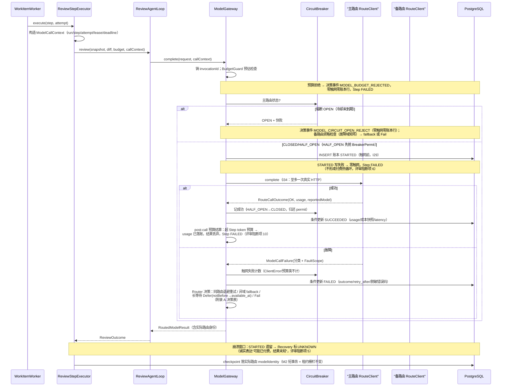
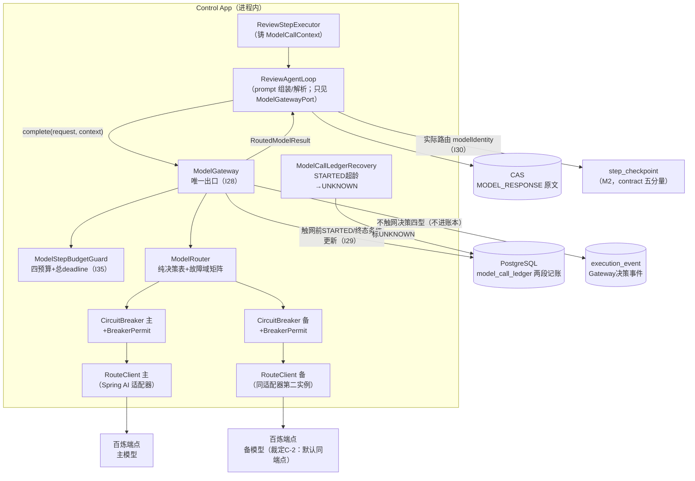

# M3 技术方案 —— 模型治理（Model Gateway 成形）：双路由超时/重试/熔断/fallback + 模型端点精确限流 + 成本账本

> 版本：v1.5（2026-09-02 用户裁定落实——§11 矩阵无执行体 101 条：核心集 13 条补落码
> `deploy/e2e-m3.sh`，其余 88 条豁免；G2 按修订后矩阵过门。v1.3 为实现规格定稿，v1.4 为编码后勘误）
> 起草时点说明：本方案在 **M2 工序 5（测试验证）未结束**、经用户明确指示提前起草（沿用 M2 文档先行先例）；
> **编码（工序 3）硬等 M2 G2 过门 + 本方案 G1 过门双门**，本稿仅为工序 1 交付物。
> 范围来源：冻结文档 v1 里程碑表（M3 Model Governance）；M0 §9 P5；M2 §8 压力点
> M2-P1/P2/P7/P8/P9；ADR-020 外部组件判据；OSS 证据清单 F-6/F-7/F-8、D-2/E5、A-3/E10。

## 修订记录

### v1.1（2026-08-31，对 G1 评审意见的逐条处置）

**三条用户裁定（2026-08-31，本版设计的前提）：**

- **裁定 C-1（范围）**：M3 按收口范围执行——不做流式调用、不做精确 request-hash 缓存、
  不做两个独立 Adapter（双路由 = 同一适配器的两个配置实例）。冻结文档 v1 的 M3 行
  （"Adapter、预算、流式、超时、熔断、fallback、精确缓存"、MVP 收口"两个 Adapter、流式"）
  与本方案的范围差为**已知偏差**，在 M3 G2 时同步修订冻结文档留痕。流式输出登记为
  触发式后续任务（§8 M3-P1）。
- **裁定 C-2（fallback 配置形态）**：备路由的 base-url 与 api-key **默认与主路由公用**
  （继承为合法配置），模型 ID 可配不同值。由此主备默认同端点、同账号配额域，
  fallback 资格按故障域矩阵收紧（§4.3）：只有"模型级"故障允许切备；端点级/账号级/
  凭证级故障不切（切了也是白敲同一个厨房的门）。
- **裁定 C-3（账本语义）**：采纳两段记账——触网前 INSERT `STARTED` 行，调用结束后
  条件更新为 `SUCCEEDED`/`FAILED`；进程崩溃遗留的 `STARTED` 由 Recovery 标 `UNKNOWN`。
  v1.0 的"调用返回后写一条、恰好一条"承诺被评审证伪，废止。

**评审阻断项处置对照（评审编号 → 本版处置位置）：**

| 评审问题 | 处置 |
|---|---|
| 1. 范围与冻结架构冲突 | 裁定 C-1，§1 不做项 + G2 同步修订冻结文档 |
| 2. checkpoint 身份因果循环（恢复时不知道将走哪条路由） | §4.7：resume 按**保存的路由**重算 contract，与"本次将走哪条路由"解耦 |
| 3. 路由/端点/配额域混为一体，同域 429 fallback 放大限流 | §4.3 三域身份 + fallback 资格矩阵；I36 |
| 4. 无总预算（调用次数/token/时间/deadline） | §4.4 ModelStepBudgetGuard + Gateway 总 deadline；I35 |
| 5. 账本"恰好一次"不成立 | 裁定 C-3，§4.6 两段记账；I29 重写 |
| 6. 账本故障制造付费热循环 | §4.6：STARTED 写失败 = 零触网；终态写失败 = UNKNOWN，不重试付费调用 |
| 7. Gateway 接口未闭合（上下文传不下去） | §3.1 `ModelCallContext` 显式传参；AFT-25 禁 ThreadLocal |
| 8. 分层自相矛盾（domain ReviewAgentLoop 直连 ModelClient） | §3.1 双层端口：`ModelGatewayPort` / `RouteClientPort`；AFT-23 |
| 9. 故障分类不完整（429 一刀切、解析失败位置、未知异常） | §4.2 provider error code 六类映射 + ProtocolError + fail-closed |
| 10. post-call 预算超限丢成本事实 | §4.4：响应已返回的 usage 强制落账后再判预算 |
| 11. DDL 不足（CHECK/FK/唯一键/lineage） | §4.1 全约束 DDL |
| 12. 成本公式缺 /1000、无价格快照 | §4.8：公式修正 + 单价快照 + pricing_version + 溢出规则 |
| 13. 配置规则冲突（继承 vs 启动失败） | 裁定 C-2 + §4.9 半配置规则重写；DP-21/DP-25 |
| 14. 超时只取消本地等待，供应商可能继续计费 | §6.2 R-M7 显式承认；账本记 TIMEOUT 事实 |
| 15. Spring AI/SDK 隐藏重试 | §4.10 T00 可行性验证；I34；E2E-54 |
| 16. HALF_OPEN 并发假设错误 | §4.5 permit 机制；UT-56/ST-68/E2E-48 |
| 17. fallback checkpoint 恢复规则错误（回主即丢弃） | §4.7 复用规则重写；ST-41/ST-55/E2E-51 |
| 18. error_detail 脱敏面不足 | §4.11：sanitized 三字段，原文禁落账 |
| 测试矩阵缺口（AFT-23~/UT-35~/CT-35~/ST-45~/EX-39~/E2E-41~/DP-23~/BT-M3-03~ + 执行纪律 + G2 硬门） | §11 全量重排合并（两份评审矩阵去重续编） |

### v1.2（2026-08-31，开源实证调研修正——G1 复审前）

v1.1 成稿后补做五路一手资料调研（Resilience4j 源码/官方文档、Spring AI 1.0 官方文档、
百炼官方限流与错误码文档、Stripe/Temporal/gRPC 官方文档、Envoy/Google SRE），证据入
`docs/OSS-证据清单-v1.md` F-9~F-16。调研证实了大部分设计（两段记账、原子 Permit、
同域禁 fallback、deadline 分层、R-M7），同时抓到三处事实性错误与若干新坑，逐条修正：

| 调研发现 | 修正 |
|---|---|
| 百炼"免费额度耗尽"是 **403**、"欠费/未开通"是 **400**，不是 429；`Throttling.AllocationQuota` 同码还有 400 版本（评审给的分类表和 v1.1 §4.2 都归错了状态码） | §4.2 改为 status×code 二维分类表；ST-71/72 状态码更正；EX-59 新增 |
| 百炼官方限流文档**未提 Retry-After 头**，官方最佳实践是客户端自算指数退避+抖动（1s~60s，"通常 1 分钟内自动恢复"） | §4.2 无头语义从"GitHub 下限 60s 平移"改为百炼官方基准；R-M2 从"未经真实验证"升级为"官方未提及，按无头假设设计"；UT-41 同步 |
| Spring AI 1.0.0 隐藏重试默认 `max-attempts=10`、退避 multiplier=5、上限 3min（一次逻辑调用最坏 10 次真实 HTTP、拖 20+ 分钟）；1.0.0 底层是自家 RestClient，**不是** openai-java SDK（评审的"双层叠加"对当前版本不成立，1.1/2.0 才会引入） | §4.10 重写为实证版本；关闭清单 `spring.ai.retry.max-attempts=1` 入 §4.9；升级检查单固化 `maxRetries(0)`；M0~M2 在役缺陷（从未设置该项）登记 **INC-42** |
| Resilience4j 实证：HALF_OPEN 探针等待默认**无限期**（探针挂死=permit 泄漏=永久卡态）；permit 归还不放 finally 会死锁；官方默认 Retry 在熔断外层导致每次重试都计入熔断（issue #2383） | §4.5 补探针超时 + permit finally 归还 + "每次物理触网失败计入熔断"明示条款 |
| gRPC/Envoy 实证：deadline 横跨全部重试且以剩余毫秒逐层下传 | §4.4 补"总 deadline 含 Gateway 内一切等待（含退避 sleep）" |
| 百炼 BurstRate 有官方低成本解法 `X-DashScope-Wait-Timeout` 服务端排队（仅对增速限流有效） | §4.2 处置列登记；默认不启用（stub 无法模拟该头语义），启用评估记 §8 M3-P10 |
| SRE/Envoy 定量：单请求次数上限不够，还需比例型重试预算（无则最坏 ~3x 放大）；但低流量下比例预算失真（Envoy min_retry_concurrency=3 即为此兜底） | 单实例低并发下本版用总额度；比例预算记 §8 M3-P11 观察项 |
| 调研代理建议"重试共享同一账本行、attempt 序号递增" | **驳回**：模型 API 无幂等键，重试 = 真实第二次计费调用，每物理调用独立一行才是账实相符（F-12）；共享行会把两笔费用压成一行 |

三条用户裁定（C-1/C-2/C-3）不受调研影响，维持不变。

### v1.2 增补（2026-08-31 第二轮调研：agent 同类项目 + 方法论 + M0~M2 旧账）

按用户订立的调研五步法（准则 §七"调研先行"）补做第二轮五路调研（LangGraph /
OpenHands+SWE-agent / Anthropic+12-Factor+OpenAI Agents SDK / M0 技术栈 / M1~M2 技术栈），
证据入 OSS 清单 F-17~F-25。结论分四类：

**① 权威背书（设计方向被独立验证，不改方案）：**
Anthropic《Building effective agents》"多数应用优化单次 LL 调用已足够、警惕框架抽象遮蔽
原始请求响应"；12-Factor Agents"own your control flow / stateless reducer"——我们的
workflow（非 agent）架构、checkpoint 显式契约、CAS 存 MODEL_RESPONSE 均获直接背书；
LangGraph 的"恢复即重放、副作用幂等靠隐式约定"（官方警告 interrupt 重放坑）反证我们
"digest 契约显式拒绝"是更强的设计。

**② 概念吸收（零依赖，进方案条款）：**
OpenHands 错误两级分类（调用级走重试/fallback、输出级走 Step 失败——与 §4.2 排除项
同构互证）；LangGraph durability 分档框架（sync/async/exit）作为 checkpoint 事务内
同步写选型的论证锚点（D23）；SWE-agent 预算分层佐证四预算设计（D24）。

**③ 旧账修正（进 M3 修）：**
- Spring AI 1.0.0 的 error handler 把 **429 一律归入 NonTransientAiException**（官方
  源码实证 F-17）——ProviderErrorClassifier 的输入**不得**依赖 Spring AI 异常类型，
  只认原始 HTTP status/headers/body（§4.2 补条款）；
- `Future.cancel(true)` **杀不掉 JDK HttpClient 的在途请求**（JDK-8245462，F-18）——
  超时中断只是"放手"，连接与供应商计费继续；必须配 request factory 级 connect/read
  timeout 兜底释放（§4.10 补强，R-M7 修订）；
- fencing 文献（Kleppmann，F-22）：lease_epoch 栅栏挡得住落库、**挡不住在途重复计费**——
  启动校验新增"lease 时长 > gateway-total-deadline + 余量"（§4.4/§4.9）。

**④ 明确拒绝（留痕防复提）：**
LangGraph checkpointer/interrupt 机制（无 Java 实现+全量快照膨胀坑实证+与单 Step 定位
冲突）；死循环检测/观测截断/RetryAgent（多轮循环 agent 特效药）；LLM 型护栏、
sessions 记忆、预分类路由（与"单次调用"定位冲突）；pgmq/Debezium（自研 outbox 已等价，
ADR-020 过不了）；解析失败 requery（维持 R-M5，记 M3-P12 触发式评估）。

**新压力点**：M3-P12（乱输出 requery 评估）、M3-P13（check_run rerequested 清空
conclusion 的漂移源，策略留 M4/M5）、M3-P14（outbox 最老 PENDING 年龄自检）、
M3-P15（pgjdbc 版本纪律：42.7.8 pinning 回归）、M3-P16（WireMock 保真度边界：
CONNECTION_RESET_BY_PEER 在 Windows 上表现为挂起——reset 类 E2E 只在 195 Linux 跑）。

### v1.3（2026-08-31，实现规格增补——判断题变查表题）

起因：用户要求评估"低经验实现者照方案独立编码"的差错风险。复审重读抓到**两处文档自相矛盾**
（§4.1 索引引用不存在的 `created_at` 列；页脚版本号滞留 v1.1）与**一处与既有代码不符的
事实错误**（§4.4 称 `work_item.next_attempt_at` 为 V1 既有列——实际列名 `available_at`，
且 T2 目前自行计算退避时刻、没有 notBefore 透传通道，Defer 语义原本落不了地）。本版
**不动任何设计决策**，只做三件事：决策查表化、接口签名化、触点清单化。

修正与裁定：

- 修正：`created_at` → `started_at`（§4.1 DDL 索引 + §4.1 注 + EX-56）；
  `next_attempt_at` → `available_at`（§2 T05 / §4.4 / §4.5 关联段 / I35 / ST-64），
  并补 T2 `max(线性退避, notBefore)` 取值规则；
- 裁定：invocationId 铸造权归 ModelGateway（§3.2 既有表述），`ModelCallContext` 字段表
  删除 invocationId（§3.1 原表述与之矛盾）；
- 裁定：M0 既有 `domain/ai/ModelBudgetGuard` 与本方案新组件同名冲突——新组件定名
  **`ModelStepBudgetGuard`**，既有类退役、两道校验职责并入（附录 D 触点 1）；
- 新增：**附录 A**（Gateway 编号伪代码 + Router 全决策表——UT-30 穷举的唯一事实源；
  含配额域共享冷却 `QuotaCooldownRegistry` 的归属裁定，补 UT-59/ST-50 的实现落点）、
  **附录 B**（预算与序号公式——UT-46/E2E-42"预算公式"的数学定义 + call_seq/账本行 id
  规则）、**附录 C**（关键接口签名 + Defer 传播链——补 notBefore 从 Gateway 到
  `available_at` 的断链 + 事件 payload 字段表）、**附录 D**（既有代码触点清单，
  逐个类给出改动落点）；
- 新增：§2 实现纪律四条（测试先行 / 禁改测试表 / 遇空白即停 / 中段检查点）；
- T00 增补：双 RouteClient 手工装配可行性（Spring AI 1.0.0 自动配置只产一个
  OpenAiChatModel，"同一适配器两个配置实例"的手工装配路径必须先行验证）。

三条用户裁定（C-1/C-2/C-3）与全部不变量、测试编号不变。

### v1.4（2026-09-01，编码实施偏差与勘误——实现后回修，不动设计决策）

M3 编码由主会话亲手完成（三轮外部编码交付均编译不过且修复报告失真后收回）。
编码期发现方案/附录若干与代码现实不符的空白与笔误，按"遇空白留痕"纪律逐条回修。
本版**只做事实勘误与实施细节登记**，全部设计决策、不变量、测试编号不变：

| # | 条目 | 处置 |
|---|---|---|
| 1 | §4.1 DDL `attempt_id` 的外键目标误写 `run_attempt`（无此表） | 原地更正为 `step_attempt`（本表上方）；实现按正确表名落码 |
| 2 | §4.1 outcome CHECK 枚举漏列 `UNKNOWN_ERROR`（fail-closed 分类的产物无法落库） | V5 落码已含 `UNKNOWN_ERROR`；视 §4.1 枚举含此项 |
| 3 | 附录 C `ModelCallContext` 的 `leaseHeartbeat` 类型写作 `LeaseHeartbeat`——该接口在 application 包，domain 记录反向依赖违 AFT 分层 | 实现用 `java.util.function.BooleanSupplier`（语义等价：false=租约失效）；附录 C 签名以此为准 |
| 4 | 附录 C `ModelCallContext` 缺 `prRevisionId`——决策事件走 execution_event，其 `pr_revision_id` 列 NOT NULL + FK，无此字段事件无法落库 | 实现已增补该字段（七参 record）；附录 C 签名以此为准 |
| 5 | 契约身份 provider/contract-version 两段的配置来源方案未写 | 实现裁定：取自既有键 `app.review.model-provider`（默认 `openai-compatible`）与 `app.review.model-version`（默认 `configured`）——**V4 兼容必需**：M2 旧 checkpoint 的 model_identity 即由这两键拼成，主路由不变时旧行可复用（§4.7 规则 1） |
| 6 | A3 欠费/未开通的告警落点方案未写 | 实现裁定：结构化 WARN 日志（`BILLING_ALERT`）+ errorCode 落账本与 STEP_RESULT，不新增事件类型（终态事实已有账本行承载） |
| 7 | `spring.ai.model.chat=none` 未入 §4.10 关闭清单——手工双路由装配后，自动配置的单一 OpenAiChatModel 无人消费；实测其余 OpenAI 自动配置（audio 等 matchIfMissing）装配期仍要求 api-key 非空 | application.yml：`spring.ai.model.chat=none` 关闭 chat 自动配置；`spring.ai.openai.api-key` 占位保留（其余自动配置 bean 无人消费）；§4.10 关闭清单以此为准 |
| 8 | §4.10 socket 兜底落点：Spring 6.2.6 的 `JdkClientHttpRequestFactory` 无 `setConnectTimeout`（javap 实证） | connect-timeout 走 `java.net.http.HttpClient.newBuilder().connectTimeout()` 传入工厂构造器；read-timeout=per-call-timeout 走工厂 setter。两层超时口径不变 |
| 9 | V5 授权段缺显式 REVOKE（V2 惯例："显式冻结，防未来 grant all 漂移"） | V5 落码已补 `revoke all ... from publisher_app / public` |
| 10 | `ModelTimeoutException` 随 M0 `ModelClient` 一并删除后，超时的 Worker 归类语义方案未写 | 超时由 `ModelCallFailedException(errorCode="TIMEOUT", stepRetryable=true)` 承载，WorkItemWorker classify 收敛到该分支（RETRY_WAIT 语义不变，EX-06 IT 已按此适配） |
| 11 | G5 冷却中快败/Defer 的 `notBefore` 取值方案未写死 | 实现裁定：取 `QuotaCooldownRegistry` 登记值（冷却截止时刻），不硬编码 60s |
| 12 | `StepExecutionContext` 两参便捷构造（attemptId=null）与账本 attempt_id NOT NULL FK 冲突 | 实现裁定：保留便捷构造但仅限不触模型路径；ReviewStepExecutor 构造 ModelCallContext 要求非空 attemptId（既有测试已改显式传入） |

实施一致性说明（非偏差，登记备查）：checkpoint 落库契约 digest 由**实际路由身份**铸造
（消灭 v3 外部交付里的"占位符 digest 与分量不自洽"缺陷）；决策事件四型 payload 与附录 C
字段表逐字一致；§4.9 全部默认值（max-call-retries=2、budget 6/100k/16k/120k、
deadline 300s、inline 15s、per-call 120s、recovery 240s/60s、退避 1s~60s、熔断 3/60s）
落码逐字一致；C-2 继承语义（备模型非空而端点/key 未配 = 继承主路由合法）按裁定实现，
v3 外部交付的"半配置拒绝"方向相反已纠正。

验证基线：本机 `mvn clean verify` 全绿（shared-kernel 101 + control-app 369 + publisher-app 139
= 609，0 失败；control 侧 6 条 docker IT 本机按预期跳过，留 195 真跑）——含 M3 新增单测 82 条
（ModelRouter 决策表穷举 31 / CircuitBreaker 并发恰好一发等 10 / ModelStepBudgetGuard 7 /
ProviderErrorClassifier 矩阵 17 / PricingService 7 / ModelGateway 两段记账+fallback+Defer+事件 10）。

### G1 过门留痕（2026-09-01）

用户明确确认"方案 v1.3 通过"——**M3 工序 2（G1 方案门）正式过门**。审议对象为 v1.3
实现规格定稿（v1.4 仅为编码后事实勘误回修，全部设计决策、不变量、测试编号不变，不构成
设计变更）。M3 编码（工序 3）开工双门之"M3 G1"就此解除；另一门"M2 G2"仍待（编码已在
用户明确指示下提前完成，见 v1.4 与 PROGRESS 2026-09-01 条）。下一步工序 4 部署验证
（195 真跑 IT/DP，待 M2 第六轮测试收官让出环境）→ 工序 5 出具《M3 测试交接文档》。

### v1.5（2026-09-02，用户裁定落实——§11 无执行体 101 条的批量处置）

工序 5 开局查明 §11 矩阵 206 条中 **101 条无执行体**（逐条明细见《M3 测试交接文档》v1.0
§0.2/§4：CT 10 + ST 46 + EX 8 + E2E 32 + BT 5）。2026-09-02 用户裁定，原文口径：

> §11 矩阵无执行体 101 条：核心集 13 条补落码 e2e-m3.sh（195 真跑中），其余 88 条豁免；
> G2 按修订后矩阵过门。

落实结果：

- **核心集 13 条已补落码** `deploy/e2e-m3.sh`：E2E-41/42/45/46/48/49/50/51/54/56/60/61/70，
  覆盖 G2 硬门 H1~H9 的全部挂载点（见 §11 G2 硬门表"执行体"列），并承载 BT-M3-01~05
  演示别名的 E2E 侧实质（BT 表注）；195 真跑取证中。
- **其余 88 条豁免**：编号全集见 §11 末「v1.5 豁免清单（用户裁定 2026-09-02）」。
  豁免 = 本轮 G2 对这些用例不举证、不阻塞；未来补齐执行体时逐条移出清单并回归。
- **偏差留痕（M3-T09）**：§2 M3-T09 单项验收标准为"§11 测试矩阵**全量落码**"；实际交付为
  AFT/UT 全量 + CT/ST/EX/DP 部分承载 + E2E 仅核心集 13 条，**"全量落码"未达成**。
  处置：不回炉补码其余 88 条（用户已裁定豁免），以本修订记录与 §11 豁免清单作为该偏差的
  正式留痕；G2 过门口径由"全矩阵全绿"调整为"修订后矩阵"——核心集 13 条真跑全绿 +
  88 条豁免在册 + 既有承载面（UT/AFT/CT/ST/EX/DP + M0~M2 全量回归）全绿。
- 本版不改动任何既有用例的断言文本、不变更设计决策；仅新增 §11 豁免清单小节，
  并在 L6 表、BT 表、G2 硬门表各加一处 v1.5 注/列。

## 1. 核心问题

**解决什么**：模型调用是全链路唯一不可控的外部依赖，目前处于"裸奔"状态——

1. **无重试无熔断无 fallback**（M2-P7）：`ModelClient.complete()` 一次调用定生死，模型端点
   429/5xx/超时/连接断全部直接炸穿 Step FAILED，靠 attempt 预算（进程崩溃级）兜底，
   一次瞬时抖动就要付出一整个 attempt 重跑的代价（真实联调单次评审含 3~6min tarball 拉取）。
2. **无成本账本**（M0 P5/M2-P2）：token usage 只埋在 findings JSON 的 stats 里（CAS 大对象），
   无法回答冻结 v1 NFR"中位评审 < $Y token 成本"；失败调用的消耗完全无记录。
3. **模型端点限流无治理**（M2-P7）：M2 的精确 Retry-After 只覆盖 publisher 三调用点，
   模型端点 429 连响应头都不解析，更不区分"模型级限流"与"账号级限流"。
4. **checkpoint 模型身份失真**（v1.0 已识别，v1.1 修正解法）：fallback 换模型后若仍登记
   配置身份，checkpoint 复用判定将基于错误的模型身份。v1.0 的解法（恢复后路由回主即丢弃
   备路由 checkpoint）被评审证伪——它让 fallback 白白烧掉的模型费在崩溃后再烧一次。
   v1.1 改为"按保存的路由身份重算契约，合法即复用"（§4.7）。
5. **账本可信性**（v1.1 新增问题陈述）：单条后记账本在"远端已计费、本地未落账"窗口
   既丢事实又会诱发付费热循环（评审阻断项 5/6）。两段记账是 M3 治理目标的前提，
   不是实现细节。

**为什么现在解决**：冻结里程碑表规定 M3 = 模型治理；M2 已把 checkpoint 契约 digest、
精确限流契约（`RetryDirective`/`RetryAfterParser`）、WorkItem 延迟重调度
（`work_item.available_at`，V1 既有）三块地基打好；继续往后拖，第一次
模型抖动/账单（M0 P5 原触发条件）到来时没有任何缓冲层。

**M3 明确不做**（裁定 C-1 收口 + 越级防线）：

- 不做流式调用/流式 UI（**裁定 C-1**：留后续里程碑，触发条件见 §8 M3-P1；冻结文档 v1
  M3 行的"流式"在 M3 G2 时同步修订）；
- 不做语义缓存，也不做精确 request-hash 缓存（**裁定 C-1**：M2 checkpoint 已覆盖确定性
  重放场景；冻结文档"精确缓存"条目同上一并修订）；
- 不做两个独立 Adapter（**裁定 C-1**：双路由 = 同一 `RouteClientPort` 适配器的两个
  配置实例；冻结文档"两个 Adapter"同上一并修订）；
- 不做多 Step 编排（M2-P1 留 M3+ 评估，本版不动）；
- 不做 OTel 埋点、IncidentProjection 告警组件、评测框架（ADR-020 排期 M5）；
- 不做 MANUAL 档审批端点/UI（M2-P3，独立评估项，不混入本里程碑）；
- 不引入新外部组件/平台（ADR-020 判据 1/2：Langfuse 11C/25.5Gi 超 195 余量 13 倍已裁定不部署；
  Resilience4j 不引入，见 §7 D2）；
- 不改动 publisher（模型调用只在 control；publisher 对账本表零权限）。

## 2. 任务拆解

| 编号 | 任务 | 依赖 | 单项验收标准 |
|---|---|---|---|
| M3-T00 | **可行性验证（先于一切编码）**：核对锁定版 Spring AI 的重试配置面并关闭；核对底层 SDK `max-retries` 并清零；WireMock 一次 500 断言真实 HTTP journal 恰好 1 条；确认 429 的 status/headers/provider error code 可从适配器取得；确认底层 HTTP client 的 connect/read timeout 可配；**确认双 RouteClient 手工装配可行**（Spring AI 1.0.0 自动配置只产一个 OpenAiChatModel——手工构造两个实例、各自模型/超时配置互不串、自动配置不冲突） | 无 | T00 验证记录（版本号、配置项、journal 截图/日志、双实例装配代码样例）入 `docs/OSS-证据清单`；任一结论不成立则回方案修订，不得带着假设编码 |
| M3-T01 | V5 迁移：`model_call_ledger` 两段记账 DDL（§4.1 全约束）+ 授权矩阵（control INSERT/SELECT/列级 UPDATE，publisher 零权限）+ V4 历史数据原地升级契约测试 | T00 | 沙箱 PG 顺序 V1→V5 一次过；CT-30/CT-35~41 绿 |
| M3-T02 | 故障分类契约：domain 封闭类型 `ModelCallFailure`（含 FaultScope 域归属）；`ProviderErrorClassifier`（百炼 error code 六类映射，§4.2）；429 头复用 `RetryAfterParser` | T00 | UT-27/28/35~40 绿；分类穷举无 else 分支；未知 code fail-closed |
| M3-T03 | `CircuitBreaker` 三态状态机 + `BreakerPermit`（HALF_OPEN 恰好一发的原子许可）+ 注入 Clock | T02 | UT-29/53~57/61 绿；UT-56 并发争抢恰好一发 |
| M3-T04 | `ModelRoute` 配置模型（route_id/requested_model/endpoint_scope/quota_scope/credential_domain 五元组，域从配置派生，§4.3）+ 半配置启动拒绝规则 | T00 | UT-62~64 绿；DP-21/DP-25 配置矩阵绿 |
| M3-T05 | `ModelStepBudgetGuard`（domain 纯件；M0 既有 `ModelBudgetGuard` 退役并入，附录 D）+ 四类预算 + Gateway 总 deadline + `inline-retry-max-delay` + 长等待 `Defer`（挂 `work_item.available_at`，传播链见附录 C） | T02 | UT-44~52/63~67 预算族绿；UT-49/51 取消语义绿 |
| M3-T06 | 双层端口与接线：domain 新增 `ModelGatewayPort`（上层）/`RouteClientPort`（底层）；`ReviewAgentLoop` 改依赖 `ModelGatewayPort`；`ModelCallContext` 显式穿过 `ReviewStepExecutor → ReviewAgentLoop → Gateway`；`ModelGateway`（application）编排全链路 | T02/T03/T04/T05 | UT-30~33 绿；AFT-19/20/23/25 静态断言绿 |
| M3-T07 | 两段账本链路：`ModelCallLedgerRepository` port + PG 实现（insertStarted + 条件 completeTerminal）+ `ModelCallLedgerRecovery`（STARTED 超龄 → UNKNOWN）+ 成本快照落账 | T01/T06 | CT-31/33/42~46 绿；UT-68~71 绿 |
| M3-T08 | checkpoint 身份接线（§4.7）：checkpoint 落实际路由身份；resume 按保存路由重算 contract；fallback checkpoint 复用规则 | T06/T07 | ST-41/55 绿；M2 checkpoint 回归（ST-43）绿 |
| M3-T09 | §11 测试矩阵全量落码（AFT-19~/UT-27~/CT-30~/ST-39~/EX-31~/E2E-41~/DP-20~/BT-M3-01~） | T01~T08 | 本机单测全绿；IT/E2E 经 test-compile，195 真跑留工序 5 |
| M3-T10 | 部署：V5 上栈 + 模型端点 stub mappings（WireMock 故障注入面，含 error code 编排）+ DP-20~28 | T09 | DP 门禁 PASS；栈自检通过 |

依赖关系：T00 绝对先行（结论不成立则方案回炉）；T01∥T02∥T03∥T04 可并行；T05 依赖 T02；
T06 汇流；T07/T08 并行；T09/T10 串行收尾。

**实现纪律（工序 3 硬规则，v1.3 增补）：**

1. **测试先行**：每个任务先按 §11 表格把对应测试写出并见红，再写实现——测试表即规格书；
2. **实现者无权改测试表**：§11 任何用例的断言改动 = 方案变更，必须回评审留痕后进修订记录；
   既有测试（附录 D 触点涉及的）只允许适配编译，不允许改断言语义；
3. **遇空白即停**：方案与附录 A~D 没写到的情况，禁止自由发挥——停下提问，答复留痕进修订记录；
4. **中段检查点**：T00、T01、T06 完成时各做一次人工过目，不攒到 T09 一次验收——跑偏越早抓越便宜。

## 3. 类设计

### 3.1 类清单

**domain 层（`control/domain/ai`，零 Spring/HTTP/JDBC 依赖，AFT-24 守）：**

| 类 | 职责 | 明确不做 |
|---|---|---|
| `ModelCallFailure`（sealed） | 模型调用故障的封闭分类：`Timeout / NetworkError / ProtocolError / RateLimitedTransient(retryAfter) / QuotaTemporary(notBefore) / QuotaExhausted / BillingOrActivation / AuthDenied / RequestInvalid / ServerError`；每个实例携带 `FaultScope`（`MODEL / ENDPOINT / ACCOUNT / CREDENTIAL`）域归属；`isRetryable()`/`isFallbackable(currentRoute, candidateRoute)` 唯一判定处 | 不携带供应商异常类型；不含堆栈以外的供应商概念 |
| `FaultScope`（enum） | 故障域归属：模型级（只影响该模型）/端点级（整个 base-url）/账号级（配额/账单）/凭证级（key/权限）；fallback 资格矩阵的判定输入（§4.3） | 不做更细粒度（实例/AZ 级无可见性） |
| `ModelRoute`（record） | 一条路由的完整身份：`routeId / requestedModel / endpointScope / quotaScope / credentialDomain / pricingVersion`；配置铸造，运行期不可变；`endpointScope`=规范化 base-url；`quotaScope`/`credentialDomain`=api-key 的 SHA-256 截断派生值（**永不落明文 key**） | 不做运行期改路由；不持有 key 本体 |
| `ModelRouteIdentity`（record） | checkpoint 契约身份：`provider/requestedModel/contractVersion` 三段 canonical 格式；与 `reportedModel`（供应商自报，可空、可能是别名）严格分离 | 不用响应元数据构造契约身份 |
| `CircuitBreaker` | per-route 三态熔断（CLOSED/OPEN/HALF_OPEN），迁移表唯一合法集；只计"触网后失败" | 不做滑动窗口百分位；不持久化（§7 D8） |
| `BreakerPermit` | HALF_OPEN 探针许可：`tryAcquire(now)` 原子领取恰好一发；`onSuccess/onFailure/onCancel` 归还或转态；探针线程被取消不卡死 HALF_OPEN | 不假设单线程（单 JVM 多 Worker 并发是现实） |
| `ModelRouter` | 纯决策：故障分类 + FaultScope + 熔断状态 + 剩余预算 → `Retry(同路由,退避) / Fallback(下一路由) / Defer(notBefore) / Fail`；决策表驱动，无副作用 | 不发起调用、不写账、不持状态 |
| `ModelStepBudgetGuard` | Step 级预算门卫（纯件）：`check(estimatedPrompt, budgetState)` → Allow/Reject；`recordUsage(actual)` 累计；四预算项见 §4.4。**v1.3 裁定改名**（原方案名 `ModelBudgetGuard` 与 M0 既有类冲突；既有类退役并入本类，附录 D 触点 1） | 不看金额（I32）；不发调用 |
| `QuotaCooldownRegistry` | per-quota-scope 冷却登记：`markCoolingUntil(scope, until)` / `isCooling(scope, now)`；注入单调 Clock；进程内存态（与熔断同生命周期）。UT-59/ST-50"共享冷却"的实现落点（附录 A G5） | 不持久化；不做跨实例共享（单实例 B-R7） |
| `RoutedModelResult`（record） | `ModelResult` + `ModelRoute` + invocationId + callSeq + fallbackFrom + usageMissing + latency | 不改 `ModelResult` 本体（兼容现有测试） |
| `ModelCallContext`（record） | 调用上下文显式载体：`runId / stepId / attemptId / leaseEpoch / stepDeadline / leaseHeartbeat`；构造于 `ReviewStepExecutor`，逐层透传；**不含 invocationId**（铸造权归 Gateway，v1.3 裁定） | **禁止 ThreadLocal/静态变量传递**（AFT-25） |
| `ModelGatewayPort`（interface） | **上层端口**：`RoutedModelResult complete(ModelRequest, ModelCallContext)`；`ReviewAgentLoop` 唯一可见的模型依赖 | 不暴露 route/熔断/账本概念 |
| `RouteClientPort`（interface） | **底层端口**：单次物理调用 + 返回 `RouteCallOutcome`（成功含 usage/reportedModel/providerRequestId；失败含 `ModelCallFailure`）；**只有 `ModelGateway` 可依赖**（AFT-23）；一次调用最多一次真实 HTTP（I34） | 不做重试（重试在 Gateway）；不做账本 |
| `ModelCallLedgerEntry`（record）+ `ModelCallLedgerRepository`（port） | 账本条目与存取端口：`insertStarted(...)` / `completeTerminalSuccess(...)` / `completeTerminalFailure(...)` / `markUnknownOlderThan(...)`；**无通用 update/delete** | 不做聚合查询（runbook SQL 直查） |

**application 层：**

| 类 | 职责 | 明确不做 |
|---|---|---|
| `ModelGateway` | 模型调用唯一出口（实现 `ModelGatewayPort`）：铸 invocation → 预算检查 → 熔断检查 → Router 决策循环（重试/退避/fallback/defer，编号伪代码见附录 A）→ 驱动 `RouteClientPort` 实例 → 两段记账 → 决策事件发射（复用 `ExecutionLedger`）；持有 breakers、`QuotaCooldownRegistry` 与 per-invocation 预算状态（每次 complete() 新建，附录 B） | 不含供应商概念；不组 prompt；**不标 `@Transactional`**（AFT-30：外部调用不挂数据库长事务） |
| `ModelCallLedgerRecovery` | 启动时 + 周期扫描：`STARTED` 且 `started_at < now - recovery-after` → 标 `UNKNOWN` | 不把 UNKNOWN 改写成成功/失败（UNKNOWN 是终态） |

**infrastructure 层：**

| 类 | 职责 | 明确不做 |
|---|---|---|
| `SpringAiModelClient`（改造为实现 `RouteClientPort`） | 每个 route 一个实例；异常→`ModelCallFailure` 分类映射；429 解析头 + body error code（复用 shared-kernel `RetryAfterParser` + 新 `ProviderErrorClassifier`）；提取 reportedModel/providerRequestId；connect/read timeout 走底层 HTTP client 配置 | 仍不做重试；隐藏重试必须关闭（I34/T00） |
| `ProviderErrorClassifier` | HTTP status + 百炼 error code 联合分类（§4.2 两表）；未知 code → fail-closed 稳定错误 | 不把 GitHub 限流规则平移当模型端点证据 |
| `PostgresModelCallLedgerRepository` | V5 表 PG 实现；completeTerminal 为条件更新（`WHERE id=? AND state='STARTED'`，0 行 = 已终态，幂等） | 无通用 UPDATE/DELETE |
| 模型端点 stub mappings | deploy/wiremock：`/chat/completions` 可编排故障面：429（带头/不带头/带 error code）/500/超时/乱 JSON/截断 body/双挂 | 不模拟真实模型语义；统一标"合成故障演练" |

**共享层：** `ExecutionEventType`（shared-kernel）新增
`MODEL_CIRCUIT_OPEN_REJECT / MODEL_BUDGET_REJECTED / MODEL_FALLBACK_SELECTED / MODEL_RETRY_DEFERRED`——
**不触网的 Gateway 决策一律走事件流，不进 `model_call_ledger`**（账本只记物理调用事实，
否则失败率与成本分母被污染）。

### 3.2 关键交互时序（两段记账 + fallback + 崩溃窗口）



---

## 4. 实现方式

### 4.1 数据模型（V5 迁移，单表两段记账）

```sql
-- V5__m3_model_governance.sql
CREATE TABLE model_call_ledger (
    id                     uuid PRIMARY KEY,
    invocation_id          uuid not null,        -- 一次逻辑模型请求（含其全部重试/fallback）
    call_seq               int  not null CHECK (call_seq >= 1),
    review_run_id          uuid not null REFERENCES review_run(id),
    run_step_id            uuid not null REFERENCES run_step(id),
    attempt_id             uuid not null REFERENCES step_attempt(id),  -- v1.4 勘误：原文误写 run_attempt（无此表；实际表名 step_attempt），实现已按正确表名落码
    lease_epoch            bigint not null,      -- 记账时的租约世代（晚到写审计用）
    route_id               text not null,        -- 配置侧稳定路由 ID（如 primary/fallback）
    route_role             text not null CHECK (route_role IN ('PRIMARY','FALLBACK')),
    fallback_from          text,                 -- 上一跳 route_id；首跳必须为 null
    endpoint_scope         text not null,        -- 规范化 base-url（故障域判定依据）
    quota_scope            text not null,        -- api-key SHA-256 截断派生值（不落明文）
    requested_model        text not null,        -- 请求发送的模型名
    reported_model         text,                 -- 供应商自报模型，可空、可为别名
    provider_request_id    text,                 -- 供应商请求 ID（账单对账用），可空
    state                  text not null CHECK (state IN ('STARTED','SUCCEEDED','FAILED','UNKNOWN')),
    outcome                text CHECK (outcome IN ('OK','TIMEOUT','RATE_LIMITED_TRANSIENT',
                               'QUOTA_TEMPORARY','QUOTA_EXHAUSTED','BILLING_OR_ACTIVATION',
                               'AUTH_DENIED','REQUEST_INVALID','SERVER_ERROR','NETWORK_ERROR',
                               'PROTOCOL_ERROR')),
    http_status            int  CHECK (http_status BETWEEN 100 AND 599),
    retry_after_ms         bigint CHECK (retry_after_ms >= 0),
    prompt_tokens          int  not null default 0 CHECK (prompt_tokens >= 0),
    completion_tokens      int  not null default 0 CHECK (completion_tokens >= 0),
    total_tokens           int  not null default 0 CHECK (total_tokens >= 0),
    usage_missing          boolean not null default false,
    latency_ms             bigint CHECK (latency_ms >= 0),
    cost_micros            bigint CHECK (cost_micros >= 0),       -- 美元×10^6；无单价配置时 null
    pricing_version        text,                 -- 落账时的价格表版本（快照）
    currency               text,                 -- 如 'USD'
    input_price_micros_per_1k  bigint,           -- 单价快照：历史账单不随配置变化被重新解释
    output_price_micros_per_1k bigint,
    error_code             text,                 -- 脱敏后的稳定错误码（非供应商原文）
    error_fingerprint      text,                 -- 脱敏后消息的 digest（聚类用）
    sanitized_message      text,                 -- 脱敏 + 截断 500 字符（§4.11）
    started_at             timestamptz not null default now(),
    finished_at            timestamptz,
    -- 状态机一致性（CHECK 只能限单行的字段组合；迁移合法性由仓储条件更新 + CT-26 族穷举守）
    CHECK ((state = 'STARTED'   AND outcome IS NULL AND finished_at IS NULL)
        OR (state = 'SUCCEEDED' AND outcome = 'OK'  AND finished_at IS NOT NULL)
        OR (state = 'FAILED'    AND outcome IS NOT NULL AND outcome <> 'OK' AND finished_at IS NOT NULL)
        OR (state = 'UNKNOWN'   AND outcome IS NULL AND finished_at IS NOT NULL)),
    -- lineage 一致性：PRIMARY 必无上一跳，FALLBACK 必有上一跳
    CHECK ((route_role = 'PRIMARY'  AND fallback_from IS NULL)
        OR (route_role = 'FALLBACK' AND fallback_from IS NOT NULL)),
    -- usage 缺失时三计数必须全 0（不造数）
    CHECK (usage_missing = false OR (prompt_tokens = 0 AND completion_tokens = 0 AND total_tokens = 0)),
    -- 成本非空则价格快照必须完整
    CHECK (cost_micros IS NULL OR (pricing_version IS NOT NULL AND currency IS NOT NULL
                                   AND input_price_micros_per_1k IS NOT NULL
                                   AND output_price_micros_per_1k IS NOT NULL)),
    UNIQUE (invocation_id, call_seq)             -- 同一逻辑调用的物理序列不重号
);
CREATE INDEX idx_model_call_ledger_run        ON model_call_ledger (review_run_id, started_at);
CREATE INDEX idx_model_call_ledger_route      ON model_call_ledger (route_id, started_at);
CREATE INDEX idx_model_call_ledger_invocation ON model_call_ledger (invocation_id, call_seq);
-- Recovery 扫描：超龄 STARTED
CREATE INDEX idx_model_call_ledger_started    ON model_call_ledger (started_at) WHERE state = 'STARTED';
```

说明（对评审阻断项 11 的处置）：

- `review_run_id/run_step_id/attempt_id` **非空 + FK**。v1.0 的"可空留给未来启动自检"
  被评审否决（为未来需求提前放弃 FK 不符合最小设计），本版收回：M3 没有无 Run 的
  模型调用场景；未来真出现时再加 `call_scope` 列迁移。M1-P9 族"无 Run 可挂"缺口
  仍是 M1 G2 裁定项，本表不收编。
- 决策事件（CIRCUIT_OPEN/BUDGET_REJECTED/FALLBACK_SELECTED/RETRY_DEFERRED）**不在此表**，
  走既有 `execution_event` 事件流（shared-kernel `ExecutionEventType` 扩展四型）。
- `started_at` 以数据库时钟为准（`default now()`），即入库时间——本表**不单列 created_at**
  （v1.3 修正：v1.1/v1.2 索引与注释误引不存在的 `created_at` 列）；熔断冷却等进程内计时
  用注入的单调 Clock（EX-56）。

授权矩阵增量（沿用 V2/V3/V4 最小权限模式）：

| 角色 | model_call_ledger |
|---|---|
| owner（migrate） | DDL |
| control_app | INSERT, SELECT, **列级 UPDATE**（仅 state/outcome/http_status/retry_after_ms/tokens/usage_missing/latency_ms/cost/price 快照/reported_model/provider_request_id/error 三字段/finished_at——即 completeTerminal 允许写的列；身份列与 started_at 不可改） |
| publisher_app | **零权限**（连 SELECT 都不给——publisher 与模型无关，权限面不扩大） |
| PUBLIC | 零权限 |

### 4.2 故障分类（ModelCallFailure 的唯一事实源）

**第一步：HTTP 状态初分**（`ProviderErrorClassifier`；400/403/429 不能单独定案，进第二步）：

| HTTP | 初步分类 | FaultScope | 说明 |
|---|---|---|---|
| 400 | **待定 → 第二步** | — | 欠费/未开通也是 400（F-11），不能一刀切 RequestInvalid |
| 401 | AuthDenied | CREDENTIAL | 终局 |
| 403 | **待定 → 第二步** | — | 免费额度耗尽（FreeTierOnly）也是 403（F-11）；无法识别时保守按 AuthDenied |
| 404/409/422/425 | RequestInvalid | MODEL（模型不存在/参数错） | 不重试不 fallback |
| 408 | Timeout | ENDPOINT | 可重试 |
| 429 | **待定 → 第二步** | — | 限流四族见下表 |
| 500/502/503/504 | ServerError | 默认 ENDPOINT；code 明示模型级则 MODEL | 指数退避 |
| 无响应（连接断/DNS/TLS） | NetworkError | ENDPOINT | 短退避 |
| 本地超时（per-call-timeout） | Timeout | ENDPOINT（保守：无法区分模型慢与端点慢） | 不原地立即重试；同域配置下不 fallback |
| HTTP 200 但协议 JSON 损坏 | ProtocolError | ENDPOINT | 不重试（响应完整性不可信） |
| SDK 未知异常 | fail-closed 稳定错误码 | — | 不重试不 fallback；不泄露异常全文 |

**第二步：provider error code 细分**（百炼官方错误码/限流文档实证 F-11，2026-08-31 核对；
status × code **二维联合判定**——`Throttling.AllocationQuota` 同码存在 400 版本，只看 code 会误判）：

| status × code | 分类 | FaultScope | 处置 |
|---|---|---|---|
| 429 × `Throttling.RateQuota`/`limit_requests`（模型级 RPM/RPS） | RateLimitedTransient | MODEL | 退避后同路由重试；预算内仍败且备路由模型不同 → **允许 fallback**（不同模型 = 不同模型级配额池，裁定 C-2 下唯一放行的 fallback 族；官方亦建议限流时才降级备选模型） |
| 429 × `Throttling.BurstRate`（流量增速） | RateLimitedTransient | MODEL | 短退避；官方首选解法为请求头 `X-DashScope-Wait-Timeout: 3~120` 服务端排队（仅对增速限流有效；本版默认不启用——stub 无法模拟该头语义，启用评估记 §8 M3-P10） |
| 429 × `Throttling.AllocationQuota`/`insufficient_quota`（TPM/TPS） | QuotaTemporary(notBefore) | ACCOUNT | 不原地循环：长等待走 Defer（§4.4）；同 quota 域不 fallback |
| 429 × 通用 `Throttling`（无细分 code） | RateLimitedTransient | ACCOUNT（保守归域） | 退避重试；不 fallback |
| 403 × `AllocationQuota.FreeTierOnly`（免费额度耗尽） | QuotaExhausted | ACCOUNT | 终态失败；不同计费域 fallback 才允许（默认配置无） |
| 403 × `Model.AccessDenied` | AuthDenied | CREDENTIAL | 不重试；同域不 fallback |
| 400 × `Arrearage`（欠费） | BillingOrActivation | ACCOUNT | 不重试不 fallback；**单列告警路径**——欠费信号不得淹没在普通 400 里 |
| 400 × 未开通服务（product not activated 族） | BillingOrActivation | ACCOUNT | 同上 |
| 400 × 其他（参数/格式错） | RequestInvalid | MODEL | 不重试不 fallback |
| 以上之外 / code 缺失 / 未知 code | fail-closed 稳定错误 | — | 不重试不 fallback；稳定错误码落账 |

**退避数值裁定**（F-11 官方基准，替代 v1.0/v1.1 从 GitHub F-8 平移的"无头下限 60s"——
百炼官方限流文档未提 Retry-After 头，官方示例是客户端自算退避）：

- 响应带 `Retry-After` 头（官方文档未载，兼容模式可能透传）→ 有头等够，复用 shared-kernel
  `RetryAfterParser`；
- 无头（**预期主流形态**）：指数退避 + 随机抖动，1s 起步、上限 60s（官方"通常 1 分钟内
  自动恢复"为基准，重试 5~6 次族）；等待超过 `inline-retry-max-delay`（15s）的一律走
  Defer，不占 Worker 线程；
- 官方明示限流按**秒级** RPS/TPS 执行：分钟级总量未超限也会被拒——预算/聚合的分钟窗口
  口径不得低估限流风险；
- 错误 body 双结构都要能解析：OpenAI 兼容 `{"error":{"code",...}}` 嵌套 + DashScope 原生
  顶层 `{"code",...}`（我们走兼容模式，但分类器不做单一结构假设）；
- **分类输入不依赖 Spring AI 异常类型**（F-17 实证：1.0.0 官方 error handler 把**所有 4xx
  一律归为 `NonTransientAiException`**，429 与参数错误不分，issue #3857 自承粒度不足）——
  `ProviderErrorClassifier` 只认原始 HTTP status/headers/body；Transient/NonTransient 类型
  体系仅作日志参考，永不驱动重试/fallback 决策。

**明确排除项**：解析失败（FindingJsonParser 拒绝模型输出）发生在 Gateway 之外的
`ReviewAgentLoop`，不是 `ModelCallFailure`——账本已记 SUCCEEDED（模型确实成功返回），
Step 因解析失败 FAILED，**不触发 Router fallback**（D7/R-M5）。两条事实分离记录。

### 4.3 路由身份、故障域与 fallback 资格矩阵（裁定 C-2 落地）

身份拆分（评审阻断项 3/9 处置）：

| 概念 | 取值来源 | 用途 |
|---|---|---|
| `route_id` | 配置稳定 ID | 账本/fallback_from/事件 |
| `requested_model` | 配置 | 请求体 + checkpoint 契约身份 |
| `reported_model` | 响应元数据（可空，可为别名） | 账本审计列；**不进契约身份** |
| `endpoint_scope` | 规范化 base-url | 故障域判定（ENDPOINT 域） |
| `quota_scope` | api-key SHA-256 截断派生 | 配额域判定（ACCOUNT 域） |
| `credential_domain` | 同上派生 | 凭证域判定（CREDENTIAL 域） |
| `model_contract_identity` | `provider/requestedModel/contractVersion` | checkpoint 五分量之一（I30） |

域从配置**派生**而非手配：裁定 C-2 下默认主备同 `endpoint_scope`/`quota_scope`/
`credential_domain`；未来若引入第二账号/第二端点，改配置即自动获得异域语义，
代码不变。

**fallback 资格矩阵**（ModelRouter 内置，唯一判定处）：

| 故障 FaultScope | 同域（默认配置） | 异域（将来配置变体） |
|---|---|---|
| MODEL（模型级 429/模型级 5xx/模型不存在类排除 RequestInvalid） | **允许**（换模型有效） | 允许 |
| ENDPOINT（超时/DNS/连接断/端点级 5xx） | **禁止**（同一厨房，白敲门还放大故障） | 允许 |
| ACCOUNT（账号配额/账单） | **禁止** | 仅不同 quota_scope 允许 |
| CREDENTIAL（401/403） | **禁止** | 仅不同 credential_domain 且显式配置允许 |
| 无法确定域 | 按更保守域处理（=禁止） | 按更保守域处理 |

熔断 OPEN 导致的 fallback 选择同样过此矩阵：OPEN 原因的 FaultScope 已入账，
若 OPEN 由 ENDPOINT/ACCOUNT 域故障累积而成，同域备路由不参与 fallback。

### 4.4 预算与总 deadline（评审阻断项 4/10 处置，I35）

`ModelStepBudgetGuard` 管辖的预算项（配置见 §4.9）：

| 预算 | 语义 |
|---|---|
| `max-physical-calls-per-step`（默认 6） | 主路由重试与 fallback **共用**计数；切路由不重置；耗尽即 Fail |
| `max-prompt-tokens-per-call` | 调用前估算 prompt token，明显超限零触网拒绝（MODEL_BUDGET_REJECTED 事件） |
| `max-completion-tokens-per-call` | 作为请求参数下发模型（约束生成长度） |
| `max-total-tokens-per-step` | 本 Step 全部成功调用的 usage 累计共享 |
| `gateway-total-deadline`（默认 300s） | 一次 `complete()` 调用的总时限：任一重试/等待不得越过 |
| `inline-retry-max-delay`（默认 15s） | Gateway 线程内允许等待的单次退避上限 |

规则裁定（逐条对应评审质询）：

- 失败调用无 usage：token 计 0（usage_missing 语义不适用于失败），**call 计数照计**；
- fallback 使用**剩余**预算，不重置（I35）；
- 响应返回后才发现超 Step token 预算：**usage 与成本先完整落账**（钱已花，事实先记），
  然后结果丢弃、Step FAILED(BUDGET_EXCEEDED)（评审阻断项 10：post-call 违约不丢成本事实）；
- attempt 重跑获得新的执行预算，但账本按 Run 聚合可见总消耗（审计面不受预算重置影响）；
- 金额（cost_micros）**永不**进任何预算/门控判定（I32），门控只看 token/call 计数；
- `Retry-After ≤ inline-retry-max-delay`：Gateway 内等待，等待期间必须响应
  取消/租约失效（收到中断立即停，保留 interrupt 状态，不再触网）；
- `Retry-After > inline-retry-max-delay`：**不在 Worker 线程长睡**——有异域 fallback 且
  矩阵放行则 fallback；否则 Step FAILED(RateLimited, notBefore)，经附录 C 传播链由 T2 将
  `work_item.available_at` 置为 `max(T2 线性退避, notBefore)` 走既有延迟重调度
  （V1 既有列，零扩表；v1.3 修正：v1.1/v1.2 误写列名 `next_attempt_at`，且 T2 原本
  自算退避、无 notBefore 透传通道），发射 MODEL_RETRY_DEFERRED 事件；
- 预算状态生命周期：每次 `complete()` 调用新建一份（键 = invocationId，附录 B）；M3 断言
  一次 Step 执行内恰好一次 `complete()`（ReviewAgentLoop 单轮契约），attempt 重跑 =
  新 complete() = 新预算；预算公式与 call_seq 编号规则冻结于附录 B；
- 等待中总 deadline 到期：立即停，不再触网，Step FAILED；
- timeout 与响应同时到达的竞态：以先被 Gateway 观察到者为准，只产生一种终态、
  只落一条终态账本（条件更新保证）；
- **总 deadline 含 Gateway 内一切等待**（含退避 sleep 与熔断快败路径——F-14/F-15 实证：
  gRPC 与 Envoy 均规定 deadline 横跨全部 attempts，backoff 中的重试也占用配额）；
  deadline 以**剩余毫秒**逐层下传（ModelCallContext → per-call-timeout 取
  min(配置值, 剩余额度)），各层不自设绝对超时——防多层固定超时隐性放大总预算；
- 与 Temporal 双层超时同构（F-13）：`gateway-total-deadline` ≈ StartToClose（单次编排），
  attempt 预算 + Defer ≈ ScheduleToClose（跨重试总量）；Defer 挂回队列后由 attempt 级接管，
  不违反"deadline 横跨 attempts"——因为 Defer 本身就是 attempt 层的重新调度；
- **租约与 deadline 的数量关系**（F-22 fencing 文献的边界：epoch 栅栏挡得住落库、
  挡不住在途重复计费）：必须满足 `work_item 租约时长 > gateway-total-deadline + 心跳余量`，
  否则租约会在模型调用在途时过期，接管者发起第二次调用——结果落库被 epoch 挡住，
  但费用已重复发生。该不等式进启动校验（§4.9）；in-flight 调用期间租约靠既有 heartbeat
  续租维持。

三层兜底关系不变：call 级（Gateway 内）→ route 级（fallback）→ attempt 级
（M0/M2 既有，进程崩溃/最终失败/defer 归它）。

### 4.5 熔断器语义（CircuitBreaker + BreakerPermit，评审阻断项 16 处置）

状态迁移表（唯一合法集）：

| 当前 | 触发 | 下一态 |
|---|---|---|
| CLOSED | 连续失败数 ≥ `failure-threshold`（默认 3） | OPEN |
| CLOSED | 调用成功 | CLOSED（计数清零） |
| OPEN | now < `opened_at + cool-down`（默认 60s） | OPEN（零触网快败，走决策事件不走账本） |
| OPEN | 冷却到期且有调用到来 | HALF_OPEN |
| HALF_OPEN | 探针成功 | CLOSED |
| HALF_OPEN | 探针失败 | OPEN（重新计时冷却） |
| HALF_OPEN | 探针线程被取消/中断 | OPEN（重新计时；**不允许永久卡 HALF_OPEN**） |

- 熔断计数只计"触网后失败"（Timeout/5xx/429/NetworkError/ProtocolError）；
  ClientError 族（RequestInvalid/AuthDenied/Billing）与预算违约**不累加也不清零**；
  解析失败在 Gateway 外，与熔断无关。
- "恰好一发探针"由 `BreakerPermit.tryAcquire(now)` 原子领取保证（评审阻断项 16：
  synchronized 方法只有"检查+领取"同在一个原子块内才成立；单 JVM 多 Worker 并发
  是现实而非假设）。UT-56 以 20 并发、E2E-48 以 50 并发 Run 验证恰好一发。
  Resilience4j 源码实证同款语义（permit 原子预扣，领完即拒，F-9）。
- **探针悬挂防护**（F-9 实证坑：Resilience4j 的 `maxWaitDurationInHalfOpenState` 默认 0 =
  无限等待，探针挂死即 permit 泄漏、永久卡 HALF_OPEN）：探针调用带独立超时
  （= per-call-timeout，天然有界）；permit 归还必须放 `finally`（含回调/谓词自身抛
  异常的路径）；探针超时/被取消强制归还 permit 并转 OPEN（重新计时）。
- **重试与熔断的计数关系明示**（F-9 issue #2383 教训：Resilience4j 官方默认 Retry 在
  熔断外层，每次重试都被计为独立失败）：本方案裁定——**每次物理触网失败都计入熔断**
  （保守方向：宁快勿慢；重试次数已被 max-call-retries 与 Step 总预算双层封顶，不会
  无限放大计数）；决策事件与快败路径不计数（未触网）。
- 状态为进程内内存态（单实例 B-R7），重启即 CLOSED 重新预热（R-M3；F-9：Resilience4j
  同为内存态，集群持久化需求其官方 issue #419 至今未实现——内存态是主流先例而非偷懒）；
  冷却计时走注入单调 Clock，系统时钟回拨/前跳不提前放行也不永久 OPEN（UT-61/EX-56）。
- **配额域共享冷却**（UT-59/ST-50"共享冷却"的实现落点，v1.3 补）：ACCOUNT 域失败
  （QuotaTemporary / QuotaExhausted / 账号级通用 Throttling）终态落账时，由 ModelGateway 写
  `QuotaCooldownRegistry[quota_scope] = notBefore（无 notBefore 时取退避上限 60s）`；
  冷却期内任何同 quota_scope 路由的触网决策降级为 Defer/快败（附录 A 闸门 G5）——
  这把"不原地循环、不放大账号级限流"从约定变成强制。内存态、注入单调 Clock，
  与熔断器同生命周期（R-M3 同理接受重启丢失）。

### 4.6 两段记账与崩溃窗口（裁定 C-3，I29 重写）

物理调用时序（每次触网严格按此序）：

```text
1. INSERT (state=STARTED, invocation_id, call_seq, 身份列, started_at=now())
   —— 失败（约束/权限/连接）：零触网，Step FAILED。账写不进去就不打电话（评审阻断项 6）
2. 驱动 RouteClientPort 发起 HTTP（I34：至多一次真实请求）
3a. 成功：条件 UPDATE state=SUCCEEDED（usage/成本快照/latency/reported_model/
    provider_request_id, finished_at=now()）WHERE id=? AND state='STARTED'
3b. 失败：条件 UPDATE state=FAILED（outcome/retry_after/脱敏三字段）
    —— 3a/3b 返回 0 行 = 已被并发终态化，幂等忽略（不重试、不报警）
```

崩溃窗口语义：

| 窗口 | 后果 | 恢复 |
|---|---|---|
| STARTED 前崩溃 | 无账本、未触网 | attempt 接管，无成本 |
| STARTED 后、HTTP 完成前崩溃 | 一行 STARTED 悬挂；可能已付费 | Recovery（`started_at < now - recovery-after`，默认 2×per-call-timeout）标 **UNKNOWN**——诚实表达"可能已付费，结果未知"；**不伪造 OK，也不重试原 invocation**（新 attempt 新 invocation） |
| HTTP 完成后、终态更新前崩溃 | 同上 | 同上 |
| 终态更新写失败（DB 故障） | 行滞留 STARTED → Recovery 标 UNKNOWN | Step FAILED；**不触发同一 invocation 的付费重试**——预算与 attempt 语义接管（评审阻断项 6） |
| Recovery 自身崩溃 | 下次启动/周期继续扫描 | UNKNOWN 标记幂等（条件更新） |

`UNKNOWN` 是终态，永不再改写；聚合 SQL 对 UNKNOWN 单独计数（既不进成功率也不进失败率）。

### 4.7 checkpoint 模型身份与恢复规则（评审阻断项 2/17 处置）

身份语义：

- checkpoint 五分量中 `modelIdentity` = **实际执行路由**的 `model_contract_identity`
  （`provider/requestedModel/contractVersion`），由 `RoutedModelResult` 携带回
  `ReviewStepExecutor`；不再用配置注入的主路由身份（v1.0 缺口），也不用
  `reported_model`（可空/可为别名，评审阻断项 9）。

resume 规则（解开因果循环的关键——恢复时**不需要预测**本次将走哪条路由）：

1. 取出 checkpoint 保存的 `route_id` 与 contract digest；
2. 在当前配置中查该 route：**不存在或已被配置移除** → `CHECKPOINT_DISCARDED`，
   reason=`ROUTE_REMOVED`；
3. 存在 → 用**保存的那条路由**的当前 contract 分量重算 digest，与保存值比对：
   不一致 → discard（M2 既有机制，reason 精确到分量）；一致 → **直接复用**；
4. 复用与否与"本次若重算会优先选哪条路由"**无关**——主路由已恢复不构成丢弃
   备路由 checkpoint 的理由（v1.0 ST-41 的错误由此修正：fallback B 产的 checkpoint
   在 B 仍配置且 contract 未变时复用，零新增模型费）。

兼容裁定：V4 旧 checkpoint 行的 modelIdentity 全是配置身份；格式保持三段不变，
主路由未变时旧行复用不受影响；不做格式迁移。

### 4.8 成本口径（评审阻断项 12 处置）

- 公式（v1.0 漏了 /1000，本版修正）：

```text
cost_micros = (prompt_tokens × input_price_micros_per_1k
             + completion_tokens × output_price_micros_per_1k) / 1000
```

- 算术规则：`long` 累加 + 溢出检查（乘前预估，溢出 → fail-closed：cost_micros=null +
  事件记录原因，**绝不写负数或回绕值**）；除法向零取整，舍入规则固定；
- 每条账本落**当时生效的单价快照**（`input/output_price_micros_per_1k` +
  `pricing_version` + `currency`）：配置改价后历史账单不被重新解释（ST-61/E2E-57）；
- 单价未配置（=0 缺省）：cost_micros=null，token 计数照常（R-M4）；
- usage 缺失：三计数 0 + `usage_missing=true`，cost=null（不估算造数）；
- `total ≠ prompt+completion`：以供应商返回的三个原值如实落账 + `usage_missing=false`，
  差异由聚合 SQL 可观测，**不悄悄改写**（UT-67）；
- usage 字段出现负数：拒绝落账（DB CHECK 兜底）+ 事件告警，不进成本计算（EX-58）。

### 4.9 配置旋钮与半配置规则（裁定 C-2，评审阻断项 13 处置）

| 配置 | 默认 | 说明 |
|---|---|---|
| `AGENT_MODEL` | qwen-plus | 主路由模型（既有） |
| `AGENT_MODEL_FALLBACK` | （空=单路由） | 备路由模型 ID；空则单路由运行（合法配置） |
| `OPENAI_COMPAT_BASE_URL` / `_FALLBACK` | **继承主路由**（裁定 C-2） | 备路由可显式覆盖为不同端点 |
| `AGENT_MODEL_API_KEY` / `_FALLBACK` | **继承主路由**（裁定 C-2） | 密钥纪律不变：只走 env/secret；空白、占位符拒绝启动且日志不回显（EX-45） |
| `app.model.route.primary-id` / `.fallback-id` | `primary` / `fallback` | route_id 显式配置（账本/事件引用） |
| `app.model.max-call-retries` | 2 | 同路由 call 级重试上限（含首次共 3 次） |
| `app.model.budget.max-physical-calls-per-step` | 6 | 主备共享（§4.4） |
| `app.model.budget.max-prompt-tokens-per-call` | （按模型档位定，部署时填） | 调用前预估闸 |
| `app.model.budget.max-completion-tokens-per-call` | 同上 | 下发请求参数 |
| `app.model.budget.max-total-tokens-per-step` | 同上 | Step 累计闸 |
| `app.model.gateway.total-deadline-ms` | 300000 | Gateway 总时限 |
| `app.model.gateway.inline-retry-max-delay-ms` | 15000 | 线程内等待上限，超出走 Defer |
| `app.model.per-call-timeout-ms` | 120000 | 单次物理调用硬超时（既有语义） |
| `app.model.circuit.failure-threshold` | 3 | 熔断阈值 |
| `app.model.circuit.cool-down-seconds` | 60 | 冷却时长 |
| `app.model.ledger.recovery-after-seconds` | 240 | STARTED 超龄标 UNKNOWN 的阈值（≥2×per-call-timeout，启动校验） |
| `app.model.ledger.recovery-scan-interval-ms` | 60000 | Recovery 周期扫描间隔（启动时必扫一次，此后按周期扫） |
| `spring.ai.retry.max-attempts` | **1（强制）** | 关闭 Spring AI 隐藏重试（官方默认 10 次、multiplier=5、上限 3min——F-10/INC-42）；启动自检断言该值=1，不符拒绝启动 |
| `app.model.retry.backoff-base-ms` / `.backoff-max-ms` | 1000 / 60000 | 无头 429 的指数退避基数与上限（F-11 官方基准：1s 起步、60s 上限），带随机抖动 |
| `app.model.price.<model>.input/output-micros-per-1k` + `pricing-version` + `currency` | 0（=不估算） | 单价表（Map 配置）+ 价格版本；改价必须升 pricing-version |

**半配置规则**（DP-21/DP-25 验证，替代 v1.0 矛盾条款）：

- `AGENT_MODEL_FALLBACK` 为空 → 单路由，合法启动；
- `AGENT_MODEL_FALLBACK` 非空、端点/key 未显式配置 → **继承主路由**，合法启动（裁定 C-2）；
- key 解析结果为空白/占位符 → 拒绝启动；
- 主备 `route_id` 相同、或主备五元组完全相同（同 route_id 同模型同端点同 key）→
  拒绝启动（防伪 fallback，EX-42）；
- 数值类：`max-call-retries < 0`、阈值 ≤ 0、冷却 ≤ 0、per-call-timeout ≤ 0 或
  > gateway-total-deadline → 拒绝启动（EX-39/40/41）；
- `recovery-after-seconds < 2 × per-call-timeout` → 拒绝启动（防把在途调用误标 UNKNOWN）；
- `work_item 租约时长 ≤ gateway-total-deadline + 心跳余量` → 拒绝启动（F-22：租约必须先于
  Gateway 总时限存活，否则在途调用被接管者重复发起，epoch 挡不住重复计费）；
- `read-timeout < per-call-timeout` → 拒绝启动（§4.10 两层超时口径：socket 兜底不得
  先于领域超时触发，否则超时分类失真）。

### 4.10 隐藏重试关闭（I34，T00 验证项；F-10 实证版）

- 一次 `RouteClientPort.complete()` 最多产生一次真实 HTTP 请求；**所有重试只能由
  ModelGateway 驱动**；
- **实证事实**（F-10，官方文档核对）：Spring AI 1.0.0 自带 Spring Retry 包装，
  `spring.ai.retry.max-attempts` 默认 **10**（退避 initial 2s、multiplier 5、
  max-interval 3min）——不关闭则一次逻辑调用最坏 10 次真实 HTTP、拖 20+ 分钟，
  账本/熔断/预算/总 deadline 全部失真。**本项目 M0~M2 从未设置该项，隐藏重试
  一直在役**（INC-42）；
- 关闭清单：`spring.ai.retry.max-attempts=1`（无 enabled 键，唯一开关），
  启动自检断言该值=1，不符拒绝启动；
- 版本事实：1.0.x 底层为自家 RestClient（OpenAiApi），**不是** openai-java SDK——
  openai-java 集成是 1.1 可选模块、2.0 起才改写（其默认 `maxRetries=2`）。
  **升级检查单**固化：升级到 ≥1.1 且启用 openai-sdk 模块时，必须显式
  `maxRetries(0)` 并重新跑 E2E-54 防线；
- T00 必须产出：锁定版本号、被关闭的配置项清单、WireMock 一次 500 后 journal
  恰好 1 条的证据、429 的 status/headers/`error.code` 可从适配器取得的实证、
  **双 RouteClient 手工装配的可行性证据**（1.0.0 自动配置只产一个 OpenAiChatModel，
  须验证手工构造两个实例互不串、各自模型/超时独立生效——此路不通则 T06 接线方案回炉）；
- Spring AI 1.0 无 per-request timeout/cancellation 官方 API（F-10）——超时只能走
  底层 HTTP client 的 connect/read timeout 配置 + 外层 `Future.get` 取消；
- **`Future.get(timeout)` + `cancel(true)` 杀不掉底层请求**（F-18 实证 JDK-8245462：
  JDK HttpClient 被中断后抛异常但请求在后台继续执行，同步调用方无任何句柄取消它，
  JDK 21 行为依旧）——中断只是"放手"：模型端继续计费、socket 挂到服务端超时。
  因此**必须**配置 request factory 级超时作为唯一可靠兜底：`connect-timeout`（默认 10s）+
  `read-timeout`（= `per-call-timeout`，同源配置派生，保证 socket 最终由客户端侧关闭，
  不依赖服务端行为）；`Future.get` 的领域超时仍保留（先触发、给分类与账本用），
  两层超时的口径关系：领域超时 ≤ read-timeout；
- 超时/中断后供应商可能继续推理计费（R-M7，F-14 gRPC 官方明文 + F-18 JDK 实证双重背书）。

### 4.11 敏感信息纪律（评审阻断项 18 处置）

- 账本只落 `error_code`（稳定枚举）/ `error_fingerprint`（digest）/
  `sanitized_message`（脱敏后截断 500 字符）；**禁止**直接落供应商异常原文/
  响应 body——其中可能回显 prompt 片段、私有仓库代码、文件路径、API key；
- 脱敏规则：Bearer/token/api-key 字样（含大小写变体）、URL query 中的 secret 参数、
  Authorization 头值，先脱敏再截断（UT-71/EX-51/E2E-56）；
- route identity、failure、ledger 类型**不得出现** apiKey/token/raw Authorization
  字段（AFT-28 静态守）；
- 完整供应商原文如确有排障价值：走 CAS 受控大对象通道，遵守既有敏感数据策略，
  账本只存 digest；
- 日志、事件、`sanitized_message`、RetryDirective 同样禁含密钥（EX-33/E2E-61
  全栈密钥扫描兜底）。

---

## 5. 数据流与链路图



---

## 6. 边界条件与不变量

### 6.1 新增不变量（I28~I36，续 M2 I27 之后）

| # | 不变量 | 验证 |
|---|---|---|
| I28 | 模型调用唯一出口：所有模型调用经 `ModelGatewayPort`→`ModelGateway`；fallback 资格由故障域矩阵唯一判定；ClientError 族/预算/解析错误绝不 fallback | AFT-19/20/23；UT-30/31 |
| I29 | 每次**物理**模型调用：触网前恰好一条 STARTED 账本；成功/失败/恢复后进入唯一终态（SUCCEEDED/FAILED/UNKNOWN）；STARTED 写失败则零触网；终态条件更新幂等；账本三字段脱敏截断禁含密钥 | CT-31/33/42/43；ST-57/79~81；EX-33/34 |
| I30 | checkpoint 的 `modelIdentity` = 实际产出结果的路由契约身份；resume 按**保存的路由**重算 contract，路由仍配置且 contract 未变即复用，与当前优先路由无关；路由被移除才 discard（ROUTE_REMOVED） | ST-41/55/83/84；UT-33/72 |
| I31 | 熔断器三态迁移表是唯一合法迁移集；OPEN 期零触网快败（走决策事件）；HALF_OPEN 由 BreakerPermit 保证恰好一发；探针取消不卡态 | UT-29/53~57（反射穷举）；CT-32；E2E-48 |
| I32 | 成本金额只读：任何预算/门控判定只依据 token/call 计数，绝不依据金额 | UT-34/66；AFT-27 |
| I33 | fallback 必须在账本留痕：`route_role`/`fallback_from`/`invocation_id`/`call_seq` 可还原"这结果是哪个模型、第几次物理尝试、从哪跳来" | CT-31；ST-63 |
| I34 | 一次 `RouteClientPort.complete()` 最多产生一次真实 HTTP 请求；Spring AI 与底层 SDK 的隐藏重试必须关闭并验证 | T00 证据；ST-82；E2E-54 |
| I35 | 预算是 Step 级共享事实：物理调用数/token 累计跨重试与 fallback 不重置；总 deadline 约束一切等待；超上限的等待走 durable Defer（`available_at`，附录 C），不占 Worker 线程 | UT-44~52；ST-64/65/76；E2E-45/53 |
| I36 | fallback 故障域资格：ENDPOINT/ACCOUNT/CREDENTIAL 域故障不向同域路由 fallback；无法确定域按保守处理 | UT-58~60；ST-66/67/73；E2E-46/47 |

### 6.2 显式承认的残余风险（诚实清单）

| # | 风险 | 为什么接受 |
|---|---|---|
| R-M1 | 在途崩溃留下 `STARTED`→`UNKNOWN` 行：费用可能已发生而结果永远不明 | 两段记账已把"无记录空洞"改为"诚实的未知态"（裁定 C-3）；UNKNOWN 由"attempt 有记录 + 账本 UNKNOWN"可推断可审计；物理上无法做得更好（远端已计费与本地落账无法原子化） |
| R-M2 | 百炼兼容端点 429 的 `Retry-After` 头：**官方文档未提及，预期主流形态是无头**（F-11 实证：官方最佳实践示例是客户端自算指数退避）；error code 文案以官方错误码文档为准，真实联调时复核 | 方案按"无头自算退避（1s~60s 指数+抖动）"为主路径设计，有头则兼容等够——两条路径都有 stub 覆盖；真实限流演练仍需用户批准（成本），stub 只证明解析与调度逻辑 |
| R-M3 | 熔断状态进程内内存态，重启丢失 | 单实例 B-R7；丢失的代价只是重新预热最多阈值次失败，无正确性风险；多实例语义 M7 |
| R-M4 | 成本是估算值：单价配置可能过期，usage 可能缺失 | I32 保证估算误差不进任何决策；usage_missing 显式标记不造数；价格快照保证历史不重解释 |
| R-M5 | 乱输出不 fallback：主模型持续乱输出时无法自动换模型 | 换模型后的输出质量无契约保证（prompt 是针对主模型调过的，INC-19 教训）；自动换可能把"可发现的失败"变成"悄悄变烂的评审" |
| R-M6 | fallback 模型的评审质量与主模型不等价 | 账本留痕（I33）+ checkpoint 模型身份（I30）保证可观测可回放；质量评估属 M5 评测域 |
| R-M7 | 超时/取消只取消本地等待：供应商继续推理计费是**确定存在的窗口**而非可能性（F-14 gRPC 官方明文 + F-18 JDK-8245462 实证：中断连底层连接都不释放）；这笔费用账本只能记 TIMEOUT 事实，实际消耗不可见 | HTTP 层无法召回已发出的推理请求；request factory 级 read-timeout 兜底释放 socket（§4.10）；费率影响由月度对账（M3-P4）兜底 |
| R-M8 | 裁定 C-2 的代价：主备同端点同 key 时，端点级宕机/账号级限流无自动恢复手段（矩阵禁止同域 fallback），只能靠 attempt 重试等它自己好 | 用户明确裁定（只有一个百炼账号的现实）；矩阵保证这种故障下**不放大**（不双重轰击同一故障域）；跨账号/跨供应商留 §8 M3-P6 |
| R-M9 | `recovery-after` 窗口内的 STARTED 行在多次重启间被重复扫描 | 标 UNKNOWN 是幂等条件更新；窗口长度经启动校验（≥2×per-call-timeout）防误标在途调用 |

---

## 7. 设计原因（关键取舍的依据）

每条决策标注依据类型：**冻结条款 ∥ OSS 证据 ∥ INC 实录 ∥ 本项目裁决 ∥ 用户裁定**。

| # | 决策 | 依据 |
|---|---|---|
| D1 | Gateway 进程内化，不拆独立服务 | **冻结条款**：冻结 v1 C4 节明确"Model Gateway MVP 阶段在 Control App 内部，压力出现再独立" |
| D2 | 熔断器手写三态 + Permit（约百行纯 Java），不引 Resilience4j | **本项目裁决**（ADR-020 判据 1/6）：先借语义不引组件；单实例 B-R7 下 resilience4j 的指标/事件/配置面 90% 用不到；冻结 v1 选型表记录的 Resilience4j 语义作为先例采纳，jar 不引入。**拒绝留痕**：M7 多实例或需要滑动窗口指标时重评 |
| D3 | 重试三层：call 级（Gateway 内）→ route 级（fallback）→ attempt 级（既有） | **OSS 证据**：A-3（Temporal 活动重试与 workflow 重试分层同构）；**INC 实录**：真实联调单轮评审 3~6min（tarball 占大头），attempt 级重跑代价远高于 call 级重试 |
| D4 | 429 处置：有头等够（复用 shared-kernel `RetryAfterParser`），无头自算指数退避+抖动（1s~60s）；error code 二维分类单独建表 | **OSS 证据**：F-11（百炼官方限流文档实证：未提 Retry-After 头、官方基准即客户端自算退避）；F-15（Envoy `rate_limited_retry_back_off` 尊重服务端退避的先例）；F-8 仅作"有头等够"的语义来源，**不再平移其无头 60s 下限** |
| D5 | 账本写失败 fail-closed；STARTED 写失败 = 零触网 | **OSS 证据**：D-2/E5（BinAuthz fail-open 反面）；**评审修正**：fail-closed 必须前移到手触网之前，否则防出病的机制本身带病 |
| D6 | 成本金额不进门控（I32） | **本项目裁决**：单价是手工配置的估算输入，让它阻断业务 = 让配置错误升级成生产事故；token 计数才是硬事实 |
| D7 | ClientError 族/预算/乱输出不 fallback | **INC 实录**：INC-19（prompt 契约是与特定模型行为对齐调出来的）；fail-closed 原则 |
| D8 | 熔断状态内存态不持久化 | **本项目裁决**：单实例下持久化只解决"重启后重新预热"这一无害场景，DB 状态反而增加崩溃一致性面（R-M3） |
| D9 | checkpoint 落实际路由契约身份；resume 按保存路由重算 | **INC 实录**：M2 评审确立"contract digest 覆盖真实模型身份"原则；**评审修正**：v1.0"回主即丢弃"让 fallback 费用白烧，复用判定必须与未来路由选择解耦（§4.7） |
| D10 | 模型 stub 用 WireMock 故障注入面，不引模型模拟框架 | **本项目裁决**（ADR-020 判据 1）：E2E 只需要状态码/延迟/畸形 body/error code 编排能力；统一标注"合成故障演练"，不冒充真实平台验证（M2 评审教训） |
| D11 | 两段记账（STARTED→终态/UNKNOWN） | **用户裁定 C-3**；**评审证伪**：单条后记的"恰好一条"在"远端已计费、本地未落账"窗口自相矛盾且诱发付费热循环 |
| D12 | 故障域三拆分 + fallback 资格矩阵；域从配置派生 | **用户裁定 C-2**（同端点同 key 合法）；**评审阻断项 3**：同域 429 fallback 是限流放大器 |
| D13 | 四预算 + 总 deadline + inline 等待上限 + durable Defer | **评审阻断项 4**：无总预算则 重试×fallback×attempt 三层叠乘造成成本放大；Defer 挂既有 `work_item.available_at`（max 规则见附录 C），零扩表 |
| D14 | 决策事件与物理调用分账：不触网的决策进事件流不进账本 | **评审修正**：CIRCUIT_OPEN 等若落账本则失败率/成本分母被污染 |
| D15 | 双层端口 + ModelCallContext 显式传参 | **评审阻断项 7/8**：domain 直连 ModelClient 破坏"唯一出口"；ThreadLocal 传上下文在租约接管/并发下不可审计（AFT-25） |
| D16 | usage 缺失不造数；total 与分项不一致如实落账 | **本项目裁决**：假数字比空缺更有害；聚合层可观测差异 |
| D17 | 单价快照 + pricing_version 落每行 | **评审阻断项 12**：配置改价不得重新解释历史账单；/1000 公式修正 |
| D18 | 账本只存脱敏三字段，原文走 CAS | **评审阻断项 18**：供应商异常可能回显 prompt/代码/key；INC-19 已确立"原文进 CAS、表记 digest"通道 |
| D19 | 熔断手写但语义逐项对齐 Resilience4j 实证：原子预扣 Permit、探针独立超时、permit 归还 finally、异常分类白名单、内存态 | **OSS 证据**：F-9（源码级核对）；同时吸收其三个真实坑：HALF_OPEN 无限等待、permit 泄漏死锁、Retry 外层默认放大熔断计数（issue #2383） |
| D20 | 故障域资格矩阵 + 同域禁 fallback | **用户裁定 C-2**；**OSS 证据**：F-15（Envoy PreviousHostsPredicate + outlier detection：端点级故障的设计哲学是换实例而非原地重试）；F-16（SRE：大面积过载时错误直接冒泡不重试） |
| D21 | 总 deadline 分层 + 剩余毫秒下传 + 超时后供应商可能继续计费显式承认 | **OSS 证据**：F-13（Temporal StartToClose/ScheduleToClose 双层）；F-14（gRPC deadline 剩余值传播 + DEADLINE_EXCEEDED 后服务端可能继续执行的官方明文） |
| D22 | 两段记账 + UNKNOWN 终态 + Recovery 时间扫描 | **用户裁定 C-3**；**OSS 证据**：F-12（Stripe processing 诚实中间态 + webhook 对账收口；幂等键缺失故每物理调用独立一行）；F-13（超时是唯一可信的崩溃检测器——Recovery 按时间扫描的依据） |
| D23 | checkpoint 事务内同步写（业务事实与 checkpoint 同提交） | **OSS 证据**：F-19（LangGraph durability 三档框架：sync=下一步前落库；我们的"同事务"强于 sync——原子于业务写入；其 exit 模式丢中断态为反面案例）。**对照拒绝**：LangGraph 的 interrupt/resume"恢复即重放"把幂等留作隐式约定（官方警告指数级重放坑），我们的 digest 契约显式拒绝是更强设计，不引入其机制 |
| D24 | 错误两级分类（调用级→重试/fallback；输出级→Step 失败）+ 预算分层 | **OSS 证据**：F-20（OpenHands AgentErrorEvent/ConversationErrorEvent 两级分野同构互证；SWE-agent 三级预算 + 1.1 保险丝佐证 §4.4 分层；重试档位 4 次/5~30s 佐证我方默认值同量级）。**拒绝**：requery（乱输出重问）维持 R-M5 不做，记 M3-P12；死循环检测/RetryAgent 为多轮 agent 特效药，与单 Step 定位冲突 |
| D25 | 架构定位：workflow 而非 agent，单次调用 + 确定性校验 | **OSS 证据**：F-21（Anthropic"多数应用优化单次 LL 调用已足够、警惕框架遮蔽原始请求响应"；12-Factor F8 自控控制流/F12 stateless reducer 均已实现）。**拒绝**：LLM 型护栏（多一次付费调用）、sessions 记忆、预分类路由——与单次调用定位冲突；raw 请求不入 CAS——prompt 可由 input digest + 契约五分量确定性重建，不必存 |

## 8. 问题与压力点（→ M4/M5 输入）

| # | 压力点 | 触发条件 | 后续对策 |
|---|---|---|---|
| M3-P1 | 无流式调用：120s 硬超时对慢端点一刀切，大 diff 长生成易误判超时（裁定 C-1 登记项） | 真实运行中超时率实测 > 预期 | 评流式调用（活动性检测替代固定超时）；前端流式 UI 仍留后续里程碑；届时冻结文档同步修订 |
| M3-P2 | 乱输出不 fallback（R-M5）：主模型 prompt 漂移/降级时只能硬失败 | 主模型乱输出率实测上升 | M5 评测域建立质量基线后，评"质量门 fallback" |
| M3-P3 | 熔断/预算均为单实例内存语义；多实例下熔断各算各的 | M7 多实例启动 | 评 DB 侧共享熔断状态或接受各实例独立熔断 |
| M3-P4 | 成本估算无对账：账本合计与百炼真实账单无核对机制；R-M7 的不可见费用只能靠对账发现 | 第一次真实账单 | runbook 月度对账流程（provider_request_id 为对账锚点）；偏差大则评 usage 校准 |
| M3-P5 | OTel 观测/IncidentProjection 告警/评测框架仍缺位 | ADR-020 排期 | M5 观测与治理域统一收口 |
| M3-P6 | 裁定 C-2 下同端点同 key，端点级/账号级故障无 fallback 手段（R-M8） | 端点级宕机/账号级限流实测发生 | 评第二账号或跨供应商第二端点（配置即生效，代码已按域派生设计，零改动） |
| M3-P7 | model_call_ledger 只增不减，长期增长无 retention | 表大小实测 | 并入 M6 retention/归档统一实测后裁定（M2-P4 同族） |
| M3-P8 | 各阈值（重试 2/阈值 3/冷却 60s/deadline 300s/inline 15s/recovery 240s）均为折中值 | 真实限流/故障数据积累 | 观察项，必要时调参 |
| M3-P9 | UNKNOWN 行的费用核算依赖人工/月度对账，无自动核销 | UNKNOWN 率实测非零 | 评 provider_request_id 对账自动化（M5 观测域） |
| M3-P10 | BurstRate（增速限流）未启用官方首选解法 `X-DashScope-Wait-Timeout` 服务端排队（3~120s） | 真实运行中 BurstRate 族 429 占比实测显著 | 评启用该头（适配器加一行配置）；当前不启用原因：stub 无法模拟其语义，启用价值需真实数据背书（F-11） |
| M3-P11 | 重试预算只有总额度（max-physical-calls-per-step），无比例型预算；SRE 定量证明无比例预算最坏 ~3x 放大 | PR 流量显著增长 / 多 Worker 并发上来后 | 评 gRPC 令牌桶式 retry throttling 或 Envoy 式比例预算；当前不做的原因：单实例低并发下比例预算失真（F-15 min_retry_concurrency 坑同族），总额度更简单且够用 |
| M3-P12 | 乱输出维持不自动重试（R-M5）；SWE-agent 的 requery-with-error-hint（≤3 次）是同族问题的另一种解 | 主模型乱输出率实测高企且重试可自愈 | 评"同路由带错误提示重问 ≤1 次"（预算内、成本翻倍需用户裁定）；当前拒绝理由：单发调用无对话上下文可续、契约失配重试未必自愈 |
| M3-P13 | check_run 终态可被 GitHub 单方面清空（rerequest 清 conclusion、重置 suite 为 queued——F-23）；本项目未定义 rerequested webhook 策略 | 用户实际使用 GitHub 的 re-request 功能 | M4/M5 定义"重新评审 or 重置 Run"策略（涉 revision/epoch 语义）；当前 DriftReconciler 以远端为准已覆盖检测面，不致静默漂移 |
| M3-P14 | outbox relay 崩溃=静默停摆（F-25：参考实现均未覆盖 relay 存活监控） | 发布链路出现"长时间无动静"投诉 | 加"最老 PENDING 年龄"自检指标（可顺带挂 M3 账本巡检同管线）；当前由 DP-12 worker 心跳门兜底 |
| M3-P15 | pgjdbc 版本纪律：42.7.8 有 VT pinning 回归（pgjdbc#3835） | 升级 pgjdbc 前 | 升级检查单固化：升 pgjdbc 前验证 pinning；JDK 21 无 JEP 491，HikariCP pinning 只能避让（单实例低并发下仅性能退化，非正确性问题） |
| M3-P16 | WireMock 保真度边界（F-24）：CONNECTION_RESET_BY_PEER 在 Windows 表现为挂起；状态机对弈类故障（限流窗口滑动、rerequest 序列）只能近似注入 | 编写/执行 reset 类与状态机类 E2E 时 | 测试纪律：reset 类用例只在 195 Linux 跑（EX-47 已标注）；状态机类标注"近似注入"，上线前真实环境回归一次 |
| M3-P17 | uReview 实证（F-28）：单发 prompt 必然高误报，"生成→打分→过滤→去重→类别抑制"后处理链 + 逐条反馈闭环是质量正解；finding 类别标签/置信度字段**是否前置进 M3 的 prompt 契约**未裁定——前置则 M5 评测域零迁移成本，但动 M0~M2 既有 FindingMapper 面 | 用户裁定 | 若裁定前置：M3-T06 接线时顺手加两个字段（契约版本升位，checkpoint digest 自然失效重建）；若后置：M5 再做契约迁移。默认建议：后置，M3 不动质量语义 |
| M3-P18 | **多 agent 演进方向**（用户 2026-08-31 明确"后续要做成多 agent 系统"）：Uber 分层架构（模型网关/上下文注入/专用 agent/审查层，F-26~F-28）是最重要参照系；其 SPIRE/STS/Mesh 身份体系与 24M 节点 context graph 为平台团队级设施，单人维护不可行 | 冻结文档 R3（工具/Skill 平台化）或 M4 编排启动时 | M3 无需预留专门槽位：Gateway 唯一出口（I28）+ 每物理调用独立账本行 + 域派生路由模型天然兼容未来多调用编排（grader/多 Step 都会过同一 Gateway 同一账本）；届时在应用层传 provenance（事件表加字段），不引中间件（F-27 教训：外挂代理解决不了 provenance） |

M2 遗留排序更新：M2-P1（多 Step 编排）→ M3+ 评估不变；M2-P3（MANUAL 审批端点）独立评估不变；
M2-P4/P5（retention/CAS GC）→ M6 不变；M1-P9（无 Run 可挂账本缺口）仍为 **M1 G2 裁定项**，
本方案 §4.1 的非空 FK 设计与之无涉；M0 P8（mTLS）→ M4 不变。

---

## 9. 实际后果记录

### 9.1 本项目已发生（与 M3 设计直接相关）

| 编号 | 事实 | 对 M3 的意义 |
|---|---|---|
| INC-19 | 真实模型 6 条 finding 全被丢弃；MODEL_RESPONSE 落 CAS 后才可排查 | 账本 + 原文 CAS 双落账的可观测性由此确立；D7"乱输出不 fallback"的质量契约论据；D18 敏感原文通道先例 |
| M0 真实联调实录 | 195→codeload tarball 3~6min；qwen-plus 真实闭环 | D3 分层重试的成本依据：attempt 级重跑远大于 call 级重试 |
| M2-P7 实录 | ModelClient 无重试，模型端点 429/5xx 全靠 attempt 预算 | 本里程碑的直接成因 |
| M2 v1.1 修订 #9 | contract digest 五分量含真实模型身份 | D9 的直接先例 |
| M3 v1.0 G1 评审实录 | v1.0 单条后记账本的"恰好一条"承诺被证伪（远端已计费/本地未落账窗口 + 付费热循环）；fallback checkpoint"回主即丢弃"被证伪（烧两次模型费）；HALF_OPEN"synchronized 无并发问题"假设被证伪 | 裁定 C-3（两段记账）、§4.7（复用规则）、§4.5（BreakerPermit）的直接成因；方案级缺陷在编码前被拦截，正是 G1 门禁的存在意义 |
| INC-42（调研发现） | M0~M2 在役代码从未设置 `spring.ai.retry.max-attempts`，Spring AI 默认 10 次隐藏重试一直生效（一次逻辑调用最坏 10 次真实 HTTP、20+ 分钟）；外层 120s 硬超时是唯一闸门 | I34/T00 的直接成因；引入框架不核对默认重试面的教训——T00"可行性验证先行"由此制度化 |

### 9.2 同构系统前车之鉴（均经一手资料核实；F-9~F-16 为 M3 调研新增）

| 来源 | 事实 | 对 M3 的意义 |
|---|---|---|
| F-8（GitHub 官方 + hub4j#1805） | 二级限流不总带 Retry-After 头；粗放重试放大处罚 | D4：解析器复用；**注意**：GitHub 限流规则不冒充模型端点证据（评审修正），百炼侧以 T00 实测为准 |
| D-2（BinAuthz） | 审计面 fail-open 导致门禁形同虚设 | D5：账本写失败 fail-closed 且前移到触网前 |
| F-6（Langfuse 资源底线） | 观测平台自托管 11C/25.5Gi 超余量 13 倍 | 成本账本自建单表，不引平台 |
| F-7（OTel GenAI 全 Development） | GenAI 观测字段无稳定锚点 | M3 不做 OTel 埋点，账本字段自定义、不追 GenAI semconv |

**评审引用项的核实结果**（v1.2 调研，已转正式证据 F-9~F-16）：Spring AI retry 配置面
（核实为真且更严重：默认 10 次——F-10）；底层 SDK `max-retries`（核实版本事实：
1.0.0 不涉及 openai-java，1.1+/2.0 才引入——F-10）；HTTP client 层配超时（核实为真——
F-10，且 Spring AI 1.0 无 per-request timeout API）；百炼 429 细分族（**核实发现评审
版本有事实错误**：免费额度/欠费/未开通是 403/400 不是 429——F-11，§4.2 已按二维
分类重写）。

## 10. 技术债分析

**不这样做的债务累积**：

- 模型端点抖动 → 每次瞬时 429/超时消耗一个 attempt（含 3~6min tarball 重拉）；
  债务随 PR 流量线性增长，第一次供应商事故即集中爆发；
- 无成本账本 → 冻结 NFR 的 $Y 成本目标永远不可验证；账单发现异常时已无明细可对；
- 单条后记账本若带病上线 → 第一次数据库故障就制造付费热循环，且漏账无法事后重建
  （远端已计费、本地无痕迹）；
- checkpoint 配置身份失真不在本版封堵 → M3 之后再接 fallback，所有历史 checkpoint 的
  模型身份语义分裂成"配置身份/实际身份"两代，迁移成本随数据量增长。

**本版新增的可控债**：

- 内存态熔断（R-M3）与单表账本（M3-P7）是刻意选择的简单形态，修复成本曲线平缓
  （前者 M7 重评、后者 M6 并入 retention）；
- UNKNOWN 行的人工/月度核销（M3-P9）是两段记账的固有代价，换的是账实相符；
- 各阈值是折中值（M3-P8），调参不改结构；
- 域派生模型为"将来第二账号"预留了零代码改动空间，但当前配置下异域路径
  （ST-67/E2E-47）只能靠配置变体测试，无真实第二账号背书——显式承认。

---

## 11. 测试用例设计（六层防线，全编号续编，四/五要素）

编号续接现状上限（M2 已占 UT-26/AFT-18/CT-29/ST-38/EX-30/E2E-35/DP-19）：
**本里程碑从 UT-27 / AFT-19 / CT-30 / ST-39 / EX-31 / E2E-36 / DP-20 / BT-M3-01 起编。**

v1.1 重排说明（评审处置留痕）：

- v1.0 既有编号 AFT-19~22、UT-27~34、CT-30~34、ST-39~44、EX-31~38、DP-20~22、
  BT-M3-01/02 **保留编号**，其中 AFT-21/CT-31/CT-33/ST-39/ST-40/ST-41/EX-31/EX-38
  按评审要求**原地重写内容**（条文内标注"重写"）；
- E2E 段整体重排：v1.0 的 E2E-36~40 废止，内容并入新表（脚注逐条注明去向）；
- 新增用例合并两份评审矩阵去重后续编：AFT-23~32、UT-35~72、CT-35~50、
  ST-45~87、EX-39~58、E2E-41~72、DP-23~28、BT-M3-03~05。

### 测试执行纪律（先于所有用例的硬规则）

1. **禁止不确定断言**：每条用例只能有一个预期路径，"成功或 fallback 均可"即假绿；
2. 每个故障用例同时断言五要素：模型请求次数、账本行（状态序列）、Step/Attempt 状态、
   checkpoint、远端副作用次数；
3. 关键持久化语义必须有真 PG 测试；Fake 只用于纯逻辑；CT-50 做 Fake/PG 对拍；
4. 时间相关测试必须用注入 Clock/Sleeper；仅 E2E 允许真实短等待；
5. 崩溃测试必须列明：注入点、重启方式、取证 SQL、stub journal、清理步骤；
6. 每条失败用例必须证明四不：**不热循环、不超预算、不泄密、不重复发布**；
7. M3 通过前必须全量回归 M0/M1/M2 全部既有门禁，不能只跑 M3 新增。

### L0 静态架构（ArchUnit，全部红绿验证留证）

| 编号 | 用例 | 回指 |
|---|---|---|
| AFT-19 | 模型调用唯一出口：`ReviewAgentLoop` 只依赖 `ModelGatewayPort`；`RouteClientPort` 只允许被 `ModelGateway` 依赖；Spring AI 只允许出现在 infrastructure.model 包 | I28 |
| AFT-20 | `ModelCallFailure` 为 sealed 且 Router 决策无 else/default 兜底分支（新增故障类必须编译期显式处置） | I28；§4.2 |
| AFT-21（重写） | 预算/门控类（ModelStepBudgetGuard/ReviewBudget/PolicyEngine）**包依赖**约束：不得依赖 cost 相关类型；辅以行为测试证明 BudgetGuard 决策不读 CostEstimate（替代 v1.0 的源码文本搜索——文本搜索易误报且可绕过） | I32 |
| AFT-22 | publisher 全模块源码零引用模型治理类；publisher 对账本表零权限由 DP-20/24 动态兜底 | §1 不做项 |
| AFT-23 | Gateway 上下层端口隔离：`ModelGatewayPort`（上层）与 `RouteClientPort`（底层）分离；domain 其余类对两者零依赖 | I28；§3.1 |
| AFT-24 | domain/ai 零 Spring AI、HTTP client、JDBC、Spring Retry 依赖 | §3.1 |
| AFT-25 | 调用上下文显式传递：全库禁止用 ThreadLocal/静态变量传递 run/step/attempt/lease（新代码扫描 + 既有代码回归） | §3.1 ModelCallContext |
| AFT-26 | 账本仓储写方法封闭集：`insertStarted`/`completeTerminalSuccess`/`completeTerminalFailure`/`markUnknownOlderThan`，无通用 update/delete；control 代码无绕过仓储的账本 SQL | I29 |
| AFT-27 | Router/Breaker/BudgetGuard/PolicyEngine 源码依赖图中不出现 `cost_micros`/价格类型 | I32 |
| AFT-28 | route identity/failure/ledger 类型的字段集中不得出现 apiKey/token/raw Authorization | §4.11 |
| AFT-29 | checkpoint 契约身份与实际路由身份是两个独立类型/字段，禁止混用（`ModelRouteIdentity` ≠ `reportedModel` ≠ 配置主路由身份） | I30 |
| AFT-30 | Gateway、RouteClient 实现及重试等待方法不得标注 `@Transactional`（外部调用不挂数据库长事务） | CT-45 |
| AFT-31 | `ModelGatewayPort.complete` 签名必须携带 deadline/cancellation/lease 活性语义（`ModelCallContext` 为参） | §4.4 |
| AFT-32 | publisher 不得依赖 Gateway、route、pricing、ledger repository 任何其一（与 AFT-22 互补：AFT-22 扫 import，本条扫依赖图） | §1 不做项 |

### L1 单元

| 编号 | 用例 | 回指 |
|---|---|---|
| UT-27 | Spring AI/HTTP 异常族 → `ModelCallFailure` 分类映射穷举 | §4.2 |
| UT-28 | 模型侧 Retry-After 接线：有头/无头/畸形/过去时间/溢出 → `RateLimited*(retryAfter)` 提取 | §4.2；F-8 |
| UT-29 | CircuitBreaker 状态迁移反射穷举 + OPEN 期零触网 + 冷却计时走注入 Clock | I31 |
| UT-30 | ModelRouter 决策表穷举：附录 A 决策表 A1~A16 × 通用闸门 G1~G5 全组合，逐行对表断言 | §4.2/§4.3；附录 A |
| UT-31 | fallback 一次性不连环；ClientError 族/预算/解析失败绝不 fallback | I28；D7 |
| UT-32 | 熔断计数只计触网失败：ClientError 族/预算违约不累加也不清零 | §4.5 |
| UT-33 | RoutedModelResult → checkpoint modelIdentity 一致性；身份格式三段 canonical | I30 |
| UT-34 | 成本估算：单价缺失→null；usage 缺失→计数 0+usage_missing；公式逐分核对 | I29；I32 |
| UT-35 | HTTP 400/401/403/404/408/409/425/429/500/502/503/504 逐码明确分类，无模糊 default | §4.2 |
| UT-36 | HTTP 200 但协议 JSON 损坏 → ProtocolError，不归 NetworkError | §4.2 |
| UT-37 | SDK 未知异常 → fail-closed 稳定错误码，不泄露异常全文 | §4.2 |
| UT-38 | 响应可解析但 finding 输出非法 → 业务解析失败，不进 Router fallback | §4.2 排除项 |
| UT-39 | reportedModel 缺失/空白/与配置不一致 → 契约身份不受影响，行为按冻结规则 | §4.3 |
| UT-40 | 调用返回后判超预算：已产生 usage 仍完整落账，然后结果丢弃 | §4.4 |
| UT-41 | Retry-After 有头 1/59/60/900/901 秒精确等待 + **无头指数退避边界**（1s 起步、60s 上限、抖动区间内）；超 inline 上限走 Defer | §4.4；F-11 |
| UT-42 | HTTP-date 恰好当前时间 ±1 秒：过去兜底、未来向上取整 | §4.2 |
| UT-43 | Retry-After Long.MAX_VALUE/数字溢出：不溢出、不负数、不无限等待 | §4.4 |
| UT-44 | 主路由首次成功：总物理调用数恰好 1 | I35 |
| UT-45 | 主失败一次后成功：调用序列、call_seq、退避次数精确 | §4.6 |
| UT-46 | 主路由耗尽后 fallback 成功：主备调用总数严格等于预算公式（附录 B） | §4.4；附录 B |
| UT-47 | fallback 自身失败：不发生第三路、不回跳主路由 | §4.2 |
| UT-48 | 总调用预算耗尽：即使 route 尚有剩余预算也必须停止 | I35 |
| UT-49 | 总 deadline < Retry-After：不等待超过 deadline，不再触网 | §4.4 |
| UT-50 | 累计 token 达 Step 上限：后续 retry/fallback 零触网 | I35 |
| UT-51 | 退避中收到取消/租约失效：立即中断，保留线程 interrupt 状态 | §4.4 |
| UT-52 | timeout 与响应同时到达的竞态：只产生一种终态、一条终态账本 | §4.4 |
| UT-53 | CLOSED 连续失败阈值前后：第 N-1 次不 OPEN，第 N 次精确 OPEN | I31 |
| UT-54 | 成功清零连续失败计数：下一次失败从 1 重计 | §4.5 |
| UT-55 | ClientError/预算/解析失败：不累加也不清零端点健康计数 | §4.5 |
| UT-56 | HALF_OPEN 20 并发争抢：恰好一发探针触网，其余快败 | I31；§4.5 |
| UT-57 | HALF_OPEN 探针线程被取消：不永久卡 HALF_OPEN | §4.5 |
| UT-58 | 主备同 endpoint/key → 生成相同 quota scope | §4.3 |
| UT-59 | 同 quota scope 主路由账号级 429 → fallback 零触网，共享冷却 | I36 |
| UT-60 | 不同端点/key → quota scope 隔离，按矩阵允许 fallback | §4.3 |
| UT-61 | 系统时钟回拨/前跳：冷却不提前放行、不永久 OPEN（注入单调 Clock） | §4.5 |
| UT-62 | 相同模型不同端点别名 → route 身份不碰撞 | §4.3 |
| UT-63 | 不同模型同配额域 → route 身份不同、quota scope 相同 | §4.3 |
| UT-64 | 身份含 `/`、空白、Unicode → canonical 无歧义或启动拒绝 | §4.3 |
| UT-65 | usage 元数据缺失 → token=0、usage_missing=true | §4.8 |
| UT-66 | usage 明确返回 0 → token=0、usage_missing=false | §4.8 |
| UT-67 | total ≠ prompt+completion → 按规则如实落账，不悄悄改写 | §4.8 |
| UT-68 | 每千 token 成本计算：正确除以 1000，舍入规则确定 | §4.8 |
| UT-69 | 大 token/大单价乘法：long/精确算术，无溢出 | §4.8 |
| UT-70 | 主备价格不同：按实际 route 与当时 pricing_version 计算 | §4.8 |
| UT-71 | error 含 Bearer/API key/URL query secret（含大小写变体）：先脱敏再截断 | §4.11 |
| UT-72 | checkpoint 复用组合穷举：保存 route × 当前路由策略 × 主备可用性 全组合 | §4.7 |
| UT-73 | 错误 body 双结构解析：OpenAI 兼容 `error.code` 嵌套与 DashScope 顶层 `code` 均能提取；结构均不符合时 fail-closed | §4.2；F-11 |

### L2 组件/功能（真 PG）

| 编号 | 用例 | 断言 | 回指 |
|---|---|---|---|
| CT-30 | 灌 V4 形态历史数据（Run/Step/checkpoint/repair_request）→ 原地升 V5 | 数据不丢、权限不放宽、旧记录可读、迁移失败 Flyway 阻断启动 | §4.1 |
| CT-31（重写） | 两阶段账本四路径：成功/失败/熔断快败（无账本行，只有事件）/fallback | STARTED→终态条件更新序列正确；route_role/fallback_from/invocation_id/call_seq 完整可还原；快败与预算拒绝**零账本行**、决策事件各一 | I29；I33；D14 |
| CT-32 | 同 Gateway 实例跨 Step 的熔断持续性 | OPEN 后下一 Step 首个调用仍快败 | I31 |
| CT-33（重写） | STARTED INSERT 失败注入（约束冲突/权限撤销） | **零触网**（stub journal 为空）；Step FAILED；零 checkpoint、零 findings | I29；D5 |
| CT-34 | 双 RouteClient 实例隔离 | 配置/熔断状态互不串；备路由未配置时单路由合法装配 | §4.9 |
| CT-35 | 非法 outcome/route_role/state 种子 | CHECK 约束逐条拒绝 | §4.1 |
| CT-36 | 负 token、负 latency、call_seq=0、负 retry_after | DB 拒绝 | §4.1 |
| CT-37 | lineage 半空（PRIMARY 带 fallback_from / FALLBACK 不带） | DB 拒绝，必须全空或全非空 | §4.1 |
| CT-38 | 引用不存在的 Run/Step/Attempt | FK 拒绝 | §4.1 |
| CT-39 | 重复 invocation_id+call_seq | 唯一约束拒绝，不产生重复事实 | §4.1 |
| CT-40 | control 权限 | INSERT/SELECT 通；禁列 UPDATE 拒绝；终态列条件 UPDATE 通；DELETE 拒绝 | §4.1 |
| CT-41 | publisher/PUBLIC 权限 | SELECT/INSERT/UPDATE/DELETE 全拒绝 | §4.1 |
| CT-42 | 两线程并发写同一 invocation 同一 call_seq | 最终恰好一条，输家结果明确 | I29 |
| CT-43 | INSERT 提交结果不确定后重试 | 使用同一账本 ID 重试，不生成两条 | I29 |
| CT-44 | 账本连接池耗尽 | 模型触网前失败，不形成付费热循环 | §4.6 |
| CT-45 | 模型阻塞 120 秒期间 | 独立 DB 事务仍能完成，证明无长事务/行锁占用 | AFT-30 |
| CT-46 | Repository 全字段往返 | null、usage_missing、价格快照、fallback_from、reported_model 不失真 | §4.1 |
| CT-47 | 聚合 SQL 对拍 | 按 Run/route/日统计与逐行人工合计完全一致；UNKNOWN 单独计数 | §4.6/§4.8 |
| CT-48 | V1→V5 全序历史升级 | 既有 checkpoint、repair、权限不被改变 | §4.1 |
| CT-49 | 索引有效性 | Run 与 route 时间范围查询走预期索引（EXPLAIN 取证） | §4.1 |
| CT-50 | Fake 与 PG 对拍 | 同一输入下约束、唯一冲突、null 语义一致 | 执行纪律 3 |

---

### L3 业务场景闭环

| 编号 | 场景 | 断言 | 取证 | 回指 |
|---|---|---|---|---|
| ST-39（重写） | 主路由 429（带短 Retry-After）→ 退避后同路由重试成功 | HTTP 序列与终态冻结：恰好 2 次物理调用；账本 STARTED→FAILED(RATE_LIMITED_TRANSIENT) + STARTED→SUCCEEDED 各一条；attempt_count 不增 | model_call_ledger + work_item | §4.2/§4.4 |
| ST-40（重写拆分） | 主路由持续触网失败 → 达阈值熔断开启 | 第 N-1 次仍触网、第 N 次后零触网快败；快败走决策事件不走账本 | 账本 + 事件序列 | I31 |
| ST-41（重写） | fallback B 成功 → checkpoint 提交 → 崩溃 → 重启时主路由已恢复 | **B 仍配置且 contract 未变 → 复用 B 的 checkpoint，零新增模型调用**（v1.0"回主即丢弃"语义废止） | step_checkpoint + 账本调用数 | I30；§4.7 |
| ST-42 | 双路由全挂 | Step FAILED 明确终态；attempt 预算接管；账本两路由各留 STARTED→FAILED 序列；无悬挂 STARTED | 账本 + step 状态 | §4.2 |
| ST-43 | M2 崩溃窗口在双路由下回归：checkpoint 前/后 SIGKILL | 零重复 finding、零重复 Outbox；checkpoint 复用语义不变 | 沿用 M2 ST-28~30 取证面 | M2 回归 |
| ST-44 | 完整评审后成本对账 | runbook 聚合 SQL = 账本明细逐条合计；UNKNOWN 单独计数 | 聚合查询输出 | §4.8 |
| ST-45 | 主模型一次成功 | Step 完成；账本 1 条 SUCCEEDED；checkpoint 身份为主路由 | 账本 + checkpoint | §4.6 |
| ST-46 | 主模型 500 一次后成功 | 同 attempt 完成；账本 FAILED+SUCCEEDED 各 1 条；call_seq=1,2 | 账本 | §4.2 |
| ST-47 | 主模型 429 精确退避后成功 | 实际等待满足头部值；未增 attempt_count | 账本 retry_after_ms + 时间戳 | §4.4 |
| ST-48 | 主模型 Timeout（裁定 C-2 同域） | 不原地重试、**不 fallback**；Step 明确终态；attempt 接管；账本 TIMEOUT 一条 | 账本 + step | §4.2/§4.3 |
| ST-49 | 主路由已 OPEN、备路由正常（OPEN 由模型级故障累积） | 主零触网快败（决策事件）；备调用一次成功 | 事件 + 账本 | §4.5 |
| ST-50 | 主备同配额域 + 账号级 429 | 不调用备路由；按共享冷却/Defer 处理 | stub journal 备侧为零 | I36 |
| ST-51 | 主备全部 OPEN | 双路由零触网；Step 明确终态；决策事件双条 | 事件 | §4.5 |
| ST-52 | HTTP 400 请求错误 | 不重试、不 fallback、一次终态 | 账本单条 REQUEST_INVALID | §4.2 |
| ST-53 | 主模型成功但 finding JSON 非法 | 账本 SUCCEEDED 落账（模型确实成功）；Step 解析失败；不 fallback | 账本 + step 状态 | §4.2 排除项 |
| ST-54 | 模型返回后超 Step token 预算 | 结果丢弃；usage 与成本完整落账；后续零触网 | 账本 + step | §4.4 |
| ST-55 | fallback 成功、checkpoint 提交后、T2 前崩溃 | 恢复后零新增模型调用；复用 checkpoint 完成 T2 | 账本调用数 + checkpoint | §4.7 |
| ST-56 | Retry-After 等待期间租约易主 | 旧 Worker 之后零模型调用；新 Worker 唯一收敛 | stub journal + 租约表 | §4.4 |
| ST-57 | STARTED 写失败（DB 故障） | 零触网；不产生 checkpoint/findings；不连续重复付费调用 | stub journal 为空 + step | §4.6 |
| ST-58 | UNKNOWN 行恢复后重新执行 | 新 attempt 新 invocation；历史 UNKNOWN 证据可解释；无伪造 OK | 账本状态序列 | §4.6 |
| ST-59 | fallback 未配置（单路由） | 行为与 M2 逐字段等价回归 | 全面对比 | §4.9 |
| ST-60 | 完整成本对账 | 成功/失败/fallback/UNKNOWN 分别计数准确 | 聚合 SQL | §4.8 |
| ST-61 | 价格版本切换 | 旧调用保持旧价格快照；新调用用新版本；历史聚合不变 | 账本 pricing_version | §4.8 |
| ST-62 | 多 PR 连续执行触发熔断 | Breaker 跨 Step 生效；不同 quota scope 互不污染（配置变体） | 事件 + 账本 | §4.5 |
| ST-63 | 主路由重试耗尽 → fallback 成功 | 调用序列、route_role、fallback_from 完整可还原；评审恰好发布一次 | 账本 lineage | I33 |
| ST-64 | Retry-After 超 inline 上限 | 无线程内长睡；Defer 置 available_at = max(T2 线性退避, notBefore)；到期后收敛 | work_item + 事件 | §4.4；附录 C |
| ST-65 | 总 deadline 在重试中耗尽 | 后续调用全部取消；Step 明确终态 | 账本 + 时间戳 | §4.4 |
| ST-66 | 主备同域 + 主 DNS/端点级 5xx | 禁止无意义 fallback；Step 终态 | stub journal 备侧为零 | I36 |
| ST-67 | 异域配置变体（第二 stub 端点/key） | 主端点故障后允许 fallback 成功 | 账本 route 序列 | §4.3 |
| ST-68 | HALF_OPEN 100 并发请求 | 恰好一个探针触网，其余快败或按矩阵走备 | stub journal 计数 | I31 |
| ST-69 | 429 模型级 RateQuota | 可重试；遵守 deadline；预算内仍败允许切备（模型级） | 账本 outcome | §4.2 |
| ST-70 | 429 并发限流 | 短退避；不误判永久额度耗尽 | 账本 outcome | §4.2 |
| ST-71 | **403** 免费额度耗尽（`AllocationQuota.FreeTierOnly`，F-11：非 429） | 不在同额度域循环；明确终态 | 账本 QUOTA_EXHAUSTED | §4.2 |
| ST-72 | **400** 欠费/未开通（`Arrearage` 族，F-11：非 429） | 非重试错误；不计熔断健康失败；**单列告警**不淹没在普通 400 | 账本 BILLING_OR_ACTIVATION + 告警事件 | §4.2 |
| ST-73 | 401/403 | 同 key 默认 fail-closed 不切备；异域凭证显式允许时才切换（配置变体） | 账本 AUTH_DENIED | §4.3 |
| ST-74 | 未知 provider error code | fail-closed；不进无限 retry | 账本稳定错误码 | §4.2 |
| ST-75 | prompt 预估超单次输入预算 | 零 HTTP；MODEL_BUDGET_REJECTED 事件 | stub journal 为空 + 事件 | §4.4 |
| ST-76 | 主路由重试已消耗大部分 call 预算 | fallback 只能用剩余预算，不能重置 | 账本调用总数 ≤ 预算 | I35 |
| ST-77 | 两模型价格不同 | 金额不影响 fallback/预算决策 | 决策路径与金额无关 | I32 |
| ST-78 | usage 缺失 | 不造 token；预算状态显式缺口而非错记 0 消耗 | 账本 usage_missing | §4.8 |
| ST-79 | STARTED 落账后、HTTP 前崩溃 | Recovery 标 UNKNOWN；不宣称已消费 | 账本状态迁移 | §4.6 |
| ST-80 | HTTP 成功后、终态更新前崩溃 | 账本 UNKNOWN；无虚假 OK；attempt 恢复路径明确 | 账本 + 恢复日志 | §4.6 |
| ST-81 | HTTP 失败后、终态更新失败 | 同样收敛 UNKNOWN；Step 不静默成功 | 账本 | §4.6 |
| ST-82 | SDK 隐藏重试防线 | Adapter 调用一次，stub journal 恰好一次 | journal 计数 | I34 |
| ST-83 | fallback B 的 checkpoint 恢复时 B 已被配置移除 | discard，reason=ROUTE_REMOVED；重调当前路由 | CHECKPOINT_DISCARDED 事件 | §4.7 |
| ST-84 | reported_model 缺失 | 仍能用稳定 route 契约身份建/复用 checkpoint | checkpoint 行 | §4.3 |
| ST-85 | 多次重试与 fallback 混合 | Run 总成本 = 全部已知 usage 物理调用之和 | 聚合 SQL | §4.8 |
| ST-86 | 熔断冷却期内持续有调用到来 | 全程零触网快败；冷却未到期不放行 | 事件序列 | §4.5 |
| ST-87 | 半开探针成功/失败 | 成功→CLOSED 恢复流量；失败→OPEN 重新计时 | 事件 + 账本 | §4.5 |

### L4 边界异常

| 编号 | 用例 | 断言 | 回指 |
|---|---|---|---|
| EX-31（重写） | 模型 429 按 provider error code 分类：模型级/并发/TPM/额度耗尽/未购买逐族 | 各族处置符合 §4.2 表；**不套用 GitHub 无头 60s 一刀切**；无头未知族按保守兜底 | §4.2 |
| EX-32 | Retry-After 畸形/过去/溢出 | 按 M2 解析器语义兜底；不崩不放大 | §4.2 |
| EX-33 | 异常消息含 Authorization/api-key/prompt 片段/代码 | 账本三字段脱敏后落；截断 500；原文不入账 | §4.11 |
| EX-34 | 账本写权限运行期被 REVOKE | STARTED 写失败 → 零触网 fail-closed + 告警；恢复权限后可收敛 | §4.6 |
| EX-35 | 备路由未配置（单路由形态） | 无 fallback 行为与 M2 全等回归 | §4.9 |
| EX-36 | 备路由端点 DNS/连接拒绝 | NetworkError 分类正确；域归属 ENDPOINT | §4.2 |
| EX-37 | 模型响应缺 usage 元数据 | 三计数落 0 + usage_missing=true；cost=null；不造数 | §4.8 |
| EX-38（重写） | 连续 100 次超时/断连压力 | 线程数、连接池 active 数最终回落；无线程/连接泄漏累积（替代 v1.0 单次超时） | §4.10 |
| EX-39 | max-call-retries=-1/超大值 | 启动拒绝 | §4.9 |
| EX-40 | failure-threshold=0、cooldown≤0 | 启动拒绝 | §4.9 |
| EX-41 | per-call-timeout≤0 或 > gateway-total-deadline | 启动拒绝 | §4.9 |
| EX-42 | 主备五元组完全相同 | 启动拒绝（防伪 fallback） | §4.9 |
| EX-43 | fallback 只配模型 ID（端点/key 缺省） | **裁定 C-2：继承主路由，合法启动**；域派生为同域 | §4.9 |
| EX-44 | 只配 fallback 端点/key 而未配 fallback 模型 ID | 启动拒绝（无模型的 fallback 无意义） | §4.9 |
| EX-45 | API key 空白/占位符 | 启动拒绝且日志不回显 | §4.9/§4.11 |
| EX-46 | DNS 失败/连接拒绝/TLS 失败 | 三类分别稳定分类；按域矩阵决定 fallback | §4.2 |
| EX-47 | 连接建立后中途 reset（**只在 195 Linux 跑**——F-24：WireMock 的 CONNECTION_RESET_BY_PEER 在 Windows 上表现为挂起而非 reset，本机跑会误报） | NetworkError；连接资源释放 | §4.2 |
| EX-48 | 响应头正常但 body 截断 | ProtocolError；不误记 ServerError | §4.2 |
| EX-49 | response/result/generation/metadata 为 null | 无 NPE 泄漏；稳定错误 | §4.2 |
| EX-50 | 超大模型响应 | 受体截断限制，不耗尽堆内存 | §4.10 |
| EX-51 | 超长异常消息 + Unicode 敏感信息 | 先脱敏、再安全截断至字段上限 | §4.11 |
| EX-52 | 模型超时但服务端稍后完成 | 本地只接受一个结果；账本记 TIMEOUT；不可见费用显式承认 | R-M7 |
| EX-53 | Gateway 退避中进程关闭 | 立即退出，不残留等待线程 | §4.4 |
| EX-54 | Breaker OPEN 且账本不可写 | 不触网（OPEN 快败本就不写账本）；不形成异常递归 | §4.5/§4.6 |
| EX-55 | cost 计算溢出 | fail-closed 或 cost=null+明确原因事件；绝不写负数/回绕值 | §4.8 |
| EX-56 | DB 时钟与应用时钟偏差 | started_at 以 DB 为准；熔断冷却用注入单调时钟 | §4.5 |
| EX-57 | call_seq 达 int 上限 | 不溢出回负（预算上限远小于 int 上限，启动校验兜底） | §4.4 |
| EX-58 | usage 字段负数 | 拒绝落账（CHECK 兜底）+ 事件告警；不进成本计算 | §4.8 |
| EX-59 | 跨状态码二维分类防线：`Throttling.AllocationQuota` 的 400 版本 vs 429 版本、403 限流族、400 欠费族 | 同码不同 status 不误判；403/400 限流与账单族不落入"普通 4xx RequestInvalid" | §4.2；F-11 |

### L6 端到端（stub 故障注入；**全部为合成故障演练，不冒充真实平台验证**）

v1.0 编号去向：E2E-36（429 模糊断言）废止拆分为 E2E-41/42/44；E2E-37（双路由全挂）
扩展为 E2E-60；E2E-38（熔断全程）保留语义为 E2E-72；E2E-39（OPEN 中重启）为 E2E-58；
E2E-40（V4 升级）为 E2E-59。

（v1.5 注：E2E-41~72 共 32 条中仅**核心集 13 条**——E2E-41/42/45/46/48/49/50/51/54/56/60/61/70——
已落码执行体 `deploy/e2e-m3.sh`；其余 19 条无执行体，经用户裁定豁免，编号与理由见 §11 末
「v1.5 豁免清单」。）

| 编号 | 注入 | 断言 | 取证 | 复原 | 回指 |
|---|---|---|---|---|---|
| E2E-41 | stub 主模型首次 500、第二次 200 | 真实 HTTP 恰好 2 次；账本 FAILED+SUCCEEDED 两条；远端 Check/Review 恰好一次 | stub journal + 账本 | 清 stub 映射 | §4.2 |
| E2E-42 | 主持续模型级 5xx，备成功 | 主备请求数精确符合预算公式；checkpoint 身份为备路由；发布恰好一次 | journal + 账本 + checkpoint | 清 stub 映射 | §4.3 |
| E2E-43 | 主 Timeout（同域配置） | 不切备；Step 终态；attempt 接管；主请求被取消/连接回收 | 账本 + journal | 清 stub 映射 | §4.2/§4.3 |
| E2E-44 | 主 429 + 短 Retry-After 头 | deadline 前 journal 无第二条请求；等够后恢复；不切备 | journal 时间戳 | 清 stub 映射 | §4.4 |
| E2E-45 | 主 429 + 超长 Retry-After | Worker 不被占死（Defer）；另一 PR 可继续处理；状态从 PG 恢复 | work_item + journal | 清 stub 映射 | §4.4；I35 |
| E2E-46 | 主备同端点（默认配置）端点整体 500 | 不重复轰击同一故障域：备侧零请求 | journal 计数 | 清 stub 映射 | I36 |
| E2E-47 | 异域配置变体：独立 stub 端点 | 主端点故障只切独立端点成功 | 账本 route 序列 | 清 stub 映射 + 还原配置 | §4.3 |
| E2E-48 | 持续 500 注入 + 加速旋钮 + 并发 50 个 Run | HALF_OPEN 期主端点恰好一个探针请求 | journal 计数 | 清映射 + 旋钮还原 | I31 |
| E2E-49 | PostgreSQL 在 STARTED INSERT 前不可用 | 模型 stub **零请求**；PG 恢复后正常执行 | journal + 账本 | 恢复 PG | §4.6 |
| E2E-50 | 模型成功后、终态更新前 SIGKILL control | 遗留 STARTED → Recovery 标 UNKNOWN；不伪造 OK；恢复流程可审计 | 账本状态序列 | 栈自愈 | §4.6 |
| E2E-51 | fallback 成功并提交 checkpoint 后 SIGKILL | 重启后直接复用 fallback checkpoint；模型总调用不增加 | journal + checkpoint | 栈自愈 | §4.7 |
| E2E-52 | fallback checkpoint 后移除该路由配置 | 重启后 discard（ROUTE_REMOVED）并重调当前路由；理由明确 | 事件 + 账本 | 还原配置 | §4.7 |
| E2E-53 | 重试与 fallback 共用总预算注入 | 物理请求总数 ≤ max-physical-calls-per-step | journal 计数 | 清 stub 映射 | I35 |
| E2E-54 | 一次 Adapter 调用对 stub | Spring AI/SDK 隐藏重试防线：journal 恰好 1 条 | journal | — | I34；T00 |
| E2E-55 | 连续 100 次超时/断连 | 线程数、连接池 active 数最终回落；无持续泄漏 | 运行时指标 | 清 stub 映射 | EX-38 |
| E2E-56 | 异常响应含 API key、Authorization、prompt、代码片段 | 账本/日志/事件/CAS 均不出现敏感原文 | 全栈密钥扫描 | 清 stub 映射 | §4.11 |
| E2E-57 | 成本单价版本切换前后各跑一次 | 两条账本保存不同价格快照；历史聚合稳定 | 账本 pricing_version | 还原配置 | §4.8 |
| E2E-58 | 熔断 OPEN 状态下 Compose 全栈重启 | 熔断重置符合 R-M3；账本历史保留；重新预热受阈值约束 | 重启前后账本对比 | 栈自愈 | R-M3 |
| E2E-59 | V4 带历史数据（含在途 Step/checkpoint）原地升 V5 | 升级后继续执行；旧 checkpoint 按兼容规则处理；约束/权限正确 | DP-20 断言集 | 备份可回滚 | CT-30 |
| E2E-60 | 双路由持续失败至 attempt 预算耗尽 | 总模型请求数 ≤ 理论上限；Run/Step 明确终态；无 PENDING/STARTED 永久悬挂 | 账本 + run 状态 | 清 stub 映射 | §4.2/§4.4 |
| E2E-61 | 全栈密钥扫描 | DB、日志、事件、CAS、HTTP journal 均无 API key/Authorization | 扫描报告 | — | §4.11 |
| E2E-62 | 账本 SUCCEEDED 提交后、checkpoint 前 SIGKILL | 恢复后账本调用数、checkpoint、最终发布一致；不重复调用模型 | 账本 + checkpoint | 栈自愈 | §4.6/§4.7 |
| E2E-63 | checkpoint 提交后、T2 前 SIGKILL（双路由下） | 零新增模型调用完成恢复（M2 窗口回归） | journal + 账本 | 栈自愈 | ST-43 |
| E2E-64 | Retry-After 等待中强制租约接管 | 旧容器不再调用模型；新租约唯一完成 | journal + 租约表 | 栈自愈 | §4.4 |
| E2E-65 | 运行期 REVOKE ledger INSERT 权限 | fail-closed 且请求数受限（零触网）；恢复权限后可收敛 | journal + 账本 | 恢复授权 | §4.6 |
| E2E-66 | fallback 关闭（单路由）全栈回归 | 与 M2 数据库终态、事件、远端副作用逐字段一致 | 全面对比 | — | §4.9 |
| E2E-67 | usage 缺失的 stub 成功响应 | 业务闭环成功；账本 usage_missing=true、cost=null | 账本 | 清 stub 映射 | §4.8 |
| E2E-68 | reported_model 返回非配置模型 | 按身份策略如实登记；契约身份不变；行为确定 | 账本 + checkpoint | 清 stub 映射 | §4.3 |
| E2E-69 | 10 个 PR 连续触发熔断 | 总触网次数受阈值约束；无 PR 永久饥饿 | journal + run 状态 | 清 stub 映射 | §4.5 |
| E2E-70 | 日成本聚合 | SQL 汇总与 stub 固定 usage 精确一致 | 聚合 SQL | — | §4.8 |
| E2E-71 | Retry-After 等待中 kill control | 重启后无旧线程调用；账本与 stub journal 可解释 | journal + 账本 | 栈自愈 | §4.4 |
| E2E-72 | 持续 500 + 加速旋钮 | 熔断开→快败→冷却→半开恢复全程可观察 | 事件 + 账本序列 | 清映射 + 旋钮还原 | I31 |

真实模式：真实百炼 429/熔断演练**默认不执行**（成本 + 不可控），需用户逐次批准；
stub 不能证明真实平台行为（R-M2），文档与报告中统一措辞"合成故障演练"；
至少保留一次真实百炼非破坏性回归（一次正常评审闭环），但不能写成生产验证。

### BT（G2 演示验收别名，不重复实现）

| 编号 | 演示 | 对应实质用例 |
|---|---|---|
| BT-M3-01 | 主模型故障自动切备模型，评审不间断 | E2E-42 + ST-63 |
| BT-M3-02 | 成本账单 runbook 查询现场演示 | ST-44/E2E-70 |
| BT-M3-03 | 现场断主模型（stub 注入模型级故障） | 自动切备且恰好一次完成评审（E2E-42） |
| BT-M3-04 | 现场共享配额 429 | 展示系统不向同配额备路由放大请求（ST-50/E2E-46） |
| BT-M3-05 | 现场 kill -9 恢复 | checkpoint 恢复零新增模型调用 + 成本账本展示（E2E-51 + ST-44） |

（v1.5 注：BT-M3-01~05 为 G2 演示别名，**不重复落码**（本节原有约定）；其承载面全部为核心集
已落码用例——01/02/03 由 E2E-42/70 承载（01/03 → E2E-42，02 → E2E-70），04 → E2E-46 承载，
05 → E2E-51 承载。五条均**不在** v1.5 豁免清单内，属被核心集承载；其 ST 侧联动面
（ST-63/50/44）无执行体，已列入豁免清单。）

### DP 部署门

| 编号 | 门禁 | 断言 |
|---|---|---|
| DP-20 | V5 权限矩阵 | control：INSERT+SELECT+列级 UPDATE（终态列）；publisher：零权限（含 SELECT 拒绝）；PUBLIC 零权限；flyway 版本门禁沿用 |
| DP-21 | 启动自检（半配置规则，§4.9） | 单路由合法；fallback 只配模型 ID 继承启动（裁定 C-2）；只配端点/key 无模型 ID 拒绝；key 空白/占位符拒绝且不回显；主备五元组全同拒绝；非法数值逐项拒绝；**`spring.ai.retry.max-attempts`≠1 拒绝启动**（I34/INC-42） |
| DP-22 | 账本冒烟 | 真实/合成评审闭环后：账本存在 STARTED→SUCCEEDED 恰好一行（该 invocation）；total_tokens>0；无悬挂 STARTED |
| DP-23 | V5 全约束种子 | §4.1 全部 CHECK/唯一/FK：非法种子逐条被数据库拒绝（CT-35~39 的部署门复验） |
| DP-24 | 完整权限矩阵复核 | control 只追加/查询/终态列更新；publisher 与 PUBLIC 全拒绝（含列级越权尝试） |
| DP-25 | 主备配置矩阵 | 单路由、继承端点、独立端点、各类半配置逐项启动验证 |
| DP-26 | 密钥挂载 | key 只从环境/secret 读取；健康检查/启动日志不显示密钥 |
| DP-27 | Gateway 冒烟 | 固定 usage 的 stub 成功调用：账本、checkpoint、最终发布三者一致 |
| DP-28 | 熔断加速旋钮复原 | 演练后生产默认阈值全部恢复（配置 diff 取证） |

### 通过条件（硬条款）

1. 上述 L0~L6 + BT + DP 全部 PASS（BLOCKED 须经用户逐条裁定）；
2. **M0 + M1 + M2 全部既有测试（单测/IT/E2E/DP/BT）全量回归绿**——不是只跑 M3 新增；
3. 真实模式演练（若用户批准）结果单独记录，不替代合成演练结论。

**G2 硬门（从全矩阵中升格，任一不绿即不过 G2）**：

| # | 硬门 | 对应 | 执行体（v1.5） |
|---|---|---|---|
| G2-H1 | Gateway 重试次数与真实 HTTP 次数一致（隐藏重试防线） | E2E-41/E2E-54 | `deploy/e2e-m3.sh` |
| G2-H2 | 长 Retry-After 不占死 Worker | E2E-45 | `deploy/e2e-m3.sh` |
| G2-H3 | HALF_OPEN 并发只放一发 | E2E-48 | `deploy/e2e-m3.sh` |
| G2-H4 | 账本 STARTED 写失败时零触网 | E2E-49 | `deploy/e2e-m3.sh` |
| G2-H5 | 远端成功、终态未落账能诚实标 UNKNOWN | E2E-50 | `deploy/e2e-m3.sh` |
| G2-H6 | fallback checkpoint 崩溃后不重复烧模型 | E2E-51 | `deploy/e2e-m3.sh` |
| G2-H7 | 错误信息不泄漏私有仓库内容和密钥 | E2E-56/E2E-61 | `deploy/e2e-m3.sh` |
| G2-H8 | 三层重试最终有严格上界 | E2E-60 | `deploy/e2e-m3.sh` |
| G2-H9 | 同域故障不放大（账号级 429/端点级 5xx 不切备） | E2E-46 | `deploy/e2e-m3.sh` |

（v1.5 注：九条硬门的挂载用例全部属于已落码 `deploy/e2e-m3.sh` 的核心集 13 条；
**硬门证据以 e2e-m3.sh 在 195 的真跑结果为准**。E2E-41~72 中硬门之外的 19 条无执行体，
见下方 v1.5 豁免清单。）

### v1.5 豁免清单（用户裁定 2026-09-02）

工序 5 查明本节矩阵 206 条中 101 条无执行体；2026-09-02 用户裁定（原文见修订记录 v1.5）：
核心集 13 条补落码 `deploy/e2e-m3.sh`，其余 **88 条豁免**，G2 按修订后矩阵过门。
下列编号在 G2 **不举证、不阻塞**；本清单即上文"通过条件（硬条款）"第 1 条中
"BLOCKED 须经用户逐条裁定"对本批的批量裁定结果。未来补齐执行体的用例逐条移出本清单
并回归。统一主理由：**执行体未落码；其风险面由相邻层级（UT/AFT 单测与 ArchUnit 静态面、
DP-20~28 部署门、M0~M2 全量回归）及核心集 13 条（e2e-m3.sh 真跑）覆盖**，缺口为场景级
编排演练而非机制正确性。

- **L2 CT（10 条）**：CT-32~34、CT-42~45、CT-47、CT-49/50。
  理由：真 PG 编排类未落独立 IT；账本约束/权限/迁移面已由 DP-20/23/24、
  `PostgresModelCallLedgerRepositoryTest`、`CT22V4UpgradeIT` 承载。
- **L3 ST（46 条）**：ST-39~42、ST-44、ST-46~58、ST-60~87。
  理由：业务场景闭环无编排执行体；机制正确性已由 UT-27~73（决策表穷举/分类族/预算族/
  熔断并发族）单测覆盖，ST-43/45/59 三条由 M2 回归面与 DP-22/27 承载不在本清单。
- **L4 EX（8 条）**：EX-34、EX-38、EX-47、EX-50、EX-52~54、EX-57。
  理由：栈级压力/故障边界未落码；同族分类与资源语义已由单测面（EX-31~33/36/37/46/48/49/51/55/56/59）
  与 DP-21/23/25/26 负例承载（EX-44 系另案裁定不执行，不在本清单）。
- **L6 E2E（19 条）**：E2E-43/44、E2E-47、E2E-52/53、E2E-55、E2E-57~59、E2E-62~69、E2E-71/72。
  理由：`e2e-m3.sh` 只落核心集 13 条；本 19 条为配置变体/崩溃窗口/压力变体，硬门相关语义
  已由核心集（H1~H9）覆盖；其中配置变体类（E2E-47/52/57/66）将来落码还需主会话授权的
  配置窗口。
- **BT（5 条，口径=被承载而非豁免）**：BT-M3-01~05。
  理由：G2 演示别名不重复落码（方案原有约定）；01/02/03 由 E2E-42/70 承载、04 → E2E-46
  承载、05 → E2E-51 承载（见 BT 表注），随核心集真跑取证。

合计 10+46+8+19+5 = **88 条**（严格"豁免"口径 83 条 + BT 承载 5 条；裁定原文"其余 88 条
豁免"按此换算落实）。DP-20~28（`deploy/smoke-test.sh`，已双窗全绿）与 UT/AFT 段
（既有测试类，verify 全绿）有执行体，不在豁免范围。

---

## 12. 验收标准（DoD）

- [ ] T00 可行性验证完成：隐藏重试关闭、429 error code 可取得、HTTP timeout 可配，证据入 OSS 清单；结论不成立则方案已回炉修订
- [ ] V5 迁移在 195 沙箱与运行栈各验证一次（含 V4 历史数据原地升级 CT-30/E2E-59）
- [ ] 双路由 fallback（故障域矩阵）、熔断三态 + Permit、call 级重试 + 总预算/deadline 按 §4.2~§4.5 实现，UT/CT/ST 全绿
- [ ] 两段记账（裁定 C-3）落地：I29 全路径验证，Recovery UNKNOWN 机制绿
- [ ] checkpoint modelIdentity 落实际路由契约身份 + §4.7 复用规则（I30），M2 checkpoint 回归（ST-43）绿
- [ ] 成本口径（/1000、快照、溢出规则）实现，runbook 聚合 SQL 交付，金额零门控（I32）
- [ ] §11 全矩阵 + M0/M1/M2 全量回归在 195 真跑全绿（工序 5，独立执行方）；G2 硬门 H1~H9 全绿
- [ ] DP-20~28 部署门通过；栈自检通过
- [ ] 测试通过后推送 GitHub（当场确认）；冻结文档 v1 的 M3 行按裁定 C-1 同步修订（范围偏差留痕）；§8 压力点移交 M4/M5 输入
- [ ] G2 人工确认门：用户明确说出"当前阶段已完成，可以进入下一阶段"

---

## 附录 A：Gateway 编号伪代码 + Router 全决策表（UT-30 穷举的唯一事实源）

### A.0 ModelGateway.complete() 编号伪代码（决策循环的唯一合法结构）

```text
输入：ModelRequest, ModelCallContext
1. invocationId = UUID 随机铸造；budgetState = 新建（键=invocationId，本次 complete() 独占）
2. 预算预检：估算 prompt tokens > max-prompt-tokens-per-call
   → 事件 MODEL_BUDGET_REJECTED，抛 ModelBudgetExceededException（Step FAILED；零触网零账本行）
3. route = primary；fallbackFrom = null；alreadyFallbacked = false
4. 决策循环（G1/G2 硬闸门先查后行）：
   4.1 剩余物理调用预算 ≤ 0 → Fail(BUDGET_EXHAUSTED, stepRetryable=false)
   4.2 剩余 deadline ≤ 0 → Fail(DEADLINE_EXCEEDED, stepRetryable=true)
   4.3 route 熔断 OPEN 且冷却未到期，或 HALF_OPEN 抢不到 BreakerPermit
       → 事件 MODEL_CIRCUIT_OPEN_REJECT（零触网零账本行）→ 按决策表 A16 处理该路由
   4.4 账本行 id 预铸（UUID）→ INSERT STARTED（写失败 → 零触网，整个 invocation 终止，
       Step FAILED——D5 闸门；INSERT 结果不确定的重试必须复用同一 id，附录 B）
   4.5 perCallTimeout = min(配置 per-call-timeout, 剩余 deadline) → RouteClient.complete()
   4.6 成功 → 条件更新 SUCCEEDED → 归还 permit / 记熔断成功 → post-call 预算结算
       （累计后超 max-total-tokens-per-step → usage 已落账，结果丢弃，
       抛 ModelBudgetExceededException，Step FAILED）
       → 返回 RoutedModelResult（含实际路由契约身份）
   4.7 失败 → 条件更新 FAILED → 熔断计数（ClientError 族与预算类除外，§4.5）→ 归还 permit
       → 按 A.1 决策表 + A.2 通用闸门得 RetrySameRoute / Fallback / Defer / Fail
5. RetrySameRoute(backoff)：实际等待 = min(backoff, inline-retry-max-delay, 剩余 deadline)；
   等待中必须响应取消/租约失效（中断即停，保留 interrupt 状态，不再触网）；等完回 4.1
   ——若 min 结果命中 inline 上限而 backoff 更长 → 转 7（Defer）而非原地等
6. Fallback(next)：事件 MODEL_FALLBACK_SELECTED；fallbackFrom = 当前 route.routeId；
   route = next；alreadyFallbacked = true；回 4.1
7. Defer(notBefore)：事件 MODEL_RETRY_DEFERRED；抛 ModelRetryDeferredException(notBefore)
   （传播链见附录 C）
8. Fail(reason, stepRetryable)：抛对应领域异常（WorkItemWorker.classify 按附录 C 归类）
```

### A.1 决策表（4.7 步的唯一事实源；UT-30 按 A1~A16 × G1~G5 全组合穷举）

| # | ModelCallFailure | FaultScope | 同路由重试 | fallback（默认同域配置） | fallback（异域配置变体） | 计熔断 | Step retryable |
|---|---|---|---|---|---|---|---|
| A1 | RequestInvalid（400 参数/404 模型/409/422/425） | MODEL | 否 | 否 | 否 | 否 | 否（终态） |
| A2 | AuthDenied（401 / 403 Model.AccessDenied） | CREDENTIAL | 否 | 否 | 仅异域 credential_domain 且显式配置允许 | 否 | 否（终态） |
| A3 | BillingOrActivation（400 Arrearage / 未开通族） | ACCOUNT | 否 | 否（换模型救不了账单） | 否 | 否 | 否（终态）+ 单列告警事件 |
| A4 | QuotaExhausted（403 AllocationQuota.FreeTierOnly） | ACCOUNT | 否 | 否（同 quota 域） | 仅不同 quota_scope 允许 | 否 | 否（终态） |
| A5 | QuotaTemporary（429 AllocationQuota / insufficient_quota，携带 notBefore） | ACCOUNT | 不原地循环：等待 ≤ inline 且 ≤ 剩余 deadline → 同路由等够；否则 Defer(notBefore) | 否（同 quota 域） | 仅不同 quota_scope 允许 | 是 | 是（Defer 交 attempt 层调度） |
| A6 | RateLimitedTransient·模型级（429 Throttling.RateQuota / limit_requests） | MODEL | 退避后同路由重试（有头等够 / 无头指数退避） | 同路由重试耗尽后**允许**（备模型 = 另一模型级配额池——裁定 C-2 下唯一放行的同域 fallback 族） | 允许 | 是 | 是 |
| A7 | RateLimitedTransient·账号级（429 通用 Throttling 无细分 code） | ACCOUNT（保守归域） | 退避后同路由重试 | 否 | 仅不同 quota_scope 允许 | 是 | 是 |
| A8 | ServerError·模型级（code 明示模型级） | MODEL | 指数退避同路由 | 耗尽后允许 | 允许 | 是 | 是 |
| A9 | ServerError·端点级（500/502/503/504 默认归域） | ENDPOINT | 指数退避同路由 | 否（同一厨房，白敲门还放大故障） | 允许（不同 endpoint_scope） | 是 | 是 |
| A10 | Timeout·HTTP 408 | ENDPOINT | 退避后同路由重试 | 否 | 允许 | 是 | 是 |
| A11 | Timeout·本地（per-call 超时 / 等待被中断） | ENDPOINT（保守：分不清模型慢与端点慢） | 否（刚超时就原地重打，多半再超时——白烧一次） | 否 | 允许 | 是 | 是（attempt 接管节奏） |
| A12 | NetworkError（DNS / 连接拒绝 / TLS / 中途 reset） | ENDPOINT | 短退避同路由重试 | 否 | 允许 | 是 | 是 |
| A13 | ProtocolError（HTTP 200 但协议 JSON 损坏 / body 截断） | ENDPOINT | 否（响应完整性不可信） | 否（保守：无法区分端点故障与模型输出劣化——本项目裁决，防止把畸形输出当服务抖动烧预算） | 否 | 是 | 否（终态） |
| A14 | fail-closed 未知（SDK 未知异常 / 未知 code / code 缺失） | 不确定 → 按最保守域 | 否 | 否 | 否 | 否 | 否（终态） |
| A15 | 预算拒绝（预检 / post-call 结算） | —（未触网或已落账） | 否 | 否 | 否 | 否 | 否（终态） |
| A16 | 熔断快败（OPEN 冷却中 / HALF_OPEN 无 permit） | 沿用 OPEN 原因的 FaultScope | 未触网 | 按 OPEN 原因域过 §4.3 矩阵 | 同左 | 否 | 是（attempt 层节奏接管，防双 OPEN 时 Step 即死——E2E-60） |

### A.2 通用闸门（先于表中任何"允许"生效；全部可单测）

- **G1**：剩余物理调用预算 ≤ 0 → Fail(BUDGET_EXHAUSTED)，不再触网；
- **G2**：重试等待或 fallback 预计越过剩余 deadline → 不等待：有资格 fallback 则立即
  fallback，否则可重试族 Defer、终态族 Fail；
- **G3**：单次等待 > inline-retry-max-delay → 不占 Worker 线程：有资格 fallback 则
  fallback，否则 Defer；
- **G4**：fallback 一次性——alreadyFallbacked=true 时，表内所有"允许 fallback"降级为
  Defer（可重试族）/ Fail（终态族）；不回跳主路由（UT-47）；
- **G5**：配额域冷却——`QuotaCooldownRegistry.isCooling(route.quotaScope, now)` 为真时，
  该路由的触网决策降级为 Defer（可重试族）/ 快败跳过（路由选择阶段）；冷却写入时机
  见 §4.5 配额域共享冷却段。

---

## 附录 B：预算与序号公式（UT-46/E2E-42"预算公式"的数学定义）

记号：`R = app.model.max-call-retries`（默认 2，不含首次）；`B =
app.model.budget.max-physical-calls-per-step`（默认 6）。

- 单路由物理调用上限 = `R + 1`（默认 3）；
- 路由 k 的实际上限 = `min(R + 1, 剩余 B)`——主路由耗尽 3 次后切备，备路由最多
  `min(3, 6-3) = 3` 次；
- **全失败总物理调用数 = `min(B, (R+1) × 路由数)`**——默认双路由 = min(6, 6) = **6**；
  成功路径 = 实际触网到成功为止的次数。UT-46/E2E-42/E2E-60 的"理论上限"即此式；
- **call_seq**：invocation 内从 1 起**全局单调递增、跨路由连续编号**（主 1..3 → 备 4..6）；
  `fallback_from` = 上一跳 route_id（首跳必须为 null）；唯一键 (invocation_id, call_seq)
  兜底重号；
- **账本行 id**：触网前预铸 UUID；INSERT 提交结果不确定后的重试必须复用同一 id（CT-43），
  禁止重新铸号；
- **invocationId**：ModelGateway.complete() 入口铸造一次，整个决策循环不变；
  ModelCallContext 不含该字段（v1.3 裁定）；
- **token 预算扣减**：成功调用落账后按实际 usage 累计入 max-total-tokens-per-step；
  失败调用 token 计 0、call 计数照计 1（§4.4 既有裁定）；
- **预算状态生命周期**：每次 complete() 新建一份（键 = invocationId）；M3 断言一次
  Step 执行内恰好一次 complete()（ReviewAgentLoop 单轮契约，由 AFT-23/UT-33 族守护）；
  attempt 重跑 = 新 complete() = 新预算，Run 级总消耗由账本聚合可见（§4.4）。

---

## 附录 C：关键接口签名 + Defer 传播链（接口签名化——实现者不得改名改参）

```java
// ---------- domain/ai（零框架依赖，AFT-24 守） ----------

/** 模型调用故障封闭分类；faultScope 为唯一域归属；不含供应商异常类型 */
public sealed interface ModelCallFailure permits ... {
    FaultScope faultScope();
    // 实现型：Timeout / NetworkError / ProtocolError
    //        / RateLimitedTransient(@Nullable Duration retryAfter)
    //        / QuotaTemporary(Instant notBefore) / QuotaExhausted
    //        / BillingOrActivation / AuthDenied / RequestInvalid / ServerError
    // 注意：重试/fallback 资格不在此类型上判定——唯一判定处是附录 A 决策表（ModelRouter）
}

public enum FaultScope { MODEL, ENDPOINT, ACCOUNT, CREDENTIAL }

public record ModelRoute(String routeId, String requestedModel, String endpointScope,
                         String quotaScope, String credentialDomain, String pricingVersion) {}
// quotaScope / credentialDomain = api-key SHA-256 截断派生值，永不落明文 key（AFT-28）

public record ModelRouteIdentity(String provider, String requestedModel, String contractVersion) {}

public record ModelCallContext(UUID runId, UUID stepId, UUID attemptId, long leaseEpoch,
                               Instant stepDeadline, LeaseHeartbeat leaseHeartbeat) {}
// 无 invocationId（Gateway 铸造）；leaseHeartbeat 供等待期活性检查（UT-51）

/** 上层端口：ReviewAgentLoop 唯一可见的模型依赖 */
public interface ModelGatewayPort {
    RoutedModelResult complete(ModelRequest request, ModelCallContext context);
    // 抛出族：ModelBudgetExceededException（既有）/ ModelRetryDeferredException（新增）
    //        / ModelCallFailedException（新增，终态族载体，含稳定 errorCode）
}

/** 底层端口：一次调用至多一次真实 HTTP（I34）；只有 ModelGateway 可依赖（AFT-23） */
public interface RouteClientPort {
    RouteCallOutcome complete(ModelRequest request, Duration perCallTimeout);
    // 超时/异常一律映射为 RouteCallOutcome.Failed 返回，不向 Gateway 抛供应商异常
}

public sealed interface RouteCallOutcome {
    record Ok(String content, TokenUsage usage, boolean usageMissing,
              @Nullable String reportedModel, @Nullable String providerRequestId,
              Duration latency) implements RouteCallOutcome {}
    record Failed(ModelCallFailure failure, @Nullable Integer httpStatus,
                  @Nullable Duration retryAfter, Duration latency) implements RouteCallOutcome {}
}

public record RoutedModelResult(ModelResult result, ModelRoute route,
                                ModelRouteIdentity contractIdentity,
                                UUID invocationId, int callSeq, @Nullable String fallbackFrom,
                                boolean usageMissing, Duration latency) {}

/** Router 决策输出（封闭集，与附录 A 一一对应） */
public sealed interface RouteDecision {
    record RetrySameRoute(Duration backoff) implements RouteDecision {}
    record Fallback(ModelRoute nextRoute) implements RouteDecision {}
    record Defer(Instant notBefore) implements RouteDecision {}
    record Fail(String reason, boolean stepRetryable) implements RouteDecision {}
}

public interface ModelCallLedgerRepository {
    void insertStarted(ModelCallLedgerEntry entry);            // 失败即抛 = 零触网闸门（D5）
    boolean completeTerminalSuccess(UUID id, /* usage/成本快照/latency/reported 等 */ ...);
    boolean completeTerminalFailure(UUID id, /* outcome/retry_after/脱敏三字段 */ ...);
    // 条件更新 WHERE id=? AND state='STARTED'；0 行 = 已终态，返回 false 幂等忽略
    int markUnknownOlderThan(Instant threshold);               // Recovery 用，幂等
}

/** Defer 信号载体（domain/ai 新异常） */
public class ModelRetryDeferredException extends RuntimeException {
    public ModelRetryDeferredException(Instant notBefore, String message) { ... }
    public Instant notBefore() { ... }
}
```

**Defer 传播链（§4.4 notBefore 如何到达 `available_at`，逐跳冻结）：**

```text
ModelGateway        决策 Defer(notBefore) → 抛 ModelRetryDeferredException(notBefore)
ReviewAgentLoop     不捕获，原样上抛（模型调用异常的既有风格）
ReviewStepExecutor  不捕获，原样上抛
WorkItemWorker      classify() 新分支 → StepOutcome.Failed("ModelRetryDeferred",
                    "MODEL_RETRY_DEFERRED", msg, retryable=true, retryNotBefore=notBefore)
StepOutcome.Failed  增列 @Nullable Instant retryNotBefore；**保留既有 4 参构造**
                    作为 retryNotBefore=null 的便捷重载（既有调用点与测试零改动）
ReviewOrchestrator  completeStep()：retryAt = max(now + 30s × attemptCount, retryNotBefore)
                    （无 notBefore 时行为与 M2 逐字段等价）→ workItem.retryLater(retryAt, now)
```

**四个新事件的统一 payload 字段**（shared-kernel `ExecutionEventType` 扩展）：
`route_id`、`invocation_id`、`fault_scope`、`reason`；`MODEL_RETRY_DEFERRED` 另带
`not_before`；`MODEL_FALLBACK_SELECTED` 另带 `from_route` / `to_route`。
事件只带身份与理由，不带密钥/原文（§4.11）；**不进 model_call_ledger**（D14）。

---

## 附录 D：既有代码触点清单（工序 3 改动落点，逐一对应；类名为当前代码实证）

| # | 触点（当前代码位置） | 改动 | 回指 |
|---|---|---|---|
| 1 | `domain/ai/ModelBudgetGuard`（M0 既有，单次 maxTokens 闸） | **退役删除**；`validate/checkUsage` 两道校验语义并入新 `ModelStepBudgetGuard` 的预检/post-call 结算；`ModelBudgetExceededException` 保留复用 | 附录 B；v1.3 改名裁定 |
| 2 | `domain/ai/ModelClient` | **删除**——ReviewAgentLoop 改依赖 ModelGatewayPort 后无调用方，留着就是第二出口 | I28；AFT-19 |
| 3 | `domain/ai/ModelRequest/ModelResult/TokenUsage/ModelTimeoutException` | 不动 | 兼容既有测试 |
| 4 | `domain/review/ReviewAgentLoop` | 构造依赖 ModelClient → ModelGatewayPort；`review(...)` 签名增 `ModelCallContext` 参数；**删除内联 budgetGuard 两道调用**（预算上收 Gateway，双闸必漂移）；文件选择/打包/解析/映射逻辑零改动 | §3.1；UT-33 |
| 5 | `domain/service/CheckpointResumeService` | `resume(run, step, attemptId, contract)` 签名变更：不再收外部预构 contract，改为按 checkpoint 保存的 route 经回调取当前 contract 分量重算 digest（§4.7 规则 2/3——恢复时不需要预测本次路由） | §4.7；I30 |
| 6 | `application/ReviewStepExecutor` | 删 `modelIdentity` 构造参数（不再预构含配置身份的 contract）；适配 resume 新签名；新 checkpoint 的 modelIdentity 分量取自 `RoutedModelResult.contractIdentity()` | §4.7；I30 |
| 7 | `application/WorkItemWorker.classify` | 新增 `ModelRetryDeferredException` 分支（附录 C）；新增 Gateway 终态异常族分支（retryable 按附录 A 表） | §4.4 |
| 8 | `application/ReviewOrchestrator.completeStep` | retryAt 计算改 `max(线性退避, retryNotBefore)`（附录 C） | §4.4 |
| 9 | `application/StepOutcome.Failed` | 增列 `@Nullable Instant retryNotBefore` + 保留 4 参便捷重载 | 附录 C；兼容性 |
| 10 | `infrastructure/model/SpringAiModelClient` | 改实现 `RouteClientPort`；删除内部 budgetGuard 调用；异常 → `ModelCallFailure` 映射（接 `ProviderErrorClassifier`）；usage null → `usageMissing=true`（不再静默写 0，UT-65/66）；**每 route 一个实例**（T00 验证的手工装配路径） | §3.1；§4.10 |
| 11 | `infrastructure/model/ProviderErrorClassifier` | 新建；只认原始 HTTP status/headers/body（F-17：不依赖 Spring AI 异常类型） | §4.2 |
| 12 | `infrastructure/config/ReviewFlowConfig` | `modelClient` bean 拆为两个 `RouteClientPort` 实例 + `ModelGateway` + `ModelCallLedgerRecovery`（init/destroy 驱动周期扫描，风格同 WorkItemWorker）；`reviewStepExecutor` 删 `model`/`modelVersion` 两个 @Value 参数 | §4.9/§4.10 |
| 13 | `shared-kernel/ExecutionEventType` | 新增 `MODEL_CIRCUIT_OPEN_REJECT / MODEL_BUDGET_REJECTED / MODEL_FALLBACK_SELECTED / MODEL_RETRY_DEFERRED`（payload 字段见附录 C） | §3.1 共享层 |
| 14 | `shared-kernel/RetryAfterParser` | 复用，零改动 | §4.2 |
| 15 | V5 Flyway 迁移脚本（deploy/db 既有 V1~V4 同目录模式） | 新增 §4.1 DDL + 授权矩阵 | §4.1 |
| 16 | 配置文件（application-docker.yml 等） | 新增 §4.9 全部键；**`spring.ai.retry.max-attempts=1`**（INC-42 关闭项） | §4.9/§4.10 |
| 17 | 既有测试 `ReviewAgentLoopTest / ReviewStepExecutorTest / WorkItemWorkerTest` 等 | 随签名变更适配编译——**只允许改构造与接线，不允许改断言语义**；语义要变必须回方案评审（§2 实现纪律 2） | §2 实现纪律 |

---

*—— M3 技术方案 v1.4 完。本版定位：编码完成后的实施偏差勘误回修（12 条事实更正/登记，
不动设计决策）。v1.3 附录 A 决策表 A1~A16 与闸门 G1~G5、附录 B 预算公式、附录 C Defer
传播链均已落码验证（本机 609 测试全绿，含 M3 新增单测 82 条）。*
