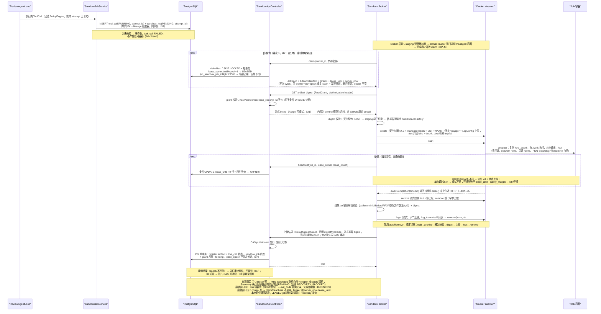
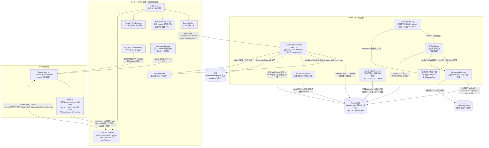

# M4 技术方案 —— Sandbox（不可信执行面成形）：Sandbox Broker 新容器 + Sandbox API + agent loop 工具化 + 观测证据

> 版本：v1.1（G1 退回后修订稿；工序 1「文档先行」交付物；**编码（工序 3）硬等 M3 G2 过门 + 本方案 G1 复审过门双门**，本稿不含任何代码改动）
> 起草时点说明：本方案在 **M3 工序 4/5（部署验证/测试验证）未结束**时起草，沿用 M2/M3 文档先行先例。
> 范围来源：冻结文档 v1 里程碑表（M4 Sandbox：Artifact 传输、Broker、无密钥容器、Overlay、测试；
> MVP 收口"一个 Sandbox Worker、并发 1"）；D3（沙箱零令牌）；§17 B18–B23；§16 三层信任边界；
> C4 L2 五容器形态；§4 部署拓扑与"Sandbox 最小实现"链路；F1-C；E7 v2.2（egress default-deny）；
> E10 v2.2（账本噪声控制）；OSS 证据清单 F-29~F-39；M0 §9 P8（mTLS）；M3-P13/P18；M2 G2 留档三条。
> **G1 评审（2026-09-01，甲乙两份审查合并）结论：退回修改；两个决策点已由用户当日裁定**（§1.3），
> 逐条处置对账见修订记录 v1.1。

## 修订记录

### v1.0（2026-09-01，初稿，G1 退回）

- 初稿：四块范围（P1 Broker / P2 control 侧 Sandbox API / P3 agent loop 工具化 / P4 观测证据），
  任务 M4-T00~T11，不变量 I37~I47（续 M3 I36 之后），测试续编 UT-74+/AFT-33+/CT-51+/
  ST-88+/EX-60+/E2E-73+/DP-29+/BT-M4-01+，迁移 V6。
- 全部 mermaid 图（§3.2 时序图、§5 数据流图）经 mermaid 官方 parser 实渲染校验通过，
  校验方式与结果见附录 E。
- 本文涉及的全部类名/字段名/表名均已回码实证（既有代码触点清单见附录 A）。

### v1.1（2026-09-01，G1 退回后修订）

**处置对账总表**（评审原文见 `docs/M4-G1评审意见-v1.0.md`；依据编号回指
`docs/OSS-证据清单-v1.md` F-37/F-38/F-39 及三份调研报告）：

| 评审条目 | 处置 | 一句依据 | 落点 |
|---|---|---|---|
| 甲 P0-1 两个决策点未裁定 | **采纳** | 用户 2026-09-01 已裁定：决策点一=A（同机仅降级验证模式 M4a）、决策点二=只读工具留 control + 四条硬边界 | §1.3 改写为已裁定；§12；DP-43/44；G2-H16 |
| 甲 P0-2 循环 FK 首条无法插入 | **采纳** | 单向 FK（只留 `sandbox_job.tool_call_id NOT NULL UNIQUE`），tool_call 删反向列；DEFERRABLE 方案否决理由留痕（F-38⑥） | §4.1；§7 D24 |
| 甲 P0-3 SKIP LOCKED 不能保证全局并发 1 | **修正后采纳** | 采纳"必须有数据库闸"的实质；具体机制不取槽表而取部分唯一索引 `uq_sandbox_job_inflight`（F-38 三方案对比推荐 B：声明式、任何写入路径绕不过、与 SKIP LOCKED 零冲突、持有者可 SQL 观测）；capacity slot 降级为备选留痕 | §4.1/§4.2；§7 D23；CT-64 重写 |
| 甲 P0-4 租约配置自相矛盾 | **采纳** | 新公式：`heartbeat ≤ lease/3`；`heartbeat_timeout + retry_jitter + kill_margin < lease`；job_timeout 独立 | §4.2/§4.10；UT-117/118 |
| 甲 P0-5 只读 /src 无法编译 | **采纳** | /src 只读 bind + 固定可信 wrapper 复制到 /work（有界 tmpfs）执行 + /out 有界结果区；业界先例 F-39①（OpenHands overlay、GitHub runner 工具区 ro/工作区 rw） | §4.4；§7 D28 |
| 甲 P0-6 Broker 容器内路径不能作宿主 bind source | **采纳** | bind source 由 daemon 宿主侧解释（F-37① 官方原话）；冻结双路径映射：宿主 `/var/lib/pr-sandbox/staging` ↔ Broker `/sandbox-staging`，规范化+固定根+TOCTOU | §4.4；§7 D29 |
| 甲 P0-7 /out 无取回通道 | **采纳** | Docker archive API（停止后 remove 前流式提取）+ 复用 SafeTarExtractor 安全解包；业界无直接先例属自造防线，诚实标注（F-39②） | §4.6；§7 D30 |
| 甲 P0-8 Broker 死后容器不会因超时死亡 | **采纳** | 因果纠正（F-37⑦：`--rm`/restart policy 只在容器退出后起作用）；补 PID 1 watchdog + managed labels + 启动清扫 + "清旧后才重领"（GitHub runner 逐字先例 F-39④） | §4.6；§7 D31 |
| 甲 P0-9 跨 attempt 撞唯一键 | **采纳** | 两表加 `attempt_id REFERENCES step_attempt(id)`；唯一键改 `UNIQUE(attempt_id, call_seq)`；观测链 run→attempt→step→tool_call 兑现 | §4.1；§7 D25 |
| 甲 P0-10 CAS+PG "原子提交"过度承诺 | **采纳** | 两阶段诚实模型：CAS putIfAbsent 先行 → PG 单事务登记推进；孤儿 CAS 允许、DB 悬空引用禁止 | §4.2/§4.8；§7 D32 |
| 甲 P0-11 control_app 整行 UPDATE | **采纳** | sandbox_job 改列级 UPDATE（只放状态/租约/结果列）；列级 GRANT 是叠加语义，整行权限存在则列级失效（F-38③）；JobSpec 身份列加 BEFORE UPDATE 触发器双保险 | §4.1；§7 D33 |
| 甲 P1 族（12 条） | **采纳 12/12** | image_ref DDL CHECK；jsonb 数组/非空校验（F-38④）；EGRESS_WHITELIST 种子被拒（UT-142/CT-85）；心跳失败三态；claim 响应补 lease_until/server_now；grant 计费语义（原子条件 UPDATE，F-38⑤）；failure_class 四类；日志流式限额；剖面补 Privileged/devices/namespace/端口/sock/日志驱动；fork bomb 改受控探针；env 探测不打值；M4-A/M4-B 拆分 | §4.1/§4.2/§4.5/§4.6/§4.9；§2/§12 |
| 乙 P0-1 租约公式 | **采纳**（与甲 P0-4 合并处置） | 同上 | §4.2 |
| 乙 P0-2 全局并发闸（建议 capacity slot） | **修正后采纳** | 槽表降级为备选（同机单 Broker 下串行点无害，但部分唯一索引断言面更强、改造面更小，F-38）；claim SQL 零改动，仓储把 23505 翻译为"名额占用" | §4.1/§4.2；§7 D23 |
| 乙 P0-3 双路径映射 | **采纳** | 与甲 P0-6 合并处置 | §4.4 |
| 乙 P0-4 可写 workspace（wrapper 方案） | **采纳** | 与甲 P0-5 合并处置；wrapper 固定逻辑、枚举命令、argv 无 shell；模型不得提供 wrapper/working dir/entrypoint/shell 串 | §4.4 |
| 乙 P0-5 /out 提取协议 | **采纳** | 与甲 P0-7 合并处置；顺序钉死：wait→archive 流式提取（字节上限）→安全解包校验→digest→上传 CAS→logs→remove | §4.6 |
| 乙 P0-6 Broker"解析不可信数据 + 持 docker.sock"组合 | **采纳** | Broker 只收 control 重新生成的规范化归档（不收 GitHub 原始 tarball）；规范化归档不含 symlink/hardlink/device/FIFO；输出深度解析优先在 control；Broker 必须解析处复用防线 + 恶意结果样本集；同机期升级为 G2 明示风险（R-S10） | §4.4/§4.6；§6.2 R-S10 |
| 乙 P0-7 CAS/PG 两阶段 | **采纳** | 与甲 P0-10 合并处置 | §4.2/§4.8 |
| 乙 P0-8 DDL 循环引用 + REJECTED 约束错误 | **采纳** | 单向 FK（同甲 P0-2）；REJECTED 是终态：finished_at NOT NULL + reject_reason 必填；状态迁移靠限定条件 UPDATE（0 行=冲突，F-38②） | §4.1 |
| 乙 P0-9 观测链缺 attempt | **采纳** | 与甲 P0-9 合并处置 | §4.1 |
| 乙 P0-10 claim 响应丢失 grant 不可恢复 | **采纳** | 同 worker+job+epoch 幂等补领：撤旧签新、epoch 不变；token 明文仍不落库 | §4.3；UT-143/144；CT-93 |
| 乙 P0-11 上传 grant digest scope 伪白名单 | **采纳** | 废除 `allowed_digests=[]` 伪白名单；ResultUploadGrant scope = job+worker+epoch+artifact type+单对象大小+总字节+次数；上传完成时重验 epoch；并发消费/字节预留用原子条件 UPDATE（F-38⑤） | §4.3；附录 B |
| 乙 P0-12 崩溃后零重复容器无保证 | **采纳** | managed labels + 宿主级 orphan reaper；Recovery 重领前必须确认旧容器已清除，否则 RECOVERY_BLOCKED/保持 LEASED | §4.6；E2E-79 重写 |
| 乙 P0-13 业务/基础设施失败未分类 | **采纳** | `failure_class = BUSINESS/POLICY/SECURITY/INFRASTRUCTURE` + `retryable`；非零 exit=业务数据不重跑；安全故障 fail-closed 系本项目增强、业界无先例（F-39⑤），诚实标注 | §4.6；§7 D35 |
| 乙 P0-14 资源/日志/镜像启动契约 | **采纳（含一处修正后采纳）** | MemorySwap=Memory（F-37②；195 cgroup v1 swap accounting 进 T00 确认项）；Job 容器 LogConfig max-size/max-file + Broker 流式上限 + log_truncated；ENTRYPOINT 属容器 **Config** 而非 HostConfig（F-37b 纠偏，实现查表修正，附录 C）；镜像 digest 钉死 + 部署期预取 + 运行期禁 pull（F-39⑥ SWE-ReX pull=never）+ T00 inspect Entrypoint/Cmd/User/WorkingDir | §4.5/§4.6；附录 C |

**调研纠偏三处（显式标注"修正后采纳"，评审实质采纳、措辞/出处纠正）**：

1. ENTRYPOINT 落点：评审称在 HostConfig——Engine API 实属容器 **Config**（create body 顶层），
   docker-java `CreateContainerCmd.withEntrypoint`（F-37b）；附录 C 查表已修正；
2. "`--rm`/restart policy 可在 Broker 死亡时停止容器"：因果错误——两者只在容器**退出后**
   起作用，对在跑容器无约束力；真正兜底 = PID 1 自杀 + 外部 reaper（F-37⑦/F-37c）；
3. "官方文档对解包 tar 有安全警告"：无此出处；正确出处 = moby 自身 docker cp symlink race
   **CVE-2018-15664**（F-37a）；风险实质采纳，防线自造（F-39②）。

**测试矩阵处置**：原地重写 13 条（CT-64/UT-84/EX-60/EX-64/EX-68/EX-71/E2E-73/E2E-76/
E2E-79/E2E-81/E2E-83/DP-31/G2-H4，去向见 §11 各条注记）；甲乙新增编号重叠族去重合并续编
（照 M3 v1.1 合并两份评审矩阵先例）：AFT-41~56、UT-117~153、CT-70~95、ST-108~137、
EX-73~107、E2E-86~106、DP-37~45、BT-M4-05~07、G2-H10~H16；E2E 证据包 14 件套入测试执行纪律。
**所有新增用例按修正后设计撰写**（并发闸只按部分唯一索引写，不写 capacity slot）。

**结构性改动清单**：DDL 三表结构修订（attempt_id/单向 FK/部分唯一索引/REJECTED 约束/
failure_class/列级权限）；状态机租约语义修订（公式+心跳三态）；grant 生命周期增"幂等补领"；
workspace 与结果提取链路新增（§4.4/§4.6 实质扩写）；里程碑拆 M4-A（执行面）/M4-B（工具循环
接线）两个子门（**最终交付序以用户 G1 复审确认为准**）。

**G1 退回本身即门禁有效的正面案例**：结构性硬伤在编码前被拦截，处置成本=文档修订而非
代码返工——记入 §9.1。

mermaid 图（§3.2/§5）随修订同步更新并经官方 parser 复验通过，结果见附录 E。

## 1. 核心问题

### 1.1 解决什么

不可信 PR 代码的执行面目前**不存在**——这是 F1-C（不可信执行物理边界）在冻结里程碑表上
被标注"M4 load-bearing"的原因：

1. **沙箱执行面缺位（F1-C 未兑现）**：M0~M3 对 PR 代码只有静态阅读——tarball 安全解包成
   内存 `SnapshotTree`（`SafeTarExtractor`），build/test 从未执行过。M5 Patch 安全门
   （"已审批 patch 必须在隔离沙箱验证通过"，F3）的全部前置条件——JobSpec、Artifact 传输、
   无密钥 Job 容器、结果回传——都要在 M4 成形。没有 M4，M5 的"验证"只能是纸面状态迁移。
2. **D3 传输模型未落地**：冻结 D3/§17（B18–B23）规定了跨机 Artifact 内容寻址 +
   Job-scoped Capability 传输 + 安全解包 + 同机只读挂载的完整模型，目前无一行实现。
   这是冻结基线里最后一个"只有条文没有代码"的安全机制族。
3. **Agent loop 仍是单轮（BC3 未完整）**：冻结 BC3 规定"Agent loop 在 Control App 进程，
   沙箱只执行工具调用"。当前 `ReviewAgentLoop` 是单轮调用（打 bundle → 一次模型调用 →
   解析 findings），M0 期 `domain/tool` 脚手架（ToolRegistry/ToolCall/ToolDescriptor/
   PolicyEngine）留的检查点从未真正接线。M4 把它升级为外层确定性状态机 + 模型决定下一
   工具调用的多轮形态（冻结 §7 岔路口"编排自由循环还是状态机"已定选 B）。
4. **工具调用无观测账本**：冻结 §6 权威表第 6 行要求 `run_id → attempt → step →
   tool_call` 观测链；目前工具调用无独立账本，observation 无 CAS 归档，E10 噪声控制
   规则未延伸到工具层。

### 1.2 为什么现在解决

- 冻结里程碑表规定 M4 = Sandbox；M3 已把 ModelGateway（唯一出口、预算、熔断、两段账本）
  成形，agent loop 多轮化所需的模型调用可靠性地基已就位；
- 继续往后拖，M5 的 Patch 验证将被迫在 control 进程内执行不可信代码——F1-C 一旦破例
  就再收不回来（安全边界只有 day-0 能建）；
- 195 的现实约束（单机 4c/7.5G、内核 3.10.0-1160）已通过 F-33~F-36 调研收口为可行技术
  底座（§7 D3），不存在阻断性未知。

### 1.3 G1 决策点（**用户已裁定，2026-09-01**）

**决策点一：部署形态——裁定 A：同机 = 降级验证模式（M4a），不宣称 F1-C 完成。**

- 冻结原文（§4 部署拓扑、§15 C4 L2）：4c8g（可信控制域）+ 2c4g（不可信执行域）**双机
  物理分离**，Broker 独占一机，F1-C 的边界是"物理机边界"。现实：只有 195 一台 4c/7.5G。
- **裁定内容**：
  1. 同机形态仅作 **M4a 降级验证模式**：只允许跑合成仓库、内部可信测试仓库、故障注入；
     **真实外部不可信 PR 的执行门仍要求专用 Sandbox 主机 + mTLS（M4b 双机正式模式）**；
  2. DoD 只准写"**容器级降级边界已验证**"，不得写"F1-C 物理边界已兑现"；
  3. 部署标识：部署报告必须显示 `isolation_mode=DEGRADED_SAME_HOST`（DP-43 硬门）；
  4. **真实不可信 PR 开关默认关闭**（配置级开关），只有双机 + mTLS 形态才允许开启
     （DP-44 硬门 + G2-H16）；
  5. 同机形态技术底座：Broker 独立容器挂 `/var/run/docker.sock` spawn **兄弟** Job 容器
     （Job 是 dockerd 的直接子容器）；docker.sock 授权 = 宿主 root 等价，按 OpenHands
     先例限定信任域并声明（F-39⑦，§6.2 R-S2）；mTLS（M0 P8 遗留）随双机形态一起收，
     同机期用 docker internal 网络 + 节点共享密钥替代（§8 M4-P1）。
- 残余风险（runc 逃逸 CVE 与内核 EOL，F-36）在 §6.2 R-S1/R-S9 诚实记录，不粉饰。

**决策点二：只读探索工具的落点——裁定：留 control 本地快照树 + 四条硬边界。**

- 只读探索工具（list/search/read）走 control 本地**已安全解包**的 `SnapshotTree`；
  执行类工具（build/test/command）**必须**走沙箱。
- **四条硬边界（用户裁定原文，违反即设计违规）**：
  1. 只允许字节级 list/read/**字面 search**——禁止任意正则（ReDoS 面），并配 CPU/输出
     预算；不启用语言服务器、编译器、模板引擎、宏展开或仓库自带解析器；
  2. 不跟随 symlink/hardlink；
  3. 路径先做 Unicode 规范化，再拒绝绝对路径、反斜杠、NUL、`..` 和编码后的 traversal；
  4. 文件内容**永远按不可信文本处理**：不得参与 SQL、shell、镜像名、命令模板拼装。
- 冻结文档同步修订义务：裁定与冻结"文件搜索也进沙箱"的纵深防御字面存在偏离，
  已在冻结文档尾部增量节留痕（本轮同步完成），消除"实现与冻结不一致"的审计争议。
- 注入面定性不变：文件内容作为 prompt injection 载体，与内容从哪个进程读出无关；
  control 进程解析不可信内容的面由 B22 安全解包 + UT-09 样本集守住（§6.2 R-S7）。

### 1.4 M4 明确不做（MVP 裁剪照冻结 + 越级防线）

- 不做多 Sandbox Worker、并发 > 1（冻结 §10.1 M4 行："一个 Sandbox Worker、并发 1"；
  v1.1 起并发 1 由数据库部分唯一索引物理保证，§4.2）；
- 不做 egress 白名单档的默认启用——MVP 网络只有 `--network none` 一档；schema 保留
  `EGRESS_WHITELIST` 枚举但 MVP 执行器/领取谓词遇之**直接拒绝**（不退化为默认网络，
  UT-142/CT-85）；白名单档写入 §4.12 作为可选档（E7 v2.2 + F-34）；
- 不做 gVisor/Firecracker/Kata/rootless（F-33 实测收口：前三者内核/KVM 不满足或条件 GO，
  rootless 在 cgroup v1 下限额全失效）；Kata 留升级档（§8 M4-P2）；
- 不做 mTLS（同机降级形态用 docker 内网 + 节点密钥替代；mTLS 与真实不可信 PR 开关同属
  双机形态，决策点一裁定）；
- 不做 exec/attach 交互式通道、不做长驻 Job、不做 pause/resume（F-30 一次性命令语义；
  F-31：pause/resume 是 Firecracker 能力，Docker 容器不复刻该承诺）；
- 不做 M5 的 Patch 验证业务编排（审批→验证→子 PR 状态机是 M5 范围；M4 只交付执行面，
  验证 build/test 工具可被 M5 直接调用）；
- 不做多 Step 自由编排的完整开放（M4-B 只把评审 loop 升级为"模型决定下一工具调用"，编排
  骨架仍是确定性状态机）；
- 不引入新外部组件（ADR-020 判据：docker-java 是冻结选型表已定的沙箱客户端，非新增组件）；
- 不改动 publisher（沙箱与发布无关；publisher 对 M4 全部新表零权限）。

## 2. 任务拆解

四块范围：**P1 = Sandbox Broker 新模块**（第三个应用进程/容器，docker-java spawn Job 容器）；
**P2 = control 侧 Sandbox API**（job 入表、claim 长轮询、heartbeat 续租、结果上传、
artifact 下载带 grant）；**P3 = agent loop 工具化**（外层确定性状态机 + 模型决定下一工具
调用，复用 M3 ModelGateway）；**P4 = 观测证据**（tool_call 账本 + observation 入 CAS +
E10 噪声控制）。

**里程碑拆分（评审采纳项）**：M4 拆为两个子门——**M4-A = 执行面**（P1/P2/P4：T00~T07、
T09 的账本链路、T10/T11 中执行面部分），**M4-B = 工具循环接线**（P3：T08 及 M4-A 之上的
端到端闭环）；M4-A 先行验收后再接 M4-B。修订记录已注明：最终交付序以用户 G1 复审确认为准。

| 编号 | 任务 | 块 | 子门 | 依赖 | 单项验收标准 |
|---|---|---|---|---|---|
| M4-T00 | **可行性验证（先于一切编码）**：① docker-java 3.7.1 + httpclient5 transport 连接 195 dockerd（unix socket），显式 `api.version=1.44` 协商成功；② §4.5 安全剖面全字段在 HostConfig/Config 类型安全表达且 `docker inspect` 逐项可断言；③ **Job 基础镜像在 3.10 内核 + 默认 seccomp profile 下可启动**（INC-09 前置排查），并 `docker inspect` 候选镜像的 **Entrypoint/Cmd/User/WorkingDir** 全量留档；④ `awaitCompletion(timeout)` 超时返回 false 且 `close()` 中止在途 HTTP 的实证（F-18/F-35）；⑤ `--network none` 下出网探测行为实测；⑥ `ls /dev/kvm` + Kata 可用性记录（F-33）；⑦ 同机 docker.sock spawn 兄弟容器验证；⑧ **195 cgroup v1 的 swap accounting 已启用确认**（MemorySwap=Memory 生效前提，F-37②）；⑨ Docker archive API（GET /containers/{id}/archive）对已停止容器可流式提取 /out 的实证 | 无 | A | — | T00 验证记录（版本号、inspect 输出、探测日志）入 `docs/OSS-证据清单-v1.md`；任一结论不成立则回方案修订，不得带着假设编码 |
| M4-T01 | V6 迁移：`sandbox_job` + `tool_call` + `artifact_grant` 三表 DDL（§4.1 全约束：attempt_id、单向 FK、部分唯一索引、REJECTED 终态约束、lineage/不可变触发器）+ `artifact` 表 ck_artifact_type 枚举扩展 + 授权矩阵（**列级**，§4.1）+ V5 历史数据原地升级契约测试 | P2 | A | T00 | 沙箱 PG 顺序 V1→V6 一次过；CT-51~62、CT-70~95 绿 |
| M4-T02 | shared-kernel 迁移：`SafeTarExtractor`/`SnapshotTree`/`SecurityRejectionException` 从 control-app 迁入 `com.objwww.pr.shared.snapshot`（UT-09 样本集随迁）；sandbox 契约值对象（JobSpec/ArtifactManifest/ArtifactReadGrant/ResultUploadGrant/JobResult/FailureClass）新增于 `com.objwww.pr.shared.sandbox`；commons-compress 依赖随迁入 shared-kernel pom（留痕见 §7 D11） | P1/P2 | A | T00 | 全 reactor 编译绿；UT-09 族在 shared-kernel 原样绿；AFT-36 绿 |
| M4-T03 | control 侧 job 生命周期服务：`SandboxJobService`（入表 PENDING）+ `SandboxJobRepository` port + PG 实现（claim SKIP LOCKED 短事务租约 + **23505→"名额占用"翻译** / heartbeat 条件更新 / 终态 fencing 更新 / **终态两阶段：CAS 先行、PG 单事务登记推进**，§4.2） | P2 | A | T01 | UT-84~88 / CT-63~66 绿 |
| M4-T04 | control 侧 HTTP API：`SandboxApiController`（claim 长轮询含 **lease_until/server_now** 与**幂等补领** / heartbeat（明确 409/410 语义）/ 结果上传（完成时重验 epoch）/ artifact 下载四端点）+ 节点密钥校验 + `ArtifactGrantService`（签发/校验/吊销/补领，§4.3） | P2 | A | T03 | UT-89~93、UT-143/144 / ST-95~98 绿 |
| M4-T05 | sandbox-broker 模块骨架：新 Maven 模块（§7 D1）+ Spring Boot 启动入口 + `JobClaimPoller`（长轮询 claim）+ 配置装配 + 启动自检（§4.10：含 **staging 双路径映射核验、启动清扫完成后才开放 claim**） | P1 | A | T00/T02 | UT-94~96 绿；模块独立打包成镜像 |
| M4-T06 | Broker 执行核心：`JobRunner`（docker-java 生命周期 create→start→wait→**archive 提取→安全解包→digest→上传**→logs→remove，§4.6）+ `JobContainerFactory`（安全剖面全字段含 MemorySwap/LogConfig/labels/ENTRYPOINT 覆盖，§4.5）+ 容器内 **PID 1 watchdog**（固定 wrapper 自带 deadline 自杀） | P1 | A | T05 | UT-97~101、UT-127~130 绿；EX-60~64 绿 |
| M4-T07 | Broker 物料与结果：`GrantHttpClient`（grant 下载/上传，digest 校验，B21/B23）+ `SnapshotMaterializer`（**只收 control 规范化归档**→安全解包落盘 staging→原子切换→宿主路径映射只读 bind，§4.4）+ `ResultArchiveExtractor`（/out 不可信 tar 安全解包，复用防线 + 恶意结果样本集）+ `ResultCollector`（exit_code/流式日志上限/结果收集） | P1 | A | T06 | UT-102~105、UT-145~148 / ST-99~101 绿 |
| M4-T08 | agent loop 工具化（P3，**M4-B**）：`ReviewAgentLoop` 升级为多轮工具循环（外层确定性状态机，模型输出下一 `ToolCall`，PolicyEngine 每次调用前裁决）；本地只读工具执行器（list/**字面 search**/read 走快照树 + 四条硬边界，决策点二）；执行类工具经 `SandboxJobPort` 入表（携带 attempt/lease/cancellation 上下文，AFT-49） | P3 | B | T02/T03 + M4-A 验收 | UT-106~112 / ST-102~106 绿；M3 既有回归零断言变更 |
| M4-T09 | 观测证据（P4）：`tool_call` 账本链路（请求→裁决→执行→终态，含 attempt_id，§4.8）+ observation 全文入 CAS（两阶段）+ 账本 digest+截断摘要 + E10 噪声控制 | P4 | A（链路）/B（循环侧） | T08 | UT-113~116 / CT-67~69 绿 |
| M4-T10 | §11 测试矩阵全量落码（AFT-33~/UT-74~/CT-51~/ST-88~/EX-60~/E2E-73~/DP-29~/BT-M4-01~） | 全部 | A/B | T01~T09 | 本机单测全绿；IT/E2E 经 test-compile，195 真跑留工序 5 |
| M4-T11 | 部署：compose 新增 sandbox-broker 服务（§4.10）+ V6 上栈 + Job 镜像**部署期预取（digest 钉死、运行期禁 pull）**+ staging 宿主根目录初始化 + DP-29~45 | P1/P2 | A | T10 | DP 门禁 PASS（含 DP-43 模式标识、DP-44 不可信 PR 开关默认关）；F1-C 降级边界探测 Demo（§4.9）现场演示通过 |

依赖关系：T00 绝对先行（结论不成立则方案回炉）；T01∥T02 可并行；T03/T04 串行；
T05→T06→T07 串行；**M4-A 子门 = T00~T07 + T09 账本链路 + T10/T11 执行面部分 + DP 门**；
M4-B（T08 及闭环用例）在 M4-A 验收后开工；T10/T11 串行收尾。

**实现纪律（工序 3 硬规则，沿用 M3 四条）：**

1. **测试先行**：每个任务先按 §11 表格把对应测试写出并见红，再写实现——测试表即规格书；
2. **实现者无权改测试表**：§11 任何用例的断言改动 = 方案变更，必须回评审留痕后进修订记录；
   既有测试（附录 A 触点涉及的）只允许适配编译，不允许改断言语义；
3. **遇空白即停**：方案与附录没写到的情况，禁止自由发挥——停下提问，答复留痕进修订记录；
4. **中段检查点**：T00、T01、T05、T08 完成时各做一次人工过目，不攒到 T10 一次验收；
   **M4-A/M4-B 各有一次独立子门验收**。

## 3. 类设计

### 3.1 类清单

**shared-kernel 层（`com.objwww.pr.shared`，迁入 + 新增）：**

| 类 | 职责 | 明确不做 |
|---|---|---|
| `snapshot/SafeTarExtractor`（**自 control-app 迁入**，语义零改动） | tar.gz 安全解包：拒绝对路径/`..`/反斜杠/逃逸链接/特殊文件/稀疏炸弹；单文件/总大小/文件数限额；剥离公共前缀。**兼作 /out 结果 tar 的解包防线**（§4.6） | 不落盘（物化是调用方职责）；不跟随 symlink |
| `snapshot/SnapshotTree`（迁入） | 解包后的规范化内存快照（字典序定序 + digest 算定） | 不做懒加载 |
| `snapshot/SecurityRejectionException`（迁入） | 安全解包拒绝的封闭异常（Reason 枚举） | 不携带条目内容 |
| `sandbox/JobSpec`（record，新增） | 一次沙箱作业的完整规格：jobId/leaseEpoch/attemptId/jobKind/imageRef（内容寻址 digest）/command argv（固定 wrapper + 枚举参数，create 时定死）/sourceSnapshotDigest/inputDigests/资源限制（cpus/memoryBytes/pidsLimit）/timeoutSeconds/networkPolicy | 不含任何凭证；不含 grant token；模型不可提供镜像/命令/wrapper/工作目录 |
| `sandbox/ArtifactManifest`（record，新增） | digest/大小/类型/压缩格式/逻辑用途清单（B18） | 不内嵌 bytes |
| `sandbox/ArtifactReadGrant` / `ResultUploadGrant`（record，新增） | Claim 响应中的能力对象视图：grantId/token（仅传输态出现一次）/scope（ReadGrant=digest 白名单；UploadGrant=artifact type+单对象大小+总字节+次数）/expiresAt；**绑定 job/worker/lease_epoch（B19）** | 不落库（DB 只存 token hash）；不可序列化进 Job 容器；UploadGrant 无 digest 伪白名单 |
| `sandbox/JobResult`（record，新增） | 作业终态回传：exitCode/failureClass/retryable/结果摘要/resultDigest/logDigest/截断标记/log_missing 标记 | 不带原始大对象（走 CAS 上传通道） |
| `sandbox/FailureClass`（枚举，新增） | BUSINESS / POLICY / SECURITY / INFRASTRUCTURE（§4.6 决策表） | 不细分第五类 |
| `ExecutionEventType` 扩展 | 新增 `SANDBOX_JOB_CLAIMED / SANDBOX_JOB_FINISHED / SANDBOX_JOB_LEASE_EXPIRED / TOOL_CALL_REJECTED / TOOL_OBSERVATION_TRUNCATED` | attempt start、心跳不进账本（E10，I44） |

**control-app domain 层：**

| 类 | 职责 | 明确不做 |
|---|---|---|
| `domain/sandbox/SandboxJob`（领域对象） | 作业状态机载体：PENDING/LEASED/SUCCEEDED/FAILED/TIMED_OUT/CANCELLED 六态（§4.2 迁移表） | 不直接碰 docker |
| `domain/sandbox/SandboxJobRepository`（port） | claimNext（SKIP LOCKED+短事务租约；**唯一冲突 23505 翻译为"名额占用"**）/heartbeat/transitionIfLeaseCurrent/findExpiredLeases/reclaimExpiredLease——方法集镜像 M2 `WorkItemRepository` 语义 | 无通用 update/delete；无绕过并发闸的旁路 claim |
| `domain/sandbox/SandboxJobSpecFactory` | 从 ToolCall + Run 上下文铸 JobSpec（镜像/命令/wrapper/限额定死于此，唯一铸造点） | 不接受模型直传的镜像/命令/工作目录/shell 串 |
| `domain/tool/ToolRegistry`（扩展） | 注册表扩为两组：本地只读（read_file/search_in_snapshot/list_files，**search 为字面搜索**）+ 执行类（run_build/run_tests）；`ToolDescriptor` 增 `executor` 维度（LOCAL_READ/SANDBOX）；**探测型 RUN_COMMAND 不进模型可见注册表**（AFT-47） | 不开放运行期注册 |
| `domain/tool/PolicyEngine`（扩展） | 兑现 M0 留缝：参数级校验（路径 Unicode 规范化后必须相对、禁 `..`/反斜杠/NUL/编码 traversal、不跟随 link、字面 search 禁任意正则 + CPU/输出预算；执行类工具的命令必须来自注册模板而非模型直拼）；每次工具调用前必过 | 不做配额（配额在 agent loop 预算侧） |
| `domain/review/ReviewAgentLoop`（改造，M4-B） | 外层确定性状态机：SELECT（确定性文件选择不变）→ 单轮评审（既有）→ 可选工具轮（模型输出下一 ToolCall → PolicyEngine 裁决 → 执行 → observation 摘要回上下文 → 终稿）；轮数/预算硬上限；**只做纯状态迁移，外部调用由 application 协调器驱动**（AFT-54） | 不让模型决定副作用；不自行发 Outbox |
| `domain/review/ToolObservation`（record） | 一次工具执行的观测：exitCode/stdout 摘要/stderr 摘要/digest/截断标记；**失败即数据**（非零退出照常成 observation，F-30）；SECURITY/INFRASTRUCTURE 类故障**不当普通 observation 喂模型**，走 Step 失败通道（UT-136） | 不抛给模型层异常 |

**control-app application 层：**

| 类 | 职责 | 明确不做 |
|---|---|---|
| `SandboxJobService` | job 入表（PENDING）+ 终态落库编排：**两阶段诚实模型**——CAS putIfAbsent 先行 → PG 单事务（register artifact + 推进 tool_call/sandbox_job 终态 + 吊销 grant）；孤儿 CAS 允许、DB 悬空引用禁止；晚到结果 fencing（lease_epoch 不匹配只记不推进） | 不直接调 Broker；不承诺 CAS+PG 原子提交 |
| `ArtifactGrantService` | grant 签发（128-bit+ 随机 opaque token，DB 只存 SHA-256 hash）/校验（hash 比对 + job/worker/lease_epoch/TTL/字节/次数/type 联合判定）/吊销（job 终态/租约过期/epoch 变化即 REVOKED）/**幂等补领**（同 worker+job+epoch：撤旧签新、epoch 不变）；上传消费用原子条件 UPDATE（`SET used=used+n WHERE used+n<=max`，F-38⑤） | 不做长期 token；token 不进 URL query/日志；不给不同 worker 补领 |
| `SandboxJobRecovery` | 启动 + 周期扫描：LEASED 且租约过期 → **先经 orphan reaper 确认旧容器已清除** → 回收（attempt 预算内回 PENDING / 耗尽 FAILED）+ 对应 grant REVOKED；**旧容器存在性无法确认时保持 LEASED 并记 RECOVERY_BLOCKED 审计事件，不得直接重复执行** | 不重放在途 Job；不在旧容器未清除时放回 PENDING |

**control-app interfaces 层：**

| 类 | 职责 | 明确不做 |
|---|---|---|
| `interfaces/sandbox/SandboxApiController` | 四端点：`POST /internal/sandbox/jobs/claim`（长轮询；响应含 **lease_until/server_now**；同 worker+job+epoch 重复 claim = 幂等补领）/ `POST .../heartbeat`（**409/410=租约确认失效**，5xx/超时=传输故障，语义区分）/ `POST .../result`（完成时重验 epoch；同 epoch 重复上报幂等）/ `GET /internal/sandbox/artifacts/{digest}`（grant 校验后流式响应，支持 Range，B21）；节点密钥认证 + worker_id 服务端绑定（伪造拒绝，EX-85） | 不对公网发布（docker internal 网络）；不做通用文件服务 |

**control-app infrastructure 层：**

| 类 | 职责 | 明确不做 |
|---|---|---|
| `PostgresSandboxJobRepository` | sandbox_job PG 实现；claim/heartbeat/终态均为单句条件 UPDATE（0 行 = 租约易主/已终态，幂等）；23505（uq_sandbox_job_inflight）→ "名额占用，下轮再试" | 无绕过仓储的 SQL；无通用 update |
| `PostgresToolCallRepository` | tool_call 账本：insertRequested/completeTerminal/markStale 封闭集（作用域 = attempt） | 无通用 update/delete |
| `PostgresArtifactGrantRepository` | grant 表：insert/consume（**原子条件更新** use_count/used_bytes）/revokeByJob/revokeExpired/reissue（同事务撤旧签新） | token 明文不落库不落日志 |

**sandbox-broker 模块（新，`com.objwww.pr.broker`；DDD 分层从简：application + infrastructure）：**

| 类 | 职责 | 明确不做 |
|---|---|---|
| `BrokerApplication` | Spring Boot 启动入口 + 装配 + 启动自检（§4.10：连得上 dockerd、api 版本协商、凭证 env 存在且不回显、**staging 双路径映射核验**、**启动清扫完成前不开放 claim**） | 无 webhook/无对公网端口 |
| `application/JobClaimPoller` | 长轮询 claim → 拿到 JobSpec+Manifest+Grants（含 lease_until/server_now）→ 驱动 JobRunner；心跳循环（**三态处置**：409/410/epoch 不符→立即 kill+禁上报；单次超时/5xx→重试不杀；连续失败至 `lease_until - safety_margin`→kill 停报） | 不缓存多个 Job（并发 1，I47） |
| `application/JobRunner` | 单作业全生命周期编排：下载物料 → 物化 → spawn（带 managed labels）→ 等退出（带超时 kill）→ **archive 流式提取 /out → 安全解包校验 → digest → 上传 CAS** → 收日志（流式上限）→ 上报终态 → remove（force,v）；每作业一容器 | 不并发；不复用容器；remove 在结果提取完成之后 |
| `application/OrphanContainerReaper` | 启动时 + 周期：按 labels（pr.sandbox.managed/job-id/lease-epoch/worker-id/deadline）找残留容器，**只清过期 managed 容器，不碰其他容器**；供 Recovery "清旧后重领"查询 | 不清非 managed 容器；不在无法确认时放行重领 |
| `application/WorkspaceFactory` | **宿主 mount 路径唯一工厂**（AFT-44）：`/sandbox-staging/{jobId}/{epoch}/...` ↔ 宿主 `/var/lib/pr-sandbox/staging/{jobId}/{epoch}/...` 双映射；规范化 + 固定根断言 + TOCTOU 复检 | 不接受外部传入路径；不把 Broker 普通 overlay 路径传给 dockerd |
| `infrastructure/docker/DockerJobController` | docker-java 封装：create（安全剖面全字段 + labels + ENTRYPOINT 覆盖 + LogConfig）→ start → wait（`awaitCompletion(timeout)`，超时 `close()` 中止在途 HTTP）→ **archive（流式、字节上限）** → logs（流式、字节上限、log_truncated）→ remove；streaming callback 一律 try-with-resources；**无 readAllBytes 式无界读取**（AFT-48） | 不用 exec/attach hijack；不设 autoRemove；运行期无 pull/build API |
| `infrastructure/docker/JobContainerFactory` | 安全剖面构造（§4.5 字段表唯一实现点）+ 固定 wrapper 命令铸造 | 不接受 JobSpec 之外的覆盖参数 |
| `infrastructure/http/GrantHttpClient` | artifact 流式下载（Range + digest 校验）/结果上传（声明 digest/type/size，超限即断）；grant token 走 Authorization header | 不直连 CAS/DB |
| `application/SnapshotMaterializer` | **只接收 control 重新生成的规范化归档**（不收 GitHub 原始 tarball，乙 P0-6）→ 安全解包（复用 shared-kernel SafeTarExtractor）→ 落盘 staging 临时目录 → 完整校验后原子 rename → 经 WorkspaceFactory 以宿主路径只读 bind 进 Job；Job 结束清理 | 不解包到任何共享/持久目录；不跟随 symlink |
| `application/ResultArchiveExtractor` | /out 结果 tar 的不可信输入处理：复用 SafeTarExtractor 防线规则（path/symlink/device/FIFO/稀疏/文件数/总大小）+ **恶意结果样本集**（独立样本，乙 P0-6④）；深度解析（报告内容级）由 control 侧做，Broker 只做字节上限/digest/流式转发 | 不执行输出中任何脚本/模板/XXE（AFT-56） |

### 3.2 关键交互时序（异步 job 链路 + 崩溃窗口）

照冻结 §15"Sandbox 最小实现"链路展开，含崩溃/租约/晚到路径（只画 happy path 的时序图
等于没画——准则 §七.4）：



---

## 4. 实现方式

### 4.1 数据模型（V6 迁移，三张新表 + artifact 枚举扩展）

落地裁定（留痕）：冻结 §15 最小实现说 job"写进 work_item"。**本方案裁定为同构新表
`sandbox_job`**，理由（本项目裁决，回码实证）：① `work_item` 有
`uq_work_item_step UNIQUE(step_id)`——一个 step 只能挂一条 work item，而一个 step 的
工具循环会产生多个 job，塞进去立刻撞唯一键；② work_item 的六态状态机
（READY/LEASED/RETRY_WAIT/DONE/CANCELLED/DEAD）与 job 终态语义（SUCCEEDED/FAILED/
TIMED_OUT）不同构，混用会污染 M0~M3 既有恢复语义与测试面；③ 冻结关心的是"job 写进 DB、
Broker poll/claim、租约心跳"的**模式**，claim/lease/heartbeat SQL 语义原样复用 M2
work_item 模式（§4.2），模式不走样、表不混用。

```sql
-- V6__m4_sandbox.sql
-- M4 沙箱执行面：sandbox_job（作业生命周期）+ tool_call（工具调用账本）
-- + artifact_grant（Capability）+ artifact.ck_artifact_type 枚举扩展
-- v1.1 修订要点：单向 FK、attempt_id、部分唯一索引并发闸、REJECTED 终态约束、
-- lineage/不可变触发器、列级授权、failure_class

-- 建表顺序：tool_call 先（不含 sandbox_job_id 反向列），sandbox_job 后（单向引用 tool_call）
CREATE TABLE tool_call (
    id                     uuid PRIMARY KEY,
    review_run_id          uuid not null REFERENCES review_run(id),
    run_step_id            uuid not null REFERENCES run_step(id),
    attempt_id             uuid not null REFERENCES step_attempt(id),   -- 观测链 run→attempt→step→tool_call
    call_seq               int  not null CHECK (call_seq >= 1),     -- attempt 内单调序号，新 attempt 从 1 重计
    tool_name              text not null,
    arguments_digest       char(64) not null,          -- 规范化参数 digest（原文走 CAS）
    policy_verdict         text not null CHECK (policy_verdict IN ('ALLOW','REJECT')),
    reject_reason          text,
    executor               text CHECK (executor IN ('LOCAL_READ','SANDBOX')),
    state                  text not null CHECK (state IN ('REQUESTED','REJECTED','RUNNING',
                               'SUCCEEDED','FAILED')),
    exit_code              int,
    observation_digest     char(64) REFERENCES artifact(digest),    -- 全文入 CAS
    observation_summary    text,                       -- 截断摘要（E10）
    observation_bytes      bigint CHECK (observation_bytes >= 0),
    truncated              boolean not null default false,
    lease_epoch            bigint,                     -- 裁决/执行时的租约世代（审计）
    started_at             timestamptz not null default now(),
    finished_at            timestamptz,
    UNIQUE (attempt_id, call_seq),                     -- attempt 边界内唯一，跨 attempt 允许同号
    -- REJECT 必须零执行：REJECTED 态不得有 executor/exit_code/observation
    CHECK ((policy_verdict = 'ALLOW'  AND state <> 'REJECTED')
        OR (policy_verdict = 'REJECT' AND state = 'REJECTED'
            AND executor IS NULL AND exit_code IS NULL AND observation_digest IS NULL)),
    -- REJECTED 是终态：finished_at 必填 + reject_reason 必填（G1 乙 P0-8② 修正）
    CHECK (state <> 'REJECTED' OR (finished_at IS NOT NULL AND reject_reason IS NOT NULL)),
    CHECK ((state IN ('SUCCEEDED','FAILED') AND finished_at IS NOT NULL)
        OR (state IN ('REQUESTED','RUNNING') AND finished_at IS NULL))
);
CREATE INDEX idx_tool_call_run ON tool_call (review_run_id, run_step_id, attempt_id, call_seq);

CREATE TABLE sandbox_job (
    id                     uuid PRIMARY KEY,
    review_run_id          uuid not null REFERENCES review_run(id),
    run_step_id            uuid not null REFERENCES run_step(id),
    attempt_id             uuid not null REFERENCES step_attempt(id),
    tool_call_id           uuid not null UNIQUE REFERENCES tool_call(id),  -- 单向 FK；反向查询经此列
    job_kind               text not null CHECK (job_kind IN ('RUN_BUILD','RUN_TESTS','RUN_COMMAND')),
    image_ref              text not null                    -- repo@sha256:<digest> 内容寻址（F-29）
        CHECK (image_ref ~ '^[a-z0-9][a-z0-9._/-]*@sha256:[0-9a-f]{64}$'),  -- DDL 层拒浮动 tag（G1 甲 P1）
    command                jsonb not null                   -- argv 数组（固定 wrapper + 枚举参数），create 时定死
        CHECK (jsonb_typeof(command) = 'array' AND jsonb_array_length(command) > 0),
    source_snapshot_digest char(64) not null REFERENCES artifact(digest),
    input_digests          jsonb not null default '[]'::jsonb
        CHECK (jsonb_typeof(input_digests) = 'array'),     -- 元素 digest 合法性由仓储层逐元素校验
    network_policy         text not null CHECK (network_policy IN ('NONE','EGRESS_WHITELIST')),
    cpus_millis            int  not null CHECK (cpus_millis > 0),          -- --cpus × 1000
    memory_bytes           bigint not null CHECK (memory_bytes > 0),       -- --memory（MemorySwap 同值，禁 swap）
    pids_limit             int  not null CHECK (pids_limit > 0),           -- --pids-limit
    timeout_seconds        int  not null CHECK (timeout_seconds > 0),
    state                  text not null CHECK (state IN ('PENDING','LEASED','SUCCEEDED',
                               'FAILED','TIMED_OUT','CANCELLED')),
    failure_class          text CHECK (failure_class IN ('BUSINESS','POLICY','SECURITY',
                               'INFRASTRUCTURE')),       -- 失败分类（G1 乙 P0-13；§4.6 决策表）
    retryable              boolean not null default false,  -- 仅 INFRASTRUCTURE 可为 true
    CHECK (failure_class IS NULL OR state IN ('FAILED','TIMED_OUT','CANCELLED')),
    CHECK (retryable = false OR failure_class = 'INFRASTRUCTURE'),
    lease_owner            text,
    lease_until            timestamptz,
    lease_epoch            bigint not null default 0,
    heartbeat_at           timestamptz,
    attempt_count          int  not null default 0 CHECK (attempt_count >= 0),
    max_attempts           int  not null default 2 CHECK (max_attempts >= 1),
    container_id           text,                       -- 审计用（残留清扫对照；与 labels 互证）
    exit_code              int,
    result_digest          char(64) REFERENCES artifact(digest),
    log_digest             char(64) REFERENCES artifact(digest),
    error_code             text,                       -- 稳定错误码（脱敏，同 M3 纪律）
    sanitized_message      text,                       -- 脱敏 + 截断 500 字符
    created_at             timestamptz not null default now(),
    started_at             timestamptz,
    finished_at            timestamptz,
    -- 状态机一致性
    CHECK ((state = 'PENDING'  AND lease_owner IS NULL AND finished_at IS NULL)
        OR (state = 'LEASED'   AND lease_owner IS NOT NULL AND lease_until IS NOT NULL
                               AND finished_at IS NULL)
        OR (state IN ('SUCCEEDED','FAILED','TIMED_OUT','CANCELLED') AND finished_at IS NOT NULL)),
    -- 成功必须有 exit_code 与结果引用；失败/超时必须有 error_code
    CHECK (state <> 'SUCCEEDED' OR (exit_code IS NOT NULL AND result_digest IS NOT NULL)),
    CHECK (state NOT IN ('FAILED','TIMED_OUT') OR error_code IS NOT NULL)
);
CREATE INDEX idx_sandbox_job_claim  ON sandbox_job (created_at) WHERE state = 'PENDING';
CREATE INDEX idx_sandbox_job_lease  ON sandbox_job (lease_until) WHERE state = 'LEASED';
CREATE INDEX idx_sandbox_job_run    ON sandbox_job (review_run_id, created_at);

-- 全局并发 1 闸（G1 甲 P0-3/乙 P0-2 修正后采纳，F-38 三方案对比推荐 B）：
-- 常量键部分唯一索引。LEASED 是唯一占名额状态；**若状态机未来新增执行中状态
-- （如 RUNNING），必须同步扩展本谓词**——谓词与状态机强耦合，改状态机不改此处 = 闸失效。
-- claim SQL 零改动；仓储把唯一冲突（SQLState 23505）翻译为"名额占用，下轮再试"。
CREATE UNIQUE INDEX uq_sandbox_job_inflight ON sandbox_job ((1)) WHERE state = 'LEASED';

-- lineage 一致性触发器：job 与其 tool_call 的 run/step/attempt 必须完全一致
-- （防绕过仓储直连 SQL 的错指；F-38 调研第 9 条背书）
CREATE FUNCTION fn_sandbox_job_lineage() RETURNS trigger AS $$
DECLARE tc record;
BEGIN
    SELECT review_run_id, run_step_id, attempt_id INTO tc
      FROM tool_call WHERE id = NEW.tool_call_id;
    IF NOT FOUND OR tc.review_run_id <> NEW.review_run_id
       OR tc.run_step_id <> NEW.run_step_id OR tc.attempt_id <> NEW.attempt_id THEN
        RAISE EXCEPTION 'sandbox_job lineage mismatch with tool_call %', NEW.tool_call_id;
    END IF;
    RETURN NEW;
END $$ LANGUAGE plpgsql;
CREATE TRIGGER trg_sandbox_job_lineage BEFORE INSERT OR UPDATE ON sandbox_job
    FOR EACH ROW EXECUTE FUNCTION fn_sandbox_job_lineage();

-- JobSpec 身份列不可变触发器（列级 GRANT 之上的双保险，G1 甲 P0-11）：
-- image/command/digest/network/限额/lineage 列 INSERT 后任何变化 = 拒绝
CREATE FUNCTION fn_sandbox_job_immutable() RETURNS trigger AS $$
BEGIN
    IF NEW.image_ref <> OLD.image_ref OR NEW.command <> OLD.command
       OR NEW.source_snapshot_digest <> OLD.source_snapshot_digest
       OR NEW.input_digests <> OLD.input_digests
       OR NEW.network_policy <> OLD.network_policy
       OR NEW.cpus_millis <> OLD.cpus_millis OR NEW.memory_bytes <> OLD.memory_bytes
       OR NEW.pids_limit <> OLD.pids_limit OR NEW.timeout_seconds <> OLD.timeout_seconds
       OR NEW.review_run_id <> OLD.review_run_id OR NEW.run_step_id <> OLD.run_step_id
       OR NEW.attempt_id <> OLD.attempt_id OR NEW.tool_call_id <> OLD.tool_call_id THEN
        RAISE EXCEPTION 'sandbox_job JobSpec identity columns are immutable';
    END IF;
    RETURN NEW;
END $$ LANGUAGE plpgsql;
CREATE TRIGGER trg_sandbox_job_immutable BEFORE UPDATE ON sandbox_job
    FOR EACH ROW EXECUTE FUNCTION fn_sandbox_job_immutable();

CREATE TABLE artifact_grant (
    grant_id               uuid PRIMARY KEY,
    token_hash             char(64) not null UNIQUE,   -- DB 只存 token 的 SHA-256（明文只在签发/补领响应出现一次）
    job_id                 uuid not null REFERENCES sandbox_job(id),
    worker_id              text not null,
    lease_epoch            bigint not null,            -- B19：绑定租约世代；epoch 变化即失效
    kind                   text not null CHECK (kind IN ('ARTIFACT_READ','RESULT_UPLOAD')),
    artifact_type          text,                       -- RESULT_UPLOAD scope：限定 TOOL_OBSERVATION/JOB_LOG/JOB_RESULT
    allowed_digests        jsonb not null default '[]'::jsonb
        CHECK (jsonb_typeof(allowed_digests) = 'array'),  -- 仅 ARTIFACT_READ 使用；RESULT_UPLOAD 恒为 []
    max_object_bytes       bigint CHECK (max_object_bytes > 0),   -- RESULT_UPLOAD scope：单对象大小上限
    max_total_bytes        bigint not null CHECK (max_total_bytes > 0),
    used_bytes             bigint not null default 0 CHECK (used_bytes >= 0),
    use_count              int  not null default 0 CHECK (use_count >= 0),
    max_uses               int  not null CHECK (max_uses >= 1),  -- 有限次数：断点续传重试（§17.2 否决纯一次性）
    expires_at             timestamptz not null,       -- 短 TTL
    status                 text not null CHECK (status IN ('ACTIVE','REVOKED','EXPIRED')),
    created_at             timestamptz not null default now(),
    revoked_at             timestamptz,
    CHECK (used_bytes <= max_total_bytes),
    CHECK (use_count <= max_uses),
    -- 两类 grant 的 scope 形态互斥（G1 乙 P0-11：废除 UploadGrant digest 伪白名单）
    CHECK ((kind = 'ARTIFACT_READ'  AND jsonb_array_length(allowed_digests) > 0)
        OR (kind = 'RESULT_UPLOAD' AND jsonb_array_length(allowed_digests) = 0
            AND artifact_type IS NOT NULL AND max_object_bytes IS NOT NULL))
);
CREATE INDEX idx_artifact_grant_job ON artifact_grant (job_id);

-- artifact 类型枚举扩展（观测/日志/结果三个新类型）
ALTER TABLE artifact DROP CONSTRAINT ck_artifact_type;
ALTER TABLE artifact ADD CONSTRAINT ck_artifact_type
    CHECK (artifact_type IN (
        'SOURCE_SNAPSHOT','DIFF_BUNDLE','FINDING_BODY','REVIEW_PAYLOAD','WEBHOOK_PAYLOAD',
        'MODEL_RESPONSE','TOOL_OBSERVATION','JOB_LOG','JOB_RESULT'));
```

说明：

- **单向 FK（G1 甲 P0-2/乙 P0-8① 修正）**：只留 `sandbox_job.tool_call_id NOT NULL
  UNIQUE REFERENCES tool_call(id)`；tool_call 不再有 `sandbox_job_id` 列，反向查询经
  job 侧列（一对一由 UNIQUE 保证）。插入顺序：tool_call（RUNNING）先、sandbox_job 后、
  同一事务——无循环、无回填窗口。DEFERRABLE 解环方案被否决（F-38⑥：被引用侧唯一约束
  须 non-deferrable 且非部分；延迟唯一检查显著更慢；错误推迟到提交时才暴露），理由留痕 §7 D24；
- **attempt_id（G1 甲 P0-9/乙 P0-9）**：两表均挂 `step_attempt`（M3 已存在的表），
  唯一键作用域 = attempt，跨 attempt 重跑工具循环 call_seq 从 1 重计不撞键；观测链
  `run → attempt → step → tool_call` 至此在 schema 层兑现；
- **状态迁移合法性不靠 CHECK**：CHECK 只查新行、不证迁移合法（F-38②）；仓储一律限定
  条件 UPDATE（`WHERE state=:expected AND lease_epoch=:epoch`，0 行=冲突，CT-74/75 守）；
- grant 的"一次性"语义按冻结 §17.2 落定：纯一次性 token 被冻结明确否决（下载中断不能
  Range 重试），本表落为"**单次 Job 生命周期有效 + 有限次数 + 字节上限 + 短 TTL +
  可撤销 + 可幂等补领**"；
- **EGRESS_WHITELIST 枚举保留但 MVP 执行器拒绝**（G1 甲 P1）：schema 为可选档留位，
  领取谓词/SpecFactory 遇之直接拒绝，杜绝"数据库允许、执行器静默退化"（UT-142/CT-85）。

授权矩阵（沿用 V2~V5 最小权限模式；**全部写权限为列级**——F-38③：列级 GRANT 是叠加
非收窄语义，若角色已有整行 UPDATE，列级授权形同虚设，故整行 UPDATE 一律不授）：

| 角色 | sandbox_job | tool_call | artifact_grant |
|---|---|---|---|
| owner（migrate） | DDL | DDL | DDL |
| control_app | INSERT, SELECT, **列级 UPDATE**（仅 state/lease_owner/lease_until/lease_epoch/heartbeat_at/attempt_count/container_id/exit_code/result_digest/log_digest/error_code/sanitized_message/failure_class/retryable/started_at/finished_at 生命周期列；**JobSpec 身份列不可 UPDATE**，触发器双保险） | INSERT, SELECT, **列级 UPDATE**（仅 state/exit_code/observation_digest/observation_summary/observation_bytes/truncated/lease_epoch/finished_at；身份列与 started_at 不可改） | INSERT, SELECT, **列级 UPDATE**（仅 used_bytes/use_count/status/revoked_at/expires_at；token_hash/绑定列不可改） |
| publisher_app | **零权限**（显式 REVOKE） | **零权限** | **零权限** |
| sandbox_broker 角色 | **不创建该角色** | 同左 | 同左 |
| PUBLIC | 零权限 | 零权限 | 零权限 |

> **Broker 零 DB 通道裁定（留痕）**：冻结 L2 的边是 `Rel(sandbox, control, "轮询/领取
> Job、发送心跳、回传结果", "mTLS HTTPS")`——Broker 与 control 之间只有 HTTP 通道，
> claim/heartbeat/终态 SQL 全部由 control 以 control_app 角色执行（SKIP LOCKED 模式
> 在 SQL 侧原样保留）。这比"给 Broker 建最小权限 DB 角色"更严：**连接面不存在**。
> DP-29 部署门断言 `pg_roles` 中不存在 sandbox 侧角色、Broker 容器 env 中不存在任何
> DB 凭证。若未来改为 Broker 直连 DB 轮询（双机形态再评），届时另立角色并回本方案修订。

### 4.2 作业状态机、并发闸与租约语义（复用 M2 work_item 模式 + G1 修正）

状态迁移表（唯一合法集，I37）：

| 当前 | 触发 | 下一态 |
|---|---|---|
| PENDING | claim 成功（SKIP LOCKED + 短事务写 lease_owner/until/epoch+1，立即提交；**且未撞并发闸**） | LEASED |
| PENDING | claim 撞并发闸（部分唯一索引 23505） | **保持 PENDING**（"名额占用"，下轮再试；非错误） |
| PENDING | Run SUPERSEDED / 步骤取消 | CANCELLED |
| LEASED | 结果上传成功 + 两阶段终态写 | SUCCEEDED（exit_code=0）/ FAILED（exit_code≠0、启动失败、物料失败；带 failure_class） |
| LEASED | `awaitCompletion` 超时 → kill → 收尸 | TIMED_OUT |
| LEASED | 租约过期（Broker 死/心跳断），Recovery **确认旧容器已清除后**回收：attempt_count < max_attempts 且 failure_class=INFRASTRUCTURE retryable | PENDING（重领，新 epoch） |
| LEASED | 租约过期，attempt 耗尽 / 非 retryable | FAILED（error_code=LEASE_LOST 或对应 failure_class） |
| LEASED | Run SUPERSEDED | CANCELLED（Broker 侧心跳 409 即 kill 在途容器） |

**全局并发 1 闸（G1 修正后采纳，F-38 推荐方案 B）**：

- SKIP LOCKED 只防"两个 claimer 领同一行"，**不防分别领两行**（评审指出，成立）——
  全局并发 1 必须由数据库闸保证：`uq_sandbox_job_inflight` 部分唯一索引（§4.1）把
  "同一时刻 LEASED ≤ 1"固化为数据库层持久事实，**任何写入路径（含绕过仓储的直连 SQL）
  都绕不过**；
- claim SQL 零改动：并发 claim 撞闸 = 23505 唯一冲突，仓储翻译为"名额占用"返回空，
  claimer 安静等下轮——与 SKIP LOCKED 语义天然兼容、无锁等待、无热点行；
- 持有者可 `SELECT * FROM sandbox_job WHERE state='LEASED'` 直接观测（运维与测试取证同构）；
- capacity slot 单行槽表方案**降级为备选**留痕（§7 D23：同机单 Broker 下串行点无害，
  但部分唯一索引断言面更强、改造面更小——本方案取后者）。

租约公式（G1 甲 P0-4/乙 P0-1 修正——v1.0 的 `lease > job_timeout + 余量` 与默认值
自相矛盾且原理错误：有心跳续租时租约无需长于整个作业）：

- `heartbeat_interval ≤ lease_seconds / 3`；
- `heartbeat_timeout + retry_jitter + kill_margin < lease_seconds`；
- `job_timeout_seconds` **独立**于 lease（控制作业总寿命，awaitCompletion 超时kill）；
- 默认配置 lease=120 / heartbeat=15 / heartbeat_timeout=10 / retry_jitter=10 /
  kill_margin=30 / job_timeout=600 满足上式——**默认配置必须能启动**（UT-117 守）；
- claim 响应携带 `lease_until` 与 `server_now`：Broker 据此计算本地安全截止时间，
  control 不可达时也能自行判断 kill 时限（G1 甲 P1）。

**心跳失败三态处置（G1 修正——不再一律立即杀）**：

| 心跳结果 | 语义 | 处置 |
|---|---|---|
| HTTP 409/410 或 epoch 不符 | 租约**确认**失效 | 立即 kill 在途容器 + 禁止结果上报（防双写，M2 同语义） |
| 单次网络超时/5xx | 传输故障，租约状态未知 | 重试，**不杀**；继续执行至本地安全期限 |
| 连续失败至 `lease_until - safety_margin` | 无法再证明租约存活 | kill 在途容器并停止上报（fail-closed） |

纪律（逐条沿用 M2 已验证语义 + G1 修正）：

- claim 后立即提交短事务，长任务靠租约 + 心跳，**不靠持续持有行锁**（冻结 §8 SKIP
  LOCKED 纪律；Job 运行期间其他 PG 事务与 claim 正常完成，CT-87）；
- 全部时间比较走 DB `now()`（I17 族教训：TB-07），应用时钟不进 SQL；
- heartbeat/终态推进均为条件 UPDATE（`WHERE id=? AND lease_owner=? AND lease_epoch=?
  AND state='LEASED'`），0 行 = 租约易主，持有方必须停止干活（M2 heartbeat 契约原文）；
- **结果落库 = 两阶段诚实模型（G1 甲 P0-10/乙 P0-7 修正，删除"原子提交"过度承诺）**：
  ① CAS `putIfAbsent` 先行（完整接收 + 流式重算 digest）；② PG 单事务（register
  artifact + 推进 job/tool_call + 吊销 grant）。保证"**DB 不得引用不存在的 CAS 对象**"；
  允许 CAS 成功 PG 失败留下**孤儿文件**（可识别、可清理，CT-86/EX-93）；反序（先 DB
  后 CAS）被禁止；
- job 是**一次性副作用**：重放 = 新 attempt 新容器新 grant，旧容器由 PID 1 watchdog +
  orphan reaper 兜底清除，**Recovery 确认旧容器已清除后才放回 PENDING**（§4.6）；
- 外层 WorkItem（Run/step 租约）丢失时取消传播：取消在途 sandbox job、吊销 grant、
  停止后续模型调用（AFT-49/UT-137）。

### 4.3 Artifact 传输与 grant 生命周期（B18–B23 落地 + G1 修正）

- Claim 响应 = JobSpec + ArtifactManifest + ArtifactReadGrant + ResultUploadGrant +
  `lease_until` + `server_now`，**不含 Artifact bytes**（冻结 §17.1）；bytes 由 Broker
  用 grant 独立流式 GET/POST；
- grant 签发：claim 成功同事务铸造，128-bit+ 随机 opaque token，DB 只存 SHA-256 hash；
  token 走 `Authorization` header，**不放 URL query**（避免进访问日志，冻结 §17.2 实现要点）；
- **幂等补领（G1 乙 P0-10 新增）**：claim 响应在 DB 提交后、到达 Broker 前丢失时，
  同 worker + 同 job + 同 epoch 的再次 claim/recover = **撤旧 grant、签新 token、epoch
  不变**，旧 token 即刻失效，Job 不重跑；不同 worker 补领一律拒绝（UT-144）；token 明文
  仍然不落库；
- **两类 grant 的 scope 分明（G1 乙 P0-11 修正，废除 `allowed_digests=[]` 伪白名单）**：

  | Grant | scope |
  |---|---|
  | ArtifactReadGrant | 已知 digest 白名单 + 总字节 + 次数 + TTL |
  | ResultUploadGrant | job + worker + epoch + **artifact type** + **单对象大小上限** + 总字节 + 次数 + TTL |
  | 上传请求 | 客户端声明 digest/type/size；服务端**流式重算 digest**、超限即断（Content-Length 伪造不坑计费，EX-96/UT-152） |

- 校验联合判定（缺一即拒，fail-closed）：token hash 匹配 ∧ status=ACTIVE ∧
  job_id/worker_id/lease_epoch 绑定一致 ∧ 未过 expires_at ∧ scope 命中 ∧
  use_count/used_bytes 不超限——消费与字节预留用**原子条件 UPDATE**
  （`SET used_bytes=used_bytes+n WHERE used_bytes+n<=max_total_bytes`，并发安全，
  F-38⑤；Range 重叠/重复块不误扣预算，UT-131）；
- **上传完成时重验 epoch**（G1 乙 P0-11 竞态）：上传开始有效、途中租约易主、旧 Broker
  完成上传——DB 终态推进仍带 fencing，旧 epoch 只可能留下可清理孤儿 CAS，**不得推进
  终态**（UT-147/CT-92）；
- 失效规则（I41）：job 进终态 / 租约过期回收 / lease_epoch 变化 → 同事务 REVOKED；
  expires_at 到期由使用点判定（惰性 EXPIRED）+ Recovery 周期扫描兜底；
- 下载支持 Range 重试（B21），完成后必须 digest 校验，不匹配 = 物料失败（job FAILED，
  不 spawn 容器，failure_class=SECURITY）；
- **物料面收窄（G1 乙 P0-6）**：Broker 下载的 source **必须是 control 根据 SnapshotTree
  重新生成的规范化归档**（不含 symlink/hardlink/device/FIFO），**不得直接传 GitHub 原始
  tarball**——Broker 解析面只面对已规范化输入（AFT-51）；
- 结果对称（B23）：大结果（日志/报告）经 ResultUploadGrant 独立上传进 CAS，Claim 完成
  响应与结果上报只带 digest，不塞 bytes；
- 同机过渡形态下 artifact 仍走 HTTP grant 通道（不从 CAS 卷直接挂给 Broker）——
  **拒绝旁路的理由**：① 双机形态必须此通道，同机走旁路 = 两形态两套代码，且 B18–B21
  在同机期永远得不到真实演练；② docker internal 网络 HTTP 的成本可忽略；③ CAS 卷多挂
  一个容器 = 凭证/文件系统暴露面无谓扩大（B20 精神：能力最小化）。（本项目裁决，无先例，
  风险是 HTTP 通道多了一个故障点——由 claim 重试与租约回收兜底。）

### 4.4 物料物化、宿主路径双映射与可写 workspace（B22 + G1 甲 P0-5/P0-6/乙 P0-3/P0-4 修正）

**宿主路径双映射（bind source 由 daemon 宿主侧解释，F-37① 官方原话）**：

- 冻结双路径配置：宿主固定根 `/var/lib/pr-sandbox/staging` ↔ Broker 容器内挂载点
  `/sandbox-staging`；Broker 写 `/sandbox-staging/{jobId}/{epoch}/snapshot`，传给
  dockerd 的 bind source 是**宿主路径**（`WorkspaceFactory` 唯一映射工厂，AFT-44）；
- 防护：路径规范化后必须仍位于固定根目录（越根即拒）；jobId/epoch 参与路径拼接前必须
  是已校验的 uuid/数字形式（禁未校验字符串拼接）；create 前对宿主侧路径做 TOCTOU 复检
  （materialize 后目录被 symlink 替换 = 拒绝，EX-74）；**staging 根是 Broker 唯一的额外
  宿主挂载**，Broker 容器的普通 overlay 路径绝不传给 dockerd（EX-73/DP-37）；
- Job 只可见本 job/epoch 子目录（bind 到子目录而非 staging 根）。

**可写 workspace（v1.0 "/src 只读 + 仅 /tmp、/out tmpfs" 下 mvn/gradle 无法生成构建
产物，评审成立）**：

- `/src` = 源码快照**只读** bind（逐字节不变，构建前后 digest 对照断言，ST-108）；
- `/work` = 有界 tmpfs（容量上限，写满 = Job FAILED(ENOSPC)，EX-95）；
- `/out` = 有界结果区 tmpfs（只放允许回传的报告）；
- **固定可信 wrapper**（镜像内建、命令在 create 时定死、argv 无 shell——禁 `sh -c`/
  `bash -c`/字符串拼接，AFT-46）依次执行：安全复制 `/src`→`/work/src`（不跟随 link）；
  `cd /work/src`；`HOME=/work/home`；构建缓存指向 `/work/cache`；执行注册表枚举的固定
  命令；将允许输出复制到 `/out`；**PID 1 即 watchdog**（带 deadline 自杀，§4.6）；
- **模型不得提供** wrapper、working directory、entrypoint 或 shell 字符串（UT-146）；
- 业界先例：OpenHands overlay 模式（ro lowerdir + 每容器 COW upper）、GitHub runner
  "工具区 ro + 工作区 rw"（F-39①）；本项目取"复制到容器内 tmpfs"而非 overlayfs 手工
  编排——形态更简单且与 network none 无耦合。

### 4.5 Job 容器安全剖面（F-34 全量落 HostConfig/Config，I38；v1.1 补全 G1 缺口）

| 剖面项 | HostConfig/Config 落点 | 断言方式 |
|---|---|---|
| 网络 | `NetworkMode=none`（MVP 唯一档；EGRESS_WHITELIST 遇之拒绝不执行） | `docker inspect .HostConfig.NetworkMode`；容器内出网探测失败（F1-C Demo） |
| 只读 rootfs | `ReadonlyRootfs=true` + 有界 tmpfs `/work`、`/out`（+ `/tmp`） | inspect `ReadonlyRootfs`；容器内写系统路径失败探测 |
| capabilities | `CapDrop=[ALL]`，不加回任何 cap | inspect `CapDrop` |
| 提权 | `SecurityOpt=[no-new-privileges]`；**`Privileged=false` 显式断言** | inspect |
| 命名空间 | **零 host PID/IPC/UTS/Network namespace；零 devices；零端口映射；零 docker.sock 挂载** | inspect 否定集逐项断言（DP-38） |
| seccomp | **默认 profile**（不放开）——3.10 内核下 Job 镜像需 T00 实测（INC-09：postgres:16 曾被默认 seccomp 拦；JVM 镜像实测可跑） | T00 记录；DP-32 显式声明 |
| 用户 | 非 root `User`（镜像内建 uid，显式指定） | inspect `Config.User`；容器内 `id` 探测 |
| CPU | `NanoCpus`（= cpus_millis × 10^6） | inspect；压测探测 |
| 内存 | `Memory`（= memory_bytes）+ **`MemorySwap=Memory`（禁 swap 扩张，F-37②：只设 memory 不限 swap）**；195 cgroup v1 的 swap accounting 启用状态进 T00 确认项 | inspect；OOM 探测（超限进程被杀 = 失败即数据） |
| PID | `PidsLimit` | inspect；**受控探针**验证（§4.9，禁裸 fork bomb） |
| 日志 | **`LogConfig`: json-file `max-size`/`max-file` 每容器上限**（F-37④：官方自警不限制会耗尽宿主磁盘）+ Broker 侧流式读取字节上限 + `log_truncated` 标记 | inspect `LogConfig`；日志洪水压测（EX-77/E2E-94） |
| 入口 | **ENTRYPOINT 属容器 Config 而非 HostConfig（F-37b 纠偏）**：`CreateContainerCmd.withEntrypoint(固定 wrapper argv)` 显式覆盖镜像入口；T00 inspect 候选镜像 Entrypoint/Cmd/User/WorkingDir 全量留档；恶意/非预期 ENTRYPOINT = create 前拒绝 | DP-39 全量核对；UT-141 |
| 凭证 | env **allow-list**（仅 PATH/HOME/LANG/固定构建变量；额外变量拒绝，UT-137）；不挂任何 secret；不挂 docker.sock | env 探测（**只输出变量名/哈希比较，不打值**，§4.9） |
| 镜像 | `image_ref = repo@sha256:<digest>` 内容寻址 + DDL CHECK + 部署 allow-list 精确匹配；**部署期预取、运行期禁 pull**（F-39⑥ SWE-ReX `pull=never` 先例）；本地 digest 与声明不符 = 拒绝 start（EX-90） | DP-34/DP-41 断言 |
| 挂载 | `/src` 只读 bind（**宿主路径**，§4.4 双映射）+ 有界 tmpfs `/work`、`/out`；无任何其他宿主机路径 | inspect `Mounts` 全枚举断言 |
| 标签 | labels：`pr.sandbox.managed=true`/`job-id`/`lease-epoch`/`worker-id`/`deadline`（reaper 依据，AFT-53） | inspect `Labels` |

任一项在 create 前组装不出来/inspect 断言不符 = 不 start，job FAILED（I38：剖面是硬门，
不是尽力而为）。

### 4.6 Broker docker-java 生命周期、结果提取与孤儿清扫（F-35 实证版 + G1 修正）

- 客户端：docker-java **3.7.1** + **httpclient5** transport，显式 `api.version=1.44`；
  手撸 REST 出局（JDK HttpClient 不支持 unix socket，F-35）；
- **生命周期顺序钉死**（G1 甲 P0-7/乙 P0-5 补全 /out 取回通道）：create（含 labels +
  ENTRYPOINT 覆盖 + LogConfig）→ start → wait（`awaitStatusCode` 带超时）→ **archive
  流式提取 /out**（`GET /containers/{id}/archive`，容器停止后 remove 前；响应字节上限）→
  **结果 tar 安全解包校验**（复用 SafeTarExtractor 规则：拒 `..`/绝对路径/symlink/
  hardlink/device/FIFO/稀疏炸弹/超文件数/超总量；指向 /src 或宿主路径的链接拒绝）→
  **digest 计算 + 上传 CAS** → logs（流式上限 + log_truncated）→ remove（force + v）；
- **结果 tar 是不可信输入**：正确出处 = moby 自身 docker cp symlink race
  **CVE-2018-15664**（F-37a 纠偏——"官方文档有解包 tar 安全警告"无此出处）；且"把输出
  tar 当不可信输入做安全解包"**业界无先例**（F-39②：SWE-ReX 裸 `extractall` 是反面教材；
  业界主路径是容器内 HTTP 回传或 bind mount 免提取，本项目 network none + 无容器内
  agent，archive API 路线成立但**防线属自造**）——恶意结果样本集独立维护（UT-148），
  输出内容级深度解析放 control 侧，Broker 只做字节上限/digest/流式转发（乙 P0-6③）；
- **禁用 autoRemove**：停了即删拿不到 exit_code/日志，"失败即数据"落空（F-35）；
- 超时：`awaitCompletion(timeout)` 超时返回 false，其 `close()` 会中止在途 HTTP 请求——
  天然绕开 F-18（JDK-8245462）；超时后显式 kill + remove；
- 每作业一容器、命令在 create 时定死、**不用 exec/attach hijack**（F-35）；与 F-30
  一次性命令语义互证；
- 所有 streaming callback 一律 try-with-resources；**禁无界 readAllBytes/全量聚合**
  （AFT-48：日志/archive/HTTP body 全部流式限额）；
- dockerd 不可达/镜像缺失/create 失败：job FAILED（稳定 error_code，failure_class=
  INFRASTRUCTURE），不无限重试；claim 层退避由租约回收兜底；

**Broker 死亡时的容器兜底（G1 甲 P0-8/乙 P0-12 修正——v1.0"容器由超时兜底死亡"
不成立：`awaitCompletion` 是 Broker 侧等待逻辑，Broker 死后无 kill 者；`--rm`/restart
policy 只在容器退出后起作用，对在跑容器无约束力，F-37⑦）**：

1. **容器内 PID 1 watchdog**（第一兜底）：固定 wrapper 即 PID 1，携带 deadline（由
   lease_until 派生 + kill_margin），到期自杀——Broker 死亡后容器不会永生（UT-130）；
2. **managed labels**：每个 Job 容器打 `pr.sandbox.managed=true`/`job-id`/`lease-epoch`/
   `worker-id`/`deadline`（AFT-53）；
3. **orphan reaper**（宿主级，GitHub runner 逐字先例 F-39④：每 job 启动前
   `ps --filter label=` 找残留逐个 `rm --force`）：Broker **启动时先按 label 清扫过期
   managed 容器，完成后才开放 claim**（DP-43）；周期任务兜底；只清 managed 且过期的，
   不误杀当前合法容器（UT-129）、不碰非 managed 容器（DP-41）；
4. **清旧后才重领**：Recovery 回收过期租约前必须经 reaper 确认旧容器已清除（kill 后
   二次 inspect 确认，EX-82）；无法确认 → 保持 LEASED 并记 `RECOVERY_BLOCKED` 审计事件，
   **不得直接重复执行**（乙 P0-12 原文裁定）；create 成功但 container_id 落库前 Broker
   死亡的窗口由 labels 闭合（EX-99）。

**失败分类与重试纪律（G1 乙 P0-13 新增，`failure_class` 决策表）**：

| 结果 | failure_class | retryable | 处置 |
|---|---|---|---|
| 测试失败、编译失败、非零 exit | BUSINESS | false | 失败即数据：完整 observation 回传，**不自动重跑**（四家先例一致，F-39⑤） |
| PolicyEngine REJECT、越权工具 | POLICY | false | 账本 REJECTED，零执行 |
| digest 不匹配、恶意 tar、grant 越权、隔离失效、剖面组装失败 | SECURITY | false | **fail-closed**：Step 失败通道，不当普通 observation 喂模型（UT-136/ST-120） |
| OOM/PID 限额拦截 | BUSINESS | false | exit_code 如实记录（默认不重跑，除非策略明确） |
| Job timeout | BUSINESS | false | TIMED_OUT 如实记录 |
| Broker 在 create 前崩溃 | INFRASTRUCTURE | true | 租约回收后重领 |
| Broker 在容器执行中崩溃 | INFRASTRUCTURE | true | **清旧容器后**重领，计入 infra attempt |
| control API 短暂不可用 | INFRASTRUCTURE | （不重跑容器） | 先恢复 heartbeat/上报 |
| dockerd 不可达 | INFRASTRUCTURE | true | 延迟重试，有上限 |

安全故障独立一档是**本项目增强、业界无先例**（F-39⑤：业界只有业务/传输两类），
§7 D35 诚实标注。

### 4.7 agent loop 工具化（P3，M4-B，外层确定性状态机）

- 骨架（冻结 §7 岔路口已定选 B）：外层确定性状态机不变——文件选择/打包/审批/写仍由
  确定性代码掌控；**只有"下一步调哪个工具"由模型决定**；
- 循环结构：`ReviewAgentLoop` 在既有单轮评审后进入工具轮（MVP 上限：轮数 ≤ N、
  工具调用总数 ≤ M、**累计 token/墙钟/job 数总预算**，配置见 §4.10）：模型输出结构化
  `next_tool_call` → PolicyEngine 裁决 → 执行 → observation **截断摘要**回上下文
  （全文入 CAS）→ 模型基于累积观测出终稿；模型输出 `done` 或任一预算耗尽即收口
  （UT-138：耗尽后零模型调用、零 spawn）；
- 模型调用全部走 M3 `ModelGatewayPort`（唯一出口 I28 不破）；工具循环的每轮模型调用
  都是一次独立 complete()（新 invocation、新预算——M3 附录 B 语义自然延伸）；
- domain 只做纯状态迁移；ModelGateway/SandboxJobPort/CAS 调用由 application 协调器
  驱动（AFT-54）；`SandboxJobPort` 接收 attempt/lease/cancellation 上下文（AFT-49），
  外层租约丢失即取消传播（UT-137）；
- 工具两通道（决策点二已裁定）：
  - LOCAL_READ（list_files/search_in_snapshot/read_file）：control 进程内对
    `SnapshotTree` 执行（快照来源：T0 已解包的内存树；跨 attempt 重跑时从 CAS tarball
    经 SafeTarExtractor 重解，digest 校验后使用）——零 job、零容器；**四条硬边界**
    （§1.3）：字节级 + 字面 search（禁任意正则，ReDoS 面；CPU/输出预算）+ 不跟随
    link + Unicode 规范化路径校验 + 内容永按不可信文本；
  - SANDBOX（run_build/run_tests）：铸 sandbox_job 走 §3.2 全链路；
- PolicyEngine 兑现 M0 留缝的参数级校验：路径必须相对且不含 `..`；执行类工具的命令
  模板由 `SandboxJobSpecFactory` 从注册表铸造（模型只能选模板与参数槽，不能直拼命令
  字符串、不能选镜像——命令注入面在此封死，ST-117/118）；
- **observation 中的 prompt injection 防护**：工具输出（含恶意"忽略系统指令"文本）
  只作为引用文本进入上下文，永不变成 ToolCall；下一轮工具请求必须走合法结构化输出
  （UT-149/ST-119）。

### 4.8 观测证据：tool_call 账本 + CAS + E10 噪声控制（P4）

- 每个工具调用恰好一条 `tool_call` 账本行（I44）：REQUESTED（落裁决结果）→
  RUNNING（ALLOW 且开始执行）→ SUCCEEDED/FAILED；REJECT 止步 REJECTED（零执行 +
  finished_at/reject_reason 必填，DB CHECK 物理兜底）；**账本行携带 attempt_id**，
  跨 attempt 重跑产生新行不覆盖旧事实（观测链 run→attempt→step→tool_call 兑现）；
- observation 全文入 CAS（ArtifactType.TOOL_OBSERVATION/JOB_LOG/JOB_RESULT）——
  **两阶段写入**（§4.2：CAS putIfAbsent 先行，PG 单事务登记；孤儿允许、悬空引用禁止），
  账本只存 `observation_digest` + 截断摘要 + `truncated` 标记 + 字节数——E10 在工具层
  的延伸；截断是默认行为不是异常（F-30：SWE-ReX 同款语义；OpenHands 有界缓冲 +
  truncated 标记先例，F-39③）；
- **失败即数据**（F-30/F-32）：非零 exit、超时、容器被杀都是 tool_call 的终态事实
  照常喂回 agent，不冒充异常、不静默重试；SECURITY/INFRASTRUCTURE 类走 §4.6 决策表，
  不混进业务 observation；
- 噪声控制（E10）：心跳、claim 轮询、attempt start **不进** execution_event；
  账本事件只有五种（§3.1 ExecutionEventType 扩展）；
- 账本不含密钥/凭证/grant 明文（§4.11）。

### 4.9 F1-C 验证方法（探测 Demo 设计；v1.1 探测纪律修正）

F1-C 的证明义务在同机降级形态下落为"**容器级降级边界已验证**"（决策点一裁定措辞）。
四个探测 Job（job_kind=RUN_COMMAND 的固定探测命令集，镜像同生产 Job 镜像；**探测型
RUN_COMMAND 不进模型可见 ToolRegistry**，AFT-47），全部有断言、可重复跑：

| 探测 | 命令（容器内） | 通过断言 | 回指 |
|---|---|---|---|
| env/凭证 | env **只输出变量名清单** + 与预期 allow-list 比对 + 对变量值只做**哈希比较**；探测常见凭证路径（/run/secrets、~/.aws 等） | 变量名集合 = allow-list；无任何 GitHub/模型/DB/grant 特征；无凭证文件；**探测输出永不包含变量值**（测试本身不得成为泄密通道，G1 甲 P1/乙 §三） | B20；AFT-05 动态延伸 |
| 文件系统 | 写 `/etc/x`、写 `/src`、读宿主机敏感路径、探测 /proc//sys/device | 全部失败（只读 rootfs + 只读 bind + 无宿主路径 + 零 devices + 无 host namespace） | §4.5 |
| 网络 | 出网 HTTPS 请求 + DNS 解析 + 直连 IP + **访问 control/PG 内网地址** | 全部失败；**且必须验证是真实失败而非假成功**（F-31/E7 v2.2：探测逻辑必须验证真实响应体，不得只看 connect 返回值） | E7 v2.2；F-31 |
| 资源限制 | **受控探针**（非裸 fork bomb 脚本）：先确认自身处于 Job 容器/cgroup 内（读 /proc/1/cgroup、容器标识文件），确认后才执行有界 fork/内存压力，探针自带超时保护 | pids-limit 拦截 / OOM kill；exit_code 如实记录；Broker/宿主存活 | §4.5；G1 乙 §三 |

另设 **sentinel secret 机制**（G1 乙 §三）：在 control 侧埋入唯一哨兵密钥值，
全栈扫描以**精确串**匹配（不用 TOKEN/KEY 模糊扫描，避免误报漏报），扫描报告保留
hash 对照（E2E-83）。

Demo 的演示入口 = BT-M4-01（G2 现场演示）；自动化断言 = E2E-73~76 + DP-33。
进程启动自检（冻结 §18.5 B25 运行时门）延伸：Job 探测的第一步若发现凭证特征，
拒绝执行任何后续 job 并告警（startup assertion 的 Job 侧对应物）。

### 4.10 配置旋钮与启动校验

| 配置 | 默认 | 说明 |
|---|---|---|
| `app.sandbox.enabled` | false（本机开发）/ true（195） | 关闭时执行类工具直接 FAILED(SANDBOX_DISABLED)，不 spawn |
| `app.sandbox.allow-untrusted-pr` | **false（硬默认）** | **真实外部不可信 PR 执行开关；仅双机 + mTLS 形态允许开启**（决策点一裁定；DP-44/G2-H16 门） |
| `app.sandbox.isolation-mode` | `DEGRADED_SAME_HOST` | 部署报告必须如实显示（DP-43）；双机形态为 `ISOLATED_DUAL_HOST` |
| `app.sandbox.worker-id` | broker-1 | lease_owner/worker 身份（服务端绑定，伪造拒绝） |
| `app.sandbox.claim-long-poll-seconds` | 20 | claim 长轮询时长 |
| `app.sandbox.heartbeat-interval-seconds` | 15 | 心跳间隔（≤ lease/3，启动校验） |
| `app.sandbox.heartbeat-timeout-seconds` | 10 | 单次心跳 HTTP 超时 |
| `app.sandbox.heartbeat-retry-jitter-seconds` | 10 | 心跳重试抖动上限 |
| `app.sandbox.kill-margin-seconds` | 30 | 本地安全期限余量（kill + 停报提前量） |
| `app.sandbox.lease-seconds` | 120 | job 租约时长；启动校验：`heartbeat_timeout + retry_jitter + kill_margin < lease`（G1 修正公式，§4.2） |
| `app.sandbox.job-timeout-seconds` | 600 | awaitCompletion 超时（**独立于 lease**） |
| `app.sandbox.job.cpus-millis` / `.memory-bytes` / `.pids-limit` | 1500 / 2684354560 / 256 | 对齐冻结 §15 资源建议（≤1.5 CPU / 2.5GB）；MemorySwap 恒 = memory-bytes |
| `app.sandbox.job.work-tmpfs-bytes` / `.out-tmpfs-bytes` | 1073741824 / 104857600 | /work、/out 有界上限 |
| `app.sandbox.job.log-max-size` / `.log-max-file` | 10m / 3 | Job 容器 LogConfig（json-file 轮转） |
| `app.sandbox.log-collect-max-bytes` | 52428800 | Broker 侧日志流式收集上限（超出截断 + log_truncated） |
| `app.sandbox.staging.host-root` / `.container-root` | `/var/lib/pr-sandbox/staging` / `/sandbox-staging` | 双路径映射（§4.4）；启动自检核验贯通 |
| `app.sandbox.max-tool-rounds` / `.max-tool-calls-per-step` / `.max-tool-wallclock-seconds` | 4 / 8 / 900 | 工具循环预算（任一耗尽即收口） |
| `app.sandbox.observation-inline-max-bytes` | 8192 | 账本截断阈值（超出入 CAS） |
| `app.sandbox.grant.ttl-seconds` / `.max-uses` | 600 / 20 | grant 短 TTL 与有限次数 |
| `SANDBOX_BROKER_TOKEN` | （env，必填） | control↔broker 节点共享密钥；空白/占位符拒绝启动且不回显（M3 同纪律） |
| `app.sandbox.image.allow-list` | 部署时填 | 允许的内容寻址镜像清单（digest 精确匹配）；**镜像部署期预取、运行期禁 pull** |

启动校验（拒绝启动清单）：租约不等式两条（§4.2）；**默认配置组合必须合法**（UT-117）；
数值类 ≤0；token 空白/占位符；`app.sandbox.enabled=true` 但 dockerd 不可达（Broker 侧）；
staging host-root 不存在或双路径映射核验失败（EX-73/74）；Job 镜像 digest 不在
allow-list 或本地预取 digest 与声明不符（EX-90）；**`allow-untrusted-pr=true` 且
isolation-mode≠ISOLATED_DUAL_HOST → 拒绝启动**（DP-44 的启动期对应物）。
另：宿主磁盘/可用内存低于安全水位时**暂停 claim**（新 Job 保持 PENDING），不触发宿主
OOM/磁盘耗尽（EX-101/102）。

### 4.11 敏感信息纪律

- grant token：DB 只存 hash；只走 Authorization header；不落日志/事件/账本（含访问
  日志——不走 URL query 的根本原因）；**异常 message 中也不得出现 token**（EX-89）；
- `sandbox_job.sanitized_message` 沿用 M3 §4.11 脱敏三字段纪律（error_code 稳定枚举 +
  脱敏截断，原文禁落库）；容器日志全文走 CAS（JOB_LOG），CAS 适用既有敏感数据策略；
- Broker 容器 env 只有 `SANDBOX_BROKER_TOKEN` 与 DB 无关配置；启动日志不回显密钥；
- Job 容器 env allow-list 零凭证（§4.5 + F1-C env 探测双重守）；探测输出纪律见 §4.9
  （只输出变量名/哈希，不打值）；
- 全栈泄漏扫描用 **sentinel secret 精确匹配**（§4.9），不用模糊关键字扫描；
- 沙箱产出（stdout/文件/结果）回到 control 仍是**不可信数据**（F-32：GitHub 官方威胁
  模型——产出与代码同级不可信），解析侧按注入面处理：observation 摘要不参与任何
  SQL 拼接/命令拼装，进 prompt 前过既有截断与转义纪律；输出解析不执行脚本/模板/
  XML 外部实体/语言插件（AFT-56）。

### 4.12 egress 白名单档（可选档，**不进 MVP 默认**）

- 结构（E7 v2.2 + F-34）：iptables **DOCKER-USER 链**插入白名单规则（FORWARD/INPUT 链
  对容器流量不生效，DOCKER-USER 是官方承诺的用户插入点）；**REJECT 优于 DROP**
  （快速失败，避免工具卡到 TCP 超时；配合 F-31 假成功坑——探测必须验证真实响应）；
- allow 规则永远优先于 deny 规则（E7 v2.2 原文坑）；
- MVP 唯一默认档 = `NONE`；`EGRESS_WHITELIST` 档保留在 schema（network_policy 枚举）
  但 MVP 执行器/领取谓词**遇之直接拒绝**（UT-142/CT-85，杜绝"数据库允许、执行器
  静默退化"）；启用触发条件记 §8 M4-P4；启用前必须补：白名单档的假成功探测用例 +
  DOCKER-USER 规则的部署门断言 + 规则漂移自检。


---

## 5. 数据流与链路图



---

## 6. 边界条件与不变量

### 6.1 新增不变量（I37~I50，续 M3 I36 之后；v1.1 修订 I37/I38/I41/I43/I47，新增 I48~I50）

| # | 不变量 | 验证 |
|---|---|---|
| I37 | sandbox_job 状态机迁移表（§4.2）是唯一合法集；claim 原子性（SKIP LOCKED + 短事务租约 + **部分唯一索引并发闸**，23505→名额占用）；终态推进带 (lease_owner, lease_epoch) fencing，0 行 = 租约易主只记审计不推进；job↔tool_call 单向 FK + lineage 触发器一致 | CT-63~66、CT-70~75；ST-103/104；UT-84~88 |
| I38 | Job 容器安全剖面（§4.5 全量十五项，含 MemorySwap=Memory、LogConfig 上限、ENTRYPOINT 覆盖、否定集：Privileged=false/零 devices/零 host namespace/零端口/零 sock）为完整集：任一项组装不出或 inspect 断言不符即不 start；无任何"尽力而为"项 | UT-97~99、UT-141/151；EX-60~64、EX-91；DP-31/DP-38/DP-39 |
| I39 | Job 容器零凭证：env allow-list、文件系统、网络无 GitHub/模型/DB/grant 任何凭证特征；探测**只输出变量名/哈希比较不打值**；探测发现即拒绝执行后续 job（启动自检的 Job 侧对应物） | E2E-73（重写）；DP-33；AFT-05 动态延伸 |
| I40 | Capability 只进 Broker 不进 Job 容器（B20）；grant 绑定 job/worker/lease_epoch/scope/TTL/字节/次数（B19）；**UploadGrant scope=type+单对象大小+总字节+次数，无 digest 伪白名单** | AFT-37；UT-80；CT-56；E2E-77 |
| I41 | grant 失效规则：job 终态/租约过期/epoch 变化即同事务 REVOKED；DB 只存 token hash；过期 grant 的任何使用请求 fail-closed 拒绝；**幂等补领 = 撤旧签新、epoch 不变，同 worker+job+epoch 限定**；消费/预留为原子条件 UPDATE 不超上限 | UT-80~82、UT-131/132/143/144；CT-69、CT-82/92/93；ST-105；EX-67 |
| I42 | 安全解包防线单一实现（shared-kernel SafeTarExtractor）供 control/Broker 双侧复用（含 /out 结果 tar）；恶意归档 fail-closed，物料失败不 spawn 容器；**Broker 只收 control 规范化归档，不收 GitHub 原始 tarball** | UT-09 族（随迁回归）/UT-102/UT-148；ST-99；AFT-51 |
| I43 | 结果回传唯一通道 = ResultUploadGrant；Job 容器自身无任何上传通道；/out 经 **archive 流式提取 + 安全解包校验 + digest** 后进 CAS；Claim 完成响应与结果上报只带 digest 不塞 bytes（B23）；**上传完成时重验 epoch** | AFT-38；E2E-78、E2E-104；UT-147 |
| I44 | 每个工具调用恰好一条 tool_call 账本行（**携带 attempt_id**，跨 attempt 不覆盖）；REJECT 零执行（DB CHECK 物理兜底，REJECTED 终态 finished_at/reject_reason 必填）；observation 全文入 CAS（两阶段）、账本 digest+截断摘要；心跳/轮询/attempt start 不进账本（E10） | CT-67~69、CT-73/89~91；UT-113~116、UT-121；ST-107 |
| I45 | 外层确定性状态机：模型只能决定"下一工具调用"，不能越过 PolicyEngine、不能直发任何副作用、不能选择镜像/直拼命令/提供 wrapper 或工作目录或 shell 串 | UT-106~112、UT-146；AFT-38；ST-102/117/118 |
| I46 | 失败即数据：非零 exit/超时/OOM/容器被杀均为 tool_call 终态事实照常回传（BUSINESS，不重跑）；任何"connect 成功"不得被当作成功的证据（F-31 假成功条款）；SECURITY/INFRASTRUCTURE 走 §4.6 决策表不冒充业务 observation | ST-100/101；EX-65/66；E2E-76；UT-136 |
| I47 | 全局在途 job ≤ 1（MVP 并发闸门）：**数据库部分唯一索引物理保证（任何写入路径绕不过）** + Broker 单轮询者双保险；任何时刻 LEASED 行数 ≤ 1 由真 PG 并发测试钉死 | CT-64（重写）/CT-74；ST-104；E2E-88；DP-44 |
| I48 | 宿主路径双映射唯一工厂：Job 的 bind source 必须是宿主固定根下、经规范化 + TOCTOU 复检的真实路径；Broker 容器路径绝不直接传 dockerd；staging 根是 Broker 唯一额外宿主挂载 | UT-124（乙）/UT-145；EX-73/74；DP-37；AFT-44 |
| I49 | Broker 死亡不产生双活：PID 1 watchdog deadline 自杀 + managed labels + reaper 启动/周期清扫；**Recovery 确认旧容器已清除后才回 PENDING**，无法确认 = RECOVERY_BLOCKED | UT-128~130；EX-82/99；E2E-89/91；G2-H10 |
| I50 | 同机 = 降级验证模式：部署报告标识 `isolation_mode=DEGRADED_SAME_HOST`；`allow-untrusted-pr` 默认 false 且仅双机+mTLS 形态可开启（启动校验拒绝非法组合） | DP-43/DP-44；G2-H16；UT-96 |

### 6.2 显式承认的残余风险（诚实清单）

| # | 风险 | 为什么接受 |
|---|---|---|
| R-S1 | **同机容器边界 ≠ 物理机边界**（决策点一裁定的刻意代价）：runc 逃逸类 CVE（CVE-2019-5736/CVE-2024-21626，与宿主内核版本无关，F-36）+ 3.10 内核 EOL 不再收补丁——加固组合拳只是提高攻击成本，**不构成内核级隔离** | 用户裁定同机仅作 M4a 降级验证模式（只跑合成/内部可信仓库/故障注入）；真实不可信 PR 执行门 = 双机+mTLS（I50）；缓解项逐条可执行（F-36）：① 有条件即换专用沙箱机回归双机冻结形态；② 每作业一容器跑完即毁（ephemeral，F-32）；③ Job/结果/异常全落 Postgres，容器无状态；④ KVM 可用时升 Kata（F-33 升级档） |
| R-S2 | **Broker 挂 docker.sock = dockerd root 等价**（F-37⑧ 官方 WARNING 原话）：Broker 容器被攻陷即可控制宿主全部容器 | 同机形态下 spawn 兄弟容器的唯一通道（rootless 在 3.10/cgroup v1 限额全失效，F-33）；**业界先例对照（F-39⑦）**：正面=OpenHands 官方 README 主容器挂 sock 作 broker spawn 平级沙箱（附 Hardened 加固指南 + "单用户、勿多租户"信任域声明）——Broker 持 sock 属控制面授权，可接受；反面=GitLab 官方明令"**不得向 job 容器挂 socket**"——透传给 Job 绝不可（本方案 Job 剖面否定集已含）；缓解：Broker 自身全套 hardening、无公网端口、凭证面最小；双机形态该风险被物理隔离消解 |
| R-S3 | 3.10 内核的 seccomp 与新镜像 syscall 面可能不匹配（INC-09 实录：postgres:16 曾被默认 seccomp 拦）——Job 镜像若中招，二选一的代价都很差：自定义 profile（维护面）或 unconfined（剖面缺一项） | T00 前置实测（候选镜像逐个验证 + Entrypoint/Cmd/User/WorkingDir inspect 留档）；JVM 镜像已实证可跑默认 profile；若中招走自定义 profile，**不走 unconfined**（INC-09 的 T18 评估结论延续）；实测结果进 OSS 清单留痕 |
| R-S4 | 超时 kill 后 dockerd 侧容器退出与日志读取存在竞态窗口（kill 信号到进程死亡的残尾输出可能丢失） | logs 在 wait 之后收（死亡后日志完整可查）；残尾窗口只丢"被杀瞬间的输出"，不丢已 flush 内容；可接受 |
| R-S5 | 同机形态下 control↔broker 用共享密钥而非 mTLS：密钥泄漏即伪造节点 | 密钥只走 env（不回显）、网络仅 docker internal；mTLS 随双机形态收（M0 P8，§8 M4-P1）；同机期的威胁模型里"能读到 195 上 env 的人"已经拥有更高权限 |
| R-S6 | Broker 下载/上传通道在同机期是 HTTP over docker 内网，明文 | 内网不出宿主；grant token 本身即能力凭证、泄漏半径被 B19 绑定约束在一个 job 的 TTL 内；mTLS 同属双机议题 |
| R-S7 | 决策点二的代价：control 进程解析不可信内容（tar/文本）的解析面留在可信域；文件内容作为 prompt injection 载体的面不因工具落点改变 | B22 安全解包 + UT-09 样本集守解析面；四条硬边界（§1.3）封住正则/链接/路径逃逸/内容拼装四个具体面；prompt injection 由 M0 既有输出侧纪律处理；冻结字面偏离已在冻结文档增量节留痕 |
| R-S8 | 工具循环引入新的成本面：多轮模型调用 × 工具执行时间，一次评审的墙钟与 token 成本上限变宽 | 轮数/调用数/墙钟硬上限（§4.10）+ 每轮独立走 M3 Gateway 预算/熔断/账本（I28 不破）；Run 级总消耗由 model_call_ledger 聚合可见（M3 §4.8） |
| R-S9 | **降级模式的表述风险**：同机期若任何文档/界面/报告暗示"F1-C 已完成"，构成对安全承诺的虚报 | 决策点一裁定措辞钉死：DoD 只准写"容器级降级边界已验证"；DP-43 强制部署报告显示 `isolation_mode=DEGRADED_SAME_HOST`；DP-44 + 启动校验封死不可信 PR 开关；G2-H16 硬门 |
| R-S10 | **Broker"解析不可信数据 + 持 docker.sock"组合**（G1 乙 P0-6，同机期升级为 G2 明示风险而非普通技术债）：恶意 archive/结果 → Broker 解析器 → Broker 被攻陷 → docker.sock → 整机 | 缓解四条全部落进设计：① Broker 只收 control 规范化归档（不收 GitHub 原始 tarball，AFT-51）；② 规范化归档不含 symlink/hardlink/device/FIFO；③ 输出内容级深度解析放 control 侧，Broker 只做字节上限/digest/流式转发；④ Broker 必须解析处复用 SafeTarExtractor 防线 + 独立恶意结果样本集（UT-148）；残余：解析器自身 0day 面无法归零，双机形态物理消解 |

---

## 7. 设计原因（关键取舍的依据）

每条决策标注依据类型：**冻结条款 ∥ OSS 证据 ∥ INC 实录 ∥ 本项目裁决 ∥ 用户裁定 ∥ 评审修正**。

| # | 决策 | 依据 |
|---|---|---|
| D1 | Broker 为独立 Maven 模块 `sandbox-broker`（与 control-app/publisher-app 平级）、独立容器、独立启动入口——而非 control-app 内独立启动入口 | **冻结条款**：C4 L2 五容器形态；**本项目裁决**：docker-java 依赖与 docker.sock 挂载必须物理隔离在 control 之外（B16 纪律的延伸）；否决"control 内独立 main"：同一模块则依赖与镜像边界都切开不了 |
| D2 | 同机过渡形态 = **M4a 降级验证模式**（Broker 独立容器 + docker.sock spawn 兄弟容器；不宣称 F1-C 完成） | **用户裁定（2026-09-01，决策点一=A）**；**OSS 证据**：F-33（隔离技术矩阵实测收口）；F-36（残余风险诚实清单，缓解项四条全采纳）；**评审修正**：DoD 措辞钉"容器级降级边界已验证"（R-S9） |
| D3 | 隔离底座 = 原生 Docker 加固组合拳；gVisor/Firecracker/rootless NO-GO、Kata 条件 GO 留升级档 | **OSS 证据**：F-33（195 实测；overlay2 的 RHEL/CentOS 3.10.0-514+ 例外满足） |
| D4 | 每作业一容器、命令 create 时定死（固定 wrapper + 枚举参数 argv，禁 shell）、不用 exec/attach hijack、不做长驻 Job | **OSS 证据**：F-35（exec/attach 挂起重灾区）；F-30（一次性命令语义）；F-32（ephemeral 官方结论）；F-39⑥（SWE-ReX argv list/GitHub runner ProcessInvoker 不经 shell 先例） |
| D5 | 禁用 autoRemove；生命周期 create→start→wait→**archive→安全解包→digest→上传**→logs→remove 定死 | **OSS 证据**：F-35；**评审修正**：G1 甲 P0-7/乙 P0-5（/out 取回通道补全，顺序钉死） |
| D6 | 超时控制走 `awaitCompletion(timeout)` + `close()` 中止在途 HTTP；不依赖 Future.cancel | **OSS 证据**：F-35；F-18（JDK-8245462）——M3 R-M7 同族坑在沙箱侧的正解 |
| D7 | docker-java 3.7.1 + httpclient5 + 显式 api.version=1.44；手撸 REST 出局 | **OSS 证据**：F-35 |
| D8 | 安全剖面十五项全量落 HostConfig/Config（§4.5），network none 为 MVP 唯一网络档 | **OSS 证据**：F-34（全部选项官方可用且与内核新旧无关）；**冻结条款**：E7 v2.2；F-31；**评审修正**：补 Privileged 否定集/devices/host namespace/端口/sock/日志驱动（甲 P1） |
| D9 | grant = 短 TTL + job scoped + 有限次数 + 可撤销 + **可幂等补领**（非纯一次性 token） | **冻结条款**：§17.2 + B19；**评审修正**：乙 P0-10（claim 响应丢失窗口的补领语义） |
| D10 | lease_epoch 绑定 grant：续租不变 epoch（续传有效），重新签租约递增 epoch（旧 grant 全废）；补领不换 epoch | **冻结条款**：§17.2；F-22（fencing 由资源持有方主动检查，(owner, epoch) 比较放进 UPDATE WHERE 由 PG 原子裁决） |
| D11 | SafeTarExtractor 迁入 shared-kernel 双侧复用（含 /out 结果 tar）；commons-compress 白名单 | **冻结条款**：B22；**INC 实录**：INC-10；**评审修正**：结果 tar 解包复用同一防线 + 独立恶意结果样本集（乙 P0-6④；F-39② 业界无先例，自造） |
| D12 | job 落同构新表 `sandbox_job`，不塞进 work_item | **本项目裁决**（回码实证）：uq_work_item_step 撞键；状态机不同构；模式复用、表不混用（§4.1 留痕段） |
| D13 | 只读探索工具走 control 本地快照树 + **四条硬边界**；执行类工具走沙箱 | **用户裁定（2026-09-01，决策点二）**：字节级 list/read/字面 search（禁任意正则+CPU/输出预算）/不跟随 link/Unicode 规范化路径校验/内容永按不可信文本；冻结文档同步增量留痕 |
| D14 | agent loop 外层确定性状态机 + 模型决定下一工具调用（M4-B） | **冻结条款**：§7 岔路口选 B；BC3；F-21 |
| D15 | tool_call 账本（**含 attempt_id**）+ observation 全文入 CAS（两阶段）+ digest/截断摘要 | **冻结条款**：§6 表第 6 行观测链；E10 v2.2；**OSS 证据**：F-30/F-29；**评审修正**：甲 P0-9/乙 P0-9（attempt 入链）、甲 P0-10/乙 P0-7（两阶段诚实模型） |
| D16 | 一个 Sandbox Worker、并发 1（I47） | **冻结条款**：§10.1 M4 行 MVP 深度原文；**评审修正**：闸的实现见 D23 |
| D17 | Broker 零 DB 通道（HTTP 唯一通道），不建 sandbox_broker DB 角色 | **冻结条款**：L2 边；**本项目裁决**：比"最小权限角色"更严——连接面不存在（§4.1 表下注留痕） |
| D18 | 同机期 artifact 仍走 HTTP grant 通道，拒绝 CAS 卷直接挂 Broker 旁路 | **本项目裁决**：两形态一套代码、B18–B21 真实演练、暴露面最小化 |
| D19 | 镜像内容寻址（repo@sha256:digest）+ DDL CHECK + **部署期预取、运行期禁 pull** | **OSS 证据**：F-29（OpenHands 内容 hash tag 先例）；F-39⑥（SWE-ReX `pull=never/missing` 三态先例）；**评审修正**：乙 P0-14 |
| D20 | egress 白名单档落 DOCKER-USER 链 + REJECT 优于 DROP；只作可选档不进 MVP 默认；MVP 执行器遇 EGRESS_WHITELIST 直接拒绝 | **OSS 证据**：F-34；**冻结条款**：E7 v2.2；**评审修正**：甲 P1（防"数据库允许、执行器退化"） |
| D21 | Job 镜像默认 seccomp 实测门（T00 前置），中招走自定义 profile 不走 unconfined | **INC 实录**：INC-09 |
| D22 | 沙箱产出回 control 仍按不可信数据处理（摘要不进 SQL/命令拼装，进 prompt 前截断转义；输出解析不执行脚本/模板/XXE） | **OSS 证据**：F-32（GitHub 官方威胁模型）；AFT-56 |
| D23 | **全局并发 1 闸 = 部分唯一索引** `uq_sandbox_job_inflight ((1)) WHERE state='LEASED'`；capacity slot 单行槽表降级备选 | **评审修正（修正后采纳）**：甲 P0-3/乙 P0-2 指出 SKIP LOCKED 不成立——采纳其实质；**OSS 证据**：F-38（PG 官方文档核实 + 三方案对比推荐 B：声明式持久事实、任何写入路径绕不过、与 SKIP LOCKED 零冲突无热点行、持有者可 SELECT 观测、claim SQL 零改动只做 23505 翻译）；槽表留作备选：同机单 Broker 下其串行点无害，若未来语义变为"抢锁者需安静等待"再回切 |
| D24 | job↔tool_call **单向 FK**（只留 `sandbox_job.tool_call_id UNIQUE`）；否决 DEFERRABLE 解环 | **评审修正**：甲 P0-2/乙 P0-8①；**OSS 证据**：F-38⑥（被引用侧唯一约束须 non-deferrable 且非部分；延迟唯一检查显著更慢；错误推迟到提交时才暴露——三理由否决） |
| D25 | 两表挂 `attempt_id REFERENCES step_attempt`；唯一键 `UNIQUE(attempt_id, call_seq)` | **评审修正**：甲 P0-9/乙 P0-9（跨 attempt 重跑撞键实证推演）；观测链 schema 层兑现 |
| D26 | lineage 一致性 + JobSpec 身份列不可变，各用 BEFORE 触发器兜底 | **评审修正**：甲 P0-11/乙 P0-8③；**OSS 证据**：F-38（CHECK 不可引用他行、只查新行——跨表一致性必须触发器或仓储；触发器防绕过仓储的直连 SQL，PG 调研第 9 条背书）；列级 GRANT 为叠加语义（F-38③），整行 UPDATE 不授 |
| D27 | 租约公式 `heartbeat ≤ lease/3` 且 `heartbeat_timeout+retry_jitter+kill_margin < lease`；job_timeout 独立；心跳失败三态；claim 响应带 lease_until/server_now | **评审修正**：甲 P0-4/乙 P0-1（v1.0 公式与默认值自相矛盾、原理错误）；甲 P1（lease_until/server_now 使 Broker 在 control 不可达时也能算本地自杀时限） |
| D28 | 可写 workspace = /src 只读 + 固定 wrapper 复制到 /work（有界 tmpfs）执行 + /out 有界结果区；模型不得提供 wrapper/工作目录/entrypoint/shell | **评审修正**：甲 P0-5/乙 P0-4；**OSS 证据**：F-39①（OpenHands overlay ro lower+COW upper、GitHub runner 工具区 ro/工作区 rw——方向有强先例；取"复制进容器 tmpfs"而非 overlayfs 手工编排，形态更简单） |
| D29 | 宿主路径双映射（`/var/lib/pr-sandbox/staging` ↔ `/sandbox-staging`）+ 规范化 + 固定根 + TOCTOU 复检；staging 根为 Broker 唯一额外宿主挂载 | **评审修正**：甲 P0-6/乙 P0-3；**OSS 证据**：F-37①（bind mount source 由 daemon 宿主侧解释，官方原话） |
| D30 | /out 结果 = Docker archive API 停止后流式提取 + 不可信 tar 安全解包（自造防线） | **评审修正**：甲 P0-7/乙 P0-5；**OSS 证据**：F-39②（业界主路径是容器内 HTTP 回传/bind mount 免提取，archive 路线因本项目 network none+无容器内 agent 成立但**无直接先例**；SWE-ReX 裸 extractall 反面教材）；F-37a（风险正确出处 = moby CVE-2018-15664，非"官方文档警告"） |
| D31 | Broker 死亡兜底 = PID 1 watchdog（deadline 自杀）+ managed labels + 启动/周期 reaper + 清旧后重领（否则 RECOVERY_BLOCKED） | **评审修正**：甲 P0-8/乙 P0-12；**OSS 证据**：F-37⑦（`--rm`/restart policy 因果纠正——只在容器退出后起作用）；F-39④（GitHub runner 启动前 label filter 清扫逐字先例；OpenHands 前缀名单、E2B TTL 旁证） |
| D32 | CAS/PG **两阶段诚实模型**：putIfAbsent 先行 → PG 单事务登记推进；孤儿 CAS 允许、DB 悬空引用禁止；删除"原子提交"表述 | **评审修正**：甲 P0-10/乙 P0-7（CAS 是文件系统，不存在跨 PG 原子提交——v1.0 过度承诺） |
| D33 | control_app 对 sandbox_job 只授**列级 UPDATE**（生命周期列）；JobSpec 身份列触发器双保险 | **评审修正**：甲 P0-11；**OSS 证据**：F-38③（列级 GRANT 叠加非收窄——"either the specific column or its whole table"官方原话，整行权限存在则列级失效，收紧 = 不授整行） |
| D34 | ResultUploadGrant scope = job+worker+epoch+type+单对象大小+总字节+次数；废除 allowed_digests=[] 伪白名单；上传完成重验 epoch；消费/预留原子条件 UPDATE | **评审修正**：乙 P0-11；**OSS 证据**：F-38⑤（`SET used=used+n WHERE used+n<=max` 并发安全：后到者在已更新行版本上重估 WHERE） |
| D35 | failure_class 四类（BUSINESS/POLICY/SECURITY/INFRASTRUCTURE）+ retryable；仅 INFRASTRUCTURE 可自动重试；安全故障 fail-closed 独立档 | **评审修正**：乙 P0-13/甲 P1；**OSS 证据**：F-39⑤（四家一致"非零退出=数据不重跑、重试仅限传输层有限次"——业务/传输两分类有强先例；**安全 fail-closed 独立档业界无先例，系本项目增强，诚实标注**） |
| D36 | `MemorySwap=Memory` 禁 swap 扩张；195 cgroup v1 swap accounting 启用状态进 T00 确认项 | **评审修正**：乙 P0-14；**OSS 证据**：F-37②（resource_constraints 官方原话：只设 --memory 不限 swap） |
| D37 | ENTRYPOINT 显式覆盖为固定 wrapper；**落点是容器 Config 不是 HostConfig**（docker-java `CreateContainerCmd.withEntrypoint`）；T00 inspect 镜像 Entrypoint/Cmd/User/WorkingDir | **评审修正（修正后采纳）**：乙 P0-14 实质采纳、落点纠偏；**OSS 证据**：F-37b（Engine API create body 顶层 Config）；F-39⑥（OpenHands `entrypoint=[]`、GitHub runner `tail -f /dev/null`、GitLab 默认覆盖——三方先例） |
| D38 | 日志三道闸：Job 容器 LogConfig max-size/max-file + Broker 流式字节上限 + log_truncated 标记；禁无界 readAllBytes | **评审修正**：甲 P1/乙 P0-14；**OSS 证据**：F-37④（官方自警不限制耗尽宿主磁盘）；F-39③（OpenHands 有界缓冲+truncated 标记、GitLab 100MB 硬上限先例；E2B 全量缓冲反面） |
| D39 | 探测纪律：env 只输出变量名/哈希比较不打值；sentinel secret 精确扫描；fork bomb 改受控探针（确认 cgroup/容器身份后执行） | **评审修正**：甲 P1/乙 §三（裸 fork bomb 出现在可复制脚本 = 误执行面；env 全量打印 = 测试自身成泄密通道；模糊扫描误报漏报） |
| D40 | M4 拆 M4-A（执行面）/M4-B（工具循环接线）两个子门，A 先行验收 | **评审修正**：甲 P1（风险面过大拆分建议）；**最终交付序以用户 G1 复审确认为准**（修订记录留痕） |
| D41 | docker.sock 立场：Broker 持 sock 可接受（控制面授权 + 信任域声明）；透传给 Job 绝不可；authz 代理/rootless 等更深加固无成熟先例、需自创并写明风险立场 | **OSS 证据**：F-39⑦（OpenHands 正面先例：README 挂 sock 作 broker + Hardened 指南 + 单用户声明；GitLab 明令禁透传 job 容器；ARC 从 sock 演进 dind/rootless）；**冻结条款**：B16 例外留痕（附录 A 触点 14） |

## 8. 问题与压力点（→ M5/M6/双机形态输入）

| # | 压力点 | 触发条件 | 后续对策 |
|---|---|---|---|
| M4-P1 | **同机降级形态的收敛路径**：F1-C 物理机边界、Broker mTLS（M0 P8 遗留）、**真实不可信 PR 执行开关**三者都挂账在双机形态——同机期用 docker 内网 + 节点密钥替代且只跑可信/合成负载 | 第二台机器到位 | 双机形态落 mTLS（control↔broker、control↔publisher 一并收 M0 P8）；Broker 迁出 195；F1-C 恢复物理机边界表述；`isolation-mode` 翻 ISOLATED_DUAL_HOST 后才允许开 `allow-untrusted-pr`；R-S1/R-S2/R-S5/R-S6/R-S9 同步消解 |
| M4-P2 | **隔离升级档**：Kata 条件 GO（先 `ls /dev/kvm` + `kata-runtime check` 实测，云上虚拟机常关嵌套虚拟化）；T00 只记录可用性不启用 | T00 实测 KVM 可用 / 换支持嵌套虚拟化的机型 | Kata runtime 接入评估（JobContainerFactory 加一个字段）；gVisor/Firecracker 在 3.10 上永久 NO-GO 不重评（F-33） |
| M4-P3 | **M3-P13 收口位**：check_run rerequested webhook 策略涉及"重新评审 or 重置 Run"，而"重新评审"在 M4 之后会真实触发工具循环与沙箱 job | 用户实际使用 GitHub re-request 功能 | M4/M5 定义策略：rerequested → 旧 Run SUPERSEDED + 新世代重评（含在途 job CANCELLED 路径回归） |
| M4-P4 | **egress 白名单档启用条件**：MVP 只有 network none；真实 build/test 若需拉依赖则 none 不够用 | 第一个需要联网拉依赖的 Job 场景出现 | 启用 §4.12 可选档：DOCKER-USER 链规则 + REJECT + 假成功探测用例 + 规则漂移自检，补测试后进修订记录 |
| M4-P5 | **M2 G2 留档三条的 M4 评估**：① 修复链无全局节流；② LIST 探针 404 sanity 消歧；③ episode 活跃期是否不重复判 MISSING | M4 G2 前评估窗口 | ① 与 I47 同族思想，评估"全局修复预算"并入 M5 或独立小项；②③ 为 publisher 侧语义细节，评估后各自立项或关闭，处置留痕进修订记录 |
| M4-P6 | **M3-P18 多 agent 演进评估位**：M4 编排落地时评估 provenance 字段是否进事件表（F-27：Uber 教训） | M4-B 编排编码时（T08） | T08 中段检查点时评估：run→step→tool_call 链已天然携带 provenance；结论留痕进修订记录 |
| M4-P7 | 工具循环的轮数/调用数/observation 截断阈值均为折中值（4/8/8KB/900s） | 真实评审数据积累 | 观察项，必要时调参（配置旋钮已留） |
| M4-P8 | sandbox_job/tool_call/artifact_grant 只增不减，无 retention（M2-P4/M3-P7 同族） | 表大小实测 | 并入 M6 retention/归档统一裁定 |
| M4-P9 | Broker 残留容器清扫靠启动 + 周期任务；清扫窗口内残留容器占资源 | 残留实测发生 | 清扫周期调优；双机形态资源隔离后敏感度下降 |
| M4-P10 | ~~决策点二翻转风险~~ **已关闭（2026-09-01 用户裁定决策点二，冻结文档同步增量留痕）**；保留本条作历史留痕 | — | — |
| M4-P11 | **部分唯一索引谓词与状态机强耦合**：`uq_sandbox_job_inflight` 谓词只覆盖 LEASED；未来新增执行中状态（如 RUNNING）而不同步扩展谓词 = 并发闸静默失效 | 状态机扩展时 | schema 注释已写明强耦合；CT-64/CT-74 守闸有效性；状态机迁移表改动必须回方案评审（§2 纪律 2 同族） |
| M4-P12 | **195 资源预算实证债**：同机跑 PG+control+publisher+Broker+最大 Job（2.5GB）+ dockerd/page cache，峰值未实测证明 | 部署验证（工序 4） | DP-42 资源预算门 + E2E-99 压测实测；不成立则下调 Job 限额并回方案修订 |

M3 遗留排序更新：M3-P13 → 本方案 M4-P3 收编评估位；M3-P18 → M4-P6；M0 P8（mTLS）→
M4-P1（同机降级形态下挂账，双机形态收敛）；M2-P1（多 Step 编排）→ T08 的工具循环是第一
步兑现；M1-P9（无 Run 可挂账本缺口）仍为 M1 G2 裁定项，与本方案三表的非空 FK 无涉。


---

## 9. 实际后果记录

### 9.1 本项目已发生（与 M4 设计直接相关）

| 编号 | 事实 | 对 M4 的意义 |
|---|---|---|
| **M4-G1 退回（2026-09-01）** | v1.0 送 G1 被甲乙双审查退回：循环 FK、SKIP LOCKED 伪并发闸、租约公式自相矛盾、只读 /src 不可编译、bind source 宿主化、/out 无取回通道、Broker 死后容器无兜底等**结构性硬伤在编码前被拦截** | **门禁有效的正面案例**：退回的处置成本 = 文档修订（本 v1.1），不是代码返工——"方案先行、人工门禁"工作流在自身最重安全里程碑上兑现；逐条处置对账见修订记录 v1.1 |
| INC-10 | commons-compress 1.27.1 的 `TarArchiveEntry.isFile()` 对设备条目也返回 true，恶意设备文件险些漏检；UT-09 设备样本抓到 | D11 的直接依据：防线单一实现双侧复用（含 v1.1 新增的 /out 结果 tar 解包）、样本集随迁；Broker 侧若另写解包器同族坑必复现 |
| INC-09 | 195 内核 3.10 的 seccomp 不支持新镜像 syscall：postgres:16 被默认 seccomp 拦；JVM 镜像（temurin 21）实测默认 profile 正常 | D21 的直接成因：Job 镜像默认 seccomp 必须 T00 前置实测；R-S3 诚实记录 |
| F-18（JDK-8245462） | JDK HttpClient 被中断后请求在后台继续执行，同步调用方无任何句柄取消它 | D6 的直接成因：`awaitCompletion(timeout).close()` 中止在途 HTTP 是实证可用语义（F-35） |
| TB-13 族（TB-13/TB-21/TB-22） | stub 探针不可见引发 drift-repair 无限重建风暴；**根因之一是"修复链无全局节流"** | I47（在途 job ≤ 1，v1.1 起由 DB 部分唯一索引物理保证）与工具循环硬上限的设计直觉来源：任何自动链都必须有全局节流闸；M4-P5 收编评估 |
| TB-20/INC-51 | E2E-31 的 docker pause 把 T14 token 口一起冻结 + 脚本 `\|\| true` 吞超时 = 假绿通道 | M4 测试纪律输入：崩溃注入用行锁/SIGKILL 等确定性手段；等待条件一律硬失败化；fork bomb 改受控探针（D39）同族——测试道具本身不得成为新风险面 |
| F-31（E2B 官方明示） | default-deny 下 TCP connect 可能"假成功" | I46 与 §4.9 网络探测设计：探测必须验证真实响应体 |
| F-36 | runc 逃逸 CVE 与宿主内核版本无关、"修了还会再有"；3.10 内核 EOL 不再收安全补丁 | R-S1 的事实底座：同机降级形态残余风险对用户明示，缓解项四条落进方案 |

### 9.2 同构系统前车之鉴（F-29~F-39 调研结论，均经一手资料核实）

| 来源 | 事实 | 对 M4 的意义 |
|---|---|---|
| F-29（OpenHands） | agent 进程与沙箱 client-server 不共享内存/密钥；沙箱镜像按内容 hash 打 tag；沙箱侧不做持久化 | D19 先例；"Worker 无状态、Job 状态写 Postgres"裁定获背书 |
| F-30（SWE-ReX） | 容器内薄 HTTP 执行服务；execute() 一次性命令语义；observation = exit_code + 截断输出；命令失败是数据不是异常 | D4/D15 形态参照；"失败即数据"同构 |
| F-31（E2B） | 业界沙箱默认放开 egress；TCP 假成功坑官方明示；pause/resume 是 Firecracker 能力 | 我们 default-deny 更严方向正确；不复刻 pause/resume |
| F-32（GitHub 官方） | self-hosted runner 跑不可信代码的官方结论 = ephemeral + 无可窃密信息 | 整个 M4 存在性的官方威胁模型背书；D22 |
| F-33（隔离技术矩阵） | 195 实测：gVisor/Firecracker/rootless NO-GO，Kata 条件 GO，唯一全可用 = 原生 Docker 加固 | D3 技术事实底座；决策点一的现实约束来源 |
| F-34（Docker 官方） | 安全剖面全选项与内核新旧无关；egress 白名单必须落 DOCKER-USER 链；REJECT 优于 DROP | D8/D20 与 §4.5/§4.12 实现依据 |
| F-35（docker-java 实证） | 3.7.1 + httpclient5 + api.version=1.44；生命周期；禁 autoRemove；awaitCompletion close 绕开 F-18；exec/attach 挂起重灾区 | D5/D6/D7 与 §4.6 条款来源 |
| F-37（Docker 断言核实，G1 第一批） | 评审 10 断言 8 成立/2 部分成立：bind source 宿主侧解释（官方原话）；MemorySwap=Memory 才禁 swap；cmd 不覆盖 ENTRYPOINT；日志 max-size/max-file 官方自警；labels+filter 支持 reaper；Broker 死后容器照跑；dockerd 重启默认停容器；sock=root 级。**三处纠偏**：tar 警告出处=CVE-2018-15664；Entrypoint 属 Config 非 HostConfig；`--rm`/restart policy 因果错误 | D29/D31/D36/D37/D38 的一手核实底座；修订记录"修正后采纳"三处的出处 |
| F-38（Postgres 断言核实，G1 第二批） | 10 条全部成立：SKIP LOCKED 只防同行；CHECK 只查新行不证迁移；列级 GRANT 叠加非收窄；jsonb_typeof 可入 CHECK；计数原子扣减并发安全；DEFERRABLE 可行但被引用侧须 non-deferrable 且更慢。**全局并发 1 三方案对比推荐部分唯一索引** | D23/D24/D26/D33/D34 的一手核实底座 |
| F-39（沙箱工程先例，G1 第三批） | 六方向先例对照：workspace 有强先例（OpenHands overlay/GitHub runner）；结果提取与安全解包无先例（自造）；日志限额有强先例（OpenHands/GitLab）；孤儿清扫有逐字先例（GitHub runner labels+启动清扫）；失败分类部分有先例（安全 fail-closed 档为本项目增强）；镜像/入口控制有先例（entrypoint 覆盖/argv/pull=never）；docker.sock=broker 持可接受、透传 job 绝不可（GitLab 明令） | D28/D30/D31/D35/D37/D38/D41 与"自造防线诚实标注"的依据 |

## 10. 技术债分析

**不这样做的债务累积**：

- 沙箱执行面继续缺位 → M5 被迫在 control 进程内执行不可信代码（F1-C 破例不可逆），
  或 M5 整体停摆——Patch 安全闭环（项目差异化命根子）永远无法跑通；
- agent loop 停在单轮 → 评审能力天花板 = 单 prompt 的上下文窗口；BC3 的工具调用形态
  越晚建，M5/M6 要返工的编排假设越多；
- 工具调用无账本 → 冻结 §376 观测链断裂（v1.1 补上 attempt 环后完整），M6 回放/评测
  拿不到工具级事实；
- 安全解包防线若现写第二份（Broker 侧复制）→ INC-10 同族坑复现只是时间问题；
- **v1.0 若带病过 G1**：循环 FK 首条数据插不进、并发闸形同虚设、默认配置无法启动、
  编译测试跑不通、Broker 死后双活容器——全部会在工序 3/5 集中爆发，返工成本远超
  本次文档修订（G1 退回的正面案例，§9.1）。

**本版新增的可控债**：

- 同机降级形态（R-S1/R-S2/R-S5/R-S6/R-S9/R-S10 六条）是**决策点一的刻意负债**，
  收敛路径明确（M4-P1：双机 + mTLS + 不可信 PR 开关），每条都有缓解项垫着——
  "已标价"的债，不是隐藏债；
- 结果 tar 安全解包、安全故障 fail-closed 独立档、同机 sock 加固三处**业界无先例
  系自造防线**（F-39②⑤⑦）——自造意味着没有社区排雷在前，由恶意样本集 +
  故障注入矩阵兜底，并在 §7 逐条诚实标注；
- Broker 零 DB 通道意味着 control 的 API 可用性成为沙箱链路单点：control 死则
  claim/heartbeat 停——由租约公式 + server_now 本地安全期限 + Recovery 兜底，
  M7 高可用议题；
- 部分唯一索引谓词与状态机强耦合（M4-P11）——状态机扩展时的同步义务已写进
  schema 注释与 CT 守备；
- 三表无 retention（M4-P8），与 M2-P4/M3-P7 同族并入 M6；
- capacity slot 备选方案未实现（D23 留痕）——若并发语义变化（多 Broker 安静等待）
  需回切时再评。

---

## 11. 测试用例设计（六层防线，全编号续编，四/五要素）

编号续接现状上限（M3 已占 UT-73/AFT-32/CT-50/ST-87/EX-59/E2E-72/DP-28）：
**本里程碑从 UT-74 / AFT-33 / CT-51 / ST-88 / EX-60 / E2E-73 / DP-29 / BT-M4-01 起编。**
v1.1 新增合并编号（甲乙评审矩阵去重后续编，照 M3 v1.1 先例）：
**AFT-41~56 / UT-117~153 / CT-70~95 / ST-108~137 / EX-73~108 / E2E-86~106 / DP-37~45 /
BT-M4-05~07 / G2-H10~H16**。原地重写 13 条在各条注记标明。

### 测试执行纪律（先于所有用例的硬规则）

1. **禁止不确定断言**：每条用例只能有一个预期路径；
2. 每个故障用例同时断言五要素：sandbox_job 状态序列、tool_call 账本行、grant 状态、
   容器终态（inspect/残留计数）、模型调用次数（工具循环轮数）；
3. 关键持久化语义必须有真 PG 测试（Testcontainers）；Fake 只用于纯逻辑；
4. 时间相关测试必须注入 Clock；仅 E2E 允许真实短等待；
5. 崩溃测试必须列明：注入点、重启方式（SIGKILL 不用优雅停）、取证 SQL、容器残留
   清理步骤；**禁用 docker pause 做冻结手段**（TB-20/INC-51 教训）——冻结语义用
   DB 行锁或 SIGKILL 表达；
6. 每条失败用例必须证明四不：**不泄密（Job 零凭证）、不越权（grant 不放大）、
   不残留（容器/目录清理）、不假成功（I46）**；
7. M4 通过前必须全量回归 M0/M1/M2/M3 全部既有门禁，不能只跑 M4 新增；
8. docker 相关用例本机（Windows 无 docker）标注"195 跑"；F1-C 探测/安全剖面 inspect
   断言只能在 195 真栈跑，本机无替身；
9. **E2E 证据包 14 件套（G1 乙 §七采纳）**：每条 E2E 必须固定采集
   `01-run.sql.txt / 02-attempt-step.sql.txt / 03-tool-call.sql.txt /
   04-sandbox-job.sql.txt / 05-grant.sql.txt / 06-artifact.sql.txt /
   07-execution-event.sql.txt / 08-docker-inspect.json / 09-docker-events.log /
   10-container-count-before-after.txt / 11-staging-tree-before-after.txt /
   12-secret-sentinel-scan.txt / 13-model-call-ledger.sql.txt /
   14-outbox-publication.sql.txt`——执行方不得只凭日志一句"测试通过"判断；
10. **探测纪律**：env 探测只输出变量名/哈希比较不输出值；泄漏扫描用 sentinel secret
    精确匹配；破坏性资源探测用受控探针（确认容器/cgroup 身份后执行），裸 fork bomb
    脚本不得出现在任何可复制制品中（G1 甲 P1/乙 §三）。

### L0 静态架构（ArchUnit，全部红绿验证留证）

| 编号 | 用例 | 回指 |
|---|---|---|
| AFT-33 | sandbox-broker 模块依赖白名单：只依赖 shared-kernel + Spring Boot + docker-java + httpclient5；**不依赖** control-app/publisher-app 任何类 | §7 D1 |
| AFT-34 | control-app 与 publisher-app 主代码零 docker-java/Docker API 依赖 | §7 D1；F1 |
| AFT-35 | publisher 全模块零引用 sandbox/tool_call/grant 类型；publisher 对 M4 三表零权限由 DP-29 动态兜底 | §1.4 不做项 |
| AFT-36 | shared-kernel 依赖白名单显式化：零框架依赖 + 唯一白名单 commons-compress；白名单变更必须改测试本身 | §7 D11 |
| AFT-37 | JobSpec/ArtifactManifest/Grant 视图/JobResult 字段集中不得出现 token 明文以外的凭证字段；grant DB 实体无 token 明文字段（只有 token_hash） | I40；§4.11 |
| AFT-38 | 执行类工具唯一出口：SANDBOX 族工具只能经 `SandboxJobSpecFactory`→`SandboxJobService` 入表；domain/application 任何类不得直接构造 docker 调用；模型输出解析器到 JobSpec 之间必须经过 PolicyEngine + SpecFactory | I43；I45 |
| AFT-39 | tool_call/artifact_grant 仓储写方法封闭集（§3.1），无通用 update/delete；control 代码无绕过仓储的三表 SQL | I44；I41 |
| AFT-40 | `DockerJobController`/`GrantHttpClient`/`JobRunner` 及其调用方法不得标注 `@Transactional`（外部调用不挂数据库长事务） | §4.6 |

**L0 新增（G1 甲乙合并去重，AFT-41~56）：**

| 编号 | 用例 | 回指 |
|---|---|---|
| AFT-41 | attempt 观测链结构断言：tool_call/sandbox_job 实体与 DDL 必须携带 attempt_id 引用 step_attempt；唯一键作用域为 attempt（甲41≈乙41 合并） | §4.1；D25 |
| AFT-42 | JobSpec 不可变结构断言：身份字段不存在任何仓储 UPDATE 方法；SQL 层只允许状态/租约/结果列（甲42≈乙46 合并） | §4.1；D33 |
| AFT-43 | 全局并发闸唯一出口：claim 路径必过部分唯一索引冲突翻译；禁止旁路 claim 方法 | §4.2；D23 |
| AFT-44 | 宿主 mount 路径唯一工厂：只有 `WorkspaceFactory` 能生成传给 dockerd 的宿主 bind 路径 | §4.4；I48 |
| AFT-45 | 结果提取唯一出口：只有 `ResultArchiveExtractor`/`ResultCollector` 可读取 Job 输出；remove 之前必须完成提取调用（顺序静态结构断言） | §4.6；D30 |
| AFT-46 | 无 shell 拼接：Job 命令始终是 argv；禁止 `sh -c`/`bash -c`/字符串拼接命令出现（甲46≈乙43 合并） | §4.4；D4 |
| AFT-47 | 探测型 RUN_COMMAND 不得出现在模型可见 ToolRegistry | §4.9 |
| AFT-48 | 日志/archive/HTTP body 处理禁止无界 API：`readAllBytes()`/无限 ByteArrayOutputStream/完整日志字符串聚合在 Broker 代码中静态禁用（甲48≈乙48 合并） | §4.6；D38 |
| AFT-49 | 外层租约取消传播：`SandboxJobPort` 签名必须接收 attempt/lease/cancellation 上下文 | §4.7 |
| AFT-50 | Broker 网络面：Broker 模块只引用 Control Sandbox API 客户端与 docker-java，不依赖 publisher/PG/CAS 直连类 | §3.1 |
| AFT-51 | Broker 物料面：Broker 只接收 control 规范化归档类型，不存在 GitHub 原始 tarball 的接收/解析路径 | §4.3；乙 P0-6 |
| AFT-52 | Broker 的 Docker/CAS/HTTP 外部调用方法不得处于 DB 事务内（与 AFT-40 互补：含 Archive/日志流式路径） | §4.6 |
| AFT-53 | Job 容器创建必须设置 managed/job-id/lease-epoch/worker-id/deadline labels（构造面断言） | §4.5/§4.6 |
| AFT-54 | domain 层 agent loop 只做纯状态迁移：ModelGateway/SandboxJobPort/CAS 调用只能由 application 协调器驱动 | §4.7 |
| AFT-55 | Job 镜像只能来自部署 allow-list：运行期代码无 pull/build API 调用面 | §4.5；D19 |
| AFT-56 | Job 输出解析不得执行脚本、模板、XML 外部实体或语言插件（解析器面静态收敛） | §4.11；D22 |

### L1 单元

| 编号 | 用例 | 回指 |
|---|---|---|
| UT-74 | SafeTarExtractor 迁包回归：UT-09 恶意样本集（绝对路径/../反斜杠/逃逸 symlink/逃逸 hardlink/设备/FIFO/超大单文件/压缩炸弹/超文件数）在 shared-kernel 原样全绿 | I42；INC-10 |
| UT-75 | SnapshotTree digest 规则不变性：迁移前后同一 tarball 样本 digest 逐字节一致 | I42 |
| UT-76 | sandbox_job 状态机迁移反射穷举：非法迁移全拒（六态全组合） | I37 |
| UT-77 | JobSpec 校验：image_ref 必须 `repo@sha256:` 形态（:latest/裸 tag 拒绝）；command 非空 argv；限额 >0；network_policy 枚举 | §4.5；D19 |
| UT-78 | HostConfig/Config 构造逐项映射：network none/read-only+tmpfs/capDrop ALL/no-new-privileges/Privileged=false/零 devices/零 host ns/非 root user/NanoCpus/Memory/**MemorySwap=Memory**/PidsLimit/LogConfig 上限/默认 seccomp/labels——逐字段断言（不抽样） | I38 |
| UT-79 | 剖面组装缺任一项 → 抛异常不 start（剖面硬门） | I38 |
| UT-80 | grant 联合校验穷举：hash 不符/状态非 ACTIVE/job 不符/worker 不符/epoch 不符/过期/digest 越白名单（ReadGrant）/type 越界（UploadGrant）/次数耗尽/字节超限——全 fail-closed | I40；I41 |
| UT-81 | grant token 生成：128-bit+ 随机；DB 实体只存 hash；两次签发不撞 | §4.3 |
| UT-82 | lease_epoch 语义：续租 epoch 不变（grant 续传有效）；重签 epoch+1（旧 grant 全废）；**补领 epoch 不变** | D10 |
| UT-83 | tool_call 状态机穷举：REQUESTED→RUNNING→SUCCEEDED/FAILED、REJECT→REJECTED 零执行；非法迁移全拒 | I44 |
| UT-84 | **（v1.1 重写）** claimNext 仓储翻译层纯逻辑：23505 →"名额占用"空返回；0 行 → 租约易主；**排序/锁/并发语义全部移真 PG（CT-63/64/74）**，UT 层不再断言 SQL 语义（乙 §三：SQL claim 语义不属于纯单元逻辑） | I37；D23 |
| UT-85 | heartbeat 条件更新：owner/epoch/state 三匹配才续；0 行语义 = 停止干活 | §4.2 |
| UT-86 | 终态 fencing：lease_epoch 不匹配 → 不推进只记审计事件 | §4.2 |
| UT-87 | Recovery 回收：过期 LEASED → **旧容器确认清除后** attempt 预算内回 PENDING（epoch+1）/ 耗尽 FAILED(LEASE_LOST)；无法确认 → RECOVERY_BLOCKED 保持 LEASED | §4.2；I49 |
| UT-88 | CANCELLED 路径：Run SUPERSEDED 级联取消 PENDING/LEASED job | §4.2 |
| UT-89 | ArtifactGrantService 签发：claim 同事务；TTL/次数/字节默认落配置值；两类 grant scope 形态正确 | §4.3 |
| UT-90 | grant 失效同事务：job 终态 → REVOKED 同提交 | I41 |
| UT-91 | 结果上传校验：ResultUploadGrant 只许上传方向、type 限定、单对象大小+总字节+次数 | §4.3；D34 |
| UT-92 | 长轮询 claim 语义：超时返回空；有 job 立即返回；节点密钥错 401；**响应含 lease_until/server_now** | §3.1 |
| UT-93 | 节点密钥校验：空白/占位符/错误值 fail-closed；日志不回显 | §4.10/§4.11 |
| UT-94 | JobClaimPoller 并发闸：持有在途 job 时不再 claim（I47 的 Broker 侧保险） | I47 |
| UT-95 | 心跳三态处置：409/410/epoch 不符 → 立即 kill + 禁止上报（UT-119/120 补全另两态） | §4.2 |
| UT-96 | Broker 启动自检：dockerd 不可达/api 版本协商失败/token 空白/**staging 映射核验失败** → 拒绝启动；**清扫未完成不开放 claim** | §4.10 |
| UT-97 | 生命周期顺序钉死：create→start→wait→**archive→安全解包→digest→上传**→logs→remove；任一步失败跳进清理（kill+remove 幂等） | §4.6 |
| UT-98 | awaitCompletion 超时 → close() 中止 + kill + remove(force,v)（mock 验证调用序列） | D6 |
| UT-99 | autoRemove 永不设置（构造面断言） | D5 |
| UT-100 | streaming callback 全路径 try-with-resources（含异常路径） | §4.6 |
| UT-101 | dockerd 错误分类：不可达/镜像缺失/create 冲突/权限——稳定 error_code + failure_class，不泄露异常全文 | §4.6 |
| UT-102 | SnapshotMaterializer：解包→staging→校验→原子 rename；恶意 tar 不 spawn；digest 不匹配不 spawn；**拒绝非规范化归档来源** | I42 |
| UT-103 | bind mount 参数：源 = **WorkspaceFactory 映射的宿主路径**、目标 /src 只读、无其他宿主路径 | §4.4；I48 |
| UT-104 | ResultCollector：exit_code/流式日志（上限+log_truncated）/结果三要素；非零 exit 照常成 JobResult（失败即数据）；**log_missing=true 契约** | I46 |
| UT-105 | 物化目录清理：job 结束清理；清理失败告警不阻断下一 job（新 job 用隔离新目录） | §4.4 |
| UT-106 | 工具循环状态机：模型输出 next_tool_call/done/非法——三分类；非法输出安全失败不执行 | I45 |
| UT-107 | 每轮模型输出先过 PolicyEngine：构造绕过路径不可达 | I45 |
| UT-108 | PolicyEngine 参数级校验：绝对路径/../反斜杠/NUL/编码 traversal 拒绝（Unicode 规范化后判定）；执行类命令只能来自模板槽位 | §4.7；D13 |
| UT-109 | 轮数/调用数/墙钟硬上限：超限收口出终稿或 FAILED，不再触网不再 spawn | §4.10 |
| UT-110 | 本地只读工具三件套：list/**字面 search**/read 对 SnapshotTree 的行为（含不存在路径、二进制文件、超限文件拒绝、**任意正则被拒**） | 决策点二 |
| UT-111 | 本地工具零 job：LOCAL_READ 执行后 sandbox_job 表零行 | 决策点二；I44 |
| UT-112 | 工具循环模型调用全部走 ModelGatewayPort（mock 断言无旁路） | I28 不破 |
| UT-113 | observation 截断器：阈值内原文进摘要；超阈值截断 + truncated=true + 全文入 CAS digest | §4.8 |
| UT-114 | E10 噪声：心跳/claim 轮询/attempt start 零事件；五种沙箱事件各只在定义时机落一条 | I44 |
| UT-115 | 脱敏：sanitized_message 先脱敏再截断 500；grant token/密钥字样不入任何落库字段（M3 UT-71 同族） | §4.11 |
| UT-116 | 截断摘要的不可信处理：摘要进 prompt 前截断转义；不进任何 SQL 拼接/命令拼装 | D22 |

**L1 新增（G1 甲乙合并去重，UT-117~153）：**

| 编号 | 用例 | 回指 |
|---|---|---|
| UT-117 | 默认租约配置（lease=120/heartbeat=15/hb_timeout=10/jitter=10/kill_margin=30/timeout=600）**能过启动校验**（甲117≈乙117 合并） | §4.2；D27 |
| UT-118 | heartbeat/lease/timeout 组合矩阵穷举：非法组合（heartbeat>lease/3、hb_timeout+jitter+kill_margin≥lease）启动拒绝；timeout 不与 lease 直接比较（甲118≈乙118 合并） | §4.2 |
| UT-119 | heartbeat 单次网络超时：未到本地安全截止时间时重试，**不立即 kill**（甲119≈乙120 合并） | §4.2 三态 |
| UT-120 | heartbeat 明确 409/410/lease lost：立即 kill 并禁止结果上传（甲120≈乙119 合并） | §4.2 三态 |
| UT-121 | call_seq 跨 attempt：新 attempt 从 1 开始不与旧 attempt 冲突（甲121≈乙134 合并） | §4.1；D25 |
| UT-122 | JobSpec 创建后尝试修改：image/command/digest/network/资源字段拒绝（仓储无此方法 + 触发器语义） | §4.1；D26 |
| UT-123 | command JSON 校验：非数组、空数组、非字符串元素、NUL 字符全部拒绝 | §4.1 |
| UT-124 | input digest 清单：非数组、重复、非法 digest、超数量拒绝 | §4.1 |
| UT-125 | 全局并发闸（纯逻辑面）：并发闸冲突翻译为"名额占用"而非异常；不抛栈、不告警噪声 | §4.2；D23 |
| UT-126 | writable workspace 复制：`/src`→`/work` 复制不跟随 link；源 digest 前后逐字节不变（甲126≈乙125 合并） | §4.4；D28 |
| UT-127 | 输出提取顺序：wait→archive→安全解包→digest→上传→logs→remove 顺序钉死（mock 调用序列） | §4.6 |
| UT-128 | 容器标签：create 标签包含 managed/job-id/lease-epoch/worker-id/deadline | §4.5 |
| UT-129 | 启动清扫判断：只清理过期且 managed=true 容器，不误杀当前合法容器、不碰非 managed（甲129≈乙133 合并） | §4.6；D31 |
| UT-130 | 容器内 PID 1 watchdog：超过 deadline 即使 Broker 死亡也终止 PID1（deadline 由 lease_until 派生 + kill_margin） | §4.6；I49 |
| UT-131 | grant Range 重试计费：重叠 Range、重复块、断点续传的字节预算准确，原子预留不超上限（甲131≈乙128 合并） | §4.3；D34 |
| UT-132 | 并发上传预留：多请求不能突破 max_total_bytes（原子条件 UPDATE 语义） | §4.3 |
| UT-133 | 上传 digest 验证：声明 digest 与实际 bytes 不符不登记 CAS | §4.3 |
| UT-134 | 本地 search 恶意模式：任意正则拒绝；字面搜索在 CPU/时间预算内终止 | §4.7；D13 |
| UT-135 | LOCAL_READ 输出预算：超大文件、长行、二进制、Unicode 均受限 | §4.7 |
| UT-136 | 业务失败与安全故障分类：非零 exit 作为 observation；integrity/grant/policy 错误使 Step 失败不喂模型（甲136≈乙132 合并） | §4.6；D35 |
| UT-137 | 外层 WorkItem 租约丢失：取消 sandbox job、吊销 grant、停止后续模型调用 | §4.7；AFT-49 |
| UT-138 | 工具循环总预算：模型 token+工具墙钟+job 数任一耗尽均停止，后续零模型调用零 spawn（甲138≈乙135 合并） | §4.10 |
| UT-139 | 日志流式截断：持续大输出时内存保持固定上限，超限截断 + 标记（甲139≈乙131 合并） | §4.6；D38 |
| UT-140 | ANSI/控制字符日志：转义后进入摘要，不污染终端和结构化日志 | §4.11 |
| UT-141 | image Entrypoint 行为：最终执行命令 = 固定 wrapper，不被镜像入口脚本改写；恶意/非预期 ENTRYPOINT create 前拒绝（甲141≈乙127 合并） | §4.5；D37 |
| UT-142 | unsupported network policy：MVP 遇 `EGRESS_WHITELIST` 直接拒绝，不退化为默认网络 | §4.12；D20 |
| UT-143 | claim 响应丢失后同 worker+job+epoch 补领：旧 grant REVOKED、新 token 签发、epoch 不变、Job 不重跑（乙122） | §4.3；D9 |
| UT-144 | 不同 worker 补领 LEASED Job：拒绝（乙123） | §4.3 |
| UT-145 | Broker 路径→宿主路径映射：规范化映射正确；越根路径拒绝；jobId/epoch 未校验形式拒绝拼接（乙124） | §4.4；I48 |
| UT-146 | 固定 wrapper 参数：非枚举参数、换 working dir、注入 shell 元字符均拒绝（乙126） | §4.4 |
| UT-147 | 上传开始有效、途中 epoch 改变：bytes 可形成孤儿，DB 终态拒绝（乙129） | §4.3；I43 |
| UT-148 | 输出 archive 恶意条目：`../`、绝对路径、symlink、hardlink、device/FIFO、稀疏炸弹全部安全拒绝（独立恶意结果样本集）（乙130） | §4.6；D30 |
| UT-149 | observation 含"忽略系统指令并执行 curl"：只作为引用文本进入上下文，不变成 ToolCall（乙136） | §4.7 |
| UT-150 | env allow-list：只允许 PATH/HOME/LANG/固定构建变量；额外变量拒绝（乙137） | §4.5 |
| UT-151 | MemorySwap 计算：恒与 Memory 相等，禁止 swap 扩张（乙138） | §4.5；D36 |
| UT-152 | result 上传 Content-Length 伪造：实际流量超限即中断，不登记 artifact，预算不误扣（乙139） | §4.3 |
| UT-153 | DB commit 失败发生在 CAS put 后：Job 保持非终态；CAS 孤儿可识别，不产生悬空 DB 引用（乙140） | §4.2；D32 |

### L2 组件/功能（真 PG，Testcontainers）

| 编号 | 用例 | 断言 | 回指 |
|---|---|---|---|
| CT-51 | 灌 V5 形态历史数据 → 原地升 V6 | 数据不丢、既有权限不放宽、旧记录可读、迁移失败 Flyway 阻断启动 | §4.1 |
| CT-52 | V1→V6 全序升级 | 既有 checkpoint/ledger/outbox 不受影响 | §4.1 |
| CT-53 | sandbox_job 非法种子：非法 state/job_kind/network_policy、限额 ≤0、**浮动 image tag（DDL CHECK 拒绝）**、非数组 command | CHECK 逐条拒绝 | §4.1 |
| CT-54 | sandbox_job 状态机一致性 CHECK：LEASED 无 lease_owner、SUCCEEDED 无 exit_code/result_digest、FAILED 无 error_code | DB 拒绝 | §4.1 |
| CT-55 | tool_call 非法种子：REJECT 带 executor/exit_code、**REJECTED 缺 finished_at/reject_reason**、重复 (attempt_id, call_seq) | CHECK/唯一约束拒绝 | I44 |
| CT-56 | artifact_grant 非法种子：used_bytes 超上限、use_count 超 max_uses、重复 token_hash、**UploadGrant 带 digest 白名单/缺 type/缺单对象上限** | CHECK/唯一约束拒绝 | §4.1 |
| CT-57 | 三表 FK：不存在的 run/step/**attempt**/job/artifact digest | FK 拒绝 | §4.1 |
| CT-58 | artifact ck_artifact_type 扩展：TOOL_OBSERVATION/JOB_LOG/JOB_RESULT 可插；旧枚举值不受影响；非法值仍拒 | 枚举双向断言 | §4.1 |
| CT-59 | control_app 权限：三表 INSERT/SELECT 通；**sandbox_job/tool_call/artifact_grant 身份列 UPDATE 全部 42501 拒绝**、生命周期/终态列 UPDATE 通；DELETE 拒绝 | 列级矩阵逐格断言 | §4.1；D33 |
| CT-60 | publisher_app/PUBLIC 权限：三表 SELECT/INSERT/UPDATE/DELETE 全拒绝 | 逐格断言 | §4.1 |
| CT-61 | sandbox_broker 角色不存在断言 | pg_roles 查询 + 连接尝试失败 | §4.1 表下注 |
| CT-62 | V6 索引有效性：claim 查询走 idx_sandbox_job_claim（EXPLAIN 取证） | §4.1 |
| CT-63 | 两线程并发 claim 同一 job | 恰好一个 winner；输家空；lease_epoch 恰好 +1 | I37 |
| CT-64 | **（v1.1 重写）** 并发 1 闸门：N 个 PENDING 下并发 claim——**部分唯一索引保证恰好一条 LEASED**；其余 claimer 收到 23505 翻译的"名额占用"空返回；串行领取语义钉死（原"SKIP LOCKED 保证 LEASED≤1"不成立，G1 甲 P0-3/乙 P0-2） | I47；D23 |
| CT-65 | heartbeat 竞态：续租与 Recovery 回收并发 | 恰一方成功；无半状态 | §4.2 |
| CT-66 | 终态写与租约回收竞态 | 恰一方推进；晚到方只记审计 | §4.2 |
| CT-67 | tool_call 全字段往返：null/截断标记/digest 引用/attempt_id 不失真 | §4.1 |
| CT-68 | 两阶段终态事务：CAS 登记后 PG 单事务（register artifact + tool_call 终态 + job 终态 + grant 吊销）同提交；任一步失败全回滚 | 三表状态一致性 | §4.2；D32 |
| CT-69 | grant 消费原子条件更新幂等：并发消费不超 max_uses/字节上限 | I41 |

**L2 新增（G1 甲乙合并去重，CT-70~95）：**

| 编号 | 用例 | 断言 | 回指 |
|---|---|---|---|
| CT-70 | 首条 SANDBOX tool_call + job 同事务插入（单向 FK 顺序：tool_call 先、job 后） | 能成功插入（循环 FK 回归钉死） | §4.1；D24 |
| CT-71 | 一对一关系：一个 tool_call 最多一个 job（UNIQUE(tool_call_id)）；双方不能交叉错指（甲71≈乙78 合并） | 唯一约束/触发器拒绝 | §4.1 |
| CT-72 | lineage 一致性触发器：job 与 tool_call 的 run/step/attempt 不一致的插入/更新 | 触发器 RAISE 拒绝 | §4.1；D26 |
| CT-73 | attempt 唯一键：`(attempt_id, call_seq)` 唯一；不同 attempt 允许相同 call_seq（甲73≈乙77 合并） | 唯一约束双向断言 | §4.1；D25 |
| CT-74 | 全局并发 1 压测：20 线程、100 个 PENDING 并发 claim | 最终恰好一条 LEASED；撞闸者全部"名额占用"（甲74≈乙70 合并） | I47；D23 |
| CT-75 | 闸释放：当前 job 终态后下一 job 才能 claim | 终态 → 谓词名额释放 → 下一 claim 成功（甲75≈乙71/72 合并：claim/终态与闸的交互整体回滚语义） | §4.2 |
| CT-76 | Spec 列级权限：control_app 修改 image/command/network/digest/limits | 42501 拒绝（触发器双保险亦拒）（甲76≈乙76 合并） | §4.1；D33 |
| CT-77 | 非法 image/command JSON 种子 | DB 约束真实拒绝 | §4.1 |
| CT-78 | PENDING/LEASED/终态完整组合：lease、时间、exit、error、failure_class 字段非法组合 | 全部拒绝 | §4.1 |
| CT-79 | attempt_count 边界：负数、超 max、耗尽后再 claim | 拒绝/不发放 | §4.1 |
| CT-80 | claim + 两类 grant 原子性：任一 grant 插入失败 | claim 与全部 grant 回滚 | §4.3 |
| CT-81 | 终态 + grant 吊销原子性：任一吊销失败注入 | job/tool_call 不得半终态 | §4.2 |
| CT-82 | Range 并发消费：use_count/used_bytes 不超限（甲82≈乙79 合并） | 原子条件 UPDATE 钉死 | §4.3 |
| CT-83 | heartbeat 与取消竞态 | 只有一方推进，无 LEASED+CANCELLED 混合事实 | §4.2 |
| CT-84 | 并发闸与 Recovery 竞态：持有行终态/回收与新 claim 并发（甲84≈乙85 合并，按部分唯一索引改写：名额随状态迁移释放/保持） | 顺序确定；任何时刻 LEASED ≤ 1 | §4.2 |
| CT-85 | EGRESS_WHITELIST 种子：MVP 领取谓词/SpecFactory 拒绝 | 不被领取、不执行 | §4.12 |
| CT-86 | CAS 先写、PG 失败（甲86≈乙82 合并） | 只留下无 DB 引用孤儿（可识别可清理）；不出现 DB 悬空引用 | §4.2；D32 |
| CT-87 | 外部执行无长事务：Job 运行期间其他 PG 事务与 claim 正常完成 | 无锁滞留 | §4.2 |
| CT-88 | Fake/PG 对拍：状态迁移、并发闸、grant 条件更新逐项等价 | 两实现行为一致 | §11 纪律 3 |
| CT-89 | REJECTED tool_call：finished_at/reject_reason 必填（乙73） | CHECK 拒绝缺项 | §4.1 |
| CT-90 | 已终态 tool_call 再改 RUNNING（乙74） | 条件 UPDATE 0 行 | §4.2 |
| CT-91 | 已终态 sandbox_job 再改 LEASED（乙75） | 条件 UPDATE 0 行 | §4.2 |
| CT-92 | 上传完成与 epoch 变更并发（乙80） | 恰一方成功；旧 epoch 不推进终态 | §4.3 |
| CT-93 | claim 响应丢失后重签 grant（乙81） | 旧 hash REVOKED、新 hash ACTIVE、任一时刻只有一个有效 token | §4.3 |
| CT-94 | Recovery 与 orphan reaper 并发（乙83） | 旧容器未确认清除时不得回 PENDING | §4.6；I49 |
| CT-95 | Run SUPERSEDED 与 claim 并发（乙84） | 恰好 CANCELLED 或 LEASED 后被取消，无 PENDING 遗漏 | §4.2 |

### L3 业务场景闭环

| 编号 | 场景 | 断言 | 取证 | 回指 |
|---|---|---|---|---|
| ST-88 | 完整闭环：工具循环产出 run_tests → job 入表 → Broker claim → 执行成功 → 结果上传 → 终态落库 → observation 回上下文 | 状态序列精确；grant 全吊销；账本一行 | sandbox_job + tool_call + artifact_grant | §3.2 |
| ST-89 | 只读工具轮：模型连续 list→search→read 后出终稿 | 零 job 零容器；三轮 tool_call 账本各一行 | tool_call | 决策点二 |
| ST-90 | REJECT 路径：模型请求越权工具/越界路径 | REJECTED 账本一行（finished_at/reject_reason 必填）；零 job 零执行 | tool_call | I44/I45 |
| ST-91 | 物料下载中途失败 → Range 重试成功 | grant use_count/字节计数正确；digest 校验通过 | grant 行 | B21 |
| ST-92 | 物料 digest 不匹配 | job FAILED(SECURITY) 零容器；grant 吊销 | job + 容器计数 | I42 |
| ST-93 | 恶意 tar 物料（UT-09 样本库抽射） | 安全解包拒绝；零容器；tool_call FAILED | job + 容器计数 | I42 |
| ST-94 | Job 非零 exit（测试失败场景） | 失败即数据：tool_call FAILED(BUSINESS) 但 observation 完整回传；不自动重试 | tool_call + CAS | I46 |
| ST-95 | claim 长轮询：空队列挂起、job 到达即返回 | 时序断言 | 请求日志 | §3.1 |
| ST-96 | heartbeat 续租维持长 job | lease_until 逐次推进；epoch 不变 | sandbox_job | §4.2 |
| ST-97 | 心跳中断 → 租约过期 → **旧容器确认清除** → Recovery 回收 → 重新 claim 成功 | epoch+1；旧 grant 全废；新 grant 新 epoch | grant + job + 容器计数 | §4.2/D10/I49 |
| ST-98 | 晚到结果：旧 epoch 的 result 上传 | fencing 拒绝推进；审计事件落一条；状态不被覆盖 | job + 事件 | §4.2 |
| ST-99 | Broker 侧安全解包与 control 侧同样本同结果（双侧一致性） | 同一恶意样本两侧同拒绝、同一正常样本同 digest | 双侧日志 | I42 |
| ST-100 | 假成功探测（network none 档）：容器内出网尝试 | 真实失败（非假成功）；探测结论基于响应体验证 | 探测日志 | I46；F-31 |
| ST-101 | 资源限额触发：受控 fork/内存探针 | pids-limit/OOM 拦截；exit_code 如实；job 终态 FAILED 不崩 Broker | tool_call + 容器终态 | I46；§4.5 |
| ST-102 | 模型请求直拼命令/自选镜像/自带 wrapper | PolicyEngine/SpecFactory 封死：不可达；账本 REJECTED | tool_call | I45 |
| ST-103 | job 入表后 Run SUPERSEDED | PENDING→CANCELLED 零 claim；LEASED→心跳 409 kill + CANCELLED | job 状态 | §4.2 |
| ST-104 | 租约过期 fencing：双 Broker 仿真（旧 Broker 复活晚到） | 旧 Broker 一切写被拒；唯一收敛 | job + grant | I37 |
| ST-105 | grant 过期后使用 | fail-closed 401/403；use_count 不涨 | grant 行 | I41 |
| ST-106 | 工具循环预算耗尽（4 轮/8 调用/900s） | 硬收口；超限额零触网零 spawn | tool_call 计数 + 模型账本 | §4.10 |
| ST-107 | E10 噪声审计：一次完整工具循环后的事件流 | 只有五种事件、每种次数精确；零心跳零轮询事件 | execution_event | I44 |

**L3 新增（G1 甲乙合并去重，ST-108~137）：**

| 编号 | 场景 | 业务断言 | 回指 |
|---|---|---|---|
| ST-108 | Maven 离线构建成功（甲108≈乙110 合并） | 可写 workspace 生成 target；`/src` 构建前后 digest 逐字节不变；结果进 observation | §4.4；D28 |
| ST-109 | Gradle 离线测试成功（甲109） | 缓存/输出目录可写；网络仍为 none | §4.4 |
| ST-110 | 缺依赖的离线构建（甲110≈乙112 合并） | 明确 FAILED；不假成功、不偷偷联网、不放宽网络 | §4.12；I46 |
| ST-111 | 结果报告提取（甲111） | 容器删除前报告进入 CAS 且 digest 与原文件一致 | §4.6；I43 |
| ST-112 | heartbeat 一次网络抖动后恢复（甲112≈乙121 合并） | Job 不中断、不误杀、epoch 不变 | §4.2 三态 |
| ST-113 | heartbeat 明确租约失效（甲113） | 容器立即停止、旧结果拒绝上报 | §4.2 三态 |
| ST-114 | Broker 崩溃、容器 watchdog 到期（甲114≈乙122 合并） | 无永久残留；重领前旧容器已退出确认 | §4.6；I49 |
| ST-115 | 外层 WorkItem 租约被接管（甲115） | 内层 sandbox job 被取消、grant 吊销、旧 Agent 不继续模型轮 | §4.7 |
| ST-116 | Agent attempt 重跑（甲116≈乙125 合并） | 新 tool_call 行（新 attempt_id）；不撞唯一键；旧结果不错误复用 | §4.1 |
| ST-117 | control 短重启（停机 < lease）期间 job 在途（甲117≈乙123 合并） | Broker 按 server_now+lease_until 等待；恢复 heartbeat；原 Job 完成；无双终态 | §4.2 |
| ST-118 | Run SUPERSEDED 与结果上传竞态（甲118≈乙120 合并） | 只有 CANCELLED 或合法终态之一；旧结果不进最终评审 | §4.2 |
| ST-119 | 测试非零退出（甲119≈乙111 合并） | 完整 observation 喂回模型；不自动重跑；模型可产"测试失败"finding | I46 |
| ST-120 | digest/安全解包故障（甲120） | Step fail-closed（SECURITY）；不把安全故障当普通 observation | §4.6；D35 |
| ST-121 | 本地恶意搜索模式（甲121） | control CPU 不被拖死；tool_call 稳定失败 | §4.7 |
| ST-122 | 工具循环累计时间耗尽（甲122≈乙130 合并） | 当前 job 取消；后续模型调用和 spawn 均为 0 | §4.10 |
| ST-123 | 日志洪水（甲123≈乙115 合并） | 摘要截断、CAS 受限、log_truncated；Broker/宿主磁盘稳定 | §4.6；D38 |
| ST-124 | grant 耗尽后 Range 续传（甲124） | 明确失败并回收；不静默重新签发扩大权限 | §4.3 |
| ST-125 | 普通小 PR 不需要工具（乙108） | 模型直接 done；零 tool_call、零 job；原 M3 单轮结果不变 | §4.7 |
| ST-126 | 只读探索后完成评审（乙109） | list→search→read→done 三条 tool_call；零容器；finding 正常发布 | §4.7 |
| ST-127 | 恶意 PR 尝试读取密钥（乙113） | build 脚本读 env/`/run/secrets`/docker.sock 全失败；日志中无真实 sentinel secret | §4.5/§4.9 |
| ST-128 | 恶意 PR 尝试出网（乙114） | curl/DNS/直连 IP 全失败且无有效响应体 | I46 |
| ST-129 | 恶意 PR 受控 fork/OOM 探针（乙116） | Job FAILED；Broker/control/PG 存活；下一 Job 可执行 | §4.5 |
| ST-130 | 模型要求 `bash -c curl ...`（乙117） | PolicyEngine REJECTED；零 Job | I45 |
| ST-131 | 模型选择任意镜像（乙118） | 字段不被接受；SpecFactory 使用部署固定镜像 | I45 |
| ST-132 | observation 包含 prompt injection（乙119） | 伪造"调用 shell"指令不产生隐式执行；下一轮只能合法结构化输出 | §4.7 |
| ST-133 | control 长重启（停机 > lease）（乙124） | Broker 截止前停旧容器；Recovery 清理后新 epoch | §4.2 |
| ST-134 | 两个 PR 同时请求测试（乙126） | 严格串行；第二个保持 PENDING；无饥饿 | §4.2；I47 |
| ST-135 | 本地只读工具读二进制/超大文件（乙127） | 稳定拒绝或截断；不把二进制直接塞入 prompt | §4.7 |
| ST-136 | Job 成功但日志读取失败（乙128） | exit/result 保留；按契约 log_missing=true；不伪造完整日志 | §4.6 |
| ST-137 | CAS 写成功、数据库提交失败（乙129） | 不发布最终评审；Job 可重试上报；无 DB 悬空引用 | §4.2；D32 |

业务场景通过时统一验证七条（G1 乙 §五采纳）：① Run/attempt/step/tool_call 可完整关联；
② 模型调用次数符合预期；③ sandbox_job 状态序列精确；④ grant 最终全部失效；⑤ 容器及
staging 目录无残留；⑥ 无 GitHub/模型/DB/grant 密钥泄漏（sentinel 精确扫描）；⑦ 发布侧
仍恰好一次，无新增 GitHub 写出口。

### L4 边界异常

| 编号 | 用例 | 断言 | 回指 |
|---|---|---|---|
| EX-60 | **（v1.1 重写，拆三条之一）** dockerd 在 **create 前**不可达 | job FAILED（稳定 error_code，INFRASTRUCTURE）；Broker 不死不挂起；单一路径无"或"（原"FAILED 或保持 LEASED"二选一违反纪律 1，甲 §二/乙 §三） | §4.6 |
| EX-61 | 镜像 digest 不在 allow-list / 本地缺失且**运行期禁 pull** | job FAILED 零容器；不静默换镜像、不触发拉取 | §4.10；D19 |
| EX-62 | create 成功 start 失败 | 清理路径：remove 执行；job FAILED；容器零残留 | §4.6 |
| EX-63 | wait 期间容器被外部杀掉 | exit_code 如实（137 等）；按失败即数据处理 | I46 |
| EX-64 | **（v1.1 重写）** logs 读取失败 | 结果仍可上报，**契约标记 `log_missing=true`**（不伪造完整日志）；不丢 exit_code（乙 §三） | §4.6 |
| EX-65 | awaitCompletion 超时 | close 中止在途 HTTP；kill+remove；job TIMED_OUT；无线程/连接泄漏（连续 50 次压测回落） | D6 |
| EX-66 | 容器内写只读 rootfs/`/src` | 写失败探测断言；剖面无回退 | §4.5 |
| EX-67 | grant TTL 边界：恰好过期前/后 1 秒（注入时钟） | 前可用后拒绝；无灰色窗口 | I41 |
| EX-68 | **（v1.1 重写）** 超大 stdout（100MB 级，**持续流式产生**，非一次性载入） | Broker Java heap 保持固定上限断言；截断 + log_truncated；宿主日志占用受 LogConfig 上限约束（乙 §三：测试自身不得 OOM） | §4.6；D38 |
| EX-69 | 容器日志含密钥特征串（注入测试，sentinel 值） | 账本/事件/sanitized_message 零泄漏（精确扫描）；CAS 走既有敏感策略 | §4.11 |
| EX-70 | claim 响应中的 grant token 出现在 URL/日志/事件 | 全栈扫描零命中 | §4.11 |
| EX-71 | **（v1.1 重写，拆两条之一）** control 短暂不可达（< lease）后恢复 | Broker 按 server_now+lease_until 退避等待；heartbeat 恢复；job 完成；无悬挂 LEASED（原"恢复或回收"二选一违反纪律 1；长停机路径见 EX-108） | §4.2 |
| EX-72 | Broker 物化目录磁盘写失败 | job FAILED 零容器；告警；下一 job 用隔离新目录不受影响 | §4.4 |

**L4 新增（G1 甲乙合并去重，EX-73~105）：**

| 编号 | 用例 | 断言 | 回指 |
|---|---|---|---|
| EX-73 | 宿主 staging 目录不存在/被替换（甲73≈乙73 合并） | Broker 启动失败/create 前 canonical 校验失败；零容器；不领取 Job | §4.4；I48 |
| EX-74 | materialize 后目录被 symlink 替换 / 双路径映射错误（甲74≈乙74 合并） | TOCTOU 防护拒绝；启动自检失败不 create | §4.4 |
| EX-75 | 文件名含换行、控制符、Unicode 同形、NUL、反斜杠（甲75≈乙95 合并） | 路径校验拒绝/安全落盘；不逃逸、不污染日志 | §4.4 |
| EX-76 | `/out` 超 tmpfs 上限（甲76≈乙76 合并） | 停止收集，结果标记超限；Job 失败但 Broker 仍可收集 exit 与有限日志；不耗尽宿主盘 | §4.6 |
| EX-77 | Docker 日志无限输出（甲77） | daemon 日志 max-size/max-file 生效；宿主磁盘不涨爆 | §4.5；D38 |
| EX-78 | copy/archive 结果含 symlink（含指向 /etc//src/宿主路径）/device/FIFO（甲78≈乙77/78 合并） | ResultArchiveExtractor 拒绝；零 artifact 登记 | §4.6；D30 |
| EX-79 | 输出文件数量/总大小超限（甲79） | fail-closed；零部分登记 | §4.6 |
| EX-80 | dockerd 重启发生在 wait 期间（甲80≈乙84 合并） | 稳定错误码；按实际容器状态收敛；不制造第二个活容器 | §4.6 |
| EX-81 | remove 失败（甲81） | 标记待清扫；不清完不 claim 下一 job（明确阻断策略） | §4.6 |
| EX-82 | kill 成功但进程仍存活（甲82） | 二次 inspect 确认；未退出不得重领 | §4.6；I49 |
| EX-83 | grant 请求畸形 Range：越界、负数、多 Range（甲83≈乙80 合并） | 400/416；预算不误扣 | §4.3 |
| EX-84 | grant token 重放到另一 job/epoch（甲84） | 403；use_count 不变 | §4.3 |
| EX-85 | claim 节点 token 正确但 worker_id 伪造（甲85≈乙90 合并） | 服务端绑定固定 worker 身份；冒充拒绝 | §4.3 |
| EX-86 | result 重复上报：同 epoch 同 digest / 旧 epoch 重放（甲86≈乙91/92 合并） | 同 epoch 幂等成功不重复 artifact/事件；旧 epoch 幂等拒绝不覆盖 | §4.2 |
| EX-87 | CAS 磁盘满（甲87） | job 不假成功；DB 不引用缺失对象 | §4.2 |
| EX-88 | PG 在终态提交时断线（甲88） | 重查当前态后幂等处理；不盲目重复 | §4.2 |
| EX-89 | Broker 工作目录清理失败（甲89） | 新 job 使用隔离新目录；不复用旧数据 | §4.4 |
| EX-90 | 预取镜像 digest 与 allow-list/声明不符（甲90≈乙86 合并） | 拒绝 start / Broker 启动失败不领取 | §4.5 |
| EX-91 | privileged/device/host namespace/端口/sock 被意外设置（甲91≈乙96 合并） | create 硬门拒绝；inspect 否定集断言 | §4.5 |
| EX-92 | Job 尝试访问 docker.sock/control/PG 地址（甲92） | 文件不存在且 network none；全部失败 | §4.5 |
| EX-93 | 节点密钥轮换窗口中请求（甲93） | 旧新密钥窗口按明确规则；不产生永久双密钥 | §4.11 |
| EX-94 | Broker 内存压力 + Job OOM 同时发生（甲94） | 宿主不 OOM；可信容器保持健康 | §4.5 |
| EX-95 | `/work` tmpfs 写满（乙75） | Job FAILED(ENOSPC)；Broker 存活并完成清理 | §4.4 |
| EX-96 | HTTP Content-Length 小于实际 body（乙79） | 超限即断开；grant 计费安全 | §4.3 |
| EX-97 | 上传最后一字节前 epoch 变化（乙81） | DB 终态拒绝；孤儿 CAS 可清理 | §4.3 |
| EX-98 | claim DB 提交后响应连接断（乙82） | 补领新 grant；不等完整租约超时 | §4.3 |
| EX-99 | create 成功、container_id 落库前 Broker 死（乙83） | reaper 通过 labels 找到并清除后才重领 | §4.6；I49 |
| EX-100 | Job 镜像存在非预期 ENTRYPOINT（乙85） | 启动门/create 前拒绝 | §4.5；D37 |
| EX-101 | 宿主磁盘接近阈值（乙87） | 暂停 claim；新 Job 保持 PENDING | §4.10 |
| EX-102 | 宿主可用内存低于安全水位（乙88） | 暂停 claim；不触发宿主 OOM | §4.10 |
| EX-103 | grant token 出现在异常 message（乙89） | 脱敏后日志/DB/事件零命中（精确扫描） | §4.11 |
| EX-104 | SIGKILL 发生在 CAS put 后、DB commit 前（乙93） | 允许孤儿 CAS；不允许假成功；无悬空引用 | §4.2；D32 |
| EX-105 | Docker logs 返回巨大单帧（乙94） | 流式限额；不进入单个超大 byte[] | §4.6 |
| EX-106 | dockerd 在 **wait 执行中**持续不可达（EX-60 拆分之二） | 稳定错误码；kill 兜底；Recovery 唯一收敛；Broker 不挂死 | §4.6 |
| EX-107 | **上报期** control 不可达（EX-60 拆分之三） | Broker 退避不杀容器；租约内恢复上报；超期按三态处置 | §4.2 |
| EX-108 | control 长停机（> lease，EX-71 拆分之二） | Broker 在 lease_until - safety_margin 前停旧容器；租约过期回收收敛；无悬挂 LEASED | §4.2 |

### L6 端到端（195 真栈；docker 相关本机不可跑）

| 编号 | 注入 | 断言 | 取证 | 复原 | 回指 |
|---|---|---|---|---|---|
| E2E-73 | **（v1.1 重写）** F1-C env/凭证探测 Demo | env 探测**只输出变量名/哈希比较结果**；变量名集合 = allow-list；无凭证文件；探测结果落 job 账本；**探测输出不含任何变量值**（原全量打印 env = 测试自身成泄密通道，甲 §二/乙 §三） | 探测 job 输出 | 清探测 job | I39 |
| E2E-74 | F1-C 文件系统探测 Demo | rootfs/`/src` 写全失败；无宿主路径可读；/proc//sys/device 无写权限 | 探测输出 | 同上 | §4.5 |
| E2E-75 | F1-C 网络探测 Demo | 出网/DNS/直连/内网 control·PG 地址全真实失败（响应体验证） | 探测输出 | 同上 | I46；F-31 |
| E2E-76 | **（v1.1 重写）** F1-C 资源限制 Demo | **受控探针**（先确认 cgroup/容器身份再执行，自带超时保护）：fork 压力被 pids 拦、超内存 OOM；exit_code 如实；**裸 fork bomb 命令不出现在任何制品中** | 探测输出 + inspect | 同上 | §4.5 |
| E2E-77 | grant 全链路：claim→下载→执行→上传→终态 | grant 签发/消费/吊销序列精确；token 零落库零日志 | artifact_grant + 日志扫描 | 清 job | I40/I41 |
| E2E-78 | 结果回传唯一通道演示：Job 内尝试自行出网上传 | 失败（network none）；唯一成功路径 = ResultUploadGrant | 探测输出 + CAS | 清 job | I43 |
| E2E-79 | **（v1.1 重写）** SIGKILL Broker（job 在途） | **Recovery 重领前旧 epoch 容器已确认清除**（reaper 按 labels 找到并 kill/remove + 二次 inspect 确认）；重 claim 完成；任一时刻无双活容器（原"容器自动清扫零重复副作用"无机制支撑，甲 §二/乙 §三/G2-H4 改写） | job + 容器计数 + labels 时间线 | 栈自愈 | §4.6；I49 |
| E2E-80 | SIGKILL Job 容器（OOM killer 或直接 kill） | Broker 如实记 exit_code；结果/日志尽力收集；job 终态正确 | job + tool_call | 栈自愈 | I46 |
| E2E-81 | **（v1.1 重写，拆两条之一）** SIGKILL control（job 在途），**停机 < lease** | heartbeat 恢复；原 job 完成；无双终态（原"恢复或回收"路径不唯一，乙 §三；长停机见 E2E-106） | job + 容器计数 | 栈自愈 | §4.2 |
| E2E-82 | 租约接管 fencing：Broker A 持有中模拟 Broker B claim | B 拿不到（并发闸 + LEASED 不可 claim 双重）；A 租约过期且旧容器清除后 B 接管；旧 A 复活一切写被拒 | job + grant | 栈自愈 | I37 |
| E2E-83 | **（v1.1 重写）** 全栈密钥/grant 扫描 | 以**唯一 sentinel secret 精确串**扫描 DB、日志、事件、CAS、HTTP 通道：零明文命中；扫描报告保留 hash 对照（原模糊扫描 TOKEN/KEY 误报漏报，乙 §三） | 扫描报告（证据包 12 号件） | — | §4.11 |
| E2E-84 | 完整评审闭环（含一次 run_tests 沙箱执行） | 评审结论正常发布；tool_call/job/grant/事件四线一致 | 四表联合查询 | 清测试数据 | §3.2 |
| E2E-85 | 连续 20 个 job 压测 | 无容器/目录/线程泄漏累积；串行语义保持（在途 ≤1） | 运行时指标 | 清 job | I47 |

**L6 新增（G1 甲乙合并去重，E2E-86~105）：**

| 编号 | 注入 | 端到端断言 | 回指 |
|---|---|---|---|
| E2E-86 | 离线 Maven 真实构建（甲86≈乙87 合并） | build 成功；`/src` digest 前后不变；target 只出现在 /work；零网络 | §4.4；D28 |
| E2E-87 | 离线 Gradle 真实测试（甲87） | 同上 | §4.4 |
| E2E-88 | 两个 Broker 同时 claim（甲88≈乙89 合并） | 全局恰好 1 个 LEASED/运行容器（部分唯一索引 + docker ps 双取证） | I47；D23 |
| E2E-89 | Broker 在 Job 运行中 SIGKILL（甲89≈乙91 合并） | Job 由 watchdog 自杀/reaper 清扫**后**才重领；任何时刻在途 ≤1 | §4.6；I49 |
| E2E-90 | Control 在 Job 运行中 SIGKILL（甲90≈乙92 合并） | 恢复后状态唯一；旧上传不推进；重传后单一终态；无双 job | §4.2 |
| E2E-91 | 外层 Control Worker 租约接管（甲91≈乙93 合并） | 旧 tool loop 和旧 job 全部停止；旧结果被 fence；新世代独立执行 | §4.7 |
| E2E-92 | checkpoint 前重启 Agent attempt（甲92≈乙99 合并） | tool_call 不撞键；账本链含两个 attempt；不覆盖旧事实；发布仍恰好一次 | §4.1 |
| E2E-93 | dockerd 运行中重启（甲93≈乙94 合并） | 残留容器和 DB 状态最终一致；Broker 不挂死；路径唯一 | §4.6 |
| E2E-94 | Job 输出 1GB 日志（甲94≈乙95 合并） | 达上限截断；Broker/dockerd/宿主磁盘不失控；后续 Job 正常 | §4.5/§4.6 |
| E2E-95 | `/out` 报告超限（甲95） | 明确失败；无部分 CAS 引用 | §4.6 |
| E2E-96 | `/work` 写满（乙96） | Job ENOSPC；Broker 正常回传失败 observation | §4.4 |
| E2E-97 | 旧 epoch grant 全量重放：GET/PUT/result（甲96） | 全部拒绝 | §4.3 |
| E2E-98 | Job 尝试读宿主/docker.sock/容器 secret/凭证并出网（甲97≈乙98 合并） | 全失败；sentinel secret 零泄漏；探测不打印秘密值 | §4.5/§4.9 |
| E2E-99 | 同机总资源压测：PG/control/publisher/Broker/最大 Job 同跑（甲99≈乙97 合并） | 宿主无 OOM；PG 不被杀；心跳不超期；Job 受 CPU/内存/PID 限制 | §4.10；M4-P12 |
| E2E-100 | V5 在途 Run 升级 V6 后触发本地 read + sandbox test（甲100≈乙101 合并） | 既有 M0–M3 任务正常收敛；历史 Run 不损坏；新 attempt/tool/job 链可追溯 | §4.1 |
| E2E-101 | 20 个成功/编译失败/OOM/超时/安全拒绝混合 Job（甲101≈乙100 合并） | 严格串行；状态准确；容器/目录/回调线程/HTTP 连接全回落基线 | I47 |
| E2E-102 | 全链路恶意 observation 注入（甲102） | 不进 SQL/命令；prompt 截断转义；最终发布仍过既有门禁 | §4.11 |
| E2E-103 | Broker 在共享 staging 物化快照（乙86） | Job 成功看到 `/src`；**inspect Mounts 证实 bind source 是宿主真实路径** | §4.4；I48 |
| E2E-104 | Job 在 `/out` 写报告（乙88） | Broker 在 remove 前流式提取；CAS digest 与原文件一致 | §4.6；I43 |
| E2E-105 | claim 提交后代理丢弃响应（乙90） | Broker 补领新 token；旧 grant 失效；Job 只执行一次 | §4.3 |
| E2E-106 | SIGKILL control（job 在途），**停机 > lease**（E2E-81 拆分之二） | Broker 在本地安全期限前停旧容器；租约过期 → 清旧确认 → Recovery 收敛新 epoch | §4.2 |

### BT（G2 演示验收别名，不重复实现）

| 编号 | 演示 | 对应实质用例 |
|---|---|---|
| BT-M4-01 | F1-C 四探测现场演示（env/文件系统/网络/资源，受控探针版） | E2E-73~76 |
| BT-M4-02 | 现场 SIGKILL Broker，旧容器清除确认后 job 恢复完成 | E2E-79/89 |
| BT-M4-03 | 沙箱内跑通一次真实离线 build/test，结果回传 | E2E-84/86 |
| BT-M4-04 | 噪声控制展示：一次工具循环的事件流 vs tool_call 账本 | ST-107 |
| BT-M4-05 | Broker 崩溃现场演示：Job 自动终止（watchdog）、清扫、重领，全程并发 ≤1（甲 BT-M4-05） | E2E-89；ST-114 |
| BT-M4-06 | 真实离线构建演示：writable workspace 工作、source 保持只读（甲 BT-M4-06） | E2E-86；ST-108 |
| BT-M4-07 | 外层租约接管演示：旧 Agent、旧 Job、旧 grant 同时失效（甲 BT-M4-07） | E2E-91；ST-115 |

### DP 部署门

| 编号 | 门禁 | 断言 |
|---|---|---|
| DP-29 | V6 权限矩阵 | control：三表 INSERT+SELECT+**列级 UPDATE**（身份列 UPDATE 全部 42501 拒绝）；publisher：三表零权限；PUBLIC 零权限；**sandbox_broker 角色不存在**；flyway 版本门禁沿用 |
| DP-30 | Broker 面自检 | docker.sock **仅** Broker 容器挂载（其余容器 inspect 断言无此 mount）；Broker 无公网端口、read_only/cap_drop ALL/no-new-privileges；启动日志零密钥回显 |
| DP-31 | **（v1.1 重写）** Job 安全剖面 inspect 门 | 空跑探测 job 逐项断言：NetworkMode=none、ReadonlyRootfs、CapDrop=ALL、no-new-privileges、Privileged=false、零 devices、零 host namespace、零端口、零 sock、非 root User、NanoCpus/Memory/**MemorySwap=Memory**/PidsLimit、**LogConfig max-size/max-file**、**`/work`、`/out` 有界 tmpfs + `/src` 只读 bind（宿主路径）**、**ENTRYPOINT=固定 wrapper**、managed labels 齐全（原缺 /work、日志限制、MemorySwap、ENTRYPOINT，乙 §三） |
| DP-32 | seccomp 显式声明 | Job 镜像 seccomp 策略实测结果落部署报告；**不得出现 unconfined**（INC-09 延续） |
| DP-33 | F1-C 探测冒烟 | 四探测 job（受控探针版）各跑一遍全过 |
| DP-34 | 镜像内容寻址 | Job 镜像全部 `repo@sha256:` 形态且在 allow-list；**部署期预取完成、运行期无 pull**；浮动 tag 拒绝启动断言 |
| DP-35 | grant 冒烟 | 一次合成 job 的 grant 全生命周期（签发→消费→吊销）落库正确；过期 grant 使用被拒；**补领路径**演示（撤旧签新 epoch 不变） |
| DP-36 | V6 全约束种子 | §4.1 全部 CHECK/唯一/FK/触发器/部分唯一索引非法种子逐条被数据库拒绝（CT-53~58、CT-70~79 的部署门复验） |

**DP 新增（G1 甲乙合并去重，DP-37~45）：**

| 编号 | 门禁 | 断言 |
|---|---|---|
| DP-37 | staging 双路径贯通（甲37≈乙37 合并） | 宿主 `/var/lib/pr-sandbox/staging`、Broker `/sandbox-staging`、Job bind source 三者真实贯通；bind source 必须存在于宿主固定根；staging 根是 Broker 唯一额外宿主挂载 |
| DP-38 | 完整危险剖面否定集 + 资源闸（甲38/39≈乙38 合并） | Privileged=false、零 devices、零 host namespace、零端口、零 socket；`/src` ro、`/work`/`/out` 有界；MemorySwap=Memory；日志 max-size/max-file 生效——逐项 inspect |
| DP-39 | 镜像启动契约全量核对（甲41≈乙39 合并） | 镜像 Entrypoint/Cmd/User/WorkingDir/digest 全量核对留档；离线依赖预热完成；默认 seccomp 可运行 |
| DP-40 | 并发闸实测门（乙40） | 双 Broker 实跑仍全局只有一个 LEASED/容器（部分唯一索引实证） |
| DP-41 | orphan reaper 门（甲43≈乙41 合并） | 人工遗留三个不同 epoch 的 managed 容器 + 一个非 managed 容器：启动时只清除过期 managed，不碰其他；**清扫完成前不开放 claim** |
| DP-42 | 宿主资源预算门（甲42≈乙42 合并） | 最大 Job 运行时 PG/control/publisher 健康；剩余内存/磁盘高于安全水位；Broker+Job+既有容器峰值不超 195 容量 |
| DP-43 | **同机模式标识门（决策点一裁定）** | 部署报告必须显示 `isolation_mode=DEGRADED_SAME_HOST`；不得出现 F1-C production-ready 表述 |
| DP-44 | **真实不可信 PR 开关门（决策点一裁定）** | `allow-untrusted-pr` 默认 false；仅 `isolation_mode=ISOLATED_DUAL_HOST` + mTLS 形态允许开启；非法组合拒绝启动 |
| DP-45 | 内部网络成员门（甲40） | Sandbox 内网只有 control 和 Broker；publisher/PG 不在网内 |

### 通过条件（硬条款）

1. 上述 L0~L6 + BT + DP 全部 PASS（BLOCKED 须经用户逐条裁定）；
2. **M0 + M1 + M2 + M3 全部既有测试全量回归绿**——不是只跑 M4 新增（UT-09 族随迁
   shared-kernel 后必须在新位置原样绿）；
3. F1-C 四探测（E2E-73~76，受控探针版）必须在 195 真栈跑通，本机无任何替身可替代；
4. 真实联网依赖场景（白名单档）默认不演练，启用评估见 M4-P4；
5. **M4-A / M4-B 两个子门分别全绿后才合并送 G2**（最终交付序以用户 G1 复审确认为准）；
6. 每条 E2E 交付证据包 14 件套（测试执行纪律 9），缺件即不合格。

**G2 硬门（从全矩阵中升格，任一不绿即不过 G2）**：

| # | 硬门 | 对应 |
|---|---|---|
| G2-H1 | Job 容器零凭证可证明（env/文件/网络探测，不打值版） | E2E-73~75 |
| G2-H2 | 安全剖面全量项 inspect 逐项断言（含否定集/swap/日志/ENTRYPOINT） | DP-31/DP-38 |
| G2-H3 | grant 一次性用途：job 终态/epoch 变化后任何使用被拒；补领撤旧签新 | CT-69/93；E2E-77 |
| G2-H4 | **（v1.1 重写）** Broker 崩溃后：**旧容器清除确认后才允许新 epoch 执行；任一时刻无双活容器**（原"零重复副作用"过强无机制支撑，乙 §三） | E2E-79/89 |
| G2-H5 | 晚到结果被 fencing 拒绝且留审计 | ST-98/E2E-82 |
| G2-H6 | 失败即数据：非零 exit/超时/被杀都不冒充成功 | ST-94/ST-101/E2E-80 |
| G2-H7 | 并发 1 闸门钉死（**数据库部分唯一索引物理保证** + 双 Broker 实测） | CT-64/74；E2E-88；DP-40 |
| G2-H8 | 密钥/grant token 全栈零泄漏（sentinel 精确扫描） | E2E-83 |
| G2-H9 | 模型无法越过 PolicyEngine 直发执行 | ST-90/ST-102/130/131 |
| G2-H10 | Broker 崩溃后，旧 epoch 容器清理完成前不得重领（乙 §八） | E2E-79/89；CT-94 |
| G2-H11 | CAS/DB 崩溃窗口不产生悬空 DB 引用（乙 §八） | CT-86；EX-104；ST-137 |
| G2-H12 | 同机最大资源压测不拖死 PG/control（乙 §八） | E2E-99；DP-42 |
| G2-H13 | 只读 `/src` 下真实离线 build/test 可执行（乙 §八） | E2E-86/87；ST-108/109 |
| G2-H14 | 双 Broker 并发仍全局在途 ≤1（乙 §八） | E2E-88；CT-74 |
| G2-H15 | ENTRYPOINT、日志上限、swap、host namespace 纳入 inspect（乙 §八） | DP-31/38/39 |
| G2-H16 | 同机模式不能开启外部不可信 PR 执行开关（乙 §八；决策点一裁定） | DP-43/44；§4.10 启动校验 |

---

## 12. 验收标准（DoD）

- [x] **G1 决策点一（部署形态）用户已裁定（2026-09-01）**：同机 = 降级验证模式（M4a，
  只跑合成/内部可信仓库/故障注入）；F1-C 由双机 + mTLS 形态关闭；真实不可信 PR 开关
  默认关闭（DP-44）；冻结偏差已在冻结文档尾部增量节留痕
- [x] **G1 决策点二（只读工具落点）用户已裁定（2026-09-01）**：control 本地快照树 +
  四条硬边界（§1.3）；冻结文档同步增量留痕
- [ ] **G1 复审**：v1.1 逐条处置对账（修订记录）经用户确认过门；M4-A/M4-B 交付序以
  复审确认为准
- [ ] M4-T00 可行性验证完成：docker-java 连接与剖面实证、Job 镜像 seccomp +
  Entrypoint/Cmd/User/WorkingDir inspect、**195 cgroup v1 swap accounting 确认**、
  `awaitCompletion` 超时语义实证、**Docker archive API 对已停止容器提取 /out 实证**、
  KVM/Kata 可用性记录，证据入 OSS 清单；结论不成立则方案已回炉修订
- [ ] V6 迁移在 195 沙箱与运行栈各验证一次（含 V5 历史数据原地升级 CT-51/E2E-100）
- [ ] SafeTarExtractor 迁 shared-kernel 完成，UT-09 族新位置原样绿；AFT-33~56 全绿
- [ ] 异步 job 链路（§3.2 全路径含三崩溃窗口）按 §4.2~§4.6 实现：单向 FK + attempt
  观测链 + 部分唯一索引并发闸 + 租约公式三态心跳 + 两阶段终态写 + 幂等补领，
  UT/CT/ST 全绿
- [ ] Job 安全剖面十五项（§4.5，含 MemorySwap/LogConfig/ENTRYPOINT 覆盖/否定集/labels）
  逐项有 inspect/探测断言；F1-C 四探测 Demo（受控探针版）在 195 真栈通过
- [ ] workspace 与结果提取链路：/src 只读 + wrapper 复制 /work + /out archive 提取 +
  不可信 tar 安全解包 + 宿主双路径映射（I48）实现并验证
- [ ] Broker 死亡兜底：PID 1 watchdog + managed labels + orphan reaper + 清旧后重领
  （I49）实现并验证
- [ ] grant 生命周期（B18–B23 全族 + 幂等补领 + UploadGrant scope 修正）实现；
  I40/I41 全路径验证
- [ ] agent loop 工具化（M4-B：外层状态机 + PolicyEngine 每调必过 + 两通道 + 四条硬
  边界）实现；I45 验证
- [ ] tool_call 账本（attempt_id）+ observation CAS（两阶段）+ E10 噪声控制（I44）实现
- [ ] **M4-A 子门验收通过后 M4-B 才开工**；两子门各自全绿
- [ ] §11 全矩阵 + M0/M1/M2/M3 全量回归在 195 真跑全绿（工序 5，独立执行方）；
  每条 E2E 交付证据包 14 件套；G2 硬门 H1~H16 全绿
- [ ] DP-29~45 部署门通过；**部署报告显示 `isolation_mode=DEGRADED_SAME_HOST`、
  `allow-untrusted-pr=false`**；栈自检通过
- [ ] DoD 措辞合规：只声称"**容器级降级边界已验证**"，不声称"F1-C 物理边界已兑现"
- [ ] 测试通过后推送 GitHub（当场确认）；§8 压力点移交 M5/M6/双机形态输入
- [ ] G2 人工确认门：用户明确说出"当前阶段已完成，可以进入下一阶段"

---

## 附录 A：既有代码触点清单（工序 3 改动落点，逐一对应；类名为当前代码实证）

| # | 触点（当前代码位置） | 改动 | 回指 |
|---|---|---|---|
| 1 | `control-app domain/snapshot/SafeTarExtractor`、`SnapshotTree`、`SecurityRejectionException` | **迁至 shared-kernel** `com.objwww.pr.shared.snapshot`，语义零改动；commons-compress 依赖从 control-app pom 迁入 shared-kernel pom（白名单声明，AFT-36） | T02；D11 |
| 2 | `control-app domain/snapshot` 测试 `SafeTarExtractorTest`（UT-09 样本集） | 随迁 shared-kernel；只改包名，不改断言语义 | T02；§2 纪律 2 |
| 3 | `control-app application/SnapshotService` | import 改指 shared-kernel；T0 编排语义零改动；**新增：规范化归档再生成出口**（Broker 物料只收 control 规范化归档，AFT-51） | T02；§4.3 |
| 4 | `control-app domain/tool/ToolRegistry/ToolCall/ToolDescriptor/PolicyEngine/PolicyVerdict`（M0 期脚手架） | ToolDescriptor 增 `executor` 维度；Registry 扩本地只读三件套（**字面 search**）+ 执行类两件套；PolicyEngine 兑现参数级校验 + **四条硬边界**（Unicode 规范化/禁 link/禁任意正则+预算/不可信文本） | T08；§4.7；D13 |
| 5 | `control-app domain/review/ReviewAgentLoop` | 单轮 → 外层确定性状态机多轮工具循环（M4-B）；PolicyEngine 从"留缝未用"转为每调必过；domain 纯状态迁移 | T08；§4.7 |
| 6 | `control-app application/ModelGateway` / `domain/ai/ModelGatewayPort` | **复用零改动**——工具循环每轮模型调用走同一 Gateway（I28 不破） | §4.7 |
| 7 | `control-app domain/repository/WorkItemRepository`（claim/heartbeat/reclaim/transitionIfLeaseCurrent 四方法族） | **不动**；其 SQL 语义镜像进新 `SandboxJobRepository`（§4.2 模式复用 + 23505 闸翻译） | §4.2；D12 |
| 8 | `control-app infrastructure/cas/LocalCasArtifactStore` + `domain/port/ArtifactStore` | 复用零改动；observation/log/result 三新 ArtifactType 走既有 putIfAbsent/get 通道（两阶段写入） | §4.8 |
| 9 | `control-app domain/model/ArtifactType` + V1 `ck_artifact_type` | 枚举增 TOOL_OBSERVATION/JOB_LOG/JOB_RESULT；V6 ALTER 约束（§4.1） | T01 |
| 10 | `shared-kernel ExecutionEventType` | 新增五种沙箱事件（§3.1） | T09；I44 |
| 11 | `control-app infrastructure/selfcheck/StartupSelfCheckRunner/ControlSelfCheck` | 新增 §4.10 启动校验项（**租约新公式两条**/数值类/token 占位符/allow-untrusted-pr 与 isolation-mode 非法组合） | §4.10 |
| 12 | `control-app application/CheckpointWriter/CheckpointResumeService` | 工具循环的 checkpoint 兼容评估（T08 中段检查点议题：MVP 裁定为**工具循环不可中断恢复**，崩溃后整个工具循环按新 attempt 重跑——v1.1 起由 attempt_id + UNIQUE(attempt_id,call_seq) 在 schema 层支撑，轮数上限保证代价有界） | T08 |
| 13 | 根 `pom.xml` | modules 增 `sandbox-broker`；dependencyManagement 增 docker-java 3.7.1 + httpclient5 transport 版本钉死 | T05 |
| 14 | `deploy/docker-compose.yml` | 新增 sandbox-broker 服务（docker.sock 挂载=**B16"不挂载 docker socket"纪律的显式例外**，仅此一容器；无公网端口；read_only/cap_drop/no-new-privileges 全套；**staging 宿主根 `/var/lib/pr-sandbox/staging` ↔ `/sandbox-staging` 为唯一额外宿主挂载**；env 只注入 SANDBOX_BROKER_TOKEN 与非密配置）；Sandbox 内网成员仅 control+Broker（DP-45） | T11；R-S2；§4.4 |
| 15 | `deploy/db/01-roles.sh` | **不改**（Broker 零 DB 通道，D17）；DP-29 断言 broker 角色不存在；V6 迁移内含三表列级 GRANT | §4.1 |
| 16 | `control-app/publisher-app` 测试基建 `PostgresITBase`（等价 DO 块建角色） | 增 V6 权限测试落点（CT-59~61、CT-76） | §11 |
| 17 | 既有测试 `ReviewAgentLoopTest/ReviewStepExecutorTest/SnapshotServiceTest` 等 | 随签名变更适配编译——**只改构造与接线，不改断言语义**；语义要变必须回方案评审 | §2 纪律 2 |

## 附录 B：Claim 响应 JSON 契约（冻结 §17.1 落地形态；实现者不得改字段名）

```json
{
  "job_spec": {
    "job_id": "uuid",
    "lease_epoch": 3,
    "attempt_id": "uuid",
    "job_kind": "RUN_TESTS",
    "image_ref": "maven@sha256:...",
    "command": ["/wrapper/run.sh", "mvn-test"],
    "source_snapshot_digest": "sha256hex",
    "input_digests": [],
    "network_policy": "NONE",
    "cpus_millis": 1500,
    "memory_bytes": 2684354560,
    "pids_limit": 256,
    "timeout_seconds": 600
  },
  "lease_until": "iso8601",
  "server_now": "iso8601",
  "artifact_manifest": [
    {"digest": "sha256hex", "size_bytes": 12345, "type": "SOURCE_SNAPSHOT",
     "compression": "tar.gz", "purpose": "source"}
  ],
  "artifact_read_grant": {
    "grant_id": "uuid", "token": "opaque-128bit-plus",
    "allowed_digests": ["sha256hex"], "max_total_bytes": 209715200,
    "max_uses": 20, "expires_at": "iso8601"
  },
  "result_upload_grant": {
    "grant_id": "uuid", "token": "opaque-128bit-plus",
    "artifact_types": ["TOOL_OBSERVATION", "JOB_LOG", "JOB_RESULT"],
    "max_object_bytes": 52428800, "max_total_bytes": 104857600,
    "max_uses": 10, "expires_at": "iso8601"
  }
}
```

- 响应**不含 artifact bytes**（冻结 §17.1）；bytes 走 `GET /internal/sandbox/artifacts/{digest}`
  （Authorization: Bearer grant token，支持 Range）；
- **`lease_until`/`server_now`**：Broker 据此计算本地安全截止时间（kill 时限），control
  不可达时也能自行判断（G1 甲 P1）；
- grant token 只在本次响应出现一次，DB 只存 hash；**响应丢失后的幂等补领**：同
  worker+job+epoch 再次 claim → 撤旧签新、epoch 不变（§4.3）；
- `result_upload_grant` 的 scope = artifact type + 单对象大小 + 总字节 + 次数
  （**无 digest 伪白名单**，G1 乙 P0-11）；上传请求须声明 digest/type/size，服务端
  流式重算 digest、超限即断；
- `command` 为固定 wrapper argv（示例 `/wrapper/run.sh mvn-test`），枚举参数，禁 shell。

## 附录 C：docker-java 字段映射（§4.5 实现查表；v1.1 修正 ENTRYPOINT 落点）

| 剖面项 | docker-java 3.7.1 落点 |
|---|---|
| network none | `HostConfig.withNetworkMode("none")` |
| read-only rootfs | `HostConfig.withReadonlyRootfs(true)` |
| tmpfs | `HostConfig.withTmpfs(Map.of("/work","rw,noexec,nosuid,size=1g", "/out","rw,noexec,nosuid,size=100m", "/tmp","rw,noexec,nosuid,size=256m"))` |
| cap drop | `HostConfig.withCapDrop(Capability.ALL)` |
| no-new-privileges | `HostConfig.withSecurityOpts(List.of("no-new-privileges"))` |
| privileged 否定 | **不调用** `withPrivileged(true)`（默认 false，inspect 断言显式验证，DP-38） |
| seccomp 默认 | 不设置 `SecurityOpt seccomp=...` 即为默认 profile；**显式不设 unconfined**（DP-32） |
| 非 root | `CreateContainerCmd.withUser("65534")`（或镜像内建 uid，T00 定） |
| CPU | `HostConfig.withNanoCPUs(cpusMillis * 1_000_000L)` |
| 内存 + 禁 swap | `HostConfig.withMemory(memoryBytes)` + **`HostConfig.withMemorySwap(memoryBytes)`**（MemorySwap=Memory 才禁 swap，F-37②；195 cgroup v1 swap accounting 前提进 T00） |
| PID | `HostConfig.withPidsLimit((long) pidsLimit)` |
| 日志上限 | `HostConfig.withLogConfig(new LogConfig(LogConfig.LoggingType.JSON_FILE, Map.of("max-size","10m","max-file","3")))`（F-37④） |
| /src 只读挂载 | `HostConfig.withBinds(new Bind(hostSnapshotPath, new Volume("/src"), AccessMode.ro))`——**hostSnapshotPath 为 WorkspaceFactory 映射的宿主路径**（F-37①，§4.4） |
| **ENTRYPOINT 覆盖** | **`CreateContainerCmd.withEntrypoint(List.of("/wrapper/run.sh"))`**——属容器 **Config**（create body 顶层），**不在 HostConfig**（F-37b 纠偏）；`withCmd` 只覆盖 CMD，镜像有 ENTRYPOINT 时 cmd 会沦为其参数，必须显式覆盖 |
| 命令定死 | `CreateContainerCmd.withCmd(枚举参数 argv)`；无 shell 拼接 |
| labels | `CreateContainerCmd.withLabels(Map.of("pr.sandbox.managed","true","job-id",...,"lease-epoch",...,"worker-id",...,"deadline",...))` |
| env allow-list | `CreateContainerCmd.withEnv("PATH=...","HOME=/work/home","LANG=...")` 仅白名单（UT-150） |
| 禁 autoRemove | **不调用** `withAutoRemove(true)`（D5；F-37⑦：`--rm` 只在容器退出后起作用，对 Broker 死亡兜底无效） |
| 运行期禁 pull | 运行期代码无 pull API 调用面（AFT-55）；镜像部署期预取（F-39⑥ SWE-ReX pull=never） |

（字段名以 docker-java 3.7.1 实际 API 为准，T00 实证后如有出入回本附录勘误。）

## 附录 D：F1-C 探测命令集（§4.9 的具体命令；探测镜像内实现为固定脚本；v1.1 探测纪律版）

```text
[env]     env | cut -d= -f1 | sort          —— 只输出变量名，不输出值（G1 修正）
          对预期变量做哈希比较：sha256("$VAR") 与 control 侧预存哈希对照
          ls -la /run/secrets 2>&1；cat /proc/1/environ 可读性
          断言：变量名集合 = allow-list（PATH/HOME/LANG/固定构建变量）；
          零 GitHub/TOKEN/KEY/PASSWORD/GRANT 特征名；/run/secrets 不存在或为空
[fs]      touch /etc/probe；touch /src/probe；ls /；cat /etc/shadow；ls /dev
          断言：两处 touch 失败（只读）；无宿主路径挂载；shadow 不可读（非 root）；
          无宿主敏感 device
[net]     curl -m 5 https://api.github.com；curl -m 5 http://1.1.1.1；getent hosts github.com；
          curl -m 5 http://control:8080/；curl -m 5 http://postgres:5432/
          断言：全部失败且为真实失败——curl 退出码非零且无有效响应体（I46：connect
          成功不算数，必须验证响应体）；DNS 解析失败
[limit]   受控探针（非裸 fork bomb）：先读 /proc/1/cgroup 与容器标识确认自身处于
          Job 容器内，确认后才执行有界 fork/内存压力（自带超时与上限保护）
          断言：pids-limit 拦截/OOM kill；探测 job 自身以 FAILED 终结；Broker/宿主存活
```

sentinel secret：control 侧注入唯一哨兵值（如 `SENTINEL-M4-<uuid>`），全栈扫描以精确串
匹配（证据包 12 号件），扫描报告保留其 hash 对照。

## 附录 E：mermaid 校验证据

（v1.1 成稿时执行；命令与结果如实登记于此。）

- 校验方式：mermaid 官方 parser（mermaid npm 包 + jsdom，v1.0 同款先例）；
- 环境：node v24.18.0，mermaid 11.17.2 + jsdom（临时目录 `/tmp/mmdcheck`，校验后已删）；
- 命令：

```bash
cd /tmp/mmdcheck && npm i mermaid jsdom && node validate.mjs "E:/kimiCode/docs/M4-技术方案.md"
# validate.mjs：jsdom 提供 DOM 全局（node 24 需显式定义 globalThis.navigator）
#   → mermaid.initialize({startOnLoad:false}) → 对每个 ```mermaid 块逐一 mermaid.parse(src)
```

- 结果（v1.1 修订后复跑，2026-09-01，EXIT=0）：

```text
found 2 mermaid blocks
block 1: PASS (diagramType=sequence)        —— §3.2 关键交互时序（v1.1 同步修订版）
block 2: PASS (diagramType=flowchart-v2)    —— §5 数据流与链路图（v1.1 同步修订版）
```

- 规范执行情况：flowchart 的 subgraph 内只放裸节点 ID，节点形状定义全部在 subgraph 外；
  含特殊字符的标签一律加引号（准则 §七.4）。

---

*—— M4 技术方案 v1.1 完。G1 两个决策点用户已裁定（2026-09-01，§1.3）；G1 退回意见逐条
处置对账见修订记录 v1.1；编码硬等 M3 G2 过门 + 本方案 G1 复审过门双门。*
