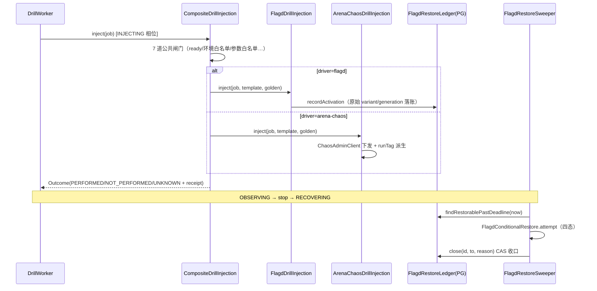
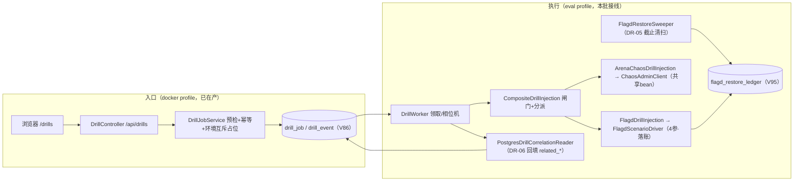

# 告警-DR03装配切换与E模式验收技术方案-v1

> 2026-09-13 主会话。依据：8 路文档审计发现「DR 线类已落、装配未接」断链；
> 勘查面=EvalRunnerConfig 三断点 + drill 包 26 类全清单（file:line 均已核实）。
> 用户已裁定本批先行（优先级 1）。

## 1. 核心问题

DR 演练线 26 个类（注入器三件套/恢复 sweeper/关联回填/作业链全套）与全部测试已在库，
但 eval profile 装配面三处断点使生产路径整体悬空：worker 拿到恒 `NotImplemented` 的注入口，
任何演练作业必然 INJECTING→FAILED；五场景模板 `ready:false` 与落码事实脱节。
本批**不写新调查能力**，只把既有类接进生产装配、按场景分批开放模板、走通一次 E 模式真机演练。

**航线对账**（北极星=评测真实命中率/LLM 可信上场）：DR 线是自造故障现场的供给侧——
没有受控故障注入就没有可复现的真告警→真调查现场，MC34/盲评/留出集全部依赖它。
本批为北极星铺「场景生产能力」这一块（质量红线对账：直接相关）。

## 2. 任务拆解

| 编号 | 内容 | 依赖 | 单项验收 |
|---|---|---|---|
| DR-A01 | 装配切换三断点（见 §4）+ ChaosAdminClient 提为共享 bean | — | eval profile 离线装配全绿；新装配类型断言（非 NotImplemented/disabled/null） |
| DR-A02 | DrillWorker 停止分支语义修正：真实接线后 INJECTING 相位 stop 改走 RECOVERING（DrillWorker.java:181-187 注释明记的遗留行为债） | A01 | 单测钉新分支；事件账本相位链含 RECOVERING |
| DR-A03 | 模板分批开放：S1/S2（Flagd）随 DR-05 sweeper 接线翻 ready:true；S3~S5（ArenaChaos）以 195 chaos-admin 连通验证为门，不通则维持 false 并如实登记 | A01+A02 | 模板 yml 与代码事实一致；ready=false 场景拒注闸（EXECUTION_READY）单测保持绿 |
| DR-A04 | 验证梯：全量回归 → PostgresDrillIT 真 PG → 195 E 模式真机演练（§11 矩阵） | A03 | 见 §12 DoD |
| DR-A05 | 台账：PROGRESS 行、DR02 文档状态刷新、drill-templates.yml reason 字段与事实对齐 | A04 | 三处文档与代码/真机证据一致 |

## 3. 类设计

**本批零新增域类**——全部复用在库类，仅改装配与一处分支语义。

装配变更表（全部在 `eval/application/EvalRunnerConfig.java`，@Profile("eval")）：

| bean 方法 | 现状 | 切换后 |
|---|---|---|
| `drillInjectionPort()`（:382-387） | `DrillInjectionPort.NotImplemented`（恒 notPerformed） | `CompositeDrillInjection(catalog, goldenRegistry, allowedEnvs, arenaChaos, flagd)` |
| `drillWorker()`（:390-410） | 9 参旧构造（correlation=disabled, sweeper=null） | 11 参全构造：`PostgresDrillCorrelationReader(jdbc)` + `FlagdRestoreSweeper(flagAdminClient.asAdminPort(), flagdRestoreLedger, Instant::now)` |
| `flagdScenarioDriver()`（:178-183） | 2 参过渡构造（ledger=noop） | 4 参构造：`PostgresFlagdRestoreLedger(jdbc)` + `Clock.systemUTC()` |
| （新）`chaosAdminClient()` | 匿名内嵌在 `arenaChaosScenarioDriver` 内（:202） | 提为独立共享 bean，`arenaChaosScenarioDriver` 与 `ArenaChaosDrillInjection` 共用 |

明确不做：不改 DrillController/PersistenceConfig（docker 侧已完整）；不动 V86/V95 表结构；
不删 `DrillInjectionPort.NotImplemented`（保留为 fail-closed 兜底与测试对照）；
不实现 ChaosActivationLifecycleIT/ChaosRecoveryIT（DR-07 文档点名但不存在，另立卡）。

类交互时序（装配切换后的注入主链）：

## 4. 实现方式

- **A01 逐方法改造**：按 §3 表逐 bean 替换；`allowedEnvs` 复用 drillWorker 现有的
  `app.drill.target-envs` 拆分逻辑（提取为私有方法两处共用）；`flagdRestoreLedger` 新建
  bean（`PostgresFlagdRestoreLedger(jdbc)`），sweeper 与 driver 四参构造共用同一实例——
  写账与收口读账必须同库同表（V95）。
- **A02 停止分支**：`DrillWorker.java:181-187` 注释明记「真实接线落地后此分支必须改走
  RECOVERING」——切换条件就是本批落地；改后 INJECTING 相位收到 stop → 相位 RECOVERING +
  事件落账，不再按未接线语义直接 FAILED。
- **A03 模板翻转**：`drill-templates.yml` S1/S2 的 `execution.ready` 翻 true、reason 改为
  「DR-03/DR-05 已接线（本批）」；S3~S5 维持 false 直到 chaos-admin 连通验证通过（A04 真机窗
  顺带验证，通过则同窗翻转，不通过则 reason 更新为实测原因）。
- **事务边界**：注入回执/相位推进沿用 worker 既有列级 update + 事件 insert-only 账本；
  sweeper `close` 为单行 CAS（V95 设计既有），本批不新增事务面。
- **幂等**：worker 领取 SKIP LOCKED、幂等键 uq、stop 键 uq 均既有；装配切换不改变幂等语义。

### 4.1 数据迁移

**零新迁移**：V86/V95 表结构既有，本批不动 DDL。部署验证点=flyway 历史无新增行。

### 4.2 部署步骤与回滚（工序 4 纪律）

1. **备份**：部署前 `pg_dump` 快照 + `cp -a deploy/.env /tmp/.env.dr03-backup`
   （备份只增不删；**严禁 `ln -sfn` 动 .env**，09-13 事故纪律）。
2. **部署**：tarball 增量同步（不 `rm -rf`）→ mvn package → 双镜像构建 →
  `docker compose up -d --force-recreate control-app`（模板随 jar，必须重建镜像生效）。
3. **密钥纪律**：`CHAOS_ADMIN_TOKEN` 经 deploy/.env 注入（chmod 600），永不入库/日志/文档；
   A03 连通验证只在 195 本机执行，令牌不外显。
4. **回滚**：任一验证门红 → `docker compose up -d --force-recreate control-app` 回退到
   上一镜像 tag（部署前记录当前 image id）；模板 ready 回翻 false 同样走镜像重建；
   装配切换是纯代码面，无数据迁移，回滚无残留。**回滚后已落库的 drill_job/drill_event/
   flagd_restore_ledger 行保留**（账本只增不删），不构成回滚障碍。

### 4.3 工序 5 测试交接安排（强制纪律）

本批工序 5 执行委托**独立测试 agent**（作者不自测自评）：
- 编码+部署验证（工序 3/4）完成后，主会话出具
  `docs/告警DR03-测试交接文档.md`（背景简报+§11 测试矩阵+执行顺序+环境锚点+
  故障注入与复原+清理清单），连同 `docs/架构设计-告警Agent-v1.md` 交用户转达；
- 执行 agent 由用户指定；交付三文档：`docs/告警-测试进度.md`（逐用例三态）、
  `docs/告警-测试记录.md`（证据原文）、`docs/告警-BUGLOG.md`（新故障卡）；
- 失败项修复后执行方**全量回归**（不是只回归失败项），TB 全关闭方可进 G2。

## 5. 数据流与链路图

## 6. 边界条件与不变量

**强制不变量**：
1. 环境互斥原子占位不变：`uq_drill_job_active_env` 部分唯一索引，活动集含 RECOVERY_FAILED
   （恢复失败保占位阻止下一场，DU15）。
2. flagd 恢复可收口：任何 OPEN/UNKNOWN 台账行过 deadline 必被 sweeper 逐条条件恢复+CAS 收口；
   读取失败如实记 original_variant=null，不猜。
3. eval profile 离线可装配：`EvalRunnerProfileIsolationTest` 保持绿（新 bean 依赖不许引入
   只能运行时解析的协作者）。
4. ready=false 场景拒注闸（EXECUTION_READY）不因装配切换被绕过。
5. DRILL 与生产数据级隔离不变（OSS 证据清单 :241）：注入产生的 incident/run 可识别、
   不作晋升样本。

**显式承认的残余风险（诚实清单）**：
- ArenaChaos 注入从未在 195 真实连通验证过——S3~S5 可能卡在 chaos-admin 协议/鉴权细节，
  本批允许以「连通验证不过→维持 ready:false」收场。
- sweeper 单实例假设：eval worker 单实例部署下成立；多实例化时 sweeper 需加租约
  （压力点登记，本批不做）。
- E 模式只证明「管理面+装配链」通，不证明真实故障复现（那是 L 模式）。
- `drill-templates.yml` 随 jar 打包，ready 翻转需重建镜像生效——无运行时热更（见 §8）。

## 7. 设计原因

调研五步法结论：本批是**装配接线**而非新机制设计，"抄"的对象是项目内已验证先例+
OSS 语义契约，全部在册：

- **in-repo 先例（主要）**：docker 侧 `PersistenceConfig.java:853-893` 的 drill 装配是完整
  可抄模板（Controller/Service/catalog 全套已在产运行）——eval 侧切换与之同构，
  差异仅是注入器/sweeper/关联三件套（docker 侧按设计不跑 worker）。
- **otel-demo flagd 故障注入面**（OSS 证据清单 :71-72，github.com/open-telemetry/
  opentelemetry-demo，src/flagd/demo.flagd.json）：S1/S2 场景（paymentFailure/
  paymentUnreachable）的事实源与语义来源。
- **flagd 分桶契约**（证据清单 :228-229，open-feature/flagd fractional.go）：注入参数
  的分桶语义参照。
- **Strangler Fig 退场五拍子**（证据清单 :234）：「恢复演练」作为退场必备拍的行业先例，
  DR-05 sweeper 的设计动机。
- **chaos 工程生命周期**（注入→观测→恢复→收口四相位）与 litmus/chaos-mesh 的 experiment
  生命周期同构；本项目已落 DrillLifecycle 十相位状态机（V86 CHECK 约束），本批不新造。

## 8. 问题与压力点（按压力排序）

1. **ChaosActivationLifecycleIT/ChaosRecoveryIT 不存在**——DR-07 文档点名的两个 IT 需新建，
   本批不建（E 模式验收用 PostgresDrillIT + 真机走查替代），立卡归后续。
2. **S3~S5 可能无法本批开放**（chaos-admin 连通未验）——若卡住，DR 线 ArenaChaos 半边
   仍悬空，需专窗排障。
3. **模板无运行时热更**：ready 翻转=重建镜像。若演练节奏变密会烦，届时再评
   `app.drill.template-path` 外挂挂载（机制已预留，本批不用）。
4. ** sweeper 多实例租约**：单实例假设写入诚实清单，多 worker 化时必须回来补。

## 9. 实际后果记录

- BA-134（已关）：发布仲裁 loser 面语义——E 模式演练若同 incident 重复调查，
  报告「判负不外发」是设计行为不是故障（v2 断言包 7b 已精确区分）。
- 09-13 .env 符号链接事故：部署脚本照 M0 README `ln -sfn` 覆盖真实 .env——
  本批部署窗只许 `compose up -d --force-recreate`（增量不动 .env），README 已修（6660d37）。
- 首轮冒烟 tarball 500：`rm -rf` 重建现场钉旧 inode——本批若同步代码必须 force-recreate。

## 10. 技术债分析

不接线的债务曲线：26 类+全部测试是**无生产消费者**的资产——接口每次漂移（如 V95 ledger
列变更）都不会被任何真实路径验证，腐烂无声；templates ready:false 与代码事实脱节，
新人读库会得到「DR 线不存在」的错误结论。接线后这些资产进入回归网，边际维护成本归零。
反之若本批证明 ArenaChaos 注入在 195 不可行，早暴露比晚暴露便宜（S3~S5 未开放前
尚无用户依赖）。

## 11. 测试用例设计（按防线分层）

**静态架构/装配**：
- T1 `EvalRunnerProfileIsolationTest` 扩断言：eval profile 的 drillInjectionPort 是
  CompositeDrillInjection、drillWorker 持有非空 sweeper 与非 disabled correlation、
  flagdScenarioDriver 落 PostgresFlagdRestoreLedger（反射或行为探针，离线可跑）。
- T2 ArchUnit 既有守卫不红（无新域类，预期零变更）。

**单元**（全部复用既有类，装配切换后应直接绿）：
- T3 DrillWorkerInjectionTest 注入三态；T4 CompositeDrillInjectionTest 闸门矩阵；
  T5 FlagdRestoreSweeperTest 截止清扫；T6 DrillWorkerFlagdDeadlineTest/CorrelationTest
  （已用 11 参构造器）。
- T7（新增）A02 停止分支：INJECTING+stop → RECOVERING+事件落账，替代旧 FAILED 语义。

**组件规则（真 PG，Testcontainers）**：
- T8 PostgresDrillIT 六面（授权矩阵/事件 insert-only/幂等 uq/活动占位含 RECOVERY_FAILED/
  CLOSED 形状/SKIP LOCKED）——装配切换后首跑，当前 NOT_RUN。
- T9（新增）PostgresFlagdRestoreLedger 与 sweeper 集成：recordActivation→
  findRestorablePastDeadline→close CAS 全链真库。

**业务场景闭环（195 真机 E 模式，DU 矩阵子集）**：
- T10 全链：登录→/drills 选 S1→preview→create 202→worker 相位链 QUEUED→PRECHECK→
  INJECTING→OBSERVING（事件账本逐相位断言）→flagd 面板确认 paymentFailure=50%→
  关联回填 related_incident_id/related_run_id→stop 202=RECOVERING→
  台账 RESTORED 收口（DU01/02/05/10/12/15 核心路径）。
- T11 幂等与互斥：同键重发 200 replayed；异 payload 409；并发第二作业 409 CONFLICT_ENV
  带 occupantDrillId。
- T12 恢复失败注入（sweeper 截止前人为锁住 flagd 或置冲突 variant）→ RECOVERY_FAILED
  保占位阻止下一场→人工恢复后 sweeper 重试收口。

**边界异常**：T13 ready=false 场景（S3）create → EXECUTION_READY 拒注如实报错；
T14 超 deadline 台账行被 sweeper 自动收口（缩短 deadline 测试姿态）。

**部署门**：T15 health 200 + ERROR=0 + flyway 无新迁移 + eval worker 日志零
INJECTION_NOT_IMPLEMENTED 新增。

## 12. 验收标准（DoD）

1. §4 三断点切换+A02 分支落码，全量回归绿（基线 1937，净增 T1/T7/T9 锚）。
2. 195 部署后 T8/T9 真 PG 绿、T10 全链走通（证据：事件账本 SQL 转储+flagd 台账行+
   关联回填行+前端页面状态截图/录屏，落 `docs/测试证据/dr-e2e-<date>/`）。
3. S1（或 S2）ready:true 且真机可用；S3~S5 状态与 chaos-admin 连通实测结论一致登记。
4. T12 恢复失败→占位→重试收口走查通过。
5. PROGRESS 收官行+DR02 文档状态刷新+BUGLOG 新增条目（如有）落账。

**否决条件**（任一命中即砍/降级，不硬推）：
- eval profile 离线装配无法容纳新依赖（如 jdbc client 在 eval profile 缺席且不可补救）
  →砍 sweeper/correlation 接线，A01 拆两批，仅交付注入器切换；
- 195 chaos-admin 连通验证失败→S3~S5 不开放，E 模式只走 Flagd 场景，ArenaChaos 半边
  转专窗排障（不算本批失败，如实登记）；
- E 模式演练发现注入回执三态/相位语义与文档不符→模板回退 ready:false，修复后重验，
  不带病验收。

## 13. G2 验收材料·质量指标硬门（不可豁免三问）

G2 提交时验收材料必须含本节，如实回答：
1. **北极星指标现值**（评测真实命中率，基线 0/47）：本批预期**无直接变化**——
   本批交付的是场景生产能力（自造故障现场），命中率变化要等 DR 场景喂给评测线后才可测；
   明示排期去向：DR 场景→评测回归集的接线归后续批次（R6 盲评底座立项后）。
2. **LLM 在主链路的在环状态**：本批不动模型链路，**无变化**；间接贡献=为
   「真告警→真 LLM 调查」提供可复现现场（MC34/A0 复测的场景源）。
3. **向「LLM 可信上场」收敛了什么**：收敛了「评测现场供给」这一前置——没有可控故障
   注入，模型质量评估只能靠偶发真实告警；本批后可按需造现场。
   （三项均答"无直接变化/间接贡献"，按硬门纪律明示，不虚报。）
