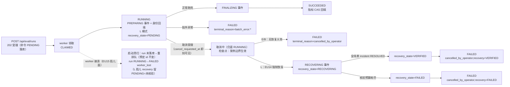

# 告警-EV04-发起与生命周期-v1

EV-04 卡执行记录（方案依据：告警-评测中心与能力版本演进-审查及详细改造方案-v1.md
EV-04 任务卡 / §3.2 / §5.1 / §5.3 第二三行 / EU09/EU10/EU13/EU14/EU15）。
分支 ev/eval-center；迁移实际占用 **V81**（V80 = EV-03；V46~V59 = R7，V60~V79 = EN）。
本卡只做后端：不部署、不动前端。

## 1. 状态机

### 1.1 run 生命周期（eval_run.state 三值不动，取消/恢复是分面不是新状态）

关键语义：

- **受理 ≠ 已停**：cancel 202 只落 CANCEL 命令（读面 `cancelRequestedAt` 立即可见）；
  推进归 worker **案例边界检查点**——在跑轮次走完全部 finally 解除注入后才停，
  之后零新案例。
- **取消合法迁移**（`EvalRunLifecycle`）：仅 RUNNING 受理；SUCCEEDED/FAILED → 409
  零副作用。同幂等键重放返回原命令（200 replayed）；同键指向别的 run → 409。
- **L 模式恢复义务**：取消/收尾必须 RECOVERING + 恢复核验落账后才允许终态，
  "实验结束不伪装现场恢复"（EU14）。E/B 模式 recovery_state 恒 NULL → 读面
  NOT_APPLICABLE。
- **阶段事件 insert-only**（eval_phase_event，V80 表）：PREPARING（开跑）→
  逐轮 INJECTING→AWAITING_ALERT→AWAITING_RCA→SCORING → FINALIZING（正常收尾）
  / RECOVERING（L 取消恢复）。worker 失联 = 无新事件，读面显示最后真实阶段 +
  leaseHeartbeatAt 恒 null（无租约数据源，EU12 不编造）。

### 1.2 命令账本（eval_run_command，V81；V27 operator_command 同构）

PENDING → CLAIMED → DONE/FAILED（REJECTED 保留给服务层显式拒绝留痕）。
幂等锚 `uq(command_type, idempotency_key)`：同键撞 uq → 读胜者行比
`payload_hash`（EvalLaunchPlan canonical 固定字段序 sha256）——同计划重放，
异计划 409（EU09）。

## 2. 端点契约

| 端点 | 请求体 | 应答 |
|---|---|---|
| POST /api/eval/runs | `{idempotencyKey*, displayName*, mode*(E/B/L), datasetVersion*, model?, promptVersion?, budgetMaxTokens?, maxConcurrency?, deadlineSeconds?, roundsPerScenario?}` | 202 `{runId, commandId, state:ACCEPTED, replayed:false}`；同键同计划重放 200 `replayed:true`（同 runId）；同键异计划 409 `{existingRunId}`；校验失败 400 |
| POST /api/eval/runs/{id}/cancel | `{idempotencyKey*, reason?}` | 202 `{state:CANCELLING}`；同键重放 200；run 不存在 404；终态 409；同键跨 run 409 |

纪律：

- **202 到 run 可查之间有领取窗口**（V81 授权纪律：control_app 对 eval_run 只读，
  run 行由 worker 领取命令后以命令预定 id 落库）——读面在此之前如实 404，
  前端重试查询即可；崩溃重放不产生第二个 run（稳定身份）。
- actor 唯一来源 = 认证主体（AuthenticatedActor），请求体不自报。
- 授权双层：HTTP 面 /api/eval/** = ROLE_OPERATOR（SecurityFilterChain 既有矩阵，
  读写同权）；DB 面 control_app 对 eval_run_command 只授 select+insert
  （命令落库即冻结，零 update/delete）、对 eval_run 仍零写；eval_app（worker）
  对命令表列级 update（state/worker_id/claimed_at/finished_at）+ eval_run 增授
  display_name/mode（V80）/launch_plan/recovery_state/terminal_reason（V81）；
  publisher/notify/arena/chaos/public 显式 revoke（EU10）。
- CSRF 不豁免（沿用 RunCommandController 先例：operator 写面走 XSRF cookie→头）。

## 3. 读面演进（EV-03 占位 → 真值）

| 字段 | EV-03 | EV-04 |
|---|---|---|
| displayName/mode | 恒 null（无写面） | worker 领取时回填（旧 CLI 跑批行仍 null） |
| phase/stageEnteredAt | 空表 → null | EvalBatchRunner 各阶段真实落事件 |
| recoveryState | 恒 UNKNOWN | V81 列真值（PENDING/RECOVERING/VERIFIED/FAILED）；null+L=UNKNOWN（worker 未上报）；null+其他=NOT_APPLICABLE |
| cancelRequestedAt（facets 新增） | 无 | 最早受理 CANCEL 命令提交时刻 |
| terminalReason（详情新增） | 无 | FAILED 卡因：cancelled_by_operator[;recovery=*] / batch_error:* / worker_lost[;recovery_unverified] |
| launchPlan（详情新增） | 无 | eval_run.launch_plan jsonb 快照（配置回看 §3.2） |
| qualityVerdict | UNKNOWN | 仍 UNKNOWN（EV-05+ 质量门持久化前置） |
| usageStatus/costStatus | UNKNOWN | 仍 UNKNOWN（RV08 红线：不读 PR 账本冒充；EV-06） |
| leaseHeartbeatAt | null | 仍 null（无租约数据源） |
| nextRetryAt（EU13 退避面） | 无 | 仍无数据源 → 不开字段（不编造，EU13 部分未覆盖见 §5） |

## 4. 发起执行路径（方案"EvalRunnerMain/Config/BatchRunner 抽出可复用启动路径"落点）

- `EvalRunnerMain` 双形态：**worker（默认）** = `EvalRunWorker.runLoop()` 常驻轮询
  （poll 5s）；`app.alert.eval.worker.mode=once` = M3 旧一次性跑批退出（CLI 兼容面）。
- `EvalRunWorker`：claimNextLaunch 单语句 CAS（FOR UPDATE SKIP LOCKED）→
  `EvalLaunchExecutor`（计划叠加 env 元数据 + RunLifecycle 挂点）→
  复用 `EvalBatchRunner.runBatch(runId, lifecycle)`（同一编排器，不另造执行路径）→
  命令 DONE/FAILED 收口；usage 对账（M3-25）照旧在批件终态后执行。
- 崩溃恢复（EU15 边界面）：启动扫 CLAIMED 超龄（stale-claim-seconds=900）孤儿——
  run 未落库 → 重排队（预定 run id 不变）；run RUNNING → FAILED worker_lost
  （L 孤儿 recovery 留 PENDING）；run 已终态 → 命令对齐。
- 元数据叠加诚实边界：datasetVersion 恒取计划值；model/promptVersion 缺省沿用 env；
  **候选内容 digest 面本期仍由 env 提供**（EV-09 资产注册接线前不从请求体接受
  digest 自报）。

## 5. EU 用例逐条状态

| 用例 | 状态 | 证据/理由 |
|---|---|---|
| EU09 新建重复提交、响应丢失 | **PASS（单测）** | EvalCommandServiceTest：同键同计划 REPLAYED 返回原 runId、异计划 CONFLICT、键校验；uq 撞键面 PostgresEvalLifecycleIT（NOT_RUN） |
| EU10 无权限发起/取消/导出 | **部分 PASS + IT NOT_RUN** | DB 授权矩阵单测不可测→PostgresEvalLifecycleIT 真 PG 断言（control_app 只增不改、eval_app 列级、publisher/notify 拒绝），本机无 Docker 标 NOT_RUN；HTTP 面沿用 ROLE_OPERATOR 矩阵（无新代码路径，既有 SecurityConfig 测试覆盖）。导出端点本期不存在 |
| EU13 模型超时/退避/等专家卡因 | **部分 PASS（可读部分）** | 失败/取消卡因 terminalReason + 来源（runner/worker 词表）落 detail；阶段事件带场景/轮次 detail。退避 nextRetryAt/deadline 无数据源 → 未开字段不编造（偏差，归 EV-05/EV-06 数据源落地后补） |
| EU14 L 模式取消且故障仍有效 | **PASS（单测）** | EvalBatchRunnerLifecycleTest：L 取消 → RECOVERING 事件 + recovery PENDING→RECOVERING→VERIFIED/FAILED 后才 FAILED 终态；E 模式无恢复面 |
| EU15 领取/发请求/写结果边界杀 worker | **部分 PASS（单测）** | EvalRunWorkerTest 孤儿清扫三分支（重排队稳定身份/worker_lost 终态/命令对齐）。真边界注入（发请求途中杀进程）需真环境窗口，NOT_RUN；UNKNOWN 结果对账归 EV-06 调用账本 |
| EU11/EU12（读面） | 沿用 EV-03 结论 | phase/lastProgressAt 真值本期由 runner 落事件获得；失联=无新事件如实显示最后阶段 |

## 6. 测试清单

单测（全部真断言，假件只到端口边界）：

- `EvalRunLifecycleTest`（4）：取消合法迁移（RUNNING 受理/两终态拒绝）、模式词表、
  L 恢复义务、孤儿卡因 L 不冒充已恢复。
- `EvalLaunchPlanTest`（3）：canonical hash 稳定且逐字段敏感（EU09 409 判据）、
  必填校验、正数/null 边界。
- `EvalCommandServiceTest`（9）：发起落库 PENDING、同键重放、异计划 409、键校验；
  RUNNING 取消受理、终态 409 零落库、未知 run 404 面、同键重放/跨 run 409、
  异键重复取消幂等受理。
- `EvalBatchRunnerLifecycleTest`（5）：阶段事件全序 + worker_id/detail、
  E 取消检查点（在跑轮走完+零新案例+FAILED 卡因+无 FINALIZING/RECOVERING）、
  L 取消 VERIFIED 路径、L 取消核验失败 FAILED 路径、noop 挂点 M3 语义不变。
- `EvalRunWorkerTest`（5）：tick 领取/失败收口、孤儿三分支、payload→计划 round-trip。
- `EvalQueryServiceTest`（+4）：recoveryState 直透/L 未上报 UNKNOWN/非 L
  NOT_APPLICABLE、详情 terminalReason/cancelRequestedAt/launchPlan、无数据诚实 null。

IT（本机无 Docker 整体 skip，**NOT_RUN**——禁止 PASS 占位，留待 195 联调窗）：

- `PostgresEvalLifecycleIT`（4）：授权矩阵、列级推进 + 阶段事件 insert-only、
  幂等锚 uq、取消后读面演进（cancel_requested_at → RECOVERING → VERIFIED →
  FAILED 卡因）、孤儿重排队/worker_lost。

## 7. 迁移与改动面

- **V81__ev04_eval_lifecycle.sql**：eval_run + launch_plan/recovery_state/
  terminal_reason 三列（CHECK 词表）；eval_run_command 新表（幂等锚 uq +
  状态单向 CHECK + 孤儿/领取索引）；授权（control_app select,insert /
  eval_app 列级 update + eval_run 三列 / 其余显式 revoke）。
- 未动 RV08 红线：全部新 SQL 不出现 model_call_ledger（ControlArchitectureTest
  AFT-26 封闭集不扩）。
- PostgresITBase ALL_TABLES 增 eval_run_command（BA-41 清场律）。

## 8. 偏差与未做项

1. **预算只持久化不强制**：budgetMaxTokens/maxConcurrency/deadlineSeconds 落
   launch_plan 快照；执行面强制等 R7 RCA 调用账本（EV-06，RV08 红线不越）。
   maxConcurrency 本期串行编排不变（§6.7/6.8 冻结）。
2. **模式当前是标签 + 恢复义务开关**：E/B/L 共用同一执行引擎（EvalBatchRunner
   真注入）；B 模式"冻结输入回放"与 E/L 的执行面分化不在本卡（方案 §3.2 模式
   语义由后续卡落地）。本卡只保证 mode 持久化真实、L 恢复义务真实。
3. **候选 digest 不接请求体**：model/promptVersion 可覆盖，digest 面仍 env
   提供（EV-09 资产注册前置），发起时不声称固定了候选内容 digest。
4. **EU13 退避/ deadline 分面未开**：无 nextRetryAt/deadline 数据源，详情不编造；
   等 R7 worker 退避事实表/心跳落地后补。
5. **EU15 真边界杀 worker 未执行**：单测覆盖孤儿清扫语义，真进程级注入需环境窗口。
6. **leaseHeartbeatAt 仍恒 null**：无租约心跳数据源（方案 §5.1 三时间戳区分
   保留给 worker 租约落地）。
7. **eval-runner 默认形态变更**：eval profile 默认从一次性跑批变为常驻 worker；
   旧形态 `app.alert.eval.worker.mode=once` 保留（部署面接入归部署窗口任务）。
8. **202→可查窗口**：run 行由 worker 领取后落库，202 与 GET 200 之间存在
   poll 间隔级窗口（如实 404）；不采用 control_app 直写 eval_run（V45 只读面不破）。
