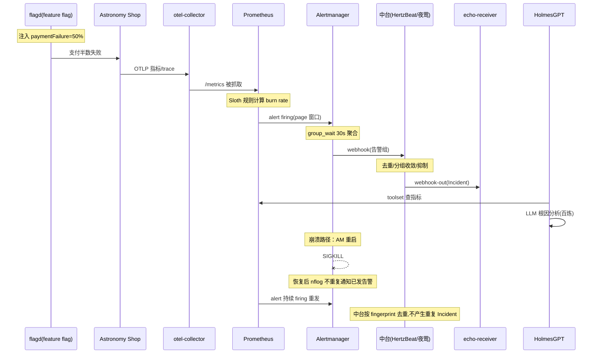
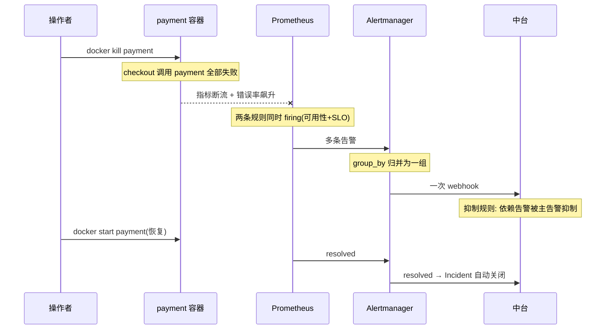
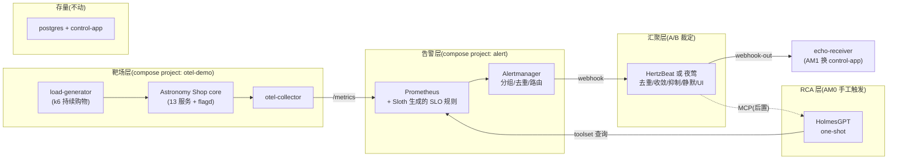

# 告警 AM0 平台拼装 —— 技术方案与任务拆解（v1.0 草稿）

> **状态：本草稿未生效、未过 G1。** 2026-09-03 用户指示改为"部署验证先行"：实际执行依据是 `docs/告警AM0-部署验证设计.md` v1.1，执行者为独立执行 agent，验证结论 = **路线 Go**（证据：195 服务器 `/opt/projects/alert_agent/smoke-evidence/`，判定表 `s9-verdict-G1-G7-20260903-203846.md`）。
> **实测与本草稿的四处偏差**（即 v1.1 修订项，已入账 `docs/告警-PROGRESS.md`）：① 中台双出局（HertzBeat RSS 1.126GiB 超 800M 线 / Alerta 一次性 PG 未起）→ 汇聚层取消，**Alertmanager 直打下游**；② RCA 模型 qwen-plus 在专属 MaaS 实例不可用 → **deepseek-v3**（端点需带 `/v1` 后缀）；③ ghcr 直拉停滞 → **crane 摆渡**（INC-3）；④ frontend-proxy 宿主端口改 18080。
> 本文档保留仅作设计推演记录；如需 AM0 正式方案，应以实测证据为准重写。

---
> 前置调研：`docs/告警-调研-快速部署-v1.md`（部署路径）、`docs/告警-调研-Keep替代-v1.md`（汇聚层候选，交叉核对中）、用户两轮外部调研（Sloth 路线收敛、HertzBeat/夜莺国产候选），证据统一入 `docs/告警-OSS-证据清单.md`。
> 写作与工作流标准：`docs/架构设计-告警Agent-v1.md` §6（旧《交接-工作准则与质量基线》已归档，其七/八节精神由该章继承）。
> 本线是独立方向，进度总账在 `docs/告警-PROGRESS.md`，旧 PR-Agent 文档一律不动。

---

## 1. 核心问题

告警 Agent 项目的第一块地基不是代码，而是**一条能真实产生告警、且每个环节都有开源先例背书的全链路环境**：

```text
故障注入 → 遥测异常 → 告警产生 → 聚合/降噪 → Incident → RCA
```

AM0 要解决的三个问题：

1. **告警谁来造**：不手写 PromQL 阈值——SLO 声明交给 Sloth 生成完整 burn-rate 告警规则（SLO-as-code），靶场故障由 Astronomy Shop 内置 feature flag 制造。
2. **告警谁来聚**：由开源告警中台承担去重/分组/抑制/静默/UI——首选 Apache HertzBeat（国产、docker.io 镜像、无 eBPF/内核门槛、自带 MCP），夜莺 V8 为对照组，**A/B 实测后裁定**。
3. **环境能不能活**：195 服务器（CentOS 7 / 内核 3.10 / 7.5G 内存 / 国内网络）四个硬约束下，所有组件必须实测可拉、可跑、内存不超卖。

**为什么现在解决**：AM1（control-app 改造接入）需要一个真实稳定的告警源才能开发联调；AM2（交易订单靶场）复用同一条链路。AM0 是所有后续里程碑的跑道。

**AM0 明确不做**：不改任何 Java 代码；不接 control-app（那是 AM1）；不做交易业务告警（那是 AM2）；不引入 K8s/Dapr/Temporal/Keep（GAR 镜像不可达）。

---

## 2. 任务拆解

排序原则：**一票否决项最先验证**（镜像供应链 → 中台 A/B → 靶场 → 链路 → 演练），任何一步失败都能在当天止损。

| 编号 | 任务 | 依赖 | 单项验收标准 |
|---|---|---|---|
| AM0-T01 | 镜像与供应链收尾：HertzBeat（`apache/hertzbeat`，docker.io 加速）、夜莺（`flashcatcloud/nightingale`）、OTel Demo 主体镜像（ghcr）拉取实测；HolmesGPT 自建镜像验证（`python:3.12-slim` + `pip install holmesgpt`，PyPI 走国内镜像） | — | 全部镜像在 195 实拉/构建成功并记录 digest；任一失败当场启用备选（HolmesGPT → GitHub Release 二进制裸跑） |
| AM0-T02 | **中台 A/B 实测**：195 上分别起 HertzBeat 单容器与夜莺单二进制，测三项——稳态 RSS（`docker stats`/`ps`）、外部告警接入（Prometheus/Alertmanager 告警流入）、webhook-out 到 echo 接收器（wiremock 容器） | T01 | 产出判定表：RSS、接入方式、webhook 格式、分组/去重/抑制能力核验；按 §6.4 判定矩阵给出胜者并留档 |
| AM0-T03 | Astronomy Shop 核心层起栈：仅 `compose.yaml`（core/minimal），`LOCUST_USERS` 调低；验证商城可购物、内存实测 | T01 | 全部容器 healthy；`docker stats` 记录各容器 RSS；商城首页经 SSH 隧道可访问 |
| AM0-T04 | 精简可观测层：复用 demo 的 otel-collector，**只叠 Prometheus**（裁掉 Jaeger/OpenSearch/Grafana/OpAMP），collector 配置启用 Prometheus exporter | T03 | Prometheus targets 全 UP；`http_server_requests` 类指标可查 |
| AM0-T05 | Sloth 生成 SLO 规则：本机/跳板机下载 sloth linux-amd64 binary，编写 checkout/payment 两条 SLO 声明（OpenSLO 或 sloth 原生格式），`sloth generate` 产出规则文件 scp 到 195，Prometheus 加载 | T04 | `/api/v1/rules` 可见 Sloth 生成的 recording rules + page/ticket 双窗告警；`slo:` 系列指标有数 |
| AM0-T06 | Alertmanager 部署与配置：group_by/group_wait/repeat_interval 语义按 OSS 证据 E-2 设定；webhook receiver 指向 A/B 胜者 | T02、T05 | 手工触发测试告警 → Alertmanager 分组正确 → 中台收到 |
| AM0-T07 | 中台正式接入链路：外部告警接入配置、分组收敛规则（group labels 只含稳定标签）、webhook-out 到 echo 接收器（AM1 才换 control-app） | T06 | 告警在中台 UI 可见、去重生效（同 fingerprint 不重复出单）、webhook-out 到达 echo |
| AM0-T08 | HolmesGPT 打通百炼：自建镜像运行，`OPENAI_API_BASE` 指百炼 OpenAI 兼容端点，model `openai/qwen-plus`（需 function calling）；配置 Prometheus toolset；对一条真实告警出 RCA 报告 | T01、T04 | `holmes ask` 或 HTTP API 对 T07 的一条告警产出结构化报告；记录 token 消耗 |
| AM0-T09 | 端到端演练 ×2 + 部署门脚本 + 文档收口：① `paymentFailure=50%`（业务链路故障）② `docker kill` 一个 demo 容器（基础设施故障）；`deploy/alert-smoke.sh`（DP-A 系列断言）；OSS 证据清单与告警-PROGRESS 更新 | T07、T08 | 两次演练全链路自动完成：故障 → 告警 → 中台 Incident → HolmesGPT 报告；DP-A 全绿 |

**依赖关系**：T01 → {T02, T03}；T03 → T04 → T05 → T06 → T07；T08 只需 T01+T04；T09 收尾全部。

---

## 3. 类设计与配置资产

**AM0 无 Java 代码**（环境拼装里程碑，类设计从 AM1 control-app 改造起恢复）。本期交付物全部为配置资产，职责如下：

| 资产 | 路径 | 职责 | 不做什么 |
|---|---|---|---|
| 告警栈 compose | `deploy/alert/docker-compose.yml` | prometheus/alertmanager/hertzbeat（或夜莺）/echo-receiver 服务定义，独立 compose project | 不碰现有 `deploy/docker-compose.yml`（PR-Agent 栈） |
| Prometheus 配置 | `deploy/alert/prometheus/prometheus.yml` | scrape otel-collector + 加载 Sloth 规则 | 不手写告警 expr（规则全部由 Sloth 产出） |
| Sloth SLO 声明 | `deploy/alert/sloth/slo-checkout.yml`、`slo-payment.yml` | 声明服务/可用性目标/total+error 指标表达式 | 不含 burn-rate 数学（Sloth 生成） |
| Alertmanager 配置 | `deploy/alert/alertmanager/alertmanager.yml` | 分组/去重/路由/webhook 指向中台 | 不做聚合键瞬态标签（违反 INV-AM0-4） |
| HolmesGPT 镜像 | `deploy/alert/holmesgpt/Dockerfile` | python:3.12-slim + pip install holmesgpt，绕开 GAR | 不内置任何 key（env 注入） |
| 部署门脚本 | `deploy/alert/alert-smoke.sh` | DP-A 系列断言 | 不做业务断言（AM1 起） |

---

## 4. 链路时序图

### 4.1 告警主链路（含崩溃/重启路径）



### 4.2 演练 2：容器被杀（基础设施故障）



---

## 5. 数据流与链路图



---

## 6. 实现方式（关键技术点）

### 6.1 镜像供应链（已实测，2026-09-03 在 195 执行）

| 注册表 | 实测结果 | 涉及组件 | 处置 |
|---|---|---|---|
| docker.io | ✅ 通（已配 daocloud/腾讯/dockerproxy 三个加速，`prom/alertmanager` 实拉成功） | Prometheus、Alertmanager、HertzBeat、夜莺、python:3.12-slim | 直接拉 |
| ghcr.io | ✅ 通（`open-telemetry/demo:latest-frontend` manifest 200，1.5s） | OTel Demo 全部服务、flagd、valkey | 直接拉 |
| quay.io | ✅ 通（401=正常鉴权挑战） | demo observability 层（本方案裁掉不用） | 备用 |
| **GAR**（us-central1-docker.pkg.dev） | ❌ **不通**（连接超时） | Keep、HolmesGPT 官方镜像 | **Keep 出局**；HolmesGPT 自建镜像（§6.5） |

### 6.2 Sloth 规则生成（零运行时开销）

Sloth 不以服务运行：在能访问 GitHub 的机器下载 `sloth-linux-amd64` binary → 本地编写 SLO 声明 → `sloth generate` 产出 `prometheus-rules.yml` → scp 到 195 → Prometheus 挂载加载。195 上无 Sloth 进程。

SLO 声明只写业务语义（服务名、可用性目标、total/error 判定表达式），burn-rate 多窗口告警数学由 Sloth 生成（证据 E-1）。AM0 两条：

- `checkout` 可用性 SLO 99%：total = `http.server.request.duration_count{service.name="checkout"}`，error = `status_code >= 500`（OTel HTTP 语义约定，证据 E-6）
- `payment` 可用性 SLO 99%：同上，service.name="payment"

具体指标名以 T04 起栈后 Prometheus 实际查询为准（OTel 语义版本差异属已知风险，T05 验收里含校正动作）。

### 6.3 Astronomy Shop 内存治理

core 层 compose 内存 limits 加总约 3.9G，但大头是**预留而非实占**：load-generator 1.5G（`LOCUST_USERS` 默认 5，调低到 3）、recommendation 500M（为 cache flag 场景预留）、otel-collector 400M。T03 验收以 `docker stats` 实测 RSS 为准，预期常驻 1.5~2.5G。裁掉 telemetry-docs；flagd-ui 保留（注入故障要用它的界面，也可改 flagd 配置文件替代）。

**不叠加 `compose.observability.yaml`**（会带 Jaeger/OpenSearch/Grafana，内存爆炸）；只从其中取 otel-collector 的 Prometheus exporter 配置，自建精简 Prometheus 容器。

### 6.4 中台 A/B 判定矩阵（T02）

| 维度 | 权重 | 出局线 |
|---|---|---|
| 稳态 RSS | 高 | > 800M 出局 |
| 外部告警接入（Alertmanager/Prometheus 告警流入） | 高 | 接入不了直接出局 |
| 分组/去重/抑制开源可用 | 高 | 核心语义在商业版则降级为"告警引擎"角色 |
| webhook-out | 中 | 必须能发自定义 webhook |
| 存储零依赖（内置 SQLite/H2） | 中 | 需要 MySQL 扣分（违反 PG 惯例且费内存） |

HertzBeat 预期胜出（分组收敛/抑制/静默开源可用 + docker.io 镜像 + 无 eBPF + MCP 后置价值，证据 E-7）；夜莺作为对照（单二进制最省内存，但聚合/抑制在商业版，证据 E-8）。判定结论与证据写入 `docs/告警-OSS-证据清单.md`，败者不删档。

### 6.5 HolmesGPT 自建镜像（绕 GAR）

```dockerfile
FROM python:3.12-slim
RUN pip install --no-cache-dir holmesgpt -i https://pypi.tuna.tsinghua.edu.cn/simple
ENTRYPOINT ["holmes"]
```

端点配置（env 注入，密钥不落盘）：`OPENAI_API_BASE=<百炼 OpenAI 兼容端点>`、`OPENAI_API_KEY=${AGENT_MODEL_API_KEY}`、model 选 `openai/qwen-plus`（toolset 需 function calling，qwen-plus 支持）。AM0 阶段 one-shot 运行（`docker run --rm`），**不常驻**——内存预算红线措施。

**已知盲区（诚实记录）**：HolmesGPT 直接调百炼，不经过我们的 ModelGateway 账本，token 消耗无记账——记入压力点 P-3，AM3 评测前收口。

### 6.6 网络与端口安全

- 告警栈独立 compose project + 独立 bridge 网络，与 PR-Agent 栈（`deploy-*`）网络隔离（INV-AM0-2）
- 所有 Web UI/API 端口绑 `127.0.0.1` 或不暴露宿主端口，本地访问走 SSH 隧道（INV-AM0-1）：`ssh -L 8080:localhost:8080 ...`
- 中台默认口令（HertzBeat `admin/hertzbeat`、夜莺默认账号）部署后立即修改并记入 195 的 `.env`（不进仓库）

---

## 7. 边界条件与不变量

### 强制不变量

| 编号 | 不变量 | 验证方式 |
|---|---|---|
| INV-AM0-1 | 任何 Web 端口不裸暴露公网（公网 IP 机器） | DP-A08 端口扫描断言 |
| INV-AM0-2 | 告警栈与 PR-Agent 栈网络/数据零共享（独立 bridge、独立 compose project、不碰现有 PG 库） | compose 文件审查 + DP-A01 |
| INV-AM0-3 | 密钥仅经 env 注入（`AGENT_MODEL_API_KEY`、中台口令），不进仓库/文档/日志 | 代码审查 + smoke 日志 grep |
| INV-AM0-4 | 告警聚合键只含稳定标签（alertname/service/severity），绝不含 startsAt/value/pod 等瞬态标签 | Alertmanager/中台配置审查 + T07 去重验证 |
| INV-AM0-5 | 故障注入只作用于 demo 靶场（flagd 配置 + docker kill 仅限 otel-demo 容器） | 演练脚本审查 |

### 显式承认的残余风险（诚实清单）

1. **内存红线**：全栈常驻预估 4~5.5G，逼近 5.7G 可用上限。缓解：HolmesGPT one-shot、demo 组件裁剪、停 publisher-app/github-stub。红线规则：`free` available 持续 < 1G 则降级（砍 demo 非核心组件 → 仍不足则中台降级为 Alertmanager 直连 echo，链路不断）。
2. **HertzBeat 版本漂移**：其为活跃开发中的 Apache 项目，文档（中文站）与实际版本可能有出入——A/B 实测（T02）即为纠偏手段。
3. **HolmesGPT pip 版与容器内 glibc/python 兼容性**：自建镜像在 T01 验证，失败则退 GitHub Release 二进制裸跑（CentOS 7 glibc 2.17 对 PyInstaller 二进制是风险，故容器优先）。
4. **百炼 function calling 兼容性**：qwen-plus 支持 tool calls，但 HolmesGPT 的 toolset 调用模式未实测——T08 是第一个真实验证点，不通则换模型（deepseek 系列）或降级为纯问答模式（无 toolset，RCA 质量降级）。
5. **OTel 指标语义版本差异**：Sloth 声明里的指标名以 T04 实测为准，方案不写死。

---

## 8. 设计原因

### 8.1 关键取舍与依据（证据编号见 `docs/告警-OSS-证据清单.md`）

- **SLO-as-code（Sloth）而非手写 PromQL**：告警数学（multi-window burn rate）是易错重灾区，交给生成器；声明与生成解耦，未来迁交易域只需改声明（订单 API 可用性/履约延迟 SLO）。依据：Sloth 官方生成样例（E-1）、Google SRE burn-rate 方法论（E-1 引用）。
- **HertzBeat 优先而非 Keep**：Keep 官方镜像仅在 GAR（195 实测不通，§6.1），其全自动 AI 关联仅 Cloud 版（E-4）；HertzBeat 在 docker.io、无内核门槛、聚合/抑制/静默开源可用（E-7）。**代价推演**：HertzBeat 是 Java 应用，RSS 高于 Keep 的 Python 后端的风险存在 → T02 实测判定，出局线 800M；其 workflow 能力弱于 Keep → 但 workflow 本就不让中台做（AM1 起由 control-app 承担）。
- **HolmesGPT 先部署后替换**：直接获得真实 RCA 能力验证链路；其 claim 机制/双池隔离/request_sequence 设计已被源码核查（E-3），作为 AM1 调度层改造和 AM4 Java 替换的设计母本。**代价**：引入 Python 栈 + 账本盲区（P-3）。
- **不引入 K8s/Dapr/Temporal**：单机 docker 已够；Dapr/Temporal 对当前体量过重（调研结论 E-5）；Coroot 因 eBPF 内核 ≥5.1 硬要求出局（195 内核 3.10 实测，E-9）。
- **LLM 只提建议，决策权在确定性组件**：AM0 体现为 HolmesGPT 报告仅供参考，告警产生/聚合/路由全部由确定性组件完成（调研反复定调，E-5）。

### 8.2 拒绝记录

| 候选 | 拒绝理由 | 证据 |
|---|---|---|
| Keep | 镜像 GAR 不可达 + AI 关联仅 Cloud + 社区维护状态不确定 | E-4 |
| Coroot | eBPF 硬依赖，内核 ≥ 5.1；195 = 3.10 | E-9 |
| 夜莺（作主中台） | 聚合/抑制在商业版；PG 支持官方自认缺少长期贡献者 | E-8 |
| SigNoz/OpenObserve | 不解决"不写告警规则"；SigNoz 需 4G+ClickHouse | E-10 |
| Dapr/Temporal | 体量过重，与"harness 优先、单实例 PG 全家桶"定位冲突 | E-5 |
| 夜莺 PG 模式 | 官方建议优先 MySQL（PG 曾有初始化缺陷 issue） | E-8 |

---

## 9. 问题与压力点（→ AM1 及以后的输入）

| 编号 | 压力点 | 重新评估的触发信号 |
|---|---|---|
| P-1 | 中台与 control-app 的 Incident 语义双写：AM1 起告警会同时存在于中台和控制面 | AM1 设计时必须裁清"谁是 Incident 事实源" |
| P-2 | OTel Demo 只能产生基础设施/链路层告警，无交易业务语义（订单卡住、状态机回跳、废单） | AM2 订单靶场立项时 |
| P-3 | HolmesGPT 模型调用无账本无预算 | AM3 评测前必须收口（LiteLLM proxy 或 Java 替换提前） |
| P-4 | 中台 MCP/证据查询能力未接 | HolmesGPT toolset 不够用、需要业务侧证据时（AM2+） |
| P-5 | 告警源单一（仅 Prometheus 生态） | 需要证明 Agent 不绑定单一告警平台时（Gatus 合成监控作第二源） |
| P-6 | 内存水位常态化紧张 | free available 持续 < 1G → 触发降额或服务器升配评估 |

---

## 10. 实际后果记录

### 10.1 本项目（PR-Agent 线）相关教训

- **INC-42**：Spring AI 默认 10 次隐藏重试在役三个里程碑未被发现 → 教训直接适用于 AM0：HolmesGPT/LiteLLM 的默认重试与超时参数必须显式核查并记录，不接受默认值黑盒（T08 验收含此项）。
- **github-stub 长期 unhealthy 无人处理** → AM0 起所有容器必须有 healthcheck + DP 断言盯存活，不许"带病常驻"。

### 10.2 同构系统前车之鉴（调研核查，证据入清单）

- **Robusta**：队列满内部拒绝但 HTTP 入口可能仍返回成功（静默丢告警）→ AM1 设计入口时的反面教材：队列满必须明确 429/503（E-3）。
- **Keep**：Redis/ARQ 工作流队列代码整段注释标 TODO、进程内 list+线程池调度不可靠（E-4）→ 印证"中台只做汇聚，调度必须落在有租约/持久化的 control-app"。
- **夜莺 PG 初始化缺陷**（issue #3101，MySQL mediumtext 混入 PG migration）→ 跨数据库"理论上支持"不可轻信，AM0 中台一律用其官方默认存储（E-8）。

---

## 11. 技术债分析

**若不建平台、让 LLM 直接裸接告警**（最朴素替代方案）的债务曲线：

- 无去重/聚合 → 每次故障产生 N 条告警直接进 LLM，token 成本随故障规模线性放大，且告警风暴时模型调用爆炸（无预算护栏）；
- 无 Incident 生命周期 → 同一故障的 firing/resolved 无法归并，RCA 报告互相矛盾，评测（AM3）失去 ground truth 对照锚点；
- 无中台 UI → 演示和面试时拿不出"平台"形态，只剩一段脚本；
- 修复成本：事后补聚合层等于重写入口（告警格式、幂等、状态全部返工），比 AM0 一次搭对贵 3 倍以上。

**本方案自身的债**：HertzBeat/夜莺二选一后败者知识作废（可接受，A/B 成本仅半天）；HolmesGPT 自建镜像需跟踪其 release 手动升级（记入运维清单）。

---

## 12. 测试用例设计

AM0 无 Java 代码，L0~L4 防线不涉及（声明原因：无源码变更）；测试集中在 **L5/L6 部署门与整栈演练**。每条用例四要素：场景/断言/取证/回指。

### 部署门（`deploy/alert/alert-smoke.sh`，DP-A 系列）

| 编号 | 场景 | 预期断言（机器可查） | 取证 | 回指 |
|---|---|---|---|---|
| DP-A01 | 全栈启动 | 所有容器 `Up (healthy)`；alert 栈与 deploy 栈网络隔离 | `docker ps`、`docker network inspect` | INV-AM0-2 |
| DP-A02 | Prometheus 就绪 | `/api/v1/rules` 含 Sloth 生成的 page/ticket 规则；targets 全 UP | curl api | T04/T05 验收 |
| DP-A03 | Alertmanager 就绪 | 配置加载成功，`/api/v2/status` 200 | curl api | T06 |
| DP-A04 | 中台就绪 | UI/API 健康端点 200；默认口令已改 | curl + 配置审查 | INV-AM0-3 |
| DP-A05 | 告警链路 | 手工 fire 测试告警 → 60s 内中台可见且 fingerprint 去重生效 | 中台 API 查询 | INV-AM0-4 |
| DP-A06 | webhook-out | 中台 webhook 到达 echo-receiver，payload 含 alertname/fingerprint | echo 日志 | T07 |
| DP-A07 | HolmesGPT | 对 DP-A05 的告警出报告，含非空 root cause 字段；记录 token 用量 | holmes 输出落盘 | T08 |
| DP-A08 | 端口安全 | 195 公网网卡上无 alert 栈端口监听（`ss -tlnp` 断言只绑 127.0.0.1/docker 内网） | ss 输出 | INV-AM0-1 |
| DP-A09 | 内存水位 | 全栈稳态 `free -m` available ≥ 1G；各容器 RSS 落档 | free + docker stats | §7 残余风险 1 |
| DP-A10 | 崩溃恢复 | SIGKILL Alertmanager 后重启：告警不丢（Prometheus 重发）、中台不出重复 Incident | 中台查询对比 | §4.1 崩溃路径 |

### 整栈演练（E2E-A 系列，195 真跑）

| 编号 | 场景 | 预期断言 | 取证 | 回指 |
|---|---|---|---|---|
| E2E-A01 | `paymentFailure=50%`（flagd 开启） | 5 分钟内 checkout/payment SLO burn-rate 告警 firing → AM 分组 → 中台 Incident → HolmesGPT 报告提及 payment | 各层 API + 报告落盘 | §4.1 |
| E2E-A02 | `docker kill payment` | 可用性告警 + SLO 告警被归并/抑制为一个 Incident；容器恢复后 resolved 自动关闭 | 中台 Incident 生命周期 | §4.2 |
| E2E-A03 | 故障复原 | flag 关闭/容器恢复后 10 分钟内全部 resolved，无残留 firing | Prom/AM/中台三层查询 | INV-AM0-5 |

**替身盲区标注**：本机无 docker，全部用例只能在 195 执行；echo-receiver 不能表达 control-app 的鉴权/幂等语义（AM1 才验，已知局限）。

---

## 13. 验收标准（DoD）

1. T01~T09 全部单项验收通过，证据（命令输出/截图/digest 记录）归档 195 `smoke-evidence/` 与本文档修订记录；
2. DP-A01~A10 + E2E-A01~A03 全绿，`deploy/alert/alert-smoke.sh` 可重复执行；
3. 中台 A/B 判定表产出并留档（含败者证据）；
4. `docs/告警-OSS-证据清单.md` E 线程录入完毕；`docs/告警-PROGRESS.md` 同步；
5. 内存水位满足 DP-A09；公网端口满足 DP-A08；
6. 未触碰：PR-Agent 既有代码/文档/数据库、main 分支无新提交（部署资产在新 compose，不污染旧栈）。

---

## 14. 修订记录

| 日期 | 版本 | 变更 | 评审处置 |
|---|---|---|---|
| 2026-09-03 | v1.0 | 初稿送审 | 待 G1 |
