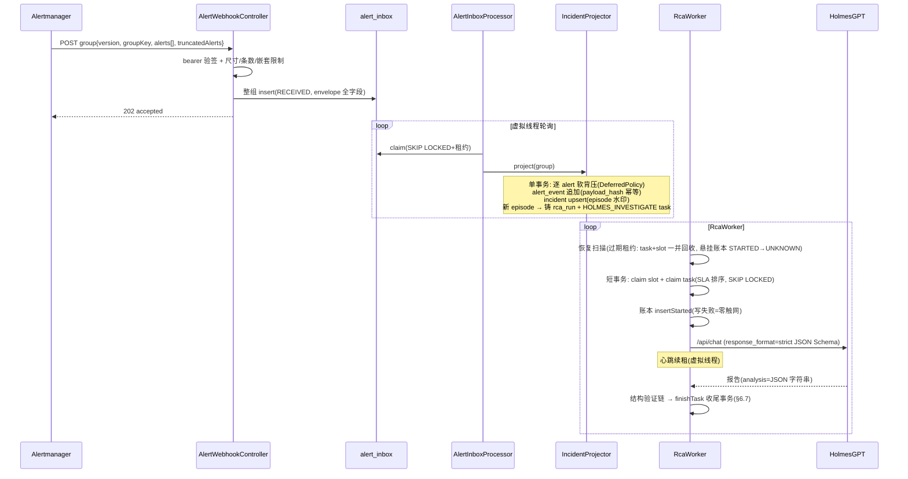
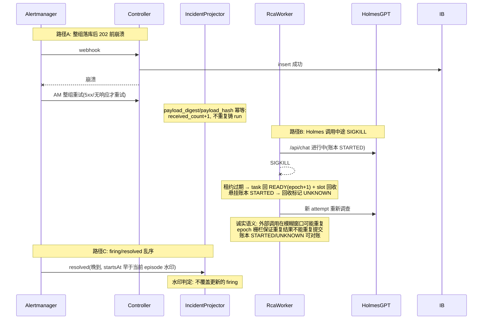
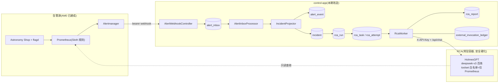

# 告警 AM1 告警控制面 —— 技术方案与任务拆解（v2.0）

> 文档信息：2026-09-04；状态 = **G1 有条件退回后修订（含评审声明一手核查），重新送审**。
> v1.1 评审处置：8 条必须修正项**全部采纳**（逐条处置见 §14）；Holmes 外部调用账本、EvidencePackage 结构验证、Holmes 安全配置三项提前到 AM1。
> 评审声明核查结果（2026-09-04 一手资料）：AM webhook 仅 5xx 可恢复、group 协议字段、Retry-After 不被 webhook notifier 读取（`notify/webhook/webhook.go` 主会话直查）；HolmesGPT 公开 API 无会话查询端点、`HOLMES_API_KEY`/`response_format strict` 官方支持、admin 端点无鉴权需网络层限制（`docs/reference/http-api.md` 主会话直查）——**全部属实，无驳回项**。
> 前置：AM0 部署验证已通过（路线 Go，证据在 195 `smoke-evidence/`）；`docs/告警-PROGRESS.md` 为进度总账。
> **本期全部 Java 实现**，落在 control-app 改造；不引入新中间件。

---

## 1. 核心问题

AM0 把告警链路建到了 Alertmanager → webhook → echo 替身。AM1 要解决：**告警进入 Java 控制面后，如何可靠完成"接收 → 聚合去重 → 排队调度 → RCA 调查 → 报告落库"全过程**，崩溃不丢、重投不重、洪峰不垮，且**数据模型为多 Agent 未来预留结构**。

四个子问题（v2.0 按评审修正）：

1. **入口可靠接收**：Alertmanager webhook 是**组协议**——一个 payload 含 `alerts[]`、可混合 critical/warning/resolved，带 `version/groupKey/truncatedAlerts`/逐条 fingerprint（`webhook.go` Message 结构体实锤）。HTTP 层只能整组应答：验签失败 401（不落库）、结构非法/超尺寸 400/413（AM 不重试 4xx）、DB 不可用 503（AM 仅对 5xx 整组重试）、整组持久化成功 202。**入口不做按条背压**。
2. **Incident 聚合**：fingerprint 是上游告警身份，incident_key 是业务关联身份（**不含 severity**，升级不裂单）；双哈希分离：`payload_hash`（去重）与 `investigation_hash`（材料性字段，决定是否值得重查）。firing/resolved 乱序用 episode 水印收敛。
3. **调度层**：rca_run → rca_task → rca_attempt 三级（与 PR 域 run/step/work_item/attempt 同构）；**同一 Incident 最多一个活跃 run**（部分唯一索引）；优先级 + **SLA 晋升**（deadline 越级，不用魔法分数）；并发控制用**可过期租约槽位表**（不用崩溃后泄漏的计数器）。
4. **RCA 编排**：control-app 调常驻 HolmesGPT（`/api/chat` + `response_format` strict JSON Schema）；**AM1 即建 external_invocation_ledger 外部调用账本**；报告经结构验证链后落库。

**AM1 明确不做**：通知出口（AM3）；交易业务语义（AM2）；语义级 Verifier/OPA（AM4+，本期只做结构验证）；多 Agent 并行（结构预留，本期只有一个 `HOLMES_INVESTIGATE` task）。
**范围变更（2026-09-04 用户指示）**："无用的类就删除，不留技术债"——v1.x 的"不动 GitHub/PR 链路、共存隔离"条款**作废**，PR review/GitHub/sandbox 死代码由 T00 彻底清除（§2.1），仓库从本里程碑起就是纯告警 Agent 项目。

---

## 2. 任务拆解

| 编号 | 任务 | 依赖 | 单项验收标准 |
|---|---|---|---|
| AM1-T00 | **死代码清除**（用户 2026-09-04 指示："无用的类就删除，不留技术债"；清单见 §2.1） | — | 全 reactor `clean verify` 绿；根 pom 只剩 shared-kernel + control-app；compose 无 broker/github-stub；无残留引用 |
| AM1-T01 | V7 迁移：告警域 **10 表**（含 v2.2 增补 rca_task_edge）+ 授权矩阵（§6.1 + §15） | T00 | `M7MigrationContractTest` 绿；grants 与 V3/V5 同构 |
| AM1-T02 | 告警域 domain：枚举 + 状态机（Incident 二态事实 / RcaRun / RcaTask / inbox decision 三分）+ 实体 + repository 端口 | T01 | 状态迁移反射穷举全绿；ArchUnit 零框架依赖 |
| AM1-T03 | Postgres 仓储 + PersistenceConfig 装配 + InMemoryStores fake（含约束模拟） | T02 | L2：并发 claim、upsert 幂等、slot 原子领取、唯一约束语义对齐 PG |
| AM1-T04 | 告警入口 `AlertWebhookController`：bearer 验签、**整组原子落库**（group envelope 全字段）、尺寸/数量/嵌套深度限制、四类状态码语义 | T03 | L3/L4：伪造签名/畸形/超大/超多条/DB 故障五路径 |
| AM1-T05 | `AlertInboxProcessor` + `IncidentProjector`：拆组 → alert_event 追加 → incident upsert（episode 水印乱序收敛）→ **逐 alert 软背压（DEFERRED）** → 铸 run+task | T04 | L3：混合 severity 组、firing/resolved 乱序、severity 升级不裂单、重复通知只累加 |
| AM1-T06 | `RcaWorker`：task+slot 同一短事务领取、SLA 排序、租约+心跳+崩溃回收（slot 随租约过期回收） | T05 | L2/L4：SLA 晋升断言、SIGKILL 后 slot 回收、旧 epoch 晚到写 0 行 |
| AM1-T07 | `HolmesClient` + `HolmesInvestigationExecutor` + `external_invocation_ledger` + EvidencePackage 结构验证链（§6.5） | T06 | L3/L4：WireMock Holmes 成功/超时/5xx/401/429/非法 JSON/超尺寸/usage 缺失各一条 |
| AM1-T08 | HolmesGPT 常驻容器 + 安全硬化（§6.6）：固定版本+digest、toolset 白名单只留 Prometheus、HOLMES_API_KEY、网络隔离；探测 server API 会话能力（**纯探索项**，不作正确性依赖） | AM0 环境 | 195 上 `/api/chat` 出结构验证通过的报告；安全七项逐项核对留证 |
| AM1-T09 | 启动自检（告警域）+ ArchUnit 新规则 | T04~T07 | 红绿验证留证 |
| AM1-T10 | 195 部署 + DP-B 部署门 + 整栈 E2E（flagd 真故障 → AM → control-app → Holmes → 报告） | 全部 | §12 矩阵全绿，证据归档；**SIGKILL/洪峰必须真栈跑**（InMemory/WireMock 不算数） |

依赖链：T00→T01→T02→T03→{T04→T05→T06→T07}→T09→T10；T08 与 T07 并行。

### 2.1 AM1-T00 死代码清除清单（用户指示的精确落点）

**原则**：git 历史 + m4-wip 分支已完整保留旧线，删除可恢复；**已部署的 Flyway 迁移文件（V1~V6）和 195 上的表不删不动**（迁移历史不可变），只删 Java 代码与构建/部署装配。

**删除（告警方向无用）**：

| 对象 | 范围 | 理由 |
|---|---|---|
| `sandbox-broker/` 模块 | 整模块 + 根 pom `<modules>` 移除 + compose 移除 broker 服务 | 告警域无不可信代码执行场景 |
| `publisher-app/` 模块 | 整模块 + 根 pom 移除 + compose 移除 publisher 服务 | GitHub 写出口整体作废；AM3 通知出口届时从 git 历史取 OutboxClaimer/FencedPublicationExecutor 骨架重建（登记 AM3 输入） |
| control-app PR/GitHub/review/sandbox 域 | `interfaces/webhook/`、`interfaces/sandbox/`、`infrastructure/github/`、`domain/model/`（PR 实体）、`domain/statemachine/`（PR 三机）、`domain/review/`、`domain/sandbox/`、`domain/repository/`（PR 端口）、`domain/service/`（PR 服务）、`application/`（ReviewOrchestrator/WorkItemWorker/InboxProcessor/PrStateReconciler/PrEventAuthoritativeReader/OutboxWriter/Repair*/Checkpoint*/Snapshot*/Sandbox*/LeaseHeartbeat）及对应 `infrastructure/persistence/` PR 仓储、全部 PR 线测试 | 被告警域取代或纯 PR 语义 |
| deploy 旧资产 | compose 移除 github-stub；`e2e-m2/m3/35-real.sh`、`bt-m2.sh`、`m2-lib.sh`、`m3-lib.sh`、`gh-api.sh`、`probe-sync-daemon.sh`、`deploy/wiremock/` | PR 线部署/测试装备 |
| shared-kernel PR 特化类 | `RevisionFence/RevisionFingerprint/FenceVerdict`、`TypedRead/WriteRequest`（若仅 PR 用）等 | 逐类核对引用后删 |

**保留（告警方向确定要用）**：`domain/ai/` + `application/ModelGateway` + `infrastructure/model/` + `M3ModelGatewayConfig`（AM4 Java 替换 HolmesGPT 时直接用）；`PersistenceConfig` 骨架；`infrastructure/selfcheck/` 模式（PR 特有断言改写为告警域）；`infrastructure/cas/`（报告 artifact 存储）；shared-kernel 通用件（`Digest(s)`/`RetryAfterParser`/`IllegalTransitionException`/`SafeTarExtractor`）；**`ExecutionLedger`/`ExecutionEventRepository`/`PostgresExecutionEventRepository`/`ModelCallContext`（v2.3 盘点后移入：ModelGateway 账本链路依赖，execution_event 表 NOT NULL FK 纠缠，蛮删会破坏保留件——AM4 换内核时一并泛化去 PR 语义，BA-11②）**。

**验收**：删除后全 reactor 绿（剩余测试 = 保留资产的测试 + 新增告警域测试）；`git grep` 无 `github/pr_/review_` 残留引用（迁移文件除外）；compose 起栈无已删服务。

---

## 3. 领域模型与类设计

包根 `com.objwww.pr.control.alert.*`（与 PR 域平级隔离）。

### 3.1 domain 层（`alert/domain/`）

| 类 | 职责 | 不做 |
|---|---|---|
| `model/AlertGroupEnvelope` | AM 组协议完整映射（version/receiver/groupKey/groupLabels/commonLabels/commonAnnotations/groupStatus/truncatedAlerts/payloadDigest） | 不拆条 |
| `model/AlertEvent` | 单条规范化告警（fingerprint/status/labels/annotations/startsAt/endsAt/payloadHash/investigationHash/generation） | 不做聚合判断 |
| `model/Incident` | 聚合态（incidentKey/status=FIRING\|RESOLVED/generation/receivedCount/distinctEventCount/notificationCount/currentRcaRunId/episode 水印） | **不含 INVESTIGATING/SUPPRESSED** |
| `model/RcaRun` | 一轮调查（incidentId+generation/status/modelRoute）；status = QUEUED/RUNNING/SUCCEEDED/PARTIAL/FAILED/CANCELLED | 不存报告正文 |
| `model/RcaTask` | 调度单元（runId/taskKey/priority/readySince/deadlineAt/availableAt/lease 三列/attempt） | 不含业务逻辑 |
| `model/RcaAttempt` | 物理执行尝试（leaseEpoch/终态/errorClass） | — |
| `model/RcaReport` | 报告元数据 + package jsonb + validationStatus | 不做语义验证（AM4） |
| `model/ExternalInvocation` | 外部调用账本条目（§6.5 字段） | 不决策（只记账） |
| `statemachine/IncidentStateMachine` | FIRING↔RESOLVED（配 generation 递增） | 不混入执行态 |
| `statemachine/RcaRunStateMachine` / `RcaTaskStateMachine` | 六态/六态迁移表 | — |
| `service/AlertIdentityFactory` | 纯函数：labels → fingerprint/incidentKey（不含 severity）/payloadHash/investigationHash | 不碰 DB |
| `service/SlaPolicy` | 纯函数：severity→priority + deadline 计算（critical 无 deadline=永远最前；warning/info 可配） | — |
| `service/DeferredPolicy` | 纯函数：投影期软背压判定（backlog 阈值 → immediate/deferred） | 不执行 SQL |
| `service/EvidencePackageValidator` | 结构验证链（尺寸/解析/JSON Schema/schema_version/字段限长/redaction） | 不做语义判断 |
| `repository/*`（9 端口） | 接口 + Javadoc SQL 语义契约 | — |

### 3.2 application 层（`alert/application/`）

| 类 | 职责 | 形态 |
|---|---|---|
| `AlertIntakeService` | 验签后整组落 inbox（单事务） | 普通类 |
| `AlertInboxProcessor` | inbox 六态消费循环 | 零注解虚拟线程 worker |
| `IncidentProjector` | event 追加 + incident upsert + run/task 铸造（单事务，§6.7 算法） | `@Transactional` 方法 |
| `RcaWorker` | slot+task 领取/执行/回收 | 零注解虚拟线程 worker |
| `RcaRunOrchestrator` | run 生命周期与 `finishTask` 收尾算法（§6.7） | `@Transactional` 方法 |

### 3.3 interfaces / infrastructure

- `AlertWebhookController`：`POST /webhooks/alertmanager`；状态码语义 = 401 验签失败 / 400·413 结构非法·超尺寸（AM 不重试 4xx）/ 503 仅 DB 不可用（AM 仅重试 5xx，`webhook.go` 实锤）/ 202 整组落库。
- `infrastructure/persistence/Postgres*Repository` × 9；`holmes/HolmesClient`（两层超时 + `HolmesErrorClassifier`：**429=可重试**、401/403=终态、5xx/超时=可重试）；`config/AlertFlowConfig`（`@Profile("docker")` 手工装配）；`selfcheck/AlertSelfCheck`。

---

## 4. 类交互时序图

### 4.1 主链路



### 4.2 崩溃/重投/乱序路径



---

## 5. 数据流与链路图



---

## 6. 具体实现方式

### 6.1 V7 迁移（**9 表**，`V7__am1_alert_domain.sql`；v1.1"六表实列七张"勘误一并修正）

| 表 | 关键设计 | 母本/依据 |
|---|---|---|
| `alert_inbox` | uuid PK + **group envelope 全字段**（version/receiver/group_key/group_labels/common_labels/common_annotations/group_status/truncated_alerts/payload_raw bytea/payload_digest）+ 六态 + 租约 + 退避 + `decision` 列（ACCEPTED/DEFERRED/SUPPRESSED，投影期填写） | webhook_inbox(V3) 形态 + AM webhook.go Message 结构体 |
| `alert_event` | 不可变追加：fingerprint（上游身份）/status/labels/annotations/startsAt/endsAt/**payload_hash**/**investigation_hash**/incident_id FK/generation；`uq(fingerprint, payload_hash, starts_at)` | Keep Alert（E-4）+ 评审双哈希拆分 |
| `incident` | `incident_key` 唯一（**alertname+service 等稳定标签，不含 severity**）+ status(FIRING/RESOLVED) + **generation**（resolved 后再 firing = 同身份新 episode，generation+1）+ received_count/distinct_event_count/notification_count（三计数分离）+ current_rca_run_id + episode 水印列 | Keep LastAlert（E-4）+ 评审 #2 |
| `rca_run` | incident FK + generation + 六态 + **部分唯一索引 `uq_rca_run_active_incident (incident_id) where state in ('QUEUED','RUNNING')`**——约束在 run 层，未来多 Agent 加 task 不动表结构 | 评审 #1；review_run 同构 |
| `rca_task` | run FK + `task_key`（本期唯一值 `HOLMES_INVESTIGATE`）+ `uq(run_id, task_key)` + 调度列（priority/ready_since/deadline_at/available_at/lease 三列/attempt_count/max_attempts）+ 六态 | work_item(V1) 形态 + 评审 #1 |
| `rca_attempt` | task FK + lease_epoch + 六态终态（STARTED/SUCCEEDED/FAILED_RETRYABLE/FAILED_TERMINAL/ABANDONED/STALE） | step_attempt(V1) |
| `rca_report` | run FK + package jsonb（六段式）+ raw_text + **validation_status**（STRUCTURE_VALIDATED/REJECTED_*）+ model/tokens(nullable)/usage_missing | 证据契约 + 评审结构验证 |
| `external_invocation_ledger` | invocation_id/run_id/task_id/attempt_id/lease_epoch + endpoint/request_digest/response_digest + 四态（STARTED/SUCCEEDED/FAILED/UNKNOWN）+ http_status/latency_ms + tokens 三列 nullable + usage_missing + holmes_version/model/toolset_version + 起止时间；`uq(invocation_id, call_seq)` | V5 model_call_ledger 形态（评审：账本盲区不得延期）；Holmes 无 Retry-After 概念，429 退避由我方分类器决策 |
| `scheduler_slot` | `scope/slot_no` 主键 + lease_owner/lease_until/lease_epoch——**固定槽位表**，领取与 task 领取同一短事务，崩溃随租约过期回收 | 评审 #6（替代会泄漏的 running 计数器） |

授权：`control_app` CRUD（alert_event 与 external_invocation_ledger 只 INSERT+SELECT，终态列走列级 UPDATE，照 V5）；`publisher_app` 显式 REVOKE。

### 6.2 优先级与 SLA 晋升（评审 #7，替换 v1.1 的错误 aging 公式）

- priority 沿用既有 `DESC` 约定：`critical=200 / warning=100 / info=0`
- **SLA 晋升**：`deadline_at = ready_since + sla(priority)`（critical=永不到期即永远最前；warning 默认 10min；info 默认 60min，`app.alert.sla.*` 可配）
- 领取排序（诚实语义 = "等待超 SLA 才允许越级"，不藏在分数里）：

```sql
ORDER BY (now() >= deadline_at) DESC, priority DESC, deadline_at, created_at, id
```

- 重试任务从 `ready_since`（重试置 READY 的时刻）起算 SLA，不从最初 `created_at`——避免退避结束立即插队
- **不保证零饿死**（严格优先与 SLA 晋升的固有权衡，显式承认）

### 6.3 入口幂等与双哈希

- `payload_hash` = sha256(规范化(labels + status + startsAt))——判"是否已处理过的同一条"
- `investigation_hash` = sha256(材料性字段子集：关键 labels + 静态 annotations)——判"材料是否变化、值不值得重查"；**不含动态数值 annotations**（否则数值抖动不断触发重查）
- inbox 层整组落库不去重；投影层：`payload_hash` 相同 → 仅 `received_count+1`；`investigation_hash` 变化且 incident 活跃 → 进入 rerun 判定（§6.7）

### 6.4 背压（评审 #3/#4 重写：整组可靠落库 + 逐 alert 软背压）

- **入口（HTTP 层）只有四种结果**：401 验签失败（不落库）/ 400·413 结构非法·超尺寸（不落库，AM 不重试 4xx）/ 503 仅当整组无法持久化（DB 故障；AM 仅对 5xx 重试——`webhook.go` 注释实锤 "5xx response codes are assumed to be recoverable"）/ 202 整组落库
- `Retry-After` 仅作提示——webhook notifier 调 `retrier.Check(statusCode, body)`，**根本不传响应头**，Retry-After 头不会被读取（`webhook.go` 主会话直查）
- **软背压在投影期**：`DeferredPolicy` 按 backlog（活跃 incident 数/排队 task 数，可配）对逐条 alert 判 immediate/deferred；deferred 的 inbox 行记 `decision=DEFERRED`（行本身即审计，**不另写 SUPPRESSED 放大洪峰**，评审 #4 选项一）；backlog 回落后由处理循环补投
- 入口尺寸限制（全部可配）：请求体最大字节、`alerts[]` 最大条数、单 label/annotation 长度与总长度、JSON 嵌套深度、gzip 解压后上限
- AM 侧配套：`webhook_configs: max_alerts: 100, timeout: 10s`（`webhook.go` 的 truncateAlerts/conf.Timeout 实锤存在）

### 6.5 HolmesGPT 接入（评审 #8 + 账本 + 结构验证，API 事实均已一手核查）

- 常驻容器：**固定版本与镜像 digest**（T08 第一个动作）；内存限额 1.5G
- 端点：百炼专属 MaaS 端点**必须带 `/v1`**（AM0 实测）；model 经 Holmes modelList 配置 `openai/deepseek-v3`（qwen-plus 该实例不可用，实测）
- **read-before-retry 降级为 T08 纯探索项**：官方 HTTP API 端点仅 `/api/chat`、`/api/model`、`/api/admin/reload*`、healthz/readyz，**无按会话查询已完成调查的接口**（http-api.md 主会话直查）——不作正确性依赖。诚实语义：**epoch 栅栏保证重复结果不能重复提交，不保证外部调用只发生一次；模糊窗口内的重复调用有账本可对账**
- **外部调用账本**：调用前 `insertStarted`（写失败=零触网）→ 终态 `SUCCEEDED/FAILED/UNKNOWN`（崩溃回收把悬挂 STARTED 标 UNKNOWN）；tokens 从 SSE `metadata.usage`（官方字段 prompt/completion/total_tokens）尽力解析，可空 + `usage_missing` 兜底
- **结构验证链**（AM1 边界 = 结构验证，语义验证归 AM4）：响应尺寸限制 → 解析 Holmes 外层响应 → 解析 `analysis` 内嵌 JSON 字符串 → **JSON Schema strict 校验（用官方 `response_format` 参数强约束输出——官方明确 "Always include strict: true"，不靠 prompt 乞求 JSON）** → schema_version 校验 → 字段数量/长度限制 → redaction 脱敏 → `validation_status=STRUCTURE_VALIDATED` 落库
- **报告引用字段政策修正**：允许安全的 `artifact_ref`（Prometheus 查询/dashboard 引用），禁止凭证与任意外链——替换 v1.1"全面禁 URL"的过度限制（AFT-A03 相应改写）

### 6.6 Holmes 安全配置显式化（T08 逐项核对留证；含官方文档新事实）

1. 显式关闭默认 toolsets，allowlist 只留 Prometheus（只读）；`enable_tool_approval=false`（server 模式非白名单工具自动转错误，官方默认行为）
2. 启用 `HOLMES_API_KEY`（官方支持 X-API-Key 或 Bearer 两种头）；control-app → Holmes 独立凭证
3. 网络策略：仅允许 control-app → Holmes → Prometheus/百炼端点（docker 网络隔离）；**官方明确 admin/reload 端点当前无鉴权，必须网络层封死**（http-api.md 原文提示）
4. Holmes 容器：无 docker.sock、无宿主目录挂载、无 K8s 权限、non-root、read_only rootfs（沿用 compose hardening 模板）
5. 告警 labels/annotations/日志一律按**不可信内容**处理（prompt injection 面，EX-A12 守）
6. raw response 入库前脱敏
7. token 控制红利：官方 `ENABLED_PROMPTS` env + `behavior_controls` 可裁剪 prompt 段落（降 token/降延迟），T08 评估启用

### 6.7 事务边界 + rerun/episode 收尾算法（评审 #5 落地）

- `IncidentProjector.project`：alert_event 追加 + incident upsert + run/task 铸造 = 单事务
- Holmes HTTP 调用在事务外（AFT-30 纪律沿用）；账本 STARTED 在调用前独立短事务
- **`RcaRunOrchestrator.finishTask` 收尾单事务**（固定算法）：

```text
lock task; requireCurrentLease(owner, epoch)
persistAttemptResult; markTaskTerminal; releaseSlot
lock incident
if incident.status == RESOLVED:            clearRerun; finishRun; return
if rerun 条件成立(investigation_hash 变化且未完成新调查):
    clearRerun; finishCurrentRun(SUCCEEDED);
    createNextRun(incident, generation+1); createTask(nextRun, HOLMES_INVESTIGATE)
else: finishRun
```

- **乱序策略**：episode 水印 = 当前 episode 起始时刻；晚到 resolved（startsAt < 水印）不覆盖更新的 firing；同 episode 内 resolved 后 firing 再现 → 同 incident generation+1 新 run
- 时间比较一律 DB `now()`/`make_interval`（I17 沿用）

---

## 7. 边界条件与不变量

### 强制不变量

| 编号 | 不变量 | 验证 |
|---|---|---|
| INV-AM1-1 | 未验签/结构非法请求零落库 | L3/L4 + 自检 |
| INV-AM1-2 | 同一 Incident 最多一个活跃 rca_run（部分唯一索引 DB 强制） | CT 并发 23505 实证 |
| INV-AM1-3 | 入口不静默吞：202=已持久化，503 仅 DB 故障=整组可重试；软背压必有 DEFERRED 审计轨迹 | L3 洪峰用例 |
| INV-AM1-4 | incident_key/payload_hash/investigation_hash 只含稳定标签；incident_key 不含 severity | L1 纯函数 + 审查 |
| INV-AM1-5 | alert_event、external_invocation_ledger 只增不改（终态列除外，列级授权） | IT 权限断言 |
| INV-AM1-6 | T00 后仓库无 PR/GitHub/sandbox 死代码残留（迁移文件与 195 存量表除外）；告警域不依赖任何已删类 | `git grep` 残留扫描 + 全 reactor 绿 |
| INV-AM1-7 | slot 与 task 的领取/归还/回收永远同事务或同租约周期，崩溃后双回收 | CT SIGKILL 用例 |
| INV-AM1-8 | 密钥（AGENT_MODEL_API_KEY/HOLMES_API_KEY/webhook bearer）与告警敏感内容永不落库落日志；raw 入库前脱敏 | 自检 + ArchUnit 字段扫描 + EX-A13 |

### 残余风险（诚实清单）

1. **Holmes 外部调用在模糊失败窗口可能重复**（无幂等键、无会话查询 API，已核实）——账本 STARTED/UNKNOWN 可对账，重复次数 max_attempts 封顶；read-before-retry 仅为 T08 探索项。
2. **SLA 参数（10min/60min）系自研判断**，无先例——风险是取值不当，可配置 + DP 观测修正。
3. **Holmes 账本粒度**：只记"我们发起的 /api/chat 调用"，Holmes 内部对百炼的多次模型调用不可见（token 从 SSE metadata 尽力解析）——全量模型账本待 AM3（P-12）。
4. **单 control-app 实例前提**；scheduler_slot 多实例安全但未实测。
5. **JSON Schema 与 Holmes 实际输出磨合**：strict 约束可能抬高调查失败率——T07 用真实场景调 schema，异常记 BUGLOG。
6. **Holmes admin 端点无鉴权**（官方现状）——靠网络隔离兜底；Holmes 版本升级后需复查此项。

---

## 8. 设计原因

- **数据模型三级化（run/task/attempt）**（评审 #1）：与 PR 域已验证结构同构，多 Agent 未来加 task 不动表结构；唯一活跃约束从 job 移到 run。
- **状态三分**（评审 #2）：告警事实（FIRING/RESOLVED）、RCA 执行（QUEUED…）、入口准入（ACCEPTED/DEFERRED/SUPPRESSED）是三件事，混在一起必然在"已 resolved 但 RCA 还在跑"时自相矛盾。
- **整组落库 + 软背压**（评审 #3/#4）：AM 组协议 + "仅 5xx 可恢复"源码事实决定 HTTP 层无法按条拒绝；503 只对 DB 故障——让 AM 的重试机制做它该做的，细粒度准入放投影期。
- **租约槽位替代计数器**（评审 #6）：running 计数器在 SIGKILL 后永久泄漏是算术必然；槽位表复用既有 epoch/心跳/过期回收机制（WorkItemWorker 已实证）。
- **SLA 晋升替代魔法分数**（评审 #7）：v1.1 的 aging 公式使"info 100 分钟后超过 critical"，自相矛盾；deadline 语义诚实且可配。
- **账本与结构验证提前**：与项目"全链路审计"基线一致；response_format strict 是 HolmesGPT 官方能力（已核实），比 prompt 约束可靠。
- **拒绝记录**：沿用 v1.1（Quartz/Redis/Kafka/Dapr/Temporal/中台再选型），理由不变。

---

## 9. 问题与压力点（→ AM2+ 输入）

| 编号 | 压力点 | 触发信号 |
|---|---|---|
| P-11 | Holmes pin 版本需人工跟踪 release | 安全补丁或功能需求出现时 |
| P-12 | Holmes 内部模型调用的全量账本（LiteLLM proxy 收口） | AM3 评测前 |
| P-13 | 通知出口缺失 | AM3 publisher 改造 |
| P-14 | 基础设施告警 ≠ 交易业务告警 | AM2 订单靶场立项 |
| P-15 | 多 Agent 并行（task_key 扩展、Agent 间依赖编排） | AM2/AM4 引入新 Agent 时 |
| P-16 | 报告 prompt/schema 工程质量 | DP-B03 命中率低时专项 |
| P-17 | Holmes 会话查询能力（若未来版本提供）可升级恢复语义 | T08 探索/版本升级复查时 |
| P-18 | Holmes admin 端点鉴权缺失（官方现状），靠网络隔离 | Holmes 升级后复查；暴露面变化时 |

---

## 10. 实际后果记录

- **本项目**：INC-42（隐藏默认值）→ Holmes 超时/重试/toolset 全部显式；v1.1 评审 8 条修正（aging 数学、quota 泄漏、AM 组语义等）记入"评审拦截缺陷"正向案例——方案期拦截成本 << 落码后返工。
- **同构前车之鉴**：Robusta 静默吞（E-3）→ INV-AM1-3；Keep 调度器 TODO（E-4）→ 调度核心必须落持久队列；夜莺 PG 缺陷（E-8）→ V7 契约测试守 SQL 漂移。

---

## 11. 技术债分析

- **若接受 v1.1 直接编码**：aging 公式错误（低优越级 critical）、quota 泄漏（崩溃后容量永久缩水直至为零）、AM 洪峰时入口 503 风暴 + SUPPRESSED 审计放大——三者都是上线后必然发作的结构性缺陷，返工成本 = 重写调度层 + 数据迁移，远超本次修订。
- **本方案自承认的债**：聚合/调度自研（中台未来可装时存在重复建设）；Holmes 内部模型账本粒度不足（P-12）；SLA 参数需实战调优；Holmes admin 端口靠网络隔离（P-18）。

---

## 12. 测试用例设计

### L0 静态架构（ArchUnit）
AFT-A01 告警 domain 零框架依赖；AFT-A02 告警域不引用 PR 写基础设施；AFT-A03 报告 schema 允许 artifact_ref、禁凭证与任意外链字段（反射扫描）；AFT-A04 HolmesClient/orchestrator 事务边界（外部调用不挂事务）；AFT-A05 账本仓储写表面封闭（照 AFT-26 范式）。

### L1 单元（纯逻辑）
UT-A01~04 四台状态机/决策枚举反射穷举；UT-A05 AlertIdentityFactory：标签顺序无关/瞬态剔除/**incident_key 不含 severity（升级不裂单）**/双哈希分离；UT-A06 SlaPolicy：deadline 计算、ready_since 起算、排序语义（到期越级/未到期严格优先）；UT-A07 DeferredPolicy 阈值三态；UT-A08 HolmesErrorClassifier：**429=可重试**、401/403=终态、5xx/超时=可重试；UT-A09 EvidencePackageValidator：合法/缺字段/超尺寸/schema 版本不符/含凭证字段。

### L2 组件规则（Testcontainers PG）
CT-A01 V7 迁移契约（9 表 + 授权）；CT-A02 task 并发 claim 互斥；CT-A03 `uq_rca_run_active_incident` 并发双铸 23505；CT-A04 slot+task 同事务领取原子性；CT-A05 slot 租约过期回收；CT-A06 incident upsert 幂等（payload_hash 重复只累加 received_count）；CT-A07 finishTask 并发：两 worker 收尾同一 task 只有一个生效（epoch 栅栏 0 行）；CT-A08 账本 STARTED 悬挂→UNKNOWN 回收。

### L3 业务场景闭环（InMemoryStores + WireMock Holmes）
ST-A01 firing→调查→报告→resolved 全生命周期；ST-A02 **混合 severity 单组**（critical+info+resolved 同组）整组落库逐条分流；ST-A03 `truncatedAlerts>0` 处理；ST-A04 firing/resolved 乱序（晚到 resolved 不覆盖新 firing）；ST-A05 RCA 运行中连续三次材料变化 → 只派生一个后续 run；ST-A06 rerun 收尾算法四分支；ST-A07 洪峰软背压：超限 alert 进 DEFERRED，入口始终 202；ST-A08 旧 epoch worker 晚到提交被拒。

### L4 边界异常
EX-A01 伪造 bearer→401 零落库；EX-A02 畸形 JSON→400；EX-A03 超大 body/超多条数/超长 annotation/超深嵌套/gzip 炸弹→413/400；EX-A04 Holmes 超时→FAILED_RETRYABLE 退避；EX-A05 Holmes 401→FAILED_TERMINAL；EX-A06 **Holmes 429→延迟重试且账本记录**；EX-A07 Holmes 200 但 JSON 非法/超尺寸/字段缺失/schema 版本不符→REJECTED_* 不入库；EX-A08 token usage 缺失→usage_missing=true；EX-A09 DB 故障→入口 503 整组可重试；EX-A10 alerts[] 空组→IGNORED；EX-A11 Holmes 5xx 耗尽→DEAD+事件落账；EX-A12 **annotation 含 prompt injection→按不可信数据处理**；EX-A13 密钥/敏感字段脱敏断言。

### L5 部署门（195 真栈，DP-B 系列）
DP-B01 全容器 healthy 含 Holmes 常驻（pin digest 断言）；DP-B02 自检探针通过；DP-B03 flagd 开 paymentFailure=50% → 10 分钟内 incident/rca_run/rca_report 落库且结构验证通过（报告提及 payment 方向人工核验）；DP-B04 恢复后 resolved 归并、无重复 run；DP-B05 **SIGKILL control-app（真进程）→ 重启后：无重复提交、无重复最终报告、slot/task 双回收、账本 STARTED→UNKNOWN 可对账；Holmes 外部调用在模糊窗口可能重复（诚实语义，账本佐证）**；DP-B06 内存 available ≥ 1G；DP-B07 端口公网零暴露；DP-B08 Holmes 网络隔离断言（含 admin 端点仅内网可达）；DP-B09 AM 洪峰注入（100 条/分 × 5 分钟）→ 入口零 5xx（除 DB 故障注入场景）、DEFERRED 审计完整、系统不垮。

---

## 13. 验收标准（DoD）

1. T01~T10 全部单项验收通过；L0~L5 全绿（SIGKILL/洪峰必须 195 真栈）；证据归档；
2. DP-B03 真故障全自动出报告；DP-B05 崩溃恢复诚实语义达成；DP-B09 洪峰不垮；
3. Holmes 安全配置（§6.6 七项）逐项核对留证；
4. ArchUnit 新规则红绿留证；OSS 证据清单增补 AM1 条目（AM webhook 协议/webhook.go 重试语义、Holmes http-api.md）；`docs/告警-PROGRESS.md` 同步；
5. T00 死代码清除验收通过（§2.1）：全 reactor `clean verify` 绿、无残留引用、compose 无已删服务。

---

## 14. 修订记录

| 日期 | 版本 | 变更 | 评审处置 |
|---|---|---|---|
| 2026-09-04 | v1.0 | 初稿送审 | — |
| 2026-09-04 | v1.1 | HolmesGPT 无幂等键三层防线 | 用户评审：8 条必须修正 + 三项提前，有条件退回 |
| 2026-09-04 | v2.0 | **评审声明一手核查**（AM webhook.go：仅 5xx 可恢复/Retry-After 头不被读取/group 协议字段实锤；Holmes http-api.md：无会话查询端点/HOLMES_API_KEY/response_format strict/admin 端点无鉴权——全部属实）。**8 条修正全部采纳**：① run/task/attempt 三级化，唯一活跃约束移至 run；② Incident/RCA/Admission 状态三分 + generation/episode；③ 入口整组原子落库 + 四类状态码 + AM 侧 max_alerts/timeout + 尺寸限制清单；④ 背压改投影期逐 alert DEFERRED，删除 SUPPRESSED 放大洪峰；⑤ finishTask 收尾事务算法 + episode 水印乱序策略；⑥ quota 计数器 → scheduler_slot 租约槽位表；⑦ aging 魔法分数 → SLA 晋升排序（deadline_at，重试从 ready_since 起算）；⑧ read-before-retry 降级为 T08 纯探索项，DP-B05 改诚实语义。**三项提前**：external_invocation_ledger 账本、EvidencePackage 结构验证链、Holmes 安全七项硬化（含 admin 端点无鉴权的网络封死、ENABLED_PROMPTS token 控制红利）。**数据/协议修正**：group envelope 全字段、incident_key 去 severity、双哈希分离、三计数语义、V7 表数勘误（9 表）、429 改可重试。**测试矩阵增补**评审列出的 14 类用例。AFT-A03 改为允许安全 artifact_ref。 | 全部采纳，重新送审 |
| 2026-09-04 | v2.1 | **用户指示"无用的类就删除，不留技术债"**：新增 T00 死代码清除（§2.1 精确清单：sandbox-broker/publisher-app 两模块整删、control-app PR/GitHub/review/sandbox 域全删、旧 deploy 装备删除；ModelGateway 体系/CAS/自检模式/shared-kernel 通用件保留并登记 AM3/AM4 用途）；§1 范围条款、INV-AM1-6、DoD-5 同步改写；依赖链改 T00 起手 | 用户指示采纳 |
| 2026-09-04 | v2.2 | **对齐架构基线 v2**（`docs/架构设计-告警Agent-v1.md` AA-14~26，外部调研经一手核查后采纳）：五项 G1 增补以"结构预留"落地——① V7 增 `rca_task_edge`（from/to/dependency_type，AM1 空表预留）→ 表数 9→**10**；② rca_task 增预留列（task_type/agent_profile/observed_generation/input_digest/output_artifact_ref/optional/max_total_duration/schema_version）；③ 四契约版本化（AgentResult/Claim/EvidencePackage/ReportPackage，schema_version 入列）；④ rca_report 状态链预留（DRAFT→STRUCTURE_VALIDATED→EVIDENCE_VALIDATED→PUBLISHED，AM1 只写到 STRUCTURE_VALIDATED）与六套生命周期枚举全集（AA-20，AM1 启用子集）；⑤ §6.8 新增线程与连接池预算表（AA-25，强制）；DP-B 部署门接入 E2E 证据契约（AA-26：截图非权威证据，须配 manifest+SHA-256）。审批体系（AA-19）与冲突裁决（AA-17）AM1 不实现（无写动作/单 task），仅冻结语义待 AM4 | 架构基线 v2 对齐，随 G1 复审一并确认 |
| 2026-09-04 | v2.3 | **代码盘点校准**（agent-64 全量盘点当前工作区）：① T00 保留清单增补 ExecutionLedger/ExecutionEventRepository/PostgresExecutionEventRepository/ModelCallContext（ModelGateway 依赖纠缠，BA-11②）；② 记录 V7 当前落码状态 = 9 表无 rca_task_edge 无预留列——**v2.2 的 10 表+预留列属未实施增量**，编码方二次回流时一并落码；③ 状态机接线问题移交 BA-11① 决策（三台状态机生产零调用：接线 or 删除，推荐接线）；④ AM1 告警域 IT 空套件列入二次回流硬指标（BA-09③） | 盘点事实采纳 |

---

## 15. v2.2 增补：线程与连接池预算（AA-25，强制执行）

| 执行资源 | 默认值 | 理由 |
|---|---:|---|
| Tomcat request threads | 16 | webhook 只验签/限长/写 inbox，不做 RCA |
| webhook 入口 bulkhead | 4 | 防洪峰耗尽 DB 连接 |
| inbox projector | 1 长驻虚拟线程 | DB 密集、顺序简单 |
| RCA dispatcher | 1 长驻虚拟线程 | 只 claim 不外调 |
| Agent 执行 | 每任务一个虚拟线程 | 外部 HTTP 阻塞型，便宜且易取消 |
| Holmes 全局 slot | 2（scheduler_slot scope=rca-holmes） | 保护模型额度/内存/心跳 |
| heartbeat | 每活跃任务一个虚拟线程，上限=slot | 心跳阻塞不互相影响 |
| HTTP client | 单例共享 | 禁每次调用新建 |
| Hikari max pool | 12 | 4 入口 + 2 执行收尾 + 2 心跳 + 2 投影恢复 + 2 余量 |

配置不变量：`heartbeatInterval ≤ leaseTTL/3`；`leaseTTL ≥ externalRequestTimeout + 2×heartbeatInterval`；`Holmes slot ≤ Hikari 余量`；**外部调用期间不持有 DB 事务/连接**。配置校验进启动自检（T09）。
