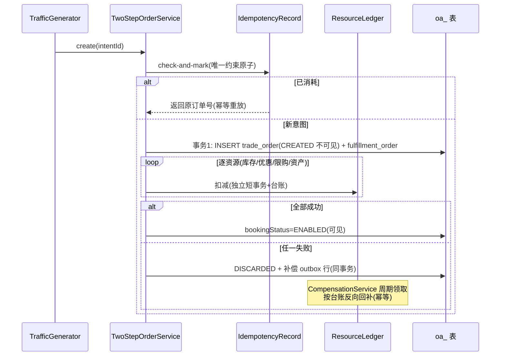
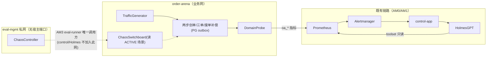

# 告警 AM2 交易域化（订单靶场 + 业务故障注入）—— 技术方案与任务拆解（v3.0 归一版）

> 文档信息：2026-09-04；状态 = **待 AM1 过 G2 后正式送 G1**。
> 本版为**规范归一版**：此前 v2.1 §15 补丁已全部合并进正文（任务表/类设计/时序图/不变量/测试/DoD 均为本版语义），不再存在"正文旧方案 + 附录新方案"的双轨。
> 关键修订来源：对照真实代码基线的评审（7 阻断项 + 5 项前置，全部采纳）；代码盘点（agent-64）。
> 前置：AM0 路线 Go；AM1 方案 v2.3；架构基线 `docs/架构设计-告警Agent-v1.md`（AA-1~26）。
> **AM1 上游能力以代码盘点为准**：V7 现落码 9 表、无 rca_task_edge/预留列（v2.2 增量属 AM1 二次回流任务，BA-09 清单）。AM2 不依赖该增量。

---

## 1. 核心问题

AM0/AM1 的告警是基础设施/链路层。本项目差异化在交易业务层：**订单卡中间态、状态机非法迁移、废单回补失败、幂等失效**——这些故障没有开源工具能注入，必须自研靶场。

AM2 解决三件事：

1. **自研订单靶场 `order-arena`**：两步创单（CREATE 不可见 → 资源扣减 → ENABLE 生效）、三张单（TradeOrder/RefundOrder/FulfillmentOrder）、废单补偿（PG outbox 驱动）、支付回调。
2. **业务故障注入 × 3**：幂等失效 / 状态回跳 / 超时结果未知；**开关状态以 DB `oa_chaos_session` 为唯一事实源**（fail-closed），每次注入同事务登记 ground truth。
3. **业务告警接入既有链路**：靶场业务指标（Gauge/Counter 双族）→ Prometheus → AM1 控制面 → HolmesGPT 报告；**scenario→report 显式映射**为 AM3 评测供料。

**AM2 明确不做**：8 类故障全做（本期 3 类）；语义验证（AM4）；通知出口（AM3）；靶场产品化；引入 Kafka/RabbitMQ（补偿走 PG outbox）。

---

## 2. 任务拆解

| 编号 | 任务 | 依赖 | 单项验收标准 |
|---|---|---|---|
| AM2-T01 | `order-arena` 模块骨架 + **部署形态落地**（§6.1：deploy/alert compose 冻结、AM0 手工配置回收、DB 角色与 schema） | AM1 G2 | 模块构建绿；容器 healthy（内存限额 512M）；`arena_app`/`eval_app` 角色与 schema 建库脚本落码且 195 可执行 |
| AM2-T02 | 订单域核心：两步创单 + 三单模型 + 废单补偿（PG outbox）+ 幂等记录（§6.2~6.4） | T01 | 状态机穷举全绿；L2 迁移契约；崩溃窗口补偿收敛 IT |
| AM2-T03 | 正常链路 API + 内置流量发生器（并发闸门见 §7.2 线程预算） | T02 | 下单/支付/取消全链路成功；流量速率可调 |
| AM2-T04 | **故障注入（含 ground truth，不可拆分）**：`oa_chaos_session` 权威开关 + ChaosController（eval-mgmt 私网）+ 3 类故障 + 激活事务（§6.5） | T02 | 注入点双条件限定；激活事务四约束过 DB；正常流量零污染；TTL 自动恢复 |
| AM2-T05 | 业务指标（Gauge/Counter 双族 + 探测去重）+ 告警规则接入既有链路（§6.6） | T03、AM1 | 注入后业务告警 firing 且进 control-app incident；恢复后 `*_current==0` |
| AM2-T06 | 端到端演练 ×3 + scenario→report 映射核验（§6.7） | T04、T05 | 3 份报告 + 映射表对照记录归档 |
| AM2-T07 | 部署门 DP-C + 文档收口 | 全部 | §12 矩阵全绿 |

依赖链：T01→T02→{T03，T04}→T05→T06→T07。

---

## 3. 领域模型与类设计（order-arena，包根 `com.objwww.pr.arena.*`）

### 3.1 domain 层

| 类 | 职责 | 不做 |
|---|---|---|
| `model/TradeOrder` | 交易单：bookingStatus（CREATED 不可见/ENABLED 生效/DISCARDED 废单）+ payStatus（NOT_PAY/PAID/REFUNDED） | 不做履约 |
| `model/RefundOrder` | 退款单：原因/责任方/金额/状态机 | — |
| `model/FulfillmentOrder` | 履约单：CONFIRMING/CONFIRMED/NO_ROOM/CANCELLED | — |
| `model/ResourceLedger` | 资源台账：库存/优惠/限购/资产的扣减与回补流水 | 不实现真实库存系统 |
| `model/IdempotencyRecord` | 幂等记录：`intent_id/state(NEW/PROCESSING/CONSUMED/EXPIRED)/owner/lease_until/result_order_id/response_digest/expires_at`——PROCESSING 崩溃不永久卡死 | — |
| `model/ChaosSession` | **故障场景权威状态**：`scenario_id(唯一)/fault_type/selector/ttl/operator/config_digest/state(PREPARED→ACTIVE→RECOVERING→CLOSED)/generation/created_at/expires_at` | 不在内存保存权威态 |
| `model/ScenarioMap` | scenario→report 映射：`scenario_id/fault_type/alert_fingerprint/incident_id/generation/run_id/report_id`（§6.7） | — |
| `statemachine/*`（4 台） | Booking/Refund/Fulfillment/Pay 迁移表 + IllegalTransitionException | — |
| `service/TwoStepOrderService` | 两步创单编排（§6.3） | 不含故障逻辑 |
| `service/CompensationService` | 废单补偿：**PG outbox 表 + 周期 claimer**（不引入 MQ） | — |
| `service/DomainProbe` | 业务事实巡检：周期探测产出 Gauge/Counter（含首次发现去重，§6.6） | 不发告警 |
| `service/F3ReconcileService` | F3 持久化状态机：`UNKNOWN → RECONCILING → ENABLED/DISCARDED`（重启可续） | — |

### 3.2 application / interfaces / infrastructure

- `application/ChaosSwitchboard`：注入判定 = **读"已提交且未过期的 ACTIVE 场景"**（DB 判定，fail-closed）；内存只作可丢缓存
- `application/TrafficGenerator`：内置流量发生器（虚拟线程；`live-` 正常流量 / `chaos-` 故障流量；并发闸门 §7.2）
- `interfaces/OrderController`：`POST /orders` / `GET /orders/{id}` / `POST /orders/{id}/pay` / `POST /orders/{id}/cancel`（业务网）
- `interfaces/ChaosController`：`POST /chaos/{faultType}/on|off`——**仅在 eval-mgmt 私网监听**，独立 `CHAOS_ADMIN_TOKEN`，请求绑定 `scenario_id/action_digest/expected_generation/TTL`（§6.5）
- `infrastructure/persistence/`：oa_* 仓储（JdbcClient 手工装配）

---

## 4. 类交互时序图

### 4.1 两步创单（正常 + 废单分支）



### 4.2 故障激活与 F3 注入

```mermaid
sequenceDiagram
    participant E as eval-runner(AM3)
    participant X as ChaosController(eval-mgmt 私网)
    participant DB as oa_chaos_session 等
    participant T as TwoStepOrderService
    participant P as DomainProbe
    participant Prom as Prometheus

    E->>X: on(F3, scenario_id, digest, generation, TTL) + CHAOS_ADMIN_TOKEN
    X->>DB: 单事务: INSERT ground_truth + INSERT chaos_session(ACTIVE) + INSERT chaos_event
    Note over DB: 约束: scenario_id 唯一 / 同 fault_type+target 最多一个 ACTIVE<br/>/ expires_at>created_at / ACTIVE 必须有 ground_truth
    T->>DB: 读 ACTIVE(F3, 未过期) → 命中 → ENABLE 前挂起
    Note over DB: 订单留 CREATED; 资源悬挂
    P->>Prom: oa_stuck_orders_current+1 / oa_stuck_orders_detected_total+1(首次去重)
    Note over Prom: 告警 → AM → control-app
    E->>X: off → CAS ACTIVE→RECOVERING→CLOSED
    Note over T: F3ReconcileService: UNKNOWN→RECONCILING→ENABLED/DISCARDED
```

---

## 5. 数据流与链路图



**权限边界（冻结）**：`ground_truth_scenario` 对 control-app/Holmes 不可见（无读权）；仅 `eval_app` 角色在报告封存后读取（防答案泄漏）。

---

## 6. 具体实现方式

### 6.1 部署形态（冻结，回应"deploy/alert 不存在"）

- **compose 分工**：`deploy/docker-compose.yml` = 数据面+控制面（postgres/migrate/control-app，及 AM3 的 notify-app）；**新建 `deploy/alert/docker-compose.yml`** = 告警源与执行面（prometheus/alertmanager/holmes/litellm/order-arena/eval-runner），为告警栈唯一事实源；两栈经共享 external network `alert-net` 互联；`eval-mgmt` 私网定义在 alert compose 内（仅 order-arena + eval-runner）
- **AM0 配置回收**：195 上 AM0 手工搭建的 prometheus 配置/alertmanager 配置/sloth 规则/holmes 自建镜像 Dockerfile，T01 全部回收进 `deploy/alert/` 并入 git（消除服务器与仓库漂移）
- **DB 角色与迁移所有权**（bootstrap owner 在 `deploy/db/01-roles.sh` 扩展）：

| 角色 | alert schema | arena 业务表 | ground_truth | notify_outbox(AM3) |
|---|---|---|---|---|
| control_app | RW | 无 | **禁止** | INSERT |
| arena_app | 禁止 | RW | RW | 禁止 |
| eval_app | SELECT | SELECT | SELECT | 禁止 |
| notify_app(AM3) | 报告摘要 SELECT | 禁止 | 禁止 | SELECT/UPDATE |
| HolmesGPT | 无 DB 凭证 | 无 DB 凭证 | 禁止 | 禁止 |

迁移路径：`control-app/db/migration`（control 域）+ `order-arena/db/migration`（arena 域 V1 起）；权限矩阵进迁移契约测试与启动自检。

### 6.2 幂等机制（F1 注入对象）

【参照】Stripe Idempotency-Key + Temporal 官方幂等实践（check-and-mark 原子化、唯一约束同事务）。【实现】`IdempotencyRecord`：`intent_id` 唯一 + NEW→PROCESSING→CONSUMED/EXPIRED + `owner/lease_until`（崩溃回收）+ `result_order_id/response_digest`（重放返回原结果）。F1 注入 = 对 chaos- 流量跳过该机制。

### 6.3 两步创单事务边界

【参照】用户交易知识库两步创单模型 + Saga 补偿（microservices.io/Garcia-Molina）。【实现】CREATE（订单+履约单）单事务 → 逐资源独立短事务扣减（台账逐笔）→ ENABLE 单事务；失败 = DISCARDED + **补偿 outbox 行同事务写入**，`CompensationService` 周期 claimer 领取、按台账严格反向回补、回补幂等（台账有 refund 记录即跳过）。【注意】CREATED 订单对查询接口不可见。

### 6.4 多维状态机与 F2

【参照】用户 TFrame 多维状态机 + 本仓 shared-kernel 显式迁移表范式（拒 Spring StateMachine，过重）。F2 注入 = chaos 流量上绕过状态机直接 UPDATE 状态字段（模拟"setter 直改状态"事故源）；DomainProbe 独立校验"状态 × 台账事实"合法性（如 PAID 但无支付台账）产出违规发现（不用状态机验证状态机，防循环论证）。

### 6.5 Chaos 开关（DB 权威，fail-closed）

【参照】Chaos Mesh selector 思想（平移为 correlation 前缀匹配）+ flagd 实践；Spring 事务资源同步官方说明（内存状态不随 DB 回滚——v2.0 内存开关因此作废）。

- **权威态**：`oa_chaos_session`（§3.1）；开关内存缓存可丢，重启后扫描悬挂/过期场景**默认恢复关闭 + 审计**
- **激活事务（精确）**：单事务内 `INSERT ground_truth + INSERT/UPDATE chaos_session→ACTIVE + INSERT chaos_event`，COMMIT 后业务注入点才可见 ACTIVE
- **DB 约束**：`scenario_id` 唯一；同一 fault_type+target 最多一个 ACTIVE（部分唯一索引）；`expires_at > created_at`；ACTIVE 必须存在 ground truth（FK 或断言触发器）；状态迁移用 `state + generation` CAS
- **TTL 自动恢复**：过期场景由扫描器转 RECOVERING→CLOSED——测试进程崩溃不留永久故障

### 6.6 业务指标（Gauge/Counter 双族 + 探测去重）

【参照】Prometheus 官方 metric types（Counter 单调增，当前状态必须 Gauge）。

- 当前状态 Gauge：`oa_stuck_orders_current` / `oa_duplicate_orders_current` / `oa_illegal_transitions_current`——**恢复验收查 `*_current == 0`**
- 累计发现 Counter：`oa_*_detected_total`——只增，统计用 `increase(...[窗口])`，不要求归零
- **DomainProbe 首次发现去重**：去重键 `(finding_type, entity_id, violation_digest)`（唯一约束/周期去重表），同一坏数据不重复计数
- 探测产出而非注入点自报（INV-AM2-5）；标签只放稳定维度防高基数；告警规则少量手写纳版本管理（Sloth 只适用请求类 SLI，诚实承认）

### 6.7 scenario→report 映射与 ground truth

- `ScenarioMap` 显式登记 `scenario_id→fault_type→alert_fingerprint→incident_id/generation→run_id→report_id`（**禁止靠时间窗猜归属**）；fingerprint 由 alert 规则稳定标签推导，incident/run/report id 由 eval-runner 在报告封存后回填（经 eval_app 只读 + control-app 提供的只读查询接口）
- `ground_truth_scenario` 与登记同事务（§6.5）；expected_root_cause 结构化（component/fault_type/reason_code + 同义词白名单）；时间窗用 DB now()
- 每类故障的"恢复确认"= Gauge 归零 + 无残留 firing + 补偿台账清平

### 6.8 内存预算

靶场限额 512M（含内嵌流量发生器，无 locust/k6 新容器）；195 水位以 DP-C 断言复核（AM1 Holmes 常驻后重测）。

---

## 7. 边界条件与不变量

### 7.1 强制不变量

| 编号 | 不变量 | 验证 |
|---|---|---|
| INV-AM2-1 | 故障注入只对 `chaos-` 前缀 correlation 生效；正常流量零污染 | L3 对照用例 |
| INV-AM2-2 | 注入 = DB ACTIVE 场景存在（fail-closed）；无 ACTIVE 行 = 不注入 | IT + DB 约束断言 |
| INV-AM2-3 | 靶场与 control-app 零共享表；单 PG 实例分 schema/role（§6.1 矩阵） | 迁移契约 + 自检 |
| INV-AM2-4 | 注入可恢复：off/TTL 后 `*_current==0`、回补清平、无残留 firing | E2E 断言 |
| INV-AM2-5 | 故障事实由 DomainProbe 探测发现，禁止注入点自报指标 | 代码审查 |
| INV-AM2-6 | ground truth 对 control-app/Holmes 不可见；仅 eval_app 报告封存后读取 | 权限 IT + 自检 |
| INV-AM2-7 | chaos 活跃场景 ≤ 1（同 fault_type+target 唯一 ACTIVE，DB 强制） | 并发 IT 23505 |

### 7.2 线程与资源预算（AA-25 对齐）

| 资源 | 默认值 | 理由 |
|---|---:|---|
| TrafficGenerator 并发 | 4（Semaphore 闸门，非线程池大小） | ≤ arena Hikari 余量；虚拟线程一任务一线程（JEP 444，不做固定池） |
| DomainProbe | 单线程周期 30s | 探测低频、顺序简单 |
| chaos 活跃场景 | 1 | 防并发故障互相污染（§6.5 DB 强制） |
| CompensationService claimer | 1 长驻虚拟线程 | 单写者保序 |
| arena Hikari max | 8 | 4 流量 + 2 探测补偿 + 2 余量 |
| 外部调用（ChaosController） | 不持 DB 事务 | AFT-30 同源纪律 |

### 7.3 残余风险（诚实清单）

① 单进程模拟，分布式真实度有限（Holmes 根因颗粒度受指标设计天花板限制）；② Holmes 无交易领域知识，命中率可能很低——AM3 评测对象而非 AM2 缺陷；③ 阈值型告警延迟分钟级，演示节奏按此设计；④ eval-mgmt 私网方案在 195 旧内核的 docker 26 上需 T01 实测（理论无新内核依赖）。

---

## 8. 设计原因（对照表）

| 决策 | 参照 | 为什么 | 代价 |
|---|---|---|---|
| 自研靶场 | 调研：OTel Demo 无订单状态机 | 面试知识体系代码化；差异化 | 开发量最大 |
| Chaos 开关 DB 权威 | Spring tx-resource-sync 官方说明 | 内存态无法与 DB 同事务，fail-closed 只能靠 DB | 多一次 DB 读写 |
| eval-mgmt 私网 | Docker 网络命名空间官方语义 | 容器 loopback 隔离，127.0.0.1 方案根本不成立 | 多一个网络 + token 管理面 |
| Gauge/Counter 双族 | Prometheus 官方 metric types | Counter 不能要求归零 | 指标数量翻倍 |
| 补偿 PG outbox | Eventuate/Debezium outbox + 本仓 outbox 范式 | 小体量不引入 MQ | 需自研 claimer（模式现成） |
| 幂等键模式 | Stripe/Temporal 官方实践 | 业界标准答案 | 单库实现弱于生产多级 |
| 探测发现非自报 | 评测可信度第一性 | 防"故障自首"作弊 | 探测延迟分钟级 |
| scenario 显式映射 | 评测归属正确性 | 时间窗猜测会错配 | 多一张映射表维护 |

## 9. 问题与压力点（→ AM3/AM4 输入）

| 编号 | 压力点 | 触发信号 |
|---|---|---|
| P-21 | Holmes 无交易领域知识，命中率存疑 | AM3 首批评测报告 |
| P-22 | 3 类故障覆盖不足（对账差异/数据损坏/事务部分提交/消息乱序待扩） | AM3 评测稳定后 |
| P-23 | OTel Demo 与 order-arena 双靶场并存 | AM3 后评估下线 Demo 省内存 |
| P-24 | 指标证据面天花板 | 命中率受限时评估给 Holmes 加日志/靶场只读 API |

## 10. 实际后果记录

- AM0 实证：基础设施链路通但"订单卡住"不可见——AM2 必要性实证。
- v2.0 内存开关 + 同事务登记的自相矛盾（评审拦截）：POJO 内存不随 DB 回滚——**方案期拦截，未落码**。
- v2.0 的 127.0.0.1 ChaosController 方案（评审拦截）：容器网络命名空间隔离——若落码则 M3 联调必败。
- AM1 双轴审查"完工无实证"教训：本版每任务带单项验收 + 测试编号。

## 11. 技术债分析

- 不做靶场直接评测：RCA 永远只讲"CPU 高了"，交易故事归零。
- Chaos 开关若图省事用内存版：fail-closed 是空话，评测 ground truth 完整性失去根基，事后 DB 化 = 重写注入框架。
- 自认的债：单进程模拟；阈值待校准；ScenarioMap 回填依赖 eval-runner 实现（AM3）。

## 12. 测试用例设计

- **L0**：arena domain 零框架依赖（ArchUnit）；故障注入类不在 live 调用链（源码扫描）；指标标签无高基数字段
- **L1**：4 台状态机反射穷举；ChaosSwitchboard ACTIVE 判定矩阵（过期/未提交/命中/未命中）；补偿顺序/幂等纯函数；DomainProbe 去重键各分支；F3 状态机迁移穷举
- **L2**（Testcontainers PG）：arena 迁移契约（含 §6.5 四 DB 约束实测）；两步创单三崩溃窗口补偿收敛；幂等唯一约束 23505；IdempotencyRecord 租约过期回收；chaos 激活事务（ground truth 缺失则 ACTIVE 不可见）；同 fault_type+target 双 ACTIVE 并发 23505
- **L3**：F1/F2/F3 注入→指标→自愈全链；live/chaos 并行零污染；取消/退款正常链（BUYER/SUPPLIER 责任分支）；TTL 到期自动关闭
- **L4**：注入中途容器重启（开关默认关 + 悬挂台账对账收敛 + F3 RECONCILING 续跑）；ChaosController 无 token/错 digest/错 generation → 拒绝且不产生任何写入；非 eval-mgmt 网络成员访问管理端口 → 不可达
- **L5**（195 DP-C）：C01 arena healthy + 内存水位；C02 正常流量下单成功；C03 三类故障各注入一次 → 告警 firing → incident → Holmes 报告归档；C04 复原后 `*_current==0` 且无残留 firing；C05 scenario→report 映射回填核验；C06 注入中 SIGKILL arena → 重启后对账收敛；C07 ground truth 权限断言（control_app 角色 SELECT ground_truth 必败）

## 13. 验收标准（DoD）

1. T01~T07 全过；L0~L5 全绿（195 真栈 DP-C）
2. 三类业务故障端到端全自动；scenario→report 映射落档
3. INV-AM2-1/2/5/6/7 全部实证（fail-closed 与 GT 权限是硬指标）
4. AM0 手工配置回收进 `deploy/alert/` 并入 git；`01-roles.sh` 角色扩展在 195 执行成功
5. 证据归档；文档三件套同步；**AM1 G2 已通过**（动工硬前提）

## 14. 修订记录

| 日期 | 版本 | 变更 | 评审处置 |
|---|---|---|---|
| 2026-09-04 | v1.0 | 草稿 | — |
| 2026-09-04 | v2.0 | 详细版（每设计点带参照/思路/弊端/注意） | 待 G1 |
| 2026-09-04 | v2.1 | 对照代码基线评审 7 阻断项采纳（§15 补丁形式） | 评审：补丁与正文双轨不可接受 |
| 2026-09-04 | v3.0 | **规范归一**：v2.1 §15 全部合入正文（任务表 T06 并入 T04、ChaosSession DB 权威 + 激活事务四约束、eval-mgmt 私网、Gauge/Counter 双族、补偿 PG outbox、幂等记录全字段、scenario 显式映射、GT 权限矩阵、F3 状态机、线程预算）；**部署形态冻结**（deploy/alert 新建 + AM0 配置回收 + DB 角色/迁移所有权矩阵）；测试与 DoD 同步改写 | 待 AM1 G2 后送 G1 |
