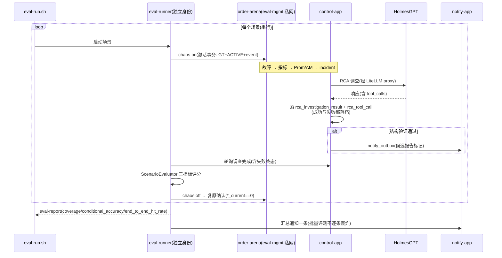
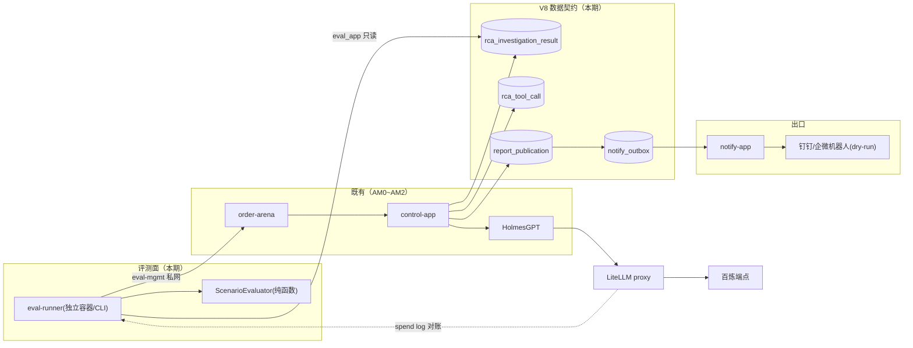

# 告警 AM3 评测与通知出口 —— 技术方案与任务拆解（v3.0 归一版）

> 文档信息：2026-09-04；状态 = **待 AM2 过 G2 后正式送 G1**。
> 本版为**规范归一版**：此前 v2.1 §15 补丁已全部合并进正文，无双轨语义。
> 关键修订来源：对照真实代码基线的两轮评审（全部采纳）；代码盘点（agent-64，含"v1 全自由文本"描述的校正——实际为六段式结构 schema，缺类型化字段）。
> 前置：AM0（链路 Go）、AM1 v2.3（控制面）、AM2 v3.0（靶场 + ground truth + eval-mgmt 私网 + DB 角色矩阵）；架构基线 `docs/架构设计-告警Agent-v1.md`。
> **AM1 上游能力以代码盘点为准**：当前 EvidencePackageValidator 为六段式 schema v1（有结构、无类型化 root_cause/claims）；验证失败零落档；rca_report 权限三角矛盾（BA-10）。AM3 的数据契约（§6.2/§6.3）为 V8 新增迁移，不假设 AM1 v2.2 增量已落码。

---

## 1. 核心问题

AM2 结束后系统能"出报告"，但两个价值问题未解：

1. **报告准不准？** 把"故障自己注入、ground truth 已知"变成**量化准确率**：批量注入 → 收集**全部调查记录（含失败）**→ 确定性规则对照 → 三个互不混淆的指标（§6.4）。同时暴露 HolmesGPT"无数据也出结论"的已知缺陷，为 AM4 替换提供量化正当性。
2. **报告给谁看？** 通知出口（notify-app）：报告完成 → IM 群通知（**at-least-once 诚实语义**，§6.5）。

附带收口：P-12 账本盲区——Holmes 模型调用经 LiteLLM proxy 进百炼，**一对多聚合对账**（§6.6）。

**AM3 明确不做**：语义级 Verifier（AM4）；多 Agent（AM4+）；学术 benchmark；LLM-as-judge（拒绝，§6.4）；自动切回直连百炼（fail-closed，§6.6）。

---

## 2. 任务拆解

| 编号 | 任务 | 依赖 | 单项验收标准 |
|---|---|---|---|
| AM3-T01 | **V8 迁移 + 数据契约落码**：`rca_investigation_result` + `rca_tool_call` + `report_publication` + `notify_outbox`（§6.2 冻结 DDL 语义）；rca_report 权限三角矛盾消解（报告不可变，自检改为只查 SELECT/INSERT，BA-10） | AM2 G2 | V8 契约测试绿；BA-10② 关闭 |
| AM3-T02 | **EvidencePackage v2**（类型化 root_cause/claims，v1 解析器保留双版本路由）+ **失败调查落档**（每次 attempt 产生 rca_investigation_result，含验证失败）+ **tool_calls 提取落表** | T01 | v2 schema 验证链全绿；REJECTED_* 调查有完整落档记录（含脱敏原文/digest）；HolmesClient 提取 tool_calls 入 rca_tool_call |
| AM3-T03 | 评测器：确定性评分（三指标 §6.4）+ EvalRunService/eval-runner（独立身份 + eval-mgmt 私网） | T02 | 评分矩阵单测穷举全绿；eval-runner 非 control-app 生产 Bean |
| AM3-T04 | notify-app：通知 outbox + claimer + 渠道 handler（渲染白名单 + at-least-once 语义 §6.5） | T02 | 报告触发 → 通知到达测试机器人（dry-run）；崩溃重发可检测可审计 |
| AM3-T05 | LiteLLM proxy 收口（§6.6）+ **T04 feasibility spike**（Holmes metadata 透传能力） | — | 一对多对账三态出账；spike 结论留档；fail-closed + break-glass 演练 |
| AM3-T06 | 批量评测 `eval-run.sh`（5 场景 §6.7，串行 + 复原确认）→ **准确率报告** | T03、T05 | 一键产出 eval-report（三指标 + 配置版本 + 失败案例原文） |
| AM3-T07 | 部署门 DP-D + 文档收口（架构设计升版） | 全部 | §12 全绿；证据归档 |

依赖链：T01→T02→{T03，T04}→T06；T05 与 T03/T04 并行；T07 收尾。

---

## 3. 类设计

### 3.1 control-app 侧（评测器 + 报告契约扩展）

| 类 | 职责 | 不做 |
|---|---|---|
| `domain/model/InvestigationResult` | 每次 Holmes attempt 的完整记录（含失败）：验证状态/错误链/脱敏原文或 CAS digest/usage/模型信息 | 不做评分 |
| `domain/model/RcaToolCall` | Holmes 响应 tool_calls 落表条目（silence_penalty 数据源） | — |
| `domain/service/EvidencePackageValidator`（v2 扩展） | 双版本路由：v1 六段式（保留）/ v2 类型化（root_cause{component,fault_type,reason_code} + claims[]{claim_type,status,component,fault_type,symptom_codes,evidence_refs}） | 不原地改 v1 含义 |
| `application/eval/ScenarioEvaluator` | 单场景对照评分（**纯函数**，三指标 §6.4） | 不调 LLM、不碰 DB |
| `application/eval/EvalRunService` | 批量编排（**独立 eval profile 装配**，非生产默认 Bean；经 eval-mgmt 私网调 ChaosController） | 不长持 chaos 权限于生产 profile |
| `application/ReportCompletedNotifier` | 报告触发条件判定（§6.5 触发点冻结）+ 写 notify_outbox（同事务） | 不发通知本体 |

### 3.2 notify-app（新模块，`com.objwww.pr.notify.*`）

| 类 | 职责 |
|---|---|
| `NotifyApplication` | 启动类（单 worker） |
| `application/NotifyOutboxClaimer` | SKIP LOCKED 串行领取 + 租约 + epoch 栅栏（旧 publisher 骨架，git 历史取） |
| `domain/service/FencedNotifyExecutor` | 栅栏包裹的发送执行器；429 读渠道提示持久化退避**不占 worker 槽** |
| `domain/handler/DingTalkHandler` / `WeComHandler` | 渠道适配（加签/限流）；**字段白名单渲染**（禁 raw report；处理 Markdown 链接/@all/控制字符/超长/秘密值） |

---

## 4. 时序图（批量评测主链路）



---

## 5. 数据流与链路图



---

## 6. 具体实现方式

### 6.1 部署形态与迁移所有权

- compose：notify-app 入 `deploy/docker-compose.yml`（控制面栈）；eval-runner 入 `deploy/alert/docker-compose.yml`（AM2 冻结的告警栈）并加入 eval-mgmt 私网
- **V8 迁移**（control-app `db/migration/V8__am3_eval_notify.sql`）：`rca_investigation_result` + `rca_tool_call` + `report_publication` + `notify_outbox` + 授权（角色矩阵见 AM2 §6.1；eval_app/notify_app 角色由 AM2-T01 的 01-roles.sh 扩展先行创建）

### 6.2 调查记录契约（冻结 DDL 语义——评分器与对账的稳定数据源）

```sql
rca_investigation_result (
  id uuid PK,
  attempt_id uuid UNIQUE NOT NULL,        -- 幂等锚：一 attempt 一记录
  run_id uuid NOT NULL,
  schema_version int NOT NULL,
  validation_status varchar(32) NOT NULL, -- STRUCTURE_VALIDATED / REJECTED_*
  validation_errors jsonb,
  package_json jsonb,                     -- 验证失败允许 NULL
  raw_artifact_ref text,                  -- CAS 引用
  raw_digest char(64),                    -- 原文 SHA-256（脱敏前）
  model text,
  usage_json jsonb,                       -- usage_missing 时为空
  created_at timestamptz NOT NULL
) -- 只增不改（终态列除外）；control_app INSERT+SELECT

rca_tool_call (
  investigation_result_id uuid NOT NULL REFERENCES rca_investigation_result(id),
  tool_call_id text NOT NULL,
  sequence_no int NOT NULL,
  tool_name text NOT NULL,
  status varchar(16),
  params_digest char(64),
  result_digest char(64),
  started_at timestamptz, finished_at timestamptz,
  UNIQUE(investigation_result_id, tool_call_id)
) -- 只增不改
```

- **每次 attempt 必落**（成功与 REJECTED_* 同权）——验证失败不再是"零落档误判超时"
- 只有 STRUCTURE_VALIDATED 的记录才进入可发布 `RcaReport`（rca_report 保持不可变 INSERT/SELECT；发布状态走 `report_publication`，**notify-app 不得改报告正文**——BA-10② 关闭路径）

### 6.3 EvidencePackage v2

- v2 schema：`root_cause{component, fault_type, reason_code}` + `claims[]{claim_type, status(TRUE|FALSE|UNKNOWN), component, fault_type, symptom_codes[], evidence_refs[]}`
- v1 解析器保留；按 schema_version 路由；v2 的类型化字段是评分器"枚举等值+同义词表"的落点（v1 自由文本不做评分输入）
- 可行性：Holmes `/api/chat` 官方 strict response_format（E-12）

### 6.4 评分：三个互不混淆的指标（冻结公式，跨批次可比）

【决策】确定性规则，**拒绝 LLM-as-judge**（循环论证 + 引入新不确定性）。

```text
coverage             = 给出可判定根因的场景数 / 总场景数
conditional_accuracy = 根因正确的场景数 / 给出可判定根因的场景数
end_to_end_hit_rate  = 根因正确的场景数 / 总场景数
```

- **UNRESOLVED**（谨慎拒答）：coverage 中算未覆盖；不进 conditional_accuracy 分母；end_to_end 中自然未命中；**单独报告"合理拒答率"**——可区分"乱猜高覆盖"与"谨慎高准确"（AM4 Holmes vs 自研对照的关键）
- **结构失败（REJECTED_*）**：计 0 分入总场景分母（明确失败，非超时）；**缺席报告/轮询超时**：单独标注，不混入结构失败
- 维度（单场景内）：root_cause_hit（类型化字段等值 + 版本化同义词白名单）、symptom_coverage、latency_ms、silence_penalty（**tool_calls 为空且 claims 非空** = 无证据出结论，数据源 = rca_tool_call + package）
- 首批评测**全量人工复核**校准同义词表，规则迭代稳定后才信机器分

### 6.5 通知出口（at-least-once 诚实语义）

【参照】旧 publisher outbox 骨架（SKIP LOCKED/epoch 栅栏/单触网执行者）+ AWS Transactional Outbox 官方（relay 可能重复，消费端幂等）。

- **语义冻结（INV-AM3-2）**：本地命令不丢、同一时刻单执行者、至少一次发送；重复可检测（文案带 operation_id）可审计；**群机器人无服务端幂等，不承诺 exactly/effectively once**
- **触发点冻结**：`STRUCTURE_VALIDATED` 即触发（EVIDENCE_VALIDATED 属 AM4），**文案必须标记"AI 候选结论，未完成证据语义验证"**——不使用模糊"报告完成"
- `notify_outbox` 唯一键 = `(report_id, channel, template_version)`（不靠随机 UUID 防重）
- 渲染字段白名单；渠道 429 读 Retry-After 持久化退避不占槽；批量评测默认 dry-run/测试机器人 + 结束一条汇总

### 6.6 LiteLLM proxy 收口（一对多对账）

- compose 增 litellm 容器（ghcr 镜像——crane 摆渡预案 BA-01）；Holmes `OPENAI_API_BASE` 指 proxy
- **对账基数**：1 次 control→Holmes `/api/chat` 对应 N 次 Holmes→LiteLLM 模型调用——按**一对多聚合**，比较 `sum(prompt/completion tokens)`，三态 `MATCHED/PARTIAL/UNMATCHED`，允许 usage missing，**不比较行数相等**
- **T04 feasibility spike**：Holmes 能否向 LiteLLM 透传稳定 `run_id/task_id/attempt_id/invocation_id`（LiteLLM 支持自定义 metadata 与按 request_id 查 spend log；Holmes 透传能力未证实，**spike 结论先于对账实现**）
- **降级改 fail-closed + 人工 break-glass**（带审计与有效期）——自动切回直连会绕过代理账本
- proxy 日志含请求内容：卷权限 600 + 留存期限制

### 6.7 批量评测场景（首批 5 个，枚举写死）

| # | 场景 | 故障源 | 类型 |
|---|---|---|---|
| S1 | paymentFailure=50% | AM0 flagd | 业务链路错误率 |
| S2 | docker kill payment | AM0 基础设施 | 依赖不可达 |
| S3 | F1 幂等失效 | AM2 靶场 | 业务完整性 |
| S4 | F2 状态回跳 | AM2 靶场 | 状态机非法迁移 |
| S5 | F3 超时结果未知 | AM2 靶场 | 中间态悬挂 |

串行执行、复原确认（`*_current==0` + 无残留 firing）后才进下一场景；每场景 2 轮取稳定性。

### 6.8 线程与资源预算（AA-25 对齐）

| 资源 | 默认值 | 理由 |
|---|---:|---|
| eval 场景并发 | 1 | 场景间零污染（旧线 E2E-48 教训） |
| chaos 活跃场景 | 1 | AM2 DB 强制 |
| notify worker | 1 串行 | ≤ 渠道限流预算（钉钉约 20 条/分） |
| LiteLLM proxy | 单容器 512M | 转发层无状态 |
| 虚拟线程使用 | 一任务一线程（JEP 444） | 稀缺资源用 Semaphore/slot，不做固定池 |
| 外部 HTTP 调用 | 不持 DB 事务 | AFT-30 同源 |

---

## 7. 边界条件与不变量

| 编号 | 不变量 | 验证 |
|---|---|---|
| INV-AM3-1 | 评分确定性（同输入同分数），评估链无 LLM | L1 穷举 |
| INV-AM3-2 | 通知：本地命令不丢、单执行者、at-least-once、重复可检测可审计；**不承诺群消息 exactly-once** | CT + DP-D01 |
| INV-AM3-3 | 渠道 secret/proxy key/CHAOS_ADMIN_TOKEN 仅 env 注入 | 自检 + ArchUnit |
| INV-AM3-4 | 评测流量全 chaos- 前缀，不污染正常告警链 | 沿用 INV-AM2-1 |
| INV-AM3-5 | proxy 故障 = fail-closed + 人工 break-glass（带审计有效期），**禁止自动直连百炼** | DP-D 演练 |
| INV-AM3-6 | 评测场景串行，复原确认后才进下一场景 | 代码审查 + 演练 |
| INV-AM3-7 | 每次 Holmes attempt 必落 rca_investigation_result（含失败）；只有结构验证通过才进可发布报告 | L2/L3 |
| INV-AM3-8 | rca_report 不可变（INSERT/SELECT）；发布状态只在 report_publication；notify-app 不改报告正文 | IT 权限断言 |

残余风险：① 同义词表误判（人工复核校准期）；② 通知频率限制；③ proxy 日志敏感面；④ 首批 5 场景统计意义有限（结论表述克制）；⑤ Holmes metadata 透传 spike 若不成立，对账降级为"时间窗聚合"并在报告标注精度下降。

---

## 8. 设计原因（对照表）

| 决策 | 参照 | 为什么 | 代价 |
|---|---|---|---|
| 通知出口重建（非恢复 publisher） | 旧 publisher 骨架 + Eventuate/Debezium/AWS outbox | 旧模块 GitHub 强绑；骨架重建更便宜 | 重写渠道 handler（量小） |
| at-least-once 诚实语义 | AWS 官方 outbox 重复说明 | 群机器人无服务端幂等，承诺不出去不承诺 | 重复消息需人/审计识别 |
| 确定性评分（三指标） | AIOpsLab 指标化 + 调研纪律 | 评测可信度是项目根基；三指标区分乱猜与谨慎 | 同义词表人工维护 |
| 失败调查落档 | 评审 #5（验证失败零落档代码实证） | 评测不能漏掉最重要的失败类型 | 多两张表 + executor 改造 |
| LiteLLM proxy + 一对多对账 | Holmes 官方支持 proxy 模式 | 收口账本盲区 | 单点 + 一跳延迟 + spike 依赖 |
| 触发点=结构验证+候选标记 | 架构 AA-16 状态链 | EVIDENCE_VALIDATED 属 AM4，不能等 | 文案必须明示候选语义 |
| 场景串行 + 复原确认 | 旧线 E2E-48 碰撞教训 | 场景间零污染 | 慢（约 1 小时/批） |

## 9. 问题与压力点

| 编号 | 压力点 | 触发信号 |
|---|---|---|
| P-31 | 命中率低 → 领域知识注入或 Holmes Java 替换提前 | 首批评测报告 |
| P-32 | 同义词表维护成本 | 误判案例积累 |
| P-33 | 场景扩容（8 类故障/组合故障） | AM2 P-22 联动 |
| P-34 | 渠道扩展（邮件/短信） | 真实诉求出现 |
| P-35 | 统计置信度（5 场景 × 2 轮太少） | 对外引用数据时扩量 |
| P-36 | Holmes metadata 透传不成立 | T04 spike 结论 → 对账精度降级 |

## 10. 实际后果记录

- AM1 双轴审查"构建红却声称完成"——本版每条 DoD 要求可重放证据；评分器纯函数 + 穷举。
- v2.0 "effectively-once 通知"与"行数对账"（评审拦截）：若落码，评测与审计双双失去真实证据。
- 旧线 E2E-48 号段碰撞 → INV-AM3-6 场景串行。
- Holmes 已知 issue（无数据照常出结论）→ silence_penalty 的直接出处。

## 11. 技术债分析

- 不做评测：项目止步"能出报告"，效果无答案；事后补 = 重跑全部场景。
- 通知直发无 outbox：崩溃丢/重投重发，运维信任归零。
- 数据契约若沿"成功才落报告"：评测样本系统性漏掉失败类型，准确率虚高且无法证伪——这是最贵的一种债。
- 自认的债：同义词表人工维护；首批场景统计意义有限；proxy 新运维面。

## 12. 测试用例设计

- **L0**：notify-app 分层 ArchUnit；评测器纯函数断言（无 DB/HTTP import）
- **L1**：ScenarioEvaluator 三指标公式矩阵（含 UNRESOLVED/结构失败/超时/缺席各分支）；v2 validator（类型化字段/双版本路由）；通知白名单渲染（截断/redaction/注入内容）
- **L2**：V8 迁移契约（两表唯一键/权限矩阵）；每次 attempt 必落档（成功+REJECTED 各一）；rca_tool_call 提取与唯一键；notify_outbox 并发领取互斥；账本 × proxy 对账逻辑（一对多假数据三态）
- **L3**：报告触发 → outbox → 发送全链（WireMock 渠道）；崩溃重发可检测（同 operation_id 两消息但账本会话可对）；v1/v2 双版本报告共存处理；proxy 故障 fail-closed + break-glass
- **L4**：渠道 401/429/5xx/超时分类；proxy 日志缺行的对账容错（PARTIAL）；场景注入失败的中止与清理；eval-runner 无权限调 control 管理面 → 拒绝
- **L5**（195 DP-D）：D01 notify dry-run 真实到达测试机器人 + 崩溃重发审计断言；D02 5 场景 × 2 轮一键跑通出三指标报告；D03 账本 × proxy 一对多对账出账（三态）；D04 内存水位；D05 评测期间正常告警链不受干扰；D06 eval-report 含配置版本 + 失败案例原文 + UNRESOLVED 单列；D07 eval-mgmt 网络隔离断言（control/Holmes 不可达 ChaosController）

## 13. 验收标准（DoD）

1. T01~T07 全过；L0~L5 全绿（195 真栈 DP-D）
2. **量化准确率报告产出并归档**（三指标 + 配置版本 + 失败案例原文）——本里程碑标志交付物
3. INV-AM3-7/8 实证（失败落档 + 报告不可变）；BA-10② 关闭
4. 通知 dry-run 到达；P-12 收口（对账出账或 spike 降级结论留档）
5. 文档三件套 + 架构设计升版；**AM2 G2 已通过**（动工硬前提）

## 14. 修订记录

| 日期 | 版本 | 变更 | 评审处置 |
|---|---|---|---|
| 2026-09-04 | v1.0 | 草稿 | — |
| 2026-09-04 | v2.0 | 详细版（每点带参照/思路/弊端/注意） | 待 G1 |
| 2026-09-04 | v2.1 | 对照代码基线评审采纳（§15 补丁形式） | 评审：补丁与正文双轨不可接受 |
| 2026-09-04 | v3.0 | **规范归一**：v2.1 §15 全部合入正文——EvidencePackage v2（含"v1 全自由文本"校正：实为六段式结构缺类型化字段）、InvestigationResult/rca_tool_call 冻结 DDL（每次 attempt 必落档）、at-least-once 通知语义 + 触发点冻结（结构验证+候选标记）、LiteLLM 一对多三态对账 + T04 spike + fail-closed、报告不可变 + report_publication（BA-10② 消解）、渲染白名单、429 持久退避、dry-run 批量、eval-runner 独立身份、5 场景枚举、**三指标评分公式**（coverage/conditional_accuracy/end_to_end_hit_rate + UNRESOLVED 单列）、V8 迁移与角色矩阵落点、线程预算；测试与 DoD 同步改写 | 待 AM2 G2 后送 G1 |
