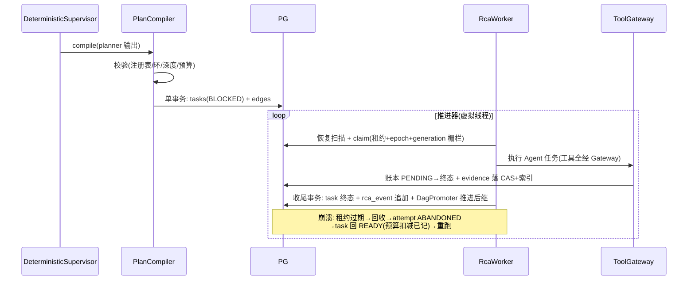
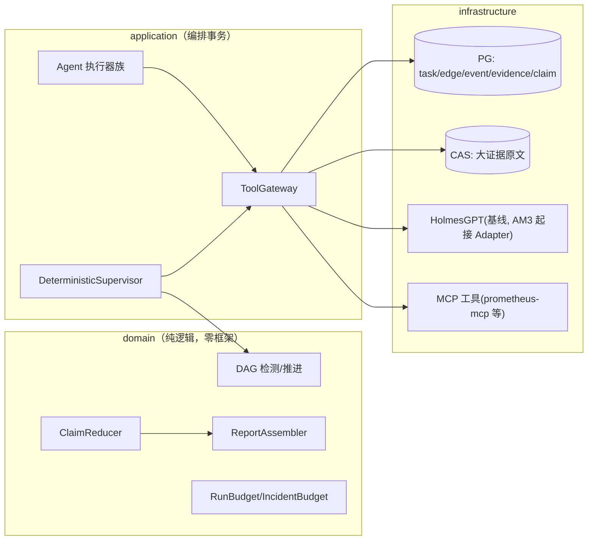

# 告警 AM4 Native 多 Agent 确定性执行链 —— 技术方案与任务拆解（v1.0）

> 文档信息：2026-09-05 起草；状态 = **待 G1 评审**。
> 任务编号对齐 `docs/告警Agent-增量实现任务拆解-v1.md` M4-01~38（唯一任务表，已亲自通读原文 §7）。
> 设计依据：架构 v1.2（FUT-01~55，特别是 FUT-04 任务 DAG/FUT-06 不可变 Snapshot/FUT-07 统一 Tool Gateway/FUT-28 VALIDATE_ONLY/FUT-41 统一 rca_event/FUT-47 Snapshot≠Package）、harness 调研 E-15（Claude Code 权限强制执行/Codex 三态判定/MCP 治理/Holmes 上下文预算/工具宁少勿多）、调度层调研 E-3/E-5。
> **顺序说明（用户裁定 2026-09-05）**：正常顺序 AM4 依赖 AM3 G2（M3-30）；用户指示提前启动，故本期**只做不依赖 AM3 产物的部分**（数据与状态底盘 M4-01~12 + 工具证据底盘 M4-13~23 的大部分）；Holmes Baseline Adapter（M4-31，依赖 M3-08 落档链）及以后待 AM3 就位。
> **分层铁律（用户 2026-09-05 指示，本期头号约束）**：关注点分离——上层依赖下层，下层不感知上层；ArchUnit 强制，见 §3.0。

---

## 1. 核心问题

AM1~AM3 建立了"单 Holmes 调查 + 单 task"的链路。AM4 要解决：**多 Agent RCA 的执行链必须是确定性、可恢复、可审计、可回放的持久化任务 DAG**——而不是多个 Agent 自由聊天（AA-14/AA-15/FUT-04）。

三个子问题：

1. **DAG 底盘**：任务有依赖边（rca_task_edge），BLOCKED→READY 的推进、环检测、generation 栅栏全部由确定性代码完成，模型无调度权。
2. **统一工具边界**：一切工具调用经 Tool Gateway（注册表 + 风险分级 + 超时/取消 + 账本），Agent 拿不到裸凭证——"权限由 harness 强制执行，不靠模型自觉"（E-15 Claude Code 原则）。
3. **证据与裁决**：Agent 产出统一 AgentResult/Claim（结构契约），冲突裁决走确定性 Reducer（K8s Condition 结构 + 权威源规则，禁 LLM 置信度投票），报告由 Assembler 从已冻结 Snapshot 组装（Reporter 不许新增证据）。

**本期不做**：自动替换 Holmes（AM6）；R2/R3 写动作执行（意图仅记录 VALIDATE_ONLY）；语义 Verifier 的 Critic LLM（先确定性规则版）。

## 2. 任务拆解（本期范围 = M4-01~23 + M4-24~30 视 AM3 依赖情况）

按任务拆解原文执行（编号/边界/验收以拆解为准），本方案补充类设计与实现细节。阶段划分：

| 阶段 | 任务 | 内容 | 本期是否做 |
|---|---|---|---|
| A 数据与状态底盘 | M4-01~12 | 状态契约双读 → 约束扩容迁移 → 回填作业 → rca_task_edge → DAG 环检测 → READY/BLOCKED 推进器 → generation fence → Run/IncidentBudget → 统一 rca_event + EventAppender + 兼容视图 | ✅ 全做 |
| B 工具与证据底盘 | M4-13~23 | ToolDefinition/Registry、canonical args+action digest、ToolPolicy R0/R1、ToolGateway、只读 Ledger、Evidence/Snapshot/Claim/Reducer/Assembler | ✅ 全做 |
| C 多 Agent 与对照 | M4-24~30 | AgentProfile 注册表、Planner、Deterministic Supervisor、Metrics/Logs/Change Agent、Native RCA Agent | ✅ 做（不依赖 AM3） |
| C 依赖 AM3 部分 | M4-31~38 | Holmes Baseline Adapter（依赖 M3-08）、Replay、Shadow、Reconciler 族、AM4 G2 | ⏸ 待 AM3 |

**迁移编号**：AM3 占 V8/V9；AM4 迁移从 **V10** 起（`V10__am4_dag_state.sql` 等）。

## 3. 类设计

### 3.0 分层铁律（关注点分离，ArchUnit 强制）

```text
依赖方向（只许向下）：
  interfaces  →  application  →  domain  ←  infrastructure
                                       （infrastructure 依赖 domain 端口，反向禁止）

下层不感知上层（硬规则，ArchUnit 守卫）：
  R1 domain   禁引用 application/interfaces/infrastructure（含 import 与类型签名）
  R2 application 禁引用 interfaces/infrastructure 实现类（只经 domain 端口）
  R3 domain 零框架（无 Spring/JSON 库/HTTP 客户端/JDBC——纯 Java + shared-kernel）
  R4 infrastructure 实现 domain 端口；装配唯一在 config（@Profile("docker") 手工 new）
  R5 禁全局可变状态；禁 ThreadLocal 传上下文（沿用 AFT-25）
```

DAG/事件/预算等**纯逻辑全部在 domain**（可单测、无 DB）；DB 细节全部在 infrastructure；编排事务在 application；HTTP 在 interfaces。**任何"图方便"的跨层引用都会被 ArchUnit 打红。**

### 3.1 domain 层新增（`alert/domain/`）

| 类 | 职责 | 不做 |
|---|---|---|
| `model/TaskEdge` | DAG 依赖边（from/to/dependency_type REQUIRED/OPTIONAL） | 不做推进判断 |
| `model/RcaEvent` | 统一事件（run_id/seq/类型/载荷 digest/schema_version） | append-only 语义由仓储守 |
| `model/ToolDefinition` / `ToolRisk`（R0/R1/R2/R3） | 工具契约：name/version/schema/risk/timeout/result limit | 不执行 |
| `model/ToolCallRequest` / `ToolCallOutcome` | canonical args + action_digest + 结果（含 REPLAY_MISS） | — |
| `model/Evidence` / `EvidenceSnapshot` / `Claim` / `ClaimVerdict` | 证据/快照/断言契约（FUT-06/16/47；Claim 抄 K8s Condition：status TRUE/FALSE/UNKNOWN + reason + observedGeneration） | 不做裁决执行 |
| `service/DagCycleDetector` | 纯函数环检测（DFS 三色） | 无 DB 副作用 |
| `service/DagPromoter` | 纯函数：task 集合 × 边 → 谁可 READY（REQUIRED 全成功 + OPTIONAL 全终止） | 不写库 |
| `service/CanonicalJson` | 规范化 JSON（字段序无关）→ action_digest 稳定 | — |
| `service/ClaimReducer` | 规则驱动消重/冲突/覆盖（权威源规则表） | **禁置信度投票** |
| `service/ReportAssembler` | 只从冻结 Snapshot + 已裁决 Claim 组装；无证据不产确认根因 | — |
| `service/RunBudget` / `IncidentBudget` | 预算扣减纯逻辑（step/tool/evidence/time 硬上限） | 不触网 |
| `statemachine/` 扩展 | RcaRun/RcaTask 状态全集（AA-20：BLOCKED/SKIPPED/STALE/WAITING_APPROVAL…） | — |

### 3.2 application 层新增

| 类 | 职责 |
|---|---|
| `DagExecutionService` | DAG 持久化推进（claim/完成归约/推进 BLOCKED→READY，单事务） |
| `ToolGateway` | 工具调用唯一咽喉：注册表校验 → Policy（R0/R1）→ 超时/取消 → 结果上限 → 账本（PENDING→SUCCESS/FAILED/UNKNOWN） |
| `PlanCompiler` | LLM Planner 输出 → 校验（schema 版本/注册表任务类型/≤8 任务/深度 ≤3/无环/输入引用本 run artifact/活跃 VERIFY ≤1）→ 单事务落 tasks+edges |
| `DeterministicSupervisor` | 固定执行链推进（PLAN→并行调查→REDUCE→VERIFY≤1→ASSEMBLE→VALIDATE→PUBLISH），模型无调度权 |
| `agent/MetricsAgent` / `LogsAgent` / `ChangeAgent` / `NativeRcaAgent` | 各 Agent Profile 的执行器：只读工具 + 产 AgentResult（不直接发报告） |
| `replay/ReplayMatcher` | REPLAY_MOCK 精确匹配（tool/version/args/scope/time/snapshot 全同才回放，否则 REPLAY_MISS） |

### 3.3 infrastructure / interfaces

- `infrastructure/persistence/`：V10 迁移 + `PostgresTaskEdgeRepository`、`PostgresRcaEventRepository`（分段 seq 原子分配）、Evidence/Snapshot/Claim 仓储
- `infrastructure/mcp/`：**MCP 客户端雏形**（工具层外移的预备——本期只接 Holmes/本地工具，MCP 接 prometheus-mcp 待 AM4 后期评估，E-14/P6 已验证可行）
- `interfaces/`：本期无新 HTTP 端点（DAG 查询 API 归 AM5 Operator API）

## 4. 关键时序

### 4.1 计划编译与 DAG 推进（含崩溃）



## 5. 数据流与链路图



## 6. 具体实现方式（关键技术点）

- **状态演进三步**（M4-01~03）：Java 双读旧值（不先改 DB 约束）→ V10 迁移 DB 同时允许新旧状态（不回填）→ 分批可重入回填作业（记录进度、行数/digest 对账）。**禁一步到位改约束**。
- **rca_event 统一账本**（FUT-41）：append-only；`last_event_seq` 原子分段分配（`SELECT ... FOR UPDATE` 或序列段）；状态事实与同事务写、进度事件独立短事务；旧 `rca_agent_event` 只读兼容视图、禁双写。
- **Tool Gateway**（FUT-07）：一切工具调用唯一咽喉；R0/R1 自动、R2/R3 意图只记录（VALIDATE_ONLY，FUT-28）；硬 deadline + 结果上限 + 取消；迟到结果不补旧 Snapshot。
- **幂等键**：sha256(run_id | task_type | normalized_input_digest | observed_generation)，唯一约束；重试只产新 attempt。
- **预算**：RunBudget（每 run 硬上限）+ IncidentBudget（跨 run 窗口滚动累计）；耗尽 → 确定性升级人工（不自动降级糊弄）。
- **Planner 边界**：模型只产 DAG 提案（JSON schema 强约束），编译校验全部确定性；相同提案 → 相同任务图（可复现）。
- **回放**：REPLAY_MOCK 全字段精确匹配，任一不同 REPLAY_MISS（禁近似伪造）；迟到证据不改变旧快照。

## 7. 边界条件与不变量

| 编号 | 不变量 |
|---|---|
| INV-AM4-1 | 分层铁律 R1~R5（ArchUnit 红绿留证） |
| INV-AM4-2 | 模型无调度权（DAG 推进/环检测/预算全确定性代码） |
| INV-AM4-3 | 工具调用零裸凭证（一切经 ToolGateway；Agent 容器/进程无 DB/宿主凭证） |
| INV-AM4-4 | generation 栅栏：旧 generation 结果只能 STALE，不污染新 Run |
| INV-AM4-5 | 预算硬上限不可透支；耗尽确定性升级 |
| INV-AM4-6 | rca_event 只增不改；回放精确匹配否则 REPLAY_MISS |
| INV-AM4-7 | 迁移编号 AM4 从 V10 起（V8/V9 归 AM3）；不回填历史改写语义 |

残余风险：① AM3 未就绪时 M4-31 起的对照链无法联调（本期范围已排除）；② MCP 客户端是新代码面（Holmes HTTP 之外的第二条工具通道），需要 WireMock/本地 stub 先收敛；③ DAG 推进器并发正确性靠 IT 实证（并发前驱完成/可选前驱失败矩阵）。

## 8. 设计原因

- **DAG 持久化 + PG 队列**：同范式延续（AA-3/5/7）；不引入 Argo/Conductor/Temporal 平台（E-5 结论沿用）。
- **Planner 注册表制 + 编译校验**：LangGraph reducer/AutoGen  ledger 思想 + 调研"是否有进展用确定性计算"；禁自由聊天（AA-15）。
- **Claim=K8s Condition、裁决=权威源规则、报告=冻结后组装**：v1.2 §6/§7 定案；禁置信度投票（多数和高分不制造真相——Harness 评审原文）。
- **工具层 MCP 化**（渐进）：E-15 MCP 治理三件套（命名空间/白名单/延迟加载）+ P6 验证 prometheus-mcp 可用。
- **分层铁律 ArchUnit 化**：用户指示 + 旧线 ArchUnit 套件范式（红绿验证留证）。

## 9. 问题与压力点

| 编号 | 压力点 | 触发信号 |
|---|---|---|
| P-41 | AM3 未就绪阻塞 M4-31~38 联调 | AM3 G2 完成时 |
| P-42 | MCP 客户端通道稳定性 | WireMock 契约测试暴露时 |
| P-43 | DAG 推进器并发缺陷 | IT 矩阵暴露时 |
| P-44 | Native Agent 质量不如 Holmes | AM3 基线报告 + Shadow 对照数据 |

## 10. 实际后果记录

- G0 实证（BA-14/15）：外部 LLM 输出契约必须双层设防；工具集静默禁用要部署门显式断言——AM4 的 ToolGateway 白名单 + schema 验证直接继承这两条教训。
- P4 备料实证：response_format 在本端点零约束，文字硬指令 + 围栏提取是唯一有效载体——Planner 输出契约按此设计。
- AM1 双轴审查"状态机空转"教训：AM4 所有状态机接线有 ArchUnit 行为化断言（不允许"定义了没接线"）。

## 11. 技术债分析

- 若先写"自由调用工具的大脑"再补边界：权限/预算/审计全是事后贴膏药，返工成本远超底盘先行（拆解原文的警告即此意）。
- 本期债：MCP 客户端与 Holmes HTTP 双通道并存至 AM6；M4-31~38 的延后造成"Native 无对照数据"空窗（AM3 基线报告可部分弥补）。

## 12. 测试用例设计

- **L0**：分层铁律 R1~R5 的 ArchUnit 套件（红绿留证）；domain 零框架断言；状态机接线行为化断言
- **L1**：DagCycleDetector（空图/菱形/环/断点）、DagPromoter（并发前驱/可选前驱失败矩阵）、CanonicalJson（字段序无关）、ClaimReducer 矩阵、ReportAssembler（无证据不产根因/PARTIAL/UNRESOLVED）、预算扣减纯函数、状态迁移穷举
- **L2**（Testcontainers PG）：V10 迁移契约；edge 自环/重复边；rca_event 分段 seq 并发无重复无倒退；generation 栅栏写入拒绝；预算并发扣减；旧 fixture 回放（M4-01 双读）
- **L3**：计划编译全链（合法/环/未注册任务/超深/超预算）；SIGKILL 恢复（各提交点）；replay 精确匹配三态
- **L4**：工具超时/取消/超大结果；429/401/5xx 分类；迟到结果拒收
- **L5**（195 部署门）：DAG 全链真跑（PLAN→调查→REDUCE→ASSEMBLE→报告）；崩溃恢复；Holmes 隔离（Native 失败不影响 Holmes 基线）

## 13. 验收标准（DoD）

1. M4-01~30 单项验收全过（拆解原文验收列）；L0~L5 全绿（195 真栈）
2. 分层铁律 ArchUnit 红绿留证（INV-AM4-1 硬指标）
3. DAG 固定链真栈跑通 + 崩溃恢复证据；replay 三态实证
4. 证据归档（AA-26 契约）；台账三件套同步

## 14. 修订记录

| 日期 | 版本 | 变更 |
|---|---|---|
| 2026-09-05 | v1.0 | 初稿：亲自读任务拆分 M4 原文后出具；范围 = M4-01~30（M4-31~38 待 AM3）；分层铁律 R1~R5 为用户指示的头号约束；迁移自 V10 起 |
