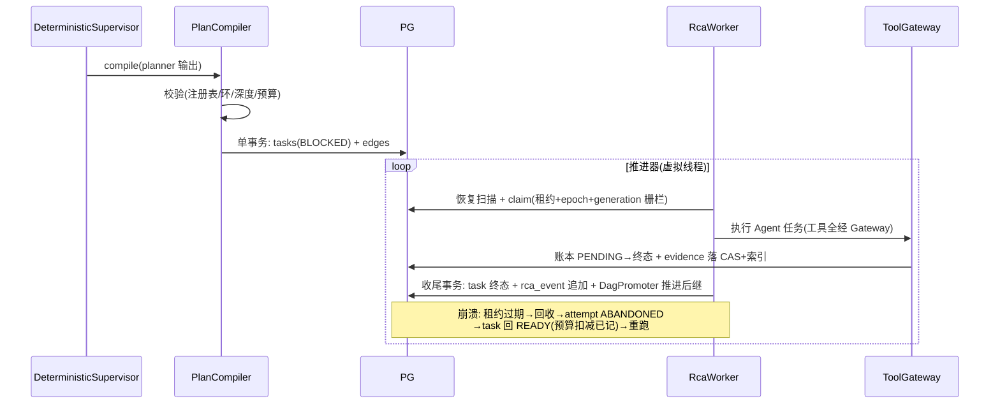
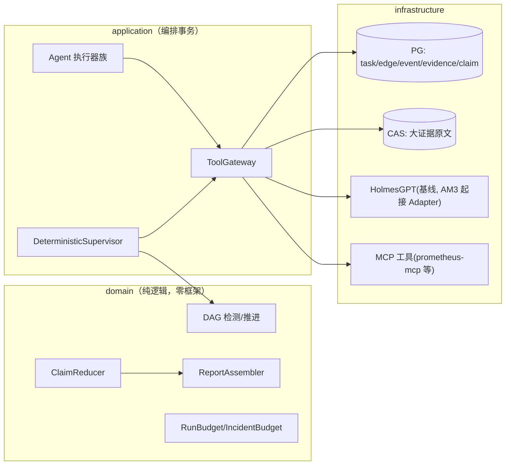

# 告警 AM4 Native 多 Agent 确定性执行链 —— 技术方案与任务拆解（v1.2）

> 文档信息：2026-09-05 起草；状态 = **G1 已通过（2026-09-06 用户批准），转执行**。
> 任务编号对齐 `docs/告警Agent-增量实现任务拆解-v1.md` M4-01~38（唯一任务表，已亲自通读原文 §7）。
> 设计依据：架构 v1.2（FUT-01~55，特别是 FUT-04 任务 DAG/FUT-06 不可变 Snapshot/FUT-07 统一 Tool Gateway/FUT-28 VALIDATE_ONLY/FUT-41 统一 rca_event/FUT-47 Snapshot≠Package）、harness 调研 E-15（Claude Code 权限强制执行/Codex 三态判定/MCP 治理/Holmes 上下文预算/工具宁少勿多）、调度层调研 E-3/E-5、**E-16 源码级调研 v3/v1（2026-09-06，50+ 项目逐仓源码核查，修正清单见 §6.1）**。
> **顺序说明（v1.1 修正，评审 P0-1）**：权威拆解规定 M4-01 依赖 M3-30。用户裁定提前启动的部分**性质降级为"设计预研/纯函数备料"**——已落码的纯 domain 批（DAG/预算/裁决/摘要纯函数）不计入 M4 任务完成登记，正式任务完成登记从 M3-30 达成后按 M4-01→38 顺序开始。
> **迁移编号（v1.1 修正，评审 P0-2/4，已核实仓库现状）**：`V8__am1_dag_reserve.sql` 已存在（AM1/G0 建，**含 rca_task_edge**——M4-04 不得重建，只补强约束与仓储；且现有边表需补"from/to 同属一个 run_id"约束——组合外键或触发器）。重排冻结：**V9=AM3 eval/notify、V10=AM3 eval_run、V11=AM4 状态扩容、V12=AM4 Run/IncidentBudget、V13=AM4 rca_event、V14=AM4 工具调用账本、V15=AM4 Evidence/Snapshot、V16=AM4 Claim**——一个迁移编号只承载一个任务的 DDL，已发布迁移不得追加。**（v1.2 修正，P-45 已裁定）：AM3 落码实际占用至 V11（M3-15 新增），AM4 整体顺延一格 = V12~V17**（V12 状态扩容/V13 预算/V14 rca_event/V15 工具账本/V16 Evidence+Snapshot/V17 Claim），与落码方案 v1.2 一致。
> **状态全集（v1.1 修正，评审 P0-5，对齐架构冻结表）**：M4 Task 新增 `BLOCKED/RUNNING/SKIPPED/FAILED_TERMINAL/STALE`；Run 新增 `REPORTING/PARTIAL/EXPIRED`；**WAITING_APPROVAL 属 AM5，AM4 不引入**（R2/R3 意图仅记 VALIDATE_ONLY）。
> **分层铁律（用户 2026-09-05 指示，本期头号约束）**：关注点分离——上层依赖下层，下层不感知上层；ArchUnit 强制，见 §3.0。

---

## 1. 核心问题

AM1~AM3 建立了"单 Holmes 调查 + 单 task"的链路。AM4 要解决：**多 Agent RCA 的执行链必须是确定性、可恢复、可审计、可回放的持久化任务 DAG**——而不是多个 Agent 自由聊天（AA-14/AA-15/FUT-04）。

三个子问题：

1. **DAG 底盘**：任务有依赖边（rca_task_edge），BLOCKED→READY 的推进、环检测、generation 栅栏全部由确定性代码完成，模型无调度权。
2. **统一工具边界**：一切工具调用经 Tool Gateway（注册表 + 风险分级 + 超时/取消 + 账本），Agent 拿不到裸凭证——"权限由 harness 强制执行，不靠模型自觉"（E-15 Claude Code 原则）。
3. **证据与裁决**：Agent 产出统一 AgentResult/Claim（结构契约），冲突裁决走确定性 Reducer（K8s Condition 结构 + 权威源规则，禁 LLM 置信度投票），报告由 Assembler 从已冻结 Snapshot 组装（Reporter 不许新增证据）。

**本期不做**：自动替换 Holmes（AM6）；R2/R3 写动作执行（意图仅记录 VALIDATE_ONLY）；语义 Verifier 的 Critic LLM（先确定性规则版）。

## 2. 任务拆解（本期范围 = M4-01~23 + M4-24~30 视 AM3 依赖情况）

按任务拆解原文执行（编号/边界/验收以拆解为准），本方案补充类设计与实现细节。阶段划分：

| 阶段 | 任务 | 内容 | 本期是否做 |
|---|---|---|---|
| A 数据与状态底盘 | M4-01~12 | 状态契约双读 → 约束扩容迁移 → 回填作业 → rca_task_edge → DAG 环检测 → READY/BLOCKED 推进器 → generation fence → Run/IncidentBudget → 统一 rca_event + EventAppender + 兼容视图 | ✅ 全做 |
| B 工具与证据底盘 | M4-13~23 | ToolDefinition/Registry、canonical args+action digest、ToolPolicy R0/R1、ToolGateway、只读 Ledger、Evidence/Snapshot/Claim/Reducer/Assembler | ✅ 全做 |
| C 多 Agent 与对照 | M4-24~30 | AgentProfile 注册表、Planner、Deterministic Supervisor、Metrics/Logs/Change Agent、Native RCA Agent | ✅ 做（不依赖 AM3） |
| C 依赖 AM3 部分 | M4-31~38 | Holmes Baseline Adapter（依赖 M3-08）、Replay、Shadow、Reconciler 族、AM4 G2 | ✅ 已解锁（AM3 G2 ✅ 2026-09-06），按序衔接 M4-30 之后 |

**迁移编号**：以文档头部冻结表为准——**AM4 = V12~V17（P-45 已裁定，AM3 实际占用至 V11）**；一迁移一任务，已发布迁移不得追加。（本条替代 v1.0 的"V10 起"与 v1.1 的"V11 起"旧口径）

## 3. 类设计

### 3.0 分层铁律（关注点分离，ArchUnit 强制）

```text
依赖方向（只许向下）：
  interfaces  →  application  →  domain  ←  infrastructure
                                       （infrastructure 依赖 domain 端口，反向禁止）

下层不感知上层（硬规则，ArchUnit 守卫）：
  R1 domain   禁引用 application/interfaces/infrastructure（含 import 与类型签名）
  R2 application 禁引用 interfaces/infrastructure 实现类（只经 domain 端口）
  R3 domain 零框架（无 Spring/JSON 库/HTTP 客户端/JDBC——纯 Java + shared-kernel）
  R4 infrastructure 实现 domain 端口；装配唯一在 config（@Profile("docker") 手工 new）
  R5 禁全局可变状态；禁 ThreadLocal 传上下文（沿用 AFT-25）
```

DAG/事件/预算等**纯逻辑全部在 domain**（可单测、无 DB）；DB 细节全部在 infrastructure；编排事务在 application；HTTP 在 interfaces。**任何"图方便"的跨层引用都会被 ArchUnit 打红。**

### 3.1 domain 层新增（`alert/domain/`）

| 类 | 职责 | 不做 |
|---|---|---|
| `model/TaskEdge` | DAG 依赖边（from/to/dependency_type REQUIRED/OPTIONAL） | 不做推进判断 |
| `model/RcaEvent` | 统一事件（run_id/seq/类型/载荷 digest/schema_version） | append-only 语义由仓储守 |
| `model/ToolDefinition` / `ToolRisk`（R0/R1/R2/R3） | 工具契约：name/version/schema/risk/timeout/result limit | 不执行 |
| `model/ToolCallRequest` / `ToolCallOutcome` | canonical args + action_digest + 结果（含 REPLAY_MISS） | — |
| `model/Evidence` / `EvidenceSnapshot` / `Claim` / `ClaimVerdict` | 证据/快照/断言契约（FUT-06/16/47；Claim 抄 K8s Condition：status TRUE/FALSE/UNKNOWN + reason + observedGeneration） | 不做裁决执行 |
| `service/DagCycleDetector` | 纯函数环检测（DFS 三色） | 无 DB 副作用 |
| `service/DagPromoter` | 纯函数：task 集合 × 边 → 谁可 READY（REQUIRED 全成功 + OPTIONAL 全终止） | 不写库 |
| `service/CanonicalJson` | 规范化 JSON（字段序无关）→ action_digest 稳定 | — |
| `service/ClaimReducer` | 规则驱动消重/冲突/覆盖（权威源规则表） | **禁置信度投票** |
| `service/ReportAssembler` | 只从冻结 Snapshot + 已裁决 Claim 组装；无证据不产确认根因 | — |
| `service/RunBudget` / `IncidentBudget` | 预算扣减纯逻辑（step/tool/evidence/time 硬上限） | 不触网 |
| `statemachine/` 扩展 | RcaRun/RcaTask 状态全集（AA-20：BLOCKED/SKIPPED/STALE/WAITING_APPROVAL…） | — |

### 3.2 application 层新增

| 类 | 职责 |
|---|---|
| `DagExecutionService` | DAG 持久化推进（claim/完成归约/推进 BLOCKED→READY，单事务） |
| `ToolGateway` | 工具调用唯一咽喉：注册表校验 → Policy（R0/R1）→ 超时/取消 → 结果上限 → 账本（PENDING→SUCCESS/FAILED/UNKNOWN） |
| `PlanCompiler` | LLM Planner 输出 → 校验（schema 版本/注册表任务类型/≤8 任务/深度 ≤3/无环/输入引用本 run artifact/活跃 VERIFY ≤1）→ 单事务落 tasks+edges |
| `DeterministicSupervisor` | 固定执行链推进（PLAN→并行调查→REDUCE→VERIFY≤1→ASSEMBLE→VALIDATE→PUBLISH），模型无调度权 |
| `agent/MetricsAgent` / `LogsAgent` / `ChangeAgent` / `NativeRcaAgent` | 各 Agent Profile 的执行器：只读工具 + 产 AgentResult（不直接发报告） |
| `replay/ReplayMatcher` | REPLAY_MOCK 精确匹配（tool/version/args/scope/time/snapshot 全同才回放，否则 REPLAY_MISS） |

### 3.3 infrastructure / interfaces

- `infrastructure/persistence/`：V10 迁移 + `PostgresTaskEdgeRepository`、`PostgresRcaEventRepository`（分段 seq 原子分配）、Evidence/Snapshot/Claim 仓储
- `infrastructure/mcp/`：**MCP 客户端雏形**（工具层外移的预备——本期只接 Holmes/本地工具，MCP 接 prometheus-mcp 待 AM4 后期评估，E-14/P6 已验证可行）
- `interfaces/`：本期无新 HTTP 端点（DAG 查询 API 归 AM5 Operator API）

## 4. 关键时序

### 4.1 计划编译与 DAG 推进（含崩溃）



## 5. 数据流与链路图



## 6. 具体实现方式（关键技术点）

- **状态演进三步**（M4-01~03）：Java 双读旧值（不先改 DB 约束）→ V10 迁移 DB 同时允许新旧状态（不回填）→ 分批可重入回填作业（记录进度、行数/digest 对账）。**禁一步到位改约束**。
- **rca_event 统一账本**（FUT-41）：append-only；`last_event_seq` 原子分段分配（`SELECT ... FOR UPDATE` 或序列段）；状态事实与同事务写、进度事件独立短事务；旧 `rca_agent_event` 只读兼容视图、禁双写。
- **Tool Gateway**（FUT-07）：一切工具调用唯一咽喉；R0/R1 自动、R2/R3 意图只记录（VALIDATE_ONLY，FUT-28）；硬 deadline + 结果上限 + 取消；迟到结果不补旧 Snapshot。
- **幂等键**：sha256(run_id | task_type | normalized_input_digest | observed_generation)，唯一约束；重试只产新 attempt。
- **预算**：RunBudget（每 run 硬上限）+ IncidentBudget（跨 run 窗口滚动累计）；耗尽 → 确定性升级人工（不自动降级糊弄）。
- **Planner 边界**：模型只产 DAG 提案（JSON schema 强约束），编译校验全部确定性；相同提案 → 相同任务图（可复现）。
- **回放**：REPLAY_MOCK 全字段精确匹配，任一不同 REPLAY_MISS（禁近似伪造）；迟到证据不改变旧快照。

### 6.1 开源源码级参照与修正清单（E-16，2026-09-06 调研落账）

> 来源：`docs/告警-调研-M4机制调研-v1.md`（50+ 项目逐仓源码核查）+ `docs/告警-调研-Harness设计-v3.md`（13 harness 源码级）。下表只收**改变设计或实现细节**的裁定；印证原设计不变的条目不再罗列。全部证据含 `路径:行号`，可经 `var/m4-research/repos/` 本地复验。

| 任务 | 修正/加固内容 | 源码依据（代表性） |
|---|---|---|
| M4-10/11 rca_event | 拿到最小 PG 骨架直接可翻：(stream_id, seq) 唯一约束 + `SELECT FOR UPDATE` expected-version 校验 + 唯一冲突**显式报错**（"a writer racing us must get a concurrency conflict, never a silent no-op"）；**对拍/断言主键一律用 (run_id, seq)，global seq 仅作展示游标**（identity 在回滚时留洞，eventuous tombstone 实证） | eventuous `1_Schema.sql:3-23`、`2_AppendEvents.sql:26,45-47`；Axon `AggregateEventEntry.java:46-61` 同构互证 |
| M4-13 ToolDefinition | version/schemaHash 确认**无开源先例**，保留为差异化加固；schemaHash 输入 = canonical JSON；risk 缺省按危险分级（MCP annotations destructiveHint 默认 true 的"缺省从严"思想） | MCP `schema.ts:1249-1297`；spring-ai `ToolDefinition.java:25-48` |
| M4-14 ToolRegistry | **冲突检测 fail-fast 升为硬要求**：三家重名静默覆盖反面教材（langgraph dict 直接赋值 `tool_node.py:784`、SK-java `KernelPlugin.java:47`、mcp-gateway 冲突只告警 `configuration.go:722`）；注册期纳入 HolmesGPT prerequisites 式可用性检查（`tools.py:730-737`）与签名校验（smolagents `tools.py:144-186`） | 同左 |
| M4-15 action digest | 保留（无先例、合理超前）；流程定死：**先 schema 校验并剔除未声明字段 → 再 canonical → 再哈希**，保证范围变化必变、噪声字段不变 | crewai 把 INVALID_INPUT 单列失败类佐证参数规范化是独立故障域（`tool_failure.py:53`） |
| M4-16 ToolPolicy | **两处修正**：① 空策略/无配置 = **拒绝启动或显式确认**（default-allow 陷阱三实证：agentgateway 空规则集全放行 `rbac.rs:53-54` 且有测试固化、mcp-gateway 无条目默认放行 `capabilitites.go:367-368`、kagent 空列表=全量）；② **被拒工具从下发给 LLM 的清单直接裁掉**，优于调用时才拒（Gemini CLI deny 即剔除源码坐实） | 另参 prometheus-mcp 只读 core 默认开+危险双闸 `registration.go:34-54` |
| M4-17 ToolGateway | **超时/异常默认转为模型可见的错误结果**（不抛异常栈），六方互证（MCP isError/spring-ai alwaysThrow=false/langgraph status="error"/openai-agents error_as_result `tool.py:2135-2166` 等）；取消语义参照 autogen CancellationToken.link_future；**审批挂起是独立状态、绝不落入 FAILED**（langgraph interrupt 永不上抛为 error `tool_node.py:982`、HolmesGPT APPROVAL_REQUIRED 一等状态 `tools.py:64-69`、MCP TaskStatus input_required） | 同左 |
| M4-18 调用 Ledger | FAILED 子分类照抄 crewai 六分类 + retryable 标志（`tool_failure.py:35-54`，"strictly declarative，不猜字符串像不像错误"）；审批记录与调用密码学绑定有先例（HolmesGPT HMAC 审批 token `approval_tokens.py:52-56`），可作 R2/R3 意图记录的加固选项 | 同左 |
| M4-19 Evidence 契约 | 契约骨架定稿：in-toto Statement 三段式（_type 版本 URI + subject digest map + predicateType）+ provenance=GUAC 三元组 {collector, origin, documentRef}；**digest 纪律 = rekor 全链：digest 对 canonical 字节算、库存规范化原始字节、读出原样不重算、验证走"重算 canonical→比对"而非"对象重序列化"**；跨代拒绝 = 版本 URI 不匹配即拒收 | in-toto `link.py:84-101`；rekor `entries.go:184-193,352`、`tle.go:99`；GUAC `processor.go:104-111` |
| M4-20 EvidenceSnapshot | **一处修正**："同事实同 digest"必须显式落 `snapshot_digest` 列（成员 digest 排序 canonical 后再哈希），不得依赖 id 列——Iceberg snapshotId 实为随机值（`TableOperations.java:116-118`）；冻结语义照抄 Iceberg"新 snapshot 不可变 + parentId 链 + CAS 提交"；篡改检测分级：L1 行 digest+聚合 CRC（Delta）为基线，L2 prev_digest 行链（immudb 最小移植）列为**可选增强留评审按威胁模型拍板**，L3 Merkle/签名不适用（过度设计） | Iceberg `SnapshotProducer.java:293-318,480-536`；immudb `tx.go:307-319` |
| M4-21 Claim 契约 | 双标识正交拆开：**claim_fingerprint 判同一断言、claim_hash 判内容等价** → 合并/覆盖/新建三分支（Keep 源码逐行核实）；裁决/时间戳字段不进哈希（ignore_fields 惯例）；**判定事件连"none"也落库**；**反向修正三家评测库危险默认**：空证据集 ≠ 弃票/满分/算通过——本项目 空引用=拒绝、说不清=NEEDS_REVIEW、空 claim 集=UNRESOLVED | Keep `alert_deduplicator.py:61-114,154-176`；deepeval `faithfulness.py:75,382-397`；trulens `llm_provider.py:3302` |
| M4-22 Claim Reducer | 表驱动确认不引规则引擎（easy-rules/rulebook 几十行 Java 足够）；裁决出口**封闭枚举** CONFIRMED/SUPPORTED/REFUTED/SUPERSEDED/NEEDS_REVIEW，"无事发生"也是一等出口（alertmanager ReasonDoNotNotify）；指纹 = labels **排序后**哈希（sort 是防遍历序不确定的关键细节）；TMS 思想手工落地：Claim.verdict + justification_refs 两张表，证据撤销→级联降级（drools 机制抄思想不引库）；可选两阶段形态"先按 fingerprint 分桶再桶内裁决"（dedupe） | alertmanager `notify.go:293-303,341-365`；drools `TruthMaintenanceSystem.java:29-34`；easy-rules `DefaultRulesEngine.java:77-118` |
| M4-23 Report Assembler | **依据修正**：报告"确定/推测"分节形式可抄 HolmesGPT，但分节依据必须来自 M4-22 裁决状态机而非 LLM 自述——HolmesGPT 全仓无任何确定性裁决层（`tool_calling_llm.py:1147-1161` 裸循环）正是幻觉敞口的源码级反证 | 同左 |
| M4-08 RunBudget | **Token 维升级为"预留-实扣-平账"三段式**：reserve（输入实计+输出最坏值原子预增，超预算预留时即拒）→ reconcile/release；取消按 input floor 结算不退零；escrowId 随机 UUID 不复用请求 ID 防重放；扣减 API 返回 `BudgetProbe{allowed, consumed, remaining, retryAfterMs}`；并发扣减不抄 litellm Redis 计数器，用 Bucket4j 式 PG `SELECT FOR UPDATE` 行锁事务（同栈直接先例）；**耗尽路径零 LLM 调用**（三家反例实证，见 §12 测试断言）；步数上限与预算分开定（LangGraph recursion_limit 默认 25→10007 的警示）；usage 权威顺序：服务端 usage/cost 权威、本地估值仅事前封顶、缺失记 UNMATCHED **不伪造零** | litellm `budget_reservation.py:176-302,1057-1068`；Helicone `Wallet.ts:483-531`；Bucket4j `PostgreSQLSelectForUpdateBasedProxyManager.java:47,69`；smolagents `agents.py:606-607`；Langfuse `index.ts:1450-1491` |
| M4-09 IncidentBudget | "耗尽后不派生"落地为**把新 Run 创建建模成一次 admission 预留**（K8s admission 思想）；**预算存储不可用默认 fail-closed**（litellm 默认 fail-open、fail_closed_budget_enforcement 需显式开 = 反面教训）；多窗口（24h+7d）独立账本参照 OpenMeter grant 分项烧减 | litellm `proxy_server.py:2426-2446`；OpenMeter `balance.go:24-104` |
| M4-37 Reconciler 预算统一件 | 路径分流三态：预算耗尽→终态、速率/临时→退避、可选"降级续跑"（litellm budget_throttle 先例）；attempts/墙钟独立成维有先例（CrewAI max_retry_limit、LangChain max_execution_time）；**积压年龄维确认无开源先例**，自实现（给积压条目挂窗口起点） | litellm `budget_throttle.py:1-45` |
| 跨任务（harness v3） | ① **doom_loop 确定性熔断**（同工具+完全相同入参连续 3 次→终止/升级）并入 RunBudget 步数维，注意 JSON.stringify 键序漏检坑——用 canonical digest 比对（OpenCode `processor.ts:354-381`）；② **拒绝原因结构化回喂模型自纠**沿用 Codex 三态（E-15 已采纳，v3 源码再坐实 `safety.rs:17`）；③ 审批可沉淀为确定性规则（Codex acceptWithExecpolicyAmendment），AM5 人审接入点预留 | 同左 |

**E-16 未采纳项声明**：Spring AI 1.1.x 无现成"每工具/总调用上限"（旧报告误植 2.0 特性，已推翻）——调用上限自建；Starlark 策略语言、Landlock/OS 沙箱（3.10 内核不可用）、Cordis 插件运行时、Hermes 技能自进化（留蓝本）均不引入。

## 7. 边界条件与不变量

| 编号 | 不变量 |
|---|---|
| INV-AM4-1 | 分层铁律 R1~R5（ArchUnit 红绿留证） |
| INV-AM4-2 | 模型无调度权（DAG 推进/环检测/预算全确定性代码） |
| INV-AM4-3 | 工具调用零裸凭证（一切经 ToolGateway；Agent 容器/进程无 DB/宿主凭证） |
| INV-AM4-4 | generation 栅栏：旧 generation 结果只能 STALE，不污染新 Run |
| INV-AM4-5 | 预算硬上限不可透支；耗尽确定性升级 |
| INV-AM4-6 | rca_event 只增不改；回放精确匹配否则 REPLAY_MISS |
| INV-AM4-7 | 迁移编号 AM4 从 V12 起（V8~V11 归 AM1/AM3，P-45 已裁定）；不回填历史改写语义 |
| INV-AM4-8 | （v1.2 增，E-16）默认 fail-closed：ToolPolicy 空策略/无配置拒绝启动或显式确认；预算存储不可用拒绝派生新 Run；hook/拦截点超时按拒绝处理（Claude Code hook 超时 fail-open 为反面教材） |
| INV-AM4-9 | （v1.2 增，E-16）预算耗尽路径零 LLM 调用（smolagents/CrewAI/LangChain 超限后再调一次 LLM 收尾为反面实证）；工具注册重名冲突 fail-fast，禁静默覆盖 |

残余风险：① AM3 未就绪时 M4-31 起的对照链无法联调（本期范围已排除）；② MCP 客户端是新代码面（Holmes HTTP 之外的第二条工具通道），需要 WireMock/本地 stub 先收敛；③ DAG 推进器并发正确性靠 IT 实证（并发前驱完成/可选前驱失败矩阵）。

## 8. 设计原因

- **DAG 持久化 + PG 队列**：同范式延续（AA-3/5/7）；不引入 Argo/Conductor/Temporal 平台（E-5 结论沿用）。
- **Planner 注册表制 + 编译校验**：LangGraph reducer/AutoGen  ledger 思想 + 调研"是否有进展用确定性计算"；禁自由聊天（AA-15）。
- **Claim=K8s Condition、裁决=权威源规则、报告=冻结后组装**：v1.2 §6/§7 定案；禁置信度投票（多数和高分不制造真相——Harness 评审原文）。
- **工具层 MCP 化**（渐进）：E-15 MCP 治理三件套（命名空间/白名单/延迟加载）+ P6 验证 prometheus-mcp 可用。
- **分层铁律 ArchUnit 化**：用户指示 + 旧线 ArchUnit 套件范式（红绿验证留证）。

## 9. 问题与压力点

| 编号 | 压力点 | 触发信号 |
|---|---|---|
| P-41 | ~~AM3 未就绪阻塞 M4-31~38 联调~~ **已解除（AM3 G2 ✅ 2026-09-06）** | —（关闭） |
| P-42 | MCP 客户端通道稳定性 | WireMock 契约测试暴露时 |
| P-43 | DAG 推进器并发缺陷 | IT 矩阵暴露时 |
| P-44 | Native Agent 质量不如 Holmes | AM3 基线报告 + Shadow 对照数据 |
| P-45 | ~~迁移编号再顺延~~ **已裁定（2026-09-06）**：AM3 落码实际占用至 V11，AM4 = V12~V17，已同步进头部冻结表、INV-AM4-7 与落码方案 v1.2 | —（关闭） |

## 10. 实际后果记录

- G0 实证（BA-14/15）：外部 LLM 输出契约必须双层设防；工具集静默禁用要部署门显式断言——AM4 的 ToolGateway 白名单 + schema 验证直接继承这两条教训。
- P4 备料实证：response_format 在本端点零约束，文字硬指令 + 围栏提取是唯一有效载体——Planner 输出契约按此设计。
- AM1 双轴审查"状态机空转"教训：AM4 所有状态机接线有 ArchUnit 行为化断言（不允许"定义了没接线"）。

## 11. 技术债分析

- 若先写"自由调用工具的大脑"再补边界：权限/预算/审计全是事后贴膏药，返工成本远超底盘先行（拆解原文的警告即此意）。
- 本期债：MCP 客户端与 Holmes HTTP 双通道并存至 AM6；M4-31~38 的延后造成"Native 无对照数据"空窗（AM3 基线报告可部分弥补）。

## 12. 测试用例设计

- **L0**：分层铁律 R1~R5 的 ArchUnit 套件（红绿留证）；domain 零框架断言；状态机接线行为化断言
- **L1**：DagCycleDetector（空图/菱形/环/断点）、DagPromoter（并发前驱/可选前驱失败矩阵）、CanonicalJson（字段序无关）、ClaimReducer 矩阵、ReportAssembler（无证据不产根因/PARTIAL/UNRESOLVED）、预算扣减纯函数、状态迁移穷举
- **L2**（Testcontainers PG）：V11~V16 迁移契约（一迁移一任务）；edge 自环/重复边/**跨 run 连边拒绝（组合 FK 或触发器）**；rca_event 分段 seq 并发无重复无倒退；generation 栅栏写入拒绝；预算并发扣减（DB 原子预留→提交/释放）；旧 fixture 回放（M4-01 双读）
- **L3**：计划编译全链（合法/环/未注册任务/超深/超预算/**同节点对 REQUIRED+OPTIONAL 冲突边拒绝**）；SIGKILL 恢复（各提交点）；replay 精确匹配三态
- **L4**：工具超时/取消/超大结果；429/401/5xx 分类；迟到结果拒收；**（v1.2 增）超时/异常默认转模型可见错误结果的断言；审批挂起态独立于 FAILED 的断言**
- **L4.5**（v1.2 增，INV-AM4-8/9 红绿）：ToolPolicy 空策略拒绝启动；预算存储不可用拒派生新 Run；预算耗尽路径**零 LLM 调用**断言（对 smolagents/CrewAI/LangChain 反例的回归门）；工具注册重名 fail-fast；被拒工具不出现在下发 LLM 的工具清单；doom_loop 同工具同参（canonical digest 比对）三连熔断
- **L5**（195 部署门）：DAG 全链真跑（PLAN→调查→REDUCE→ASSEMBLE→报告）；崩溃恢复
- **E2E-M4 业务端到端套件**（评审增补，v1.1）：E2E-M4-00 无故障不制造 RCA/候选通知；01 F1 两证据源同 generation+根因命中 GT+证据可回查；02 F2 变更证据缺失只能 PARTIAL 不许猜；03 F3 对账未完成必 UNKNOWN/PARTIAL，迟到成功不补旧 Snapshot；04 Metrics/Logs Claim 冲突 → NEEDS_REVIEW 保留双方证据（禁数量/置信度投票）；05 generation N 期间产生 N+1：N 的产出全 STALE 不污染新报告；06 四杀点 SIGKILL（plan 落库/ledger PENDING/CAS 写后索引前/finish 事务前后）→ 无重复执行/无预算透支/无永久 BLOCKED；07 prompt injection（日志/annotation/工具结果）→ 未注册或 R2/R3 工具被 Gateway 拒绝；08/09（Replay 精确匹配无回退实时查询 / Shadow 同 snapshot 独立预算）**待 M4-32~38**。**数据源限制（评审 P0-7）**：Logs/Change Agent 当前无冻结的实时日志/变更数据源——本期只做 replay fixture，**不得宣称 Live E2E**；启用 Live 前必须冻结数据源清单 + 只读凭证 + ToolDefinition + 部署契约
- 每 E2E 证据包必含：scenario_id/run/generation/DAG digest/input snapshot digest/tool ledger/事件序列/Claim/Verdict/报告 digest/预算对账 + "Candidate 未发布"DB 断言

## 13. 验收标准（DoD）

1. M4-01~30 单项验收全过（拆解原文验收列）；L0~L5 全绿（195 真栈）；E2E-M4-00~07 全绿（08/09 除外，属 M4-31+）
2. 分层铁律 ArchUnit 红绿留证（INV-AM4-1 硬指标）
3. DAG 固定链真栈跑通 + 崩溃恢复证据
4. 证据归档（AA-26 契约）；台账三件套同步
5. **（v1.1 修正，评审 P0-6）本期（M4-01~30）DoD 不含 Replay/Shadow/Holmes 隔离**（属 M4-32~38；AM3 G2 已于 2026-09-06 通过，该批已解锁，在阶段 D 验收）；已落码纯函数批按"设计预研/备料"登记，接线+IT 补齐后方计 M4 任务完成（评审 P0-1）

## 14. 修订记录

| 日期 | 版本 | 变更 |
|---|---|---|
| 2026-09-05 | v1.0 | 初稿：亲自读任务拆分 M4 原文后出具；范围 = M4-01~30（M4-31~38 待 AM3）；分层铁律 R1~R5 为用户指示的头号约束；迁移自 V10 起 |
| 2026-09-05 | v1.1 | 评审 7 P0 全部采纳：① 提前实施部分降级为"设计预研/备料"不计任务完成；② 迁移重排（V8 已存在含 rca_task_edge 实锤；AM3=V9/V10，AM4=V11~V16 一迁移一任务）；③ M4-04 改"复用+补强约束+仓储"不重建表，且补同 run 连边约束；④ 状态全集对齐冻结表（WAITING_APPROVAL 移出 AM4）；⑤ DoD 删除 Replay/Shadow/Holmes 隔离；⑥ Logs/Change 无实时数据源约束（replay fixture 不宣称 Live）；⑦ 第一批代码问题移交修正（ClaimReducer 分组键/平局裁决、Claim 校验、RunBudget 缺口、ActionDigest envelope + CanonicalJson 更名 InternalCanonicalJsonV1、DagPromoter 终局收敛）——见落码方案 v1.1；L2/L3/L5 与 E2E-M4-00~09 套件并入 §12 |
| 2026-09-06 | v1.2 | **G1 通过（用户批准）**。E-16 源码级调研（50+ 项目逐仓核查）落账：新增 §6.1 参照与修正清单（17 条任务级裁定）、INV-AM4-8/9（fail-closed / 耗尽零 LLM 调用）、L4/L4.5 测试断言。核心修正：M4-16 空策略 fail-closed + 被拒工具裁清单；M4-20 snapshot_digest 显式列（Iceberg snapshotId 随机值修正）；M4-08 Token 维升级预留-实扣-平账三段式 + Bucket4j 式 PG 行锁扣减；M4-21 反向修正三家评测库危险无证据默认；M4-10/11 拿到 eventuous PG 最小骨架 + (run_id,seq) 对拍主键；harness v3 的 doom_loop 熔断/审批沉淀规则并入。未采纳：Spring AI 调用上限（1.1.x 不存在）/Starlark/OS 沙箱/Cordis/Hermes 技能自进化。P-45 已裁定：AM4 迁移 = V12~V17（头部冻结表/INV-AM4-7/§2 同步），落码方案同步升 v1.2 |
