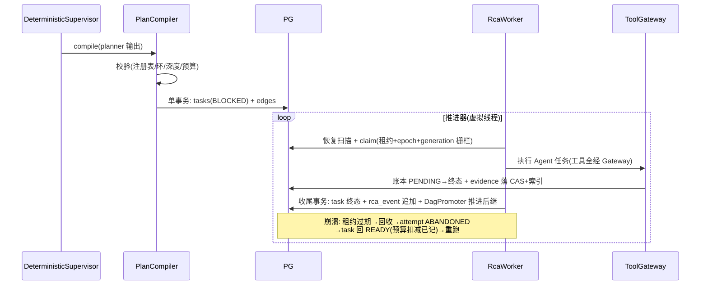
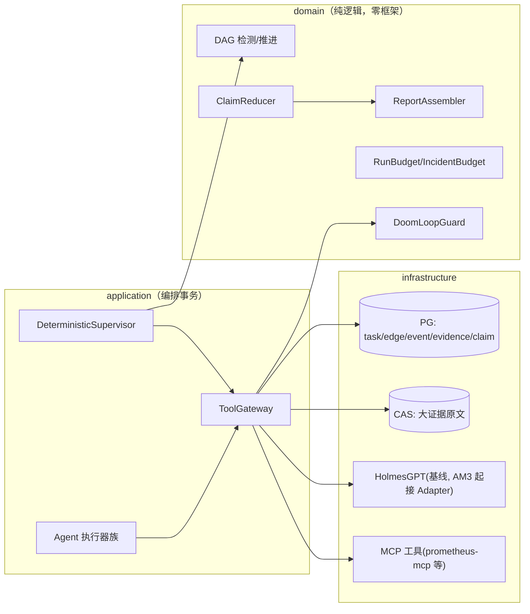

# 告警 AM4 Native 多 Agent 确定性执行链 —— 技术方案与任务拆解（v1.3）

> 文档信息：2026-09-05 起草；状态 = **G1 评审退回修订（2026-09-06 评审结论：方向正确、约七成可采用；P0 三项 + 语义收紧完成后以 v1.3 复审）**。G1 未签署前，AM4 编码仅允许方案与脚手架预研，不得宣称正式开工。
> 任务编号对齐 `docs/告警Agent-增量实现任务拆解-v1.md` M4-01~38（唯一任务表，已亲自通读原文 §7）。
> 设计依据：架构 v1.2（FUT-01~55，特别是 FUT-04 任务 DAG/FUT-06 不可变 Snapshot/FUT-07 统一 Tool Gateway/FUT-28 VALIDATE_ONLY/FUT-41 统一 rca_event/FUT-47 Snapshot≠Package）、harness 调研 E-15、源码级调研 E-16（v3/v1，参照追溯见 §6.1）、调度层调研 E-3/E-5。
> **顺序说明（v1.1 修正，评审 P0-1）**：权威拆解规定 M4-01 依赖 M3-30。M3-30 已达成（2026-09-06，origin/main `574c01f`）；**AM3 G2 已通过（用户 2026-09-06 确认）**，M4-31~38 依赖解除。但 AM4 自身 G1 未签署——已落码纯 domain 批（DAG/预算/裁决/摘要纯函数）与后续编码均为**预研/备料性质**，任务完成登记自 G1 签署后起算。
> **迁移编号（正式裁定，2026-09-06 评审 P0-2 落账）**：AM3 已实际占用 V9/V10/V11；**AM4 = V12~V17，一迁移一任务，已发布迁移不得追加**：V12=状态扩容（M4-02）、V13=Run/IncidentBudget（M4-08/09）、V14=rca_event（M4-10）、V15=工具调用账本（M4-18）、V16=Evidence/Snapshot（M4-19/20）、V17=Claim（M4-21）。`V8__am1_dag_reserve.sql` 已存在（含 rca_task_edge——M4-04 不得重建，只补强约束与仓储，并补"from/to 同属一个 run_id"约束——组合外键或触发器）。
> **状态全集（v1.1 修正，评审 P0-5，对齐架构冻结表）**：M4 Task 新增 `BLOCKED/RUNNING/SKIPPED/FAILED_TERMINAL/STALE`；Run 新增 `REPORTING/PARTIAL/EXPIRED`；**WAITING_APPROVAL 属 AM5，AM4 不引入**（R2/R3 意图仅记 VALIDATE_ONLY/PROPOSED/VALIDATED_INTENT）。
> **分层铁律（用户 2026-09-05 指示，本期头号约束）**：关注点分离——上层依赖下层，下层不感知上层；ArchUnit 强制，见 §3.0。

---

## 1. 核心问题

AM1~AM3 建立了"单 Holmes 调查 + 单 task"的链路。AM4 要解决：**多 Agent RCA 的执行链必须是确定性、可恢复、可审计、可回放的持久化任务 DAG**——而不是多个 Agent 自由聊天（AA-14/AA-15/FUT-04）。

三个子问题：

1. **DAG 底盘**：任务有依赖边（rca_task_edge），BLOCKED→READY 的推进、环检测、generation 栅栏全部由确定性代码完成，模型无调度权。
2. **统一工具边界**：一切工具调用经 Tool Gateway（注册表 + 风险分级 + 超时/取消 + 账本），Agent 拿不到裸凭证——"权限由 harness 强制执行，不靠模型自觉"（E-15 Claude Code 原则）。
3. **证据与裁决**：Agent 产出统一 AgentResult/Claim（结构契约），冲突裁决走确定性 Reducer（命题状态 TRUE/FALSE/UNKNOWN + 证据基础 + 生命周期三正交字段，权威源规则，禁 LLM 置信度投票），报告由 Assembler 从已冻结 Snapshot 组装（Reporter 不许新增证据）。

**本期不做**：自动替换 Holmes（AM6）；R2/R3 写动作执行与审批态（AM5，AM4 只产 PROPOSED/VALIDATED_INTENT 意图记录）；语义 Verifier 的 Critic LLM（先确定性规则版）。

## 2. 任务拆解（本期范围 = M4-01~23 + M4-24~30；M4-31~38 已解锁按序衔接）

按任务拆解原文执行（编号/边界/验收以拆解为准），本方案补充类设计与实现细节。阶段划分：

| 阶段 | 任务 | 内容 | 本期是否做 |
|---|---|---|---|
| A 数据与状态底盘 | M4-01~12 | 状态契约双读 → 约束扩容迁移 → 回填作业 → rca_task_edge → DAG 环检测 → READY/BLOCKED 推进器 → generation fence → Run/IncidentBudget → 统一 rca_event + EventAppender + 兼容视图 | ✅ 全做 |
| B 工具与证据底盘 | M4-13~23 | ToolDefinition/Registry、canonical args+action digest、ToolPolicy R0/R1、ToolGateway、只读 Ledger、Evidence/Snapshot/Claim/Reducer/Assembler | ✅ 全做 |
| C 多 Agent | M4-24~30 | AgentProfile 注册表、Planner、Deterministic Supervisor、Metrics/Logs/Change Agent、Native RCA Agent | ✅ 做（不依赖 AM3） |
| D 新旧对照 | M4-31~38 | Holmes Baseline Adapter（依赖 M3-08）、Replay、Shadow、Reconciler 族、AM4 G2 | ✅ 已解锁（AM3 G2 ✅ 2026-09-06），按序衔接 M4-30 之后 |

**迁移编号**：AM4 = **V12~V17**（正式裁定，见文档头部；替代 v1.0"V10 起"与 v1.1"V11 起"旧口径）。

## 3. 类设计

### 3.0 分层铁律（关注点分离，ArchUnit 强制）

```text
依赖方向（只许向下）：
  interfaces  →  application  →  domain  ←  infrastructure
                                       （infrastructure 依赖 domain 端口，反向禁止）

下层不感知上层（硬规则，ArchUnit 守卫）：
  R1 domain   禁引用 application/interfaces/infrastructure（含 import 与类型签名）
  R2 application 禁引用 interfaces/infrastructure 实现类（只经 domain 端口）
  R3 domain 零框架（无 Spring/JSON 库/HTTP 客户端/JDBC——纯 Java + shared-kernel）
  R4 infrastructure 实现 domain 端口；装配唯一在 config（@Profile("docker") 手工 new）
  R5 禁全局可变状态；禁 ThreadLocal 传上下文（沿用 AFT-25）
```

DAG/事件/预算等**纯逻辑全部在 domain**（可单测、无 DB）；DB 细节全部在 infrastructure；编排事务在 application；HTTP 在 interfaces。**任何"图方便"的跨层引用都会被 ArchUnit 打红。**

### 3.1 domain 层新增（`alert/domain/`）

| 类 | 职责 | 不做 |
|---|---|---|
| `model/TaskEdge` | DAG 依赖边（from/to/dependency_type REQUIRED/OPTIONAL） | 不做推进判断 |
| `model/RcaEvent` | 统一事件（run_id/seq/event_id/类型/载荷 digest/schema_version）；**无 global seq** | append-only 语义由仓储守 |
| `model/ToolDefinition` / `ToolRisk`（R0/R1/R2/R3） | 工具契约：name/version/schema/risk/timeout/result limit + schema_hash；**schema 默认 additionalProperties=false**；风险等级以本地注册表为准 | 不执行；不信外部 annotation |
| `model/ToolCallRequest` / `ToolCallOutcome` | canonical args + action_digest + 结果（含 REPLAY_MISS）；错误分"模型可见"与"控制面终止"两族（§6 错误语义） | — |
| `model/EvidenceEnvelope` / `Evidence` / `EvidenceSnapshot` | 项目原生信封（借鉴 in-toto envelope 思想，不照搬供应链 schema）：四正交维度——schema_version（结构版本）/observed_generation（事故代际）/snapshot_digest（冻结输入集）/payload_digest（内容完整性），分别校验 | 不引入 CRC/prev_digest 行链 |
| `model/Claim` / `ClaimVerdict` | 断言契约（FUT-06/16/47）：**三正交字段——命题状态 TRUE/FALSE/UNKNOWN + 证据基础（SINGLE_SOURCE/MULTI_SOURCE_CONSISTENT/MULTI_SOURCE_CONFLICT）+ 生命周期 ACTIVE/SUPERSEDED**；claim_fingerprint（身份：类型/键+scope+时间窗+generation+input snapshot）与 claim_hash（内容：状态+原因+证据引用+来源+策略版本）双标识 | 不做裁决执行；无独立 verdict 枚举（避免与 basis 重叠矛盾） |
| `service/DagCycleDetector` | 纯函数环检测（DFS 三色） | 无 DB 副作用 |
| `service/DagPromoter` | 纯函数：task 集合 × 边 → 谁可 READY（REQUIRED 全成功 + OPTIONAL 全终止） | 不写库 |
| `service/CanonicalJson`（InternalCanonicalJsonV1） | 规范化 JSON（字段序无关）→ digest 稳定 | 不声称 RFC 8785 兼容 |
| `service/ClaimReducer` | 规则驱动消重/冲突/覆盖（权威源规则表）：四分支 CLAIM_CREATED/CLAIM_UNCHANGED/CLAIM_REVISED/新代新 fingerprint；无结论追加幂等 CLAIM_UNRESOLVED 事件（不建空 Claim） | **禁置信度投票**；不改历史 |
| `service/ReportAssembler` | 只从冻结 Snapshot + 已裁决 Claim 组装；无证据不产确认根因；分节依据来自裁决状态机而非 LLM 自述 | — |
| `service/RunBudget` / `IncidentBudget` | 预算三段式（reserve→reconcile/release）纯逻辑；幂等键 (run_id, task_id, attempt_id, call_seq, budget_kind)；取消双路径（发送前释放/发送后 PROVISIONAL 等对账） | 不触网；不持锁过网络调用 |
| `service/DoomLoopGuard` | 独立死循环熔断：按 task+tool+action digest+连续无进展判定；命中仍扣一次 step；阈值配置化+版本化；reconciler 轮询等合法重复走不同策略；熔断产确定性事件+reason code | 不并入裸 step counter |
| `statemachine/` 扩展 | RcaRun/RcaTask 状态全集（AA-20：BLOCKED/SKIPPED/STALE…；无 WAITING_APPROVAL） | — |

### 3.2 application 层新增

| 类 | 职责 |
|---|---|
| `DagExecutionService` | DAG 持久化推进（claim/完成归约/推进 BLOCKED→READY，单事务） |
| `ToolGateway` | 工具调用唯一咽喉：注册表校验 → Policy（R0/R1，**执行时再次鉴权**）→ 超时/取消 → 结果上限 → 账本（PENDING→SUCCESS/FAILED/UNKNOWN + reason code） |
| `PlanCompiler` | LLM Planner 输出 → 校验（schema 版本/注册表任务类型/≤8 任务/深度 ≤3/无环/输入引用本 run artifact/活跃 VERIFY ≤1）→ 单事务落 tasks+edges |
| `DeterministicSupervisor` | 固定执行链推进（PLAN→并行调查→REDUCE→VERIFY≤1→ASSEMBLE→VALIDATE→PUBLISH），模型无调度权 |
| `agent/MetricsAgent` / `LogsAgent` / `ChangeAgent` / `NativeRcaAgent` | 各 Agent Profile 的执行器：只读工具 + 产 AgentResult（不直接发报告） |
| `replay/ReplayMatcher` | REPLAY_MOCK 精确匹配（tool/version/args/scope/time/snapshot 全同才回放，否则 REPLAY_MISS） |

### 3.3 infrastructure / interfaces

- `infrastructure/persistence/`：V12~V17 迁移 + `PostgresTaskEdgeRepository`、`PostgresRcaEventRepository`（run 行 `SELECT FOR UPDATE` + last_event_seq+1 同事务分段分配）、Evidence/Snapshot/Claim 仓储
- `infrastructure/mcp/`：**MCP 客户端雏形**（工具层外移的预备——本期只接 Holmes/本地工具，MCP 接 prometheus-mcp 待 AM4 后期评估，E-14/P6 已验证可行）
- `interfaces/`：本期无新 HTTP 端点（DAG 查询 API 归 AM5 Operator API）

## 4. 关键时序

### 4.1 计划编译与 DAG 推进（含崩溃）



## 5. 数据流与链路图



## 6. 具体实现方式（关键技术点，终裁定口径）

> 本节为唯一规范语义；§6.1 仅为来源追溯，不承担规范职责（评审 P0-3）。

- **状态演进三步**（M4-01~03）：Java 双读旧值（不先改 DB 约束）→ V12 迁移 DB 同时允许新旧状态（不回填）→ 分批可重入回填作业（记录进度、行数/digest 对账）。**禁一步到位改约束**。
- **rca_event 统一账本**（M4-10/11，FUT-41；评审裁定：**不引入 global seq**）：append-only；`rca_run.last_event_seq` 与事件插入在**同一短事务**完成（run 行 `SELECT FOR UPDATE` → seq+1 → insert）；`UNIQUE(run_id, seq)` + `UNIQUE(run_id, event_id)`；同一 `event_id + digest` 重放视为**幂等**，同一 `event_id` 但 digest 不同才是**冲突（显式报错，禁静默 no-op）**；状态事实与同事务写、进度事件独立短事务；旧 `rca_agent_event` 只读兼容视图、禁双写。
- **Tool Gateway**（M4-13~17，FUT-07）：一切工具调用唯一咽喉；R0/R1 自动、R2/R3 意图只记录（VALIDATE_ONLY，FUT-28；AM4 不引入审批态）；硬 deadline + 结果上限 + 取消；迟到结果不补旧 Snapshot。**启动期与运行期检查分离**（评审裁定）：启动期硬失败 = 空策略/无配置（非测试环境）、本地 Schema/配置/Java 方法签名不一致、重名冲突；运行期降级不致死 = 外部源（Prometheus/日志）暂不可达只影响 readiness/能力可用状态，不杀控制面。
- **权限模型**（M4-16，评审收紧）：空策略**硬失败**（无"或显式确认"模糊分支）；被拒工具**从下发 LLM 的工具清单删除**，且 Gateway 执行时**仍再次鉴权**（双闸）；风险等级只来自**本地可信注册表**——MCP annotations（readOnlyHint 等）仅作参考，官方明示不可信（E-16 §1.2）；同名同版本但 schema_hash 不同 = 启动失败。
- **参数与摘要**（M4-15，评审收紧）：schema 默认 `additionalProperties=false`，**未声明字段直接拒绝**（不静默裁字段——两个不同请求裁字段后可能撞 digest）；仅版本化规则明确列入的非语义元数据可在摘要前排除；schema 校验成功后才 canonicalize + digest。
- **错误语义**（M4-17/18，评审收紧，替代"异常全转模型可见"的粗口径）：
  - **模型可见族**（结构化、脱敏——不含堆栈/凭据/内部地址）：`NO_DATA`、`RATE_LIMITED`、可重试 `TIMEOUT`、临时远端故障；
  - **控制面终止族**（直接终止/拒绝，不触发模型重试循环）：`POLICY_DENIED`、`UNKNOWN_TOOL`、`INVALID_ARGS`、`AUTH_FAILED`、`BUDGET_EXHAUSTED`、`STALE_GENERATION`、`RESULT_OVERSIZE`；
  - 账本状态沿用既有四态 `PENDING/SUCCESS/FAILED/UNKNOWN` + 原因码集（`INVALID_INPUT/POLICY_DENIED/TIMEOUT/RATE_LIMITED/AUTH_FAILED/REMOTE_4XX/REMOTE_5XX/TRANSPORT_UNKNOWN/CANCELLED/REPLAY_MISS`），**不照搬 CrewAI 六分类**；审批暂停与 HMAC 审批 token 归 AM5。
- **幂等键**：sha256(run_id | task_type | normalized_input_digest | observed_generation)，唯一约束；重试只产新 attempt。
- **预算**（M4-08/09，评审补强幂等语义后的三段式）：
  - **reserve**：按保守估值（输入实计+输出最坏值；调用前 token 只有保守估算、不声称精确）原子预增，超预算预留时即拒；**幂等业务键 (run_id, task_id, attempt_id, call_seq, budget_kind) 唯一约束**——重试读取同一笔 reservation，不得重新预留；
  - **reconcile/release**：调用完成按服务端 usage 实扣平账；**发送前取消 → 释放预留；请求已发出后取消 → 不立即按 input floor 平账，进 PROVISIONAL/UNMATCHED 等对账**；
  - **并发扣减**：PG 行锁短事务（读-判-扣-写），**网络调用期间绝不持有 `SELECT FOR UPDATE`**；扣减 API 返回 `BudgetProbe{allowed,consumed,remaining,retryAfterMs}`；
  - **最终报告生成保留单独预算**，避免 RCA 已完成却无预算输出报告；
  - **耗尽路径零 LLM 调用**（INV-AM4-9）；usage 权威顺序：服务端 usage/cost 权威、本地估值仅事前封顶、缺失记 UNMATCHED **不伪造零**；步数上限与预算是两件事，默认值分开定；
  - IncidentBudget：新 Run 创建先过 **admission 预留**（耗尽不派生）；**预算存储不可用默认 fail-closed**；多窗口（24h+7d）独立账本。
- **DoomLoopGuard**（评审裁定，独立组件不并入 step counter）：按 task+tool+action digest+连续无进展判定；命中仍扣一次 step；阈值配置化、版本化；reconciler 轮询等合法重复调用使用不同策略；熔断产出确定性事件 + reason code，熔断后零 LLM/tool 调用。
- **证据与快照**（M4-19/20，评审收紧）：
  - 四正交维度**分别校验**：schema_version（结构版本）/observed_generation（事故代际）/snapshot_digest（冻结输入集）/payload_digest（内容完整性）——"跨代拒绝 = version URI 不匹配"是错误口径，schema 版本与事故 generation 正交；
  - **digest 纪律五步**：入口只 canonicalize 一次 → 保存 canonical bytes → 对保存的字节计算 digest → 读取时对原样字节重新计算比对 → schema 校验与 digest 校验分开；
  - `snapshot_digest` 显式列（成员 digest 排序 canonical 后再哈希；不依赖 id 列）；相同证据但 generation/config/tool registry 变化 → snapshot digest 必变；
  - 防篡改基线 = SHA-256 行摘要 + 快照聚合摘要 + DB 权限隔离；**不引入 CRC/prev_digest 行链**（评审裁定：同权可改 payload+digest 时无强防篡改收益）。
- **Claim 与裁决**（M4-21/22，评审统一状态模型）：
  - `claim_fingerprint` = 身份（类型/键+scope+时间窗+generation+input snapshot）；`claim_hash` = 内容（状态+原因+证据引用+来源+策略版本）；
  - 四分支：fingerprint 不存在 → `CLAIM_CREATED`；fp 同+hash 同 → `CLAIM_UNCHANGED`；fp 同+hash 异 → **CAS 更新当前投影**并追加 `CLAIM_REVISED`；新 generation/新 scope → 新 fingerprint，不覆盖旧记录；
  - **不创建空 Claim 表达无结论**——追加一次幂等 `CLAIM_UNRESOLVED` reducer 事件；
  - 状态模型保持三正交字段（命题状态/证据基础/生命周期），**不再引入独立 verdict 枚举**（SUPPORTED 与 SINGLE_SOURCE/MULTI_SOURCE basis 重叠矛盾——v1.2 的 CONFIRMED/SUPPORTED/… 出口枚举作废，评审退回项）；
  - 判定事件连 none 也落库（审计）；
  - **历史不可变**：证据失效 → 产新观察+新快照+Claim 修订；历史报告保持不可变，只在当前投影标记 superseded（**不采纳"证据撤销级联改写历史报告"**）。
- **Planner 边界**：模型只产 DAG 提案（JSON schema 强约束），编译校验全部确定性；相同提案 → 相同任务图（可复现）。
- **回放**：REPLAY_MOCK 全字段精确匹配，任一不同 REPLAY_MISS（禁近似伪造）；迟到证据不改变旧快照。
- **降级续跑**（M4-37 预留语义，评审白名单化）：仅允许只读工具 + 必须满足剩余预算 + 必须记录降级原因 + 不允许绕过权限/代际/证据约束。

### 6.1 开源参照追溯表（E-16/E-15 来源索引，**非规范层**——规范语义以 §6 为准）

| 任务 | 最终裁定（详见 §6） | 来源参照（出处见调研文档） | 处置 |
|---|---|---|---|
| M4-08/09 | 三段式预算+幂等键+取消双路径+报告专项预算 | litellm reservation / Helicone escrow / Bucket4j PG 行锁 / OpenMeter 多窗口 | 修改后采用 |
| M4-10/11 | (run_id,seq) 对拍 + last_event_seq 同事务，无 global seq | eventuous PG 骨架（取其 FOR UPDATE+唯一约束显式报错，弃其 global identity） | 修改后采用 |
| M4-13~16 | 注册表 fail-fast、空策略硬失败、被拒工具裁清单、本地风险注册表 | langgraph/SK/mcp-gateway 静默覆盖反例、default-allow 三陷阱、Gemini deny 剔除、MCP annotation 不可信规范原文 | 直接采用（启动/运行检查分离为评审新增） |
| M4-15 | additionalProperties=false、未声明字段拒绝 | crewai INVALID_INPUT 独立故障域 | 修改后采用（裁字段方案被评审否决） |
| M4-17/18 | 错误两族 + 既有四态+原因码 | openai-agents error_as_result、langgraph interrupt≠error、HolmesGPT APPROVAL_REQUIRED（审批态本体归 AM5） | 修改后采用 |
| M4-19/20 | EvidenceEnvelope 四正交维度 + digest 五步纪律 | in-toto envelope 思想（不照搬 schema）、rekor digest 纪律、Iceberg 快照 CAS | 修改后采用；CRC/行链（immudb）**评审拒绝** |
| M4-21/22 | 双哈希四分支 + 三正交字段 + 历史不可变 | Keep 双哈希三分支、deepeval strict_mode 口径、drools TMS（级联撤销**评审拒绝**） | 修改后采用 |
| M4-23 | 分节依据来自裁决状态机 | HolmesGPT 无裁决层反证 | 直接采用 |
| M4-37 | 三态分流 + 白名单降级续跑 | litellm budget_throttle | 修改后采用 |
| DoomLoopGuard | 独立熔断组件 | OpenCode doom_loop（弃其 JSON.stringify 键序比对） | 修改后采用 |
| 全球否决项 | global event seq / AM4 审批态与 HMAC token / 照搬 in-toto+GUAC schema / CRC+prev_digest 行链 / 历史证据级联撤销 / 通用降级续跑 | — | **评审拒绝或延期（AM5+）** |

## 7. 边界条件与不变量

| 编号 | 不变量 |
|---|---|
| INV-AM4-1 | 分层铁律 R1~R5（ArchUnit 红绿留证） |
| INV-AM4-2 | 模型无调度权（DAG 推进/环检测/预算全确定性代码） |
| INV-AM4-3 | 工具调用零裸凭证（一切经 ToolGateway；Agent 容器/进程无 DB/宿主凭证）；被拒工具不进下发清单且执行时二次鉴权 |
| INV-AM4-4 | generation 栅栏：旧 generation 结果只能 STALE，不污染新 Run；schema_version 与 observed_generation 分别校验 |
| INV-AM4-5 | 预算硬上限不可透支；耗尽确定性升级；预留幂等（同业务键重试不重复预留）；网络调用期不持行锁 |
| INV-AM4-6 | rca_event 只增不改；UNIQUE(run_id,seq)+(run_id,event_id)；同 event_id+digest 幂等、digest 异即冲突显式报错；回放精确匹配否则 REPLAY_MISS；**历史快照与历史报告不可变**，证据失效只产新快照+投影 supersede |
| INV-AM4-7 | 迁移编号 AM4 从 V12 起（V8~V11 归 AM1/AM3，正式裁定）；一迁移一任务；不回填历史改写语义 |
| INV-AM4-8 | 默认 fail-closed：空策略/无配置（非测试环境）启动硬失败；预算存储不可用拒派生新 Run；拦截点超时按拒绝处理；**外部数据源暂不可达只降 readiness、不杀控制面** |
| INV-AM4-9 | 预算耗尽路径零 LLM 调用；DoomLoopGuard 熔断后零 LLM/tool 调用；工具注册重名冲突 fail-fast 禁静默覆盖；未声明参数直接拒绝不静默裁字段 |

残余风险：① MCP 客户端是新代码面（Holmes HTTP 之外的第二条工具通道），需要 WireMock/本地 stub 先收敛；② DAG 推进器并发正确性靠 IT 实证（并发前驱完成/可选前驱失败矩阵）；③ 预算三段式的对账积压（PROVISIONAL 长时间未平账）需要 M4-37 Reconciler 兜底收敛。

## 8. 设计原因

- **DAG 持久化 + PG 队列**：同范式延续（AA-3/5/7）；不引入 Argo/Conductor/Temporal 平台（E-5 结论沿用）。
- **Planner 注册表制 + 编译校验**：LangGraph reducer/AutoGen ledger 思想 + 调研"是否有进展用确定性计算"；禁自由聊天（AA-15）。
- **Claim 三正交字段 + 双哈希四分支 + 历史不可变**：K8s Condition 结构 + Keep 双哈希先例（E-16 §3）；禁置信度投票；评审裁定废独立 verdict 枚举（与 basis 重叠）。
- **预算三段式 + 幂等键**：litellm/Helicone 预留制双先例（E-16 §4）+ 评审补强（取消双路径、报告专项预算、不持锁过网络）。
- **工具层 MCP 化**（渐进）：E-15 MCP 治理三件套 + P6 验证 prometheus-mcp 可用；风险等级只信本地注册表（MCP 官方规范明示 annotation 不可信）。
- **分层铁律 ArchUnit 化**：用户指示 + 旧线 ArchUnit 套件范式（红绿验证留证）。

## 9. 问题与压力点

| 编号 | 压力点 | 触发信号 |
|---|---|---|
| P-41 | ~~AM3 未就绪阻塞 M4-31~38 联调~~ **已解除（AM3 G2 ✅ 2026-09-06）** | —（关闭） |
| P-42 | MCP 客户端通道稳定性 | WireMock 契约测试暴露时 |
| P-43 | DAG 推进器并发缺陷 | IT 矩阵暴露时 |
| P-44 | Native Agent 质量不如 Holmes | AM3 基线报告 + Shadow 对照数据（AM3 实测 eval 命中率 0 = 起点信号） |
| P-45 | ~~迁移编号顺延~~ **已正式裁定（V12~V17，2026-09-06 评审 P0-2）** | —（关闭） |
| P-46 | 预算 PROVISIONAL 平账积压（发送后取消等对账场景） | M4-37 Reconciler 落地时验证 |

## 10. 实际后果记录

- G0 实证（BA-14/15）：外部 LLM 输出契约必须双层设防；工具集静默禁用要部署门显式断言——AM4 的 ToolGateway 白名单 + schema 验证直接继承这两条教训。
- P4 备料实证：response_format 在本端点零约束，文字硬指令 + 围栏提取是唯一有效载体——Planner 输出契约按此设计。
- AM1 双轴审查"状态机空转"教训：AM4 所有状态机接线有 ArchUnit 行为化断言（不允许"定义了没接线"）。
- v1.2 评审退回教训（2026-09-06）：**补丁层（§6.1）与正文双轨 = 执行者会按正文实现另一套行为**——终裁定必须合并回任务语义，补丁层只留追溯；门禁状态（G1/G2）在方案/落码/台账三处必须一致。

## 11. 技术债分析

- 若先写"自由调用工具的大脑"再补边界：权限/预算/审计全是事后贴膏药，返工成本远超底盘先行（拆解原文的警告即此意）。
- 本期债：MCP 客户端与 Holmes HTTP 双通道并存至 AM6；审批态（WAITING_APPROVAL/HMAC token）推迟到 AM5 造成 R2/R3 意图只记不执行的过渡期；预算对账 PROVISIONAL 积压依赖 M4-37 才闭环。

## 12. 测试用例设计

- **L0**：分层铁律 R1~R5 的 ArchUnit 套件（红绿留证）；domain 零框架断言；状态机接线行为化断言
- **L1**：DagCycleDetector（空图/菱形/环/断点）、DagPromoter（并发前驱/可选前驱失败矩阵）、CanonicalJson（字段序无关）、ClaimReducer 四分支矩阵（created/unchanged/revised/new-generation）、ReportAssembler（无证据不产根因/PARTIAL/UNRESOLVED）、预算扣减纯函数、状态迁移穷举、DoomLoopGuard（命中仍扣 step/阈值配置/reconciler 白名单/熔断零 LLM+tool 调用）
- **L2**（Testcontainers PG）：V12~V17 迁移契约（一迁移一任务）；edge 自环/重复边/**跨 run 连边拒绝（组合 FK 或触发器）**；rca_event 并发追加**每 run seq 连续单调**；**状态事务回滚事件必回滚**；**同 event 重放幂等、digest 不同才冲突**；generation 栅栏写入拒绝；旧 fixture 回放（M4-01 双读）
- **L2.5 预算 IT**（评审增补，全部入库验收）：**100 并发预留永不超扣**；相同业务键重试不重复预留；**预留后进程崩溃可对账**；**发送前/发送后取消走不同结算路径**；**usage 缺失不按零消费释放**；**预算存储不可用零 LLM 调用**；网络调用期不持行锁（断言锁持有边界）
- **L3**：计划编译全链（合法/环/未注册任务/超深/超预算/**同节点对 REQUIRED+OPTIONAL 冲突边拒绝**）；SIGKILL 恢复（各提交点）；replay 精确匹配三态
- **L4**：工具超时/取消/超大结果；429/401/5xx 分类；迟到结果拒收；错误两族断言（**可重试错误对模型可见且已脱敏；POLICY_DENIED/BUDGET_EXHAUSTED/STALE_GENERATION 等不得触发模型循环**）；**未声明工具参数直接拒绝**；**伪造 readOnly annotation 仍被本地权限拒绝**；**同名同版本不同 schema_hash 启动失败**；**Prometheus 暂不可达不杀应用（readiness 降级）**；空策略启动硬失败；注册重名 fail-fast；被拒工具不进下发清单+执行二次鉴权
- **L4.5 证据链**（评审增补）：同 schema_version 不同 generation 证据拒绝；canonical bytes 原样回读、**单字节篡改可检出**；相同证据但 generation/config/tool registry 变化 → snapshot_digest 必变；**历史快照/历史报告不被证据撤销反向修改**
- **L5**（195 部署门）：DAG 全链真跑（PLAN→调查→REDUCE→ASSEMBLE→报告）；崩溃恢复
- **E2E-M4 业务端到端套件**（评审增补，v1.1）：E2E-M4-00 无故障不制造 RCA/候选通知；01 F1 两证据源同 generation+根因命中 GT+证据可回查；02 F2 变更证据缺失只能 PARTIAL 不许猜；03 F3 对账未完成必 UNKNOWN/PARTIAL，迟到成功不补旧 Snapshot；04 Metrics/Logs Claim 冲突 → NEEDS_REVIEW 保留双方证据（禁数量/置信度投票）；05 generation N 期间产生 N+1：N 的产出全 STALE 不污染新报告；06 四杀点 SIGKILL（plan 落库/ledger PENDING/CAS 写后索引前/finish 事务前后）→ 无重复执行/无预算透支/无永久 BLOCKED；07 prompt injection（日志/annotation/工具结果）→ 未注册或 R2/R3 工具被 Gateway 拒绝；08/09（Replay 精确匹配无回退实时查询 / Shadow 同 snapshot 独立预算）**待 M4-32~38**。**数据源限制（评审 P0-7）**：Logs/Change Agent 当前无冻结的实时日志/变更数据源——本期只做 replay fixture，**不得宣称 Live E2E**；启用 Live 前必须冻结数据源清单 + 只读凭证 + ToolDefinition + 部署契约
- 每 E2E 证据包必含：scenario_id/run/generation/DAG digest/input snapshot digest/tool ledger/事件序列/Claim/Verdict/报告 digest/预算对账 + "Candidate 未发布"DB 断言

## 13. 验收标准（DoD）

1. M4-01~30 单项验收全过（拆解原文验收列）；L0~L5 全绿（195 真栈）；E2E-M4-00~07 全绿（08/09 属 M4-31+）
2. 分层铁律 ArchUnit 红绿留证（INV-AM4-1 硬指标）
3. INV-AM4-8/9 红绿留证（fail-closed / 耗尽与熔断零 LLM 调用 / 注册 fail-fast / 参数拒绝）
4. DAG 固定链真栈跑通 + 崩溃恢复证据
5. 证据归档（AA-26 契约）；台账三件套同步
6. **本期（M4-01~30）DoD 不含 Replay/Shadow/Holmes 隔离**（属 M4-32~38，已解锁，在阶段 D 验收）；已落码纯函数批按"设计预研/备料"登记，接线+IT 补齐后方计 M4 任务完成（评审 P0-1）

## 14. 修订记录

| 日期 | 版本 | 变更 |
|---|---|---|
| 2026-09-05 | v1.0 | 初稿：亲自读任务拆分 M4 原文后出具；范围 = M4-01~30（M4-31~38 待 AM3）；分层铁律 R1~R5 为用户指示的头号约束；迁移自 V10 起 |
| 2026-09-05 | v1.1 | 评审 7 P0 全部采纳：① 提前实施部分降级为"设计预研/备料"不计任务完成；② 迁移重排（V8 已存在含 rca_task_edge 实锤）；③ M4-04 复用补强 + 同 run 连边约束；④ 状态全集对齐冻结表（WAITING_APPROVAL 移出 AM4）；⑤ DoD 移除 Replay/Shadow/Holmes 隔离；⑥ Logs/Change 无实时数据源约束；⑦ 第一批代码问题移交修正（GX-1~5）；L2/L3/L5 与 E2E-M4-00~09 套件并入 §12 |
| 2026-09-06 | v1.2 | E-16 源码级调研落账：§6.1 参照清单、INV-AM4-8/9、L4.5 测试、迁移顺延裁定。（同日 G1 评审：**退回**——双轨语义/门禁矛盾/语义过粗，见 v1.3） |
| 2026-09-06 | v1.3 | **G1 评审退回修订**：① P0-1 门禁状态三处统一（AM3 G2 用户已通过；AM4 G1 未签，编码回到预研/备料口径）；② P0-2 迁移编号正式裁定 V12~V17 全文统一；③ P0-3 §6.1 降级为纯追溯表，全部终裁定合并回 §3/§6 正文；④ 语义收紧：预算幂等键+取消双路径+报告专项预算+不持锁过网络；rca_event 弃 global seq（UNIQUE(run_id,seq)+(run_id,event_id)、event_id+digest 幂等/冲突语义）；启动/运行检查分离（外部源不可达只降 readiness）；additionalProperties=false 未声明字段拒绝；错误两族（模型可见脱敏族/控制面终止族）+ 既有四态原因码（弃 CrewAI 六分类）；审批态与 HMAC token 归 AM5；证据四正交维度分别校验+digest 五步纪律+EvidenceEnvelope 项目原生（弃 CRC/行链）；Claim 双哈希四分支+三正交字段（废独立 verdict 枚举）+CLAIM_UNRESOLVED 事件+历史不可变（弃级联撤销）；DoomLoopGuard 独立组件；降级续跑白名单化；⑤ 评审 20 条测试落入 L2.5/L4/L4.5/L1 |
