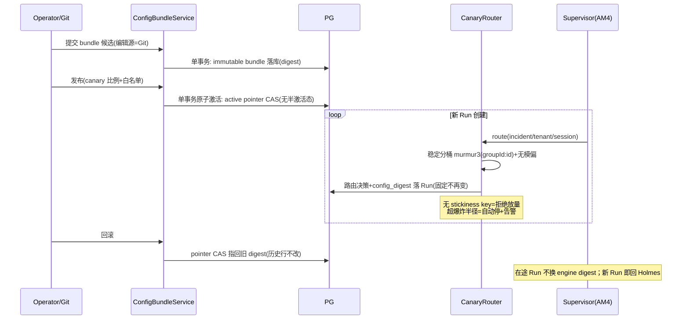
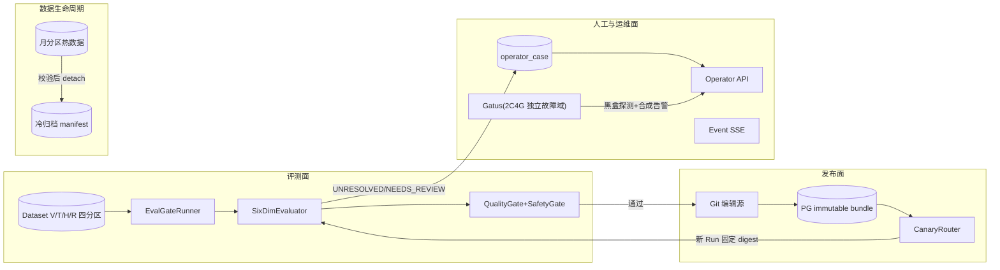

# 告警 AM5 评测发布门与长期运维 —— 技术方案与任务拆解（v1.0）

> 文档信息：2026-09-06 起草；状态 = **待 G1 评审**。**动工硬前提 = AM4 G2**（M5-01 依赖 M4-38，拆解原文）。
> 任务编号对齐 `docs/告警Agent-增量实现任务拆解-v1.md` §8（M5-01~22，主会话已亲自通读原文）。
> 设计依据：架构 v1.2（FUT-05 Shadow→Canary→Primary / FUT-17 ConfigBundle / FUT-40 采样指纹 / FUT-42 数据集四分区 / FUT-43 Operator Case / FUT-45 RetentionPolicy；§9 六维评测；§17.5 模型抽象与版本指纹；OPA PDP 备忘 §17.x）；调研证据 E-16（M4 机制源码级）、**E-17（`docs/告警-调研-M5发布门与运维-v1.md`，12 仓源码级）**；AM3 已落地资产（eval_run/eval_case_result V10、评分三件套、LiteLLM 对账、基线报告）。
> 调研五步法留痕：学同类（E-17：Unleash/flagd/OPA/Inspect AI/Keep/Alerta/pg_partman/Gatus 等 12 对象源码级）→ 学坑（Unleash random 回退、NOTIFY 三边界、分区表唯一约束含分区键、C/(C-1) 校正）→ 适配性判断（逐条见 §6/E-17 §9）→ 引入代价（§11）→ 旧账回看（AM3 遗留见 §9/§10）。

---

## 1. 核心问题

AM3 让"5 个场景能算准确率"，AM4 让 Native 内核可对照。AM5 要解决：**"哪个版本能上线"由证据决定，而不是由感觉决定**——并且把人工处置、可观测性出口、数据生命周期这三件长期运维的事收口（拆解原文 §8 目标）。

四个子问题：

1. **评测可信度**：样本从 5 场景走向分层数据集，统计上必须承认非确定性（采样指纹 + 配对重复试验 + 方差区间），门禁不能只看单一 F1（FUT-40/42）。
2. **发布与切流**：Prompt/规则/阈值/模型路由组成不可变 ConfigBundle，Run 启动固定 config_digest；Native 从 Shadow 走向 Canary 要有稳定分桶与爆炸半径上限，随时能一刀回 Holmes（FUT-05/17）。
3. **人工收口**：模型的不确定性（UNRESOLVED/NEEDS_REVIEW/预算耗尽）要幂等聚合成 Operator Case，有去重、认领、SLA、终态——不许散落在日志里（FUT-43）。
4. **长期运维**：遥测独立出口不反噬业务；控制面自己的告警不进入 RCA（防自噬）；数据有分区、归档、legal hold；历史假设检索只做受控实验。

**本期不做**：R2/R3 写动作执行本体（只引入审批态 WAITING_APPROVAL 与 OPA PDP 评估门）；pgvector 默认不启用（M5-21 是可行性门不是建设任务）；任何 UI（先 API 后 UI）。

## 2. 任务拆解（M5-01~22 全量，五阶段）

| 阶段 | 任务 | 内容 | 依赖 |
|---|---|---|---|
| A 数据与权限底座 | M5-01~03 | DatasetVersion/CaseVersion insert-only；四分区物理隔离；Golden Candidate 双人复核工作流 | M4-38 |
| B 评测与门禁 | M5-04~08 | 采样指纹；配对重复试验+cluster bootstrap；六维 Evaluator；硬安全门 fail-closed；质量门/运行门 | M5-01~03 |
| C 发布与切流 | M5-09~10 | ConfigBundle 发布/回滚；Canary Router 稳定分桶 | M5-08 |
| D 人工与观测收口 | M5-11~17 | OperatorCase 状态机；Operator API；rca_event SSE；Cancel/Hint/Feedback；三支柱完整化；防自噬路由；Gatus 探针 | M5-09/10、M4-37 |
| E 数据生命周期与检索 | M5-18~21 | 月分区 RetentionPolicy；冷归档 manifest；FTS 实验（默认关闭）；pgvector 可行性门 | M5-01、M5-02/06 |
| 收口 | M5-22 | AM5 G2（Shadow→Canary 前正式评审） | M5-10~21 |

**迁移编号**：AM4 占 V12~V18（V18 = M4-04 跨 run 连边约束补强，2026-09-06 顺延裁定）；**AM5 自 V19 起，一迁移一任务**：V19=DatasetVersion/CaseVersion（M5-01）、V20=四分区角色与 RLS（M5-02）、V21=golden_candidate（M5-03）、V22=config_bundle+active pointer（M5-09）、V23=operator_case+outbox 关联（M5-11）、V24=月分区改造（M5-18）。G2 前若 AM4 再顺延，以当时实际最大编号+1 起排并在落码方案重冻结。

## 3. 类设计

### 3.1 domain 层新增（`eval/domain/`、`ops/domain/`、`release/domain/`）

| 类 | 职责 | 不做 |
|---|---|---|
| `model/DatasetVersion` / `CaseVersion` | insert-only 版本实体（适用期 valid_from/valid_to、content_digest） | 不实现评分 |
| `model/GoldenCandidate` + 状态机 | 人工纠错候选（DRAFT→REVIEW→PUBLISHED/REJECTED/WITHDRAWN）；**双人复核、同人不能双签** | 不直接改已发布 GT |
| `model/SamplingFingerprint` | temperature/top_p/max_tokens/seed（请求+生效两态）/provider fingerprint/trial 序号；缺字段不可进正式门禁（FUT-40） | — |
| `service/PairedTrialStats` | 纯函数：重复次数、翻转率、**cluster bootstrap 区间（C/(C-1) 无偏校正，1000 重采样）**（E-17：Inspect AI `std.py:109-115` 先例） | 不触网 |
| `service/SixDimEvaluator` | 结果/过程/工具/成本/协作/安全分别计算；每项原始计数可追溯到 event/evidence | 不聚合成单一分 |
| `service/QualityGate` / `SafetyGate` | 阈值版本化判定；小样本不自动放行；门禁解释完整（每维计数+区间+未过原因）；安全门任一失败 fail-closed | 不用单一 F1 |
| `model/ConfigBundle` | 不可变配置束（prompt/规则/工具策略/模型路由/阈值 + bundle digest/revision）；active pointer | 不含密钥 |
| `service/CanaryBucketer` | 纯函数稳定分桶：murmur3(`groupId:id`) 归一化 + flagd 无模偏公式 `(hash*totalWeight)>>32`（E-17：`fractional.go:196-207`）；**无 stickiness key = 拒绝放量**（修 Unleash random 回退坑） | 不持有运行态 |
| `model/OperatorCase` + 状态机 | UNRESOLVED/NEEDS_REVIEW/预算耗尽幂等合并（fingerprint 分桶）；ISA 18.2 式 action 驱动状态机（E-17：alerta `isa_18_2.py:99-140`）+ 认领/SLA/终态 | 不自动改 Run 结论 |
| `model/RetentionPolicy` | 版本化保留策略（月 RANGE 分区、legal hold、冷层位置） | 固定天数只是初始基线 |

### 3.2 application 层新增

| 类 | 职责 |
|---|---|
| `GoldenCandidateService` | 候选工作流编排（双人复核事务：两签不同人同事务校验） |
| `EvalGateRunner` | 复用 AM3 EvalRunner 跑批 → 六维计算 → 门禁判定 → EvaluationRecordV1 落档 |
| `ConfigBundleService` | Git 编辑源 → PG immutable bundle 落库 → **单事务原子激活（无半激活态，OPA `plugin.go:607-660` 先例）** → active pointer CAS；回滚 = pointer 指回旧 digest，不改历史行 |
| `CanaryRouter` | 新 Run 创建点的路由决策：读 active bundle + 分桶 + 爆炸半径上限（超上限自动停放量并告警）；**立即回退 Holmes 为一等操作** |
| `OperatorCaseService` | 幂等合并（`(tenant,fingerprint)` FOR UPDATE——E-17：keep `db.py:5690-5706` 先例）+ **并发认领 CAS（expected-version，keep 无并发保护须自加固）** + SLA 升级事件 |
| `EventQueryService` / `SseStreamService` | after_seq 游标回放 + 脱敏 + 背压；断线不取消 Run；**PG NOTIFY 只作唤醒信号，真身走表**（E-17：官方三边界 <8000B/8GB 队列/断连丢失） |
| `CommandService` | Cancel/Hint/Feedback：先持久化再生效；Hint 标 UNTRUSTED 进上下文；幂等命令 + 旧 revision 拒绝 |
| `ArchiveService` | 导出 → 条数/digest 校验 → `DETACH PARTITION CONCURRENTLY`；失败不删热数据；legal hold 阻断 |
| `ControlAlertRouter` | 入口二次判断：校验身份 + 允许的 AM route + monitoring_scope 白名单（不信 webhook body 同名 label）；RCA_SYSTEM → 独立值班通道，**不创建 Incident/Run** |

### 3.3 interfaces 层新增

- `OperatorApiController`：list/claim/ack/resolve（RBAC + 审计；先 API 后 UI）
- `EventQueryController`：rca_event 查询 + SSE 端点（游标过期/慢客户端/权限测试面）
- 审批态：AM5 引入 WAITING_APPROVAL 时走 OPA 独立 PDP **评估门**（决策带 decision_id + bundle revision + 脱敏 input digest 落审计；OPA 不可用 = R2/R3 fail-closed）——OPA 引入与否在落码方案 G1 前裁定

## 4. 关键时序

### 4.1 ConfigBundle 发布与 Canary 切流（含回滚）

## 5. 数据流与链路图

## 6. 具体实现方式（关键技术点）

- **数据集版本化**（M5-01~03）：insert-only，版本不可覆盖；四分区物理隔离（schema/角色/RLS——HOLDOUT 对 Agent/RAG 查询结果必须为 0，FUT-42）；人工纠错只进候选，双人复核发布（同人双签拒绝）；GT 权限隔离沿用 AM3 V11 延迟授权模式。
- **统计口径**（M5-04/05）：采样指纹全字段落 Attempt 元数据；**seed 仅部分 provider 支持、provider fingerprint 必须单列**（E-17：Inspect AI `_generate_config.py:126-127` 实证）；配对重复试验 + cluster bootstrap（C/(C-1) 校正）；Promptfoo 无显著性统计，只借其 redteam 插件素材。
- **门禁**（M5-07/08）：安全门任一失败 fail-closed（schema/越权/注入/跨租户/写意图五面）；质量门阈值版本化入 ConfigBundle；小样本（未达最小试验数）不自动放行；门禁输出完整解释（每维计数+区间+未过原因）。
- **ConfigBundle**（M5-09，FUT-17）：Git 是唯一编辑源；PG 存 immutable bundle；激活单事务原子；老 Run 固定旧 digest 热更新只影响新 Run；密钥不入 bundle；决策可回溯（每次裁决记录 bundle digest/revision——OPA decision_id/EventV1 先例）；Spring Cloud Config 兼容线已 EOL，不引入（E-17 裁定）。
- **Canary**（M5-10，FUT-05）：稳定分桶 murmur3+无模偏公式；黏性（同 session/tenant 恒同桶）；爆炸半径上限；回滚演练 = 立即回 Holmes + 在途 Run 不换 digest。
- **OperatorCase**（M5-11/12）：ISA 18.2 式 action 驱动状态机（转换规则名落日志可审计）；幂等合并 `(tenant,fingerprint)` 行锁；并发认领 expected-version CAS；连续三次/一小时聚集/SLA 升级。
- **事件查询/SSE**（M5-13）：NOTIFY 仅唤醒、真身走表 + after_seq 游标；超窗全量重放（Unleash delta API 先例）；脱敏沿用 AM3 白名单渲染防线；背压=慢客户端断开不拖垮 Run。
- **命令**（M5-14）：先持久化再生效；幂等键；旧 revision 拒绝；Hint 标 UNTRUSTED。
- **观测与防自噬**（M5-15~17）：Collector 独立出口/凭据/资源上限，遥测故障不影响业务状态；控制面告警独立 route 直达值班接收器、不建 Incident（入口二次判断不信 webhook body label）；Gatus 在 2C4G 独立故障域做黑盒 health + 合成 canary 告警（预算 96MiB，架构 §内存表已有）。
- **数据生命周期**（M5-18/19，FUT-45）：先按月 RANGE 分区；**分区表唯一约束必须含分区键**（E-17 坑）；归档 = 导出+条数/digest 校验后 `DETACH PARTITION CONCURRENTLY`，失败不删热数据；legal hold 阻断一切清理；pg_partman keep_table 为先例参照。
- **检索实验**（M5-20/21）：FTS 只产 UNTRUSTED_HYPOTHESIS、默认关闭、跨租户/HOLDOUT 查询为 0；pgvector 仅当 FTS 不足且 A/B 有价值时开门，HNSW 内存/recall/延迟需 195 实测数据齐全才接受（E-17 未核实项留门）。

## 7. 边界条件与不变量

| 编号 | 不变量 |
|---|---|
| INV-AM5-1 | Dataset/Case insert-only，历史不可覆盖；HOLDOUT 对 Agent/RAG/调优界面查询恒为 0 |
| INV-AM5-2 | 双人复核：同人不能双签；发布/拒绝/撤回状态机无旁路 |
| INV-AM5-3 | 采样指纹缺字段不得进入正式门禁；统计结论必须带区间，小样本不自动放行 |
| INV-AM5-4 | 安全门任一失败 fail-closed；RCA_SYSTEM 告警不创建 Incident/Run |
| INV-AM5-5 | ConfigBundle 不可变；激活/回滚单事务原子；老 Run 固定旧 digest；密钥不入 bundle |
| INV-AM5-6 | Canary 无 stickiness key 拒绝放量；爆炸半径超限自动停；一键回 Holmes 常可用 |
| INV-AM5-7 | OperatorCase 合并幂等；并发认领 CAS；命令先持久化再生效 |
| INV-AM5-8 | SSE 断线/慢客户端不影响 Run；遥测出口故障不影响业务状态 |
| INV-AM5-9 | 归档失败不删热数据；legal hold 阻断清理；FTS 默认关闭、pgvector 不过门不启用 |
| INV-AM5-10 | 迁移 AM5 自 V19 起；一迁移一任务；已发布迁移不得追加 |

残余风险：① RCA-100 数据集核实不存在（实为 RCAEval RE1/2/3 共 735 例，E-17【未核实】已澄清）——分层数据集主要自建；② 中文分词 zhparser 现状未核实，FTS 实验前补 spike；③ HNSW 内存估算需 195 实测定门；④ OPA 引入与否未定（独立 PDP vs 自研审批态，落码前裁定）；⑤ AM4 未完成的传导风险（M5-01 硬依赖 M4-38）。

## 8. 设计原因

- **稳定分桶抄 Unleash/flagd 双先例并修坑**：murmur3 归一化+无模偏公式是业界验证算法；Unleash 的 random 回退（无 stickiness key 时随机分桶）对本项目"可复现"铁律不可接受，改为拒绝放量（E-17 `flexible-rollout-strategy.ts:26-28`）。
- **统计口径抄 Inspect AI 不抄 Promptfoo**：cluster bootstrap + 无偏校正是有源码的严肃实现；Promptfoo 无显著性统计（E-17 实证），只借素材不借方法。
- **ConfigBundle 抄 OPA 四件套**：单事务原子激活/Revision+ETag/decision_id 审计/决策日志带 bundle revision——"每次裁决可回溯配置版本"有直接先例。
- **OperatorCase 抄 alerta+keep 并自加固**：ISA 18.2 状态机是工单领域标准；keep 幂等合并形态可用但无并发保护，认领 CAS 用 AM4 expected-version 同构自加固。
- **NOTIFY 只作唤醒**：官方三边界坐实其不能当事件真身；表+游标才是真相源（与本项目 PG 事实源铁律一致）。

## 9. 问题与压力点

| 编号 | 压力点 | 触发信号 |
|---|---|---|
| P-51 | AM4 未完成传导（M5-01 依赖 M4-38） | AM4 G2 进度 |
| P-52 | 分层数据集自建工作量大（RCA-100 不存在） | M5-01 数据集盘点时 |
| P-53 | 六维中"协作/过程"维的确定性定义难度 | M5-06 指标定义评审 |
| P-54 | Canary 真流量需要足够告警量才有统计意义 | AM5 后期生产数据量 |
| P-55 | 月分区改造涉及 AM1~AM4 存量大表（rca_event/evidence/alert_inbox） | M5-18 设计评审 |
| P-56 | 2C4G 机器可用性与 Gatus 部署 | M5-17 环境确认 |

## 10. 实际后果记录

- AM3 实测：eval 47 案例真实命中率 0（模型/词典校准面）——六维评测与分层数据集的现实起点；eval_run 滞留 RUNNING 无 reap（M5-11 OperatorCase/AM4 M4-37 的现实用例）。
- AM3 评测批与 AM 收敛机制冲突（nflog 跨重启/同代幂等去重）——M5 重复试验设计必须内建"批间隔离"配方（等 resolve 投递/清 nflog/临时放宽 group_interval 三件套，事后还原）。
- BA-22 指纹算法实测修正：凡涉及指纹/摘要的断言必须实测校准（M5-04 采样指纹同理）。
- 安全事件：docker exec env dump 曾带明文 key 进会话——M5 命令/SSE/Operator API 的脱敏防线必须覆盖运维面，LITELLM_MASTER_KEY 轮换仍开放。

## 11. 技术债分析

- AM3 评分器是单场景三维精确匹配，六维化是演进非推翻——但拖越久，eval_run/eval_case_result 历史 schema 迁移成本越高（V19 一并考虑视图兼容）。
- AM1~AM4 配置散在 yml/env/compose，ConfigBundle 落地前每多一个配置键就多一分回收成本；M5-09 设计须含存量配置清点迁移。
- 人工处置缺位期间，UNRESOLVED/NEEDS_REVIEW 持续累积无认领——M5-11 前每周人工巡检台账兜底（过渡纪律）。
- 不建分区的时间债：rca_event/alert_inbox 单调增长，195 磁盘 74% 已是瓶颈方向（P7 备料实测），M5-18 越晚越难做在线改造。

## 12. 测试用例设计

- **L0**：分层铁律 ArchUnit 套件延续；新状态机（GoldenCandidate/OperatorCase）穷举+接线行为化断言
- **L1**：PairedTrialStats（固定样例统计：翻转率/区间/校正公式）；CanaryBucketer（分布均匀性/黏性/无 key 拒绝/无模偏）；QualityGate（小样本不放行/阈值版本化/解释完整性）；六维各自原始计数纯函数
- **L2**（Testcontainers PG）：V19~V24 迁移契约；insert-only 不可覆盖 IT；HOLDOUT 查询为 0（Agent/RAG 身份矩阵）；同人双签拒绝 IT；bundle 原子激活/回滚不改历史 IT；OperatorCase 幂等合并+并发认领 CAS IT；月分区路由/跨月查询/legal hold IT；归档损坏包/冷层不可用演练 IT
- **L3**：ConfigBundle 发布→Canary 切流→回滚全链（老 Run 固定 digest）；SSE 断线重连/慢客户端/游标过期；命令幂等/旧 revision/越权
- **L4**：安全门五面 fail-closed 正反样本；控制面合成告警不建 Incident；遥测出口故障业务无感
- **L5**（195 部署门）：Shadow→Canary 门禁演示；Gatus 在 195/control 挂时独立告警演练；归档→恢复查询演练；FTS 实验开/关两态
- 每 E2E 证据包沿用 AA-26 契约 + EvaluationRecordV1（dataset/version、engine/version、六维指标、gate result、artifact refs）

## 13. 验收标准（DoD）

1. M5-01~22 单项验收全过（拆解原文验收列）；L0~L5 全绿（195 真栈 + 2C4G Gatus）
2. INV-AM5-1~10 红绿留证
3. Shadow→Canary 前正式评审材料齐备（安全、质量、运行、人工、归档、回退演练全绿）
4. 证据归档（AA-26 契约）；台账三件套同步
5. 动工硬前提：AM4 G2 通过；落码方案（V19 起编号重冻结）先行

## 14. 修订记录

| 日期 | 版本 | 变更 |
|---|---|---|
| 2026-09-06 | v1.0 | 初稿：亲自读任务拆分 §8 原文后出具；调研五步法留痕（E-17 源码级 12 仓）；迁移自 V19 起（AM4 已占至 V18，M4-04 顺延裁定）；动工硬前提 AM4 G2 |
