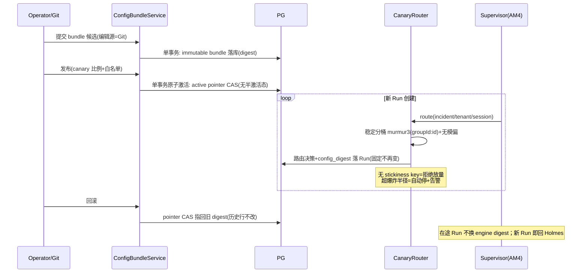
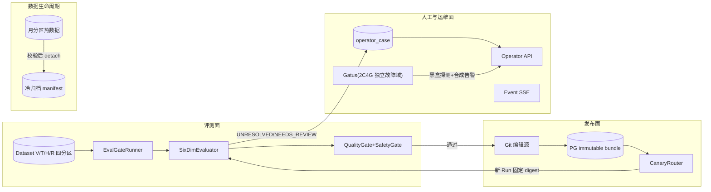

# 告警 AM5 评测发布门与长期运维 —— 技术方案与任务拆解（v1.2）

> 文档信息：2026-09-06 起草 v1.0；2026-09-06 G1 评审退回升 v1.1；**2026-09-07 补齐 AM5 独立端到端与真实业务场景门，升 v1.2**；状态 = ~~待 G1 复审（v1.2）~~ **G1 已签（2026-09-07）→ G2 已签（2026-09-08 用户裁定"AM5 结束了"）**——G2 附条件留痕：E2E-AM5-00~10 未跑全（preflight 8/10，两项外部缺口按契约拦停），三项外部裁定（Gatus 部署/AM5_LLM_BUDGET_CAP/RCA-100 授权）经用户裁定**转入 M6 期处置**。**动工硬前提 = AM4 G2**（M5-01 依赖 M4-38，拆解原文）。
> 任务编号对齐 `docs/告警Agent-增量实现任务拆解-v1.md` §8（M5-01~22，主会话已亲自通读原文；E-17 §9 编号错位已在 E-17 v1.1 按 §8 重映射）。
> 设计依据：架构 v1.2（FUT-05 Shadow→Canary→Primary / FUT-17 ConfigBundle / FUT-40 采样指纹 / FUT-42 数据集四分区 / FUT-43 Operator Case / FUT-45 RetentionPolicy；§9 六维评测；§17.5 模型抽象与版本指纹；**line 761 "RCAEval 小子集静态回放 + RCA-100 Adapter 外部一致性集"**——G1 评审坐实 AM5 v1.0"RCA-100 不存在"结论错误，v1.1 回归冻结架构口径）；调研证据 E-16（M4 机制源码级）、**E-17（`docs/告警-调研-M5发布门与运维-v1.md`，12 仓源码级，v1.1 已修正 RCA-100/统计口径/编号）**；AM3 已落地资产（eval_run/eval_case_result V10、评分三件套、LiteLLM 对账、基线报告）。
> 调研五步法留痕：学同类（E-17：Unleash/flagd/OPA/Inspect AI/Keep/Alerta/pg_partman/Gatus 等 12 对象源码级）→ 学坑（Unleash random 回退、NOTIFY 三边界、分区表唯一约束含分区键、C/(C-1) 校正）→ 适配性判断（逐条见 §6/E-17 §9）→ 引入代价（§11）→ 旧账回看（AM3 遗留见 §9/§10）。

---

## 1. 核心问题

AM3 让"5 个场景能算准确率"，AM4 让 Native 内核可对照。AM5 要解决：**"哪个版本能上线"由证据决定，而不是由感觉决定**——并且把人工处置、可观测性出口、数据生命周期这三件长期运维的事收口（拆解原文 §8 目标）。

四个子问题：

1. **评测可信度**：样本从 5 场景走向**三层数据集**——订单域私有集（order-arena+脱敏生产回归）= 主质量门决定上线；RCA-100 v1.1（阿里云 STAROps，103 例，Adapter 接入）= 外部一致性辅助门；RCAEval RE2/RE3 子集 = 辅助回归（FUT-40/42 + 架构 v1.2 line 761）。统计上必须承认非确定性（采样指纹 + 配对重复试验 + 方差区间），门禁不能只看单一 F1；独立 cluster 不足必须 INCONCLUSIVE，公共 benchmark 不得冒充私有 HOLDOUT。
2. **发布与切流**：Prompt/规则/阈值/模型路由组成不可变 ConfigBundle，Run 启动固定 config_digest；Native 从 Shadow 走向 Canary 要有稳定分桶与爆炸半径上限，随时能一刀回 Holmes（FUT-05/17）。在线 Canary 无 GT，只判安全/运行稳定性/成本/disagreement——语义质量仍来自离线 HOLDOUT 或人工结案。
3. **人工收口**：模型的不确定性（UNRESOLVED/NEEDS_REVIEW/预算耗尽）要幂等聚合成 Operator Case，有去重、认领、SLA、终态——不许散落在日志里（FUT-43）。
4. **长期运维**：遥测独立出口不反噬业务；控制面自己的告警不进入 RCA（防自噬）；数据有分区、归档、legal hold；历史假设检索只做受控实验。

**本期不做**：R2/R3 写动作执行本体，**审批态 WAITING_APPROVAL 与 OPA PDP 一并延期**（v1.0 自相矛盾——声明不做 R2/R3 却又引入审批 PDP；G1 评审裁定：本期仅保留 ConfigBundle 的策略版本字段，R2/R3 真正启用时再评估 OPA）；pgvector 默认不启用（M5-21 是可行性门不是建设任务）；任何 UI（先 API 后 UI）。

## 2. 任务拆解（M5-01~22 全量，五阶段）

| 阶段 | 任务 | 内容 | 依赖 |
|---|---|---|---|
| A 数据与权限底座 | M5-01~03 | DatasetVersion/CaseVersion insert-only + **统一 DatasetAdapter（OrderArena/Rca100/RcaEval，外部数据转 EvalCaseV1、三层数据集）**；四分区物理隔离；Golden Candidate 双人复核工作流 | M4-38 |
| B 评测与门禁 | M5-04~08 | 采样指纹；配对重复试验+cluster bootstrap；六维 Evaluator；硬安全门 fail-closed；质量门/运行门 | M5-01~03 |
| C 发布与切流 | M5-09~10 | ConfigBundle 发布/回滚；Canary Router 稳定分桶 | M5-08 |
| D 人工与观测收口 | M5-11~17 | OperatorCase 状态机；Operator API；rca_event SSE；Cancel/Hint/Feedback；三支柱完整化；防自噬路由；Gatus 探针 | M5-09/10、M4-37 |
| E 数据生命周期与检索 | M5-18~21 | 月分区 RetentionPolicy；冷归档 manifest；FTS 实验（默认关闭）；pgvector 可行性门 | M5-01、M5-02/06 |
| 收口 | M5-22 | AM5 G2（Shadow→Canary 前正式评审；**AM5 独立 E2E-AM5-00~10 与真实订单场景证据为硬门**） | M5-10~21 |

**迁移编号**：AM4 占 V12~V18（V18 = M4-04 跨 run 连边约束补强，2026-09-06 顺延裁定）；**AM5 自 V19 起，一迁移一任务**：V19=DatasetVersion/CaseVersion（M5-01）、V20=四分区角色与 RLS（M5-02）、V21=golden_candidate（M5-03）、V22=config_bundle+active pointer（M5-09）、V23=operator_case+outbox 关联（M5-11）、V24=月分区改造（M5-18）。G2 前若 AM4 再顺延，以当时实际最大编号+1 起排并在落码方案重冻结。

## 3. 类设计

### 3.1 domain 层新增（`eval/domain/`、`ops/domain/`、`release/domain/`）

| 类 | 职责 | 不做 |
|---|---|---|
| `model/DatasetVersion` / `CaseVersion` | insert-only 版本实体（适用期 valid_from/valid_to、content_digest）；**来源字段全集 source/name/version/source_uri/license/access_class/content_digest/adapter_version/imported_at；`source_class`（PRIVATE/PUBLIC_BENCHMARK）+ `scenario_family_id`（整组分区键）**（v1.1） | 不实现评分 |
| `port/DatasetAdapter` + `OrderArena/Rca100/RcaEval` 三实现 | 外部数据集统一转内部 `EvalCaseV1`；保留原始 artifact 不覆盖来源字段；RCA-100 固定 v1.1+manifest digest（禁 latest）、answer key 授权核查前置、选中 Case 转冻结 Snapshot+`REPLAY_MOCK` 夹具（不部署其 ACK/K8s 环境）；RCAEval 只按 Case 下载 Parquet 子集（v1.1，架构 v1.2 line 761） | 不在 2C4G 解压 RCAEval 全量 |
| `model/GoldenCandidate` + 状态机 | 人工纠错候选（DRAFT→REVIEW→PUBLISHED/REJECTED/WITHDRAWN）；**双人复核、同人不能双签** | 不直接改已发布 GT |
| `model/SamplingFingerprint` | temperature/top_p/max_tokens/seed（请求+生效两态）/provider fingerprint/trial 序号；缺字段不可进正式门禁（FUT-40） | — |
| `service/PairedTrialStats` | 纯函数：重复次数、翻转率、配对差值区间。**统计口径冻结（v1.1，纠正 v1.0 把两算法混写）**：clustered SE 的 C/(C-1) 是有限 cluster 修正；cluster bootstrap 是整组有放回重采样、不再套该修正——AM5 采用"配对差值按 `independence_group_id`/`scenario_family_id` 聚类 + bootstrap 整组重采样（默认 1000 次）"，单独记录 stats_seed/算法版本/重采样次数/CI 方法；**独立 cluster 数不足返回 INCONCLUSIVE，禁止收窄到零的假区间**（E-17：Inspect AI `std.py:18-51,109-115` 先例） | 不触网 |
| `service/SixDimEvaluator` | 结果/过程/工具/成本/协作/安全分别计算；每项原始计数可追溯到 event/evidence；**结果维只用 AC@1——无 `candidate_root_causes[]` 契约时禁算 AC@3/5；chance/lift 只校正随机排名基线、不解小样本**（v1.1，E-17：RCAEval `evaluation.py:69-137`） | 不聚合成单一分 |
| `service/QualityGate` / `SafetyGate` | 阈值版本化判定；门禁解释完整（每维计数+区间+未过原因）；安全门任一失败 fail-closed。**质量门五分支冻结逻辑（v1.1）**：安全违规>0→REJECT；独立 cluster/关键分层数量不足→INCONCLUSIVE；任一关键维配对差值 CI 下界<-margin→REJECT；运行门超预算/延迟/错误率→REJECT；全部通过→ELIGIBLE_FOR_CANARY。在线 Canary 无 GT 只判安全/运行/成本/disagreement，语义质量仍来自离线 HOLDOUT 或人工结案 | 不用单一 F1 |
| `model/ConfigBundle` | 不可变配置束（prompt/规则/工具策略/模型路由/阈值 + bundle digest/revision）；active pointer | 不含密钥 |
| `service/CanaryBucketer` | 纯函数稳定分桶：murmur3(`groupId:id`) 归一化 + flagd 无模偏公式 `(hash*totalWeight)>>32`（E-17：`fractional.go:196-207`）；**无 stickiness key = 拒绝放量**（修 Unleash random 回退坑） | 不持有运行态 |
| `model/OperatorCase` + 状态机 | UNRESOLVED/NEEDS_REVIEW/预算耗尽幂等合并（fingerprint 分桶）；ISA 18.2 式 action 驱动状态机（E-17：alerta `isa_18_2.py:99-140`）+ 认领/SLA/终态 | 不自动改 Run 结论 |
| `model/RetentionPolicy` | 版本化保留策略（月 RANGE 分区、legal hold、冷层位置） | 固定天数只是初始基线 |

### 3.2 application 层新增

| 类 | 职责 |
|---|---|
| `GoldenCandidateService` | 候选工作流编排（双人复核事务：两签不同人同事务校验） |
| `EvalGateRunner` | 复用 AM3 EvalRunner 跑批 → 六维计算 → 门禁判定 → EvaluationRecordV1 落档 |
| `ConfigBundleService` | Git 编辑源 → PG immutable bundle 落库 → **单事务原子激活（无半激活态，OPA `plugin.go:607-660` 先例）** → active pointer CAS；回滚 = pointer 指回旧 digest，不改历史行 |
| `CanaryRouter` | 新 Run 创建点的路由决策：读 active bundle + 分桶 + 爆炸半径上限（超上限自动停放量并告警）；**立即回退 Holmes 为一等操作** |
| `OperatorCaseService` | 幂等合并（`(tenant,fingerprint)` FOR UPDATE——E-17：keep `db.py:5690-5706` 先例）+ **并发认领 CAS（expected-version，keep 无并发保护须自加固）** + SLA 升级事件 |
| `EventQueryService` / `SseStreamService` | after_seq 游标回放 + 脱敏 + 背压；断线不取消 Run；**PG NOTIFY 只作唤醒信号，真身走表**（E-17：官方三边界 <8000B/8GB 队列/断连丢失） |
| `CommandService` | Cancel/Hint/Feedback：先持久化再生效；Hint 标 UNTRUSTED 进上下文；幂等命令 + 旧 revision 拒绝 |
| `ArchiveService` | 导出 → 条数/digest 校验 → `DETACH PARTITION CONCURRENTLY`；失败不删热数据；legal hold 阻断 |
| `ControlAlertRouter` | 入口二次判断：校验身份 + 允许的 AM route + monitoring_scope 白名单（不信 webhook body 同名 label）；RCA_SYSTEM → 独立值班通道，**不创建 Incident/Run** |

### 3.3 interfaces 层新增

- `OperatorApiController`：list/claim/ack/resolve（RBAC + 审计；先 API 后 UI）
- `EventQueryController`：rca_event 查询 + SSE 端点（游标过期/慢客户端/权限测试面）
- ~~审批态：AM5 引入 WAITING_APPROVAL 时走 OPA 独立 PDP **评估门**（决策带 decision_id + bundle revision + 脱敏 input digest 落审计；OPA 不可用 = R2/R3 fail-closed）——OPA 引入与否在落码方案 G1 前裁定~~【v1.1 延期裁定，G1 评审】**WAITING_APPROVAL 与 OPA PDP 本期整体不引入**（v1.0 声明不做 R2/R3 执行本体却又引入审批 PDP，自相矛盾）；本期 ConfigBundle 仅保留策略版本字段，R2/R3 真正启用时再评估 OPA sidecar 方案

## 4. 关键时序

### 4.1 ConfigBundle 发布与 Canary 切流（含回滚）

## 5. 数据流与链路图

## 6. 具体实现方式（关键技术点）

- **数据集版本化与三层数据集**（M5-01~03）：insert-only，版本不可覆盖；四分区物理隔离（schema/角色/RLS——HOLDOUT 对 Agent/RAG 查询结果必须为 0，FUT-42）；人工纠错只进候选，双人复核发布（同人双签拒绝）；GT 权限隔离沿用 AM3 V11 延迟授权模式。**三层数据集（v1.1，回归冻结架构 v1.2 line 761）**：① 订单域私有集（order-arena 故障注入 + 脱敏生产回归）= 主质量门，唯一决定上线；② **RCA-100 v1.1（阿里云 STAROps RCA-Bench，103 例）经 `Rca100Adapter` 接入 = 外部一致性辅助门**（不单独决定上线）——固定 v1.1 + manifest digest（禁浮动 latest）、answer key 授权核查前置（Redistribution 须联系维护方）、选中 Case 转冻结 Snapshot + `REPLAY_MOCK` 工具夹具（不部署其 ACK/Kubernetes 环境）；③ RCAEval RE2/RE3 子集经 `RcaEvalAdapter` = 辅助回归（只按 Case 下载 Parquet 子集，不在 2C4G 解压全量；不承担安全/协作门）。外部数据统一转内部 `EvalCaseV1`，保留原始 artifact 不覆盖来源字段；版本记录 source/name/version/source_uri/license/access_class/content_digest/adapter_version/imported_at 九字段；`source_class=PUBLIC_BENCHMARK` 不冒充私有 HOLDOUT；**同一故障注入模板的重复 Case 按 `scenario_family_id` 整组分区，禁止一部分进 TUNING、一部分进 HOLDOUT**（"5 场景扩 47 Case"统计上可能只有 5 个独立 cluster，不能当 47 个独立样本）。
- **统计口径**（M5-04/05）：采样指纹全字段落 Attempt 元数据；**seed 仅部分 provider 支持、provider fingerprint 必须单列**（E-17：Inspect AI `_generate_config.py:126-127` 实证）；配对重复试验 + 方差区间。**两个算法不混写（v1.1 澄清，纠正 v1.0）**：Inspect 的 C/(C-1) 是 clustered standard error 的有限 cluster 修正；cluster bootstrap 是整组有放回重采样，源码并不再套该修正——AM5 冻结为：配对差值按 `independence_group_id`/`scenario_family_id` 聚类、bootstrap 整组重采样、单独记录 stats_seed/算法版本/重采样次数/CI 方法、**cluster 数不足返回 INCONCLUSIVE（禁止收窄到零的假区间）**；Promptfoo 无显著性统计，只借其 redteam 插件素材；RCAEval 的 chance/lift 只校正随机排名基线、不解小样本；当前单根因输出只用 AC@1，无 `candidate_root_causes[]` 契约时禁止计算 AC@3/5。
- **门禁**（M5-07/08）：安全门任一失败 fail-closed（schema/越权/注入/跨租户/写意图五面）；质量门阈值版本化入 ConfigBundle；门禁输出完整解释（每维计数+区间+未过原因）。**质量门五分支冻结逻辑（v1.1）**：安全违规>0→REJECT；独立 cluster/关键分层数量不足→INCONCLUSIVE；任一关键维配对差值 CI 下界<-margin→REJECT；运行门超预算/延迟/错误率→REJECT；全部通过→ELIGIBLE_FOR_CANARY。在线 Canary 无 GT，只判安全/运行稳定性/成本/disagreement；语义质量仍来自离线 HOLDOUT 或人工结案。
- **ConfigBundle**（M5-09，FUT-17）：Git 是唯一编辑源；PG 存 immutable bundle；激活单事务原子；老 Run 固定旧 digest 热更新只影响新 Run；密钥不入 bundle；决策可回溯（每次裁决记录 bundle digest/revision——OPA decision_id/EventV1 先例）；Spring Cloud Config 与本项目 Boot 3.4.5 对应的 2024.0 release train 已退出 OSS 支持且模型不匹配，不引入（E-17 裁定；措辞修正：产品仍在维护，非"已 EOL"）；**OPA 本体本期不引入（WAITING_APPROVAL/PDP 延期，v1.1 裁定），ConfigBundle 仅保留策略版本字段，R2/R3 真正启用时再评估 OPA**。
- **Canary**（M5-10，FUT-05）：稳定分桶 murmur3+无模偏公式；黏性（同 session/tenant 恒同桶）；爆炸半径上限；回滚演练 = 立即回 Holmes + 在途 Run 不换 digest。
- **OperatorCase**（M5-11/12）：ISA 18.2 式 action 驱动状态机（转换规则名落日志可审计）；幂等合并 `(tenant,fingerprint)` 行锁；并发认领 expected-version CAS；连续三次/一小时聚集/SLA 升级。
- **事件查询/SSE**（M5-13）：NOTIFY 仅唤醒、真身走表 + after_seq 游标；超窗全量重放（Unleash delta API 先例）；脱敏沿用 AM3 白名单渲染防线；背压=慢客户端断开不拖垮 Run。
- **命令**（M5-14）：先持久化再生效；幂等键；旧 revision 拒绝；Hint 标 UNTRUSTED。
- **观测与防自噬**（M5-15~17）：Collector 独立出口/凭据/资源上限，遥测故障不影响业务状态；控制面告警独立 route 直达值班接收器、不建 Incident（入口二次判断不信 webhook body label）；Gatus 在 2C4G 独立故障域做黑盒 health + 合成 canary 告警（预算 96MiB，架构 §内存表已有）。
- **数据生命周期**（M5-18/19，FUT-45）：先按月 RANGE 分区；**分区表唯一约束必须含分区键**（E-17 坑）；归档 = 导出+条数/digest 校验后 `DETACH PARTITION CONCURRENTLY`，失败不删热数据；legal hold 阻断一切清理；pg_partman keep_table 为先例参照。
- **检索实验**（M5-20/21）：FTS 只产 UNTRUSTED_HYPOTHESIS、默认关闭、跨租户/HOLDOUT 查询为 0；pgvector 仅当 FTS 不足且 A/B 有价值时开门，HNSW 内存/recall/延迟需 195 实测数据齐全才接受（E-17 未核实项留门）。

## 7. 边界条件与不变量

| 编号 | 不变量 |
|---|---|
| INV-AM5-1 | Dataset/Case insert-only，历史不可覆盖；HOLDOUT 对 Agent/RAG/调优界面查询恒为 0；**公共 benchmark（`source_class=PUBLIC_BENCHMARK`）不得冒充私有 HOLDOUT；同一 `scenario_family_id` 整组分区，禁止拆跨 TUNING/HOLDOUT**（v1.1） |
| INV-AM5-2 | 双人复核：同人不能双签；发布/拒绝/撤回状态机无旁路 |
| INV-AM5-3 | 采样指纹缺字段不得进入正式门禁；统计结论必须带区间并记录 stats_seed/算法版本/重采样次数/CI 方法；**独立 cluster 不足返回 INCONCLUSIVE 而非收窄假区间；结果维只用 AC@1，无 `candidate_root_causes[]` 契约禁算 AC@3/5**（v1.1） |
| INV-AM5-4 | 安全门任一失败 fail-closed；RCA_SYSTEM 告警不创建 Incident/Run |
| INV-AM5-5 | ConfigBundle 不可变；激活/回滚单事务原子；老 Run 固定旧 digest；密钥不入 bundle；**本期不引入 OPA/WAITING_APPROVAL，bundle 仅保留策略版本字段**（v1.1） |
| INV-AM5-6 | Canary 无 stickiness key 拒绝放量；爆炸半径超限自动停；一键回 Holmes 常可用；**在线 Canary 无 GT，只判安全/运行/成本/disagreement，不据此宣称语义优劣**（v1.1） |
| INV-AM5-7 | OperatorCase 合并幂等；并发认领 CAS；命令先持久化再生效 |
| INV-AM5-8 | SSE 断线/慢客户端不影响 Run；遥测出口故障不影响业务状态 |
| INV-AM5-9 | 归档失败不删热数据；legal hold 阻断清理；FTS 默认关闭、pgvector 不过门不启用 |
| INV-AM5-10 | 迁移 AM5 自 V19 起；一迁移一任务；已发布迁移不得追加 |
| INV-AM5-11 | **AM5 必须有独立 E2E 与真实业务场景门**：公共 benchmark/单测/组件 IT/AM4 Shadow E2E 均不得替代；核心链含 mock/replay 时必须标 HYBRID/REPLAY，不得宣称 LIVE；真实候选未过私有门不得激活或放量 |

残余风险：① ~~RCA-100 数据集核实不存在（实为 RCAEval RE1/2/3 共 735 例，E-17【未核实】已澄清）——分层数据集主要自建~~【v1.1 推翻，G1 评审 P0】RCA-100 存在（阿里云 STAROps RCA-Bench，103 例，v1.1 现行）——残余风险转为 **answer key 授权核查**（Redistribution 须联系维护方，Adapter 接入前置）与 Adapter/REPLAY_MOCK 夹具开发工作量；② 中文分词 zhparser 现状未核实，FTS 实验前补 spike【M5-21 留痕：spike 属实验开门前置项，门面挂 deploy/pgvector/pgvector-gate-checklist.md，195 部署段激活】；③ HNSW 内存估算需 195 实测定门【M5-21 留痕：四门（recall/内存/延迟/备份）数据齐全才接受，采集骨架 deploy/pgvector/pgvector-metrics-collect.sh，判定线留实测后评审冻结】；④ ~~OPA 引入与否未定（独立 PDP vs 自研审批态，落码前裁定）~~【v1.1 已裁定】本期延期不引入（ConfigBundle 只留策略版本字段）——残余项：延期期间的审批需求以人工台账兜底；⑤ AM4 未完成的传导风险（M5-01 硬依赖 M4-38）。

## 8. 设计原因

- **稳定分桶抄 Unleash/flagd 双先例并修坑**：murmur3 归一化+无模偏公式是业界验证算法；Unleash 的 random 回退（无 stickiness key 时随机分桶）对本项目"可复现"铁律不可接受，改为拒绝放量（E-17 `flexible-rollout-strategy.ts:26-28`）。
- **统计口径抄 Inspect AI 不抄 Promptfoo**：clustered SE（C/(C-1) 有限 cluster 修正）与 cluster bootstrap（整组重采样）是有源码的严肃实现，两算法各司其职不混用（v1.1 澄清）；Promptfoo 无显著性统计（E-17 实证），只借素材不借方法。
- **三层数据集而非全部自建（v1.1）**：私有订单域集是唯一上线真值（统计功效与领域真值都在自己手里）；RCA-100/RCAEval 作外部一致性参照防"自产自销"过拟合，但以 `PUBLIC_BENCHMARK` 身份隔离、不冒充 HOLDOUT；Adapter 模式让数据集来源可扩展——新增 benchmark 只加 Adapter 实现，不动 `EvalCaseV1` 契约与门禁。
- **ConfigBundle 抄 OPA 四件套**：单事务原子激活/Revision+ETag/decision_id 审计/决策日志带 bundle revision——"每次裁决可回溯配置版本"有直接先例。
- **OperatorCase 抄 alerta+keep 并自加固**：ISA 18.2 状态机是工单领域标准；keep 幂等合并形态可用但无并发保护，认领 CAS 用 AM4 expected-version 同构自加固。
- **NOTIFY 只作唤醒**：官方三边界坐实其不能当事件真身；表+游标才是真相源（与本项目 PG 事实源铁律一致）。

## 9. 问题与压力点

| 编号 | 压力点 | 触发信号 |
|---|---|---|
| P-51 | AM4 未完成传导（M5-01 依赖 M4-38） | AM4 G2 进度 |
| P-52 | 外部数据集接入的授权与适配工作量（RCA-100 answer key 受控、Redistribution 须联系维护方授权核查；Rca100/RcaEval Adapter + REPLAY_MOCK 夹具开发；三层数据集 scenario_family 整组分区盘点） | M5-01 数据集盘点时 |
| P-53 | 六维中"协作/过程"维的确定性定义难度 | M5-06 指标定义评审 |
| P-54 | Canary 真流量需要足够告警量才有统计意义 | AM5 后期生产数据量 |
| P-55 | 月分区改造涉及 AM1~AM4 存量大表（rca_event/evidence/alert_inbox） | M5-18 设计评审 |
| P-56 | 2C4G 机器可用性与 Gatus 部署 | M5-17 环境确认 |

## 10. 实际后果记录

- AM3 实测：eval 47 案例真实命中率 0（模型/词典校准面）——六维评测与分层数据集的现实起点；eval_run 滞留 RUNNING 无 reap（M5-11 OperatorCase/AM4 M4-37 的现实用例）。
- AM3 评测批与 AM 收敛机制冲突（nflog 跨重启/同代幂等去重）——M5 重复试验设计必须内建"批间隔离"配方（等 resolve 投递/清 nflog/临时放宽 group_interval 三件套，事后还原）。
- BA-22 指纹算法实测修正：凡涉及指纹/摘要的断言必须实测校准（M5-04 采样指纹同理）。
- 安全事件：docker exec env dump 曾带明文 key 进会话——M5 命令/SSE/Operator API 的脱敏防线必须覆盖运维面，LITELLM_MASTER_KEY 轮换仍开放。

- **AM5 部署段（195 真 PG，2026-09-08 收口）新增事故 BA-39~50 汇总**：BA-39 canary 审计仓储无 @Bean 装配（docker profile 启动即败，IT 手工 new 掩盖）；BA-40 V25 重建活跃索引漏 REPORTING 谓词（跨迁移回归，按 INV-AM5-10 未执行条款就地修复）；BA-41 IT 基座清场清单冻结在 AM2 时代漏 AM5 表 + SimplePropertyRowMapper 不支持 Map.class；BA-42 V25 漏序列授权/config_bundle_active 种子行被清场误删/DETACH 撞 owner 权限墙收口为 SECURITY DEFINER 函数/itR04 断言域窄化；BA-43 V25 修复回退丢 REPORTING 连坐 V12 契约 + archive_manifest 缺单向栅栏 + canary IT 两测试洞；BA-44 rca_event 幂等面 TOCTOU（分区表唯一约束必含分区键致 DB 兜底消失，应用面行锁关窗）+ uuid 列 getLong 映射错；BA-46 OperatorCase 状态机判定先于修订 CAS（败者语义错序）；BA-47 provider 指纹 fail-closed 占位符部署面缺键（启动崩溃循环）；BA-48~50 线束面（preflight 子进程丢函数面等，详见 BUGLOG）。**共性教训：部署段（真 PG+真装配+真启动）是 IT 与 UT 都替代不了的证据层；INV-AM5-10"未执行迁移可就地修复"条款首次实战应用成功。**

## 11. 技术债分析

- AM3 评分器是单场景三维精确匹配，六维化是演进非推翻——但拖越久，eval_run/eval_case_result 历史 schema 迁移成本越高（V19 一并考虑视图兼容）。
- AM1~AM4 配置散在 yml/env/compose，ConfigBundle 落地前每多一个配置键就多一分回收成本；M5-09 设计须含存量配置清点迁移。
- 人工处置缺位期间，UNRESOLVED/NEEDS_REVIEW 持续累积无认领——M5-11 前每周人工巡检台账兜底（过渡纪律）。
- 不建分区的时间债：rca_event/alert_inbox 单调增长，195 磁盘 74% 已是瓶颈方向（P7 备料实测），M5-18 越晚越难做在线改造。

## 12. 测试用例设计

### 12.1 分层测试

- **L0**：分层铁律 ArchUnit 套件延续；新状态机（GoldenCandidate/OperatorCase）穷举+接线行为化断言
- **L1**：PairedTrialStats（固定样例统计：翻转率/区间/**cluster 整组重采样不再套 C/(C-1)**/stats_seed、算法版本、重采样次数、CI 方法全记录/**cluster 不足返回 INCONCLUSIVE 禁假区间**）；DatasetAdapter 三实现（EvalCaseV1 转换/原始 artifact 保留/版本九字段/manifest digest 锚定/family 整组分区断言）；CanaryBucketer（分布均匀性/黏性/无 key 拒绝/无模偏）；QualityGate（**五分支冻结逻辑全路径**：安全违规→REJECT/cluster 不足→INCONCLUSIVE/CI 下界<-margin→REJECT/运行门超→REJECT/全过→ELIGIBLE_FOR_CANARY；阈值版本化/解释完整性）；六维各自原始计数纯函数（**结果维 AC@1 限定：无 `candidate_root_causes[]` 契约时计算 AC@3/5 直接拒绝**）
- **L2**（Testcontainers PG）：V19~V24 迁移契约；insert-only 不可覆盖 IT；HOLDOUT 查询为 0（Agent/RAG 身份矩阵 + **PUBLIC_BENCHMARK 身份对私有 HOLDOUT 面查询为 0**）；**scenario_family 整组分区 IT（同 family 拆分跨 TUNING/HOLDOUT 拒绝）**；同人双签拒绝 IT；bundle 原子激活/回滚不改历史 IT；OperatorCase 幂等合并+并发认领 CAS IT；月分区路由/跨月查询/legal hold IT；归档损坏包/冷层不可用演练 IT
- **L3**：ConfigBundle 发布→隔离 Canary 演练→回滚全链（老 Run 固定 digest）；SSE 断线重连/慢客户端/游标过期；命令幂等/旧 revision/越权
- **L4**：安全门五面 fail-closed 正反样本；控制面合成告警不建 Incident；遥测出口故障业务无感
- **L5**（195 + 2C4G 部署门）：执行 §12.3 的 E2E-AM5-00~10；AM4 Shadow E2E 只能作为前置资产，不能替代 AM5 发布门/OperatorCase/SSE/归档等 E2E

### 12.2 真实业务场景与真实性分级

AM5 至少冻结以下订单域场景为私有 `HOLDOUT` 的独立 family；每个 family 的变体与重复试验必须整组分区：

| 场景 | 真实入口与故障 | AM5 主要观察面 |
|---|---|---|
| B0 正常订单 | 通过 order-arena API 完成下单→库存→支付→履约，不注入故障 | 无误报、无虚假根因、无多余 OperatorCase；成本/时延基线 |
| B1 幂等破坏（F1） | 真实请求触发库存/支付重复处理 | Holmes/Native 同 Snapshot 配对评测；结果/过程/工具/成本六维证据与质量门 |
| B2 状态回跳（F2） | 真实订单状态从后态回写前态 | 根因与变更证据一致性；失败或分歧幂等聚合 OperatorCase |
| B3 延迟与超时未知（F3） | 真实依赖延迟/超时，结果不可立即判定 | UNRESOLVED/NEEDS_REVIEW、SSE 重连、Cancel/Hint/Feedback、SLA 升级 |
| B4 重复告警与预算耗尽 | 同一业务故障重复触发并限制 Native 预算 | 去重、耗尽零额外调用、OperatorCase 单例合并、Holmes 主路径不受影响 |

真实性标签必须写入套件 manifest 和 `EvaluationRecordV1`：

- **LIVE_BUSINESS**：从 order-arena 业务 API/故障注入口进入，真实经过 Prometheus、Alertmanager、control-app、Holmes/Native、LiteLLM 与 PG；触发后不得直写结果表伪造链路。
- **HYBRID_BUSINESS**：业务入口、指标和控制链为真，但因 AM4 当前限制，日志或变更证据来自冻结 replay fixture；必须列出被替代组件，不得对外声称“全真栈”。
- **PUBLIC_REPLAY**：RCA-100/RCAEval 固定版本回放，只证明 Adapter、外部一致性与回归，不代表订单域上线质量。
- **CONTROL_FIXTURE**：只验证门禁 happy-path/回滚机制的确定性对照候选；不得将其 `ELIGIBLE_FOR_CANARY` 结论冒充 Native 质量结论。

### 12.3 AM5 独立端到端套件（G2 硬门）

| ID | 类型 | 端到端场景 | 必须断言 |
|---|---|---|---|
| E2E-AM5-00 | LIVE_BUSINESS | B0 正常订单完整链 | 订单成功；无故障告警不制造 Incident/Claim/OperatorCase；Holmes 主路径与业务 SLO 不因评测面受损 |
| E2E-AM5-01 | LIVE/HYBRID_BUSINESS | B1~B4 从真实故障注入到私有 HOLDOUT 配对重复评测 | Holmes/Native 使用同一 `snapshot_digest`；GT 只在报告封存后由评分身份读取；family 整组分区；采样/配置/引擎指纹完整；真实候选依数据得到 REJECT/INCONCLUSIVE/ELIGIBLE，禁止把当前“47 Case 命中率 0”改写成通过；未通过时 active pointer 零变化、零放量 |
| E2E-AM5-02 | PUBLIC_REPLAY | RCA-100 v1.1 选定 Case + RCAEval RE2/RE3 子集经 Adapter→EvalCaseV1→评分 | 来源九字段、原始 artifact、manifest/content digest 可追；不能查询私有 HOLDOUT；公共结果只进辅助门。RCA-100 answer key 未获授权时必须走 fail-closed/NOT_AVAILABLE_AUTH，严禁伪造答案或以 RCAEval 顶名；该状态不宣称外部一致性通过 |
| E2E-AM5-03 | PUBLIC_REPLAY/安全 | prompt injection、跨租户、越权工具、写意图、非法 schema 五面红队输入穿过真实门禁 | 任一安全违规即 REJECT；零 ConfigBundle 激活、零 Canary、零外部写副作用；拒绝理由与原始计数可回溯 |
| E2E-AM5-04 | CONTROL_FIXTURE | 已通过的确定性对照候选→ConfigBundle 原子激活→运行中回滚 | 无半激活态；active pointer CAS；在途 Run 固定旧 digest；回滚后新 Run 立即取旧稳定 digest；历史 bundle 不变。只证明机制，不证明 Native 质量 |
| E2E-AM5-05 | LIVE/HYBRID_BUSINESS | 在 order-arena 隔离租户做 Canary 路由演练：有 key、无 key、同 key 重试、超爆炸半径、紧急回 Holmes | 同 key 恒桶；无 key 拒绝；路由决策/比例/bucket/bundle digest 全审计；超限自动停；回退只影响新 Run。**不得接生产告警流量，生产 1% Canary 属 M6-01** |
| E2E-AM5-06 | LIVE/HYBRID_BUSINESS | B2/B3/B4 产生 UNRESOLVED/NEEDS_REVIEW/预算耗尽→OperatorCase→双人并发认领→ack/resolve→SLA 升级 | 同 tenant+fingerprint 只合并一单；并发 CAS 恰一人成功；非法状态迁移拒绝；结案不回写篡改 Run；升级 outbox 恰一次 |
| E2E-AM5-07 | LIVE/HYBRID_BUSINESS | B3 调查期间消费 SSE，主动断网/重连/慢客户端，并提交 Cancel/Hint/Feedback | `Last-Event-ID/after_seq` 无丢失无重复语义；断线/慢客户端不取消或拖慢 Run；命令先落库、幂等、旧 revision/越权拒绝；Hint 始终 UNTRUSTED |
| E2E-AM5-08 | 真实部署演练 | 切断 OTel/Collector 出口、停 195 control endpoint，由 2C4G Gatus 独立探测 | 遥测故障不改变业务/Run 状态；认证后的 RCA_SYSTEM 告警只到独立值班通道且 Incident/Run 增量为 0；Gatus 在阈值内告警与恢复 |
| E2E-AM5-09 | 真实数据演练 | 专用历史月分区导出→digest/条数校验→detach→冷层查询恢复；并演练损坏包、冷层不可用、legal hold | 成功归档可按 manifest 恢复并对拍；三种失败分支热数据不删；legal hold 下 detach/delete 为 0；跨月查询结果不变 |
| E2E-AM5-10 | LIVE/HYBRID_BUSINESS | B1/B2 历史结论在 FTS off/on 两态检索；pgvector 门保持关闭并采集可行性指标 | FTS off 零历史注入；on 仅产 UNTRUSTED_HYPOTHESIS；跨租户/HOLDOUT 泄漏为 0；不得仅凭历史命中发布根因；pgvector 未过内存/recall/延迟门不得启用 |

E2E-AM5-01 必须同时保留两个结论面：**真实 Native 候选**按实际结果裁决（允许且预期出现 REJECT/INCONCLUSIVE，这是门禁正确工作的证据），另用 `CONTROL_FIXTURE` 验证 ELIGIBLE happy-path；二者证据、标签、报告不得混用。这样测试不以“强行让模型答对”换取绿灯。

### 12.4 E2E 证据包

每个 E2E 沿用 AA-26 契约，并至少包含：测试 ID/真实性标签/拓扑与版本；scenario_family/case/dataset 版本与来源；故障注入、业务请求和恢复时间线；incident/run/eval/operator_case/command/outbox ID；Snapshot/ConfigBundle/engine/tool/evidence/claim/report digest；GT 授权与“封存后才读”审计；采样指纹、每轮原始结果、六维原始计数、CI 与 gate reasons；Canary key/bucket/比例/路由决策；归档 manifest/digest/恢复对拍；Gatus 通知；执行命令、完整日志、机器可读断言与 SHA-256 清单。证据包必须脱敏，不能通过环境变量 dump 留存密钥。

以下任一情况不得报 E2E 通过：跳过用例；核心依赖不可达后自动换 mock；只检查 HTTP 200 不核对 PG 事实与副作用；直接改库制造终态；缺少真实性标签/版本指纹/原始计数；把公共 benchmark 或控制夹具结果写成生产候选质量结论。

### 12.5 与权威任务拆解的交付映射

不新增 M5 任务编号，也不改变 §8 的依赖顺序；E2E 资产随对应任务交付，M5-22 只负责部署串联复跑、证据汇总和 G2 裁决，禁止把测试债集中拖到收口：

| 权威任务 | 同步交付的 E2E 资产 |
|---|---|
| M5-01~03 | OrderArena/Rca100/RcaEval 数据适配夹具、family 分区与 GT 延迟授权脚本；E2E-AM5-01/02 数据面 |
| M5-04~08 | 配对试验、六维原始计数、统计与安全门 runner；E2E-AM5-01/03 裁决面 |
| M5-09~10 | ConfigBundle/Canary/回退 runner；E2E-AM5-04/05 |
| M5-11~12 | OperatorCase 幂等、并发认领、SLA runner；E2E-AM5-06 |
| M5-13~14 | SSE 断线/背压与命令 runner；E2E-AM5-07 |
| M5-15~17 | 遥测断链、防自噬与 2C4G Gatus runner；E2E-AM5-08 |
| M5-18~19 | 分区归档、损坏/不可用/legal hold、恢复对拍 runner；E2E-AM5-09 |
| M5-20~21 | FTS 两态与 pgvector 门 runner；E2E-AM5-10 |
| M5-22 | 先跑 E2E-AM5-00 正常业务基线，再无跳过复跑 E2E-AM5-01~10，汇总证据并执行 G2 |

## 13. 验收标准（DoD）

1. M5-01~22 单项验收全过（拆解原文验收列）；L0~L5 全绿（195 真栈 + 2C4G Gatus）；**E2E-AM5-00~10 无跳过并逐项归档证据**
2. INV-AM5-1~11 红绿留证
3. Shadow→Canary 前正式评审材料齐备（真实订单 B0~B4、安全、质量、运行、人工、SSE/命令、观测防自噬、归档、回退演练全绿）；真实 Native 候选若为 REJECT/INCONCLUSIVE，G2 可证明“门正确”但**不得批准候选切流**
4. 证据归档（AA-26 契约）；台账三件套同步
5. 动工硬前提：AM4 G2 通过；落码方案（V19 起编号重冻结）先行
6. AM5 仅完成隔离 Canary 能力与演练；生产 1% Canary 仍须进入 M6-01 并重新过安全/运行门，不得以 AM5 E2E 越权切生产

## 14. 修订记录

| 日期 | 版本 | 变更 |
|---|---|---|
| 2026-09-06 | v1.0 | 初稿：亲自读任务拆分 §8 原文后出具；调研五步法留痕（E-17 源码级 12 仓）；迁移自 V19 起（AM4 已占至 V18，M4-04 顺延裁定）；动工硬前提 AM4 G2 |
| 2026-09-07 | v1.1 | **G1 评审退回修订（暂不签 G1）**：① P0 修正 RCA-100 事实错误——存在且为阿里云 STAROps RCA-Bench（103 例，v1.1 现行，answer key 受控须授权核查），改"Adapter 接入外部一致性集"回归冻结架构 v1.2 line 761；数据集三层结构（订单域私有集=主质量门/RCA-100=辅助门/RCAEval RE2/RE3=辅助回归）+ DatasetAdapter/EvalCaseV1/版本九字段/source_class/scenario_family_id 整组分区落 §1/§2/§3/§6/§7；② 统计口径修正——C/(C-1)=clustered SE 有限 cluster 修正 vs cluster bootstrap 整组重采样不套该修正；质量门五分支冻结逻辑（含 INCONCLUSIVE 禁假区间）；AC@1 限定与 chance/lift 边界；在线 Canary 无 GT 只判运行面；③ OPA/WAITING_APPROVAL 本期延期（v1.0 自相矛盾修正），ConfigBundle 只留策略版本字段；④ Spring Cloud Config 措辞修正（2024.0 release train 退出 OSS 支持，非"已 EOL"）；⑤ 同步件：E-17 升 v1.1（§9 编号按拆解 §8 重映射、§3.3 推翻留痕）、OSS 证据清单 E-17 条目更正、AM4 头部统一 V12~V18、PROGRESS 时间线登记 |
| 2026-09-07 | v1.2 | **补齐 AM5 独立 E2E 与真实业务场景硬门**：新增 INV-AM5-11；冻结 B0 正常流、B1/F1 幂等破坏、B2/F2 状态回跳、B3/F3 超时未知、B4 重复告警/预算耗尽五类私有场景；引入 LIVE_BUSINESS/HYBRID_BUSINESS/PUBLIC_REPLAY/CONTROL_FIXTURE 真实性标签；展开 E2E-AM5-00~10（私有质量门、RCA-100/RCAEval Adapter、安全硬门、ConfigBundle、隔离 Canary、OperatorCase、SSE/命令、防自噬、归档恢复、FTS/pgvector）；冻结证据包、禁止伪 E2E 条件及 M5-01~22 同步交付映射；明确真实候选 REJECT/INCONCLUSIVE 不影响证明门禁正确但禁止切流，生产 1% Canary 仍归 M6-01；状态仍待 G1 复审，动工前提仍为 AM4 G2 |
| 2026-09-08 | v1.2r1 | **G2 签署（用户裁定"AM5 结束了"）**：部署段收口（195 真 PG IT 921+115 全绿零跳过、V20~V29 全 apply、栈升 main HEAD、preflight 8/10）；BA-39~50 事故汇总入 §10；附条件留痕——E2E-AM5-00~10 未跑全（11 场景骨架态，preflight 被 Gatus/预算上限两外部缺口按契约拦停），Gatus 部署（webhook+网络面）、AM5_LLM_BUDGET_CAP 设值、RCA-100 授权三项外部裁定经用户裁定转入 M6 期处置 |
