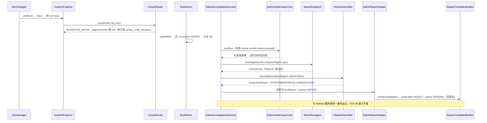
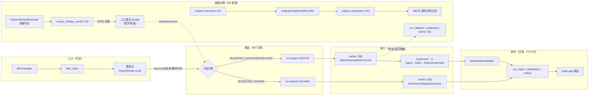

# 告警 AM6 逐步替换 HolmesGPT —— 技术方案与任务拆解（v1.1 G1 复审稿）

> 文档信息：2026-09-08 起草 v1.0；2026-09-08 独立调研与实现对拍后升 v1.1；2026-09-08 对账升 v1.1r1（BA-39/40 关闭态回写、V30 索引修复职责作废）；状态 = ~~G1 审查退回修订，待复审~~ **G1 已签（2026-09-08 用户签署），M6-01 已落码（fb4fe20）**。**放量硬前提 = 本文其余 P0 项闭环 + live 前置清单（195 .env 真值/O-67 预算上限/窗参数冻结 O-63）**。
> 任务编号对齐 `docs/告警Agent-增量实现任务拆解-v1.md` §9（M6-01~07，已亲自通读原文）。拆解 §9 无目标引言段，M6 目标拼合自：拆解 :35（"最后 AM5/AM6 做发布治理与替换"）、:104（"Native 成为主路径，Holmes 只作回退，达标后退场"）、架构 v1.2 :1203（AM6+ 行）。
> 设计依据：架构 v1.2（FUT-05 Shadow→Canary→Primary 总纲 / FUT-06 同一冻结快照 / FUT-12 回退语义 / FUT-16 退场窗口 / FUT-39 容量降级 / FUT-42 HOLDOUT 纪律 / FUT-49 报告两轴 / FUT-51 在线只读端点；§10 Quality Gate 五分支伪代码 :804-815；§16 升级条件 :1211-1217）；AM4 已落资产（Native 影子链/Supervisor/ClaimReducer/ReportAssembler/ShadowToolFace/V12~V19）；AM5 已落资产（ConfigBundle V24/CanaryRouter V25/六维评测与门禁 V20~V23/operator 面 V26~V27）。
> 调研五步法留痕：学同类（E-20《告警-调研-M6渐进发布与引擎退场-v1.md》：Argo Rollouts/Flagger/Kayenta/OpenFeature·flagd/GitHub Scientist/Diffy/Strangler Fig/Google SRE，源码级；原号 E-19 已被前端 UI 调研占用，v1.1 纠号）→ 学坑（见 E-20 各对象"坑"节与本方案 §9）→ 适配性判断（逐条见 §7）→ 引入代价（§10）→ 旧账回看（AM4/AM5 遗留见 §8/§9）。
> **当前状态说明**（2026-09-08 对账）：AM5 部署段已在 195 收口（真 PG IT 921+115 全绿零跳过、栈升级 V20~V29、preflight 8/10）；**AM5 G2 已签（2026-09-08 用户裁定，接受 E2E 未跑全现状，Gatus 部署/AM5_LLM_BUDGET_CAP/RCA-100 授权三项外部裁定转入 M6 期处置——见 P-70）**；BA-39/40 已随部署段关闭，P0 ⑥ 闭环。M6 动工硬前提中"M5-22 G2 签署"已达成，剩余=本文其余 P0 项闭环 + 用户 G1 复审签署。

---

## 1. 核心问题

AM4 让 Native 内核在影子面跑通并留下全套机制（冻结快照/工具咽喉/预算账本/Claim 裁决）；AM5 让"哪个版本能上线"由证据决定（评测门禁/ConfigBundle/CanaryRouter）。**但 Canary 目前只有"路由意愿"没有"执行实体"**——工序 1 勘察坐实（详见 §3.4）：

- `RcaWorker` 只有单个 `RcaTaskExecutor`（Holmes），**claim/执行不看 `run.engine`**——今天若真有 run 被路由成 NATIVE，它会被 Holmes 执行器执行，路由决策形同虚设；
- `RcaTask.HOLMES_INVESTIGATE` 是唯一 taskKey，没有 NATIVE 任务形态；
- Native 链唯一生产可达入口是 E2E 一次性 `CommandLineRunner`（Am4ShadowTrigger），且 `ReportAssembler` 在 main 树**零调用点**——Native 走完也没有报告、没有通知；
- `AlertFlowConfig:259` `nativeReady` 硬编码 `false`（诚意降级 NATIVE_DEFERRED），无翻转通道；
- ~~另发现 M5-10 装配缺陷 **BA-39**……潜伏）——M5 部署段前置修复项。~~【2026-09-08 对账】**BA-39 已关闭**（部署段修复 9ebe952，195 真启动实证——崩溃循环实证暴露、修复后健康 200）。
- ~~V25 重建 `uq_rca_run_active_incident` 时把 V12 冻结的 `REPORTING` 漏出活跃谓词……必须用新迁移修复，禁止改写已发布 V25。~~【2026-09-08 对账】**BA-40 已关闭**：修复时 V25 尚未在任何已部署库执行，按 INV-AM5-10 未执行条款**就地修复**（14edd86①，195 真 PG 实证，谓词已补回 REPORTING）——原"AM6 V30 承担修复"的职责作废，V30 号段完整留给 canary 证据表。
- M6 v1.0 的 `nativeReady` 环境键与 ConfigBundle 是两个事实源，无法做到原子切换；fallback 只有事件字段、无数据库唯一栅栏；反向 Shadow 是一次性 runner，进程崩溃后无可恢复工作状态。

M6 要解决：**把 Native 从"影子里的引擎"变成"能吃生产流量的引擎"，再沿 1%→10%→50%→Primary 四级放量，每级以证据门晋升；Holmes 在物理删除前提供即时回切，删除后转为有 RTO/RPO 的制品恢复；历史永久可读。**

四个子问题：

1. **执行面接线**（M6-01 的核心工作量）：worker 按 engine 分派、NATIVE 任务形态、Native 提案来源版本化、Native 报告适配进既有发布链（FUT-49 两轴语义不变）。
2. **放量纪律**：每级晋升=连续窗口证据门（安全零事件/运行不劣/成本受控/disagreement 受控）+ **人工激活 ConfigBundle**（架构 :222 批准权在人工）；系统绝不自动升档/恢复放量，但安全或运行故障可自动 STOP 新 Native admission 或恰一次 fallback，语义分歧只走人工（FUT-12）。
3. **对照期反跑**（M6-05）：Holmes 从主路径降为抽样旁路对照，差异持久化、成本收益成账，为退场决策供证据。
4. **有序退场**（M6-06/07）：先证明无恢复依赖与专属数据契约、回滚制品可用，再物理摘除；历史报告/审计/事件永久可读可回放（FUT-16）。

**本期不做**（与架构 :1203、AM5 v1.2 :21 裁定一致）：不重写控制面；Native 权限不扩大（仍 R0/R1 只读，R2/R3 与 OPA/审批态继续延期至"真正启用时再评估"）；不做无人值守语义发布；不建 Canary 前端页面（前端无预留，wireframes :206——M6 只补只读 API，页面归 AM7 裁定）；不引入新中间件（沿用 PG/Compose/flagd 已冻结栈）。

## 2. 任务拆解（M6-01~07 全量，不新增旁路编号）

| 阶段 | 任务 | 内容（拆解原文 + 本方案细化） | 依赖 |
|---|---|---|---|
| B 执行面接线 | **M6-01** 1% Native Canary | 拆解原文：只读 RCA；Holmes 保持回退。细化：①前置——M5-22 G2 已签、BA-39/40 已修、O-3 裁定落码、生产操作者身份不可伪造；②执行面四件（worker 分派/NATIVE taskKey/提案版本化/报告适配）；③Native 生产装配能力启动自检，路由比例仍只由 ConfigBundle 决定；④晋升窗评估器 + V30 证据表；⑤只读观察 API；⑥演练证据与真实 Canary 证据强隔离 | M5-22 |
| C 爬坡 | **M6-02** 10% Native Canary | 拆解原文：扩大流量，不扩权限。细化：percent 纯配置放量（零代码）；观察面增强——engine 维度对照指标 + V31 `engine_comparison` 差异持久化（HOLMES 路由 run 继续起 Native 影子的对拍结论落表）；人工分歧台账接 OperatorCase | M6-01 |
| C 爬坡 | **M6-03** 50% Native Canary | 拆解原文：验证容量和资源账。细化：容量报告（Native 实跑预算/延迟/内存）；HOST1 三档内存闸演练（架构 :946-953：停影子→停领取新 RCA→readiness fail）；回退演练（一键 percent=0 + 在途不换 digest 实证） | M6-02 |
| D 主力化 | **M6-04** Native Primary | 拆解原文：新 Run 默认 Native，Holmes fallback。细化：percent=100；**run 级 fallback**——NATIVE run 确定性运行失败时，经 V32 唯一栅栏恰一次铸 HOLMES RERUN；fallback 深度上限 1、独立预算、单一发布赢家；一键切回演练入 G 门 | M6-03 |
| E 对照与退场 | **M6-05** Holmes 只读对照期 | 拆解原文：不参与最终报告，只抽样 Shadow。细化：`HolmesShadowSampler` 反向影子不铸生产 run、不走发布链，但以 V33 工作表持久化状态/租约/重试；差异结论落 V31 表；差异报告与成本收益汇总 | M6-04 |
| E 对照与退场 | **M6-06** Holmes 退场决策 | 拆解原文：删除前先证明无恢复依赖和专属数据契约。细化：依赖扫描六面（代码/compose/密钥/仪表盘/告警规则/灾备脚本）+ 恢复演练（备份恢复模式无 holmes 可跑）+ 回滚制品清单（git tag/旧镜像/旧 compose）；产出退场决策记录 | M6-05 |
| E 对照与退场 | **M6-07** Holmes 生产路径下线 | 拆解原文：移除容器/密钥/路由；保留历史审计可读。细化：compose 摘除 holmesgpt 服务（litellm 保留——Native 也经它调模型）；密钥回收 + 全库密钥扫描；应用层铸造点拆除 holmes 路径（engine check 约束不动——历史行是 HOLMES，见 §4.4）；历史报告回放全绿 | M6-06 |

**迁移编号**：AM4 占 V12~V19、AM5 占 V20~V29（已实测迁移目录最大值 V29）；**AM6 自 V30 起，一迁移一任务**：V30=`canary_evidence_sample`/`canary_window_verdict` + 修复 V25 活跃索引（M6-01）、V31=`engine_comparison`（M6-02，M6-05 复用）、V32=`run_fallback` + 发布赢家栅栏（M6-04）、V33=`engine_shadow_execution`（M6-05）。M6-06/07 无新 schema。开工前以迁移目录实测最大号复核，若 AM5 再顺延则整体后移并在落码方案重冻结。

**单项验收标准**（逐任务，可客观检查）：

- M6-01：NATIVE run 全链真实产出（run→任务→Claim→报告→publication/outbox，engine=NATIVE 可辨识）；worker 分派正反案；percent=1 生效且黏性稳定；**仅 LIVE_CANARY 真实生产样本**形成连续窗 verdict，DRILL/REPLAY/测试租户恒无晋升资格；候选/config/capability 任一变更窗立即作废；回退演练后新 run 全 HOLMES、在途 NATIVE run digest 不变；无安全事件。
- M6-02：percent=10 仅 bundle 变更达成；V31 差异结论持续累积；预算/延迟/错误率/人工分歧四维台账齐。
- M6-03：容量报告含 Native 实跑资源账；三档内存闸演练记录；回退演练全绿。
- M6-04：新 run 默认 NATIVE；并发/重启重放下同一 Native 源 run 最多一个 Holmes fallback，深度≤1，且 Native/Holmes 只能一方取得发布赢家；一键切回演练全绿。
- M6-05：抽样影子零生产发布；进程崩溃、租约过期、重复领取下状态可恢复且只产生一条有效 comparison；差异报告与成本收益结论成文。
- M6-06：依赖扫描六面清单全绿或带豁免裁定；Holmes 非终态 run/task/shadow 数为 0 的 drain barrier；恢复演练实录；回滚制品、RTO/RPO 与保留期均有验证记录。
- M6-07：compose/密钥/路由移除diff 清单；密钥扫描零命中；历史报告回放与审计查询全绿；全量回归（UT+IT+E2E）绿。

## 3. 类设计

### 3.1 执行面接线（M6-01，本里程碑的核心新增）

| 类 | 层 | 职责 | 明确不做 |
|---|---|---|---|
| `NativeInvestigationExecutor` | infrastructure（`infrastructure/native/`，对齐 HolmesInvestigationExecutor 位置惯例） | 实现 `RcaTaskExecutor`：驱动 Native 全链——Supervisor.startRun（提案来自 ConfigBundle）→ 任务执行（复用 AM4 三 Agent 与工具面）→ freezeSnapshot → advance → NativeRcaAgent 产 ClaimVerdict → ReportAssembler 组装 → NativeReportAdapter 落报告 → 发布链 | 不让 LLM 生成提案（模型无调度权 INV-AM4-2 顺延）；不直接接触报告发布 SQL |
| `NativeReportAdapter` | application（`alert/application/`） | AssembledReport（三态 CONFIRMED/PARTIAL/UNRESOLVED）→ `RcaReport` 适配：payload 标 `engine=NATIVE`、claim 引用列明、validation_status 走既有状态机 | 不改 FUT-49 两轴语义；不发明新发布通道 |
| Engine 分派（`RcaWorker` 内） | application | claim 后按 `run.engine` 经 `Map<RcaEngine, RcaTaskExecutor>` 分派；未知 engine fail-closed | 不引入 Spring 条件装配魔法；映射表显式构造 |
| `RcaTask.NATIVE_INVESTIGATE` | domain | NATIVE 任务键（与 HOLMES_INVESTIGATE 并列）；铸造点（IncidentProjector/RcaRunOrchestrator 的 castRunAndTask）按 routing.engine 选 taskKey | 不允许同 run 混合两种 taskKey |

**提案来源版本化**：Native 的固定提案模板移入 ConfigBundle content `native.proposal` 段（任务列表/并行度/预算上限），随 bundle digest 版本化、可审计、可回滚；run 固定 digest 即固定提案——替换 AM4 影子里 ShadowTrigger 硬编码提案的临时形态。

**工具面裁定**：AM4 `ShadowToolFace` 泛化为 `ReadOnlyToolFace`（R0/R1 裁剪 + 独立调用池 + 窗口限流 + 预算门不变），REDTEAM 双闸从"结构强制"降为"策略开关"（canary 期是生产流量不是红队）；FUT-51 的"在线只读端点"语义保持——Native 任何情况下不获 R2/R3。

### 3.2 放量纪律面（M6-01 起，贯穿 M6-04）

| 类 | 层 | 职责 | 明确不做 |
|---|---|---|---|
| `CanaryWindowEvaluator` | application（`release/application/`） | 按 `rollout_id + candidate_digest + rollout_policy_digest + capability_digest + from/to_percent` 建窗；只接纳 `evidence_class=LIVE_CANARY` 且非 test/HOLDOUT/REPLAY/SHADOW/FALLBACK 的生产 run。窗内保存原始分子分母、数据完整率、租户/严重度/场景分层及 contemporaneous HOLMES control；按 incident/stickiness key 聚类，避免重试伪增样本。候选、模型/provider、工具、阈值或 capability 变化即作废重开。单窗三段式 PASS/FAIL/INCONCLUSIVE，晋升至少连续 K 个 PASS（K、最小 Run 数、72h 下限均为**待基线实测冻结的版本化参数，不把 50/72h 当既定真值**） | critical 一票否决：安全事件、预算/Schema、证据污染/缺数；scored 同时看相对 control 与绝对 SLO，防止两边一起变坏；系统不自动晋升 |
| `CanaryStatusController` | interfaces（@Profile docker，bearer 同 release 面惯例） | 只读观察 API：`GET /api/canary/status`（当前 percent/窗口进度/verdict 历史/爆炸半径余量） | 不写；不替代 ConfigBundle 四端点 |
| `NativeCapabilityProbe` | infrastructure config | Native executor、只读工具、模型网关、预算账与报告出口全部装配成功才生成 `nativeCapable=true` 与 `capability_digest`；`percent>0 && !nativeCapable` 一律 `NATIVE_DEFERRED`，启动/状态 API 明示原因 | capability 是部署事实，不是发布开关；不再新增可热改的 `nativeReady` 第二事实源，percent 只来自已激活 ConfigBundle |

### 3.3 对照与退场面（M6-05/06）

| 类 | 层 | 职责 | 明确不做 |
|---|---|---|---|
| `HolmesShadowSampler` | application | 反向影子：对 NATIVE 主 run 按抽样率与 spend limit 入 V33 持久工作表；worker 用 SKIP LOCKED/租约领取，状态 `PENDING/RUNNING/SUCCEEDED/FAILED_RETRYABLE/FAILED_TERMINAL/EXPIRED`，有界重试并以 native run + snapshot + Holmes candidate digest 唯一；不铸生产 run、不走 finishTask，产物只落 V31 | 不让对照执行触碰 reports/notify_outbox；不做 100% 在线双跑；不使用一次性 CommandLineRunner 承载生产对照期 |
| `EngineComparisonRecorder` | application | 双侧结论归一化落 V31：run 对/snapshot digest/双侧 outcome/六维差异标记/成本对比；无 GT 只记 disagreement 不判对错（架构 :736 顺延） | 不做语义裁决 |
| `RetirementEvidencePack`（脚本+文档，非服务） | ops | M6-06 依赖扫描六面清单执行器与证据归档 | 不做自动删除 |

### 3.4 类交互时序（M6-01 NATIVE run 全链）

## 4. 实现方式（关键技术点）

### 4.1 事务与幂等

- **铸造点**：`insertRouted` 已同事务落 run+routing 四列（M5-10 现状保持）；M6-01 只在其上加 taskKey 分支，不拆事务。
- **Native 执行收尾**：报告落库走 `RcaRunOrchestrator.finishTask` 既有单事务收尾链（InvestigationResult CAS + reports.insert + publication + outbox 原子），NativeInvestigationExecutor 复用同一收尾，不自建事务。
- **晋升窗评估**：V30 的 sample/verdict 均 insert-only；sample 逐 run 保存 evidence class、生产 provenance 与原始观察值，verdict 幂等键包含 rollout/candidate/policy/capability/档位/窗口序号。窗不得跨 bundle/provider/model/tool/candidate 版本，原始计数与排除原因一并保存。
- **对照记录**：V31 由 V33 成功态引用产生；V33 的确定性 `shadow_key` 负责工作恰一次，V31 负责结果恰一次，租约过期可重领而不双落。
- **run fallback**：V32 `run_fallback` 以 `source_native_run_id` 唯一，在同一事务内先占 fallback 资格、再铸 Holmes run/task；`depth <= 1`，fallback run 不得再 fallback。另设 incident+generation 的 publication winner CAS，先取得赢家者才可写 READY publication/outbox，杜绝 Native 部分收尾后 Holmes 再发一份。

### 4.2 回退语义（FUT-12 逐字执行）

三层回退，职责不混：

1. **路由层**（已有）：`BLAST_RADIUS_STOPPED`/`NATIVE_DEFERRED`/`CANARY_DISABLED` → 新 run 回 Holmes，零操作。
2. **窗口层**（M6-01 新增）：安全/运行 critical FAIL 可自动把 Native admission 置为 STOPPED（仅阻止新 Native run，不替操作者激活任意 bundle），同时告警；恢复与晋升仍须人工激活经认证的 ConfigBundle。纯语义 disagreement 只产 OperatorCase，不自动停流。
3. **run 级 fallback**（M6-04 新增）：NATIVE run 的安全/运行故障经 V32 恰一次铸 HOLMES RERUN；取消、过期、人工终止不触发，fallback 深度≤1且受独立预算。`fallback_of` 事件只作审计副本，不承担唯一性。**语义分歧（UNRESOLVED/低质量）绝不触发 fallback**（FUT-12）。

### 4.3 状态机与门禁

- run/task 状态机不动（AM4 V12 扩容面已含 M6 需要的全部状态）。
- engine 只读：`RcaRunRouting` 落库后无更新路径（V25 无 UPDATE 授权），M6-07 拆除 Holmes 铸造点后此不变量由"无写入入口"继续保证。
- 晋升门 = 同一候选/策略/能力身份下连续 K 个 `LIVE_CANARY` PASS + **已认证操作者的人工 bundle 激活**；DRILL/REPLAY 的 PASS 只证机制，不具备晋升资格。

### 4.4 M6-07 的 schema 裁定

`rca_run.engine` check 约束（HOLMES/NATIVE 两值）**不收紧**：历史行恒为 HOLMES，check 是全表约束，收紧即破坏历史可读（FUT-16）。M6-07 下线由三处应用层拆除保证：①铸造点删 HOLMES 分支；②`RcaEngine.HOLMES` 枚举保留并标注 deprecated；③compose 移除 holmesgpt 后摘除 Holmes executor bean。**但物理删除后的一键回切不再成立**：M6-06 前是即时 bundle 回切，M6-07 后只能按已演练制品恢复，必须单列 RTO/RPO 与审批步骤。

## 5. 数据流与链路图

## 6. 边界条件与不变量

**强制不变量（INV-AM6-x，违反=fail-closed）**：

- INV-AM6-1：在途 Run 永不更换 `engine`/`config_digest`（顺延架构 :1880 与拆解 :315）；回退/晋升只影响新 run。
- INV-AM6-2：NATIVE run 全程 R0/R1 只读 + 预算硬门（INV-AM4-9 顺延）；任何 R2/R3 意图在工具面即拒，不进模型循环。
- INV-AM6-3：语义分歧不触发任何自动回滚/fallback（FUT-12）；自动动作仅限安全/运行两族。
- INV-AM6-4：**晋升/恢复放量**只能由已认证操作者激活 ConfigBundle；安全/运行故障允许系统自动 STOP 新 Native admission 或按 V32 恰一次做 run fallback，但系统无“自动升档/自动恢复”路径。语义 disagreement 不触发任何自动动作。
- INV-AM6-5：Holmes 对照期（M6-05）旁路执行零生产发布——结构上无 reports/publication/outbox 主链调用点（ArchUnit/契约断言）。
- INV-AM6-6：无 stickiness key 拒绝放量（INV-AM5-6 顺延）；爆炸半径超限自动停放量。
- INV-AM6-7：Holmes 物理下线前，历史报告回放与审计查询必须全绿（FUT-16）；`rca_run.engine` check 不为收口而收紧。
- INV-AM6-8：litellm 是模型网关不是 Holmes 组件——Holmes 退场范围=holmesgpt 容器+其专属配置/密钥/路由，litellm 与模型密钥保留（Native 依赖）。
- INV-AM6-9：`DRILL/REPLAY/TEST/HOLDOUT/SHADOW/FALLBACK` 证据永不计入生产晋升窗；测试脚本无权伪造 `LIVE_CANARY`。
- INV-AM6-10：每个晋升窗绑定 rollout/candidate/policy/capability 四类 digest；任一改变立即作废，不拼接跨版本样本。
- INV-AM6-11：同一 Native 源 run 最多一个 Holmes fallback，fallback 深度≤1；同一 incident+generation 最多一个发布赢家。
- INV-AM6-12：Holmes Shadow 工作必须持久、可租约恢复且零生产发布；进程内 runner 状态不算生产证据。
- INV-AM6-13：M6-07 删除前 Holmes 非终态 run/task/shadow 全部清零；删除后的恢复语义按制品 RTO/RPO，不宣称“一键回切”。

**显式承认的残余风险（诚实清单）**：

- R1：P-54 统计前提——1% 窗在真实告警量低时可能拖很长；INCONCLUSIVE 只能继续观察或回退，**不得由人工把样本不足改判为 PASS**。50 run/72h 只是初始假设，须用历史到达率、租户/严重度分布和 bootstrap 功效实测后冻结。
- R2：P-44 Native 语义质量差距未证伪——在线 Canary 无 GT，不劣判定主要靠离线 HOLDOUT（M5 门）+ 人工结案；若 Native 长期 REJECT/INCONCLUSIVE，M6-01 之后各级无法晋升，M6 将停在 1% 观察态（这是门禁正确的体现，不是缺陷，但须对用户明示此可能性）。
- R3：BA-39 暴露的"装配面未经目标 profile 真启动"风险可能不止一处——M5 部署段激活时可能再暴露同类问题，M6-01 前置含一次 docker profile 全装配冒烟。
- R4：Native 提案固定模板化意味着对未预见故障形态的覆盖上限=模板覆盖度；引入 LLM Planner 是 M6 之后的候选演进（本期不做，模型无调度权红线不破）。
- R5：HolmesShadowSampler 抽样对照消耗 Holmes 配额与 LLM 成本，抽样率须与预算账联动（bundle 可配，默认 10%）。

## 7. 设计原因（含开源先例，证据入 E-20 / OSS 证据清单）

> 调研载体：`docs/告警-调研-M6渐进发布与引擎退场-v1.md`（E-20，源码级）。以下为适配性判断摘要，逐对象细节与坑见 E-20。

1. **晋升窗=人工门+系统证据（不抄自动 AnalysisRun/固定节奏升档）**：Argo Rollouts 的 AnalysisRun 给出 Successful/Failed/Inconclusive，dry-run 指标不影响 rollout；本项目据此把 DRILL 与 LIVE_CANARY 从数据模型上分开。晋升动作保留人工，安全/运行失败只自动 STOP 新 admission，不把语义判断自动化（E-20 §11）。
2. **分桶与放量纯配置化（已在 M5-10 落成，M6 零改动）**：OpenFeature/flagd fractional 的 murmur3 无模偏确定性分桶已被 M5-10 采用并有参考向量交叉验证；E-20 §4 确认同构且保持“缺 stickiness key 拒绝放量”；1→10→50→100 用前缀单调性只进不出。
3. **对照期抄 GitHub Scientist 的实验模型，不抄进程内执行形态**：control/candidate、mismatch context、ignore 与 control-vs-control 底噪值得采纳；Scientist 自身明确更适合只读实验且 candidate timeout 不受框架保护，因此本项目用 PG 持久工作/租约/预算承载异步 Holmes，不用请求内双跑或一次性 runner（E-20 §11）。
4. **噪声带判定（Diffy+Scientist 双源印证）**：“不劣化”= Native-vs-Holmes 差异 − Holmes 自差异 ≤ 容忍带；但噪声带只能解释相对差异，仍须绝对 SLO，防止两侧共同恶化（E-20 §11 / Google SRE）。
5. **Kayenta 的两层结构对应本方案判定分层**：critical 一票否决（安全/预算/Schema 合法性，不可被其他维度补偿）+ scored 观察层（质量/效率指标带版本化阈值与观察期）；其小样本处置对应 verdict=INCONCLUSIVE。不抄其 Mann-Whitney 全流程——本项目 M5 已冻结 cluster bootstrap 口径，不引第二套统计栈。
6. **Strangler Fig 作为退场方法论**：采纳依赖扫描、双路径期、刻意最终删除与历史可读；官方材料同时提示旧系统彻底移除后恢复风险显著上升，因此 M6-06/07 增加 drain barrier，并把“删除前即时回切”和“删除后制品恢复”拆成两个 SLA（E-20 §11）。
7. **Google SRE canary 准则的采纳与修正**：采纳代表性生产样本、按版本拆指标、同时段 control 与绝对 SLO；官方特别指出真实流量会发现人工测试漏掉的问题，所以 E2E 注入不再计入晋升证据。样本按 incident/stickiness 聚类并覆盖租户/严重度/故障类型，不能只看总 Run 数。
8. **LLM 事实标准三段式（LangSmith/Langfuse 官方文档）**：升档前 offline 金标并排对比（pairwise 判定优于绝对分——=M5 HOLDOUT 配对重复试验已冻结）；切流期 online reference-free 采样评估（sampling rate + spend limit——=HolmesShadowSampler 形态）；问题 Run 回流金标集（=Golden Candidate M5-03 已建通道）。三段在 AM5 各有落点，M6 只做串联不新建。
9. **不引入任何新组件**：Argo/Flagger 本体是 K8s 生态（本项目无 K8s）；Kayenta 是 JVM 巨型服务；Diffy 已归档且要代理层；LangSmith/Langfuse 是整栈平台——均只抄机制与数据模型，落码面为零新依赖（与"不为炫技而炫技"红线一致）。

## 8. 问题与压力点（按压力排序）

- P-61（最高）：**Native 质量未证伪**（P-44 延续）——若离线 HOLDOUT 门持续 REJECT/INCONCLUSIVE，M6 停在 1% 观察态，M6-02+ 全部无法晋升；触发信号=M5 glm-5 基线重测结果与首个晋升窗 verdict。
- P-62：**真实告警量不足或分层失衡**（P-54 延续）——测试流量不得补数；触发信号=首窗达到墙钟下限仍无足够独立 incident，或租户/严重度/故障类型覆盖不足；处置只能延长、降回 Holmes 或判 INCONCLUSIVE。
- P-63：**PROVISIONAL 对账积压**（AM4 遗留归 AM6，PROGRESS :520-521）——Native 上量后预算悬挂对账压力放大；M4-37 Reconciler 兜底逻辑在，但积压监控面板缺失。
- P-64：**Holmes 双通道并存**（MCP 客户端 + HTTP，AM4 :252 归 AM6）——M6-07 摘除时须两通道一起处理，遗漏其一即"假退场"。
- P-65（P0）：**O-4 用户体系 0 状态**——切流审批当前只有静态 bearer + 可伪造 `X-Operator-Id`；不得把生产 1% 放量授权延期到 AM7。M6-01 live gate 前至少要以不可伪造认证主体产生 operator/decision_id/bundle revision 审计，未闭环只能跑 DRILL。
- P-68（P0）：**fallback 双铸/双发**——事件字段不能充当并发唯一栅栏，Native 部分发布后再铸 Holmes 会重复报告/通知；V32 与 publication winner 是 M6-04 前置。
- P-69（P0）：**证据身份与污染**——v1.0 的 V30 无 rollout/candidate/policy/capability 身份，且 E2E 注入可形成 PASS；V30 重构后才能放真实流量。
- P-66：**无 Canary 前端**——放量期观察全靠 `GET /api/canary/status` + SQL 台账；AM7 页面缺口已在 wireframes :206 坐实。
- P-67：**litellm 单点**——Holmes 退后 Native 全链模型调用都经 litellm；其费率字段仍是 glm-5 刊例价占位（TODO 归 AM5 运维项，未闭环）。
- P-70（AM5 G2 附条件转入，2026-09-08 用户裁定）：**三项外部裁定悬置转入 M6 期处置**——①Gatus 栈部署（缺 `GATUS_ONCALL_WEBHOOK_URL` 值班通道收口地址 + 网络面裁定：Gatus 容器对 127.0.0.1 绑定的 control 不可达，需放宽发布面或用 host 网络）；②`AM5_LLM_BUDGET_CAP` 设值（真栈 LLM 花费护栏，未设时 preflight 拦 runall 是正确行为）；③RCA-100 授权核查（E2E-AM5-02 唯一 BLOCKED_EXTERNAL 出口）。连带项：E2E-AM5 十一场景脚本骨架填实（依赖面已齐）。**M6 期内若需要 AM5 评测门禁证据（如 M6-01 前的 glm-5 基线重测），须先清点这些缺口的阻塞面。**

## 9. 实际后果记录

**本项目过程缺陷（AM4/AM5 期，详见 BUGLOG）**：BA-27（jsonb 直插真 PG 即败）/BA-29（预算 fail-open，安全语义级）/BA-30（CAS 败者死循环曾误判环境毛刺）/BA-33（pgjdbc infinity 约定未实测即写码，证伪 BA-05）/BA-34（IT 零真 PG 执行导致 10 项夹具缺陷集中爆发）/BA-35（改默认值漏改钉值测试）/BA-36（commit 漏 stage 主类）/BA-37（换模型=换输出先验，glm-5 仿告警标签造非法 ref）/BA-38（外部依赖寿命窗口未对账，批中自灭）/**BA-39（M5-10 仓储无 @Bean 装配，部署段未激活而潜伏——本方案勘察发现，待修复）**。

**对 M6 的直接教训**：①执行面接线的验收必须含 docker profile 真启动+NATIVE run 端到端真实产出（BA-39 防复发）；②切流批次的所有外部依赖做寿命窗口对账（BA-38）；③晋升窗若涉及模型切换，输出契约面须重实测（BA-37）；④"默认关闭/降级路径"与主路径同权测试（BA-32）。

**同构系统前车之鉴**：详见 E-20 §各对象坑节；共同模式=**切流系统的故障大多不在切流逻辑本身，而在证据身份、并发栅栏、装配能力与退场恢复面**。

## 10. 技术债分析

**不这样做（维持 Holmes 主路径）的债务**：双通道（MCP+HTTP）并存维护成本随每次模型升级翻倍（BA-37 式契约重测要跑两套）；Holmes 是外部黑盒，其 prompt/工具链演进不受本项目门禁约束，FUT-05 的"Native 逐步接管"永远停在影子；LLM 成本无法按 Claim 粒度归因（Native 链的预算账本是 Claim 级的，Holmes 只有 run 级）。

**本方案主动背负的债**：①Native 提案模板化覆盖上限（R4，偿债=未来引入受约束的 Planner，需单独里程碑与 G 门）；②`engine` check 不收紧意味着应用层纪律长期依赖测试钉住；③V30~V33 为发布/审计事实，retention/legal-hold 策略必须在 M6-01 建表前冻结，不再拖到 M6-06 临时裁定。

## 11. 测试用例设计（按防线分层，每条回指冻结项）

**L1 静态架构（ArchUnit）**：NATIVE 执行链不依赖 `infrastructure/holmes` 包；HolmesShadowSampler 无 reports/publication/outbox 引用；Evaluator 无 ConfigBundle activate/rollback 依赖；`LIVE_CANARY` 只能由生产采集适配器构造，测试/回放包无引用；release 域零框架依赖。

**L2 单元**：Engine 分派正反与未知 fail-closed；Native taskKey/提案/报告三态；CapabilityProbe 缺任一依赖即 deferred；Evaluator 覆盖 critical 否决、相对 control 与绝对 SLO、缺数、分层不足、聚类去重、连续 K 窗、候选/策略/能力变化作废、非 LIVE 证据拒计；fallback 封闭错误类、人工取消/过期/语义失败不触发、深度 1；Shadow 抽样、租约过期、有界重试与预算耗尽。

**L3 组件规则（真 PG）**：V30~V33 约束/授权/幂等/租约/CAS；V30 不可写伪造 LIVE 样本；V30 修复后的活跃索引包含 `REPORTING`；并发 20 次 fallback 只铸一个 Holmes run；Native/Holmes 竞争发布只有一个 winner；ConfigBundle 发布/激活/回滚全链。

**L4 功能 E2E / 演练（真 PG + 195；全部 `evidence_class=DRILL`，验证机制但不得晋升）**：

- E2E-AM6-00 基线与装配：percent=0，全 Holmes；Native capability 完整/缺件两态；V25 活跃索引回归；
- E2E-AM6-01 1% 路由机制：固定 stickiness 向量只进不出；Native 从 run→Claim→报告→通知全链；回滚后新 run 全 Holmes、在途 digest 不变；断言该批数据被晋升窗排除；
- E2E-AM6-02 候选身份：仅改 percent 不换 candidate；改 prompt/model/tool/capability 后旧窗失效，跨版本不可拼样；
- E2E-AM6-03 容量与退避：10%/50% 下预算、延迟、积压、三档内存闸；同时段 Holmes control 与绝对 SLO 均可查；
- E2E-AM6-04 Primary+fallback：20 路并发+进程重启仍只铸一个 Holmes fallback；深度上限 1；只产生一个报告/每渠道一个通知；语义 disagreement 零 fallback；
- E2E-AM6-05 反向 Shadow：抽样工作崩溃/租约过期/重领后恰一次 comparison，配额耗尽只停抽样，reports/publication/outbox 零增量；
- E2E-AM6-06 退场预演：制造 Holmes 在途任务时 drain barrier 拒绝；清零后无 Holmes 恢复依赖，恢复制品按 RTO/RPO 演练；
- E2E-AM6-07 下线后回归：compose/密钥/路由无 Holmes，历史报告/审计可读；制品恢复路径实跑，明确不宣称一键回切。

**L4.5 真实业务 Canary 证据（运维长窗，不由 E2E 脚本造量）**：每档使用真实生产 alert/incident，覆盖至少多租户（若部署仅单租户则登记不可满足）、page/ticket 严重度、重复告警归并/升级不裂单、瞬态依赖故障、持续 SLO 烧损、无根因/证据不足、外部工具超时与预算耗尽；逐 incident 保存 Native/同时段 Holmes control、人工结案与安全事件。每档只能在同一 candidate/policy/capability 下达到版本化最小独立 incident 数、代表性分层、数据完整率和连续 K 窗后申请人工晋升。真实量不足即 INCONCLUSIVE，禁止用 DRILL 补数。

**L5 边界异常**：bundle 缺 native.proposal、capability 缺依赖、不可伪造操作者身份缺失均拒绝 live；在途 run 遇 bundle 回滚不变 digest；窗跨版本/缺 control/缺分层/脏数据均 INCONCLUSIVE；fallback 源已发布/已 fallback/属于 fallback 时拒绝再铸；Holmes 配额耗尽停抽样不阻塞主路径。

**L6 部署门**：docker profile 全装配冒烟（BA-39 防复发，纳入 M6-01 前置）；compose 配置 diff 评审；迁移在 195 真库按序 apply。

## 12. 验收标准（DoD）

1. M6-01~07 单项验收标准（§2）逐条达成，证据入 `docs/测试证据/AM6/<task-id>/`（沿用 manifest/checksums/test.log/assertions 契约）。
2. INV-AM6-1~13 全部有红绿留证（先证能拒、再证能过）。
3. 每次晋升（1→10→50→100）必须有同一 rollout/candidate/policy/capability 下连续 K 个 LIVE_CANARY PASS、原始分层样本清单、同时段 control/绝对 SLO、人工激活审计与 PROGRESS 条目；DRILL/REPLAY 不计。
4. M6-04 后 Holmes fallback 链路有注入实证；M6-07 后全量回归（UT+IT+E2E-AM6-00~07 无跳过）绿。
5. ~~BA-39/BA-40 修复、~~docker profile 冒烟、生产操作者认证主体在 M6-01 live gate 前闭环；未闭环仅允许 DRILL。（2026-09-08 对账：BA-39=9ebe952、BA-40=14edd86① 均已在 AM5 部署段关闭并 195 实证，前置清零两项；docker 冒烟与操作者身份仍开放。）
6. 台账纪律顺延：PROGRESS 每任务即时更新、BUGLOG 只增不删、E2E 批次产证七件套。

## 13. v1.1 G1 复审结论（2026-09-08）

原 v1.0 **不建议直接通过 G1**。必须先接受并落实施工图中的七项 P0：①证据分级与测试流量隔离；②稳定 rollout/candidate/policy/capability 身份及连续代表性窗口；③部署 capability 与 ConfigBundle 单一发布事实源；④V32 fallback 恰一次 + 发布赢家；⑤V33 可恢复 Shadow；⑥~~V25 `REPORTING` 索引回归修复~~【2026-09-08 对账：已闭环——AM5 部署段按 INV-AM5-10 就地修复 14edd86①，195 真 PG 实证】；⑦生产操作者不可伪造身份与 Holmes drain/恢复 SLA。以上均不改变 M6-01~07 权威任务编号，只补齐其可安全实施的必要条件。

> **送审提示**：本方案 v1.1 引用 E-20；E-19 保留给前端 UI 调研。动工硬前提（M5-22 G2 签署）与 P0 项未清零前，本方案只允许复审与修订，不允许编码或生产放量。
