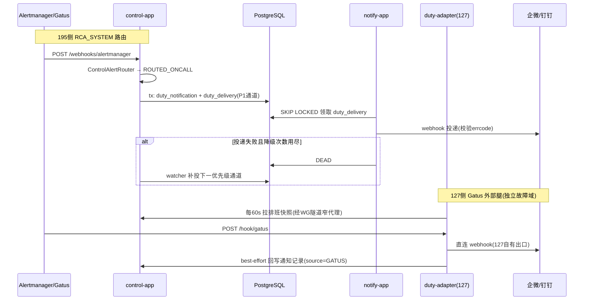
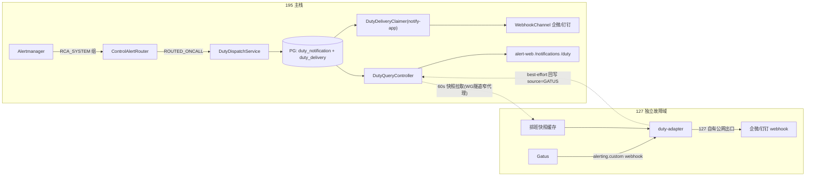

# 告警 AM7 增量：值班通知消息列表 + 值班表（含时间排班）落码技术方案 v1.0

> 日期：2026-09-09
> 归属：AM7 前端与操作面的增量（用户 2026-09-09 当场裁定：①并入 AM7 阶段、任务号续 M7-11 起；②消息列表 = **值班通知专用**，不接 RCA 报告通知；③值班表**含时间排班**）。
> 用户原始需求（2026-09-09，原文末尾截断处以本方案裁定补全）："前端页面单独搞一个接收通知的消息列表；后台建立一个值班表如企业微信/钉钉 webhook 或[其他通道]"。
> 调研依据：仓库代码逐条核对（notify-app / alert-web / control-app / deploy / V9~V35 迁移）+ OSS 证据 E-21（钉钉/企微 webhook 限流与业务码）、E-22（Grafana OnCall / PagerDuty 排班模型），见 `docs/告警-OSS-证据清单.md`。
> 同时闭环的既有欠账：Gatus 值班接收器未定（评审文档 §十 决策门阻塞项）+ Gatus 配置三项契约冲突（`alerting.webhook`→`alerting.custom`、`storage.type:file` 非法、endpoint 未声明 `alerts`）+ BA-54/O-66 值班通道收口。

## 1. 核心问题

值班通知当前**没有接收面**：Gatus（127 外部监护）配置里 `GATUS_ONCALL_WEBHOOK_URL` 是空变量；RCA_SYSTEM 防自噬路由（ControlAlertRouter ROUTED_ONCALL）直达的"值班通道"是单个硬编码 webhook——无排班（半夜告警不知道发给谁）、无降级（通道挂了告警就丢）、无记录（发没发出去无账可查）。195 内存吃紧、127 迁移进行中，"系统挂了没人知道"是当下最锋利的风险。

为什么现在解决：Gatus 上线 127（MIG-02）被"值班接收器未定"阻塞；本增量一次交付接收面三件套——**值班表（发给谁）→ webhook 通道链（怎么发）→ 消息列表（发送台账与站内留痕）**，Gatus 随即解锁。

## 2. 任务拆解

| 任务 | 内容 | 依赖 | 单项验收 |
|---|---|---|---|
| M7-11 | V36 迁移：duty_member / duty_channel / duty_schedule / duty_layer / duty_layer_member / duty_override / duty_notification / duty_delivery 八表 + 角色授权 | 无（下一版本号 V36，V35 已在册） | 契约测试（仿 Am5MigrationContractTest）+ 195 真 PG flyway 36\|t |
| M7-12 | duty 域 domain（control-app `ops/duty/`）：DutyResolver 纯函数（时刻→当班成员→通道优先级链）+ 模型 + 轮换数学 | M7-11 | UT 全覆盖（锚点边界/周切换/override 优先/空层兜底），零框架依赖入 ArchUnit |
| M7-13 | control-app 投递生产面：DutyDispatchService（RCA_SYSTEM 路由接入点 + MANUAL 测试入口）+ DEAD 降级 watcher（30s 扫描，失败降下一优先级通道） | M7-12 | 195 真 PG IT：派发→行落库→降级链 |
| M7-14 | notify-app 投递执行面：duty_delivery 领取（复用 SKIP LOCKED+租约+epoch 栅栏范式）+ WebhookChannel 复用 + **业务码校验补强**（errcode≠0 即失败，HTTP 200 不算成功） | M7-12 | IT：45009/限流→RETRY_WAIT 持久退避；4xx→DEAD 触发降级 |
| M7-15 | 查询/管理 API（control-app，operator bearer + X-Operator-Id 留主体，@Profile("docker")）：GET /api/duty/notifications（游标分页+未读数）、POST …/{id}/read、GET /api/duty/schedule/snapshot（排班快照，含未来 7 天解析结果）、成员/通道/排班/override CRUD | M7-12 | 契约测试 + 401/权限/幂等用例绿 |
| M7-16 | 前端两页面：`/notifications` 消息列表（未读/全部 tab、severity/source 徽章、30s 轮询、已读标记）+ `/duty` 值班表管理（当班卡、未来 7 天排班视图、成员/通道/排班/override CRUD、手动测试通知按钮）；AppShell 侧栏 +2 入口、词典收口（M7-09 纪律） | M7-15 | build 绿 + dev 真接口 200 + mock 同步更新 |
| M7-17 | 127 侧 duty-adapter（独立故障域）+ Gatus 三项契约修正 + 195 窄反向代理 | M7-12、MIG-01（已 ✅） | §11 部署门六验收 |
| M7-18 | 部署门 + 测试交接（工序 4/5） | 全部 | 测试矩阵全绿 + 证据入 docs/测试证据/AM7/ |

## 3. 类设计

**control-app 新增（`com.objwww.pr.control.ops/duty/`）**

| 类 | DDD 层 | 职责 | 明确不做 |
|---|---|---|---|
| `DutyResolver`（纯函数） | domain | 时刻 + 排班快照 → 当班成员 + 通道优先级链；override > layer（layer_index 小者优先）；空解析→fallback 通道 | 不查库、不触网 |
| `RotationMath`（纯函数） | domain | DAILY/WEEKLY 轮换：anchor_date + handoff_time → 当前成员 position = elapsed_periods mod n | 不处理 override |
| `DutyDispatchService` | application | RCA_SYSTEM/MANUAL 事件 → 一事务落 duty_notification + duty_delivery（仅最高优先级通道一行） | 不做降级扫描 |
| `DutyFallbackWatcher`（30s） | application | 扫 DEAD duty_delivery → 下一优先级通道补投（无下一通道则记 SUPPRESSED 台账） | 不重试（重试归 notify-app） |
| `DutyQueryController` / `DutyAdminController` | interfaces | 只读查询 / CRUD；operator bearer | 不含业务逻辑 |
| `PostgresDutyStore` | infrastructure | 八表存取；已读标记 CAS（UNREAD→READ） | — |

**notify-app 新增**：`DutyDeliveryClaimer`（领取循环，范式同 NotifyOutboxClaimer）+ `WebhookSender` 补强业务码判定（DINGTALK errcode / WECOM errcode≠0 → SendResult 失败分类）。

**127 duty-adapter（新小服务，Java/Spring 同栈，docker 128~192MiB 限额）**：`POST /hook/gatus`（bearer 验签）→ 本地排班快照解析 → 直连企微/钉钉 webhook（127 自有公网出口）→ 校验 errcode → 失败按优先级降级；成功后 best-effort 回写 195 `POST /api/duty/notifications`（source=GATUS），195 不可达则本地文件 spool 后补。排班快照：每 60s 经隧道拉取 195 `/api/duty/schedule/snapshot`，内存缓存 + 磁盘副本兜底（195 挂时用最后已知排班——这是外部腿的本职：195 挂了通知也必须能发）。

**类交互时序图**：

## 4. 实现方式

- **事务边界**：duty_notification + 首行 duty_delivery 同一事务落库（原子对，仿 BA-53 教训——先 notification 后 delivery，FK 即时检查安全）。
- **幂等**：duty_notification.fingerprint（source+alertname+startsAt 分钟桶）部分唯一索引防 Alertmanager/Gatus 重发重复建行；已读标记 `UPDATE ... WHERE status='UNREAD'` 影响行数判定幂等。
- **状态机**：duty_delivery 六态照搬 notify_outbox（PENDING/CLAIMED/SENT/RETRY_WAIT/DEAD/SUPPRESSED），同一套租约 60s + epoch 栅栏防僵尸 worker 晚到回写。
- **限流纪律（E-21）**：钉钉/企微均 20 条/分钟/机器人，超限钉钉限流 10 分钟。值班通知天然低频（告警风暴已有 Alertmanager 聚合兜底）；notify-app 429/errcode=45009/310000 → RETRY_WAIT 持久退避不占槽（既有范式），且 duty 通道投递串行化（同通道最小间隔 3s）。
- **业务码陷阱（E-21）**：企微/钉钉失败可以 HTTP 200 + errcode≠0——**WebhookChannel 必须解析响应体业务码**，此为本增量对既有类的唯一行为修正（现状只判 HTTP 状态，属静默假成功风险，记入 §9）。
- **排班快照推送 vs 拉取**：选拉取（adapter 60s 轮询 + 磁盘兜底）——195 侧零推送面、零新端口暴露面（窄代理只读一个 endpoint）。

## 5. 数据流与链路图

## 6. 边界条件与不变量

**强制不变量**：
1. 值班通知永不进 Incident/rca_run 管线（INV-AM5-4 延展，Gatus 腿与 RCA_SYSTEM 腿同源遵守）。
2. webhook URL/密钥只经 env 注入（沿用 `NOTIFY_CHANNEL_<名>_WEBHOOK/_SECRET` 约定），duty_channel 表只存 env 键名，密钥不落库/日志/前端。
3. duty_notification 行一旦落库不物理删除（只增台账）；已读只翻转 status。
4. override 优先级恒高于 layer；layer_index 数值小者恒优先；解析为空恒落 fallback 通道（不允许"告警无人可发"静默消失——fallback 通道都不通则 duty_delivery DEAD + watcher 记 SUPPRESSED 台账行，台账可审计）。
5. adapter 在 195 完全不可达时仍须能发 webhook（本地快照兜底）；回写记录允许延迟/最终一致，允许 195 长挂时记录缺口（残余风险，见下）。

**显式承认的残余风险（诚实清单）**：
- 195 全挂期间 Gatus 通知的**消息列表记录缺口**：webhook 照发（值班员能收到），但站内列表事后补录依赖 adapter spool 重放；spool 文件随 127 磁盘故障可丢。判定可接受——列表是台账面，不是通知面。
- 排班快照最长 60s 陈旧：刚改的排班最长 1 分钟才对 127 生效。
- 前端登录仍是 mock 会话（FUT-34/O-4 未落地），消息列表/值班表管理页继承同一过渡形态，operator bearer + X-Operator-Id 留主体不变。
- 钉钉"自定义关键词"安全设置若启用，消息体必须含关键词——模板白名单渲染时预留关键词前缀配置项。

## 7. 设计原因

- **排班模型抄 Grafana OnCall / PagerDuty 分层轮换（E-22）**：layer 内成员轮换共享值班时间、高层覆盖低层、override 最高优先——两家的语义一致且经生产验证；不引入 cron 表达式排班（表达力过剩、排错困难）。轮换数学简化为 anchor_date + period 取模，无状态、可纯函数测试。
- **投递机复用 notify_outbox 范式而不复用表**：notify_outbox.report_id NOT NULL 报告绑定（V9），值班通知无报告可绑，放松约束会腐蚀 AM3 出口不变量（AM5 C-16② 已裁定过一次不放松）——新建 duty_delivery 同构表，范式复用、表分离。
- **IN_APP 渠道 = 消息列表**：AM5 V26 已预留 notify_outbox.case_id 的 IN_APP 缝；本增量 duty_notification 表本身即 IN_APP 落地（行落库=已投递站内），无需再建渠道。
- **127 adapter 独立进程而非 Gatus 原生 provider 直发**：Gatus custom provider 无法校验企微/钉钉业务码（HTTP 200 误判成功，E-21 + 评审文档已裁定需独立 adapter）；adapter 同栈 Java 控制引入代价，128~192MiB 限额 127 可容纳（MIG-01 基线 available 2839MiB）。
- **窄反向代理而非 control-app 增绑隧道地址**：control-app 容器 loopback 发布不变，195 宿主 nginx 增 `listen 10.250.250.1:8090` 只反代 `/api/duty/schedule/snapshot` + `/api/duty/notifications` 两条——暴露面最小化（Phase 11 §3 既定方针）。

## 8. 问题与压力点（按压力排序，引出后续）

1. **用户体系缺失**（O-4/FUT-34）：值班成员只是名字不是系统用户，无登录关联、无个人通知偏好；FUT-34 落地前管理页只能裸跑 operator bearer。
2. **通知通道仅两家 webhook**：SMTP/短信/电话均未覆盖，半夜 P0 的触达强度依赖群消息；压力触发条件 = 第一次真实 P0 漏看事故。
3. **升级策略（escalation）缺席**：本增量只有通道降级链，没有"N 分钟未读→升级下一值班员"——消息列表的 UNREAD 状态是未来升级策略的天然数据源，留给下一阶段。
4. **adapter 单点**：127 上无 supervisor 之外的冗余；Gatus 与 adapter 同机同故障域是刻意设计（外部腿要的就是与 195 解耦），但 adapter 自身崩了 Gatus 通知会失败——依赖 docker restart=always + Gatus 对 adapter 自身的 /health 监控（自指监控的死锁风险记录在案：adapter 挂时无人报 adapter 挂）。

## 9. 实际后果记录

- 本项目过程缺陷：BA-54（内存闸三档无自动面，运维面选项②要求"Gatus 值班通道收口 O-66"——本增量即收口动作）；BA-61（prometheus.yml 单文件 bind mount 假绿——本增量所有 195 配置变更一律"容器内 md5 对拍 + docker cp 校验"）。
- 同构前车之鉴：Gatus 配置三项契约冲突（评审文档 :45 已裁定"填变量就能用"不成立）；WebhookChannel 现状只判 HTTP 状态码，对企微/钉钉业务码失败会静默假成功（本增量 M7-14 修正并补回归）。
- 195 磁盘 98% 紧急事件（2026-09-09，disk-and-network-20260909.md）：任何新服务上 127 前磁盘/内存基线必须先核（已过：127 余 42G / 2839MiB）。

## 10. 技术债分析

- 不做本增量：Gatus 继续阻塞（127 外部监护永远差最后一步）；值班通知靠人肉盯 Gatus UI——195 夜间故障的期望发现时间 = 第二天上班，与技术债利息（一次夜间故障的停工损失）相比，本增量的建设成本（约 6~9 天——v2.0 评审后统一口径，含评审补六契约；原 3~4 天作废）一个季度内即可收回。
- 维持"单 webhook 硬编码"：通道轮换要改配置重启服务，且永远没有台账；债息随值班人数增长。
- 本增量主动选择的债：adapter 快照拉取（而非事件推送）、排班无 UI 日历拖拽（表格 CRUD）、无升级策略——均为已知简化，§8 已列触发条件。

## 11. 测试用例设计

- **静态架构**：ArchUnit 钉 ops/duty 分层（domain 零框架依赖）；duty_channel 表无 webhook URL 列的契约测试（schema 断言，防密钥落库）。
- **单元**：RotationMath（日/周轮换、锚点当天、跨 handoff_time 边界、成员列表变更后的 position 稳定性）；DutyResolver（override 覆盖 layer、高层覆盖低层、空层→fallback、override 过期自动失效）；业务码解析（errcode 各值分类）。
- **组件规则**：V36 契约测试（八表存在性/唯一索引/CHECK 约束/角色授权——notify_app 对 duty_delivery 无 INSERT、control_app 对 duty_notification 无 DELETE）。
- **业务场景闭环**（195 真 PG IT）：RCA_SYSTEM 告警 → notification+delivery 落库 → notify-app 领取 → TEST_CHANNEL（echo-receiver）SENT → 列表 API 可见 → 已读 CAS；首通道强制 429 → RETRY_WAIT → 预算耗尽 DEAD → watcher 降级次通道 SENT；fingerprint 重复告警不重复建行。
- **边界异常**：errcode=45009（限流）HTTP 200 判定为失败；errcode=310000 关键词缺失；空排班发 fallback；adapter 持过期快照时 195 不可达仍发出 webhook；spool 重放去重（fingerprint）。
- **部署门**：127 adapter compose up 健康 200 + 192MiB 限额内 RSS 实测；Gatus 修正配置六项验收（启动日志读 /config/config.yml、无镜像示例 endpoint、失败告警达 adapter、恢复回执、探针死亡告警、业务码失败不被误判成功——用 echo-receiver 返回 `{"errcode":45009}` 的 HTTP 200 验证）；窄代理只放行两条路径（负向：经隧道打 /api/rca-runs 必须 404/403）；E2E：Gatus 触发 → 企微/钉钉 TEST 群收到 → 195 消息列表 source=GATUS 记录出现。

## 12. 验收标准（DoD）

1. §11 测试矩阵全绿（失败修复后全量回归，不允许带病验收）。
2. 195 + 127 部署完成：消息列表页与值班表页真接口可用（VITE_USE_MOCK=false 面），值班告警经真实 webhook TEST_CHANNEL 群实证送达。
3. Gatus 三项契约冲突闭环且六项验收过；值班接收器决策门解除。
4. 证据入 `docs/测试证据/AM7/`；BUGLOG 新增条目闭环；PROGRESS 时间线更新。
5. 用户明确说出"当前阶段已完成，可以进入下一阶段"（G2）。
