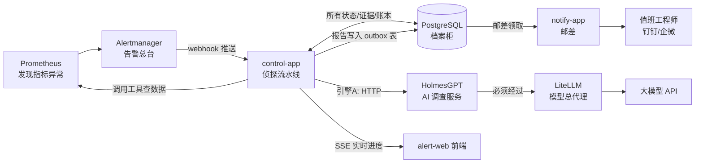
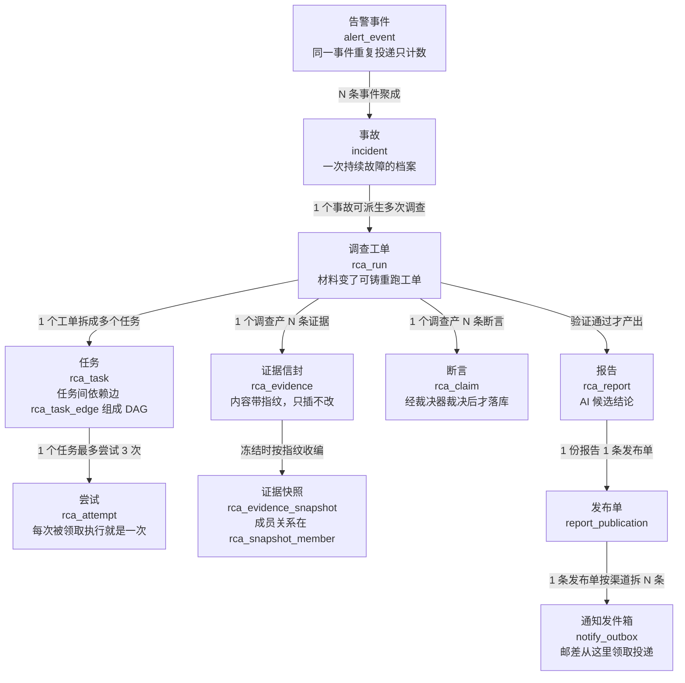
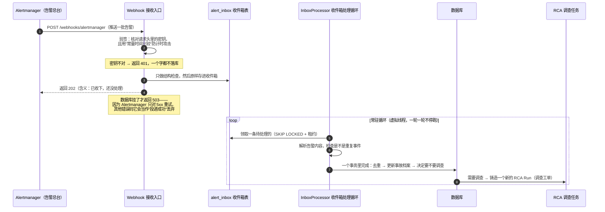
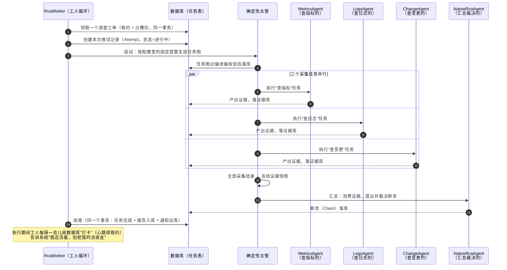
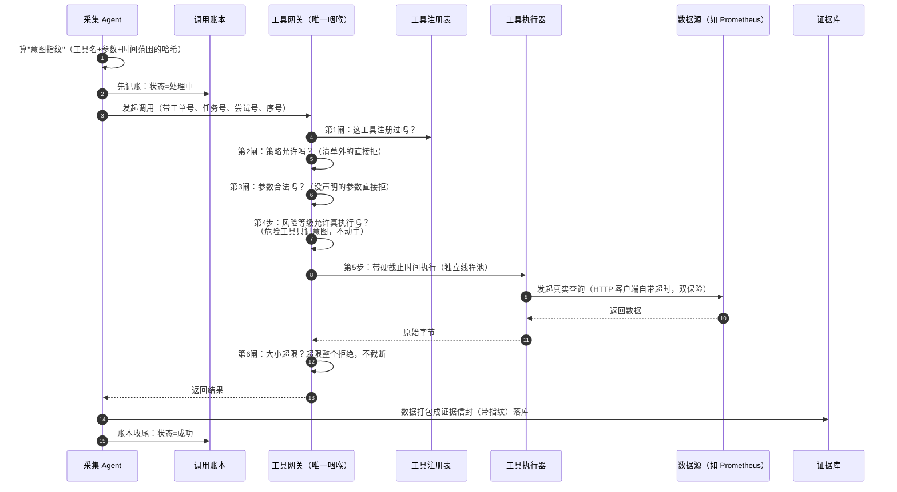
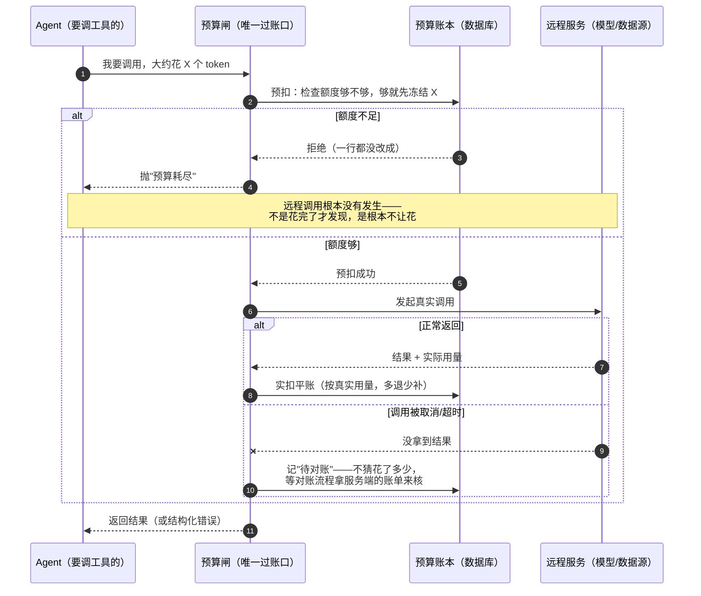
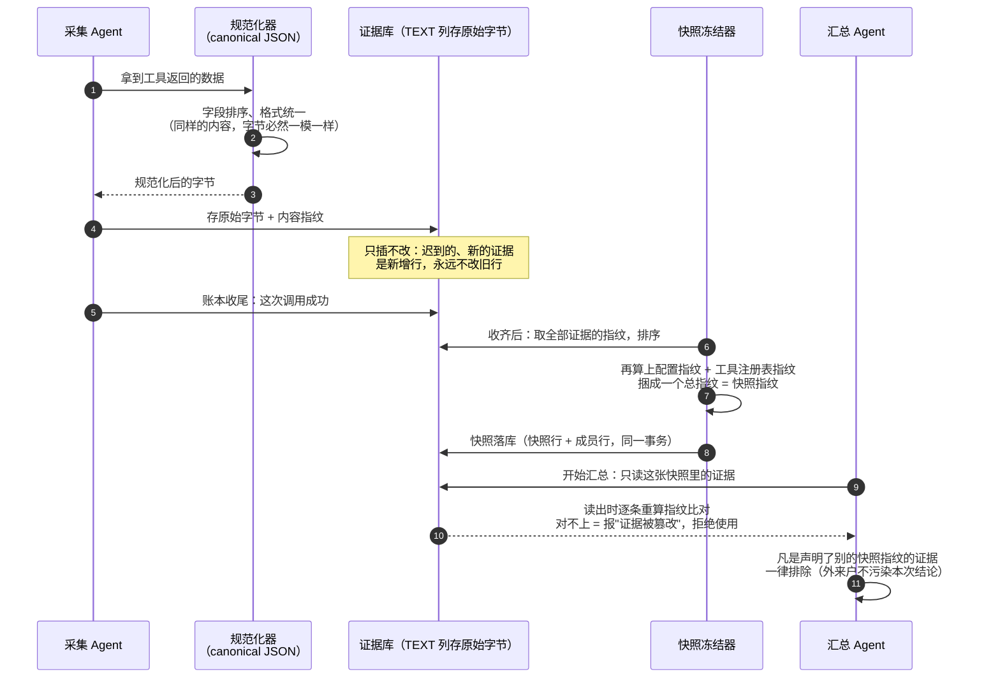
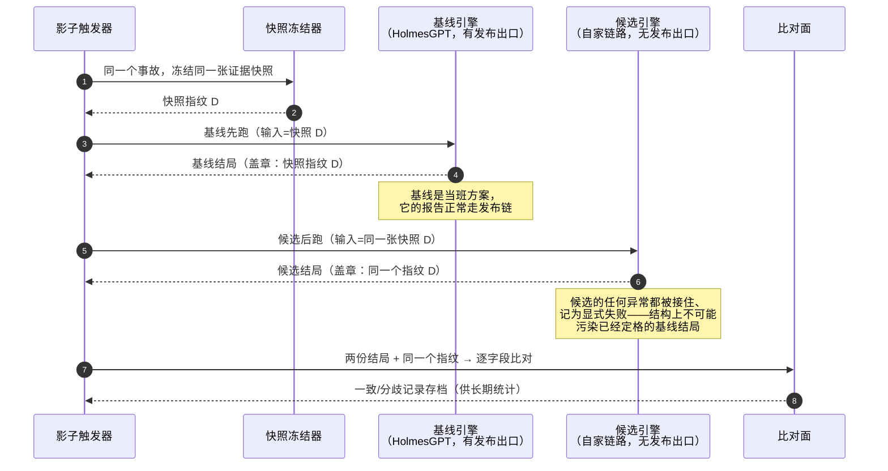
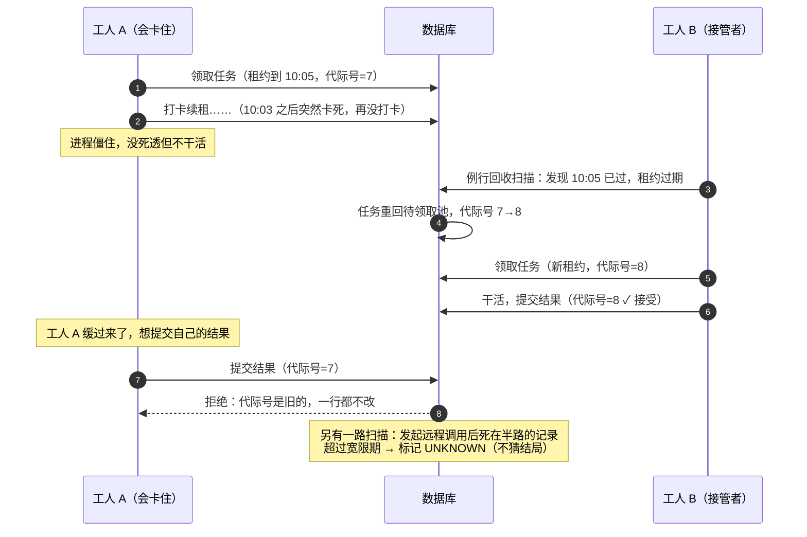
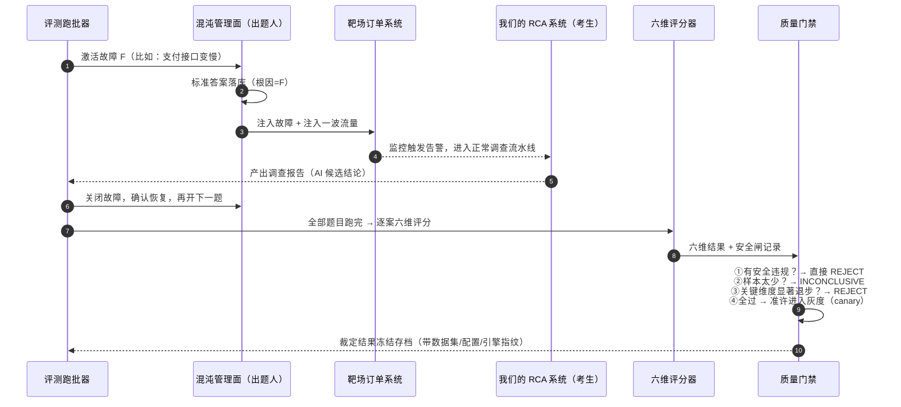

# 把告警 Agent 系统讲给 16 岁的你

> 阅读对象：没有任何分布式系统经验、也没做过本项目的人。
> 读法：每一节都是同一个套路——**先说遇到了什么问题，再说我们怎么解决，最后说这个解决办法的好处和代价**。所有缩写第一次出现时都会用大白话解释。

---

## 0. 先搞清楚业务：这个系统到底在解决什么问题

**业务**：企业为实现自身利益而开展的系列活动。

**运维业务**：保障线上系统"活着、够快、不出错"的系列活动。它不显性赚钱，但它出事时企业直接亏钱——电商网站挂一小时，损失的是真金白银的订单。

**告警**：监控软件发现指标异常后发出的通知。网站、App 背后有成百上千台服务器在跑，总有出毛病的时候——接口变慢了、报错变多了、支付失败了。监控系统（我们用的是 Prometheus，一个专门收集"服务器体检数据"的开源软件）发现指标不对劲，就会喊一嗓子："出事了！"这一嗓子就叫一条告警。

**值班**：公司安排工程师轮流盯着告警，谁赶上谁处理。半夜三点告警来了，值班的人就得爬起来查。

**根因分析**（英文叫 RCA，Root Cause Analysis）：告警只会告诉你"出事了"，不会告诉你"为什么"。值班的人得像侦探一样，翻指标、翻日志、翻最近的发布记录，拼凑出"原来是昨晚十点那次上线把数据库慢查询带出来了"。这个过程短则二十分钟，长则几个小时，而且非常依赖个人经验——老工程师十分钟定位的问题，新人可能查到天亮。

**本系统的业务定位**：把"根因分析"这个高度依赖个人经验的侦探活动，变成一条**自动化的、可复现的、全程留痕的流水线**——告警即输入，带证据的候选结论即输出。

**我们这个系统做的事**：告警一进来，不等值班的人爬起来，系统先自动把这个侦探流程跑一遍——自动查指标、查日志、查变更记录，然后产出一份报告：**"AI 候选结论：根因很可能是 X，证据是 Y 和 Z。"** 等值班的人打开手机，调查已经做完了，他只需要确认或推翻这个结论。

请注意"**候选**"两个字，它是整个系统的灵魂：AI 的结论**永远只是候选**，必须带上证据，必须允许被人推翻。系统里每一份发出的报告都强制带着这行标记。为什么？因为 AI 会犯错，而运维决策（比如重启一台核心服务器）错了就是事故。所以我们在结构上就把"AI 说了算"这条路堵死了——这是后面所有设计的总出发点。

---

## 1. 整体架构层：先看全景

系统全景一句话：**告警从监控系统流进来，经过一个"侦探流水线"，最后把报告送到值班人手上**。涉及到的角色：

| 角色 | 大白话解释 |
|---|---|
| Prometheus | 监控摄像头，持续采集服务器的指标数据，发现异常就触发告警 |
| Alertmanager | 告警的"总台"，负责把告警分组、去重、按规则投递出去 |
| control-app | **主角**。一个 Java 应用，侦探流水线就在这里跑：收告警、派任务、调工具、存证据、出报告 |
| PostgreSQL（简称 PG） | 数据库，系统的"档案柜"。所有状态、证据、账本都存这里 |
| notify-app | 专职"邮差"，只负责把报告发到钉钉/企微这类值班渠道 |
| HolmesGPT | 一个外部的 AI 调查服务（引擎 A，基线方案） |
| LiteLLM | 模型调用的"总代理"，所有对 AI 大模型的请求都必须从它这里过 |
| order-arena + arena-chaos-admin | 故障演练靶场：故意制造已知故障，用来考试（评测部分细讲） |
| alert-web | 前端页面，值班的人在这里看告警、看调查进度、看报告 |
| Gatus + OpenTelemetry | 监控这个系统自身的"监工"（监控部分细讲） |

整条主链路：

**关键技术选择：为什么是"一个 Java 应用 + 一个 PG"，而不是一堆微服务 + 消息队列？**

这是全系统最重要的一个架构决定，值得展开讲。

业界的"时髦做法"是把每个环节拆成独立的小服务（微服务），服务之间用 Kafka 这类消息队列通信。我们没有这么做，而是：**一个 Java 应用干活，一个 PG 数据库既是档案柜、又是任务队列、又是消息通道**。

- **优势一：事务就是一致性。** 数据库事务（Transaction）的意思是"一组操作要么全成功，要么全失败，不存在中间态"。比如"任务标记完成"和"报告入库"这两件事，在我们的系统里是同一个事务——不可能出现"报告存了但任务还挂着"的鬼状态。如果用消息队列，这种一致性要靠一堆复杂的补偿逻辑去追。
- **优势二：崩溃免费恢复。** 所有进度都在 PG 里，进程死了重启，看一眼档案柜就知道该从哪接着干。内存里不存任何"丢了就要命"的东西。
- **优势三：可审计。** 每一步都留了带指纹的账本（后面细讲），出了纠纷能一笔一笔对账。
- **代价（必须诚实说）**：PG 是单点瓶颈，扛不住每秒十万级的告警量；队列语义（领取、重试）是自己用 SQL 手写的，不如专业消息队列省心。我们的判断是：告警场景的量级（每天几百到几千条）远够不着 PG 的极限，用简单换可靠是划算的。**技术选型没有"最好"，只有"配得上你的问题规模"。**

### 关联关系

系统的核心数据对象以"事故 → 调查 → 任务 → 尝试"为主线逐级展开，证据、断言、报告挂在调查上：

对象按"维度"拆解理解（对照你们熟悉的"房型只有库存无定价、房价归 rate 维度"的思路）：

- **事故维度（incident）**：记录故障的静态档案——什么时候开始的、涉及哪个服务、当前状态，**不含调查结论**。它回答"发生了什么"。
- **调查维度（rca_run）**：以"一次具体的根因分析"角色存在，关联事故、任务图、证据快照，**含调查的过程和结论**。它回答"为什么发生"。同一个事故可以派生多次调查（材料变了重跑），事故与调查分离就是为了这一点。
- **执行维度（task / attempt）**：task 只有"要做什么、依赖谁"的计划属性，无执行细节；**执行痕迹全部归 attempt 维度**——第几次尝试、谁执行的、什么时候心跳过、结局如何。计划与执行分离，所以重试不会污染计划。
- **证据维度（rca_evidence / snapshot）**：证据只有内容与指纹，无结论属性；**结论归 claim 维度**。证据永不修改，结论允许被新证据修订——原始事实和主观判断分开存放，这样"结论变了"不会动到"事实"。
- **出口维度（publication / outbox）**：报告只有内容；**"发没发出去"归 publication/outbox 维度**。内容生产与渠道投递分离，所以发钉钉失败不会毁掉报告本身。

---

## 2. 入口层：告警是怎么进来的

### 遇到的问题

入口层要对付的不是业务逻辑，而是**网络世界的四大坏习惯**：

1. **重复**：Alertmanager 投递失败后只会认 HTTP 5xx 错误码重试，同一条告警可能被送来好几次。如果收到一次就建一个调查任务，同一个事故会查八遍。
2. **乱序**：网络不保证顺序，"故障恢复"的通知可能比"故障开始"先到。
3. **伪造**：这个接收地址（URL）是暴露在网络上的，任何人都能伪造一条假告警塞进来，骗系统去调查一个不存在的事故——白烧 AI 调用费用。
4. **风暴**：一次大故障可能瞬间产生几千条告警，全收下会把自己压垮。

### 怎么解决：四道门

逐条解释这张图：

- **第 2-3 步，先验签再说话**。密钥比对用"常量时间比较"——普通字符串比较是一个字符一个字符地比，发现不同就立刻返回，黑客可以通过"响应快了一点点"推断出自己猜对了前几个字符（这叫计时攻击）；常量时间比较是不管哪里不同都比完全部，时间不泄漏任何信息。
- **第 4-5 步，收件箱模式（Inbox）**。入口**只做一件事：把原始告警原封不动存进数据库**，然后立刻回复"收到了"。真正的解析和处理由后面的常驻循环慢慢做。好处是：入口极快、极简单、几乎不会坏；处理逻辑崩了也不丢告警——它们安全地躺在收件箱表里等下一波。这就是为什么返回码是 202（Accepted，已受理）而不是 200（OK，已办完）。
- **第 6 步的 Note 是个真实踩坑点**：Alertmanager 的重试规则是"只有收到 5xx 才重投"。所以我们的入口**绝对不能**因为"内容格式有点怪"就返回 4xx——那等于告诉总台"这条别管了"，告警就永久丢了。格式错误的处理责任在我们自己（进死信队列），不能推给对方。
- **第 8-10 步，幂等去重**。"幂等"的意思是：同一个操作执行一次和执行十次，效果完全一样。每条告警事件算一个指纹（哈希值），数据库里见过这个指纹就只把计数加一，不再重复建调查。这样无论 Alertmanager 重投多少次，调查任务只有一个。
- **SKIP LOCKED + 租约**：领取任务时用的数据库技巧，意思是"拿走一条没人拿的，并且给它贴个'我在处理，到 X 点截止'的租约条"。多个处理线程不会抢到同一条；处理的人如果死了，租约到期，别人可以接管（这是故障转移的伏笔，第 8 节细讲）。

**这套设计的优势**：重复、乱序、伪造、风暴四个问题全部被挡在入口，内部流水线只需要面对"干净、去重、有序收敛"的事件流。
**代价**：告警从到达到开始调查多了一步异步延迟（秒级）；收件箱表需要定期清理。

---

## 3. Agent Loop：谁是老板，谁是打工仔

### 遇到的问题

"Agent"（智能体）这个词现在很火，流行做法是：把目标丢给大模型，让模型自己决定"下一步干什么、调用哪个工具、什么时候停"，循环往复直到它说"做完了"。

这个做法在演示视频里很惊艳，在生产环境里是灾难，因为：

1. **模型会幻觉**——它可能调用一个不存在的工具，或者用错误的参数调用；
2. **模型会兜圈子**——查来查去没有进展，但每一步都在烧钱；
3. **模型不可复现**——同样的输入，今天和明天跑出的路径不一样，出了问题无法复盘。

### 怎么解决：模型无调度权

我们的核心原则一句话：**大模型在这个系统里是打工仔，不是老板**。流程怎么安排是代码说了算的（确定性流程），模型只在被圈定的格子里出力。具体两道防线：

- **第一道：任务图由编译器把关。** 调查计划（先查指标、再查日志、最后汇总之类）表示成一张 DAG——DAG（有向无环图）就是"任务之间的先后依赖关系图，且不允许绕圈"。任何计划进库前必须过 `PlanCompiler` 的校验：任务数量封顶、层级深度封顶、图上不许有环、用到的 Agent 必须是注册过的、VERIFY 类任务最多一个。**模型可以提建议，但建议必须通过编译器检查才变成任务。**
- **第二道：执行由确定性主管驱动。** `DeterministicSupervisor`（确定性主管）按固定阶段推进：规划 → 并行调查 → 汇总 → 验证 → 装配 → 校验 → 发布。每个阶段干什么、什么条件进下一阶段，全是写死的代码规则，不看模型脸色。

**三级工作单元**：整个系统的工作被组织成三层——

- **Run（调查工单）**：一次完整的根因调查，对应一个事故；
- **Task（任务）**：工单里的具体活儿，比如"查指标"、"查日志"、"汇总结论"；
- **Attempt（尝试）**：任务每被执行一次就是一个 Attempt，失败了重来就是新的 Attempt（上限 3 次）。

对照编号把这张图走一遍：

- **第 1-2 步**：工人领活是"占槽位 + 贴租约 + 建尝试记录"三件事打包在一个事务里——不会出现"活领了但记录没建"的中间态。
- **第 3-4 步**：注意任务图不是模型即兴发挥的，它来自配置里的**固定提案**，且必须过编译器校验才落库。模型在这个环节的存在感是零。
- **第 5-10 步**：三个采集任务**并行**跑——查指标和查日志互不依赖，没必要排队。每个 Agent 只干自己那一件事，产出证据各自落库。某个采集失败了不影响其他两个（缺一个数据源，结论降级但不阻断）。
- **第 11 步**：采集全部结束才"冻结快照"——先收齐，再拍全家福，之后汇总只看这张照片里的内容。
- **第 12-13 步**：汇总 Agent 是消费者不是采集者——它只读证据库，自己没有查数据的工具。
- **第 14 步**：收尾又是"一个事务打包"——任务标记完成、报告入库、通知进发件箱，三件要么全成要么全不成。

**优势**：完全可复现（同样输入跑两遍，路径逐字节一致——这给后面的评测和回放打了地基）；出了问题能精确定位到哪一环；模型幻觉造成的破坏被限制在格子里。
**代价**：不如自由 Agent 灵活——遇到一个设计时没想到的调查路径，系统不会自己创新。我们的取舍是：**生产系统里，可预测 > 聪明**。

---

## 4. 工具层：Agent 的"手"是怎么被管起来的

Agent 要查数据，就得调用"工具"（Tool）——比如"查 Prometheus 指标"就是一个工具。这层我们前面已经完整拆过，这里用教学视角重讲一遍五环节：**注册 → 暴露 → 调用 → 执行 → 返回**。

### 问题

工具是 Agent 唯一能对真实世界施加影响的通道。它失控的三种典型方式：Agent 幻觉出一个不存在的工具名；模型上下文被污染后诱导 Agent 调用危险工具；工具本身超时、返回超大响应把内存打爆。

### 我们的解决办法

**① 注册——开张前登记，登完锁门。** 系统启动时，所有工具一次性登记进注册表（目前是三个：`prometheus.query` 查指标、`logs.query` 查日志、`change.query` 查变更）。登记时做严格体检：名字格式、参数清单（schema，即"这个工具接受哪些参数、各是什么类型"）、风险等级、超时时间、结果大小上限。**重名冲突直接拒绝启动；一个工具都不注册也拒绝启动。** 登记完注册表就锁死——运行中不能新增工具，从网络上下载插件这件事在结构上就不可能发生（工具包里根本没有任何网络下载的代码，还有架构测试盯着）。

**② 暴露——只给模型看允许看的。** 发给大模型的工具清单先过白名单过滤，被策略拒绝的工具**根本不出现在清单里**——模型不知道它存在，自然不可能调用它。这是第一道闸。

**③ 调用——先记账，再动手。** Agent 每次调用工具前，先做两件保命的事：算出这次调用的"意图指纹"（把工具名、版本、参数、时间范围规范化后算哈希），然后在调用账本里先写一笔"处理中"。**先记账后动手**的意义：哪怕进程在调用途中崩溃，账本上永远留着"它死前想干什么"。

**④ 执行——所有调用挤一个咽喉。** `ToolGateway`（工具网关）是所有工具调用的唯一通道，任何调用必须按固定顺序过六道闸：查注册表（不存在的工具直接拒）→ 二次鉴权（第二道闸，防绕过清单直接调用）→ 参数校验（**没声明过的参数直接拒**）→ 算指纹 → 风险检查（危险工具只登记意图不执行）→ 带硬截止时间执行（独立线程池 + 超时强制中断，HTTP 客户端自己也设了超时做双保险）→ 结果大小检查。

这里要自然解释几个术语：

- **"超长拒绝，不静默截断"**：假设工具返回的数据超过了大小上限，"静默截断"是指悄悄把超出的部分切掉、把残缺的数据递给模型——模型不知道数据被切过，会拿着半个真相理直气壮地下错误结论。我们的做法是**整个拒绝、明确报错**，让失败看得见。失败不可怕，可怕的是不知道失败了。
- **"错误分两族"**：工具出错时分两类处理。"终止族"（比如工具不存在、参数非法）——错误很严重，直接终止，不玩重试；"模型可见族"（比如超时、远端暂时不可用）——用**固定的、脱敏的文案**告诉模型，允许它换姿势再来。底层真实的报错信息（可能包含服务器地址、堆栈等敏感信息）**绝不透传**给模型。
- **"风险等级只信本地声明"**：有些工具协议允许工具自己贴标签说"我是只读的"。我们**不信**——标签可能是伪造的。风险等级只看我们本地注册表里写的。

**⑤ 返回——结果变证据，证据带指纹。** 工具返回的数据不会直接进模型脑子，而是先变成"证据信封"：内容规范化后算出指纹、原样存进数据库、读出来时再算一遍指纹比对——**改过一个字节都能发现**。空结果就老老实实记"无数据"，绝不为了"显得有发现"而编造证据。

对照编号走一遍：

- **第 1-2 步**：先算指纹、先记账，再谈调用。顺序是保命纪律——账本上"处理中"的记录就是进程猝死后的遗言。
- **第 4-6 步**：三道闸全在网关内部，**顺序固定、缺一不可绕过**。特别记住第 2 闸的存在理由：第②环节（清单裁剪）假设模型只会调用它看得见的工具，但提示注入可能诱骗它直接点名清单外的工具——所以执行前必须再查一次。
- **第 8 步**：超时是双保险——网关拿秒表盯着线程池，HTTP 客户端自己也有一个秒表。两个秒表都响了才算超时，谁先响谁处理，另一个作废。
- **第 12 步**：数据进证据库之前必须先变成"带指纹的信封"——进模型脑子的不是原始字节，而是经过落库、可回查的证据。

**优势**：工具的每一环都有唯一、确定、可审计的关卡；幻觉工具名、越权调用、超时、超大响应各有明确的死法。
**代价**：新增工具必须改代码发版（我们认为这是治理优点而非缺陷——"谁都能在线加工具"才是噩梦）；当前没有自动重试和熔断（评审过，排队在后续迭代）。

---

## 5. Harness 层：看不见的舞台机械

### Harness 是什么

"Harness" 原意是"马具/安全带"，在 AI 工程里指**承载 Agent 运行的那套脚手架**——Agent 负责"思考"，Harness 负责"让它安全地跑起来"：调度、限时、限量、记账、收拾残局。你可以把 Agent 想成演员，Harness 就是舞台机械、灯光、场务——观众看不见，但没了它戏演不成。

我们的 Harness 主要是这几件机械：

### 问题一：Agent 无限兜圈子怎么办——预算账本

每次调查（Run）有一本预算账本，管六种资源的额度：**步数、工具调用次数、证据条数、子任务数、Token 数、报告数**（Token 是大模型计费的单位，大致一个汉字/单词片段算一个，后面基础知识清单详解）。每次调用前先"预扣"，用完实扣，取消了退款。预扣被拒就**连远程调用都不发起**——不是花完了才发现，而是根本不让花。

还有一个专治兜圈子的 `DoomLoopGuard`（死循环哨兵）：它盯着"同一个任务、同一个工具、同一个意图指纹"的调用签名，发现**连续调用却没有新进展**就熔断，而且是"粘滞"的——不会自己悄悄恢复，要人来看一眼。

一次"花钱调用"在预算闸里的完整旅程：

注意第 10 步那个分支：**调用中途失败时，账本不按估算平账**——因为服务端可能其实处理了（钱花了），也可能没处理（钱没花），我们不知道。不知道就挂着等对账，这又回到那条价值观："不知道"是合法答案。

### 问题二：过程怎么被看见——事件账本

调查过程中的每个关键事件（意图已登记、断言已创建、工单被取消……）都按顺序号 append（追加）进事件账本，**只加不改**。前端页面用 SSE（Server-Sent Events，一种服务器持续往浏览器推消息的技术）订阅这条事件流，值班的人就能实时看到"调查进展到哪一步了"。断线重连用上次收到的序号接着传，发现序号有缺口就全量重同步。

**优势**：资源失控（烧钱、死循环）在结构上被预算和哨兵封住；全程可观测。
**代价（诚实说）**：预算闸门目前"账本和契约已建好，生产调用点还没全部接线"——这是已知的进行中事项，文档里明确记着。

---

## 6. 上下文持久化：AI 的"记性"怎么管

这一节是整个系统里最反直觉、也最值得讲透的部分。

### 先建立一个关键认知：上下文窗口是工作记忆，不是仓库

大模型有个核心限制叫**上下文窗口**（context window）：它一次能"看到"的内容有上限，好比一个人做题时摊在桌上的草稿纸就那么大。很多系统的做法是把所有历史对话、所有中间结果全塞进去，觉得"塞得越多越聪明"。**我们的立场相反：窗口是稀缺的工作记忆，不是存储。存储归数据库（PG），窗口里只放当前这一步决策真正需要看的东西。**

为什么不能"全塞进去"？因为**追加内容有三笔隐性成本**：

1. **KV cache 失效**。先解释 KV cache：大模型逐字生成回答时，会把已经读过的内容的中间计算结果缓存起来（这就是 KV cache），下次接着生成时不用重算。但这个缓存有个脾气：**只要开头的内容变了一个字，后面所有的缓存全部作废重算**。所以"每次都把新内容追加进一个不断变长的 prompt"意味着每轮都在让模型重新处理一遍全部历史——又慢又贵。我们的做法是让 prompt 结构保持稳定，变的东西尽量放后面、或干脆不进 prompt。
2. **延迟上升**。模型处理的内容越长，吐字越慢。窗口塞满时，每次调用的等待时间会肉眼可见地变长。
3. **注意力稀释**。模型读一大段内容时，对开头和结尾印象深，对中间部分容易"走神"（这是已证实的模型特性，叫"lost in the middle"）。把关键指令埋在三万字的日志中间，等于没说。

所以我们定了一条很"抠门"的纪律，也是你之前强调的那条：**连版本指纹这类元数据都不进 System Prompt（系统提示词，即每次调用都要带的那份"说明书"），而是放在运行元数据里；凡是进窗口的每一个 token，都要过预算。** 一句话：模型需要"知道结论"的东西才进窗口，需要"可以查证"的东西都存数据库，用指纹互相锚定。

### 存储侧：数据库里的三类东西

我们的 PG 里有三十来张表，按性质分三类，记住这个分类就抓住了全貌：

- **账本类（只加不改）**：工具调用账本、模型调用账本、事件账本、预算流水、回放账本……共同点是 append-only——只允许往里追加，不允许修改历史。这是审计的基础：历史一旦被允许改，账本就没有意义了。
- **队列类**：告警收件箱、通知发件箱、任务表、调度槽位。共同点是带"租约"，支持崩溃回收。
- **证据/快照类**：证据信封、冻结快照、报告、配置束。共同点是 insert-only（只插不更新）+ 带内容指纹。

### 证据的"五步指纹纪律"

证据从生到死的完整防伪流程，五步：

1. 入口把内容规范化（canonical JSON：字段排序、格式统一，保证"同样的内容无论谁提交，字节一模一样"）；
2. 把规范化后的**原始字节**存进数据库的 TEXT 列（特意不用数据库的 jsonb 类型——jsonb 会自作主张重排字段，字节对不上，指纹就废了）;
3. 对存进去的字节算指纹；
4. 读出来时对读到的字节**重新算一遍指纹，和存的比对**，不一致就明确报"证据被篡改"；
5. 结构校验和指纹校验分开做——"格式对不对"和"内容改没改"是两个问题。

一条证据从诞生到被采纳的完整旅程：

第 7-8 步是这套机制的地基：快照指纹里捆了**配置**和**工具注册表**的指纹。意思是——哪怕证据完全一样，只要当时用的配置不同、工具版本不同，快照指纹就不同。半年后复盘时，能精确回答"这个结论是在什么配置、什么工具版本下得出的"。

### 冻结快照：给调查拍一张"全家福"

一次调查的所有证据收齐后，系统会"冻结"一张快照：把所有证据的指纹排序后再算一次总指纹，外加当时的配置指纹、工具注册表指纹，捆在一起。之后所有分析（断言推导、报告装配）**必须绑定这张快照的指纹**：声明了别的快照的证据一律排除。

为什么这么做？因为"调查中途证据集变了"是 RCA 系统最阴的错误源——模型前半段看着 A 证据、后半段看着 B 证据，得出的结论无法归因。冻结快照保证：**同一份输入，必然得到同一份结论**，这也是回放比对和评测能成立的前提。

**优势**：窗口成本可控、结论可复现、证据可防伪。
**代价**：开发者要时刻保持"抠门"意识，往 prompt 里加任何内容都要过评审；规范化、指纹这些机制增加了代码复杂度。

---

## 7. 多 Agent：为什么不做一个全能 Agent

### 问题

一个思路是造一个"全能 Agent"，一个提示词教会它查指标、查日志、查变更、下结论。问题是：它出错时你不知道错在哪个环节；它的提示词改一个字，所有行为都可能漂移；而且"多源印证"这个侦探最重要的技巧就没了——一个脑袋里的想法没法自己佐证自己。

### 我们的拆法

四个 Agent，各司其职，纪律严明：

| Agent | 职责 | 纪律 |
|---|---|---|
| MetricsAgent | 只查指标（绑死 `prometheus.query`） | 构造时就强制：可用工具白名单**恰好只有一个** |
| LogsAgent | 只查日志（绑死 `logs.query`） | 同上 |
| ChangeAgent | 只查变更（绑死 `change.query`） | 同上 |
| NativeRcaAgent | 只做汇总：读证据 → 提断言 → 裁决 | 不碰工具、不发报告，只消费证据库 |

前三个采集 Agent 还有个重要纪律：**只产证据，不下结论**；汇总 Agent **只下结论，不碰原始数据**。断言（Claim）会带着"来源标签"（prometheus / logs / change），裁决器（ClaimReducer）的规则是：**≥2 个独立来源都说同一件事，才算"多源一致"；一个说真一个说假，就标"对峙"并自动升级为"需要人工"**。注意这里用"独立来源数"而不是"置信度投票"——因为 AI 的置信度本身就不值得信任，而两个物理上独立的数据源互相印证，才是真证据。

### 影子对照：新方案怎么安全上岗

我们有两套调查引擎：引擎 A 是外部 AI 服务 HolmesGPT（基线方案），引擎 B 是我们自己的确定性链路（候选方案）。新方案怎么证明自己够格？答案是**影子面**：同一个事故、同一张冻结快照，两个引擎都真跑一遍，**但候选引擎在结构上没有发布出口**——它的代码里根本没有"发报告"这条通路，跑出来的结果只用于和基线对比。两边结果都盖同一个快照指纹的章，输入一致、结局可逐字节比对。等候选长期表现合格，才谈切换。

这张图里最重要的设计是顺序：**基线先跑、候选后跑，候选的异常绝不外抛**。为什么？因为候选是"试用期员工"，它崩了是它自己的事，绝不能影响正在当班的基线。另外注意第 4 步和第 7 步盖的是**同一个指纹**——这证明两边确实在看同一份输入，比对才有意义；输入不同的对比是耍流氓。

**优势**：职责单一好排查；多源印证提高结论质量；新方案上岗有安全的试用期。
**代价**：四个 Agent 加影子面，代码量和管理成本翻倍；影子期两份计算资源同时烧。

---

## 8. 故障转移：系统自己挂了怎么办

### 问题

做"调查别人故障"的系统，自己也会出故障：进程被kill、机器重启、网络抖动。最棘手的不是"挂了"，而是两种幽灵状态：

1. **僵尸复活**：工人 A 领了任务后卡住（没死，只是慢），系统以为它死了，把任务派给工人 B；过了一会儿 A 缓过来，把结果提交了——**同一个任务被提交两次**，状态互相覆盖。
2. **悬而未决**：工人在"已发起远程调用、还没拿到结果"的缝隙里被杀掉。那个远程调用到底成功没有？**不知道**。

### 我们的解法：租约 + 代际栅栏 + 诚实的"不知道"

- **租约（Lease）**：领取任务时写上"我租用到 X 点"，干活期间定期打卡续租。工人死了，租约到期，任务自动回到池子里被别人领走。
- **代际栅栏（Epoch Fence）**：每次任务被重新领取，代际号加一。提交结果时必须带着自己领取时的代际号——**号不对，提交直接被拒**。僵尸工人 A 缓过来提交时，它的号已经是旧号了，数据库一行都不会改。
- **诚实的 UNKNOWN**：对于"调用发起后死在半路上"的情况，恢复扫描会把超过宽限期还没下文的记录标记为 **UNKNOWN（未知）**——而不是猜一个"成功"或"失败"。这是一个深刻的工程价值观：**"不知道"是一个合法的、必须被尊重的答案**。猜错了比不知道更危险，因为下游会基于错误的猜测做决定。

对照编号走一遍：

- **第 1-2 步**：租约就是一张"我租用到 10:05"的纸条，打卡就是不断把纸条上的时间往后延。工人活着，纸条永远有效；工人死了，纸条自然过期。
- **第 4-5 步**：回收不是靠"派人去看看 A 死没死"（这本身也不可靠），而是靠时间——纸条过期即回收。代际号同时加一，这是给僵尸准备的陷阱。
- **第 8-9 步**：这是全场最关键的两步。僵尸工人 A 缓过来时，它手里攥的还是旧代际号 7，而数据库里这个任务已经是 8 了。它提交时数据库一比号——对不上，一行都不改。**不需要检测僵尸，只需要让僵尸交不进结果。**
- **第 10 步**：死在"已发起调用、没拿到结果"缝隙里的记录，标记 UNKNOWN。注意这里宁可标"不知道"也不猜"失败"——因为那个远程调用可能其实成功了。

**优势**：崩溃恢复不需要任何人工干预，重启后第一轮循环自动收拾干净；重复提交被栅栏结构性拒绝；未知状态被诚实记录，可事后对账。
**代价**：租约时长、宽限期需要仔细调（太短会误判慢任务为死亡，太长恢复慢）；UNKNOWN 状态的记录需要人工或后续流程兜底处理。

---

## 9. 评测：怎么证明 AI 的判断是对的

### 问题

AI 系统最大的谎言是"我看着效果挺好的"。没有严格评测，一次提示词改动可能让准确率从 80% 掉到 60%，而你要几周后从用户投诉里才发现。但评测 AI 很难：它的输出不是"对/错"二值，跑一次的波动很大，小样本的结论基本是玄学。

### 我们的解法：红绿演练 + 六维评分 + 统计门禁

**第一步，造一个"已知答案的考场"。** 我们有一个故障演练靶场（order-arena，一个故意做成的订单系统），混沌管理面可以往里面**注入已知故障**——比如"让支付接口变慢"。因为故障是我们亲手注入的，**标准答案（ground truth）提前落库**。然后看 RCA 系统能不能诊断出来。这就是"红绿演练"：我们出题，我们阅卷，系统考试。

**第二步，六维评分，拒绝一个总分。** 评分器（SixDimEvaluator，纯函数、不调模型，保证评分本身可复现）从六个维度分别打分：

1. **结果维**：根因命中没有？症状找全没有？（TP/FP/FN——猜对的、误报的、漏报的分开数）
2. **过程维**：调了多少次工具？有没有重复等价调用？报错几次？
3. **工具维**：有没有幻觉调用未注册的工具？有没有被拒的调用？
4. **成本维**：花了多少 token、多少延迟？
5. **协作维**：断言的真/假/未知分布
6. **安全维**：有没有越权、有没有写意图没被批准

**刻意不合成一个总分**——因为"结果全对但越权调了工具"的系统绝对不能放行，单一总分会把致命问题平均掉。

**第三步，安全闸一票否决。** 安全维是独立硬门：任何一条安全违规（越权工具、注入、未批准写意图……），不管其他维度多好，直接 REJECT。"结果维全中不抵违规"。

**第四步，统计门禁，小样本不放行。** 候选方案和基线做配对比较，用 bootstrap（一种重采样统计方法，大意是"把手头的实验结果反复打乱重抽，估计结论的可信区间"）算置信区间。样本太少、统计上分不出高下时，结论是 **INCONCLUSIVE（无法判定）**——而不是硬着头皮放行。又见到那个价值观：**不知道就是不知道**。

对照编号走一遍：

- **第 1-3 步**：出题人先落标准答案再制造故障——顺序不能反。先注入再补答案，答案就可能被"考生的表现"污染（人会不自觉地往考生的结论上靠）。
- **第 4-5 步**：考生走的**就是生产流水线**，不是给考试单独开的后门——考题泄露、考试特供都是评测的经典作弊姿势，用同一条流水线在结构上杜绝。
- **第 7 步**：一题考完必须确认故障恢复，才能开下一题。否则上一题的余波会污染下一题——考场的每一场之间要清场。
- **第 9-10 步**：门禁的四条分支按严格程度排序，安全永远第一个检查。裁定结果带三种指纹冻结存档——半年后有人质疑"当时凭什么放行"，能把当时的数据集、配置、引擎三个版本完整还原出来对质。

**优势**：评测本身可复现（评分器纯函数）；安全问题不会被平均分稀释；统计上不够格的结论不会被误放行。
**代价**：跑一轮完整评测慢（每题要等告警触发和恢复双确认）；靶场和真实生产故障之间永远有差距，评测通过 ≠ 生产无恙——所以还有影子对照做第二道保险。

---

## 10. 监控：谁在看着这个"看着别人"的系统

### 问题

一个监控系统最大的尴尬是：**它自己挂了，没人知道**。如果"监控这个系统的监控"和这个系统部署在一起、用同一套告警通道，那它挂的时候连"我挂了"都发不出来。这叫"自噬"——自己吃自己。

### 我们的解法

- **外部黑盒探针（Gatus）部署在独立的故障域**（单独的小机器），从外面探测我们的健康端点。它的告警走**独立的值班 webhook，永不进入本系统的告警流水线**——监控系统的死活，不由被监控的系统来报告。
- **控制面告警三面门**：本系统自己的组件（比如数据库）产生的告警，万一真流进了自己的告警入口，会被一个专门的门卫识别出来——直接路由给值班通道，**不触发 RCA 调查**（系统不能给自己看病，会死循环）。
- **遥测 collector（OpenTelemetry）与业务零双向依赖**：它挂了只是丢监控数据，不影响业务；业务挂了它还能把最后的错误信号送出去。
- **指标标签白名单**：暴露给监控系统的指标，标签只能来自白名单——严禁把 UUID 这类无限取值的玩意儿当标签，否则监控存储会被撑爆（这叫"基数爆炸"，是监控系统的经典死法）。

**优势**：系统的每一次"我很好"都有独立的见证者；监控系统自身故障不会连环引爆。
**代价**：多维护一个独立部署的探针；tail sampling（尾部采样：健康的请求只留 10%，错误的全留）意味着事后想看某个健康请求的完整链路可能没存。

---

## 11. 基础知识清单

读本文或读这份代码前，建议掌握的概念，按主题分组：

**Web 与网络**
- HTTP 状态码语义（200 / 202 / 4xx / 5xx 的区别，尤其"谁该为重试负责"）
- Webhook（事件来了对方主动推给你，而不是你不停去问）
- 超时与截止时间的区别、计时攻击与常量时间比较

**数据库与一致性**
- 事务（ACID 中的原子性："要么全成，要么全不成"）
- 幂等（操作一次和操作 N 次效果相同；去重键/唯一约束是最常用的实现）
- `SELECT ... FOR UPDATE SKIP LOCKED`（用数据库当队列的领任务技巧）
- 行锁、乐观锁 / CAS（比较并设置：只有状态还是旧值时才更新成新值）
- Append-only / insert-only 表设计（为什么审计表不许 UPDATE）

**分布式基本功**
- 租约（Lease）与心跳、脑裂问题、栅栏（Fence/Epoch）令牌
- Outbox / Inbox 模式（状态变更和消息发送写进同一个事务，投递由独立进程兜底）
- 重试、退避（backoff）与抖动（jitter）、熔断器
- 状态机（合法迁移白名单，非法跃迁结构性拒绝）

**安全与完整性**
- 哈希/指纹（sha256）：同内容同指纹，改一个字节指纹全变
- Canonical JSON（规范化序列化：字段排序统一，保证指纹稳定）
- 最小权限、白名单思维（默认拒绝，显式放行）
- 提示注入（Prompt Injection）：喂给模型的任何外部文本都可能是攻击载荷

**AI 工程**
- 上下文窗口、token、KV cache、"lost in the middle"注意力稀释
- 幻觉、工具调用（function calling）协议
- SSE（服务器推送事件）与断线续传
- DAG（有向无环图）与拓扑推进

**评测与统计**
- TP / FP / FN（命中/误报/漏报）、为什么单一总分危险
- 置信区间与 bootstrap 重采样、小样本为何不可信
- Ground truth（标准答案）与红绿演练
- 灰度/金丝雀发布（canary）、影子流量对照

---

## 12. 一页纸回顾（合上书能不能答出来）

1. 告警进来为什么要先落"收件箱"再处理，而不是直接处理？
2. 为什么模型在这个系统里不能自己决定"下一步做什么"？
3. 工具调用的"双闸"是哪两道？为什么不能只有一道？
4. "超长拒绝不静默截断"保护的是什么？
5. 为什么说上下文窗口是工作记忆而不是仓库？追加内容的三笔隐性成本是什么？
6. 证据为什么要"冻结快照"？它保证了什么性质？
7. 僵尸工人提交结果时，系统靠什么拒绝它？
8. 什么时候系统会回答 UNKNOWN？为什么这是优点不是缺陷？
9. 评测里为什么安全违规要一票否决？为什么小样本要判 INCONCLUSIVE？
10. 监控这个系统的探针，为什么要部署在独立故障域、走独立告警通道？

如果这十道题都能用自己的话答出来，这套系统的骨架你就真的装进了脑子里。
