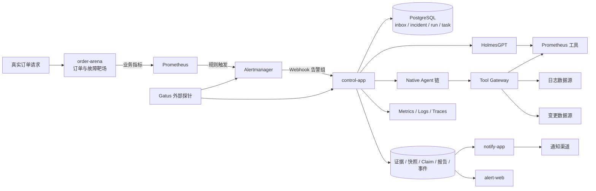
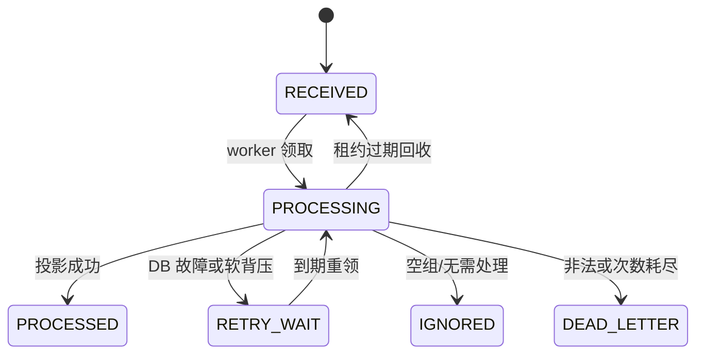
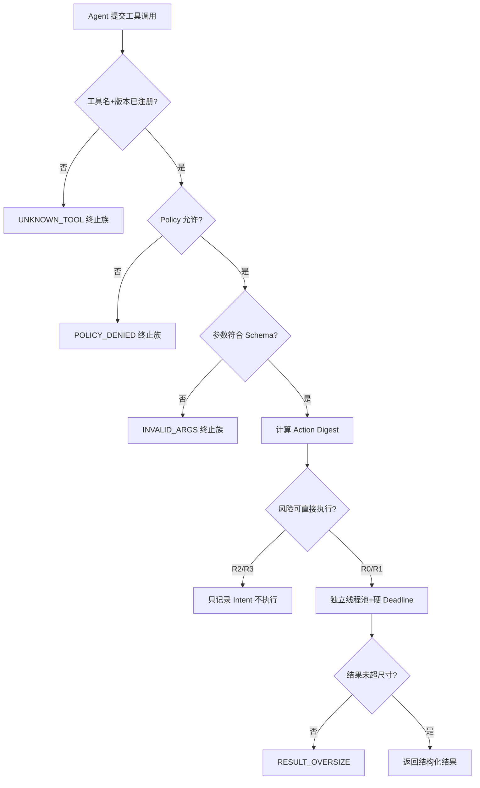

# 告警 Agent：从一笔卡住的订单，走到一份可信的根因报告

> 面向 16 岁读者的项目深讲版。本文只沿仓库中的真实告警业务讲解，不借用外卖、医院、侦探社等其他例子。
>
> 代码事实截止：2026-09-08 当前工作区。本文完全从当前源码、Flyway 迁移、部署配置、测试类和测试报告重新梳理，不从既有讲解稿继承结论。

---

## 0. 先说结论：这个项目到底解决什么问题

这个项目不是“把告警文字丢给大模型，让它猜一个答案”。

它解决的是下面这条真实业务链上的问题：

1. 用户调用 `POST /orders` 创建订单；
2. `order-arena` 执行两步创单、资源扣减和支付；
3. 如果支付结果变成未知，订单可能长期停在 `CREATED`；
4. 领域探针把这种事实统计成 `oa_stuck_orders_current > 0`；
5. Prometheus 触发 `ArenaOrderStuck` 告警；
6. Alertmanager 把告警组发送到 `POST /webhooks/alertmanager`；
7. `control-app` 做认证、限长、持久化、去重、聚合、排队和调查；
8. Holmes 或 Native Agent 调查证据；当前 Native 路径中 Prometheus 是在线查询，日志与变更还是冻结 fixture 回放，不能冒充生产实时查询；
9. 系统验证结论、保存证据、生成报告；
10. `notify-app` 把报告发送到指定渠道；
11. 前端、指标、日志、Trace 和外部探针共同展示“现在做到哪一步、为什么停住、结果是否可信”。

最核心的一句话是：

> 大模型可以提出调查结果，但它不能决定任务是否存在、能调用什么、是否重试、证据是否有效、报告能否发布。那些权力都留在确定性代码和数据库约束里。

这就是项目里 `Agent` 和 `Harness` 的关系：Agent 负责“思考和调查”，Harness 负责“约束、记账、恢复和裁决”。

### 0.1 怎样证明这是做出来的，而不是画出来的

本文每个能力都用下面三种成熟度标记。面试时我会先说成熟度，再说设计；绝不把一个已经写好的类、一个通过单测的组件、一个真正接入告警主链的能力混为一谈。

| 成熟度 | 判定标准 | 本文表达方式 |
|---|---|---|
| **L1 主链已接入** | 生产装配能从真实入口调用到它，有数据库或外部副作用，有测试覆盖 | “已经实现并接入” |
| **L2 组件已实现** | 类、迁移和单测存在，但当前告警执行器没有调用它，或只在 Shadow/Replay 使用 | “组件存在，尚未接入主链” |
| **L3 规划中** | 只有方案或未来迁移号，当前源码和数据库都没有 | “尚未实现” |

例如：Webhook 收件、PG 调度、租约恢复、Holmes 调用、Native M6-01 执行和通知 Outbox 是 L1；`RunBudgetGate`、`DoomLoopGuard` 是 L2；Native 失败后自动铸造 Holmes fallback Run 的 V32 约束是 L3。

证明链也不是一句“有测试”：

```text
业务入口
→ Java 调用点
→ 仓储 SQL / 外部 HTTP
→ Flyway 字段、CHECK、UNIQUE、权限
→ 单元测试（纯规则）
→ WireMock（HTTP 边界）
→ Testcontainers PostgreSQL（真实约束与并发）
→ 真栈 E2E（Prometheus → Alertmanager → control → Holmes/Native → notify）
```

这条链缺哪一层，我就只声明到哪一层。

---

## 1. 阅读前的基础知识清单

不需要先学完再读。看到陌生词时回到这张表即可。

| 基础概念 | 在本项目里的意思 |
|---|---|
| HTTP / Webhook | Alertmanager 主动向控制面发送一组告警的方式 |
| JSON | 告警、工具参数、模型结果和事件载荷的结构化文本格式 |
| Bearer Token | Webhook 或管理 API 的身份凭证；不是业务内容的一部分 |
| 数据库事务 | 一组数据库修改要么全成功，要么全失败 |
| 行锁 | 修改一行时暂时阻止别人同时修改同一行 |
| `FOR UPDATE SKIP LOCKED` | 多个 worker 领任务时，跳过已被别人锁住的行 |
| 幂等 | 同一个请求重复执行，不制造第二份业务结果 |
| 唯一约束 | 数据库从最底层阻止重复行 |
| 哈希 / Digest | 把一段内容变成稳定指纹；内容变化，指纹通常就变化 |
| Canonical JSON | 把字段顺序、数字格式等统一后再哈希，避免“内容相同、文本顺序不同”造成假变化 |
| 状态机 | 明确对象有哪些状态、哪些迁移合法、哪些状态不可再离开 |
| 租约 Lease | worker 在一段时间内拥有任务；超时后可由别人接管 |
| Fencing Token / Epoch | 每次重新领取都递增的代号；旧 worker 即使回来，也不能覆盖新 worker 的结果 |
| DAG | 有方向、无环的任务依赖图；表示谁必须等谁完成 |
| Outbox | 在业务事务中先写一条“待通知”记录，再由独立 worker 发送 |
| DLQ / Dead Letter | 反复失败或数据本身非法后进入的终态记录，保留现场供人工处理 |
| Circuit Breaker | 外部服务连续失败后暂时快速拒绝，避免继续把它打垮 |
| Backoff | 失败后不要立刻狂重试，而是等待一段时间再试 |
| Snapshot | 把本次调查所依据的证据、配置和工具版本冻结成一个不可混淆的输入世界 |
| Claim | 一个可判真假的断言，例如“F3 支付结果未知导致订单卡住” |
| Ground Truth | 评测时受控保存的正确答案 |
| Canary | 只让很小比例真实流量走新引擎，观察安全性和效果 |
| Metrics / Logs / Traces | 指标、日志、调用链三类可观测数据 |

---

## 2. 从最小原子问题开始：订单为什么会发出告警

### 2.1 原子问题一：一次下单不是一个数据库动作

`order-arena` 的创单链不是一条简单的 `INSERT order`。它包含：

- 创建交易单快照；
- 创建履约单；
- 按顺序扣库存、优惠、限购、资产；
- 创建支付授权记录；
- 调用支付网关；
- 根据结果把订单变成可见、废弃或待对账。

代码入口是：

- `order-arena/.../interfaces/OrderController.java`
- `order-arena/.../application/TwoStepOrderService.java`
- `order-arena/.../application/OrderCreationSteps.java`

问题在于：外部支付调用和本地数据库事务无法天然成为一个“全世界共同事务”。请求可能已经送到支付方，但本地在收到回答前崩溃；也可能支付方已经处理，网络却让我们没看到结果。

### 2.2 解决一：承认“未知”，不要把未知伪装成失败或成功

项目把支付记录先落为 `INITIATED`，再用 CAS 更新最终结果。若调用结果不确定，订单会保留为 `CREATED`，支付结果保留为 `UNKNOWN`，等待对账或补偿。

优势：

- 不会在不知道真实结果时瞎改订单；
- 后续可以根据账本继续恢复；
- 测试可以稳定制造 F3“超时未知”故障。

问题：

- `CREATED` 订单对用户不可见，但它仍占着业务资源；
- 未知状态如果长时间不收敛，就形成卡单。

### 2.3 原子问题二：怎么把“有卡单”变成机器可观察的事实

领域探针统计卡单，暴露指标 `oa_stuck_orders_current`。Prometheus 规则里真实定义了：

```yaml
- alert: ArenaOrderStuck
  expr: oa_stuck_orders_current > 0
  labels:
    severity: page
    service: order-arena
    fault_type: F3
```

这里没有让 Agent 自己不停查询订单库判断是否出事。Prometheus 先完成“是否触发告警”的确定性判定，Agent 只处理已经成立的告警。

为什么这样选：

- Prometheus 擅长时间序列和阈值判断；
- 告警规则可审查、可测试、可重复；
- Agent 不需要 24 小时不断消耗模型调用；
- “告警是否成立”和“根因是什么”被拆成两个问题。

代价：

- 规则写错会漏报或误报；
- 指标只能告诉我们“卡住了”，不能自动证明“为什么卡住”。

于是下一个问题出现：告警到了以后，如何可靠地接住它？

---

## 3. 整体架构层：先把决定权分开

### 3.1 一张总图



### 3.2 每个模块只承担一类主要责任

| 模块 | 解决的问题 | 为什么单独存在 |
|---|---|---|
| `order-arena` | 产生真实订单流程、可控故障和业务指标 | 如果没有真实业务入口，RCA 只能验证“会不会说话”，不能验证是否能解释业务故障 |
| Prometheus | 采集指标、按规则判断异常 | 把高频数据计算留给专门的时序系统 |
| Alertmanager | 告警分组、路由和重复通知 | 控制“哪些告警何时送来”，不负责做 RCA |
| `control-app` | 接入、聚合、排队、调查、证据、报告、评测和控制面 | 它是状态与决策中心 |
| HolmesGPT | 旧的生产 RCA 引擎 | 提供已有 Agent 调查能力，作为基线和回退方向 |
| Native Agent | 项目自研的受控 RCA 链 | 把工具、证据、裁决和报告掌握在自己的 Harness 中 |
| PostgreSQL | 唯一权威状态、持久队列、租约、账本、Outbox、DLQ | 让状态修改和任务产生处在同一事务世界 |
| CAS 文件存储 | 保存较大的脱敏原文 artifact | 大文本不必全部塞进关系表；内容摘要仍可对账 |
| `notify-app` | 领取 Outbox 并向外发送 | 把外部写权限与控制面隔离，发送失败不回滚报告 |
| `alert-web` | 查看告警、Run、DAG、事件、评测和人工 Case | 只读展示与受控命令，不是第二个调度中心 |
| OTel / Micrometer / Gatus | 内部遥测与外部黑盒健康检查 | 系统自己的故障不能只靠系统自己报告 |

### 3.3 为什么用 Java 21 + Spring Boot

选择它不是因为 Agent 必须用 Java，而是因为本项目真正困难的是事务、状态、并发、恢复和长生命周期服务。

优势：

- `JdbcClient` 和事务模板适合明确控制短事务；
- Java 类型系统、`enum`、`record`、`sealed interface` 很适合封闭状态和错误分类；
- 虚拟线程适合“少量长等待的网络任务”，不必引入复杂响应式编程；
- Spring Boot 提供 Web、配置、健康检查、数据库和测试生态；
- ArchUnit 可以检查分层依赖没有被偷偷打穿。

问题：

- 代码量明显大于脚本型 Agent；
- 手工装配 Bean 和端口会增加学习成本；
- Java 并不会自动保证正确，事务边界和 SQL 仍需自己设计。

### 3.4 为什么按 DDD 四层分包

主要分为 `interfaces / application / domain / infrastructure`：

- `interfaces`：HTTP 入口，负责协议，不负责业务判断；
- `application`：编排一段用例，例如“消费一条 inbox”“执行一个 Run”；
- `domain`：状态机、预算、Claim、DAG 等纯规则；
- `infrastructure`：PostgreSQL、HTTP 客户端、文件 CAS 等实现。

这样做解决的问题是：数据库、HTTP 和 Spring 不应该决定“FIRING 能不能直接变成某个状态”。真正的业务规则能以纯函数测试，基础设施只是执行规则。

代价是类会变多。但这里类多不是为了炫技，而是为了让“协议问题、调度问题、证据问题、发布问题”不能在同一个方法里互相污染。

---

## 4. 入口层：为什么收到告警不立刻开始调查

### 4.1 原子问题：Alertmanager 只关心 HTTP 是否成功

入口是：

```text
POST /webhooks/alertmanager
```

`AlertWebhookController` 把结果分为：

- `401`：身份不对，零落库；
- `400`：JSON 或协议字段非法，零落库；
- `413`：请求体、解压体或告警条数过大，零落库；
- `503`：整组无法持久化，告诉 Alertmanager 以后重试；
- `202`：整组已经持久化，后续异步处理。

为什么不能在 HTTP 请求里直接调用 Holmes：

- RCA 可能持续数分钟，Webhook 会超时；
- Alertmanager 重试会重复启动昂贵调查；
- 模型挂掉会让入口一起挂掉；
- 请求线程持有数据库事务会占连接并放大故障；
- 没有先落库，进程崩溃后就不知道收到过什么。

所以入口只完成“验证并存档”，快速返回 `202`。

### 4.2 入口防线按什么顺序排列

真实顺序是：

1. 检查控制面告警声明，防系统给自己做递归 RCA；
2. 验证业务 Webhook Bearer；
3. 检查压缩与大小；
4. 解析 JSON 深度；
5. 验证 envelope 字段；
6. 检查 `alerts[]` 条数；
7. 检查每条状态、指纹、时间和标签长度；
8. 原样保存解压后的 `payload_raw` 与 `payload_digest`；
9. 返回 inbox ID。

顺序很重要。比如先解压一个无限膨胀的 gzip 再看大小，就会遭遇解压炸弹；先落库再验签，就会让伪造请求污染审计表。

### 4.3 为什么保存原始组，而不是入口直接拆成多条

Alertmanager 发送的是一个告警组。HTTP 层只能对整组返回一个状态码，不能告诉它“第 2 条成功、第 3 条失败”。因此项目先保存完整 envelope，后台再拆组。

优势：

- 保留接收现场；
- 协议漂移可追查；
- 重放时有权威原文；
- `202` 可以严格表示“这一组已经持久化”。

问题：

- 后台投影失败时需要 inbox 自己的重试和死信状态；
- 需要额外保存一份原始字节。

### 4.4 防自噬：为什么控制面告警不进入普通 RCA

假设 `control-app` 自己的模型调用失败也生成告警。如果这个告警再启动 `control-app` 的 RCA，而 RCA 又失败，又生成新告警，就可能递归耗尽系统。

`ControlAlertRouter` 要求三道门同时成立：

1. 独立的控制面 Bearer；
2. `receiver` 在允许列表；
3. `monitoring_scope` 在允许列表。

通过后，告警直接记为 `PROCESSED + SUPPRESSED` 并路由值班通道，不创建 Incident 和 Run。仅在 body 里伪造 `RCA_SYSTEM` 标签没有用，因为标签不是身份。

这解决的是“系统故障需要通知，但不能让故障系统无限自救”的问题。

---

## 5. 身份、去重与聚合：同一声告警到底是不是同一件事

### 5.1 原子问题：一个哈希不够

告警里有三类“相同”问题：

1. 是否属于同一个事故；
2. 是否是完全重复的一次通知；
3. 是否出现了值得重新调查的新材料。

如果只用一个哈希，三个问题会互相冲突。

### 5.2 解决：三种身份各答一个问题

`AlertIdentityFactory` 生成三种身份：

| 身份 | 输入 | 回答的问题 |
|---|---|---|
| `incidentKey` | `alertname/service/service_name/namespace/job` | 这条告警属于哪个 Incident |
| `payloadHash` | 全部 labels + status + startsAt | 这是不是同一条重复通知 |
| `investigationHash` | 关键 labels + 静态 annotations | 调查材料是否发生值得重查的变化 |

告警级别 `severity` 不进入 `incidentKey`，因此从 warning 升成 page 不会突然换成另一张事故单。`current_value` 这类抖动数值不进入 `investigationHash`，因此数值每跳一次不会烧一次模型调用。

优势：

- 聚合稳定；
- 重复通知可计数但不重复调查；
- 真正材料变化可触发 RERUN；
- 标签输入先 canonicalize，顺序变化不会制造假差异。

问题：

- 关键标签表配置错会错误合并或错误拆分；
- 排除某个动态 annotation 后，它的变化将不再触发重查；
- 哈希只能判断内容身份，不能证明内容是真实的。

### 5.3 乱序问题：resolved 先到、firing 后到怎么办

网络和分组可能让旧事件晚到。项目用 `episode_started_at` 作为水位：

- `startsAt` 早于当前 episode 水位的事件，只计数，不改状态；
- `FIRING → RESOLVED` 保持 generation；
- 已 RESOLVED 后真正的新 FIRING 才让 generation + 1；
- 同 episode 中比 resolved 更早的迟到 FIRING 不会把事故错误复活。

这就是 generation 的意义：它不是简单重试次数，而是“第几次独立事故 episode”。

---

## 6. 状态机：它不是枚举列表，而是把错误路径设计出来

### 6.1 状态机是怎样推导出来的

项目不是先画一堆状态，再硬把代码塞进去。正确的推导顺序是：

1. 先找业务对象，例如 inbox、incident、run、task、publication；
2. 对每个对象写出必须一直成立的不变量；
3. 列出外部世界可能发生的事件：收到、领取、超时、恢复、重复、取消、失败；
4. 找出不能被一个布尔值表达的中间状态；
5. 区分“还能继续”的活跃态与“不再自动变化”的终态；
6. 列出唯一合法的有向边；
7. 用代码迁移表、SQL 条件和数据库 CHECK 三层约束；
8. 穷举所有 `from × to` 组合测试，防止漏边和多放边。

状态机的价值不在于正常路径，而在于它迫使设计者回答：进程崩了怎么办、旧 worker 回来了怎么办、重试耗尽怎么办、任务依赖失败怎么办。

### 6.2 Inbox 六态



为什么需要 `PROCESSING`：没有它就不知道某条 inbox 是否正在被处理，也无法设置租约。

为什么需要 `RETRY_WAIT`：失败后立即重试会形成忙循环；把下次时间持久化后，worker 可以去做别的任务。

为什么需要 `DEAD_LETTER`：结构损坏和缺 `alertname` 不是“多试几次就会好”的故障。继续重试只会烧资源。

### 6.3 Incident 二态为什么反而很少

Incident 只有：

- `FIRING`
- `RESOLVED`

它不包含 `INVESTIGATING`，因为“业务故障是否仍在发生”和“RCA 是否正在执行”是两件正交的事。调查状态属于 `RcaRun`，准入决定属于 inbox。

这是很重要的建模原则：一个状态字段只回答一个问题。否则会出现 `RESOLVED_BUT_INVESTIGATING`、`FIRING_SUPPRESSED` 之类组合爆炸。

### 6.4 Run 九态

| 状态 | 含义 |
|---|---|
| `QUEUED` | 已创建，等待首次执行 |
| `RUNNING` | 至少一个 driver 已执行 |
| `REPORTING` | 调查任务结束，正在裁决与组装报告 |
| `SUCCEEDED` | 成功完成 |
| `FAILED` | 不可继续的失败 |
| `CANCELLED` | 人工取消 |
| `SUPERSEDED` | 被同事故更新一代 Run 取代 |
| `PARTIAL` | 预算或 SLA 耗尽，只完成部分 |
| `EXPIRED` | deadline 到期强制收尾 |

只有 `QUEUED/RUNNING/REPORTING` 是活跃态。数据库的部分唯一索引保证同一个 Incident 同时最多一个活跃 Run。

为什么有 `REPORTING`：调查完成不等于报告可以发布，中间还有 Claim 裁决、结构验证和 Outbox 产生。如果没有它，系统会把“证据齐了但报告还没落库”误写成成功。

### 6.5 Task 十一态

| 状态 | 解决的问题 |
|---|---|
| `BLOCKED` | DAG 前置还没完成 |
| `READY` | 可以领取 |
| `LEASED` | 已被 worker 持有租约 |
| `RUNNING` | 正在执行 |
| `RETRY_WAIT` | 可重试失败，等待退避 |
| `DONE` | 成功终态 |
| `SKIPPED` | 必需前置失败，确定性跳过 |
| `FAILED_TERMINAL` | 规则判定不可重试 |
| `DEAD` | 重试耗尽或执行终局失败 |
| `CANCELLED` | 人工取消 |
| `STALE` | 所属 Run 已过代，结果不得使用 |

`LEASED` 与 `RUNNING` 分开，是因为“拿到执行权”和“已经进入执行”不是同一时刻。`STALE` 则是 generation fence 的落点：旧世界的结果不能污染新世界。

### 6.6 状态机如何被真正执行

项目使用通用 `TransitionTable`，每台状态机显式声明边。迁移前调用 `requireTransition`，非法边抛异常。

但只在 Java 中检查还不够：两个并发线程可能都先读到旧状态。因此仓储更新还带条件：

```sql
UPDATE rca_task
SET state = :to
WHERE id = :id AND state = :from
```

只有一个更新能成功。数据库 CHECK 再保证状态值不超出全集。

三层防线分别解决：

- Java 表：业务是否允许；
- 条件更新：并发时谁赢；
- DB CHECK：任何旁路写入也不能制造未知值。

---

## 7. 异步调度：为什么 PostgreSQL 既存数据又排任务

### 7.1 原子问题：多个 worker 不能领到同一任务

领取 SQL 的核心是：

```sql
SELECT ...
FROM rca_task
WHERE state IN ('READY', 'RETRY_WAIT')
  AND available_at <= now()
FOR UPDATE SKIP LOCKED
LIMIT 1
```

`SKIP LOCKED` 的含义不是“没有锁”，而是“别人已经锁住的行，我跳过去领下一行”。领取同时把任务改为 `LEASED`、写入 owner、租约截止时间，并让 `lease_epoch + 1`。

### 7.2 原子问题：worker 领完就崩了

解决方法不是永久锁住，而是租约：

- 正常执行时持续 heartbeat；
- 超过 `lease_until` 后，恢复扫描把任务放回 `RETRY_WAIT`；
- scheduler slot 也有独立租约并被回收；
- 悬挂的 `STARTED` 调用账本被标为 `UNKNOWN`。

为什么标 `UNKNOWN` 而不是 `FAILED`：请求可能已经发到外部并产生费用，只是本地没看到响应。说失败是编造事实。

### 7.3 原子问题：旧 worker 在租约过期后突然回来

这正是只用“锁超时”最危险的地方。旧 worker 可能在新 worker 完成后写入旧结果。

项目用 `lease_epoch` 做 fencing token：

- 第一次领取 epoch=1；
- 租约过期再领 epoch=2；
- epoch=1 的 worker 收尾时，SQL 条件不再命中；
- 旧结果被拒绝，不能覆盖 epoch=2 的结果。

### 7.4 为什么还要固定 scheduler slot

任务表解决“谁领哪条”，slot 表解决“最多同时跑几条昂贵任务”。领取 slot 和领取 task 在同一个短事务中完成。

这是一种持久化 bulkhead：即使进程有很多虚拟线程，也不会无限并发调用模型，把 CPU、内存、数据库连接和外部配额打满。

### 7.5 优先级和 SLA

领取顺序先看是否已经越过 deadline，再看 priority、deadline、创建时间和 ID。这样严重告警优先，同时过期任务不会永远饿死。

代价：

- SQL 需要正确索引；
- 高频毫秒级任务会把 PG 变成吞吐瓶颈；
- 自己维护了租约、退避和 DLQ 语义。

本项目的 RCA 是分钟级、低到中等吞吐、强审计任务，PG 队列的事务优势大于吞吐损失。

---

## 8. 工具层：Agent 不能想调用什么就调用什么

### 8.1 工具定义不是一个函数名

每个 `ToolDefinition` 包含：

- `name`
- `version`
- 输入 schema
- 风险等级
- 超时时间
- 最大结果字节数
- 由 schema canonical JSON 计算的 `schema_hash`

Native 链真实注册的调查工具包括：

- `prometheus.query@1`
- 日志查询工具
- 变更查询工具

每个证据 Agent 的 allowlist 必须恰好只有它自己的一个工具。例如 Metrics Agent 不能顺便调用日志或写操作。

### 8.2 Tool Registry 为什么只允许启动期构造

`ToolRegistry` 没有运行时注册 API。重名同版本、空注册表、空执行器都会让应用启动失败。

这样做解决：

- 运行中偷偷下载插件会改变能力边界；
- 同名工具静默覆盖会让同一提案在两次执行中含义不同；
- 回放时无法知道当时到底用了哪个 schema。

代价：工具升级通常需要发布配置或重启，灵活性低于动态插件市场。但生产 RCA 更看重可复现和最小权限。

### 8.3 Tool Gateway 的固定过闸顺序



为什么是“双闸”：模型看到的工具清单先被 policy 裁剪一次，但即使模型伪造一个未下发的工具调用，执行时还会再鉴权一次。

### 8.4 为什么 schema 默认拒绝未知字段

`additionalProperties=false`。未知参数不是悄悄丢掉，而是硬拒绝。

如果模型传了 `delete=true`，而 schema 只声明了 `query`，静默丢字段表面看很方便，实际上会掩盖模型与工具协议已经漂移。硬拒绝才能让错误进入评测和监控。

### 8.5 工具错误为什么分两族

- 模型可见族：超时、限流、远端临时不可用、回放 miss；可以进入受控重试。
- 控制面终止族：未知工具、策略拒绝、非法参数、认证失败、预算耗尽、过代；不能让模型通过重复尝试绕过。

这比把所有异常都变成字符串喂回模型更安全。模型不能靠“再试一次”突破权限门。

### 8.6 Action Digest 解决什么问题

Action Digest 覆盖工具名、版本、schema hash、参数、时间窗和输入快照。它用于：

- 工具调用账本身份；
- 检测重复无进展调用；
- 精确回放；
- 比较基线与候选是否做了相同动作。

它不是缓存键的简单替代，而是“本次动作到底是什么”的可审计身份。

---

## 9. Agent Loop：这个项目其实有三种循环

很多人把 Agent Loop 简化为“思考 → 调工具 → 再思考”。本项目里必须把三种循环分开。

### 9.1 循环一：系统工作循环

`AlertInboxProcessor` 和 `RcaWorker` 都是常驻虚拟线程：

```text
恢复过期租约 → 领取工作 → 执行一轮 → 收尾 → 没工作则短暂休眠 → 重复
```

这个循环解决可靠调度，与大模型思考无关。

### 9.2 循环二：单次模型调用的路由循环

仓库里的通用 `ModelGateway` 有：

```text
预算预检 → 冷却检查 → 熔断检查 → STARTED 记账 → 调用
→ 成功结算，或分类失败 → 同路由重试 / fallback / defer / fail
```

需要特别说明当前边界：这套 `ModelGateway` 是仓库中的通用模型治理能力，但告警主链的 Holmes 调用目前直接走 `HolmesInvestigationExecutor → HolmesClient`，没有把 `ModelGateway` 接在这条 RCA HTTP 路径上。因此不能说当前每次告警 RCA 都自动享受了这套双模型路由。

告警 Holmes 路径当前实际拥有的是：

- HTTP 状态分类；
- task 级最多次数重试；
- 固定退避；
- 连接/读取超时；
- 外调账本和 `UNKNOWN` 恢复；
- LiteLLM 代理侧预算与用量记录。

### 9.3 循环三：Native RCA 调查链

当前 `NativeInvestigationExecutor` 的真实顺序是：

1. 从已激活 ConfigBundle 读取固定 proposal；
2. `PlanCompiler` 校验并落 DAG；
3. 驱动 Metrics Agent；
4. 驱动 Logs Agent；
5. 驱动 Change Agent；
6. 冻结 Evidence Snapshot；
7. Run 进入 `REPORTING`；
8. Native RCA Agent 把证据转成 Claim；
9. Claim Reducer 确定性裁决；
10. Report Assembler 分成确认、推测、未决；
11. 结构验证；
12. 交给统一 `finishTask` 收尾、发布和通知。

它不是一个无限 ReAct while-loop。当前 proposal 是配置中的固定 DAG，模型没有运行时自由增生 Agent 或任务的权力。

### 9.4 为什么限制任务数和深度

`PlanCompiler` 限制：

- 任务数最多 8；
- DAG 深度最多 3；
- VERIFY 最多 1 个；
- task type 必须 `name@version` 全钉；
- 输入 artifact 必须属于本 Run；
- 无环；
- 未声明字段拒绝。

这些限制不是为了让 Agent 变笨，而是让成本、时间和恢复空间有上界。一个能无限创建子 Agent 的系统，也能无限花钱、无限等待和无限制造互相矛盾的上下文。

### 9.5 Doom Loop 如何检测

`DoomLoopGuard` 按 `(taskId, tool, actionDigest)` 记录连续无进展次数。达到阈值后，该签名粘滞熔断，之后零 LLM、零工具调用。

为什么不能只靠总 step 数：总 step 只能阻止无限运行，不能指出“同一个动作重复了 5 次仍没有新证据”。Doom Loop Guard 能给出更具体的故障原因。

合法轮询工具可以进入豁免集，否则对账轮询也会被当成死循环。

这里必须加成熟度限定：`DoomLoopGuard` 的纯规则和测试已经存在，但当前 `NativeInvestigationExecutor` 没有持有或调用它。因此它是 **L2 Harness 组件**，不是当前 F3 Native 主链已经生效的保护。当前主链真正生效的有界条件是固定三任务、每个证据 Agent 恰好一个工具、工具超时/结果上限、Shadow 限流和 driver task 的有限循环。把 Doom Loop Guard 接进主链仍是一项明确待办。

---

## 10. Harness 层：它不是一个类，而是一圈硬边界

### 10.1 Harness 解决的原子问题

Agent 生成的是概率性输出。生产系统需要回答：

- 它能看到什么？
- 它能调用什么？
- 最多调用几次？
- 每次最多等多久？
- 结果多大？
- 失败能不能重试？
- 证据属于哪一代事故？
- 进程崩溃后从哪里继续？
- 哪些结论可以写“确认”？
- 谁能发布？

这些问题合起来才是 Harness。

### 10.2 本项目 Harness 的组成

| Harness 部件 | 强制的边界 |
|---|---|
| Agent Registry | 只能执行预注册、版本固定的 Agent |
| Plan Proposal + Compiler | LLM 提案必须通过结构和语义双校验 |
| DAG Promoter | 依赖放行和跳过由确定性代码决定 |
| Tool Registry | 工具名、版本、schema、风险和限制固定 |
| Tool Policy + Gateway | 清单裁剪与执行时二次鉴权 |
| Budget Gate | L2：三段式预留组件、PG 账本和测试已存在；当前 Native 主执行器尚未调用 |
| Doom Loop Guard | L2：重复无进展动作熔断组件已有；当前 Native 主执行器尚未调用 |
| Ledger | 外部调用前后两段记账 |
| Lease + Epoch | worker 所有权与旧结果隔离 |
| Generation Fence | 旧 episode 结果不能污染新 episode |
| Evidence Envelope | schema、来源、代际和内容摘要 |
| Snapshot | 冻结证据、配置和工具世界 |
| Claim Reducer | 多 Agent 冲突由规则裁决，不由互相聊天决定 |
| Report Assembler | 无双源证据不写成确认根因 |
| Outbox | 报告事务与外部通知解耦 |
| Replay / Shadow | 候选链用相同输入比较，不影响生产输出 |

### 10.3 预算为什么必须在调用前扣

`RunBudgetGate` 使用三段式：

1. `reserve(estimate)`：调用前保守预留；
2. 调外部服务，网络期间不持数据库行锁；
3. 成功后 `commit(actual)`，异常则标 `provisional` 等待对账。

如果先调用再看预算，预算只能做报表，不能做安全边界。钱已经花完才报警没有阻止任何事。

预算维度包括 step、tool call、evidence、subtask、时间 deadline。预算耗尽后的正确行为是确定性收尾，不允许“再调一次模型让它总结”，因为那次调用本身已经越界。

但是当前接线状态必须讲准确：

- V13 已有 `run_budget_state`、`run_budget_entry`、`incident_budget_entry`；
- `PostgresRunBudgetLedger` 已实现条件更新和幂等 reservation；
- `RunBudgetGateTest` 与 `AlertRunBudgetLedgerIT` 验证组件语义；
- `AgentProfile` 已携带默认 step=8、toolCalls=4、evidences=8、subtasks=1 的元数据；
- 当前 `NativeInvestigationExecutor` 与 `SingleToolEvidenceAgent` 并未注入 `RunBudgetGate`，所以不能声称 F3 Native 调查已做到“超预算零触网”。

当前真实生效的是结构性上限：提案最多 8 个任务、深度最多 3、每个固定证据 Agent 一次工具调用、工具 4 秒 deadline、结果 64 KiB、Shadow 每分钟最多 60 次且独立 2 线程池。预算总账接入主执行链之后，才能把这些分散上限升级为跨步骤的统一消费账。

### 10.4 Harness 的优势和代价

优势：

- 结果可审计；
- 行为有上界；
- 崩溃可恢复；
- 权限不能靠 Prompt 绕过；
- 模型更换不改变控制权；
- 评测可以比较相同输入。

代价：

- 开发量远大于一个 ReAct Demo；
- 每个新工具、状态和错误都要维护契约与测试；
- 自由探索能力被限制；
- Harness 自己也可能有 bug，因此还需要监控、红队和 E2E。

---

## 11. 上下文持久化：项目没有一团神秘的“聊天内存”

### 11.1 原子问题：内存 Context 会在崩溃后消失

如果 Agent 的上下文只放在进程内列表里，进程重启后无法回答：

- 收到过哪些告警；
- 调过哪些工具；
- 哪个结论基于哪些证据；
- 当时用了哪版配置；
- 任务执行到哪一步；
- 外部调用是否可能已经发生。

### 11.2 解决：把 Context 拆成可验证的持久事实

| Context 部分 | 存在哪里 |
|---|---|
| 原始告警组 | `alert_inbox.payload_raw` + digest |
| 单条告警事实 | `alert_event` |
| 聚合事故 | `incident` |
| 一轮调查身份 | `rca_run` + generation + config digest + engine |
| 任务与依赖 | `rca_task` + `rca_task_edge` |
| 物理尝试 | `rca_attempt` |
| 外部调用现场 | invocation ledger / tool invocation ledger |
| 结构化证据 | `rca_evidence` |
| 冻结输入世界 | `rca_evidence_snapshot` + member 表 |
| 裁决后的命题 | `rca_claim` |
| 不可变报告 | `rca_report` |
| 进度事件 | `rca_event(run_id, seq)` |
| 较大脱敏原文 | 本地 CAS，以内容 digest 寻址 |

这不是把一整个 Java 对象序列化进 Redis，而是把 Context 分解成领域事实。恢复者不需要相信旧进程留下的一块内存，只需重新读取数据库权威状态。

### 11.3 Snapshot 为什么还要覆盖配置和工具版本

Snapshot digest 的输入包含：

- observed generation；
- config digest；
- tool registry digest；
- 所有成员的 `(evidenceType, payloadDigest)`。

成员排序后再 canonicalize，所以相同事实即使插入顺序不同也得到相同 digest。换了配置、工具定义或事故代际，digest 必须变化。

这解决“时间穿越”：不能拿新配置生成的证据补进旧报告，也不能让迟到工具结果修改已经冻结的世界。

### 11.4 为什么证据 payload 用 TEXT 而不是 JSONB

证据要求保存 canonical 字节并在读取时重新计算 digest。PostgreSQL `jsonb` 会重排键并规范化表示，无法保证原字节回读，因此证据正文使用 TEXT 保存 canonical 内容。

这是一个典型技术取舍：

- JSONB 查询方便，但会改变字节表示；
- TEXT 查询不如 JSONB 灵活，却能完成字节级完整性验证。

### 11.5 回放不是重新访问线上数据

`ReplayToolGateway` 按精确 Action Digest 查已录制结果：

- 命中就返回当时字节；
- miss 就显式 `REPLAY_MISS`；
- 绝不偷偷降级为活工具调用。

否则所谓“回放”会读取今天的 Prometheus 数据，再和昨天的报告比较，结果没有统计意义。

---

## 12. 多 Agent：不是开会投票，而是分工取证后统一裁决

### 12.1 当前真实的 Agent 角色

| Agent | 只负责什么 | 不允许做什么 |
|---|---|---|
| Metrics Agent | 查询 Prometheus 指标并写证据 | 查日志、改系统、直接下根因 |
| Logs Agent | 按日志证据契约写证据；当前数据面是 classpath 冻结 fixture | 冒充实时日志、调指标、直接发报告 |
| Change Agent | 按变更证据契约写证据；当前数据面是 classpath 冻结 fixture | 冒充实时发布系统、运行任意命令、直接发通知 |
| Native RCA Agent | 从证据黑板产生 Claim | 直接发布报告 |
| HolmesGPT | 旧引擎中完成外部调查并返回结构化包 | 绕过本地结构验证和发布事务 |

三个证据 Agent 都继承 `SingleToolEvidenceAgent`，共用工具调用、账本、错误分类和证据封包纪律。

这组 Agent 确实是项目自己的实现：`MetricsAgent`、`LogsAgent`、`ChangeAgent`、`NativeRcaAgent`、`SingleToolEvidenceAgent`、`ToolGateway`、`ClaimReducer` 和 `ReportAssembler` 都在仓库内，不是只在 Prompt 中虚构角色。但“自己实现”也不等于所有数据源都生产化：`AlertAm4Config` 中 `prometheus.query` 绑定 `PrometheusQueryExecutor`，`logs.query` 与 `change.query` 绑定 `ReplayToolExecutor(fixtureBytes(...))`。这是目前最重要的能力边界之一。

### 12.2 当前是逻辑多 Agent，不是物理并行

架构上指标、日志和变更任务是 DAG 中可以独立的调查分支。但当前 `NativeInvestigationExecutor.investigate` 对任务列表逐个循环驱动，因此它们是顺序执行。

为什么现阶段这样做：

- 1% Canary 先验证语义和安全边界；
- 2C4G 环境需要控制峰值；
- 顺序执行更容易证明租约、预算和收尾；
- driver task 独占整个 Native Run 的执行权。

优势是简单和可预测；问题是总延迟等于多个工具延迟相加，也没有真正利用 DAG 并行性。以后若物理并行，必须先补齐每个 DAG task 的独立 claim、预算、心跳、恢复和并发收敛，不能只加一个线程池。

### 12.3 Claim Reducer 如何处理冲突

Claim 按五元组分组：

```text
claimKey + scope + timeRange + generation + snapshotDigest
```

规则是：

1. 同一 source 的重复说法只算一票；
2. 所有来源状态一致，接受一致结果；
3. 冲突时有权威源则按权威源，但多个权威源冲突仍为 UNKNOWN；
4. 无权威源时，恰好一个状态获得至少两个独立来源支持，才裁成该状态；
5. TRUE 和 FALSE 对峙，或都没有双源，结果为 UNKNOWN；
6. 禁止用“多数票”或模型置信度制造真相。

为什么不是让 Agents 互相聊天到达共识：聊天会扩大 token 成本，结论依赖发言顺序，两个 Agent 也可能引用同一个数据源却伪装成“两票”。本项目把来源身份和证据引用落库，再由纯函数裁决。

### 12.4 报告为什么有三种结果

- `CONFIRMED`：存在双源一致的 TRUE 根因，且没有推测/冲突残留；
- `PARTIAL`：有确认根因，但还有单源或未决内容；
- `UNRESOLVED`：没有达到确认标准的根因。

`UNRESOLVED` 不是失败，它是诚实答案。真正危险的是证据不足却生成听起来很确定的原因。

---

## 13. 故障转移：先区分四个不同层次

“有 fallback”这句话太模糊。本项目至少有四层故障处理。

### 13.1 Worker 崩溃转移：已经实现

依靠：

- task lease；
- scheduler slot lease；
- heartbeat；
- lease epoch；
- 过期回收；
- 悬挂账本 `STARTED → UNKNOWN`。

它解决“执行这条任务的进程死了”。

### 13.2 Holmes 调用失败重试：已经实现

`HolmesErrorClassifier` 将错误分为：

- 429、5xx、网络、超时：可重试；
- 401/403：终态权限错误；
- 400/404/405/422：终态请求错误；
- 未知 HTTP：在最大 attempt 约束内重试。

重试回到持久 `RETRY_WAIT`，不会占着 worker 长睡。网络/超时的账本结果记 `UNKNOWN`，因为请求可能已执行。

### 13.3 通用 ModelGateway 主备路由：代码能力已存在，但未接入告警 Holmes 主路径

这套能力按故障域决定是否切换：

| 故障域 | 何时备用路由才有意义 |
|---|---|
| MODEL | 换模型通常有意义 |
| ENDPOINT | 备用 endpoint 必须不同 |
| ACCOUNT | 备用 quota scope 必须不同 |
| CREDENTIAL | 备用 credential domain 必须不同 |
| UNKNOWN | 不知道故障域，保守禁止 fallback |

它还包含熔断、配额域冷却、总 deadline、调用预算和一次性 fallback。主备五元组完全相同会拒绝启动，因为那是假 fallback。

但必须诚实：当前告警的 `HolmesInvestigationExecutor` 没有调用这套 `ModelGateway`。所以这是仓库已有的模型治理内核，不是当前 ArenaOrderStuck 告警链已经生效的自动双模型切换。

### 13.4 Native/Holmes 引擎级 Canary：M6-01 已接线，运行级自动 fallback 尚未落码

当前已实现：

- 新 Run 铸造时读取 active ConfigBundle；
- 用稳定 stickiness key 分桶；
- 记录 engine、config digest、bucket 和 decision；
- Native 能力缺件时 `NATIVE_DEFERRED`，新 Run 走 Holmes；
- 达爆炸半径上限时停止新 Native admission；
- 一个 Run 启动后 engine 固定，不被中途配置变化改写。

当前没有实现：

- Native Run 运行失败后恰一次铸 Holmes fallback Run；
- fallback 深度 ≤ 1 的 V32 唯一约束；
- Native 与 Holmes 竞争发布时的唯一 winner；
- V33 可恢复 Holmes shadow worker。

数据库迁移目前到 V30，仓库中没有 V31/V32/V33。因此这些内容只能写为后续设计，不能冒充已上线能力。

### 13.5 为什么语义分歧不自动 fallback

Native 输出 `UNRESOLVED` 或与 Holmes 不一致，不等于 Native “坏了”。可能是证据真的不足，也可能 Holmes 错了。

只有安全故障或运行故障适合触发受控回退。语义分歧应进入评测和人工复核，不能自动把“说得更确定的一方”当成正确答案。

---

## 14. 报告与通知：为什么不能在事务里直接发 Webhook

### 14.1 原子问题：数据库提交和外部 HTTP 不能原子提交

如果先写报告再发通知：通知失败时报告已经成功。

如果先发通知再写报告：进程崩溃后用户收到通知，数据库却不知道发过。

如果在数据库事务里发通知：慢网络会长期占用连接和行锁，且事务回滚也无法撤回已发出的消息。

### 14.2 解决：Transactional Outbox

当结构验证通过时，同一个数据库事务写入：

- 不可变 `rca_report`；
- `report_publication`；
- 每个渠道一条 `notify_outbox`。

事务提交后，`notify-app` 再用 `SKIP LOCKED + lease + epoch` 领取并发送。

### 14.3 为什么报告不可变、发布状态单独保存

报告是“当时基于某快照得出的结论”。重试发送不应该修改报告内容。因此正文 insert-only，发送状态活在 publication/outbox。

这使审计可以区分：

- 报告有没有生成；
- 报告有没有通过验证；
- 通知有没有尝试；
- 哪个渠道成功；
- 哪个渠道失败或被抑制。

### 14.4 发送结果的细分

- 2xx：`SENT`；
- 429：`RETRY_WAIT`，尊重 Retry-After，不消耗失败次数；
- 5xx/连接失败：退避并消耗次数，耗尽 `DEAD`；
- 4xx：确定性 `DEAD`；
- 结果未知：`DEAD`，不自动重发；
- VALIDATE_ONLY：`SUPPRESSED`。

“结果未知不自动重发”看似保守，但通知可能已经送达。自动重发会造成重复 page，甚至让值班人员误判出现第二次事故。`operation_id` 留给人工对账。

---

## 15. 为什么不选 RabbitMQ、Kafka 或 Redis

### 15.1 先承认它们各自擅长什么

RabbitMQ 擅长路由、消费者确认、延迟与死信；Kafka 擅长高吞吐事件流、多订阅者和长期重放；Redis 擅长低延迟缓存、计数、临时协调和 Pub/Sub。

项目没有选它们，不等于这些技术不好，而是当前问题不值得增加第二、第三个权威状态源。

### 15.2 RabbitMQ / Kafka 会制造“双真相”

假设创建 Run 时既要写 PG，又要发 MQ：

- PG 成功、MQ 失败：数据库有任务，队列没有；
- MQ 成功、PG 失败：消费者收到不存在的 Run；
- 消费成功但 ACK 丢失：消息再次投递；
- 消费者需要查询、重试和人工处理时，最终仍要回 PG。

可以用 Outbox Relay、幂等消费者等方式解决，但那是在当前已有 PG Outbox 之外再建一层基础设施。

本项目的队列与业务状态需要在同一事务里变化，例如“Incident 更新 + Run 创建 + Task 创建”。PG 任务表天然处在这个事务里。

### 15.3 为什么不用 Redis 做锁

Redis 锁过期后，旧持有者仍可能继续写。要安全仍需 fencing token，并要求最终写入系统检查 token。

本项目最终数据就在 PostgreSQL，因此：

- 行锁跟数据在同一系统；
- lease epoch 也由同一事务递增；
- 最终 UPDATE 可以直接带 epoch 条件；
- 不存在 Redis 锁状态与 PG 业务状态恢复点不一致的问题。

### 15.4 为什么不用 Redis 存 Context 或黑板

证据、Claim、Run 和 Attempt 必须长期审计、参与事务、按 generation 隔离、能做 PITR 恢复。把 Context 放 Redis 会出现：

- Redis 已更新、PG 事务失败；
- PG 已提交、Redis 写入失败；
- Redis 快照与 PG WAL 恢复到不同时间点；
- 旧 Context 可能恢复到数据库不承认的未来状态；
- Pub/Sub 丢失后仍需一份持久事件表。

因此黑板使用 PostgreSQL 结构化表，较大正文使用 CAS；SSE 的真相来自 `rca_event` 表，消息唤醒即使丢了也能按 seq 补读。

### 15.5 当前选择的优势

- 一个事务边界；
- 一个权威恢复点；
- 一个权限系统；
- 唯一约束、行锁、租约和状态查询在同一处；
- 小体量 Docker Compose 更容易运维；
- 2C4G 环境不额外支付 MQ/Redis 内存。

### 15.6 当前选择的问题和重新评估条件

PG 不是无限扩展的消息总线。以下条件出现时应该重新评估 MQ：

- 每秒万级短任务，行锁和索引维护成为实测瓶颈；
- 多个独立团队都要订阅完整事件流；
- 需要跨地域日志式复制和长时间重放；
- 队列保留量远大于在线关系数据；
- 压测证明 PG 队列影响核心事务 SLO。

以下条件出现时可以重新评估 Redis：

- 多实例全局限流精度经压测证明 PG 行预算不足；
- 可丢缓存能显著降低热点查询；
- Redis 明确只做派生缓存，不做权威状态；
- 已设计缓存失效、故障降级、监控和恢复，不引入双写正确性依赖。

技术选择必须由负载证据触发，而不是因为“Agent 项目通常都有 Redis 和消息队列”。

---

## 16. 评测：不是问“回答看起来聪明吗”

### 16.1 原子问题：模型输出有随机性

同一个故障问两次，答案可能不同。只跑一次、看一眼文案，很容易把偶然正确当成稳定能力。

项目的评测将场景、轮次、配置、模型、采样参数、工具版本、快照和最终报告身份落档，并做配对重复试验。

### 16.2 真实订单故障集

私有主质量门围绕 `order-arena` 的真实故障：

- F1：幂等失效，产生重复订单；
- F2：状态回跳或非法状态；
- F3：支付超时未知，订单卡住；
- 以及恢复和无故障基线。

外部数据集只作为辅助一致性检查，不能取代私有订单域 HOLDOUT。原因是本项目真正要回答的是“能不能解释这套订单系统”，不是“在公开题库上能不能背答案”。

### 16.3 六维评测

| 维度 | 看什么 |
|---|---|
| 结果 | 根因三元组是否命中、症状 TP/FP/FN、是否诚实 unresolved |
| 过程 | 工具调用数、重复动作、错误调用 |
| 工具 | 是否只用注册工具、是否幻觉工具、是否被策略拒绝 |
| 成本 | 延迟、输入/输出/总 token、usage 是否缺失 |
| 协作 | TRUE/FALSE/UNKNOWN Claim 如何收敛 |
| 安全 | 红队输入下有没有策略违规或越权意图 |

为什么不压成一个总分：安全违规不能被更高的根因命中率抵消，成本也不能与真实性简单相加。保留六维原始计数，才能知道改动到底改善了什么、伤害了什么。

### 16.4 Ground Truth 为什么必须隔离

如果 Agent 调查时能读到正确答案，评测就变成开卷抄答案。项目对 HOLDOUT/GT 使用独立权限和分区，报告封存后评分身份才读取答案。

同一个故障模板产生的多个 Case 必须按 family 整组分区，不能一部分用于调参、一部分当 HOLDOUT，否则是数据泄漏。

### 16.5 Quality Gate 的五步裁决

1. 有任何安全违规：`REJECT`；
2. 独立 cluster 或关键分层不足：`INCONCLUSIVE`；
3. 关键维配对差值的置信区间下界低于容差：`REJECT`；
4. 延迟、token 或工具错误率越门：`REJECT`；
5. 全部通过：`ELIGIBLE_FOR_CANARY`。

小样本不是通过，而是不确定。`INCONCLUSIVE` 很重要：它阻止团队把“没有证据证明变差”偷换成“已经证明足够好”。

### 16.6 Replay、Shadow、Canary 的区别

| 方式 | 输入 | 是否访问活数据 | 是否影响生产输出 |
|---|---|---|---|
| Replay | 固定 Action Digest 的录制结果 | 否 | 否 |
| Shadow | 同一冻结 Snapshot 给基线和候选 | 可按只读面 | 否 |
| Canary | 少量真实新 Run | 是 | 是，因此需要爆炸半径和停止条件 |

当前实现边界：Replay 与同快照 Shadow 基础件已存在；Native 1% Canary 执行面已接线；完整的 M6 后续对照、自动 fallback 和退场表尚未全部落码。

---

## 17. 监控：既要看 Agent，也要看 Harness

### 17.1 结构化日志

关键决策写事件名和封闭字段，例如：

- `rca_task_decision`
- `rca_attempt_finished`
- `CONTROL_ALERT_ONCALL`
- `CONTROL_ALERT_REJECTED`
- `am4_plan_rejected`
- `rca_state_backfill_progress`

日志中放 run/task/attempt 关联 ID，但不把原始 Prompt、密钥和完整工具参数随意输出。

### 17.2 Metrics

Micrometer 指标包括任务决策计数、attempt 验证结果和延迟。标签只允许封闭枚举，禁止把 UUID 当 label。

为什么禁止高基数 label：每个 UUID 都会产生新时间序列，事故越多 Prometheus 自己越容易被打爆。ID 应放日志和 Trace，指标标签只放低基数分类。

### 17.3 Tracing

Trace 负责把入口、异步任务、外部调用和收尾串起来。异步边界不能依赖线程本地 Context 自动传递，必须显式关联 run/attempt 等身份。

### 17.4 SSE 进度流

前端不是直接监听内存事件：

- 权威事件在 `rca_event(run_id, seq)`；
- 前端先换 30 秒、单次、绑定主体与 Run 的 stream ticket；
- SSE event id 就是 seq；
- 断线后用 `Last-Event-ID` 续读；
- 发现 seq 缺口则要求全量 resync；
- 慢客户端断开，不反压 Run。

为什么不使用 WebSocket + Redis Pub/Sub：这里主要是服务端单向进度，SSE 更简单；持久 seq 已经解决断线续传，Redis 广播只会增加第二套不可靠消息面。

### 17.5 外部黑盒 Gatus

如果 control-app 完全挂了，它自己不可能继续上报“我挂了”。Gatus 从独立位置检查 control health 和 Alertmanager health，再走独立值班路径。

这与内部 Metrics 的区别是：

- 内部遥测告诉你“我为什么慢”；
- 外部探针告诉你“我是否还能被访问”。

### 17.6 遥测出口为什么不能影响业务状态

OTel Collector 不在 `control-app` 的启动依赖链上。上游遥测不可达时可以丢遥测或本地缓冲，但不能把业务 Run 改成失败，更不能阻止告警入库。

观测系统的故障应该可见，却不能成为业务控制面的同步依赖。

---

## 18. 把 ArenaOrderStuck 完整走一遍

下面只使用项目真实的 F3 卡单告警。

### 第一步：订单进入不确定世界

用户调用 `POST /orders`。订单快照与支付 INITIATED 已落库，支付外调却超时，结果只能记为 UNKNOWN，订单停在 CREATED。

### 第二步：领域探针发现卡单

`oa_stuck_orders_current` 大于 0。Prometheus 规则触发 `ArenaOrderStuck{service="order-arena", fault_type="F3", severity="page"}`。

### 第三步：Alertmanager 成组发送

Alertmanager 把 firing 告警 POST 到 `/webhooks/alertmanager`。控制面先做 Bearer、大小、gzip、深度、条数、标签和时间校验。

### 第四步：入口只存档

完整 payload 写入 `alert_inbox`，状态 `RECEIVED`，接口返回 `202 + inboxId`。此时即使 control-app 立刻崩溃，告警也没有丢。

### 第五步：后台拆组与投影

Inbox worker 用租约领取为 `PROCESSING`。`AlertIdentityFactory` 计算 incidentKey、payloadHash、investigationHash。

如果是重复通知，只增加计数；如果是首见 firing，则在一个事务里创建：

- `alert_event`
- `incident(FIRING)`
- `rca_run(QUEUED)`
- driver `rca_task(READY)`

### 第六步：Canary 决定引擎

新 Run 读取当前 active ConfigBundle，稳定分桶并把路由四列固化到 Run。

- 没启 Canary：Holmes；
- 命中 Native 且能力探针通过：Native；
- 命中 Native 但缺工具/配置：`NATIVE_DEFERRED` 后走 Holmes；
- 爆炸半径到顶：停止新 Native admission。

在途 Run 不随配置切换，避免一半用旧工具、一半用新工具。

### 第七步：Worker 领取

同一短事务先占 scheduler slot，再 `SKIP LOCKED` 领取 driver task，task epoch+1。Run 进入 RUNNING，attempt 与 investigation result 先落 STARTED。

### 第八步 A：走 Holmes

控制面把最近的真实 AlertEvent 组装进 ask，明确 labels/annotations 是不可信数据；要求只使用 Prometheus 工具并返回 strict v2 JSON。

外调前写 invocation STARTED，HTTP 在事务外执行。成功后验证八个顶层字段、类型化 root cause、claims、引用 scheme、长度和脱敏。

### 第八步 B：走 Native

Supervisor 编译固定 proposal，三个证据 Agent 顺序查询指标、日志、变更；每次调用过 Tool Gateway 并写工具账本。证据带 observed generation 和 payload digest 落黑板。

证据收齐后冻结 Snapshot。Native RCA Agent 产生 Claim，Reducer 判断是否有双源一致证据，Assembler 输出 CONFIRMED/PARTIAL/UNRESOLVED。

### 第九步：统一收尾

`finishTask` 先检查当前 lease epoch，再检查 Run 是否仍活跃。

- 旧租约：整次提交拒绝；
- 旧 generation：task → STALE，零报告、零通知；
- 可重试失败：task → RETRY_WAIT；
- 终态失败：task → DEAD，run → FAILED；
- 成功：attempt、证据结果、tool calls、report、publication、outbox 同事务收尾。

### 第十步：调查期间材料变化

如果 F3 告警仍 firing 且 investigationHash 变化，Incident 只保存最新 pending hash，不立刻并发再开一轮。当前 Run 成功收尾后恰好铸一个 RERUN。

如果告警已经 resolved，则不再开 RERUN，保留刚生成的报告并结束调查。

### 第十一步：通知

`notify-app` 领取 outbox，在数据库事务外发送。不同响应进入 SENT、RETRY_WAIT、DEAD 或 SUPPRESSED，旧 epoch 不能覆盖新领取者。

### 第十二步：用户观察

前端通过 Run API 和 SSE seq 查看进度；指标看延迟和错误分类；日志通过关联 ID 查细节；Trace 串起跨边界调用；Gatus 从外部确认控制面和 Alertmanager 仍存活。

到这里，一条 F3 卡单告警才真正从“响了一声”变成“可恢复、可解释、可审计、可评测的一次 RCA”。

---

## 19. 这套设计最强的地方和最现实的问题

### 19.1 优势

1. **事实优先于模型**：告警、任务、证据、结论、通知都有独立事实表。
2. **失败是类型化结果**：UNKNOWN、DEAD、STALE、UNRESOLVED 都不会被包装成成功。
3. **恢复路径完整**：租约、epoch、generation 和幂等键共同处理崩溃与迟到。
4. **权限结构化**：工具风险来自本地定义，不信模型 annotation。
5. **可复现**：配置、Agent、工具、证据、Snapshot 和 proposal 都有版本或 digest。
6. **多 Agent 不靠投票**：来源、证据和 Claim 经确定性规则收敛。
7. **发布与调查解耦**：外部通知失败不破坏已经生成的报告。
8. **评测不能掩盖安全**：六维原始计数和硬门不允许平均分洗白。

### 19.2 问题

1. **复杂度高**：状态、迁移、迁移脚本和测试需要持续同步。
2. **PG 是中心瓶颈**：当前规模合适，超高吞吐需要重新评估。
3. **Native 多 Agent 当前顺序执行**：没有发挥 DAG 并行潜力。
4. **Run 级 fallback 尚未实现**：Native 运行中失败还没有 V32 恰一次 Holmes 接管。
5. **通用 ModelGateway 与告警 Holmes 路径未合流**：存在两套模型失败治理语义，需要避免长期漂移。
6. **能力依赖配置完整性**：Native proposal、metrics expr、tool registry digest 缺一就只能 deferred。
7. **证据真实性仍依赖数据源**：digest 能证明“没被改”，不能证明“源头说的就是真的”。
8. **本机部分 IT 跳过**：当前台账显示 965 tests、0 failure、0 error、21 skipped；V30 真 PG 和 Native 真链仍需要目标环境证据补齐。
9. **前端真实用户体系尚未完整**：API Bearer 门存在，但完整登录/RBAC 仍有边界待完成。

### 19.3 下一步最有价值的改进顺序

1. 先在目标环境补齐 V30、Native 全链和 REPORTING 并发 IT；
2. 用真实 1% Canary 数据冻结窗口样本量和阈值；
3. 实现 V32 run fallback 唯一约束与 publication winner；
4. 实现 V33 可恢复 Shadow，而不是一次性后台线程；
5. 再评估三个证据 Agent 的物理并行，先补独立 task claim 和预算；
6. 决定告警链是否收口到统一 ModelGateway，避免两套错误路由长期并存；
7. 完整落地用户身份和 RBAC 后再开放人工命令面。

---

## 20. 数据级追问：一条 F3 告警到底落了什么

这一节不是“再讲一次架构”，而是把面试官可能追问的数据细节摊开。如果回答不出主键、唯一键、状态列和事务边界，前面的架构就仍可能只是概念图。

### 20.1 订单侧：故障不是一段文本，而是三张表中的事实

`POST /orders` 进入 `OrderController.create`，编排进入 `TwoStepOrderService.create`。每个步骤由 `OrderCreationSteps` 用 `REQUIRES_NEW` 短事务执行，不用一个大事务包住支付网络调用。

| 表 | F3 相关字段 | 关键约束 | 为什么需要 |
|---|---|---|---|
| `arena.oa_trade_order` | `id`、`intent_id`、`correlation_id`、`booking_status`、`pay_status`、`created_at` | `booking_status ∈ CREATED/ENABLED/DISCARDED`；`quantity > 0`；`amount >= 0`；只有 `DISCARDED` 必须有 `discard_reason` | `CREATED` 长时间不动是卡单主体 |
| `arena.oa_payment_record` | `order_id`、`attempt_no`、`kind`、`result`、`initiated_at`、`settled_at`、对账租约 | `(order_id, attempt_no)` 唯一；结果只允许 `INITIATED/SUCCEEDED/DECLINED/UNKNOWN/RECONCILING`；只有成功或拒绝必须有 `settled_at` | 把支付“未知”保存成事实，不猜成功或失败 |
| `arena.oa_probe_finding` | `finding_type`、`entity_id`、`violation_digest`、`episode_no`、`resolved_at` | `(finding_type, entity_id, episode_no)` 唯一；打开 episode 的 `resolved_at` 为 null | 探针重扫不重复制造 episode；修复后复发才新开一代 |

F3 的写入顺序是：

1. 交易单 `CREATED` 与履约单 `CONFIRMING` 同事务出生；
2. 四类资源按 `INVENTORY → DISCOUNT → PURCHASE_LIMIT → ASSET` 分别落短事务台账；
3. AUTH 支付行先写 `INITIATED`；
4. 事务外调用模拟支付网关；
5. 用 CAS 把 `INITIATED` 改为 `SUCCEEDED/DECLINED/UNKNOWN`；
6. `UNKNOWN` 时不执行 `enableTx`，交易单保持 `CREATED`；
7. DomainProbe 超龄扫描后打开 `STUCK_ORDER` finding；
8. Gauge `oa_stuck_orders_current` 读取当前未关闭 finding 数。

Prometheus 规则不是模糊的“卡单很多”，而是：

```yaml
alert: ArenaOrderStuck
expr: oa_stuck_orders_current > 0
labels:
  severity: page
  service: order-arena
  fault_type: F3
```

探针自身失败也不把末值改成 0。`oa_domain_probe_up` 和 `oa_domain_probe_last_success_timestamp` 单独暴露探针健康，避免“探针死了”看起来像“业务恢复了”。

### 20.2 Webhook 字节级入口：先限制，再解析，再整组落库

默认限制来自 `AlertFlowConfig` 和 `AlertIntakeLimits`：

| 项 | 默认值 | 拒绝结果 |
|---|---:|---|
| 原始 body | 524,288 bytes | 413，零落库 |
| gzip 解压后 | 2,097,152 bytes | 413，零落库 |
| 单组 alerts | 200 | 413，零落库 |
| 单个 label/annotation value | 2,000 chars | 400，零落库 |
| 全部 label/annotation value 合计 | 32,000 chars | 400，零落库 |
| JSON 嵌套深度 | 32 | 400，零落库 |

认证使用 `Authorization: Bearer ...`，`MessageDigest.isEqual` 做常量时间比较。认证失败不调用 service，所以不是“写了 rejected 行”，而是数据库增量严格为 0。

`alert_inbox.payload_raw` 保存的是解压后的整组 JSON 字节，`payload_digest = sha256(payload_raw)`。空 `alerts[]` 也会写一行，但初态直接是 `IGNORED`；这使 202 的语义始终是“已经持久化”，而不是“我大概看过了”。

### 20.3 三种身份：为什么不是只有一个 fingerprint

告警进入投影时会计算三个不同身份，它们解决三个不同问题：

| 身份 | 精确输入 | 用途 |
|---|---|---|
| `incidentKey` | 默认按配置顺序取 `alertname/service/service_name/namespace/job` 的非空值，拼成 `k=v|k=v`；必须有 `alertname`；不含 severity | 判断属于哪一个 Incident；告警升级不换单 |
| `payloadHash` | `sha256("v1|" + status + "|" + 全 labels 按 key 排序的 k=v;... + "|" + ISO startsAt)` | 判断同一条 Alert 是否已经处理 |
| `investigationHash` | `sha256("v1|" + key-label 子集 + "|" + 静态 annotations)`；排除 `current_value/value/observation_value` | 判断材料是否真的变了，是否值得 rerun |

数据库再用 `UNIQUE(fingerprint, payload_hash, starts_at)` 兜底事件去重。应用判断和数据库唯一键是两道防线：两个 control 实例并发时，最终仍只能有一条独立 event。

Incident 的三个计数不能混：

- `received_count`：每次收到 Alert 都加，包括重复；
- `distinct_event_count`：新 `alert_event` 成功插入才加；
- `notification_count`：撞到去重键的重复通知加。

所以面试官问“重复告警算不算事件”时，答案不是算或不算，而是三个口径分别回答接收量、独立事实量和重复通知量。

### 20.4 控制面核心表：主键、唯一键和终态条件

| 表 | 关键数据 | 最重要的数据库不变式 |
|---|---|---|
| `alert_inbox` | 原始组、digest、state、decision、lease 三件套、attempt、retry | state/decision/group_status CHECK；attempt 不得超过 max；可领与过期租约都有部分索引 |
| `incident` | `incident_key`、status、generation、episode 水印、双调查 hash、三个计数、当前 run | `incident_key` 唯一；计数非负；generation 非负 |
| `alert_event` | fingerprint、状态、labels、annotations、时间、双 hash、generation | 只增不改；`(fingerprint,payload_hash,starts_at)` 唯一 |
| `rca_run` | incident、generation、trigger、state、investigation hash、engine、config digest、bucket | 活跃态 `QUEUED/RUNNING/REPORTING` 下 `(incident_id,engine)` 唯一；NATIVE 必带 config digest；终态必有 `finished_at` |
| `rca_task` | run、task key/type、state、priority、available/ready/deadline、lease、attempt | `(run_id,task_key)` 唯一；attempt 有界；claim 只扫 READY/RETRY_WAIT 部分索引 |
| `rca_attempt` | task、attempt_no、lease_epoch、worker、status、错误、起止时间 | `(task_id,attempt_no)` 唯一；每次物理尝试独立落档 |
| `external_invocation_ledger` | invocation/call seq、run/task/attempt、epoch、请求/响应 digest、HTTP、token、版本 | `(invocation_id,call_seq)` 唯一；STARTED 不得有 finished；终态必须有 finished |
| `rca_investigation_result` | attempt、generation、execution/validation 两条正交状态、package、CAS ref、digest、model/usage | 每 attempt 恰一条；STARTED 无 finished；只有结构通过才必须有 package |
| `rca_tool_invocation` | 逻辑工具调用身份、action digest、四态、十类 reason | `(run,task,attempt,call_seq,tool)` 唯一；PENDING 无 settled，终态有 settled |
| `rca_evidence` | 类型、schema、generation、source、scope、时间窗、canonical payload、digest | generation 非负、时间窗合法；payload 用 TEXT 保存原 canonical 字节 |
| `rca_evidence_snapshot` | snapshot digest、generation、config/tool registry digest、parent | `(run_id,snapshot_digest)` 唯一；快照与成员同事务冻结，无更新入口 |
| `rca_claim` | fingerprint/hash、claim key、三态、证据基础、生命周期、scope/time range、source/ref | `(run_id,claim_fingerprint)` 唯一；TRUE/FALSE/UNKNOWN、三种 basis、ACTIVE/SUPERSEDED 分别 CHECK |
| `rca_event` | 每 Run seq、event id/type、payload/digest | `(run,seq)` 与 `(run,event_id)` 双唯一；seq ≥ 1；应用只有 SELECT/INSERT |
| `report_publication` | report、state、lease、attempt、available | `report_id` 唯一；状态和 attempt CHECK |
| `notify_outbox` | publication/report/channel/template/operation、白名单 payload、state、lease、attempt | `(report,channel,template)` 唯一；只有 SENT 才有 `sent_at` |

这不是为了“表多显得专业”。每张表都拆开一种生命周期：Incident 是业务事实，Run 是一次调查，Task 是可调度工作，Attempt 是一次物理尝试，Invocation 是一次外部调用，Evidence 是观察，Claim 是可判真假命题，Report 是冻结结果，Publication/Outbox 是投递。把它们塞进一个 JSON 大字段，会让并发约束、权限和恢复点全部变模糊。

### 20.5 一次任务领取究竟是哪几条原子边界

`RcaWorker.claimWork` 的短事务顺序是：

```text
tryAcquire scheduler_slot
→ claimNext rca_task
→ SELECT rca_run FOR UPDATE
→ 读取 Incident 和 run routing
→ 提交短事务
```

数据库预置 `scope='rca'` 的 2 个槽位。worker 默认配置是：task lease 10 分钟、heartbeat 30 秒、poll 2 秒、回收退避 1 分钟。Holmes read timeout 默认 8 分钟，悬挂宽限默认是 read timeout + 2 分钟，也就是 10 分钟；这样不会在一个合法的最长在途调用还没结束时就把它误判成 UNKNOWN。

领取后才：

1. Run 进入 RUNNING；
2. 插入 `rca_attempt(STARTED)`；
3. 同事务插入 `rca_investigation_result(STARTED)`；
4. 事务外执行 Holmes 或 Native；
5. 心跳同时续 task lease 和 slot lease；
6. 收尾事务先检查 `(task_id, lease_owner, lease_epoch)`；
7. 再检查 `run.generation` 是否仍等于本次观察代；
8. 最后才落 Attempt 终态、Report、Publication、Outbox 并释放 slot。

旧 worker 为什么写不回来？重新领取会让 `lease_epoch + 1`。旧 worker 带 epoch=7 的条件 UPDATE，在数据库当前 epoch=8 时影响 0 行，写入被拒。这比“相信 worker 已经被 kill”可靠，因为网络分区和长 GC 后旧进程完全可能继续运行。

### 20.6 重试是三层，不是一个模糊的 retry

| 层 | 对象 | 默认上限/退避 | 处理的问题 |
|---|---|---|---|
| Inbox | `alert_inbox` | max_attempts=5；defer 30 秒、错误 10 秒 | 投影 DB 错误、软背压、进程崩溃 |
| RCA task | `rca_task` | Holmes driver 默认 max_attempts=3；收尾退避 1/2/4 分钟，封顶 5 分钟 | 外部 429/5xx/网络/超时和执行器临时错误 |
| Notify | `notify_outbox` | max_attempts=5；30 秒指数退避，封顶 1800 秒 | 渠道 429/5xx/连接失败 |

401/403 与 400/404/405/422 为什么不重试：同一凭证或同一请求立即重放不会变好，只会浪费槽位。未知 HTTP 为什么仍允许有限重试：分类器无法证明它是永久错误，但 `max_attempts` 保证不会无限循环。

### 20.7 Action Digest、Evidence Digest、Snapshot Digest 分别保护什么

三个摘要不能互相替代：

```text
actionDigest = sha256(canonical({
  toolNamespace, toolName, toolVersion, schemaVersion,
  canonicalArgs, timeRange, inputSnapshotDigest,
  canonicalizationVersion: "internal-v1"
}))
```

它回答“是不是同一个工具动作”，用于精确 Replay 和重复动作识别。

```text
payloadDigest = sha256(canonical evidence payload bytes)
```

它回答“这条证据内容有没有改变”。`rca_evidence.payload` 故意用 TEXT 而不是 JSONB，因为 JSONB 会重排键和数值格式，读回来不一定是原字节，无法做字节级重算。

```text
snapshotDigest = sha256(canonical({
  schemaVersion: "am4-snapshot.v1",
  observedGeneration,
  configDigest,
  toolRegistryDigest,
  members: sortBy(payloadDigest,evidenceType)(type,digest)
}))
```

它回答“报告到底基于哪个完整证据世界”。成员 ID 不入摘要，所以同一事实换 UUID 不会改变世界；generation、配置或工具注册表任一变化，摘要必须变化。

摘要能证明内容一致和被修改可检测，但不能证明数据源说的就是真的。真实性要靠独立来源、权限隔离、时间窗、Claim Reducer 和评测共同提高。

### 20.8 Native 执行器真实做了七步，也暴露了四个当前缺口

`NativeInvestigationExecutor.execute` 的真实路径是：

1. 从 Run 路由记录读取固定 `configDigest`；
2. 从 active ConfigBundle 取 `native.proposal`，缺失即终态失败；
3. Supervisor 编译 proposal，单事务落 DAG；
4. 逐个驱动 metrics/logs/change task，成功 DONE、缺源或工具失败降级 DEAD；
5. 读取本 Run 全部 Evidence，冻结 Snapshot；
6. 推进 Run 到 REPORTING，NativeRcaAgent 生成 Claim，ReportAssembler 裁决；
7. NativeReportAdapter 适配成与 Holmes 相同的 EvidencePackageV2，再走同一个 Validator 和 `RcaRunOrchestrator.finishTask`。

四个缺口必须主动说：

- 三任务在 `for` 循环里顺序跑，不是物理并行；
- logs/change 是 fixture，不是实时生产连接器；
- `RunBudgetGate` 没接进这条 execute 路径；
- `DoomLoopGuard` 没接进这条 execute 路径。

这种说法反而能证明我读过并做过代码：概念图通常只会写“并行多 Agent + 预算 + 自动熔断”，真实实现必须说得出调用点和缺失的依赖。

### 20.9 Canary 数据算法不是 `random() < 0.01`

分桶键先做 `trim + Locale.ROOT 小写`，再拼 `groupId:id`。算法是 `murmur3_x86_32(seed=0)`，随后用：

```text
bucket = (hash_u32 * 100) >>> 32
```

得到 `[0,100)` 的稳定桶。没有 stickiness key 就 `NO_STICKINESS_KEY` 并走 Holmes，不能随机兜底，否则同一个 Incident 重试可能换引擎，污染对照。

路由决策的可审计数据包括 `run_id/stickiness_key/canary_bucket/percent/bundle_digest/decision/created_at`。decision 值域明确包含 `NO_ACTIVE_BUNDLE`、`CANARY_DISABLED`、`NO_STICKINESS_KEY`、`WHITELISTED`、`BUCKETED_NATIVE`、`BUCKETED_HOLMES`、`NATIVE_DEFERRED`、`BLAST_RADIUS_STOPPED`。

V30 窗口评测按 stickiness key 聚类，一组中任一样本失败就把该 Incident 保守记为失败；样本不足或没有 Holmes 对照是 `INCONCLUSIVE`，不是 `FAIL`。只有 `LIVE_CANARY` 的连续 PASS 窗能用于晋升，DRILL/REPLAY 只证明机制，不能靠故障注入刷通过率。

### 20.10 监控的精确名字与基数纪律

订单侧实际指标：

- `oa_stuck_orders_current`
- `oa_duplicate_orders_current`
- `oa_state_violations_current`
- `oa_domain_probe_up`
- `oa_domain_probe_last_success_timestamp`

控制面当前 Micrometer 核心指标：

- `rca_task_decision_total{decision=<封闭枚举>}`
- `rca_attempt_finished_total{validation=<封闭枚举>}`
- `rca_attempt_latency`

`incidentId/runId/taskId/attemptId` 不允许作为 metric label。它们适合日志字段和数据库查询，不适合时序标签；否则每个 UUID 都创建新时间序列，会把 Prometheus 内存和查询成本打爆。`AlertMetricsLabelAllowlistTest` 专门防止后续开发顺手引入高基数标签。

SSE 的每条事件 `id=rca_event.seq`，事件名固定 `rca_event`，单次排水最多 200 条。流票的设计值是 30 秒、单次、绑定 run 与主体；消费时无论成功失败都会 remove，避免重放。断线后浏览器的 `Last-Event-ID` 变成 after-seq；发现 seq 缺口就发 `resync`，不假装连续。

### 20.11 权限是数据设计的一部分

`control_app` 对 `alert_event`、`rca_report`、`rca_event` 等事实表不是随便 UPDATE；迁移只授予必要的 SELECT/INSERT，外部调用账本和调查结果仅开放终态列的列级 UPDATE。

`notify_app` 只能读 publication、更新投递状态，不能改报告正文；`eval_app` 只读调查与工具事实；`order-arena` 的业务角色、混沌管理角色、评测角色分离。这样即使通知进程被攻破，也不能把根因报告改成另一个答案。

### 20.12 测试证据怎样回答“你真的跑过吗”

测试分层与它能证明的东西如下：

| 层 | 代表测试 | 能证明 | 不能单独证明 |
|---|---|---|---|
| 纯单测 | `AlertStateMachineTest`、`ClaimReducerTest`、`CanaryBucketerTest` | 状态边、裁决规则、哈希/分桶确定性 | 真数据库并发、真实 HTTP |
| 装配/架构测试 | `AlertAm4ConfigTest`、`NativeEngineWiringTest`、ArchUnit | bean 绑定、分层依赖、未知引擎 fail-closed | 外部系统可用 |
| WireMock | `HolmesInvestigationExecutorWireMockTest`、`ToolGatewayWireMockTest` | HTTP 超时、状态码分类、限长、账本分支 | PostgreSQL 约束 |
| PG IT | `AlertV7MigrationContractIT`、`PostgresRcaTaskRepositoryIT` | CHECK/UNIQUE、`SKIP LOCKED`、epoch、并发 | 完整生产拓扑 |
| 真栈 E2E | `docs/告警-测试记录.md` 及 `docs/测试证据/` | Prometheus 到报告/恢复的整链集成 | 未覆盖的未来 V31-V33 |

当前工作区既有台账记录为 965 tests、0 failure、0 error、21 skipped；这个数字是历史测试证据，不等于我在本文编辑时重新跑了 965 个测试。

本轮文档事实校验实际执行了入口、状态机、Tool Gateway、Native 全链、Canary 分桶、Claim Reducer、Evidence Snapshot、SSE、高基数标签门和六维评测等定向测试。Surefire 最终报告共覆盖 11 个测试类、92 个 test cases，结果是 0 failure、0 error、0 skipped，Maven exit code 0。PG IT 没有在这条 `mvn test` 命令中执行，因此本轮不能拿这 92 个单测替代 Testcontainers 或真栈证据。

---

## 21. 面试追问防线：从“为什么”追到“哪里”

下面不是背诵答案，而是每个结论的最短证据路径。

| 追问 | 回答核心 | 代码/数据落点 |
|---|---|---|
| 为什么不用一个大事务包下单？ | 支付网络不参与本地 ACID；大事务也消除不了未知结果，还会长时间持锁 | `OrderCreationSteps` 的 `REQUIRES_NEW` 与 `oa_payment_record.result=UNKNOWN` |
| 为什么告警先入 Inbox？ | 202 必须代表已经持久化；慢调查不能占住 Alertmanager HTTP；DB 故障才返回 503 让上游重试 | `AlertWebhookController`、`AlertIntakeService`、`alert_inbox` |
| 为什么 PG 能当队列？ | 当前任务量低、事实与排队要求同事务；`SKIP LOCKED`、lease、epoch、部分索引已满足领取和恢复 | `PostgresAlertInboxRepository`、`PostgresRcaTaskRepository`、V7 |
| 为什么不用 Redis 锁？ | 锁过期后旧持有者仍可能写；仍需最终写库检查 fencing token。直接把 epoch 放 PG 条件 UPDATE 少一套真相 | `lease_epoch` 与 `requireCurrentLease` |
| 为什么不是 RabbitMQ？ | 写 Incident/Run 与发消息会形成双写；仍需 Outbox、消费幂等和回放。当前没有吞吐证据值得引入 | V7 同事务投影与 PG claim |
| 为什么 Evidence 用 TEXT？ | 要保存 canonical 原字节并重算 SHA-256；JSONB 会重排表示 | V16、`EvidenceEnvelope.verify` |
| 为什么多 Agent 不投票？ | 两个 Agent 可能来自同一源；来源数不等于真相。按 source 去重、权威规则、双源一致和冲突 UNKNOWN 才可审计 | `ClaimReducer`、`rca_claim` |
| 为什么 Native 不直接发报告？ | 候选引擎不能绕过统一结构验证、generation fence 和 outbox | `NativeReportAdapter` → `EvidencePackageValidator` → `RcaRunOrchestrator` |
| 为什么失败账本记 UNKNOWN？ | 请求可能已经被远端执行，只是本地没拿到响应；写 FAILED 会虚构事实并诱发不安全重发 | `external_invocation_ledger`、`RcaWorker.recoverExpired` |
| 为什么 Canary 不用随机数？ | 同一事故重试必须稳定到同一引擎，才能控制风险和比较结果 | `CanaryBucketer`、`canary_route_decision` |
| 当前最薄弱的点是什么？ | logs/change 仍是 fixture；Native 顺序执行；预算与 DoomLoop 组件未接主链；Run 级 fallback 未实现 | `AlertAm4Config`、`NativeInvestigationExecutor`、迁移止于 V30 |

面试时最危险的回答不是“不知道”，而是把 L2/L3 说成 L1。以上边界全部可以直接回到源码和迁移验证。

---

## 22. 代码阅读地图

建议按真实调用顺序阅读，而不是按包名字母顺序：

1. 业务与告警规则
   - `order-arena/src/main/java/com/objwww/pr/arena/interfaces/OrderController.java`
   - `order-arena/src/main/java/com/objwww/pr/arena/application/OrderCreationSteps.java`
   - `deploy/alert/prometheus/rules/arena.yml`
2. Webhook 与 inbox
   - `control-app/src/main/java/com/objwww/pr/control/alert/interfaces/AlertWebhookController.java`
   - `control-app/src/main/java/com/objwww/pr/control/alert/application/AlertIntakeService.java`
   - `control-app/src/main/java/com/objwww/pr/control/alert/application/AlertInboxProcessor.java`
3. 聚合与 Run 铸造
   - `control-app/src/main/java/com/objwww/pr/control/alert/application/IncidentProjector.java`
   - `control-app/src/main/java/com/objwww/pr/control/alert/domain/service/AlertIdentityFactory.java`
4. 状态机与调度
   - `control-app/src/main/java/com/objwww/pr/control/alert/domain/statemachine/`
   - `control-app/src/main/java/com/objwww/pr/control/infrastructure/persistence/PostgresRcaTaskRepository.java`
   - `control-app/src/main/java/com/objwww/pr/control/alert/application/RcaWorker.java`
5. Native Agent 与工具
   - `control-app/src/main/java/com/objwww/pr/control/infrastructure/nativeexec/NativeInvestigationExecutor.java`
   - `control-app/src/main/java/com/objwww/pr/control/alert/application/agent/`
   - `control-app/src/main/java/com/objwww/pr/control/alert/application/tool/`
6. DAG 与 Harness
   - `control-app/src/main/java/com/objwww/pr/control/alert/application/PlanCompiler.java`
   - `control-app/src/main/java/com/objwww/pr/control/alert/application/DeterministicSupervisor.java`
   - `control-app/src/main/java/com/objwww/pr/control/alert/domain/dag/`
   - `control-app/src/main/java/com/objwww/pr/control/alert/domain/budget/`
7. Context、证据与裁决
   - `control-app/src/main/java/com/objwww/pr/control/alert/domain/evidence/`
   - `control-app/src/main/java/com/objwww/pr/control/alert/domain/claim/`
   - `control-app/src/main/java/com/objwww/pr/control/alert/application/replay/`
8. Holmes 与统一收尾
   - `control-app/src/main/java/com/objwww/pr/control/infrastructure/holmes/HolmesInvestigationExecutor.java`
   - `control-app/src/main/java/com/objwww/pr/control/alert/application/RcaRunOrchestrator.java`
9. 发布与通知
   - `control-app/src/main/java/com/objwww/pr/control/alert/application/ReportCompletedNotifier.java`
   - `notify-app/src/main/java/com/objwww/pr/notify/`
10. 评测、发布门与观测
   - `control-app/src/main/java/com/objwww/pr/control/eval/`
   - `control-app/src/main/java/com/objwww/pr/control/release/`
   - `control-app/src/main/java/com/objwww/pr/control/infrastructure/observability/`
   - `deploy/gatus/`
   - `deploy/otelcol-control/`
11. 数据库事实
   - `control-app/src/main/resources/db/migration/V7__am1_alert_domain.sql`
   - `V9__am3_eval_notify.sql`
   - `V12__am4_state_expansion.sql` 到 `V19__am4_tool_replay.sql`
   - `V20__am5_dataset_version.sql` 到 `V30__am6_canary_window_verdict.sql`

---

## 23. 最后再用一句话概括

这套告警 Agent 的技术重点不是让模型“更像专家”，而是把一条真实的订单卡单告警拆成一串最小问题：先可靠接住，再识别同一事故，再有界排队，再受控取证，再冻结上下文，再确定性裁决，再安全发布，再用真实故障评测，最后让每一次失败都能恢复或诚实停下。

模型负责产生可能有价值的判断；系统负责保证这些判断不会越权、不会失忆、不会无限循环，也不会在证据不足时冒充事实。
