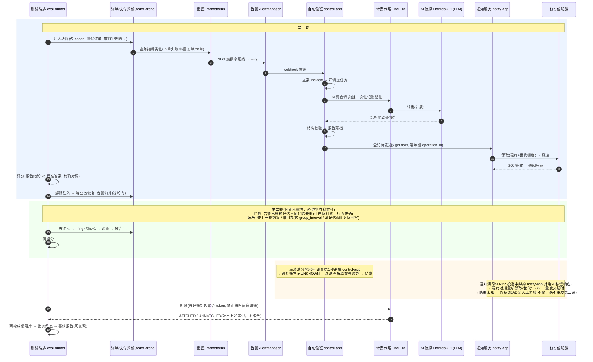

# 告警 M3 复盘：AI 自动排障是怎么长出来的（电商业务讲解版）

> 面向读者：想搞懂"M3 为什么这样设计、怎么一步步长出来"的同学。不需要先读懂代码。
> 全文只讲一件事：**电商公司的告警处理这件事，怎么从"人工值班"走向"AI 自动化 + 可验证"**。
> 配套材料：设计依据 `docs/告警AM3-技术方案.md` / `docs/告警AM3-落码技术方案.md`；
> 执行台账 `docs/告警-PROGRESS.md`；八条演习链证据 `docs/测试证据/AM3/`。

---

## 一、先说清楚：这个产品解决电商公司的什么真实问题

### 1.1 顾客视角的一条下单链路

顾客在网店买东西，走的是这条链：

```
加购物车 → 结账 checkout → 支付 payment → 订单创建 → 发货
```

这条链上任何一环坏掉，顾客立刻感知：下单失败、被重复扣款、订单卡在"已创建"不动。
后面的一切——告警、值班、排查——都由这条链的真实故障引起。

### 1.2 值班工程师现在是怎么处理告警的（真实流程）

半夜两点，值班同学被告警叫醒："checkout 可用性烧损率超预算"。接下来是标准动作：

1. 打开监控看哪个指标坏了（下单失败率？延迟？）；
2. 翻日志、查依赖，分辨是支付挂了、还是数据库慢、还是发布引入的问题；
3. 定位根因后，在值班群同步一句"是支付服务 50% 收费失败，已定位"；
4. 处理、恢复、写值班记录。

这套动作的痛点，做过值班的都懂：

- **慢**：一次完整排查 30 分钟到 1 小时；
- **烦**：告警系统防打扰没调好时，同一次故障能反复轰炸一晚上；
- **险**：多个告警同时响时，要先分辨哪个是真话；
- **贵**：大模型调用是花钱的，但没人说得清"这次排障到底花了多少 LLM 费用"。

### 1.3 产品主张：把"发现→立案→查根因→出报告→通知"这段自动化

告警一响，系统自动立案、AI 侦探（HolmesGPT + 大模型）去查监控和日志、产出**结构化报告**
（根因/症状/证据/建议），自动发到值班群。值班同学醒来只做一件事：看报告、决定动不动手。

### 1.4 但开发不敢直接上线——所以先要有"验证体系"

AI 查错了会误导值班，比不查还糟。上线前必须回答：**它到底行不行？**

拿生产事故练手是不可能的。所以做法是：**开发/测试同学在测试环境里按剧本搞故障注入**——
毒是我们自己下的，所以**标准答案是已知的**；让"告警→AI 调查→报告→通知"整条链在
测试环境真实跑一遍；用程序对照标准答案打分；顺便把 LLM 花费记清楚。跑多了，
才有底气说"这个 AI 可以值班"。

- **M2（订单靶场）= 把测试环境造出来**：真实运行的小型电商系统（购物车/结账/支付/订单）
  + 故障注入开关 + 每个故障的标准答案。关键约束：**只对测试订单下手，顾客流量零污染**
  （测试订单全部带 `chaos-` 前缀，真实订单带 `live-` 前缀，两套流量物理隔离）。
- **M3 = 把验证体系造出来**：评分闭环（判 AI 准不准）+ 通知出口（报告怎么可靠地送到
  值班群）+ 成本对账（每场验证花了多少 LLM 钱）。

本文讲的就是 M3 这套验证体系怎么长出来的：**每加一个最小方案，就做一次真实演习，
演习炸出新问题，再为它加下一个最小方案——循环七轮。**

---

## 二、五份测试剧本（全部来自电商真实事故模式）

| 剧本 | 故障内容 | 业务上的真实原型 | 报警表现 | 标准答案（根因） |
|---|---|---|---|---|
| S1 | 支付服务 50% 概率收费失败 | 支付通道劣化/风控误杀 | checkout 烧损告警（快烧+慢烧双档） | payment / 业务错误率 |
| S2 | 支付服务整个够不着 | 依赖不可达、发布挂了 | 同上 | payment / 依赖不可达 |
| S3 | 幂等失效：同一"下单意图"创建出两个订单 | 重复扣款、重复发货——电商最经典的资损隐患 | 重复订单数指标 > 0 | order-arena / 幂等绕过 |
| S4 | 状态回跳：绕过状态机直接把"已支付"改回"已创建" | 线上事故里"脚本直改数据库"的翻版 | 非法状态迁移数 > 0 | order-arena / 非法状态迁移 |
| S5 | 支付超时、结果未知，订单卡在"已创建" | 调用支付超时：钱扣没扣不知道——此时唯一正确做法是**对账，不瞎猜** | 卡单数指标 > 0 | order-arena / 超时结果未知 |

每个剧本考两遍（验证同一道题判两次，结果稳不稳）。

**特别记住 S5**：支付超时后钱到底扣没扣，系统不知道——电商业务对这种"结果未知"的
标准答案是**进对账流程，人工参与，绝不猜**。这条业务法则后面会决定通知系统的设计（循环五）。

---

## 三、我当时怎么思考：四条底层方法

**1. 最懒可行。**每个问题只造"刚好够用的最小方案"，不预判未来需求，不造框架。
方案是否够用，让演习说话。

**2. 用真实演习代替纸面推演。**每个方案落地后立刻做破坏演习：真的杀进程、真的停
计费代理、真的把通知对端改成 20 秒才响应。八条演习链（M3-01~08）就是八个"搞破坏剧本"。
**绝大多数问题不是我想到的，是演习炸出来的。**

**3. 诚实优先。**验证系统的命根子是可信：可以给低分，但绝不能编数据。不确定就写
"不确定"，交人工复核。

**4. 测试必须遵守生产的规矩。**验证环境模拟的不是"理想值班"，而是**真实值班的一切
约束**——告警防打扰机制、进程会崩、调用要花钱、数据有权限边界。因为产品的价值只在
真实值班场景里成立，验证体系放水就等于没验证。

---

## 四、七次循环：问题 → 最小解 → 新问题 → ……

### 循环一：怎么给 AI 的调查报告打分（测试同学的"断言"怎么写）

- **问题**：要量化"AI 查得准不准"。第一个念头是再请一个大模型当裁判——不行：
  裁判有随机性（今天判对明天判错）、有作弊空间（报告写得花哨就给高分）、还贵。
  **测试断言的第一原则是确定性**：同一个输入，跑一万次判定结果必须相同。
- **最小解**：**标准答案提前登记成规范枚举**（组件/故障类型/原因码三元组，比如
  `payment / 业务错误率 / 收费失败`），评分程序拿 AI 报告里的结论和标准答案做**精确对照**。
  三个指标——根因覆盖率、条件准确率、端到端命中率——全是纯函数算出来的。
- **新问题**：AI 有时回答"查不出来"。这算答错吗？
- **再解**：单设一类判定 UNRESOLVED，且**不进"条件准确率"的分母**。业务含义：
  **"没查出来"和"查错了"是两种不同性质的失败**，混在一起统计会把指标搅浑——
  就像考卷上"交白卷"和"答非所问"不能同罪。
- **又冒出新问题**：AI 有重试机制，可能留下好几份报告，阅卷挑哪份？
- **再解**：**只挑最晚的那份合格报告，绝不挑最好的**。如果允许挑最优，验证系统就在
  替 AI 掩盖"它不稳定"的事实——等于测试自己造假。

### 循环二：报告格式乱，值班同学没法用（测试/值班的共同痛点）

- **问题**：大模型会抽风。它可能不交结构化报告，而交一篇散文。值班同学要的是能快速
  读完、能行动的结论（根因/症状/证据各就各位），散文没法在值班场景里用。
- **最小解**：**报告结构校验**——六段式（根因/症状/证据/结论等）缺一段就拒收
  （REJECTED_MALFORMED），拒收也要如实落档。
- **演习（M3-03）**：把大模型真的换成一个只会输出散文的替身。结果全链优雅退化：
  报告全部被拒收 → 没有报告可发（通知环节自动安静）→ 每个案例判定
  STRUCTURE_REJECTED、计入分母 → **流程不崩、不静默通过、不假装没发生**。
- **一次重要校准（M3-02 批量演习）**：真模型上场后出现"格式合格但根因答错"的报告
  （判 DECIDABLE、命中率 false）。这逼着我们分清两个轴：**M3 验证的是"判卷系统灵不灵"
  （判得出来），不是"AI 聪不聪明"（答得对不对）**。这两个轴搅在一起，验证体系就永远
  说不清自己测的是什么。模型答错是真发现，如实记成绩，门禁该过还是过。

### 循环三：告警防打扰机制 vs 测试要跑两遍（值班的保命规矩 vs 测试的需求）

- **问题**：每个剧本要考两遍，但第二遍死活开不出新的调查。为什么？
- **排查结果**：撞上了两道**生产环境的保命规矩**——而且都是正确的产品行为：
  1. 告警系统（Alertmanager）有"已通知"记忆（nflog）：同一故障 4 小时内不再重复通知，
     **重启也不忘**（记忆落在磁盘上）；
  2. 自动值班系统（control-app）有"同代际不重开调查"的去重。
  
  在生产里，没有这两条，值班群会被同一个故障刷屏一整晚。**是测试"同故障连考两遍"
  的需求和生产收敛语义打架，不是产品有 bug。**
- **最小解（破解三件套，考完全部还原）**：
  1. 两轮之间**等上一轮的事件正式了结**（恢复通知送达、告警归并）再开第二轮——
     相当于等上一单销案再立新案；
  2. 考试期间把"同组告警的再次通报间隔"（group_interval）临时从 5 分钟放宽到 10 秒，
     让恢复通知能在两轮之间送达（考完改回 5 分钟、重启、并核实运行时真的生效）；
  3. 起考前清一次告警系统的"已通知"记忆。
- **新问题**：这个记忆重启也删不掉——因为进程停机时会把内存里的记忆写回磁盘。
- **再解**：趁它活着删掉磁盘文件，再强制杀掉（kill -9）让它来不及写回，然后拉起。
  **要抹掉一个服务的记忆，必须先让它失去"写回"的能力。**
- **原则**：绝不为了测试方便削弱生产机制。**测试适应生产，而不是生产迁就测试。**

### 循环四：值班自动化自己挂了怎么办（M3-04，高可用是值班的底线）

- **问题**：自动值班系统（control-app）在调查进行到第 1 秒时被杀（进程崩溃演习），
  查到一半的案子怎么办？
- **已在位的最小原子**：每个调查任务有"领取租约 + 执行账本"。进程死了租约会过期，
  悬挂的"处理中"记录会被对账成 UNKNOWN（诚实：这个人动过，但死活不明）。
- **演习实测**：新进程起来后，告警重新投递，**同一个案子按原案号被接管续办**——
  调查被重新驱动直到结案、报告唯一、通知照发。**业务规则：恢复 = 续办，不是重新立案。**
  重复立案等于把同一件事当两件事处理，是事故。
- **演习炸出新问题 ①**：`docker kill` 之后容器**不会自动拉起**（重启策略不认外部击杀），
  整条链躺尸 33 分钟。→ 运维语义必须明确：**击毙后要显式拉起**，不能指望重启策略兜底。
- **新问题 ②**：崩溃后重收敛的案子属于"上一个调度批次"；新批次的调度器不认领别的批次
  的案子 → 对外如实报"没找到调查记录"（run_not_found）。**宁可如实缺席，不可错认。**

### 循环五：通知怎么发才既不丢也不烦（M3-05，值班同学半夜三点的常识）

通知服务（notify-app）要解决一个值班场景的经典矛盾：**报告漏发会误事，重复轰炸会把人
训练得忽略告警**——后者其实更危险。设计是一层一层加的最小原子：

- **发件登记（事务性 outbox）**：要发的通知先和业务结果一起落库登记，绝不让"该发的通知"
  只存在于进程内存里（进程一崩就丢）；
- **租约领取**：通知服务一次领一小批、限时处理，超时未完成视为失联，别人可以接手；
- **世代栅栏（lease_epoch）**：每次领取凭证带世代号，拿着过期凭证来销账会被拒绝——
  **防止旧进程和新进程把同一封通知发两遍**；
- **幂等键（operation_id）**：每封通知带唯一操作号——这就是订单业务"同一意图只能创建
  一个订单"的幂等法则在通知域的翻版（S3 考的就是这条法则被绕过时的后果：重复订单）；
- **回执分级**：2xx 签收→SENT；对端说"太忙稍后再来"（429 限流）→ 挂起等待且**不耗重试
  预算**（限流不是失败）；对端故障（5xx）→ 按预算重试，耗尽→DEAD；明确拒收（4xx）→
  直接 DEAD。

然后演习（M3-05）：**在通知投递进行到第 1 秒时杀掉通知服务**（通知对端故意设成 20 秒
才响应，制造一个漫长的"发送中"窗口）。

**现实走向和预期不同**：服务重启后，租约到期、通知被重新领取（世代号 1→2 是铁证）、
重新投递——但再次撞上 20 秒慢对端，而 HTTP 客户端只肯等 10 秒，超时。**此刻没有人知道：
第一遍发送最终会不会到达对端？**系统的裁决是：**冻结为 DEAD，错误原因如实写
"结果未知"，绝不自动重发第二遍**，交人工复核；同时整场验证批次不受影响照常完成。

`attempt_count=0`（重试计数为零）一度像悬案，查清后反而是设计自洽：这个计数只统计
"消耗重试预算的次数"，DEAD 是终局不耗预算；两次真实的网络投递由"世代号变化 + 对端
请求日志"双重证明。

- **为什么"不赌"是对的？** 这是值班场景的常识：深夜三点，宁可少收一条确认，
  不能被两条一模一样的告警轰炸——重复通知会训练人忽略告警，比丢一条更毒。
- **这个裁决不是发明的，是电商业务自己的法则**：S5 场景里，支付超时、结果未知，
  业务的标准做法就是"进对账流程、人工参与、绝不瞎猜成功或失败"。**同一条法则，
  从支付域搬到了通知域。**

### 循环六：LLM 的钱怎么算（M3-06，成本是公司真金白银）

- **最小解**：AI 的每一次大模型调用都经过计费代理（LiteLLM），每场验证发一把
  **一次性记账钥匙**（per-run 虚拟 key），考完按钥匙聚合账单。对账只比 token 总量，
  **结构上禁止按时间窗归账**——"这个时段的消费大概都是我们的"是成本舞弊的起点，
  直接不给这条路。
- **演习**：真的把计费代理停掉。结果：调查全部失败（AI 出不了报告）→ 两轮都如实判
  "无合格报告" → 通知环节自动安静 → **对账单如实记 UNMATCHED（对不上），绝不伪造
  "已核对"** → 验证批次照常正常结束。
- **业务裁决**：计费代理停机是基础设施事故，验证流程本身没毛病；**账可以对不上，
  但账面不许撒谎。**

### 循环七：测试答案不能让被测系统看见（M3-07，权限是验证公信力的物理基础）

- **最小解**：数据库账号分家、按列授权。通知服务的账号看得见"要发的信封"（收件人、
  模板），**看不见报告正文、看不见调查记录、更看不见标准答案**；评分程序读标准答案必须
  过一道专用门禁，门禁失效时默认拒绝（fail-closed）；所有密钥只走环境变量，零落盘。
- **演习**：九条越权断言逐条验证必拒。
- **业务含义**：让考生看得见答案的考试，制度上就已经输了——**公信力靠物理隔离，
  不靠自觉。**

---

## 五、数据流：一次告警从发生到评分的完整旅程

```
 顾客下单（真实链路：购物车→结账→支付→订单）
     │
     │  ←← 测试编排 eval-runner：按剧本注入故障（只对 chaos- 测试订单生效）
     ▼
 订单/支付系统业务受损（下单失败率飙升 / 重复订单 / 卡单……）
     │  都是真实业务指标，不是假数据
     ▼
 监控 Prometheus：SLO 烧损率超线 → 告警 firing
     │
     ▼
 告警 Alertmanager：分组、去重、防重复通知 → webhook 转给自动值班
     │
     ▼
 自动值班 control-app：立案 incident → 开调查任务 run/task
     │                │
     │ 请 AI 侦探      │ 报告定稿后登记待发通知（outbox，带幂等键）
     ▼                ▼
 计费代理 LiteLLM → HolmesGPT+大模型      通知服务 notify-app
 （按 run 记账）        │                      │
                        ▼                     ▼
                 结构校验 → 报告落档      钉钉值班群（签收/退避/冻结）
                        │
     ┌──────────────────┘
     ▼
 测试编排 eval-runner：取报告 ↔ 对照标准答案（精确匹配）→ 判定与三指标
     │
     ├──▶ 成绩落库（每个案例一行，两轮各一行）
     ├──▶ 成本对账（计费代理账单 ↔ 本次验证聚合，对不上记 UNMATCHED）
     └──▶ 解除故障注入（毒药必须自己收）→ 下一轮 / 下一剧本 / 基线报告
```

叙述一遍（值班同学视角）：故障被测试同学注入后，**顾客侧表现为真实的业务异常**
（比如下单失败率飙升）；监控的烧损率规则先响，告警经去重分组转给自动值班系统；
自动值班立案并派 AI 侦探调查，侦探的每次大模型调用都经计费代理记账；调查报告经
结构校验后落档，同时登记到待发通知；通知服务把报告投到钉钉值班群。测试编排器在两头
工作：开头负责注入故障，结尾负责取报告、对照标准答案打分、和计费代理对账、关闭故障。
**测试编排从不插手中间的调查业务——它只出题和判卷，不替 AI 答题。**

---

## 六、整体时序图



读图要点：

- **主干是真实的业务故障线**（注入→业务受损→告警→立案→AI 调查→报告→通知值班群），
  测试编排只在两头出题和判卷；
- **两轮之间有一道"过轮门"**：上一轮故障解除、告警归并了，才准开下一轮——这是对生产
  防打扰机制的尊重（循环三）；
- **两个橙色框是崩溃/通知演习**：分别打死自动值班系统和通知服务，验证恢复与投递语义；
- **对账在最后**，且只能靠记账钥匙认账，不许按时间窗猜。

---

## 七、收官沉淀

### 七.1 四条"订单业务的法则 → M3 的设计"同构表

M2 的订单业务域里本来就有几条被真金白银验证过的法则；M3 每次遇到设计抉择，
最终都是把同一条法则搬到了新域：

| 订单业务本来的法则 | M3 里的对应设计 | 对应循环 |
|---|---|---|
| 同一下单意图只能创建一个订单（幂等，S3 考它被绕过的后果） | 通知的 operation_id 幂等键 | 循环五 |
| 支付结果未知 → 对账流程，不猜成功不猜失败（S5 本身） | 投递结果未知 → 冻结 DEAD 人工复核 | 循环五 |
| 不用状态机自己验证状态机，用台账事实验证（S4 的探测设计） | 不用大模型阅卷，用标准答案精确对照 | 循环一 |
| 资源动过必须留台账、可对冲（补偿机制） | 调用账本 + 对不上如实记 UNMATCHED | 循环六 |

### 七.2 三条原则（如果只记三句话）

1. **确定性是验证系统的命**：判分不许玄学、选报告不许挑优、失败不许静默消失。
2. **诚实比好看值钱**：缺席就写缺席、对不上就记对不上、结果未知就冻结局——
   验证系统公信力一次造假就归零。
3. **测试适应生产**：生产的防打扰、恢复、计费、权限机制一条都不削弱；
   验证环境模拟的是真实值班的一切约束，放水就等于没验证。

### 七.3 八条演习链（每条 = 一个"搞破坏"剧本）

| 链 | 破坏动作 | 验证的业务命题 | 结果 |
|---|---|---|---|
| M3-01 黄金链 | 不破坏，全链正常跑 | 端到端打通 | 全绿 |
| M3-02 批量链 | 真模型上场（5 剧本×2 轮） | "判得出"≠"答得对"，两个轴分开记 | 17/17 |
| M3-03 结构失败链 | 把模型换成只会输出散文的替身 | 对最差员工安全：拒收不崩溃 | 13/13 |
| M3-04 崩溃恢复链 | 调查中途杀掉自动值班系统 | 恢复=原案号续办不重立；悬挂如实对账 | 14/14 |
| M3-05 通知链 | 投递中途杀掉通知服务 | 结果未知不赌；重复通知比丢信更毒 | 13/13 |
| M3-06 故障链 | 停掉计费代理 | 账可对不上，账面不许撒谎 | 16/16 |
| M3-07 权限链 | 被测系统试图越权读答案 | 公信力靠物理隔离不靠自觉 | 九断言全过 |
| M3-08 共存链 | 测试开在营业中的真实系统里 | 测试订单与顾客订单互不惊扰 | 零串扰零OOM |

最终全门 `mvn verify`：6 模块 **539 个测试全绿**；验证结束后整栈内存合账 3688 MiB、
零 OOM、零跨流量串扰、故障指标归零、告警临时配置全部还原。

---

## 八、结语

回头看，M3 的七轮循环里没有一次是"先设计一个完美方案再实现"——全是**最小方案 +
真实破坏演习 + 新问题 + 再加一个最小方案**。而每一次走到设计岔路口，帮我们做决定的
不是技术偏好，而是三件更朴素的东西：电商业务里早已验证的法则（幂等、对账、结果未知
不瞎猜）、验证体系的公信力底线（确定、诚实），以及值班工程师半夜三点不想被重复告警
吵醒的常识。
