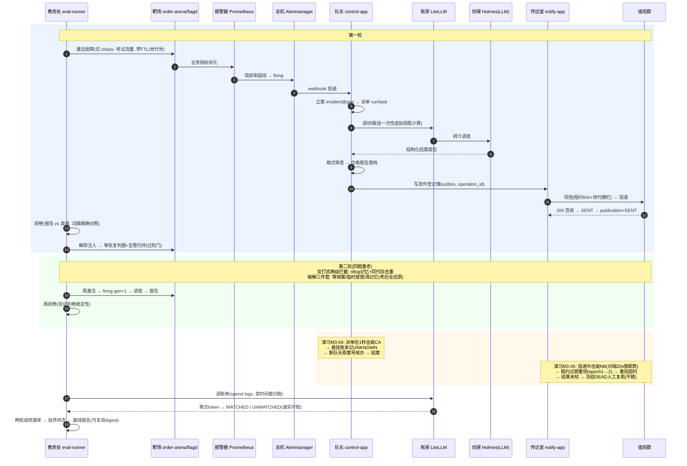

# 告警 M3 复盘：从靶场到考场——最小原子演化记（业务讲解版）

> 面向读者：想搞懂"M3 是怎么长出来的"的同学。不需要先读懂代码。
> 配套材料：设计依据见 `docs/告警AM3-技术方案.md` / `docs/告警AM3-落码技术方案.md`；
> 执行台账见 `docs/告警-PROGRESS.md`；八条演习链证据见 `docs/测试证据/AM3/`。

---

## 〇、一句话总览

**M2 造了一家"可以放心出事故的公司"，M3 给它配上了"考场、传达室和账房"。**
M3 不是一次设计出来的，而是按"最小原子"一层一层加上去的：每加一个最小可用的解决方案，
就做一次真实演习，演习暴露一个新问题，再为这个新问题加下一个最小原子——循环七轮，
最后长成了完整的 M3。而每一层的设计答案，几乎都能在 M2 的**业务本身**里找到原型。

---

## 一、先把生意说清楚：这家"公司"是做什么的

我们造的产品，本质是一家电商公司的**事故处理流水线**。想象一家网店的真实日常：

1. **出事**：支付服务挂了一半，顾客下单失败；
2. **发现**：监控报警（烟雾报警器响了）；
3. **调查**：值班工程师立案、查日志、找根因；
4. **通报**：把结案结论发到值班群，让大家知道怎么回事；
5. **算账**：这次调查花了多少大模型（LLM）的调用费；
6. **考核**：调查得准不准？以后每个月要评分。

这条流水线里 3~6 步的人工成本极高，所以我们的产品用 AI Agent 把它自动化：
告警进来 → 自动立案 → AI 侦探（HolmesGPT + 大模型）去"案发现场"调查 → 产出结案报告 →
自动通知值班群 → 每笔调用记账。

但这里有一个致命问题：**你怎么知道这个 AI 侦探靠不靠谱？**

总不能拿生产事故练手——等真出事再看它行不行，代价是真实的。所以：

- **M2（订单靶场）**造了一家"实验公司"：一套真实运行的小型电商系统（购物车、结账、支付……），
  外加一个订单系统 order-arena。它有三个关键能力：
  - **能投毒**：可以按剧本搞破坏——重复开单、订单状态回跳、支付超时悬挂——而且**只对
    考试专用流量下手**（`chaos-` 前缀的订单），真实顾客流量（`live-` 前缀）一根汗毛都碰不到；
  - **有标准答案**：每一个破坏剧本（S1~S5 场景）都预登记了"我们干了什么、症状是什么、
    正确根因是什么"——因为毒是我们自己下的；
  - **能复原**：每种毒都配了"解药判据"（指标归零、告警消停、补偿台账清平）。

- **M3** 则是在靶场之上新建三个角色：
  - **教务处（eval-runner + 评分器）**：负责出卷（激活故障）、收卷（取调查报告）、
    阅卷（对照标准答案打分）、记成绩；
  - **传达室（notify-app）**：把结案通报可靠地送到值班群，既不能丢信，也不能刷屏；
  - **账房（LiteLLM 代理 + 对账）**：AI 侦探每问一次大模型都经它手，按次记账、按 run 对账。

M2 回答"出事的现场可控吗"；M3 回答"**这条流水线整体可信吗**"。

### 五张考卷（场景注册表，业务语义一览）

| 卷号 | 剧本 | 业务含义 | 报警器 | 标准答案（根因） |
|---|---|---|---|---|
| S1 | paymentFailure=50% | 支付一半失败 → 结账链路错误率飙升 | checkout 烧损率告警（快烧+慢烧双档） | payment / 业务错误率 |
| S2 | paymentUnreachable | 支付整个够不着（依赖不可达） | 同上 | payment / 依赖不可达 |
| S3 | F1 幂等失效 | 同一个意图重复开单（幂等被绕过） | ArenaDuplicateOrders | order-arena / 幂等绕过 |
| S4 | F2 状态回跳 | 绕过状态机直接改状态（"SETTER 直改"事故） | ArenaIllegalTransitions | order-arena / 非法状态迁移 |
| S5 | F3 超时结果未知 | 支付超时，订单卡在"已创建"，结果成谜 | ArenaOrderStuck | order-arena / 结果未知悬挂 |

每个案例考**两遍**（两轮），验证"同一道题，判卷结果稳不稳"。

---

## 二、我当时怎么思考：四个思考底座

**1. 最懒可行（ponytail 纪律）。**
每一轮都只造"刚好能解决当前问题的最小东西"。不预判三年后的需求，不造框架。
比如评分：第一个念头是"再请一个大模型当阅卷老师"——立刻否掉，因为玄学的老师教不出
确定性的学生，而且贵。最懒方案是**拿词典对答案**：报告里的根因三元组和标准答案做精确
等值匹配。够用了，就到此为止。

**2. 让现实当反派（E2E 演习）。**
纸面推理永远"看起来没问题"。所以每个最小原子落地后，立刻做一次**真实破坏演习**：
真的把进程杀掉、真的把账房停掉、真的给邮差一个 20 秒才回话的邮筒。七条 E2E 链
（M3-01 黄金链 ~ M3-08 共存链）本质上就是七个"反派剧本"。**问题从来不是我凭空想到的，
是演习炸出来的。**

**3. 诚实优先。**
评分系统的生命线是公信力：它可以给低分，但绝不能编数据。所以 M3 里到处是
"诚实缺席"（TIMEOUT_OR_ABSENT）、"诚实冻结"（DEAD + outcome_unknown）、
"诚实坏账"（UNMATCHED）——不确定就明说不确定，交人工复核。

**4. 业务的法比代码大。**
这是最深的一条。M2 的业务域里已经沉淀了四条被验证过的商业法则，M3 遇到设计抉择时，
我反复做的事是：**回头看业务里同类问题是怎么裁决的，然后把那条法则搬过来**。
（第四节有对照表，第五节的 DEAD 悬案是最佳案例。）

---

## 三、七次循环：问题 → 最小解 → 新问题 → ……

### 循环一：阅卷老师不能是玄学的

- **问题**：AI 侦探的调查报告怎么打分？让另一个大模型当裁判？不行——裁判自己都有随机性，
  今天判对明天判错，考试就没有公信力，而且作弊空间大（报告写得花哨就能骗高分）。
- **最小解**：**词典阅卷**。标准答案提前登记成规范枚举（组件/故障类型/原因码三元组），
  阅卷器拿报告里的结论和词典做**精确等值对照**——命中就是命中，不命中就是不命中。
  三个指标（根因覆盖率、条件准确率、端到端命中率）全是纯函数算出来的。同一场考试，
  一万次阅卷结果相同。**确定性是评分系统的第一美德。**
- **冒出的新问题**：模型拒绝回答怎么办？（它有时会"这题我不会"）
- **再解**：设**拒答哨兵**——报告根因规范化后等于 "unresolved" 就判 UNRESOLVED，
  而且**不进"条件准确率"的分母**。业务含义：`没答出来`和`答错了`是两种不同的失败，
  混在一起会污染指标——就像"交白卷"不该和"答非所问"同罪。
- **又冒出新问题**：挑哪份报告阅卷？AI 侦探可能重试多次，留了好几份报告。
- **再解**：**挑最晚的合格报告，绝不挑最好的**（selection_policy = final-validated-report-v1）。
  这是防作弊条款：如果允许"挑最优"，评分系统就在替考生隐藏不稳定的事实。

### 循环二：先考"格式"，再考"答案"

- **问题**：模型抽风时会交白卷吗？不止——它可能交一篇中文散文。结构化解析直接失败。
- **最小解**：**格式审查科**（EvidencePackage 结构验证）。报告必须交齐六段式结构
  （根因/症状/证据…），缺段就 REJECTED_MALFORMED，全链如实落档。
- **演习（E2E-M3-03，坏模型链）**：真的把大模型换成一个"醉鬼替身"（badmodel stub，
  只会答散文）。结果全链优雅退化：审查科全部拒收 → 零报告 → 判定 STRUCTURE_REJECTED
  （计入分母，不消失、不崩溃、不静默通过）→ 没有报告自然也没有通知。
- **业务教训**：流水线必须对"最差的员工"安全。考官不能因为考生交白卷而晕倒。
- **伴随一次重要校准（E2E-M3-02 批量链）**：真模型上场后，S3 第一轮交了格式合格、
  结论错误的报告——判 DECIDABLE 但 hit=false。当时要顶住"这算不算失败"的诱惑：
  **M3 门禁考的是"判卷系统灵不灵"，不是"模型聪不聪明"。判得出来=门禁 PASS，
  答案错=模型质量问题，两个轴分开记。** 评测系统若把这两件事搅在一起，
  它就永远说不清自己测的是什么。

### 循环三：公司有"防打扰记忆"，考试得客随主便

- **问题**：每个场景要考两轮，但第二轮死活开不出新案子。为什么？
- **排查发现两级"防打扰机制"在起作用——而且都是产品故意的、正确的行为**：
  - 总机（Alertmanager）有 nflog 记忆："这事我 4 小时内已经喊过人了"（repeat_interval），
    **而且重启也不会忘**（记忆落在磁盘卷上）；
  - 队长（control-app）有防重复立案："同一次事件的同代际，案子不重开"。
  - 在生产里这两条是救命规矩——没有它们，值班群会被同一个故障刷屏。
    **是评测的"同指纹连考两轮"需求和产品收敛语义打架，不是产品有 bug。**
- **最小解（破解三件套，全部事后还原）**：
  1. 两轮之间**等事件正式了结**（resolve 投递、incident 落 RESOLVED）再开下一轮——
     相当于等上一单销案再立新案；
  2. 考试期间把总机的**组内再通报间隔**（group_interval，同一组告警的再次提醒节奏）
     临时从 5 分钟放宽到 10 秒，让 resolve 通报能在两轮之间抢先送达（考完立刻改回去、
     重启并核实运行时生效）；
  3. 起考前清一次总机的 nflog 记忆。
- **新问题**：nflog 重启也删不掉？——因为它优雅停机时会把内存记忆写回磁盘。
- **再解**：趁它活着删掉磁盘文件，再 `kill -9` 让它来不及写回，然后拉起。
  （这个细节值一条台账：**要抹掉一个守护进程的记忆，必须先让它失去写字的能力。**）
- **我当时的原则**：绝不为了考试削弱生产机制。评测系统是产品机制的"客人"，
  客人适应主人，而不是反过来。

### 循环四：枪毙刑警队长，看案子会不会烂尾（E2E-M3-04）

- **问题**：调查到一半队长被枪毙（control-app 进程被杀），案子怎么办？
- **最小解（早已在位）**：案卷（task）有"领取租约 + 世袭账本"——人死了租约会过期，
  悬挂的"已受理"记录会被对账成 UNKNOWN（诚实：这人确实动过，但死活不明）。
- **演习实测**：新队长到岗后，**同一个案子被原案号接管**——靠的是告警重新投递时
  按代际复用已有 run，侦探的活被重新驱动到结案（SUCCEEDED）、报告唯一、通报照发。
  **业务规则：恢复 = 续办，不是重立。**案号唯一是公信力，重复立案是事故。
- **演习炸出的新问题 ①**：`docker kill` 之后容器**不会自动拉起**（重启策略不认外部
  击杀），全链躺尸 33 分钟。→ 编排语义必须建模成"击毙后**显式**扶起来"。
- **新问题 ②**：崩溃后重收敛的案子属于"上一任班次"；新班次的调度员不认领别人的案子
  → 对外诚实缺席（run_not_found）。宁可缺席，不可错认——**认错案子的危害大于少判一案**。

### 循环五：枪毙邮差，看信会不会重复寄（E2E-M3-05，最精彩的一案）

传达室（notify-app）的设计，像一家老式但规矩森严的邮局：

- **发件登记簿**（notify_outbox）：要先寄的信先登记，登记和业务落账在同一个本子上
  （事务性 outbox）——绝不让"该寄的信"只存在于某人的脑子里；
- **挂号信领取**（claim + 租约 60s）：邮差取信要签字画押，一次只领一批；
- **世代栅栏**（lease_epoch）：领取凭证有世代号，旧邮差拿着过期凭证来销账，柜台拒收——
  **防止两个邮差把同一封信投两遍**；
- **寄信回执语义**：2xx 签收→SENT；对方说"太忙稍后再来"（429）→ 挂起退避且**不耗预算**
  （限流不是失败，是礼貌等待）；占线（5xx）→ 按预算重试，耗尽→DEAD；
  明确拒收（4xx）→ 直接 DEAD；
- **防重放**：每封信带 operation_id（幂等键）。

然后演习：**在邮差投递进行到第 1 秒时把他枪毙**（通知对端故意设成 20 秒才回话）。
预期剧本："60 秒后租约过期 → 新邮差重领 → 重投 → 签收 SENT"（至少一次送达）。

**现实剧本完全不同**：新邮差确实重领重投了（世代号 1→2 是铁证），但信又撞上那个
20 秒慢邮筒，而邮差的表只肯等 10 秒（HTTP 超时）——**此刻没人知道第一封信最终会不会到**。
系统没有赌，而是按冻结条款落账：**DEAD + 诚实话术 outcome_unknown，绝不自动重发第二封**，
汇总回执聚合为 DEAD，而整场考试（批件）不受通报环节影响照常 SUCCEEDED。

`attempt_count=0` 一度像悬案（"重试了怎么计数是 0？"），查清后反倒是设计自洽：
**attempt 只计"消耗重试预算的次数"**，DEAD 是终局不耗预算；两次真实的投递由
"登记簿世代号 + 对端收发日志"双证。

- **为什么"不赌"是业务正确？** 深夜三点，值班工程师宁愿收不到第二遍确认，
  也不能被两条一模一样的告警轰炸——重复通知会训练人忽略告警，那比丢一条更危险。
  所以条款是：**结果未知 → 冻结 → 人工复核决定补不补发。**
- **这个裁决哪来的？不是发明的，是 M2 业务里现成的**：S5/F3 场景的商业法则就是
  "支付超时、结果未知 → 不许猜成功也不许猜失败 → 进入对账状态机（UNKNOWN→RECONCILING→
  收敛），人工参与"。**同一条法则，从订单域搬到了通知域。**
- **顺手一个对照**：信上的 operation_id 幂等键，和 S3/F1 考的"同一意图不能重复开单"
  是同一条幂等法则——F1 在靶场里演的是"法则被绕过会怎样"（重复订单），
  传达室用它保证"法则被遵守"（不重复通知）。

### 循环六：账房罢工，账本不能编数（E2E-M3-06）

- **最小解**：AI 侦探的每一次大模型调用都经账房（LiteLLM 代理），每场考试发一把
  **一次性记账钥匙**（per-run 虚拟 key），考完按钥匙聚合账单（只比 token 总量，
  **禁止按时间窗归账**——"这个时段的花费大概都是我的"是财务舞弊的起点，结构上就不给这条路）。
- **演习**：真的把账房停了。结果：侦探全数罢工（调查失败）→ 两轮都诚实缺席
  （no_validated_report，但**案号存在**，区别于"根本没立案"）→ 零报告零通知 →
  **对账单如实落 UNMATCHED（basis=NONE、best_effort=true），绝不伪造 MATCHED** →
  批件照常 SUCCEEDED。
- **业务裁决**：账房停机是基础设施事故，考试流程本身没毛病；账可以对不上，
  但账面不许撒谎。**生意可以停摆一天，账本造假毁掉的是永久的信任。**
  （另一条链 E2E-M3-03 考的是"侦探本人是醉鬼"——三条链合起来把"每个角色坏掉"都覆盖了。）

### 循环七：考试的答案不能让考生看见（E2E-M3-07）

- **最小解**：数据库角色分家——传达室（notify_app）的授权**列级白名单**：
  它看得见"要寄的信封"（收件人、渲染模板），**看不见报告正文、看不见调查记录、
  更看不见标准答案（ground truth）**；评分侧读标准答案必须过一道门禁函数，
  冻结之后 fail-closed（门坏了=看不见，而不是门坏了=随便看）；所有密钥只走环境变量，
  零落盘。
- **演习**：九条权限断言逐条验证越权必拒。
- **业务含义**：评分的公信力来自**物理隔离**而不是"自觉"。让考生看得见答案的考试，
  制度上就已经输了。

---

## 四、数据流：一张答卷的完整旅程

```
                         ┌──────────────────────────────────────────────────┐
                         │                考试指挥部 eval-runner             │
                         │   （出卷→守时→收卷→阅卷→记成绩→对账→出基线报告）  │
                         └────────┬────────────────────────▲────────────────┘
                                  │ ①按考纲激活故障          │ ⑫取报告阅卷（词典对照真值）
                                  ▼                         │
   ┌──────────────────────────────┐                         │
   │ 靶场 order-arena / flagd     │ ②业务受损（只毒 chaos-） │
   │ 考试流量 chaos- / 顾客流量 live-│───▶ 指标劣化            │
   └──────────────────────────────┘         │               │
                                            ▼               │
                              ┌───────────────────────┐     │
                              │ 烟雾报警器 Prometheus   │ ─③─┘ 烧损率超线 → firing
                              └───────────┬───────────┘
                                          ▼
                              ┌───────────────────────┐
                              │ 总机 Alertmanager      │ ─④ webhook 转进来
                              └───────────┬───────────┘
                                          ▼
   ┌─────────────────────────────────────────────────────────────┐
   │ 刑警队长 control-app：⑤立案 incident@代际 → ⑥派单 rca_run/task │
   └───────┬──────────────────────────────────┬──────────────────┘
           │ ⑥请侦探（经账房计费）              │ ⑨写发件登记簿 notify_outbox
           ▼                                  ▼                    
   ┌───────────────┐   ⑦调查   ┌──────────────────┐   ⑩取信→投递   
   │ 账房 LiteLLM   │◀───────▶ │ 侦探 Holmes+LLM   │        ┌──────────────┐
   └───────┬───────┘          └────────┬─────────┘        ▼              │
           │ ⑬账单 spend logs          │ ⑧结案报告        ┌──────────────┐  │
           │                          ▼                  │ 传达室        │──┘
           │                 ┌──────────────────┐        │ notify-app    │
           │                 │ 格式审查科        │        └──────┬───────┘
           │                 │ （六段式验收）    │               ▼ ⑪签收/退避/冻结
           ▼                 └────────┬─────────┘        ┌──────────────┐
   ┌───────────────┐                  │                  │ 值班群(钉钉)  │
   │ 对账 UsageLedger│◀────────────────┘                  └──────────────┘
   │ MATCHED/UNMATCHED│   ⑭汇总：成绩单 eval_case_result + 基线报告
   └─────────────────┘
```

分步业务叙述（对应图中编号）：

1. **出卷**：指挥部按注册表激活故障——投毒指令带着 TTL、世代号和管理令牌，
   且只命中 `chaos-` 考试流量（**顾客无感**，INV-AM2-1）。
2. **业务生症状**：重复单/状态回跳/卡单/支付失败……都是**真实业务指标**的劣化，
   不是假数据。
3. **报警器响**：烧损率（错误预算消耗速度）超线 → firing。快烧（page）和慢烧（ticket）
   双档，像烟雾报警器的"明火"和"阴燃"两个灵敏度。
4. **总机转接**：告警分组去重后投给队长（同组 5 分钟内不重复摇人——生产防打扰）。
5. **立案派单**：incident 按"指纹+代际"立卷；每代际一个调查 run。
6. **请侦探**：调查请求经账房代理出网——**侦探没有任何绕开账房的直连线路**
   （断掉这条后门本身就是 M3-06 的一道考题）。
7. **调查**：AI 侦探在现场（监控/日志只读工具）走一圈，产出结构化结论。
8. **格式审查**：六段式不全 → REJECTED_MALFORMED（散文卷直接打回）。
9. **写发件登记簿**：报告定稿的同账落"挂号信"（outbox），带幂等键 operation_id。
10. **取信投递**：邮差按租约领信、按世代栅栏销账、按预算重试。
11. **回执**：2xx=SENT；429=礼貌挂起；结果未知=冻结 DEAD 交人工（循环五的裁决）。
12. **阅卷**：评分器把报告结论与预登记真值做词典精确对照 → DECIDABLE / UNRESOLVED /
    STRUCTURE_REJECTED / TIMEOUT_OR_ABSENT 四态，三指标纯函数计算。
13. **对账**：账房账单与本次考试聚合比对，只比 token 总量、禁时间窗；对不上落 UNMATCHED。
14. **收摊**：两轮成绩落库，finally 必解除注入（**毒药必须自己收**），出基线报告。

---

## 五、整体时序图



读图要点：

- **主干是一条业务事故线**（激活→劣化→firing→立案→调查→报告→通报），评测线只是
  在两头"出卷"和"阅卷"，从不插手中间的调查业务——**考官不替考生答题**。
- **两轮之间隔着一道"过轮门"**：上一轮毒解了、告警归并了，才准开下一轮。
  这是对生产收敛语义的尊重（循环三）。
- **两个橙色演习框**是"枪击试验"：M3-04 打队长验恢复，M3-05 打邮差验投递语义。
- **账单在最后调**，且结构上禁止按时间窗归账——对账只能靠钥匙和元数据认账。

---

## 六、收官沉淀

### 六条业务同构（M2 的法则 → M3 的法律）

| M2 业务域里的法则（靶场教的） | M3 里的对应设计 | 对应循环 |
|---|---|---|
| F1：同一意图只能开一单（幂等） | 通知的 operation_id 幂等键 | 循环五 |
| F3：支付结果未知 → 不许猜，进对账状态机 | 投递结果未知 → 冻结 DEAD 人工复核 | 循环五 |
| F2：不用状态机验证状态机（用台账事实验证） | 不用大模型阅卷（用词典真值对照） | 循环一 |
| 补偿台账：资源动过必须留痕可对冲 | 调用账本 + 诚实 UNMATCHED + 事件/账本对账 | 循环六 |

### 三条原则（如果只记三句话）

1. **确定性是评分系统的命**：阅卷不许玄学，选择不许挑优，判定不许静默消失。
2. **诚实比好看值钱**：缺席就写缺席，坏账就记坏账，未知就冻结局——评测系统的公信力
   一次造假就归零。
3. **业务的法比代码大**：幂等、对账、"未知不赌"这些法则是业务域用真金白银验证过的，
   新模块遇到同类抉择，先回业务里找答案，再动手发明。

### 八条演习链（每条 = 一个反派剧本）

| 链 | 反派剧本 | 验证的业务命题 | 结果 |
|---|---|---|---|
| M3-01 黄金链 | 一切正常 | 全链路打通 | 全绿 |
| M3-02 批量链 | 真模型上场（5 场景×2 轮） | 门禁判得出来≠模型答得对，两轴分开 | 17/17 |
| M3-03 结构失败链 | 换上"醉鬼侦探"（只答散文） | 对最差员工安全：拒收不崩溃 | 13/13 |
| M3-04 崩溃恢复链 | 调查中途枪毙队长 | 恢复=续办不重立；诚实对账 | 14/14 |
| M3-05 通知链 | 投递中途枪毙邮差 | 结果未知不赌，重复通知比丢信更毒 | 13/13 |
| M3-06 故障链 | 账房罢工 | 账可对不上，账面不许撒谎 | 16/16 |
| M3-07 权限链 | 考生试图偷看答案 | 物理隔离而非自觉 | 九断言全过 |
| M3-08 共存链 | 考场开在营业中的商场里 | 考试流量与顾客流量互不惊扰 | 零串扰零OOM |

最终全门 `mvn verify`：6 模块 **539 个测试全绿**；批后终态 RSS 合账 3688 MiB、
故障 gauge 归零、AM 临时配置全部还原。

---

## 七、结语

回头看，M3 的七轮循环里没有一次是"先设计一个完美方案再实现"——全是
**"最小原子 + 真实演习 + 新问题 + 再加一个最小原子"**。而每一次走到设计岔路口，
帮我做决定的都不是技术品味，而是三件更朴素的东西：

靶场业务的既有法则（幂等/对账/未知不赌）、
评分系统的公信力底线（确定/诚实）、
以及值班工程师那个深夜三点不想被重复告警吵醒的常识。
