# 告警系统：从一条业务告警，到一次可靠的根因调查

> 面向第一次系统学习后端与 Agent 的读者。先理解告警业务，再理解技术名词。最终核对基线：2026-09-09，本地 Git HEAD `b3b0bd4`（M6-07）；写作中同步核对了工作区的新提交；本文没有读取用户禁止查看的三个文档。
>
> 本文按问题之间的依赖关系重建搭建过程，不声称这就是项目每一次提交的历史顺序。正文中的“当前实现”以执行代码和装配代码为依据；“设计意图”与“建议补齐”均单独说明。截图仅用于参考“业务定义—核心链路—图下解释—实现细节”的写法，截图中的交易业务不移植到告警案例中。

## 阅读路线

部署现状补充（2026-09-09，来自用户最新实测）：全部运行面、31 个容器均在 195；规划的 2C4G 评测机从未启用，Gatus 尚未实际部署。独立探针、评测隔离及 Tool/MCP/RAG/Skill 自进化的调研、取舍与新增 14 项优化，见 [部署隔离与能力演进方案](告警系统-部署隔离与Tool-MCP-RAG-Skill演进方案.md)。本文中的双机拓扑应理解为设计目标，不能理解为当前运行事实。

1. 整体架构：我们究竟在处理什么。
2. 入口层：告警如何产生，怎样可靠接收、去重、合并。
3. 工具层：调查如何获得真实证据。
4. Agent Loop：如何根据证据推进，什么时候必须停。
5. Harness：谁掌握执行权、预算和提交权。
6. 状态机：状态如何从业务矛盾中推导出来。
7. 上下文与持久化：重启后留下什么，重放依赖什么。
8. 多 Agent：如何分工，如何处理证据冲突。
9. 故障转移：区分任务接管、模型切换和引擎回退。
10. 报告、通知、评测、灰度发布、监控与运维。
11. 百万告警容量推演、当前缺口、下一步建设顺序与基础知识清单。

## 一、整体架构：先定义“告警业务”

### 1. 最小的原子问题：业务已经出错，人怎样知道

这个项目的真实业务入口之一，是 checkout 服务的可用性告警。checkout 的请求出现错误，遥测系统记录请求总数与错误数，Prometheus 按规则判断是否需要报警，Alertmanager 把告警送进 `control-app`。

这里首先要分清两件事：**checkout 出错是我们观察到的症状；造成 checkout 出错的原因，还需要调查。** 如果支付依赖异常使 checkout 失败，那么告警落在 checkout 上，并不能直接证明 checkout 自身的代码有问题。是否属于这种情况，必须查询同一时间范围的指标、日志和变更证据，不能从告警标题直接猜出根因。

所以，系统要回答的第一个问题是“哪里出现了值得关注的异常”。第二个问题是“这次异常可能为什么发生，证据在哪里”。第三个问题是“调查结果是否可信，能否安全交给值班人员”。这三个问题分别对应检测、调查、交付，任何一层都不能替另外两层作保证。

RCA 是 Root Cause Analysis，即根因分析。本文把一次 RCA 理解为：针对一组相关告警，收集证据，形成可核查的判断；证据不足时，明确保留未知。最新生产装配仅接 Native；Holmes 已退场，历史类型与审计仍保留。下文明确标出的 Holmes 段用于解释此前为何引入外部 Agent Loop，以及后续为什么迁出。当前只读调查路径不会因为报告里写了“建议重启”，就自动重启业务服务。

代码依据：[checkout 告警规则][S01]、[Alertmanager 路由][S02]。

### 2. 为什么不能只写“收到告警 → 调一次模型 → 发消息”

只考虑一次成功请求，这条链路确实可以工作。但真实业务马上会提出新问题：

| 新问题 | 最简单的直接写法会怎样 | 因此引入的能力 |
|---|---|---|
| 同一告警反复通知 | 反复调查、反复花钱 | 事件去重、事故合并、调查材料摘要 |
| 模型调查耗时很长 | webhook 一直等待，上游可能重试 | 先持久化，再异步调查 |
| 进程中途重启 | 内存任务丢失 | 数据库任务、租约、回收 |
| 旧执行者迟到返回 | 覆盖新执行者的结果 | 租约编号与提交栅栏 |
| 告警已经恢复 | 调查完成被误当成恢复，或无意义重查 | 事故状态与调查状态分离 |
| 模型编造工具或参数 | 越权查询、无效调用 | 注册表、参数校验、权限策略 |
| 调查结论相互冲突 | 随意选择一个听起来合理的结论 | 结构化证据、断言裁决、未知状态 |
| 报告已生成但发送失败 | 重做整次调查 | 报告与通知状态分离、Outbox |
| 流量突然放大 | 模型和数据库同时被拖垮 | 分层限流、背压、容量测量 |

这些能力不是为了让架构图显得完整。每增加一层，都应该能够指出它解决的具体失败场景，否则就没有足够理由增加维护成本。

### 3. 整体架构分层

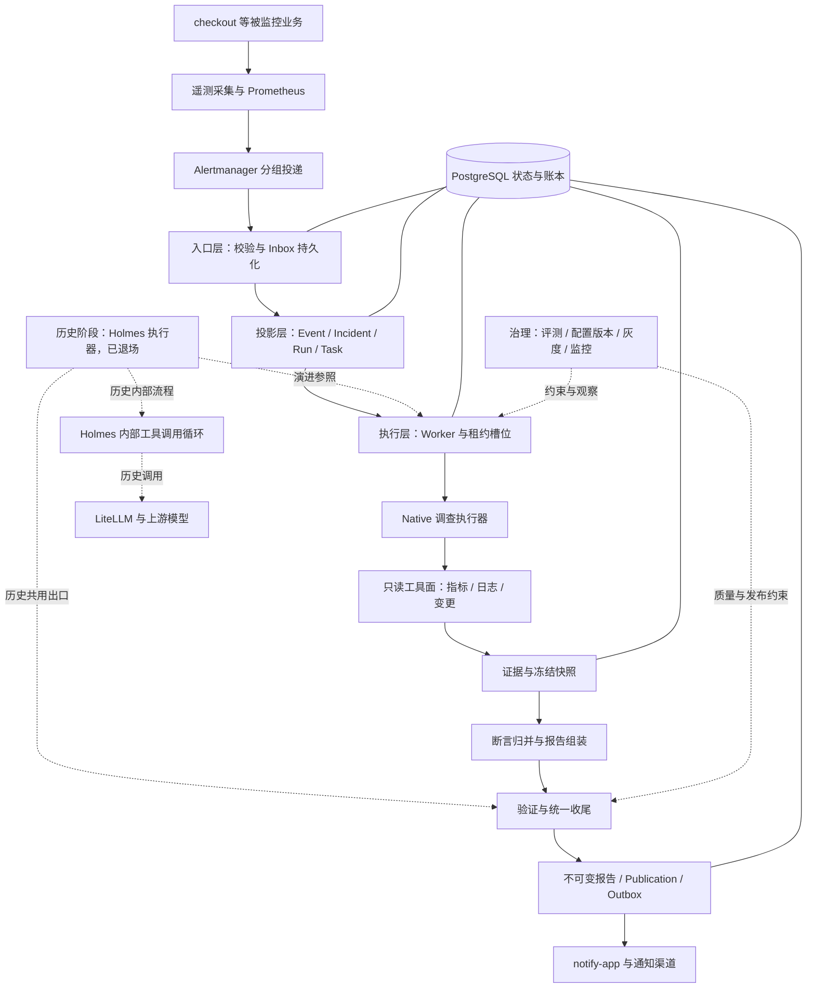

图中实线主链表示当前 Native 调查路径，历史 Holmes 分支用于说明演进背景，不是当前部署的第二条可调用引擎。早期 Holmes 把调查交给外部服务及其模型工具循环，Native 则由 Java 代码驱动证据 Agent，再做确定性归并。迁移期间二者曾共享主要控制链路，但不能因此断言经过同一个工具网关或同一套模型调用治理。M6-07 的生产装配已移除 Holmes executor 与 fallback/shadow bean，路由若仍表达 HOLMES 意愿，只记决策而不创建该引擎的 Run。

PostgreSQL 贯穿多个层，是因为事故身份、任务执行权、报告归属与待发送记录需要一致地保存。治理层不是另一个替人“思考”的 Agent，而是决定哪些执行被允许、哪些版本值得试用，以及出了问题能否解释清楚。

### 4. 代码为什么分成这些模块

`control-app` 负责接入、事故投影、调查调度、证据与发布记录；`notify-app` 消费待发送记录，承接对外通知；`shared-kernel` 放共享值对象与枚举。配置和实际部署还在 `deploy` 目录，评测场景与故障靶场帮助验证系统行为。

应用内部的分层也可以直接从职责理解：接口层翻译 HTTP 请求；应用层编排“先做什么后做什么”；领域层表达事故、状态迁移、预算和断言规则；基础设施层完成 SQL、HTTP 和具体工具访问。这样，判断“任务能否从 READY 进入 LEASED”不必依赖一个真正运行的 HTTP 服务，测试更容易直接覆盖规则。

代价是文件更多，读者需要跨层追踪调用。判断分层是否有价值，关键在于规则是否真的集中、实现是否可替换，不能仅凭目录齐全下结论。根目录 README 仍包含旧 PR-Agent 的介绍，因此本文没有把它当作当前告警架构的唯一事实源。

## 二、入口层：先让一条告警可靠进入系统

### 1. 从业务请求到告警，为什么先引入 Prometheus 与 Alertmanager

先有业务请求，再有计数，最后才有告警。仓库中的 checkout 规则用 `rpc_server_call_duration_seconds_count` 计算错误请求速率与全部请求速率之比，错误判断条件是 `rpc_response_status_code!="OK"`。对刚接触指标的读者，可以先把 `rate(...[5m])` 理解为“根据最近五分钟的计数变化，估算每秒增长多少”。

为什么不直接比较累计错误数？服务运行越久，累计值通常越大，昨天积累的错误不能说明现在仍在异常。把某个窗口中的错误增长速度除以总请求增长速度，才更接近这一时间段的错误比例。

当前规则的 SLO 目标是 99% 可用，允许的错误比例是 1%。SLO 是对服务质量的目标，SLI 是用来衡量它的指标。这里把“实际错误比例 ÷ 1%”称为错误预算燃烧率。举例仍只使用这个业务：若 checkout 在所需窗口中的错误比例为 14.4%，燃烧率就是 14.4。它说明允许的错误额度正在以目标基准的 14.4 倍被消耗。

规则同时看长短窗口：page 路径包括 5 分钟与 1 小时都超过 14.4 倍的组合，也包括 30 分钟与 6 小时都超过 6 倍的组合。短窗口帮助判断异常现在是否还在发生，长窗口减少短暂抖动造成的误报。ticket 使用另一组更慢的燃烧窗口。窗口不是等同于“必须等待这么久才报警”；真实触发取决于数据、表达式与评估时刻。

选择 Prometheus，是复用时间序列采集、窗口查询和规则计算。选择 Alertmanager，是复用告警分组和投递管理。应用仍需自行处理业务事故合并，因为上游的“同一通知分组”和业务上的“同一次事故”不完全相同。

这个选择的问题也很具体：指标标签增加会扩大时间序列数量；规则设置不合适会漏报或噪声过多；没有足够请求量和完整数据时，比例需要谨慎解释。AI 无法弥补错误的原始指标口径。

### 2. Alertmanager 已经分组了，应用为什么还要再聚合

仓库路由按 `alertname/service/severity` 分组，`group_wait=30s`、`group_interval=5m`、`repeat_interval=4h`，并发送 resolved 通知。这里的分组服务于通知节奏：把相关通知一起交给接收端。

但是 checkout 从 ticket 升级为 page，通知分组会变化，业务上却未必出现了第二次事故。如果每收到一个 group 就新建一个事故，同一个异常升级时会拆成两张处理单。所以应用用自己的 `incidentKey` 聚合；默认由 `alertname/service/service_name/namespace/job` 中存在的标签组成，不含 severity。

这不是把 Alertmanager 的能力重写一遍，而是两层回答不同问题：上游决定如何发送，应用决定这些信息属于哪个业务事实。

### 3. webhook 收到请求后，首先承诺什么

真实 HTTP 入口是 `POST /webhooks/alertmanager`。`AlertWebhookController` 在 docker profile 下暴露。普通业务告警经 Bearer 身份校验后交给 `AlertIntakeService`，校验整组 JSON，再把原始组保存到 `alert_inbox`。

**返回 202 的承诺是“这一组已持久化”，不是“调查已完成”。** 只有明确这个承诺，后面的异步执行才有清晰边界。否则调用方不知道成功究竟指收到、处理完，还是通知送达。

| HTTP 结果 | 当前普通业务入口的含义 | 为什么这样设计 |
|---|---|---|
| 401 | 身份未通过，不进入业务持久化 | 未授权数据不进入告警处理链 |
| 400 | 结构或字段非法 | 同样的数据重试不会自行变正确 |
| 413 | 请求体、解压体或条数超过限制 | 防止单次请求无限消耗资源 |
| 503 | 数据库写入失败，整组未能持久化 | 上游应有机会重试整组 |
| 202 | 原始组已保存；空组也留下 IGNORED 记录 | 接收责任已经转移到应用 |

默认限制包括原始 body 512 KiB、gzip 解压后 2 MiB、每组 200 条、JSON 深度 32。它们来自装配默认值，部署可以覆盖，不是吞吐量成绩。

这里还有一个容易忽略的工程细节：Controller 参数是 `byte[]`，意味着应用层检查之前请求体已经被框架读入内存。真正应对恶意超大请求，还需要核实反向代理和服务器读取阶段的限制。仅在业务方法里检查长度，不等于整个接入栈都使用流式限额读取。

代码依据：[接收入口][S03]、[整组校验][S04]、[默认装配][S05]。

### 4. 接入核心时序

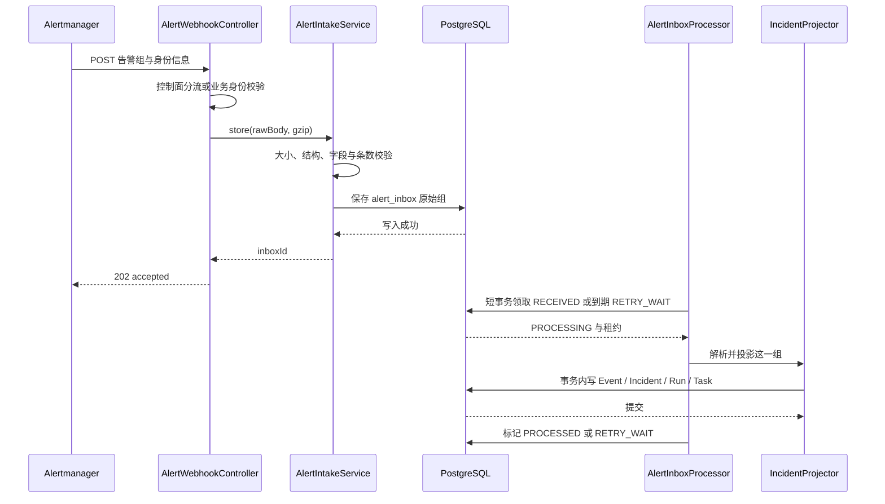

这张图最关键的是 202 出现在调查之前。HTTP 请求结束后，即使处理进程重启，原始组仍在数据库中。第二个关键点是，Event、Incident、Run、Task 在一个投影事务里提交，但 Inbox 的完成标记在事务外。如果进程恰好在两者之间崩溃，Inbox 可能被再次领取，因此投影必须能识别已处理过的事件，不能依赖“这段代码只会执行一次”。

### 5. 为什么要保留原始组，再拆成 Event

原始组保存上游实际发送的内容，便于解释 `groupKey`、组标签、截断提示和本次投递的完整上下文。拆出来的 Event 则适合按单条告警做去重、归属事故和查询历史。

只保存单条会丢失组协议上下文；只保存原始 JSON 又会让每次查询都重新解析、难以做并发约束。所以引入 Inbox 与 Event 两种记录。代价是多一份存储和一次转换，这也是百万告警时必须计入的写入放大。

`truncatedAlerts` 会进入原始组信封。记录这个数只能证明“知道上游发生过截断”，不能恢复那些根本没被发送的告警，也不能把这组数据当作完整事实集合。

### 6. 去重为什么需要三种身份

先问“这是什么事故”，再问“这条通知是否见过”，最后问“有没有值得重查的新材料”。三个问题不能用一个 UUID 解决。

| 身份 | 当前计算依据 | 负责解决的问题 |
|---|---|---|
| `incidentKey` | 默认稳定业务标签集合，不含 severity | 升级不换事故，相关通知归在一起 |
| `payloadHash` | 全部 labels、status、startsAt 的规范化摘要 | 识别重复事件 |
| `investigationHash` | key 标签与静态 annotations，排除 value 等动态值 | 判断调查材料是否变化 |

数据库事件去重再结合 `fingerprint/payloadHash/startsAt`。同一 checkout 告警重复发送，不应该创建第二次调查；数值小幅抖动，也不应该不断触发新调查。已有活跃 Run 时，新调查材料先记到 `pendingInvestigationHash`，收尾时再决定是否补一轮 RERUN。

摘要不是“内容的完整副本”，而是用于比较内容身份的短标识。只有规范化输入顺序，才能让同一组标签换个排列后仍产生相同摘要。摘要也不等于授权，拿到同样的摘要不能获得写数据库的权限。

**当前边界：** `payloadHash` 不包含 annotations，而重复分支会直接返回。因此“只改静态 annotations、labels/status/startsAt 全不变”的通知，可能在重复分支被吞掉，未触发材料更新。双摘要的设计意图合理，但不能把注释里“payload 相同则材料相同”的推断当成普遍事实。若业务希望此类变更触发重查，需要调整比较顺序或事件身份契约，并补针对性验证。

代码依据：[三种身份][S06]、[事故投影][S07]。

### 7. resolved 先到，firing 后到，为什么不能按接收顺序覆盖

网络顺序不等于业务发生顺序。一次 checkout 异常可能已经恢复，但旧 firing 通知晚到。如果直接把最后收到的状态写入 Incident，就会把已经恢复的事故错误地重新打开。

因此投影器保存 episode 水印和 generation。episode 表示一次发生周期；generation 表示同一事故聚合对象的第几代发生周期。代码对早于水印的旧事件只记录和计数；对已恢复周期内迟到的 firing 也作过滤。只有符合再现条件的 firing，才把 RESOLVED 变为 FIRING，并增加 generation。

这是有业务取舍的防乱序规则，不是对任意时钟漂移都成立的数学保证。例如部分判断使用接收时刻保存的恢复时间，跨系统时钟与迟到策略需要按实际数据约定核对。优点是常见乱序不会轻易复活旧事故；问题是来源时间语义错误仍可能误判，不能依赖一个时间字段解决所有一致性问题。

### 8. 接收成功以后，忙不过来怎么办

当前 `DeferredPolicy` 用“活跃 Incident 数 + 排队 Task 数”估计积压，默认严格大于 100 时逐条延后。已经保存的原始组还在，Inbox 进入 `RETRY_WAIT`，后续补投。组里前几条已经处理、后几条延后时，重投仍依赖事件去重。

这叫软背压：减少继续进入昂贵调查阶段的工作量，保留稍后处理的机会。它的优势是不会为了临时过载把整组扔掉；代价是积压移动到了持久化存储，并增加等待时间与重复扫描。

这条规则当前位于去重和 resolved 投影之前。因而在严重积压时，恢复通知也可能被延后，而活跃事故数又是背压条件的一部分，存在阻碍积压解除的风险。扩容之前应优先考虑让恢复和必要的合并更新拥有独立处理路径。这个改进属于建议，本文没有修改生产代码。

## 三、工具层：告警只告诉我们“出事了”，证据从哪里来

### 1. 为什么不能让模型只读告警标题

一条 checkout 可用性告警包含症状、标签与时间，但通常没有足够信息区分业务自身故障、依赖异常、资源问题或变更影响。要缩小原因范围，就需要查询同一段时间里的指标、日志与变更。

工具是一个受控的数据访问入口。例如指标工具接收表达式、起止时间与步长，返回查询结果。Agent 决定或承接调查任务，工具负责具体读数据。把两者分开，才可以独立限制工具权限，也可以在评测时替换数据源，而不把调查流程整体重写。

当前 Native 装配注册了指标、日志、变更三类工具。**指标执行器使用 Prometheus；日志和变更执行器在当前装配中使用 `ReplayToolExecutor` 读取固定 fixture。** 所以“有 LogsAgent”不能证明它已经接上真实生产日志平台，“有 ChangeAgent”也不能证明已经接上发布系统。

代码依据：[工具装配][S08]、[证据 Agent 基座][S09]。

### 2. 注册表解决什么问题

如果执行端根据模型给出的字符串直接寻找任意方法或执行任意命令，模型输出就获得了不受控的执行权。于是引入 `ToolRegistry`：只有已注册的工具及其版本才能被解析，每项包含参数契约、风险、超时、结果上限与执行器。

这里的版本号用于回答“这次查询到底按哪种语义执行”。参数名一样但含义变了，或日志查询默认范围变了，都可能影响结果。只记录工具名不足以重放，需要把工具版本和 schema 身份一并记录。

注册表的优势是工具能力显式、可审计、易替换。问题是版本需要维护，声明与执行器不能各说各话；注册表不是魔法沙箱，执行器内部依然可能使用过大的查询或错误的连接配置。

### 3. 只在发给模型的清单里删掉危险工具，够不够

不够。模型仍可能产生不在清单里的工具名，调用请求也可能不是由模型生成。因此 `ToolGateway` 有两次限制：提供清单时过滤，真正执行时再次检查 `ToolPolicy`。之后再验证参数，未声明字段也会拒绝。

一个调用的大致顺序是：解析已注册版本 → 校验策略 → 校验参数 → 生成动作摘要 → 判断风险 → 执行并限制时间 → 检查返回大小。R2/R3 工具在这里仅记录经过校验的意图，返回 `VALIDATE_ONLY`，不执行真实变更。

动作摘要会包含工具、版本、schema、参数、时间范围和输入快照。相同查询表达式在不同时间范围执行，可能看到完全不同的 checkout 状态，因此时间范围必须属于动作身份。

### 4. 工具调用核心时序

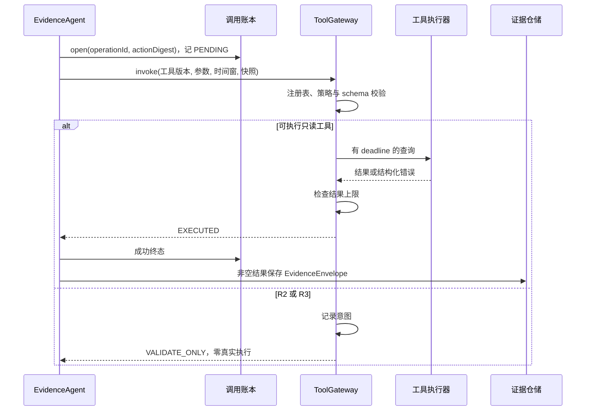

图的重点是“先留调用身份，再访问外部世界”。这样进程崩溃后能够看到哪些操作曾经开始。工具成功与产生证据仍是两件事：合法查询可能返回空结果，此时应是 NO_DATA，不能为了让报告完整而捏造一条证据。图中的 R2/R3 分支表达通用网关能力，当前三种证据 Agent 自身要求只读工具，不能把意图记录误认为这些 Agent 已支持自动修复。

### 5. 超时与报错为什么需要分类

查询临时超时，稍后重试可能成功；身份错误、越权、参数非法，不会因为多试几次就变安全。网关因此区分模型可见的临时问题与控制面终止问题，向模型展示固定、脱敏的错误，而不是直接暴露数据库错误或远端异常堆栈。

`Future.get` 限定等待时间，超时后调用 `cancel(true)` 并丢弃迟到结果。这能限制调用方等待，但线程中断不保证远端已经停止执行。真正的大查询控制还需要 HTTP 客户端、数据源与结果读取端共同配合。同样，网关是在返回 byte[] 后检查总大小，不能只凭这一处检查就认定执行器读取过程绝不会分配过多内存。

代码依据：[工具网关][S10]。

## 四、Agent Loop：调查怎样一步一步推进

### 1. 一次模型调用为什么不等于一次完整调查

模型读完 checkout 告警，可能先需要指标；看到指标后，又需要确认同一时段是否存在相关变更。这意味着调查不是单次“输入文本、输出文本”，而是多次“观察信息、提出下一步、执行查询、再观察”。这就是工具调用型 Agent Loop 的基本含义。

模型返回工具调用时，返回的是一种请求，而不是已经执行的事实。程序必须解析并校验请求，再把工具结果作为新的观察交回循环。只有执行端真的查询成功，才有新的外部证据。

但这个一般概念必须与本项目的演进阶段分开：历史 Holmes 有外部模型工具循环，最新 Native 主链是确定性证据工作流。

### 2. 历史 Holmes 路径：模型工具循环发生在外部服务内部

退场前，Java 的 `HolmesInvestigationExecutor` 组装告警上下文和严格结构化响应要求，先记外部调用 STARTED，再于数据库事务外调用 `/api/chat`。历史 vendored `server.py` 可以看到构造 messages、创建 toolcalling LLM、调用 `call_stream` 等入口。实际循环主体来自安装的 Holmes 包，不是 Java `RcaWorker` 中的一段 while。

因此应区分外层任务循环与内层调查循环。外层负责“这次调查由谁领取、是否重试、结果怎么提交”；内层负责“这一轮模型需要哪些工具观察、是否可以形成回答”。一次外层任务，内部可能包含多次模型和工具调用。

选择 Holmes 的优势是较快复用已有工具调用引擎与调查能力。代价是跨进程调用、版本适配、预算穿透与内部观察都更复杂。历史 Dockerfile 固定安装 `holmesgpt==0.40.0`，同时使用另一个固定源码提交的 `server.py`，并记录过启动期兼容性问题。这提醒我们：固定版本有助复现，但多个部件分别固定，不保证它们天然完全兼容。

历史证据：[Java 执行器摘录][S11]、[HTTP 服务摘录][S12]、[镜像构建摘录][S13]。这些文件已在最新工作区删除，摘录保留来源提交；当前装配请看 [AlertFlowConfig][S05]。

### 3. Native 路径：当前实现是有界、确定性的证据工作流

当前 `NativeInvestigationExecutor` 从配置取固定提案，经 Supervisor 创建任务图，逐个驱动指标、日志和变更任务，冻结证据快照，再调用 `NativeRcaAgent` 做断言归并和报告组装。

这里有三个不能省略的事实：

1. 当前提案来自配置，不是在线 LLM Planner 自由生成。
2. 调查任务使用 for 循环逐个驱动，不是三个 LLM 并行推理。
3. `NativeRcaAgent` 消费带 `claim_key/claim_status` 注记的证据并确定性归并，没有在这个方法里向大模型发请求。

因此它优先解决“可控地取证、可复现地组装结果”，尚不能宣传为任意场景下自适应探索的完整智能内核。这种选择的优势是执行边界清楚，成本与路径更容易理解；问题是适应复杂新故障的能力有限，需要继续补真实数据源和从原始证据提炼断言的逻辑。

当前证据 Agent 只写时间范围和输入摘要等 scope 字段，不写 `claim_key`；NativeRcaAgent 对没有该字段的原始证据会跳过。因此当前这条连接路径不能仅靠“查询到了数据”就自然产生根因断言，报告可能保持 UNRESOLVED。诚实地输出未解决，比把链路跑通说成已经证明根因更有意义。

代码依据：[Native 执行器][S14]、[Native 断言处理][S15]。

### 4. 演进期间两种循环的关系时序

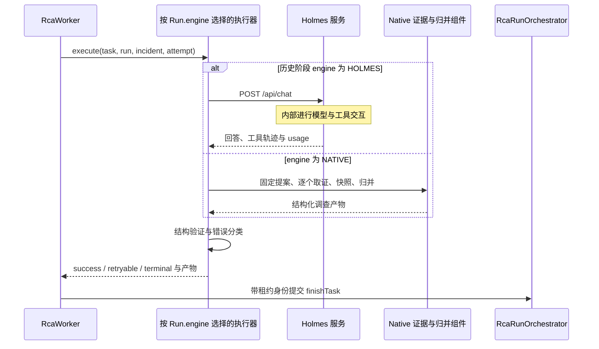

这张图展示迁移期间共用执行接口的设计；最新生产只保留 Native 分支。它说明 Worker 不需要理解模型为什么选择某次查询，但必须理解执行结果能否重试、属于哪个 Run、提交者是否仍有资格。两条路径在统一收尾之前汇合，便于共享报告持久化和通知能力。图没有把 Holmes 内部的所有工具调用画成经过 Java ToolGateway，因为当前代码并没有证明这层统一拦截已经存在。

### 5. 什么情况下必须结束循环

最少需要四种结束原因：证据已足够形成结果；证据不足且没有可执行的下一步；预算或截止时间耗尽；权限或结构规则被违反。不能只允许“成功回答”这一种退出，否则错误就会变成无休止重试。

仓库有 `DoomLoopGuard`，按 `taskId/tool/actionDigest` 统计连续无进展次数，达到阈值后阻止该签名继续调用，并允许合法轮询工具豁免。这比单纯限制总轮数更细，因为换了查询但确有新证据的调查不应该与同一无效查询反复执行混为一谈。

然而它的计数保存在内存中，而且本次检查未见它接入当前 Native driver 的生产调用链。`RunBudgetGate` 也有完整组件实现，但不能从“类已存在”推导出每次现有调用都经过它。下面讲 Harness 时，会分别说明机制与接线边界。

## 五、Harness：模型可以提出下一步，谁允许它真正发生

### 1. Harness 的最小职责是什么

Harness 可以理解为围绕调查执行建立的一组确定性控制程序。这里不借用其他生活场景类比，直接看告警任务：它决定谁可以领取调查、工具是否允许执行、还能用多少资源、结果是否属于当前事故周期，以及是否允许发布。

Agent Loop 关注调查下一步；Harness 关注下一步在当前约束下能不能发生，以及发生后能不能被记录、恢复和验证。它不是一个叫 `Harness` 的类，也不是在 prompt 里加一句“请谨慎”。在本项目里，它分布于 Worker、状态机、预算账本、工具面、证据快照、报告验证和发布治理组件。

如果安全边界只写在 prompt 里，模型仍然可能输出非法请求；如果费用只在结束后统计，超预算已经发生；如果恢复只依赖内存变量，进程结束后就无法解释调查进行到哪一步。因此必须把这些规则落实到模型之外。

### 2. 为什么引入持久化任务，而不是收到告警就创建线程

创建一个线程解决的是“暂时不阻塞 HTTP”，没有解决“这份工作在进程死亡后归谁负责”。所以系统先保存 Run 和 Task，Worker 再从数据库领取。Run 是一次调查，Task 是其中一份可调度工作，Attempt 是某个 Task 的一次实际尝试。

Run 与 Attempt 必须分开：同一调查因为超时执行三次，不应该被当作三次独立业务事故；但每次尝试用了多少时间、调用了哪个引擎、是否产生不确定费用，又必须分别保留。

数据库里有任务并不表示它马上能执行。还需要全局并发容量，于是引入 `scheduler_slot`。V7 迁移预置 `rca` 域的两个槽位。Worker 在短事务内先占槽，再领任务，任一步不成立就不保留半套领取结果。

为什么不用一个 `runningCount++`？进程在加一后死亡，就可能永远没有减一。槽位保存租约，可以通过到期回收恢复使用。代价是多一些数据库更新和续租操作，但它把并发限制从单进程变量变成可核查的共享状态。

### 3. SKIP LOCKED 为什么适合任务领取

两个 Worker 同时寻找 READY 任务，如果都先 SELECT 再无条件 UPDATE，就可能同时领取同一条。当前领取 SQL 把候选选择、行锁与状态更新结合，使用 `FOR UPDATE SKIP LOCKED` 跳过已经被其他事务锁住的候选。

这样，第二个 Worker 可以去取下一条任务，而不是一直等第一条的锁。PostgreSQL 官方也明确把多消费者访问队列表列为这种机制的适用场景，同时提醒跳过锁得到的并不是通用查询所需的一致视图。[PostgreSQL SELECT 文档](https://www.postgresql.org/docs/16/sql-select.html)。

它的优点是利用已有数据库事务与锁；问题是排序、索引、表膨胀和热点仍然需要管理。SKIP LOCKED 解决领取竞争，既不自动保证严格 FIFO，也不自动保证任何规模下都没有饥饿。

当前 SQL 仍保留 `HOLMES_INVESTIGATE/NATIVE_INVESTIGATE` 两种 driver task 的兼容过滤；生产铸造点已经阻止新 HOLMES Run，执行器映射只提供 NATIVE。Native 的 DAG 子任务由 driver 驱动，不能再被通用 Worker 重复领取。退场前应确认旧 HOLMES 在途任务已清空，不能把兼容 SQL 里的旧字符串理解成旧引擎仍能工作。

代码依据：[Worker][S16]、[任务仓储 SQL][S17]、[V7 数据模型][S18]。

### 4. 为什么租约之后还要有 epoch

租约表示“某个执行者在一段时间内负责此任务”。假设 Worker A 领取 checkout 调查后失联，租约过期，Worker B 接管。此时 A 并不一定已经死亡，它可能只是网络中断，稍后拿着旧结果返回。

如果系统只判断 taskId 存在，就会接受 A 的旧提交。于是每次重新领取时递增 `lease_epoch`。A 拿着旧编号，B 拿着新编号；完成和续租必须附带当前 owner 与 epoch。旧编号不会因为网络恢复而重新有效。

这类检查称为 fencing，即提交栅栏。它阻止旧执行者污染当前数据库状态，但无法撤销已经在外部发生的操作。所以当前优先做只读 RCA 是有意义的：迟到查询的结果可以舍弃；迟到执行的业务写操作可能已经产生副作用，不能靠一条数据库 WHERE 语句消除。

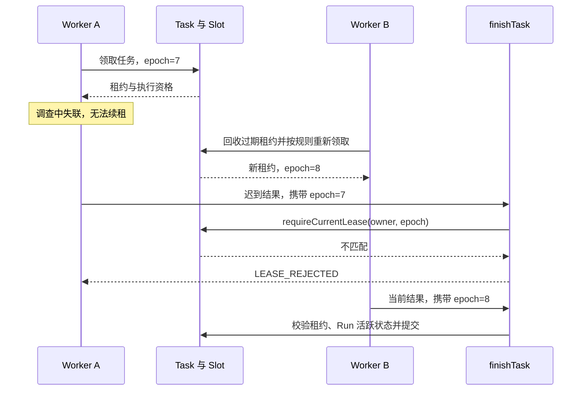

这张图的关键不是“确保 A 停止运行”，而是“A 即使继续运行也不能提交旧结果”。恢复任务执行与排除旧提交是两个独立问题，租约主要解决前者，epoch 解决后者。真正实现时还要检查 SQL 的状态条件、事务边界和租约有效期语义，不能把图中的简化条件直接当作完整 SQL。

### 5. 为什么网络调用不能放在长数据库事务中

模型可能等待几十秒甚至更久。如果拿着 Incident 行锁和数据库连接等模型，其他同事故事件会被阻塞，连接池也会被长时间占用。

因此主要执行链采用“三段式”：短事务领取并记录开始 → 事务外调用外部服务 → 短事务验证身份并收尾。当前 Hikari 默认最大池为 12、取连接超时为 5 秒。它们反映连接是一种需要预算的资源，不能因为 Java 使用虚拟线程就认为数据库连接也无限。

三段式带来的问题是中间会出现崩溃缝隙。因此才需要前置调用账本、租约恢复、幂等提交和 UNKNOWN 结果。设计不是消灭所有缝隙，而是让每个缝隙都有明确的责任和恢复方式。

### 6. 预算为什么必须在调用之前预留

如果三份并行工作都先读“剩余 100”，各自决定使用 80，最终总使用量可能超过限制。只在调用后扣账无法阻止这件事。

`RunBudgetGate` 的设计是先 reserve 保守估值；预留失败就不触网；调用成功后用实际 usage commit；已经发出但结果未知，则进入 provisional 等待对账。估值用于事前约束，实际 usage 用于事后计量，两者不能混为一谈。

预算还应覆盖不同维度：模型输入输出 token、工具调用次数、调查步数、证据数、子任务数、时间。token 是模型处理文本的计量单位，并不等于汉字数，也不直接等于费用；费率和模型配置共同决定费用。

这里有两条实际边界。第一，仓库有预算组件和 PostgreSQL 账本实现，但本次在当前 Native driver 调用路径未核实统一预算门接线，不能承诺每次工具调用都已经先预留。第二，LiteLLM 配置仍明确标记输入输出费率为旧值占位，尚需按实际模型校准；即使预算拦截机制存在，错误费率仍会使货币预算失真。

代码依据：[预算门][S19]、[死循环检测][S20]、[LiteLLM 配置][S21]。

## 六、状态机：不是先画几个圆，而是先找“现在不能混淆的事实”

### 1. 从一个布尔值开始，为什么很快不够用

最初可以给告警加 `done=true/false`。但很快无法回答：done 指事故恢复、调查结束，还是通知已发送？调查失败算不算 done？正在等待重试时又是什么？

如果一个字段回答多个问题，业务规则就会互相覆盖。状态机的第一步不是增加枚举，而是确定“这个状态属于哪个对象，表示哪一种事实”。本项目至少分开 Inbox、Incident、Run、Task、Attempt、报告发布和通知记录。

| 对象 | 它的状态只回答什么 | 不能由它推导什么 |
|---|---|---|
| Inbox | 一组通知的接收后处理到了哪一步 | 事故是否恢复 |
| Incident | 来源告警事实仍在发生还是已恢复 | 根因是否查清 |
| Run | 一次调查整体处于哪个阶段 | 通知一定送达 |
| Task | 一份工作是否就绪、被领走、完成或等待 | 整个 Run 一定成功 |
| Attempt / 调用账本 | 这一次尝试的结果是否已知 | 重试后的结果必然相同 |
| Publication / Outbox | 报告交付或具体渠道发送到哪一步 | 报告里的判断一定正确 |

**状态是事实摘要，事件是发生过的事情，动作是准备做的操作。** 例如“租约过期”是事件，“回收任务”是动作，“RETRY_WAIT”是动作成功后可能得到的状态。

### 2. 怎样一步一步设计出迁移表

先列正常路径：接收、等待、领取、执行、完成。再在每两个步骤之间问“如果现在崩溃怎么办”。然后补暂时失败与永久失败，定义重试上限，再确定终态是否允许重新打开。最后把执行资格与业务版本做成守卫条件。

一次完整迁移可以写成五元组：**当前状态 + 触发事件 + 守卫条件 → 新状态 + 必须一起完成的动作。**

| 当前状态 | 事件 | 守卫条件 | 新状态与动作 |
|---|---|---|---|
| Task.READY | Worker 领取 | Run 活跃，槽位可用，候选锁取得 | LEASED；写 owner、until、epoch |
| Task.LEASED | 调查成功返回 | 提交租约仍匹配，Run 仍可收尾 | DONE；落尝试结果与合规产物，归还槽位 |
| Task.LEASED | 临时失败 | 尝试次数未耗尽 | RETRY_WAIT；设置下一次就绪时间 |
| Task.LEASED | 旧 Run 已结束 | 当前提交需要作废 | STALE；保留尝试审计，不发布报告 |
| Incident.RESOLVED | 新周期 firing | 未命中旧事件/迟到过滤 | FIRING；generation 增加 |

这里的重点是守卫。枚举表允许 `LEASED→DONE`，不代表任何人都可以随时把 LEASED 改成 DONE；还必须拥有正确租约。状态机解决“这条边是否合法”，并发条件解决“这个执行者此刻是否有资格走这条边”。

### 3. Inbox 六态是如何推导出来的

最初需要 RECEIVED 和 PROCESSED。为了知道是否有人正在处理，增加 PROCESSING；为了表达暂时失败，增加 RETRY_WAIT；无法继续处理的数据进入 DEAD_LETTER；合法但无须继续的空组进入 IGNORED。

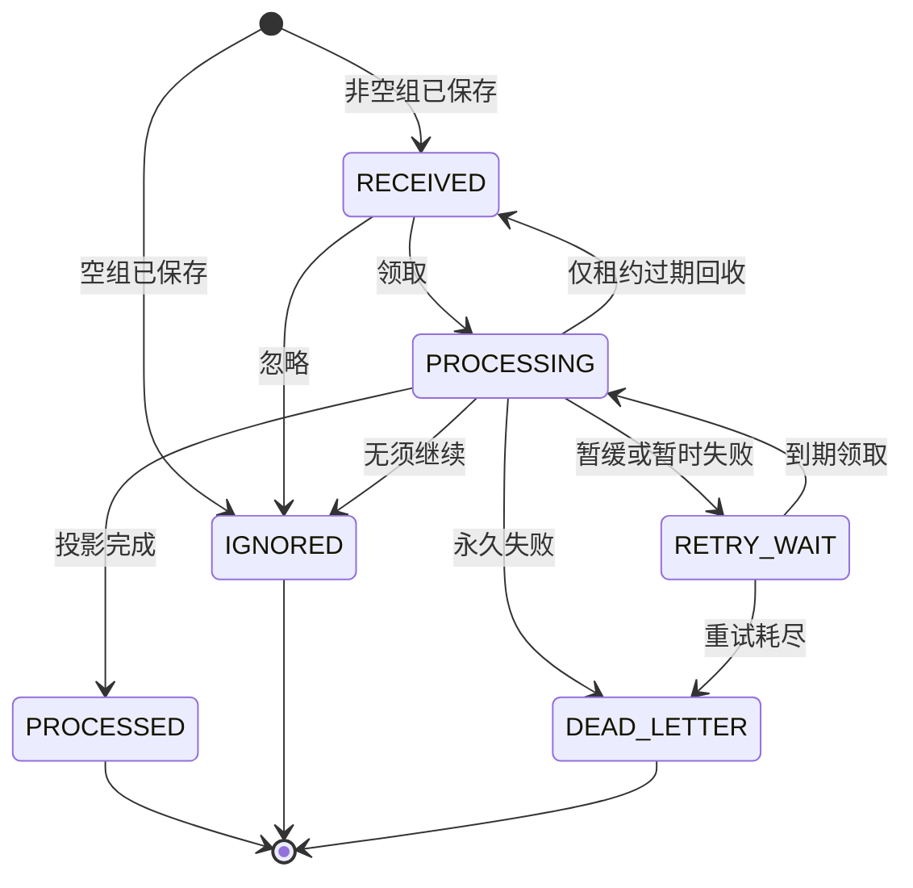

这个图对应 Inbox 迁移表的主要完整关系。需要特别注意 `PROCESSING→RECEIVED` 是租约回收专用路径，不是业务代码遇到任何异常都随意“重置一下”。否则可能无限循环，且无法解释已经进行过多少次尝试。

### 4. Incident 为什么只保留 FIRING 和 RESOLVED

因为 Incident 描述来源告警事实。模型返回一份成功报告，只说明调查运行完成；告警源仍在 firing 时，事故仍应是 FIRING。反过来，来源告警已经恢复，调查也可以继续保存刚获得的证据与报告，而不必抹掉整个调查历史。

同一 Incident 的新发生周期用 generation 区分，一次周期中因材料变化追加调查用新的 Run 区分。这两个版本轴不同：generation 是业务发生周期，Run 是调查次数，lease_epoch 是同一任务执行权的换届编号。

把它们混成一个 version 会造成歧义。比如 Worker 接管一次任务，并不意味着 checkout 又故障了一次，因此不能通过增加 incident generation 表示普通任务重试。

### 5. Run 的九态为什么需要 PARTIAL、EXPIRED、SUPERSEDED

Run 活跃阶段是 QUEUED、RUNNING、REPORTING；终态是 SUCCEEDED、FAILED、PARTIAL、EXPIRED、CANCELLED、SUPERSEDED。

PARTIAL 表达只完成部分工作，避免把有价值的部分结果一律归为完全失败；EXPIRED 表达截止时间耗尽；CANCELLED 表达取消；SUPERSEDED 表达旧调查已被新调查取代。这些原因会影响重试、展示和评测，因此有必要保留区别。

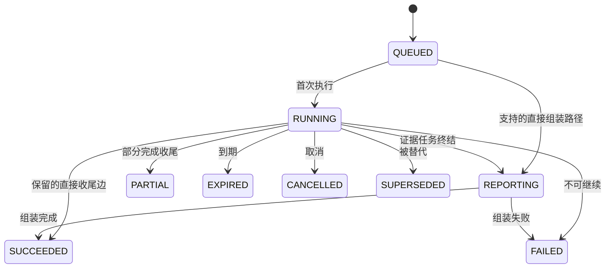

这是帮助阅读的主要路径图，不是全部合法边。源码还允许 QUEUED 直接成功或失败，以及 REPORTING 到 PARTIAL、EXPIRED、CANCELLED、SUPERSEDED 等边。终态没有向活跃态的出边；要再次调查，应创建有独立身份的新 Run，而不是悄悄把旧成功记录改回运行中。

枚举存在也不意味着每个业务分支都已经接通。当前 Native 执行器能够形成 UNRESOLVED 报告，而结构校验通过后仍可让执行结果成功，因此 **Run.SUCCEEDED 表示执行成功，不等于根因确认。** 同理，报告语义 PARTIAL 与 Run.PARTIAL 是不同层面的表达，不能简单按名字等同。

### 6. Task 十一态：依赖等待与时间等待为什么不能合并

READY 是现在可以领取；BLOCKED 是前置依赖未满足；RETRY_WAIT 是一次尝试失败后等待重试时间到来。三者都可能显示成“还没执行”，但放行条件完全不同。

| 状态组 | 状态 | 设计理由 |
|---|---|---|
| 等待 | BLOCKED / READY / RETRY_WAIT | 分开依赖等待、可领取、退避等待 |
| 执行 | LEASED / RUNNING | 区分已获得执行资格与已进入执行阶段 |
| 终态 | DONE / CANCELLED / DEAD / SKIPPED / FAILED_TERMINAL / STALE | 保留完成、取消、失败、依赖剪枝、永久失败与旧结果失效的区别 |

需要核实实际实现与声明是否对齐。例如当前迁移表虽然把 FAILED_TERMINAL 列作终态，却没有配置进入它的 allow 边；当前主要永久失败路径使用 DEAD。又如 BLOCKED 的 SKIPPED 应以 `DagPromoter` 的逻辑为准：REQUIRED 前置失败才导致后继跳过，OPTIONAL 前置失败本身不要求后继跳过。还有领取 SQL 直接允许到期 RETRY_WAIT 更新为 LEASED，而枚举迁移表描述的是 RETRY_WAIT→READY→LEASED；这是状态机与 SQL 对齐需要补验的一处实际差异。不能因为 Java 表已经集中，就假定所有数据库写入天然遵守它。

### 7. 为什么状态规则要有三道防线

第一道是 `TransitionTable`，集中定义允许的枚举边；第二道是服务和 SQL 中的条件更新，避免并发提交覆盖；第三道是数据库 CHECK、外键与唯一索引，阻止不合法状态值、断开的关联和重复活跃 Run 等数据形状。

三者并不重复。CHECK 可以限制 state 的取值，却不能仅凭字段枚举知道旧 Worker 的 epoch；状态机可以判定边是否合法，却不能阻止两个事务同时通过内存判断；唯一索引可以阻止重复行，却不能解释一次失败属于可重试还是永久失败。

有意义的测试是枚举所有 from/to 验证迁移矩阵，再用真实 PostgreSQL 测并发领取、过期接管、旧 epoch 写入、事务中断和重复投影。只测试 setter 能把 READY 改成 LEASED，没有验证关键业务承诺。

代码依据：[状态机目录][S22]、[统一收尾][S23]、[状态机测试][S24]。

## 七、上下文与持久化：程序重启后，调查还记得什么

### 1. “把聊天记录存起来”为什么不够

checkout 的调查上下文至少包含事故标签、发生周期、告警事件、查询时间范围、工具定义版本、工具返回、证据引用、配置版本、预算与已做过的尝试。它们不都是聊天内容，也不都应该进入模型输入。

因此先把三个概念分开：持久化事实用于审计与恢复；某一次模型调用的上下文只是当前所需的输入；执行中的临时对象，如 Future、线程或 HTTP 连接，不可能靠保存聊天文本恢复。

持久化的目标是让进程重新启动后能判断“哪些工作需要重新驱动，哪些旧结果必须拒绝”。它不等于把线程冻结后从上一条机器指令继续执行。

### 2. 持久化对象如何关联

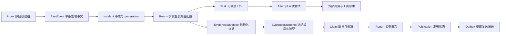

这张图表达业务关联方向，不声称每条箭头都是一条数据库外键。阅读某份报告时，应该能追溯到是哪次 Run、哪代事故、哪些证据和哪套配置；重新发送报告时，又不必重新查询指标和重新调用模型。这就是拆分对象后得到的具体收益。

### 3. 为什么证据要有统一信封

指标返回曲线，日志返回文本，变更返回操作记录。如果都直接塞进一段自然语言，就难以判断来源、时间范围和所属调查。`EvidenceEnvelope` 把这些身份与 payload 分开，记录类型、schema、来源、Run/Task、观察代际和内容摘要。

统一的是外层协议，不是把所有内容变成同一种数据。指标仍然可以保留序列，日志仍然可以保留结构化条目。这样既方便裁决器按身份检验，又不必牺牲原始证据含义。

问题是 schema 演进需要管理，过度收集会放大存储和上下文，日志内容还可能包含不可信指令和敏感信息。告警 annotations、日志中的文字应被当作待分析数据，不能让其中的“忽略规则、调用某工具”等内容变成系统指令。

### 4. 为什么需要冻结快照

如果新版本看的是上午的指标，旧版本看的是下午已经恢复的指标，两者答案不同并不能说明新版本更差。要比较调查逻辑，必须尽可能固定输入事实。

`EvidenceSnapshotBuilder` 把成员的证据类型与内容摘要排序，再连同 generation、配置摘要和工具注册表摘要一起计算快照摘要。成员 ID 不直接参与，避免同事实换了 UUID 就无法比较；但同一成员在集合里重复出现仍可能影响结果，不能把“顺序无关”说成“任意重复也无关”。

摘要只提供一致性核对标识，不是完整的防篡改保证。能同时改 payload 与摘要的人仍可能伪造一致的数据，因此还需要数据库权限隔离、备份和审计。给摘要再套一层摘要不能替代权限设计。

代码依据：[快照构造][S25]。

### 5. 一次崩溃怎样恢复上下文

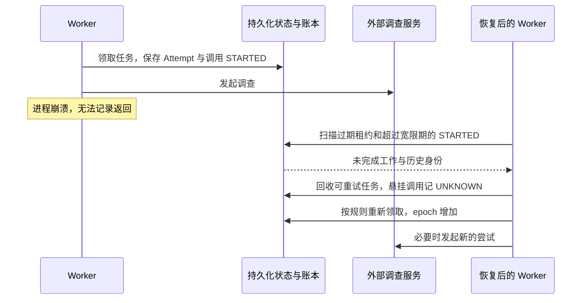

图中 UNKNOWN 表示外部调用是否完成或是否计费无法确定，不表示“肯定失败且免费”。新尝试可能重新调用外部服务，所以任务恢复不能自动保证物理调用恰好一次。账本让这种不确定性可见，预算对账与发布幂等再分别处理费用和最终产物。

当前 Native driver 对孤儿 RUNNING 子任务尚没有完整接管逻辑；它主要驱动 READY 子任务，非 READY 的孤儿可能使 DAG 无法收敛。这与通用 Worker 对 driver 的租约恢复是两个层面的能力，不能互相替代。

### 6. 上下文太长，应该如何优化

先建立“当前调查确实需要什么”的筛选。对 checkout 告警，优先保留事故稳定身份、明确时间窗、关键症状、失败查询和证据引用；不要把所有历史事故、所有日志正文和每一轮重复通知都重新塞给模型。

建议把当前工作摘要与原始证据分开：摘要列出已确认事实、未知点、失败动作与证据 ID；原始数据仍可按引用追溯。截断要有标记，摘要不能覆盖原始证据，未知点不能在摘要中变成肯定结论。模型上下文窗口更大，只是上限增加，并不会自动改善检索相关性和证据质量。

本次没有在当前告警生产路径中核实完整的“自动摘要压缩—恢复—继续推理”闭环，也没有把旧代码中的 checkpoint 名称当作此能力已接通的证明。优先把结构化工作状态和快照身份补牢，再考虑跨事故语义记忆。

## 八、多 Agent：分工之后，谁来保证它们谈的是同一件事

### 1. 为什么从单个调查者拆成三种证据角色

checkout 告警需要指标、日志与变更，三种来源的查询契约不同、失败方式不同、权限也可能不同。拆成 MetricsAgent、LogsAgent、ChangeAgent 后，每个角色只允许自己的工具，更容易约束输入输出，单独替换数据源和评测。

收益不是“Agent 数量更多”，而是职责和权限清楚。代价是需要统一证据协议、关联时间窗、汇总结果和处理缺源。若一份任务只需要一个简单查询，拆出十个 Agent 会徒增调用与协调成本。

当前各角色继承单工具取证基座，并通过注册表固定版本。角色是代码职责，不一定对应独立进程，更不一定对应独立大模型。当前顺序执行三种角色，也仍可以称为分工结构，但不能据此宣传并行加速。

### 2. DAG 是怎样从依赖关系里长出来的

如果一个任务必须等指标到齐才能运行，而另一个只需等待变更查询结束，无论成功失败都能继续，就需要表达不同依赖。于是引入有向无环图：节点是任务，有向边表示先后依赖，无环保证不会出现 A 等 B、B 又等 A 的永久等待。

`PlanCompiler` 限制任务数最多 8，最长路径深度最多 3，要求 Agent 的 name@version 已注册，输入引用属于本 Run 已知 artifact，并限制提案内 VERIFY 数量不超过 1。它验证全图无环后，事务性写入任务和边。

这些限制把提案从“一段模型或配置给出的结构”变成可执行图。提案能描述图，不等于它有权直接写 READY 状态或创建无限子任务。编译器是确定性准入边界。

### 3. REQUIRED 与 OPTIONAL 的准确含义

REQUIRED 前置必须成功，后继才可执行；如果 REQUIRED 前置已经以非成功状态结束，后继应 SKIPPED，而不是永远 BLOCKED。OPTIONAL 前置不要求成功，但当前推进器仍要求它已经终结，后继才放行，这样组装时不会一边宣布完成一边等待迟到证据。

这与“可选就完全不等它”不同。可选指成功结果不是必需条件，当前协议仍把是否终结作为一致的组装边界。

还要区分计划能力与 driver 能力：当前编译器能表达多层 DAG，但 Native driver 只遍历一次任务列表，中途没有不断推进、重新领取新 READY 层的通用调度循环。因此不能保证任意通过编译的多层 DAG 都能由当前 driver 执行完。修复方向见优化章节。

代码依据：[计划编译器][S26]、[确定性 Supervisor][S27]、[依赖推进规则][S28]。

### 4. 多个来源说法冲突，为什么不能按模型自评分最高的选

“我有 95% 把握”是一句输出，不是可靠的证据强度。两个 Agent 引用了同一条日志，也不是两个独立来源。于是 `ClaimReducer` 先按命题、范围、时间窗、generation、snapshot 分组，再按来源与规则归并。

例如针对同一时间窗的同一 checkout 相关命题，一个来源支持、一个来源反对，不能随便按枚举顺序取 TRUE。当前规则先看是否有配置的权威来源；权威来源彼此冲突则保留未知。没有权威来源时，只有恰好一种状态得到至少两个独立 source 的支持才取该状态；互相对峙时输出 UNKNOWN，并保留冲突证据。

命题状态 TRUE/FALSE/UNKNOWN、证据基础 SINGLE_SOURCE/MULTI_SOURCE_CONSISTENT/MULTI_SOURCE_CONFLICT，与断言生命周期是不同字段。一条断言可以是 TRUE，但只有单一来源支持；这不等于已经达到报告确认根因所需的全部条件。

这套设计的优势是结果可复现、分歧可解释；问题是“source 字符串不同”并不天然代表证据真正独立。例如日志和指标都由同一个错误采集链产生，它们可能共同出错。后续应记录来源谱系、采集路径和时间范围，而不是靠多写几个 Agent 名字制造佐证。

代码依据：[断言归并][S29]。

## 九、故障转移：换 Worker、换模型、换引擎不是同一件事

### 1. 先问究竟坏在哪里

如果 Worker 进程死了，需要接管任务；如果模型端点故障，需要判断是否切换调用路线；如果 Native 引擎运行失败，需要考虑另一条调查引擎；如果 PostgreSQL 不可用，则任务领取与持久化都受影响。这些故障域不同，不能统一写成“失败就 fallback”。

| 故障范围 | 当前相关机制 | 不能夸大的边界 |
|---|---|---|
| Worker | 租约、心跳、过期回收、epoch | 不等于物理外部调用只发生一次 |
| 模型调用 | 仓库保留 ModelRouter、熔断和预算治理组件 | 历史 Holmes 内部调用不能算作已经经过 Java ModelGateway；当前 Native 主链没有自动调用模型 |
| 新 Run 引擎选择 | CanaryRouter 保留 HOLMES/NATIVE 决策，铸造点拒绝新 HOLMES Run | NATIVE_DEFERRED 如产生 HOLMES 意愿，最新阶段是停止铸造，不是自动降级调查 |
| 已运行 Native 失败 | 当前统一失败与重试处理；历史 FallbackService 与 V33 仍可核查 | M6-04 已实现过恰一次 fallback，M6-07 已移除生产钩子，不能当成当前可用回退 |
| 数据库 | 持久化失败可使入口返回 503 | 本次没有验证数据库主备切换与备份恢复 RTO/RPO |

### 2. 为什么 429、401、超时不能使用同一重试策略

429 可能是临时限流，等待一段时间才有意义；401/403 一般需要核对身份与权限；请求结构非法需要修正请求；网络超时则可能已经发出请求，只是没有拿到结果。

当前 `ModelRouter` 根据故障域决定重试、延后、切路由或失败：端点故障应避开同一 endpoint scope；账户配额耗尽应避开同一 quota scope；凭证问题需要不同 credential domain。只改模型名却仍走同一个耗尽额度的账户，往往没有帮助。

它还限制同路由调用次数和一次 fallback，不适合在线等待的退避转为 Defer，避免 Worker 长时间空占资源。指数退避配合随机抖动，可以减少很多失败任务在同一秒一起重试造成的新冲击。

这些是仓库治理组件的实际逻辑；历史告警 Holmes 路径还应以当时的 `HolmesErrorClassifier` 和 LiteLLM 配置为准，不能把 Java 组件的能力自动算到远端循环上。

代码依据：[模型路由决策][S30]。

### 3. 熔断器状态机为什么需要 HALF_OPEN

熔断器正常时 CLOSED，允许请求；持续出现符合条件的失败后 OPEN，暂时停止发送；过一段时间后 HALF_OPEN，允许有限探测。探测成功才恢复正常，失败则继续隔离。

如果 OPEN 后永远不尝试，就无法发现依赖已恢复；如果到时间立即放开全部请求，恢复中的服务可能再次被冲垮。因此需要中间探测态。它的状态描述的是依赖是否值得调用，不是 Incident 是否恢复，也不是 Task 是否完成。

仓库有 `CircuitBreaker` 组件。后续真正覆盖到所有模型调用时，还需要明确它是进程级还是共享级：多个副本各自持有独立熔断状态，可能同时放出探测请求，整体行为与单实例测试不同。

### 4. 引擎回退为什么不能只写一个 catch

设 Native 已经生成部分产物，然后发生异常。catch 里再调用 Holmes，可能让两条路径都写报告，也可能把一份预算用两遍。若进程在调用 Holmes 后崩溃，重启还可能再 fallback 一次。

正确的 Run 级回退需要：记录来源 Run、目标 Run、触发原因、输入快照、独立预算；用唯一约束保证最多一次；限制回退深度；明确哪条路径拥有最终发布资格。两份调查语义有分歧，也不应假装属于网络故障，让另一个模型“选个好看的答案”。

最新代码仍按 `Run.engine` 分派，但生产映射中仅注册 NATIVE。M6-04 已实现 `FallbackService` 与 V33 的 source-native-run 唯一占位，并添加 generation 级发布赢家；M6-05 已增加 V34 持久影子工作。到 M6-07，Holmes 执行器、fallback 触发钩子和影子 bean 已从生产装配移除，保留相关类与表用于历史语义和测试。

因此现在不能通过把 percent 改成 0 就恢复 Holmes：HOLMES 意愿只落审计、不会铸 Run。真正恢复第二引擎需要恢复兼容制品、配置、凭证和装配，并重新验证恢复时间。这个退场后的可用性取舍，应明确进入运维手册。

代码依据：[引擎路由][S31]、[最新生产装配][S05]、[FallbackService 保留实现][S42]、[统一收尾与发布赢家][S23]。AM6 技术方案属于演进设计资料，不能替代最新装配事实。

## 十、报告与通知：调查完成以后，怎样可靠交给值班人员

### 1. 为什么 JSON 合法不代表根因正确

结构验证能判断字段是否齐全、枚举是否合法、内容是否超长，但不能仅凭格式判断“checkout 错误确由某个依赖造成”。所以当前报告通知保留“AI 候选结论，未完成证据语义验证”的明确标记。

统一收尾先为结构验证通过的报告争取 generation 级发布赢家，赢家再由 `ReportCompletedNotifier` 建立 Publication 与每渠道的 Outbox，只发送有界摘录和审计标识，不把工具原文和完整原始响应都推给通知渠道。这样控制消息大小，也减少无必要的数据暴露。

关键是保留两个轴：执行与格式是否完成，业务判断处于何种证据级别。不能为了让展示更简单，把它们压成一个绿色“成功”。

### 2. 为什么报告保存后不直接发送 HTTP

如果先保存报告再发消息，进程可能恰好在二者之间死亡，报告存在但无人收到。如果先发消息再保存报告，进程可能在发送成功后死亡，下次又发一次，而且第一条消息找不到对应报告。

Outbox 的解决方法是：**取得发布资格的报告、Publication、待发送记录在同一个数据库事务里建立；独立通知进程再读取待发送记录。** 数据库可以保证这几份内部记录一起提交；外部发送则明确放在事务之外。

最新代码还通过 `report_generation_winner` 为同一 Incident/generation 争取唯一发布赢家。未获胜的报告仍可留档，但不建立通知记录。这样可以抑制同代竞争产物重复发布，代价是同代后续 RERUN 即使补到更好的证据，也可能没有第二次主动通知机会。若业务需要“重要结论修订通知”，应设计单独的报告修订与交付版本，而不是直接放松赢家约束。

Outbox 是一张表达“有外部动作需要完成”的表，不是某个特定中间件。当前使用 PostgreSQL 就能实现，不需要为了这个模式先安装消息队列。

### 3. 通知核心时序

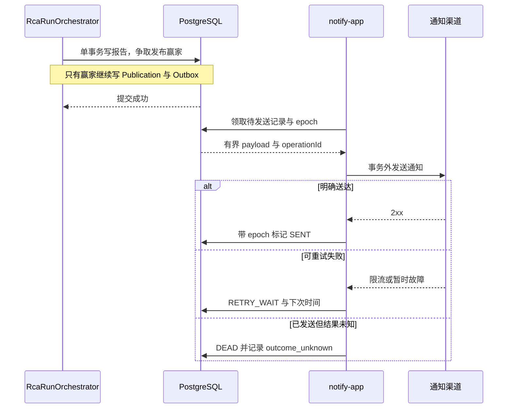

图中结果未知时不自动重发，是因为接收方可能已经处理，只是响应丢失。当前 `FencedNotifyExecutor` 将该分支记为 DEAD，并保留 `outcome_unknown` 原因供人工复核。不能照搬别处注释，把它描述成另一个已接通的 UNKNOWN 自动对账状态。operationId 有助于检测和对账，但只有渠道实际支持并正确使用幂等键，才可能进一步减少外部重复。

### 4. 通知失败应该重做调查吗

通常不应该。调查产物已经保存，通知暂时限流只需要重试发送。当前 429 进入退避而不消耗普通失败尝试次数；可重试服务故障消耗次数，耗尽则 DEAD；永久拒绝直接 DEAD。

这也带来一个待优化点：持续 429 如果没有总等待期限，可以长期占据待发送工作。除了次数预算，还应有最大投递年龄与人工升级条件。

Publication 是渠道结果的聚合。当前通知执行代码说明“任一渠道 SENT 即可把 Publication 视为 SENT”，因此它不能被解释为所有渠道都已经送达。若业务要求关键渠道必须成功，就需要明确 required channel 规则，并修改聚合语义与界面文案。

代码依据：[通知生产者][S33]、[带栅栏发送执行器][S34]。

## 十一、评测：怎样证明这个调查系统值得信任

### 1. 为什么不能只挑一条“答得很好”的告警展示

一份 checkout 告警被正确解释，证明这一份输入下出现过一个好结果，不证明换一段时间、少一个数据源、换一个版本仍然可靠。尤其模型会变化，采样会有随机性，工具数据也会变化。

因此需要固定评测案例、明确期望结果与输入范围，记录使用的配置、模型、工具和采样参数。案例来自项目真实告警与故障场景，不能拿其他领域的通用问答准确率替代告警调查效果。

一个基本实验应包含：发生了什么故障、预期出现哪些症状、正确根因是什么、哪些信息可以提供给系统、哪部分作为独立答案保存。若把故障注入参数直接放进模型输入，然后发现它答对了，就没有真正验证调查能力。

### 2. 为什么至少看六个维度

当前 `SixDimEvaluator` 把结果拆成六维，保存原始计数与轨迹引用，不直接压成一个总分。

| 维度 | 要回答的问题 | 当前代码中的观测示例 |
|---|---|---|
| 结果 | 根因与症状是否判断正确 | TP/FP/FN、根因命中、UNRESOLVED |
| 过程 | 是否绕圈、错误是否集中 | 等价工具调用重复次数、错误次数 |
| 工具 | 是否使用真实注册能力 | 已注册、幻觉工具、被拒调用 |
| 成本 | 完成调查花了多少资源 | token、延迟、usage 缺失标记 |
| 协作 | 结构化判断怎样分布 | TRUE/FALSE/UNKNOWN 断言计数 |
| 安全 | 是否碰到了不该执行的路径 | 策略拒绝、红队案例标记 |

六维的好处是不会用“根因答对”掩盖大量越权尝试或过高成本。但当前协作维主要统计断言状态，不等于完整测出了协作增益；安全维的一些拒绝计数也不等于所有越权行为都被观察到。评测字段覆盖范围必须逐步扩大，不能被一个宏大的维度名称误导。

### 3. 为什么未知不能一律当正确，也不能一律当错误

数据确实不足时输出 UNKNOWN，是诚实行为；数据充分时永远输出 UNKNOWN，则没有调查价值。如果评分只奖励“不说错”，系统可能靠沉默拿高分。

所以需要同时关注错误断言、漏掉的症状、根因命中与未解决比例。项目结果评测中有未解决与沉默惩罚相关输入输出，说明它没有仅用“文本看起来合理”评估。具体阈值应该按业务代价决定：错误根因可能让值班人员走错方向，适度保留未知有时更安全，但大部分告警都未知也不满足效率目标。

### 4. 为什么新旧版本要在同一批输入上配对比较

今天 checkout 只有轻微抖动，明天有复杂的依赖故障，不能直接拿两天准确率之差当版本提升。配对比较让新旧版本面对相同案例或冻结证据，减少输入难度差异。

同一事故重试十次也不是十个独立案例。应按事故或输入来源簇组织统计，避免把重复通知和重复运行当成新样本。置信区间表示我们对估计差异的不确定范围；样本太少时应给 INCONCLUSIVE，而不是“暂时没发现问题，所以全量上线”。

当前 QualityGate 先看安全，再看独立样本与统计充分性，再看配对差异下界，之后检查延迟、token 与工具错误率，通过后仅给 `ELIGIBLE_FOR_CANARY`。注意当前方法消费一个 `StatsResult` 的区间，不应仅凭注释把它扩写成“六维所有关键分层都已独立形成置信区间”。

### 5. 固定回放与线上影子为什么都需要

固定回放适合比较逻辑变化，因为输入尽量不变。回放没有命中的工具动作，应明确 REPLAY_MISS，不能为了让实验继续而偷偷查询正在变化的线上数据。

线上影子适合观察真实输入分布与工具可用性，但会增加查询和模型成本，而且没有标准答案时只能记录两者的 disagreement，即分歧，不能直接宣布谁正确。影子结果还应与生产通知隔离，否则一次真实告警可能收到两份互相冲突的候选消息。

### 6. 评测到灰度的时序

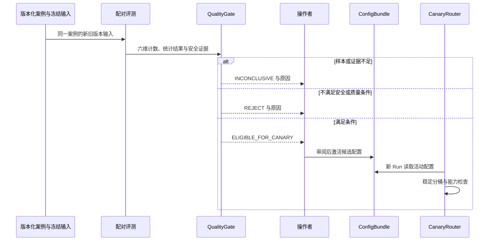

这张图强调“评测通过”只是获得进入小流量试用的资格，操作者仍要明确激活配置。新 Run 的路由决定需要记录比例、桶位和配置摘要，以便后续对账。线上窗口还需检验安全、运行与成本，不应把离线分数直接当成全量生产稳定性的保证。

代码依据：[六维评分][S35]、[质量门][S36]、[灰度窗口评估][S37]。

## 十二、监控与运维：告警系统自己失效，谁来发现

### 1. 为什么“进程活着”不足以证明系统正常

HTTP 健康检查返回成功时，Inbox 可能已经积压，Worker 可能长期拿不到槽位，Native 数据源可能连续超时，报告也可能全部卡在通知退避中。因此至少分开存活性、依赖就绪和业务推进情况。

当前 `AlertMetrics` 暴露带 engine 维度的任务决策、尝试验证状态、尝试延迟，以及引擎对照、历史 fallback/shadow 等指标方法；结构化日志包含 run/task/attempt 等关联身份，便于定位某一次调查。进一步需要关注 Inbox 最老等待时间、READY 最老等待时间、租约回收频率、槽位占用、工具超时、usage 缺失与通知积压。

这里的列表是完整监控建议，不代表当前每个指标都已装配和采集。判断是否真正具备监控能力，要核对指标生产点、采集配置、规则和通知目标四段，不能只看到一个仪表盘标题。

### 2. 为什么不能把每个 Run ID 放进 Prometheus 标签

每个新 Run 都有不同 UUID。如果 UUID 成为指标 label，每次调查可能产生新的时间序列，百万告警下指标系统先被自身观测数据压垮。

因此聚合指标适合用有限集合，如结果类型和验证状态；高基数的 runId 应放日志、事件和追踪上下文中。当前主要调用点使用封闭结果枚举，`AlertMetrics` 本身的 `safe()` 主要截断长度，并不是一个能拒绝所有未知枚举值的完整白名单校验器；后续新调用方仍须遵守这个约束。

### 3. 为什么控制面告警不能再次交给自己无限调查

假设模型依赖不可用触发告警，告警系统又为这个告警调用同一个不可用模型，于是产生更多错误和新告警。这是控制面的反馈放大。

`ControlAlertRouter` 在入口识别控制面声明，通过独立身份、receiver 白名单和 monitoring_scope 白名单后，直接保存已处理的审计记录，并输出 `CONTROL_ALERT_ONCALL` 结构化事件，不创建业务 Incident/Run。

当前这段代码的“直达值班”落点是结构化事件；本次不能证明它已经通过独立短信或其他渠道送达人。因此还要核实日志事件到值班通知的外部接线，不能在架构讲解里直接把日志输出写成“值班人员必然收到”。

### 4. 页面为什么用事件游标，而不是把 WebSocket 当成事实库

浏览器断线后，连接中传过的信息可能已经丢失。当前事件读取与 SSE 设计从持久化事件表取数，使用 seq 和 Last-Event-ID 续传；发现缺口时要求客户端 resync，全量对账。

SSE 适合服务端持续向页面发送进度，用户操作仍通过 HTTP 命令进入有身份和幂等控制的服务。选择它的主要理由是需求以单向进度为主，协议和重连方式较直接。WebSocket 适合双向实时交互，但不能替代事件落库、游标补拉和权限检查。

当前流票在 `SseStreamService` 的内存 Map 中，绑定 Run、主体与 TTL，且单次消费。多副本时签票请求和消费请求落到不同实例，可能查不到票；这是一处需要先处理的横向扩容条件。初期可使用会话亲和或重新签票，确需跨实例票据时再选择共享存储或经过安全设计的签名票方案。

代码依据：[指标实现][S38]、[控制面分流][S39]、[SSE 服务][S40]。

### 5. 人工操作为什么也是状态机

人工接手并不意味着可以随意修改数据库。`OperatorCaseStateMachine` 把 OPEN、ACKED、RESOLVED 与 CLAIM、ACK、ASSIGN、RESOLVE、ESCALATE、MERGE 等动作关联，保留规则名便于审计。

这里的人工 case 与来源 Incident 不是同一个对象。人确认“我接手这个问题”不等于来源告警已经恢复；人工 case 已关闭后收到同类信息，当前 MERGE 可以留下聚合记录而不自动复活原 case。revision 可用于避免两个人同时操作时静默覆盖。

这个层解决最后一公里：系统无法确认或自动恢复时，谁负责、采取了什么动作、为什么结束处理。它应与自动调查共同留下记录，而不是让人在聊天窗口里处理后数据库永远不知道发生过什么。

## 十三、技术选型：为什么现在使用 PostgreSQL，而没有先加 RabbitMQ、Redis

### 1. 先确认这条链路真正需要哪种一致性

当前核心操作不是单独“传递一条消息”，而是“把事件归到事故，必要时创建 Run 和 Task，并且保证这些内部事实一致”。PostgreSQL 已经保存这些数据，因此把任务和 Inbox 一起放在其中，可以使用本地事务和约束完成原子变更。

这就是当前选择的主要理由：减少跨系统一致性边界，先把业务语义做对。不是断言 PostgreSQL 比所有队列都快，也不是证明它能承担无限规模。

### 2. 为什么不先用 RabbitMQ

RabbitMQ 的优势是真正的消息投递、消费者确认、消息路由与消费者解耦。当很多独立消费者订阅告警、消息路由复杂，或入口需要与业务数据库故障域隔离时，它可能很合适。官方将 publisher confirms 与 consumer acknowledgements 区分，分别对应发布方到 broker、broker 到消费者的确认；它们不自动覆盖应用数据库事务。[RabbitMQ 确认机制](https://www.rabbitmq.com/docs/confirms)。

把它加入本项目后，会立即出现两个写入点：数据库记录和 broker 消息。数据库提交成功而发消息失败，怎么办？消息已发而数据库回滚，怎么办？通常仍需 Outbox、重发和消费者幂等。broker 提供的可靠投递能力有价值，但没有让 Incident/Run 的业务一致性问题消失。确认丢失也可能导致重传与重复消息，应用仍需处理重复。[RabbitMQ 可靠性说明](https://www.rabbitmq.com/docs/reliability)。

所以当前先用 PG 是合理起点。等压测证明数据库入口写入和任务扫描已经成为主要瓶颈，或业务明确需要多消费者路由、独立耐久缓冲，再引入消息中间件才有明确收益。升级时应保留原有事件幂等键和状态机，而不是因为换了 broker 就删除所有一致性防线。

### 3. 为什么不先用 Redis

Redis 不是只能做缓存。Redis Streams 有消费者组、确认和 pending entries，能够支持待处理消息跟踪；Pub/Sub 则是另一种实时分发机制，不提供同样的持久处理承诺。不能用“Redis 会丢消息”把二者混在一起否定。[Redis Streams 与消费者组](https://redis.io/docs/latest/develop/use-cases/streaming/)。

但即使用 Streams 保存任务，本项目的 Incident、Run、证据和发布记录仍在 PostgreSQL。一次状态更新与一次 XACK 跨两个系统，不再天然是单个数据库事务。持久化还要选 RDB/AOF 与 fsync 策略，并理解性能和故障丢失窗口之间的取舍；例如官方说明 AOF 每秒同步策略存在最近约一秒写入可能丢失的窗口。[Redis 持久化说明](https://redis.io/docs/latest/operate/oss_and_stack/management/persistence/)。

Redis 更可能在后续成为可丢失缓存、跨实例短期票据、已定义故障策略的限流状态存储。要先明确哪些数据丢失后可以重建，哪些是不可丢的业务权威事实。不要为了“查询快”把任务执行权改成一把没有下游 fencing 的 Redis 锁，也不要让数据库和 Redis 同时各自宣布某个 Run 的最终状态。

### 4. 三种选择的代价比较

| 关注点 | 当前 PG 队列表 | 引入 RabbitMQ | 引入 Redis Streams |
|---|---|---|---|
| 业务状态与任务原子提交 | 可在同一 PG 事务中完成 | 仍需处理 DB 与 broker 双写 | 仍需处理 DB 与 Stream 双写 |
| 专门的消息路由与消费者生态 | 需应用自行实现相关能力 | 明显优势 | 消费者组等能力可用 |
| 运维组件数 | 已有数据库即可起步 | 增加 broker 运维 | 增加 Redis 运维与持久化管理 |
| 过期恢复与幂等 | 当前代码自己管理 | 消息重投仍需业务幂等 | Pending 接管仍需业务幂等 |
| 大规模吞吐 | 需测 SQL、WAL、索引与 IO | 可把传输压力分离，RCA 仍需扩容 | 可分担分发压力，业务事务仍存在 |
| 最重要的选择前提 | 单库事务价值高，规模可控 | 路由、扇出或故障域隔离需求明确 | 内存成本可接受，数据与持久化语义明确 |

这张表表达适配本项目的工程判断，不提供通用性能排名。任何“达到一百万条就必须用某产品”的阈值都缺少时间窗口、数据大小和机器规格，无法指导真实选型。

### 5. 为什么没有一开始就引入向量库、Kubernetes 和完整工作流平台

本次单次告警的核心查询围绕稳定业务身份、时间范围和明确证据引用，普通关系查询已经可以覆盖主要身份管理。跨历史事故做语义检索有价值时，再评估向量检索；相似事故只能作为线索，不能替代这次事故的实时证据。

Compose 对当前少量服务的部署较直接，但不自动提供跨主机调度和故障迁移；随着多机高可用、滚动升级和弹性管理成为实际需求，再评估更完整的编排系统。Kubernetes 也不会修复 annotations 去重遗漏或恢复事件被背压挡住的问题。

自研任务状态机让当前租约、generation 和报告提交规则更贴合业务，代价是恢复与演进逻辑都由团队负责。若流程显著增多、长时间等待与人工审批成为常态，应比较成熟持久工作流系统的迁移成本与长期维护收益。本文没有将尚未引入的平台作为当前能力写入架构图。

## 十四、面对 100 万告警，当前系统究竟能不能撑住

### 1. 先给结论，再拆问题

**现有代码和本次读取的证据不足以证明“百万告警全链路可支撑”；按当前默认并发和执行方式，不能承诺对 100 万份独立事故做及时、完整的 RCA。** 大量重复告警被合并后可能只触发很少调查，但入口存储和投影负担仍需要实测。

“100 万”至少有四种含义：数据库累计保存 100 万条历史记录；一天收到 100 万条；一分钟爆发 100 万条；同时产生 100 万个必须独立调查的事故。它们的容量要求差别巨大。

### 2. 把总量变成速率，才知道压力在哪

| 场景 | 平均单条告警速率 | 仅按每组恰好 200 条计算的理论最少组数 |
|---|---:|---:|
| 100 万条 / 天 | 约 11.57 条/秒 | 总计 5,000 组，平均约 0.058 组/秒 |
| 100 万条 / 小时 | 约 277.78 条/秒 | 总计 5,000 组，平均约 1.39 组/秒 |
| 100 万条 / 分钟 | 约 16,666.67 条/秒 | 总计 5,000 组，平均约 83.33 组/秒 |

这些是算术，不是压测结果。真实组通常受 group_by、发送节奏和 body 大小限制，未必装满 200 条。若平均一组只有一条，HTTP 请求数将与告警条数同量级。512 KiB 限额也意味着 200 条大告警未必能放进一组。

一天平均 11.57 条/秒听起来不高，也不能据此宣布支持：它可能集中在故障发生后的几十秒，并同时争抢同一 Incident 行锁。

### 3. 接入吞吐与 RCA 吞吐必须分开计算

设原始告警到达率为 λa，经过聚合与策略后进入独立 RCA 的有效比例为 p，那么调查需求速率约为 λr = λa × p。设有效并发为 C，平均每次调查占用时间为 T 秒，则理想调查吞吐上界约为 μ = C / T。

λr 长期大于 μ，积压就会增长。队列能保存待办，不能让 μ 自动变大。

**纯假设示算：**如果每次调查平均 30 秒，两个有效并发理论上每秒完成 0.0667 次，一天约 5,760 次。100 万次独立调查需要约 173.6 天，而且尚未计入重试、限流、排队和宕机。如果一天 100 万条原始告警经合并后仅 0.1% 触发独立调查，即 1,000 次，这个算术模型下才可能落在该调查吞吐以内，仍需验证峰值和延迟目标。

这里的“两并发”还是上限假设。V7 有两个槽位，但当前一个 `RcaWorker` 实例启动一条循环，并同步运行 `runOneCycle()`。一个实例并不会因为库里有两个槽位，就自动并行执行两个 Run。有效 C 受工作循环数量、槽位、调用池、连接与上游额度共同限制。

### 4. 存储也要算多份账

继续使用明确假设：若一条原始告警平均占 2 KiB，100 万条仅原始内容就约 1.91 GiB；实际还有 Inbox 组开销、拆分 Event、索引、WAL、历史版本、备份和查询结果。若每份独立调查证据平均 50 KiB，100 万份调查又约 47.68 GiB，仅为证据 payload 的量级估算。

这两个估算都不是当前真实平均大小，目的在于说明“数据库能放 100 万行”不是完整容量答案。必须用真实 payload 测量每类表与索引增长，以及高峰期间 WAL、磁盘空余和归档吞吐。

仓库 2026-09-05 的历史内存基线记录过 4 vCPU、约 7.5 GiB 内存机器以及磁盘剩余约 16G，但它是当日特定部署下的读数，不是今天的资源状态，更不是百万告警压力测试。本次没有连接该服务器重新测量。[历史容量记录][S41]。

### 5. 当前可能先碰到哪些瓶颈

| 层次 | 源码可见的约束或风险 | 为什么百万规模会放大 |
|---|---|---|
| 入口 | byte[] 接收与 JSON 解析，组大小限制 | 大量同时请求放大瞬时内存与 CPU |
| 持久化 | 原始组先落库，软背压在后面 | 保护模型不等于保护入口磁盘与 WAL |
| 投影 | 每组计数，逐条 SQL，同 key 行锁 | 热点事故会把并发压回串行 |
| 背压 | 活跃数与排队数，所有事件先受限 | resolved 可能也被挡住，影响积压收敛 |
| 调度 | 两槽初值，单实例单循环 | 增线程前已存在有效并发上限 |
| Native | 顺序取证，部分来源为 fixture | 既有时延上限，也有真实能力缺口 |
| 上游模型 | 时延、token、账户限额 | 总量远比 HTTP 接收速度昂贵 |
| 数据生命周期 | 当前分区迁移针对 rca_event | 不能自动减轻全部告警与证据表增长 |
| 通知 | 渠道限流与未知发送结果 | 大量报告仍可能无法及时交付 |

V28 对 `rca_event` 建立按月分区，不表示 `alert_event/alert_inbox` 等所有表都已经按月分区。扩容要逐表看实际访问模式，不能用“一处有分区”概括全库容量治理。

### 6. 怎么做一份可信的百万告警验收

先分三类实验，防止把不同阶段的结果混在一起：入口与投影压测、带固定耗时执行器的调度压测、受预算约束的真实模型端到端测试。用假执行器可以隔离数据库和调度瓶颈，但不能拿它的每秒完成数当作真实模型成绩。

输入至少覆盖：高重复同一事故、多个独立事故、同 key 热点、firing/resolved 交错、超大标签、普通与高优先级混合、截断组。故障注入至少覆盖：数据库短暂不可用、Worker 中断、旧 epoch 返回、工具超时、通知 429、发送结果未知。

验收同时观察接收吞吐和丢失情况、投影延迟、最老排队年龄、RCA 完成延迟分位数、积压恢复时间、重复 Run/报告数量、恢复通知收敛、数据库资源、模型成本和通知送达。P95/P99 表示 95%/99% 的样本延迟不超过相应值，比平均延迟更能揭示少部分告警长期等待。

通过标准必须在实验前约定。可以把“已返回 202 的合法组在恢复后均可对账”作为完整性要求，把“旧 epoch 不能形成有效报告”作为一致性要求；而具体每秒吞吐、可接受等待时长和预算值，应按真实业务承诺填写。本次没有执行这类负载，也不会把计算出的数字写成实测。

## 十五、项目还有哪些优化点：从哪里改，为什么改，怎样证明改对了

这一章讨论后续改造，本文交付本身不修改应用逻辑。优先级依据影响范围与依赖关系，不是按技术听起来是否先进排序。标注“代码可确认”表示可从本次读取的实现推出；标注“需验证”表示还需要真实数据库、运行配置或故障实验才能确定严重程度。

### 1. 优先修复背压对恢复事件的阻塞

**问题与依据：代码可确认。** `IncidentProjector.project()` 先执行 backlog 判定，再执行单条投影。resolved、重复 firing、新事故进入相同背压分支。活跃 Incident 太多时，负责减少活跃数的恢复事件也可能无法及时生效。

**怎么改：**把“更新已知业务事实”和“准入新的昂贵调查”拆开。经过身份与结构校验的 resolved 应优先完成去重、时间守卫与事故状态更新；重复通知只做必要合并；只有新建调查 Run/Task 的部分受 RCA admission 限制。若数据库本身过载，则由独立入口容量策略处理，不把模型积压与数据库写入混成一条条件。

第一步可以继续复用 PG 和现有表，调整判定位置并保留决定原因，无需先引入新队列。更严格的容量控制再使用可原子预留的 admission 计数或槽位。

**代价：**不能再用一个简单的 immediate/deferred 总数概括所有动作；需要说明“事实已更新，但调查尚未准入”，并确认该状态可恢复、可审计。

**怎么验证：**制造超过阈值的活跃事故后注入对应 resolved，确认恢复状态仍在约定时间内收敛；同时持续输入新 firing，确认新 Run 数仍受限。重放整组时不得重复创建 Run。

### 2. 修复双摘要与事件去重之间的语义缺口

**问题与依据：代码可确认。** 静态 annotations 参与 investigationHash，却不参与 payloadHash；duplicate 分支没有先比较新调查材料。这会让“材料变了，但事件身份没变”的通知被当成完全重复。

**怎么改：**先明确事件语义。如果 annotations 更新算新事实，应把版本化规范内容纳入事件身份；如果仍算重复通知，则在重复分支独立检查 investigationHash，允许更新 pending 材料，但保持 distinctEventCount 的语义不变。不能为了触发重查就随意递增所有计数。

还应升级 key/hash 的规范编码。当前身份方法用 `|`、`;`、`=` 拼接标签，值里也可能含这些字符。使用带字段边界的 canonical JSON 或明确长度前缀，可减少不同字段组合映射成同一个规范字符串的风险。规范版本必须进入身份协议，不能部署后直接重算全部历史 key，导致旧事故变成新事故。

**代价：**需要新旧身份兼容或迁移映射。保留旧 key、增加新规范版本，通常比一次性改写所有历史引用更可控。

**怎么验证：**labels 重排不改摘要；仅动态数值改变不重查；静态材料改变触发一次 pending/rerun；包含分隔符的标签不同组合仍可区分；升级期间不会把同一在途事故拆成两份。

### 3. 让 Run 的配置摘要真正对应执行的提案

**问题与依据：代码可确认。** Native 执行器先从 Run 路由读取 configDigest，但 `proposalOf()` 又通过 `activeDigest()` 查询当前活动配置。在 Run 排队期间切换 bundle，执行时可能读取新提案，却给产物标记旧 Run 的配置摘要。

**怎么改：**`proposalOf` 显式接收 Run 已固定的 digest，并按该 digest 读取 immutable bundle。所有会影响结果的配置都从这个执行快照派生，包括提案、工具版本、查询参数、归并策略和预算。活动指针只在新 Run 路由时使用。

**为什么优先做：**配置身份如果不可信，后续回放、灰度比较、事故复盘都缺少可靠基准。先加再多评测样本，也可能不知道样本到底运行了哪个版本。

**代价：**旧 bundle 必须在仍有在途和可回放 Run 引用时保留，不能一激活新版本就删除旧内容。

**怎么验证：**创建绑定 A 的 Run，让它排队；激活 B；再执行旧 Run，确认仍使用 A 的提案与策略。新 Run 才使用 B。A 缺失时明确失败，不能偷偷读 B 兜底。

### 4. 补齐真实证据到断言的转换，不把 fixture 当生产能力

**问题与依据：代码可确认。** 当前日志与变更装配是 fixture；取证基座只产生原始数据，未给 NativeRcaAgent 所需的 claim 注记。还有一个摘要语义问题：driver 把 configDigest 作为取证上下文的 `inputSnapshotDigest` 传入，随后冻结生成真正证据 snapshotDigest；NativeRcaAgent 会排除声明了不同输入快照的证据。

**怎么改：**首先分别命名配置摘要、查询上下文摘要和证据快照摘要，禁止用同一个字符串字段兼任。证据属于查询上下文，冻结快照记录成员，断言再明确基于哪份冻结快照推导，避免“尚未取得证据，就必须拥有最终证据快照”的循环定义。

其次实现真实日志与变更适配器，保留测试 profile 下的 fixture。再增加明确的断言提炼步骤：可以从确定的指标规则开始，也可以在受控环境接入模型，但输出必须带命题范围、时间窗、证据引用和未知状态。不要直接把整段日志 copy 到 `claim_status=TRUE`。

**代价：**真实数据源涉及查询权限、限额、时间对齐与响应 schema；接入模型提炼又增加预算与非确定性。建议先支持项目已有、可验证的告警场景，再扩大覆盖。

**怎么验证：**用独立维护的故障真值检验根因，而不是把答案塞进 fixture 再判成功；工具无数据时仍输出未知；不同 Run/时间窗的证据不能交叉引用；相同冻结输入重复归并的结构化结果稳定。

### 5. 把“能编译 DAG”变成“能可靠执行 DAG”

**问题与依据：代码可确认。** PlanCompiler 允许有依赖的多层任务图，Native driver 却只遍历一次 `findByRunId` 列表。若后继当时仍 BLOCKED，驱动会跳过；最后 advance 即使把它变为 READY，也没有下一轮循环继续执行。此外当前 RUNNING 孤儿缺少完整恢复接管。

**怎么改有两条可选路径：**

- 短期只需要当前三种独立取证时，收紧提案契约，只允许当前 driver 真正支持的图形与任务键，明确拒绝暂不支持的依赖深度。先保证“接受的提案一定能执行”。
- 确实需要多层图时，复用 DagPromoter 建立有界循环：推进 → 取得 READY 集 → 执行受限数量任务 → 记录终态 → 再推进。结束条件是全部终态、预算/期限耗尽、取消或无可推进工作；绝不能无界轮询。

并行可以在这之后加入。起初仍由 driver 统一拥有 Run 执行权，子任务采用自己的尝试身份和状态条件；以后若改成通用 Worker 领取子任务，则必须一起修改领取过滤、租约与恢复契约，避免两套执行者同时驱动。

**代价：**真正的子任务并发会扩大数据源调用压力，预算需从“每个 Agent 自己看剩余量”升级为共享原子约束。恢复逻辑也需要明确已完成证据是否复用、失败节点是否可重试。

**怎么验证：**按随机任务存储顺序执行两层依赖图；前置失败应终结后继而非永久 BLOCKED；在每次状态变化前后中断进程，恢复后没有双份有效结果；无数据、取消和预算耗尽都能收尾。

### 6. 确保预算、限流和死循环保护真的拦在调用之前

**问题与依据：部分接线缺口可确认，部署预算效果需验证。** 存在预算 Gate、账本和 DoomLoopGuard，但不能确认覆盖当前全部调用；LiteLLM 费率仍是占位。

**怎么改：**建立一张“调用点—前置预算—权限—超时—结果账本”映射表，从 Native 的实际工具调用核对；若未来恢复外部模型路径，再独立核对实际代理，不能假定一个 Java 类覆盖远端服务。每条真实触网路径都要能证明预算拒绝时零触网，结果未知时不虚构免费，usage 缺失时禁止按可靠低成本进入放量评测。

把费率、模型与 provider 身份一起版本化。死循环状态若需要跨重启保持，应从持久化事件或工具账本重建，或保存必要计数，并给状态清理策略；不要让内存 Map 随运行时间无限增长。

**代价：**前置预留增加数据库操作，且保守估值可能降低资源利用率。可以通过合适的预留粒度减少开销，但不能省掉身份和结算语义。

**怎么验证：**在预留临界值启动并发调用，证明总额不会被各个调用共同透支；注入发送后超时，确认 provisional 保留；重复等价无进展调用达到阈值后，外部调用计数不再增加；改配置费率后的账单可重算对账。

### 7. 校准优先级与公平性，让重要告警真的先被处理

**问题与依据：代码可确认。** 当前示例规则输出 page/ticket，SlaPolicy 只特殊识别 critical/warning，其他值都按 info。page 并不会自然获得 critical 的调度优先级。

**怎么改：**在清晰的归一化层定义映射，或统一告警来源契约；保留原始 severity 与归一化值，便于审计。映射必须由业务确认严重程度，不能为了让测试通过随意把所有未知值提到最高优先级。

SLA 与执行 deadline 也应分开。当前 deadline_at 用于等待超时后的排序晋升，不应顺手被某个新组件当成“到时必须杀掉调查”的执行截止时间。可拆出排队 SLA 与执行 deadline，分别解释与测试。

进一步需要控制租户公平性、热点服务占用和长期低优先级等待。先观察各级最老排队年龄，再决定是否需要保留高优先级容量、分层队列或加权公平调度。

**代价：**更复杂的排序会影响索引使用；严格优先与公平不能总是同时最大化，需要明确业务取舍。

**怎么验证：**混合 page/ticket 与归一化级别输入，检查实际 SQL 领取顺序；持续高优先级流量下测低优先级等待分布；退避结束后不错误继承旧等待超时资格。

### 8. 优化 PostgreSQL 投影吞吐，先测 SQL 再加组件

**问题与依据：执行结构可确认，瓶颈强度需测量。** 每组先计 active/queued，随后逐条进行查询、锁、写入与判断；同 Incident 行锁串行化。它有利于业务一致性，但大组和热点下可能成为主要耗时。

**怎么改：**先按实际 SQL 收集执行计划、锁等待、事务耗时与往返次数。可优先批量插入可独立的事件、预取不会破坏并发语义的数据，减少重复查询；大批处理必须控制事务时长，并采用固定锁顺序减少相反顺序处理多个事故时的死锁风险。

同 key 首见并发路径捕获 DuplicateKeyException 后重读，在真实 PG 事务里是否可继续，需专项验证：如果仓储用普通 INSERT 触发唯一冲突，同一事务可能已被标记失败；如果采用 ON CONFLICT 或适当保存点，则行为不同。不能只靠内存 fake 中 catch 后成功来证明数据库恢复正确。

计数若成为热点，可将软背压改成周期观测值配合高低水位，降低精确 count 频率；硬并发或硬预算仍必须使用原子约束，不能用估算替代。索引应按 READY/到期重试等实际条件设计，并验证是否真的减少排序与扫描。

**代价：**批量处理和缓存观测会降低代码直观性；过大的事务也可能降低并发。应逐项测量收益，避免把一次查询变少但锁持有变长误认为全面优化。

**怎么验证：**使用高重复、全新事故和同 key 热点三类数据对照，测有效投影条数/秒、P99、锁等待、WAL 增量及重复 Run 数；吞吐提升时业务结果必须保持一致。

### 9. 让多实例运行真正成立

**问题与依据：代码可确认。** 单 Worker 单循环、内存 SSE 票、内存熔断/限流状态，都说明“再起几个副本”需要配套检查。默认 owner 如不覆盖，也无法清楚区分多个实例。

**怎么改：**先为每个实例生成稳定可追踪的启动身份，明确 Worker 循环数与数据库槽位数。配置有界并发，保证增加副本不会突破全局 RCA 容量。SSE 票通过会话亲和、统一票服务或带正确验证语义的票据机制处理；共享限流确有必要时再选择 PG 或 Redis，避免每个副本都把本地额度当全局额度。

灰度 `countNativeDecisions()` 后再记新决定，是先读后写形状；若要把 max_native_runs 当严格硬上限，需要事务锁或原子预留保证，不能仅靠并发读到的相同旧计数。具体超发风险需在并发路由实验中确认。

**代价：**横向扩容会把本地简单状态变成分布式一致性问题，也会扩大连接池总连接数。12 个连接的实例起十份，不代表数据库默认能轻松承担 120 个活跃连接。

**怎么验证：**跨两个以上实例领取、续租、提交和重连；任何一份实例中断后系统继续推进；总并发、灰度硬上限与预算不随副本数偷偷倍增。

### 10. 把存储保留和恢复演练做成容量设计的一部分

**问题与依据：部分资产可确认，全量容量需测量。** 已有 rca_event 分区与归档相关组件，但原始组、告警事件、证据、工具账本仍需分别制定生命周期。历史内存健康无法代替磁盘增长测量。

**怎么改：**按表列出写入速度、典型行大小、查询条件、保留期和法律/事故保留例外。只对确有规模和按时间查询需求的表实施分区。归档先生成清单和摘要，验证可读取后再清理在线数据；被报告、评测或待处理事故引用的数据不能因年龄到期而直接删除。

数据库备份、产物存储与配置 bundle 必须一起考虑恢复。只恢复数据库但证据 artifact 已经消失，报告引用仍可能断裂。RPO 表示可接受丢失多长时间的数据，RTO 表示希望多久恢复服务，二者都需要演练结果支撑。

**代价：**归档占用 IO，分区维护涉及锁与索引，备份也有存储成本。安排资源窗口并监控实际耗时，避免清理任务在告警洪峰时争抢数据库。

**怎么验证：**在隔离环境恢复最近备份及引用产物，重放选定事故，能读出证据、配置和发布记录；分区切换期间不丢事件；证据引用不存在时明确报错，不默默展示空白。

### 11. 提高评测可信度，再谈扩大 Native 流量

**问题与依据：已有基础，覆盖深度仍有边界。** 当前协作维主要为断言计数，质量门消费的统计结果仍需要与真正关注的关键维度和分层对齐，真实数据源缺口也限制结论外推。

**怎么改：**增加证据引用有效性、无证据肯定断言率、跨来源独立性、缺源退化质量、恢复后误判等指标。把 dataset、case、采样参数、模型/provider、工具和策略全部纳入可复现身份。HOLDOUT 用于最终独立检验，不能反复读其答案调 prompt 后仍称独立测试。

对于未知故障，不只看根因命中，还要看是否诚实保留未知、是否给出可执行且不越权的下一步调查建议。语义分歧进入人工复核，复核结论经审核才能进入后续黄金案例，避免自动生成答案再用同一答案评价自己。

**代价：**标注和人工审阅需要时间，多个关键指标也会增加统计设计复杂度。先围绕当前已有的告警场景建立高质量案例，比追求一个巨大的弱标注数据集更有帮助。

**怎么验证：**故意注入无效引用、答案泄漏、重复样本和 usage 缺失，门禁应拒绝或给证据不足；同一报告在不同安全条件下不能靠质量分抵消违规。

### 12. 让监控形成闭环，让优化有可见结果

**问题与依据：部分监控已存在，完整送达闭环需验证。** 当前控制面路由输出结构化事件，SSE 和聚合指标也有实现，但不能仅靠这些证明值班人员一定及时发现问题。

**怎么改：**先把关键失败分类映射到行动：Inbox 最老年龄超阈值看投影；任务等待过长看槽位与上游；UNKNOWN 费用看对账；通知 DEAD 看渠道和人工复核。设置独立于 RCA 模型链路的值班出口，并定期做低频合成告警，验证从检测到交付每一段。

**代价：**合成告警过多会成为噪声，必须标注测试身份、独立路由，不污染在线评测与灰度晋升样本。监控系统自身也需要限额和保留策略。

**怎么验证：**分别让数据库、模型、通知渠道和日志投递链路失效，检查是否得到对应、可行动的告警；不要只验证 Prometheus 中存在一条 firing 规则。

### 13. 把引擎退场后的“只记录、不调查”变成可恢复的显式业务状态

**问题与依据：最新代码可确认。** M6-07 的铸造点对 HOLMES 路由意愿直接返回，保留告警事实和路由审计，但不创建 Run/Task。V35 为这类决策允许 `run_id=NULL`，避免引用从未创建的 Run。这个数据库修复已存在，不应再列作待完成事项。

尚需明确的是恢复语义：percent=0、Native 能力不足或放量停止后，哪些事故还欠一次调查？普通重复事件分支可能不会重新尝试铸造，仅靠“等待下一条告警”不能保证配置恢复后立即补查所有待调查事故。

**怎么改：**把“无需重查”和“需要调查但当前未准入”分开记录，可先利用现有事故/决策查询形成持久可重驱动的 admission 状态。恢复容量或激活配置后，由有界扫描补建 Run；必须以事故、generation、调查材料身份保证不会补建重复 Run。界面同时显示原因与最老等待时间。

**代价：**增加一次从待准入到正式任务的状态迁移，需要与事件去重、恢复通知和活跃 Run 唯一索引协作。不能简单遍历所有 FIRING 事故全量重查，否则一次配置变更可能瞬间制造调查洪峰。

**怎么验证：**配置为只记录状态时收到一批告警，恢复 Native 准入后不依赖新通知也能按限额补查；已经 resolved 的不补查；重复恢复动作不重复铸 Run。另行演练从制品恢复旧引擎，并把实际 RTO/RPO 与“改比例立即回退”的旧操作说明明确区分。

### 14. 哪些优化现在不应该抢先做

在 annotations 与配置身份问题尚未修复时，先引入跨事故“长期记忆”会把不可靠结论复用到更多调查。在预算与恢复尚未接牢时，让模型动态生成更多 Agent 会扩大失控面。在没有 SQL 和队列年龄数据时，先上 RabbitMQ 或 Redis 也可能只是转移积压位置。

优先顺序建议为：**事实正确性 → 执行与产物可恢复 → 预算和安全真实覆盖 → 真实数据与有效断言 → 有界并发与容量 → 更多自适应调查能力。** 每一项通过后再扩大流量，避免同时改变太多变量，出了问题却无法判断是哪一层引入。

## 十六、如果从零重新搭建，我会怎样一小步一小步完成

### 第一步：先证明业务异常真的能形成可核对告警

只打通 checkout 遥测、Prometheus 规则、Alertmanager 投递，记录 firing 与 resolved。验收是故障和恢复都能在规则与通知中找到对应，不引入模型。此时解决“知道发生异常”，新问题是收到的通知如何承担持久化责任。

### 第二步：只实现可靠接收和事故归并

加入身份校验、大小限制、Inbox、Event、Incident 与三种身份；处理重复、升级与乱序。验收是重复通知不会制造多个事故，恢复通知能关闭正确周期，返回 202 的组在重启后可继续处理。新问题是事故需要耗时调查，不能继续留在 HTTP 线程里。

### 第三步：建立最小异步执行控制面

加入 Run、driver Task、Attempt、租约、槽位、epoch 与短事务。先用固定延迟执行器验证恢复和收尾，不花模型费用。验收是在任一关键点中断进程后，不丢内部事实、不接受旧提交。新问题是可靠执行的任务还不会调查。

### 第四步：接入一条能提供价值的真实调查路径

从零演进时，可以先选现成调查引擎或一个明确的指标调查路径覆盖现有场景，记录真实输入与结果，强制结构校验；本项目历史选过 Holmes，最新阶段已经退场，当前继续建设应补强 Native。验收是能对实际业务告警产生有证据引用的候选报告；不能确认时保留未知。新问题是复杂调查需要更多数据，且费用、权限和循环开始变得难控。

### 第五步：把工具和预算边界做成硬约束

固定工具注册与版本、只读策略、参数契约、超时、结果大小、调用前预算与未知对账。验收包括零触网拒绝和失败分类。新问题是历史事实会变化，同一输入难以重放比较。

### 第六步：建立结构化证据与冻结快照

区分配置摘要、输入上下文与证据快照；固定来源和时间窗，保存可追溯引用。验收是相同输入身份可复现，跨代证据被拒绝。新问题是不同来源需要分工，并且可能冲突。

### 第七步：按实际依赖增加多 Agent

先接真实指标、日志与变更；图结构只支持执行器确实能处理的范围。再补断言提炼与确定性归并，逐步实现多层 DAG 与有界并行。验收是缺源、冲突、前置失败、孤儿任务都能解释与终结。新问题是报告生成后怎样可靠交付。

### 第八步：完成报告和通知两条状态轴

报告、Publication、Outbox 事务提交，通知独立发送，未知结果人工对账。验收是通知重试不重新调查，消息不会把候选结论写成已验证事实。新问题是版本变更能否可靠评判。

### 第九步：评测、灰度与监控一起建立

固定案例和采样指纹，配对评估；通过后小流量 Canary，记录配置与分桶。监控最老积压、成本和送达，控制面故障走独立出口。验收是错误版本会被挡住，小样本不会自动全量。新问题是业务规模增长。

### 第十步：用真实负载决定扩容路线

先修阻碍收敛的正确性问题，再测入口、投影、调度、模型、存储和通知各层。让证据决定增加 Worker、调 SQL、拆分存储、引入 broker 或跨主机编排。验收是容量目标、费用、恢复时间与业务一致性一起达标，而不是只有某个接口 QPS 提高。

## 十七、基础知识清单：每个知识点应该带着什么问题学

| 知识 | 在本项目中需要理解到什么程度 |
|---|---|
| HTTP、202/4xx/5xx | 能解释接收责任何时转移、什么错误值得重试 |
| JSON、schema | 能区分结构合法与业务判断正确 |
| Bearer、权限边界 | 能区分身份认证、工具授权与数据内容 |
| 指标、计数器、rate | 能理解 checkout 错误比例的来源 |
| SLI、SLO、错误预算 | 能解释为何选择多时间窗告警 |
| 标签与基数 | 能判断哪些标签适合聚合，哪些会制造大量序列 |
| 事务与原子性 | 能指出 Event/Incident/Run/Task 哪些写入必须一起提交 |
| 唯一约束、外键、CHECK | 能解释数据结构层面的最后防线 |
| 行锁、SKIP LOCKED | 能解释多消费者如何领取不同任务 |
| 幂等 | 能说明重复投递后哪些结果必须保持不变，哪些计数允许增长 |
| 租约、心跳、epoch | 能解释旧 Worker 为什么不能继续提交 |
| generation、时间水印 | 能区分新发生周期与旧通知迟到 |
| 状态机、守卫、动作 | 能从失败场景推导合法边与事务动作 |
| CAS、revision | 能解释“只在旧值符合预期时更新”如何阻止覆盖 |
| DAG、拓扑依赖 | 能解释 REQUIRED/OPTIONAL 和无环约束 |
| 线程、虚拟线程、连接池 | 能区分便宜的等待线程与有限的数据库连接 |
| Agent Loop、工具调用 | 能说明模型请求工具不等于工具已执行 |
| Harness | 能列出模型之外的执行、预算、证据与提交规则 |
| token、usage、费率 | 能区分预估资源、实测使用量和费用 |
| 熔断、退避、故障域 | 能选择等待、切换或终止，而不是无差别重试 |
| Snapshot、digest | 能解释输入身份、可复现性与防篡改边界 |
| Evidence、Claim | 能区分原始观察、命题判断与证据基础 |
| Inbox、Outbox | 能解释内部持久化与外部交互之间的失败缝隙 |
| UNKNOWN | 能解释为什么不确定结果不能被写成零成本失败 |
| Replay、Shadow、Canary | 能区分固定实验、旁路观察与真实小流量执行 |
| 配对实验、置信区间 | 能解释样本不足为什么必须保留不确定结论 |
| 吞吐、延迟、积压 | 能用到达率与处理率解释队列为何增长 |
| WAL、索引、分区、归档 | 能把百万条数据的容量账算到写入与保留 |
| RTO、RPO | 能为故障恢复承诺给出实测依据 |
| SSE、游标、resync | 能解释断线恢复为何依赖持久事件而非连接本身 |

## 十八、源码阅读索引与证据边界

建议沿“入口 → 投影 → Worker → 引擎 → 收尾 → 通知”读一遍，再回到状态机、工具与评测。源码注释有历史口径时，以方法体、SQL 与当前装配为准。下面链接用于核对，不要求第一次阅读就看完所有实现。

| 阅读段 | 重点入口 |
|---|---|
| 业务来源 | [checkout 规则][S01]、[Alertmanager][S02] |
| 接收与身份 | [Controller][S03]、[Intake][S04]、[IdentityFactory][S06] |
| 事故生命周期 | [IncidentProjector][S07]、[状态机][S22] |
| 执行权与收尾 | [RcaWorker][S16]、[Task SQL][S17]、[Orchestrator][S23] |
| 两种引擎 | [历史 Holmes 摘录][S11]、[当前 Native][S14] |
| 工具与证据 | [工具装配][S08]、[Gateway][S10]、[SnapshotBuilder][S25] |
| 多 Agent | [PlanCompiler][S26]、[Supervisor][S27]、[DagPromoter][S28]、[ClaimReducer][S29] |
| 预算和故障分类 | [RunBudgetGate][S19]、[DoomLoopGuard][S20]、[ModelRouter][S30] |
| 交付 | [ReportCompletedNotifier][S33]、[FencedNotifyExecutor][S34] |
| 评测与发布 | [SixDimEvaluator][S35]、[QualityGate][S36]、[CanaryWindowEvaluator][S37] |
| 运维可观测 | [AlertMetrics][S38]、[ControlAlertRouter][S39]、[SseStreamService][S40] |

仓库已有 `AlertStateMachineTest`、`AlertIdentityFactoryTest`、`NativeInvestigationExecutorTest`、`ClaimReducerTest`、`QualityGateTest` 和多项 PostgreSQL 集成测试，可继续核对具体分支。**测试文件存在不等于本次运行通过；本文没有重新执行应用测试、远端演练或百万告警压测。** 本次交付核查的是文档引用、代码事实、图文对应及容量计算，优化项仍需按各项验收方法实施验证。

全文最终要建立的一条业务理解是：checkout 异常先成为可追溯的告警事实，再成为有执行资格和资源限制的调查，调查结果必须绑定证据与版本，最后经独立交付链给到值班人员。每一层都保留自己能证明的事实，遇到不能证明的部分就明确保留未知；系统规模扩大时，这种边界比增加技术名词更重要。

[S01]: E:/kimiCode/deploy/alert/prometheus/rules/prometheus-rules-checkout.yml
[S02]: E:/kimiCode/deploy/alert/alertmanager/alertmanager.yml
[S03]: E:/kimiCode/control-app/src/main/java/com/objwww/pr/control/alert/interfaces/AlertWebhookController.java
[S04]: E:/kimiCode/control-app/src/main/java/com/objwww/pr/control/alert/application/AlertIntakeService.java
[S05]: E:/kimiCode/control-app/src/main/java/com/objwww/pr/control/infrastructure/config/AlertFlowConfig.java
[S06]: E:/kimiCode/control-app/src/main/java/com/objwww/pr/control/alert/domain/service/AlertIdentityFactory.java
[S07]: E:/kimiCode/control-app/src/main/java/com/objwww/pr/control/alert/application/IncidentProjector.java
[S08]: E:/kimiCode/control-app/src/main/java/com/objwww/pr/control/infrastructure/config/AlertAm4Config.java
[S09]: E:/kimiCode/control-app/src/main/java/com/objwww/pr/control/alert/application/agent/SingleToolEvidenceAgent.java
[S10]: E:/kimiCode/control-app/src/main/java/com/objwww/pr/control/alert/application/tool/ToolGateway.java
[S11]: E:/kimiCode/docs/告警系统-历史引擎源码摘录.md
[S12]: E:/kimiCode/docs/告警系统-历史引擎源码摘录.md
[S13]: E:/kimiCode/docs/告警系统-历史引擎源码摘录.md
[S14]: E:/kimiCode/control-app/src/main/java/com/objwww/pr/control/infrastructure/nativeexec/NativeInvestigationExecutor.java
[S15]: E:/kimiCode/control-app/src/main/java/com/objwww/pr/control/alert/application/agent/NativeRcaAgent.java
[S16]: E:/kimiCode/control-app/src/main/java/com/objwww/pr/control/alert/application/RcaWorker.java
[S17]: E:/kimiCode/control-app/src/main/java/com/objwww/pr/control/infrastructure/persistence/PostgresRcaTaskRepository.java
[S18]: E:/kimiCode/control-app/src/main/resources/db/migration/V7__am1_alert_domain.sql
[S19]: E:/kimiCode/control-app/src/main/java/com/objwww/pr/control/alert/application/RunBudgetGate.java
[S20]: E:/kimiCode/control-app/src/main/java/com/objwww/pr/control/alert/domain/budget/DoomLoopGuard.java
[S21]: E:/kimiCode/deploy/alert/litellm/config.yaml
[S22]: E:/kimiCode/control-app/src/main/java/com/objwww/pr/control/alert/domain/statemachine
[S23]: E:/kimiCode/control-app/src/main/java/com/objwww/pr/control/alert/application/RcaRunOrchestrator.java
[S24]: E:/kimiCode/control-app/src/test/java/com/objwww/pr/control/alert/domain/statemachine/AlertStateMachineTest.java
[S25]: E:/kimiCode/control-app/src/main/java/com/objwww/pr/control/alert/domain/evidence/EvidenceSnapshotBuilder.java
[S26]: E:/kimiCode/control-app/src/main/java/com/objwww/pr/control/alert/application/PlanCompiler.java
[S27]: E:/kimiCode/control-app/src/main/java/com/objwww/pr/control/alert/application/DeterministicSupervisor.java
[S28]: E:/kimiCode/control-app/src/main/java/com/objwww/pr/control/alert/domain/dag/DagPromoter.java
[S29]: E:/kimiCode/control-app/src/main/java/com/objwww/pr/control/alert/domain/claim/ClaimReducer.java
[S30]: E:/kimiCode/control-app/src/main/java/com/objwww/pr/control/domain/ai/ModelRouter.java
[S31]: E:/kimiCode/control-app/src/main/java/com/objwww/pr/control/release/application/CanaryRouter.java
[S32]: E:/kimiCode/docs/告警AM6-技术方案.md
[S33]: E:/kimiCode/control-app/src/main/java/com/objwww/pr/control/alert/application/ReportCompletedNotifier.java
[S34]: E:/kimiCode/notify-app/src/main/java/com/objwww/pr/notify/domain/service/FencedNotifyExecutor.java
[S35]: E:/kimiCode/control-app/src/main/java/com/objwww/pr/control/eval/domain/service/SixDimEvaluator.java
[S36]: E:/kimiCode/control-app/src/main/java/com/objwww/pr/control/eval/domain/service/QualityGate.java
[S37]: E:/kimiCode/control-app/src/main/java/com/objwww/pr/control/release/domain/service/CanaryWindowEvaluator.java
[S38]: E:/kimiCode/control-app/src/main/java/com/objwww/pr/control/infrastructure/observability/AlertMetrics.java
[S39]: E:/kimiCode/control-app/src/main/java/com/objwww/pr/control/alert/application/ControlAlertRouter.java
[S40]: E:/kimiCode/control-app/src/main/java/com/objwww/pr/control/alert/application/SseStreamService.java
[S41]: E:/kimiCode/docs/测试证据/容量/195-memory-baseline-20260905.md

[S42]: E:/kimiCode/control-app/src/main/java/com/objwww/pr/control/alert/application/FallbackService.java
