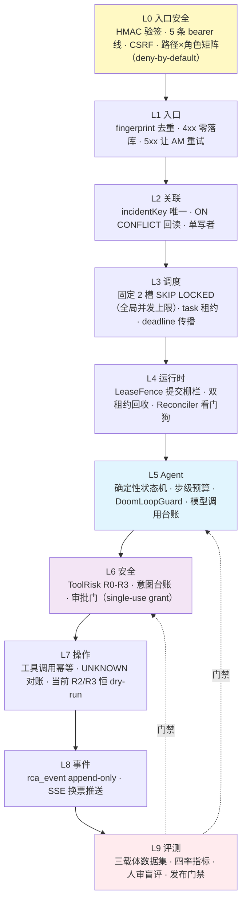
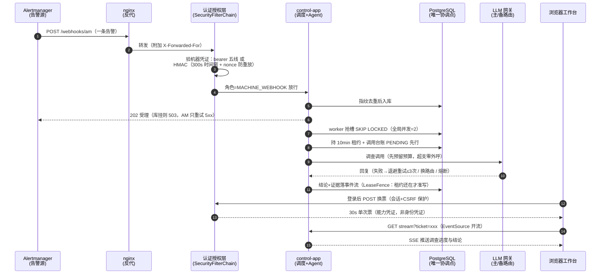
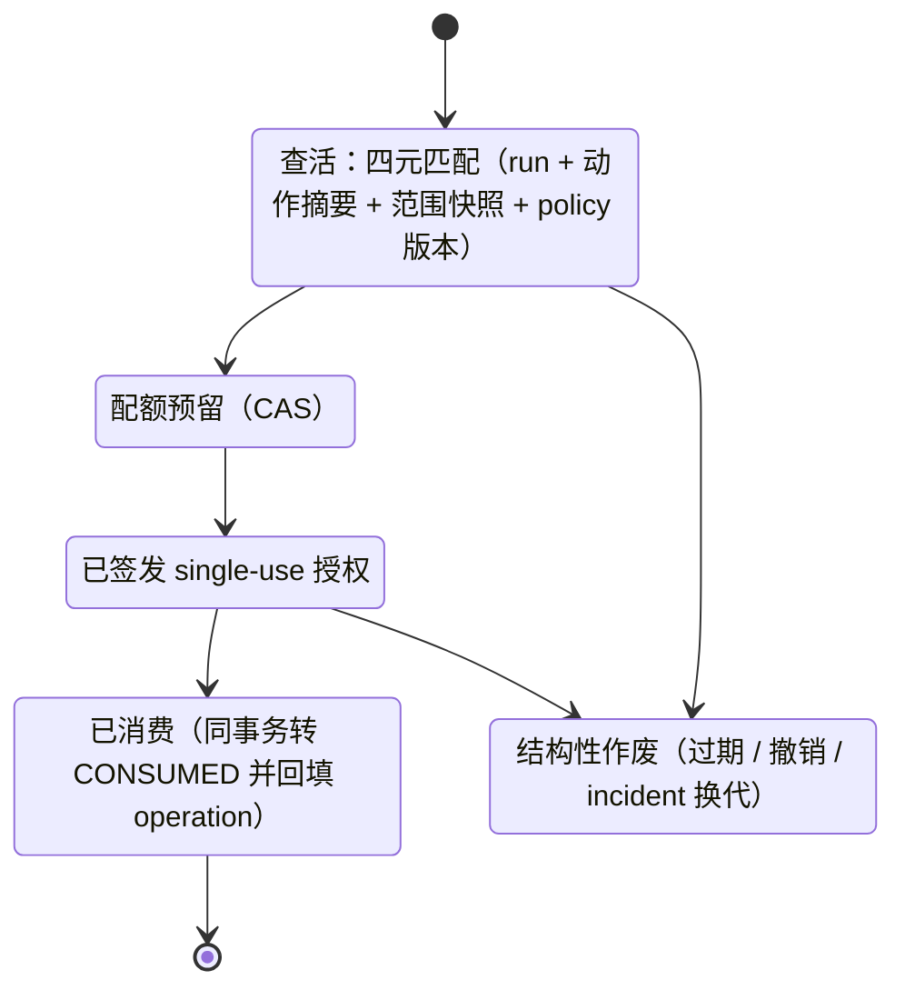

# 告警系统：授权与全链路可靠性——面试讲解文档 v1

日期：2026-09-19
性质：面试讲解底稿（全部结论以当前工作区源码为准，标注 文件:行号 可回查）
定位：覆盖问题清单——授权怎么做（并发/可靠性/重试/超时/流控/异常分类/兜底）、数据 ×10/×100、为什么不是更简单的 baseline、指标定义与复现、失败样本与下一轮、Demo→生产缺口（六步法）、STAR 自查、快问快答。

> **先说清一个名词**：本仓库里「授权」有两层，面试时要主动分开讲，混在一起必扣分：
> 1. **平台授权**（谁 能调哪个接口）：Spring Security 双半边认证 + deny-by-default 路径×角色矩阵 + HMAC/bearer/SSE 换票 + auth_event 审计。
> 2. **动作授权**（Agent 能不能对真实系统做操作）：ToolRisk 分级 + VALIDATE_ONLY 意图台账 + 审批门（single-use grant + CAS 消费），当前 Runner 恒 dry-run，真实执行是设计态（方案 Bv2 / Phase D）。

---

## 0. 讲解主线与问题索引（每个问题在哪一节）

讲解顺序（对应「业务场景→系统架构→核心模块→异常处理→性能优化→部署监控→业务结果」）：

| # | 问题 | 答案所在节 |
|---|------|-----------|
| 0 | 大白话 3 分钟版（面试官不全是技术） | §0.5 |
| 1 | 业务背景：谁用、为什么需要、原方案问题 | §1 S |
| 2 | 技术目标：核心指标和约束 | §2 T |
| 3 | 系统架构：模块划分和数据流 | §3（mermaid 架构图 + 读图） |
| 4 | 授权从一次请求详细走读 | §4（含全链路时序图 + 授权状态机） |
| 5 | 并发性 / 可靠性 / 重试 / 超时 / 流控 / 异常分类 / 兜底 | §4 各阶段 + §5 汇总表 |
| 6 | 数据放大 10×/100× | §6 |
| 7 | 为什么这个方案而不是更简单的 baseline | §7（逐层对比） |
| 8 | 指标怎么定义、能否复现 | §8 |
| 9 | 失败案例（技术/工程/产品三类，模板式：以为→发现→改动→结果） | §9 |
| 10 | Demo→生产缺什么（六步法） | §10 |
| 11 | 为什么用 LangGraph / 为什么不用纯 prompt / 幻觉 / 工具失败 / 用户量×10 / 数据权限 | §11 快问快答 |
| 12 | STAR 对照与常见错误自查 | §12 |

### 0.5 大白话版：3 分钟讲给非技术面试官

> **一句话**：服务器半夜报警时，先让 AI 像医生会诊一样把病查清楚、给出诊断报告；但 AI **没有处方权**——真要动手术（改生产配置），必须人类签字，而且签一次只能用一次。

三个类比讲完整个系统：

- **门禁（授权）**：机房有两种卡——人的工卡（账号密码登录）和机器的固定口令（带防伪签名，抄走了过几秒也失效，防止被人偷录后重放）。每个门只放行特定角色，刷错了进不去；**刷卡记录全部留底，而且留底系统坏了宁可让所有人进不了门，也不能没人看门**（fail-closed）。
- **会诊（AI 调查）**：AI 医生看化验单（日志、指标）做诊断。每次开检查单都有预算（最多抽 4 管血、最多问 8 轮）；查不出来就如实说「查不出，缺哪块证据」，**绝不允许编一个诊断交差**；每个结论都能倒回去看是根据哪张化验单得出来的（引用溯源）。
- **考卷（评测）**：它的 0.92 分是拿固定题库、固定随机种子考出来的——像标准化考试，可以重考复核、可以对比两次改革效果。但我们主动承认：目前考的是「打靶基础题」，真实路况的路考（留出集）还没考，这是下一轮的事。

**什么时候用哪个版本**：混合面试panel——先用本节类比定框架，对方点头再下钻 §4-§7 的技术细节；对方追问「具体怎么实现的」，才进代码级事实。失败案例（§9）天然是大白话，两类面试官都能讲。

---

**时序图怎么讲**（本文共三张 mermaid 图，均在图后附读图说明）：§3 架构图回答「分几层、每层管什么」；§4 时序图回答「一次请求先后经过谁、每步失败怎么办」；§4.6 状态机回答「一张授权票从生到死」。

---

---

## 1. S｜业务背景：为什么要做 + 不做会怎样（15%）

**谁用**：电商值班链路的两类用户——
- **值班工程师（人）**：浏览器访问告警工作台（alert-web SPA），看告警、看 AI 调查结论、批准/驳回 AI 提出的操作。
- **机器**：Alertmanager webhook 推告警、release 线发配置包、duty-adapter 回写通知台账、Prometheus 抓指标。

**原方案痛点（量化问题规模）**：
- 告警风暴下人工逐条排查：每次告警都要人拉日志、查指标、猜根因，单条处置以 10 分钟计；夜间告警依赖人在线。
- 直接接 LLM「一问一答」的方案有三个结构性问题：**不可靠**（幻觉结论无法溯源，没人敢照着操作）、**不可控**（模型自由发工具调用，出错就是生产事故）、**不可评估**（换个 prompt 性能就漂移，没有可复现的指标）。
- 不做会怎样：流程类排查仍依赖人工，响应慢且不可规模化；LLM 结论因无法溯源而不能进入生产操作链路，AI 只能当玩具。

**一句话版**：「告警重复触发、人工排查成本高；直接套 LLM 会产出没人敢用的不可溯源结论——所以做的是一个**证据闭环、动作受控、可评测回归**的调查 Agent，而不是一个聊天机器人。」

---

## 2. T｜目标：成功怎么定义（10%）

三条硬指标（定义见 §8，全部代码可复现）：
1. **北极星 `end_to_end_hit_rate`** = 根因正确的场景数 / 总场景数（不是「答对的学生答对率」，分母是全部场景——防止靠拒答刷分）。
2. **安全护栏**：zero-network 纪律——预算耗尽/围栏拒绝时**零外呼**；R2/R3 危险操作恒 dry-run；审计不可达登录判负。
3. **成本上界确定**：单 run 四维预算（step 8 / tool-call 4 / evidence 8 / subtask 1）+ 单步 120k tokens + 网关总 deadline 300s——**最坏情况的账单在开工前就封顶**。

约束：2C4G 单评测机、单实例 Postgres、不引入 Redis/K8s（这就是为什么后面所有并发原语都是 PG 行锁系）。

---

## 3. 系统架构：L0-L9 分层与数据流

**读这张图（三个看点）**：
1. 一条告警从 L0 竖穿到 L8，**每层只解决一类问题**——被追问「为什么这么分层」时答：「这是关注点分离的物理化：入口安全、去重、调度、执行权、思考、刹车、动手、记录、考试，任何一层出问题都不污染别的层。」
2. **L5 是大脑，L6 是刹车**：两者分开画是有意的——AI 负责「想」，但「能不能做」归安全层，这条边界是整个系统最值钱的一条线（对应 Bv3 的核心结论：LLM 负责提出计划，durable workflow/policy engine 负责决定副作用能不能发生）。
3. **L9 的虚线是质检回头路**：评测不过门禁，模型/prompt 改动不许上线——评测不是事后报表，是闸门。

数据流（一条告警的一生）：AM webhook（HMAC/bearer 认证）→ L1 去重入库 → L2 聚合成 incident → L3 worker 抢槽领任务 → L4 持租约执行 → L5 预算内多步 LLM 调查（每次模型调用过台账）→ L8 结论+证据落 rca_event → SSE 推给浏览器（换票）→ L6 若提出危险操作：意图入账 → 审批门 → （设计态）single-use grant 执行 → L9 全程可回放评测。

---

## 4. 主干：授权——从一次请求详细走读

先把一次请求画出来（时序图，从上到下 = 时间先后；实线箭头 = 请求，虚线 = 应答/推送）：

**读这张图（按编号分三段背）**：
- **①-⑥ 是「进门」**：每一步都在验「你是谁、这个门你能不能进」，且失败各有各的待遇——坏数据 4xx 不落库、库挂 503 让对方重试、验签失败 401 不回落弱凭证。被追问「认证和授权区别」就指③④：③ 验明正身（authentication），④ 判定权限（authorization）。
- **⑦-⑪ 是「干活」**：并发被 2 个槽位掐死（⑦）、租约+台账保证崩溃可恢复（⑧）、钱先记账再花（⑨）、写回要过栅栏（⑪）。
- **⑫-⑮ 是「回看」**：浏览器 SSE 带不了凭证头，所以先换一张 30 秒一次性门票（⑫⑬）再开流（⑭⑮）——「为什么这么绕」的标准答案在 §4.5。
- **面试指图两句话**：指⑩说「重试有上限、有退避、错误分终态和可重试」；指⑬说「凭证短命、单次、只开这一个 run 的流」——两个最高频追问都在图上。

### 4.0 浏览器半边：登录一次请求（前端视角）

一次登录 = 三步（`alert-web/src/views/LoginView.vue:58-77`）：
1. `GET /api/auth/csrf`——强制实例化 deferred CsrfToken，响应落 `XSRF-TOKEN` cookie（`AuthController.java:19-22`）；
2. `POST /api/auth/login`（`application/x-www-form-urlencoded`）——Spring formLogin 处理，成功发 HttpOnly JSESSIONID 会话，应答 `{"ok":true}`；失败统一 401 `{"error":"login_failed"}`（`SecurityConfig.java:151-162`）；
3. **再拉一次** `GET /api/auth/csrf`——登录成功会 rotate XSRF token，不重拉后续写面全 403（LoginView 内注释 `CSRF-FIX`）。

之后的每个写请求：axios 默认把 `XSRF-TOKEN` cookie 回带成 `X-XSRF-TOKEN` 头（`client.js` 依赖 axios 默认 `xsrfCookieName/xsrfHeaderName`），服务端 `SpaCsrfTokenRequestHandler` 双路 resolve：头提交读原始头值、参数提交走 XOR 解码（`SecurityConfig.java:340-358`）。**SAFE-01 陷阱**：resolve 必须返回客户端实际提交值参与比对，若返回服务端期望值则比较恒等、任何令牌都能过——这是写单测钉住的点。

客户端异常处理（`alert-web/src/api/client.js:17-26`）：axios `timeout: 15000`；**无重试**（写面重试会造成重复提交，重试权交给人）；只拦 401——清 `sessionStorage` 并跳 `/login?redirect=...`（BA-168：不做这一步路由守卫会把 /login 弹回 /overview，nginx 日志曾见 **1542 次重定向循环**）。403 不全局处理（场景上 403 多为 CSRF 过期，重新登录即自愈）。

### 4.1 浏览器半边：服务端怎么验（SecurityConfig.java）

- **双提供者认证**（显式 `ProviderManager`，`SecurityConfig.java:269-286`）：①env 预置引导管理员（InMemory + BCrypt）；②`platform_user` DB 账号表（V44，`active=true` 才可登录，docker profile 才装配）。两个 `UserDetailsService` 在场时 Spring 自动装配会因歧义跳过，所以**显式声明 ProviderManager 钉死两者同过 formLogin**；一提供者判负（BadCredentials）即让位下一提供者。查不到/停用一律 `UsernameNotFoundException` 且 `hideUserNotFoundExceptions` → 统一 BadCredentials（`PlatformUserDetailsService.java:14-16`）——**登录失败不区分「用户不存在」和「密码错」，防用户名枚举**。
- **审计 fail-closed**（B-28 律）：LOGIN_SUCCESS/LOGIN_FAILURE/LOGOUT 同步落 `auth_event`（V42），**异常不吞——审计不可达时登录判负**（`SecurityConfig.java:64-66,299-306`）。来源地址取 `X-Forwarded-For` 首值（单层反代面，`:312-322`）。
- **deny-by-default 授权矩阵**（`:110-150`）：逐路径授角色——`/webhooks/**`→MACHINE_WEBHOOK、`/api/config-bundles/**`,`/api/canary/**`→RELEASE、`POST /api/duty/notifications`→DUTY_ADAPTER（且置于 `/api/duty/**` 通配之前）、查询投影面 `/api/v1/**`,`/api/eval/**` 等→OPERATOR，最后 `anyRequest().denyAll()`。细节：`/error` 必须 permitAll——否则 ERROR dispatch 重过安全链会把 controller 真实异常伪装成 403（PA-BUG，取证多次）；`/actuator/prometheus` permitAll 但宿主端口 127.0.0.1 绑定（内网抓取，公网零暴露）。
- **账号管理面**（`AuthUserAdminController.java`，仅 docker profile）：密码下限 8、角色白名单 `[A-Z][A-Z0-9_]{0,31}`、停用本人账号 400 **防自锁**（`:104-106`）、DB 层只授 select/insert/update **无 DELETE**——只停用不物理删（V44）。如实说局限：改密「下次登录生效，v1 不踢已发会话」。

### 4.2 机器半边：一次 AM webhook 请求

1. **认证**：先过 `AlertWebhookHmacFilter`——只在请求携带 `X-PA-Signature` 头时介入（Alertmanager 算不了 HMAC，机器兼容硬约束；无签名头走原 bearer 链）。验签全序（`AlertWebhookHmacFilter.verify`）：keyId 在册 → 时间窗 `|now-ts| ≤ 300s` → nonce `putIfAbsent` 防重放（进程内缓存容量 1e4、TTL 2×时间窗、满则清最旧）→ body sha256（gzip 不解包，按线缆字节）→ HMAC-SHA256 等值用 `MessageDigest.isEqual` **常量时间比较**。签名覆盖 `keyId\n method\n path\n timestamp\n nonce\n sha256(body)`——method/path 入签防同签名荷载搬迁到其他端点重放（评审 R4）。**验签失败 401 直接终止，不回落 bearer——故障期安全等级不降**。多 keyId 并行=轮换期双密钥同验。
   无 HMAC 头则走 `MachineBearerAuthnFilter`（`MachineBearerAuthnFilter.java:55-69`）：5 条静态线（alertmanager / control-router 防自噬 / operator / release / duty-adapter）各配 `token+principal+role`，命中以 `machine:<线>` 主体铸 `ROLE_*`，token 比较同样常量时间。
2. **授权**：路径矩阵判 `ROLE_MACHINE_WEBHOOK`。
3. **入库**（`AlertWebhookController`）：schema 校验失败 `IntakeRejectedException→e.httpStatus()`——**4xx 零落库**（AM 对 4xx 不重试，不产生垃圾重放）；`DataAccessException→503 "storage unavailable"`——**AM 只对 5xx 整组重试**，配合 fingerprint 去重实现「AM 重试+我方幂等」的端到端 exactly-once 语义。这是异常分类直接服务可靠性的实例。
4. **流控/背压**：入口不设令牌桶，靠三层硬顶兜住：Tomcat 16 线程、Hikari ingress 池 4 连接（`connectionTimeout=5s` 快速失败→503）、fingerprint 去重让重复风暴退化为一次入库。

### 4.3 调度与并发：谁有权执行这次调查

- **槽位即并发上限**：`scheduler_slot` 表固定 2 槽（'rca',1/2，V7）。领取 = `slots.tryAcquire` + `claimNext task` **同一短事务**，任一不成立归还槽（`RcaWorker.java:332-359`）；槽 SQL 用 `FOR UPDATE SKIP LOCKED LIMIT 1 RETURNING`（`SchedulerSlotRepository.java:12-17`）——多 worker/多实例抢槽互不阻塞。**全应用 LLM 调查并发被 2 槽封顶**，这就是流控的根。
- **租约即执行权**：task 租约 PT10M、心跳 PT30S（`AlertFlowConfig.java:809-817`）；启动断言不等式 `max-lease-seconds(600) > total-deadline(300s) + 10s 心跳余量`（`M3ModelGatewayConfig.java:162-166`）——**用不等式把「租约不可能在执行中过期」变成启动期可证性质**。执行期 Runnable 持续续租并复核 owner/epoch/lease_until，**易主即中止**（`RcaWorker.java:394-414`）。
- **提交栅栏**：写回用 `LeaseFence`——条件 UPDATE（state=LEASED ∧ owner ∧ epoch），行锁持有到事务提交；影响行数 0 = 已失去提交权，调用方一行不写，**迟到响应只作审计**（`LeaseFence.java:9-25`）。这是分布式教科书里的 fencing token，但用 PG 行锁实现，没有 Redis/Redlock。
- **崩溃恢复**：task 租约与 slot 租约**各自过期双回收**；`RunReconciler` 独立看门狗线程（poll 30s / batch 50 / stuck 5min），决策封闭集（WAIT_ACTIVE_LEASE/WAIT_RECLAIM/ORPHAN_*/HARD_DEADLINE_EXPIRED/RECOVERY_EXHAUSTED/LIVE_BUT_STUCK…），三灰度模式 ALERT_ONLY→SAFE_RECOVER→AUTO_EXPIRE；纪律：与收尾/取消共用栅栏、**禁止 `WHERE updated_at<now()-N` 批量过期**（会把活任务误杀）、keyset 分页公平批处理（`RunReconciler.java`）。

### 4.4 LLM 调查：一次模型调用的完整生命周期（重试/超时/熔断/预算/台账）

入口是 `ModelGateway`（「模型调用唯一出口」，`control/domain/ai/ModelGatewayPort`）。一次调用按序过：

1. **预算三段式**（`RunBudgetGate.java:93-146`）：reserve（任一维拒→已预留维**显式 release**→抛 `BudgetExhaustedException`，**零触网**）→ remote 调用（无锁）→ commit 实扣。远程预估缺失时 provisional 保守占用，UNKNOWN 不猜零。
2. **台账先行**（`RcaModelCallLedger`）：PENDING 先落账才取得发送资格（**open 失败=零触网**，预算白占用但不白调用）；终态 CAS PENDING→SUCCESS/FAILED/UNKNOWN **单向单次**；prompt 只落 sha256 digest 不落原文。DDL 唯一键 `uq_rca_model_call_action(run_id,task_id,attempt_id,action_seq,physical_seq)` 是物理幂等锚（V48）。
3. **超时两层**：JDK HttpClient connectTimeout=10s + readTimeout=per-call 120s（`M3ModelGatewayConfig.java:233-237`）；网关总 deadline 300s；另有启动断言 `recovery-after(240s) ≥ 2×per-call-timeout`（`:157-161`）——恢复扫描周期必须长于单次调用，否则会把在途调用误判为悬挂。
4. **重试策略**（`ModelRouter`）：`maxCallRetries=2`（含首次共 3 次）；指数退避 base 1000ms×2^n 封顶 60s、抖动 [0.8,1.2)；**Retry-After 头优先**；**本地超时（没触网）不原地重试**（A11——请求可能已到对端，原地重试会双计费）；**显式关闭 Spring AI 隐藏重试**：启动断言 `spring.ai.retry.max-attempts=1`（官方默认 10 次，不关掉会在我方 3 次之上再乘 10，重试风暴+账单爆炸）。
5. **异常分类决定命运**（`ModelCallFailure` sealed 12 变体 × `FaultScope`）：每类归属故障域 MODEL/ENDPOINT/ACCOUNT/CREDENTIAL，映射表在 `ProviderErrorClassifier`（400 Arrearage→BillingOrActivation；429 RateQuota→RateLimitedTransient、insufficient_quota→QuotaTemporary 默认 notBefore=+60s；5xx→ServerError；**未知码 fail-closed**）。三分支命运：
   - 终态族（AuthDenied/Billing/QuotaExhausted/RequestInvalid/ProtocolError…）：**不重试不 fallback**，重试只会再花钱；
   - 可重试族超 inline 上限（15s）或超 deadline：`Defer`——`ModelRetryDeferredException` 挂回队列 `retryLater(max(线性退避, notBefore))`；
   - 可 fallback 族：按资格域矩阵换路由（MODEL 同域可 / ENDPOINT 异 endpoint / ACCOUNT 异 quota / CREDENTIAL 异 credential），**fallback 一次性**（G4 alreadyFallbacked），主备路由五元组必须不同（EX-42）。
6. **熔断**：per-route `CircuitBreaker` 三态，3 次连续失败→OPEN 60s→HALF_OPEN 原子领取恰好一发探针；只计**触网失败**（本地校验失败不算路由的锅）；单调 nanoTime 计时不受时钟回拨影响。
7. **步级预算闸**（`ModelStepBudgetGuard`）：G1 每步物理调用 ≤6、G2 总 deadline、G3 inline 延迟；post-call 发现超限→「usage 已落账、结果丢弃」——钱花了记账，但不让超预算的结果进入决策。
8. **Agent 级兜底**（`BoundedLlmRoleRunner`）：步数耗尽→`deterministicFinal`——**零模型调用**的空提案+缺口说明（宁可输出「我没查出来」，不输出编的）；同 (errorCode+信封 digest) 连续第 2 次失败→确定性未决 FINAL（R5 熔断）；连续无工具调用轮（monologue warn2/stop3）→确定性 FINAL。`DoomLoopGuard` 按 (taskId,tool,actionDigest) 签名计无进展，exact-repeat 与 ping-pong 双阈值（warn2/stop≥4），**stop 后粘滞不自动解除**。
9. **run 级兜底**（`FallbackService`）：NATIVE run 失败且错误在封闭集（TIMEOUT/EXECUTOR_ERROR/…）→ **恰一次**改铸 HOLMES RERUN：表级唯一约束 `uq_rf_source` + `ON CONFLICT DO NOTHING`，行数=0 即败者静默放弃（`PostgresRunFallbackRepository.java:27`）；24h 窗口内受 daily-budget 限额。**幂等不是「尽量不重复」，是拿唯一约束当锁**。

### 4.5 结果推送：SSE 一次请求（授权的最小面）

EventSource 无法带自定义头 → 不能用会话/CSRF 保护 GET 流。方案（FUT-34）：
1. 浏览器先 `POST /api/rca-runs/{id}/events/stream-ticket`（**走会话+CSRF 认证**），服务端 `SseStreamService.issueTicket` 签发 **TTL 30s 单次票**，绑 (runId, subject)（`PersistenceConfig.java:697-702`）；
2. `GET /api/rca-runs/{id}/events/stream?ticket=...&after_seq=N` permitAll，`consumeTicket` **先 `remove` 再校验**——无论校验是否通过票即失效（防并发重放），且**失败不区分原因面（过期/绑错/重放）——对探测者零信息**（`SseStreamService.java:60-68`）；
3. 断线重连由客户端重新换票（`RunDetailView.vue:1145-1176`：onerror 重换票，连续 3 次失败才亮「断开」徽章；`resync` 事件触发 REST 全量种子后重开）。
nginx 侧：`proxy_buffering off; proxy_read_timeout 3600s`（`alert-web/nginx.conf:27-29`）。

**为什么是票不是长效 token**：URL 会进 nginx 日志/浏览器历史，长效凭证入 URL = 凭证泄漏面；30s 单次票把泄漏窗口压到最低，且票据即能力凭证（只能开这一个 run 的流），不是身份凭证。

### 4.6 动作授权：Agent 想改真实系统时

这是「授权」的第二层，也是最体现设计取舍的部分：

- **风险分级**：ToolRisk R0-R3 + ToolPolicy 双闸（L6）。R0/R1 只读面自由调用；**R2/R3（变更类）当前恒 VALIDATE_ONLY——Runner 是 dry-run，真实执行随 Phase D 另设门**（`SecurityConfig.java:145-148` 注释如实标注）。
- **意图台账**：每次 VALIDATE_ONLY 过 `ActionIntentLedger`（V114 action_intent）——**意图行与 TOOL_INTENT_VALIDATED 事件同一短事务**提交，`REQUIRES_NEW` 使调查主事务回滚不影响已入账意图（**意图已发生即事实**，`ActionIntentLedger.java:11-14`）。授权事实只来自 rca_event 读路径，账本行是投影输入。
- **审批门**（`ApprovalPlannerGate.java`，PC-C2）：Plan 面只暴露四个动作的窄端口——
  1. `findActiveGrant` 查活：**四元匹配** (runId, actionDigest, scopeSnapshotHash, policyVersion)——过期/撤销/换代**结构性作废**（不是靠人记得撤销）；
  2. `tryReserveGrantQuota` 配额预留 CAS；
  3. `insertAuthorization` 签发 single-use 授权；
  4. `consumeAuthorization` 同事务消费（ISSUED→CONSUMED + operation 回填）。

这张授权票的一生（状态机）：

**读这张图（两个要点）**：
1. **没有从「作废」出来的线**——作废是终态，不能复活，要重来就重走一遍四步。这就是「结构性作废」：不靠人记得去撤销旧授权，靠状态机本身没有回头路。
2. **四个箭头四个动作 = 审批门只暴露这个窄端口**——Plan 面想跳过任何一步都过不了编译期的接口约束；消费那步是条件 UPDATE（CAS），两个请求并发消费同一张票，只有一个能赢。
- **人工面**（AM8，PE-E2）：`/api/mutation/**`、`/api/inbox-admin/**` 归 OPERATOR（审批决策/操作裁决/隔离放行），CSRF 豁免——因为唯一授权主体是 operator bearer 机器线，cookie 凭证打不进该面，路径级豁免不产生跨站伪造窗口。
- **设计态增量**（方案 Bv2，`docs/告警-Agent授权-方案Bv2*`）：`approval_requests` 表——`observed_generation` 锚定 incident 代际（**审批期间 incident 重燃换代则审批作废**，TOCTOU 防线）；通知失败重试 3 次（5s/15s/45s）全败→`notify_failed`→**fail-closed 不留 pending**；R3 双人确认（approvals 数组两条不同 decided_by）；expires_at 默认 300s 超时 fail-closed；**Action Runner 与审批服务权限分离**（审批服务不持执行权限、Runner 不持审批权限）。

---

## 5. 七个横切关注点汇总表（一次请求在每一层怎么被保障）

| 关注点 | 机制（现状，含参数） | 所在层 |
|---|---|---|
| **并发性** | 2 槽 SKIP LOCKED 封顶 LLM 并发；LeaseFence 条件 UPDATE 提交栅栏；incident 部分唯一索引保单写者；revision CAS + owner/epoch 栅栏；Hikari 双池 4+8（会话级 lock_timeout 2s / idle_in_transaction 30s）；Tomcat 16；am4ShadowPool 2 线程+队列16+AbortPolicy | L3/L4 |
| **可靠性** | fingerprint 去重+incidentKey ON CONFLICT 回读；台账 PENDING 先行=CAS 单向终态；UNKNOWN 保守占预算永不盲重发；`uq_rf_source` 唯一约束当幂等锁；RunReconciler 看门狗+双租约回收；ModelCallLedgerRecovery 启动必扫+60s 周期 | L1/L7/L8 |
| **重试** | Router 显式 3 次、指数退避 1s×2^n 封顶 60s、抖动 ±20%、Retry-After 优先、本地超时不重试、终态族不重试、Spring AI 隐藏重试启动断言=1；工具面 TIMEOUT_RETRYABLE；审批通知 5s/15s/45s | L5 |
| **超时** | axios 15s；connect 10s / per-call 120s / 总 deadline 300s；inline 等待 ≤15s；lease 600s>deadline+10s（启动断言）；恢复扫描 240s≥2×per-call（启动断言）；工具 future.get 有界 cancel(true) 迟到作废；DB 连接 5s；SSE 票 30s；HMAC 窗 300s；nginx SSE read 3600s | 全部 |
| **流量控制** | 2 worker 槽=全局限流；ReadOnlyToolFace 固定窗口 60 次/60s；DutyBot 30 条/分/用户→429；线程池 AbortPolicy 满即拒（不静默排队）→映射模型可见 REMOTE_UNAVAILABLE 背压；预算硬顶（6 次调用/120k tokens 每步）即成本限流；LiteLLM max_budget 在 proxy auth 层 429 硬拦（上游零流量） | L3/L5/L6 |
| **异常分类** | sealed `ModelCallFailure` 12 变体×FaultScope 四域；`ProviderErrorClassifier` HTTP×错误码映射（未知 fail-closed）；工具双异常：`ToolModelVisibleException`（模型可见可重试）vs `ToolControlPlaneException`（终止族）；HTTP 面 IntakeRejected→4xx 零落库 / DataAccess→503 / RateLimited→429 / SessionFull→409；**如实说：无全局 @ControllerAdvice，映射在各 controller 内**（面小，故意不做） | 全部 |
| **兜底** | 步数耗尽→deterministicFinal 零调用空提案+缺口说明；同签名×2→未决 FINAL；NATIVE 失败→恰一次 HOLMES RERUN（唯一约束+24h 预算）；工具池满→背压文案而非挂死；4xx 拒绝但 5xx 让 AM 重试；审计不可达→登录判负（安全面 fail-closed）；预算拒绝→零触网（成本面 fail-closed） | L5/L6 |

**记忆钩子**：并发靠 PG 行锁系（槽/租约/栅栏），可靠性靠唯一约束+台账，重试靠显式决策表不靠框架默认，超时靠不等式启动断言，流控靠「槽位即配额」，异常靠 sealed 分类决定命运，兜底靠「宁可确定性地说不知道」。

---

## 6. 数据放大 10×/100×（系统设计题标准答案结构：先算账、再分层、最后说什么不用改）

**先算账（现状基线）**：单日 LLM 调用 2176 次 / 12.1M tokens（SMOKE 批口径，PROGRESS:1153）；并发封顶 2；单机 2C4G；DB 是唯一协调点。

### ×10（告警量万级/日，仍是单机量级）
- **能直接扛的**：单 run 成本上界与告警量无关（四维预算封顶），总成本=run 数×上界，线性可预测；fingerprint 去重让告警风暴退化为少数入库；SSE/读面无状态。
- **会先断的三处**：① 2 槽→排队积压（poll 2s，调查是异步面，积压表现为延迟不表现为错误——**先降级体验不降级正确性**）；② 进程内状态：HMAC nonce 缓存、SSE 票 ConcurrentHashMap、DutyBot 限流器都是单实例的（代码注释里已登记为多实例前债务）；③ 2C4G 的 Hikari 12/Tomcat 16。
- **动作**：加槽（slot 行是数据不是代码）、垂直扩、LLM 分级路由（低危告警走 NATIVE 规则引擎不进 LLM——架构本就双载体）。

### ×100（十万级/日，必须水平扩展）
- **为什么这套架构扩得动**：协调全在 PG——SKIP LOCKED 抢槽、租约、唯一约束幂等，**多实例安全是结构性质，不是约定**；worker 无状态（BoundedLlmRoleRunner 无状态单步驱动，状态全在主任务检查点，`BoundedLlmRoleRunner.java:24-41`），崩了换个实例续租重入。加实例=加法，不是改造。
- **必须先还的债（×10 与×100 之间）**：① 进程内三件套外移（nonce→DB/Redis、SSE 票→粘性会话或共享存储、限流器→集中式；HMAC 注释原文：多实例下本地缓存无法完全阻跨实例重放，残余风险随扩容引入共享存储时关闭——**已登记**）；② 会话粘性或 Spring Session；③ rca_event append-only 表分区/归档（infrastructure/archive 已有地基）。
- **LLM 成本才是真瓶颈**：×100 调用量≈每天 20 万次调用。答案不是「加机器」而是「加路由」：分级（告警严重度×历史噪声分）→ 只有 incident 级进 LLM；模型分级（小模型初筛、大模型定案）；预算闸门保证单 run 上界恒定，**总成本可控的本质是单 run 上界可控**。
- **不改的**：授权矩阵、租约/栅栏、预算、台账——这些是正确性结构，扩容不动它们。**这句话是加分句**：「我知道什么要变，更知道什么不能变。」

---

## 7. 为什么这个方案，而不是更简单的 baseline（40% 的得分区）

面试法则：每一层都给「baseline 是什么→它会怎么死→我选了什么」。

| 层 | 更简单的 baseline | 它会怎么死 | 我的选择与理由 |
|---|---|---|---|
| 认证 | 内网裸奔/共享 admin token | 无审计主体；token 泄漏无轮换；等 5 条 bearer 线+HMAC+矩阵，常量时间比较防时序侧信道 | 双半边认证，deny-by-default，审计 fail-closed |
| CSRF | 关掉（纯 API 图省事） | cookie 会话可被跨站伪造写面 | SPA 官方形：cookie→头，机器线豁免（攻击者无法跨站伪造头，豁免不产生窗口） |
| SSE 鉴权 | URL 带长效 token 或 permitAll 裸奔 | 长效凭证进日志/历史 | 30s 单次票=能力凭证，先 remove 再校验，失败零信息 |
| 并发协调 | 进程内线程池+内存队列 | 崩溃丢任务；上第二实例就双跑 | PG 槽+租约+栅栏：崩溃可恢复、多实例结构安全、无新组件（2C4G 不引 Redis——**放弃 Redlock 有明示裁决记录**，Bv2 概念对照表） |
| LLM 重试 | 框架默认（Spring AI 默认 10 次）或无脑重试 | 隐藏重试×显式重试=重试风暴+账单×N；终态错误重试纯烧钱 | maxAttempts=1 启动断言 + Router 显式决策表（3 次/退避/终态族不重试/域矩阵 fallback 一次） |
| 悬挂调用 | 超时重发 | 双计费+双执行 | 台账 PENDING 先行 + UNKNOWN 保守占预算 + 恢复扫描 240s 幂等标 UNKNOWN **永不改写终态**——不知道就是不知道，钱先记着 |
| 危险操作 | 直接让 Agent 调工具（「能力优先」） | 一次幻觉=一次生产变更 | R0-R3 分级+VALIDATE_ONLY+意图台账+single-use grant 四元作废；当前恒 dry-run 是**主动的安全垫**不是没做完 |
| 评估 | 单一 accuracy/人工看几个 case | 拒答刷分（全答不知道 accuracy 虚高）；prompt 一改性能漂移无回归 | 三率联动（coverage/conditional_accuracy/hit 分母各不同）+unresolved 单列+固定种子 fail-closed+SMOKE panel 回归 |
| 编排框架 | LangGraph | 见 §11 Q1 | 自研 DeterministicSupervisor（Java 进程内状态机+PG 检查点） |

**总纲句**：「我的每个『复杂』都是对着一个具体死法买的保险——我能在每一层说出 baseline 的尸体长什么样。」

---

## 8. R｜指标：定义、可信度、复现（35% 的另一半）

### 8.1 定义（冻结在 `docs/告警AM3-技术方案.md:193-200`，v3.0）

- `coverage` = 给出可判定根因的场景数 / 总场景数
- `conditional_accuracy` = 根因正确的场景数 / 给出可判定根因的场景数
- **北极星 `end_to_end_hit_rate` = 根因正确的场景数 / 总场景数**（= coverage × conditional_accuracy，两个「半真相」的乘积无法造假）
- `unresolved_rate` 单列——UNRESOLVED 不进 conditional_accuracy 分母，作为「合理拒答率」单独报
- 单场景判定（`ScenarioEvaluator.java:105`）：`hit = componentHit && faultHit && reasonHit`——三元组（组件/故障类型/原因码）**三维全命中同义词白名单**才算对，白名单版本化（lexicon_version 2）
- verdict 四分类：DECIDABLE / UNRESOLVED / STRUCTURE_REJECTED / TIMEOUT_OR_ABSENT——「结构性拒答」和「超时缺席」不与「模型说不知道」混算
- 反游戏化设计：`silence_penalty`——tool_calls 为空但 claims 非空 = 无证据出结论，直接扣分（幻觉的代理指标）

**为什么这么定义**（预期追问）：单一 hit 会被「全答 UNRESOLVED」刷穿（conditional 虚高但 coverage 归零），单一 coverage 会被「瞎猜也答」刷穿（coverage 满但 conditional 崩）——北极星取乘积+unresolved 单列，三个数合谋才能高分。

### 8.2 能否复现：能，三条链

1. **数据集固定**：注入场景注册表 `deploy/alert/eval/eval-scenarios.yml`（15 场景 S1-S25，每场景含注入参数/期望症状/期望根因/复原判据），带 registry digest；tier 分层 SMOKE/REGRESSION/EXPLORE/REDTEAM（V133）；难度 L1-L4（V143，RCA-Bench 口径）；SMOKE panel=S3/S4/S5 三件套（秒级最短路径）。
2. **采样参数 fail-closed**：`SamplingFingerprint`——temperature/top_p/max_tokens/**seed 四件套缺一不得进正式门禁**；requested_seed/effective_seed 落档（`EvalRunMetadata.java:77-78`）。如实说：LLM 非确定性不能归零，所以**配对比较**用 bootstrap 且种子冻结 `seed=statsSeed(baselineRunId, candidateRunId)`——同输入必同输出，统计结论可复现（`EvalCompare.java:526-527`）。
3. **复现命令两条**：API `POST /api/eval/runs`（panel=SMOKE、roundsPerScenario≤20，202 受理 worker 领取）；跑批脚本（195 机实证：`docs/测试证据/eval/full-0910b/README.md`）。
4. **人审独立不覆盖**（EV-08）：队列→claim（CAS+30min 有界租约，超时惰性回收可重领）→submit（rubricVersion+verdict 五值+expectedRevision CAS）；**insert-only 不覆盖机器评分**，分歧清单单独出；HOLDOUT 案例 RLS 盲评（GT 三字段恒 null）。LLM-judge（qwen3-max、temperature=0、三道是/否题 rubric）只判报告自然语言质量维，**与四率主指标零接触**——judge 不当裁判长。

### 8.3 当前数字与口径（如实，含水分声明）

爬坡链：基线 **0/47** → coverage 破零 **0.6**（hit 仍 0）→ **BA-157 修复后 hit=0.65**（60 案验收批）→ v5 全料批 **hit=0.92**（90 案：coverage=1.0，conditional=0.922，hit=0.922）。
**必须主动声明的水分**：全部为 SMOKE 批口径（注入式靶场），留出集/盲评口径未含；SMOKE 是「最短路径」，正式门禁要求 REGRESSION+HOLDOUT。这句话主动说=可信度加分，被问出来=扣分。

---

## 9. 失败案例：三类，每个按「以为→发现→改动→结果」讲（主动准备，最高频追问）

开场白（面试直接用）：「指标好看谁都会念，我讲三个自己搞砸又修好的案例——一个技术的、一个工程的、一个产品的。怎么发现问题，比结果更能说明会不会做。」

### 9.1 技术失败①：模型「读不到」日志——北极星连续为 0 的真凶（BA-157）

- **【最初以为】** hit 连续几批全 0，我以为是 prompt 写得不好、模型能力不够，连调两版 prompt 措辞——指标纹丝不动。
- **【看 trace 发现】** 翻单案例 trace，模型自己的输出在喊「日志证据被截断」；对着证据信封一看：日志行按 100 字符截断，而 Spring Boot 每行日志的**前缀**（时间戳+级别+进程号+线程名+logger 名）就占约 95 字——根因正文刚好整段被切掉，**模型从头到尾没读到过病灶**。
- **【改动】** 加 `logMessage()`：正则识别标准日志行，投影成「级别+消息体」再截断（`ContextAssembler.java:537,570-580`），并补投影单测。
- **【结果】** hit 0→0.65（60 案验收批）→0.92（90 案 v5 批），PROGRESS 定谳「BA-157 是破零关键」。
- **【大白话】** 化验单的姓名住院号占满整页，检查结果被裁掉了——医生医术再高也诊断不出来。**修的不是医生，是化验单的排版。**
- **【迁移句】** RAG/证据系统的 bug 大多在切分和投影层，不在模型层——先确认模型到底「看见」了什么，再谈模型不行。

### 9.2 技术失败②：判对了却记 0 分——评分器和系统的隐式约定坏了（BA-148）

- **【最初以为】** SMOKE 批里模型结论明明是对的，评测却恒 miss，第一反应是评分器有 bug。
- **【发现】** root_cause 三元组在链路上被 `scope="primary"/claimKey="c1"` 这类中间结构「冒充」——评分器按约定路径取值，取到的是包装物。**真值在，但结构性取不到：判对也计 0 分**。这是北极星长期为 0 的首因之一。
- **【改动】** 结构化三元组全链贯通（含 V147 迁移），并先写 `RootCauseScoringChainTest` 阳性对照——造一个「一定该判对」的样本钉住整条评分链。
- **【结果】** 结构性恒 miss 清零，后面 0.65/0.92 才是可信读数——没有这步，修复 BA-157 的效果根本量不出来。
- **【大白话】** 不是学生不会答题，是答题卡涂的位置和读卡机对不上——先修读卡机，再评价学生。
- **【迁移句】** 评测代码和被评系统共享任何隐式约定时，先写阳性对照用例，否则指标本身不可信。

### 9.3 技术失败③：上下文与输出预算——「装不下」要装不下得有类型（BA-120 族）

- **【现象】** 两族失败：输入侧，超长上下文把调用打挂或产生不可控行为；输出侧 BA-120 族 `OUTPUT_BUDGET_EXHAUSTED`——推理模型一「思考」就把步级输出预算吃穿，结论写到一半被截断。
- **【改动】** 输入侧：估算超 24000 tokens 直接**零触网**拒绝（`CAPABILITY_INPUT_TOO_LARGE`，`RcaModelGateway.java:53-56`），绝不带病硬塞；输出侧：按角色配置步预算——推理模型经 `app.alert.r7.primary.step-max-tokens` 单独放大（`BoundedLlmRoleRunner.java:51`），且纪律是「超限 = usage 已落账、结果丢弃」——钱花了记账，但超预算的结果不许进决策。
- **【结果】** 输出截断族消失；输入超长从「悬挂/神秘报错」变成有错误码、有归属的有类型拒绝。
- **【大白话】** 行李箱塞不下就明说「超载了」，而不是把箱子撑爆还硬拉上飞机。
- **【迁移句】** 上下文治理的目标不是「装得更多」，是「装不下时失败得有类型」。

其他技术失败族一笔带过（被追问再展开）：BA-149（决策协议未完整入模：388 次 SUCCESS 调用零 claim 落账）、BA-150（上游配额耗尽被误分类）、BA-153（WARN 级日志没进 Loki——采集面缺口，不是模型面问题）。

### 9.4 工程失败①：前端 401 死循环——同一个会话 1542 次重定向（BA-168）

- **【最初以为】** 用户偶发「页面打不开」，以为是网关抖动、网络问题。
- **【看日志发现】** nginx 访问日志里同一个会话 **1542 次重定向**：401 → 跳登录页，路由守卫又把 /login 弹回 /overview → 又 401……两扇门互相把人推来推去。
- **【改动】** axios 拦截器在 401 时先清 `sessionStorage` 的会话标记，再带 `redirect` 参数跳登录页（`alert-web/src/api/client.js:17-26`）；登录页自身的 401（密码错）不触发跳转。
- **【结果】** 死循环消失。这个案例也成为我讲「可排查性」的素材：**没有 nginx 访问日志，它会永远被当成网络抖动**——日志是工程师的眼睛。
- **【大白话】** 两扇门互相把人推给对方，人在中间弹一万五千次——修法是让其中一扇门先承认「凭证已经没了」，别再推。

### 9.5 工程失败②：框架的隐藏重试——账单差点 ×10

- **【最初以为】** LLM 调用失败的重试是我自己在 Router 里管的：3 次、指数退避、终态错误不重试——已经很克制了。
- **【发现】** 代码评审发现 Spring AI 官方默认 `max-attempts=10`——它在我 3 次之上**再乘 10**，而且对计费类不可重试错误也重试。最坏情况一次故障 = 30 次物理调用，账单和上游压力同时放大，还污染我的重试统计。
- **【改动】** 启动断言 `spring.ai.retry.max-attempts` 必须 =1，不满足拒启动（`M3ModelGatewayConfig.java:211-217`）；重试决策收归 Router 决策表一处。
- **【结果】** 「重试策略」从「框架默认 + 我的逻辑」变成「只此一家、启动期可证」。
- **【大白话】** 你以为屋里只有一个水龙头，装修工偷偷装了十个——正确姿势是开工前检查全屋阀门（启动断言），不是漏水后再一个个拧。
- **【迁移句】** 引入任何框架，先把它「默认就会做」的事列一遍清单——重试、超时、序列化——框架默认值都是为 demo 设计的。

### 9.6 产品失败：SMOKE 0.92 ≠ 用户问题解决率 0.92（测试集和真实分布不一致）

- **【现象】** 评测 0.92 很好看，但如实说：这是 SMOKE 批口径——合成注入的靶场告警、故障在已知清单里、panel 还只取 3 个「秒级最短路径」案例。**真实生产告警有噪声、有靶场外故障、有日志缺失**——现在拿真实告警来考，分数一定掉。这就是「Demo 好看，真实使用待验证」的标准形态。
- **【已经做的防守】** 三层：① tier 分层（SMOKE/REGRESSION/EXPLORE/REDTEAM，V133），发布门禁要求 REGRESSION + HOLDOUT 盲评——HOLDOUT 用 RLS 行级隔离，评分时标准答案对评分链路不可见；② 难度分层 L1-L4 落档（V143），报数按难度拆，不许只报最简单的 L1；③ 失败样本落档且原值保留，人审分歧清单驱动 golden 候选回流。
- **【还没解决的】** 回放载体的多轮测量：replay 案例第 2 轮起撞三道正确性闸，结构上不可能铸新 run，轮次裁剪为 1（`EvalBatchRunner.java:40-44`）——真实事故是多轮演化的，这块现在测不到，是下一轮优先项。
- **【大白话】** 驾校倒库满分不等于会上路。我现在敢说的是「驾校科目全优」，不敢说的是「老司机」；差距在哪我知道，且已排进计划。
- **【迁移句】** Demo→生产最大的沟不是功能，是「测试分布 = 真实分布」这个永远不成立的假设——能做的是不断把真实失败样本回流成新考题。

### 9.7 失败怎么被制度化（不是口述复盘）

verdict 四分类（DECIDABLE/UNRESOLVED/STRUCTURE_REJECTED/TIMEOUT_OR_ABSENT）+ failure_sample 落档（`SingleCaseScorer.java:334-372`：`run_absent/structure_rejected/no_validated_report/root_cause_miss_or_unresolved`，且**原值原样保留 actualRootCause 供人工复核**——M-04）。每个 BUGLOG 条目必须带：现象、根因、修复位置、验收证据——上面 9.1-9.6 的模板就是从这个台账里长出来的。

### 9.8 下一轮（按优先级，每条带理由）

1. **REGRESSION/HOLDOUT 口径跑满**——SMOKE 0.92 只证明「会做最短路径」，不证明「会做难题」；难度 L1-L4 已落档，下一轮按难度分层报数。
2. **R2/R3 从 dry-run 走到受控真执行**（Bv2 审批面 Phase D）——价值闭环的最后一段（详见 §10 第 1 条）。
3. **judge 升级与分歧驱动标注**——LLM-judge 只覆盖质量维，人审分歧清单目前人工看；下一轮分歧样本自动回流为 golden 候选（GoldenCandidate 状态机已备）。
4. **回放多轮测量**——真实事故多轮演化，现在回放只能测单轮（见 9.6），需要新的回放载体。

---

## 10. Demo→生产：缺什么（六步法逐条：为什么做→不做会怎样→为什么选这个方法→为什么不是其他→怎么验证→收益怎么落地）

### 缺口 1：审批面从 dry-run 到受控真执行（最大缺口，已立项设计 Bv2/AM8）
- **为什么做**：现在 R2/R3 恒 VALIDATE_ONLY，Agent 只能「看和说」不能「动」——价值封顶在建议，处置仍靠人。
- **不做会怎样**：MTTR 只缩短诊断段不缩短处置段；且意图台账里的 VALIDATE 记录无法验证「真执行也会对」。
- **为什么这个方法**：single-use grant + 四元结构性作废 + observed_generation 换代作废 + CONSUMED CAS + Runner/审批权限分离——全部复用已验证的 PG 行锁血统，不引新原语。
- **为什么不是其他**：直接放权+事后审计=TOCTOU 窗口；事件溯源替代签名=更重且解决的是同一个问题（Bv2 明示放弃，裁决记录在案）；Redis 分布式锁=单机 2C4G 引入新组件，PG 行锁已验证更简。
- **怎么验证**：fault injection 演练（审批期 incident 重燃→验证作废；通知全败→验证 fail-closed 不留 pending）+ 审计回放。
- **业务落地**：处置段 MTTR 下降可测（审批→执行耗时 vs 人工全流程），误操作率由双人确认+配额兜底。

### 缺口 2：多实例化前的进程内状态外移
- nonce 缓存（HMAC 防重放，跨实例有窗口）、SSE 票 ConcurrentHashMap、DutyBot 限流器、熔断器状态——全是进程内（`AlertWebhookHmacFilter` 注释已登记残余风险与关闭条件）。
- 不做会怎样：上第二实例=重放窗口+限流阈值翻倍+SSE 票 50% 概率 401。方法：nonce/票外移 DB（复用唯一约束）或 Redis；限流集中式。验证：双实例压测重放用例。收益：水平扩展的前提，且是 ×10 题的完整答案。

### 缺口 3：密钥与会话生命周期
- bearer 是静态 env 常量（轮换=改配置重启）；改密不踢已发会话（v1 如实标注）；无密码过期/复杂度策略（只有长度≥8）。
- 不做会怎样：单员工离职=全量换锁。方法：bearer 加 keyId 版本化双活轮换（HMAC 已支持多 keyId 并行，bearer 同构改造）；会话注销走 Spring Session 共享。验证：轮换演练双密钥期零失败。收益：人员变动不引发停机。

### 缺口 4：可观测性收口（OTel + Decision Provenance）
- 现状：403 归因日志、auth_event、rca_event、模型台账都在，但**散**——无统一 trace 串联「一次告警→哪次 LLM 调用→哪个证据→哪个决策」。
- 不做会怎样：生产排障靠人肉 join 四张台账；幻觉追责无链条。方法：Bv2 L8 已设计 Decision Provenance 字段族+哈希链。验证：任取一个结论 5 分钟内回放全证据链（现在做不到）。收益：信任建立——值班员敢点「采纳」的前提是能一键看证据。

### 缺口 5：入口令牌桶与 P0 保留容量
- 现状流控靠槽位+池硬顶（被动背压），无入口主动限流、无优先级隔离——P0 告警可能与 P3 排在同一队列。
- 不做会怎样：告警风暴时 P0 调查被 P3 淹没（延迟倾斜到最贵的事故上）。方法：Bv2 §3.7 已设计入口令牌桶（进程内+DB 窗口兜底）+slot 行 scope 维度预留。验证：注入混合负载测 P0 P95 延迟。收益：SLA 按严重度分级兜底。

### 缺口 6：评测面从 SMOKE 到发布门禁
- 现状 launch gate 只放行 SMOKE panel；fault injection 套件是一次性脚本未固化。
- 不做会怎样：prompt/模型升级全靠人肉回归，一次退化就是线上事故。方法：EvalLaunchGate 已有 SUPPORTED_PANELS 扩展点+废批治理标签（VALID/SCRAP_*）。验证：门禁红绿演练（故意放退化 prompt 进门）。收益：模型/prompt 变更=代码变更，同走 CI 门禁。

---

## 11. 快问快答（高频单题，30 秒版）

**Q1：你为什么用 LangGraph？**
> 纠偏：我没用 LangGraph，我用 Java 自研的 DeterministicSupervisor——这是刻意取舍不是无知。三个理由：① **确定性优先**：调查流程是状态机（六态任务+封闭决策集），不允许 LLM 自由决定「下一步调谁」——主 Agent 无调度权（Bv2 明示放弃自由分派 sub-agent，保留更保守方）；② **可靠性原语在 DB 不在内存**：LangGraph 的 checkpointer 对接 PG 需要自研，而我需要租约/栅栏/预算和业务表同事务——框架的抽象层反而是阻力；③ **审计**：每步进 rca_event append-only，评测器直接吃事件流。**什么时候我会换**：若需求变成开放式多角色协作（状态图每周变），LangGraph 的图编排开发效率优势才成立。

**Q2：为什么不用纯 prompt（单轮）？**
> 单轮 prompt 没有工具循环、没有步级预算、没有失败重驱。实测数据：BA-149 之前 388 次 SUCCESS 调用零 claim 落账——连「输出进结构」都要协议+校验+重驱闭环，单轮 prompt 无法承载三元组根因+证据引用的契约。且纯 prompt 的失败是静默的（模型「觉得」答完了），状态机的失败是有类型的（封闭错误码→分类→兜底）。

**Q3：幻觉怎么处理？**
> 四道防线：① **准入**——PrimaryClaimAdmission，claim 必须挂证据引用才能成为主结论；② **溯源**——claim→evidence→tool_invocation 台账链，任一结论可回放到原始观测；③ **扣分**——silence_penalty（无 tool_calls 出 claims 直接罚），评测面把「无证据结论」定义为缺陷而非风格；④ **拒答合法性**——UNRESOLVED 是合法 verdict 且单列统计（合理拒答率），模型被明确允许说「不知道」，deterministicFinal 兜底输出也是「空提案+缺口说明」。防线思路：**不追求模型不幻觉，追求幻觉进不了结论面**。

**Q4：工具调用失败怎么办？**
> 异常双轨：`ToolModelVisibleException`（模型可见，带归因码喂回去重驱——模型能自己换姿势）vs `ToolControlPlaneException`（终止族，直接熔断）。执行面：工具跑在 2 线程+队列16+AbortPolicy 的池里，满即拒→REMOTE_UNAVAILABLE 背压；`future.get` 有界超时→cancel(true)，**迟到结果作废**→TIMEOUT_RETRYABLE。结果面：MAX_SERIES=1000 超限终止；同 action_digest 成功证据复用零新执行（MC24）但预算照计（防免费午餐激励刷调用）。台账面：账本 open→invoke→insert 先→succeed 后，UNKNOWN 保守占预算。

**Q5：用户量扩大 10 倍？**
> 读多写少：读面全是无状态投影（/api/v1/**），nginx+加实例即可；写面瓶颈在 DB 和 LLM 配额不在 Web 层。具体见 §6——关键句：「加实例是加法不是改造，因为协调原语全在 PG；进程内三件套外移是扩容前唯一前置债，已登记在案。」

**Q6：如果数据有权限（多租户）？**
> 现状单租户如实说，但三层地基已有：① DB 授权层——V44 显式 revoke、platform_user 无 DELETE 权限、HOLDOUT 用 **RLS 行级隔离**做盲评（`EvalReviewController` GT 恒 null）——RLS 先例说明行级隔离路线已验证；② 工具白名单——ToolPolicy 双闸+ToolRisk 分级，工具面天然是租户边界的延伸点；③ 审计——auth_event+X-Forwarded-For+意图台账，租户审计面同构。改造路径：身份从「角色」扩为「角色+租户」claim，RLS 从 HOLDOUT 表推广到业务表，工具目录按租户裁剪。

**Q7：403 了怎么排查？（考工程成熟度的阴题）**
> SecurityConfig 403 handler 有**归因日志**（`SecurityConfig.java:172-180`）：method/URI/principal/异常类+消息一条 warn 打齐——CSRF 过期、角色不符、规则未命中一目了然。这句答出来=「我踩过且留了梯子」。

---

## 12. STAR 自查表（对照常见错误逐项核对）

| STAR | 对应六步法 | 占比 | 常见错误 | 本稿对应与自查 |
|---|---|---|---|---|
| **S** | 为什么做+不做会怎样 | 15% | 背景太长，没量化问题规模 | §1：单条处置 10 分钟级、夜间依赖人在线、LLM 三结构性问题（不可靠/不可控/不可评估）——30 秒讲完且带数字 |
| **T** | 怎么定义成功 | 10% | 「老板让我做的」——直接扣分 | §2：北极星公式+护栏（zero-network、dry-run、成本封顶）+约束（2C4G 不引 Redis）——成功是可判定的，不是「领导安排」 |
| **A** | 为什么选这个方法+为什么不做替代 | 40% | 只讲做了什么，不讲为什么不做替代方案 | §7 逐层 baseline 对比表（9 层，每层有 baseline 死法）；§4 每个机制带「为什么不是别的」（票 vs 长效 token、PG 锁 vs Redlock、显式重试 vs 框架默认） |
| **R** | 怎么验证+业务收益 | 35% | 只报技术指标不报业务指标；没讲护栏指标；**只讲成功不讲失败** | §8 三率+护栏+复现链；§9 三类失败案例按「以为→发现→改动→结果」模板讲（技术/工程/产品各一，主动讲）；**业务指标**：降噪率（1−incidents/alerts）、压缩比（GRAL 口径）、误报率（REJECTED 口径）、AI 采纳率（CONFIRMED/total）——AnalyticsController 实装（:74-129）；**主动声明 SMOKE 口径水分** |

**业务指标四件套**（§8 只报技术指标会被扣的分）：压缩比=接收告警÷聚合事件（X:1 的 X）；降噪率=1−incidents/alerts；误报率=REJECTED÷全部已判定（人工驳回即误报语义）；采纳率=CONFIRMED÷total（`AnalyticsController.java:74-129`，近 7 天逐日）。静默效果双面陈述：配置面（notify_silence 生效规则数）与命中面（alert_inbox SUPPRESSED 计数）分开报。

**最后 60 秒收尾话术**：
> 「这个系统我最自豪的不是 hit 0.92——是它敢把 0.92 的口径（SMOKE 批、留出集未含）印在自己脸上。授权上它 deny-by-default 且审计 fail-closed；成本上最坏情况的账单开工前就封顶；失败上每一个 bug 都变成了 verdict 分类和回归面板。它现在的诚实边界是：能动嘴（dry-run）不能动手（真执行），下一轮就是把最后一段受控地接上。」

---

## 附：事实索引（防背错，全部可回查）

- SecurityConfig：`control-app/.../infrastructure/config/SecurityConfig.java`（矩阵 :110-150；双提供者 :269-286；CSRF handler :340-358；审计 :299-306）
- HMAC：`infrastructure/auth/AlertWebhookHmacFilter.java`（窗 300s；nonce 1e4；常量时间比较；失败不回落）
- Bearer：`infrastructure/auth/MachineBearerAuthnFilter.java`（5 线；machine: 前缀）
- SSE 票：`alert/application/SseStreamService.java`（TTL 30s；先 remove 再校验）；装配 `PersistenceConfig.java:697-702`
- 前端：`alert-web/src/api/client.js`（15s；401 处理）；`views/LoginView.vue`（三步）；`nginx.conf`（/api 零重写；SSE 3600s）
- 槽/租约：`SchedulerSlotRepository.java:12-17`；`LeaseFence.java`；`RcaWorker.java:332-359,394-414`；参数 `AlertFlowConfig.java:809-817`
- 模型链：`ModelRouter.java`（重试 3 次/退避/域矩阵）；`CircuitBreaker.java`（3 次/60s）；`M3ModelGatewayConfig.java`（10s/120s/300s；断言不等式 :157-166）；`ProviderErrorClassifier.java:26-141`；`RunBudgetGate.java:93-146`；`RcaModelCallLedger`+V48；`ModelCallLedgerRecovery`（240s/60s）
- Agent 兜底：`BoundedLlmRoleRunner.java`（deterministicFinal :419-441；R5 :215-229）；`DoomLoopGuard`（stop5/warn2）；`FallbackService`（uq_rf_source；24h 窗）
- 动作授权：`ActionIntentLedger.java`；`ApprovalPlannerGate.java`；Bv2 设计 `docs/告警-Agent授权-方案Bv2*.md`（approval_requests DDL；notify 5s/15s/45s fail-closed；双人确认）
- 评估：北极星公式 `docs/告警AM3-技术方案.md:193-200`；`ScenarioEvaluator.java:105`；`SamplingFingerprint`；SMOKE panel `EvalLaunchGate.java:69`；BA-157 `ContextAssembler.java:537,570-580` + BUGLOG:196；爬坡链 `docs/告警-PROGRESS.md:1144,1153`
- 业务指标：`ops/interfaces/AnalyticsController.java:74-129`
- 数字口径：单日 2176 次调用/12.1M tokens；hit 0→0.6→0.65→0.92；90 案 coverage=1.0/cond=0.922
