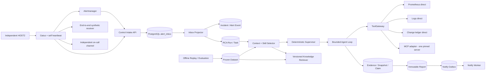

# 告警系统演进方案：可行性评审与详细改造计划

> 评审日期：2026-09-09  
> 评审对象：`docs/告警系统-部署隔离与Tool-MCP-RAG-Skill演进方案.md`  
> 证据范围：本地仓库代码、迁移、Compose、Gatus v5.17.0 标签源码，以及文末列出的官方资料。Gatus 标签提交为 `55d7bcdf2ed69de332a18cd2c31ba1be6647e6b1`；本机没有 Docker，尚未拉取或运行 Docker Hub 的 `twinproduction/gatus:v5.17.0`，因此“标签源码契约”与“发布镜像运行事实”在本文中严格分开。本文没有登录或改动 195，没有部署第二台机器，没有发送真实值班通知，也没有用未经压测的数据宣称系统已支持百万告警。此前明确禁止查看的三个文档未被读取。
>
> 2026-09-09 复核回填：本文全部代码现状声明已逐条对照仓库核对，结论为基本成立；两处归因/计数偏差已就地修正（§二.7 评测现状、§七 监控清单）。外部资料同步更新：Gatus 已发布 v5.36.x（三项契约冲突所涉代码在最新版未变，见 Phase 1）；MCP 协议当前版本为 2026-07-28（相对 2025-06-18 有破坏性修订），官方 Java SDK 2.0.1 仍基于 2025-11-25（见 Phase 8）；pgvector 自 0.8.0 起提供 iterative scan（见 Phase 5）；Redis 8.6 起 Streams 支持幂等生产（见 Phase 10）。业界对标：HolmesGPT 已进入 CNCF Sandbox，主流开源 RCA agent 仍为“无状态 agentic loop + toolsets”，其生产事故（告警风暴耗尽模型配额）佐证本文“先确定性 DAG、后有界 loop”的路线；本项目的状态机、租约、回放与受控工具网关组合在开源界属于较领先的工程化设计。同日按用户裁定新增：Phase 11（迁移至 127=2C4G 的 HOST2 真实落地与 195 减负，含短停机 runbook）与 Phase 12（前后端联通联调，核心链路页面优先），并同步 §五 清单、§九 里程碑与 §十 决策门。

## 一、结论：方向可行，三项 Gatus 源码冲突必须经镜像实测闭环

总体方向可行，但实施依赖不是一条简单直线。正确主链是“外部探针与真实 Tool → 离线评测底座 → RAG → Skill → 受控 Agent loop”；MCP 是可并行、可退出的协议适配试验，不是 RAG 或 Skill 的前置条件。离线评测必须早于 Skill 生命周期落地，否则 `EVALUATING` 和发布门只有状态名，没有可信判定器。当前方案不能直接照抄上线，原因不是概念错误，而是实现事实与方案假设之间还有缺口。

### 1. 可行性裁定

| 能力 | 裁定 | 当前基础 | 上线前必须补齐 |
|---|---|---|---|
| 独立外部探针 | 可行，P0 | 已有 Gatus Compose 和目标配置；v5.17.0 标签源码已暴露三项契约冲突 | 先以发布镜像实测证伪/确认，再修配置加载路径、存储类型、provider、endpoint `alerts`；完成失败/恢复通知闭环 |
| 第二机 2C4G | 有条件可行 | 探针本身很轻，离线回放可串行 | 探针资源优先；不能同时承诺完整靶场、索引构建、高并发评测和热备 |
| 真实 Tool | 高度可行，P0/P1 | `ToolRegistry`、`ToolGateway`、schema、风险、超时、回放账本均已存在 | `logs.query`、`change.query` 仍是 fixture；Trace 还没有可检索后端；结果读取需流式限长 |
| MCP | 可行，P2 | `ToolExecutor` 是天然适配点；Java 有官方 SDK | 只接一个只读源做兼容性 spike；固定 server/tool/schema；不得绕过 `ToolGateway` |
| RAG | 可行，P2 | PostgreSQL、证据快照、数据集版本和 RLS 已存在 | 先做元数据 + 关键词基线；建立权威来源与失效机制；pgvector 门当前仍关闭 |
| Skill | 可行，P2 | 有 ConfigBundle、Golden Candidate、CAS、评测和状态机范式 | 离线盲评底座先验收；再新建独立 Skill 版本域，不能把现有 Golden Candidate 直接改名复用 |
| 受控 Agent loop | 可行，P2/P3 | 当前是确定性 Supervisor + 固定三 Agent DAG | 第一阶段只允许 Skill 编译成有界 DAG；证据和评测成熟后才开放多轮循环 |
| 多 Agent | 可行但不宜先做“自由对话” | metrics/logs/change 三个职责 Agent 已存在 | 当前实际串行；应先做确定性 fan-out/join，再评估并行和冲突归并 |
| 进程故障恢复 | 已有较好基础 | DB 租约、epoch 栅栏、重试、悬挂调用 `UNKNOWN` | 增加多 worker 实例与恢复演练；修复本地 CAS 对跨机 worker 的限制 |
| 整机故障转移 | 当前不具备 | 只有单宿主 Compose 与外部探针草案 | 外部探针只解决“看见”；恢复还需要共享存储、数据库恢复/HA、worker 独立部署 |
| 百万告警 | 不能据现状承诺 | 入口持久化、去重、软背压、PostgreSQL 队列已有 | 明确“百万/天、小时、10 分钟、分钟”四档；压测入口、投影、DB、唯一 Incident 和 RCA 吞吐 |

### 2. Gatus 三项疑点的复核结论与证据等级

先纠正措辞：此前把三项直接写成“当前部署的确定缺陷”证据不足。我们锁定并检查的是 v5.17.0 标签源码，不是 Docker Hub 镜像字节，也不是 HOST2 上的实际进程。更准确的裁定是：**三项都是标签源码层面的确定性契约冲突；如果发布镜像确由该标签 Dockerfile 构建且没有额外改动，运行时会出现相应问题；在取得镜像摘要、启动日志和行为测试前，不能宣称实际镜像已经被验证为故障。**

| 证据层 | 已完成 | 能证明什么 | 不能证明什么 |
|---|---|---|---|
| L1 仓库静态配置 | 是 | 仓库挂载 `/config/config.yml`、使用 `storage.type: file`、配置 `alerting.webhook` 且 endpoint 无 `alerts` | Gatus 实际如何解释这些字段 |
| L2 锁定标签源码 | 是，tag `v5.17.0`，commit `55d7bcdf...` | 默认路径顺序、Dockerfile 内置配置、合法 storage/provider、未知类型分支 | Docker Hub tag 的实际镜像是否与这份源码一一对应 |
| L3 发布镜像供应链 | 否 | 镜像 digest、架构、环境变量、文件层与构建来源 | 容器启动后是否实际采用预期配置 |
| L4 临时容器运行 | 否，本机无 Docker | 加载路径、provider 解析、持久化、告警和恢复行为 | HOST2 网络、通知出口和资源表现 |
| L5 HOST2 部署演练 | 否 | 真实故障域、网络、通知接收、探针自监控 | 无 |

三个源码层结论如下：

1. **配置路径存在确定冲突。** `config/config.go` 在未设置显式路径时先尝试 `config/config.yaml`，再尝试 `config/config.yml`；标签 `Dockerfile` 把示例配置复制为 `/config/config.yaml`，并设置空的 `GATUS_CONFIG_PATH`。仓库只挂载 `/config/config.yml`。因此，若实际镜像包含标签 Dockerfile 的 `/config/config.yaml`，仓库挂载文件不会成为首选。证据见 [`config/config.go`](https://github.com/TwiN/gatus/blob/v5.17.0/config/config.go) 与 [`Dockerfile`](https://github.com/TwiN/gatus/blob/v5.17.0/Dockerfile)。
2. **存储类型存在确定冲突。** v5.17.0 只声明 `memory/sqlite/postgres`；未知类型最终进入 memory store 默认分支。因此，只要仓库配置被真正加载，`storage.type: file` 就不会获得文件持久化语义，而且不一定 fail-fast。证据见 [`storage/type.go`](https://github.com/TwiN/gatus/blob/v5.17.0/storage/type.go) 与 [`storage/store/store.go`](https://github.com/TwiN/gatus/blob/v5.17.0/storage/store/store.go)。
3. **通知契约存在确定冲突。** v5.17.0 的通用 HTTP provider 是 `alerting.custom`，不是 `alerting.webhook`；endpoint 还要显式声明相应 `alerts`。因此，只要发布镜像遵循该标签解析契约，当前配置无法建立预期的 custom 告警链。证据见 [`alerting/config.go`](https://github.com/TwiN/gatus/blob/v5.17.0/alerting/config.go) 与 [README 的 default alert 说明](https://github.com/TwiN/gatus/blob/v5.17.0/README.md#setting-a-default-alert)。

L3～L5 的验证必须留下同一份证据清单：`image repo digest + platform + image inspect 摘要 + 配置文件 digest + 容器启动日志 + endpoint 列表 + SQLite 重启前后记录 + 告警/恢复接收回执`。若镜像实测推翻标签源码推断，应保留差异并追查镜像构建来源；不能删除失败测试后直接把结论改回“正常”。因此第一阶段不是直接“修三个确定故障”，而是“按发布镜像证据确认或证伪三项冲突；确认后修复，证伪则记录镜像与标签源码差异；最终以行为验收决定是否上线”。

## 二、当前系统真实基线：已经有什么，缺的到底是什么

### 1. 业务入口与持久化

真实业务入口是 `POST /webhooks/alertmanager`，由 `AlertWebhookController` 接收。入口已具备以下正确性基础：

- Bearer 常量时间比较；未授权请求不进入仓储。
- 原始请求体、gzip 解压后体积、JSON 深度、单组 alert 数量、标签长度都有上限。
- 只有整组持久化失败才返回 503；协议错误返回 400/413；持久化成功返回 202。
- 一组告警先作为一条 `alert_inbox` 记录持久化，原始 payload 与 SHA-256 摘要一起保存。
- 控制面自监控告警先经过 `ControlAlertRouter`，避免再次进入本系统形成自噬循环。

这意味着入口的核心选择是“先落事实，再异步处理”，而不是在 HTTP 请求中等待 RCA。这个选择是对的：模型调用、日志查询或下游通知即使耗时数分钟，也不应占住 Alertmanager webhook。

### 2. Inbox 队列与投影

`AlertInboxProcessor` 使用 PostgreSQL 表作为持久队列：

```text
RECEIVED / RETRY_WAIT
        │ claimNext + FOR UPDATE SKIP LOCKED + lease_epoch
        ▼
   PROCESSING
    ├── PROCESSED
    ├── RETRY_WAIT
    ├── IGNORED
    └── DEAD_LETTER
```

它已经解决了几个难题：

- 多消费者通过 `SKIP LOCKED` 避免抢同一行；PostgreSQL 官方也明确把 `SKIP LOCKED` 视为适合 queue-like table 的用法，但它给出的是不一致视图，不能拿来做一般查询。[PostgreSQL SELECT 文档](https://www.postgresql.org/docs/current/sql-select.html#SQL-FOR-UPDATE-SHARE)
- 领取有租约和 epoch；旧 worker 即使晚回来，也不能覆盖新 owner 的处理结果。
- 处理进程崩溃后，过期租约可以回收到 `RECEIVED`。
- payload 腐坏进入死信；数据库临时失败进入退避；软背压进入 `RETRY_WAIT`。

但现状还有四个容量问题：

1. Compose 只启动一个 `control-app`，`AlertInboxProcessor` 自身也只有一个循环线程，所以当前投影面实际上是单消费者。
2. 每个 inbox 组开始时会执行 `countActive()` 和 `countQueued()` 两次全局计数；告警表增长后，这会变成洪峰放大器。
3. 一个组最多 200 条告警，在一个投影事务里逐条查 Incident、判重、插 Event、更新 Incident、可能铸 Run/Task；大组会形成长事务。
4. `alert_inbox` 与 `alert_event` 当前都没有按时间分区；V28 分区的是执行事件 `rca_event`，不是告警原始入口表。

### 3. Incident 与状态机

当前状态机没有把所有概念混成一个状态，这是很好的设计：

- `IncidentStatus` 只表达业务事实：`FIRING ↔ RESOLVED`。
- `RcaRunState` 表达一次调查运行：`QUEUED/RUNNING/REPORTING` 和六种终态。
- `RcaTaskState` 表达 DAG 节点：`BLOCKED/READY/LEASED/RUNNING/...`。
- `PublicationState` 表达报告发布：`PENDING/READY/RETRY_WAIT/SENT/...`。
- `InboxState` 表达原始组消费状态。

这种拆分的理由是：业务是否仍在告警、调查是否正在跑、某个工具任务是否失败、报告是否送达，是四个独立问题。把它们塞进一个大状态机会产生笛卡尔积，例如“Incident 已恢复但报告仍在重试”根本无法用一个枚举准确表达。

状态机的实现也有可复用范式：`TransitionTable` 是唯一迁移矩阵，非法迁移抛异常；仓储更新再用 `from state + revision/epoch` 做 CAS。后续 Skill 生命周期应复用这种**设计方法**，但不应复用现有枚举，因为它们处理的是不同业务事实。

### 4. RCA worker、Agent 与所谓 Agent loop

当前 `RcaWorker` 已具备：

- 固定 slot、task 租约和 slot 租约双回收。
- attempt 先落 `STARTED`，外调后崩溃会被标成 `UNKNOWN`，不猜测调用是否成功。
- 领取、执行、收尾分离；长时间远程调用不包在数据库事务中。
- engine 映射 fail-closed；没有执行器时不会偷偷换引擎伪装成功。

但当前 Native 链还不是一个真正的多轮 Agent loop。`NativeInvestigationExecutor` 的实际行为是：

```text
读取 active ConfigBundle 中固定 proposal
→ Supervisor 编译固定 DAG
→ 按顺序执行 metrics / logs / change 三个 Agent
→ 冻结 EvidenceSnapshot
→ 规则归并 Claim
→ 组装报告
```

它的优点是确定、可回放、容易审计；问题是不能根据第一个工具结果动态决定第二步，而且三个 Agent 当前在一个 driver task 内顺序运行。计划中应先把“Skill 选择固定 DAG”接上，再逐步引入“观察后再规划”的有界 loop，而不是一步换成自由自治 Agent。

### 5. Tool 现状

`ToolGateway` 已经是一个很好的治理咽喉：

- 启动期固定 `ToolRegistry`，同名同版本冲突 fail-fast。
- 下发 manifest 前按 policy 裁剪，执行时再次鉴权。
- 严格 schema 校验，未声明参数拒绝。
- 生成 canonical action digest，工具名、版本、schema、参数、时间窗和输入快照共同决定调用身份。
- R2/R3 只记执行意图，不真正执行。
- 有硬 timeout、错误分族、结果大小上限和精确回放。

真正缺的是数据面：

- `prometheus.query` 是真实 HTTP 查询。
- `logs.query` 与 `change.query` 在 `AlertAm4Config` 中仍绑定 `ReplayToolExecutor` fixture。
- OTel Collector 把 logs/traces 发往上游，不代表仓库已经有可查询的日志或 Trace Store。
- `PrometheusQueryExecutor` 使用 `BodyHandlers.ofByteArray()` 先把响应全部读进内存，再由 Gateway 检查长度；恶意或失控响应可先占满堆，结果上限来得太晚。

### 6. 上下文持久化与回放

当前已有多层上下文：

- 原始 Alertmanager payload 存 `alert_inbox.payload_raw`。
- 不可变告警事实存 `alert_event`。
- 工具动作身份与结果通过调用账本、Evidence 和 Replay Store 留档。
- `EvidenceSnapshot` 用 generation、config digest、tool registry digest 和成员摘要冻结一次调查看到的证据集合。
- 报告原文额外写本地 CAS，并在数据库保存引用。

这为 RAG/Skill 提供了好基础。但本地 `cas-data` 是单宿主 Docker volume：如果以后在另一台机器启动 worker，它无法天然读取 195 上的本地 CAS。因此“多机 worker 故障转移”必须先解决共享 artifact store，不能只把 worker 容器复制过去。

### 7. 评测现状

已有能力包括固定场景、串行 5×2、恢复门、结果不可覆盖、数据集版本、四分区/RLS、Golden Candidate 双签、模型采样指纹、质量与安全门。

不足在于：

- `EvalBatchRunner` 是 Live E2E 编排，会注入真实靶场故障并轮询生产侧 Run。
- `application-eval.yml` 恢复 DataSource；数据库依赖集中在 `EvalBatchRunner`、`SingleCaseScorer`、`EvalRunRepository` 一线（`RcaEvalAdapter` 本身只做 Parquet 数据集导入适配，不触库）；现在还不是可拿冻结文件到 HOST2 独立回放的 runner。
- Skill 评测需要 baseline / baseline+RAG / baseline+RAG+Skill 三臂配对，现有 `EvalRun` 元数据还没有完整表达 retrieval 与 skill 版本。

## 三、目标架构：每一层只解决一个问题



这里刻意保留 PostgreSQL 为事实源，也保留现有 `ToolGateway`。MCP 是一种 executor，不是新的调度中心；RAG 提供候选知识，不覆盖现场证据；Skill 提供受控方法，不自行获得权限；外部探针观察系统，不进入 Incident 管线。

## 四、详细改造阶段

下面的工期是单工程师净开发日的量级估算，不包含采购审批、网络等待和真实故障窗口。迁移编号以当前最新 V35 为基线，真正编码时必须先 rebase 再冻结编号。

### Phase 0：冻结事实、SLO 与验收口径（1～2 天，P0）

#### 目标

先消除“百万告警”“高可用”“通知成功”这些词的歧义，否则后面任何测试都可能各自通过、整体仍失败。

#### 工作项

1. 定义四种负载：
   - 1,000,000 条/天：平均 11.6 alert/s。
   - 1,000,000 条/小时：平均 277.8 alert/s。
   - 1,000,000 条/10 分钟：平均 1,666.7 alert/s。
   - 1,000,000 条/分钟：平均 16,666.7 alert/s。
2. 每种负载同时声明：每组 alerts 数、gzip 比例、重复率、唯一 incident 比率、firing/resolved 比率、payload p50/p99。
3. 冻结三个 SLO：
   - 接入 SLO：合法请求成功持久化后返回 202 的 p95/p99。
   - 投影 SLO：从 `received_at` 到 `processed_at` 的 backlog age。
   - 调查 SLO：从首个 firing 到可发布报告，按 severity 分档。
4. 冻结通知“成功”的定义：接收器业务确认，而不只是 HTTP 200。
5. 产出 `capacity-profile.yml`、`slo.md` 和一份数据源清单：Prometheus、日志、变更、Trace 分别在哪里、保留多久、认证方式是什么。

#### 验收

- 所有压测报告必须写明是哪一种“百万”。
- 没有日志/Trace 查询后端时，明确写 `ABSENT`，不把 Collector 当 Store。
- 第二机目标明确是探针、离线回放还是热备；三个目标不得用同一个“已部署”勾选。

### Phase 1：复核、修复并验收外部探针（2～4 天，P0）

#### 0. 先验证原状，不先改到“看起来正确”

在临时机或 HOST2 的隔离目录保存当前 Compose/配置副本，先跑三条原状用例，再应用修复。这样才能区分“源码推断正确”“镜像与源码不同”和“修复确实生效”：

1. `GAT-CFG-001`：拉取 `twinproduction/gatus:v5.17.0`，记录 `RepoDigests`、平台、image id、环境变量和镜像文件层；用带高熵 marker endpoint 的仓库配置启动，不设置 `GATUS_CONFIG_PATH`，从启动日志、API/UI endpoint 列表判断 marker 是否被加载。
2. `GAT-STO-002`：确保仓库配置确实被加载后使用原始 `storage.type: file` 启动，产生至少两轮结果并重启；记录解析日志、实际 store 类型与重启前后历史。不能只用“容器没退出”判定配置有效。
3. `GAT-ALT-003`：启动本地捕获型 HTTP receiver，使用原始 provider/endpoint 配置制造超过阈值的失败和恢复；记录 receiver 请求数、body 和时间，验证是否真的触发。

随后再执行修复后的 `GAT-CFG-101/GAT-STO-102/GAT-ALT-103` 对照用例。每个 Case 保存 `before/after config digest + image repo digest + 完整命令参数 + 关键日志 + receiver 回执 + 判定`。只有 001/002/003 的行为与标签源码推断一致，才能把相应问题从“源码契约冲突”升级为“该发布镜像的已复现缺陷”；只有 101/102/103 通过，才能关闭缺陷。若原状测试已经通过，则暂停修改并检查镜像构建来源、启动参数或 tag 漂移。

#### 1. 修改文件

- `deploy/gatus/compose.gatus.yml`
- `deploy/gatus/gatus-config.yml`
- `deploy/gatus/.env.example`
- 新增 `deploy/gatus/verify-config.sh`
- 新增 `deploy/gatus/drill-gatus.sh`
- 新增 `deploy/gatus/README.md`

#### 2. Compose 修正

1. 设置 `GATUS_CONFIG_PATH=/config/config.yml`，或者把宿主文件直接挂为 `/config/config.yaml`；推荐前者，因为意图更显式。
2. 镜像由可变 tag 改成 `twinproduction/gatus:<验收版本>@sha256:<验收后的平台 digest>`。多架构部署分别记录 digest，不能从一台 amd64 机器抄给 arm64。复核注记：截至回填日 Gatus 已发布 v5.36.x，本文三项契约冲突所涉代码（配置路径顺序、storage 三类型、custom provider 与 endpoint alerts）在最新版未变，且新版包含 PostgreSQL 存储性能修复与更多原生 provider；验收时应先评估是否直接锁定新版，而不是默认 pin v5.17.0，版本选定后该版本的契约用例如 GAT-CFG/STO/ALT 系列需重新对拍。
3. 保留 `read_only`、`cap_drop: ALL`、`no-new-privileges`、loopback UI、日志轮转。
4. SQLite 文件放 `/data/gatus.db`；volume 只提供 `/data` 可写。
5. 资源限制先保留 96MiB/0.25 CPU 作为实验起点，验收要记录 OOM、调度延迟和 RSS；不足时允许调高，不能让“架构表里的数字”压过实测。

#### 3. 配置修正示意

```yaml
storage:
  type: sqlite
  path: /data/gatus.db

alerting:
  custom:
    url: ${GATUS_ONCALL_WEBHOOK_URL}
    method: POST
    headers:
      Content-Type: application/json
    body: |
      {
        "state":"[ALERT_TRIGGERED_OR_RESOLVED]",
        "group":"[ENDPOINT_GROUP]",
        "endpoint":"[ENDPOINT_NAME]",
        "errors":"[RESULT_ERRORS]"
      }
    default-alert:
      enabled: true
      send-on-resolved: true
      failure-threshold: 3
      success-threshold: 2

endpoints:
  - name: RCA_SYSTEM_control_health
    group: control-plane
    url: ${CONTROL_HEALTH_URL}
    interval: 30s
    conditions:
      - "[STATUS] == 200"
      - "[RESPONSE_TIME] < 3000"
    alerts:
      - type: custom
        description: control health failed
```

其余 endpoint 也必须显式声明 `alerts: - type: custom`。

#### 4. 值班接收器边界

v5.17.0 的 custom provider 只把 HTTP 4xx/5xx 当失败；如果飞书/企业微信在 HTTP 200 的 JSON 中返回业务错误码，Gatus 会把它误判为成功。处理方式二选一：

- 若目标平台有该版本原生 provider，优先用原生 provider 并实测。
- 否则部署一个极小的独立 notification adapter：验证平台业务码，失败时向 Gatus 返回 5xx；adapter 与 195 不同故障域，凭据不进入 control-app。

#### 5. 网络

- HOST2 只允许访问 195 的 health/readiness/synthetic 入口。
- 195 上只绑定 `127.0.0.1` 的端口不能被 WireGuard 自动访问，应增加只绑定 WireGuard IP 的窄反向代理。
- 不允许探针访问 PostgreSQL、Docker socket、Chaos Admin、模型管理口。
- HOST2 发值班通知必须走自己的公网出口，不能通过 195 NAT。
- WireGuard `AllowedIPs` 只写所需私网地址，不把默认路由指向 195。[WireGuard 官方快速入门](https://www.wireguard.com/quickstart/)

#### 6. 六项强制验收

1. 启动日志明确显示读取 `/config/config.yml`，且 UI 中只有本项目 endpoint，没有镜像示例 endpoint。
2. 容器内确认 storage 为 SQLite；创建历史后重启，历史仍在。
3. 停 control endpoint，连续 3 次失败后收到告警。
4. 恢复 control endpoint，连续 2 次成功后收到恢复通知。
5. 停 Gatus，由第三方 heartbeat 发现探针自身失联。
6. 195 整机断网时，HOST2 仍能向值班通道发出通知。

回滚方式是停止 HOST2 的 Gatus 单元；它不在 195 业务依赖链中，回滚不会影响接入和 RCA。

### Phase 2：先把入口和投影做成可测、可扩（5～8 天，P0/P1）

#### 1. 消除每组全表计数

当前 `IncidentProjector.project()` 每组调用 `incident.countActive()` 与 `task.countQueued()`。改造为一个 `AdmissionSnapshotRepository`：

- 首选读取低成本计数器表或 Micrometer/周期采样得到的近实时水位。
- 计数器更新必须与 Incident/Task 状态迁移同事务，或者允许有明确上界的误差。
- 准入只需要判断“是否超过阈值”，不需要每组得到精确全表计数。
- 加 reconciliation job 定期用真实 count 校正漂移；偏差超阈值告警。

计划新增：

- `alert/domain/admission/AdmissionSnapshot.java`
- `alert/domain/repository/AdmissionCounterRepository.java`
- `infrastructure/persistence/PostgresAdmissionCounterRepository.java`
- 暂定迁移 `V36__alert_admission_counter.sql`

#### 2. 多消费者化 Inbox

不要在一个 `AlertInboxProcessor` 内直接起无限虚拟线程。采用固定并发：

- 配置 `app.alert.inbox.workers`，初始 2。
- 每个 worker 有独立 owner，仍使用 `SKIP LOCKED + lease_epoch`。
- 每个 worker 一次只处理一个组。
- 连接预算必须满足：HTTP、inbox worker、RCA worker、notify 和运维查询之和，小于 Hikari 12 与 PostgreSQL `max_connections` 的共同上限。
- 先做同 JVM 两 worker；再做两实例各一 worker，验证 crash/reclaim。

#### 3. 缩短大组事务

当前一组 200 条在一个事务内投影。按风险逐步改：

1. 第一阶段保持组语义，但测量 1/50/200 条的事务 p99、锁等待、WAL 和回滚成本。
2. 若 200 条组超过事务时延门，新增 `alert_inbox_item`，入口事务一次批量插入 item；消费者按 item 小批量投影。
3. `alert_inbox` 只在所有 item 到达终态后汇总为 PROCESSED/DEAD_LETTER/PARTIAL。
4. item 必须带 `(inbox_id, item_index)` 唯一键和原 alert digest，确保重放不重复。

不能简单把每条 alert 在 HTTP 层单独写事务，那会把一个数据库往返放大成 200 次。

#### 4. 分区与保留

- 为 `alert_inbox`、`alert_event` 做专门分区 spike。
- 因 `alert_event.inbox_id` 和现有唯一键/FK，分区键必须进入主键或唯一约束；先设计复合键，不直接 ALTER 热表。
- 生产体量迁移使用新表 + 双写/回填 + 对账 + 原子切读，不复用 V28 的“小表单事务复制”路径。
- `payload_raw` 是主要容量来源，定义热保留天数、冷归档和 legal hold；不能只清 Event 留下 Inbox 大 bytea。
- 归档 manifest 记录行数、内容 digest、对象位置和恢复校验。

#### 5. 接入压测 Harness

新增一个独立 load generator，生成真实 Alertmanager envelope，不调用模型：

- alerts/group：1、50、200。
- gzip：0%、50%、100%。
- duplicate：0%、90%、99%。
- unique incident：0.1%、10%、100%。
- firing/resolved：只 firing、80/20、乱序 resolved。
- payload：p50 与上限附近。
- failure：PostgreSQL 慢、worker SIGKILL、连接池耗尽、磁盘接近满。

必须记录：HTTP QPS、202/4xx/5xx、p50/p95/p99、DB CPU/RSS/WAL、锁等待、inbox age、dead letter、去重正确率、恢复后 drain 时间。

#### 6. Phase 2 验收门

- 所有 202 请求在数据库中可按 digest 对账。
- worker 被杀后无永久 PROCESSING；旧 epoch 不能提交。
- 重复输入不生成重复 `alert_event` 或重复 active run。
- 入口过载时要么在约定时延内持久化，要么明确 503 让 Alertmanager 重试，不能“202 后丢失”。
- 达不到目标 profile 时先给出瓶颈证据，不能直接用增加 RabbitMQ 掩盖。

### Phase 3：补齐真实 Tool 数据面（6～10 天，P1）

#### 1. 先做数据源盘点门

对每个数据源填写：endpoint、产品/版本、查询 API、租户/服务过滤、保留期、最大查询窗、服务端 timeout、认证、审计、脱敏规则。没有可查询 Store 的数据源不得注册生产工具。

#### 2. 日志工具

新增 `LogQueryExecutor`，具体实现名称按真实后端决定，例如 Loki/OpenSearch/上游 OTel 平台；不先假定 Loki。

统一请求 schema：

```json
{
  "service": "checkout",
  "environment": "prod",
  "start": "...",
  "end": "...",
  "query": "error OR timeout",
  "limit": 200
}
```

强制策略：

- service/environment 必须来自 allowlist，不能让模型传任意租户。
- 时间窗初始不超过 15 分钟，最大行数 200。
- 数据源查询本身设置 timeout/limit，Gateway timeout 只是最后保险。
- 流式读取最多 `resultLimit + 1` 字节，超限立即关连接；不能先读完整 body。
- 响应包含 source、query window、sampling、truncated、retrieved_at、backend version。
- 空结果返回明确 `NO_DATA`，不能被报告转换成“日志正常”。

#### 3. 变更工具

当前没有统一变更事实源。先建 append-only `change_event`：

- deploy_id、service、environment、image_digest、config_digest、commit、actor、started_at、effective_at、rollback_of、source。
- CI/CD 或部署脚本写入，不由 Agent 写入。
- `change.query` 只读时间窗和服务。
- 先覆盖本项目实际部署和 ConfigBundle 激活，不能为了“工具齐全”伪造 Kubernetes 事件。

暂定迁移：`V37__change_event.sql`；写角色与 control_app 读角色分离。

#### 4. Trace 工具

只有确认 Trace Store 存在且可检索后才开发。Collector 的 OTLP exporter 不是查询接口。若不存在 Store，先保持 `trace.query` 未注册，并在能力状态显示 `ABSENT`。

#### 5. ToolGateway 加固

- 将 byte[] executor 契约扩展为有界 response abstraction，或统一使用限长 BodySubscriber。
- 增加 per-tool bulkhead，避免日志慢查询占满全部 call pool。
- 增加 circuit breaker 指标，但 breaker 状态不能由模型控制。
- 将 schema hash、server identity、credential scope、result digest 写入调用账本。
- 记录 `NO_DATA / TRUNCATED / TIMEOUT / RATE_LIMITED / AUTH_FAILED / SCHEMA_DRIFT` 等低基数结果。

#### 6. 验收

- fixture 仅在 test/replay profile 注册；docker production profile 不能注册 `ReplayToolExecutor` 为真实 logs/change。
- 真实 checkout 故障能由日志或变更证据支持/证伪一个 Claim。
- 超大响应、慢响应、401、429、5xx、半包、中断都有确定结局。
- 工具失败不会被包装成“未发现异常”。

### Phase 4：先建立离线盲评底座，再允许 Skill 进入生命周期（8～12 天，P1）

这一阶段必须从原计划后部提前。原因是 Skill 的状态机包含 `EVALUATING`，而“有一张状态表”并不等于“有可信评测”：如果回放仍依赖生产、答案与 Agent 输入混在一个包里，Skill 晋级分数既不可复现，又可能是模型看过答案后的假高分。Phase 4 是 Phase 5 的 RAG 开门数据基础，也是 Phase 6 Skill 从 `VALIDATING` 进入 `EVALUATING` 的硬前置依赖。

#### 1. 从三个原子问题推导架构

| 原子问题 | 直接解决 | 新出现的问题 | 下一步解决 |
|---|---|---|---|
| Live 评测会故障注入并访问 195 | 增加只读 `ReplayEvalRunner` | 回放包若同时含答案，Agent 可直接或间接看到金标 | 输入包与答案包物理、身份、时间三重隔离 |
| Agent 不见答案后可盲跑 | 运行器只读输入包并产生候选输出 | 评分器若在输出完成前可被调用，仍可能形成侧信道 | 先封存输出，再启动无模型、无工具的独立评分 job |
| 分数可计算 | 评分器读输出包与秘密答案包 | Skill 可能在生成自己的事故上过拟合 | 按事故家族分区，生成集、开发集、晋级 HOLDOUT 隔离 |
| 单次盲评可用 | 保存版本、digest、trace | 多次结果可能因模型/工具/知识变化不可比 | 冻结模型指纹、工具响应、配置、知识和 Skill digest，做配对评测 |

#### 2. 冻结评测材料必须拆成四种工件

不能再使用一个“冻结包”承载全部内容。四种工件通过不透明 `case_id` 关联，但权限不同：

1. `agent-input-bundle`：Agent 运行器可读。只含告警/Incident 输入快照、脱敏后的可见上下文、工具目录摘要、action digest 对应的冻结工具响应、config/knowledge/skill 版本引用、预算与截止时间。
2. `scoring-answer-bundle`：只有独立评分器可读。包含 expected root cause、symptom TP/FP/FN 规则、允许的 unknown、禁止断言、可接受同义根因、评分策略版本。
3. `candidate-output-bundle`：Agent 运行器只写，封存后不可修改。包含报告、Claim/Evidence 引用、工具动作序列、停止原因、token/费用/耗时、模型指纹和输出 digest。
4. `evaluation-manifest`：编排器可读。只保存不透明 case id、匿名分区、input/output ref 与 digest、schema version 和 job 状态；**不得保存 answer ref、answer digest、答案正文、故障注入动作或会暴露根因的场景名称**。评分器拿 `case_id` 后在 Answer Vault 内部解析答案，编排器和 runner 都不知道答案对象 key。

`source/family/partition` 也不能无条件进入 Agent 输入。它们用于分层抽样和防泄漏，应放在编排/评分元数据中；若诸如 `db-pool-exhausted` 的 family 名本身就是答案，就必须替换成随机稳定 ID。文件名、目录名、对象 key、日志 tag 同样不得编码根因。

#### 3. 答案隔离边界

```text
Dataset Packager（受控身份）
  ├─ Agent Input Store ──只读──> Eval Runner ──只写──> Output Store
  ├─ Answer Vault ────────────────只读──────────> Blind Scorer
  └─ Manifest Store ──摘要──> Orchestrator           ↑
                                                   输出封存后才启动

Score Store <── Blind Scorer ── reads sealed output + secret answer
Dashboard / Skill Lifecycle <── Score Store（只能看分数与门结果）
```

最小权限矩阵：

| 身份 | Agent 输入 | 答案库 | 候选输出 | 分数 | 模型/工具网络 |
|---|---|---|---|---|---|
| `eval-packager` | 写 | 写 | 无 | 无 | 无 |
| `eval-runner` | 读 | **拒绝** | 只写/封存 | 无 | 仅冻结 replay；禁止生产网络 |
| `blind-scorer` | 无需 | 读 | 封存后读 | 写 | **禁止模型、工具和外网** |
| `eval-aggregator` | 摘要 | **拒绝** | 摘要 | 读 | 无 |
| `skill-generator` | 仅开发/训练分区 | **拒绝 HOLDOUT 答案** | 读允许样本 | 读聚合分 | 受控 |
| 在线 Agent / RAG 索引器 | **拒绝评测专用包** | **拒绝** | 无 | 无 | 按生产策略 |

实现上至少使用不同容器身份、不同数据库角色或对象存储前缀、不同加密密钥和显式 deny。即使所有 job 暂时共用 HOST2，也不能把两个包挂到同一容器，更不能在同一 JVM 对象图中先读取答案再调用模型。更稳妥的部署是让 `blind-scorer` 成为单独的无网络服务；它只接收 `case_id + sealed_output_ref + output_digest + scoring_policy_version`，再用自身身份在 Answer Vault 内部解析答案。

#### 4. 运行与评分状态机

评测状态不是一列任意字符串，必须防止“边跑边看答案”和重复评分：

```text
DRAFT
→ PACKING
→ SEALED
→ RUNNING
→ OUTPUT_SEALED
→ SCORING
→ PASSED | FAILED | INFRA_ABORTED
```

- `PACKING → SEALED`：输入包和答案包分别计算 digest、签名并关闭写权限。
- `SEALED → RUNNING`：编排器只把 input ref 发给 runner；任务 token 的 audience 不允许访问 Answer Vault。
- `RUNNING → OUTPUT_SEALED`：输出写完后计算 digest，CAS 更新状态；超时或基础设施失败进入 `INFRA_ABORTED`，不能算模型失败。
- 只有 `OUTPUT_SEALED` 才能创建 scorer token；这实现时间隔离，禁止 Agent 根据部分评分反复改答案。
- `SCORING → PASSED/FAILED`：评分器验证输入、输出、答案和策略 digest；同一四元组幂等，重复请求返回原分数。
- 任一工件 digest 不匹配、权限拒绝测试失败或发现泄漏 canary，整个 eval run 直接失效，不允许 Skill 晋级。

状态迁移由单一 `EvalRunStateMachine` 管理，并用 `expected_state + revision` CAS；所有转移追加审计事件。答案包不通过事件 payload、异常堆栈或指标 label 暴露。

#### 5. 代码与数据改造

- 暂定迁移 `V38__evaluation_blind_scoring.sql`，保存工件引用/digest、运行状态、评分引用、revision 和 append-only transition event；答案正文不得进 control-app 主库。
- 将 `SingleCaseScorer` 的数据库查询依赖抽为 `CaseObservationPort`；在线实现读 PostgreSQL，离线实现只读 `candidate-output-bundle`。
- 新增 `ReplayEvalRunner`，复用 `ReplayToolGateway`；MISS 必须终止 Case，绝不回落活网。
- 新增 `EvalBundlePackager`、`BundleDigestVerifier`、`BlindScorer`、`EvalRunStateMachine` 和 `EvaluationLeakageGuard`。
- control-app 表或公开 manifest 增加 `input_digest`、`output_digest`、`scoring_policy_version`、`model_fingerprint`、`tool_registry_digest`、`knowledge_snapshot_digest`、`skill_digest`，但不增加 answer ref/digest；`answer_digest` 只保存在 Answer Vault 的私有索引中。
- 结果写独立数据库/schema 或对象存储；HOST2 runner 不持有生产 DB 凭据，scorer 不持有模型、MCP、Prometheus、日志或变更系统凭据。
- Live E2E 仍保留，但只用于低频验证真实链路；它不能代替可批量复现的 Replay 评测。

#### 6. 防答案泄漏验收

1. 在答案包放入高熵 canary；扫描所有 prompt、模型请求、tool args、RAG chunk、Skill 生成输入、trace、日志和候选输出，命中必须为 0。
2. 把同一 input ref 临时关联到内容不同但结构相同的测试答案包；在评分启动前，Agent 输出 digest 必须不变。这是验证“答案不可见”的变形测试。
3. 在 runner 容器内尝试访问 Answer Vault、对象 key 和数据库表，必须得到权限拒绝；同时检查挂载清单，答案路径不得存在。
4. Agent 输入 schema 禁止 `expected_*`、`gold_*`、`injected_fault`、`answer` 等字段；CI 对字段名和值做双重扫描。
5. 检查 scenario/family/file/object key 是否包含根因词；分区元数据只向编排器暴露匿名 ID。
6. 输出封存前请求评分必须状态拒绝；评分后不得把逐 Case 答案或详细差异回传给同一候选生成流程。开发集可以给受控反馈，HOLDOUT 只发布聚合门结果。
7. RAG 摄取清单显式排除 `eval/answers/**`、HOLDOUT 输出和 scorer 解释；备份、日志采集和 APM 同样执行脱敏/排除规则。

#### 7. 三臂配对与 Skill 晋级硬依赖

同一冻结 input、模型指纹和工具响应运行 baseline、baseline+RAG、baseline+RAG+Skill。记录根因命中、症状 TP/FP/FN、unknown 正确率、无证据断言、错误套用、工具数、重复工具数、token、费用、耗时、越权和 retrieval recall@k。

数据按匿名 `scenario_family_id` 分区；生成 Skill 的事故不能进入晋级 HOLDOUT。Phase 6 的 `VALIDATING → EVALUATING` 只允许引用状态为 SEALED 的数据集；`EVALUATING → REVIEW` 必须引用已完成、无泄漏告警、使用秘密 HOLDOUT 评分器生成的 eval run。没有这条数据库约束/服务层约束时，不得上线 Skill 管理 API。

#### 8. HOST2 资源策略

- Gatus 和 heartbeat 最高优先级。
- Replay concurrency 初始 1，内存上限约 2GiB、CPU 1 核，只在探针健康且资源水位允许时启动。
- 可用内存、磁盘、load、探针调度延迟越门即拒绝新 job；运行中 job 标为 `INFRA_ABORTED`。
- embedding 构建、Skill 生成和批量评测是独立低优先级 job；不在 2C4G 同时建大型 HNSW、跑 Live E2E 和批量回放。

2C4G 的进程、目录、身份、网络、工件传输、代码拆分、Compose 骨架、分阶段切换和回滚细节见 [`告警系统-2C4G评测机迁移实施方案.md`](./告警系统-2C4G评测机迁移实施方案.md)。该方案明确：HOST2 只承载文件化 Replay 与盲评分；Live E2E 留在 195 的维护窗口；`eval_app` 数据库凭据和 `CHAOS_ADMIN_TOKEN` 不得迁出 195。

### Phase 5：RAG 先做“可信检索”，再做向量（7～10 天，P2）

#### 1. 领域表设计

暂定迁移 `V39__knowledge_base.sql`：

- `knowledge_document`：稳定 document id、类别、owner、service、environment。
- `knowledge_version`：不可变版本、状态、content digest、valid_from/to、source ref、reviewer。
- `knowledge_chunk`：以完整判断/操作为单元的 chunk、ordinal、search terms、content。
- `knowledge_relation`：文档引用事故、Skill、服务版本。
- `knowledge_retrieval_event`：run、query digest、过滤条件、候选、排名、得分、retriever version。
- `rca_run_context`：run 一对一，冻结 knowledge snapshot digest、skill version、tool registry digest、config digest。

权威状态建议：`DRAFT → REVIEW → ACTIVE → EXPIRED/REVOKED`。普通 Agent 报告只进 DRAFT 候选区；只有人工确认或确定性事实导入才能 ACTIVE。

#### 2. 第一版检索

第一版不用 embedding：

1. 强过滤 service、environment、适用版本、审核状态、有效期、权限。
2. 对 error code、配置键、依赖名、告警名做精确和数组包含检索。
3. 对维护者提供的 `search_terms` 建 GIN。
4. 对标题/短文本可评估 `pg_trgm`；若官方镜像缺扩展，先不把它作为上线依赖。
5. 取 Top 3～5，受上下文 token 预算控制。

不直接依赖 PostgreSQL 默认英文 FTS 处理中文正文。中文召回先靠结构化字段与维护关键词建立可解释基线，再决定是否引入分词器。

#### 3. pgvector 开门条件

现有 `deploy/pgvector/pgvector-gate-checklist.md` 的门保持关闭是正确的。只有关键词基线在独立金标上召回不足，向量 A/B 又能显著改善 RCA，才进入下一阶段。

pgvector 可与 PostgreSQL 共存，但 HNSW/IVFFlat 都有速度、内存和召回权衡，带 metadata filter 时近似搜索还可能先扫描再过滤；官方建议为过滤列建索引，并按选择性考虑 partial index、partition 或 iterative scan。[pgvector 官方文档](https://github.com/pgvector/pgvector/blob/master/README.md#filtering)

开门后仍需：

- 固定 pgvector 版本且不低于 0.8.0：带 metadata filter 的近似检索在更低版本会静默丢召回，iterative scan（`hnsw.iterative_scan`）自 0.8.0 起可用，开门评估必须覆盖该选项。
- 固定 embedding provider/model/dimension/normalization/version。
- embedding 任务在 HOST2 离线批量执行，生产请求不临时重嵌全库。
- exact search 产 ground truth，再评估 HNSW/IVFFlat recall@k。
- 测建索引 RSS、查询 p95/p99、过滤后召回、备份恢复。
- 195 当前 PostgreSQL 内存上限 512MiB，不应在没有测量时直接建 HNSW。

#### 4. RAG 安全边界

- 权限和有效期在 SQL 召回阶段过滤，不能先把无权文本送模型再说“忽略”。
- 所有 chunk 带来源、版本和 digest。
- 检索内容是参考，不得覆盖当前 Prometheus/log/change 证据。
- 检索为空回到基础流程。
- 撤销只影响新 Run；历史 Run 保留当时版本引用，保证重放。

### Phase 6：Skill 版本域和状态机（8～12 天，P2）

Agent Skills 通用格式要求目录至少包含 `SKILL.md`；`allowed-tools` 是实验字段，宿主支持情况可能不同。[Agent Skills 规范](https://agentskills.io/specification) 因此本项目可以导出兼容包，但生产权限必须继续由 `ToolPolicy/ToolGateway` 强制。

硬前置条件：Phase 4 的盲评 runner、工件隔离、秘密 scorer、泄漏测试和状态机全部通过。若只有人工脚本或一个同时含输入与答案的 JSON 包，本阶段只能设计 schema，不得把任何 Skill 推进到 `EVALUATING`。

#### 1. 为什么不能复用 Golden Candidate 状态机

现有 Golden Candidate 是 GT 双签流程：`DRAFT → REVIEW → PUBLISHED/REJECTED/WITHDRAWN`。Skill 还需要静态验证、离线评测、影子运行、激活、紧急撤销和自然淘汰；直接扩原枚举会把“金标修订”和“执行方法发布”混在同一表与权限中。

可以复用的是工程模式：状态矩阵、revision CAS、append-only transition event、idempotency key、双人复核。

#### 2. 新状态如何从问题推导出来

| 原子问题 | 需要的状态 | 解决的风险 |
|---|---|---|
| Agent 生成的内容还没检查 | DRAFT | 不让草稿进入任何 Run |
| YAML/JSON、引用、工具版本可能不合法 | VALIDATING | 静态结构与权限 fail-closed |
| 结构正确不等于有效 | EVALUATING | 用隔离答案的冻结 HOLDOUT 与独立 scorer 比较基础流程 |
| 自动分数无法覆盖适用范围判断 | REVIEW | 人工复核边界、反例和新增权限 |
| 离线有效不等于线上稳定 | SHADOW | 只记录建议，不影响正式结论 |
| 已通过发布门 | ACTIVE | 新 Run 才能选择 |
| 明确失败且从未生产启用 | REJECTED | 留档，不进入生产 |
| 已上线但发现风险 | REVOKED | 紧急阻止后续工具动作 |
| 被新版本自然替代 | DEPRECATED | 可重放历史，不再选择 |

迁移矩阵：

```text
DRAFT -> VALIDATING | REJECTED
VALIDATING -> EVALUATING | REJECTED
EVALUATING -> REVIEW | REJECTED
REVIEW -> SHADOW | REJECTED
SHADOW -> ACTIVE | REJECTED
ACTIVE -> REVOKED | DEPRECATED
```

任何内容修改都生成新 `skill_version_id + content_digest`，不能把 ACTIVE 行原地改回 DRAFT。REVOKED 不恢复；修复后创建新版本重走流程。

#### 3. 表与代码

暂定迁移 `V40__skill_lifecycle.sql`：

- `skill`：稳定 name、owner、description。
- `skill_version`：version、digest、状态、适用条件、排除条件、required tools、budget、SKILL.md ref、plan JSON、created_from。
- `skill_transition_event`：from/to、actor、reason、evaluation id、idempotency key、expected revision。
- `skill_evaluation_link`：dataset/eval run/gate result。
- `skill_shadow_observation`：适用、建议、基础结果、差异、人工结论。

代码建议：

- `control/skill/domain/model/SkillVersionState.java`
- `control/skill/domain/statemachine/SkillVersionStateMachine.java`
- `control/skill/application/SkillLifecycleService.java`
- `control/skill/application/SkillStaticValidator.java`
- `control/skill/application/SkillSelector.java`
- `control/skill/infrastructure/PostgresSkillRepository.java`

#### 4. Skill 内容契约

每个 Skill 至少包含：

- 适用服务、环境、版本与告警族。
- 必要条件与排除条件。
- 所需工具名、版本、风险级别。
- 参数模板和最大时间窗。
- DAG 节点与 required/optional 依赖。
- 每个分支的证据要求。
- `NO_DATA`、工具失败、证据冲突时的退出条件。
- step/tool/token/time/cost 预算。
- 正例、反例、已知失效模式。
- owner、有效期、复核人。

第一期只实现一个 checkout Skill，并且只允许 R0 只读工具。

#### 5. 选择与冻结

- `SkillSelector` 先做硬过滤，再按规则打分。
- 第一阶段每个 Run 最多选择一个 ACTIVE Skill；并列时选择更具体且版本更新的一个，仍并列则不用 Skill，避免随机。
- 选择结果写 `rca_run_context`，冻结 skill version/digest。
- 普通撤销不改变已开始 Run 的历史上下文；紧急撤销在每次工具执行前查询一个轻量 revoke cache/DB 版本，停止后续动作并转 PARTIAL/FAILED。

#### 6. 发布门

- 静态门：格式、引用、DAG 无环、工具存在、权限未扩大、预算合法。
- 离线门：只接受 Phase 4 盲评系统产生的、工件 digest 完整且 leakage guard 为零的分数；准确率不退化、无证据断言不增加、错误套用率达标、成本/耗时至少一项改善。
- 安全门：REDTEAM 零越权、prompt injection 不改变工具权限。
- 影子门：跨多个独立事故，不只看生成它的事故。
- 首期人工双签；后续只有“不增加权限、R0、适用范围窄”的版本可讨论规则自动晋级。

### Phase 7：从固定 DAG 演进到有界 Agent loop 与多 Agent（8～12 天，P2/P3）

#### 1. 第一步：Skill 只编译 DAG

先不改变现有执行模型。将 ACTIVE Skill 的结构化 plan 输入 `PlanCompiler`：

- 仍限制最大任务数、最大深度、无环、已注册 Agent、已知 artifact。
- Skill 不能直接写 `rca_task`。
- Supervisor 是唯一落图者。
- 先串行执行，保证与当前回放一致。

这一阶段就能获得“不同告警选择不同排查顺序”的价值，风险远低于自由 loop。

#### 2. 第二步：状态化的有界 loop

当真实工具和评测稳定后，新增 `agent_loop_checkpoint`，不要把 loop 步骤塞进 `RcaRunState`。建议状态：

```text
CREATED
→ PLANNING
→ READY_TO_ACT
→ WAITING_TOOL
→ OBSERVING
→ PLANNING ...
→ REPORTING
→ SUCCEEDED | PARTIAL | FAILED | CANCELLED
```

设计来源：

- 模型可能在给计划时崩溃，所以 PLANNING 要可恢复。
- 工具调用可能已发出但结果未知，所以 WAITING_TOOL 与 invocation ledger 关联。
- 结果落库后还未完成判断，所以需要 OBSERVING checkpoint。
- 预算耗尽但已有证据不是 FAILED，而是 PARTIAL。
- 每次循环只允许一个动作提案，经 Gateway 校验后执行。

每次转移同事务追加 `rca_event`，记录 loop_seq、input snapshot、proposal digest、action digest、evidence digest、budget delta。恢复时从最后一个 checkpoint 继续，不重新解释整段对话。

#### 3. 防 doom loop

- 最大 loop step。
- 最大同 action digest 重复次数，建议 1；完全相同查询第二次默认拒绝。
- 最大无新增 Evidence 连续轮数，建议 2。
- 总工具、token、wall-clock、cost 预算。
- 同一个错误族只允许有限重试；控制面错误不交给模型反复试。
- deadline 临近时直接进入 PARTIAL 报告。

#### 4. 多 Agent

当前 metrics/logs/change 是职责拆分，不是三个自治实体。目标也不应是让它们互相聊天，而是：

```text
Supervisor
 ├─ Metrics Agent -> typed Evidence
 ├─ Logs Agent   -> typed Evidence
 └─ Change Agent -> typed Evidence
             ↓
        deterministic join
             ↓
        ClaimReducer
```

- 每个 Agent 只有一个数据源 allowlist。
- fan-out 是否并行由 Supervisor 决定，不由 Agent 决定。
- 先 feature flag 并行，工具各自 bulkhead。
- Claim 冲突保留双方 evidence refs，不用“多数投票”代替证据。
- 并行只改善 wall-clock，不增加 run 总预算。

### Phase 8：MCP 单点试验，不把协议当架构（4～6 天，P2，可与 Phase 5～7 并行）

MCP 官方协议使用 JSON-RPC、初始化与能力协商；工具描述和 annotation 不能自动被信任，host 仍负责授权。[MCP 2025-06-18 规范](https://modelcontextprotocol.io/specification/2025-06-18/index) 当前也有官方 [MCP Java SDK](https://java.sdk.modelcontextprotocol.io/)。MCP 不是 RAG、Skill 或离线评测的前置依赖；若单点试验没有产生复用价值，可以停止而不影响主链。

复核注记：协议当前版本已是 2026-07-28，相对 2025-06-18 有破坏性修订（移除握手式 initialize 会话生命周期、改为 per-request `protocolVersion` 等）；官方 Java SDK 2.0.1 仍基于 2025-11-25。spike 的第一步必须先确认目标 server 与所选 SDK 各自支持的协议版本，避免按已废弃的握手语义设计适配层。

#### 1. 实现方式

新增 `McpToolExecutor implements ToolExecutor`，调用链保持：

```text
Agent proposal
→ ToolGateway 本地 policy/schema/budget
→ McpToolExecutor
→ pinned MCP server + pinned tool
→ response schema/digest check
→ Evidence
```

不得让 Agent 直接提交 MCP URL、server 名或动态安装请求。

#### 2. 兼容性 spike

当前项目是 Java 21、Spring Boot 3.4.5、Spring AI 1.0.0。先建立独立 Maven profile：

- 引入一个明确版本的 MCP Java SDK。
- 执行 dependency convergence，检查 Jackson、Reactor、SLF4J、HTTP client 冲突。
- 用 WireMock/测试 MCP server 验证 initialize、tools/list、tools/call、timeout、取消、错误响应。
- 若 SDK 与当前依赖冲突，优先把 MCP client 放入独立小进程，通过内部固定协议接入，而不是污染 control-app 依赖树。

#### 3. 固定目录而非动态信任

配置中声明：server_id、base_url、transport、expected tool name/version/schema hash、credential ref、allowed egress host。

- 启动或受控刷新时 `tools/list`，只做对账。
- 远端多出工具不自动注册。
- schema 改变则该工具进入 `SCHEMA_DRIFT` 不可用，并告警。
- 每个 Run 冻结所见 MCP catalog digest。
- MCP 返回文本一律标记为 untrusted evidence，不能解释为新的系统指令。

#### 4. 认证

HTTP transport 若使用 OAuth，token 必须绑定目标资源，禁止 token passthrough；MCP 授权规范明确要求 audience/resource 校验。[MCP Authorization](https://modelcontextprotocol.io/specification/2025-06-18/basic/authorization)

#### 5. 验收与回滚

- 仅接一个只读、低风险、已有真实价值的数据源。
- MCP 与现有直连工具对同一冻结查询结果对拍。
- MCP server 断开时只让该工具降级，不拖死其他工具。
- feature flag 关闭即可回到 direct executor；ToolDefinition 和 Evidence 契约保持一致。

### Phase 9：故障转移与部署隔离（8～15 天，P1/P2）

#### 1. 先区分四种失败

| 失败 | 当前能力 | 目标 |
|---|---|---|
| 单工具后端失败 | Gateway 有错误分族 | bulkhead/circuit + 降级为证据不足 |
| 模型路由失败 | 已有主备 route、预算和 breaker | 定期演练，保证账本不重扣/不漏扣 |
| worker 进程失败 | task/slot lease 可回收 | 多实例接管，验证 epoch fence |
| 195 整机失败 | 当前全停 | HOST2 看见并通知；恢复面按 RPO/RTO 另建 |

#### 2. API 与 worker 解耦

当前一个 `control-app` 同时跑 HTTP、Inbox Processor、RCA Worker。增加 profile/flag：

- `control-api`：webhook、查询 API，不启动 RCA worker。
- `control-projector`：消费 inbox 和 Incident 投影。
- `control-worker`：执行 RCA task。

先仍用同一个 jar，避免过早拆 Maven module；Compose 用不同 service 启动。这样可以独立扩入口、投影和昂贵调查。

#### 3. 共享 artifact

实现 `ArtifactStore` 的共享后端：

- 小体量第一版可用 PostgreSQL `bytea` + digest 唯一键，得到事务、备份和权限一致性；设严格单对象/总容量上限。
- 体量增长后改 S3 兼容对象存储，DB 保留 digest、size、content type、encryption key version 与 object ref。
- 不建议用 Redis 存报告 artifact。

迁移时双写本地与共享 store，对拍 digest；读路径先 shared、再 local fallback；完成历史回填后去掉 local fallback。

#### 4. 数据库恢复与 HA

外部探针不等于 HA。如果数据库仍只在 195，HOST2 worker 在 195 宕机时也无法工作。按实际 RTO 选择：

- 低成本：异机备份 + 定期干净环境恢复演练，接受人工恢复。
- 中等 RTO：PostgreSQL streaming replica + 人工/受控提升，应用重连。
- 高 RTO：成熟的 PostgreSQL HA 管理方案与至少三个故障域/仲裁资源。

2C4G 单机不能同时证明 quorum、数据库 HA 和完整 control 热备。

#### 5. 演练矩阵

- kill projector：API 继续 202，backlog 增长；恢复后 drain。
- kill worker：租约到期后另一 worker 接管；旧 worker 恢复不能提交。
- kill notify：outbox 积压；恢复后幂等发送。
- kill PostgreSQL：API 503，Alertmanager 重试；恢复后无已确认丢失。
- kill 195：HOST2 报警；按 runbook 恢复数据库、artifact、服务。
- 断 HOST2：第三方 heartbeat 报探针失联，195 业务不受影响。

### Phase 10：百万告警容量门与中间件选择（5～10 天，P1）

#### 1. 现状能不能扛百万

当前只能回答：**具备正确性骨架，但没有容量证据，不能承诺。**

- 1M/天平均 11.6/s，经过 Alertmanager 分组和高重复去重后，有较大机会在一套合理配置的 PostgreSQL 上处理，但仍需验证 payload、突发、resolved 和唯一 Incident 比例。
- 1M/分钟是 16.7k/s；当前单 projector、512MiB PostgreSQL、未分区的 inbox/event、逐条 SQL 投影和单 RCA worker 明显不应被视为已支持。
- 真正决定 RCA 压力的不是 raw alert 数，而是去重后新 Incident/材料变化触发的 Run 数。若 1M 条产生 10,000 个调查，单 worker 每个 30 秒，理想串行仍需约 83.3 小时；4 个有效 worker 也约 20.8 小时。

因此容量门分两条：入口事实吞吐和昂贵调查吞吐，不能用一个 QPS 指标覆盖。

#### 2. 调查层降载

- 只对新 Incident、新 generation 或材料 digest 变化铸 Run。
- 相同 service/error signature 在短窗口合并为 incident cohort，但每个原始事件仍可追溯。
- severity 优先；低优先级积压时只产确定性摘要，不调用模型。
- RAG/Skill 只按 Run 调用，不按 raw alert 调用。
- 相同 knowledge query 可按知识库版本缓存；现场指标/log 结果不能跨事故直接复用。
- embedding、Skill 生成、离线评测在 overload 时全部暂停。

#### 3. 为什么现在不选 RabbitMQ

当前 PostgreSQL 已同时承担事实源、状态机、租约、幂等与审计。加入 RabbitMQ 会立刻新增“双写”问题：数据库已提交但消息没发，或消息已发而数据库没提交。要正确使用仍需 transactional outbox、publisher confirm、consumer ack、幂等消费、DLQ 和 broker 集群运维。

RabbitMQ quorum queue 的可靠性需要多数副本、publisher confirms 和 consumer acknowledgements；官方也指出它不适合非常长的 5M+ backlog，且复制会增加磁盘与确认延迟。[RabbitMQ Quorum Queues](https://www.rabbitmq.com/docs/quorum-queues) [RabbitMQ Reliability](https://www.rabbitmq.com/docs/reliability)

所以当前不选它不是因为 RabbitMQ 性能差，而是因为**现有瓶颈尚未证明在“任务领取”而不是逐条投影 SQL、索引、长事务或模型吞吐**。如果只把 `rca_task` ID 放入 RabbitMQ，事实状态仍在 PostgreSQL，broker 只是唤醒提示，收益可能不抵复杂度。

引入门：

- PostgreSQL queue 在索引正确、批处理和多 worker 后仍无法满足目标 profile；
- 入口与消费者需要独立弹性，并且 backlog/广播/路由需求明确；
- 团队能部署至少符合故障域要求的 broker 集群；
- outbox、confirm、ack、dedup、DLQ、重放演练一起交付。

#### 4. 为什么现在不选 Redis Streams

Redis Streams 有 consumer group、PEL、XACK/XAUTOCLAIM，适合低延迟流处理；但它不会消除业务幂等和数据库双写。Redis 官方说明 consumer group 可提供 at-least-once，而默认异步复制在故障转移时仍可能缺数据；持久性又取决于 AOF/RDB 与 fsync 策略。[Redis Streams](https://redis.io/docs/latest/develop/data-types/streams/) [Redis Persistence](https://redis.io/docs/latest/operate/oss_and_stack/management/persistence/)

复核注记：Redis 8.6 起 Streams 新增幂等生产（at-most-once production），与 at-least-once delivery 组合可做去重；这削弱了“重复投递”这一条反对理由，但不改变“事实源仍在 PostgreSQL、Redis 不当唯一真相”的结论。

本系统的告警、状态迁移和审计不适合把 Redis 当唯一真相。Redis 可以后续用于短 TTL 缓存、限流近似计数或唤醒信号，但缓存丢失不能改变 Incident/Run 的正确状态。

#### 5. 什么时候应考虑真正的事件流平台

如果目标明确是持续数万 alert/s、长时间积压、多个独立消费者组和长周期重放，应该单独评估 Kafka/Redpanda/Pulsar 或 PostgreSQL 前置日志，而不是默认在 RabbitMQ 与 Redis 二选一。此时仍应让 PostgreSQL 保存归并后的 Incident/Run 事务状态，事件流保存原始接入顺序与重放。

### Phase 11：迁移至 127（HOST2 真实落地与 195 减负）（4～7 天，P0/P1）

> 背景与用户裁定（2026-09-09）：127 服务器规格 2C4G；195 仍是主（唯一生产关键路径）；切换要求尽量短停机。195 内存现状：总 7725MiB、稳态 available 约 4.2GiB（P7 基线，`docs/测试证据/容量/195-memory-baseline-20260905.md`），31 容器 limits 合计已超物理内存。**MIG-01 执行当日（2026-09-09 14:12）实测更新：195 available 已降至 3529MiB、swap 用量 65M→399M；磁盘 56G/59G=98%、余 1.4G——磁盘已从"先到的瓶颈"升级为紧急项，镜像清理/归档刻不容缓**（证据：`docs/测试证据/HOST2-127/mig01-20260909T061157Z/`）。
>
> **127 机器身份（2026-09-09 实测确认，避免歧义）**：本文与仓库各文档中的"127"、"HOST2"、"2C4G 评测机"均指同一台机器 **`117.72.208.68`**（腾讯云 Lighthouse，hostname `lavm-bkiywks9c9`）。SSH 接入：`ssh -i ~/.ssh/hotel_deploy root@117.72.208.68`——注意密钥是 `hotel_deploy`，**不是** 195 使用的 `id_ed25519`。当日实测基线：2 vCPU；内存 3757MiB 总 / 2839MiB 可用；磁盘 59G 总 / 余 42G；CentOS 7；Docker 25.0.5 已装且无容器运行（干净）；WireGuard 已装（/usr/bin/wg）；swap 4G 几乎未用；up 73 天、load≈0；公网 ping 195 可达。此前"117.72.208.68 与本系统无关"的旧记录已被用户裁定推翻：该机器即迁移目标。

#### 1. 迁移目标与边界

127 就是架构 v1.2 §12.1 的 HOST2（2C4G 评测机）的真实落地，不是第三台机器，也不是热备。迁移同时解决两个原子问题：

1. **故障隔离**：外部探针、离线评测离开 195 故障域（Phase 1、Phase 4 的部署前提）。
2. **195 内存减负**：把可回收的常驻/间歇内存大户迁出，配合 BA-54 运维面让三档内存闸可评估。

明确**不迁**清单：PostgreSQL（事实源）、control-app、Prometheus、Alertmanager、notify-app、order-arena/chaos-admin 靶场、OTel Demo（21 容器 RSS 约 1.33GiB，2C4G 装不下 demo + 评测面，且靶场故障注入语义绑定 195 网络）。PG 不迁意味着不存在数据库切换窗口，这是"短停机"可行的根本原因。

#### 2. 迁移清单与停机分级

| 级别 | 组件 | 状态属性 | 停机需求 | 195 可回收 |
|---|---|---|---|---:|
| M0 新建 | Gatus 探针（Phase 1 修复版）+ 自身心跳 | 新建，SQLite 本地 | 零 | 0（原不在 195） |
| M0 新建 | node_exporter（195 与 127 各一） | 新建 | 零 | BA-54 前置 |
| M1 迁出 | eval-runner / 离线回放 | 无持久状态 | 分钟级（停 195 eval profile 即可） | RSS 约 230~250MiB + 评测期 CPU/DB 尖峰 |
| M2 迁出 | LiteLLM Proxy | 弱状态（SpendLogs 表在 195 PG，Prisma 管理） | 低峰窗口秒~分钟级 | RSS 约 430~500MiB |
| M3 迁出 | 评测数据集 / 评测 artifact | 文件，digest 可校验 | 零（拷贝+校验） | 磁盘为主 |

M2 的 LiteLLM 是 195 上最大的单项可回收内存，但有一个真实依赖：它的 SpendLogs/虚拟 key 表由 Prisma 建在 195 的 PostgreSQL 里。迁到 127 后若回连 195 PG，等于把模型计费面重新绑回主故障域，与隔离目标冲突。因此 M2 采用 **127 本地小型 PostgreSQL 容器（限额 256MiB，只承载 litellm 库）**，usage 对账由 AM3 已有的 `UsageLedgerReconciler`（EvalRun 级聚合，不依赖时间窗）跨网络完成；这也给 HOST2 引入一项新义务：litellm 库的备份。若评测量证明对账链路不可靠，回退方案是 litellm 暂留 195，只做 M0/M1/M3。

资源门（2026-09-09 按用户"尽可能迁移"裁定，与 `docs/告警系统-2C4G评测机迁移实施方案.md` §三.4 对齐）：127 只有 2C4G，litellm 常驻 + 评测 runner 共存需压限实测——litellm 上限由 1536 压至 1024MiB（195 实测启动峰值 1013MiB 贴线，启动窗口与 runner/scorer 互斥）、runner 压至 1024MiB、评测模型流量走 127 litellm 的评测专用虚拟 key。压限实测不过则 M2 整体放弃，195 减负目标下调为只释放 eval-runner。另注意迁移后 127 进入生产模型路径：127 故障延迟 RCA 报告但不影响入口持久化，127 自身失联由第三方 heartbeat 覆盖。

#### 3. 网络动线（与 Phase 1 §5 一致并细化）

> **2026-09-09 实测更新（WireGuard 真相）**：隧道**已存在且活跃**，无需新建——195=`10.250.250.1`、127=`10.250.250.2`（`/30`，非早期规划的 10.77.0.0/24），双向 ping 约 21ms、0% loss。隧道为 2026-08-29 预置，双机内核 3.10 无 WireGuard 内核模块（ELRepo el7 的 kmod-wireguard 已停发，实测装不上），现有隧道跑**用户态 wireguard-go**（v0.0.20250522），性能对监控/备份量级足够，不再尝试内核模块。双侧重启自启：配置已按 `wg showconf wg0` 恢复回两侧 `/etc/wireguard/wg0.conf`（含 Address 行，0600），需确认各自有对应 systemd 拉起方式（195 侧待补 `wg-quick@wg0` 或现有单元核对）。后续所有"WireGuard 地址绑定"一律使用 `10.250.250.x`。

- WireGuard 打通 195↔127，`AllowedIPs` 只写对端私网地址，不设默认路由。（现状：已满足）
- 127→195 只放行：health/readiness/synthetic 入口、eval-runner 所需的最小只读 API；不暴露 PG、Docker socket、Chaos Admin、模型管理口。
- 195→127 只放行：litellm 监听口（WireGuard 地址绑定）。切换后模型上游 key 只存在于 127 的 litellm 配置，195 的 control-app 只持有 `LITELLM_RUN_KEY` 虚拟 key——195 被拖库/拖 env 也不再泄漏上游 key。
- 值班通知走 127 自有公网出口，绝不回绕 195。

#### 4. 短停机切换 Runbook（顺序即依赖）

1. **127 基座**：OS 加固、Docker、时钟同步、WireGuard、node_exporter；`free/docker stats` 资源基线与 195↔127 RTT/带宽实测留档。**执行面已落码**：`deploy/eval-host2/mig01-run.sh`（本机驱动，证据回收至 `docs/测试证据/HOST2-127/`）+ `deploy/eval-host2/mig01-host2-bootstrap.sh`（127 本机幂等执行，`--with-195` 连带 195 侧 node_exporter；含 UID/目录树/slice 权重/WG 检测/验收 PASS-FAIL）。**已执行完毕（2026-09-09，127 侧 15/15 PASS、195 侧 4/4 PASS）**；WireGuard 隧道已存在且活跃（见 §3 实测更新），原"公钥互换 + wg-quick"人工步骤不再适用。
2. **Gatus 先行**：按 Phase 1 修正版配置在 127 上线并完成六项验收。**从这一步起 195 处于外部监护之下**，后续每步迁移出事都有独立通知面。
3. **eval-runner 迁出**：镜像与数据集经 digest 校验拷至 127 → 127 起 runner 跑通一次回放冒烟 → 195 停 eval profile。195 侧容器保留至 127 验收通过后再下线，回滚 = 重新 `up`。
4. **LiteLLM 双跑切换（低峰窗口）**：127 起 litellm + 本地 PG → 双跑期间 usage 双通道对账（MATCHED 才继续）→ 窗口内把 control-app `OPENAI_API_BASE` 切到 127 的 WireGuard 地址并重启 control-app（秒级；模型调用短暂中断只延迟 RCA 报告，**入口持久化不依赖模型，Alertmanager 重试不丢告警**）→ 观察 24h → 195 litellm 下线。
5. **数据面迁移**：评测数据集/artifact 拷贝 + digest 逐件校验 + 数量对账。
6. **减负验收**：195 `MemAvailable` 回升实测（预期 +0.7GiB 量级）与账本更新；127 余量 ≥20%；探针全程调度无间断；架构 §12.1/§12.2 两表以实测回填。
7. **回滚原则**：每一步 195 原服务保留至观察期结束；任一步验收不过即回滚该步，不带病进入下一步。

#### 5. 验收门

- 127 上 Gatus 六项验收（Phase 1 §6）全过，且迁移全程探针调度间隔无漂移。
- eval-runner 在 127 完成一次不触 195 数据面的回放（Phase 4 底座未就绪前，先以 Live E2E 低并发形态运行）。
- litellm 切换后 24h：usage 对账 MATCHED、模型调用 p95 无显著劣化、SpendLogs 在 127 本地库落账。
- 195 MemAvailable 稳态回升可测；三档内存闸的 node_exporter 数据源补齐（BA-54 运维面选项②随本阶段一并落地；**2026-09-09 已闭合**：双机 node_exporter 经隧道入库，四 job 全 up，`node_memory_MemAvailable_bytes` 双 job 可查）。
- 195 磁盘 74% 不因迁移被忽视：镜像清理（`docker image prune`）与 payload 归档策略（Phase 2 §4）另列，不用"已迁 127"回答磁盘问题。

#### 5.1 迁移端到端（E2E）链路验证矩阵（2026-09-09 用户裁定新增：迁移后必须端到端实证全链路通畅）

> 原则：每一步迁移完成 ≠ 服务起来了，必须跑通该步对应的**真实链路**才算迁完；任何一步 E2E 红 → 回滚该步（§4 第 7 步原则）。证据统一入 `docs/测试证据/HOST2-127/`。配置类变更全部执行 mount 审计零 DIVERGED 断言（BA-61/62/63 教训）。

| 迁移步骤 | E2E 链路验证（必须真实跑通） | 现状 |
|---|---|---|
| MIG-01 基座+隧道 | 195→127 经隧道 curl node_exporter 200；195 负向探测 5432/9090/8080 全失败；双机指标入 Prometheus（`node_time_seconds`/`node_memory_MemAvailable_bytes` 双 job 真值回读） | ✅ 2026-09-09 已过（§4.1） |
| MIG-02 Gatus | **断链演练**：停 195 上 control-app（或拔其健康口）→ Gatus 连续 3 败 → 值班通知经 127 自有出口送达值班接收器（AM7 增量 M7-17 adapter 链路）→ 恢复后 2 胜回执 → 195 消息列表出现 source=GATUS 台账行；探针死亡场景同样演练 | ⏳ 待 M7-17 |
| MIG-03 eval-runner 迁出 | 127 上跑通一次完整回放冒烟（数据集 digest 校验 → runner 执行 → scorer 出分 → artifact 落 127 本地）；同期 195 探针调度零间断（scheduler_slot 台账对拍）；195 eval profile 停后 127 再跑一轮复证 | ⏳ 待 MIG-03 |
| MIG-04 LiteLLM 双跑切换 | 切换窗口内**真告警→真 RCA**端到端：flagd 注入一个靶场故障 → Alertmanager → control-app → Native RCA 走 127 litellm 出报告（`external_invocation_ledger` endpoint 列实证走隧道地址）→ 报告通知投递；usage 双通道对账 MATCHED；回滚演练=切回 195 litellm 重跑同一故障 | ⏳ 待 MIG-04 |
| MIG-05 减负验收 | 上述各 E2E 全绿后：195 MemAvailable 回升实测、127 余量 ≥20%、账本回填；最后跑一次**全链路总演练**（故障注入 → 告警 → RCA → 报告 → 值班通知 → 前端消息列表可见）作为迁移完成的最终证据 | ⏳ 待前序 |

补充纪律：E2E 演练的故障注入只用 flagd 既有开关（不动 Pumba 新面）；演练前先备份（BA-61 后所有配置变更先备份+mount 审计）；演练窗口避开评测批运行。

### Phase 12：前后端联通联调——核心链路页面优先（4～6 天，P1）

> 用户裁定（2026-09-09）：先做核心链路页面，评测中心/监控页后置。

#### 1. 现状盘点（代码实证）

- 前端 `alert-web` 六个页面全部经 `src/api/client.js` 的 mock 适配层取值（`VITE_USE_MOCK` 开关，`src/mocks/` 五个 mock 文件）；部署面已有：195 宿主 nginx 托管 dist（`127.0.0.1:8088`），`/api/` 反代 control-app（`127.0.0.1:8080`），SSE 面 proxy_buffering off + 长读超时已配置。
- 后端**已具备**的真实端点比前端假设的多：`EventQueryController` 提供 `GET /api/rca-runs`（列表）、`GET /api/rca-runs/{runId}`（详情）、`GET /api/rca-runs/{runId}/events` + stream-ticket + SSE `/events/stream`；`RunCommandController` 提供 run 命令；`OperatorApiController` 提供 `/api/cases` 列表/详情/claim/ack/resolve/assign 全套；另有 `ConfigBundleController`、`/api/canary/status`。
- 结论：**P3（调查队列+Run 详情）和 P4（处置中心）的后端已就绪，可直接去 mock**；P2（告警中心 `/alerts`、详情、历史档案）和 P1（总览统计卡）需要先做端点缺口盘点，缺什么补什么只读投影；P5/P6 依赖 Phase 4 盲评与 OBS-01 指标，后置。

#### 2. 联调顺序

| 批次 | 页面 | 后端依赖 | 工作 |
|---|---|---|---|
| 第一批 | P3 `/runs`、`/runs/:runId` | 已就绪（含 SSE） | 去 mock；SSE 真实接入：stream-ticket → `/events/stream`，`Last-Event-ID`/`after_seq` 断线续传替代定时器模拟；DAG 节点变色由真实事件驱动 |
| 第一批 | P4 `/cases` 处置中心 | 已就绪 | 去 mock；claim/ack/resolve/assign 接真实命令 API，带 `expected_revision`/`idempotency_key`，处理 REVISION_CONFLICT 分支 |
| 第二批 | P2 告警中心、P1 总览 | 缺口盘点后补只读投影 | incident 列表/详情/历史端点缺口清单 → 补齐 → 去 mock |
| 后置 | P5 评测中心、P6 监控 | Phase 4 / OBS-01 | 盲评与指标落地后再联调 |

#### 3. 联调方法与验收

- 联调动线：本地 `vite dev` 经 proxy → SSH 隧道 → 195 真栈；最终以 195 nginx 托管的生产构建为准（`VITE_USE_MOCK=false`）。
- mock 退役纪律：`src/mocks/` 保留作开发自测，但生产构建产物抽查无 mock 残留；组件代码在两种模式下不变（现有 `api(path,{mock})` 契约继续成立）。
- 真实链路验收：一次故障注入从 Prometheus → Alertmanager → Inbox → Incident → Run → 报告 → Outbox，全程在 P2/P3 页面可见状态迁移，SSE 断线重连不丢事件（after_seq 对账）；命令操作产生真实数据库状态迁移，不留前端假态。
- 空态/错误态/权限态联调：401/403/409/500、空列表、长报告截断、SSE 超时重连都有确定 UI 表现。

## 五、文件级实施清单

| 编号 | 文件/模块 | 改造 | 依赖 | 验收 |
|---|---|---|---|---|
| P0-01 | `deploy/gatus/compose.gatus.yml` | 拉取后记录发布镜像 digest/inspect；显式配置路径、SQLite 卷 | 无 | 标签源码推断经镜像行为确认或证伪，加载正确配置 |
| P0-02 | `deploy/gatus/gatus-config.yml` | 按实测契约使用 `sqlite`、`custom`、endpoint alerts | P0-01、值班协议 | 失败/恢复通知 |
| P0-03 | `deploy/gatus/*drill*` | 配置、重启、断链演练与证据 manifest | P0-01/02 | L3～L5 与六项验收全过 |
| P0-04 | `IncidentProjector` | 移除热路径全表 count | V36 counter | 压测下无 count 放大 |
| P0-05 | `AlertInboxProcessor` 装配 | 固定多 worker | 连接预算 | crash/reclaim 正确 |
| P1-01 | 新 capacity harness | 四档负载矩阵 | SLO | 可复现报告 |
| P1-02 | alert 表迁移设计 | inbox/event 分区与归档 | 容量数据 | 双写对账、可回滚 |
| P1-03 | `AlertAm4Config` | production 禁 fixture | 真实数据源 | 启动期 fail-closed |
| P1-04 | `LogQueryExecutor` | 真实日志查询 | log store | checkout 证据闭环 |
| P1-05 | `change_event` + executor | 真实变更查询 | CI/CD 写入 | 变更时间线可查 |
| P1-06 | Tool response | 流式限长、bulkhead | executor 接口 | 超大响应不占满堆 |
| P1-07 | V38 Evaluation | 工件引用/digest、状态机、审计事件 | P1-03/06 | 状态无旁路，答案不进主库 |
| P1-08 | Bundle packager/leakage guard | 输入、答案、输出、manifest 四包隔离 | P1-07 | canary 与变形测试全过 |
| P1-09 | `ReplayEvalRunner` | 只读输入包、文件化离线回放 | P1-08 | 无答案权限、无生产 DB/网络 |
| P1-10 | `BlindScorer` | 输出封存后独立评分 | P1-08/09 | 无模型/工具权限，评分幂等 |
| P1-11 | baseline 复现门 | 相同工件多次回放 | P1-09/10 | 输出差异在约定范围，证据完整 |
| P2-01 | V39 Knowledge | 文档/版本/chunk/retrieval | 权威来源、P1 评测 | 权限/失效/引用正确 |
| P2-02 | Keyword Retriever | 精确+关键词基线 | P2-01 | 独立 recall 报告 |
| P2-03 | pgvector gate | A/B、资源、备份 | P2-02 不足 | 四门全过才启用 |
| P2-04 | V40 Skill | 独立生命周期表 | P1-10/11 | `EVALUATING` 无旁路 |
| P2-05 | Skill validator/selector | 校验、选择、冻结 | P2-04 | 每 Run 固定版本 |
| P2-06 | Skill → PlanCompiler | 有界 DAG | P1 Tool、P2-05 | 无自由写 task |
| P2-07 | 三臂盲评 | baseline/RAG/Skill | P1-10、P2-02/06 | HOLDOUT 配对结果可复现、零泄漏 |
| P2-08 | MCP profile | SDK 依赖 spike | P1 Tool | 无依赖冲突 |
| P2-09 | `McpToolExecutor` | 单只读 server | P2-08 | schema 漂移 fail-closed |
| P3-01 | loop checkpoint | 有界多轮状态机 | Skill 稳定 | 崩溃可恢复 |
| P3-02 | multi-agent fanout | 确定性并行与 join | bulkhead | 总预算不放大 |
| HA-01 | control profiles | API/projector/worker 解耦 | Compose | 可独立扩缩 |
| HA-02 | shared ArtifactStore | PG 或对象存储 | RPO/RTO | 跨机可读与恢复 |
| HA-03 | DB restore/HA | 异机备份或 replica | 资源 | RPO/RTO 演练通过 |
| OBS-01 | `AlertMetrics` | backlog、lease、tool、RAG、Skill 指标 | 各阶段 | 低基数测试通过 |
| MIG-01 | 127 基座 | WireGuard/node_exporter/资源基线 | 127 到位 | 基线与 RTT 留档 |
| MIG-02 | Gatus on 127 | = P0-01~03 落点 | MIG-01 | 六项验收全过 |
| MIG-03 | eval-runner 迁出 | 195 eval profile 停用 | MIG-02 | 127 回放冒烟通过 |
| MIG-04 | LiteLLM 双跑切换 | 127 本地小 PG + usage 对账 | MIG-03 | 对账 MATCHED、24h 观察 |
| MIG-05 | 195 减负验收 | MemAvailable 回升、账本回填 | MIG-03/04 | 实测回升、余量达标 |
| FE-01 | API 缺口盘点 | 页面字段↔端点对照表 | 无 | P1/P2 缺口清单冻结 |
| FE-02 | P3/P4 去 mock | SSE 真实接入、命令接真 API | FE-01 | 断线重连不丢事件 |
| FE-03 | P2/P1 端点补齐 | incident 只读投影 + 联调 | FE-02 | 真实链路全程页面可见 |
| FE-04 | dist 无 mock 残留 | 生产构建抽查 + 全链路验收 | FE-02/03 | mock 零残留、命令真迁移 |

## 六、测试金字塔与验收套件

### 1. 单元测试

- 所有新状态机穷举 `(from,to)`。
- Skill 静态校验：非法 frontmatter、未知工具、越权、环、超预算、引用失效。
- Retriever：权限、有效期、版本、空结果、并列排序稳定。
- Tool：参数边界、限长、错误分族、schema drift。
- loop：重复 action、无新证据、预算耗尽、deadline。
- Eval bundle：Agent 输入 schema 拒绝答案字段；digest、签名、状态转移和 scorer 幂等。

### 2. PostgreSQL 集成测试

- `SKIP LOCKED` 多消费者不重复领取。
- lease expiry、epoch fence、CAS 竞争。
- Knowledge/Skill RLS 与列级授权。
- `eval-runner` 对 Answer Vault 始终拒绝，`blind-scorer` 对模型/工具凭据始终不可见。
- `OUTPUT_SEALED` 前不能创建评分任务；并发封存/评分靠 CAS 只成功一次。
- 分区边界、默认分区、归档/恢复。
- shared CAS digest 幂等和大小上限。

### 3. 合约测试

- 以 Docker Hub 发布镜像 repo digest 锁定 Gatus v5.17.0，核对 image inspect、实际加载配置与标签源码推断。
- 日志/变更/MCP 服务的 request/response schema。
- MCP initialize、tools/list、tools/call 与错误响应。
- 飞书/企微等接收器业务码映射。

### 4. 回放测试

- 相同 input/config/tool/knowledge/skill digest 得到相同选择和行动序列。
- Replay MISS 绝不访问网络。
- 被撤销 Skill 的历史 Run 可重现，新 Run 不可选择。
- 答案 canary 不得出现在 prompt、tool args、RAG/Skill 输入、trace、日志与候选输出。
- 评分前替换答案包不改变候选输出 digest；输出封存后替换必须导致 digest 校验失败。
- HOLDOUT 答案、逐 Case 评分解释不得进入 RAG 索引或 Skill 生成上下文。

### 5. E2E 与故障注入

- checkout 故障从业务指标 → Alertmanager → Inbox → Incident → Run → Evidence → Report → Outbox → 接收器。
- 工具超时、模型 429、worker kill、notify kill、DB 重启、隧道断开、HOST2 探针停止。
- 每个故障都检查“系统说的是什么”，避免把路径故障误报为主机宕机。

## 七、监控与告警清单

现有 `AlertMetrics` 有 7 个指标（task decision、attempt、latency、engine comparison，以及 M6 新增的 fallback decision、holmes shadow sample/work），覆盖面仍不足。建议增加以下低基数指标，严禁把 incident/run/task UUID 放 label：

### 1. 入口与队列

- `alert_intake_requests_total{status_class,compressed}`
- `alert_intake_payload_bytes`
- `alert_inbox_rows{state}`
- `alert_inbox_oldest_age_seconds{state}`
- `alert_inbox_processing_seconds{outcome}`
- `alert_projection_alerts_total{outcome}`
- `alert_dedup_total{result}`

### 2. RCA

- `rca_runs{state,severity}`
- `rca_tasks{state,agent_type}`
- `rca_worker_slots{state}`
- `rca_lease_reclaims_total{kind}`
- `rca_budget_remaining{kind}`，只做聚合，不带 run id。

### 3. Tool/MCP

- `tool_calls_total{tool,outcome}`
- `tool_latency_seconds{tool,outcome}`
- `tool_response_bytes{tool}`
- `tool_bulkhead_inflight{tool}`
- `mcp_catalog_state{server,state}`
- `mcp_schema_drift_total{server,tool}`

### 4. RAG/Skill

- `rag_requests_total{outcome,retriever_version}`
- `rag_candidates_count`
- `rag_latency_seconds`
- `skill_selection_total{outcome}`
- `skill_shadow_disagreement_total{class}`
- `skill_transition_total{from,to}`
- `agent_loop_steps{outcome}`
- `agent_loop_stop_total{reason}`

### 5. 离线评测

- `eval_runs_total{state,arm}`
- `eval_bundle_verify_total{kind,outcome}`
- `eval_access_denied_total{identity,resource_class}`
- `eval_leakage_guard_total{surface,outcome}`
- `eval_scoring_seconds{policy_version,outcome}`
- `eval_infra_abort_total{reason}`

指标只记录低基数类别和策略版本，不记录 case id、根因、canary、答案 digest 或对象 key。答案访问拒绝、leakage guard 非零和输出 digest 不匹配都应告警；普通 Case 得分不应逐条进入生产监控标签。

### 6. 外部探针

- Gatus endpoint last success/failure。
- Gatus scheduler freshness。
- 通知发送成功/失败。
- HOST2 heartbeat age、磁盘、内存、load、容器 restart/OOM。
- 合成告警端到端 latency。

## 八、安全与权限清单

1. MCP server 地址、日志后端地址、object store bucket 都是部署 allowlist，不接受模型输入。
2. 模型永远看不到真实凭据；executor 在服务端注入。
3. Skill `allowed-tools` 只作描述，不作授权事实。
4. RAG 文本、日志、MCP 结果都标记为不可信数据，不能改变 system policy。
5. 新表按角色最小授权；候选生成角色不能发布 ACTIVE Skill。
6. `agent-input-bundle` 与 `scoring-answer-bundle` 使用不同存储前缀/schema、角色和密钥；runner 的显式 deny 优先于任何继承授权。
7. Answer Vault 不挂载到 Agent、RAG 索引器、Skill generator 或在线 control-app；答案正文不进入主库、trace、日志、指标和异常消息。
8. 评分 token 只在 `OUTPUT_SEALED` 后签发，短时、单用途并绑定 `case_id + output_digest + scoring_policy_version`；answer ref/digest 由 scorer 在 Vault 内部解析，不经过编排器。
9. HOLDOUT 只返回聚合门结果；逐 Case 答案和差异不得回流给产生候选 Skill 的上下文。
10. 写工具、重启、配置修改、故障注入不进入第一期 Skill。
11. 所有外部响应先脱敏再持久化；摘要不等于脱敏，原文是否保存需单独策略。
12. 通知 webhook、heartbeat URL、WireGuard key、embedding key 都按凭据管理，不写仓库。
13. 紧急 revoke 的读取路径必须在 ToolGateway 前，且有缓存最大陈旧时间。
14. 变更/发布 API 当前是共享 bearer 的过渡形态；开放 Skill 管理前应引入具名身份和审计主体。
15. 备份、APM、日志采集和开发导出同样遵守答案隔离；不能只保护主存储，却让答案从旁路流出。

## 九、推荐执行顺序与里程碑

> 总顺序裁定（2026-09-09 用户）：**迁移先行**——Milestone A + A2（127 落地、尽可能多迁、195 减负）是最先执行的工作；其后按 B→F 继续后续演进内容。评测管线的代码级拆分细节以 `docs/告警系统-2C4G评测机迁移实施方案.md`（M0~M6，含 M5b LiteLLM 条件迁移）为执行依据，本文 Phase 11 是部署与切换面。

### Milestone A：先不失明（第 1 周）

- 完成 Phase 0。
- 完成 127 基座（WireGuard、node_exporter、资源基线与 RTT 实测，MIG-01）。
- 用实际发布镜像 digest 复核 Gatus 三项源码契约冲突；确认后修正，证伪则记录供应链差异。
- 在 127（即架构 HOST2）完成失败/恢复/探针死亡演练。

退出标准：195 业务入口不可达时，独立路径能在约定时间通知；恢复也能通知。

### Milestone A2：127 迁移与 195 减负（第 2 周，与 B 前半段并行）

- eval-runner 迁出 195（MIG-03）；LiteLLM 双跑切换（MIG-04，对账不可靠则回退暂留 195）。
- 评测数据集/artifact digest 校验迁移（M3）。
- 195 减负验收：MemAvailable 回升实测、架构 §12.1/§12.2 账本实测回填（MIG-05）；node_exporter + 三条内存闸 rule 落地（BA-54 运维面）。

退出标准：195 稳态可用内存回升可测，127 余量 ≥20%，探针全程无间断；195 不再持有模型上游 key。

### Milestone B：先有真实证据（第 2～4 周）

- 完成入口/投影基准和热路径计数改造。
- logs/change 至少一个变成真实工具，production profile 禁 fixture。
- Tool 响应流式限长和 bulkhead 完成。
- 前后端核心链路联调第一批：P3 调查队列/Run 详情（含 SSE 真实接入）、P4 处置中心去 mock 接真 API（FE-01/02）；P2/P1 端点缺口盘点冻结（FE-03 前置）。

退出标准：一个 checkout 故障能由真实现场证据支撑，且洪峰不因工具查询拖垮接入；该故障从告警到报告全程在核心链路页面真实可见，SSE 断线重连不丢事件。

### Milestone C：先让能力可被盲评（第 3～5 周，可与 B 后半段并行）

- 建立输入包、答案包、输出包和 manifest 四工件。
- 建立 Replay runner、Blind scorer、状态机和独立角色/存储权限。
- 完成 canary、变形、越权、RAG 摄取排除和封存时序测试。
- 跑通无 RAG/Skill 的 baseline 复现门。

退出标准：runner 不访问 195、不具备答案权限；scorer 只在输出封存后启动；HOLDOUT 答案不会进入任何 Agent 可读面。

### Milestone D：让经验可检索（第 6～7 周）

- Knowledge schema、审核、失效、关键词基线。
- 在秘密答案盲评上比较 baseline 与 baseline+RAG。
- MCP 只读单源 spike 可并行；无价值可以停止，不为“使用 MCP”而使用。

退出标准：历史知识命中可解释、可引用、可撤销，且 RAG 收益由隔离答案的评测证明。

### Milestone E：让方法可发布（第 8～10 周）

- Skill 独立状态机和一个 checkout Skill。
- Skill 编译成确定性 DAG。
- 使用既有盲评底座完成三臂评测和 shadow；禁止为 Skill 临时另写一套可看答案的评分脚本。

退出标准：Skill 不扩大权限，在秘密 HOLDOUT 上比 baseline 有可复现收益，且可紧急撤销。

### Milestone F：再谈自治与高可用（第 11 周以后）

- 有界 loop checkpoint。
- 确定性多 Agent fan-out/join。
- API/projector/worker 解耦、共享 artifact、DB 恢复/HA。
- 百万四档容量门。

退出标准：每个能力都有故障演练和回滚；没有把“外部看见故障”误称为“服务已自动恢复”。

## 十、Go/No-Go 决策门

| 决策 | Go 条件 | No-Go/保持现状条件 |
|---|---|---|
| 127 迁移切换 | 探针在位、usage 对账 MATCHED、127 余量 ≥20%、每步回滚路径保留 | 对账不可靠仍强切，或 195 原服务在观察期内提前下线 |
| 前端页面上线 | 核心链路页面去 mock、SSE 断线重连对账、dist 无 mock 残留 | 用 mock 数据冒充真实联调，或命令操作只改前端假态 |
| 上 HOST2 Gatus | 发布镜像 digest 与平台已锁定；L3～L5、失败/恢复、持久化、独立通知全过 | 用标签源码替代镜像运行证据，或任一通知/配置加载只靠静态检查 |
| logs/change 转生产 | 真实 Store、权限、保留、超时、脱敏齐全 | 仍然是 fixture 或无查询后端 |
| 启用离线评测作发布门 | 四工件分离、runner/scorer 分权、输出先封存、泄漏测试全过 | 单包包含输入和答案，或 scorer/Agent 共享进程、凭据、挂载、上下文 |
| 引入 MCP | 一个数据源有复用价值且 SDK/协议测试通过 | 只为统一名词、增加一跳无收益 |
| 开 RAG | 权威来源与失效机制完成 | Agent 输出自动回灌成权威 |
| 开 pgvector | 关键词不足且 A/B、内存、延迟、备份四门通过 | 只是觉得“向量更智能” |
| Skill ACTIVE | Phase 4 盲评底座已通过；秘密 HOLDOUT 的静态、评测、安全、shadow、人工复核全过 | 只在生成案例上表现好，或答案可能进入 Agent 可读输入 |
| 开多轮 loop | checkpoint、预算、doom loop、回放齐全 | 工具仍是假数据或无法恢复 |
| 引入 RabbitMQ | PG queue 优化后仍有可复现瓶颈，完整可靠性链可交付 | 未定位瓶颈或只想提高“架构复杂度” |
| 承诺百万 | 指定 profile 压测、72h soak、故障恢复全过 | 只做平均 QPS 或只测 HTTP 200 |

## 十一、最终建议

最稳妥的落地路径是：

1. 先用发布镜像 digest 和行为测试复核 Gatus 三项源码冲突；确认后修配置加载、SQLite 和 custom alerts，不能把标签源码推断冒充部署事实。
2. 在引入 MCP/RAG/Skill 之前，把 logs/change 变成真实 Tool，并把入口容量测清楚。
3. 在 RAG 和 Skill 之前完成离线盲评底座：四工件隔离、runner/scorer 分权、先封存输出、HOLDOUT 不回流，并先证明 baseline 可复现。
4. RAG 从版本化知识和关键词基线开始；用上述盲评比较收益，pgvector 继续保持门关闭。
5. Skill 新建独立生命周期，第一期只把一个 checkout 排查方法编译成受限 DAG；`EVALUATING` 和 ACTIVE 发布门只接受秘密 HOLDOUT 的独立评分结果。
6. 最后才开放有界 Agent loop、多 Agent 并行和跨机 worker；整机 HA 单独按 RPO/RTO 建设。
7. MCP 可在真实 Tool 后单点并行试验，但不阻塞 RAG/Skill 主链；RabbitMQ、Redis、独立向量库都不是当前第一步。先用测量证明具体瓶颈，再为瓶颈增加组件。

这条路线不是保守地少做能力，而是让每一步都解决一个已经出现的原子问题，并且下一步不会破坏上一步建立的可审计性、可回放性和故障边界。
