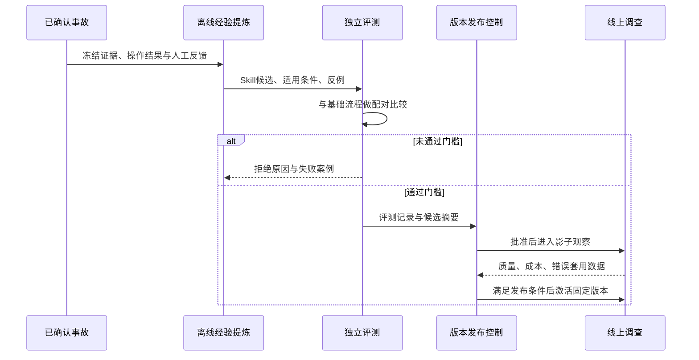

# 告警系统：部署隔离与 Tool、MCP、RAG、Skill 演进方案

> 调研日期：2026-09-09。运行现状以用户本轮实测为依据，代码与配置以本地仓库为依据，外部技术资料采用官方文档。本文是实施建议，没有部署第二台机器、发送值班消息、购买服务或完成远端压测。未读取三个禁止查看的文档。

## 一、先给出平衡后的选择

建议走“独立探针先落地 → 离线评测逐步迁出 → 真实工具补齐 → 有证据的知识检索 → 可验证的 Skill 沉淀”这条路线。

第一笔资源投入解决的是：195 整机失联时，还有一个活着的观察者能够直接通知人。它不是为了复制整套告警系统，也不是为了立即实现双机高可用。第二台 2C4G 可以兼任低并发离线回放，但探针必须优先获得资源；完整靶场、重型索引构建和高并发评测不能默认塞进去。

Agent 自进化可以做，而且值得做。但第一阶段让它自动生成、测试、提出 Skill 候选；经过验证的版本才进入生产可选列表。新增知识和改变执行权限分别管理，不能因为生成了一篇排查文档，就获得重启服务、修改配置或注入故障的能力。

这里的“进化”先定义为：面对同类 checkout 告警，能够更快选到有效查询、少走无效路径、知道什么时候不能套用旧经验，并且这些改善能由固定评测证明。暂时不需要训练模型权重。

## 二、实际部署与架构图中的部署要分开

根据用户实测，195 上有 31 个容器，靶场、告警系统本体、故障注入面全部同机。HolmesGPT 已在 M6-07 物理移除。原规划的 2C4G 没有真正部署；评测实际仍在 195 以 eval profile 运行。~~旧 mall 备份中的 117.72.208.68 与本系统无关，不能当成可用第二机。~~【2026-09-09 用户裁定推翻：117.72.208.68 即第二机（"127"/HOST2），当日已实测确认可 SSH（`ssh -i ~/.ssh/hotel_deploy root@117.72.208.68`，密钥为 hotel_deploy 而非 195 的 id_ed25519）、2 vCPU / 3757MiB 内存 / 59G 磁盘余 42G / CentOS 7 / Docker 25.0.5 与 WireGuard 已装、无容器运行、公网可达 195；迁移实施见 `告警系统-2C4G评测机迁移实施方案.md` 与评审文档 Phase 11。】

这带来三类不同问题：

| 问题 | 当前具体影响 | 对应措施 |
|---|---|---|
| 共同失效 | 195 关机，探测与发消息的程序也一起停止 | 外部探针与独立值班出口 |
| 资源争抢 | 评测、故障注入、流量发生器挤占数据库和调查进程资源 | 限额、分时、迁出离线计算 |
| 服务恢复 | 即使外面发现故障，195 上的服务仍然不可用 | 备份恢复、修复手册；后续再评估备用运行面 |

不能用“已经增加外部探针”回答“已经实现高可用”。前者缩短发现时间，后者还需要恢复能力和可验证的恢复时间。

仓库 [Gatus Compose](../deploy/gatus/compose.gatus.yml) 确实没有 `depends_on`，UI 也仅绑定本机回环地址。但这些只能说明配置打算独立部署，不能证明独立宿主机、独立网络出口和真实值班通道已经存在。

## 三、调研发现：Gatus 还不能直接判定为“填变量就能用”

当前 [Gatus 配置](../deploy/gatus/gatus-config.yml) 有三个重点核验项：`storage.type: file`、`alerting.webhook`、各 endpoint 没有声明 `alerts`。官方当前文档列出的存储类型是 memory、sqlite、postgres，并以 endpoint 的 `alerts` 关联通知提供者。现有写法与该文档存在差异。[Gatus 官方说明](https://github.com/TwiN/gatus/blob/master/README.md)

**证据边界：**本次获取锁定的 v5.17.0 源码没有成功，未运行该镜像，因此上述属于上线阻断级兼容性疑点，不能冒充该版本已经实测的报错。应使用锁定镜像进行配置加载和真实通知验收，不能拿 master 文档直接宣布旧版本一定不支持某字段。

还需要核对镜像默认配置路径与当前 `/config/config.yml` 挂载是否一致。建议显式指定配置路径，消除 `.yaml` 与 `.yml` 的约定差异。存储若选 SQLite，应指定 `/data/gatus.db` 这类文件路径并验证只读根文件系统下数据库目录可写。

通知通道不是一个 URL 就能完整描述的。飞书、企业微信、自建接收器对 JSON、签名、成功响应的要求可能不同。先确定最终通道，再选择该版本支持的原生 provider 或自定义请求机制，验证请求体和成功语义。接收器返回 HTTP 200 但业务码失败，不算通知成功。

现有 arena 前端 GET 只是在检查一个 HTTP 入口。它没有执行 checkout，也没有证明 Prometheus → Alertmanager → Inbox → RCA → Outbox → 接收器整条链路工作，建议更名为“业务入口可达探针”，另行建设端到端合成检查。

上线前最小验收必须包括：配置实际加载；目标失败后触发；恢复后通知；接收器明确收到；Gatus 重启仍能读取状态；目标挂掉不影响 Gatus 发出通知。静态字符串测试不能替代这六项。

## 四、第二台机器怎么选：先隔离什么，再决定买什么

| 选择 | 能解决什么 | 代价与局限 | 本项目建议 |
|---|---|---|---|
| 暂无第二机，先用外部心跳服务 | 195 停止定时上报时，从外部发通知 | 不能证明业务入口或完整调查正常；依赖外部服务连通性 | 可作为过渡 |
| 独立小主机只跑探针 | 独立观察 195，管理简单 | 评测仍争抢 195；增加一台主机维护 | 预算很紧时优先 |
| 独立 2C4G 跑探针与有上限的离线评测 | 同时补发现盲区、迁出部分计算 | 共机评测仍可能影响探针，必须验收资源隔离 | 推荐目标 |
| 第二机搬走完整靶场 | 故障注入与控制面进一步隔离 | 资源与网络成本更高，需按靶场实测配机器 | 后续有数据再决定 |
| 立即建设全套热备 | 有机会缩短服务恢复时间 | 数据复制、切换、仲裁和演练复杂，2C4G 不能直接保证容纳 | 暂缓 |

本次不报云厂商月费：还没有地区、带宽、续费周期和可复用机器条件，活动首购价也不等于长期成本。比价时统一计算一年正常续费、磁盘、流量、备份和维护投入。不能因为旧机 IP 出现在仓库，就默认有权复用或默认还有资源。

新机优先与 195 分离物理宿主；条件允许再选择不同可用区或供应商，同时实测两端网络稳定性。跨供应商提高部分故障隔离能力，也会增加网络抖动与排障成本。不同 IP 本身不能证明处于不同故障域。

过渡期可让 195 定时向 Healthchecks 类外部服务发送心跳，超过周期和宽限期则通知。它适合发现周期任务不再执行，不能替代主动业务探测。心跳地址作为凭据管理。[Healthchecks 官方文档](https://healthchecks.io/docs/)

## 五、网络与资源：让第二台机器真的独立

### 1. 网络只打通需要的路径

建议 HOST2 通过 WireGuard 访问 195 的少量健康检查入口，Gatus 的通知请求从 HOST2 自己的互联网出口发出，不能绕回 195 代理。否则 195 网络故障仍会同时截断探测和通知。

WireGuard 的 AllowedIPs 按具体私网地址配置；无需把 HOST2 的默认路由交给 195。只有存在 NAT 保活需要时再配置 keepalive，不能把文档中的演示值当成所有机器的固定要求。[WireGuard 官方快速入门](https://www.wireguard.com/quickstart/)

195 上仅绑定 `127.0.0.1` 的端口不会因为有隧道就自动可达。可增加绑定 WireGuard 地址的窄健康检查代理，只放行确定的 health/readiness 路径，不代理整个管理 API。不暴露 PostgreSQL、Docker socket、Chaos 管理接口给探针。Docker 会参与端口转发和防火墙规则管理，应根据实际 iptables/nftables 后端检查，从未授权来源实测拒绝，不能只看主机防火墙配置。[Docker 网络与防火墙](https://docs.docker.com/engine/network/packet-filtering-firewalls/)

### 2. 2C4G 的资源预算是待测起点

| 用途 | 建议初始预算 | 说明 |
|---|---|---|
| 系统、Docker、网络与余量 | 约 1 GiB 内存预留 | 不将全部内存承诺给容器 |
| Gatus | 先验证现有 96M、0.25 CPU 上限 | OOM 或延迟异常时调整，96M 不是测量结论 |
| 一个离线候选评测进程 | 初始上限约 2 GiB、1 CPU | 并发 1，模型计算使用远端服务时才较合理 |
| 文件缓存、短时峰值 | 剩余空间 | 禁止边评测边在同机做重型索引构建 |

CPU 上限不是保证获得 CPU 的预留。内存限制、进程数限制、日志轮转和磁盘空间阈值需要共同生效；用 `docker inspect` 与压力下的实测确认配置被应用。Docker 默认没有容器资源限制，宿主机内存不足可能影响不止一个容器。[Docker 资源约束](https://docs.docker.com/engine/containers/resource_constraints/)

建议当 HOST2 可用内存持续低于 768 MiB、磁盘使用超过 80%，或探针调度延迟持续超过一个采样周期时，停止接纳新评测。以上是初始运行策略，基线采集后再校准。已运行评测应在安全边界中止并记为基础设施失败，不把中止算成候选能力不合格。

### 3. 评测搬迁必须区分两条路径

离线回放：复制脱敏且冻结的输入、工具结果、候选版本，在 HOST2 完成推理和评分。这样的计算才真正离开 195。

Live E2E：HOST2 向 195 的故障注入面发起实验，再观察 195 的完整链路。启动器虽然搬走，靶场和调查的工作仍然发生在 195，所以仍需低并发和维护窗口。远端调用次数与并发也要限额。

当前 [application-eval.yml](../control-app/src/main/resources/application-eval.yml) 仍说明 eval 使用数据库身份和独立 profile。不能假定现有评测程序已经支持纯文件离线运行。迁移前逐个核对 EvalBatchRunner、RcaEvalAdapter 的数据库与远端依赖，必要时增加最小回放入口和结果导出；不要简单地把生产数据库账号复制到新机。

## 六、探针应该如何判断故障

第一层检查网络或入口可达；第二层检查 control readiness、Alertmanager readiness 等组件状态；第三层用唯一合成标记检查告警链路最终有没有抵达独立接收器。三层给出不同结论：入口不通、组件不可用、链路超时，不能统一声称“主机宕机”。隧道断开也可能导致探测失败。

30 秒间隔、连续 3 次失败，理想情况下约在故障后 60～90 秒达到失败次数；60 秒间隔则约为 120～180 秒。请求超时、串行调度和通知传输会增加时间，最终验收以实测为准。连续 2 次成功再报恢复，用来减少抖动。

合成链路可以分两档：低频检查接入到通知的确定性路径；更低频执行包含调查的完整路径。频率与允许费用挂钩，不每 30 秒发起一次昂贵 RCA。合成告警使用专用服务标签和接收器，避免污染真实事故统计，也避免被误转发给真实业务值班人员。

Gatus 自己也可能停止。HOST2 的健康上报应由实际检查 Gatus 调度进展的任务触发，再向独立心跳服务报告；单纯 systemd 定时器活着不代表 Gatus 活着。任意有限监控系统都有边界，不必无限部署互相监视的服务器，但至少应使“195 死亡”和“外部观察者死亡”都有独立通知路径。

验收矩阵：停 control → 外部组件故障通知；断隧道 → 路径故障通知；停 Gatus → 外部失联通知；压满评测预算 → 探针仍按时执行；恢复目标 → 恢复通知；阻断通知服务 → 发送失败可见并可追踪重试。整机停机演练应另定窗口，不能用停止一个容器冒充整机故障验收。

## 七、Tool：先让 Agent 真能拿到证据

当前 [AlertAm4Config](../control-app/src/main/java/com/objwww/pr/control/infrastructure/config/AlertAm4Config.java) 注册真实 Prometheus 查询，而 logs/change 使用 ReplayToolExecutor。[ToolRegistry](../control-app/src/main/java/com/objwww/pr/control/alert/application/tool/ToolRegistry.java) 启动时构造，禁止重名与运行时随意注册；[ToolGateway](../control-app/src/main/java/com/objwww/pr/control/alert/application/tool/ToolGateway.java) 已有策略检查、参数校验、摘要、超时和结果上限。高风险 R2/R3 目前只记录意图，不执行。

所以最先增加的不是几十个工具名称，而是三条能支持 checkout 排查的证据链。

| 拟新增或补齐的工具 | 回答的原子问题 | 结果至少包含 |
|---|---|---|
| 日志窗口查询 | checkout 失败时间段出现了什么错误 | 服务、时间范围、来源、采样规则、截断标记 |
| 部署与配置变更查询 | 异常前有哪些已生效变更 | 版本、变更时间、作用服务、差异摘要 |
| Trace 查询，前提是有可检索存储 | checkout 的哪一段调用失败 | trace/span 身份、父子关系、服务、状态和时间 |
| 依赖拓扑查询 | 某个下游异常是否能影响 checkout | 拓扑来源、版本与有效时间 |

已有 Collector 不等于已经拥有可检索日志库或 Trace 存储。先盘点数据是否真正落盘、保留多久、能否按服务和时间查询，再选后端。优先复用已经存在的只读 API；不要为了工具名称先新增一整套日志平台。

每个工具都应声明允许的服务集合、时间窗、最大行数、超时、结果大小和凭据权限。超时后 Java Future 取消不保证远端查询停止，需要客户端和服务端查询限时共同工作。结果限长也应发生在读取过程中，避免先读进巨大响应再拒绝。

工具失败与没有异常是两回事。返回 NO_DATA 时，报告写“当前来源无法提供证据”，不能写“日志正常”。每份证据保存来源版本和内容摘要，保证回放使用当时结果，而不是重新查已经变化的数据。

## 八、MCP：统一接入协议，不新增一条绕开治理的路

Tool 是“能查询什么”，MCP 是“外部能力如何被发现和调用”。MCP 定义工具列表、调用及输入输出结构；工具描述和风险注解不能自动视为可信授权。[MCP Tools 规范](https://modelcontextprotocol.io/specification/2025-06-18/server/tools)

建议新增一个基础设施层的 McpToolExecutor，作为现有 ToolExecutor 的一种实现。调用路径保持为：Agent 提议 → ToolGateway 校验 → 固定注册的执行器 → MCP Server → 结果校验与证据存档。不要让 Agent 自己连接任意 MCP URL。

首先只接一个确实需要的只读数据源，固定 server 身份、工具名称、schema hash 和版本。工具列表在部署或受控刷新时核对；远端新增工具不自动进入生产名单，schema 改变先失败并告警。Run 冻结本轮工具清单摘要，避免调查中途换语义。

认证凭据由服务端注入，模型只看逻辑工具名。远端地址白名单、结果大小限制、连接超时、调用预算、租户或服务权限都继续由宿主控制。MCP 返回的文本也可能含有“请忽略约束”之类内容，它只是证据数据，不是本系统指令。

为什么不把现有 Prometheus 工具全部改成 MCP？直接 HTTP 接入已经简单可控，为协议统一增加进程和网络跳转不一定产生收益。当多个数据源能复用成熟 MCP Server，或者确有跨语言共享需求时，适配器才有明显价值。MCP 不替代队列、事务和状态机。

## 九、RAG：让过去的排查经验能被找到，但不替代当下证据

RAG 在本项目解决的问题是：收到 checkout 告警后，有没有经过确认的历史事故、服务说明和排查步骤可供参考？它返回的是候选知识，不是当前根因。

先建立三个知识类别：人工确认的事故复盘、受维护的服务与依赖说明、已经批准的排查 Skill。普通 Agent 报告先留在候选区，不自动进入权威知识库。否则模型今天猜错，明天检索到自己的错误，再把它当成外部证据。

最小方案先用现有 PostgreSQL 保存元数据和短文档，按服务、环境、故障特征、适用版本、审核状态和时效过滤，再做关键词检索。中文文本要明确分词策略，不能假设默认英文全文检索能满足中文复盘检索。可以先用服务名、错误码、配置键等精确特征建立可衡量基线。

只有检索测试证明语义召回确实不足，再增加 embedding 与 pgvector，并比较关键词、向量、混合检索。pgvector 可以与 PostgreSQL 数据共存，提供精确与近似向量检索；近似索引是用部分召回率换速度，需要测试过滤条件下的漏召回。[pgvector 官方文档](https://github.com/pgvector/pgvector)

这不意味着应在 195 上立即构建大向量索引。索引、embedding 批处理和评测首先放到离线窗口或外部计算面；控制数据库的事务延迟优先。数据量和查询负载实测超过当前预算后，再考虑独立检索服务或向量库。

每条检索片段保存 document_id、version、chunk_id、content_digest、来源、有效期、适用服务与审核状态。按一个完整排查动作或判断分支切片，不能把“前提”和“结论”切散。初始只取少量候选，例如 3～5 条，并设置上下文预算；数值通过评测调整。

权限与失效过滤在候选召回阶段就执行，不能先把全量文本给模型再要求它忽略无权内容。被撤销的 Skill 或文档要从有效检索结果中去除，但历史 Run 保留原始版本引用。当前检索为空时回到基础调查流程，不能强行匹配一段经验。

## 十、Skill：把排查思路变成下一次可执行的方法

一篇复盘通常回答“上次发生了什么”，一个 Skill 应回答“在什么条件下，下一次该怎样验证”。例如 checkout 错误率升高后，先确认错误指标的时间窗与服务范围，再检查近期变更，再判断失败调用是否集中于某个依赖；若证据不支持，必须退出该分支。

建议 Skill 的核心内容包括：适用条件、排除条件、所需工具及版本、参数约束、逐步查询、分支判断、需要保留的证据、停止条件、预算、反例和失效条件。不能只保存“某下游经常出问题，优先怀疑它”。

Agent Skills 的通用格式用 SKILL.md 保存元数据与正文，并支持按需加载参考资料；其中 allowed-tools 仍属于实验性字段，宿主是否执行权限限制需要单独实现。[Agent Skills 规范](https://agentskills.io/specification)

本项目可以输出兼容该格式的文档包，但执行仍使用已有受限 Plan/DAG 和 ToolGateway。SKILL.md 是可读方法描述，另一个结构化 plan 描述可执行节点；发布时检查二者一致。第一阶段不允许候选 Skill 附带任意 shell 脚本，也不允许它修改自己的工具白名单。

### 1. 经验如何产生

从已结束并经过质量确认的 Run 提取“做了什么、拿到什么证据、哪个假设被证伪、哪些查询没有收益”。这里沉淀的是可审计的操作与判断依据，不需要存模型隐藏思维链。

失败案例也要参与学习。比如相似 checkout 告警最终来自不同依赖，应形成排除条件与分支，而不是只记住成功归因。重复采样同一个事故不能当成多个独立成功案例。

### 2. 为什么需要状态机，以及怎样设计

先从风险逐个推导：自动产物可能错，所以有 DRAFT；结构可能不合法，所以有 VALIDATING；结构正确不代表有效，所以有 EVALUATING；离线变好不代表线上稳定，所以有 SHADOW；只有符合发布条件的版本才有 ACTIVE；出错或过期需要 REVOKED/DEPRECATED。

| 状态 | 允许动作 | 转移条件 |
|---|---|---|
| DRAFT | 保存候选和来源引用 | 内容齐全后进入 VALIDATING |
| VALIDATING | schema、权限、引用、预算静态检查 | 通过进入 EVALUATING；失败 REJECTED |
| EVALUATING | 固定数据集比较基础流程与 Skill 流程 | 满足门槛进入 REVIEW；基础设施失败可重试 |
| REVIEW | 复核适用范围和证据 | 首阶段人工批准后进入 SHADOW |
| SHADOW | 仅生成候选结论，不影响正式通知 | 满足观察窗口与质量门槛后进入 ACTIVE |
| ACTIVE | 新 Run 可按适用条件选用 | 质量回退则 REVOKED；自然淘汰则 DEPRECATED |
| REJECTED / REVOKED / DEPRECATED | 留档审计，禁止新 Run 选择 | 修改后建立新版本，重新走流程 |

状态属于一个不可变 Skill 版本。编辑内容生成新 digest，不在原 ACTIVE 文件上覆盖。每次转移记录操作者、原因、评测版本和时间，使用预期状态与版本号的 CAS 防止两个发布者竞争覆盖。

普通版本更新不影响正在执行的 Run；但发现越权或污染时需要紧急撤销。每次工具执行前检查撤销状态，停止后续动作并以明确原因结束或退回安全基础流程。这样既能重现历史选择，又能阻止危险版本继续运行。

### 3. 自动晋级如何逐步开放

第一阶段自动写候选、自动测试，由人批准生产启用。第二阶段积累足够可靠的评测与回滚证据后，只对不增加权限、只读、适用范围窄的 Skill 开放规则驱动自动晋级。涉及写操作、工具权限、故障注入和通知政策的变化始终走独立变更流程。

Skill 可以建议优化工具，但不能自行安装新的 MCP Server；可以提出增加数据源，但不能自行领取新凭据。动态加载内容与动态安装执行代码是两种不同能力。

## 十一、怎样证明“越用越聪明”，而不是越用越自信

这张图说明，自动提炼的终点先是“候选版本”，不能直接覆盖线上行为。评测输入独立于提炼案例，影子阶段只观察效果；生产调查只选择已经激活的版本。任何一步失败都应留下原因，后续修改生成新版本，不把失败状态改成成功来绕过检查。

为同一批冻结输入运行三组：基础流程、基础流程加 RAG、基础流程加 RAG 和 Skill。记录正确根因率、无证据断言率、适用场景召回、错误套用率、工具次数、成本、耗时，以及证据不足时正确退出的比例。

数据按事故和时间划分，不能把同一事故的重复告警同时放进训练经验和测试集。提炼 Skill 所用案例不进入独立验收集；评测故障注入答案不暴露给线上调查侧。

晋级要求应是多目标：准确性不退化、无证据断言不增加、权限零越界，并在成本或耗时上有明确改善。小样本不宣称统计显著；先做配对回放与具体错误审查，积累样本后给出置信区间。不能用模型给自己打的高分作为唯一门槛。

为防止循环强化错误，应记录知识来源关系：Skill A 引用哪些事故，哪些报告又使用了 A。由 A 生成的报告不能无条件成为 A 的独立成功证明。人工确认、确定性的事实校验和独立保留集提供外部反馈。

## 十二、百万告警时，新能力怎样避免放大负载

Tool、RAG 和 Skill 都在 Incident/Run 的调查层使用，不对每条原始 Alertmanager Event 立即检索和调用模型。先去重与合并，再判断是否需要新调查；Skill 候选按已确认事故生成，不对百万条重复事件生成百万份经验。

百万条每天约 11.6 条/秒，百万条每分钟约 1.67 万条/秒，两者差别巨大。是否撑得住仍要测入口、投影、数据库写入、唯一事故数量和调查耗时，第二台 2C4G 不能自动证明百万告警能力。

假设聚合后有 1 万个独立调查、每个平均 30 秒，4 个有效并发的理想耗时仍约为 20.8 小时，尚未计算限流和重试。这是计算示例，不是当前容量；当前有效并发以生产 worker 实现和实测为准。

优化策略是分层预算：优先保证事件接收和恢复处理；调查按重要度排队；RAG 有查询上限；Skill 生成与 embedding 作为低优先级离线作业，积压时暂停。缓存知识候选可按服务、版本、错误特征与知识库版本复用，但当次指标和日志证据不能直接沿用上次事故结果。

## 十三、新增优化项：与原有 13 项一起排优先级

以下 EXT 编号是本文新增建议，不占用仓库已有 P/O/M 任务编号；P0/P1/P2 是建议优先级，不代表已批准或已完成。原文的背压、证据链、DAG、预算、数据库、恢复与评测改进仍然保留。

| 编号 | 优先级 | 工作与依赖 | 验收结果 |
|---|---|---|---|
| EXT-01 | P0 | 验证锁定 Gatus 镜像的 storage/provider/alerts/配置路径，替换只查字符串的验证 | 同版本容器实际失败、恢复通知闭环 |
| EXT-02 | P0 | 确定 HOST2 与独立值班通道，配置窄网络入口 | 195 失联时外部仍能通知，非授权网络不可达管理面 |
| EXT-03 | P0 | 独立探针自身失联检测与通知失败可观测 | 停 Gatus 和断通知出口分别留下可核对结果 |
| EXT-04 | P1 | 采集 195/第二机资源基线，限制评测、日志、流量发生器 | 评测压力下接入延迟与探针调度不越验收阈值 |
| EXT-05 | P1 | 区分离线与 Live E2E，迁出真正离线计算 | HOST2 回放不持续调用 195 数据面，费用和结果可追溯 |
| EXT-06 | P1 | 建立唯一标记合成告警，区分入口 health 与全链路 | 人为打断每一段都能定位，而非仅返回 200 |
| EXT-07 | P1 | 外部备份与恢复演练，覆盖数据库与内容对象引用 | 在干净环境恢复到指定时间并核对证据，记录 RPO/RTO |
| EXT-08 | P1 | 日志、变更真实 Tool；Trace 工具以存储存在为前提 | 当前证据能支撑或证伪断言，回放与在线明确区分 |
| EXT-09 | P2 | 一个只读 MCP 适配器，固定版本与 schema | 超时、schema 漂移、越权、恶意结果不能绕过 Gateway |
| EXT-10 | P2 | 版本化知识库与精确/关键词检索基线 | 有权限过滤、失效过滤、来源引用和无结果降级 |
| EXT-11 | P2 | 对比检索基线后按需加入 pgvector | 召回收益覆盖额外成本，不挤占事务服务预算 |
| EXT-12 | P2 | 从确认事故自动提炼 Skill 候选 | 有适用范围、反例、证据与预算，无自动新增权限 |
| EXT-13 | P2 | Skill 版本状态机、评测、影子、晋级与撤销 | 并发晋级不覆盖，紧急撤销立即阻止后续动作 |
| EXT-14 | P2 | 三组配对评测与防数据泄漏 | 能证明哪些 Skill 有益，失败版本不会反复晋级 |

建议执行顺序：先 EXT-01～03 补失明盲区；同时修原文背压、冻结输入与真实证据这些正确性问题。随后 EXT-04～08 建立资源、数据和恢复基础。MCP、RAG、Skill 按具体案例逐步接入，第一期只做一个可复用的 checkout 排查 Skill。

RabbitMQ、Redis、独立向量数据库和 Kubernetes 都不解决“观察者与被观察者同机”这个问题。工具扩展和 Skill 生命周期也能先复用现有 PostgreSQL 事务与任务结构。只有吞吐、检索或隔离测量证明现有机制不足时，才为具体瓶颈引入新组件。

## 十四、落地前需要收口的事实

还需确定：值班接收协议与地址、允许的网络方式。~~独立主机来源与资源~~【2026-09-09 已收口：HOST2 = 117.72.208.68（2C4G 实测确认，SSH 经 hotel_deploy 密钥），详见迁移实施方案头部机器身份块】。它们影响部署参数，但不妨碍先完成锁定版本验证、资源基线采集和离线回放依赖梳理。

本轮未实测 195、第二机、Gatus 镜像和百万负载；Gatus 版本差异保留为待验证项。对外部资料的引用用于解释机制，具体预算、阈值、状态机和实施顺序是结合仓库的工程建议。完整源码讲解及原有优化见 [主文档](告警系统-从一条业务告警到可靠调查-源码讲解.md)。
