# 告警 Agent 后续目标架构设计 v1.2

> 文档日期：2026-09-04  
> 状态：**核心骨架已冻结；第二/三轮治理补充已纳入，待落码验收**  
> 适用范围：AM2、AM3、AM4、AM5 及 HolmesGPT 逐步替换期  
> 部署前提：**Docker Compose，非 Kubernetes；主机 195 + 一台 2C4G 评测机**  
> 文档关系：这是面向后续演进的增量目标架构，不修改、不覆盖 `架构设计-告警Agent-v1.md`、AM2、AM3 已冻结的实现语义。

---

## 1. 为什么现在先写目标架构

当前 AM1 已经形成告警入口、Incident、RCA Run/Task/Attempt、HolmesGPT 调查和报告落库的最小控制面；AM2 将补齐交易靶场和 ground truth；AM3 将补齐确定性评分、调查记录、通知出口和 LiteLLM 对账。

后续真正会改变系统骨架的是两件事：

1. HolmesGPT 从唯一调查引擎变为基线引擎，Native 多 Agent 引擎先影子运行，达标后逐步接管。
2. 评测从“5 个场景能算准确率”演进为覆盖结果、过程、工具、成本、协作、安全的六维质量控制面。

如果现在不先冻结组件边界、数据契约和状态流，AM4/AM5 很容易再次改表、改审计模型、改任务执行链。本架构解决的是这个问题，**不是要求 AM2/AM3 一次实现全部目标能力**。

## 2. 目标、边界与非目标

### 2.1 目标

- Alertmanager 告警经过认证、验证、限流、幂等和原子持久化后立即返回 HTTP 202，异步进入 RCA。
- 一个 Alertmanager group 是一次投递信封；信封内单条 alert 独立去重，最终按 `incident_key` 汇聚，**同一 Incident generation 只触发一个 RCA Run**。
- Java `control-app` 是唯一确定性控制面；LLM 不参与认证、限流、状态迁移、权限裁决、重试、DLQ、发布和质量门禁。
- HolmesGPT 与未来 Native Engine 共用相同的输入契约、只读工具边界、证据格式和审计事件。
- 生产调查、影子评测和主动故障注入三种权限彻底分离。
- 六维评测可从少量真实 E2E 起步，并演进到 200+ 分层样本；不把“样本数量”误写成“200 次昂贵真栈实验”。
- 系统任何结论都能追溯到版本、输入快照、工具调用、证据摘要、原始 artifact digest 和最终裁决。

### 2.2 非目标

- 不引入 Kubernetes、Helm、ServiceAccount、NetworkPolicy 或 Kyverno。
- 不为“小体量”引入 Redis、Kafka、RabbitMQ 或第二套工作流平台；PostgreSQL 同时承担状态库、持久队列、outbox 和 DLQ。
- 不保存或评测模型的隐藏思维链（Chain of Thought）；只记录可审计的任务、动作、观察、证据、Claim 和裁决事件。
- 不允许候选 Agent、HolmesGPT 或评测机直接发送通知、执行故障注入、写生产业务库。
- 不以单一 `F1 > 0.85` 作为上线条件；样本规模不足时，不给出虚假的统计确定性。

## 3. 架构冻结决策

| 编号 | 冻结决策 |
|---|---|
| FUT-01 | 控制面与调查面分离：Java 决策，Agent 只产候选事实和建议。 |
| FUT-02 | 入口按 Alertmanager group 原子接收，按 alert fingerprint 幂等，按 incident generation 触发 RCA。 |
| FUT-03 | PostgreSQL 是唯一持久化协调设施；所有异步推进均可从 DB 恢复。 |
| FUT-04 | 多 Agent 是受注册表约束的持久化 DAG，不是 Agent 间自由聊天。 |
| FUT-05 | HolmesGPT 保留为 Baseline；Native Engine 必须先 Shadow，再 Canary，最后才可成为 Primary。 |
| FUT-06 | Baseline 与 Candidate 接收同一份不可变 `EvidenceSnapshot`；Snapshot 由 digest 标识。 |
| FUT-07 | 工具只经统一 Tool Gateway 调用；名称、参数 schema、权限等级、超时和结果大小均由注册表限定。 |
| FUT-08 | Holmes 与 Candidate 永远只持 R0/R1 只读权限；R2/R3 动作由控制面提出、策略判定、人工审批、独立 Action Runner 执行。 |
| FUT-09 | 评测不记录 Thought；记录可验证的 Agent Event、Tool Call、Evidence、Claim、Report。 |
| FUT-10 | 回放分 Scorer Replay、Agent Replay、Live E2E，三者的成本和证明能力不得混淆。 |
| FUT-11 | Quality Gate 分硬安全门、质量门、运行门；安全失败 fail-closed。 |
| FUT-12 | 只有安全/运行故障可自动切回 Holmes；语义分歧必须结合 ground truth 或人工复核，不自动回滚。 |
| FUT-13 | 生产数据与 ground truth 隔离；调查引擎看不到 ground truth，只有 `eval_app` 在报告封存后读取。 |
| FUT-14 | 审计不采样，遥测可采样；ID、prompt、原始日志不得进入 Prometheus label。 |
| FUT-15 | 两台主机通过 WireGuard/等价私网互通，不暴露 Docker TCP 2375，不开放 PG/Prometheus/Chaos 管理端口到公网。 |
| FUT-16 | 所有契约带 `schema_version`；升级采用双读单写、回放兼容测试和明确退场窗口。 |
| FUT-17 | Prompt、规则、工具策略、模型路由和阈值组成不可变 `ConfigBundle`；每个 Run 启动时固定一个 `config_digest`，热更新只影响新 Run。 |
| FUT-18 | 工具执行模式只能由控制面策略指定；`VALIDATE_ONLY/REPLAY_MOCK/SHADOW_READ/LIVE` 明确分离，外部请求头无权改变模式。 |
| FUT-19 | 每个 Run 有不可透支的组合预算：步骤、子任务、LLM 调用、Token、工具调用、证据字节、费用和墙钟时间。 |
| FUT-20 | 所有观测查询绑定 Incident 时间窗；历史数据缺失返回 `DATA_UNAVAILABLE`，禁止用当前数据解释历史事故。 |
| FUT-21 | Harness 只依赖内部 `ModelRequest/ModelResponse/ToolProposal`，提供商差异封装在 LiteLLM 和边界 Adapter。 |
| FUT-22 | LLM 逃生结果是“降级分诊”而不是“已确认 RCA”；只允许精确复用、版本化规则和静态模板，必须显式标记证据覆盖度。 |
| FUT-23 | 外部 API 采用 pin 版本 + 契约测试 + 能力探测 + 熔断；禁止运行时从网络动态下载未知插件。 |
| FUT-24 | 灾备以 PostgreSQL WAL/PITR、CAS 异机备份和恢复演练为准；不把 2C4G 评测机虚构成温备，不备份进程内存或 Redis。 |
| FUT-25 | `config_bundle` 永久不可变；发布和回滚都追加 activation event，并以带版本号的 active pointer 做 CAS，禁止“回滚时重新打开旧行”。 |
| FUT-26 | PostgreSQL 队列只允许短事务抢占；入口与 Worker 使用隔离连接池，claim SQL 有部分索引、批量上限和会话级超时，池耗尽时入口快速返回 503。 |
| FUT-27 | Agent Replay 的 Observation 只能按 `tool/version/canonical_args/scope/time_range/snapshot_digest` 精确命中；未命中返回 `REPLAY_MISS`，禁止近似伪造。 |
| FUT-28 | Candidate 对 R2/R3 的影子评测只记录 ToolIntent 和策略判定，绝不执行；该模式归 `VALIDATE_ONLY`，不冒充 `SHADOW_READ`。 |
| FUT-29 | 安全评测把 Utility 与 Security 分开；硬门统计“本评测批次观测到的攻击成功数=0”，不宣称系统永久、绝对无法被攻破。 |
| FUT-30 | Holmes 原生 tool-call/usage 元数据进入内部版本化 Adapter；Holmes 审批只作附加防线，不能替代控制面策略、action digest 和执行回执。 |
| FUT-31 | OTel GenAI 语义处于 Development 时只作遥测映射；审计表与事件契约独立版本化，prompt、参数、结果内容默认不进 span。 |
| FUT-32 | RCA 控制面的自告警必须走独立接收通道，线上不得递归触发自身 RCA；2C4G 以独立黑盒探针验证入口到通知链路。 |
| FUT-33 | WebSocket/SSE 只是 PostgreSQL 事件流的实时投影，不是状态、取消或消息回放的权威来源；连接断开不得改变 Run 状态。 |
| FUT-34 | 浏览器实时连接不得复用 Alertmanager 机器 Bearer；使用同源用户会话或短时、单次、绑定主体与 Run 的 stream ticket，并逐次校验 Origin 与资源权限。 |
| FUT-35 | 取消、操作员 Hint 和人工 Feedback 必须先持久化再生效；Hint 永远是带来源的不可信材料，Feedback 经人工复核后才能进入 Dataset/知识库。 |
| FUT-36 | 对账按 Worker 租约、模型用量、只读工具、写动作和通知 Outbox 分治；UNKNOWN 不得直接重放写动作，也不得把迟到结果补进已冻结 EvidenceSnapshot。 |
| FUT-37 | Incident 的 FIRING/RESOLVED 只是 Alertmanager 事实的本地投影；增加低频 Source State Reconciler，发现上游与本地漂移时追加 Observation，不伪造原 webhook。 |
| FUT-38 | 预算同时约束 Run 和 Incident：同一 Incident 在窗口内的 generation 数、累计 LLM/Token/费用均有硬上限，超限停止派生新 Run 并确定性升级人工。 |
| FUT-39 | 两台主机分别建立完整资源账本与降级顺序；HOST1 内存闸比评测机更优先，内存不足时先停靶场/影子，再停领取新 RCA，不丢入口。 |
| FUT-40 | 模型采样参数属于执行契约：temperature、top_p、max_tokens、seed 请求/生效状态和 provider fingerprint 全部入 Attempt 元数据与执行指纹；评测承认残余非确定性并报告重复试验方差。 |
| FUT-41 | 全系统只保留一份权威 append-only `rca_event`；Agent 事件和 UI 实时流均为该账本的视图/投影，不再同步双写 `rca_agent_event + rca_stream_event`。 |
| FUT-42 | Dataset 固定分为 TUNING、VALIDATION、HOLDOUT、REDTEAM；HOLDOUT 不参与 Prompt/规则/同义词/RAG 调优，只用于发布门和对外数字。 |
| FUT-43 | AI 的不确定性必须确定性收口：重复 UNRESOLVED、NEEDS_REVIEW 聚集、人工纠错分歧进入版本化 Operator Case/升级 Outbox，具备去重、认领、SLA 和终态。 |
| FUT-44 | Harness 的日志、指标、Trace 三支柱与审计账本分离；遥测失败不改变业务事实，控制面自告警走独立值班通道，绝不回流线上 RCA。 |
| FUT-45 | 热/冷数据迁移由版本化 RetentionPolicy 控制，以月分区、归档 manifest、条数/digest 校验和 legal hold 保证可查可删；固定天数只是初始基线，不写死在代码。 |
| FUT-46 | Ground Truth 是独立权限域内的 append-only Dataset 版本；样本有适用范围和有效期，架构变更先触发 REVIEW_REQUIRED，不无差别自动失效。 |
| FUT-47 | `EvidenceSnapshot` 是冻结输入，`EvidencePackage` 是 Agent 的结构化输出，二者不得混名；AM3 v2 双读，AM4+ 才允许增加排序候选根因。 |
| FUT-48 | Top-3 只在输出契约存在 `candidate_root_causes[]` 时计算；AM3 单根因契约只产 Top-1，不能从 Claim 或模型自评置信度伪造 Top-3。 |
| FUT-49 | 报告采用“两轴状态”：不可变验证状态归 `rca_report`，可重试发布状态归 `report_publication`；组合生命周期替代同一字段混装。 |
| FUT-50 | 所有持久契约显式携带或可由受约束外键无歧义投影 `run_id/observed_generation/schema_version/digest/created_at`；AM3 结果与 ToolCall 在 AM4 迁移前补齐直接栅栏列。 |
| FUT-51 | REPLAY/REDTEAM 只走冻结 Snapshot + `REPLAY_MOCK`；在线 Shadow 才能走独立限流的 R0/R1 实时只读端点，红队流量物理禁止进入生产观测路径。 |
| FUT-52 | Holmes 的 1:N 模型调用预算必须在 LiteLLM 可见调用处执行 admission control；control-app 仍做预留/总账，对账不能冒充实时硬闸。 |
| FUT-53 | Incident 身份由版本化 `IncidentIdentityPolicy` 精确定义到告警族；服务级与实例级告警使用不同 label allowlist，模型不得决定归并，发现多因时按证据作用域派生子调查。 |
| FUT-54 | 每一类 Reconciler 都有 attempt/墙钟/积压年龄预算、退避和升级终态；对账不是可无限运行的后台循环。 |
| FUT-55 | AM5 可评估 PostgreSQL 内 pgvector/全文检索作为“待验证历史假设”来源；检索结果永远是 UNTRUSTED，不得直接复用根因，不得访问 HOLDOUT/Ground Truth。 |

### 3.1 AA 与 FUT 的冻结追溯矩阵

`架构设计-告警Agent-v1.md` 的 AA 编号是既有基线；本文 FUT 编号是目标增量。AA 保留为稳定别名，不再新增。自动化检查以 `INV-*` 不变量为主，避免两个编号体系各自漂移。

| AA 基线 | 本文 FUT/章节 | 权威不变量 | 最早里程碑 |
|---|---|---|---|
| AA-1 | §18 | INV-01 复用优先、领域胶水自研 | AM0+ |
| AA-2、AA-14 | FUT-01 | INV-02 LLM 不拥有控制权 | AM1+ |
| AA-3 | FUT-02、FUT-26、§5 | INV-03 durable commit 后才返回 202 | AM1+ |
| AA-4 | FUT-02、FUT-53、§5.3 | INV-04 alert/incident/payload/investigation 身份分离 | AM1+ |
| AA-5 | FUT-02、FUT-04、§14 | INV-05 同 Incident generation 最多一个活跃 Run | AM1+ |
| AA-6、AA-7 | FUT-03、FUT-19、FUT-26、§13 | INV-06 调度只用持久租约/槽位/期限 | AM1+ |
| AA-8 | FUT-07、FUT-36、FUT-54、§17.10 | INV-07 先记账再触网；UNKNOWN 只对账不猜测 | AM1+ |
| AA-9 | FUT-09、FUT-47、FUT-49、§7 | INV-08 结构验证与证据验证分离 | AM1+ |
| AA-10、AA-11 | FUT-14、FUT-15、§11 | INV-09 Secret 不持久化且管理端口不裸露 | AM0+ |
| AA-12 | FUT-07、FUT-08、FUT-23、§17.2 | INV-10 Holmes 仅经白名单 R0/R1 边界 | AM1+ |
| AA-13 | §19 | INV-11 无死代码且验收证据可复核 | AM1+ |
| AA-15 | FUT-04、FUT-19、§6 | INV-12 DAG 有界、无环、可恢复 | AM4 |
| AA-16 | FUT-16、FUT-47～50、§7 | INV-13 契约版本化且输入/输出/报告语义不混用 | AM3+ |
| AA-17 | FUT-01、FUT-09、§6.2 | INV-14 Claim 由证据与权威源裁决，不按模型投票 | AM4 |
| AA-18、AA-19 | FUT-08、FUT-18、FUT-28、§11.3 | INV-15 副作用动作绑定 digest/审批/回执 | AM5 |
| AA-20 | FUT-04、FUT-49、§14、§20.1 | INV-16 状态只能沿冻结状态机推进 | AM1+ |
| AA-21 | FUT-03、FUT-19、FUT-36、§14 | INV-17 重试只新建 Attempt；DLQ 不改写原事实 | AM1+ |
| AA-22 | FUT-08、FUT-15、FUT-51、§11 | INV-18 身份、网络和评测数据路径最小权限 | AM1+ |
| AA-23 | FUT-14、FUT-31、FUT-41、FUT-44、§15 | INV-19 审计不采样；遥测低基数且不反向控制业务 | AM3+ |
| AA-24 | FUT-03、FUT-14、FUT-45、§17.12 | INV-20 PG 存事实/CAS 存大对象/归档可验证 | AM1+ |
| AA-25 | FUT-19、FUT-26、FUT-39、§12～13 | INV-21 所有并发必须有连接与内存预算 | AM1+ |
| AA-26 | FUT-09、FUT-10、FUT-14、§15.2 | INV-22 E2E 证据包可复现，截图只作辅助 | AM2+ |

如同一项同时出现 AA 与 FUT，评审和测试报告必须同时写出 `INV-*`；INV 是语义锚点，AA/FUT 只是来源与演进索引。

## 4. 最终逻辑架构

```mermaid
flowchart LR
    AM[Alertmanager] -->|group webhook| IG

    subgraph MAIN[主机 195：生产控制面与靶场]
        direction TB

        subgraph INGRESS[入口控制面]
            IG[Transport Gate<br/>认证·Content-Type·请求体上限]
            RL[Rate Limiter<br/>单实例限流/租约配额]
            CG[Content Guard<br/>JSON Schema·字段约束·内容风险]
            IA[Atomic Intake<br/>Group 落库·Alert 幂等]
            IG -->|通过| RL --> CG --> IA
            IG -->|拒绝| AUDIT
            RL -->|429| AUDIT
            CG -->|拒绝| AUDIT
        end

        subgraph ORCH[确定性编排控制面 control-app]
            IP[Inbox Projector<br/>Incident 聚合]
            SUP[Supervisor<br/>状态机 + DAG 编译]
            SCH[Scheduler<br/>Lease·Retry·DLQ·生命周期]
            RED[Claim Reducer<br/>冲突裁决]
            VAL[Report Validator<br/>结构 + 证据引用]
            PUB[Publication Outbox]
            IP --> SUP --> SCH
            RED --> VAL --> PUB
        end

        subgraph ENGINE[调查与动作边界]
            HOLMES[HolmesGPT<br/>Baseline / R0-R1]
            TG[Tool Gateway<br/>注册表·策略·审计·预算]
            APPROVAL[Approval Service<br/>绑定 action_digest]
            ACTION[Action Runner<br/>唯一 R2-R3 身份]
            APPROVAL --> ACTION
        end

        subgraph DATA[生产事实与证据]
            PG[(PostgreSQL<br/>状态·队列·Outbox·DLQ·审计元数据)]
            CAS[(Local CAS<br/>原始响应·大证据·digest)]
            AUDIT[(Append-only Audit Ledger)]
        end

        subgraph TARGET[告警源与观测]
            ARENA[order-arena / Astronomy Shop]
            OBS[Prometheus·Alertmanager<br/>Logs·Trace·Docker Probe]
            ARENA --> OBS
        end

        IA -->|commit 后 202| IP
        SCH -->|AgentTask| HOLMES
        HOLMES -->|ToolRequest| TG
        TG -->|只读| OBS
        HOLMES -->|AgentResult| RED
        ORCH <--> PG
        ORCH <--> CAS
        ORCH --> AUDIT
        TG --> AUDIT
        ACTION --> AUDIT
        ACTION -.->|审批后主动验证| ARENA
    end

    subgraph EVAL[备用 2C4G：隔离评测与影子面]
        direction TB
        ER[Shadow Router / Eval Runner]
        NATIVE[Native Multi-Agent Engine<br/>Candidate / R0-R1]
        REPLAY[Replay Harness<br/>Scorer·Agent·Live]
        DATASET[(Versioned Dataset<br/>Golden Set + 对抗样本)]
        SCORE[Deterministic Evaluator<br/>六维指标]
        GATE[Quality Gate<br/>Hard·Quality·Operational]
        LLM[LiteLLM Proxy<br/>模型路由·Token/Cost 账本]

        ER --> NATIVE
        DATASET --> REPLAY
        REPLAY --> NATIVE
        REPLAY -->|历史输出| SCORE
        NATIVE -->|CandidateResult| SCORE
        SCORE --> GATE
        NATIVE --> LLM
    end

    PG -->|shadow_eval_outbox<br/>最小元数据| ER
    CAS -->|同一 EvidenceSnapshot<br/>私网只读/签名引用| ER
    NATIVE -->|受限只读 ToolRequest| TG
    HOLMES -->|模型调用| LLM
    PG -->|Baseline Result / Events| SCORE
    GATE -->|证据包| HUMAN[人工评审 / 发布决策]
    HUMAN -->|批准 Canary| SUP
    PUB --> NOTIFY[notify-app / IM]
```

### 4.1 每个面只做一类决定

| 平面 | 能决定什么 | 明确不能决定什么 |
|---|---|---|
| 入口面 | 请求能否接收、是否重复、是否超限 | 不能判断根因 |
| 编排面 | 任务何时运行、重试、终止、降级、发布 | 不能伪造证据 |
| 调查面 | 查询什么、形成哪些候选 Claim | 不能越权写系统或直接发布 |
| 裁决面 | Claim 是否有效、冲突如何收敛 | 不能依赖 LLM confidence 当真值 |
| 评测面 | 新旧版本在哪些指标上退化 | 不能修改生产报告 |
| 动作面 | 执行已审批且 digest 完全匹配的动作 | 不能扩大 scope 或复用过期批准 |

### 4.2 确定性主处理流（外部 Harness 图纠偏后的正式版本）

> 本图取代“Redis + MQ + K8s + Redlock + 固定 200”版本的流程语义。图中所有队列、检查点、租约、Outbox 和 DLQ 均以 PostgreSQL 为权威；CAS 仅保存大证据和原始 artifact。

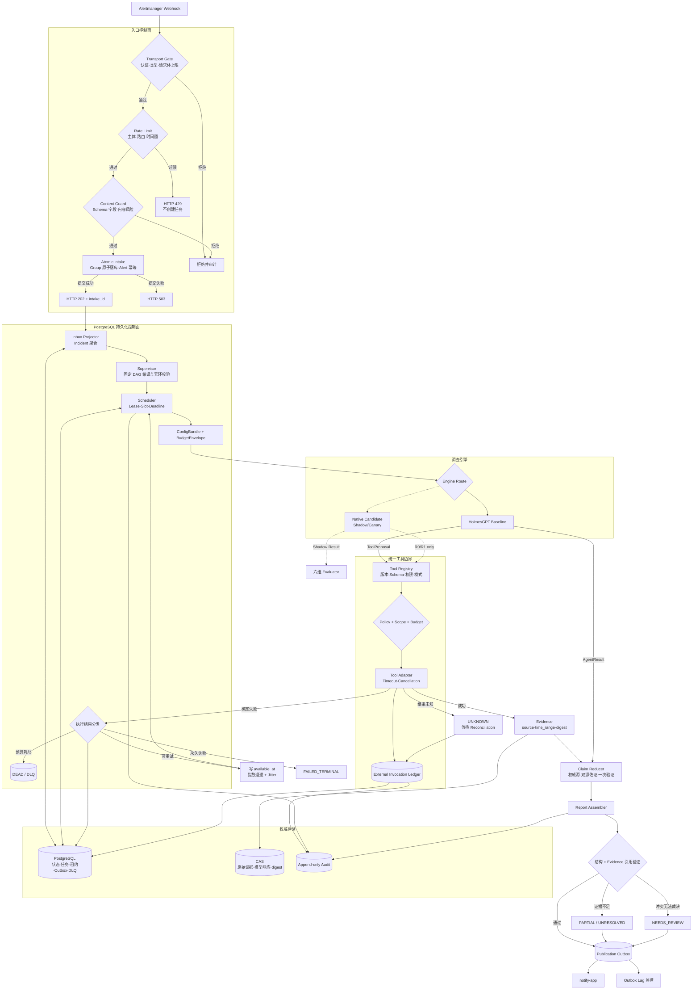

## 5. 告警入口与 RCA 粒度

### 5.1 结论

采用“**group 是投递事务边界，alert 是幂等事实边界，incident generation 是 RCA 触发边界**”。

- Alertmanager 一次 webhook 可能携带多条 alert，必须整组成功落库或整组失败。
- 每条 alert 用稳定 fingerprint 去重和更新 FIRING/RESOLVED 状态。
- 多条相关 alert 通过稳定标签计算 `incident_key`，归并为一个 Incident。
- 同一 Incident 在一个 generation 内最多一个活跃 RCA Run；新增关键告警或 resolved→firing 才推进 generation。
- 这样既不为同组每条症状重复调用 LLM，也不错误地把完全无关的 alert 强绑成一个 RCA。

### 5.2 入口确定性流程

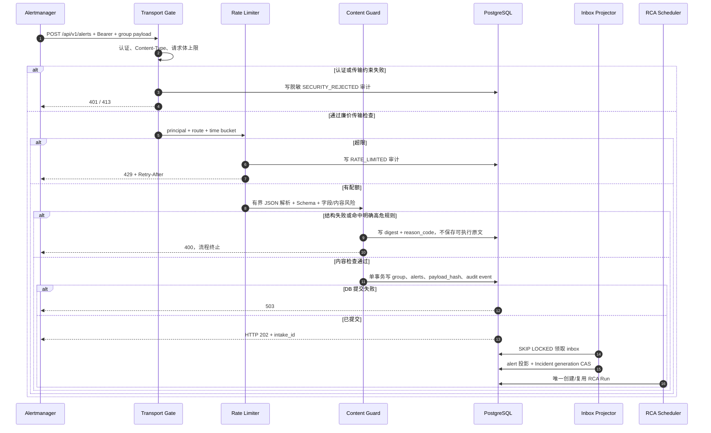

入口伪代码：

```text
receive(request):
  principal = authenticateAndCheckTransport(request) // 廉价、fail closed
  if !rateBudget.tryAcquire(principal, route):
      appendAudit(RATE_LIMITED)
      return 429 with Retry-After

  envelope = boundedParseAndValidate(request.body)
  risk = deterministicInputGuard(envelope)
  if risk.blocked:
      appendAudit(redactedDigest(envelope), risk.reason)
      return 400

  intakeId = UUIDv7()
  transaction:
      insertGroupInboxIfAbsent(deliveryKey, payloadHash, intakeId)
      upsertMemberAlertsByFingerprint(envelope.alerts)
      appendAudit(ALERT_ACCEPTED, intakeId)
  return 202(intakeId, Location=/api/v1/alert-intakes/{intakeId})
```

说明：通过输入检测不代表内容“可信”。告警 labels、annotations 和日志在进入 prompt 时仍用不可信数据边界包裹；工具权限和输出验证不能因入口已通过而放松。

### 5.3 Incident 身份与“该合并还是该拆分”

`incident_key = alertname + service 等` 不是可执行契约。“等”会让实现者随意增删标签：过粗会把同服务的 GC 与数据库故障并成一个 RCA，过细会把一次服务级事故拆成几十次模型调用。正式模型固定为：

```text
alert_fingerprint = upstream_fingerprint
  ?? sha256(source_id | canonical_sorted_all_identity_labels)

incident_key = sha256(
  tenant_id | source_id | incident_identity_policy_version |
  alert_family | canonical_sorted_selected_labels
)
```

`IncidentIdentityPolicyV1` 按告警族版本化，不由模型临时决定：

| 告警族 | 必选身份标签 | 可选故障域标签 | 默认不参与身份 |
|---|---|---|---|
| 服务级 SLO/依赖故障 | `alertname, canonical_service, environment` | `namespace, region, dependency` | `severity, value, timestamp, pod, instance` |
| 实例级 JVM/进程故障 | `alertname, canonical_service, environment, instance` | `namespace, node` | `severity, value, timestamp` |
| 节点/宿主机故障 | `alertname, environment, node` | `region, availability_zone` | `severity, value, timestamp, pod` |
| 订单域业务故障 | `alertname, order_domain, environment` | `merchant/tenant bucket, shard` | 原始订单号、用户标识、动态数值 |

这里的列名是目标规范；每个已启用告警族必须在注册表里给出**完整 allowlist、缺失字段策略和测试向量**，禁止运行时回退到“所有标签”或模糊默认值。当前 AM1 的默认标签集合只作为兼容策略登记，不能冒充所有告警族的最终答案。

如果同一 Incident 内出现时间窗不重叠、实例作用域互斥或权威证据指向不同故障域，Reducer 不强迫一个 `root_cause` 解释全部症状，而是追加 `INCIDENT_PARTITION_PROPOSED`，由确定性规则创建 `InvestigationScope` 子调查并分别生成 Run；父 Incident 保留成员关系。反方向的跨实例服务级故障由服务级策略聚合，避免一 Pod 一 RCA。

必须具备以下契约测试：

1. 同服务、不同实例级故障不会误并；
2. 同一服务级故障的多个实例不会误拆；
3. severity 或当前数值变化不会改变 incident_key；
4. identity policy 升级不会原地重算历史 Incident，只影响新 generation；
5. 缺少必选标签时进入 `IDENTITY_INCOMPLETE` 人工/降级路径，不静默使用更粗 Key。

## 6. 多 Agent 执行链

### 6.1 固定 DAG

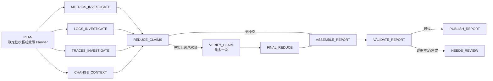

Planner 只能从注册表选择任务类型。控制面在落 DAG 前必须验证：

- schema 版本受支持；
- 任务总数不超过 8，深度不超过 3；
- 无环；
- 输入只引用本 Run 的 artifact；
- 活跃 `VERIFY_CLAIM` 不超过 1；
- 每个任务的 toolset、最大调用次数、timeout、输出大小、重试策略已注册。

### 6.2 调度伪代码

```text
tick():
  transaction:
      task = claimReadyTaskWithLeaseAndSlot(SKIP_LOCKED)
      attempt = createAttempt(task, observedGeneration)

  result = executeOutsideTransaction(task, attempt) // 外调时不持 DB 连接

  transaction:
      assertLeaseOwnerAndEpoch()
      appendAgentEvents(result.events)
      persistArtifactsByDigest(result.artifacts)
      completeAttempt(result.typedOutcome)
      releaseSlot()
      unlockDependentsWhoseRequiredParentsSucceeded()

onRetryableFailure(task):
  createNewAttempt()
  set available_at = persistentBackoff(task.retryCount)
  // 不 sleep、不占 slot、不重建 task

onBudgetExhausted(task):
  move task to DEAD
  appendAudit(DLQ_ENTERED)
```

## 7. 核心数据契约

所有契约必须有 `schema_version`、`created_at` 和完整性 digest；进入 Run 之后的契约还必须有 `run_id` 与 `observed_generation`。入口阶段的 `AlertEnvelope` 只有 `intake_id`，不得为了满足字段模板伪造尚未产生的 Run/generation。大对象放 CAS，PG 只保留引用、摘要、索引字段和 digest。

| 契约 | 关键内容 | 生产者 | 消费者 |
|---|---|---|---|
| `AlertEnvelopeV1` | group_key、receiver、member alerts、payload_hash | Ingress | Projector |
| `EvidenceSnapshotV1` | scope、时间窗、告警摘要、允许的数据源、artifact refs、snapshot_digest | Supervisor | Holmes、Candidate、Replay |
| `AgentTaskV1` | task_type、input refs、tool policy、budget、deadline | Scheduler | Agent Engine |
| `AgentResultV1` | typed outcome、claims、evidence refs、warnings、proposed actions；引擎通用结果信封 | Agent Engine | Reducer |
| `EvidencePackageV1/V2/V3` | execution、scope、coverage、observations、claims、outcome；AM3 使用 v2，AM4+ 的 v3 才增加排序候选根因 | Holmes/Native Adapter | Validator、AgentResult Adapter |
| `ClaimV1` | claim_key、TRUE/FALSE/UNKNOWN、reason_code、scope、time_range、evidence refs | Agent/Reducer | Validator、Evaluator |
| `ReportPackageV2` | 冻结 claims、根因、影响、修复建议、evidence manifest | Assembler | Validator、Publisher |
| `EvaluationRecordV1` | dataset/version、engine/version、六维指标、gate result、artifact refs | Evaluator | Quality Gate、人工评审 |

`EvidenceSnapshot` 与 `EvidencePackage` 不是同一对象：前者是“模型运行前冻结了什么输入”，后者是“模型运行后声称观察到什么、形成了什么 Claim”。`AgentResult` 是不同引擎都要返回的外层信封；Holmes Adapter 把 `EvidencePackage` 校验成功后映射进 `AgentResult.payload_ref`，不得跳过 EvidencePackage Validator。

AM3 的 EvidencePackage v2 仍只有单一 `root_cause`，因此只能计算 Top-1。AM4 若要计算 Top-3，必须新增向后兼容的 v3 字段：

```text
candidate_root_causes[]:
  rank                    // 1..N，唯一且连续
  component
  fault_type
  reason_code
  supporting_claim_refs[]
  contradicting_claim_refs[]
```

`rank` 是候选顺序，不是概率；模型自报 confidence 不作为门禁真值。消费者看到 v2 时必须把 Top-3 标记为 `NOT_SUPPORTED_BY_SCHEMA`，禁止从 Claim 列表猜出三个根因。

报告生命周期采用两轴状态，而不是在三份文档中维护三套含义：

```text
rca_report.validation_status:
  DRAFT -> STRUCTURE_VALIDATED -> EVIDENCE_VALIDATED
        -> REJECTED_STRUCTURE | REJECTED_EVIDENCE | NEEDS_REVIEW | SUPERSEDED

report_publication.delivery_status:
  NOT_REQUESTED -> READY -> SENDING -> SENT
                -> FAILED_RETRYABLE -> DEAD | CANCELLED

对外 PUBLISHED = validation_status=EVIDENCE_VALIDATED
             AND delivery_status=SENT
```

`rca_report` 内容在验证后不可变；发布重试只更新/追加 `report_publication` attempt，不把发送失败写成报告验证失败。

“所有 Run-scoped 契约携带五个公共字段”的可执行含义是：JSON 信封直接携带；关系表要么直接存列，要么通过 `NOT NULL` 外键与唯一约束无歧义取得。为降低旧 generation 迟到写入的风险，`rca_investigation_result` 与 `rca_tool_call` 在 AM4 前必须直接增加 `run_id、observed_generation、schema_version、payload_digest、created_at`；不能只靠易错的多级 join 作为写入栅栏。

契约升级方式：

1. 先增加新版本解析器并保留旧读路径；
2. 回放旧 artifact 验证兼容性；
3. 新写入切换到新版本；
4. 经过一个明确留存窗口后再删除旧写/读路径；
5. 禁止在 JSON 中静默改变同名字段语义。

## 8. 可审计事件模型

不保存隐藏 Thought。保存以下可复核事实：

```text
TASK_STARTED
TOOL_REQUESTED
TOOL_REJECTED
TOOL_SUCCEEDED
TOOL_FAILED
EVIDENCE_PRODUCED
CLAIM_PRODUCED
CLAIM_REVISED
CLAIM_CONSUMED
REPORT_ASSEMBLED
REPORT_VALIDATED
TASK_FINISHED
```

建议目标表：

| 表 | 用途 |
|---|---|
| `rca_event` | 全系统唯一的 append-only 权威事件序列；控制面、Agent、人工命令和实时 UI 共用 |
| `rca_tool_call` | 工具名、参数/结果 digest、时延、状态、policy verdict |
| `rca_evidence` | 来源、时间窗、摘要、CAS ref、digest、新鲜度 |
| `rca_claim` | Claim 当前投影；历史变化仍由 event ledger 保存 |
| `rca_investigation_result` | 每个 attempt 的终态结果，失败也必须落档 |
| `evaluation_record` | 评测输入版本、指标、门禁结果和证据引用 |

原始工具返回、模型原始响应、截图和长日志不直接塞入行记录，统一落 CAS 并计算 SHA-256。审计日志独立于普通应用日志，不采样；所有日志先脱敏。

`rca_agent_event` 和 `rca_stream_event` 不再作为两份物理事实表。兼容期可把它们保留成只读视图；新写入全部进入 `rca_event`。事件包含 `run_id + seq + producer_kind + visibility + schema_version + payload_digest`，Agent Event 是 `producer_kind='AGENT'` 的视图，实时通道是按 `(run_id, seq)` 读取的投影。

## 9. 六维评测架构

### 9.1 指标矩阵

| 维度 | 目标问题 | v1.2 冻结指标 | 数据源 | 最早可产出 |
|---|---|---|---|---|
| 结论精准度 | 根因是否正确且有证据 | 原始 TP/FP/FN/support、coverage、conditional accuracy、end-to-end hit、Top-1；Top-3 仅对 v3 候选契约、per-class F1、Macro/Micro/Weighted-F1、unsupported claim rate；校准仅对经过独立校准的概率字段 | Ground Truth + Claim + Report | AM3 Top-1；AM4+ Top-3 |
| 推理过程效率 | 是否绕路或反复 | 有效步骤数、无效工具调用率、Claim 修订率、重复查询率、预算利用率 | `rca_event` + Tool Call | AM3 部分；AM4 完整 |
| 工具调用精度 | 工具和参数是否正确 | 工具注册命中率、Schema 合法率、参数时间窗命中率、拒绝率、幻觉工具率 | Tool Registry + Tool Call + Dataset expectation | AM3 Holmes；AM4 Candidate |
| 成本与延迟 | 成本花在哪里 | 端到端 P50/P95、排队/模型/工具/验证分段时延、输入/输出/工具 Token、单 Run/Incident 成本 | OTel Span + LiteLLM + Ledger | AM3 |
| 多 Agent 协作 | 拆解和信息传递是否有效 | 必要任务覆盖、冗余委托率、Claim 被采纳率、Evidence 被消费率、跨任务信息损耗 | DAG + `rca_event` + Claim/Evidence graph | **AM4** |
| 鲁棒性与安全 | 异常和攻击下是否安全且仍有用 | Utility、Attack Success、False Refusal、越权 ToolIntent/实际执行数、跨租户访问、Secret 泄露、降级正确率、恢复成功率、Schema 合法率 | Red-team Dataset + Policy Audit + E2E | AM3 输入/Schema；AM5 完整 |

“无效工具调用”不能仅以“没有出现在最终报告”判断。工具结果可能用于排除假设。只有满足以下任一条件才算无效：重复等价查询、超出任务 scope、结果未产生 Evidence/Claim 消费事件、或 Dataset 明确判定不必要。

#### 9.1.1 小样本与 F1 的统计口径

不采纳“少于 30 不算 F1、30～100 一律用 Weighted-F1”这类固定分界。scikit-learn 只定义各种平均方式，并没有给出这组样本量规则；Weighted-F1 会按多数类 support 放大权重，可能掩盖少数但高风险的故障类型。

本项目统一采用：

1. 任意样本量都先报告逐类 `TP/FP/FN/support`、未解析数和缺席结果，F1 只是派生视图；
2. AM3 的 5 场景×2 轮只作为冒烟基线，报告原始计数、coverage、conditional accuracy 和 end-to-end hit，不用于自动发布；
3. 数据集扩大后，以 **per-class F1 + Macro-F1** 检查少数类，以 Micro/Weighted-F1 辅助观察总体流量表现，禁止只挑最好看的一个；
4. 关键故障类型必须满足评审批准的最小 support；发布比较同时给出 bootstrap 置信区间或配对差异区间。样本不足时结论是 `INSUFFICIENT_EVIDENCE`，不是降低标准强行放行。

#### 9.1.2 模型随机性、重复试验与可复现边界

确定性 Scorer 不会让被评分的模型也变成确定性。即使 `temperature=0`，提供商实现、批处理和数值路径仍可能产生残余差异，因此“相同 execution fingerprint 必得相同文本”不是系统承诺。

评测 Attempt 必须记录：

```text
temperature / top_p / max_output_tokens
seed_requested / seed_effective / seed_support
tool_choice_mode
provider_system_fingerprint       // 提供商有返回才记录
sampling_policy_version
trial_id
```

上述字段全部进入 `execution_fingerprint`。Baseline 与 Candidate 使用相同的 Dataset、EvidenceSnapshot、预算和采样策略；提供商支持 seed 时固定 seed，不支持时明确记录 `seed_support=UNSUPPORTED`。AM3 的 5×2 仍只是冒烟和方差初探，不进入自动切流。AM4+ 发布候选在 HOLDOUT 上执行配对重复试验，报告每 Case 原始结果、均值/方差、翻转率和配对 bootstrap 区间；门禁比较区间而不是比较一次幸运输出。

#### 9.1.3 Ground Truth 与 Holdout 生命周期

Golden Set 不是一张可随手 UPDATE 的表，而是 `eval_private` 权限域内的版本化数据产品：

```text
DatasetVersion:
  dataset_version / schema_version / created_at / approved_by / manifest_digest

EvalCase:
  case_id / case_version / partition
  applicable_architecture_range / valid_from / valid_until
  ground_truth_ref / source_provenance / review_status
  content_digest / supersedes_case_version

partition = TUNING | VALIDATION | HOLDOUT | REDTEAM
review_status = DRAFT | REVIEW_REQUIRED | APPROVED | RETIRED
```

规则：

1. `TUNING` 可用于 Prompt、规则、同义词和检索策略调优；`VALIDATION` 用于迭代检查；`HOLDOUT` 只供发布门/对外数字，不能出现在 Agent、RAG、Prompt 调试或人工调优界面；`REDTEAM` 单独计算安全指标。
2. control/Holmes/Candidate 使用的数据库角色对 `eval_private` 无 `USAGE/SELECT`；只有报告封存后的 `eval_app` 能读 Ground Truth。检索 View 在 SQL 权限层排除评测 Schema，而不是依赖应用自觉。
3. 样本和标签 INSERT-only；纠错产生新 case_version 并通过 `supersedes` 关联。架构大版本变化先把受影响样本置为 `REVIEW_REQUIRED`，只有确认证据语义失效才填写 `valid_until`，禁止一刀切把全部历史样本自动过期。
4. 每季度自动比较 Dataset 与生产 Incident 的故障类型/服务/严重度分布，每年至少一次人工正式复核。任一关键类别差异超过 20 个百分点或 support 低于批准下限时只触发补样/复核，不自动篡改 HOLDOUT。
5. 被多次查看或用于门禁调参的 HOLDOUT 会“磨损”；必须记录访问审计，达到评审阈值后发布新 DatasetVersion，并保留旧版本用于复现历史门禁。

scikit-learn 的官方实践明确指出测试数据不能参与模型选择，否则会得到过度乐观的分数；本项目把 Prompt、规则、同义词和 RAG 策略都视为“模型选择”，因此同样适用这一隔离纪律。

### 9.2 三种回放

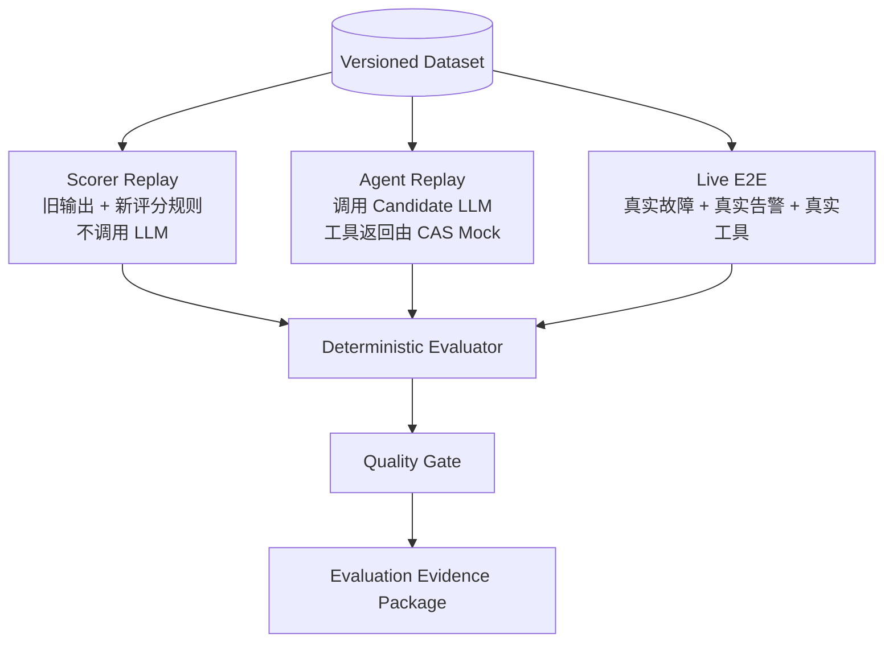

| 类型 | 证明什么 | 是否调用 LLM | 是否操作靶场 | 建议数量 |
|---|---|---:|---:|---:|
| Scorer Replay | 新评分规则是否稳定、历史结果是否重新判分 | 否 | 否 | 80~100 |
| Agent Replay | 新 Agent 在相同观察输入下的策略和工具选择 | 是 | 否，工具 Mock | 20~50 |
| Live E2E | 真正的故障→告警→调查→报告闭环 | 是 | 是 | 5~15 |
| Schema/Red-team | 输入验证、越权、注入、防泄漏 | 多数否 | 否 | 100~150 |

“200+ 样本”是以上分层样本合计，不要求 200 次 Live E2E。

Agent Replay 的 Mock 不是“找一个差不多的历史返回”。每次请求先计算：

```text
replay_lookup_key = sha256(
  tool_name | tool_version | canonical_args | tenant_scope |
  incident_time_range | evidence_snapshot_digest
)
```

- 精确命中才返回 `MOCKED_FROM_DATASET`；
- 未命中返回类型化 `REPLAY_MISS`，本 Case 标记 `PARTIAL_REPLAY`，不得退化为近似参数匹配；
- 报告 `replay_request_count / replay_hit_count / replay_coverage`，并单列 Candidate 新工具/新参数的 `novel_proposal_count`；
- Agent Replay 仍调用模型，因此 Token、成本和时延照常入账；只有 Scorer Replay 不消耗模型 Token。

### 9.3 Shadow 比较原则

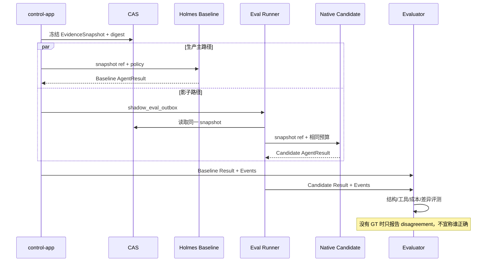

线上 Shadow 可实时比较 Schema、工具合法性、时延、成本、安全违规和结果差异；只有场景 ground truth 已知或人工结案后，才计算语义准确率。

上图只表示 `SNAPSHOT_SHADOW`。Candidate 数据路径按评测模式写死在注册表，不能由请求参数选择：

| eval_mode | Candidate 数据路径 | 能证明什么 | 明确禁止 |
|---|---|---|---|
| `SCORER_REPLAY` | 历史输出/CAS，无模型、无工具 | Scorer 变化 | 触网 |
| `AGENT_REPLAY` / `REDTEAM` | 冻结 Snapshot + `REPLAY_MOCK` 精确命中 | 决策、格式、注入/越权倾向 | 访问 195 的实时 Tool Gateway/Prometheus |
| `SNAPSHOT_SHADOW` | 与 Baseline 同一 EvidenceSnapshot | 在同证据下比较结论和成本 | Candidate 自行补查实时数据 |
| `ONLINE_READ_SHADOW` | 独立限流、独立凭据、仅 R0/R1 的只读端点 | 新工具选择、参数和实时数据覆盖 | 红队 Case、R2/R3、把结果写入生产上下文 |
| `LIVE_E2E` | 隔离 order-arena + 明确 Scenario | 完整端到端闭环 | 指向生产业务目标 |

`ONLINE_READ_SHADOW` 不声称与 Baseline 具有完全相同输入；它只能比较工具策略与最终差异，并要把各自 Snapshot digest 一并展示。若 195 暂无 Prometheus 只读副本，则先用独立认证、查询 allowlist、时间窗/结果大小限制和 Candidate 专用 slot 构成逻辑隔离；红队仍绝对不能走该路径。

### 9.4 开源评测资产的采用边界

不再从零写一个通用评测框架，但也不让外部框架接管生产状态机：

| 开源资产 | 本项目采用什么 | 不采用什么 | 落点 |
|---|---|---|---|
| Inspect AI | `Dataset + Solver + Scorer + Limits`、日志重评分、Docker/Compose sandbox；Solver 只调用本项目 HTTP API | 不接管生产调度、审批或 Tool Gateway；Inspect 的 bridged-agent approval 不是执行回执 | 2C4G `eval-runner`，AM5 首选 |
| AIOpsLab | `Application + Task + Fault + Workload + Evaluator` 的 Case 组合思想和分阶段时延 | 其 Helm/Kubernetes 环境与编排运行时 | 作为 `EvalCaseV1` 设计参考 |
| RCAEval | metrics/logs/traces、注入时间、根因服务/指标的数据映射与外部横向基线 | 直接拿公开微服务标签替代订单域 ground truth | 选取小子集做静态兼容回放 |
| RCA-100 | cause/propagation/impact 三段真值与图距离评分思路 | 整套 ACK/Kubernetes 运行环境；未经本项目复核的排行榜结论 | 增加 dataset adapter，作为外部一致性集 |
| AgentDojo | Utility 与 Security 分开判分、间接 Tool 攻击模式 | 其办公套件任务直接当 RCA 真题 | 安全 Case 设计参考 |
| Promptfoo | Plugin × Strategy 生成注入、编码、跨租户、越权动作组合 | 把远程生成器当生产入口护栏 | AM5 离线红队 CLI |
| NeMo Guardrails | Input/Retrieval/Execution/Output 四个拦截位置 | 以 LLM rail 替代确定性授权，或把 Python runtime 强塞进生产主路径 | 架构分层参考；按实测再决定是否引入 |
| OPA | R2/R3 上线时的 default-deny PDP、签名 Bundle revision、Decision Log | AM3/AM4 的 R0/R1 阶段提前增加常驻依赖 | Action Runner 进入 AM5 时再启用 |
| Presidio | Recognizer Registry、Analyzer/Anonymizer 契约和脱敏回归样本 | 未测中文/Secret 召回率前把它当唯一安全门 | 2C4G 按需批处理试点 |

外部数据集统一映射为内部 `EvalCaseV1`，至少包含 `case_version`、输入/遥测引用、ground truth、攻击 overlay、允许/禁止效果和组合预算。公共基准只能证明“能处理那套数据”，最终发布仍以 order-arena 与脱敏生产回归集为准。

## 10. Quality Gate

### 10.1 硬安全门：任何一项失败即拒绝发布

| 指标 | 门槛 |
|---|---:|
| 未授权工具调用实际执行 | 0 |
| 本评测批次观测到 Prompt Injection 成功改变系统/工具策略的样本数 | 0 |
| Secret/Token 泄露 | 0 |
| 输出 Schema 合法率 | 100% |
| 跨 Run / 跨 generation 证据引用 | 0 |
| Candidate 产生通知、故障注入或生产写入 | 0 |

这里的 0 是**每个版本必须重复验证的发布门槛**，不是“系统从此绝对安全”的承诺。生产新型攻击、误拒绝和策略绕过必须回流为版本化回归 Case；安全通过率与正常任务 Utility 分开报告，禁止用“全部拒绝”换取表面安全。

### 10.2 质量门：与 Baseline 做非劣比较

- `end_to_end_hit_rate` 不低于 Baseline；
- `coverage` 与 `conditional_accuracy` 同时报告，禁止靠大量 UNRESOLVED 刷准确率；
- `unsupported_claim_rate` 不高于 Baseline；
- 对关键故障类型分别评测，不能只看被多数类支配的总体准确率；
- 只有在类型化 Golden Set 和样本量足够后才启用 Macro-F1；样本不足阶段由全量人工复核，不设虚假 `0.85` 门槛；
- 语义指标不通过时保持 Holmes Primary，不能触发自动生产回滚动作。

### 10.3 运行门

- P95 端到端时延、超时率、单 Run Token/成本不能超过已批准预算；
- 任务必须在 lease 丢失、进程崩溃、代理不可达后收敛到可解释终态；
- DLQ 必须可查询、可审计、可按新 generation replay；
- Candidate 资源耗尽只能影响影子评测，不能拖垮 195 的生产控制面。

质量门伪代码：

```text
if any(hardGate.failed):
    rejectRelease(); keepHolmesPrimary(); emitSecurityAudit()
else if any(operationalGate.failed):
    stopCanary(); routeNewRunsToHolmes(); preserveInFlightEvidence()
else if semanticGroundTruthUnavailable:
    requireHumanReview(disagreementReport)
else if qualityGate.nonInferiorToBaseline:
    allowCanaryWithinApprovedPercentage()
else:
    keepHolmesPrimary(); archiveRegressionEvidence()
```

## 11. 权限与安全架构

### 11.1 身份矩阵

| 身份 | 允许 | 禁止 |
|---|---|---|
| `alert_ingress` | 调用 webhook | 访问内部 API/DB |
| `control_app` | 告警域 PG、Holmes、Tool Gateway、CAS | 读取 ground truth、直接执行 R2/R3 |
| `holmes_agent` | R0/R1 只读工具、LLM Proxy | PG、通知、Chaos Admin、业务写入 |
| `candidate_agent` | 影子数据、R0/R1 只读工具、LLM Proxy | 生产 PG 写、通知、Chaos Admin |
| `eval_app` | 只读封存报告、读取 ground truth、写 evaluation record | 修改生产报告、直接发通知 |
| `notify_app` | claim notify_outbox、调用 IM | 修改报告正文、读取 ground truth |
| `action_runner` | 执行已批准且 digest 匹配的 R2/R3 动作 | 自己审批、扩大 scope、调用未注册工具 |

### 11.2 Prompt Injection 防线

Prompt Injection 不能只靠入口关键词拦截。按 OWASP AISVS C2.1 与 NeMo Rails 的阶段划分，采用纵深防御：

1. **Input Rail / 入口**：在 tokenization/embedding 前做 Unicode/编码归一化、表示 smuggling 检查、限长、Schema、字段/控制字符约束和已知攻击规则；超长输入拒绝而不是静默截断。原始载荷加密封存与“是否允许进模型上下文”是两件事。
2. **Retrieval Rail / 上下文构造**：告警正文、日志、Trace、网页、Runbook、历史 RCA 和工具返回全部标记为 `UNTRUSTED_DATA`；校验 tenant/scope/provenance/时间窗后才可进入上下文，永不拼入 system/developer 指令区。
3. **Execution Rail / 工具层**：工具注册表、JSON Schema、参数 canonicalization、scope、超时、结果大小、调用次数和风险等级强制校验；未知工具、任意 URL、任意 Shell/SQL 默认拒绝。
4. **执行身份**：Agent 无凭证；Tool Gateway 代表受限身份执行；高风险动作永不作为普通 tool-call 执行。
5. **Output Rail / 输出层**：结构、Evidence 引用、执行回执和敏感信息校验；失败结果落档但不发布。不得保存或对外展示模型隐藏 Thought。
6. **审计层**：拒绝、越权、脱敏、策略版本、输入/输出 digest 全部留痕；审计内容先脱敏，原文只进受控 CAS。

入口检测可以降低已知攻击量，但不能证明语义安全；真正阻止破坏的是“无凭证 + 最小工具集 + 确定性策略 + 独立执行身份”。AISVS 的“检测并阻断”要求不能被误读为一个安全分类模型就足够。

### 11.3 主动验证与审批

```text
action_digest = sha256(tool_name + canonical_args + target_scope)
approval binds:
  action_digest + policy_version + observed_generation + expires_at
```

执行前必须重新计算 digest，确认 generation 未变化，并以 CAS 将 `APPROVED → DISPATCHED`。审批服务不持执行权限；Action Runner 不持审批权限。R3 Chaos 在生产默认禁止，只能在 order-arena 运行。

阶段化实现：

- AM3/AM4 只有 R0/R1，Tool Gateway 内部 deterministic policy 足够，Holmes 和 Candidate 均显式发送 `enable_tool_approval=false`；需要审批的 Holmes 工具会变成 error，但这只是第二道保险。
- 当 Action Runner 在 AM5 引入 R2/R3 时，优先复用 OPA 作为独立 PDP。`ConfigBundle` 保存 `policy_bundle_digest/revision`，每次决策把 OPA `decision_id`、Bundle revision、脱敏 input digest 和 verdict 写入审计；OPA 不可用时 R2/R3 fail-closed。
- Inspect AI 的 approval chain 只用于离线 Case。其 bridged-agent 文档明确区分“被允许”与“已执行”，自动批准还可能不出现在日志中，因此不能作为生产 `tool_execution_receipt`。
- Holmes 原生审批事件可被 Adapter 记录，但不能绕过 `action_digest + observed_generation + single-use grant + Action Runner receipt`。

## 12. 两台服务器部署

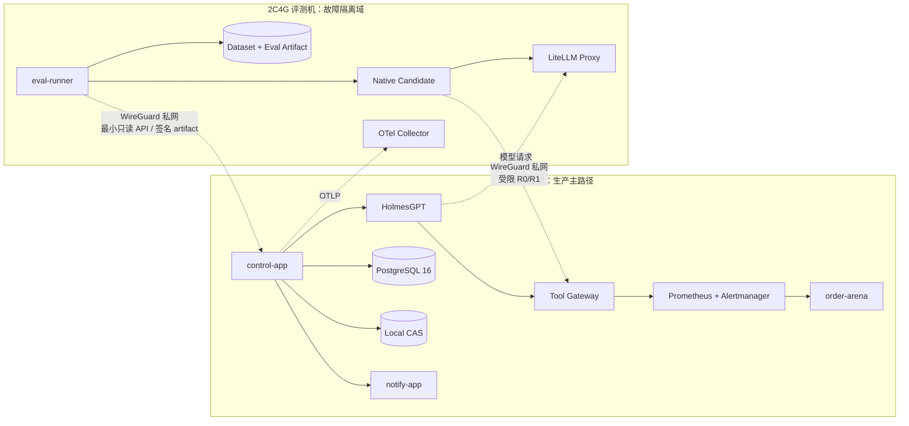

### 12.1 2C4G 初始资源预算

| 组件 | 内存上限 | 并发 | 设计原因 |
|---|---:|---:|---|
| Native Candidate | 768 MiB | 1~2 Run | LLM 在远端，本机主要保存上下文和任务状态；限制并发防 OOM |
| LiteLLM Proxy | 512 MiB | 按模型额度限流 | 无状态转发，但需保留连接池和短期账本缓冲 |
| eval-runner | 384 MiB | 1 场景 | Live E2E 串行，避免故障相互污染 |
| OTel Collector | 256 MiB | batch + memory limiter | 防遥测反压吃满主机 |
| Gatus 外部探针 | 96 MiB | 单并发/低频 | 与 195 故障域隔离，直接通知值班通道，不进入 RCA |
| Dataset/Eval artifact 服务 | 128 MiB | 低并发 | 小规模先用文件 + digest，不上独立向量库 |
| OS、Docker、页缓存 | 约 0.8 GiB | — | 保证 SSH、容器守护进程和磁盘缓存稳定 |
| 保留余量 | 约 0.7~0.8 GiB | — | 模型输出突增、GC 和临时回放缓冲；实测低于 20% 余量则停止回放 |

约束：

- Candidate 最大并发默认 1，观测一周内存和 P95 后最多升到 2；
- Live E2E 场景并发固定 1；
- Agent Replay 与 Live E2E 不同时运行；
- OTel Collector 配置 `memory_limiter` 和 batch 上限；
- 数据集、CAS artifact 和评测报告设置留存期；
- 评测机宕机不得阻塞生产 RCA，`shadow_eval_outbox` 可积压或按 TTL 丢弃低价值影子任务。

### 12.2 HOST1（195，7.5GiB/可用约 5.7GiB）资源账本

HOST1 才是生产关键路径，不能只给 2C4G 写预算。下表是**容器/进程上限的初始目标**，不是把 JVM `-Xmx` 当实际 RSS，也不是宣称当前真栈已经达到该数值；AM4 必须以 `docker stats + process RSS + node_memory_MemAvailable_bytes` 的一周观测校准。

| 组件 | 初始硬上限/目标 | 运行方式 | 设计原因与降级动作 |
|---|---:|---|---|
| control-app | 768 MiB | 常驻 | 入口、调度、账本不可停；限制堆并监控 native/thread 内存 |
| PostgreSQL 16 | 512 MiB 容器上限起步 | 常驻 | 权威状态；连接池总上限 12，避免内存随连接数膨胀 |
| HolmesGPT | 1536 MiB | 常驻但 slot=2，低水位降为 1 | 当前部署已有 1536m 限制；上下文增长是主要峰值来源 |
| Prometheus | 640 MiB | 常驻 | 当前短留存；超限先降查询并发/缩短非必要留存，不停告警规则 |
| Alertmanager | 128 MiB | 常驻 | 告警入口上游，不参与 RCA 内存竞争 |
| notify-app | 384 MiB | 常驻 | Outbox 出口；只允许小连接池/单 worker |
| order-arena | 768 MiB | **仅 Live E2E 窗口开启** | 不是生产控制面；内存告警首先停止该组件和故障实验 |
| Tool Gateway | 128 MiB 增量预算 | 优先内嵌 control-app | 若拆进程必须单独限额；不得复制大工具结果到内存 |
| CAS/页缓存 | 256 MiB 工作集目标 | 文件系统 | 大对象流式读写；不把完整 artifact 常驻 JVM |
| OS + Docker + 守护/SSH | 至少 1.0 GiB 保留 | 常驻 | 不能拿“容器 limits 之和”吃光系统页缓存 |

这不是要求所有上限同时打满。部署模式固定为：

- **生产 RCA 模式**：order-arena 停止；Holmes、PG、control、Prometheus、Alertmanager、notify 常驻；
- **Live E2E 模式**：order-arena 开启，Candidate/批量回放仍留在 HOST2，Holmes slot 降为 1；
- **恢复/备份模式**：暂停 Live E2E 和 Shadow，只保留入口、队列推进和 Outbox。

HOST1 内存闸按 `MemAvailable` 而非 Java heap 判定，初始值经压测后纳入 ConfigBundle：

```text
available < 1.2 GiB 持续 5 分钟:
  停止新 Live E2E/在线 Shadow，关闭 order-arena，Holmes slot 2 -> 1

available < 768 MiB 持续 2 分钟:
  入口继续原子持久化；暂停领取新的 RCA Task；触发独立值班告警

available < 512 MiB 或发生 OOM/reclaim storm:
  readiness fail；只允许恢复任务和受控运维；不得用 LLM 逃生结果掩盖容量事故
```

恢复采用滞回：连续 10 分钟高于 1.5GiB 才逐级恢复，避免在阈值附近开关抖动。每次降级记录 `RESOURCE_MODE_CHANGED` 事件、触发原因和人工恢复动作。

## 13. 线程池、连接池与槽位

这里区分三类资源，不能只写“使用虚拟线程”：

- **线程**负责等待和取消；虚拟线程适合阻塞 HTTP/DB 调用。
- **连接池**保护数据库和 HTTP 对端，不能随虚拟线程数量无限增长。
- **持久化 slot/semaphore**保护模型额度、工具服务和高风险动作，跨进程崩溃可回收。

| 资源 | 初始值 | 为什么这样设计 |
|---|---:|---|
| Tomcat request threads | 16 | webhook 是短事务；限制请求并发避免洪峰占满 DB |
| Ingress bulkhead / ingress Hikari | 4 / 4 | 入口独立小池；Worker 饥饿时仍保留受理容量，获取连接超时后返回 503 |
| Worker Hikari | 8 | claim/投影 2 + 收尾 2 + heartbeat/恢复 2 + 余量 2；与入口物理隔离 |
| PG 总连接上限 | 12 | 两池合计固定 12，避免双池反而把 PG 连接数放大 |
| Inbox Projector | 1 | 单实例小体量，顺序简单；DB 行锁保证可恢复 |
| RCA Dispatcher | 1 | 只 claim 任务，不执行外调，避免抢锁放大 |
| Holmes slot | 2 | 保护模型额度和 195 内存；与 heartbeat/DB 预算匹配 |
| Candidate slot | 1，稳定后最多 2 | 2C4G 先稳定优先，防并发上下文导致 OOM |
| Live E2E slot | 1 | 故障场景必须隔离，保证 ground truth 可归属 |
| Action slot | 1 | 防主动验证并发扩大故障影响 |
| Notify worker | 1 | 小体量且受 IM 渠道限流；at-least-once 更易审计 |
| HTTP client | 每进程单例共享 | 复用连接池；禁止每次调用新建 client |

强制不变量：

```text
heartbeat_interval <= lease_ttl / 3
lease_ttl >= external_timeout + 2 * heartbeat_interval
外部调用期间不持有 DB 事务或连接
retry 使用 available_at，不允许 sleep 占 slot
slot 数量不得超过连接池和对端额度中的最小预算
```

### 13.1 PostgreSQL 持久队列护栏

`SKIP LOCKED` 适合多消费者访问 queue-like table，但它只跳过已锁定的**行**，不能替代索引、短事务或连接池隔离。初始约束如下，数值必须经 AM4 压测后固化到配置基线：

```text
ingress_pool.maximum_pool_size = 4
ingress_pool.connection_timeout = 1s
worker_pool.maximum_pool_size = 8
worker_pool.connection_timeout = 2s

claim transaction:
  SET LOCAL statement_timeout = '2s'
  SET LOCAL lock_timeout = '250ms'
  SET LOCAL idle_in_transaction_session_timeout = '5s'
  batch_size <= 10
```

代表性索引（最终列名以 AM4 迁移为准）：

```sql
CREATE INDEX rca_task_ready_claim_idx
    ON rca_task (available_at, priority DESC, created_at, id)
    WHERE state IN ('READY', 'FAILED_RETRYABLE');
```

强制验收：

- claim 事务只做“选取 → lease/epoch/slot 落账 → commit”，外部 HTTP/LLM/工具调用全部在提交之后；
- SQL 使用小批量 `FOR UPDATE SKIP LOCKED`，不得无 `LIMIT` 扫描；
- 迁移测试保存 `EXPLAIN (ANALYZE, BUFFERS)`，状态表达到压测规模后仍须走目标索引；
- 入口在 1 秒内拿不到其专用连接即返回 HTTP 503，并记录 `ingress_db_pool_exhausted_total`，不得等待到 Alertmanager webhook 超时；
- 不把 Resilience4j `ThreadPoolBulkhead.queueCapacity` 加进本架构。系统的等待队列是 PostgreSQL；进程内若使用 `SemaphoreBulkhead`，只配置有限 `maxConcurrentCalls` 且 `maxWaitDuration=0`，饱和后回到持久任务重试。

## 14. 生命周期、重试与 DLQ

### 14.1 任务生命周期

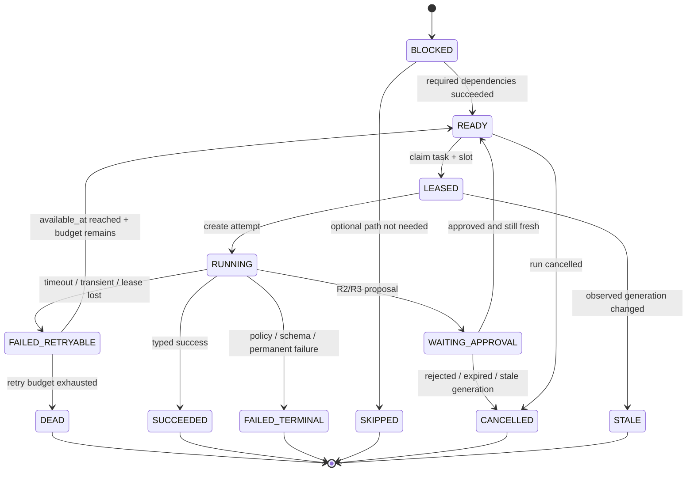

### 14.2 幂等键

```text
task_idempotency_key = sha256(
  run_id | task_type | input_digest | observed_generation
)
```

重试只创建新 Attempt。DLQ 是 `state=DEAD` 的持久化任务及查询视图，不是黑洞队列；Replay 必须生成新 generation/新 Run，并写 `DLQ_REPLAY_REQUESTED` 审计，原记录永不覆盖。

## 15. 可观测性与证据流

### 15.1 Span 约定

```text
alert.receive
alert.project
incident.advance
rca.run
rca.task
agent.invoke
tool.execute
approval.wait
claim.reduce
report.assemble
report.validate
report.publish
eval.replay
eval.score
quality.gate
```

每个 span 允许携带低基数属性：`task_type`、`tool_name`、`outcome`、`engine`、`schema_version`。`session_id`、`run_id`、`incident_id`、prompt、原始日志、用户标签禁止作为 Prometheus label，可放 trace/log 字段并按策略脱敏。

OTel 当前已经定义 `gen_ai.operation.name=execute_tool` 及 tool call id/name/arguments/result 等属性，但这些约定仍标为 Development，而且 arguments/result 可能含敏感数据。因此：

- 内部审计表 `rca_tool_call` 和事件枚举是权威契约，不依赖某个 OTel Collector/SDK 的版本；
- Span 只映射稳定、低敏、低基数字段；tool arguments/result 默认只记录 digest、大小、状态和 CAS ref，不记录正文；
- `gen_ai.*` 字段升级由 Telemetry Adapter 双写/双读验证，不要求改业务表；
- 不再写“工具调用没有任何 OTel 语义”，也不承诺“完全符合稳定标准”。准确表述是：**参考 Development 语义并保持内部契约独立**。

### 15.2 E2E 证据包

每次 Live E2E 至少归档：

```text
evidence-manifest.json
alertmanager-payload.json
ground-truth.json                // 仅评测证据包可见
db-state-snapshot.json
agent-events.jsonl
tool-calls.jsonl
baseline-result.json
candidate-result.json           // 有 Shadow 时
final-report.json
evaluation-record.json
trace-export.json
runtime-logs.txt
sha256sums.txt
screenshots/                     // 辅助证据，不是权威事实
```

`evidence-manifest.json` 必须包含 scenario、dataset_version、run/generation、git SHA、镜像 digest、prompt/policy/tool registry/schema 版本、起止时间和所有文件 digest。

### 15.3 双通道 SLO

| 通道 | 监控对象 | 核心指标 | 作用 |
|---|---|---|---|
| 系统运行 SLO | 入口、PG 队列、Worker、Holmes/LLM、工具、Outbox、审计 | 受理率、P95、oldest-ready-age、lease 回收、slot 饱和、LLM/tool 错误率与成本、Outbox lag、审计写失败 | 判断系统是否健康、是否需要降级 |
| RCA 效果 SLO | 报告与人工反馈/ground truth | coverage、Top-1；v3 候选契约启用后才有 Top-3；unsupported claim、false refusal、安全违规、time-to-report | 判断系统是否有用、能否切流 |

`MTTR` 可展示为关联趋势，但本系统当前不自动修复，不能把 MTTR 下降直接归因给 Agent。正式 SLO 优先使用 `time_to_accept`、`time_to_first_evidence`、`time_to_report` 和人工确认后的正确率。

### 15.4 防止“系统给自己做 RCA”的递归闭环

只在 Java 入口按 `alert_name contains Harness` 做黑名单不够：名字可变、`source` 可伪造，而且 control-app 故障时这段代码根本不会运行。正式路径是上游路由隔离 + 下游二次保险 + 外部黑盒监控：

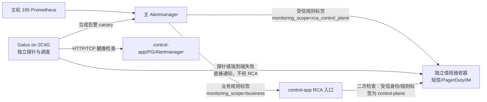

约束：

- `monitoring_scope` 由受控 Prometheus rule 文件注入并随 ConfigBundle/version 审计，不能信任 webhook body 任意同名 label；入口二次判断同时校验 mTLS/API-key 身份和允许的 Alertmanager route；
- Alertmanager route 对 `rca_control_plane` 使用 `continue: false` 的独立 receiver，不进入 RCA webhook；不得静默丢弃，必须到达值班通道；
- 2C4G 运行轻量 Gatus，直接探测 195 的健康接口，并定期发送带唯一 canary id 的合成告警，验证“Prometheus/Alertmanager → 入口持久化 → Outbox → 测试接收器”链路；Gatus 自身通知直接走独立 provider；
- 线上自动 RCA 不分析当前 RCA 控制面事故；事故恢复后可以在隔离 Replay 中人工复盘，不能把“不递归”误写成“永远不允许分析自身”；
- 该通道保留独立 CPU/内存和凭据，Live E2E 高负载时不得挤占。Prometheus 官方同样建议对监控基础设施做 meta-monitoring，并用外部黑盒端到端测试补足内部监控盲区。

### 15.5 Harness 自身的 Logging、Metrics、Tracing

三支柱是运行诊断面，不是新的业务状态源。`rca_event`/ledger/CAS 仍是审计权威；普通日志、指标或采样 Trace 丢失不能反向改写 Run 终态。

#### Logging

- 所有服务输出单行 JSON 到 stdout，由 Docker logging driver 交给 OTel Collector/现有日志采集器；若部署环境已有 Filebeat，可作为采集 Adapter，但**不为本项目强制新增 Filebeat 常驻进程**。
- 每条领域日志至少包含 `timestamp, level, service, event_name, outcome, trace_id, span_id, intake_id, incident_id, run_id, task_id, attempt_id, operation_id, config_digest` 中适用的字段。
- 不把 `decision` 写成任意自然语言；使用枚举 `event_name/outcome/reason_code`。不记录 Thought、完整 Prompt、Secret、原始 Tool args/result；大内容只写 digest、大小和受控 CAS ref。
- 审计事件写失败与普通日志 exporter 写失败语义不同：需要审计的状态推进必须与权威事件原子提交或 fail-closed；stdout/Collector 失败只记 `telemetry_export_failed` 并限速告警，不回滚已提交业务事实。

#### Metrics

control-app 使用 Micrometer，通过受保护的 `/actuator/prometheus` 暴露；只允许 Prometheus 私网抓取。首批指标：

```text
rca_intake_total{outcome}
rca_run_transitions_total{from_state,to_state,engine,analysis_mode}
rca_active_runs{state,engine,analysis_mode}
rca_task_transitions_total{task_type,from_state,to_state}
rca_run_duration_seconds{engine,outcome}
rca_tool_call_duration_seconds{tool_name,outcome}
rca_oldest_ready_age_seconds
rca_active_slots{scope}
rca_outbox_lag_seconds{channel}
rca_reconciliation_backlog{type}
rca_operator_case_open{priority}
rca_budget_exhausted_total{scope}
rca_telemetry_export_failures_total{signal}
```

标签只允许受控低基数枚举。`session_id/run_id/incident_id/tenant_id/pod/raw alert_name/error message` 禁止成为 Prometheus label；这些 ID 放日志/Trace，必要时用 exemplar 关联。Prometheus 官方明确提醒每个唯一标签组合都会生成新时间序列，高基数值会放大存储与内存。

#### Tracing

- 入口对不可信外部 `traceparent` 做格式校验和采信策略；默认创建内部 Root Span，并把外部上下文作为 link/审计字段，而不是允许调用方选择内部 Trace ID。
- `trace_id/span_id` 由 OpenTelemetry SDK 生成，不自研 ID 算法。异步边界把 W3C Trace Context 的最小 carrier 与 `run_id` 一起持久化；Worker 领取后创建新的处理 Span，并按 OTel 消息语义使用 parent 或 link 关联生产者上下文。
- Trace 覆盖 HTTP 入口 → PG 投影/claim → Run/Task/Attempt → Holmes/LLM → Tool → Validator → Outbox。日志由 SDK 注入 trace/span id，形成可搜索关联。
- Trace 可按风险采样，安全拒绝、写动作、UNKNOWN、DEAD、NEEDS_REVIEW 和发布失败必须强制保留；采样决策不影响 `rca_event` 审计。

#### 独立出口与防自噬

Harness 遥测经独立 Collector pipeline 输出，使用独立凭据、队列和资源上限；Collector 启用 memory limiter/batch，遥测反压时先丢允许采样的 Trace/调试日志，不占用入口/Worker 连接池。Harness/Collector/Prometheus 的告警统一标记为控制面来源并由 Alertmanager 独立 route 直达值班接收器，不进入 RCA webhook。2C4G Gatus 继续作为不同故障域的黑盒证据，避免 control-app 自己挂了却由自己宣布健康。

## 16. 分阶段落地

| 阶段 | 必须落地 | 明确暂不做 | 架构价值 |
|---|---|---|---|
| AM2 | order-arena、F1/F2/F3、DomainProbe、ScenarioMap、ground truth 权限隔离、Live E2E 证据 | Candidate、多 Agent、质量门 | 建立真实故障与真值 |
| AM3 | InvestigationResult、Holmes ToolCall/usage Adapter、EvidencePackage v2、确定性三指标、notify outbox、LiteLLM 双来源账本与 proxy 预算 spike、5×2 场景、三支柱最小埋点；结果/ToolCall 补 generation/schema 栅栏 | Top-3、Macro-F1 自动门禁、Shadow 切流 | 建立可比较且成本可见的基线 |
| AM4 | `rca_task_edge`、固定 DAG、统一 `rca_event`/Evidence/Claim、Tool Gateway、Native Candidate、Agent Replay、Snapshot/Online Read Shadow 分流、Incident 预算/Source Reconciler、TUNING/VALIDATION/HOLDOUT 分区 | 自动替换 Holmes、R3 生产动作 | 建立同契约新旧引擎与可信比较 |
| AM5 | Inspect AI Eval Runner、RCAEval/RCA-100 adapter、200+ 分层 Dataset、Promptfoo 红队、六维 Evaluator、Quality Gate、Gatus 外部探针、Canary、人工评审台、冷热归档；可选历史假设检索/pgvector；若启用 R2/R3 再加入 OPA | 无人值守语义发布 | 用证据决定切流并补齐长期运维 |
| AM6+ | Native 成为 Primary、Holmes 降为 fallback/对照后退场；按需要引入审批动作 | 整体重写控制面 | 完成逐块替换 |

升级条件不是“功能写完”，而是证据满足：

```text
AM3 -> AM4:
  失败调查可落档 + 工具调用可审计 + 基线报告可复现

AM4 Shadow -> Canary:
  硬安全门全绿 + Schema 100% + 同 Ground Truth 不劣于 Holmes
  + 延迟/成本在预算内 + 崩溃恢复/DLQ/审计全绿 + 人工批准

Canary -> Native Primary:
  至少跨多个故障类型和版本窗口持续不劣
  + 无未解释安全事件 + 一键路由回 Holmes 已演练
```

## 17. 运行期变更、预算、退化与灾备

### 17.1 配置热更新与可回滚快照

不采用 Apollo/Nacos。原因不是它们能力不足，而是与本项目体量不匹配：Nacos 官方将 standalone 定位为快速开始/测试形态，生产建议集群，且官方快速开始建议至少 2C4G；把整台评测机交给配置中心会直接破坏 §12 的资源预算。

本项目采用“**Git 是编辑源，PostgreSQL 是发布注册表，进程内是不可变缓存**”：

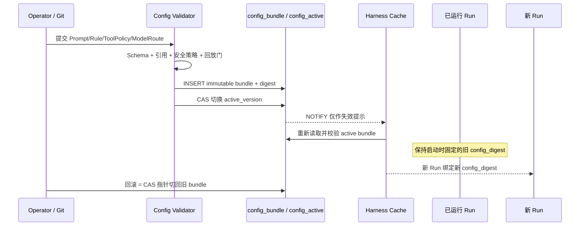

`ConfigBundleV1` 至少包含：

```text
config_version
prompt_version + prompt_digest
tool_registry_version + tool_schema_set_digest
policy_version + policy_digest
model_route_version
rule_set_version + rule_set_digest
rag_policy_version                 // 未启用 RAG 时为 NONE
evaluator_version
created_by / approved_by / created_at
bundle_digest
```

约束：

- 配置内容不可原地更新，只能发布新 bundle；回滚是切换 active 指针，不是修改旧数据。
- 每个 Run 在创建时固定 `config_version + bundle_digest`，所有 Task/Attempt 继承；运行中不得漂移。
- PostgreSQL `NOTIFY` 只用于低延迟缓存失效，不当可靠消息；进程还需周期性对账 `active_version`，重连后以表中状态为准。
- Prompt/规则/Tool Schema 的新版本先过 Scorer Replay、Agent Replay 和硬安全门，才能成为 active。
- 密钥不进入 ConfigBundle；仍由 env/受控 secret file 提供，轮换遵循单独流程。
- 如果 Spring Cloud Config 与当前 Spring Boot BOM 的兼容性 spike 通过，可把它作为 Git 配置读取器；**Run 级快照语义仍由 `ConfigBundle` 保证**，不能直接刷新正在执行的 Bean。

配置历史不能靠“把旧行的 `valid_until` 改回 NULL”实现。那既不是 INSERT-only，也会重写历史语义。目标数据模型固定为：

```text
config_bundle                  // INSERT-only；发布角色无 UPDATE/DELETE
  config_version PK
  bundle_digest UNIQUE
  payload_json
  created_by / approved_by / created_at

config_activation_event        // INSERT-only；每次发布/回滚追加一行
  activation_seq PK
  target_config_version FK
  previous_config_version
  action = ACTIVATE | ROLLBACK
  reason / actor / activated_at

config_active_pointer          // 仅一行；带 pointer_version 做 CAS
  singleton_key PK CHECK(singleton_key = true)
  active_config_version FK
  pointer_version
  updated_at
```

发布和回滚在同一短事务中执行：先校验目标 bundle digest 与评测门结果，再以 `WHERE pointer_version = :observed` 更新 active pointer，最后追加 activation event；CAS 失败则整个事务回滚并要求操作者刷新。旧 Run 持有自身 `config_version` 外键，不依赖 active pointer，因此切换不会改变运行中语义。

### 17.2 工具 Dry-Run、Shadow 与契约退化

附件提出的 `X-Dry-Run: true` 和“影子真实执行写工具”均不采纳：前者把执行权限交给调用方，后者可能把灰度变成真实事故。

工具注册表补充：

```text
tool_name
tool_version
input_schema_hash
output_schema_hash
adapter_version
risk_level                       // R0/R1/R2/R3
supported_modes                  // VALIDATE_ONLY/REPLAY_MOCK/SHADOW_READ/LIVE
side_effect_class                // NONE/IDEMPOTENT/REVERSIBLE/IRREVERSIBLE
timeout / max_result_bytes
required_scope
compatibility_probe
```

四种模式的确定语义：

| 模式 | 是否访问真实依赖 | 是否把结果交给 Agent | 适用范围 |
|---|---:|---:|---|
| `VALIDATE_ONLY` | 否 | 否，只返回参数/权限/预算/动作摘要 | 所有工具；R2/R3 的“干跑”唯一允许形态 |
| `REPLAY_MOCK` | 否 | 是，数据必须来自版本化 Dataset/CAS | 离线 Agent Replay |
| `SHADOW_READ` | 是 | 不进入生产上下文，只进入评测记录 | 仅 R0/R1 只读工具 |
| `LIVE` | 是 | 是 | 已批准的生产或靶场执行 |

强制规则：

- 执行模式来自持久化 Task Policy，并包含在 `action_digest`/`task input_digest` 中；HTTP Header 只能表达请求偏好，不能覆盖策略。
- Dry-Run 不返回伪造的 `dry_run_success + mock_data`；`VALIDATE_ONLY` 返回 `VALIDATED_NOT_EXECUTED`，`REPLAY_MOCK` 返回 `MOCKED_FROM_DATASET`。
- R2/R3 禁止 `SHADOW_READ` 伪装；任何副作用工具都不能被影子双写。
- Candidate 可以在安全 Case 中提出 R2/R3 `ToolIntent`，但控制面强制把它送入 `VALIDATE_ONLY`：只做 canonicalization、Schema、scope 和策略判定，记录 `dangerous_tool_proposal_rate/policy_deny_rate`，不给凭据、不创建 Action Runner 任务、不执行。若线上 Shadow 暴露写工具名称，也必须走同一路径。
- 新旧只读 Adapter 的 Shadow 结果只比较 Schema、错误分类、数据覆盖和耗时，不进入生产 Agent 上下文。
- 404 不能一律解释为 API 版本变更；Adapter 先按响应契约区分“资源不存在”和“端点不兼容”。
- 兼容性探测只选择已随镜像发布、已签名且在注册表中的 Adapter；禁止运行时联网下载插件。
- 工具进入 `DEGRADED` 后，Planner 只能选择注册表声明的替代数据源；报告必须显示缺失的数据源和 coverage，不能靠系统提示让 LLM 假装工具可用。

Prometheus 的 `/api/v1` 属稳定 HTTP API，项目应 pin Prometheus major 版本并对使用的 endpoint 做契约测试，而不是假设会突然从 `v1` 变成 `v1beta3`。

### 17.3 Run 级硬预算围栏

`max_steps=5` 不能阻止一个步骤展开大量子任务，因此预算必须是组合对象：

```text
BudgetEnvelopeV1:
  max_wall_clock_ms
  max_tasks
  max_task_depth
  max_llm_calls
  max_input_tokens
  max_output_tokens
  max_tool_calls
  max_tool_result_bytes
  max_cost_microunits
  finalization_reserve_tokens
```

预算由控制面记账，不能相信模型自报；父任务创建子任务时原子划拨子预算，子预算未使用部分可归还，但不能透支父预算。

当剩余预算低于 `finalization_reserve_tokens` 时，不再让模型自由“再查一次”，而是进入确定性终止：冻结已有 Claim → 标注缺失证据 → 在保留预算内组装 `PARTIAL/UNRESOLVED` 报告。禁止直接裁掉上下文头部或伪装成正常完成。

Run 预算之上再加 Incident 预算，封住 flapping/标签抖动不断生成新 generation 的漏洞：

```text
IncidentBudgetEnvelopeV1:
  window_duration
  max_generations_per_window
  max_runs_per_window
  max_llm_calls_per_window
  max_tokens_per_window
  max_cost_microunits_per_window
  cooldown_after_exhaustion
  escalation_policy_version
```

创建 Run 前在同一短事务中预留 Incident 预算；每次实际消耗以 append-only usage event 冲销预留。超限不会丢弃 webhook，也不会把 Incident 伪装成 RESOLVED，而是：继续保存 Alert/Incident 事实 → 不派生新 Run → 将 RCA 状态置为 `RCA_BUDGET_EXCEEDED` → 通过 §17.11 的升级 Outbox 转人工。窗口和初值由 AM3 基线填写，不能把“每 Incident 永远最多三代”写成不分场景的魔法常数。

### 17.4 历史回溯与时间一致性

不采用“告警超过 1 小时自动回溯”和“无数据则 confidence≤30%”这类魔法常数。每个 Run 显式记录：

```text
analysis_mode = LIVE | HISTORICAL_REPLAY
incident_window = [starts_at - lookback, ends_at + lookahead]
observed_at
data_source_retention
snapshot_digest
```

- LIVE 和 HISTORICAL_REPLAY 的所有查询都必须围绕 Incident 时间窗，不得默认查 `now()`。
- Replay 优先读取已封存 CAS Observation；只有 Dataset 明确允许时才重新查询历史数据源。
- 当前 Prometheus 留存覆盖需求时直接用 range query；只有实测留存不足且业务要求更长回溯时，再评估 Thanos/Cortex，不提前引入。
- 数据已过期返回类型化 `DATA_UNAVAILABLE{source, requested_range, available_range}`。
- 最终报告用 `evidence_coverage` 和 `missing_sources[]` 表达证据不足，不硬编码虚假置信度上限。

### 17.5 模型抽象与版本指纹

LiteLLM 已提供多提供商统一 OpenAI 风格接口、路由、fallback、成本和预算能力，因此不在 Harness 核心里重复实现每家厂商协议。核心只依赖：

```text
ModelRequestV1
ModelResponseV1
ToolProposalV1
UsageRecordV1
ModelErrorV1
```

边界 Adapter 负责把 provider 特有字段映射成内部契约，并通过契约测试验证 Tool Calling、JSON Schema、finish reason、usage 缺失和错误分类。模型切换仍要过回放门，不能因为“协议统一”就假设行为一致。

Token 账本区分来源，不把 tokenizer 估算伪称为账单真值：

```text
preflight_estimated_input_tokens       // 发送前，本地/提供商计数；用于预算预检
provider_reported_input_tokens         // 响应 usage，可空
provider_reported_output_tokens        // 响应 usage，可空
engine_estimated_system_tokens         // Holmes metadata.tokens 等角色拆分
engine_estimated_tool_definition_tokens
billed_cost_microunits                  // 账单/可信价格表对账，可滞后
usage_source + tokenizer_version + pricing_version
```

LiteLLM 的计数路径会因提供商能力、模型 tokenizer 和 fallback 而不同；发送后 provider usage 优先覆盖**总量记账**，但不会把 Holmes/LiteLLM 的角色拆分自动升级成 provider 精确值。预算预检值、提供商返回值和最终费用必须并存，可对账，不互相覆盖历史。

Holmes 边界的实际差距也在这里收口：当前 `HolmesClient.HolmesChatResult` 只保留原始 body 和 provider aggregate usage。AM3/AM4 Adapter 需要从 Holmes `/api/chat`/SSE 继续提取并规范化：

```text
provider_tool_call_id
tool_name
canonical_args / args_digest
status = SUCCEEDED | FAILED | APPROVAL_REQUIRED | UNKNOWN
result_digest / error_class
provider_reported_usage
engine_estimated_token_breakdown
truncation_metadata
```

Holmes 当前文档列出的 tool result 状态是小写 `success/error/approval_required`，并没有稳定承诺反馈中所写的 `NO_DATA` 等完整枚举；内部状态必须由 Adapter 显式映射，未知值落 `UNKNOWN` 并保留原始值。`ai_message.reasoning` 不进入审计表，符合“不保存 Thought”的冻结边界。

每个 Attempt 固定并审计：

```text
execution_fingerprint = sha256(
  model_route_version |
  concrete_model_id |
  sampling_policy_version |
  temperature | top_p | max_output_tokens |
  seed_requested | seed_effective | provider_system_fingerprint |
  config_bundle_digest |
  tool_schema_set_digest |
  event_schema_version |
  evidence_snapshot_digest |
  evaluator_version
)
```

版本指纹属于运行元数据，不注入 System Prompt 浪费 Token；需要模型知道的策略版本通过简短、结构化字段提供。

Holmes 的一次 `/api/chat` 可能在内部触发多次模型调用，control-app 只能事后看到 1:N 用量，不能单独保证 `max_cost_microunits` 实时不超。预算执行分两层：

1. control-app 在 Run/Incident 创建和每次 Holmes 调用前做 Token/费用预留，限制最大步骤、墙钟和外层调用数；
2. Holmes 使用绑定 Run/Attempt 的短期 LiteLLM virtual key（或等价受控身份），由 LiteLLM 在每次真实模型请求前执行 `max_budget/TPM/RPM/max_parallel_requests`；无可验证预算后端时 fail-closed；
3. 每次模型调用携带不可伪造的 run/attempt 关联元数据，代理返回 usage 后冲销预留；spend log 再由 Usage Reconciler 做 1:N 核对；
4. LiteLLM 的预算粒度/一致性和 key 生命周期必须通过故障测试确认。若所用版本不能提供本项目需要的 per-run 硬闸，则降低 Holmes `max_steps`/输出上限并把费用界限诚实标记为 `BEST_EFFORT`，不得仍写“不可透支”。

LiteLLM 官方文档说明 virtual key 可设置 `max_budget`、`budget_duration`、TPM/RPM 和最大并发，而且预算依赖持久化 spend 数据；这正是把硬闸放到“看得见每一次模型调用”的层，而不是把事后对账冒充 admission control。

### 17.6 LLM 逃生通道

逃生通道采用 `NORMAL → SOFT_DEGRADED → HARD_DEGRADED → RECOVERING → NORMAL` 状态机。失败率窗口、最小样本数、慢调用阈值、Half-Open 探测由 Resilience4j CircuitBreaker 管理；并发限制必须另用 Bulkhead/slot，CircuitBreaker 本身不限制并发。

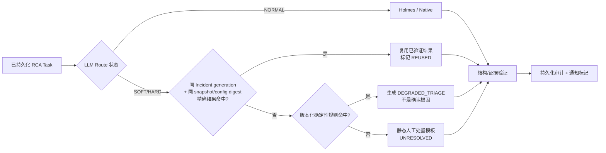

边界：

- 不使用向量相似度直接复用根因；只有 Incident generation、EvidenceSnapshot、ConfigBundle 全部一致才可精确复用。
- 规则引擎只能产出预先审批的 `DEGRADED_TRIAGE`，不得伪称已完成因果 RCA。
- 静态模板必须包含人工排查入口、缺失证据和 `analysis_mode=DEGRADED`。
- 不承诺 `<10ms/<30ms/60%命中率` 等未经本项目实测的数据。
- 正在运行的旧任务按其原路由和 ConfigBundle 完成；新任务按熔断状态选择路径，恢复时先 Half-Open 小流量再正常化。
- 如果入口 DB 失败，系统返回 503，不能返回固定 200；未持久化的请求不得假装已受理。
- 已返回 202 的任务必须继续使用 PG 审计。不能在“硬降级”时把审计改成本地散落日志、待以后补录。

### 17.7 风暴、黑板、去重与归因

附件中的一分钟/故障域哈希、Redis Hash 公告板和置信度投票不采用，替换为已有确定性模型：

- **风暴抑制**：Alertmanager group 负责上游聚合；入口整组落库；`incident_key + generation` 保证一组因果相关症状只创建一个活跃 Run。其他 alert 是 Incident member，不是无条件“继承代表 Agent 结论”。
- **短时精确复用**：不再增加独立 60 秒“结论缓存”。`incident_key` 本身不得包含接收时间戳，活跃 generation 已覆盖跨多个 webhook 的短时合并；只有 generation、EvidenceSnapshot、ConfigBundle 全一致时复用同一 Run。按 Pod 名做缓存反而会把 1000 个 Pod 拆成 1000 个 Key，且 TTL 到期会制造第二波 LLM 洪峰。
- **结构化黑板**：`rca_evidence + rca_claim + CAS` 是持久化黑板；Agent 传引用和类型化摘要，不互传长篇自然语言。
- **工具去重**：`sha256(tool_version + canonical_args + scope + time_range + snapshot_digest)` 是 Tool Invocation 幂等键；同 Run 复用已完成结果，正在执行则依赖其 Future/Task，不做固定等待 100ms。
- **冲突裁决**：按 Claim 类型选择权威数据源、双源佐证和一次 VERIFY；模型自评 confidence 仅用于排序，禁止加权投票当真值。
- **锚点守卫**：Task 明确 `goal/required_claims/allowed_tools/acceptance_criteria`；控制面检查覆盖率和预算，不用关键词猜 Agent 是否“跑偏”。
- **错误归因**：Provenance 记录 `agent_id/task_id/tool_call_id/evidence_id/claim_id`；报告被纠错后按 PLANNING/TOOL_INPUT/TOOL_OUTPUT/EVIDENCE/REDUCER/REPORT 分类，禁止仅按“错误结论引用比例”自动降低某 Agent 健康分。

### 17.8 Outbox 进度与灾难恢复

Outbox 的可靠性和时效性分开治理：唯一键/lease/重试保证“不丢”，`oldest_ready_age`、积压数量、失败率保证“没有悄悄变慢”。单实例 Compose 不做自动扩容，也不允许绕过 outbox 直接调用备用 Webhook；告警后由运维提高 worker slot 或启用已登记的备用渠道，仍需经过独立 outbox 与审计。

灾备最小闭环：

1. PostgreSQL 使用 pgBackRest（或等价成熟工具）执行加密全量/增量备份和 WAL archive，仓库位于主机故障域之外；
2. CAS 按 digest 做异机增量复制；配置 Git 仓库和 Dataset 同样异机备份；
3. 每月在隔离目录/临时实例执行恢复演练，验证数据库、CAS digest、Flyway 版本和应用启动；
4. 恢复后任务以 PostgreSQL 的 Run/Task/Attempt/Lease/Outbox 状态重建，不预加载旧进程内存；
5. RPO/RTO 由实际恢复演练测量后写入运维 SLO。未达标前只能声称“可恢复备份”，不能声称“温备/跨 AZ 容灾”。

当前备用 2C4G 的首要职责是隔离评测，不同时承担生产 Warm Standby。只有可用性目标明确要求、资源扩容并完成切换演练后，才新增 PostgreSQL standby；仅复制 Redis/内存快照不能恢复本系统的权威状态。

### 17.9 前端实时通道、取消与人工反馈

#### 17.9.1 定位：实时通道不是第二套控制面

WebSocket（或首版更轻的 SSE）只负责把 PostgreSQL 中已经提交的状态变化实时投影到 UI。Run 状态、事件回放、取消命令和人工反馈均以 PostgreSQL 为权威。浏览器断线、刷新、换节点或实时网关重启，只影响“看得是否及时”，不得影响 RCA 是否继续执行。

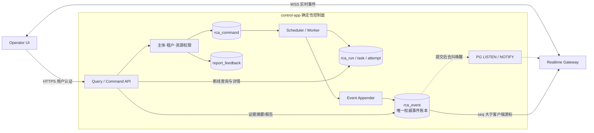

明确拒绝 Redis Pub/Sub、Redis 消息归档、跨实例 `/internal/push` 广播和“连接关闭即取消 Agent”。PG `NOTIFY` payload 只放 `run_id/last_seq` 等小型定位信息；消息正文来自已经提交的 `rca_event`。通知遗漏时，网关通过周期 catch-up 查询恢复。

#### 17.9.2 身份与资源标识

当前告警入口在整组持久化后立即拥有的是 `alert_inbox.id`，而 `rca_run.id` 要等异步 Projector 完成 Incident 聚合后才产生。因此：

1. `POST /webhooks/alertmanager` 成功返回 `intake_id`，并设置 `Location: /api/v1/alert-intakes/{intake_id}`；
2. UI 查询 Intake 投影，待其出现 `run_id` 后再订阅 Run；
3. 禁止发明与 `rca_run` 重复的 `t_sessions`，产品界面可把 Run 称为“分析会话”，但 API/数据库统一使用 `run_id`；
4. 浏览器不得持有或复用 Alertmanager 的机器 Bearer。

浏览器原生 WebSocket 不能像普通 `fetch` 一样自由设置 Authorization header。实时连接采用两种受控方式之一：

- 同源 UI 已有 `HttpOnly + Secure + SameSite` 用户会话，由握手继承 HTTP Principal；或
- 前端先经已认证 REST 调用 `POST /api/v1/stream-tickets`，取得 TTL 30 秒、单次使用、绑定 `principal_id + tenant_scope + run_id` 的不透明 ticket；服务端只存 ticket digest，并对访问日志中的 ticket 参数做强制脱敏。

两种方式都必须检查精确 Origin allowlist、连接时资源权限、会话过期和登出撤销。连接认证成功不代表拥有所有消息权限；任何客户端命令仍需逐条授权。

#### 17.9.3 持久事件与序列号

目标数据模型只有一张权威事件表，不再同步双写 Agent 审计事件和 UI 流事件：

```sql
alter table rca_run
    add column last_event_seq bigint not null default 0 check (last_event_seq >= 0);

create table rca_event (
    event_id       uuid primary key,
    run_id         uuid not null references rca_run(id),
    seq            bigint not null check (seq >= 1),
    run_revision   bigint not null check (run_revision >= 0),
    observed_generation integer not null check (observed_generation >= 0),
    schema_version integer not null check (schema_version >= 1),
    event_type     text not null,
    producer_kind  text not null check (producer_kind in ('CONTROL','AGENT','OPERATOR','RECONCILER')),
    visibility     text not null check (visibility in ('OPERATOR','AUDITOR')),
    payload_json   jsonb not null,
    payload_digest char(64) not null,
    created_at     timestamptz not null,
    expires_at     timestamptz,
    unique (run_id, seq),
    unique (run_id, event_id)
);

create index ix_rca_event_replay on rca_event(run_id, seq);

create view rca_agent_event as
select * from rca_event where producer_kind = 'AGENT';
```

同一个 Run 的状态推进本来就必须通过 `run_revision` CAS 串行化；Event Appender 用 `UPDATE rca_run SET last_event_seq=last_event_seq+:n ... RETURNING last_event_seq` 在短事务中原子领取连续事件段，再插入 `rca_event`。需要审计的状态变化与对应事件在同一事务；纯进度事件可独立短事务写入，但失败不能回滚已经提交的旧业务事实。这是维护一份权威审计账本，不是为 WebSocket 额外双写“显示日志”。禁止两个并发事务各自计算 `max(seq)+1`。

`pg_notify` 从权威写事务中移出，由轻量 notifier 读取每 Run 最新 seq、去抖后发送 `run_id/last_seq`；失败不回滚业务状态。网关即使完全收不到 NOTIFY，也会周期查询 `rca_event where seq > cursor`。这样事件表/通知故障只能让 UI 变慢，不能让账本事务失败。网关启动顺序固定为“先 LISTEN 并提交 → 读取当前事件快照 → 周期 catch-up + 通知唤醒”。同时监控 `pg_notification_queue_usage()`，长事务 listener 必须被终止并重连。

事件信封固定为：

```json
{
  "schema_version": 1,
  "event_id": "9a7c...",
  "run_id": "9e1b...",
  "seq": 18,
  "event_type": "TOOL_CALL_FINISHED",
  "occurred_at": "2026-09-04T10:30:01Z",
  "run_revision": 7,
  "payload_digest": "sha256:...",
  "payload": {
    "tool_name": "query_prometheus",
    "status": "SUCCEEDED",
    "summary": "支付服务 P99 在告警窗口升至 3.2s",
    "evidence_id": "e-17"
  }
}
```

允许的首批事件是 `INTAKE_PROJECTED/RUN_CREATED/RUN_STATE_CHANGED/TASK_STARTED/TOOL_CALL_STARTED/TOOL_CALL_FINISHED/EVIDENCE_AVAILABLE/REPORT_VALIDATING/APPROVAL_REQUESTED/REPORT_READY/RUN_TERMINAL/RESYNC_REQUIRED`。其中 `RESYNC_REQUIRED` 可由网关临时生成，不写回权威账本。禁止 `thought`、原始 prompt、Secret、完整工具参数、未脱敏日志和大体积时序数据进入 OPERATOR 可见 payload。`REPORT_READY` 只通知前端读取已封存报告，不能把 WebSocket 消息当作报告权威副本。

#### 17.9.4 查询和命令 API

| 接口 | 语义 | 幂等/并发约束 |
|---|---|---|
| `GET /api/v1/alert-intakes/{intake_id}` | 查询入口投影及关联 `incident_id/run_id` | 只读；按主体/租户授权 |
| `GET /api/v1/rca-runs/{run_id}` | 当前 Run 状态和 revision | 返回 ETag/run_revision |
| `GET /api/v1/rca-runs/{run_id}/events?after_seq=N&limit=M` | 从 `rca_event` 投影断线补偿和 HTTP 兜底 | `(run_id,seq)` 去重；游标过期返回 `RESYNC_REQUIRED` |
| `GET /api/v1/rca-runs/{run_id}/reports/current` | 读取已封存报告 | WebSocket final 不能替代它 |
| `POST /api/v1/rca-runs/{run_id}/commands/cancel` | 请求协作式取消 | `Idempotency-Key + If-Match`；先落命令后返回 202 |
| `POST /api/v1/rca-runs/{run_id}/hints` | 补充操作员材料 | 作为 `UNTRUSTED_OPERATOR_HINT`，不得提升为 system prompt |
| `POST /api/v1/reports/{report_id}/feedback` | 对报告提交纠错 | 幂等键；进入人工复核状态机，不直写知识库 |
| `POST /api/v1/stream-tickets` | 签发一次性实时连接票据 | 绑定主体、scope、Run 和 30 秒有效期 |
| `WSS /ws/v1/rca-runs/{run_id}?ticket=...&after_seq=N` | 实时投影 | 至少一次；客户端按 `(run_id,seq)` 去重 |

业务命令的权威入口是 REST。若未来为了单连接体验允许 WebSocket 接收 `cancel/hint/feedback`，消息处理器也只能调用同一个 Command Service，先完成 Schema、大小、速率、权限、幂等和持久化，不得直接修改内存 Context。

取消命令建议使用：

```sql
create table rca_command (
    command_id            uuid primary key,
    run_id                uuid not null references rca_run(id),
    command_type          text not null check (command_type in ('CANCEL','ADD_HINT','REQUEST_RERUN')),
    actor_id              text not null,
    idempotency_key       text not null,
    expected_run_revision bigint,
    payload_json          jsonb not null,
    payload_digest        char(64) not null,
    status                text not null check (status in ('REQUESTED','APPLIED','REJECTED','EXPIRED')),
    created_at            timestamptz not null,
    applied_at            timestamptz,
    unique (actor_id, idempotency_key)
);
```

`Context.cancel()` 只用于命令已经提交后，加速停止恰好在本进程执行的调用；Run 的 `CANCELLED` 状态只能由状态机在校验 revision、租约和外部调用状态后提交。WebSocket close 只移除连接，不创建取消命令。

反馈不得一步“蒸馏到向量库”。目标表至少绑定 `report_id/actor_id/correction_type/corrected_component/corrected_fault_type/corrected_reason_code/evidence_refs/review_status/reviewer_id/dataset_version`，状态为 `SUBMITTED→VERIFIED→ACCEPTED|REJECTED→INCORPORATED`。只有 `ACCEPTED` 且完成数据污染检查的反馈才能进入新 Dataset 版本；历史报告保持不可变。

#### 17.9.5 背压、线程和连接预算

- 本地连接表是 `run_id -> Set<connection_id>`，而不是 `session_id -> 单 WebSocket`；同一 Run 可被多个授权页面查看；
- PG `LISTEN` 使用一个专用物理连接，不能永久占用入口池或 Worker 池；断线后指数退避重连并执行全量 cursor catch-up；
- 原生 `WebSocketSession` 的发送必须串行化，Spring 实现用 `ConcurrentWebSocketSessionDecorator` 或等价单写者；
- 初值：单事件 16KiB、Evidence 摘要 8KiB、单连接发送缓冲 256KiB、单次发送 5 秒、20 条或 50ms 一批、20 秒心跳；上线前以反向代理超时和 E2E 压测校准；
- 批处理只能改变传输封装，内部每条事件仍保留独立 seq；缓冲溢出时关闭慢连接并要求按游标重连，不静默丢事件；
- `rca_event` 是审计账本，不能按 WebSocket 的短保留期删除；UI 需要的短期 payload 可做独立可丢缓存/物化投影，但它不是权威事实，缓存失效后从 `rca_event` 重建或只展示当前状态。

### 17.10 对账系统：按不确定性的来源分治

对账不是一个万能协程，而是六条职责和证明能力不同的链。任何对账结果都追加独立 Observation，不重写原始调用事实，也不直接改变已经封存的 EvidenceSnapshot 或报告。

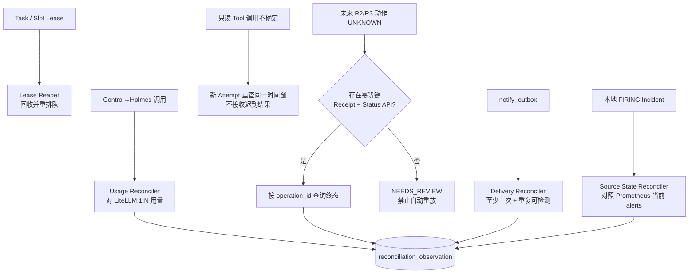

| 对账类型 | 当前/目标机制 | 可以证明什么 | 不能承诺什么 |
|---|---|---|---|
| Worker/Lease 恢复 | slot/task 租约、epoch、过期回收 | 旧持有者不能提交；任务可重新领取 | 不能恢复已丢失的外部响应 |
| Holmes/LiteLLM 用量 | control 一次调用对 provider N 条 spend 记录，聚合为 MATCHED/PARTIAL/UNMATCHED | Token/费用账是否可关联 | 不能用账单恢复模型回答 |
| 只读工具 | 原 attempt 保持 FAILED/UNKNOWN；按预算创建新 attempt 重查同一 Incident 时间窗 | 新查询得到的新证据 | 不能证明超时的旧 HTTP 查询最终返回了什么 |
| 写动作 | 只有稳定幂等键、operation_id、状态 API 和回执齐备才自动 Probe | 外部动作的可验证终态 | UNKNOWN 时不得自动重放；无状态 API 时只能转人工 |
| 通知 Outbox | 稳定 event_id、发送 attempt、下游幂等或重复可检测 | 本地命令不丢、至少一次发送 | 下游不支持幂等时不能承诺 exactly-once |
| Incident 源状态 | 低频读取 Prometheus 当前 firing alerts，与本地 FIRING 投影按 identity policy 对照 | 发现 resolved webhook 丢失或投影长期漂移 | “当前查不到”本身不能证明过去从未 firing，也不能删除历史 |

当前 `external_invocation_ledger` 的真实语义保持不变：网络/HTTP 超时由分类器形成 `FAILED` 可重试结果；Worker 崩溃留下且超过 grace period 的 `STARTED` 才转 `UNKNOWN`。`UNKNOWN` 是对原 attempt 的终态陈述，不得改回 `SUCCEEDED`。若未来外部系统支持状态查询，查询结果写入：

```sql
create table reconciliation_observation (
    id               uuid primary key,
    subject_type     text not null,
    subject_id       uuid not null,
    strategy         text not null,
    attempt_no       integer not null check (attempt_no >= 1),
    observed_state   text not null,
    source_ref       text,
    result_digest    char(64),
    detail_json      jsonb not null,
    observed_at      timestamptz not null,
    unique (subject_type, subject_id, attempt_no)
);
```

这张表表达“后来观察到了什么”，而不是篡改“原调用当时已知什么”。若 Observation 足以证明写动作完成，控制面可以关闭对应人工案件；若只读数据对当前 RCA 仍有价值，必须创建新 generation 或显式 Rerun，并生成新的 EvidenceSnapshot，禁止补进旧报告。

Incident Source State Reconciler 使用受限只读身份周期查询 Prometheus `/api/v1/alerts`（或已经 pin 版本的等价当前告警接口），只处理“本地仍 FIRING、上游已连续多次缺席且超过宽限窗”的差集。它先追加 `subject_type=INCIDENT, observed_state=SOURCE_ABSENT_AFTER_GRACE`，再由 Incident 状态机生成新的事实事件使投影收敛；不得删除原 firing webhook，也不得把一次查询失败或 `DATA_UNAVAILABLE` 当作 resolved。Prometheus 当前告警 API 可返回 active alerts，Alertmanager webhook 可配置 `send_resolved`；两条信息结合只足以支持“做低频交叉核验”，不能把一次上游缺席直接解释成 resolved。

每条 Reconciler 注册以下共同护栏：

```text
max_attempts
max_wall_clock
max_subject_age
backoff_policy
backlog_age_slo
escalation_policy_version
terminal_outcome = RECONCILED | EXHAUSTED | NEEDS_REVIEW | DATA_UNAVAILABLE
```

对账耗尽必须创建/合并 Operator Case，不得无限扫描同一 subject。至少暴露 `reconciliation_backlog{type}`、`reconciliation_oldest_age_seconds{type}`、`reconciliation_exhausted_total{type}`；对账任务本身使用独立 slot，不能饿死入口或正常 RCA。

Outbox 侧的本地 24 小时去重表不能消除“下游已收到、发送方在记录 SENT 前崩溃”的重复窗口。优先要求下游按稳定 `event_id` 幂等；下游不支持时，报告和消息展示 `operation_id`，系统只承诺 at-least-once 和重复可审计，不伪称 exactly-once。

配置完整性和预算汇总属于独立校验任务，不与外部调用对账混为一谈：ConfigBundle 通过 digest、activation event 和 active pointer CAS 校验；Token/调用次数/费用通过 append-only 消耗记录与 provider usage 对账，任何修正以 adjustment event 表达，禁止覆盖历史消耗。

### 17.11 人工介入、SLA 与升级

AI 可以回答“不确定”，但控制面不能把“不确定”停在数据库里无人处理。人工介入是确定性工作流，不是再启动一个“看门狗 Agent 编结论”。

目标状态机：

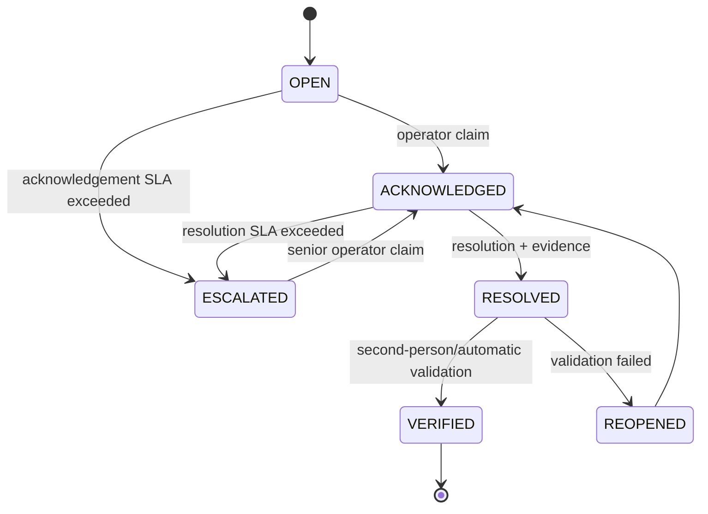

首批触发规则是配置初值，不写死在业务代码：

| 触发条件 | 初始动作 | 去重键 | 默认 SLA |
|---|---|---|---|
| 同一 Incident 在 24h 内连续 3 个 Run 为 `UNRESOLVED` | 创建/合并 P2 Operator Case，停止自动重查直到人工释放 | `incident_id + UNRESOLVED_STREAK + policy_version` | 30 分钟确认，4 小时处置/降级说明 |
| 同租户 1h 内新增 `NEEDS_REVIEW > 5` | P2 工具链健康事件；检查数据源/模型/权限是否面故障 | `tenant_id + hour_bucket + REVIEW_BURST` | 15 分钟确认，1 小时完成范围判断 |
| R2/R3 UNKNOWN、越权实际执行、跨租户或 Secret 泄露 | P1 安全/副作用事件，相关 Action/引擎 fail-closed | `operation_id/security_event_id` | 5 分钟确认，立即升级双通道 |
| 人工确认根因与已发布报告不一致 | 原报告不覆盖；创建 `CORRECTION_DIVERGENCE` 和 Golden 候选 | `report_id + feedback_digest` | 1 个工作日内复核 |
| Incident/Run 预算耗尽或 Reconciler 耗尽 | P2 容量/可靠性事件；保留事实并停止自动派生 | `subject_id + exhaustion_type + window` | 30 分钟确认 |

`operator_case` 至少记录 `case_id, subject_type/id, priority, reason_code, status, owner, policy_version, first_seen_at, ack_due_at, resolve_due_at, evidence_refs, revision`；通知通过 `escalation_outbox` at-least-once 投递到已配置值班渠道。项目不强绑定 PagerDuty：可以是 PagerDuty、企业 IM、短信或现有工单系统，但每个渠道都要有稳定 `event_id`、发送 attempt 和重复检测。

SLA 超时只升级通知/负责人，不允许自动把 AI 低质量结论改成“已解决”。人工结论必须附证据和操作者身份；被 `VERIFIED` 的纠错进入 `golden_candidate`，再经污染检查、双人复核和 Dataset 版本发布，不能直接写知识库或 HOLDOUT。

### 17.12 热冷分离、留存和历史查询

固定的 7/24/30 天是容量规划初值，不是法规事实。权威规则由 `RetentionPolicyV1` 版本化，按数据类别、租户合同、审计要求和 legal hold 决定；任何缩短留存都要审批并留下 activation event。

| 数据 | 热层初始基线 | 冷层/删除候选 | 关键限制 |
|---|---|---|---|
| `rca_task/attempt` | 活跃记录 + 终态 7 天 | 终态且过热期后归档 | 活跃、WAITING_APPROVAL、未完成对账不得归档 |
| `external_invocation_ledger` | 全部未终态 + 已终态 24 小时 | 已终态且无开放对账后归档 | UNKNOWN/关联 Operator Case 未关闭不得归档 |
| `report_publication/outbox` | PENDING/RETRY + SENT 1 天 | SENT/终态 attempt 归档 | DEAD 和未确认重复窗口保留在线索引 |
| `rca_event/audit_log` | 最近 30 天 | 脱敏压缩后进入 CAS/对象存储 | 安全审计、审批、写动作按更长合规策略；不随 UI 缓存删除 |
| `rca_report/evidence manifest` | 当前与最近版本索引常驻 | 大正文在 CAS，PG 保留 digest/定位索引 | 已发布报告、manifest、digest 不因热表清理而失联 |

物理分区先按 `created_at` 做月度 RANGE；`tenant_id` 建普通/必要的局部索引并用角色/RLS 隔离。小体量阶段不为每个租户建立子分区，避免分区数量和运维元数据爆炸。只有压测证明单表/单月分区已成瓶颈时才增加子分区。

归档协议：

1. 只选满足终态、宽限窗、无 legal hold、无开放对账/人工案件的已封口分区或批次；
2. 生成 `archive_manifest`：策略版本、时间范围、tenant 范围、行数、主键 min/max、每文件 digest、schema_version、CAS refs；
3. 导出到故障域外存储，重新读取校验行数和 SHA-256；
4. 校验通过后 `DETACH PARTITION`，经过恢复演练/删除宽限期才物理删除；失败则保留热数据并告警；
5. PG 保留轻量 `archive_catalog`，历史查询先查热层，再按目录读取明确归档版本；冷层不可用返回 `ARCHIVE_UNAVAILABLE`，不能伪装“没有历史记录”。

PostgreSQL 官方文档指出分区的价值包括快速 detach/drop 和把低频数据迁到更廉价介质，但也说明收益取决于表规模；因此本项目先冻结协议和表的可分区键，达到容量阈值后再启用物理月分区，不为架构好看提前制造分区维护成本。

### 17.13 历史知识检索：有限翻案，不复活“相似即根因”

原裁定继续拒绝两件事：独立 Redis/向量数据库作为新权威设施；向量相似度超过阈值就直接复用历史根因。第二轮评审指出的合理部分是：历史事故/Runbook 可以作为**待验证假设**，这与 `Agent proposes → Evidence validates` 的既有纪律一致。

AM5 设置可选 `RETRIEVE_HYPOTHESES` 任务，优先从 PostgreSQL 全文检索起步；数据量和召回实验证明确有收益后，才在现有 PG 16 评估 pgvector。小规模默认精确搜索，不先建高内存 HNSW。输出固定为：

```text
RetrievalCandidateV1:
  candidate_id
  source_type = VERIFIED_INCIDENT | APPROVED_RUNBOOK
  source_version / tenant_scope / applicable_architecture_range
  similarity_or_rank
  hypothesis_text
  source_evidence_refs[]
  retrieval_policy_version
  content_digest
  trust = UNTRUSTED_HYPOTHESIS
```

硬边界：

- 只检索人工确认/已验证且仍在适用期的历史材料；待审 Feedback、普通模型输出、HOLDOUT、Ground Truth 和别的租户数据在 SQL 权限层不可见；
- 检索结果只能派生待验证 Claim，必须由当前 Incident 时间窗的 Metrics/Logs/Traces/变更事实重新佐证；不得把历史 Evidence 当成本次 Evidence；
- 报告列出检索来源、版本和是否被当前证据证实；未证实只能写“建议检查”，不能写“根因”；
- 通过有/无检索的配对 HOLDOUT 实验衡量 Top-1、unsupported claim、成本和延迟；没有显著收益或安全指标变差就保持 `rag_policy_version=NONE`；
- pgvector 是 PostgreSQL 扩展而不是独立服务，但仍会增加镜像、升级、索引内存和备份测试，因此属于受门禁的 AM5 能力，不是“零成本直接打开”。

## 18. 自研与复用边界

| 能力 | 直接复用 | 本项目只写的薄胶水/领域逻辑 |
|---|---|---|
| 告警分组/重发 | Alertmanager | group/alert/incident 三层映射 |
| 调查基线 | HolmesGPT | 输入/结果适配器、权限包裹 |
| 模型代理和 Token 账本 | LiteLLM | run/attempt 关联与一对多对账 |
| 指标与告警 | Prometheus/Alertmanager | 订单域指标、Sloth/规则配置 |
| Trace/Metrics/Logs 标准 | OpenTelemetry | 领域 span 和低基数约束 |
| JSON Schema 验证 | NetworkNT JSON Schema Validator | Evidence/Agent/Report 契约 |
| 数据迁移 | Flyway | 告警域、DAG、评测表 DDL |
| 持久队列/outbox/DLQ | PostgreSQL + `SKIP LOCKED` | 租约、epoch、幂等键和状态机 |
| 实时进度投影 | Spring WebSocket 或首版 `SseEmitter` + PostgreSQL `LISTEN/NOTIFY` | 复用权威 `rca_event`、Run 级 seq、游标回放和脱敏视图 |
| 实时通道安全 | Spring Security HTTP Principal/HandshakeInterceptor | 一次性 stream ticket、Run 级资源授权和连接审计 |
| WebSocket 慢消费者 | `ConcurrentWebSocketSessionDecorator` | 事件大小、发送时间、缓冲上限和重连策略 |
| Native Agent SDK | Spring AI 兼容版本或薄自研循环 | 计划编译、Claim Reducer、Context Budget |
| 评测执行框架 | Inspect AI（2C4G、HTTP Solver） | EvalCase 映射、生产 Run 关联、确定性发布门 |
| RCA 外部基准 | RCAEval 小子集 + RCA-100 adapter | 订单域 Golden Set 与权限隔离 |
| 红队生成 | Promptfoo；AgentDojo 双指标思想 | RCA 特有攻击载体、硬门禁和生产回流 |
| 策略判定 | AM5 R2/R3 优先 OPA Bundle/Decision Log | ToolIntent、action digest、审批与执行回执 |
| 隐私识别 | Presidio 按需试点 | Secret/中文实体规则、CAS 权限与误报回归 |
| 外部自监控 | 2C4G Gatus + 独立值班 receiver | 合成告警 canary 与生产 Run/Outbox 核对 |
| 历史假设检索 | PostgreSQL 全文检索；AM5 达标后可选 pgvector | 租户/有效期过滤、UNTRUSTED 候选、当前证据验证与 A/B 门禁 |
| 可视化评测平台 | AM5 再评估 Langfuse 等 | 确定性评分和发布门禁仍归控制面 |

真正不能直接“抄项目”的部分只有领域差异：Incident 归并规则、订单故障真值、计划编译约束、Claim 权威源裁决、报告证据引用验证和本项目质量门策略。

## 19. 架构验收清单

- [ ] Alertmanager group 原子落库；成员 alert 幂等；Incident generation 单活 Run。
- [ ] 每个已启用 alert family 有版本化 IncidentIdentityPolicy、完整 label allowlist 和并/拆反例测试；不存在“等稳定标签”的隐式默认。
- [ ] 401/400/413/429/503/202 语义及审计均有自动化测试。
- [ ] 入口通过后内容仍按 untrusted data 处理；越权工具实际执行数为 0。
- [ ] 任一进程在外调中被 SIGKILL，lease、slot、attempt、ledger 最终可恢复。
- [ ] 重试不占线程/slot；耗尽后进入可查询 DLQ；Replay 不覆盖原记录。
- [ ] Holmes 和 Candidate 使用同版本契约、工具策略和 EvidenceSnapshot。
- [ ] EvidenceSnapshot（输入）、EvidencePackage（引擎输出）和 AgentResult（通用信封）有独立 Schema/Adapter 测试，不发生混名或绕过验证。
- [ ] ground truth 对 control/Holmes/Candidate 不可见。
- [ ] 失败、超时、拒绝和 UNRESOLVED 均落调查结果，不被统计为“缺席”。
- [ ] 三类 Replay 的报告明确标识证明范围、LLM 成本和数据版本。
- [ ] REPLAY/REDTEAM 无法访问生产只读端点；ONLINE_READ_SHADOW 使用独立凭据、allowlist、限流和 slot。
- [ ] Agent Replay 仅精确匹配 Observation；REPLAY_MISS、partial replay 和 replay coverage 可查询。
- [ ] Quality Gate 的安全门、质量门、运行门分别出结果。
- [ ] Utility 与 Security 分别出分；硬安全门 0 违规，正常 Case 的 false refusal 不超限。
- [ ] 无 ground truth 的在线 Shadow 只报告 disagreement，不宣称 Candidate 更正确。
- [ ] 审计事件与原始 artifact digest 可串成完整证据链。
- [ ] 评测机断网/宕机不影响生产 Holmes 主路径。
- [ ] 2C4G 在 Candidate 并发 1 和一次完整 Agent Replay 下无 OOM，保留至少 20% 余量。
- [ ] HOST1 各容器 RSS/limit 与 `MemAvailable` 完成一周合账；低水位按“停靶场/影子→降 Holmes slot→停领取新 RCA、入口仍持久化”演练。
- [ ] 不存在 K8s/Helm 运行依赖，不开放 Docker TCP 2375。
- [ ] ConfigBundle 发布/回滚只影响新 Run；运行中 Run 的 config digest 不变化。
- [ ] ConfigBundle 内容和 activation event 均 append-only；active pointer CAS 冲突不会覆盖他人发布。
- [ ] 入口/Worker 连接池隔离；claim SQL 有部分索引、批量上限、超时和 EXPLAIN 证据；入口池耗尽 1 秒内返回 503。
- [ ] 外部 Header 不能切换工具执行模式；R2/R3 无 Shadow 双写路径。
- [ ] Run 组合预算在子任务展开时仍不可透支，保留终局组装预算。
- [ ] Incident 跨 generation 的次数/Token/费用预算可原子预留；flapping 压测不会无限创建新 Run。
- [ ] Holmes 1:N 模型调用在 LiteLLM 可见调用处有预算/TPM/RPM 闸；若所用版本做不到，文档和告警明确标为 BEST_EFFORT。
- [ ] Historical Replay 数据缺失时返回 DATA_UNAVAILABLE，未发生 `now()` 偷换。
- [ ] LLM 全部不可用时产出明确 DEGRADED/UNRESOLVED，而不是伪造高置信度 RCA。
- [ ] RCA 控制面告警不进入线上 RCA；2C4G 黑盒探针可在 195/主 Alertmanager 失效时直达值班通道，并完成一次合成告警链路演练。
- [ ] OTel span 不包含原始 prompt/tool args/result；内部审计契约不依赖 Development 语义升级。
- [ ] JSON stdout、Micrometer `/actuator/prometheus`、OTel Trace 可按 run/task/attempt 关联；ID 不进入 metric label；遥测出口故障不回滚业务事实。
- [ ] Holmes tool_call_id/name/params/status/result digest 与 usage 来源可审计，未知状态不会被误记为成功。
- [ ] pgBackRest/WAL 与 CAS 异机备份完成一次从零恢复演练，结果和耗时归档。
- [ ] 告警入口 202 返回 `intake_id`；Projector 完成前不会伪造 `run_id/session_id`，UI 能从 Intake 稳定解析到 Run。
- [ ] WebSocket/SSE 断线、刷新、网关重启不会取消或改变 Run；REST 查询可以恢复完整权威状态。
- [ ] 浏览器不持有 Alertmanager 机器 Bearer；Origin、ticket/HTTP Principal、Run scope 和每条客户端命令都经过授权测试。
- [ ] 实时事件不含 Thought、Secret、原始 prompt、完整工具参数或未脱敏证据；慢客户端缓冲溢出后可按 seq 无损重连。
- [ ] `rca_event` 是唯一物理事件账本；不存在 `rca_agent_event + rca_stream_event` 双写；关闭 PG NOTIFY 后周期 catch-up 仍能恢复事件。
- [ ] Cancel/Hint/Feedback 均先持久化再生效；WebSocket close 不取消，Hint 不提升为 system prompt，未审核反馈不进入 Dataset。
- [ ] UNKNOWN 写动作没有自动重放路径；只读重查生成新 attempt，迟到结果不能进入旧 EvidenceSnapshot/报告。
- [ ] 下游不支持 event_id 幂等时，通知明确标注 at-least-once 和重复可检测，不存在本地“假 exactly-once”承诺。
- [ ] Incident Source State Reconciler 能发现丢失 resolved 的漂移，查询失败不会被误判为 RESOLVED；六类 Reconciler 均有预算、积压年龄和升级终态。
- [ ] 重复 UNRESOLVED、NEEDS_REVIEW 聚集、人工纠错分歧、预算/对账耗尽均生成幂等 Operator Case，SLA 超时能升级且不会自动编造结论。
- [ ] Dataset 分区权限证明 HOLDOUT/Ground Truth 对 Agent/RAG 不可见；发布门记录重复试验、采样参数、方差和配对区间。
- [ ] Top-3 在 v2 单根因输入上返回 NOT_SUPPORTED_BY_SCHEMA；仅 v3 排序候选契约可计算。
- [ ] 月分区/归档作业在条数与 digest 校验失败时不删除热数据；legal hold、冷层不可用和历史查询均有测试。
- [ ] 历史检索只产 UNTRUSTED_HYPOTHESIS，跨租户/HOLDOUT 查询为 0，未被当前证据验证的候选不会成为根因。

## 20. 与当前代码、AM2、AM3 的对应关系

| 当前证据 | 本架构如何承接 |
|---|---|
| `AlertWebhookController`、`AlertInboxProcessor` 已存在 | 保持入口与投影分离，后续补入口风险事件和精确限流语义 |
| `RcaWorker`、`RcaTaskExecutor`、`HolmesInvestigationExecutor` 已存在 | 把 Holmes 收敛为 Baseline executor；Native Engine 实现相同端口 |
| 当前 `HolmesClient.HolmesChatResult` 只保留 body + aggregate usage | AM3/AM4 扩展 Adapter 提取 tool_call/truncation/角色 token；不读取 `ai_message.reasoning` |
| 当前只有 `spring-boot-starter-web`，没有 WebSocket/Spring Security 接入；Webhook 202 返回 `inboxId` | 实时通道作为后续独立增量；先冻结用户认证与 `intake_id→run_id` 契约，再增加依赖和端点 |
| 当前 `RcaWorker` 仅将崩溃遗留的超龄 STARTED 调用标为 UNKNOWN | 保持 UNKNOWN 终态；未来对账追加 Observation，不回写成功、不把迟到响应补进旧证据 |
| 当前 `EvidencePackageValidator` 是六段式 v1 | AM3 新增 v2 双版本路由，不原地改变 v1 语义 |
| V7 当前为 9 表，无 `rca_task_edge` | AM4 迁移新增 DAG edge、统一 `rca_event`、Evidence/Claim；AM2 不依赖它 |
| AM2 v3.0 冻结 ScenarioMap 和 ground truth 隔离 | 直接作为 Live E2E 与语义准确率真值源 |
| AM3 v3.0 冻结 InvestigationResult、ToolCall、三指标与 LiteLLM | 直接作为 Holmes Baseline 和六维评测的最小数据底座；AM4 前补 observed_generation/schema/digest 直接栅栏 |

因此 v1.2 不要求回头推翻 AM1，也不把 AM4 表强塞进 AM2；它只要求 AM2/AM3 新契约具备版本、digest、run/generation 和失败落档能力，确保后续可以无损演进。

### 20.1 AM1 状态子集到目标全集的迁移

AM1 的“六态”是当前代码/DDL，不是 AA-20 目标全集的另一种同义写法。迁移必须显式映射并用双读契约测试保护：

| 当前 RcaTask 六态 | 目标状态 | 迁移/引入说明 |
|---|---|---|
| `READY` | `READY` | 原样保留 |
| `LEASED` | `LEASED` | 原样保留；创建 attempt 后显式推进 `RUNNING` |
| `RETRY_WAIT` | `FAILED_RETRYABLE` | `available_at` 保留；到期由调度器推进 READY |
| `DONE` | `SUCCEEDED` | 名称收敛，迁移保留 finished_at |
| `CANCELLED` | `CANCELLED` | 原样保留 |
| `DEAD` | `DEAD` | 原样保留 |
| AM4 新增 | `BLOCKED/RUNNING/SKIPPED/FAILED_TERMINAL/STALE` | DAG、显式执行态、可选任务、终态失败和 generation fence |
| AM5 新增 | `WAITING_APPROVAL` | 只在 R2/R3 Action Runner 启用 |

| 当前 RcaRun 六态 | 目标状态 | 迁移/引入说明 |
|---|---|---|
| `QUEUED/RUNNING/SUCCEEDED/CANCELLED` | 同名 | 原样保留 |
| `FAILED` | `FAILED` 或 `PARTIAL` | 只有存在通过验证的部分报告才映射 PARTIAL；否则 FAILED |
| `SUPERSEDED` | `EXPIRED(reason=NEWER_GENERATION)` | 保留旧值双读一个退场窗口，不丢历史含义 |
| AM4 新增 | `REPORTING/PARTIAL/EXPIRED` | 报告组装、部分结果和预算/新 generation 终止 |
| AM5 新增 | `WAITING_APPROVAL` | 只在运行中含审批动作时启用 |

数据库迁移顺序固定为“约束先扩容允许新旧值 → 应用双读旧写 → 数据回填 → 新写 → 回放/状态机穷举测试 → 删除旧值”。不得先收紧 CHECK 约束再发布能写旧枚举的节点。

## 21. 参考基线

- 仓库内证据索引：`docs/告警-OSS-证据清单.md`
- 当前架构基线：`docs/架构设计-告警Agent-v1.md`
- AM2 方案：`docs/告警AM2-技术方案.md`
- AM3 方案：`docs/告警AM3-技术方案.md`
- OpenTelemetry GenAI 语义约定：<https://opentelemetry.io/docs/specs/semconv/registry/attributes/gen-ai/>
- OWASP Prompt Injection Prevention：<https://cheatsheetseries.owasp.org/cheatsheets/LLM_Prompt_Injection_Prevention_Cheat_Sheet.html>
- OWASP AISVS 1.0 输入验证控制清单：<https://github.com/OWASP/AISVS/blob/main/1.0/en/0x91-Appendix-B_AI_Security_Controls_Inventory.md>
- Docker daemon attack surface：<https://docs.docker.com/engine/security/protect-access/>
- PostgreSQL `SKIP LOCKED`：<https://www.postgresql.org/docs/current/sql-select.html>
- scikit-learn F1 定义：<https://scikit-learn.org/stable/modules/generated/sklearn.metrics.f1_score.html>
- scikit-learn Classification Report：<https://scikit-learn.org/stable/modules/generated/sklearn.metrics.classification_report.html>
- PostgreSQL `LISTEN/NOTIFY`：<https://www.postgresql.org/docs/current/sql-notify.html>
- PostgreSQL Continuous Archiving/PITR：<https://www.postgresql.org/docs/current/continuous-archiving.html>
- pgBackRest User Guide：<https://pgbackrest.org/user-guide.html>
- Spring Cloud Config Git backend：<https://docs.spring.io/spring-cloud-config/reference/server/environment-repository/git-backend.html>
- Nacos Docker Quick Start 的生产边界：<https://nacos.io/en/docs/latest/quickstart/quick-start-docker/>
- Resilience4j CircuitBreaker/Bulkhead 边界：<https://resilience4j.readme.io/docs/circuitbreaker>
- Resilience4j Bulkhead 配置：<https://resilience4j.readme.io/docs/bulkhead>
- Prometheus API 稳定性：<https://prometheus.io/docs/prometheus/latest/stability/>
- OpenAPI Specification：<https://spec.openapis.org/oas/latest.html>
- LiteLLM 统一提供商接口与路由：<https://docs.litellm.ai/>
- HolmesGPT HTTP API、tool call、approval 与 token metadata：<https://github.com/HolmesGPT/holmesgpt/blob/master/docs/reference/http-api.md>
- Inspect AI Tasks/Sandbox/Approval：<https://inspect.aisi.org.uk/tasks.html>、<https://inspect.aisi.org.uk/sandboxing.html>、<https://inspect.aisi.org.uk/approval.html>
- Microsoft AIOpsLab：<https://github.com/microsoft/AIOpsLab>
- RCAEval：<https://github.com/phamquiluan/RCAEval>
- RCA-100 / RCA-Bench：<https://sls.aliyun.com/doc/starops/benchmark/rca/rca_benchmark_dataset.html>
- AgentDojo：<https://github.com/ethz-spylab/agentdojo>
- Promptfoo Red Team Plugins/Strategies：<https://www.promptfoo.dev/docs/red-team/plugins/>、<https://www.promptfoo.dev/docs/red-team/strategies/>
- NeMo Guardrails Rail Types：<https://docs.nvidia.com/nemo/guardrails/about-nemo-guardrails-library/rail-types>
- OPA Decision Logs/Bundles：<https://www.openpolicyagent.org/docs/management-decision-logs>、<https://www.openpolicyagent.org/docs/management-bundles>
- Microsoft Presidio Analyzer：<https://microsoft.github.io/presidio/analyzer/>
- Prometheus Meta-monitoring：<https://prometheus.io/docs/practices/alerting/>
- Alertmanager Routing：<https://github.com/prometheus/alertmanager/blob/main/docs/configuration.md>
- Gatus 外部健康检查与独立通知：<https://github.com/TwiN/gatus>
- 浏览器 WebSocket 构造器与认证限制：<https://developer.mozilla.org/en-US/docs/Web/API/WebSocket/WebSocket>
- Spring WebSocket API、握手与并发发送：<https://docs.spring.io/spring-framework/reference/web/websocket/server.html>
- Spring Security WebSocket：<https://docs.spring.io/spring-security/reference/servlet/integrations/websocket.html>
- OWASP WebSocket Security Cheat Sheet：<https://cheatsheetseries.owasp.org/cheatsheets/WebSocket_Security_Cheat_Sheet.html>
- Spring MVC SSE：<https://docs.spring.io/spring-framework/reference/web/webmvc/mvc-ann-async.html>
- Spring `ConcurrentWebSocketSessionDecorator`：<https://docs.spring.io/spring-framework/docs/current/javadoc-api/org/springframework/web/socket/handler/ConcurrentWebSocketSessionDecorator.html>
- AWS Transactional Outbox：<https://docs.aws.amazon.com/prescriptive-guidance/latest/cloud-design-patterns/transactional-outbox.html>
- Prometheus Alertmanager Alerts API（firing/resolved 重发期望）：<https://prometheus.io/docs/alerting/latest/alerts_api/>
- Prometheus Alertmanager 配置（`send_resolved`）：<https://prometheus.io/docs/alerting/latest/configuration/>
- Prometheus 当前 Alerts HTTP API（`/api/v1/alerts`）：<https://prometheus.io/docs/prometheus/latest/querying/api/#alerts>
- Prometheus 标签基数实践：<https://prometheus.io/docs/practices/naming/>
- Spring Boot Micrometer/Prometheus Actuator：<https://docs.spring.io/spring-boot/reference/actuator/metrics.html>
- OpenTelemetry Context Propagation：<https://opentelemetry.io/docs/concepts/context-propagation/>
- OpenTelemetry Messaging Span/异步上下文：<https://opentelemetry.io/docs/specs/semconv/messaging/messaging-spans/>
- OpenTelemetry Logs 与 Trace 关联：<https://opentelemetry.io/docs/specs/otel/logs/>
- OpenTelemetry Collector Processor 顺序与 memory limiter：<https://go.opentelemetry.io/collector/processor>
- PostgreSQL 表分区与 detach/archive：<https://www.postgresql.org/docs/current/ddl-partitioning.html>
- LiteLLM Virtual Keys/Budget/Rate Limit：<https://github.com/BerriAI/litellm-docs/blob/main/docs/proxy/virtual_keys.md>
- scikit-learn 数据泄漏与随机性控制：<https://scikit-learn.org/stable/common_pitfalls.html>
- scikit-learn Holdout/Cross-validation：<https://scikit-learn.org/stable/modules/cross_validation.html>
- pgvector 官方项目（PostgreSQL extension、精确/近似检索边界）：<https://github.com/pgvector/pgvector>

---

## 22. v1.2 评审结论栏

核心骨架与 FUT/INV 不变量按本文冻结。以下四项降为里程碑实施选择，不能改变本文的权限、证据、预算和状态语义：

1. Native Engine AM4 首选 Spring AI 兼容版本，还是极薄自研 tool-call loop；
2. 在线 Shadow 比例从 1% 起，还是只接受离线 Agent Replay 后再开；
3. 质量非劣门的首批预算阈值由 AM3 基线实测后填写；
4. Action Runner（含 OPA PDP）是否进入 AM5，还是延后到 Native 成为 Primary 以后。

## 23. 第二/三轮治理补充记录

| 日期 | 来源 | 已吸收 | 修改后吸收/继续拒绝 |
|---|---|---|---|
| 2026-09-04 | 第二轮治理评审 | Incident 源状态对账、Incident 跨 generation 预算、HOST1 资源账、采样参数/重复试验、统一事件账本、Holdout | RAG 改为 AM5 受门禁的“历史假设检索”；仍拒绝相似度直接当根因和独立向量基础设施 |
| 2026-09-04 | 第三轮跨文档深审 | AA↔FUT↔INV 追溯、EvidencePackage 回补、报告两轴状态、AM1 状态迁移、AM3 generation/schema 栅栏、评测里程碑、Holmes proxy 硬预算、评测数据路径分离、IncidentIdentityPolicy | Top-3 延后到 v3 排序候选契约，不从 Claims/置信度反推；在线只读 Shadow 与红队 Replay 分开 |
| 2026-09-04 | 最后一公里补充 | Operator Case/SLA、Harness 三支柱、冷热分离、Ground Truth 生命周期 | PagerDuty/Filebeat/7-24-30 天均作为可替换实现或初始策略，不变成强依赖/永久魔法常数；架构升级触发样本复核而非全量自动过期 |

本轮只是补全目标架构和裁定，不声称代码、Flyway、Compose、195/2C4G 真栈已经实现。所有新增项只有通过 §19 的自动化/真栈证据后才能从“设计 PASS”升级为“实现 PASS”。
