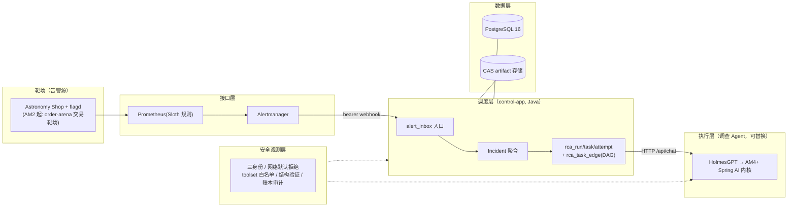

# 告警 Agent 架构设计 v2（架构基线）

> 2026-09-04 建立；2026-09-04 v2：纳入两批外部架构调研（控制面/多 Agent/审批/安全/观测/数据/线程池/E2E 契约 + HolmesGPT 逐块替换策略），全部经一手核查后适配性采纳（核查结论见 §12 与证据清单 E-13）。
> 本文档是**告警 Agent 项目的架构基线**（定位、冻结决策、组件锚点、演进阶梯）。
> 旧 PR Code Review Agent 文档体系已归档 `docs/archive/pr-agent-line-20260904.tar.gz`。
> 配套：进度 `docs/告警-PROGRESS.md`、证据 `docs/告警-OSS-证据清单.md`、缺陷 `docs/告警-BUGLOG.md`、方案 `docs/告警AMx-技术方案.md`。

---

## 1. 项目定位

**交易域告警 RCA Agent**：真实故障注入产生告警（靶场），经开源告警链路聚合，由 Agent 完成根因分析并产出结构化报告；故障 ground truth 已知，RCA 准确率可量化评测。

工程基因：

- **harness 优先**：LLM 只提建议，决策权在确定性组件；入口层严禁 LLM 参与认证/去重/关联
- 单人维护、单实例、PostgreSQL 全家桶（PG 即队列）；可靠性优先
- **抄机制、复用工具，不引入第二套工作流平台**；每条承重设计有 OSS 先例（证据清单）
- 无死代码；诚实清单文化（残余风险显式承认）

**控制面/调查面分野（v2 新增总纲）**：

```text
Java control-app：确定性调度、状态机、审批、权限、重试、DLQ、审计、报告发布
HolmesGPT（及未来替换物）：只负责观测数据调查和生成结构化候选结论
多 Agent：表现为持久化任务 DAG，不是多个 Agent 自由聊天
真正必须自研的只有：计划编译、证据裁决、报告组装、少量适配器（约占控制面 10%~20%）
```

## 2. 五层架构



## 3. 冻结决策（AA 系列；变更需评审 + 留痕）

### 3.1 AM0~AM1 既有（v1 保留）

| 编号 | 决策 | 依据 |
|---|---|---|
| AA-1 | 开源拼装优先，不闭门造车 | 用户裁定 |
| AA-2 | LLM 只提建议，决策权在确定性组件 | 调研定案 |
| AA-3 | 入口整组原子落库；401/400·413/503 仅 DB 故障/202 四义；背压在投影期逐条 DEFERRED | AM webhook.go 实测（E-12） |
| AA-4 | 双身份双哈希（fingerprint/incident_key 不含 severity；payload_hash/investigation_hash） | AM1 G1 评审 |
| AA-5 | rca_run → rca_task → rca_attempt 三级；同一 Incident 最多一个活跃 run | AM1 G1 评审 #1 |
| AA-6 | SLA 晋升排序（deadline_at），禁魔法分数；重试从 ready_since 起算 | AM1 G1 评审 #7 |
| AA-7 | scheduler_slot 租约槽位表，slot+task 同短事务，崩溃随租约回收；禁计数器 | AM1 G1 评审 #6 |
| AA-8 | 一切外部调用有账本（external_invocation_ledger 四态，悬挂可回收 UNKNOWN） | V5 形态 + 评审 |
| AA-9 | 报告验证两段分离：结构验证（AM1）/语义验证（AM4） | AM1 G1 评审 |
| AA-10 | 密钥永不落盘/落库/落日志，仅 env 注入 | 旧线纪律 |
| AA-11 | 公网端口零裸暴露；compose hardening 模板 | 195 现状 |
| AA-12 | Holmes 边界：toolset 白名单仅 Prometheus 只读、admin 端点网络封死、pin 版本+digest | http-api.md（E-12） |
| AA-13 | 仓库无死代码（AM1-T00 清除） | 用户裁定 |

### 3.2 v2 新增（多 Agent / 裁决 / 审批 / 安全 / 观测 / 数据 / 交付）

| 编号 | 决策 | 依据 |
|---|---|---|
| AA-14 | **HolmesGPT 是调查引擎，永不为控制面**；控制面（调度/状态/审批/权限/审计/发布）只在 Java control-app | 外部调研 v1 总纲，主会话采纳 |
| AA-15 | **多 Agent = 持久化任务 DAG**：`rca_task_edge(from_task_id, to_task_id, dependency_type)`；LLM Planner 只能从注册表选任务类型，控制面编译校验（schema 版本/任务数 ≤8/深度 ≤3/无环/输入引用本 run artifact/活跃验证任务 ≤1），单事务落 tasks+edges | Argo/Conductor/DBOS 机制（E-5）+ 外部调研 |
| AA-16 | **四契约版本化**：`AgentResult` / `Claim` / `EvidencePackage` / `ReportPackage`，均带 schema_version；报告状态链 DRAFT→STRUCTURE_VALIDATED→EVIDENCE_VALIDATED→PUBLISHED（失败分支 REJECTED/NEEDS_REVIEW/SUPERSEDED） | Holmes response_format（E-12）+ networknt validator + in-toto（E-13） |
| AA-17 | **冲突裁决确定性**：Claim 抄 K8s Condition（TRUE/FALSE/UNKNOWN + reason + observedGeneration）；按 claim 类型的权威数据源规则裁决（配置态→配置库 / 请求级→Trace / 聚合异常→Prometheus）；双源佐证优先；禁 LLM confidence 当真值；裁决不了最多派生一次 VERIFY_CLAIM，仍冲突则 UNKNOWN + NEEDS_REVIEW | K8s Conditions + LangGraph reducer 思想（E-13） |
| AA-18 | **动作风险四级**：R0 只读查询自动 / R1 大范围只读限流自动 / R2 synthetic 流量非生产可策略 / R3 chaos·变更一律人工审批（生产默认禁）；**Holmes 永远只持 R0/R1 工具** | 外部调研 + PolicyEngine 语义沿用 |
| AA-19 | **审批绑定具体动作**：action_digest=sha256(tool+canonicalArgs+scope) + policy_version + observed_generation + expires_at；执行前重算校验 + CAS（APPROVED→DISPATCHED）；"人批准的是这一条命令，不是无限授权票" | 旧线 repair_request 母本（V4）+ LangGraph interrupt 语义（E-13） |
| AA-20 | **六套生命周期一次定死**：Incident(FIRING/RESOLVED)；RcaRun(QUEUED/RUNNING/WAITING_APPROVAL/REPORTING/SUCCEEDED/PARTIAL/FAILED/CANCELLED/EXPIRED)；RcaTask(BLOCKED/READY/LEASED/RUNNING/WAITING_APPROVAL/SUCCEEDED/SKIPPED/FAILED_RETRYABLE/FAILED_TERMINAL/DEAD/CANCELLED/STALE)；RcaAttempt(同旧)；Approval(PENDING/APPROVED/REJECTED/EXPIRED/DISPATCHED/CANCELLED)；Report（见 AA-16） | Conductor 状态分类（E-13） |
| AA-21 | **幂等与 DLQ**：任务幂等键 sha256(run\|task_type\|input_digest\|observed_generation) 唯一约束；重试只产新 attempt 不重建 task；退避写 available_at 不 sleep 占槽；DLQ = PG 表/视图（DEAD 任务），replay 生成新 generation 且入审计 | DBOS dedup + Conductor retry（E-5/E-13） |
| AA-22 | **安全三身份 + 网络默认拒绝**（docker 现实落地）：AM→control（bearer，仅入口）/ control→Holmes（独立 HOLMES_API_KEY）/ action-runner（未来）独立凭证；docker network 分段=仅允许 control→PG·Holmes·collector、Holmes→Prometheus·百炼，admin 端点不暴露；**K8s RBAC/PSS/Kyverno/Helm 为未来迁移项，当前不建**（环境无 K8s，E-13 核查） | K8s RBAC 实践适配（E-13） |
| AA-23 | **观测纪律**：OTel Java agent 自动采集 + 领域手工 span（alert.receive/alert.project/rca.run/rca.task/agent.invoke/tool.execute/approval.wait/claim.reduce/report.*）；审计（不采样/防篡改/长期）与遥测（可采样）分离；**ID 类字段禁入 Prometheus label**（高基数红线）；线程池 queued/active/duration/queue-wait 全监控 | OTel/Prometheus 官方实践（E-13） |
| AA-24 | **数据三层**：PG=状态/任务/审批/审计元数据；jsonb=版本化契约载荷（不保序——审计原文必须另存 raw bytes 或 CAS digest）；CAS=大证据/原始响应/截图（LocalCasArtifactStore 保留件）；小体量不分区；多副本时 CAS 必须切 MinIO/S3 | PG 官方文档（E-13） |
| AA-25 | **线程与连接池预算表**（§10）为交付强制项——v1.x 方案曾只写"虚拟线程"无数值，属文档回归，不许再犯 | 外部调研 + AM1 G1 评审 |
| AA-26 | **E2E 证据契约**（§11）：截图不是权威证据，必须配原始 JSON/DB 快照/日志/trace/报告/manifest/全文件 SHA-256/场景与版本标识；功能未在真栈跑通前禁止生成截图（假证据红线） | 外部调研 + 旧线证据纪律 |

## 4. 组件锚点（AM0 实测后）

| 组件 | 形态 | 锚点 |
|---|---|---|
| Astronomy Shop + flagd | docker compose core（195 运行中） | ghcr（crane 摆渡，BA-01） |
| Prometheus + Alertmanager | docker.io 官方镜像 | Sloth v0.16.0 本地生成规则 scp |
| HolmesGPT | 自建镜像（python:3.12-slim + pip），pin 版本 | deepseek-v3 百炼专属端点（带 /v1，BA-02） |
| 告警中台 | **无**（双出局实测），聚合在 control-app | Keep 源码为设计母本（E-4） |
| control-app | Java 21 + Spring Boot 3.4.5 + Spring AI 1.0.0 + JdbcTemplate + Flyway | 本仓库 |
| PostgreSQL 16 | 195 存量实例 | 告警域 V7 起 |

**内核红线**：195 = CentOS 7 内核 3.10，eBPF 依赖组件不可用（Coroot 出局 E-9）。
**网络红线**：GAR 不可达；ghcr 大镜像走 crane 摆渡。
**环境边界（v2 核查新增）**：**无 K8s**——kagent/K8sGPT/Kyverno/RBAC/Helm 均为"未来若迁 K8s"的储备知识，当前一律不建（E-13）。

## 5. 演进阶梯

| 里程碑 | 内容 | 状态 |
|---|---|---|
| AM0 | 平台拼装 | ✅ 2026-09-03 Go |
| AM1 | 告警控制面（T00 清除 + 入口/聚合/调度/RCA 编排 + 账本 + 结构验证） | 修复回流中（双轴审查 8 条硬问题） |
| AM2 | 交易靶场 order-arena + 3 类业务故障 + ground truth | 方案 v2.0 草稿 |
| AM3 | 确定性评测 + notify-app 出口 + LiteLLM proxy 收口 | 方案 v2.0 草稿 |
| AM4+ | 多 Agent DAG 启用（PLAN→并行调查→REDUCE→VERIFY→ASSEMBLE→VALIDATE→PUBLISH）、语义 Verifier、审批体系、Holmes 逐块替换（§12） | 架构已冻结（v2），方案待写 |

## 6. 多 Agent 执行链与契约（AM4 冻结设计，AM1 结构预留）

固定执行链（注册表制，Planner 不可自由创造）：

```text
PLAN
→ 并行: METRICS_INVESTIGATE / LOGS_INVESTIGATE / TRACES_INVESTIGATE / CHANGE_CONTEXT
→ REDUCE_CLAIMS
→ (有冲突最多一次) VERIFY_CLAIM
→ ASSEMBLE_REPORT → VALIDATE_REPORT → PUBLISH_REPORT
```

任务领取条件：`state=BLOCKED 且全部 REQUIRED 前置成功 且 OPTIONAL 前置已终止 → READY`。

四契约（版本化，AM1 落 schema_version 字段）：

- `AgentResult`：schema_version/task_id/observed_generation/claims[]/warnings[]/proposed_actions[]
- `Claim`：claim_key/status(TRUE|FALSE|UNKNOWN)/reason/scope/time_range/confidence(仅排序用)/evidence_refs[]
- `EvidencePackage`：execution/scope/coverage/observations/claims/outcome 六段
- `ReportPackage`：DRAFT→STRUCTURE_VALIDATED→EVIDENCE_VALIDATED→PUBLISHED 状态链

报告三层生成链：Agent 输出统一 AgentResult → `ReportAssembler` 确定性组装（schema 校验/generation 新鲜度/artifact digest 校验/claim 去重冲突归并/evidence manifest/判 SUCCEEDED|PARTIAL|NEEDS_REVIEW）→ Reporter 只能基于冻结 claims 写文字，**不得新增证据或改变裁决**。

## 7. 冲突裁决与主动验证/审批

裁决流程（确定性，AA-17）：schema 校验 → 丢过期 generation → 丢 digest 不匹配 → 丢时间窗不相交 → 按 claim_key+scope+time_range 分组 → 全一致=CORROBORATED / 有权威规则按规则 / 一方双源佐证优先 / 仍冲突且预算允许 → 派生一次 VERIFY_CLAIM → 终局 UNKNOWN+NEEDS_REVIEW。

审批（AM4 实现，AM1 无写动作）：审批记录绑定 action_digest/tool/canonical_args/target_scope/policy_version/observed_generation/requested_by_agent/approved_by/expires_at；执行前重算校验 + CAS 状态推进。审批服务本身不持执行权限；action-runner 是唯一持写权限的执行者（未来 K8s 场景用独立 ServiceAccount namespace 级 RoleBinding，禁 wildcard——迁移项）。

## 8. 安全权限（docker 现实 + K8s 迁移项）

当前（docker-compose）：
- 三身份（AA-22）+ docker network 分段默认拒绝 + compose hardening（non-root/read_only/cap_drop ALL/no-new-privileges——内核 3.10 全部可用，E-14 核查）
- **"穷人版 Kyverno"两道门**（E-14）：静态门 = conftest 对 `docker compose config` 渲染物做 Rego 策略检查（禁 privileged、必须 read_only、禁公网端口绑定等 5~8 条起步，进 CI/部署前检查）；运行时门 = docker-bench-security（CIS Docker Benchmark，源码构建一次性容器出 JSON，结果解析进 DP 部署门断言——需 host 权限，只在 CI/部署环节跑）
- docker secrets 为 swarm 专属，compose 用 `secrets: file:` 退化替代（不加密，配合 600 权限与目录挂载纪律）；gVisor 内核 3.10 不可用（官方要求 5.6+，E-14）；userns-remap 在 RHEL7 裁剪严重不采用
- Holmes admin 端点不暴露（官方无鉴权现状，E-12）
- 告警 labels/annotations/日志按不可信内容处理；raw 入库前脱敏；告警内容进 IM 只发摘要（AM3）

未来迁移 K8s 时启用（储备，当前不建）：namespace 级 RoleBinding、禁 ServiceAccount token 自动挂载、Restricted PSS（Kyverno 部署门）、NetworkPolicy 默认拒绝、Helm Chart（values.schema.json/existingSecret/probes 分离/preStop 先停 claim/PDB 条件生成）+ helm-unittest/chart-testing/Chainsaw 测试链。

## 9. 可观测与审计

三类事实分别记录：`execution_event`（状态推进）/ `external_invocation_ledger`（外调）/ CAS artifact（原文+digest）。审计不采样、防篡改；遥测可采样。指标清单（AA-23）：`alert_inbox_total{state}`、`rca_tasks_total{type,state}`、`rca_task_wait_seconds`、`rca_dead_tasks`、`rca_lease_recoveries_total`、`rca_slots{scope,state}`、`rca_approval_wait_seconds`、`rca_conflicts_total{resolution}`、`rca_report_validation_total{result}`、`external_invocations_total{provider,outcome}` 等。GenAI span 规范仍 Development——内部包常量适配层，业务代码不直接依赖不稳定字段。

## 10. 线程与连接池预算（AA-25，AM1 起强制执行）

| 执行资源 | 默认值 | 理由 |
|---|---:|---|
| Tomcat request threads | 16 | webhook 只验签/限长/写 inbox |
| webhook 入口 bulkhead | 4 | 防洪峰耗尽 DB 连接 |
| inbox projector | 1 长驻虚拟线程 | DB 密集、顺序简单 |
| RCA dispatcher | 1 长驻虚拟线程 | 只 claim 不外调 |
| Agent 执行 | 每任务一个虚拟线程 | 外部 HTTP 阻塞型，便宜且易取消 |
| Holmes 全局 slot | 2（scheduler_slot scope=rca-holmes） | 保护模型额度/内存/心跳 |
| action slot | 1（未来） | 主动故障不并发扩大 |
| heartbeat | 每活跃任务一个虚拟线程，上限=slot | 心跳阻塞不互相影响 |
| HTTP client | 单例共享 | 禁每次新建 |
| Hikari max pool | 12 | 4 入口 + 2 执行收尾 + 2 心跳 + 2 投影恢复 + 2 余量 |

配置不变量：`heartbeatInterval ≤ leaseTTL/3`；`leaseTTL ≥ externalRequestTimeout + 2×heartbeatInterval`；`Holmes slot ≤ Hikari 余量`；**外部调用期间不持有 DB 事务/连接**（AFT-30 同源）。未来不同执行面用不同 `scheduler_slot.scope`（Conductor isolation group 思想，E-5）。

## 11. E2E 证据契约（AA-26）

四组真栈场景：① 正常故障闭环（flagd→…→report→resolved）② 崩溃恢复（Holmes 调用中 SIGKILL control-app → 双回收 → UNKNOWN 账本 → 新 attempt → 唯一最终报告）③ 洪峰（100 alerts/min × 5min → 入口零 5xx → deferred 可追溯 → backlog 清空）④ 审批（提出→PENDING→digest 绑定→执行→验证→清理；拒绝/过期/旧 generation 三反例不得执行，AM4 起）。

每组证据包：`evidence-manifest.json`（scenario/run_id/generation/起止时间/git SHA/镜像 digest）+ 原始 AM JSON + DB 快照 + 日志/Trace ID + 报告 JSON + 全部文件 SHA-256 + （可选）截图。**截图仅为辅助，不是权威证据；未真栈跑通禁止生成**。

## 12. HolmesGPT 逐块替换策略（AM4+ roadmap，经版本核查修正）

**总纲**：不找另一个项目整体替换，而是逐块替换；迁移期 Holmes 与 Native 引擎共用同一套工具/权限/审计/证据格式，删 Holmes 时工具不动。

| Holmes 能力 | 替换物 | 状态/注意 |
|---|---|---|
| LLM 适配 + tool-call 循环 | **Spring AI**（ToolCallingAdvisor 体系） | **版本核查修正**：ToolCallingAdvisor 自动注册全链路循环是 Spring AI 2.0（绑 Boot 4）；**1.1 起可用且兼容 Boot 3.4**——本项目 Boot 3.4.5，AM4 先评 1.1，2.0 绑定 Boot 4 升级届时裁定（E-13） |
| 结构化输出 | Spring AI StructuredOutputValidation（格式修正层）+ 自研证据引用校验（裁决层） | 两层不混 |
| Toolset 外移 | **AM4 前基线 = Holmes 自带 `prometheus/metrics` + `docker/core` toolset（只读已核实，零新增内存）**；需标准 MCP 时上 `prometheus/prometheus-mcp`（已迁入 Prometheus 官方组织、ghcr 可拉、20~50MB、删除类工具默认禁用但 quit/reload 需白名单裁剪）+ 自研 DomainProbe 只读 API | E-14 核查；kagent 的 K8s 工具不适用（docker 靶场无 K8s） |
| LLM/MCP 网关 | agentgateway（standalone docker 形态存在） | **快速演进期**（2026 持续 breaking change + 安全修复）：pin digest、不追 latest；**CEL 授权空规则=全放行**（默认非 deny，配置必测，E-13）；可选非必须 |
| 确定性预诊断 | **扩展 AM2 自研 DomainProbe**（docker inspect：OOMKilled/RestartCount/挂载/端口 + docker events 生命周期流，零常驻成本）；cAdvisor（50~100MB）仅在需要历史资源曲线时可选 | E-14：docker 生态无 K8sGPT 等价物，是空白不是选型问题 |
| RCA 策略 | RunLore 机制：change-first、UNRESOLVED 是正式结果、对抗验证只能降置信度、Git PR 知识循环 | 抄机制不引入（pre-1.0） |
| 上下文预算 | 自研 ContextBudgetManager（无等价开源件）：服务端过滤→去重→保头尾+错误行→统计→原文进 CAS→LLM 只看摘要+digest | 禁用 substring 截断 |
| 回归评测 | Langfuse Dataset（可选，AM3 评测体系对齐） | 评估期再定 |

**切换顺序**（反向：先工具后引擎）：① 统一入口/工具/结果模型 → ② 积累 Holmes 调查 transcript → ③ Spring AI Shadow Engine 同工具同证据同模型别名同 schema 并行 → ④ 达标切流（未授权调用为零/schema 合法率 100%/无证据 claim 比例不高于基线/Top-3 命中率不低于基线/UNRESOLVED 合理使用/延迟成本可接受/崩溃恢复审批超时全过）。

**AM3 评测体系是替换的对照组基座**——silence_penalty 等维度即为此设计。

## 13. 工作流与文档规范

（沿用 v1 §6：六道工序双门禁、调研先行五步、进度即时入账、BUGLOG 当场记、生产纪律、命名规范。测试交接三文档 = `告警-测试进度.md`/`告警-测试记录.md`/`告警-BUGLOG.md`。）

## 14. 多 Agent 全案（调研附件定案 → 本项目适配对照）

> 来源：两份调度层/混沌工程调研附件（Keep/HolmesGPT/Robusta 源码核查 + 入口层/执行层定案）。本节回答"原调研的完整多 Agent 方案是什么、我们每层怎么落、哪些组件被什么替代"。

### 14.1 分层定案对照

| 层 | 原调研定案 | 本项目落地 | 差异理由 |
|---|---|---|---|
| 入口层 | Alertmanager → APISIX（认证/Schema/限流）→ Keep（Alert→Incident 关联）→ Argo Events+JetStream（可靠投递） | AM → control-app 直收：验签+限长自实现；Incident 聚合自实现（Keep 双哈希母本）；可靠投递 = PG alert_inbox 表 | APISIX/Keep/Argo Events 不引入——体量过重 + Keep 镜像 GAR 不可达 + PG 队列同范式已在 |
| 调度层 | 自研薄调度层（PG 任务表 + SKIP LOCKED + 租约 + 优先级） | 完全采纳（rca_task + scheduler_slot，AA-5/6/7） | 无差异，即本仓 WorkItemWorker 形态 |
| 执行层 | Dapr Workflow 确定性编排 + 受限 HolmesGPT 子 Agent + OPA 审批 + Verifier 三段式 | PG 任务 DAG 编排（AA-15）；HolmesGPT 受限使用（AA-12/18）；审批自实现（AA-19，repair_request 母本）；Verifier 三段式保留（结构验证 AM1 已做 / Critic 语义验证 AM4 / 策略门 AA-18） | Dapr/OPA 不引入——第二套工作流平台红线；机制移植到现有代码 |
| 证据契约 | EvidencePackage 六段式 | 采纳（AA-16），铁律原文固化：**Agent 可提 Claim，不可造 Observation，不可自升等级，不可隐瞒未查数据源** | 无差异 |
| 报告层 | 原调研中断未完成（usage limit） | 本项目自补：§6 三层生成链（AgentResult → ReportAssembler 确定性组装 → Reporter 只写文字） | 原调研缺口，自研补齐 |

### 14.2 角色编排：Supervisor 是状态机，不是 LLM

原调研"一个 Incident 一个 Supervisor"在本项目落地为：**Supervisor 角色由 `RcaRunOrchestrator`（确定性 Java 代码）承担**——计划编译、依赖归约、冲突裁决、报告组装全部在控制面；子 Agent = `rca_task.agent_profile`（AM4 启用 METRICS/LOGS/TRACES/CHANGE_CONTEXT 四个 profile，**可同模型不同 prompt + 不同工具白名单**）。LLM Planner 只能从注册表选任务类型（AA-15），"是否有进展"用确定性计算（预算/新证据增量/迭代计数），不让 LLM 自评。

### 14.3 HolmesGPT 借鉴地图（怎么用 / 抄什么 / 换什么）

**A. 直接用（不改）**：HTTP server `/api/chat` + `response_format` strict JSON Schema；自带 `prometheus/metrics`、`docker/core` 只读 toolset；`HOLMES_API_KEY` 鉴权；`ENABLED_PROMPTS`/`behavior_controls` 裁剪 prompt 降 token；SSE `metadata.usage` 进账本。

**B. 抄机制进 Java 控制面**（源码已核查，E-3）：
- 空闲槽原子 claim（`claim_n_pending_conversations`）→ 我们的 scheduler_slot 领取
- 双池隔离（对话池 5 / 工具池 10）→ scheduler_slot scope 分池（AA-25 线程池表）
- `request_sequence` 防旧 worker 回写 → 我们的 epoch 栅栏（已有同构）
- 上下文预算（单工具结果占上下文比例上限 + 截断元数据）→ 自研 `ContextBudgetManager`（AM4，禁用 substring 截断）
- prompt 分段与 `ENABLED_PROMPTS` 思想 → 我们的 prompt 版本化与契约管理
- 详细工具错误反馈让模型自纠 → 工具执行器错误语义设计

**C. 逐块替换（AM4+，§12 roadmap）**：内核（Spring AI advisor 体系，版本见 E-13）→ 工具层（prometheus-mcp/DomainProbe API）→ 策略层（RunLore 机制：change-first/UNRESOLVED/对抗验证只能降置信度）→ 评测基座（AM3 确定性评测即对照组）。

**替换的量化正当性**（已知缺陷，E-3）：HolmesGPT 存在"URL 幻觉"与"数据源不可用但结论照常生成"的公开 issue；重启时在途任务标 timeout 无步骤恢复；无优先级。AM3 的 silence_penalty 维度直接量化第二类缺陷。

### 14.4 修订记录

| 日期 | 版本 | 变更 |
|---|---|---|
| 2026-09-04 | v1 | 初版（AA-1~13 + 组件锚点 + AM 阶梯） |
| 2026-09-04 | v2 | 纳入两批外部架构调研（先核查后采纳）：新增 AA-14~26（控制面/调查面分野、任务 DAG、四契约、确定性裁决、风险四级、审批绑定、六套生命周期、幂等 DLQ、三身份、观测纪律、数据三层、线程池预算、E2E 证据契约）；新增 §6~§12（执行链/裁决审批/安全/观测数据/线程池/E2E 契约/Holmes 逐块替换策略）。**核查修正**：① Spring AI ToolCallingAdvisor 版本（2.0 绑 Boot 4；1.1 兼容 Boot 3.4）② kagent/K8sGPT/Kyverno/Helm 属 K8s 环境，当前 docker 靶场不适用，降为迁移储备 ③ agentgateway CEL 空规则全放行风险标注。证据入 E-13 |
| 2026-09-04 | v2.1 | **无 K8s 替代调研落地**（`docs/告警-调研-无K8s替代-v1.md`，E-14）：§8 安全增补"穷人版 Kyverno"两道门（conftest 静态策略 + docker-bench-security 运行时断言）；gVisor 内核 3.10 不可用确认（官方要求 5.6+）；docker secrets 退化方案；§12 工具层基线修正（Holmes 自带只读 toolset 为 AM4 前基线，prometheus-mcp 官方组织版 + DomainProbe 只读 API 为可选扩展）；预诊断确认走自研 DomainProbe（docker inspect/events），docker 生态无 K8sGPT 等价物属空白。新增常驻内存 <150MB |
| 2026-09-04 | v2.2 | 用户指出多 Agent 全案与 HolmesGPT 借鉴地图未入档：新增 §14——分层定案对照表（入口/调度/执行/证据/报告五层，原调研选型 vs 本项目落地 + 差异理由）、Supervisor=状态机而非 LLM 的角色定案、HolmesGPT 借鉴地图（直接用/抄机制/逐块替换三分法 + 替换量化正当性） |
| 2026-09-04 | v2.3 | **架构定格声明（用户确认"架构基本定了"）**：① 自本版起停止新增设计文档——AM1 收口（G0）完成前，所有工作以代码与证据为中心，冻结决策必须能指到代码或测试，否则视为负债；② **`docs/告警Agent-增量实现任务拆解-v1.md` 为唯一执行任务表**（G0/M2~M6 编号），AM1/AM2/AM3 技术方案降格为"设计依据文档"（语义权威但任务编号以任务拆解为准）；③ 本文档（AA 系列）停止演化，目标增量演进走 `架构设计-告警Agent-v1.2.md`（FUT 系列）及其追溯矩阵；④ 未决残项如实登记：Holmes 无幂等键的崩溃重复调用（T08 探索）、AM3 全栈内存水位未实测、AM1 BA-09~13 开放中 |
