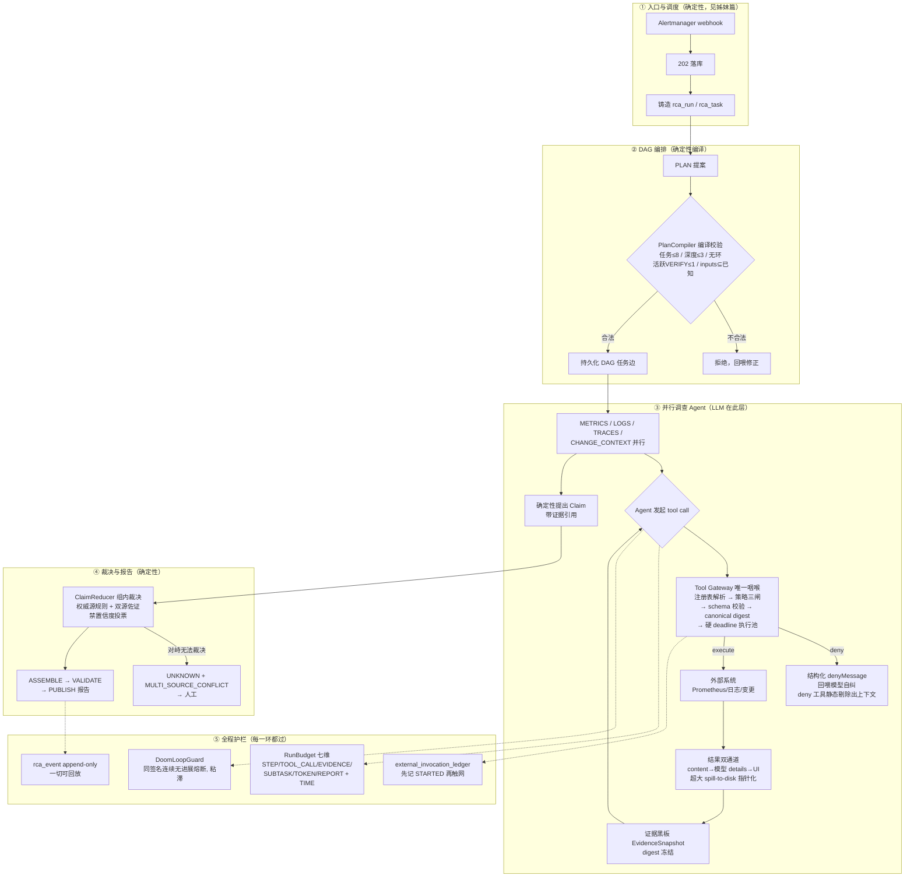

# 面试模块深挖：Agent 内核（Loop / Tool Gateway / Harness / Context / Multi-Agent）

> 适用面试题模块：#1 Agent Loop、#2 Tool Calling/Runtime、#3 Harness、#4/5 Context、
> #8 Memory、#9 Skills、#10 MCP、#11 RAG、#12 Multi-Agent、#25 项目深挖。
> 姊妹篇：《面试-模块深挖-异步任务调度引擎-v1.md》（调度/状态/幂等侧）。
> 代码锚点：`control-app/.../alert/application/tool/ToolGateway.java`、
> `alert/domain/budget/{RunBudget,DoomLoopGuard}.java`、`alert/domain/claim/ClaimReducer.java`、
> `application/{PlanCompiler,DeterministicSupervisor,ModelGateway}.java`、
> `application/agent/NativeRcaAgent.java`、`application/replay/ReplayToolGateway.java`。

---

## 0. 一句话定位

这不是"接了个 LLM 的告警系统"，而是**用确定性 Java 控制面包裹非确定性 LLM 的
生产级 Agent Harness**：LLM 只负责提建议和调只读工具，状态、预算、权限、裁决、
发布全部在确定性代码里。设计来源是对 13 个开源 harness（Claude Code、Codex、
Goose、Gemini CLI、OpenHands、Pi、dsh、Cline、Hermes、Aider、OpenCode、
OpenClaw、HolmesGPT）的源码级调研——抄了 45 条机制，拒了 13 类反模式。

---

## 1. 全景主线流程图

---

## 2. 演进链：从最小原子问题开始（Agent 侧口述剧本）

### 第 0 环：原子问题——告警来了，让 LLM 自己去查不就行了？

**最小方案**：接个现成的 agentic 引擎。HolmesGPT 当黑盒 Baseline：
告警进去，它自己多轮 function calling 查 Prometheus，出报告。
demo 一晚上就跑通了——**但只能停在 demo**。

**新问题**：黑盒三个"不知道"：不知道它做了什么（无审计）、
不知道花了多少钱（无预算）、不知道它为什么没结论/什么时候会停（无终止控制）。
告警风暴时它会把 LLM 配额烧穿，而你只能在账单上发现。

### 第 1 环：先治"不知道"——一切进账本，一切有预算

**解决**：
- `model_call_ledger` / `rca_tool_invocation` / `external_invocation_ledger`
  三本账：每次模型调用、每次工具调用、每次触网副作用全量落库。
- `RunBudget` 七维预算：STEP / TOOL_CALL / EVIDENCE / SUBTASK / TOKEN / REPORT
  六个计数维 + TIME 固定 deadline（`BudgetKind.java` 冻结，DB CHECK 同集）。
  越界抛 `BudgetExhaustedException` 且**不记账**（溢出安全）。
- 还有跨 Run 的 `IncidentBudgetLedger`：24h / 7d 双窗口滚动预算，
  新 Run 派生前先过 admission 预留判定——防"同一故障反复调查把钱烧光"。

**关键认知**：预算不是计费功能，是**终止条件**。Agent Loop 什么时候停？
答案之一是"任何一维预算耗尽即停"——确定性的，不靠 LLM 自觉。

### 第 2 环：LLM 会乱调工具——幻觉工具、脏参数、越权

**解决**：`ToolGateway` 唯一咽喉，所有工具调用强制过五道闸：
注册表解析（不在 `ToolRegistry` 的工具模型看不到）→ 策略三态
（ALLOW / REQUIRE_APPROVAL / DENY(reason)）→ JSON Schema 校验
（未声明字段硬拒绝 INVALID_ARGS）→ canonical digest → 硬 deadline 执行池。

两个面试能讲半小时的细节：
- **被 deny 的工具从模型上下文静态剔除**（不是调了才报错），
  同时返回结构化 denyMessage 回喂模型自纠——抄 Codex SafetyCheck + Gemini PolicyEngine。
- **权限分级 R0/R1 只读 / R2/R3 写动作**：当前线上只开放只读级；
  R2/R3 是 `VALIDATE_ONLY`——记录意图、零执行，等 AM5 审批面（OPA 作 PDP）就绪才放行。

**新问题**：工具结果怎么喂回去？——双通道：content 喂模型、details 给 UI；
超大结果 spill-to-disk 指针化（抄 Pi/HolmesGPT），模型只拿引用，
原始字节进 CAS（SHA-256 寻址）。

### 第 3 环：LLM 会死循环——同一个工具同一个参数调到天荒地老

**解决**：`DoomLoopGuard`——签名 = (taskId, tool, actionDigest)，
按**连续无进展**次数计数，达到阈值（配置化 + 版本化）即熔断该签名。
三个设计点直接抄 OpenCode 并加固：
1. **熔断粘滞**：不自动解除，需人工/新代际介入——防止"熔断-恢复-再熔断"振荡；
2. **轮询豁免集**：reconciler 轮询这类合法重复调用不计数；
3. 熔断后调用方**零 LLM/tool 调用**，直接产出确定性事件
   （reason code = DOOM_LOOP_TRIPPED）——死循环的终止也是确定性的。

> 命中面试题：Agent 出现死循环怎么检测。答案的关键是"检测器在 harness 里，
> 是代码不是提示词"。

### 第 4 环：LLM 的输出是"建议"，不是"事实"

**问题**：Agent 说"根因是数据库连接池耗尽"——这句话能直接发给值班同学吗？
两个 agent 结论打架听谁的？

**解决**：Claim 体系。LLM 只能**提出 Claim**（命题 + 证据引用），
裁决权在确定性的 `ClaimReducer`：
- 分组键五元组（claimKey + scope + timeRange + generation + snapshotDigest）——
  **不同时间窗/代际/快照的断言是不同事实，不得合并裁决**；
- 组内规则：全一致 → 胜出；冲突 → 权威源规则；无权威源 → 恰好一个状态
  ≥2 独立来源佐证才成立；TRUE/FALSE 各有双源 → **无法裁决，对峙即人工**；
- **禁止任何置信度投票**（代码注释原话："多数和高分不制造真相——Harness 评审定案"）；
- 输出按分组键字典序、同事实同 contentHash——裁决可复现，策略换版走 REVISED
  而非静默重写。

**这就是为什么不用"LLM 审 LLM"**：Cline 的模型自标、Goose 的 Smart Approval
都在源码级调研里被实锤为反模式——评审者与被评审者共享同一分布偏差。

### 第 5 环：上下文会爆炸——100 条日志就把窗口撑满

**解决**（Context Engineering 三板斧，公式直接搬 HolmesGPT）：
- **预算公式族**：单工具结果 ≤ min(上下文15%, 25k tokens)；
  `max_tokens = max(64k, 上下文12%)`；95% 触发压缩阈值；
- **双层压缩 + 双触发**，反应式压缩最多 2 次（抄 Goose）；
  剪枝先于摘要，"无进度不重试"（抄 dsh）；
- **不可信数据边界**：告警正文/日志/工具返回一律 UNTRUSTED_DATA 包裹——
  Context 工程同时是注入防线（OWASP AISVS 六道纵深的第一道）。

**为什么原始记录永不丢**：PG `rca_event` append-only 事件账本是唯一真相，
压缩后的上下文只是它的投影——**Summary 错了可以回滚重放**，
这直接回答了"摘要丢失关键信息怎么办"。

### 第 6 环：一个 Agent 的上下文装不下全域调查

**问题**：指标、日志、链路、变更四个域全塞一个 agent，上下文互相污染。

**解决**：多 Agent——但我们的定义可以直接背：
**"多 Agent = 受注册表约束的持久化 DAG，不是 Agent 间自由聊天"**。
- 固定链：PLAN → 并行 METRICS/LOGS/TRACES/CHANGE_CONTEXT → REDUCE_CLAIMS
  →（最多一次）VERIFY_CLAIM → ASSEMBLE → VALIDATE → PUBLISH；
- `PlanCompiler` **编译期**拒非法图：任务 ≤8、深度 ≤3、无环（全图复判）、
  活跃 VERIFY ≤1、task inputs ⊆ 本 run 已知——LLM 提的 PLAN 只是提案，
  能不能存在由编译器决定；
- `AgentProfile` 注册表：每个 agent 的 prompt 版本 / tool allowlist / 预算 /
  输出 schema，digest 锚定——**主 Agent 不是"选择"sub-agent，是只能实例化
  注册表里有的**；
- 冲突裁决回到第 4 环的 ClaimReducer——Agent 之间不通信、不协商，
  只往证据黑板上放 Claim，裁决是确定性函数。

**无限委派怎么防**：DAG 深度 ≤3 + 任务 ≤8 + VERIFY ≤1 三个编译期上界，
结构上不存在无限委派——这比"运行时检测到再拦"高一个段位。

### 第 7 环：引擎要升级，但不能拿生产告警做实验

**解决**：Shadow → Canary → Primary 三阶段 + 回放：
- `ReplayToolGateway`：固定快照回放，同 action digest 命中返回录制响应，
  未命中 REPLAY_MISS **绝不活执行**——活执行网关与回放网关的 canonical digest
  逐字段一致、两侧互认（UT 锚定）；
- `SnapshotShadowRouter`：新引擎在影子环境跑同样输入，输出比对；
- `CanaryRouter` + `CanaryBucketer`（murmur3 稳定分桶）+ 决策日志，
  全量审计可回放。

**评测收口**：因为故障是注入的、ground truth 已知，RCA 准确率做确定性六维评测
（含幻觉工具率 / Schema 合法率 / 参数时间窗命中率——这三个维度本身就证明
"LLM 乱调工具"是实测现象不是理论担忧）；Ground Truth 四分区
TUNING/VALIDATION/HOLDOUT/REDTEAM，RLS 让 HOLDOUT 对 Agent 身份恒不可读。

### 第 8 环：外部能力要不要接——MCP / RAG / Memory 的门控哲学

- **MCP**：prometheus-mcp 官方 server 已实测，但**不进主链**——裁定：
  只许 `--mcp.tools=core` 白名单（禁含 quit/reload/TSDB admin 的 all 模式）、
  命名空间 `mcp__server__tool` + per-server 白名单 + 输出预算 + env 消毒。
  拒绝裸接的实证：Pi 接 21 个 MCP 工具，13.7k token 常驻上下文。
  且 `ToolRisk` 明示：MCP annotations（readOnlyHint 等）不可信，风险评级自控。
- **RAG**：pgvector 只做"待验证历史假设"检索，结果永远 UNTRUSTED、
  **不得直接复用根因**、不得访问 HOLDOUT；可行性四门 G1~G4 未全过，
  门保持关闭（INV-AM5-9）。"向量相似度直接复用根因"被永久拒绝。
- **Memory**：CAS 存原始证据 + 受控历史检索；**拒绝 LLM 自主写持久记忆**——
  错误记忆一旦写入就是污染源，记忆污染问题在写入侧根治。

---

## 3. 为什么这么设计 / 去掉会怎样

### 设计哲学（一切"为什么"的总纲）

1. **Harness 优先**：LLM 只提建议，决策权在确定性代码。判断标准：
   "这个决定错了会不会出事故？"——会，就不许 LLM 做。
2. **未知是一等公民**：UNKNOWN 终态、REPLAY_MISS、对峙即人工——
   系统的诚实比聪明重要。
3. **一切可回放**：append-only 事件账本 + digest 锚定一切（快照/参数/策略版本），
   任何结论都能重放复现——这是 AI 系统的"可观测性"和"评测"的共同地基。

### 反向论证表

| 去掉的部分 | 直接后果 |
|---|---|
| Tool Gateway | 幻觉工具直达生产系统；脏参数打到 Prometheus；越权写动作无人拦 |
| RunBudget | 一次死循环 = 一张无上限账单；告警风暴 = 配额烧穿全员 429 |
| DoomLoopGuard | LLM 在同一签名上空转到 deadline，钱花了、结论没有、还不知道发生了什么 |
| ClaimReducer | 报告 = LLM 原话直出，幻觉根因直达值班电话；两个 agent 打架无人裁决 |
| PlanCompiler | LLM 提案的非法 DAG（环/超深/超宽）直接执行，无限委派失控 |
| 压缩与上下文预算 | 第 30 轮工具调用后上下文爆炸，前面的关键证据被截掉，根因结论建立在残缺事实上 |
| Shadow/Canary | 每次引擎升级都是生产赌博；回归只在用户投诉时发现 |
| UNTRUSTED 边界 | 一条恶意告警正文 = 一次 prompt injection，Agent 变成攻击载荷的执行器 |

---

## 4. 线上问题（真实 + 可预见）

**真实发生/实测过的：**

1. **幻觉工具与脏参数是实测现象**：六维评测里专门有幻觉工具率、Schema 合法率、
   参数时间窗命中率三个维度——它们存在，是因为 baseline 阶段真的抓到这些问题。
2. **429 预算风暴**：P1 spike 实测 LiteLLM 429 BudgetExceededError——
   没有虚拟 key 硬拦时，一次死循环可以把模型配额烧穿。
3. **黑盒不可运维**：HolmesGPT baseline 阶段最大的痛点就是"出报告了但无法回答
   为什么"——这是自研 Native 引擎（AM4）的直接动因。

**可预见的（面试主动讲）：**

1. **VERIFY 是人工瓶颈**：活跃 VERIFY ≤1 + 对峙即人工——告警高峰时人工核实
   会成为吞吐瓶颈，这是"安全换吞吐"的显式取舍，要能说清。
2. **压缩的信息漂移**：双层压缩 ≤2 次是经验值，超长调查的摘要质量依赖评测兜底，
   没有理论保证。
3. **DAG 固定链的僵化**：当前链路是编译期写死的，遇到"需要先查日志再决定查不查
   链路"的动态拓扑时表达力受限——二代引擎的候选演进方向。
4. **MCP/RAG 门还关着**：能力备料完成但未启用——面试被问"你们用 MCP 吗"的
   诚实答案是"实测过、治理方案定了、主动选择暂不接入"，比"用了"更有说服力。
5. **评估机 2C4G 资源紧张**：评测面（Shadow/Canary）和生产面抢资源的风险已知。

---

## 5. 面试背诵卡片（Agent 内核）

> Q 是面试官的问题，A 第一句是背诵句，后面是展开弹药。

**卡 1｜Q：Agent 和普通 Chatbot 的区别？**
A：Chatbot 是对话，Agent 是带工具的执行循环——我们系统的分水岭是：Agent 的每个动作
（工具调用、预算扣减、状态迁移）都要落确定性账本，能被回放和审计。
展开：没有账本的 Agent 只是会调工具的 Chatbot。

**卡 2｜Q：一次 Agent Loop 的基本流程？**
A：观测（读证据黑板）→ 决策（LLM 提 tool call 或 Claim）→ 执行（Tool Gateway 过闸）
→ 记账（账本+预算）→ 再观测，直到 DAG 终态或预算耗尽或熔断。
展开：终止条件外置——不由模型说"我查完了"就算完，护栏是确定性前置 Operation，
LLM 推理只是管线最后一步（Goose Operation 管线模式）。

**卡 3｜Q：Agent 死循环怎么检测？**
A：签名级熔断——(taskId, tool, actionDigest) 连续无进展达到阈值即熔断，粘滞不自动恢复。
展开：检测器是代码不是提示词；轮询类合法重复走豁免集；熔断后零 LLM 调用直接产
确定性事件；阈值配置化+版本化进审计。

**卡 4｜Q：一个 5 分钟任务突然跑 20 分钟，怎么定位？**
A：三本账分开记——model_call_ledger 看 LLM 耗时与 token 曲线、rca_tool_invocation
看工具耗时、run_budget_entry 看哪维预算在烧；先分 LLM 慢还是 Tool 慢。
展开：DoomLoopGuard 的无进展计数直接暴露空转；遥测 tail_sampling 慢请求全保。

**卡 5｜Q：如何限制 Token/Cost？**
A：三层——RunBudget 七维（超维即抛异常且不记账）、LiteLLM per-Run 虚拟 key
（TPM/RPM/max_budget 硬拦）、Incident 级 24h/7d 滚动窗口防同一故障反复烧钱。
展开：预算不是计费，是终止条件；实测 429 BudgetExceededError 证明硬拦生效。

**卡 6｜Q：Tool 不存在/参数错误怎么办？**
A：不存在 = 模型上下文里就没有（注册表静态剔除）；参数错 = schema 校验硬拒绝
INVALID_ARGS，未声明字段也不放行，错误结构化回喂模型自纠。
展开：评测有"幻觉工具率/Schema 合法率"维度，量化监控这类失败。

**卡 7｜Q：如何控制模型只调用允许的 Tool？**
A：双闸——上下文侧静态剔除（看不到即调不到）+ 执行侧策略三态
（ALLOW/REQUIRE_APPROVAL/DENY），deny 带 reason 回喂。
展开：抄 Codex SafetyCheck/Gemini PolicyEngine；R2/R3 写动作当前 VALIDATE_ONLY
记录意图零执行。

**卡 8｜Q：Tool Result 太长怎么办？**
A：双通道 + 指针化——content 喂模型、details 给 UI、超大 spill 到 CAS
（SHA-256 寻址），模型只拿引用。
展开：单工具结果 ≤ min(上下文15%, 25k tokens) 预算公式硬限。

**卡 9｜Q：1000 个 Tool 怎么避免全塞 Context？**
A：注册表 + 静态剔除是第一步（deny 的不进上下文）；MCP 侧实证过反面教材——
21 个工具裸接 = 13.7k token 常驻，所以接入必须 per-server 白名单 + 命名空间。
展开：AgentProfile 的 tool allowlist 让每个 sub-agent 只看自己域的工具。

**卡 10｜Q：Harness 和 Agent Framework 的区别？**
A：Framework 给你积木，Harness 是约束——我们的 harness 第一性原理是
"LLM 只提建议，决策全在确定性代码"。
展开：反模式清单：LLM 审 LLM（Cline 自标）、Smart Approval（Goose）、
YOLO 默认裸奔、hook fail-open——源码级实锤后逐条拒绝。

**卡 11｜Q：哪些逻辑交给模型，哪些必须确定性执行？**
A：判断标准是"错了会不会出事故"——会出事故的（权限/预算/状态/发布/裁决）全部确定性，
模型只做两件事：选只读工具、提 Claim。
展开：Claim 的裁决也是确定性的（ClaimReducer），模型连"自己说得对不对"都没权判。

**卡 12｜Q：多 Agent 之间出现冲突怎么办？**
A：不让它们协商——Claim 进黑板，确定性 Reducer 裁决：权威源规则 → 双源佐证 →
对峙即人工，禁止置信度投票。
展开：原话"多数和高分不制造真相"；不同时间窗/代际/快照的断言是不同事实不得合并。

**卡 13｜Q：无限委派/Sub-Agent 数量怎么限制？**
A：编译期上界不是运行时检测——PlanCompiler 拒非法图：任务≤8、深度≤3、无环、
活跃 VERIFY≤1。
展开：LLM 的 PLAN 只是提案，能不能存在由编译器决定。

**卡 14｜Q：Multi-Agent 真的比单 Agent 好吗？**
A：只在上下文隔离有意义时好——我们按域拆（指标/日志/链路/变更）是因为各域证据
互相污染上下文；代价是编排复杂度和 VERIFY 人工瓶颈。
展开：反面也答得出：DAG 固定链表达力受限，动态拓扑场景是已知短板。

**卡 15｜Q：Context 太长怎么办？**
A：公式硬限 + 双层压缩 + 投影可回滚——单工具 min(15%,25k)，95% 触发压缩，
反应式≤2 次；原始事件 append-only 永不丢，压缩上下文只是投影。
展开：剪枝先于摘要；"无进度不重试"；摘要错了重放账本即可恢复。

**卡 16｜Q：Tool Result 里的 Prompt Injection 怎么处理？**
A：一切外部内容（告警正文/日志/工具返回）UNTRUSTED_DATA 包裹进上下文，
是六道纵深防线的第一道。
展开：MCP annotations 也不信（readOnlyHint 官方明示不可信），风险评级自控。

**卡 17｜Q：MCP 你们怎么用的？**
A：诚实答案——实测过、治理方案定了、主动暂不接入。接入门槛：core 白名单 +
命名空间 + 输出预算 + env 消毒，且 MCP 提示不可信。
展开：拒裸接的实证（21 工具 13.7k token）；这体现的是"能力备料 vs 生产准入"的分层。

**卡 18｜Q：RAG 和 Memory 怎么设计的？**
A：历史知识只做"待验证假设"，永远 UNTRUSTED、不得直接复用根因、不得碰 HOLDOUT；
可行性四门没过就保持关闭。LLM 不许自主写持久记忆——记忆污染在写入侧根治。
展开：向量相似度直接复用根因被永久拒绝——旧结论必须被当次证据重新支撑。

**卡 19｜Q：Agent 如何做 Eval？**
A：因为故障是注入的、ground truth 已知——确定性六维评测（含幻觉工具率/
Schema 合法率/参数时间窗命中率），Shadow→Canary→Primary 灰度，
Ground Truth 四分区且 HOLDOUT 对 Agent 恒不可读（RLS 强制）。
展开：回放网关同 digest 命中返回录制响应、未命中 REPLAY_MISS 绝不活执行。

**卡 20｜Q：如果重构，Agent 侧你会改什么？**
A：三件事——DAG 固定链改条件拓扑（表达力）、VERIFY 人工瓶颈做半自动预审、
压缩策略从经验值转向评测驱动调参。
展开：主动说短板比背优点可信十倍。

---

## 6. 两张图的配合用法

- 本图（Agent 内核）回答"调查是怎么被 Agent 做出来的"；
- 姊妹篇调度图回答"任务是怎么被可靠地送到 Agent 手里的"。
面试时先画调度图（Java 后端基本盘），再画本图（Agent 差异化），
两图在 rca_task 上握手——这就是"传统后端深度 + Agent 系统广度"的完整叙事。
