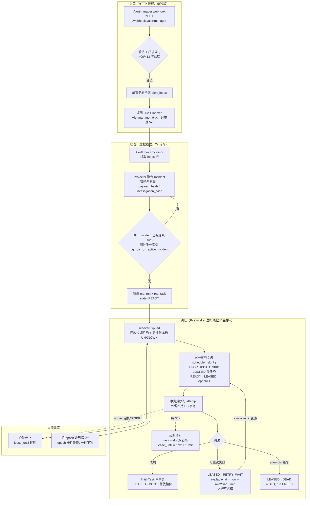

# 面试模块深挖：异步任务调度引擎（PG 持久队列 + 租约槽位 + epoch 栅栏）

> 适用面试题模块：#13 Async Task / Task Engine、#14 Scheduler / Distributed Worker、
> #15 Retry/Timeout/Idempotency、#20 PostgreSQL（队列用法）、#21 MQ（为什么不用）。
> 代码锚点：`control-app/.../alert/application/RcaWorker.java`、`RcaRunOrchestrator.java`、
> `infrastructure/persistence/PostgresRcaTaskRepository.java`、`PostgresSchedulerSlotRepository.java`、
> 迁移 `V7__am1_alert_domain.sql`（rca_task / scheduler_slot）。

---

## 0. 一句话定位

告警 RCA 系统的"发动机"：Alertmanager webhook 打进来的每一条告警调查请求，
由这个模块负责**接住、排队、分配、执行、重试、恢复、收尾**——
全程不依赖 Redis / MQ / Quartz / xxl-job，只用 PostgreSQL + 虚拟线程。

---

## 1. 主线流程图

---

## 2. 演进链：从最小原子问题开始，问题 → 解决 → 新问题

这是面试口述的主线剧本。每一环都是"上一个解法引入的下一个问题"。

### 第 0 环：原子问题——告警来了，调查要 5 分钟，HTTP 等不起

**问题**：Alertmanager webhook 是同步 HTTP。LLM 调查一次 3~8 分钟。
同步执行 = HTTP 线程被占满 + Alertmanager 判定超时重试 = 告警风暴时直接雪崩。

**解决**：异步化。验签后**单事务原子落库 `alert_inbox`，立刻返回 202 + inboxId**。
失败语义对齐 Alertmanager：400/413 零落库（它不重试 4xx），503 仅 DB 故障（它只重试 5xx）。

> 面试题命中：`POST /tasks` 为什么返回 202、为什么 Agent 任务不能占 HTTP 线程。

### 第 1 环：落库了，谁来做？

**问题**：202 之后活没人干。

**解决**：后台 worker 轮询表领任务。选型时砍掉了 Quartz/xxl-job/@Scheduled——
不是定时任务，是**常驻领取循环**：虚拟线程 + `SmartLifecycle` 随容器启停，2s 轮询。
虚拟线程的理由：任务是纯 I/O 密集（等 LLM、等 Prometheus），一任务一线程，
省掉线程池调参这门玄学。

### 第 2 环：两个 worker 抢到同一条任务

**问题**：轮询 → 并发领取 → 同一行被领两次 → 同一个告警调查两遍，LLM 费用翻倍。

**解决**：`SELECT ... FOR UPDATE SKIP LOCKED`——PG 行锁，拿到锁的领走，
拿不到的**跳过已锁行**看下一行，不阻塞。这是 PG 做队列的标准答案。

> 面试题命中：Worker 抢任务怎么设计、`select for update` 是否合适。

### 第 3 环：worker 执行一半宕机，任务永远是"执行中"

**问题**：行领走了、状态是 LEASED，然后进程被 SIGKILL。锁随连接断开释放了，
但状态没人改回来——任务**永久卡死**，这就是"幽灵任务"。

**解决**：租约（Lease）。领取时写 `lease_owner + lease_until = now + 10min`；
执行期间每 30s 心跳续租；worker 死了心跳就停，租约到期后
**Lease Reaper 把任务回收重新入队**。心跳与租约有两条不变量：

- `heartbeat ≤ leaseTTL / 3`（30s ≤ 10min/3，留足网络抖动余量）
- `leaseTTL ≥ externalTimeout + 2 × heartbeat`（租约必须比最长的外部调用活得久，
  否则任务还在正常等 LLM 响应就被误判死亡）

**实测**：E2E 真做过 SIGKILL control-app——租约回收、attempt+1 续跑、最终报告唯一。

> 面试题命中：Worker 挂掉任务怎么重新分配、Lease 是什么。

### 第 4 环：回收了，但旧 worker 其实没死——脑裂

**问题**：租约机制有个经典漏洞——worker 没死，只是 Full GC 停了 11 分钟。
租约被 Reaper 收走、新 worker 接着跑；旧 worker 醒过来，拿着旧租约继续提交。
**两个 worker 同时写同一个任务**，状态互相覆盖。

**解决**：epoch 栅栏（Fencing Token）。每次租约换手 `lease_epoch + 1`；
所有写操作带 epoch 条件：`requireCurrentLease(owner, epoch)`——
旧 epoch 的晚到提交直接被拒，一行不写。FinishOutcome 里有专门的 `LEASE_REJECTED` 分支。

> 面试题命中：Fencing Token 是什么。（这也是"为什么不用 Redis 锁"的理由之一：
> Redis 锁没有天然 fencing，锁过期被抢走就得自己再造一套。）

### 第 5 环：失败要重试，但不能立刻重试，也不能 sleep 占着坑

**问题**：LLM 调用 429 / 超时了要重试。立刻重试 = 打爆已经过载的下游；
`Thread.sleep` 等退避 = worker 槽位被睡觉占住，别的任务饿死。

**解决**：指数退避**写进 `available_at` 字段**——`min(2^(attempt-1), 5)` 分钟
（1/2/4/5/5…封顶），任务回 `RETRY_WAIT` 态，槽位立刻释放。
领取 SQL 只捞 `available_at <= now` 的行，退避中的任务物理上不可被领。
退避结束**不插队**：`ready_since` 刷新，公平排队，deadline 重算。

**新问题**：模型侧退避期间租约可能失效怎么办？——`sleepCancellable` 把等待切成
100ms 一片，每片检查中断 + 租约心跳（`BooleanSupplier leaseHeartbeat`），
退避 sleep 也占总 deadline 额度（G2 闸门）。

> 面试题命中：Retry 次数怎么设置、指数退避、如何避免 Retry Storm。

### 第 6 环：重试会带来重复——重复任务、重复副作用

**问题**：重试语义 = 同一件事可能执行多次。两种重复都要防：

1. **重复任务**：同一输入反复铸造 task。
2. **重复副作用**：外部调用（Holmes 调查、通知发送）执行了两次。

**解决**（三层幂等）：

- **任务级**：幂等键 `sha256(run | task_type | input_digest | observed_generation)`
  唯一约束。重试**只新建 attempt，不重建 task**。
- **事件级**：`rca_event` 上 `UNIQUE(run_id, event_id)`——同 event_id + 同 digest =
  幂等重放返回既有 seq；digest 不同 = 显式冲突报错。
- **副作用级**：`external_invocation_ledger` 四态账本——**先落 STARTED 再触网**
  （STARTED 写失败 = 零触网）；恢复时发现悬挂 STARTED，**诚实标 UNKNOWN，不猜结局**；
  UNKNOWN 的写动作先对账再决定是否重试。按错误类别决策：401/403 不重试，
  429 尊重 Retry-After 头。

**关键认知**（面试直接背）：幂等不是一个开关，是"能防的用唯一约束防死，
防不了的用账本把'不知道'变成一等公民"。UNKNOWN 是诚实终态，不是失败。

> 面试题命中：Tool 成功但 response 丢了怎么办、哪些能 retry、幂等 Key 怎么设计。

### 第 7 环：并发不能无限开——LLM 配额是有限的

**问题**：告警风暴一次进来 200 条，worker 全开 = 200 路并发打 LLM，
模型侧只有几十路配额 → 全员 429 → 全员退避 → Retry Storm。

**解决**：`scheduler_slot` 固定槽位表——**并发上限 = 表里的行数**（当前 RCA 域 2 行）。
占槽和领任务在**同一事务**里完成，槽占不到就不领任务。扩容 = 加迁移加行。

**为什么不用"running 计数器"**：计数器会泄漏——worker 宕机，计数没人减，
并发上限被幽灵占用慢慢归零。槽位行 + 租约天然带回收（第 3 环的机制复用）。

LLM 侧再叠两道：LiteLLM proxy per-Run 虚拟 key（TPM/RPM/预算硬拦，
实测 429 BudgetExceededError 生效）+ `ModelGateway` 配额域冷却
（`QuotaCooldownRegistry`）+ 熔断器（3 次失败 / 60s 冷却）。

> 面试题命中：最大 LLM 并发只有 500 怎么办、100 个 Tool 最大并发 3 怎么实现、
> Backpressure、Circuit Breaker 如何配合 Retry。

### 第 8 环：任务有轻重缓急，查询不能全表扫

**问题**：队列里混着 P0 告警和巡检任务；领取 SQL 在百万行历史任务上扫。

**解决**：调度列一次设计全——`priority / available_at / ready_since / deadline_at(SLA)`；
领取索引用**部分索引**：`ix_rca_task_claim ON (priority DESC, deadline_at, created_at)
WHERE state IN ('READY','RETRY_WAIT')`——索引只覆盖待领取子集，
终态行（占 99.9%）不进索引，索引永远极小。

同一个思路的另一半：**部分唯一索引** `uq_rca_run_active_incident`
强制"同一 Incident 最多一个活跃 Run"——告警风暴期间同一故障的 50 条告警
只调查一次，并发 23505 实测无重复。

> 面试题命中：FIFO/Priority Queue、深分页、联合索引、防任务饥饿（deadline 排序 + 退避不插队）。

### 第 9 环：用户要取消 / 运营要干预

**问题**：任务跑到一半，用户点了取消。直接杀线程？虚拟线程上挂着 HTTP 调用和 DB 连接。

**解决**：命令也是数据。`RunCommandController` 把取消/干预**先持久化到
`operator_command` 表（PERSISTED→202），worker 在安全点消费生效（APPLIED→200）**，
过期命令 409。执行线程侧用 `sleepCancellable` 切片睡眠 + 中断响应。
"先持久化再生效"保证了：命令不会丢、生效顺序可查、崩溃后命令还在。

> 面试题命中：用户取消任务怎么处理、Human-in-the-loop。

---

## 3. 为什么这么设计（设计哲学层）

三条第一性原理，回答一切"为什么"：

1. **单点真相**：状态、队列、账本、审计全在一个 PG 里。任何"第二个存储"
   （Redis/MQ）都会引入双真相一致性问题，而它带来的问题比解决的多。
2. **确定性兜底非确定性**：LLM 输出不可信，但调度、重试、恢复、幂等
   必须是确定性代码 + DB 约束双保险（Java 状态机 + CHECK 约束镜像）。
3. **一切失败都被演练过**：SIGKILL、23505 并发、429 风暴都是 E2E 实测场景，
   不是理论设计。

---

## 4. 去掉这个模块会怎样（反向论证）

| 去掉的部分 | 直接后果 |
|---|---|
| 异步落库 + 202 | Alertmanager 超时重试 → 告警风暴 × 重试风暴叠加，入口雪崩 |
| SKIP LOCKED | 同一告警被调查 N 次，LLM 费用 ×N，报告互相矛盾 |
| 租约 + Reaper | worker 任何一次宕机 = 一批任务永久卡死，需要人工修库 |
| epoch 栅栏 | GC 停顿/网络分区 → 双 worker 写同一任务，状态机被击穿 |
| available_at 退避 | 429 后立刻重试 → Retry Storm 打爆模型配额，费用事故 |
| 幂等键 + 账本 | 重试 = 重复调查 + 重复通知，用户收到 N 条告警结论 |
| scheduler_slot | 告警风暴 = 并发无上限 → 全员 429 → 全员退避，系统性死锁 |
| 部分唯一索引 | 同一故障的 50 条告警触发 50 次重复调查 |

一句话：**没有这个模块，"LLM 自动排障"只是一个 demo；有了它才是生产系统。**

---

## 5. 技术选型：为什么是这个，不是那个

| 选择 | 放弃 | 理由 |
|---|---|---|
| PG 表当队列 | Kafka/RabbitMQ | 双真相问题（MQ 状态 vs DB 状态一致性）；当前量级 SKIP LOCKED 足够；"消息丢失/重复消费"这类问题在"没有消息，只有行"的架构里不存在 |
| PG 行锁 + epoch | Redis 分布式锁 | 约束跟着数据走；无锁过期/误删/看门狗问题；Redis 锁没有天然 fencing token，脑裂要自己补 |
| 虚拟线程常驻循环 | Quartz / xxl-job / @Scheduled | 不是定时任务而是常驻领取；I/O 密集场景一任务一线程，免线程池调参；少一个调度中间件 |
| DB 槽位行数限流 | 线程池参数 / 信号量 | DB 强制，多实例部署也不可能超发；槽位带租约天然可回收（计数器会泄漏） |
| 编程式事务 TransactionOperations | @Transactional | 外部调用（LLM/HTTP）绝不挂 DB 长事务；事务边界显式可见 |
| UNKNOWN 诚实终态 | 自动重试/自动判失败 | 悬挂 STARTED 的真相是"不知道"，猜结局 = 可能重复副作用；先对账再决策 |

---

## 6. 在告警系统里的实现（代码地图）

| 机制 | 位置 |
|---|---|
| 202 入口 | `alert/interfaces/AlertWebhookController.java`（验签→落 inbox→202） |
| worker 主循环 | `alert/application/RcaWorker.java`（虚拟线程；recoverExpired→claim→事务外执行→心跳→finish） |
| 领取 SQL | `infrastructure/persistence/PostgresRcaTaskRepository.java:44`（FOR UPDATE SKIP LOCKED） |
| 槽位 | `PostgresSchedulerSlotRepository.java:30`；V7 迁移预置 `('rca',1),('rca',2)` |
| 收尾/重试/DEAD | `RcaRunOrchestrator.finishTask`；退避 `min(2^(attempt-1),5)min`（:432） |
| 状态机 | `alert/domain/statemachine/RcaTaskStateMachine.java`（READY→LEASED→DONE/RETRY_WAIT/DEAD/STALE）+ DB CHECK 镜像 |
| 参数 | `AlertFlowConfig.java:275-282`：租约 PT10M / 心跳 PT30S / 轮询 PT2S |
| 表结构 | `V7__am1_alert_domain.sql`：rca_task（调度列全）+ scheduler_slot |
| 同款复用 | `AlertInboxProcessor`、`NotifyOutboxClaimer`（notify-app）、`CompensationWorker`（order-arena 逆序补偿） |

---

## 7. 线上问题（真实发生 + 可预见）

**真实发生过的（都有测试记录/实证）：**

1. **SIGKILL 后悬挂账本**（`告警-测试记录.md` §3.2）：worker 被杀，Holmes 调用
   账本停在 STARTED——由此诞生了 UNKNOWN 诚实终态 + 对账后重试的设计。
2. **告警风暴重复调查**：并发 23505 压测实证部分唯一索引顶住"同一 Incident
   一个活跃 Run"，此前靠应用层判断是有竞态窗口的。
3. **模型配额打爆**：P1 spike 实测 LiteLLM 429 BudgetExceededError——
   验证了虚拟 key 预算硬拦 + 配额域冷却的必要性，不是过度设计。

**可预见的 / 已知的边界（面试主动讲 = 加分）：**

1. **PG 是 SPOF**：单实例 PG 挂了全系统停摆。当前接受（7.5G 内存老机器、
   告警量级），扩展路径是主从 + 槽位表天然支持多实例抢任务。
2. **2s 轮询的延迟地板**：告警到开查最坏 2s+。预留了 PG LISTEN/NOTIFY 做唤醒
   （只唤醒，真身走表），量级上来再开。
3. **SKIP LOCKED 的吞吐天花板**：超高频小任务（毫秒级、万 QPS）场景下行锁竞争
   会成为瓶颈——那时才轮到真正的 MQ 入场，但 RCA 任务是分钟级，远没到。
4. **租约时长与外部超时的耦合**：Holmes read-timeout 8min < 租约 10min，
   满足不变量 `leaseTTL ≥ externalTimeout + 2×heartbeat`；改任何一边都要重新校验
   另一条不变量，这是配置级的隐性依赖。
5. **退避任务的饿死风险**：priority 反转——大量低优先级任务退避结束同时到期，
   可能挤占高优先级。当前用 deadline_at 排序缓解，极端场景未压测。

---

## 8. 面试背诵卡片

> 用法：Q 是面试官的问题，A 的第一句是"背诵句"（脱口而出），后面是展开弹药。

**卡 1｜Q：POST /tasks 为什么返回 202？**
A：因为调查要 5 分钟，HTTP 等不起——验签后单事务原子落库立刻 202，失败语义对齐调用方重试策略。
展开：400/413 零落库（Alertmanager 不重试 4xx），503 仅 DB 故障（它只重试 5xx）。

**卡 2｜Q：Worker 怎么抢任务？**
A：PG 行锁 + SKIP LOCKED，拿到锁的领走、拿不到的跳行不阻塞。
展开：占槽 + 领任务同一事务；部分索引只索引 READY/RETRY_WAIT 子集。

**卡 3｜Q：Worker 宕机任务怎么办？**
A：租约 + 心跳 + Reaper——领取写 lease_until，30s 心跳续租，死了心跳停、租约到期被回收重跑。
展开：实测 SIGKILL → attempt+1 续跑 → 报告唯一；两条不变量 heartbeat ≤ leaseTTL/3、
leaseTTL ≥ externalTimeout + 2×heartbeat。

**卡 4｜Q：Lease 过期但 worker 其实没死呢？**
A：epoch 栅栏（fencing token）——租约换手 epoch+1，旧 epoch 的晚到提交被条件更新拒绝，一行不写。
展开：Full GC / 网络分区场景；FinishOutcome 有 LEASE_REJECTED 分支。

**卡 5｜Q：重试怎么设计？**
A：指数退避写字段不 sleep 占槽——available_at = now + min(2^(n-1), 5)min，退避期物理不可领取，槽位立刻释放。
展开：退避结束不插队（ready_since 刷新）；attempts 耗尽进 DEAD（= DLQ，任务表即死信表）。

**卡 6｜Q：哪些错误能重试？**
A：按类别——401/403 不重试，429 尊重 Retry-After，UNKNOWN 写动作先对账再定。
展开：UNKNOWN 是诚实终态不是失败；悬挂 STARTED 不猜结局。

**卡 7｜Q：Tool 执行成功但 response 丢了怎么办？**
A：账本先行——先落 STARTED 再触网，STARTED 写失败 = 零触网；恢复时发现悬挂 STARTED 标 UNKNOWN，对账后决定是否重试。
展开：这就是 exactly-once 做不到时的工程答案：把"不知道"变成一等公民。

**卡 8｜Q：幂等怎么保证？**
A：三层——任务幂等键唯一约束（重试只新建 attempt 不重建 task）、事件账本 UNIQUE(run_id, event_id) 幂等重放、副作用账本四态。
展开：并发败者捕获 DuplicateKeyException 后读胜者行结算，不报错。

**卡 9｜Q：LLM 并发只有几十路，告警风暴 200 条怎么办？**
A：并发上限 = scheduler_slot 表的行数——DB 强制，结构上不可能超发。
展开：不用计数器（宕机泄漏）；扩容 = 加迁移加行；LLM 侧再叠 LiteLLM 虚拟 key TPM/RPM 硬拦 + 配额冷却 + 熔断（3 次/60s）。

**卡 10｜Q：为什么不用 Redis 分布式锁？**
A：锁和租约用 PG 行锁 + epoch fencing 就够了——约束跟着数据走，没有锁过期、误删、看门狗问题，还多一个 fencing token。
展开：Redis 是第二个状态真相源，一致性问题比它解决的多；量级上来槽位表 + 行锁天然支持多实例。

**卡 11｜Q：为什么不用 MQ？**
A：outbox/inbox 全在 PG——"消息丢失/重复消费"这类问题在"没有消息，只有行"的架构里不存在。
展开：双真相问题；分钟级任务远没到 SKIP LOCKED 吞吐天花板，到了再换。

**卡 12｜Q：用户取消任务怎么处理？**
A：命令也是数据——先持久化到 operator_command（PERSISTED→202），worker 安全点消费生效（APPLIED→200），过期 409。
展开：执行线程 sleepCancellable 100ms 切片响应中断；先持久化再生效 = 命令不丢、顺序可查。

**卡 13｜Q：怎么防同一故障被调查 N 次？**
A：部分唯一索引 uq_rca_run_active_incident——DB 强制同一 Incident 最多一个活跃 Run，23505 并发实测无重复。
展开：双哈希分离——payload_hash 判重、investigation_hash 判"值不值得重查"。

**卡 14｜Q：任务表百万行了领取还快吗？**
A：部分索引只覆盖待领取子集——终态行 99.9% 不进索引，索引永远极小。
展开：事件表另走月 RANGE 分区 + 归档导出（V28/V29）；分页全游标式不用 OFFSET。

**卡 15｜Q：这个模块如果去掉会怎样？**
A：去掉它，LLM 自动排障只是 demo——同步入口雪崩、幽灵任务卡死、重复调查烧钱、429 风暴死锁，每拆掉一个机制都对应一种具体的线上事故。
展开：对应 §4 表格逐条背。
