# 告警系统 UI 调研：队列进度、处理报告、评测与 Token 展示

> 调研日期：2026-09-11。围绕 alert-web 的四个产品问题，调研当前主流告警/AIOps/LLM 可观测系统的展示方式。
> 所有截图保存在本目录 `screenshots/`，共 24 张（22 张官方来源 + 2 张 Grafana Play 实机截图）。

## 结论摘要（对应四个问题）

| # | 我们的问题 | 业界共识做法 | 参考系统 |
|---|-----------|-------------|---------|
| 1 | webhook 队列事件要展示进度（排队中/处理中/处理完） | 事件有显式**状态机**：列表用彩色状态徽章 + 状态筛选标签 + 等待/处理时长，处理中可看当前阶段 | Grafana（Normal→Pending→Firing）、PagerDuty（Triggered→Acknowledged→Resolved） |
| 2 | 处理完要有报告和总结 | 处理完成的事件点开有**AI 分析报告卡片**：根因结论、资源定位、证据、建议动作 | Robusta/HolmesGPT、BigPanda、incident.io |
| 3 | token、准确度等监控指标要进评测页 | 是的——LLM 系统把「可观测（token/延迟/错误率）」和「评测（准确度等评分）」放在**同一个 trace 中心**展示，评分直接挂在每次运行上，另有评分趋势分析页 | Langfuse、Datadog LLM Observability |
| 4 | 每个环节的 token + 任务总 token | **trace → span 两级模型**：每个环节（span）记 input/output token，运行（trace）自动汇总，再按任务/会话（session）和模型聚合 | Langfuse（span→trace→session）、Datadog（span→trace→看板） |

---

## 1. 队列进度展示（排队中 / 处理中 / 处理完）

### Grafana：状态机 + 状态徽章 + 筛选

Grafana 告警规则有明确状态机：**Normal → Pending → Firing**（文档：[Alert rule evaluation](https://grafana.com/docs/grafana/latest/alerting/fundamentals/alert-rule-evaluation/)）。规则列表页提供 Firing / Normal / Pending / Recovering 状态筛选，每条规则显示评估间隔（1m/5m/12h）和所属分组。

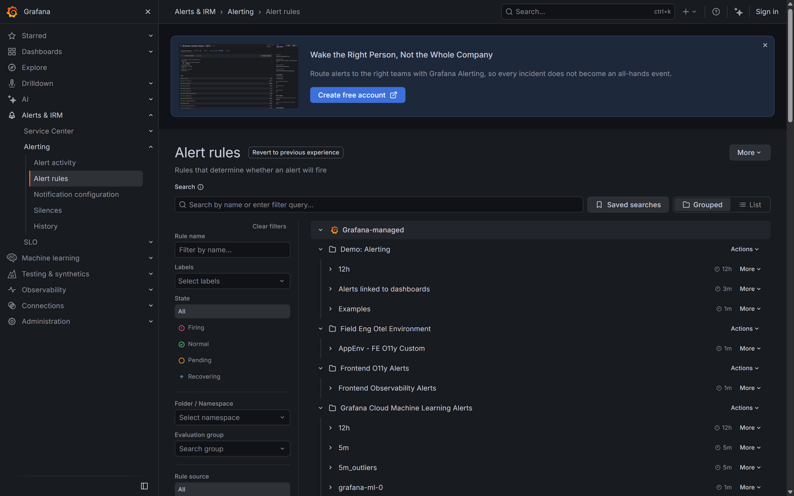
*实机截图：https://play.grafana.org/alerting/list — 状态筛选标签 + 评估间隔 + 分组。*

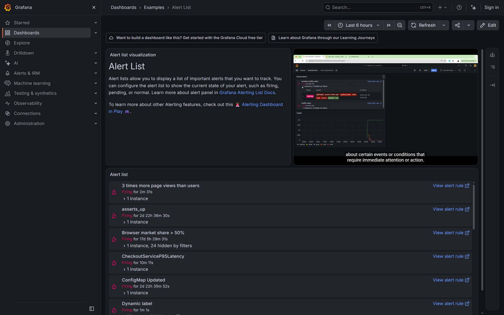
*实机截图：https://play.grafana.org/d/bdodlcyou483ke/ — 告警名称 + 标签（instance/datasource）+ 状态（红色火焰=Firing，绿色对勾=Normal）。*

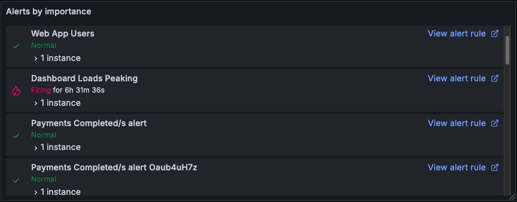
*官方文档：[Alert list](https://grafana.com/docs/grafana/latest/visualizations/panels-visualizations/visualizations/alert-list/) — 名称、实例数、状态、持续时长。*

### PagerDuty：事件队列 = 我们最直接的对照

PagerDuty 事件状态机：**Triggered → Acknowledged → Resolved**（文档：[Incidents](https://support.pagerduty.com/main/docs/incidents)）。事件列表页顶部有「我的/全部」待处理计数，按状态标签（Open/Triggered/Acknowledged/Resolved）筛选，列：状态、优先级、标题、创建时间、服务、负责人。

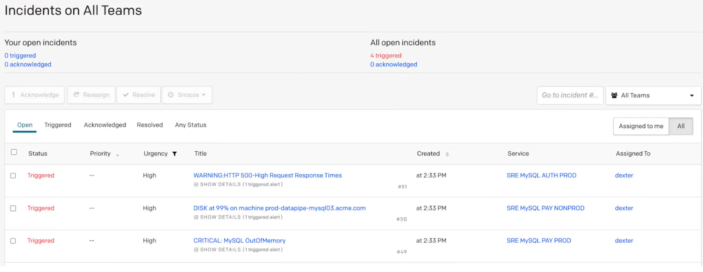
*官方文档：[Navigate the Incidents page](https://support.pagerduty.com/main/docs/navigate-the-incidents-page)。*

### 落地建议（alert-web）

- webhook 事件列表加**状态徽章**（排队中 QUEUED 灰 / 处理中 PROCESSING 蓝+当前阶段 / 已完成 SUCCEEDED 绿 / 失败-死信 DEAD_LETTER 红），完全对应 PagerDuty 的状态标签筛选模式。
- 每行显示：排队时长、处理时长、当前 pipeline 阶段（DAG 哪一步）。
- 顶部计数卡：「排队中 N / 处理中 N / 今日完成 N / 死信 N」。

## 2. 处理完成的报告与总结

### Robusta / HolmesGPT：AI 根因分析卡片（最贴近我们的 RCA run）

处理完成后在告警旁直接给出 AI 分析卡片：结论（CrashLoopBackOff 的根因是 payment 容器缺少 DEPLOY_ENV 环境变量）+ 资源定位（pod/容器名）+ 时间戳。

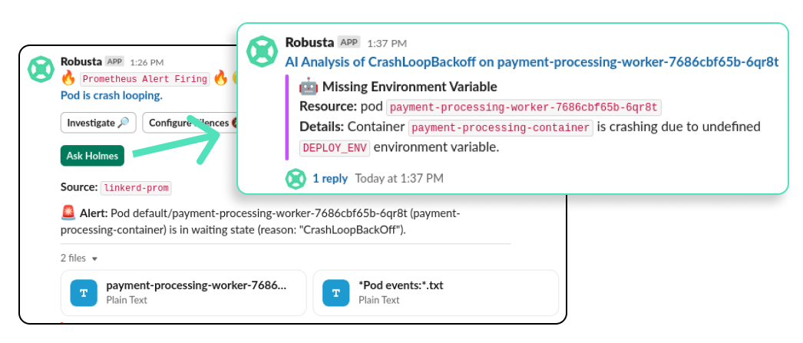
*官方文档：[AI Analysis](https://docs.robusta.dev/reports-docs/configuration/ai-analysis.html) — Slack 内告警 + AI 根因结论。*

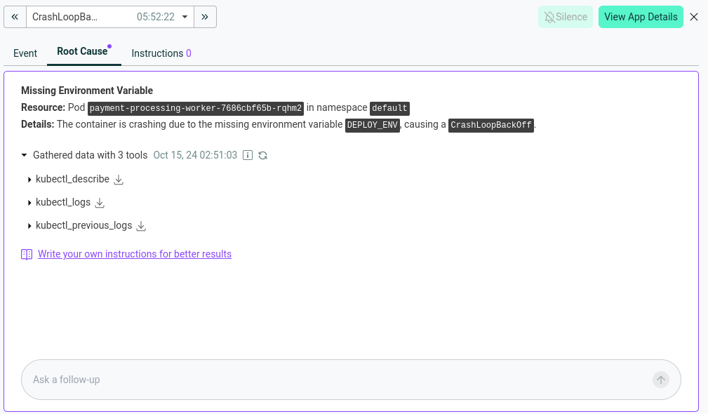
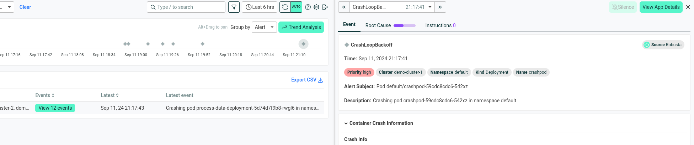
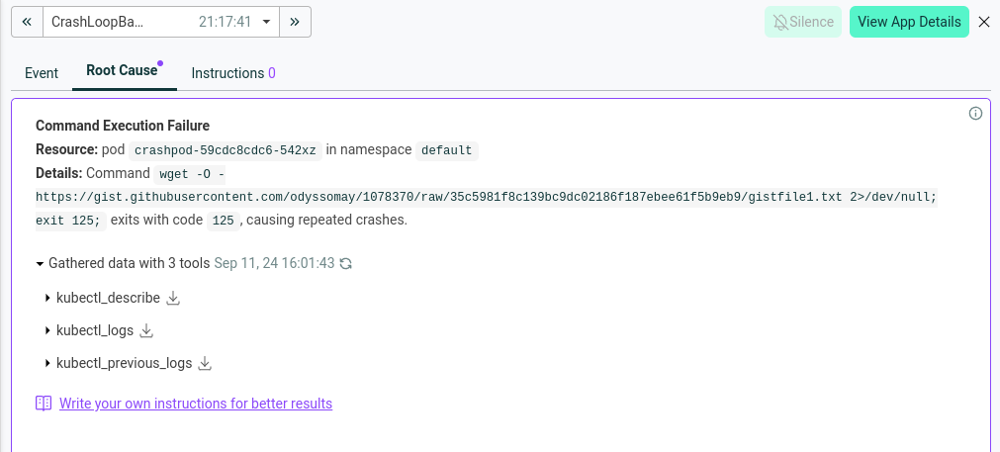

### BigPanda：AIOps 控制台 + AI Incident Assistant

事件合并控制台（hero 图），每个事件有 AI 助手生成摘要、根因、相似历史事件。

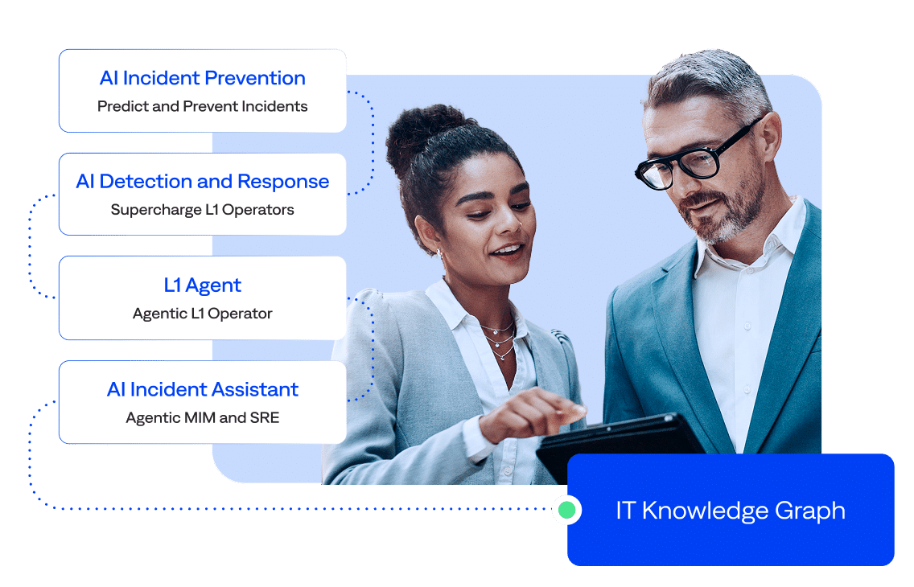
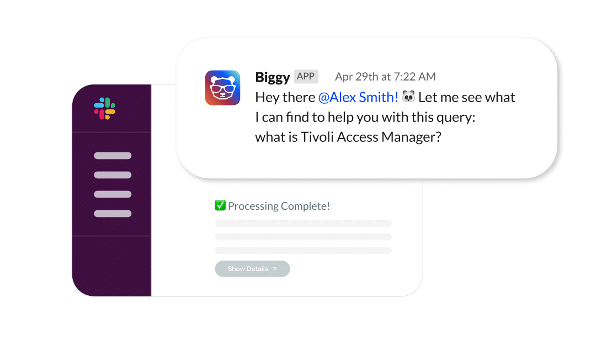
*来源：https://www.bigpanda.io/product*

### incident.io：AI 调查/响应

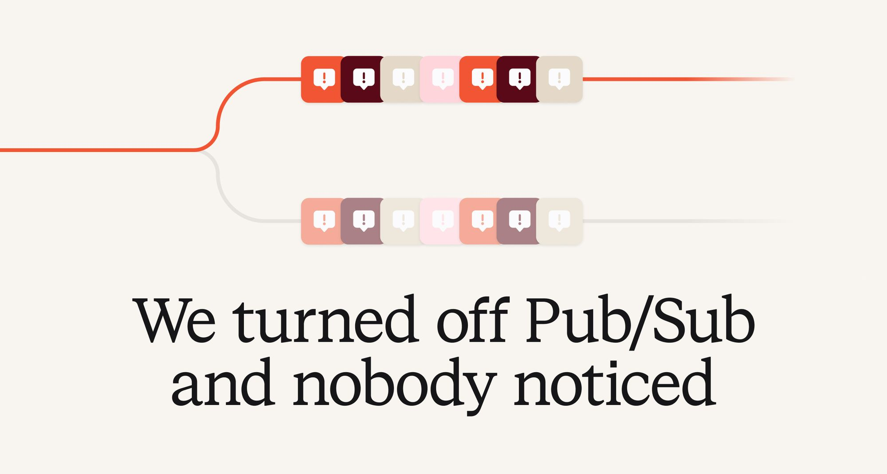
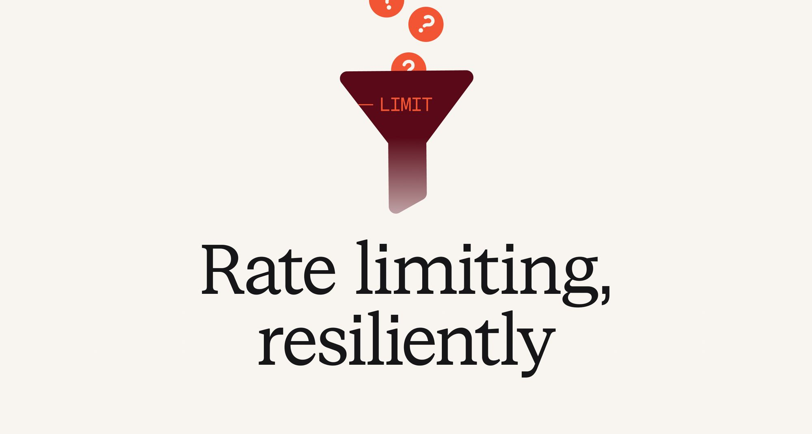
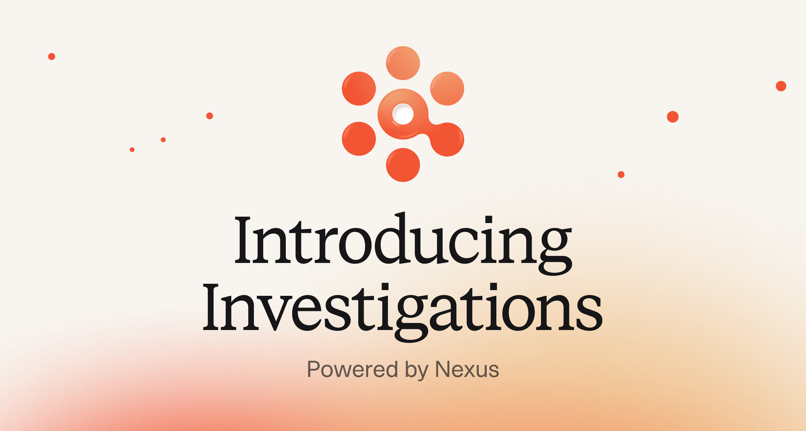
*来源：https://incident.io/ai-platform*

### 落地建议（alert-web）

- 事件/Run 详情页（CaseDetailPanel / RunDetailView）顶部固定**总结卡**：一句话结论 + 置信度 + 关键证据（学 Robusta 的「结论先行」）。
- 总结卡下方：根因、影响资源、建议动作、完整报告链接。

## 3. 评测页：token / 准确度等指标展示

**业界答案是「是」**：Langfuse 和 Datadog LLM Observability 都把运行质量评分（accuracy 等）与 token/延迟/错误率放在同一套 trace UI 里——评分挂在每次 trace 上，并单独有评分分析页看趋势。

### Langfuse：评分分析 + 会话视图（评分挂在 trace 上）

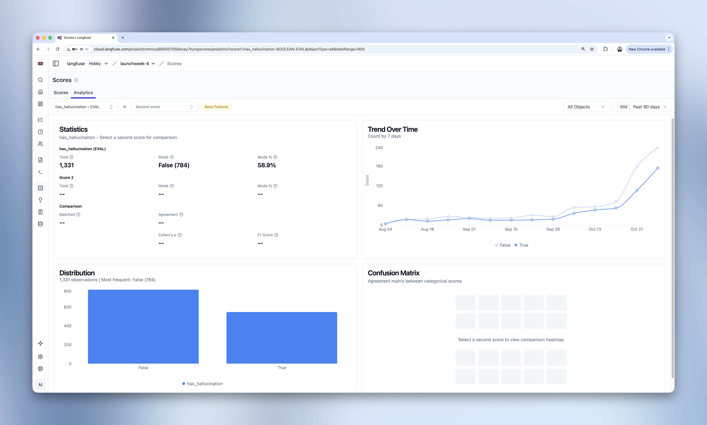
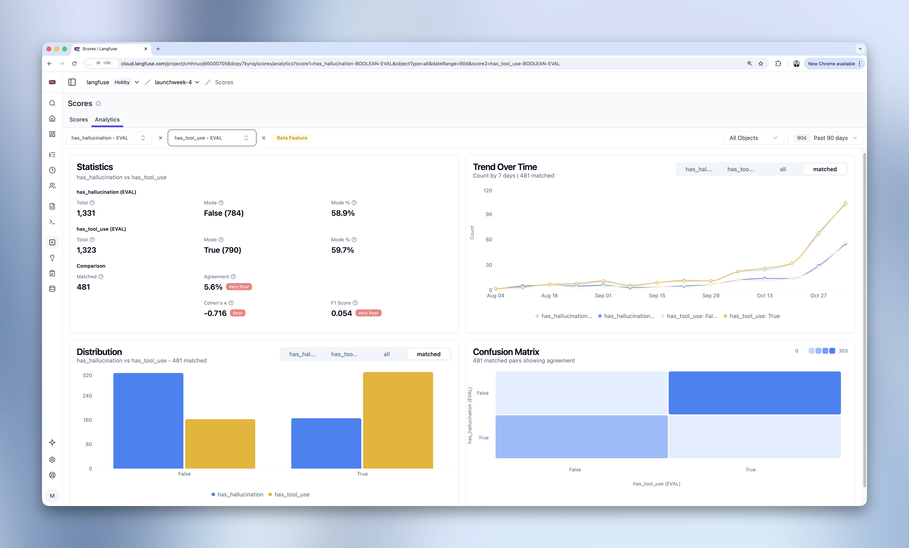
*官方文档：[Score analytics](https://langfuse.com/docs/evaluation/scores/score-analytics) — 按评分名看准确度趋势、分布，支持跨版本/模型对比。*

*官方文档：[Sessions](https://langfuse.com/docs/observability/features/sessions) — 一个会话内多轮 trace 卡片，每张带 accuracy/hallucination/helpfulness 评分标签。*

### Datadog LLM Observability：开箱即用看板（token + 错误率 + 成功率）

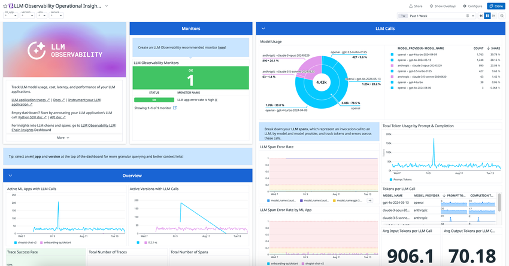
*官方文档：https://docs.datadoghq.com/llm_observability/ — LLM 调用总数 4.43k、各模型占比、Token 用量按 prompt/completion 拆分、平均输入/输出 token（906.1/70.18）、Span 错误率、Trace 成功率。*

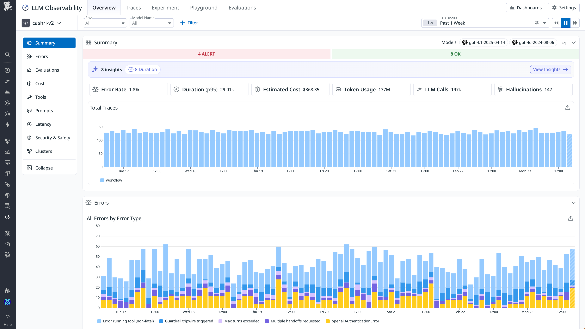
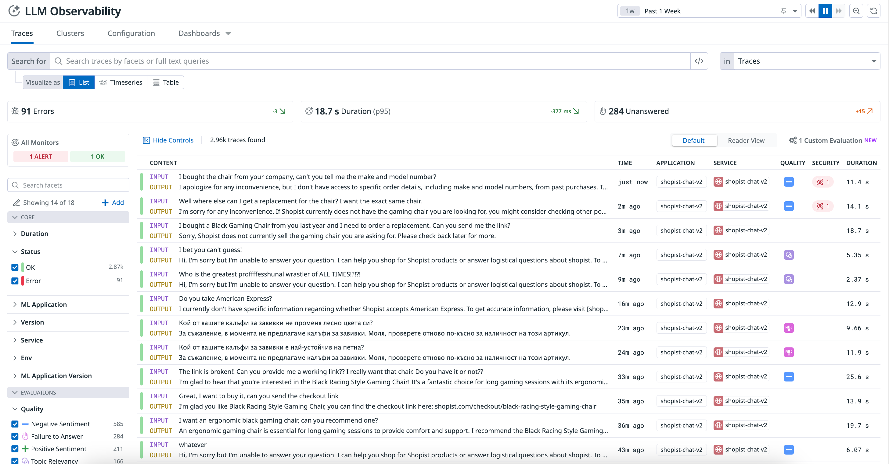

### 落地建议（alert-web）

- 评测页（EvalView）分两层：**运行明细**（每条 RCA run 一行：报告链接、评分、token、耗时）+ **评分分析**（准确度/一致率随时间、按模型/数据集对比——直接对标 Langfuse Score Analytics）。
- 监控指标不单独做页：token/延迟/错误率直接进评测页顶部看板（学 Datadog OOB dashboard）。

## 4. Token 消耗粒度：每个环节 + 每个任务总量

### Langfuse 的三级模型（最完整的参考）

**span（环节）→ trace（一次运行）→ session（任务/会话）**，每级都有 token/成本：

*官方文档：[Tracing](https://langfuse.com/docs/tracing) — trace 列表 + span 树，每个 span 显示延迟（12.98s、6.55s…）。span 即「环节」。*

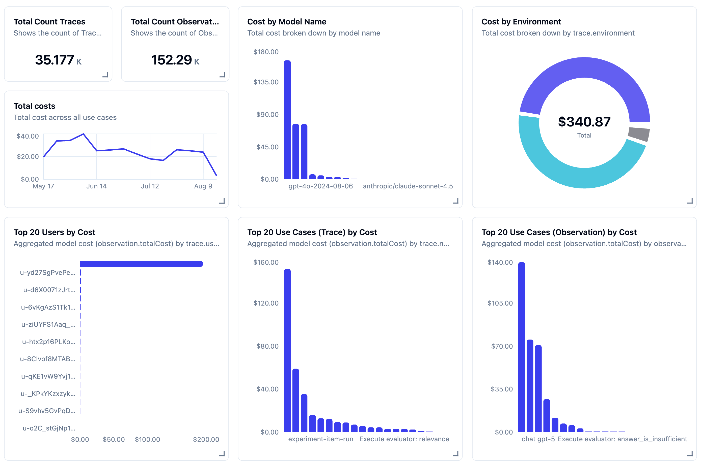
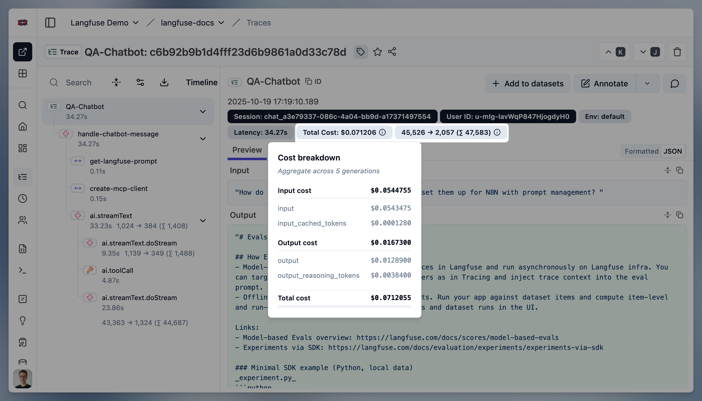
*官方文档：[Token & cost tracking](https://langfuse.com/docs/observability/features/token-and-cost-tracking) — 按模型/日期聚合 token 与成本。*

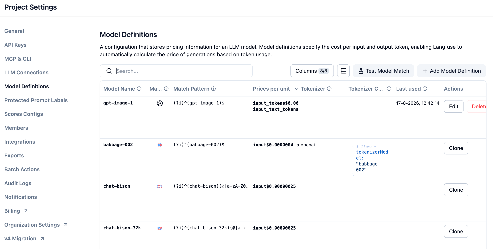
*模型定义里配单价，系统自动算成本。*

### 落地建议（alert-web / control-app）

数据模型上我们已有天然对应物：

| 业界概念 | 我们的对应 |
|---------|-----------|
| trace（一次运行） | `rca_run`（一次告警任务的 RCA 运行） |
| span（环节） | RunDag 的每个 pipeline 阶段（DAG ≥3 步） |
| session（任务） | 一个 incident / 告警任务的全部 run |
| score | 评测结果（准确度等）挂在 run 上 |

- 每个阶段记录 `input_tokens / output_tokens / cost / latency`，run 汇总为总 token，incident 维度再聚合（= Langfuse session 的总 token/成本）。
- Run 详情页：DAG 图上直接标每阶段 token（学 Langfuse span 树），顶部显示该 run 总 token + 总成本。
- 评测页/监控看板按模型、按日期聚合（学 Langfuse cost dashboard / Datadog OOB dashboard）。

---

## 截图清单（24 张）

| 文件 | 内容 | 来源 |
|------|------|------|
| live-grafana-alert-rules.png | 告警规则列表（状态筛选 Firing/Normal/Pending/Recovering）【实机】 | play.grafana.org/alerting/list |
| live-grafana-play-alert-list.png | Alert List 面板（Firing 火焰/Normal 对勾）【实机】 | play.grafana.org/d/bdodlcyou483ke |
| grafana-alert-list-panel.png | Alert List 面板文档图 | grafana.com/docs |
| pagerduty-incidents-page.webp | 事件队列（状态标签/优先级/负责人） | support.pagerduty.com |
| pagerduty-incidents-all-teams.webp | 事件页（团队筛选） | support.pagerduty.com |
| robusta-holmes-investigation.png | Slack 告警 + HolmesGPT 根因卡片 | docs.robusta.dev |
| robusta-ai-root-cause.png | AI 根因分析 Tab | docs.robusta.dev |
| robusta-ai-analysis-demo-1/2.png | AI 分析完整演示 | docs.robusta.dev |
| bigpanda-platform-hero.png | AIOps 控制台 | bigpanda.io/product |
| bigpanda-ai-incident-assistant.png | AI Incident Assistant | bigpanda.io/product |
| incidentio-ai-1/2/3 | AI 响应/调查产品图 | incident.io/ai-platform |
| langfuse-trace-detail.png | trace 列表 + span 树（每环节延迟） | langfuse.com/docs/tracing |
| langfuse-session-tokens.png | 会话视图（多 trace + 评分） | langfuse.com/docs（sessions） |
| langfuse-score-analytics-single/compare.png | 评分分析（准确度趋势/对比） | langfuse.com/docs（score analytics） |
| langfuse-cost-tracking-dashboard.png | 成本看板 | langfuse.com/docs（token & cost） |
| langfuse-costs-and-usage.png | 用量与成本示例 | 同上 |
| langfuse-model-definitions.png | 模型定价配置 | 同上 |
| datadog-llmobs-dashboard.png | OOB 看板（token 拆分/错误率） | docs.datadoghq.com/llm_observability |
| datadog-llmobs-overview.png | LLM Obs 总览 | 同上 |
| datadog-llmobs-traces.png | trace 列表 | 同上 |

## 参考链接

- Grafana 告警状态机：https://grafana.com/docs/grafana/latest/alerting/fundamentals/alert-rule-evaluation/
- Grafana Alert List 面板：https://grafana.com/docs/grafana/latest/visualizations/panels-visualizations/visualizations/alert-list/
- PagerDuty 事件：https://support.pagerduty.com/main/docs/incidents 、https://support.pagerduty.com/main/docs/navigate-the-incidents-page
- Robusta HolmesGPT：https://docs.robusta.dev/reports-docs/configuration/ai-analysis.html 、https://holmesgpt.dev/ 、https://github.com/HolmesGPT/holmesgpt
- Langfuse：https://langfuse.com/docs/observability/features/token-and-cost-tracking 、https://langfuse.com/docs/observability/features/sessions 、https://langfuse.com/docs/evaluation/scores/score-analytics 、https://langfuse.com/docs/tracing
- Datadog LLM Observability：https://docs.datadoghq.com/llm_observability/
- BigPanda：https://www.bigpanda.io/product
- incident.io：https://incident.io/ai-platform 、https://incident.io/investigations
